# 6 决策树和集成学习

本章涵盖

+   决策树和决策树学习算法

+   随机森林：将多个树组合成一个模型

+   梯度提升作为组合决策树的另一种方法

在第三章中，我们描述了二元分类问题，并使用逻辑回归模型来预测客户是否会流失。

在本章中，我们同样解决一个二元分类问题，但我们使用的是不同系列的机器学习模型：基于树的模型。决策树，最简单的基于树的模型，不过是一系列的条件-结果规则组合。我们可以将多个决策树组合成一个集成，以实现更好的性能。我们介绍了两种基于树的集成模型：随机森林和梯度提升。

本章我们准备的项目是违约预测：我们预测客户是否会无法偿还贷款。我们学习如何使用 Scikit-learn 训练决策树和随机森林模型，并探索 XGBoost——一个实现梯度提升模型的库。

## 6.1 信用风险评分项目

想象我们是一家银行的员工。当我们收到一个贷款申请时，我们需要确保如果我们提供资金，客户将能够偿还。每个申请都存在一种违约风险——即无法偿还资金。

我们希望最小化这种风险：在同意提供贷款之前，我们想要对客户进行评分并评估违约的可能性。如果风险太高，我们拒绝申请。这个过程被称为“信用风险评分”。

机器学习可以用于计算风险。为此，我们需要一个包含贷款的数据库，其中对于每个申请，我们知道它是否成功偿还。使用这些数据，我们可以构建一个预测违约概率的模型，并可以使用这个模型来评估未来借款人无法偿还资金的风险。

这是本章我们要做的事情：使用机器学习来计算违约风险。项目的计划如下：

+   首先，我们获取数据并进行一些初步预处理。

+   接下来，我们使用 Scikit-learn 训练一个决策树模型来预测违约概率。

+   之后，我们解释了决策树是如何工作的，以及模型有哪些参数，并展示了如何调整这些参数以获得最佳性能。

+   然后我们将多个决策树组合成一个模型——随机森林。我们查看其参数并调整它们以实现最佳的预测性能。

+   最后，我们探索将决策树组合的另一种方式——梯度提升。我们使用 XGBoost，这是一个高效的库，实现了梯度提升。我们将训练一个模型并调整其参数。

信用风险评分是一个二元分类问题：如果客户违约，目标为正（“1”），否则为负（“0”）。为了评估我们的解决方案，我们将使用 AUC（ROC 曲线下面积），这在第四章中已介绍。AUC 描述了我们的模型将案例区分成正例和负例的能力。

本项目的代码可在本书的 GitHub 仓库中找到（[`github.com/alexeygrigorev/mlbookcamp-code`](https://github.com/alexeygrigorev/mlbookcamp-code) 中的 chapter-06-trees 文件夹）。

### 6.1.1 信用评分数据集

对于本项目，我们使用加泰罗尼亚理工大学数据挖掘课程的数据集（[`www.cs.upc.edu/~belanche/Docencia/mineria/mineria.html`](https://www.cs.upc.edu/~belanche/Docencia/mineria/mineria.html)）。该数据集描述了客户（资历、年龄、婚姻状况、收入和其他特征）、贷款（请求的金额、物品的价格）及其状态（已偿还或未偿还）。

我们使用可在 GitHub 上找到的此数据集的副本（[`github.com/gastonstat/CreditScoring/`](https://github.com/gastonstat/CreditScoring/)）。让我们下载它。

首先，为我们的项目创建一个文件夹（例如，chapter-06-credit-risk），然后使用 `wget` 获取它：

```
wget https://github.com/gastonstat/CreditScoring/raw/master/CreditScoring.csv
```

或者，您可以将链接输入浏览器并保存到项目文件夹中。

接下来，如果尚未启动，请启动 Jupyter Notebook 服务器：

```
jupyter notebook
```

进入项目文件夹，创建一个新的笔记本（例如，chapter-06-credit-risk）。

如常，我们首先导入 Pandas、NumPy、Seaborn 和 Matplotlib：

```
import pandas as pd
import numpy as np

import seaborn as sns
from matplotlib import pyplot as plt
%matplotlib inline
```

在我们按下 Ctrl-Enter 后，库被导入，我们就可以使用 Pandas 读取数据了：

```
df = pd.read_csv('CreditScoring.csv')
```

现在数据已加载，因此让我们先初步查看它，看看在使用之前是否需要进行任何预处理。

### 6.1.2 数据清理

要使用数据集完成任务，我们需要查找数据中的任何问题并修复它们。

让我们从查看由 `df.head()` 函数生成的 DataFrame 的前几行开始（图 6.1）。

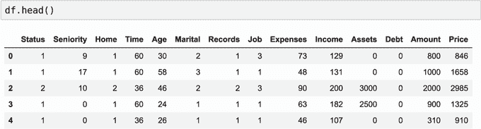

图 6.1 信用评分数据集的前五行

首先，我们可以看到所有列名都以大写字母开头。在执行其他任何操作之前，让我们将所有列名转换为小写，并使其与其他项目保持一致（图 6.2）：

```
df.columns = df.columns.str.lower()
```

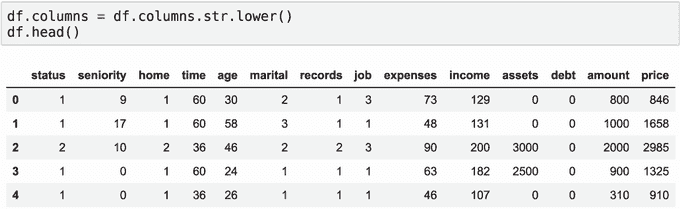

图 6.2 列名为小写的 DataFrame

我们可以看到 DataFrame 有以下列：

+   status: 客户是否成功偿还贷款（1）或未偿还（2）

+   seniority: 工作经验（年）

+   home: 房屋所有权类型：租房（1），房主（2），以及其他

+   time: 贷款计划期（月）

+   age: 客户的年龄

+   marital [status]: 单身（1），已婚（2），以及其他

+   records: 客户是否有任何先前记录：没有（1），有（2）（从数据集描述中不清楚这一列中有什么样的记录。为了本项目的目的，我们可能假设它是指银行数据库中的记录。）

+   职业：工作类型：全职（1），兼职（2）和其他

+   支出：客户每月的花费

+   收入：客户每月的收入

+   资产：客户所有资产的总价值

+   信贷债务：信用债务金额

+   金额：贷款请求的金额

+   价格：客户想要购买的商品的价格

尽管大多数列都是数值型，但也有一些是分类型：状态、住所、婚姻[状态]、记录和职业。然而，我们在 DataFrame 中看到的是数字，而不是字符串。这意味着我们需要将它们转换为它们的实际名称。在包含数据集的 GitHub 仓库中有一个脚本，可以将数字解码为类别（[`github.com/gastonstat/CreditScoring/blob/master/Part1_CredScoring_ Processing.R`](https://github.com/gastonstat/CreditScoring/blob/master/Part1_CredScoring_Processing.R)）。最初，这个脚本是用 R 编写的，因此我们需要将其转换为 Pandas。

我们从状态列开始。值“1”表示“OK”，值“2”表示“default”，而“0”表示该值缺失——让我们用“unk”（代表“unknown”）来替换它。

在 Pandas 中，我们可以使用`map`将数字转换为字符串。为此，我们首先定义一个字典，将当前值（数字）映射到所需值（字符串）：

```
status_values = {
    1: 'ok',
    2: 'default',
    0: 'unk'
}
```

现在，我们可以使用这个字典来进行映射：

```
df.status = df.status.map(status_values)
```

这会创建一个新的序列，我们立即将其写回 DataFrame。结果，状态列中的值被覆盖，看起来更有意义（图 6.3）。

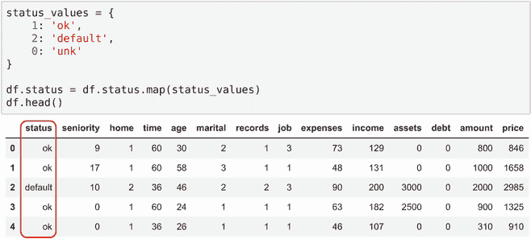

图 6.3 为了将状态列中的原始值（数字）转换为更有意义的表示（字符串），我们使用`map`方法。

我们对其他所有列重复相同的步骤。首先，我们将对住所列进行操作：

```
home_values = {
    1: 'rent',
    2: 'owner',
    3: 'private',
    4: 'ignore',
    5: 'parents',
    6: 'other',
    0: 'unk'
}

df.home = df.home.map(home_values)
```

接下来，让我们为婚姻、记录和职业列进行操作：

```
marital_values = {
    1: 'single',
    2: 'married',
    3: 'widow',
    4: 'separated',
    5: 'divorced',
    0: 'unk'
}

df.marital = df.marital.map(marital_values)

records_values = {
    1: 'no',
    2: 'yes',
    0: 'unk'
}

df.records = df.records.map(records_values)

job_values = {
    1: 'fixed',
    2: 'parttime',
    3: 'freelance',
    4: 'others',
    0: 'unk'
}

df.job = df.job.map(job_values)
```

经过这些转换后，包含分类变量的列包含的是实际值，而不是数字（图 6.4）。


图 6.4 将分类变量的值从整数转换为字符串。

作为下一步，让我们看一下数值列。首先，让我们检查每个列的摘要统计信息：最小值、平均值、最大值等。要做到这一点，我们可以使用 DataFrame 的`describe`方法：

```
df.describe().round()
```

注意：`describe`命令的输出可能会让人困惑。在我们的例子中，存在像 1.000000e+08 或 8.703625e+06 这样的科学记数法值。为了强制 Pandas 使用不同的表示法，我们使用`round`：它会移除数字的小数部分并将其四舍五入到最接近的整数。

这让我们对每个列中值的分布情况有了大致的了解（图 6.5）。

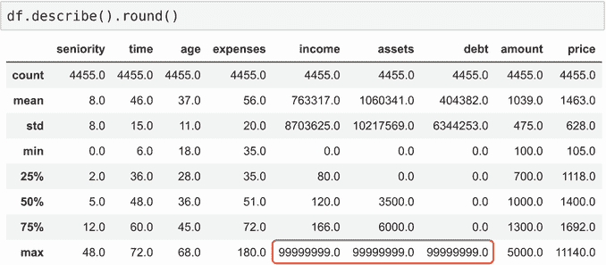

图 6.5 数据框中所有数值列的摘要。我们注意到其中一些列的最大值是 99999999。

我们立即注意到，在某些情况下最大值是`99999999`。这相当可疑。实际上，这是一个人工值——这就是在这个数据集中缺失值是如何编码的。

有三个列存在这个问题：收入、资产和债务。让我们将这些大数字替换为 NaN：

```
for c in ['income', 'assets', 'debt']:
    df[c] = df[c].replace(to_replace=99999999, value=np.nan)
```

我们使用`replace`方法，它接受两个值：

+   `to_replace:` 原始值（在我们的案例中是“99999999”）

+   `value:` 目标值（在我们的案例中是“NaN”）

经过这种转换后，汇总统计中不再出现可疑的数字（图 6.6）。

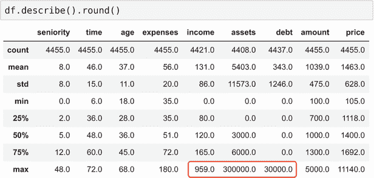

图 6.6 替换大值后的汇总统计

在完成数据集准备之前，让我们看看我们的目标变量`status`：

```
df.status.value_counts()
```

`value_counts`的输出显示了每个值的计数：

```
ok         3200
default    1254
unk           1
Name: status, dtype: int64
```

注意到有一行状态为“未知”：我们不知道这位客户是否成功偿还了贷款。对于我们的项目来说，这一行没有用，所以让我们从数据集中移除它：

```
df = df[df.status != 'unk']
```

在这种情况下，我们实际上并没有“移除”它：我们创建了一个新的 DataFrame，其中不包含状态为“未知”的记录。

通过查看数据，我们已经识别出数据中的一些重要问题，并解决了它们。

对于这个项目，我们跳过像第二章（汽车价格预测项目）和第三章（客户流失预测项目）中那样更详细的数据探索，但你也可以自由地重复我们在那里覆盖的步骤。

### 6.1.3 数据集准备

现在我们的数据集已经清理完毕，我们几乎准备好用它进行模型训练了。在我们能够这样做之前，我们还需要做几步：

+   将数据集分割为训练集、验证集和测试集。

+   处理缺失值。

+   使用独热编码对分类变量进行编码。

+   创建特征矩阵 *X* 和目标变量 *y* 。

让我们先开始分割数据。我们将数据分成三个部分：

+   训练数据（原始数据集的 60%）

+   验证数据（20%）

+   测试数据（20%）

同样，我们将使用 Scikit-learn 中的`train_test_split`。因为我们不能一次将其分成三个数据集，所以我们需要分两次（图 6.7）。首先，我们将 20%的数据保留用于测试，然后剩下的 80%将分为训练集和验证集：

```
from sklearn.model_selection import train_test_split

df_train_full, df_test = train_test_split(df, test_size=0.2, random_state=11)
df_train, df_val = train_test_split(df_train_full, test_size=0.25, random_state=11)
```


图 6.7 因为`train_test_split`只能将数据集分成两部分，但我们需要三部分，所以我们进行了两次分割。

第二次分割时，我们将 25%的数据放在一边，而不是 20%（`test_size=0.25`）。因为`df_train_full`包含 80%的记录，四分之一（即 25%）的 80%对应于原始数据集的 20%。

为了检查数据集的大小，我们可以使用`len`函数：

```
len(df_train), len(df_val), len(df_test)
```

运行时，我们得到以下输出：

```
(2672, 891, 891)
```

因此，对于训练，我们将使用大约 2,700 个示例，几乎 900 个用于验证和测试。

我们想要预测的结果是`status`。我们将用它来训练模型，所以它是我们的*y*——目标变量。因为我们的目标是确定某人是否未能偿还贷款，所以正类是`default`。这意味着如果客户违约，*y*是“1”，否则是“0”。这很简单就可以实现：

```
y_train = (df_train.status == 'default').values
y_val = (df_val.status == 'default').values
```

现在，我们需要从 DataFrames 中移除`status`。如果我们不这样做，我们可能会意外地使用这个变量进行训练。为此，我们使用`del`运算符：

```
del df_train['status']
del df_val['status']
```

接下来，我们将处理*X*——特征矩阵。

从初步分析中，我们知道我们的数据包含缺失值——是我们自己添加的 NaN。我们可以用零替换缺失值：

```
df_train = df_train.fillna(0)
df_val = df_val.fillna(0)
```

要使用分类变量，我们需要对它们进行编码。在第三章中，我们应用了独热编码技术。在独热编码中，每个值如果存在（“hot”）则编码为“1”，如果不存在（“cold”）则编码为“0”。为了实现它，我们使用了 Scikit-learn 的`DictVectorizer`。

`DictVectorizer`需要一个字典列表，所以我们需要首先将 DataFrames 转换为这种格式：

```
dict_train = df_train.to_dict(orient='records')
dict_val = df_val.to_dict(orient='records')
```

结果中的每个字典代表 DataFrame 中的一行。例如，`dict_train`中的第一个记录看起来是这样的：

```
{'seniority': 10,
 'home': 'owner',
 'time': 36,
 'age': 36,
 'marital': 'married',
 'records': 'no',
 'job': 'freelance',
 'expenses': 75,
 'income': 0.0,
 'assets': 10000.0,
 'debt': 0.0,
 'amount': 1000,
 'price': 1400}
```

这个字典列表现在可以用作`DictVectorizer`的输入：

```
from sklearn.feature_extraction import DictVectorizer

dv = DictVectorizer(sparse=False)

X_train = dv.fit_transform(dict_train)
X_val = dv.transform(dict_val)
```

结果，我们有了训练集和验证集的特征矩阵。请参阅第三章，了解更多关于使用 Scikit-learn 进行独热编码的细节。

现在，我们已经准备好训练一个模型了！在下一节中，我们将介绍最简单的树模型：决策树。

## 6.2 决策树

*决策树*是一种编码一系列 if-then-else 规则的数据结构。树中的每个节点包含一个条件。如果条件得到满足，我们就走向树的右侧；否则，我们走向左侧。最终我们到达最终决策（图 6.8）。

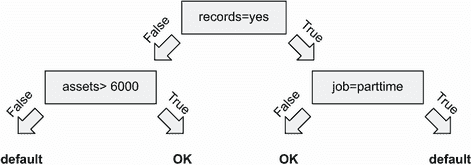

图 6.8 决策树由具有条件的节点组成。如果一个节点的条件得到满足，我们就走向右侧；否则，我们走向左侧。

在 Python 中将决策树表示为一系列`if-else`语句非常简单。例如：

```
def assess_risk(client):
    if client['records'] == 'yes':
        if client['job'] == 'parttime':
            return 'default'
        else:
            return 'ok'
    else:
        if client['assets'] > 6000:
            return 'ok'
        else:
            return 'default' 
```

通过机器学习，我们可以自动从数据中提取这些规则。让我们看看我们如何做到这一点。

### 6.2.1 决策树分类器

我们将使用 Scikit-learn 来训练决策树。因为我们正在解决一个分类问题，所以我们需要使用`tree`包中的`DecisionTreeClassifier`。让我们导入它：

```
from sklearn.tree import DecisionTreeClassifier
```

训练模型就像调用`fit`方法一样简单：

```
dt = DecisionTreeClassifier()
dt.fit(X_train, y_train)
```

为了检查结果是否良好，我们需要评估模型在验证集上的预测性能。让我们使用 AUC（ROC 曲线下的面积）来做这件事。

信用风险评估是一个二元分类问题，对于这种情况，AUC 是最佳评估指标之一。如您在第四章中回忆的那样，AUC 显示了模型将正例与负例分开的好坏程度。它有一个很好的解释：它描述了随机选择的一个正例（“违约”）的分数高于随机选择的一个负例（“正常”）的概率。这是一个与项目相关的指标：我们希望风险客户比非风险客户有更高的分数。有关 AUC 的更多详细信息，请参阅第四章。

同样，我们将使用 Scikit-learn 的实现，所以让我们导入它：

```
from sklearn.metrics import roc_auc_score
```

首先，我们在训练集上评估性能。因为我们选择了 AUC 作为评估指标，我们需要分数而不是硬预测。正如我们在第三章中了解的那样，我们需要使用`predict_proba`方法：

```
y_pred = dt.predict_proba(X_train)[:, 1]
roc_auc_score(y_train, y_pred)
```

当我们执行它时，我们看到分数是 100%——完美的分数。这意味着我们可以无误差地预测违约吗？在得出结论之前，让我们先检查一下验证集上的分数：

```
y_pred = dt.predict_proba(X_val)[:, 1]
roc_auc_score(y_val, y_pred)
```

运行后，我们看到验证集上的 AUC 只有 65%。

我们刚刚观察到一个过拟合的例子。这个树学得非常好，以至于它简单地记住了每个客户的结局。然而，当我们将其应用于验证集时，模型失败了。它从数据中提取的规则对训练集来说过于具体，因此在训练期间没有看到的客户上表现不佳。在这种情况下，我们说模型不能*泛化*。

当我们有一个复杂且足够强大的模型来记住所有训练数据时，就会发生过拟合。如果我们迫使模型更简单，我们可以使其更弱，并提高模型泛化的能力。

我们有多种方法可以控制树的复杂性。一个选项是限制其大小：我们可以指定`max_depth`参数，它控制最大层数。树具有的层次越多，它能够学习的规则就越复杂（见图 6.9）。

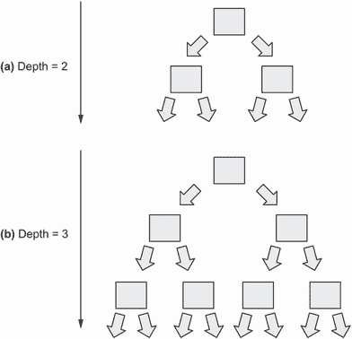

图 6.9 一个具有更多层次的树可以学习更复杂的规则。一个具有两个层次的树比具有三个层次的树更简单，因此更不容易过拟合。

`max_depth`参数的默认值是`None`，这意味着树可以尽可能大。我们可以尝试一个更小的值，并比较结果。

例如，我们可以将其更改为 2：

```
dt = DecisionTreeClassifier(max_depth=2)
dt.fit(X_train, y_train)
```

为了可视化我们刚刚学习的树，我们可以使用`tree`包中的`export_text`函数：

```
from sklearn.tree import export_text 

tree_text = export_text(dt, feature_names=dv.feature_names_)
print(tree_text)
```

我们只需要使用`feature_names`参数指定特征的名称。我们可以从`DictVectorizer`中获取它。当我们打印出来时，我们得到以下内容：

```
|--- records=no <= 0.50
|   |--- seniority <= 6.50
|   |   |--- class: True
|   |--- seniority >  6.50
|   |   |--- class: False
|--- records=no >  0.50
|   |--- job=parttime <= 0.50
|   |   |--- class: False
|   |--- job=parttime >  0.50
|   |   |--- class: True
```

输出中的每一行都对应一个具有条件的节点。如果条件为真，我们就进入并重复这个过程，直到我们到达最终决策。最后，如果类别是`True`，则决策是“违约”，否则是“正常”。

条件 `records=no` `>` `0.50` 意味着客户没有记录。回想一下，我们使用 one-hot 编码用两个特征来表示 `records`：`records=yes` 和 `records=no`。对于一个没有记录的客户，`records=no` 被设置为“1”，而 `records=yes` 被设置为“0”。因此，“`records=no` `>` `0.50`”在 `records` 的值为 `no` 时为真（图 6.10）。

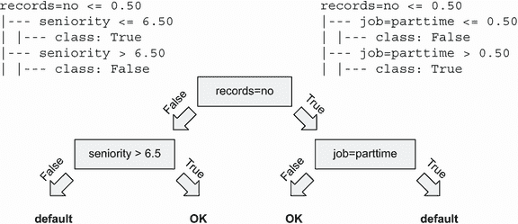

图 6.10 将 `max_depth` 设置为 2 时我们学习的树

让我们检查分数：

```
y_pred = dt.predict_proba(X_train)[:, 1]
auc = roc_auc_score(y_train, y_pred)
print('train auc', auc)

y_pred = dt.predict_proba(X_val)[:, 1]
auc = roc_auc_score(y_val, y_pred)
print('validation auc', auc)
```

我们看到训练分数下降了：

```
train auc: 0.705
val auc: 0.669
```

之前，训练集上的性能是 100%，但现在只有 70.5%。这意味着模型不能再记住训练集中的所有结果。

然而，验证集上的分数更好：66.9%，比之前的结果（65%）有所提高。通过使其更简单，我们提高了模型泛化的能力。现在它更好地预测它之前未见过的客户的结局。

然而，这棵树还有一个问题——它太简单了。为了使其更好，我们需要调整模型：尝试不同的参数，看看哪些参数能导致最佳的 AUC。除了 `max_depth`，我们还可以控制其他参数。为了了解这些参数的含义以及它们如何影响模型，让我们退一步，看看决策树是如何从数据中学习规则的。

### 6.2.2 决策树学习算法

要了解决策树如何从数据中学习，让我们简化这个问题。首先，我们将使用一个包含仅一个特征：`assets` 的更小的数据集（图 6.11）。

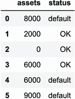

图 6.11 一个包含一个特征：`assets` 的较小数据集。目标变量是 `status`。

第二，我们将生长一个非常小的树，只有一个节点。

数据集中我们只有一个特征：`assets`。这就是为什么节点中的条件将是 `assets` `>` `T`，其中 *T* 是我们需要确定的阈值。如果条件为真，我们将预测“OK”，如果为假，我们的预测将是“default”（图 6.12）。


图 6.12 一个只有一个节点的简单决策树。该节点包含一个条件 `assets` `>` `T`。我们需要找到 *T* 的最佳值。

条件 `assets` `>` `T` 被称为 *split*。它将数据集分为两组：满足条件的数据点和不满足条件的数据点。

如果 `T` 是 4000，那么我们就有资产超过 $4,000 的客户（在右侧）和资产少于 $4,000 的客户（在左侧）（图 6.13）。

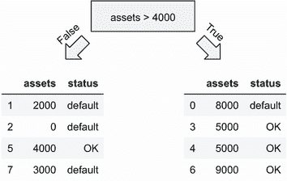

图 6.13 节点中的条件将数据集分为两部分：满足条件的数据点（在右侧）和不满足条件的数据点（在左侧）。

现在，我们将这些组转换为 *leaves*——决策节点——通过在每个组中取最频繁的状态并将其用作最终决策。在我们的例子中，“default”是左侧组中最频繁的结果，“OK”在右侧（图 6.14）。

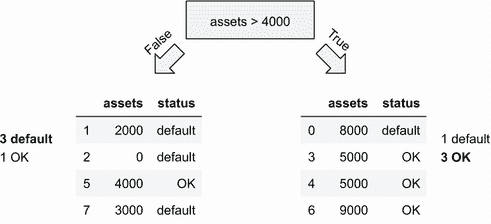

图 6.14 左侧最频繁的结果是“default”。对于右侧的组，结果是“OK”。

因此，如果一个客户的资产超过$4,000，我们的决策是“OK”，否则是“default” `assets` `>` `4000`（图 6.15）。

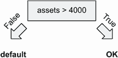

图 6.15 通过将每个组的最大频率结果分配给叶子节点，我们得到最终的决策树

杂质度

这些组应尽可能同质。理想情况下，每个组应只包含一个类的观测值。在这种情况下，我们称这些组为*纯*。

例如，如果我们有一个包含四个客户的结果组[“default”，“default”，“default”，“default”]，它是纯的：它只包含违约的客户。但一个组[“default”，“default”，“default”，“OK”]是不纯的：有一个客户没有违约。

当训练决策树模型时，我们希望找到这样的 *T*，使得两组的 *杂质度* 最小。

因此，寻找 *T* 的算法相当简单：

+   尝试所有可能的 *T* 值。

+   对于每个 *T*，将数据集分为左右两组并测量它们的杂质度。

+   选择具有最低杂质度的 *T*。

我们可以使用不同的标准来衡量杂质度。最容易理解的是 *误分类率*，它表示一个组中有多少观测值不属于多数类。

注意：Scikit-learn 使用更先进的分割标准，如熵和基尼杂质度。我们在这本书中没有涵盖它们，但思想是相同的：它们测量分割的杂质度程度。

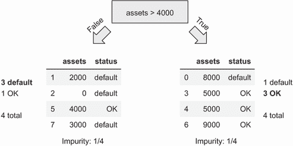

图 6.16 对于 `assets` `>` `4000`，两组的误分类率都是四分之一。

让我们计算分割 *T* = 4000 的误分类率（图 6.16）：

+   对于左侧组，多数类是“default”。总共有四个数据点，其中有一个不属于“default”。误分类率是 25%（1/4）。

+   对于右侧组，“OK”是多数类，有一个“default”。因此，误分类率也是 25%（1/4）。

+   为了计算分割的整体杂质度，我们可以对两组取平均值。在这种情况下，平均值为 25%。

注意：在实际中，我们不是简单地跨两组取平均值，而是按比例对每个组进行加权平均——我们按其大小成比例地加权每个组。为了简化计算，我们在这章中使用简单平均。

*T* = 4000 不是 `assets` 的唯一可能分割。让我们尝试其他 *T* 值，例如 2000、3000 和 5000（图 6.17）：

+   对于 *T* = 2000，左侧的杂质度为 0%（0/2，所有都是“default”），右侧的杂质度为 33.3%（2/6，6 个中的 2 个是“default”，其余是“OK”）。平均值为 16.6%。

+   对于 *T* = 3000，左侧为 0%，右侧为 20%（1/5）。平均值为 10%。

+   对于 *T* = 5000，左侧的 50%（3/6）和右侧的 50%（1/2）。平均值为 50%。

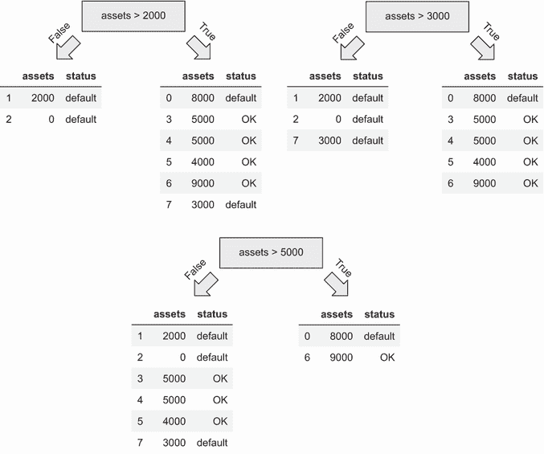

图 6.17 除了 `assets` `>` `4000`，我们还可以尝试其他 *T* 的值，例如 2000、3000 和 5000。

当 *T* = 3000 时，最佳平均不纯度为 10%：左边的树没有错误，而右边的树只有一个（五行中的一行）。因此，我们应该选择 3000 作为我们最终模型的阈值（图 6.18）。

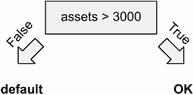

图 6.18 对于这个数据集，最好的分割是 `assets` `>` `3000`。

选择最佳的分割特征

现在让我们使问题变得更加复杂，并向数据集添加另一个特征：`debt`（图 6.19）。

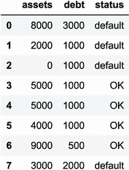

图 6.19 包含两个特征的数据集：`assets` 和 `debt`。目标变量是 `status`。

之前我们只有一个特征：`assets`。我们确信它将被用于分割数据。现在我们有两个特征，因此除了选择最佳的分割阈值外，我们还需要弄清楚使用哪个特征。

解决方案很简单：我们尝试所有特征，并为每个特征选择最佳阈值。

让我们修改训练算法以包括这个变化：

+   对于每个特征，尝试所有可能的阈值。

+   对于每个阈值值 *T*，测量分割的不纯度。

+   选择具有可能最低不纯度的特征和阈值。

让我们将这个算法应用于我们的数据集：

+   我们已经确定对于 `assets`，最好的 *T* 是 3000。这个分割的平均不纯度为 10%。

+   对于 `debt`，最好的 *T* 是 1000。在这种情况下，平均不纯度为 17%。

因此，最好的分割是 `asset` `>` `3000`（图 6.20）。

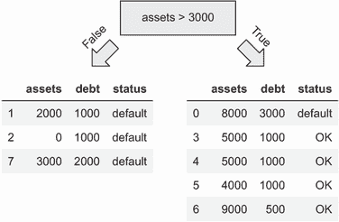

图 6.20 最好的分割是 `assets` `>` `3000`，其平均不纯度为 10%。

左边的群组已经纯净，但右边的群组不是。我们可以通过重复这个过程来减少其不纯度：再次分割它！

当我们将相同的算法应用于右侧的数据集时，我们发现最好的分割条件是 `debt` `>` `1000`。现在树中有两个层级——或者说，我们可以这样说，这个树的深度是 2（图 6.21）。

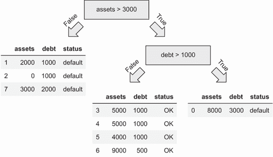

图 6.21 通过递归地重复算法到右边的群组，我们得到一个有两个层级的树。

在决策树准备好之前，我们需要做最后一步：将群组转换为决策节点。为此，我们取每个群组中最频繁的状态。这样，我们得到一个决策树（图 6.22）。

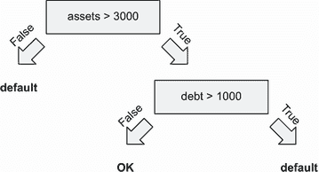

图 6.22 群组已经纯净，所以最频繁的状态就是每个群组唯一的状态。我们将这个状态作为每个叶节点的最终决策。

停止标准

当训练决策树时，我们可以继续分割数据，直到所有群组都是纯净的。这正是当我们不对 Scikit-learn 中的树进行任何限制时发生的情况。正如我们所看到的，得到的模型变得过于复杂，这导致了过拟合。

我们通过使用 `max_depth` 参数解决了这个问题——我们限制了树的大小，不让它长得太大。

要决定是否继续分割数据，我们使用*停止标准*——描述是否应在树中添加另一个分割或停止的标准。

最常见的停止标准是

+   组已经纯净。

+   树达到了深度限制（由`max_depth`参数控制）。

+   组太小，无法继续分割（由`min_samples_leaf`参数控制）。

通过使用这些标准提前停止，我们迫使我们的模型更简单，从而降低过拟合的风险。

让我们利用这些信息来调整训练算法：

+   找到最佳分割点：

    +   对每个特征尝试所有可能的阈值值。

    +   使用具有最低不纯度的算法。

+   如果达到最大允许深度，则停止。

+   如果左侧的组足够大且尚未纯净，则在左侧重复。

+   如果右侧的组足够大且尚未纯净，则在右侧重复。

尽管这是一个简化的决策树学习算法版本，但它应该足以让你对学习过程的内部有足够的直觉。

最重要的是，我们知道两个参数控制着模型的复杂性。通过改变这些参数，我们可以提高模型的表现。

练习 6.1

我们有一个包含 10 个特征的数据集，需要向该数据集添加另一个特征。训练速度会发生什么变化？

a) 添加一个特征后，训练时间会更长。

b) 特征数量不会影响训练速度。

### 6.2.3 决策树参数调整

寻找最佳参数集的过程称为*参数调整*。我们通常通过改变模型并检查其在验证数据集上的分数来完成此操作。最后，我们使用具有最佳验证分数的模型。

正如我们刚刚学到的，我们可以调整两个参数：

+   `max_depth`

+   `min_leaf_size`

这两个是最重要的，所以我们只调整它们。您可以在官方文档中检查其他参数（[`scikit-learn.org/stable/modules/generated/sklearn.tree.DecisionTreeClassifier.html`](https://scikit-learn.org/stable/modules/generated/sklearn.tree.DecisionTreeClassifier.html)）。

在我们之前训练模型时，我们将树的深度限制为 2，但没有触及`min_leaf_size`。这样，我们在验证集上得到了 66%的 AUC。

让我们找到最佳参数。

我们首先调整`max_depth`。为此，我们迭代几个合理的值，看看哪个效果最好：

```
for depth in [1, 2, 3, 4, 5, 6, 10, 15, 20, None]:
    dt = DecisionTreeClassifier(max_depth=depth)
    dt.fit(X_train, y_train)
    y_pred = dt.predict_proba(X_val)[:, 1]
    auc = roc_auc_score(y_val, y_pred)
    print('%4s -> %.3f' % (depth, auc))
```

值`None`表示没有对深度的限制，因此树将尽可能生长。

当我们运行此代码时，我们看到`max_depth`为 5 时给出了最佳的 AUC（76.6%），其次是 4 和 6（图 6.23）。

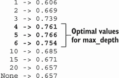

图 6.23 深度的最佳值为 5（76.6%），其次是 4（76.1%）和 6（75.4%）。

接下来，我们调整`min_leaf_size`。为此，我们对`max_depth`的三个最佳参数进行迭代，并对每个参数，遍历不同的`min_leaf_size`值：

```
for m in [4, 5, 6]:
    print('depth: %s' % m)

    for s in [1, 5, 10, 15, 20, 50, 100, 200]:
        dt = DecisionTreeClassifier(max_depth=m, min_samples_leaf=s)
        dt.fit(X_train, y_train)
        y_pred = dt.predict_proba(X_val)[:, 1]
        auc = roc_auc_score(y_val, y_pred)
        print('%s -> %.3f' % (s, auc))

    print()
```

运行后，我们看到最佳的 AUC 为 78.5%，参数为`min_sample_leaf=15`和`max_depth=6`（表 6.1）。

注意：正如我们所见，我们用于`min_leaf_size`的值会影响`max_depth`的最佳值。你可以尝试更广泛的`max_depth`值范围来进一步调整性能。

表 6.1 对于不同`min_leaf_size`（行）和`max_depth`（列）值的验证集上的 AUC

|  | depth=4 | depth=5 | depth=6 |
| --- | --- | --- | --- |
| 1 | 0.761 | 0.766 | 0.754 |
| 5 | 0.761 | 0.768 | 0.760 |
| 10 | 0.761 | 0.762 | 0.778 |
| 15 | 0.764 | 0.772 | **0.785** |
| 20 | 0.761 | 0.774 | 0.774 |
| 50 | 0.753 | 0.768 | 0.770 |
| 100 | 0.756 | 0.763 | 0.776 |
| 200 | 0.747 | 0.759 | 0.768 |

我们已经找到了最佳参数，所以让我们使用它们来训练最终的模型：

```
dt = DecisionTreeClassifier(max_depth=6, min_samples_leaf=15)
dt.fit(X_train, y_train)
```

决策树是简单而有效的模型，但当我们组合多个树时，它们变得更加强大。接下来，我们将看到如何实现它以获得更好的预测性能。

## 6.3 随机森林

假设我们没有机器学习算法来帮助我们进行信用风险评估。相反，我们有一组专家。

每个专家可以独立决定是否批准贷款申请或拒绝它。单个专家可能会犯错误。然而，所有专家一起决定接受申请，但客户未能偿还金钱的可能性较小。

因此，我们可以独立地询问所有专家，然后将他们的意见合并成最终的决策，例如，通过使用多数投票（图 6.24）。

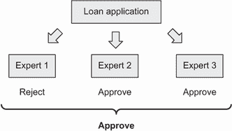

图 6.24 一组专家的决策比单个专家的决策更好。

这个想法也适用于机器学习。单个模型可能错误，但如果我们将多个模型的输出组合成一个，错误答案的可能性更小。这个概念被称为*集成学习*，模型的组合被称为*集成*。

为了使这可行，模型需要不同。如果我们训练同一个决策树模型 10 次，它们都会预测相同的输出，所以这完全没有用。

要有不同的模型，最简单的方法是训练每棵树在不同的特征子集上。例如，假设我们有三个特征：“资产”、“负债”和“价格”。我们可以训练三个模型：

+   第一个将使用“资产”和“负债”。

+   第二个将使用“负债”和“价格”。

+   最后一个将使用“资产”和“价格”。

采用这种方法，我们将有不同的树，每棵树都会做出自己的决策（图 6.25）。但是，当我们把他们的预测放在一起时，他们的错误会平均化，结合起来，它们具有更强的预测能力。

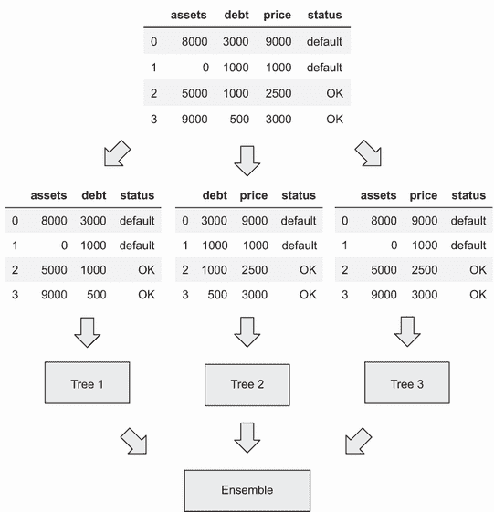

图 6.25 我们想要组合的集成模型不应该相同。我们可以通过在每个树的不同特征子集上训练来确保它们不同。

将多个决策树组合成一个集成的方式称为*随机森林*。为了训练随机森林，我们可以这样做（图 6.26）：

+   训练*N*个独立的决策树模型。

+   对于每个模型，选择一个随机特征子集，并仅使用这些特征进行训练。

+   在预测时，将*N*个模型的输出组合在一起。

注意：这是一个非常简化的算法版本。它足以说明主要思想，但在现实中，它更复杂。

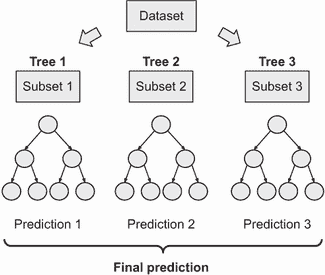

图 6.26 训练随机森林模型：对于每个树的训练，随机选择一个特征子集。在做出最终预测时，将所有预测组合在一起。

Scikit-learn 包含随机森林的实现，因此我们可以用它来解决我们的问题。让我们试试。

### 6.3.1 训练随机森林

在 Scikit-learn 中使用随机森林，我们需要从`ensemble`包中导入`RandomForestClassifier`：

```
from sklearn.ensemble import RandomForestClassifier
```

在训练模型时，我们首先需要指定我们想要在集成中拥有的树的数量。我们通过`n_estimators`参数来完成：

```
rf = RandomForestClassifier(n_estimators=10)
rf.fit(X_train, y_train)
```

训练完成后，我们可以评估结果：

```
y_pred = rf.predict_proba(X_val)[:, 1]
roc_auc_score(y_val, y_pred)
```

它显示 77.9%。然而，你看到的数字可能不同。每次我们重新训练模型，分数都会变化：它在 77%到 80%之间变化。

原因是随机化：为了训练一棵树，我们随机选择一个特征子集。为了使结果一致，我们需要通过将某个值分配给`random_state`参数来固定随机数生成器的种子：

```
rf = RandomForestClassifier(n_estimators=10, random_state=3)
rf.fit(X_train, y_train)
```

现在我们可以评估它：

```
y_pred = rf.predict_proba(X_val)[:, 1]
roc_auc_score(y_val, y_pred)
```

这次，我们得到了 78%的 AUC。无论我们重新训练模型多少次，这个分数都不会改变。

集成中的树的数量是一个重要的参数，它影响模型的性能。通常，具有更多树的模型比具有较少树的模型更好。另一方面，添加过多的树并不总是有帮助。

为了看到我们需要多少棵树，我们可以遍历不同的`n_estimators`值，并查看其对 AUC 的影响：

```
aucs = []                                                       ❶

for i in range(10, 201, 10):                                    ❷
    rf = RandomForestClassifier(n_estimators=i, random_state=3) ❷
    rf.fit(X_train, y_train)                                    ❷

    y_pred = rf.predict_proba(X_val)[:, 1]                      ❸
    auc = roc_auc_score(y_val, y_pred)                          ❸
    print('%s -> %.3f' % (i, auc))                              ❸

    aucs.append(auc)                                            ❹
```

❶ 创建一个包含 AUC 结果的列表

❷ 在每次迭代中逐步训练更多的树

❸ 评估分数

❹ 将分数添加到其他分数的列表中

在这段代码中，我们尝试不同的树的数量：从 10 到 200，以 10 为步长（10，20，30，...）。每次我们训练一个模型，我们都在验证集上计算其 AUC，并记录下来。

完成后，我们可以绘制结果：

```
plt.plot(range(10, 201, 10), aucs)
```

在图 6.27 中，我们可以看到结果。

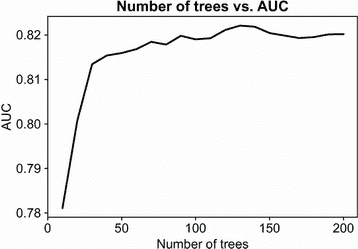

图 6.27 不同`n_estimators`参数值的随机森林模型性能

性能在前 25-30 棵树时迅速增长；然后增长放缓。在 130 棵树之后，添加更多的树不再有帮助：性能大约保持在 82%的水平。

树的数量并不是我们为了获得更好的性能可以更改的唯一参数。接下来，我们看看还有哪些其他参数我们应该调整以改进模型。

### 6.3.2 随机森林的参数调整

随机森林集成由多个决策树组成，因此我们需要调整随机森林的最重要参数是相同的：

+   `max_depth`

+   `min_leaf_size`

我们可以更改其他参数，但在此章节中不会详细讨论。有关更多信息，请参阅官方文档（[`scikit-learn.org/ stable/modules/generated/sklearn.ensemble.RandomForestClassifier.html`](https://scikit-learn.org/stable/modules/generated/sklearn.ensemble.RandomForestClassifier.html)）。

让我们从`max_depth`开始。我们已经知道这个参数显著影响决策树的表现。对于随机森林也是如此：较大的树比较小的树更容易过拟合。

让我们测试几个`max_depth`的值，看看随着树的数量增长，AUC 如何演变：

```
all_aucs = {}                                     ❶

for depth in [5, 10, 20]:                         ❷
    print('depth: %s' % depth)
    aucs = []                                     ❸

    for i in range(10, 201, 10):                  ❸
        rf = RandomForestClassifier(n_estimators=i,
              max_depth=depth, random_state=1)    ❹
        rf.fit(X_train, y_train)
        y_pred = rf.predict_proba(X_val)[:, 1]
        auc = roc_auc_score(y_val, y_pred)        ❺
        print('%s -> %.3f' % (i, auc))            ❺
        aucs.append(auc)                          ❺

    all_aucs[depth] = aucs                        ❻
    print()
```

❶ 创建一个包含 AUC 结果的字典

❷ 遍历不同的深度值

❸ 为当前深度级别创建一个包含 AUC 结果的列表

❹ 遍历不同的 n_estimator 值

❺ 评估模型

❻ 将当前深度级别的 AUC 保存到字典中

现在对于每个`max_depth`的值，我们有一系列 AUC 分数。我们可以现在绘制它们：

```
num_trees = list(range(10, 201, 10))
plt.plot(num_trees, all_aucs[5], label='depth=5')
plt.plot(num_trees, all_aucs[10], label='depth=10')
plt.plot(num_trees, all_aucs[20], label='depth=20')
plt.legend()
```

在图 6.28 中我们看到结果。

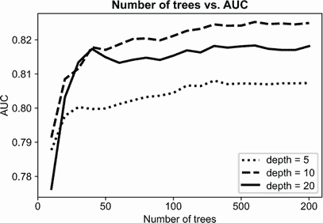

图 6.28 不同`max_depth`参数值的随机森林性能

当`max_depth=10`时，AUC 超过 82%，而对于其他值，表现较差。

现在让我们调整`min_samples_leaf`。我们将上一步中`max_depth`参数的值设置好，然后按照之前的方法确定`min_samples_leaf`的最佳值：

```
all_aucs = {}

for m in [3, 5, 10]:
    print('min_samples_leaf: %s' % m)
    aucs = []

    for i in range(10, 201, 20):
        rf = RandomForestClassifier(n_estimators=i, max_depth=10, min_samples_leaf=m, random_state=1)
        rf.fit(X_train, y_train)
        y_pred = rf.predict_proba(X_val)[:, 1]
        auc = roc_auc_score(y_val, y_pred)
        print('%s -> %.3f' % (i, auc))
        aucs.append(auc)

    all_aucs[m] = aucs
    print()
```

让我们绘制它：

```
num_trees = list(range(10, 201, 20))
plt.plot(num_trees, all_aucs[3], label='min_samples_leaf=3')
plt.plot(num_trees, all_aucs[5], label='min_samples_leaf=5')
plt.plot(num_trees, all_aucs[10], label='min_samples_leaf=10')
plt.legend()
```

然后回顾结果（图 6.29）。

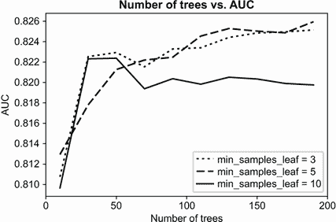

图 6.29 不同`min_samples_leaf`值（`max_depth=10`）的随机森林性能

我们看到对于小的`min_samples_leaf`值，AUC 略好，最佳值为 5。

因此，对于我们的问题，随机森林的最佳参数是

+   `max_depth=10`

+   `min_samples_leaf=5`

我们使用 200 棵树实现了最佳的 AUC，因此我们应该将`n_estimators`参数设置为 200。

让我们训练最终的模型：

```
rf = RandomForestClassifier(n_estimators=200, max_depth=10, min_samples_leaf=5, random_state=1)
```

随机森林并不是结合多个决策树的唯一方法。还有另一种方法：梯度提升。我们将在下一节中介绍。

练习 6.2

为了使集成有用，随机森林中的树应该彼此不同。这是通过以下方式实现的：

a) 为每棵单独的树选择不同的参数

b) 为每棵树随机选择不同的特征子集

c) 随机选择分割值

## 6.4 梯度提升

在随机森林中，每棵树都是独立的：它是在不同的特征集上训练的。在单独的树训练完成后，我们将它们的决策组合起来以获得最终的决策。

然而，这并不是将多个模型组合在一起的一种唯一方法。另一种方法是按顺序训练模型——每个后续模型都试图纠正前一个模型的错误：

+   训练第一个模型。

+   查看它所犯的错误。

+   训练另一个模型来纠正这些错误。

+   再次查看错误；按顺序重复。

这种组合模型的方式被称为*提升*。*梯度提升*是这种方法的特定变体，它与树特别有效（见图 6.30）。

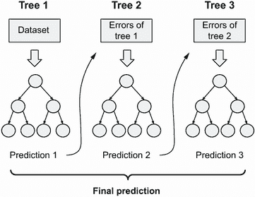

图 6.30 在梯度提升中，我们按顺序训练模型，每个后续的树都纠正前一个树的错误。

让我们看看我们如何用它来解决我们的问题。

### 6.4.1 XGBoost：极端梯度提升

我们有许多优秀的梯度提升模型实现：Scikit-learn 的`GradientBoostingClassifier`，XGBoost，LightGBM 和 CatBoost。在本章中，我们使用 XGBoost（代表“Extreme Gradient Boosting”），这是最受欢迎的实现。

XGBoost 不包含在 Anaconda 中，因此要使用它，我们需要安装它。最简单的方法是使用`pip`安装：

```
pip install xgboost
```

接下来，打开我们的项目笔记本并导入它：

```
import xgboost as xgb
```

注意：在某些情况下，导入 XGBoost 可能会给出类似于`YMLLoadWarning`的警告。你不必担心这个问题；库将无问题地工作。

在导入 XGBoost 时使用别名`xgb`是一种约定，就像在其他流行的 Python 机器学习包中一样。

在我们能够训练 XGBoost 模型之前，我们需要将我们的数据包装成`DMatrix`——一种用于高效查找分割的特殊数据结构。让我们来做这件事：

```
dtrain = xgb.DMatrix(X_train, label=y_train, feature_names=dv.feature_names_)
```

当创建一个`DMatrix`实例时，我们传递三个参数：

+   `X_train`：特征矩阵

+   `y_train`：目标变量

+   `feature_names`：`X_train`中特征的名字

让我们对验证数据集也做同样的事情：

```
dval = xgb.DMatrix(X_val, label=y_val, feature_names=dv.feature_names_)
```

下一步是指定训练参数。我们只使用 XGBoost 默认参数的一小部分（查看官方文档以获取参数完整列表：[`xgboost.readthedocs.io/en/latest/parameter.html`](https://xgboost.readthedocs.io/en/latest/parameter.html)）：

```
xgb_params = {
    'eta': 0.3,
    'max_depth': 6,
    'min_child_weight': 1,

    'objective': 'binary:logistic',
    'nthread': 8,
    'seed': 1,
    'silent': 1
}
```

对于我们来说，现在最重要的参数是`objective`：它指定了学习任务。我们正在解决一个二元分类问题——这就是为什么我们需要选择`binary :logistic`。我们将在本节的后面部分介绍这些参数的其余部分。

为了训练一个 XGBoost 模型，我们使用`train`函数。让我们从 10 棵树开始：

```
model = xgb.train(xgb_params, dtrain, num_boost_round=10)
```

我们向`train`函数提供了三个参数：

+   `xgb_params`：训练参数

+   `dtrain`：训练数据集（`DMatrix`的一个实例）

+   `num_boost_round=10`：要训练的树的数量

几秒钟后，我们得到一个模型。为了评估它，我们需要在验证数据集上进行预测。为此，使用`predict`方法，并将验证数据包装在`DMatrix`中：

```
y_pred = model.predict(dval)
```

结果`y_pred`是一个一维 NumPy 数组，包含预测：验证数据集中每个客户的预测风险分数（图 6.31）。

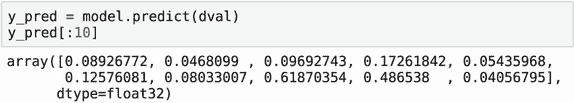

图 6.31 XGBoost 的预测

接下来，我们使用与之前相同的方法计算 AUC：

```
roc_auc_score(y_val, y_pred)
```

执行后，我们得到 81.5%。这是一个相当好的结果，但仍然略逊于我们最好的随机森林模型（82.5%）。

当我们可以看到随着树的数量增长，模型性能如何变化时，训练 XGBoost 模型会更简单。我们将在下一部分看到如何做到这一点。

### 6.4.2 模型性能监控

要了解随着树的数量增长，AUC 如何变化，我们可以使用 watchlist——XGBoost 内置的用于监控模型性能的功能。

watchlist 是一个包含元组的 Python 列表。每个元组包含一个 DMatrix 及其名称。我们通常这样做：

```
watchlist = [(dtrain, 'train'), (dval, 'val')]
```

此外，我们修改了训练参数列表：我们需要指定用于评估的指标。在我们的例子中，它是 AUC：

```
xgb_params = {
    'eta': 0.3,
    'max_depth': 6,
    'min_child_weight': 1,

    'objective': 'binary:logistic',
    'eval_metric': 'auc',            ❶
    'nthread': 8,
    'seed': 1,
    'silent': 1
}
```

❶ 将评估指标设置为 AUC

在训练期间使用 watchlist，我们需要为`train`函数指定两个额外的参数：

+   `evals`: watchlist。

+   `verbose_eval`: 打印指标的频率。如果我们将其设置为“10”，则每 10 步后我们会看到结果。

让我们来训练它：

```
model = xgb.train(xgb_params, dtrain,
                  num_boost_round=100,
                  evals=watchlist, verbose_eval=10)
```

在训练过程中，XGBoost 将分数打印到输出：

```
[0]  train-auc:0.862996  val-auc:0.768179
[10] train-auc:0.950021  val-auc:0.815577
[20] train-auc:0.973165  val-auc:0.817748
[30] train-auc:0.987718  val-auc:0.817875
[40] train-auc:0.994562  val-auc:0.813873
[50] train-auc:0.996881  val-auc:0.811282
[60] train-auc:0.998887  val-auc:0.808006
[70] train-auc:0.999439  val-auc:0.807316
[80] train-auc:0.999847  val-auc:0.806771
[90] train-auc:0.999915  val-auc:0.806371
[99] train-auc:0.999975  val-auc:0.805457
```

随着树的数量增长，训练集上的分数上升（图 6.32）。

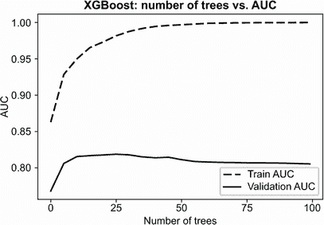

图 6.32 树的数量对训练集和验证集 AUC 的影响。要了解如何绘制这些值，请查看书中 GitHub 仓库中的笔记本。

这种行为是预期的：在提升中，每个后续模型都试图纠正前一个步骤中的错误，因此分数总是提高的。

然而，对于验证分数来说，情况并非如此。它最初会上升，但随后开始下降。这是过拟合的影响：我们的模型变得越来越复杂，直到它简单地记住整个训练集。这对预测训练集之外的客户结果没有帮助，验证分数反映了这一点。

我们在第 30 次迭代时获得了最佳的 AUC（81.7%），但这与第 10 次迭代获得的分数（81.5%）并没有太大区别。

接下来，我们将看到如何通过调整参数来获得 XGBoost 的最佳性能。

### 6.4.3 XGBoost 的参数调整

此前，我们使用默认参数的子集来训练模型：

```
xgb_params = {
    'eta': 0.3,
    'max_depth': 6,
    'min_child_weight': 1,
    'objective': 'binary:logistic',
    'eval_metric': 'auc',
    'nthread': 8,
    'seed': 1,
    'silent': 1
}
```

我们主要对前三个参数感兴趣。这些参数控制训练过程：

+   `eta`: 学习率。决策树和随机森林没有这个参数。我们将在本节稍后调整它时介绍。

+   `max_depth`: 每棵树允许的最大深度；与 Scikit-learn 中的`DecisionTreeClassifier`的`max_depth`相同。

+   `min_child_weight`: 每个组中最小观察数；与 Scikit-learn 中的`DecisionTreeClassifier`的`min_leaf_size`相同。

其他参数：

+   `objective`：我们想要解决的问题的类型。对于分类，它应该是`binary:logistic`。

+   `eval_metric`：我们用于评估的指标。对于这个项目，它是“AUC”。

+   `nthread`：我们用于训练模型的线程数。XGBoost 在并行化训练方面非常出色，所以将其设置为计算机的核心数。

+   `seed`：随机数生成器的种子；我们需要设置它以确保结果可重复。

+   `silent`：输出的详细程度。当我们将其设置为“1”时，它只输出警告。

这不是参数的完整列表，只是基本参数。你可以在官方文档中了解更多关于所有参数的信息（[`xgboost.readthedocs.io/en/latest/parameter.html`](https://xgboost.readthedocs.io/en/latest/parameter.html)）。

我们已经知道`max_depth`和`min_child_weight`（`min_leaf_size`），但我们之前没有遇到过`eta`——学习率参数。让我们来谈谈它，看看我们如何可以优化它。

学习率

在提升中，每一棵树都试图纠正前一次迭代的错误。学习率决定了这种纠正的权重。如果我们有一个大的`eta`值，纠正会显著地超过之前的预测。另一方面，如果值较小，只有一小部分这种纠正被使用。

在实践中，这意味着

+   如果`eta`太大，模型会过早地开始过拟合，而没有意识到其全部潜力。

+   如果它太小，我们需要训练很多树才能产生好的结果。

默认值 0.3 对于大数据集来说相当合理，但对我们这样的小数据集，我们应该尝试更小的值，如 0.1 甚至 0.05。

让我们试试看是否有助于提高性能：

```
xgb_params = {
    'eta': 0.1,       ❶
    'max_depth': 6,
    'min_child_weight': 1,

    'objective': 'binary:logistic',
    'eval_metric': 'auc',
    'nthread': 8,
    'seed': 1,
    'silent': 1
}
```

❶ 将`eta`从 0.3 改为 0.1

因为现在我们可以使用 watchlist 来监控我们模型的性能，我们可以训练尽可能多的迭代次数。之前我们使用了 100 次迭代，但这可能对于较小的`eta`来说不够。所以让我们用 500 轮进行训练：

```
model = xgb.train(xgb_params, dtrain,
                  num_boost_round=500, verbose_eval=10,
                  evals=watchlist)
```

当运行时，我们看到最佳的验证分数是 82.4%：

```
[60] train-auc:0.976407  val-auc:0.824456
```

之前，当`eta`设置为默认值 0.3 时，我们能够达到 81.7%的 AUC。让我们比较这两个模型（图 6.33）。

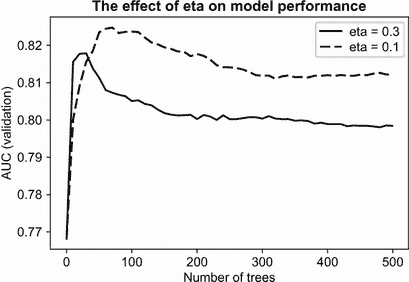

图 6.33 `eta`参数对验证分数的影响

当`eta`为 0.3 时，我们很快就能得到最佳的 AUC，但随后开始过拟合。在第 30 次迭代后，验证集上的性能下降。

当`eta`为 0.1 时，AUC 增长较慢，但峰值更高。对于较小的学习率，需要更多的树才能达到峰值，但我们可以实现更好的性能。

为了比较，我们还可以尝试其他`eta`的值（图 6.34）：

+   对于 0.05，最佳的 AUC 为 82.2%（经过 120 次迭代）。

+   对于 0.01，最佳的 AUC 是 82.1%（经过 500 次迭代）。

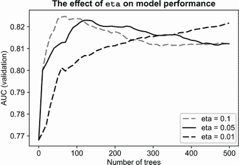

图 6.34 当`eta`较小时，模型需要更多的树。

当`eta`为 0.05 时，性能与 0.1 相似，但需要多 60 次迭代才能达到峰值。

对于`eta`为 0.01，它增长得太慢，即使经过 500 次迭代，也没有达到峰值。如果我们尝试更多的迭代，它可能达到与其他值相同的 AUC 水平。即使如此，这也不实用：在预测时间评估所有这些树变得计算成本高昂。

因此，我们使用`eta`的值为 0.1。接下来，让我们调整其他参数。

练习 6.3

我们有一个`eta=0.1`的梯度提升模型。它需要 60 棵树来达到最佳性能。如果我们把`eta`增加到 0.5，会发生什么？

a) 树的数量不会改变。

b) 模型需要更多的树来达到其最佳性能。

c) 模型需要更少的树来达到其最佳性能。

调整其他参数

下一个调整的参数是`max_depth`。默认值是 6，所以我们可以尝试

+   较低的值；例如，3

+   较高的值；例如，10

这个结果应该能让我们知道最佳`max_depth`值是在 3 到 6 之间还是 6 到 10 之间。

首先，检查 3：

```
xgb_params = {
    'eta': 0.1,
    'max_depth': 3,         ❶
    'min_child_weight': 1,

    'objective': 'binary:logistic',
    'eval_metric': 'auc',
    'nthread': 8,
    'seed': 1,
    'silent': 1
}
```

❶ 将 max_depth 从 6 改为 3

使用它我们能得到的最佳 AUC 是 83.6%。

接下来，尝试 10。在这种情况下，最佳值是 81.1%。

这意味着`max_depth`的最佳参数值应该在 3 到 6 之间。然而，当我们尝试 4 时，我们发现最佳 AUC 是 83%，这略低于 3 深度的 AUC（图 6.35）。

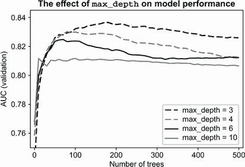

图 6.35 `max_depth`的最佳值是 4：使用它，我们可以达到 83.6%的 AUC。

下一个调整的参数是`min_child_weight`。它与 Scikit-learn 中的决策树中的`min_leaf_size`相同：它控制树在叶子节点中的最小观测数。

让我们尝试一系列值，看看哪个效果最好。除了默认值（1）外，我们还可以尝试 10 和 30（图 6.36）。

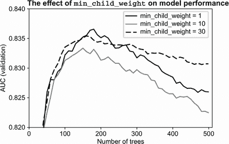

图 6.36 `min_child_weight`的最佳值是 1，但与其他参数值相比并没有显著不同。

从图 6.36 中我们可以看到

+   对于`min_child_weight=1`，AUC 为 83.6%。

+   对于`min_child_weight=10`，AUC 为 83.3%。

+   对于`min_child_weight=30`，AUC 为 83.5%。

这些选项之间的差异并不显著，所以我们将保留默认值。

我们最终模型的参数是

```
xgb_params = {
    'eta': 0.1,
    'max_depth': 3,
    'min_child_weight': 1,

    'objective': 'binary:logistic',
    'eval_metric': 'auc',
    'nthread': 8,
    'seed': 1,
    'silent': 1
}
```

在我们可以完成模型之前，我们需要做最后一步：我们需要选择最佳树的数量。这很简单：查看验证分数达到峰值时的迭代次数，并使用这个数字。

在我们的情况下，我们需要为最终模型训练 180 棵树（图 6.37）：

```
[160] train-auc:0.935513   val-auc:0.835536
[170] train-auc:0.937885   val-auc:0.836384
[180] train-auc:0.93971    val-auc:0.836565 <- best
[190] train-auc:0.942029   val-auc:0.835621
[200] train-auc:0.943343   val-auc:0.835124
```

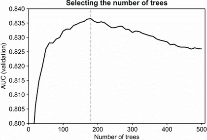

图 6.37 最终模型的最佳树数量是 180。

随机森林模型能得到的最佳 AUC 是 82.5%，而梯度提升模型能得到的最佳 AUC 是 1%更多（83.6%）。

这是最好的模型，所以让我们将其作为我们的最终模型——并且我们应该用它来评分贷款申请。

### 6.4.4 测试最终模型

我们几乎准备好使用它来进行风险评估。在我们能够使用它之前，我们还需要做两件事：

+   在结合了训练集和验证集的数据集上重新训练最终模型。我们不再需要验证集，因此我们可以使用更多的数据进行训练，这将使模型略微更好。

+   在测试集上测试模型。这是我们一开始就保留的数据的一部分。现在我们使用它来确保模型没有过拟合，并且能够在完全未见过的数据上表现良好。

下一步是：

+   将与`df_train`和`df_val`相同的预处理应用于`df_full_train`和`df_test`。结果，我们得到了特征矩阵`X_train`和`X_test`以及我们的目标变量`y_train`和`y_test`。

+   使用我们之前选择的参数在组合数据集上训练模型。

+   将模型应用于测试数据以获取测试预测。

+   确认模型表现良好且没有过拟合。

让我们开始吧。首先，创建目标变量：

```
y_train = (df_train_full.status == 'default').values
y_test = (df_test.status == 'default').values
```

因为我们使用整个 DataFrame 来创建特征矩阵，所以我们需要移除目标变量：

```
del df_train_full['status']
del df_test['status']
```

接下来，我们将 DataFrame 转换为字典列表，然后使用独热编码来获取特征矩阵：

```
dict_train = df_train_full.fillna(0).to_dict(orient='records')
dict_test = df_test.fillna(0).to_dict(orient='records')

dv = DictVectorizer(sparse=False)
X_train = dv.fit_transform(dict_train)
X_test = dv.transform(dict_test)
```

最后，我们使用之前确定的最优参数和这些数据来训练 XGBoost 模型：

```
dtrain = xgb.DMatrix(X_train, label=y_train, feature_names=dv.feature_names_)
dtest = xgb.DMatrix(X_test, label=y_test, feature_names=dv.feature_names_)

xgb_params = {
    'eta': 0.1,
    'max_depth': 3,
    'min_child_weight': 1,

    'objective': 'binary:logistic',
    'eval_metric': 'auc',
    'nthread': 8,
    'seed': 1,
    'silent': 1
}

num_trees = 160

model = xgb.train(xgb_params, dtrain, num_boost_round=num_trees)
```

然后在测试集上评估其性能：

```
y_pred_xgb = model.predict(dtest)
roc_auc_score(y_test, y_pred_xgb)
```

输出是 83.2%，这与验证集上的 83.6%的性能相当。这意味着我们的模型没有过拟合，并且可以很好地与它未见过的客户一起工作。

练习 6.4

随机森林和梯度提升之间的主要区别是

a) 在梯度提升中，树是按顺序训练的，并且每一棵后续的树都会改进前一棵树。在随机森林中，所有树都是独立训练的。

b) 梯度提升比使用随机森林要快得多。

c) 在随机森林中，树是按顺序训练的，并且每一棵后续的树都会改进前一棵树。在梯度提升中，所有树都是独立训练的。

## 6.5 下一步

我们已经学习了关于决策树、随机森林和梯度提升的基础知识。我们学到了很多，但在这个章节中我们所能涵盖的只是冰山一角。你可以通过做练习来进一步探索这个主题。

### 6.5.1 练习

+   特征工程是从现有特征中创建新特征的过程。对于这个项目，我们没有创建任何特征；我们只是使用了数据集中提供的那些。添加更多特征应该有助于提高我们模型的性能。例如，我们可以添加请求金额与物品总价的比率。尝试通过工程更多特征进行实验。

+   在训练随机森林时，我们通过为每棵树选择特征的一个随机子集来得到不同的模型。为了控制子集的大小，我们使用`max_features`参数。尝试调整此参数，看看它是否会影响验证集上的 AUC。

+   极端随机树（或简称 extra trees）是随机森林的一种变体，其中随机化的想法被推向了极致。它不是寻找最佳可能的分割点，而是随机选择分割条件。这种方法有几个优点：extra trees 训练更快，并且它们不太容易过拟合。另一方面，它们需要更多的树才能达到足够的性能。在 Scikit-learn 中，`ExtraTreesClassifier`来自`ensemble`包实现了它。在这个项目中尝试它。

+   在 XGBoost 中，`colsample_bytree`参数控制我们为每棵树选择的特征数量——它与随机森林中的`max_features`类似。尝试调整此参数，看看是否可以提高性能：尝试从 0.1 到 1.0 的值，步长为 0.1。通常最佳值在 0.6 到 0.8 之间，但有时 1.0 会给出最佳结果。

+   除了随机选择列（特征）之外，我们还可以选择行的一个子集（客户）。这被称为*子采样*，它有助于防止过拟合。在 XGBoost 中，`subsample`参数控制我们为每个集成树选择的示例比例。尝试从 0.4 到 1.0 的值，步长为 0.1。通常最佳值在 0.6 到 0.8 之间。

### 6.5.2 其他项目

+   所有基于树的模型都可以解决回归问题——预测一个数字。在 Scikit-learn 中，DecisionTreeRegressor 和 RandomForestRegressor 实现了模型的回归变体。在 XGBoost 中，我们需要将目标更改为`reg:squarederror`。使用这些模型来预测汽车价格，并尝试解决其他回归问题。

## 摘要

+   决策树是一个表示一系列 if-then-else 决策的模型。它很容易理解，并且在实践中表现也相当好。

+   我们通过选择最佳分割点来训练决策树，使用不纯度度量。我们控制的主要参数是树的深度和每个叶子的最大样本数。

+   随机森林是将许多决策树组合成一个模型的方法。就像一个专家团队一样，单个树可能会犯错，但在一起，它们不太可能做出错误的决策。

+   随机森林应该有一系列多样化的模型来进行良好的预测。这就是为什么模型中的每棵树都使用不同的特征集进行训练。

+   我们需要为随机森林更改的主要参数与决策树相同：树的深度和每个叶子的最大样本数。此外，我们还需要选择我们想要在集成中拥有的树的数量。

+   虽然在随机森林中树是独立的，但在梯度提升中，树是顺序的，每个后续模型都纠正前一个模型的错误。在某些情况下，这会导致更好的预测性能。

+   我们需要调整的梯度提升参数与随机森林类似：树的深度、叶子节点中最大观测数以及树的数量。除此之外，我们还有`eta`——学习率。它指定了每棵树对集成模型的贡献。

基于树的模型易于解释和理解，并且通常表现相当出色。梯度提升非常出色，通常在结构化数据（表格格式的数据）上实现最佳性能。

在下一章中，我们将探讨神经网络：一种不同类型的模型，与之前相比，它在非结构化数据（如图像）上实现最佳性能。

## 练习题答案

+   练习题 6.1 A) 添加一个更多特征后，训练时间会更长。

+   练习题 6.3 C) 该模型需要更少的树来达到其最佳性能。

+   练习题 6.2 B) 为每棵树随机选择不同的特征子集。

+   练习题 6.4 A) 梯度提升中的树是顺序训练的。在随机森林中，树是独立训练的。
