# 7 神经网络和深度学习

本章涵盖了

+   卷积神经网络用于图像分类

+   TensorFlow 和 Keras——构建神经网络的框架

+   使用预训练的神经网络

+   卷积神经网络的内部结构

+   使用迁移学习训练模型

+   数据增强——生成更多训练数据的过程

之前，我们只处理表格数据——CSV 文件中的数据。在本章中，我们将处理一种完全不同的数据类型——图像。

我们为本章准备的项目是衣服的分类。我们将预测一张衣服的图片是 T 恤、衬衫、裙子、连衣裙还是其他东西。

这是一个图像分类问题。为了解决它，我们将学习如何使用 TensorFlow 和 Keras 训练深度神经网络来识别衣服的类型。本章的材料将帮助您开始使用神经网络并执行任何类似的图像分类项目。

让我们开始吧！

## 7.1 时尚分类

想象一下，我们在一个在线时尚市场上工作。我们的用户每天上传成千上万张图片来销售他们的衣服。我们希望通过自动推荐合适的类别来帮助用户更快地创建商品列表。

要做到这一点，我们需要一个用于图像分类的模型。之前，我们介绍了多种分类模型：逻辑回归、决策树、随机森林和梯度提升。这些模型在处理表格数据时效果很好，但使用它们来处理图像相当困难。

为了解决我们的问题，我们需要一种不同类型的模型：卷积神经网络，这是一种专门用于图像的特殊模型。这些神经网络由许多层组成，这就是为什么它们通常被称为“深度”。深度学习是机器学习的一部分，它处理深度神经网络。

训练这些模型的框架也与我们之前看到的框架不同，因此在本章中我们使用 TensorFlow 和 Keras 而不是 Scikit-learn。

我们项目的计划是

+   首先，我们下载数据集并使用预训练的模型来分类图像。

+   然后，我们将讨论神经网络，并了解它们是如何在内部工作的。

+   之后，我们调整预训练的神经网络来解决我们的任务。

+   最后，我们通过从我们已有的图像中生成更多图像来扩展我们的数据集。

为了评估我们模型的质量，让我们使用准确率：我们正确分类的项目百分比。

在一个章节中不可能涵盖深度学习背后的所有理论。在本书中，我们专注于最基本的部分，这对于完成本章的项目和其他类似的图像分类项目已经足够。当我们遇到对完成此项目非必要的概念时，我们会参考 CS231n——斯坦福大学关于神经网络的课程。课程笔记可在[cs231n.github.io](https://cs231n.github.io/)上在线获取。

该项目的代码可在本书的 GitHub 仓库中找到，网址为 [`github.com/alexeygrigorev/mlbookcamp-code`](https://github.com/alexeygrigorev/mlbookcamp-code)，在 chapter-07-neural-nets 文件夹中。该文件夹中有多个笔记本。对于本章的大部分内容，我们需要 07-neural-nets-train.ipynb。对于 7.5 节，我们使用 07-neural-nets-test.ipynb。

### 7.1.1 GPU 与 CPU 对比

训练神经网络是一个计算密集型过程，需要强大的硬件来加快速度。为了加快训练速度，我们通常使用 GPU——图形处理单元，或者简单地说，显卡。

对于本章，不需要 GPU。你可以在你的笔记本电脑上完成所有操作，但没有 GPU，速度将比有 GPU 慢大约八倍。

如果你有一张 GPU 显卡，你需要从 TensorFlow 安装特殊的驱动程序来使用它。（有关详细信息，请参阅 TensorFlow 的官方文档：[`www.tensorflow.org/install/gpu`](https://www.tensorflow.org/install/gpu)。）或者，你可以租用一个预配置的 GPU 服务器。例如，我们可以使用 AWS SageMaker 来租用一个已经设置好的 Jupyter Notebook 实例。有关如何使用 SageMaker 的详细信息，请参阅附录 E。其他云服务提供商也有带 GPU 的服务器，但本书中不涉及它们。无论你使用什么环境，只要能安装 Python 和 TensorFlow，代码都可以在任何地方运行。

决定代码运行位置后，我们可以进行下一步：下载数据集。

### 7.1.2 下载服装数据集

首先，让我们为这个项目创建一个文件夹，并将其命名为 07-neural-nets。

对于这个项目，我们需要一个服装数据集。我们将使用服装数据集的一个子集（更多信息请查看 [`github.com/alexeygrigorev/clothing-dataset`](https://github.com/alexeygrigorev/clothing-dataset)），它包含大约 3,800 张 10 个不同类别的图片。数据可在 GitHub 仓库中找到。让我们克隆它：

```
git clone https://github.com/alexeygrigorev/clothing-dataset-small.git
```

如果你使用 AWS SageMaker 进行操作，你可以在笔记本的一个单元中执行此命令。只需在命令前加上感叹号（“！”）（图 7.1）。`

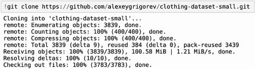

图 7.1 在 Jupyter 中执行 shell 脚本命令：只需在命令前加上感叹号（“！”）。

数据集已经按文件夹划分（图 7.2）：

+   训练集：用于训练模型的图片（3,068 张图片）

+   验证集：用于验证的图片（341 张图片）

+   测试集：用于测试的图片（372 张图片）


图 7.2 数据集已分为训练集、验证集和测试集。

每个文件夹都有 10 个子文件夹：每个子文件夹对应一种服装类型（图 7.3）。

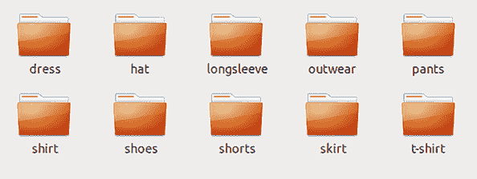

图 7.3 数据集中的图片按子文件夹组织。

如我们所见，这个数据集包含 10 类服装，从连衣裙和帽子到短裤和鞋子。

每个子文件夹只包含一个类别的图片（图 7.4）。

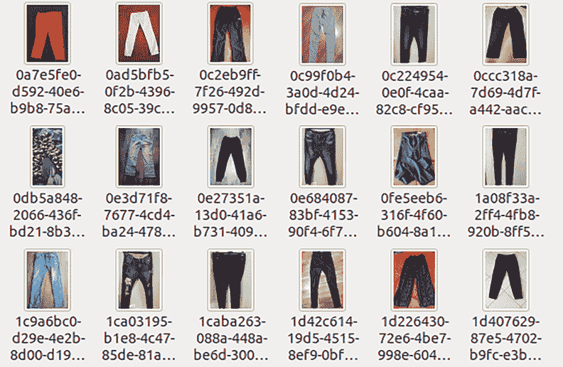

图 7.4 裤子文件夹的内容

在这些图片中，服装物品有不同的颜色，背景也不同。有些物品放在地板上，有些散布在床上或桌子上，有些则挂在无色背景前。

使用这些多样的图像，我们无法使用之前介绍的方法。我们需要一种特殊类型的模型：神经网络。此模型还需要不同的工具，我们将在下一章介绍。

### 7.1.3 TensorFlow 和 Keras

如果你使用 AWS SageMaker，你不需要安装任何东西：它已经包含了所有必需的库。

但是如果你使用带有 Anaconda 的笔记本电脑，或者在其他地方运行代码，你需要安装 TensorFlow——一个用于构建神经网络库。

使用`pip`来完成：

```
pip install tensorflow 
```

TensorFlow 是一个低级框架，它并不总是容易使用。在本章中，我们使用 Keras——一个建立在 TensorFlow 之上的高级库。Keras 使训练神经网络变得简单得多。它随 TensorFlow 一起预安装，所以我们不需要安装任何额外的东西。

注意：以前，Keras 不是 TensorFlow 的一部分，你可以在互联网上找到许多它仍然是独立库的例子。然而，Keras 的接口并没有发生显著变化，所以你可能发现的多数例子在新 Keras 中仍然有效。

在撰写本文时，TensorFlow 的最新版本是 2.3.0，AWS SageMaker 使用 TensorFlow 版本 2.1.0。版本之间的差异不是问题；本章中的代码适用于这两个版本，并且很可能会适用于所有 TensorFlow 2 版本。

我们准备开始，创建一个新的笔记本，名为 chapter-07-neural-nets。像往常一样，我们首先导入 NumPy 和 Matplotlib：

```
import numpy as np
import matplotlib.pyplot as plt
%matplotlib inline
```

接下来，导入 TensorFlow 和 Keras：

```
import tensorflow as tf
from tensorflow import keras
```

准备工作已完成，现在我们可以查看我们拥有的图像。

### 7.1.4 图像

Keras 提供了一个用于加载图像的特殊函数，称为`load_img`。让我们导入它：

```
from tensorflow.keras.preprocessing.image import load_img
```

注意：当 Keras 是一个独立的包时，导入看起来是这样的：

```
from keras.preprocessing.image import load_img 
```

如果你在互联网上找到一些旧的 Keras 代码，并希望用它与 TensorFlow 的最新版本一起使用，只需在导入时在前面添加`tensorflow`。这很可能会让它正常工作。

让我们使用这个函数来查看其中的一张图像：

```
path = './clothing-dataset-small/train/t-shirt'
name = '5f0a3fa0-6a3d-4b68-b213-72766a643de7.jpg'
fullname = path + '/' + name
load_img(fullname)
```

执行单元格后，我们应该看到一件 T 恤的图像（图 7.5）。

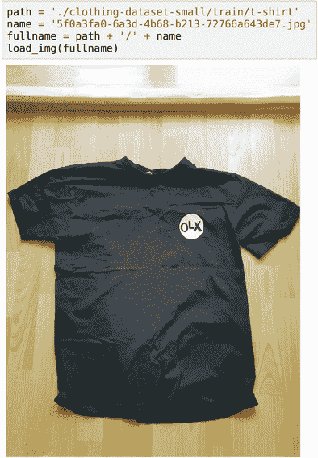

图 7.5 训练集中的 T 恤图像

要在神经网络中使用此图像，我们需要调整它的大小，因为模型总是期望图像为特定的大小。例如，我们本章中使用的网络需要一个 150 × 150 的图像或一个 299 × 299 的图像。

要调整图像大小，请指定`target_size`参数：

```
load_img(fullname, target_size=(299, 299))
```

结果，图像变成了方形并且有点压扁（图 7.6）。

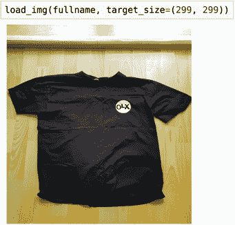

图 7.6 调整图像大小，使用`target_size`参数。

现在我们将使用神经网络来对这张图像进行分类。

## 7.2 卷积神经网络

神经网络是一类用于解决分类和回归问题的机器学习模型。我们的问题是分类问题——我们需要确定图像的类别。

然而，我们的问题是特殊的：我们处理的是图像。这就是为什么我们需要一种特殊的神经网络类型——卷积神经网络，它可以从图像中提取视觉模式并使用它们进行预测。

预训练神经网络在互联网上可用，让我们看看我们如何可以使用其中一个模型来完成这个项目。

### 7.2.1 使用预训练模型

从头开始训练卷积神经网络是一个耗时过程，需要大量数据和强大的硬件。对于像 ImageNet 这样的大型数据集（包含 1400 万张图像），可能需要几周不间断的训练。（更多信息请访问[image-net.org](http://www.image-net.org/)）

幸运的是，我们不需要自己来做这件事：我们可以使用预训练模型。通常，这些模型是在 ImageNet 上训练的，可以用于通用图像分类。

这非常简单，我们甚至不需要自己下载任何东西——Keras 会自动处理。我们可以使用许多不同类型的模型（称为*架构*）。您可以在官方 Keras 文档中找到可用预训练模型的良好总结（[`keras.io/api/applications/`](https://keras.io/api/applications/)）。

对于本章，我们将使用 Xception，这是一个相对较小的模型，但性能良好。首先，我们需要导入模型本身和一些有用的函数：

```
from tensorflow.keras.applications.xception import Xception
from tensorflow.keras.applications.xception import preprocess_input
from tensorflow.keras.applications.xception import decode_predictions
```

我们导入了三样东西：

+   `Xception`: 实际模型

+   `preprocess_input`: 准备图像以便模型使用的函数

+   `decode_prediction`: 解码模型预测的函数

让我们加载这个模型：

```
model = Xception(
    weights='imagenet',
    input_shape=(299, 299, 3)
)
```

我们在这里指定了两个参数：

+   `weights`: 我们希望使用从 ImageNet 预训练的模型。

+   `input_shape`: 输入图像的大小：高度、宽度和通道数。我们将图像调整大小到 299 × 299，每个图像有三个通道：红色、绿色和蓝色。

当我们第一次加载它时，它会从互联网下载实际模型。完成后，我们就可以使用它了。

让我们在之前看到的图像上测试它。首先，我们使用`load_img`函数加载它：

```
img = load_img(fullname, target_size=(299, 299))
```

`img`变量是一个`Image`对象，我们需要将其转换为 NumPy 数组。这很容易做到：

```
x = np.array(img)
```

这个数组应该与图像具有相同的形状。让我们检查一下：

```
x.shape
```

我们看到`(299,` `299,` `3)`。它包含三个维度（图 7.7）：

+   图像宽度：299

+   图像高度：299

+   通道数：红色、绿色、蓝色

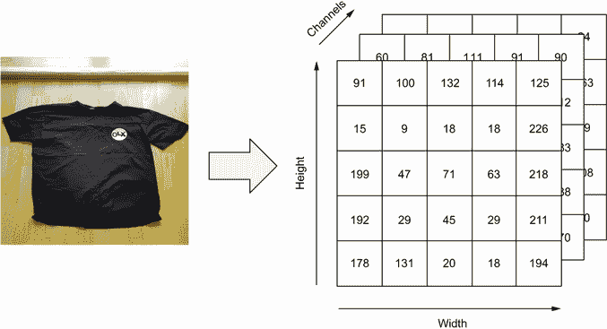

图 7.7 转换后，图像变成一个形状为宽度 × 高度 × 通道数的 NumPy 数组。

这与我们加载神经网络时指定的输入形状相匹配。然而，模型并不期望只得到一张单独的图像。它得到的是一个*批次*的图像——几个图像组合在一个数组中。这个数组应该有四个维度：

+   图像数量

+   宽度

+   高度

+   通道数

例如，对于 10 张图像，其形状是`(10,` `299,` `299,` `3)`。因为我们只有一张图像，我们需要创建一个包含这张单张图像的批次：

```
X = np.array([x])
```

注意：如果我们有多个图像，例如，`x`，`y`和`z`，我们会写成

```
X = np.array([x, y, z])
```

让我们检查它的形状：

```
X.shape
```

如我们所见，它是`(1,` `299,` `299,` `3)`——它是一张大小为 299 × 299 且有三个通道的图像。

在我们可以将模型应用于我们的图像之前，我们需要使用`preprocess_input`函数来准备它：

```
X = preprocess_input(X)
```

这个函数将原始数组中的 0 到 255 之间的整数转换为-1 到 1 之间的数字。

现在，我们已经准备好使用模型了。

### 7.2.2 获取预测

要应用模型，使用`predict`方法：

```
pred = model.predict(X)
```

让我们看看这个数组：

```
pred.shape
```

这个数组相当大——它包含 1000 个元素（图 7.8）。

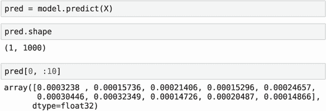

图 7.8 预训练的 Xception 模型的输出

这个 Xception 模型预测图像是否属于 1000 个类别之一，所以预测数组中的每个元素都是属于这些类别之一的概率。

我们不知道这些类别是什么，所以仅通过查看数字很难理解这个预测。幸运的是，我们可以使用一个函数，`decode_` `predictions`，将预测解码成有意义的类别名称：

```
decode_predictions(pred)
```

这显示了这张图像最有可能的前五个类别：

```
[[('n02667093', 'abaya', 0.028757658),
  ('n04418357', 'theater_curtain', 0.020734021),
  ('n01930112', 'nematode', 0.015735716),
  ('n03691459', 'loudspeaker', 0.013871926),
  ('n03196217', 'digital_clock', 0.012909736)]]
```

并非我们预期的结果。很可能是像这样的 T 恤在 ImageNet 中并不常见，这就是为什么结果对我们问题没有用。

尽管这些结果对我们来说并不特别有帮助，但我们仍然可以将这个神经网络作为解决我们问题的基模型。

要了解我们如何做到这一点，我们首先应该对卷积神经网络的工作方式有一个感觉。让我们看看当我们调用`predict`方法时模型内部发生了什么。

## 7.3 模型的内部结构

所有神经网络都是按层组织的。我们取一个图像，通过所有层，最后得到预测（图 7.9）。

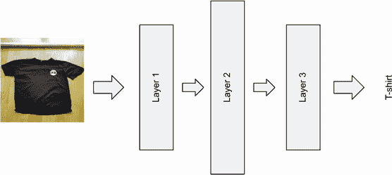

图 7.9 神经网络由多个层组成。

通常，一个模型有很多层。例如，我们这里使用的 Xception 模型有 71 层。这就是为什么这些神经网络被称为“深度”神经网络——因为它们有很多层。

对于卷积神经网络来说，最重要的层是

+   卷积层

+   密集层

首先，让我们看看卷积层。

### 7.3.1 卷积层

即使“卷积层”听起来很复杂，它也不过是**一组过滤器**——形状简单的“图像”，如条纹（图 7.10）。


图 7.10 卷积层的过滤器示例（非真实网络）

卷积层中的过滤器是在训练过程中由模型学习的。然而，因为我们使用的是预训练的神经网络，所以我们不需要担心它；我们已经有过滤器了。

要将卷积层应用于图片，我们将每个过滤器在这个图像上滑动。例如，我们可以从左到右和从上到下滑动（图 7.11）。

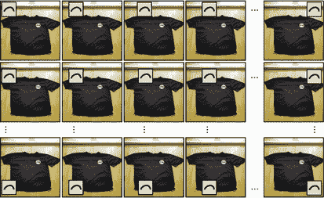

图 7.11 应用过滤器时，我们将其在图像上滑动。

在滑动过程中，我们比较过滤器的内容与过滤器下图像的内容。对于每次比较，我们记录相似度。这样，我们得到一个*特征图*——一个包含数字的数组，其中大数字表示过滤器和图像之间的匹配，而小数字表示不匹配（图 7.12）。

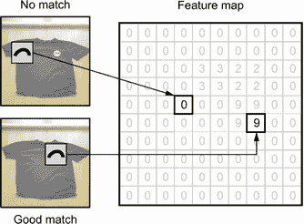

图 7.12 特征图是应用过滤器到图像的结果。图中高值对应于图像与过滤器之间具有高度相似性的区域。

因此，特征图告诉我们可以在图像的哪个位置找到过滤器中的形状。

一个卷积层由许多过滤器组成，因此我们实际上得到了多个特征图——每个过滤器对应一个（图 7.13）。

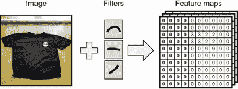

图 7.13 每个卷积层包含许多过滤器，因此我们得到一组特征图：每个我们使用的过滤器对应一个。

现在，我们可以将一个卷积层的输出用作下一层的输入。

从前一层我们知道不同条纹和其他简单形状的位置。当两个简单形状出现在相同的位置时，它们会形成更复杂的图案——十字形、角度或圆形。

这就是下一层的过滤器所做的事情：它们将前一层中的形状组合成更复杂的结构。网络越深，网络能够识别的复杂模式就越多（图 7.14）。

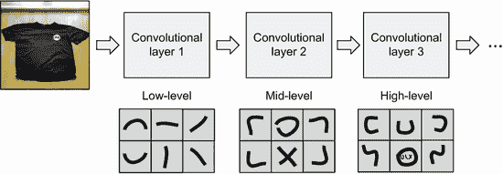

图 7.14 深层卷积层可以检测图像的越来越复杂的特征。

我们重复这个过程来检测越来越多复杂的形状。这样，网络“学习”了图像的一些独特特征。对于衣服，可能是短袖或长袖或领口的类型。对于动物，可能是尖耳朵或软耳朵或胡须的存在。

最后，我们得到一个图像的向量表示：一个一维数组，其中每个位置对应某些高级视觉特征。数组的某些部分可能对应袖子，而其他部分则代表耳朵和胡须。在这个层面上，通常很难从这些特征中得出意义，但它们具有足够的区分能力，可以区分 T 恤和裤子，或猫和狗。

现在我们需要使用这种向量表示来组合这些高级特征，并得出最终决策。为此，我们使用不同类型的层——密集层。

### 7.3.2 密集层

密集层处理图像的向量表示，并将这些视觉特征转换为实际的类别——T 恤、连衣裙、夹克或其他类别（图 7.15）。

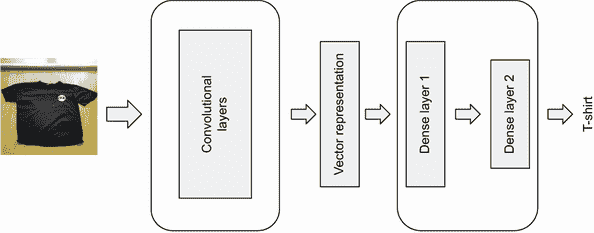

图 7.15 卷积层将图像转换为向量表示，密集层将向量表示转换为实际标签。

为了理解它是如何工作的，让我们退一步思考如何使用逻辑回归对图像进行分类。

假设我们想要构建一个二分类模型来预测图像是否为 T 恤。在这种情况下，逻辑回归的输入是图像的向量表示——特征向量 *x*。

从第三章，我们知道为了进行预测，我们需要将 *x* 中的特征与权重向量 *w* 结合，然后应用 sigmoid 函数以获得最终的预测：

sigmoid(*x^T* *w*)

我们可以通过将向量 *x* 的所有成分连接到输出——成为 T 恤的概率（图 7.16）来直观地展示它。

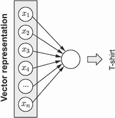

图 7.16 逻辑回归：我们将特征向量 *x* 的所有成分组合起来以获得预测。

如果我们需要对多个类别进行预测呢？例如，我们可能想知道是否有一张 T 恤、衬衫或连衣裙的图片。在这种情况下，我们可以为每个类别构建多个逻辑回归模型——每个类别一个（图 7.17）。

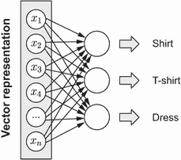

图 7.17 为了预测多个类别，我们训练多个逻辑回归模型。

通过组合多个逻辑回归模型，我们仅仅创建了一个小型神经网络！

为了使它看起来更简单，我们可以将输出合并到一个层——输出层（图 7.18）。

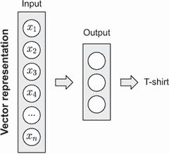

图 7.18 多个逻辑回归模型组合在一起形成一个小型神经网络。

当我们想要预测 10 个类别时，输出层有 10 个元素。为了进行预测，我们查看输出层的每个元素，并选择得分最高的一个。

在这种情况下，我们有一个网络，只有一个层：将输入转换为输出的层。

这一层被称为 *密集层*。它被称为“密集”是因为它将输入的每个元素与其输出的所有元素相连接。因此，这些层有时被称为“全连接”（图 7.19）。

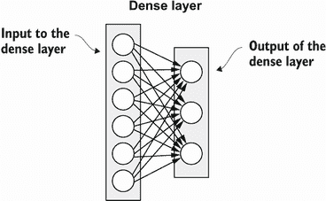

图 7.19 密集层将其输入的每个元素与其输出的每个元素相连接。

然而，我们不必仅仅停留在只有一个输出层。我们可以在输入和最终输出之间添加更多层（图 7.20）。

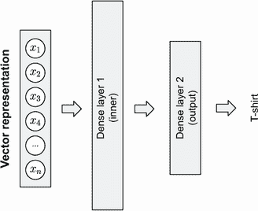

图 7.20 具有两个层的神经网络：一个内部层和一个输出层

因此，当我们调用 `predict` 时，图像首先通过一系列卷积层。这样，我们提取了该图像的向量表示。接下来，这个向量表示通过一系列密集层，我们得到最终的预测（图 7.21）。

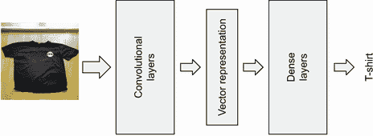

图 7.21 在卷积神经网络中，图像首先通过一系列卷积层，然后通过一系列密集层。

注意：在这本书中，我们给出了卷积神经网络内部结构的简化和高层次概述。除了卷积层和密集层之外，还存在许多其他层。对于这个主题的更深入介绍，请查看 CS231n 笔记([cs231n.github.io/convolutional-networks](https://cs231n.github.io/convolutional-networks/))。

现在，让我们回到代码，看看我们如何调整预训练神经网络以适应我们的项目。

## 7.4 训练模型

训练卷积神经网络需要大量时间和数据。但有一个捷径：我们可以使用*迁移学习*，这是一种将预训练模型适应我们问题的方法。

### 7.4.1 迁移学习

训练的困难通常来自卷积层。为了能够从图像中提取良好的向量表示，过滤器需要学习良好的模式。为此，网络需要看到许多不同的图像——越多越好。但一旦我们有了良好的向量表示，训练密集层就相对容易了。

这意味着我们可以使用在 ImageNet 上预训练的神经网络来解决我们的问题。这个模型已经学习了良好的过滤器。因此，我们保留这个模型的卷积层，但丢弃密集层，并训练新的（如图 7.22 所示）。

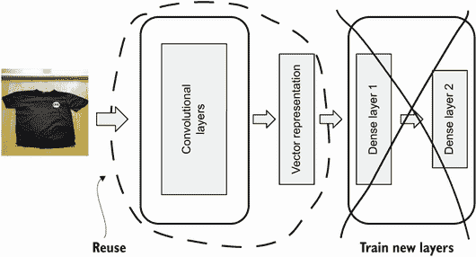

图 7.22 为了将预训练模型适应新领域，我们保留旧的卷积层，但训练新的密集层。

在本节中，我们正是这样做的。但在我们开始训练之前，我们需要准备好我们的数据集。

### 7.4.2 加载数据

在前面的章节中，我们将整个数据集加载到内存中，并使用它来获取*X*——包含特征的矩阵。对于图像来说，这更困难：我们可能没有足够的内存来存储所有图像。

Keras 提供了一个解决方案——`ImageDataGenerator`。它不是将整个数据集加载到内存中，而是从磁盘以小批次加载图像。让我们来使用它：

```
from tensorflow.keras.preprocessing.image import ImageDataGenerator

train_gen = ImageDataGenerator(
    preprocessing_function=preprocess_input    ❶
)
```

❶ 对每张图像应用`preprocess_input`函数

我们已经知道图像需要使用`preprocess_input`函数进行预处理。这就是为什么我们需要告诉`ImageDataGenerator`数据应该如何准备。

我们现在有一个生成器，所以我们只需要将其指向包含数据的目录。为此，使用`flow_from_directory`方法：

```
train_ds = train_gen.flow_from_directory(
    "clothing-dataset-small/train",        ❶
    target_size=(150, 150),                ❷
    batch_size=32,                         ❸
)
```

❶ 从训练目录中加载所有图像

❷ 将图像调整大小到 150 × 150

❸ 以 32 张图像的批次加载图像

在我们的初步实验中，我们使用 150 × 150 大小的小图像。这样，训练模型会更快。此外，小尺寸使得使用笔记本电脑进行训练成为可能。

我们的数据集中有 10 类服装，每类的图像都存储在单独的目录中。例如，所有 T 恤都存储在 T 恤文件夹中。生成器可以使用文件夹结构来推断每张图像的标签。

当我们执行单元格时，它会告诉我们训练数据集中有多少张图像以及有多少个类别：

```
Found 3068 images belonging to 10 classes.
```

现在，我们对验证数据集重复相同的过程：

```
validation_gen = ImageDataGenerator(
    preprocessing_function=preprocess_input
)

val_ds = validation_gen.flow_from_directory(
    "clothing-dataset-small/validation",
    target_size=image_size,
    batch_size=batch_size,
)
```

像之前一样，我们使用训练数据集来训练模型，使用验证数据集来选择最佳参数。

我们已经加载了数据，现在我们准备训练一个模型。

### 7.4.3 创建模型

首先，我们需要加载基础模型——这是我们用于从图像中提取向量表示的预训练模型。像之前一样，我们也使用 Xception，但这次我们只包括预训练的卷积层部分。之后，我们添加我们自己的密集层。

因此，让我们创建基础模型：

```
base_model = Xception(
    weights='imagenet',          ❶
    include_top=False            ❷
    input_shape=(150, 150, 3),   ❸
)
```

❶ 使用在 ImageNet 上预训练的模型

❷ 仅保留卷积层

❸ 图像应为 150 × 150 像素，具有三个通道。

注意`include_top`参数：这样，我们明确指定我们对其预训练神经网络的密集层不感兴趣，只对卷积层感兴趣。在 Keras 术语中，“top”是指网络的最终层集（图 7.23）。

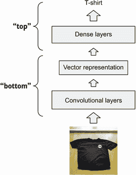

图 7.23 在 Keras 中，网络的输入在底部，输出在顶部，所以`include_top=False`意味着“不包括最终的密集层”。

我们不想训练基础模型；尝试这样做将破坏所有过滤器。因此，我们将基础模型“冻结”，通过将`trainable`参数设置为 False：

```
base_model.trainable = False
```

现在，让我们构建服装分类模型：

```
inputs = keras.Input(shape=(150, 150, 3))              ❶

base = base_model(inputs, training=False)              ❷
vector = keras.layers.GlobalAveragePooling2D()(base)   ❸

outputs = keras.layers.Dense(10)(vector)               ❹

model = keras.Model(inputs, outputs)                   ❺
```

❶ 输入图像应为 150 × 150 像素，具有三个通道。

❷ 使用 base_model 提取高级特征。

❸ 提取向量表示：将 base_model 的输出转换为向量

❹ 添加一个大小为 10 的密集层：每个类别一个元素

❺ 将输入和输出组合成一个 Keras 模型

我们构建模型的方式被称为“功能风格”。一开始可能会有些困惑，所以让我们逐行查看。

首先，我们指定输入和期望的数组大小：

```
inputs = keras.Input(shape=(150, 150, 3))
```

接下来，我们创建基础模型：

```
base = base_model(inputs, training=False) 
```

尽管`base_model`已经是一个模型，但我们将其用作函数，并给它两个参数——`inputs`和`training=False`：

+   第一个参数说明`base_model`的输入将是什么。它将从`inputs`中来。

+   第二个参数（`training=False`）是可选的，表示我们不希望训练基础模型。

结果是`base`，这是一个*功能组件*（类似于`base_model`），我们可以将其与其他组件结合使用。我们将其用作下一层的输入：

```
vector = keras.layers.GlobalAveragePooling2D()(base)
```

在这里，我们创建一个池化层——一种特殊的结构，允许我们将卷积层的输出（一个三维数组）转换为向量（一个一维数组）。

创建后，我们立即用`base`作为参数调用它。这样，我们说这个层的输入来自`base`。

这可能有点令人困惑，因为我们创建了一个层，然后立即将其连接到基础。我们可以重写它以使其更容易理解：

```
pooling = keras.layers.GlobalAveragePooling2D()    ❶
vector = pooling(base)                             ❷
```

❶ 首先创建一个池化层

❷ 连接到基础模型

结果，我们得到`vector`。这是另一个功能组件，我们将其连接到下一层——一个密集层：

```
outputs = keras.layers.Dense(10)(vector)  
```

同样，我们首先创建层，然后将其连接到`vector`。目前，我们创建了一个只有一个密集层的网络。这足以开始。

现在结果是`outputs`——我们想要从网络中获取的最终结果。

因此，在我们的情况下，数据进入`inputs`并从`outputs`流出。我们只需要进行最后一步——将`inputs`和`outputs`都包裹在一个`Model`类中：

```
model = keras.Model(inputs, outputs)
```

我们需要在这里指定两个参数：

+   模型将获取的输入，在我们的例子中是`inputs`

+   模型的输出是什么，即`outputs`

让我们退一步再次查看模型定义代码，按照从`inputs`到`outputs`的数据流（图 7.24）。

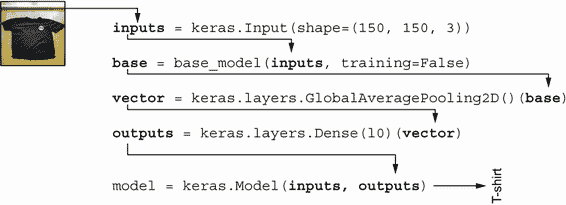

图 7.24 数据流：一个图像进入`inputs`，然后`base_model`将其转换为`base`，接着池化层将其转换为`vector`，然后密集层将其转换为`output`。最后，`inputs`和`outputs`进入一个 Keras 模型。

为了使其更容易可视化，我们可以将每一行代码视为一个块，它从上一个块获取数据，对其进行转换，并将其传递给下一个块（图 7.25）。

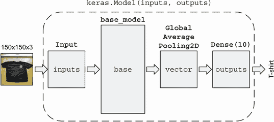

图 7.25 数据流：每一行 Keras 代码作为一个块

因此，我们创建了一个模型，它可以接收一个图像，使用基础模型获取其向量表示，并通过密集层进行最终预测。

现在让我们开始训练它。

### 7.4.4 训练模型

我们已经指定了模型：输入、模型的元素（基础模型、池化层）以及最终的输出层。

现在我们需要训练它。为此，我们需要一个*优化器*，它调整网络的权重以使其在执行任务时表现得更好。

我们不会详细介绍优化器的工作原理——这超出了本书的范围，并且完成项目不需要它。但如果你想了解更多关于它们的信息，请查看 CS231n 笔记([`cs231n.github.io/neural-networks-3/`](https://cs231n.github.io/neural-networks-3/))。你可以在 Keras 的官方文档中查看可用的优化器列表([`keras.io/api/optimizers/`](https://keras.io/api/optimizers/))。

对于我们的项目，我们将使用 Adam 优化算法——这是一个良好的默认选择，并且在大多数情况下，使用它就足够了。

让我们创建它：

```
learning_rate = 0.01
optimizer = keras.optimizers.Adam(learning_rate)
```

Adam 需要一个参数：学习率，它指定了我们的网络学习速度有多快。

学习率可能会显著影响我们网络的质量。如果我们设置得太高，网络学习得太快，可能会意外地跳过一些重要的细节。在这种情况下，预测性能不是最优的。如果我们设置得太低，网络训练时间过长，因此训练过程非常低效。

我们稍后会调整这个参数。目前，我们将其设置为 0.01——一个良好的默认值以开始。

为了训练一个模型，优化器需要知道模型表现如何。为此，它使用一个损失函数，随着网络的改善，这个损失函数会变小。优化器的目标是使这个损失最小化。

`keras.losses`包提供了许多不同的损失函数。以下是最重要的几个：

+   `BinaryCrossentropy`：用于训练二元分类器

+   `CategoricalCrossentropy`：用于训练具有多个类别的分类模型

+   `MeanSquaredError`：用于训练回归模型

因为我们需要将衣物分类到 10 个不同的类别中，所以我们使用分类交叉熵损失：

```
loss = keras.losses.CategoricalCrossentropy(from_logits=True)
```

对于这个损失函数，我们指定了一个参数：`from_logits=True`。我们需要这样做，因为我们的网络最后一层输出的是原始分数（称为“logits”），而不是概率。官方文档建议这样做以提高数值稳定性（[`www.tensorflow.org/api_docs/python/tf/keras/losses/CategoricalCrossentropy`](https://www.tensorflow.org/api_docs/python/tf/keras/losses/CategoricalCrossentropy))。

注意：或者，我们也可以这样定义网络的最后一层：

```
outputs = keras.layers.Dense(10, activation='softmax')(vector)
```

在这种情况下，我们明确告诉网络输出概率：softmax 类似于 sigmoid，但适用于多个类别。因此，输出不再是“logits”，所以我们可以省略这个参数：

```
loss = keras.losses.CategoricalCrossentropy()
```

现在让我们将优化器和损失函数结合起来。为此，我们使用模型的`compile`方法：

```
model.compile(
    optimizer=optimizer,
    loss=loss,
    metrics=["accuracy"]
)
```

除了优化器和损失函数，我们还指定了在训练期间想要跟踪的指标。我们感兴趣的是准确率：正确预测的图像百分比。

我们模型已经准备好进行训练了！要执行训练，请使用`fit`方法：

```
model.fit(train_ds, epochs=10, validation_data=val_ds)
```

我们指定了三个参数：

+   `train_ds`：训练数据集

+   `epochs`：模型将遍历训练数据的次数

+   `validation_data`：用于评估的数据集

对整个训练数据集进行一次迭代称为一个*epoch*。我们进行的迭代越多，网络对训练数据集的学习就越好。

在某个时刻，模型可能会对数据集学习得非常好，以至于开始过拟合。为了知道何时发生这种情况，我们需要监控模型在验证数据集上的性能。这就是为什么我们指定了`validation_data`参数。

当我们开始训练时，Keras 会告诉我们进度：

```
Train for 96 steps, validate for 11 steps
Epoch 1/10
96/96 [==============================] - 22s 227ms/step - loss: 1.2372 - accuracy: 0.6734 - val_loss: 0.8453 - val_accuracy: 0.7713
Epoch 2/10
96/96 [==============================] - 16s 163ms/step - loss: 0.6023 - accuracy: 0.8194 - val_loss: 0.7928 - val_accuracy: 0.7859
...
Epoch 10/10
96/96 [==============================] - 16s 165ms/step - loss: 0.0274 - accuracy: 0.9961 - val_loss: 0.9342 - val_accuracy: 0.8065
```

从这里我们可以看到

+   训练速度：每个 epoch 所需的时间。

+   训练和验证数据集上的准确率。我们应该监控验证集上的准确率，以确保模型不会开始过拟合。例如，如果验证准确率在多个 epoch 中下降，这可能是一个过拟合的迹象。

+   训练和验证的损失。我们不太关心损失——它不太直观，数值也难以解释。

注意：您得到的结果可能会有所不同。模型的总体预测性能应该相似，但具体的数字可能不会相同。在使用神经网络时，即使固定随机种子，确保完美的可重复性也变得更加困难。

如您所见，模型在训练数据集上的准确率迅速达到 99%，但验证分数在所有 epoch 中都保持在 80%左右（图 7.26）。

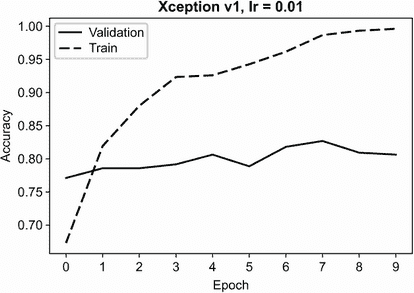

图 7.26 每个 epoch 后评估的训练和验证数据集上的准确率

训练数据上的完美准确率并不一定意味着我们的模型过拟合，但这是一个我们应该调整学习率参数的好迹象。我们之前提到这是一个重要的参数，所以现在让我们调整它。

练习 7.1

迁移学习是将预训练模型（基础模型）用于将图像转换为它的向量表示，然后在上面训练另一个模型的过程。

a) 正确

b) 错误

### 7.4.5 调整学习率

我们开始时使用的学习率是 0.01。这是一个好的起点，但并不一定是最佳的学习率：我们发现我们的模型学习得太快，在几个 epoch 之后就能以 100%的准确率预测训练集。

让我们进行实验，尝试为这个参数尝试其他值。

首先，为了简化，我们应该将模型创建的逻辑放在一个单独的函数中。这个函数将学习率作为参数。

列 7.1 创建模型的函数

```
def make_model(learning_rate):
    base_model = Xception(
        weights='imagenet',
        input_shape=(150, 150, 3),
        include_top=False
    )

    base_model.trainable = False

    inputs = keras.Input(shape=(150, 150, 3))

    base = base_model(inputs, training=False)
    vector = keras.layers.GlobalAveragePooling2D()(base)

    outputs = keras.layers.Dense(10)(vector)

    model = keras.Model(inputs, outputs)

    optimizer = keras.optimizers.Adam(learning_rate)
    loss = keras.losses.CategoricalCrossentropy(from_logits=True)

    model.compile(
        optimizer=optimizer,
        loss=loss,
        metrics=["accuracy"],
    )

    return model
```

我们已经尝试了 0.01，所以让我们尝试 0.001：

```
model = make_model(learning_rate=0.001)
model.fit(train_ds, epochs=10, validation_data=val_ds)
```

我们还可以尝试更小的值 0.0001：

```
model = make_model(learning_rate=0.0001)
model.fit(train_ds, epochs=10, validation_data=val_ds)
```

如我们所见（图 7.27），对于 0.001，训练准确率上升的速度不如 0.01 快，但使用 0.0001 上升得非常慢。在这种情况下，网络学习得太慢——它*欠拟合*。

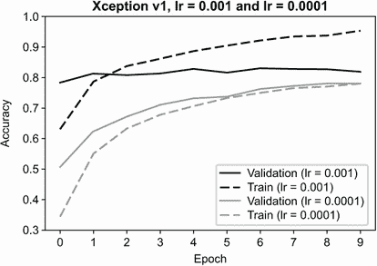

图 7.27 使用学习率 0.001 和 0.0001 的模型性能

如果我们查看所有学习率的验证分数（图 7.28），我们会看到 0.001 的学习率是最好的。

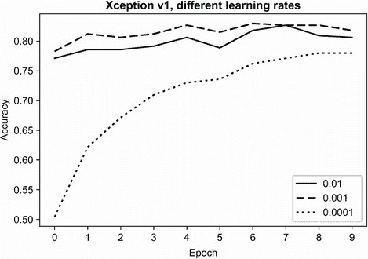

图 7.28 三种不同学习率下我们的模型在验证集上的准确率

对于 0.001 的学习率，最佳准确率是 83%（表 7.1）。

表 7.1 不同 dropout 率值的验证准确率

| 学习率 | 0.01 | 0.001 | 0.0001 |
| --- | --- | --- | --- |
| 验证准确率 | 82.7% | 83.0% | 78.0% |

注意：您的数字可能略有不同。也有可能是在您的实验中，0.01 的学习率比 0.001 实现了略好的结果。

0.01 和 0.001 之间的差异并不显著。但如果我们查看训练数据的准确率，使用 0.01，它更快地过拟合训练数据。在某个点上，它甚至达到了 100%的准确率。当训练集和验证集的性能差异很大时，过拟合的风险也高。因此，我们应该优先选择 0.001 的学习率。

训练完成后，我们需要保存模型。现在我们将看看如何进行。

### 7.4.6 保存模型和检查点

模型训练完成后，我们可以使用`save_weights`方法保存它：

```
model.save_weights('xception_v1_model.h5', save_format='h5')
```

我们需要指定以下内容：

+   输出文件：`'xception_v1_model.h5'`

+   格式：h5，这是一种用于保存二进制数据的格式

你可能已经注意到，在训练过程中，我们的模型在验证集上的性能上下波动。这样，经过 10 次迭代后，我们不一定能得到最佳模型——也许最佳性能是在第 5 或第 6 次迭代时实现的。

我们可以在每次迭代后保存模型，但这会产生太多的数据。如果我们租用云服务器，它很快就会占用所有可用空间。

相反，我们只有在模型在验证集上的最佳得分比之前更好时才保存模型。例如，如果之前的最佳准确率是 0.8，但我们将其提高到了 0.91，我们就保存模型。否则，我们继续训练过程而不保存模型。

这个过程被称为*模型检查点*。Keras 有一个专门用于此目的的类：`ModelCheckpoint`。让我们使用它：

```
checkpoint = keras.callbacks.ModelCheckpoint(
    "xception_v1_{epoch:02d}_{val_accuracy:.3f}.h5",   ❶
    save_best_only=True,                               ❷
    monitor="val_accuracy"                             ❸
)
```

❶ 指定了保存模型的文件名模板

❷ 只有在比之前的迭代更好时才保存模型

❸ 使用验证准确率来选择最佳模型

第一个参数是文件名的模板。让我们再看一遍：

```
"xception_v1_{epoch:02d}_{val_accuracy:.3f}.h5"
```

它内部有两个参数：

+   `{epoch:02d}`被替换为 epoch 的编号。

+   `{val_accuracy:.3f}`被替换为验证准确率。

由于我们将`save_best_only`设置为`True`，`ModelCheckpoint`会跟踪最佳准确率，并在每次准确率提高时将结果保存到磁盘。

我们将`ModelCheckpoint`实现为一个回调——在每个 epoch 完成后执行任何操作的方式。在这种情况下，回调评估模型，并在准确率提高时保存结果。

我们可以通过将其传递给`fit`方法的`callbacks`参数来使用它：

```
model = make_model(learning_rate=0.001)    ❶

model.fit(
    train_ds,
    epochs=10,
    validation_data=val_ds,
    callbacks=[checkpoint]                 ❷
)
```

❶ 创建了一个新的模型

❷ 指定了训练期间要使用的回调列表

经过几次迭代后，我们已经在磁盘上保存了一些模型（图 7.29）。

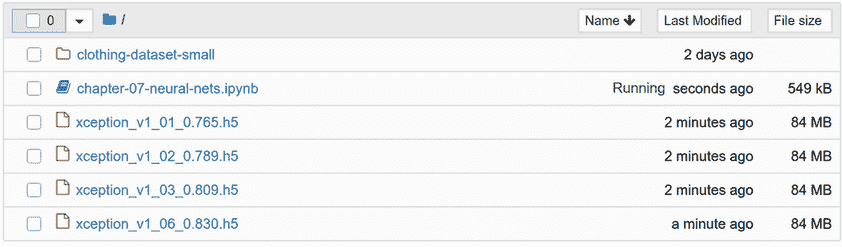

图 7.29 由于`ModelCheckpoint`回调只在模型改进时保存模型，所以我们只有 4 个包含我们模型的文件，而不是 10 个。

我们已经学会了如何存储最佳模型。现在让我们通过向网络添加更多层来改进我们的模型。

### 7.4.7 添加更多层

之前，我们用一个密集层训练了一个模型：

```
inputs = keras.Input(shape=(150, 150, 3))

base = base_model(inputs, training=False)
vector = keras.layers.GlobalAveragePooling2D()(base)

outputs = keras.layers.Dense(10)(vector)

model = keras.Model(inputs, outputs)
```

我们不必限制自己只使用一层，因此让我们在基础模型和预测的最后一层之间添加另一层（图 7.30）。

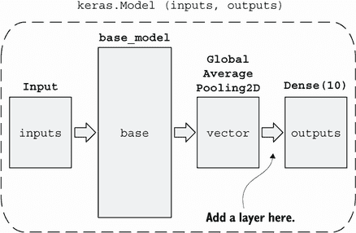

图 7.30 我们在向量表示和输出之间添加了另一个密集层。

例如，我们可以添加一个大小为 100 的密集层：

```
inputs = keras.Input(shape=(150, 150, 3))
base = base_model(inputs, training=False)
vector = keras.layers.GlobalAveragePooling2D()(base)

inner = keras.layers.Dense(100, activation='relu')(vector)   ❶

outputs = keras.layers.Dense(10)(inner)                      ❷

model = keras.Model(inputs, outputs)
```

❶ 添加了一个大小为 100 的密集层

❷ 不是将输出连接到向量，而是连接到内部

注意：选择 100 作为内部密集层的大小没有特别的原因。我们应该将其视为一个参数：就像学习率一样，我们可以尝试不同的值，看看哪个能带来更好的验证性能。在本章中，我们不会尝试改变内部层的大小，但你可以自由尝试。

这样，我们在基础模型和输出之间添加了一个层（图 7.31）。

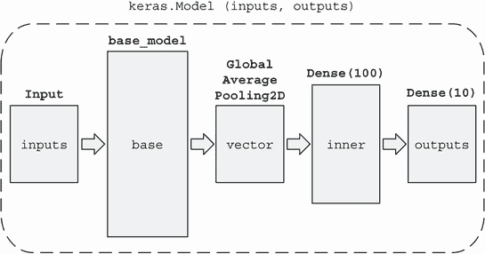

图 7.31 在 `vector` 和 `outputs` 之间添加了一个新的 `inner` 层

让我们再次看看带有新密集层的行：

```
inner = keras.layers.Dense(100, activation='relu')(vector)
```

这里，我们将 `activation` 参数设置为 `relu`。

记住，我们通过组合多个逻辑回归来得到神经网络。在逻辑回归中，sigmoid 用于将原始分数转换为概率。但对于内部层，我们不需要概率，可以用其他函数替换 sigmoid。这些函数被称为 *激活函数*。ReLU（修正线性单元）是其中之一，对于内部层来说，它比 sigmoid 是更好的选择。

sigmoid 函数存在梯度消失问题，这使得训练深层神经网络变得不可能。ReLU 解决了这个问题。要了解更多关于这个问题以及一般激活函数的信息，请参阅 CS231n 笔记（[`cs231n.github.io/neural-networks-1/`](https://cs231n.github.io/neural-networks-1/)）。

添加另一个层后，我们过拟合的风险显著增加。为了避免这种情况，我们需要在模型中添加正则化。接下来，我们将看到如何做到这一点。

### 7.4.8 正则化和 dropout

*Dropout* 是一种用于对抗神经网络过拟合的特殊技术。Dropout 的主要思想是在训练时冻结密集层的一部分。在每次迭代中，随机选择要冻结的部分。只有未冻结的部分被训练，冻结的部分则完全不接触。

如果忽略网络的一部分，整体模型不太可能过拟合。当网络处理一批图像时，层的冻结部分看不到这些数据——它是关闭的。这样，网络记住图像就更加困难（图 7.32）。

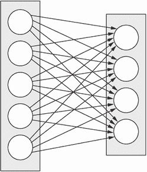

(A) 两个没有 dropout 的密集层

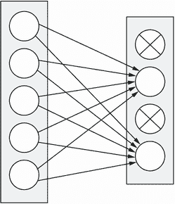

(B) 两个带有 dropout 的密集层

图 7.32 带有 dropout 时，连接到冻结节点的连接被丢弃。

对于每个批次，随机选择要冻结的部分，这样网络就会学会从不完全信息中提取模式，这使得它更加鲁棒，并且不太可能过拟合。

我们可以通过设置 dropout 率——每步冻结层中元素的分数来控制 dropout 的强度。

在 Keras 中，我们在第一个 `Dense` 层之后添加一个 `Dropout` 层，并设置 dropout 率：

```
inputs = keras.Input(shape=(150, 150, 3))
base = base_model(inputs, training=False)
vector = keras.layers.GlobalAveragePooling2D()(base)

inner = keras.layers.Dense(100, activation='relu')(vector)
drop = keras.layers.Dropout(0.2)(inner)
outputs = keras.layers.Dense(10)(drop)

model = keras.Model(inputs, outputs)
```

这样，我们在网络中添加了另一个块——dropout 块（图 7.33）。

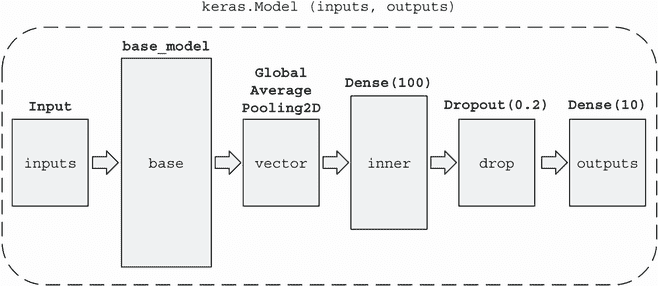

图 7.33 `Dropout` 是 `inner` 层和 `outputs` 层之间另一个块。

让我们训练这个模型。为了简化，我们首先需要更新 `make_model` 函数，并在那里添加一个参数来控制 dropout 率。

列表 7.2 创建具有 dropout 的模型的功能

```
def make_model(learning_rate, droprate):
    base_model = Xception(
        weights='imagenet',
        input_shape=(150, 150, 3),
        include_top=False
    )

    base_model.trainable = False

    inputs = keras.Input(shape=(150, 150, 3))
    base = base_model(inputs, training=False)
    vector = keras.layers.GlobalAveragePooling2D()(base)

    inner = keras.layers.Dense(100, activation='relu')(vector)
    drop = keras.layers.Dropout(droprate)(inner)

    outputs = keras.layers.Dense(10)(drop)

    model = keras.Model(inputs, outputs)

    optimizer = keras.optimizers.Adam(learning_rate)
    loss = keras.losses.CategoricalCrossentropy(from_logits=True)

    model.compile(
        optimizer=optimizer,
        loss=loss,
        metrics=["accuracy"],
    )

    return model
```

让我们尝试为 `droprate` 参数设置四个不同的值，看看我们的模型性能如何变化：

+   0.0: 没有任何内容被冻结，因此这相当于完全没有包括 dropout 层。

+   0.2: 只有 20%的层被冻结，

+   0.5: 层的一半被冻结。

+   0.8: 大多数层（80%）被冻结。

使用 dropout，训练模型需要更多的时间：在每一步中，只有我们网络的一部分在学习，因此我们需要走更多的步骤。这意味着我们应该在训练时增加 epoch 的数量。

因此，让我们开始训练：

```
model = make_model(learning_rate=0.001, droprate=0.0)    ❶
model.fit(train_ds, epochs=30, validation_data=val_ds)   ❷
```

❶ 修改 droprate 以实验不同的值

❷ 训练模型比之前更多的 epochs

当它完成后，通过复制代码到另一个单元格并更改值为 0.2、0.5 和 0.8 来重复此操作。

从验证数据集的结果来看，0.0、0.2 和 0.5 之间没有显著差异。然而，0.8 更差——我们使网络学习变得非常困难（图 7.34）。

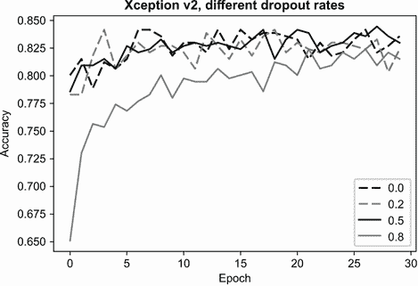

图 7.34 对于 dropout 率为 0.0、0.2 和 0.5 的情况，验证集上的准确率相似。然而，对于 0.8，它更差。

我们能达到的最佳准确率是 0.5 dropout 率下的 84.5%（表 7.2）。

表 7.2 不同 dropout 率值下的验证准确率

| Dropout 率 | 0.0 | 0.2 | 0.5 | 0.8 |
| --- | --- | --- | --- | --- |
| 验证准确率 | 84.2% | 84.2% | 84.5% | 82.4% |

注意：您可能得到不同的结果，并且可能存在不同的 dropout 率值可以达到最佳准确率。

在这种情况下，当验证数据集上的准确率没有明显差异时，查看训练集上的准确率也是有用的（图 7.35）。

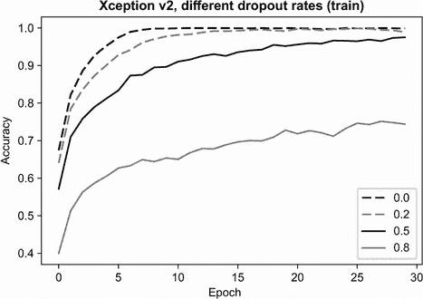

图 7.35 当 dropout 率为 0.0 时，网络快速过拟合，而 0.8 的率使学习变得非常困难。

没有 dropout 的情况下，模型会快速记住整个训练数据集，经过 10 个 epoch 后，准确率达到 99.9%。当 dropout 率为 0.2 时，它需要更多的时间来过拟合训练数据集，而对于 0.5，即使经过 30 次迭代，也没有达到完美的准确率。将率设置为 0.8，我们使网络学习变得非常困难，因此即使在训练数据集上，准确率也较低。

我们可以看到，当 dropout 率为 0.5 时，网络不像其他网络那样快速过拟合，同时保持了与 0.0 和 0.2 相同的验证数据集准确率。因此，我们应该优先选择使用 0.5 dropout 率训练的模型。

通过添加另一个层和 dropout，我们将准确率从 83%提高到 84%。尽管这种增加对于这个特定案例来说并不显著，但 dropout 是抵抗过拟合的有力工具，我们在使模型更复杂时应该使用它。

除了 dropout，我们还可以使用其他方法来抵抗过拟合。例如，我们可以生成更多数据。在下一节中，我们将看到如何做到这一点。

练习 7.2

在 dropout 中，我们

a) 完全移除模型的一部分

b) 冻结模型的一部分，使其在训练过程中的一个迭代中不被更新

c) 冻结模型的一部分，使其在整个训练过程中不被使用

### 7.4.9 数据增强

获取更多数据总是好主意，通常这是我们提高模型质量所能做的最好的事情。不幸的是，并不总是能够获取更多数据。

对于图像，我们可以从现有图像中生成更多数据。例如：

+   垂直和水平翻转图像。

+   旋转图像。

+   稍微放大或缩小。

+   以其他方式改变图像。

从现有数据集中生成更多数据的过程称为*数据增强*（图 7.36）。

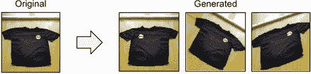

图 7.36 我们可以通过修改现有图像来生成更多训练数据。

从现有图像创建新图像的最简单方法是将它水平、垂直或两者都翻转（图 7.37）。

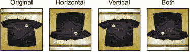

图 7.37 水平和垂直翻转图像

在我们的情况下，水平翻转可能没有太大意义，但垂直翻转应该是有用的。

注意：如果你对如何生成这些图像感兴趣，请查看 GitHub 仓库中本书的 07-augmentations.ipynb 笔记本。

旋转是另一种我们可以使用的图像处理策略：我们可以通过旋转现有图像一定角度来生成新的图像（图 7.38）。

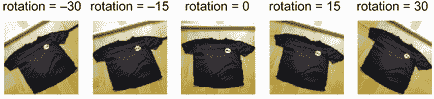

图 7.38 旋转图像。如果旋转角度为负，图像将逆时针旋转。

剪切是另一种可能的变换。它通过“拉动”图像的一侧来扭曲图像。当剪切为正时，我们向下拉动右侧，当它为负时，我们向上拉动右侧（图 7.39）。

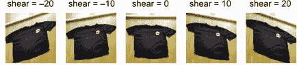

图 7.39 剪切变换。我们通过其右侧拉动图像上下移动。

初看，剪切和旋转的效果可能看起来相似，但实际上它们相当不同。剪切会改变图像的几何形状，但旋转不会：它只会旋转图像（图 7.40）。

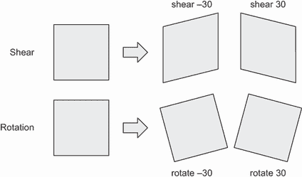

图 7.40 剪切通过拉动图像改变其几何形状，因此正方形变成平行四边形。旋转不会改变形状，所以正方形仍然是正方形。

接下来，我们可以水平（图 7.41）或垂直（图 7.42）移动图像。

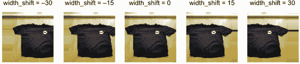

图 7.41 水平移动图像。正值将图像向左移动，而负值将图像向右移动。

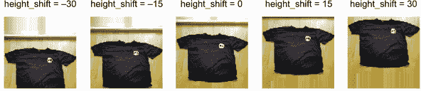

图 7.42 垂直移动图像。正值将图像向上移动，而负值将图像向下移动。

最后，我们可以放大或缩小图像（图 7.43）。

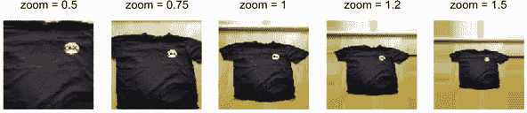

图 7.43 放大或缩小。当缩放因子小于 1 时，我们放大；如果大于 1，我们缩小。

此外，我们可以结合多种数据增强策略。例如，我们可以取一个图像，水平翻转，缩小，然后旋转。

通过对同一图像应用不同的增强，我们可以生成更多的新图像（图 7.44）。

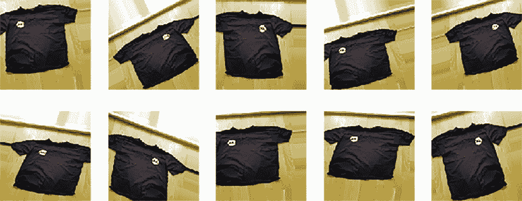

图 7.44 10 张由同一图像生成的新图像

Keras 提供了一种内置的数据增强方法。它基于 `ImageDataGenerator`，我们之前已经用它来读取图像。

生成器接受许多参数。之前，我们只使用了`preprocessing_function`——它是预处理图像所需的。其他参数也可用，其中许多负责增强数据集。

例如，我们可以创建一个新的生成器：

```
train_gen = ImageDataGenerator(
    rotation_range=30,
    width_shift_range=30.0,
    height_shift_range=30.0,
    shear_range=10.0,
    zoom_range=0.2,
    horizontal_flip=True,
    vertical_flip=False,
    preprocessing_function=preprocess_input
)
```

让我们更仔细地看看这些参数：

+   `rotation_range=30`: 将图像随机旋转-30 到 30 度之间的任意角度。

+   `width_shift_range=30`: 将图像水平移动，移动值在-30 到 30 像素之间。

+   `height_shift_range=30`: 将图像垂直移动，移动值在-30 到 30 像素之间。

+   `shear_range=10`: 通过-10 到 10（也是像素）之间的值应用剪切变换。

+   `zoom_range=0.2`: 使用 0.8 到 1.2（1 - 0.2 和 1 + 0.2）之间的缩放因子应用缩放变换。

+   `horizontal_flip=True`: 随机水平翻转图像。

+   `vertical_flip=False`: 不要垂直翻转图像。

对于我们的项目，让我们选择这些增强中的一小部分：

```
train_gen = ImageDataGenerator(
    shear_range=10.0,
    zoom_range=0.1,
    horizontal_flip=True,
    preprocessing_function=preprocess_input,
)
```

接下来，我们像之前一样使用生成器：

```
train_ds = train_gen.flow_from_directory(
    "clothing-dataset-small/train",
    target_size=(150, 150),
    batch_size=32,
)
```

我们只需要将增强应用于训练数据。我们不使用它进行验证：我们希望使我们的评估保持一致，并能够比较在增强数据集上训练的模型和在未增强数据集上训练的模型。

因此，我们使用与之前完全相同的代码加载验证数据集：

```
validation_gen = ImageDataGenerator(
    preprocessing_function=preprocess_input
)

val_ds = validation_gen.flow_from_directory(
    "clothing-dataset-small/validation",
    target_size=image_size,
    batch_size=batch_size,
)
```

现在，我们已经准备好训练一个新的模型：

```
model = make_model(learning_rate=0.001, droprate=0.2)
model.fit(train_ds, epochs=50, validation_data=val_ds)
```

注意：为了简洁起见，这里省略了模型检查点的代码。如果您想保存最佳模型，请添加它。

为了训练这个模型，我们需要比之前更多的 epoch。数据增强也是一种正则化策略。我们不是反复在相同的图像上训练，而是在每个 epoch 中，网络看到的是同一图像的不同变体。这使得模型更难记住数据，并减少了过拟合的可能性。

训练此模型后，我们成功将准确率提高了 1%，从 84%提高到 85%。

这种改进并不真正显著。但我们已经进行了大量实验，并且我们可以相对快速地做到这一点，因为我们使用了 150 × 150 的小图像。现在我们可以将我们迄今为止所学的一切应用到更大的图像上。

练习 7.3

数据增强有助于防止过拟合，因为

a) 模型不会反复看到相同的图像。

b) 它为数据集增加了大量多样性——旋转和其他图像变换。

c) 它生成可能存在的图像示例，但模型在其他情况下不会看到。

d) 所有上述内容。

### 7.4.10 训练更大的模型

即使对于人来说，理解一个 150 × 150 的小图像中包含什么类型的物品可能都很有挑战性。对于计算机来说也是如此：很难看到重要的细节，因此模型可能会混淆裤子与短裤或 T 恤与衬衫。

通过将图像的大小从 150 × 150 增加到 299 × 299，网络将更容易看到更多细节，因此可以达到更高的准确率。

注意：在较大图像上训练模型的时间大约是小图像的四倍。如果您没有访问带有 GPU 的计算机，您不需要运行本节中的代码。从概念上讲，过程是相同的，唯一的区别是输入大小。

因此，让我们修改我们创建模型的函数。为此，我们需要调整`make_model`（列表 7.2）的代码，并在两个地方进行调整：

+   Xception 的`input_shape`参数

+   输入的`C`参数

在这两种情况下，我们需要将`(150,` `150,` `3)`替换为`(299,` `299,` `3)`。

接下来，我们需要调整训练和验证生成器的`target_size`参数。我们将`(150,` `150)`替换为`(299,` `299)`，其他一切保持不变。

现在我们已经准备好训练一个模型了！

```
model = make_model(learning_rate=0.001, droprate=0.2)
model.fit(train_ds, epochs=20, validation_data=val_ds)
```

注意：为了保存模型，请添加检查点。

该模型在验证数据上达到了约 89%的准确率。这比之前的模型有了相当大的改进。

我们已经训练了一个模型，现在是时候使用它了。

## 7.5 使用模型

之前，我们训练了多个模型。最好的模型是我们在大图像上训练的模型——它有 89%的准确率。第二好的模型准确率为 85%。

现在我们使用这些模型进行预测。要使用模型，我们首先需要加载它。

### 7.5.1 加载模型

您可以使用自己训练的模型，或者下载我们为书籍训练的模型并使用它。

要下载它们，请访问书籍 GitHub 仓库的发布部分，并查找第七章：深度学习（图 7.45）的模型。或者，访问此 URL：[`github.com/alexeygrigorev/mlbookcamp-code/releases/tag/chapter7-model`](https://github.com/alexeygrigorev/mlbookcamp-code/releases/tag/chapter7-model)。

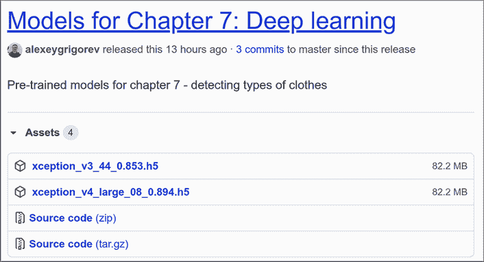

图 7.45 您可以从书籍的 GitHub 仓库下载我们为这一章训练的模型。

然后下载在 299 × 299 图像上训练的大模型（xception_v4_large）。要使用它，请使用`models`包中的`load_model`函数加载模型：

```
model = keras.models.load_model('xception_v4_large_08_0.894.h5')
```

我们已经使用了训练和验证数据集。我们已经完成了训练过程，现在是时候在测试数据上评估这个模型了。

### 7.5.2 评估模型

要加载测试数据，我们遵循相同的方法：我们使用`ImageDataGenerator`，但指向测试目录。让我们来做：

```
test_gen = ImageDataGenerator(
    preprocessing_function=preprocess_input
)

test_ds = test_gen.flow_from_directory(
    "clothing-dataset-small/test",
    shuffle=False,
    target_size=(299, 299),     ❶
    batch_size=32,
)
```

❶ 如果您使用的是小模型，请使用(150, 150)。

在 Keras 中评估一个模型就像调用`evaluate`方法一样简单：

```
model.evaluate(test_ds)
```

它将模型应用于测试文件夹中的所有数据，并显示了损失和准确率的评估指标：

```
12/12 [==============================] - 70s 6s/step - loss: 0.2493 - accuracy: 0.9032
```

我们的模型在测试数据集上显示了 90%的准确率，这与验证数据集上的性能相当（89%）。

如果我们对小数据集重复同样的过程，我们会看到性能更差：

```
12/12 [==============================] - 15s 1s/step - loss: 0.6931 - accuracy: 0.8199
```

准确率是 82%，而在验证数据集上是 85%。模型在测试数据集上的表现更差。

这可能是因为随机波动：验证集和测试集的大小都不大，只有 300 个示例。因此，模型可能在验证集上运气好，在测试集上运气差。

然而，这可能是过拟合的迹象。通过反复在验证数据集上评估模型，我们选择了表现非常幸运的模型。也许这种幸运不具有普遍性，这就是为什么模型在之前未见过的数据上的表现较差。

现在让我们看看如何将模型应用于单个图像以获取预测。

### 7.5.3 获取预测

如果我们想将模型应用于单个图像，我们需要做与`ImageDataGenerator`内部执行相同的事情：

+   加载一张图片。

+   预处理它。

我们已经知道如何加载图片。我们可以使用`load_img`来做这件事：

```
path = 'clothing-dataset-small/test/pants/c8d21106-bbdb-4e8d-83e4-bf3d14e54c16.jpg'
img = load_img(path, target_size=(299, 299))
```

这是一张裤子的图片（图 7.46）。


图 7.46 训练数据集中的一张裤子图片

接下来，我们预处理图片：

```
x = np.array(img)
X = np.array([x])
X = preprocess_input(X)
```

最后，我们得到预测结果：

```
pred = model.predict(X)
```

我们可以通过检查预测的第一行来查看图像的预测：`pred[0]`（图 7.47）。

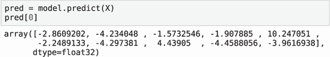

图 7.47 我们模型的预测。它是一个包含 10 个元素的数组，每个类别一个。

结果是一个包含 10 个元素的数组，每个元素包含一个分数。分数越高，图像属于相应类别的可能性就越大。

要获取得分最高的元素，我们可以使用`argmax`方法。它返回得分最高的元素的索引（图 7.48）。

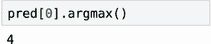

图 7.48 `argmax`函数返回得分最高的元素。

要知道哪个标签对应于类别 4，我们需要获取映射。它可以从数据生成器中提取。但让我们手动将其放入字典中：

```
labels = {
    0: 'dress',
    1: 'hat',
    2: 'longsleeve',
    3: 'outwear',
    4: 'pants',
    5: 'shirt',
    6: 'shoes',
    7: 'shorts',
    8: 'skirt',
    9: 't-shirt'
}
```

要获取标签，只需在字典中查找：

```
labels[pred[0].argmax()]
```

正如我们所见，标签是“裤子”，这是正确的。此外，请注意标签“短裤”有一个很高的正分：裤子和短裤在视觉上非常相似。但“裤子”显然是赢家。

我们将在下一章中使用这段代码，我们将在这个章节中将我们的模型投入生产。

## 7.6 下一步

我们已经学习了训练用于预测衣服类型的分类模型所需的基本知识。我们涵盖了大量的材料，但还有更多内容需要学习，这些内容超出了本章的范围。你可以通过做练习来更深入地探索这个主题。

### 7.6.1 练习

+   对于深度学习，我们拥有的数据越多，效果越好。但这个项目使用的数据集并不大：我们仅在 3,068 张图像上训练了我们的模型。为了使其更好，我们可以添加更多训练数据。你可以在其他数据源中找到更多衣服的图片；例如，在[`www.kaggle.com/dqmonn/zalando-store-crawl`](https://www.kaggle.com/dqmonn/zalando-store-crawl)、[`www.kaggle.com/paramaggarwal/fashion-product-images-dataset`](https://www.kaggle.com/paramaggarwal/fashion-product-images-dataset)或[`www.kaggle.com/c/imaterialist-fashion-2019-FGVC6`](https://www.kaggle.com/c/imaterialist-fashion-2019-FGVC6)。尝试向训练数据中添加更多图片，并看看是否提高了验证数据集上的准确率。

+   扩增有助于我们训练更好的模型。在本章中，我们只使用了最基本的扩充策略。你可以进一步探索这个主题并尝试其他类型的图像修改。例如，添加旋转和移动，看看是否有助于模型获得更好的性能。

+   除了内置的数据集扩充方式，我们还有专门的库来做这件事。其中之一是 Albumentations（[`github.com/albumentations-team/albumentations`](https://github.com/albumentations-team/albumentations)），它包含更多的图像处理算法。你还可以尝试它并看看哪些扩充对这个问题有效。

+   有许多可用的预训练模型。我们使用了 Xception，但还有很多其他模型。你可以尝试它们并看看它们是否提供了更好的性能。使用 Keras，使用不同模型非常简单：只需从不同的包中导入。例如，你可以尝试 ResNet50 并将其与 Xception 的结果进行比较。查看文档以获取更多信息（[`keras.io/api/applications/`](https://keras.io/api/applications/)）。

### 7.6.2 其他项目

你可以做的许多图像分类项目：

+   猫还是狗（[`www.kaggle.com/c/dogs-vs-cats`](https://www.kaggle.com/c/dogs-vs-cats)）

+   热狗还是不是热狗（[`www.kaggle.com/dansbecker/hot-dog-not-hot-dog`](https://www.kaggle.com/dansbecker/hot-dog-not-hot-dog)）

+   从 Avito 数据集（在线分类）预测图像类别（[`www.kaggle.com/c/avito-duplicate-ads-detection`](https://www.kaggle.com/c/avito-duplicate-ads-detection)）。请注意，这个数据集中存在许多重复项，因此在分割数据用于验证时要小心。使用组织者准备的训练/测试分割并进行一些额外的清理以确保没有重复图像可能是个好主意。

## 摘要

+   TensorFlow 是一个用于构建和使用神经网络的框架。Keras 是 TensorFlow 之上的一个库，它使模型训练变得更加简单。

+   对于图像处理，我们需要一种特殊的神经网络：卷积神经网络。它由一系列卷积层和一系列密集层组成。

+   神经网络中的卷积层将图像转换为它的向量表示。这种表示包含高级特征。密集层使用这些特征来进行预测。

+   我们不需要从头开始训练卷积神经网络。我们可以使用 ImageNet 上的预训练模型进行通用分类。

+   迁移学习是将预训练模型调整到我们问题的过程。我们保留原始的卷积层，但创建新的密集层。这显著减少了训练模型所需的时间。

+   我们使用 dropout 来防止过拟合。在每次迭代中，它会冻结网络的一部分，这样只有其他部分才能用于训练。这使网络能够更好地泛化。

+   我们可以通过旋转、垂直和水平翻转现有图像以及进行其他转换来从现有图像中创建更多训练数据。这个过程称为数据增强，它增加了数据的变异性，并减少了过拟合的风险。

在本章中，我们训练了一个用于分类服装图像的卷积神经网络。我们可以将其保存、加载，并在 Jupyter Notebook 中使用它。但这还不足以在生产环境中使用。

在下一章中，我们将展示如何在生产环境中使用它，并讨论两种生产化深度学习模型的方式：AWS Lambda 中的 TensorFlow Lite 和 Kubernetes 中的 TensorFlow Serving。

## 练习答案

+   练习 7.1 A) 正确

+   练习 7.2 B) 冻结模型的一部分，使其在训练的一个迭代中不更新。

+   练习 7.3 D) 以上所有
