# 8 无服务器深度学习

本章涵盖

+   使用 TensorFlow Lite 提供模型服务——一个轻量级的环境，用于应用 TensorFlow 模型

+   使用 AWS Lambda 部署深度学习模型

+   通过 API Gateway 将 lambda 函数作为 Web 服务公开

在上一章中，我们训练了一个用于分类服装图像的深度学习模型。现在我们需要部署它，使模型可供其他服务使用。

我们有做这件事的许多可能方法。我们已经在第五章中介绍了模型部署的基础知识，其中我们讨论了使用 Flask、Docker 和 AWS Elastic Beanstalk 来部署逻辑回归模型。

在本章中，我们将讨论部署模型的无服务器方法——我们将使用 AWS Lambda。

## 8.1 无服务器：AWS Lambda

AWS Lambda 是亚马逊的一项服务。它的主要承诺是您可以“无需考虑服务器即可运行代码。”

它实现了承诺：在 AWS Lambda 中，我们只需上传一些代码。服务会负责运行它并根据负载进行扩展和缩减。

此外，您只需为函数实际使用的时间付费。当没有人使用模型并调用我们的服务时，您不需要支付任何费用。

在本章中，我们使用 AWS Lambda 来部署我们之前训练的模型。为此，我们还将使用 TensorFlow Lite——TensorFlow 的轻量级版本，它只包含最基本的功能。

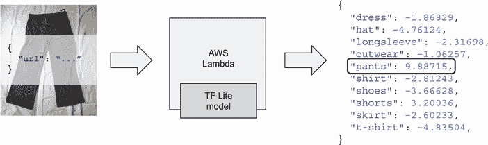

图 8.1 服务概述：它获取图像的 URL，应用模型，并返回预测结果。

我们想要构建一个 Web 服务，它

+   获取请求中的 URL

+   从此 URL 加载图像

+   使用 TensorFlow Lite 将模型应用于图像并获取预测结果

+   返回结果（图 8.1）

要创建此服务，我们需要

+   将模型从 Keras 转换为 TensorFlow Lite 格式

+   预处理图像——调整大小并应用预处理函数

+   将代码打包成 Docker 镜像，并上传到 ECR（AWS 的 Docker 仓库）

+   在 AWS 上创建和测试 lambda 函数

+   使用 AWS API Gateway 使 lambda 函数对每个人可用

我们假设您有一个 AWS 账户并且已经配置了 AWS CLI 工具。有关详细信息，请参阅附录 A。

注意：在撰写本文时，AWS Lambda 由 AWS 免费层覆盖。这意味着您可以免费进行本章的所有实验。要检查条件，请参阅 AWS 文档（[`aws.amazon.com/free/`](https://aws.amazon.com/free/)）。

我们在这里使用 AWS，但这种方法也适用于其他无服务器平台。

本章的代码可在本书的 GitHub 仓库中找到（[`github.com/alexeygrigorev/mlbookcamp-code/`](https://github.com/alexeygrigorev/mlbookcamp-code/)）的 chapter-08-serverless 文件夹中。

让我们先来讨论 TensorFlow Lite。

### 8.1.1 TensorFlow Lite

TensorFlow 是一个功能丰富的框架。然而，其中大部分功能对于模型部署来说并不需要，而且它们占用了大量的空间：当压缩时，TensorFlow 占用超过 1.5 GB 的空间。

另一方面，TensorFlow Lite（通常简称为“TF Lite”）仅占用 50 MB 的空间。它针对移动设备进行了优化，只包含基本部分。使用 TF Lite，你只能使用模型进行预测，不能做其他任何事情，包括训练新模型。

尽管它最初是为移动设备创建的，但它适用于更多情况。只要我们有 TensorFlow 模型但无法承担携带整个 TensorFlow 包的费用，我们就可以使用它。

注意：TF Lite 库正在积极开发中，变化相当快。自本书出版以来，安装此库的方式可能已经改变。请参阅官方文档以获取最新说明（[`www.tensorflow.org/lite/guide/python`](https://www.tensorflow.org/lite/guide/python)）。

现在我们来安装这个库。我们可以使用 `pip` 来做：

```
pip install --extra-index-url https://google-coral.github.io/py-repo/ tflite_runtime
```

当运行 `pip install` 时，我们添加 `extra-index-url` 参数。我们安装的库不在 Python 包的中央仓库中可用，但它存在于另一个仓库中。我们需要指向这个仓库。

注意：对于非 Debian 基础的 Linux 发行版，如 CentOS、Fedora 或 Amazon Linux，以这种方式安装的库可能不起作用：当你尝试导入库时可能会出错。如果是这种情况，你需要自己编译这个库。有关更多详细信息，请参阅此处说明：[`github.com/alexeygrigorev/serverless-deep-learning`](https://github.com/alexeygrigorev/serverless-deep-learning)。对于 MacOS 和 Windows，它应该按预期工作。

TF Lite 使用一种特殊的优化格式来存储模型。为了使用 TF Lite 的模型，我们需要将我们的模型转换为这种格式。我们将在下一步进行转换。

### 8.1.2 将模型转换为 TF Lite 格式

我们使用 h5 格式保存了前一章中的模型。这种格式适合存储 Keras 模型，但它不适用于 TF Lite。因此，我们需要将我们的模型转换为 TF-Lite 格式。

如果你没有前一章中的模型，请继续下载它：

```
wget https://github.com/alexeygrigorev/mlbookcamp-code/releases/download/
chapter7-model/xception_v4_large_08_0.894.h5
```

现在，让我们创建一个简单的脚本来转换这个模型——convert.py。

首先，从导入开始：

```
import tensorflow as tf
from tensorflow import keras
```

接下来，加载 Keras 模型：

```
model = keras.models.load_model('xception_v4_large_08_0.894.h5')
```

最后，将其转换为 TF Lite：

```
converter = tf.lite.TFLiteConverter.from_keras_model(model)

tflite_model = converter.convert()

with tf.io.gfile.GFile('clothing-model-v4.tflite', 'wb') as f:
    f.write(tflite_model)
```

让我们运行它：

```
python convert.py
```

运行后，我们应该在我们的目录中有一个名为 clothing-model-v4.tflite 的文件。

我们现在可以为此模型进行图像分类，将模型应用于服装图像，以了解给定的图像是否是 T 恤、裤子、裙子或其他东西。然而，记住在我们可以使用模型对图像进行分类之前，图像需要进行预处理。我们将在下一节中看到如何进行预处理。

### 8.1.3 准备图像

在之前，当在 Keras 中测试模型时，我们使用`preprocess_input`函数对每个图像进行预处理。这是我们在上一章中导入它的方式：

```
from tensorflow.keras.applications.xception import preprocess_input
```

然后我们在将图像放入模型之前应用了这个函数。

然而，当部署我们的模型时，我们不能使用相同的函数。这个函数是 TensorFlow 包的一部分，在 TF Lite 中没有等效函数。我们不想仅仅为了这个简单的预处理函数就依赖 TensorFlow。

相反，我们可以使用一个只包含我们需要的代码的特殊库：`keras_image_helper`。这个库是为了简化本书中的解释而编写的。如果您想了解更多关于图像如何进行预处理的详细信息，请查看源代码。它可在[`github.com/alexeygrigorev/keras-image-helper`](https://github.com/alexeygrigorev/keras-image-helper)找到。这个库可以加载图像，调整大小，并应用 Keras 模型所需的其它预处理转换。

让我们使用`pip`安装它：

```
pip install keras_image_helper
```

接下来，打开 Jupyter，创建一个名为 chapter-08-model-test 的笔记本。

我们首先从库中导入`create_preprocessor`函数：

```
from keras_image_helper import create_preprocessor
```

函数`create_preprocessor`接受两个参数：

+   `name`：模型的名称。您可以在[`keras.io/api/applications/`](https://keras.io/api/applications/)中查看可用的模型列表。

+   `target_size`：神经网络期望获取的图像大小。

我们使用了 Xception 模型，它期望的图像大小为 299 × 299。让我们为我们的模型创建一个预处理程序：

```
preprocessor = create_preprocessor('xception', target_size=(299, 299))
```

现在，让我们获取一条裤子的图片（图 8.2），并对其进行准备：

```
image_url = 'http://bit.ly/mlbookcamp-pants'
X = preprocessor.from_url(image_url)
```

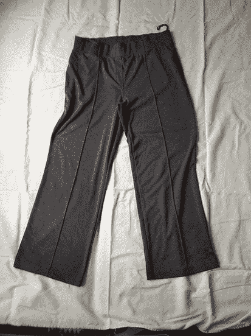

图 8.2 我们用于测试的裤子图片

结果是一个形状为(1, 299, 299, 3)的 NumPy 数组：

+   这是一个仅包含一张图像的批次。

+   299 × 299 是图像的大小。

+   有三个通道：红色、绿色和蓝色。

我们已经准备好了图像，并且准备好使用模型对其进行分类。让我们看看如何使用 TF Lite 来完成这项工作。

### 8.1.4 使用 TensorFlow Lite 模型

我们已经有了上一步的数组`X`，现在我们可以使用 TF Lite 对其进行分类。

首先，导入 TF Lite：

```
import tflite_runtime.interpreter as tflite
```

加载我们之前转换的模型：

```
interpreter = tflite.Interpreter(model_path='clothing-model-v4.tflite')   ❶
interpreter.allocate_tensors()                                            ❷
```

❶ 创建 TF Lite 解释器

❷ 使用模型初始化解释器

为了能够使用模型，我们需要获取其输入（`X`将放入其中）和输出（我们从其中获取预测结果）：

```
input_details = interpreter.get_input_details()    ❶
input_index = input_details[0]['index']            ❶

output_details = interpreter.get_output_details()  ❷
output_index = output_details[0]['index']          ❷
```

❶ 获取输入：网络中接受数组 X 的部分

❷ 获取输出：网络中具有最终预测的部分

要应用模型，将之前准备的`X`放入输入，调用解释器，并从输出获取结果：

```
interpreter.set_tensor(input_index, X)        ❶
interpreter.invoke()                          ❷

preds = interpreter.get_tensor(output_index)  ❸
```

❶ 将 X 放入输入

❷ 运行模型以获取预测

❸ 从输出获取预测

`preds`数组包含预测结果：

```
array([[-1.8682897, -4.7612453, -2.316984 , -1.0625705,  9.887156 ,
        -2.8124316, -3.6662838,  3.2003622, -2.6023388, -4.8350453]],
      dtype=float32)
```

现在，我们可以像之前一样使用它——将标签分配给数组的每个元素：

```
labels = [
    'dress',
    'hat',
    'longsleeve',
    'outwear',
    'pants',
    'shirt',
    'shoes',
    'shorts',
    'skirt',
    't-shirt'
]

results = dict(zip(labels, preds[0]))
```

完成了！我们在`results`变量中有了预测结果：

```
{'dress': -1.8682897,
 'hat': -4.7612453,
 'longsleeve': -2.316984,
 'outwear': -1.0625705,
 'pants': 9.887156,
 'shirt': -2.8124316,
 'shoes': -3.6662838,
 'shorts': 3.2003622,
 'skirt': -2.6023388,
 't-shirt': -4.8350453}
```

我们看到`pants`标签的分数最高，所以这肯定是一张裤子的图片。

现在让我们使用这段代码来构建我们未来的 AWS Lambda 函数！

### 8.1.5 Lambda 函数的代码

在上一节中，我们编写了 lambda 函数所需的全部代码。现在让我们将其整合到一个名为 lambda_function.py 的单个脚本中。

如同往常，从导入开始：

```
import tflite_runtime.interpreter as tflite
from keras_image_helper import create_preprocessor
```

然后，创建预处理程序：

```
preprocessor = create_preprocessor('xception', target_size=(299, 299))
```

接下来，加载模型，获取输出和输入：

```
interpreter = tflite.Interpreter(model_path='clothing-model-v4.tflite')
interpreter.allocate_tensors()

input_details = interpreter.get_input_details()
input_index = input_details[0]['index']

output_details = interpreter.get_output_details()
output_index = output_details[0]['index']
```

为了让它更整洁，我们可以将所有生成预测的代码放在一个函数中：

```
def predict(X):
    interpreter.set_tensor(input_index, X)
    interpreter.invoke()
    preds = interpreter.get_tensor(output_index)
    return preds[0]
```

接下来，让我们创建另一个用于准备结果的函数：

```
labels = [
    'dress',
    'hat',
    'longsleeve',
    'outwear',
    'pants',
    'shirt',
    'shoes',
    'shorts',
    'skirt',
    't-shirt'
]

def decode_predictions(pred):
    result = {c: float(p) for c, p in zip(labels, pred)}
    return result
```

最后，将所有内容整合到一个名为`lambda_handler`的函数中——这是 AWS Lambda 环境调用的函数。它将使用我们之前定义的所有内容：

```
def lambda_handler(event, context):
    url = event['url']
    X = preprocessor.from_url(url)
    preds = predict(X)
    results = decode_predictions(preds)
    return results
```

在这种情况下，`event`参数包含我们请求中传递给 lambda 函数的所有信息（图 8.3）。`context`参数通常不使用。

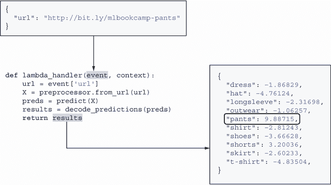

图 8.3 Lambda 函数的输入和输出：输入传递给`event`参数，预测结果作为输出返回。

我们现在可以开始测试了！为了本地测试，我们需要将此代码放入 AWS Lambda 的 Python Docker 容器中。

### 8.1.6 准备 Docker 镜像

首先，创建一个名为 Dockerfile 的文件：

```
FROM public.ecr.aws/lambda/python:3.7                                      ❶

RUN pip3 install keras_image_helper --no-cache-dir                         ❷
RUN pip3 install https://raw.githubusercontent.com/alexeygrigorev/serverless-deep-learning
➥/master/tflite/tflite_runtime-2.2.0-cp37-cp37m-linux_x86_64.whl 
➥--no-cache-dir                                                           ❸

COPY clothing-model-v4.tflite clothing-model-v4.tflite                     ❹
COPY lambda_function.py lambda_function.py                                 ❺

CMD [ "lambda_function.lambda_handler" ]                                   ❻
```

❶ 使用官方 Docker 镜像

❷ 安装 keras_image_helper

❸ 安装 TF Lite

❹ 复制模型

❺ 复制 lambda 函数

❻ 定义 lambda 函数的位置

让我们查看文件中的每一行。首先 ❶，我们使用 AWS Lambda 的官方 Python 3.7 Docker 镜像。你可以在这里看到其他可用的镜像：[`gallery.ecr.aws/`](https://gallery.ecr.aws/)。然后 ❷，我们安装 keras_image_helper 库。

接下来 ❸，我们安装了一个专门为与 Amazon Linux 一起工作而编译的 TF Lite 特殊版本。我们本章前面使用的安装说明在 Amazon Linux 上不适用，只适用于 Ubuntu（以及其他基于 Debian 的发行版）。这就是为什么我们需要使用特殊版本。你可以在这里了解更多信息：[`github.com/alexeygrigorev/serverless-deep-learning.`](https://github.com/alexeygrigorev/serverless-deep-learning)

然后 ❹，我们将模型复制到镜像中。这样做后，模型成为镜像的一部分。这样，部署模型就更加简单。我们也可以使用另一种方法——模型可以放在 S3 上，在脚本启动时加载。这更复杂，但也更灵活。对于本书，我们选择了更简单的方法。

然后 ❺，我们复制之前准备的 lambda 函数的代码。

最后 ❻，我们告诉`lambda`环境需要查找名为 lambda_function 的文件，并在该文件中查找名为`lambda_handler`的函数。这是我们之前章节中准备的函数。

让我们构建这个镜像：

```
docker build -t tf-lite-lambda .
```

接下来，我们需要检查 lambda 函数是否正常工作。让我们运行这个镜像：

```
docker run --rm -p 8080:8080 tf-lite-lambda
```

它正在运行！我们现在可以测试它了。

我们可以继续使用我们之前创建的 Jupyter Notebook，或者我们可以创建一个名为 test.py 的单独 Python 文件。它应该包含以下内容——你会注意到它与我们在第五章中为测试我们的网络服务所编写的代码非常相似：

```
import requests

data = {                                                                  ❶
    "url": "http://bit.ly/mlbookcamp-pants"
}

url = "http://localhost:8080/2015-03-31/functions/function/invocations"  ❷

results = requests.post(url, json=data).json()                            ❸
print(results)                                                            ❸
```

❶准备请求

❷指定 URL

❸向服务发送 POST 请求

首先，我们在❶中定义`data`变量——这是我们请求。然后我们指定服务的 URL 在❷——这是函数当前部署的位置。最后，在❸中，我们使用 POST 方法提交请求，并在`results`变量中获取预测结果。

当我们运行它时，我们得到以下响应：

```
{
  "dress": -1.86829,
  "hat": -4.76124,
  "longsleeve": -2.31698,
  "outwear": -1.06257,
  "pants": 9.88715,
  "shirt": -2.81243,
  "shoes": -3.66628,
  "shorts": 3.20036,
  "skirt": -2.60233,
  "t-shirt": -4.83504
}
```

模型工作正常！

我们几乎准备好将其部署到 AWS 了。为此，我们首先需要将此镜像发布到 ECR——AWS 的 Docker 容器注册表。

### 8.1.7 将镜像推送到 AWS ECR

要将此 Docker 镜像发布到 AWS，我们首先需要使用 AWS CLI 工具创建一个注册表：

```
aws ecr create-repository --repository-name lambda-images
```

它将返回一个看起来像这样的 URL：

```
<ACCOUNT_ID>.dkr.ecr.<REGION>.amazonaws.com/lambda-images
```

你需要这个 URL。

或者，也可以使用 AWS 控制台创建注册表。

一旦创建注册表，我们需要将镜像推送到那里。因为这个注册表属于我们的账户，我们首先需要验证我们的 Docker 客户端。在 Linux 和 MacOS 上，你可以这样做：

```
$(aws ecr get-login --no-include-email)
```

在 Windows 上，运行`aws` `ecr` `get-login` `--no-include-email`，复制输出，将其输入到终端，并手动执行。

现在让我们使用注册表 URL 将镜像推送到 ECR：

```
REGION=eu-west-1        ❶
ACCOUNT=XXXXXXXXXXXX    ❶
REMOTE_NAME=${ACCOUNT}.dkr.ecr.${REGION}.amazonaws.com/lambda-images:tf-lite-lambda
docker tag tf-lite-lambda ${REMOTE_NAME}
docker push ${REMOTE_NAME}
```

❶指定区域和您的 AWS 账户 ID。

现在已经推送，我们可以用它来在 AWS 中创建一个 lambda 函数。

### 8.1.8 创建 lambda 函数

这个步骤使用 AWS 控制台更容易完成，所以打开它，转到服务，并选择 Lambda。

接下来，点击创建函数。选择容器镜像（图 8.4）。

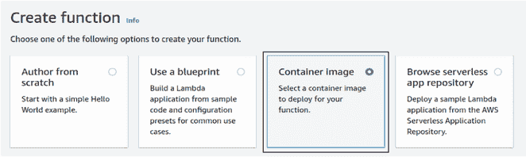

图 8.4 创建`lambda`函数时，选择容器镜像。

之后，填写详细信息（图 8.5）。

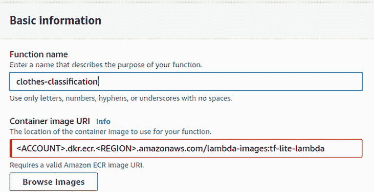

图 8.5 输入函数名称和容器镜像 URI。

容器镜像 URI 应该是我们之前创建并推送到 ECR 的镜像：

```
<ACCOUNT>.dkr.ecr.<REGION>.amazonaws.com/lambda-images:tf-lite-lambda
```

你可以使用浏览图片按钮找到它（图 8.5）。其余部分保持不变，然后点击创建函数。函数已创建！

现在我们需要给我们的函数更多的内存，并让它运行更长的时间而不超时。为此，选择配置选项卡，选择常规配置，然后点击编辑（图 8.6）。

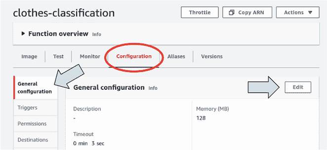

图 8.6 Lambda 函数的默认设置：默认的内存量（128 MB）不足，因此我们需要增加它。点击编辑来进行修改。

默认设置对深度学习模型来说不好。我们需要配置这个函数，给它更多的 RAM，并允许它有更多的时间。

为了这样做，点击编辑按钮，给它 1024 MB 的 RAM，并将超时设置为 30 秒（图 8.7）。

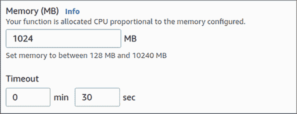

图 8.7 将内存量增加到 1024 MB，并将超时设置为 30 秒。

保存它。

已准备好！要测试它，请转到“测试”标签页（图 8.8）。

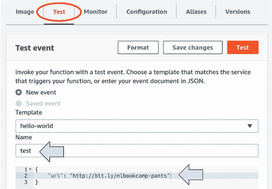

图 8.8 测试按钮位于屏幕顶部。点击它以测试函数。

它会建议创建一个测试事件。给它起个名字（例如，test），并在请求体中放入以下内容：

```
{
    "url": "http://bit.ly/mlbookcamp-pants"
}
```

保存并再次点击“测试”按钮。大约 15 秒后，你应该会看到“执行结果：成功”（图 8.9）。

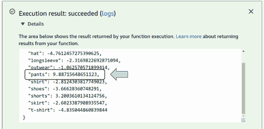

图 8.9 我们模型的预测。对于“裤子”的预测得分最高。

当我们第一次运行测试时，它需要从 ECR 拉取镜像，将所有库加载到内存中，并做一些其他事情以“预热”。但一旦完成，后续的调用所需时间会更少——这个模型大约需要两秒钟。

我们已成功将模型部署到 AWS Lambda，并且它正在运行！

此外，请记住，你只有在函数被调用时才需要付费，所以如果你没有使用这个函数，你不需要担心删除它。而且你也不需要担心管理 EC2 实例——AWS Lambda 会为我们处理一切。

已经可以使用这个模型做很多事情：AWS Lambda 与 AWS 的许多其他服务很好地集成。但如果我们想将其作为 Web 服务并通过 HTTP 发送请求，我们需要通过 API 网关将其公开。

我们将在下一部分展示如何进行这项操作。

### 8.1.9 创建 API 网关

在 AWS 控制台中，找到 API 网关服务。创建一个新的 API：选择 REST API，并点击“构建”。

然后选择“新建 API”，将其命名为“clothes-classification”（图 8.10）。点击“创建 API”。

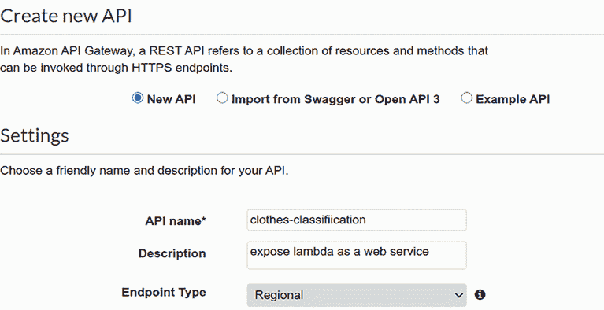

图 8.10 在 AWS 中创建新的 REST API 网关

接下来，点击“操作”按钮并选择“资源”。然后，创建一个名为 predict 的资源（图 8.11）。

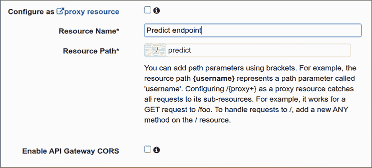

图 8.11 创建预测资源

注意：predict 这个名字不符合 REST 命名规范：通常资源应该是名词。然而，将预测端点命名为 predict 是常见的；这就是为什么我们不遵循 REST 规范。

创建资源后，为它创建一个 POST 方法（图 8.12）：

1.  点击“预测”。

1.  点击“操作”。

1.  选择“创建方法”。

1.  从列表中选择 POST。

1.  点击勾选按钮。

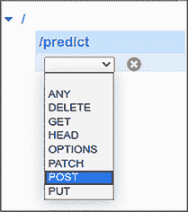

图 8.12 为预测资源创建一个 POST 方法。

我们几乎准备好了！

现在将 Lambda 函数作为集成类型，并输入你的 lambda 函数名称（图 8.13）。

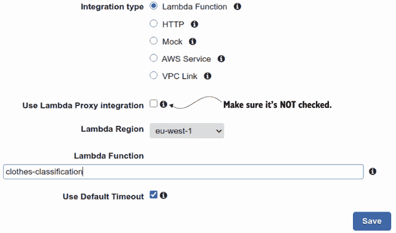

图 8.13 为预测资源配置 POST 操作。确保不要勾选“代理集成”。

注意：确保不要使用代理集成——这个复选框应该保持未勾选状态。如果你使用这个选项，API 网关会在请求中添加一些额外的信息，我们就需要调整 lambda 函数。

完成这些操作后，我们应该能看到集成（图 8.14）。

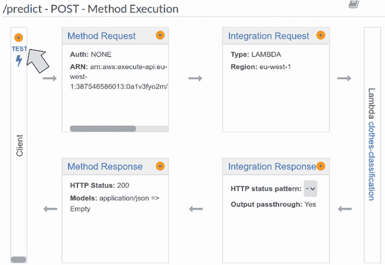

图 8.14 部署 API

让我们测试一下。点击 TEST，并在请求体中放入之前相同的请求：

```
{
    "url": "http://bit.ly/mlbookcamp-pants"
}
```

响应相同：预测的类别是 `pants`（图 8.15）。

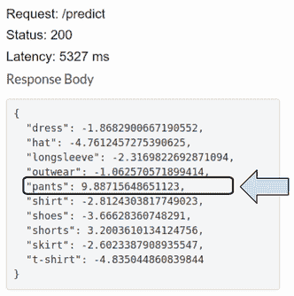

图 8.15 lambda 函数的响应。`pants` 类别的分数最高。

要在外部使用它，我们需要部署 API。从操作列表中选择部署 API（图 8.16）。

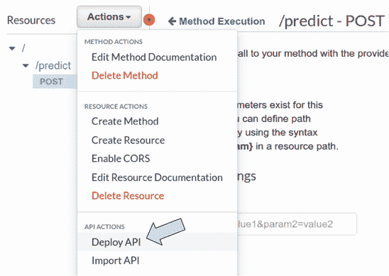

图 8.16 函数 `clothes-classification` 现在已连接到 API Gateway 中的 predict 资源的 POST 方法。TEST 按钮有助于验证与 lambda 的连接。

接下来，创建一个新的阶段测试（图 8.17）。

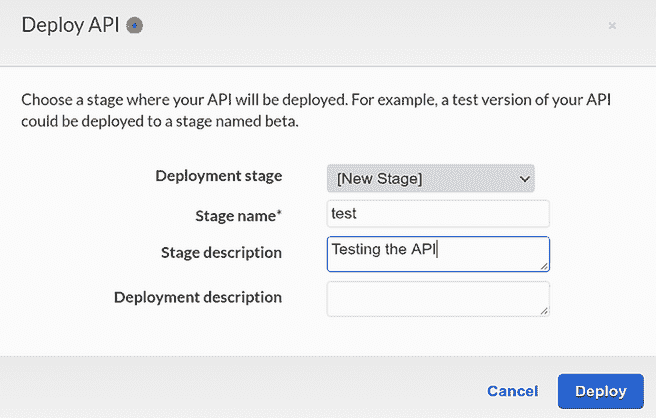

图 8.17 配置 API 的阶段

点击部署，我们部署了 API。现在找到调用 URL 字段。它应该看起来像这样：

[`0a1v3fyo2m.execute-api.eu-west-1.amazonaws.com/test`](https://0a1v3fyo2m.execute-api.eu-west-1.amazonaws.com/test)

现在我们只需要在 URL 末尾添加“/predict”即可调用 lambda 函数。

让我们使用之前创建的 test.py 脚本并替换那里的 URL：

```
import requests

data = {
    "url": "http://bit.ly/mlbookcamp-pants"
}

url = "https://0a1v3fyo2m.execute-api.eu-west-1.amazonaws.com/test/predict"

results = requests.post(url, json=data).json()

print(results)
```

运行它：

```
python test.py
```

响应与之前相同：

```
{
  "dress": -1.86829,
  "hat": -4.76124,
  "longsleeve": -2.31698,
  "outwear": -1.06257,
  "pants": 9.88715,
  "shirt": -2.81243,
  "shoes": -3.66628,
  "shorts": 3.20036,
  "skirt": -2.60233,
  "t-shirt": -4.83504
}
```

现在我们的模型通过一个我们可以从任何地方使用的网络服务公开。

## 8.2 下一步

### 8.2.1 练习

尝试以下操作以进一步探索无服务器模型部署的主题：

+   AWS Lambda 不是唯一的无服务器环境。你还可以在 Google Cloud 中实验云函数，以及在 Azure 上的 Azure 函数。

+   SAM（Serverless Application Model）是 AWS 的一项工具，用于简化创建 AWS Lambda 函数的过程([`aws.amazon.com/serverless/sam/`](https://aws.amazon.com/serverless/sam/))。你可以使用它来重新实现本章的项目。

+   无服务器([`www.serverless.com/`](https://www.serverless.com/))是一个类似于 SAM 的框架。它不仅限于 AWS，也适用于其他云服务提供商。你可以尝试它，并从本章部署项目。

### 8.2.2 其他项目

你可以做很多其他项目：

+   AWS Lambda 是托管机器学习模型的便捷平台。在本章中，我们部署了一个深度学习模型。你也可以进一步实验，并将我们在前几章训练的模型以及作为练习一部分开发的模型部署。

## 摘要

+   TensorFlow Lite 是“完整”TensorFlow 的轻量级替代品。它只包含使用深度学习模型所需的最重要部分。使用它可以使使用 AWS Lambda 部署模型的过程更快、更简单。

+   Lambda 函数可以在本地使用 Docker 运行。这样，我们可以在不部署到 AWS 的情况下测试我们的代码。

+   要部署 lambda 函数，我们需要将其代码放入 Docker 中，将 Docker 镜像发布到 ECR，然后在创建 lambda 函数时使用镜像的 URI。

+   为了暴露 Lambda 函数，我们使用了 API Gateway。这样，我们将 Lambda 函数作为一项网络服务提供，任何人都可以使用它。

在本章中，我们使用了 AWS Lambda——一种用于部署深度学习模型的免服务器方法。我们不想担心服务器，而是让环境来处理这个问题。

在下一章中，我们实际上开始考虑服务器，并使用 Kubernetes 集群来部署模型。
