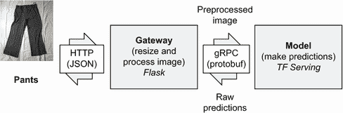
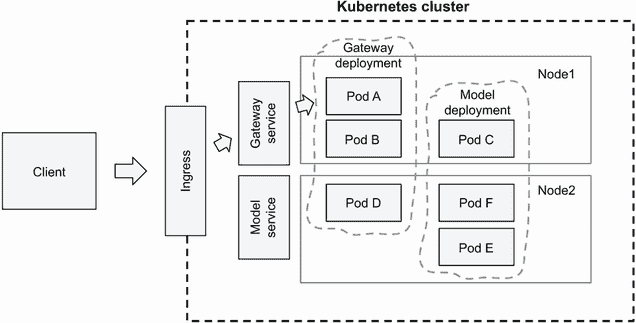
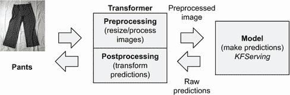

# 9 使用 Kubernetes 和 Kubeflow 提供模型服务

本章涵盖

+   理解在云中部署和提供模型的不同方法

+   使用 TensorFlowServing 提供 Keras 和 TensorFlow 模型服务

+   将 TensorFlow Serving 部署到 Kubernetes

+   使用 Kubeflow 和 KFServing 简化部署过程

在上一章中，我们讨论了使用 AWS Lambda 和 TensorFlow Lite 进行模型部署。

在本章中，我们讨论了模型部署的“服务器端”方法：我们在 Kubernetes 上使用 TensorFlow Serving 提供服装分类模型。我们还讨论了 Kubeflow，它是 Kubernetes 的一个扩展，使得模型部署更加容易。

我们将在本章中涵盖大量内容，但由于 Kubernetes 的复杂性，深入探讨细节是不可能的。因此，我们经常引用外部资源，以更深入地介绍一些主题。但请放心；你将学习到足够多的知识，以便能够舒适地使用它部署自己的模型。

## 9.1 Kubernetes 和 Kubeflow

Kubernetes 是一个容器编排平台。听起来很复杂，但实际上它只是一个我们可以部署 Docker 容器的场所。它负责将这些容器作为 Web 服务暴露出来，并根据我们接收到的请求数量上下调整这些服务。

Kubernetes 不是最容易学习的工具，但它非常强大。你可能会在某些时候需要使用它。这就是我们决定在本书中介绍它的原因。

Kubeflow 是建立在 Kubernetes 之上的另一个流行工具。它使得使用 Kubernetes 部署机器学习模型变得更加容易。在本章中，我们将介绍 Kubernetes 和 Kubeflow。

在第一部分，我们讨论 TensorFlow Serving 和纯 Kubernetes。我们讨论了如何使用这些技术进行模型部署。第一部分计划如下

+   首先，我们将 Keras 模型转换为 TensorFlow Serving 所使用的特殊格式。

+   然后，我们使用 TensorFlow Serving 在本地运行模型。

+   之后，我们创建一个服务来预处理图像并与 TensorFlow Serving 通信。

+   最后，我们使用 Kubernetes 同时部署模型和预处理服务。

注意：本章不试图深入探讨 Kubernetes。我们仅展示如何使用 Kubernetes 来部署模型，并经常引用更专业的资源，这些资源更详细地介绍了 Kubernetes。

在第二部分，我们使用 Kubeflow，这是 Kubernetes 上的一个工具，使得部署更加容易：

+   我们使用为 TensorFlow Serving 准备的相同模型，并使用 KFServing（Kubeflow 负责提供服务的部分）进行部署。

+   然后，我们创建一个转换器来预处理图像和后处理预测。

本章的代码可在本书的 GitHub 仓库中找到（[`github.com/alexeygrigorev/mlbookcamp-code/`](https://github.com/alexeygrigorev/mlbookcamp-code/)），位于 chapter-09-kubernetes 和 chapter-09-kubeflow 文件夹中。

让我们开始吧！

## 9.2 使用 TensorFlow Serving 提供模型服务

在第七章中，我们使用 Keras 预测图像的类别。在第八章中，我们将模型转换为 TF Lite，并使用 AWS Lambda 进行预测。在本章中，我们将使用 TensorFlow Serving 来完成这项工作。

TensorFlow Serving，通常简称为“TF Serving”，是一个专为提供 TensorFlow 模型而设计的系统。与专为移动设备制作的 TF Lite 不同，TF Serving 专注于服务器。通常，服务器具有 GPU，TF Serving 知道如何利用它们。

AWS Lambda 非常适合实验和应对少量图像——每天少于一百万张。但是，当我们超过这个数量并获得更多图像时，AWS Lambda 变得昂贵。然后，使用 Kubernetes 和 TF Serving 部署模型是一个更好的选择。

仅使用 TF Serving 部署模型是不够的。我们还需要另一个服务来准备图像。接下来，我们将讨论我们将构建的系统架构。

### 9.2.1 服务架构概述

TF Serving 专注于唯一的一件事——提供模型服务。它期望接收到的数据已经准备好：图像已调整大小、预处理并发送为正确的格式。

这就是为什么仅仅将模型放入 TF Serving 还不够。我们需要一个额外的服务来处理数据预处理。

我们需要一个系统来提供深度学习模型的服务（如图 9.1 所示）：

+   网关：预处理部分。它获取我们需要进行预测的 URL，准备它，并将其发送到模型。我们将使用 Flask 来创建这个服务。

+   模型：实际模型的那个部分。我们将使用 TF Serving 来完成这项工作。


图 9.1 我们系统的双层架构。网关获取用户请求并准备数据，TF Serving 使用这些数据来进行预测。

与单一组件相比，使用两个组件的系统可能看起来是一个不必要的复杂性。在前一章中，我们不需要这样做。我们只有一个部分——lambda 函数。

在原则上，我们可以从那个 lambda 函数中提取代码，将其放入 Flask 中，并用于提供模型服务。这种方法确实可行，但可能不是最有效的方法。如果我们需要处理数百万张图像，合理利用资源是很重要的。

与单一组件相比，有两个独立的组件使得为每个部分选择正确的资源变得更容易：

+   除了预处理之外，网关还花费大量时间下载图像。它不需要强大的计算机来完成这项工作。

+   TF Serving 组件需要更强大的机器，通常带有 GPU。使用这样强大的机器来下载图像将是浪费。

+   我们可能需要许多网关实例，而只需要少数几个 TF Serving 实例。通过将它们分离成不同的组件，我们可以独立地扩展每个组件。

我们将从第二个组件——TF Serving 开始。

在第七章，我们训练了一个 Keras 模型。为了使用 TF Serving，我们需要将其转换为 TF Serving 使用的特殊格式，这被称为 *saved_model*。我们将在下一步进行此操作。

### 9.2.2 保存模型格式

我们之前训练的 Keras 模型以 h5 格式保存。TF Serving 无法读取 h5 格式：它期望模型以 saved_model 格式存在。在本节中，我们将 h5 模型转换为 saved_model 文件。

如果您没有第七章中的模型，可以使用 `wget` 下载它：

```
wget https://github.com/alexeygrigorev/mlbookcamp-code/releases/download/chapter7-model/xception_v4_large_08_0.894.h5
```

现在，让我们进行转换。我们可以从 Jupyter Notebook 或 Python 脚本中执行此操作。

在任何情况下，我们首先进行导入：

```
import tensorflow as tf
from tensorflow import keras
```

然后加载模型：

```
model = keras.models.load_model('xception_v4_large_08_0.894.h5')
```

最后，以 saved_model 格式保存它：

```
tf.saved_model.save(model, 'clothing-model')
```

就这样。运行此代码后，我们在 clothing-model 文件夹中保存了模型。

要能够稍后使用此模型，我们需要了解一些信息：

+   模型签名名称。模型签名描述了模型的输入和输出。您可以在此处了解更多关于模型签名的信息：[`www.tensorflow.org/tfx/serving/signature_defs.`](https://www.tensorflow.org/tfx/serving/signature_defs)

+   输入层的名称。

+   输出层的名称。

当使用 Keras 时，我们不需要担心它，但 TF Serving 要求我们必须有这些信息。

TensorFlow 内置了一个用于分析 saved_model 格式模型的特殊实用工具——`saved_model_cli`。我们不需要安装任何额外的软件。我们将使用此实用工具的 `show` 命令：

```
saved_model_cli show --dir clothing-model --all
```

让我们看看输出：

```
MetaGraphDef with tag-set: 'serve' contains the following SignatureDefs:

...

signature_def['serving_default']:                                     ❶
  The given SavedModel SignatureDef contains the following input(s):
    inputs['input_8'] tensor_info:                                  ❷
        dtype: DT_FLOAT
        shape: (-1, 299, 299, 3)
        name: serving_default_input_8:0
  The given SavedModel SignatureDef contains the following output(s):
    outputs['dense_7'] tensor_info:                                 ❸
        dtype: DT_FLOAT
        shape: (-1, 10)
        name: StatefulPartitionedCall:0
  Method name is: tensorflow/serving/predict
```

❶ 签名定义—serving_default

❷ 输入名称—input_8

❸ 输出名称—dense_7

在这个输出中，我们关注三件事：

+   模型的签名定义（signature_def）。在这种情况下，它是 `serving_default`。

+   输入 (`input_8`)。这是模型的输入名称。

+   输出 (`dense_7`)。这是模型输出层的名称。

注意：请注意这些名称——我们稍后调用此模型时需要用到它们。

模型已转换，现在我们准备好使用 TF Serving 提供服务。

### 9.2.3 在本地运行 TensorFlow Serving

在本地运行 TF Serving 最简单的方法之一是使用 Docker。您可以在官方文档中了解更多信息：[`www.tensorflow.org/tfx/serving/docker.`](https://www.tensorflow.org/tfx/serving/docker) 更多关于 Docker 的信息请参阅第五章。

我们需要做的只是调用 `docker` `run` 命令，指定模型路径及其名称：

```
docker run -it --rm \
    -p 8500:8500 \                                          ❶
    -v "$(pwd)/clothing-model:/models/clothing-model/1" \   ❷
    -e MODEL_NAME=clothing-model \                          ❸
    tensorflow/serving:2.3.0                                ❹
```

❶ 打开端口 8500 以提供服务

❷ 挂载我们的模型

❸ 指定模型名称

❹ 使用 TensorFlow Serving 镜像，版本 2.3.0

当运行时，我们使用三个参数：

+   `-p`: 将主机机器（我们运行 Docker 的计算机）上的端口 8500 映射到容器内部的端口 8500 ❶。

+   `-v`: 将模型文件放入 Docker 镜像内部 ❷。模型被放置在 /models/clothing-model/1，其中 clothing-model 是模型的名称，1 是版本号。

+   `-e`: 将 `MODEL_NAME` 变量设置为 `clothing-model` ❸，这是 ❷ 中的目录名称。

要了解更多关于 `docker` `run` 命令的信息，请参阅官方 Docker 文档 ([`docs.docker.com/engine/reference/run/`](https://docs.docker.com/engine/reference/run/))。

运行此命令后，我们应该在终端中看到日志：

```
2020-12-26 22:56:37.315629: I tensorflow_serving/core/loader_harness.cc:87] Successfully loaded servable version {name: clothing-model version: 1}
2020-12-26 22:56:37.321376: I tensorflow_serving/model_servers/server.cc:371] Running gRPC ModelServer at 0.0.0.0:8500 ...
[evhttp_server.cc : 238] NET_LOG: Entering the event loop ...
```

`Entering` `the` `event` `loop` 消息告诉我们 TF Serving 已成功启动并准备好接收请求。

但我们目前还不能使用它。为了准备一个请求，我们需要加载一个图像，对其进行预处理，并将其转换为特殊的二进制格式。接下来，我们将看到我们如何做到这一点。

### 9.2.4 从 Jupyter 调用 TF Serving 模型

对于通信，TF Serving 使用 gRPC——一种专为高性能通信设计的特殊协议。此协议依赖于 protobuf，这是一种有效的数据传输格式。与 JSON 不同，它是二进制的，这使得请求显著更紧凑。

要了解如何使用它，让我们首先从 Jupyter Notebook 中对这些技术进行实验。我们使用 gRPC 和 protobuf 连接到使用 TF Serving 部署的模型。之后，我们可以在下一节将此代码放入 Flask 应用程序中。

让我们开始。我们需要安装几个库：

+   grpcio：用于 Python 中的 gRPC 支持

+   tensorflow-serving-api：用于从 Python 使用 TF Serving

使用 `pip` 安装它们：

```
pip install grpcio==1.32.0 tensorflow-serving-api==2.3.0
```

我们还需要 keras_image_helper 库来预处理图像。我们已经在第八章中使用了这个库。如果您还没有安装它，请使用 `pip` 进行安装：

```
pip install keras_image_helper==0.0.1
```

接下来，创建一个 Jupyter Notebook。我们可以称它为 chapter-09-image-preparation。像往常一样，我们从导入开始：

```
import grpc
import tensorflow as tf

from tensorflow_serving.apis import predict_pb2
from tensorflow_serving.apis import prediction_service_pb2_grpc
```

我们导入了三样东西：

+   gRPC：用于与 TF Serving 通信

+   TensorFlow：用于 protobuf 定义（我们稍后会看到它是如何使用的。）

+   来自 TensorFlow Serving 的几个函数

现在，我们需要定义到我们服务的连接：

```
host = 'localhost:8500'
channel = grpc.insecure_channel(host)
stub = prediction_service_pb2_grpc.PredictionServiceStub(channel)
```

注意：我们使用了一个不安全的通道——一个不需要认证的通道。本章中所有服务之间的通信都在同一网络内部进行。这个网络对外界是关闭的，因此使用不安全的通道不会造成任何安全漏洞。设置安全通道是可能的，但超出了本书的范围。

对于图像预处理，我们使用 keras_image_helper 库，就像之前一样：

```
from keras_image_helper import create_preprocessor

preprocessor = create_preprocessor('xception', target_size=(299, 299))
```

让我们使用与第八章中（图 9.2）相同的裤子图片。


图 9.2 我们用于测试的裤子图片

让我们将其转换为 NumPy 数组：

```
url = "http://bit.ly/mlbookcamp-pants"
X = preprocessor.from_url(url)
```

我们在 `X` 中有一个 NumPy 数组，但我们不能直接使用它。对于 gRPC，我们需要将其转换为 protobuf。TensorFlow 有一个专门用于此的功能：`tf.make_tensor_proto`。

这就是我们的使用方法：

```
def np_to_protobuf(data):
    return tf.make_tensor_proto(data, shape=data.shape)
```

此函数接受两个参数：

+   一个 NumPy 数组：`data`，

+   此数组的维度：`data.shape`

注意：在这个例子中，我们使用 TensorFlow 将 NumPy 数组转换为 protobuf。TensorFlow 是一个庞大的库，所以仅仅为了一个小的函数而依赖它是不可取的。在本章中，我们这样做是为了简单起见，但在生产环境中你不应该这样做，因为使用带有大镜像的 Docker 可能会引发问题：下载镜像需要更多时间，并且它们会占用更多空间。查看此存储库以了解你可以做什么：[`github.com/alexeygrigorev/tensorflow-protobuf`](https://github.com/alexeygrigorev/tensorflow-protobuf)。

现在，我们可以使用 `np_to_protobuf` 函数来准备一个 gRPC 请求：

```
pb_request = predict_pb2.PredictRequest()                   ❶

pb_request.model_spec.name = 'clothing-model'               ❷
pb_request.model_spec.signature_name = 'serving_default'    ❸
pb_request.inputs['input_8'].CopyFrom(np_to_protobuf(X))    ❹
```

❶ 如果有一个项目，引入该项目

❷ 设置模型名称为 clothing-model

❸ 指定签名名称：serving_default

❹ 将 X 转换为 protobuf，并将其分配给 input_8

让我们逐行查看。首先，在 ❶ 中，我们创建了一个请求对象。TF Serving 使用这个对象中的信息来确定如何处理请求。

在 ❷ 中，我们指定了模型的名称。回想一下，当在 Docker 中运行 TF Serving 时，我们指定了 `MODEL_NAME` 参数——我们将其设置为 `clothing-model`。在这里，我们表示我们想要将请求发送到该模型。

在 ❸ 中，我们指定了想要查询的签名。当我们分析 saved_model 文件时，签名名称是 `serving_default`，所以我们在这里使用它。你可以在官方 TF Serving 文档中了解更多关于签名的信息（[`www.tensorflow.org/tfx/serving/signature_defs`](https://www.tensorflow.org/tfx/serving/signature_defs)）。

在 ❹ 中，我们做了两件事。首先，我们将 `X` 转换为 protobuf。然后，我们将结果设置到名为 `input_8` 的输入中。这个名称也来源于我们对 saved_model 文件的分析。

让我们执行它：

```
pb_result = stub.Predict(pb_request, timeout=20.0)
```

这向 TF Serving 实例发送了一个请求。然后 TF Serving 将模型应用于请求，并将结果发送回来。结果被保存到 `pb_result` 变量中。要从那里获取预测，我们需要访问其中一个输出：

```
pred = pb_result.outputs['dense_7'].float_val
```

注意，我们需要通过名称引用特定的输出——`dense_7`。在分析 saved_model 文件的签名时，我们也注意到了它——现在我们用它来获取预测结果。

`pred` 变量是一个浮点数列表——预测结果：

```
[-1.868, -4.761, -2.316, -1.062, 9.887, -2.812, -3.666, 3.200, -2.602, -4.835]
```

我们需要将这些数字列表转换为我们可以理解的东西——我们需要将其与标签连接起来。我们使用与之前章节相同的方法：

```
labels = [
    'dress',
    'hat',
    'longsleeve',
    'outwear',
    'pants',
    'shirt',
    'shoes',
    'shorts',
    'skirt',
    't-shirt'
]

result = {c: p for c, p in zip(labels, pred)}
```

这给出了最终结果：

```
{'dress': -1.868,
 'hat': -4.761,
 'longsleeve': -2.316,
 'outwear': -1.062,
 'pants': 9.887,
 'shirt': -2.812,
 'shoes': -3.666,
 'shorts': 3.200,
 'skirt': -2.602,
 't-shirt': -4.835}
```

我们看到 `pants` 标签具有最高的分数。

我们成功从 Jupyter Notebook 连接到 TF Serving 实例，并使用了 gRPC 和 protobuf 来实现这一点。现在让我们把这个代码放入一个网络服务中。

### 9.2.5 创建网关服务

我们已经有了与使用 TF Serving 部署的模型通信所需的所有代码。

然而，这段代码并不方便使用。我们模型的用户不需要担心下载图像、进行预处理、将其转换为 protobuf 以及我们做的所有其他事情。他们应该能够发送图像的 URL 并获取预测结果。

为了让我们的用户更容易使用，我们将所有这些代码放入一个网络服务中。用户将与服务交互，服务将与 TF Serving 通信。因此，服务将作为我们模型的网关。这就是为什么我们可以简单地称之为“网关”（图 9.3）。



图 9.3 网关服务是一个 Flask 应用，它获取图像的 URL 并准备它。然后它使用 gRPC 和 protobuf 与 TF Serving 进行通信。

我们使用 Flask 来创建这个服务。我们之前已经使用过 Flask；你可以参考第五章以获取更多详细信息。

网关服务需要做这些事情：

+   从请求中获取图像的 URL。

+   下载图像，预处理它，并将其转换为 NumPy 数组。

+   将 NumPy 数组转换为 protobuf，并使用 gRPC 与 TF Serving 通信。

+   后处理结果——将包含数字的原始列表转换为人类可理解的形式。

因此，让我们创建它！首先创建一个名为 model_server.py 的文件——我们将所有这些逻辑放在那里。

首先，我们获取与笔记本中相同的导入：

```
import grpc
import tensorflow as tf
from tensorflow_serving.apis import predict_pb2
from tensorflow_serving.apis import prediction_service_pb2_grpc

from keras_image_helper import create_preprocessor
```

现在，我们需要添加 Flask 导入：

```
from flask import Flask, request, jsonify
```

接下来，创建 gRPC stub 连接：

```
host = os.getenv('TF_SERVING_HOST', 'localhost:8500')    ❶
channel = grpc.insecure_channel(host)
stub = prediction_service_pb2_grpc.PredictionServiceStub(channel)
```

❶ 使 TF Serving URL 可配置

而不是简单地硬编码 TF Serving 实例的 URL，我们通过环境变量`TF_SERVING_HOST`使其可配置。如果没有设置变量，我们使用默认值`'localhost:8500'`。

现在，让我们创建预处理程序：

```
preprocessor = create_preprocessor('xception', target_size=(299, 299))
```

此外，我们还需要定义我们类的名称：

```
labels = [
    'dress',
    'hat',
    'longsleeve',
    'outwear',
    'pants',
    'shirt',
    'shoes',
    'shorts',
    'skirt',
    't-shirt'
]
```

而不是简单地从笔记本中复制粘贴代码，我们可以使代码更有组织，并将其放入两个函数中：

+   `make_request`：用于从 NumPy 数组创建 gRPC 请求

+   `process_response`：用于将类标签附加到预测中

让我们从`make_request`开始：

```
def np_to_protobuf(data):
    return tf.make_tensor_proto(data, shape=data.shape)

def make_request(X):
    pb_request = predict_pb2.PredictRequest()
    pb_request.model_spec.name = 'clothing-model'
    pb_request.model_spec.signature_name = 'serving_default'
    pb_request.inputs['input_8'].CopyFrom(np_to_protobuf(X))
    return pb_request
```

接下来，创建 process_response：

```
def process_response(pb_result):
    pred = pb_result.outputs['dense_7'].float_val
    result = {c: p for c, p in zip(labels, pred)}
    return result
```

最后，让我们将所有这些放在一起：

```
def apply_model(url):
    X = preprocessor.from_url(url)                       ❶
    pb_request = make_request(X)                         ❷
    pb_result = stub.Predict(pb_request, timeout=20.0)   ❸
    return process_response(pb_result)                   ❹
```

❶ 从提供的 URL 预处理图像

❷ 将 NumPy 数组转换为 gRPC 请求

❸ 执行请求

❹ 处理响应，并将标签附加到预测中

所有代码都已准备就绪。我们只需要做最后一件事：创建一个 Flask 应用和`predict`函数。让我们来做：

```
app = Flask('clothing-model')

@app.route('/predict', methods=['POST'])
def predict():
    url = request.get_json()
    result = apply_model(url['url'])
    return jsonify(result)

if __name__ == "__main__":
    app.run(debug=True, host='0.0.0.0', port=9696)
```

现在，我们已经准备好运行服务。在终端中执行此命令：

```
python model_server.py
```

等待它准备好。我们应该在终端中看到以下内容：

```
 * Running on http://0.0.0.0:9696/ (Press CTRL+C to quit)
```

让我们来测试一下！就像在第五章中一样，我们使用 requests 库来做这个。你可以打开任何 Jupyter Notebook。例如，你可以在我们用 gRPC 连接到 TF Serving 的同一个笔记本中继续。

我们需要发送一个带有 URL 的请求并显示响应。这是使用 requests 库来完成的方式：

```
import requests

req = {
    "url": "http://bit.ly/mlbookcamp-pants"
}

url = 'http://localhost:9696/predict'

response = requests.post(url, json=req)
response.json()
```

在这里，我们向我们的服务发送一个 POST 请求并显示结果。响应与之前相同：

```
{'dress': -1.868,
 'hat': -4.761,
 'longsleeve': -2.316,
 'outwear': -1.062,
 'pants': 9.887,
 'shirt': -2.812,
 'shoes': -3.666,
 'shorts': 3.200,
 'skirt': -2.602,
 't-shirt': -4.835}
```

服务已就绪并且本地工作正常。让我们使用 Kubernetes 来部署它！

## 9.3 使用 Kubernetes 进行模型部署

Kubernetes 是一个用于自动化容器部署的编排系统。我们可以用它来托管任何 Docker 容器。在本节中，我们将看到如何使用 Kubernetes 来部署我们的应用程序。

首先，我们将从介绍一些 Kubernetes 基础知识开始。

### 9.3.1 Kubernetes 简介

Kubernetes 中的主要抽象单元是*Pod*。Pod 包含一个单一的 Docker 镜像，当我们想要提供服务时，Pod 执行实际的工作。

Pods 存在于一个*节点*上——这是一个实际的机器。一个节点通常包含一个或多个 Pod。

部署一个应用程序，我们定义一个*部署*。我们指定应用程序应该有多少个 Pod 以及应该使用哪个镜像。当我们的应用程序开始接收到更多请求时，有时我们想要向我们的部署中添加更多 Pod 来处理流量的增加。这也可以自动发生——这个过程被称为*水平自动扩展*。

*服务*是部署中 Pod 的入口点。客户端与服务交互，而不是与单个 Pod 交互。当服务收到请求时，它会将其路由到部署中的一个 Pod。

Kubernetes 集群外部的客户端通过*入口*与集群内部的服务交互。

假设我们有一个名为 Gateway 的服务。对于这个服务，我们有一个包含三个 Pod 的部署（Gateway Deployment）——Pod A、Node 1 上的 Pod B 和 Node 2 上的 Pod D（图 9.4）。当客户端想要向服务发送请求时，它首先由入口处理，然后服务将请求路由到部署中的一个 Pod。在这个例子中，是部署在节点 1 上的 Pod A。Pod A 上的服务处理请求，客户端接收响应。



图 9.4 Kubernetes 集群的解剖结构。Pod 是我们应用程序的实例。它们存在于节点上——实际的机器。属于同一应用程序的 Pod 被分组在一个部署中。客户端与服务通信，服务将请求路由到部署中的一个 Pod。

这是对 Kubernetes 关键词汇的非常简短的介绍，但应该足以开始。要了解更多关于 Kubernetes 的信息，请参阅官方文档([`kubernetes.io/`](https://kubernetes.io/))。

在下一节中，我们将看到如何在 AWS 上创建我们自己的 Kubernetes 集群。

### 9.3.2 在 AWS 上创建 Kubernetes 集群

要能够将我们的服务部署到 Kubernetes 集群，我们需要有一个。我们有多个选项：

+   你可以在云中创建一个集群。所有主要的云服务提供商都使得在云中设置 Kubernetes 集群成为可能。

+   你可以使用 Minikube 或 MicroK8S 在本地设置它。你可以在这里了解更多信息：[`mlbookcamp.com/article/local-k8s.html`](https://mlbookcamp.com/article/local-k8s.html)。

在本节中，我们使用 AWS 的 EKS。EKS 代表 Elastic Kubernetes Service，是 AWS 提供的一项服务，允许我们以最小的努力创建一个 Kubernetes 集群。其他选择包括 Google Cloud 的 GKE（Google Kubernetes Engine）和 Azure 的 AKS（Azure Kubernetes Service）。

对于本节，你需要使用三个命令行工具：

+   AWS CLI：管理 AWS 资源。更多信息请参阅附录 A。

+   `eksctl`：管理 EKS 集群 ([`docs.aws.amazon.com/eks/latest/userguide/eksctl.html`](https://docs.aws.amazon.com/eks/latest/userguide/eksctl.html))。

+   `kubectl`：管理 Kubernetes 集群中的资源 ([`kubernetes.io/docs/tasks/tools/install-kubectl/`](https://kubernetes.io/docs/tasks/tools/install-kubectl/))。它适用于任何集群，而不仅仅是 EKS。

官方文档足以安装这些工具，但你也可以参考本书的网站获取更多信息 ([`mlbookcamp.com/article/eks`](https://mlbookcamp.com/article/eks))。

如果你没有使用 AWS 但使用的是其他云服务提供商，你需要使用他们的工具来设置 Kubernetes 集群。因为 Kubernetes 并未绑定到任何特定的供应商，所以本章中的大多数说明将适用于你拥有集群的任何位置。

一旦安装了 `eksctl` 和 AWS CLI，我们就可以创建一个 EKS 集群。

首先，准备一个包含集群配置的文件。在你的项目目录中创建一个名为 cluster.yaml 的文件：

```
apiVersion: eksctl.io/v1alpha5
kind: ClusterConfig

metadata:
  name: ml-bookcamp-eks
  region: eu-west-1
  version: "1.18"

nodeGroups:
  - name: ng
    desiredCapacity: 2
    instanceType: m5.xlarge
```

创建配置文件后，我们可以使用 `eksctl` 启动一个集群：

```
eksctl create cluster -f cluster.yaml
```

注意：创建集群需要 15-20 分钟，所以请耐心等待。

使用此配置，我们在 eu-west-1 区域创建了一个集群，集群中部署了 Kubernetes 版本 1.18。集群的名称是 ml-bookcamp-eks。如果你想将其部署到其他区域，你可以更改它。此集群将使用两台 m5.xlarge 机器。你可以在此处了解更多关于此类实例的信息：[`aws.amazon.com/ec2/instance-types/m5/`](https://aws.amazon.com/ec2/instance-types/m5/)。这对于我们在本章中需要进行的 Kubernetes 和 Kubeflow 的实验来说是足够的。

注意：EKS 不在 AWS 免费层中。你可以在 AWS 的官方文档中了解更多关于费用的信息 ([`aws.amazon.com/eks/pr-icing/`](https://aws.amazon.com/eks/pricing/))。

一旦创建，我们需要配置 `kubectl` 以便能够访问它。对于 AWS，我们使用 AWS CLI 来完成此操作：

```
aws eks --region eu-west-1 update-kubeconfig --name ml-bookcamp-eks
```

此命令应在默认位置生成一个 `kubectl` 配置文件。在 Linux 和 MacOS 上，此位置是 ~/.kube/config。

现在我们来检查一切是否正常工作，并确认我们可以使用 `kubectl` 连接到我们的集群：

```
kubectl get service
```

此命令返回当前正在运行的服务列表。我们还没有部署任何内容，所以我们预计只会看到一个服务——Kubernetes 本身。你应该看到以下结果：

```
NAME         TYPE        CLUSTER-IP   EXTERNAL-IP   PORT(S)   AGE
kubernetes   ClusterIP   10.100.0.1   <none>        443/TCP   6m17s
```

连接成功，现在我们可以部署一个服务。为此，我们首先需要准备一个包含实际服务的 Docker 镜像。让我们接下来做这件事。

### 9.3.3 准备 Docker 镜像

在前面的章节中，我们创建了服务系统的两个组件：

+   TF-Serving：包含实际模型的组件

+   Gateway：与 TF Serving 通信的图像预处理组件

现在我们部署它们。我们首先部署 TF Serving 镜像。

TensorFlow Serving 镜像

如第八章所述，我们首先需要将我们的镜像发布到 ECR——AWS 的 Docker 注册库。让我们创建一个名为 model-serving 的注册库：

```
aws ecr create-repository --repository-name model-serving
```

应该返回一个类似这样的路径：

```
<ACCOUNT>.dkr.ecr.<REGION>.amazonaws.com/model-serving
```

重要提示——我们稍后会需要这个路径。

当在本地运行 TF Serving 的 Docker 镜像时，我们使用了这个命令（你现在不需要运行它）：

```
docker run -it --rm \
    -p 8500:8500 \
    -v "$(pwd)/clothing-model:/models/clothing-model/1" \
    -e MODEL_NAME=clothing-model \
    tensorflow/serving:2.3.0
```

我们使用了`-v`参数将模型从`clothing-model`挂载到镜像内的/models/clothing-model/1 目录。

也可以使用 Kubernetes 来完成这个操作，但在这个章节中，我们遵循一个更简单的方法，将模型直接包含在镜像中，类似于我们在第八章中所做的。

让我们为它创建一个 Dockerfile。我们可以将其命名为 tf-serving.dockerfile：

```
FROM tensorflow/serving:2.3.0                 ❶

ENV MODEL_NAME clothing-model                 ❷
COPY clothing-model /models/clothing-model/1  ❸
```

❶ 使用 Tensorflow Serving 镜像作为其基础

❷ 设置 MODEL_NAME 变量为 clothing-model

❸ 将模型复制到/models/clothing-model/1

我们基于❶中的 TensorFlow Serving 镜像。接下来，在❷中，我们将环境变量`MODEL_NAME`设置为`clothing-model`，这相当于`-e`参数。接下来，在❸中，我们将模型复制到/models/clothing-model/1，这相当于使用`-v`参数。

注意：如果你想要使用带有 GPU 的计算机，请使用 tensorflow/serving :2.3.0-gpu 镜像（在 Dockerfile 中注释为❶）。

让我们构建它：

```
IMAGE_SERVING_LOCAL="tf-serving-clothing-model"
docker build -t ${IMAGE_SERVING_LOCAL} -f tf-serving.dockerfile .
```

接下来，我们需要将此镜像发布到 ECR。首先，我们需要使用 AWS CLI 对 ECR 进行认证：

```
$(aws ecr get-login --no-include-email)
```

注意：在输入命令时需要包含“`$`”。括号内的命令返回另一个命令。使用“`$()`”，我们执行这个命令。

接下来，使用远程 URI 标记镜像：

```
ACCOUNT=XXXXXXXXXXXX
REGION=eu-west-1
REGISTRY=${ACCOUNT}.dkr.ecr.${REGION}.amazonaws.com/model-serving
IMAGE_SERVING_REMOTE=${REGISTRY}:${IMAGE_SERVING_LOCAL}
docker tag ${IMAGE_SERVING_LOCAL} ${IMAGE_SERVING_REMOTE}
```

确保更改 ACCOUNT 和 REGION 变量。

现在我们已经准备好将图像推送到 ECR：

```
docker push ${IMAGE_SERVING_REMOTE}
```

已推送！现在我们需要对 Gateway 组件做同样的操作。

Gateway 镜像

现在让我们为 Gateway 组件准备图像。Gateway 是一个网络服务，它依赖于多个 Python 库：

+   Flask 和 Gunicorn

+   keras_image_helper

+   grpcio

+   TensorFlow

+   TensorFlow-Serving-API

记住，在第五章中，我们使用了 Pipenv 来管理依赖项。让我们在这里也使用它：

```
pipenv install flask gunicorn \
    keras_image_helper==0.0.1 \
    grpcio==1.32.0 \
    tensorflow==2.3.0 \
    tensorflow-serving-api==2.3.0 
```

运行此命令会创建两个文件：Pipfile 和 Pipfile.lock。

警告：尽管我们已经提到了这一点，但这是非常重要的，所以需要重复。在这里，我们只依赖于 TensorFlow 的一个功能。在生产环境中，最好不要安装 TensorFlow。在本章中，我们这样做是为了简单起见。而不是依赖于 TensorFlow，我们可以只取我们需要的 protobuf 文件，并显著减小我们的 Docker 镜像大小。有关说明，请参阅此存储库：[`github.com/alexeygrigorev/tensorflow-protobuf.`](https://github.com/alexeygrigorev/tensorflow-protobuf)

现在让我们创建一个 Docker 镜像。首先创建一个名为 gateway.dockerfile 的 Dockerfile，内容如下：

```
FROM python:3.7.5-slim

ENV PYTHONUNBUFFERED=TRUE

RUN pip --no-cache-dir install pipenv

WORKDIR /app

COPY ["Pipfile", "Pipfile.lock", "./"]
RUN pipenv install --deploy --system && \
    rm -rf /root/.cache
COPY "model_server.py" "model_server.py"

EXPOSE 9696

ENTRYPOINT ["gunicorn", "--bind", "0.0.0.0:9696", "model_server:app"] 
```

这个 Dockerfile 与我们之前拥有的文件非常相似。有关更多信息，请参阅第五章。

让我们现在构建这个镜像：

```
IMAGE_GATEWAY_LOCAL="serving-gateway"
docker build -t ${IMAGE_GATEWAY_LOCAL} -f gateway.dockerfile .
```

然后将其推送到 ECR：

```
IMAGE_GATEWAY_REMOTE=${REGISTRY}:${IMAGE_GATEWAY_LOCAL}
docker tag ${IMAGE_GATEWAY_LOCAL} ${IMAGE_GATEWAY_REMOTE}

docker push ${IMAGE_GATEWAY_REMOTE}
```

注意：为了验证这些镜像在本地很好地协同工作，您需要使用 Docker Compose ([`docs.docker.com/compose/`](https://docs.docker.com/compose/))。这是一个非常有用的工具，我们建议您花时间学习它，但在这里我们不会对其进行介绍。

我们已经将这两个镜像发布到 ECR，现在我们准备将服务部署到 Kubernetes！我们将在下一部分进行操作。

### 9.3.4 部署到 Kubernetes

在我们部署之前，让我们回顾一下 Kubernetes 的基础知识。在集群内部存在以下对象：

+   Pod：Kubernetes 中的最小单元。它是一个单独的进程，我们有一个 Docker 容器在一个 pod 中。

+   部署：多个相关 pods 的组。

+   服务：位于部署前面并路由请求到各个 pods 的组件。

要将应用程序部署到 Kubernetes，我们需要配置两件事：

+   部署：它指定了此部署的 pods 将如何看起来。

+   服务：指定如何访问服务以及服务如何连接到 pods。

让我们从配置 TF Serving 的部署开始。

部署 TF Serving

在 Kubernetes 中，我们通常使用 YAML 文件来配置一切。为了配置部署，我们在项目目录中创建一个名为 tf-serving-clothing-model-deployment.yaml 的文件，内容如下：

```
apiVersion: apps/v1
kind: Deployment                                                          ❶
metadata:
  name: tf-serving-clothing-model                                         ❷
  labels:
    app: tf-serving-clothing-model                                        ❷
spec:
  replicas: 1                                                             ❸
  selector:
    matchLabels:
      app: tf-serving-clothing-model                                      ❷
  template:
    metadata:
      labels:
        app: tf-serving-clothing-model                                    ❷
    spec:                                                                 ❹
      containers:                                                         ❹
      - name: tf-serving-clothing-model                                   ❷
        image: <ACCOUNT>.dkr.ecr.<REGION>.
               ➥amazonaws.com/model-serving:tf-serving-clothing-model    ❺
        ports:
          - containerPort: 8500                                           ❻
```

❶ 配置部署

❷ 指定部署的名称

❸ 仅创建一个服务实例——一个 pod

❹ 定义 pods 的规范

❺ 使用我们之前创建的镜像

❻ 公开端口 8500 这个配置相当长，所以让我们看看所有重要的行。

在 ❶ 中，我们指定了在这个 YAML 文件中我们想要配置的 Kubernetes 对象类型——它是一个部署。

在 ❷ 中，我们定义了部署的名称并设置了一些元数据信息。我们需要重复多次：一次用于设置部署的名称（“name”），以及几次（“labels: app”）用于我们稍后要配置的服务。

在 ❸ 中，我们设置了部署中我们想要的实例数——pods。

在 ❹ 中，我们指定了 pods 的配置——我们设置了所有 pods 都将拥有的参数。

在❺中，我们设置 Docker 镜像的 URI。Pod 将使用这个镜像。别忘了在那里也放入您的账户 ID 以及正确的区域。

最后，在❻中，我们打开此部署的 pods 上的 8500 端口。这是 TF Serving 使用的端口。

要了解更多关于在 Kubernetes 中配置部署的信息，请查看官方文档（[`kubernetes.io/docs/concepts/workloads/controllers/deployment`](https://kubernetes.io/docs/concepts/workloads/controllers/deployment/))。

我们有一个配置。现在我们需要使用它来创建一个 Kubernetes 对象——在我们的情况下是一个部署。我们通过使用`kubectl`的`apply`命令来完成：

```
kubectl apply -f tf-serving-clothing-model-deployment.yaml
```

`-f`参数告诉`kubectl`它需要从配置文件中读取配置。

为了验证它是否正在工作，我们需要检查是否出现了新的部署。这是我们可以获取所有活动部署列表的方法：

```
kubectl get deployments
```

输出应该看起来像这样：

```
NAME                        READY   UP-TO-DATE   AVAILABLE   AGE
tf-serving-clothing-model   1/1     1            1           41s
```

我们可以看到我们的部署在那里。此外，我们还可以获取 pods 的列表。它与获取所有部署的列表非常相似：

```
kubectl get pods
```

输出应该类似于以下内容：

```
NAME                                        READY   STATUS    RESTARTS   AGE
tf-serving-clothing-model-56bc84678d-b6n4r   1/1     Running    0         108s
```

现在我们需要在部署之上创建一个服务。

TF Serving 服务

我们希望从网关调用 TF Serving。为此，我们需要在 TF Serving 部署前面创建一个服务。

就像部署一样，我们首先为服务创建一个配置文件。它也是一个 YAML 文件。创建一个名为`tf-serving-clothing-model-service.yaml`的文件，内容如下：

```
apiVersion: v1
kind: Service
metadata:
  name: tf-serving-clothing-model      ❶
  labels:
    app: tf-serving-clothing-model     ❶
spec:                                  ❷
  ports:
    - port: 8500                       ❷
      targetPort: 8500                 ❷
      protocol: TCP
      name: http
  selector:                            ❸
    app: tf-serving-clothing-model     ❸
```

❶ 配置服务的名称

❷ 服务的规范——将要使用的端口

❸ 通过指定部署的标签将服务连接到部署

我们以相同的方式应用它——通过使用`apply`命令：

```
kubectl apply -f tf-serving-clothing-model-service.yaml
```

为了检查它是否工作，我们可以获取所有服务的列表，看看我们的服务是否在那里：

```
kubectl get services
```

我们应该看到类似以下的内容

```
NAME               TYPE         CLUSTER-IP       EXTERNAL-IP    PORT(S)     AGE
kubernetes         ClusterIP    10.100.0.1       <none>         443/TCP     84m
tf-serving-        ClusterIP    10.100.111.165   <none>         8500/TCP    19s
clothing-model 
```

除了默认的 Kubernetes 服务之外，我们还有一个 tf-serving-clothing-model，这是我们刚刚创建的服务。

要访问此服务，我们需要获取其 URL。内部 URL 通常遵循以下模式：

```
<service-name>.<namespace-name>.svc.cluster.local
```

`<service-name>`部分是 tf-serving-clothing-model。

我们没有为这个服务使用任何特定的命名空间，因此 Kubernetes 自动将服务放入“default”命名空间。我们在这里不会介绍命名空间，但你可以在官方文档（[`kubernetes.io/docs/concepts/overview/working-with-objects/namespaces/`](https://kubernetes.io/docs/concepts/overview/working-with-objects/namespaces/))中了解更多。

这是刚刚创建的服务的 URL：

```
tf-serving-clothing-model.default.svc.cluster.local
```

我们稍后会需要这个 URL，当配置网关时。

我们已经创建了 TF Serving 的部署以及服务。现在让我们创建一个网关的部署。

网关部署

如前所述，我们首先创建一个包含配置的 YAML 文件。创建一个名为`serving-gateway-deployment.yaml`的文件：

```
apiVersion: apps/v1
kind: Deployment
metadata:
  name: serving-gateway
  labels:
    app: serving-gateway
spec:
  replicas: 1
  selector:
    matchLabels:
      app: serving-gateway
  template:
    metadata:
      labels:
        app: serving-gateway
    spec:
      containers:
      - name: serving-gateway
        image: <ACCOUNT>.dkr.ecr.<REGION>.amazonaws.com/model-serving:serving-gateway
        ports:
          - containerPort: 9696
        env:                                                                  ❶
          - name: TF_SERVING_HOST                                             ❶
            value: "tf-serving-clothing-model.default.svc.cluster.local:8500" ❶
```

❶ 设置 TF_SERVING_HOST 环境变量的值

将图像 URL 中的`<ACCOUNT>`和`<REGION>`替换为您的值。

此部署的配置与 TF Serving 的部署非常相似，只有一个重要区别：我们通过将其设置为包含我们模型的服务（在列表中用粗体显示）的 URL 来指定 `TF_SERVING_HOST` 变量的值。

让我们应用这个配置：

```
kubectl apply -f serving-gateway-deployment.yaml
```

这应该会创建一个新的 Pod 和一个新的部署。让我们看看 Pod 列表：

```
kubectl get pod
```

的确，有一个新的 Pod 在那里：

```
NAME                                         READY   STATUS    RESTARTS   AGE
tf-serving-clothing-model-56bc84678d-b6n4r   1/1     Running   0          1h
serving-gateway-5f84d67b59-lx8tq             1/1     Running   0          30s
```

警告 Gateway 使用 gRPC 与 TF Serving 通信。当部署多个 TF Serving 实例时，您可能会遇到在这些实例之间分配负载的问题（[`kubernetes.io/blog/2018/11/07/grpc-load-balancing-on-kubernetes-without-tears/`](https://kubernetes.io/blog/2018/11/07/grpc-load-balancing-on-kubernetes-without-tears/)）。为了解决这个问题，您需要安装一个服务网格工具，如 Linkerd、Istio 或类似工具。与您的运维团队交谈，了解您在公司如何实现。

我们为 Gateway 创建了一个部署。现在我们需要为它配置服务。我们将在下一步进行。

Gateway 服务配置

我们为 Gateway 创建了一个部署，现在我们需要创建一个服务。这个服务与我们为 TF Serving 创建的服务不同——它需要公开访问，因此 Kubernetes 集群之外的服务可以使用它。为此，我们需要使用一种特殊类型的服务——LoadBalancer。它创建了一个外部负载均衡器，可在 Kubernetes 集群外部使用。在 AWS 的情况下，它使用 ELB，即弹性负载均衡服务。

让我们创建一个名为 serving-gateway-service.yaml 的配置文件：

```
apiVersion: v1
kind: Service
metadata:
  name: serving-gateway
  labels:
    app: serving-gateway
spec:
  type: LoadBalancer     ❶
  ports:
    - port: 80           ❷
      targetPort: 9696   ❷
      protocol: TCP
      name: http
  selector:
    app: serving-gateway
```

❶ 使用 LoadBalancer 类型

❷ 将 Pod 中的端口 9696 映射到服务的端口 80

在❶中，我们指定了服务的类型——LoadBalancer。

在❷中，我们将服务的端口 80 连接到 Pod 的端口 9696。这样，我们就不需要在连接服务时指定端口——它将使用默认的 HTTP 端口，即 80。

让我们应用这个配置：

```
kubectl apply -f serving-gateway-service.yaml
```

要查看服务的外部 URL，请使用 `describe` 命令：

```
kubectl describe service serving-gateway
```

它将输出有关服务的一些信息：

```
Name:                     serving-gateway
Namespace:                default
Labels:                   <none>
Annotations:              <none>
Selector:                 app=serving-gateway
Type:                     LoadBalancer
IP Families:              <none>
IP:                       10.100.100.24
IPs:                      <none>
LoadBalancer Ingress:     ad1fad0c1302141989ed8ee449332e39-117019527.eu-west-1.elb.amazonaws.com
Port:                     http  80/TCP
TargetPort:               9696/TCP
NodePort:                 http  32196/TCP
Endpoints:                <none>
Session Affinity:         None
External Traffic Policy:  Cluster
Events:
  Type    Reason                Age   From                  Message
  ----    ------                ----  ----                  -------
  Normal  EnsuringLoadBalancer   4s   service-controller    Ensuring load balancer
  Normal  EnsuredLoadBalancer    2s   service-controller    Ensured load balancer
```

我们对带有 `LoadBalancer` `Ingress` 的行感兴趣。这是我们访问 Gateway 服务的 URL。在我们的例子中，这是 URL：

```
ad1fad0c1302141989ed8ee449332e39-117019527.eu-west-1.elb.amazonaws.com
```

Gateway 服务已准备好使用。让我们开始吧！

### 9.3.5 测试服务

当在本地运行 TF Serving 和 Gateway 时，我们准备了一段简单的 Python 代码片段来测试我们的服务。让我们重用它。转到相同的笔记本，并将本地 IP 地址替换为上一节中获得的 URL：

```
import requests

req = {
    "url": "http://bit.ly/mlbookcamp-pants"
}

url = 'http://ad1fad0c1302141989ed8ee449332e39-117019527.eu-west-1.elb.amazonaws.com/predict'

response = requests.post(url, json=req)
response.json()
```

运行它。结果，我们得到与之前相同的预测：

```
{'dress': -1.86829,
 'hat': -4.76124,
 'longsleeve': -2.31698,
 'outwear': -1.06257,
 'pants': 9.88716,
 'shirt': -2.81243,
 'shoes': -3.66628,
 'shorts': 3.20036,
 'skirt': -2.60233,
 't-shirt': -4.83504}
```

它正在工作——这意味着我们刚刚成功使用 TF Serving 和 Kubernetes 部署了我们的深度学习模型！

重要提示：如果您完成了 EKS 的实验，别忘了关闭集群。如果您不关闭它，即使它是空闲的，您也需要为此付费。您可以在本章末尾找到有关如何操作的说明。

在本例中，我们仅从用户的角度介绍了 Kubernetes，而不是从运维的角度。我们还没有讨论自动扩展、监控、警报以及其他对于将机器学习模型投入生产所必需的重要主题。有关这些主题的更多详细信息，请参阅 Kubernetes 书籍或 Kubernetes 的官方文档。

你可能已经注意到，为了部署单个模型，我们需要做很多事情：创建 Docker 镜像，推送到 ECR，创建部署，创建服务。对于几个模型来说，这没问题，但如果需要为数十个或数百个模型这样做，就会变得有问题且重复。

有一个解决方案——Kubeflow。它使部署变得更容易。在下一节中，我们将看到如何使用它来托管 Keras 模型。

## 9.4 使用 Kubeflow 进行模型部署

Kubeflow 是一个旨在简化在 Kubernetes 上部署机器学习服务的项目。

它由一系列工具组成，每个工具都旨在解决特定问题。例如：

+   Kubeflow Notebooks Server：使集中托管 Jupyter Notebooks 变得更容易

+   Kubeflow Pipelines：自动化训练过程

+   Katib：为模型选择最佳参数

+   Kubeflow Serving（简称“KFServing”）：部署机器学习模型

以及许多其他内容。你可以在这里了解更多关于其组件的信息：[`www.kubeflow.org/docs/components/`](https://www.kubeflow.org/docs/components/)。

在本章中，我们专注于模型部署，因此我们只需要使用 Kubeflow 的一个组件——KFServing。

如果你想安装整个 Kubeflow 项目，请参阅官方文档。它包含了针对主要云提供商（如 Google Cloud Platform、Microsoft Azure 和 AWS）的安装说明。[`www.kubeflow.org/docs/aws/aws-e2e/`](https://www.kubeflow.org/docs/aws/aws-e2e/)。

关于在 AWS 上仅安装 KFServing 而不安装 Kubeflow 其余部分的说明，请参阅本书网站：[`mlbookcamp.com/article/kfserving-eks-install`](https://mlbookcamp.com/article/kfserving-eks-install)。我们使用这篇文章来设置本章其余部分的环境，但这里的代码应该可以通过少量修改与任何 Kubeflow 安装兼容。

注意：安装可能对你来说并不简单，尤其是如果你之前没有做过类似的事情。如果你对某些事情不确定，请向运维团队的人寻求帮助以设置它。

### 9.4.1 模型：将其上传到 S3

要使用 KFServing 部署 Keras 模型，我们首先需要将其转换为 saved_model 格式。我们之前已经完成了这个步骤，所以我们可以直接使用转换后的文件。

接下来，我们需要在 S3 中创建一个存储桶，我们将把我们的模型放在那里。让我们称它为 mlbookcamp-models-<NAME>，其中<NAME>可以是任何东西——例如，你的名字。存储桶名称必须在整个 AWS 中是唯一的。这就是为什么我们需要在存储桶的名称中添加一些后缀。它应该与我们的 EKS 集群在同一个区域。在我们的例子中，它是 eu-west-1。

我们可以使用 AWS CLI 创建它：

```
aws s3api create-bucket \
    --bucket mlbookcamp-models-alexey \
    --region eu-west-1 \
    --create-bucket-configuration LocationConstraint=eu-west-1
```

在创建存储桶之后，我们需要将模型上传到那里。为此，请使用 AWS CLI：

```
aws s3 cp --recursive clothing-model s3:/ /mlbookcamp-models-alexey/clothing-model/0001/
```

注意，结尾有“0001”。这很重要——KFServing，就像 TF Serving 一样，需要一个模型的版本。我们没有这个模型的任何先前版本，所以我们把“0001”加在结尾。

现在我们已经准备好部署这个模型了。

### 9.4.2 使用 KFServing 部署 TensorFlow 模型

在之前，当我们使用纯 Kubernetes 部署我们的模型时，我们需要配置一个部署然后一个服务。而不是这样做，KFServing 定义了一种特殊的 Kubernetes 对象——InferenceService。我们只需要配置一次，它将自动创建所有其他 Kubernetes 对象——包括服务和部署。

首先，创建另一个 YAML 文件（tf-clothes.yaml），内容如下：

```
apiVersion: "serving.kubeflow.org/v1beta1"
kind: "InferenceService"
metadata:
  name: "clothing-model"
spec:
  default:
    predictor:
      serviceAccountName: sa      ❶
      tensorflow:                 ❷
        storageUri: "s3:/ /mlbookcamp-models-alexey/clothing-model"
```

❶ 使用 serviceAccountName 访问 S3

❷ 在 S3 中指定包含模型的存储位置

当从 S3 访问模型时，我们需要指定服务账户名称以便能够获取模型。这告诉 KFServing 如何访问 S3 存储桶——我们在❶中指定它。关于在 EKS 上安装 KFServing 的文章也涵盖了这一点([`mlbookcamp.com/article/kfserving-eks-install`](https://mlbookcamp.com/article/kfserving-eks-install))。

就像通常的 Kubernetes 一样，我们使用`kubectl`应用此配置：

```
kubectl apply -f tf-clothing.yaml
```

因为它创建了一个 InferenceService 对象，我们需要使用`kubectl`的`get`命令获取此类对象的列表：

```
kubectl get inferenceservice
```

我们应该看到类似以下的内容：

```
NAME             URL                       READY      AGE
clothing-model   http://clothing-model...  True  ...  97s
```

如果我们的服务`READY`尚未为`True`，我们需要等待一会儿，直到它准备好。这可能需要 1-2 分钟。

现在请注意 URL 和模型的名称：

+   URL：[`clothing-model.default.kubeflow.mlbookcamp.com/v1/models/clothing-model`](https://clothing-model.default.kubeflow.mlbookcamp.com/v1/models/clothing-model)。在你的配置中，主机将不同，因此整个 URL 也将不同。

+   模型名称：clothing-model。

注意，URL 可能需要一些时间才能从我们的笔记本电脑上访问。DNS 的变化可能需要一些时间来传播。

### 9.4.3 访问模型

模型已部署。让我们使用它！为此，我们可以启动 Jupyter Notebook 或创建一个 Python 脚本文件。

KFServing 使用 HTTP 和 JSON，因此我们使用 requests 库与其通信。所以，让我们首先导入它：

```
import requests
```

接下来，我们需要使用图像预处理器来准备图像。它与之前使用的是同一个：

```
from keras_image_helper import create_preprocessor

preprocessor = create_preprocessor('xception', target_size=(299, 299))
```

现在，我们需要一个用于测试的图像。我们使用与上一节中相同的裤子图像，并使用相同的代码来获取它和预处理它：

```
image_url = "http://bit.ly/mlbookcamp-pants"
X = preprocessor.from_url(image_url)
```

`X` 变量包含一个 NumPy 数组。在我们将数据发送到 KFServing 之前，我们需要将其转换为列表：

```
data = {
    "instances": X.tolist()
}
```

我们已经有了请求。作为下一步，我们需要定义我们将发送请求的 URL。我们已经在上一节中有了它，但我们需要稍作修改：

+   使用 HTTPS 而不是 HTTP。

+   在 URL 的末尾添加 “:predict”。

经过这些更改，URL 如下所示：

```
url = 'https://clothing-model.default.kubeflow.mlbookcamp.com/v1/models/clothing-model:predict'
```

我们准备发送请求：

```
resp = requests.post(url, json=data)
results = resp.json()
```

让我们看看结果：

```
{'predictions': [[-1.86828923,
   -4.76124525,
   -2.31698346,
   -1.06257045,
   9.88715553,
   -2.81243205,
   -3.66628242,
   3.20036,
   -2.60233665,
   -4.83504581]]}
```

就像我们之前做的那样，我们需要将预测转换为人类可读的格式。我们通过将标签分配给结果的每个元素来实现：

```
pred = results['predictions'][0]

labels = [
    'dress',
    'hat',
    'longsleeve',
    'outwear',
    'pants',
    'shirt',
    'shoes',
    'shorts',
    'skirt',
    't-shirt'
]

result = {c: p for c, p in zip(labels, pred)}
```

这里是结果：

```
{'dress': -1.86828923,
 'hat': -4.76124525,
 'longsleeve': -2.31698346,
 'outwear': -1.06257045,
 'pants': 9.88715553,
 'shirt': -2.81243205,
 'shoes': -3.66628242,
 'shorts': 3.20036,
 'skirt': -2.60233665,
 't-shirt': -4.83504581}
```

我们已经部署了我们的模型，并且它可以被使用。

但我们不能期望使用我们模型的人会高兴于不得不自己准备图像。在下一节中，我们将讨论转换器——它们可以减轻预处理图像的负担。

### 9.4.4 KFServing 转换器

在上一节中，我们介绍了网关服务。它位于客户端和模型之间，负责将客户端的请求转换为模型期望的格式（图 9.5）。


图 9.5 网关服务负责预处理图像，因此我们的应用程序的客户端不需要这样做。

幸运的是，对于我们来说，我们不需要为 KFServing 引入另一个网关服务。相反，我们可以使用一个 *转换器*。

转换器负责

+   预处理来自客户端的请求并将其转换为我们的模型期望的格式

+   对模型输出的后处理——将其转换为客户端需要的格式

我们可以将上一节中的所有预处理代码放入一个转换器中（图 9.6）。



图 9.6 KFServing 转换器可以在预处理步骤中下载图像并准备它，以及在后处理步骤中为模型的输出附加标签。

就像我们手动创建的网关服务一样，KFServing 中的转换器是独立于模型部署的。这意味着它们可以独立地进行扩展和缩减。这是一件好事——它们执行不同类型的工作：

+   转换器正在执行 I/O 工作（下载图像）。

+   模型正在执行 CPU 密集型工作（应用神经网络进行预测）。

要创建一个转换器，我们需要安装 Python 的 KFServing 库并创建一个扩展 `KFModel` 类的类。

它看起来像这样：

```
class ImageTransformer(kfserving.KFModel):
    def preprocess(self, inputs):
        # implement pre-processing logic

    def postprocess(self, inputs):
        # implement post-processing logic
```

我们不会深入介绍如何构建自己的转换器，但如果你想了解如何做，请查看这篇文章：[`mlbookcamp.com/article/kfserving-transformers`](https://mlbookcamp.com/article/kfserving-transformers)。相反，对于这本书，我们准备了一个使用 keras_image_helper 库的转换器。你可以在这里查看其源代码：[`github.com/alexeygrigorev/kfserving-keras-transformer`](https://github.com/alexeygrigorev/kfserving-keras-transformer)。

让我们使用它。首先，我们需要删除旧的推理服务：

```
kubectl delete -f tf-clothes.yaml
```

然后，更新配置文件（tf-clothes.yaml），并在其中包含变换器部分（加粗）：

```
apiVersion: "serving.kubeflow.org/v1alpha2"
kind: "InferenceService"
metadata:
  name: "clothing-model"
spec:
  default:
    predictor:                                                      ❶
      serviceAccountName: sa
      tensorflow:
        storageUri: "s3:/ /mlbookcamp-models-alexey/clothing-model"
    transformer:                                                    ❷
      custom:
        container:
          image: "agrigorev/kfserving-keras-transformer:0.0.1"      ❸
          name: user-container
          env:
            - name: MODEL_INPUT_SIZE                                ❹
              value: "299,299"                                      ❹
            - name: KERAS_MODEL_NAME                                ❹
              value: "xception"                                     ❹
            - name: MODEL_LABELS                                    ❹
              value: "dress,hat,longsleeve,outwear,pants,
              ehttps://shirt,shoes,shorts,skirt,t-shirt"            ❹
```

❶ 在“预测器”部分定义了模型

❷ 在“变换器”部分定义了变换器

❸ 为变换器设置镜像

❹ 配置它——指定输入大小、模型名称和标签

除了我们之前提到的“预测器”部分之外，我们添加了另一个部分——“变换器”。我们使用的变换器是一个公开可用的镜像，位于 agrigorev/kfserving-keras-transformer:0.0.1。

它依赖于 keras_image_helper 库来进行变换。为此，我们需要设置三个参数：

+   `MODEL_INPUT_SIZE`: 模型期望的输入大小：299 x 299

+   `KERAS_MODEL_NAME`: 用于训练模型的 Keras 应用程序（[`keras.io/api/applications/`](https://keras.io/api/applications/)）中架构的名称

+   `MODEL_LABELS`: 我们想要预测的类别

让我们应用这个配置：

```
kubectl apply -f tf-clothes.yaml
```

等待几分钟，直到它准备好——使用`kubectl get inferenceservice`来检查状态。

部署完成后（`READY`为`True`），我们可以对其进行测试。我们将在下一节进行测试。

### 9.4.5 测试变换器

使用变换器，我们不需要担心准备镜像：只需发送镜像的 URL 即可。代码变得更加简单。

它看起来是这样的：

```
import requests

data = {
    "instances": [
        {"url": "http://bit.ly/mlbookcamp-pants"},
    ]
}

url = 'https://clothing-model.default.kubeflow.mlbookcamp.com/v1/models/clothing-model:predict'
result = requests.post(url, json=data).json()
```

服务的 URL 保持不变。结果包含预测：

```
{'predictions': [{'dress': -1.8682, 'hat': -4.7612, 'longsleeve': -2.3169, 
 'outwear': -1.0625, 'pants': 9.8871, 'shirt': -2.8124, 'shoes': -3.6662, 
 'shorts': 3.2003, 'skirt': -2.6023, 't-shirt': -4.8350}]}
```

就这样！现在我们可以使用这个模型了。

### 9.4.6 删除 EKS 集群

在尝试了 EKS 之后，别忘了关闭集群。使用`eksctl`来完成这个操作：

```
eksctl delete cluster --name ml-bookcamp-eks
```

要验证集群已被移除，你可以在 AWS 控制台中检查 EKS 服务页面。

## 9.5 下一步

你已经学到了训练用于预测衣服类型的分类模型所需的基本知识。我们已经涵盖了大量的内容，但还有更多内容需要学习，而本章无法全部涵盖。你可以通过做练习来更深入地探索这个主题。

### 9.5.1 练习

+   Docker Compose 是一个用于运行具有多个容器的应用程序的工具。在我们的示例中，网关需要与 TF Serving 模型通信；这就是为什么我们需要能够将它们链接起来。Docker Compose 可以帮助我们做到这一点。尝试在本地运行 TF Serving 和网关。

+   在本章中，我们使用了 AWS 的 EKS。为了学习 Kubernetes，在本地进行实验是有益的。使用 Minikube 或 Microk8s 在本地重现 TF Serving 和 Gateway 的示例。

+   在本章的所有实验中，我们使用了默认的 Kubernetes 命名空间。在实际应用中，我们通常为不同的应用程序组使用不同的命名空间。在了解了 Kubernetes 中的命名空间之后，然后在不同的命名空间中部署我们的服务。例如，你可以称其为“模型”。

+   KFServing 转换器是预处理数据的有力工具。我们尚未讨论如何自行实现它们，而是使用了已经实现的转换器。要了解更多关于它们的信息，请自行实现这个转换器。

### 9.5.2 其他项目

有许多项目你可以做来更好地学习 Kubernetes 和 Kubeflow：

+   在本章中，我们介绍了一个深度学习模型。它相当复杂，我们最终创建了两个服务。在第七章之前我们开发的其它模型较为简单，只需要一个简单的 Flask 应用来托管它们。你可以使用 Flask 和 Kubernetes 部署第二章、第三章和第六章中的模型。

+   KFServing 可以用于部署其他类型的模型，而不仅仅是 TensorFlow。用它来部署第三章和第六章中的 Scikit-learn 模型。

## 摘要

+   TensorFlow-Serving 是一个用于部署 Keras 和 TensorFlow 模型的系统。它使用 gRPC 和 protobuf 进行通信，并且高度优化以提供服务。

+   当使用 TensorFlow Serving 时，我们通常需要一个组件来将用户请求准备成模型期望的格式。这个组件隐藏了与 TensorFlow Serving 交互的复杂性，使得客户端更容易使用模型。

+   要在 Kubernetes 上部署某些内容，我们需要创建一个部署和一个服务。部署描述了应该部署的内容：Docker 镜像及其配置。服务位于部署之前，并将请求路由到各个容器。

+   Kubeflow 和 KFServing 简化了部署过程：我们只需要指定模型的存储位置，它们会自动处理创建部署、服务和其他重要事项。

+   KFServing 转换器使得预处理模型接收到的数据和后处理结果变得更加容易。有了转换器，我们不需要为预处理创建一个特殊的网关服务。
