# 附录 A. 准备环境

## A.1 安装 Python 和 Anaconda

对于本书中的项目，我们将使用 Anaconda，这是一个包含您所需的大部分机器学习包的 Python 发行版：NumPy、SciPy、Scikit-learn、Pandas 等等。

### A.1.1 在 Linux 上安装 Python 和 Anaconda

本节中的说明适用于您在远程机器或笔记本电脑上安装 Anaconda 的情况。尽管我们只在 Ubuntu 18.04 LTS 和 20.04 LTS 上进行了测试，但这个过程应该适用于大多数 Linux 发行版。

注意：建议使用 Ubuntu Linux 来运行本书中的示例。这不是一个严格的要求，您应该在其他操作系统上运行示例时不会遇到问题。如果您没有装有 Ubuntu 的计算机，您可以在云中在线租用一台。请参阅“在 AWS 上租用服务器”部分以获取更详细的说明。

几乎每个 Linux 发行版都预装了 Python 解释器，但始终有一个单独的 Python 安装是个好主意，以避免与系统 Python 发生冲突。使用 Anaconda 是一个很好的选择：它安装在用户目录中，并且不会干扰系统 Python。

要安装 Anaconda，您首先需要下载它。访问[`www.anaconda.com`](https://www.anaconda.com)，点击获取入门版。然后选择下载 Anaconda 安装程序。这应该会带您到[`www.anaconda.com/products/individual`](https://www.anaconda.com/products/individual)。

选择 64 位（x86）安装程序和最新可用的版本——写作时为 3.8（图 A.1）。

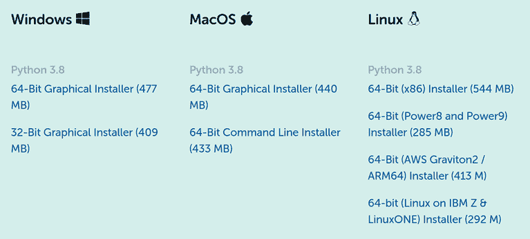

图 A.1 下载 Anaconda 的 Linux 安装程序

接下来，复制安装包的链接。在我们的例子中是[`repo.anaconda.com/archive/Anaconda3-2021.05-Linux-x86_64.sh`](https://repo.anaconda.com/archive/Anaconda3-2021.05-Linux-x86_64.sh)。

注意：如果 Anaconda 有新版本可用，您应该安装它。所有代码在新版本上都能正常工作，不会出现问题。

现在转到终端下载它：

```
wget  https://repo.anaconda.com/archive/Anaconda3-2021.05-Linux-x86_64.sh
```

然后安装它：

```
bash Anaconda3-2021.05-Linux-x86_64.sh 
```

阅读协议，如果您接受，请输入“yes”，然后选择您想要安装 Anaconda 的位置。您可以使用默认位置，但不必这么做。

在安装过程中，您将被询问是否想要初始化 Anaconda。输入“yes”，它将自动完成所有操作：

```
Do you wish the installer to initialize Anaconda3
by running conda init? [yes|no]
[no] >>> yes
```

如果您不想让安装程序初始化它，您可以通过将 Anaconda 的二进制文件位置添加到`PATH`变量中来手动完成。在主目录中打开`.bashrc`文件，并在末尾添加此行：

```
export PATH=~/anaconda3/bin:$PATH
```

安装完成后，您可以删除安装程序：

```
rm Anaconda3-2021.05-Linux-x86_64.sh
```

接下来，打开一个新的终端 shell。如果您正在使用远程机器，您可以通过按 Ctrl-D 退出当前会话，然后使用之前相同的`ssh`命令再次登录。

现在一切应该都能正常工作。你可以通过使用`which`命令来测试你的系统是否选择了正确的二进制文件：

```
which python
```

如果你是在 AWS 的 EC2 实例上运行，你应该看到类似这样的内容：

```
/home/ubuntu/anaconda3/bin/python
```

当然，路径可能不同，但应该是 Anaconda 安装的路径。

现在，你已经准备好使用 Python 和 Anaconda 了。

### A.1.2 在 Windows 上安装 Python 和 Anaconda

Windows 的 Linux 子系统

在 Windows 上安装 Anaconda 的推荐方法是使用 Windows 的 Linux 子系统。

要在 Windows 上安装 Ubuntu，请打开 Microsoft Store，在搜索框中查找 ubuntu；然后选择 Ubuntu 18.04 LTS（图 A.2）。

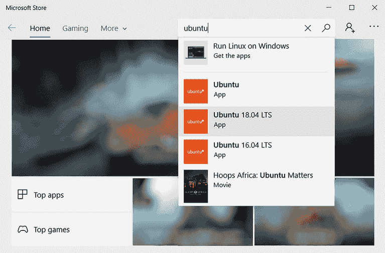

图 A.2 使用 Microsoft Store 在 Windows 上安装 Ubuntu。

要安装它，只需在下一个窗口中点击获取（图 A.3）。

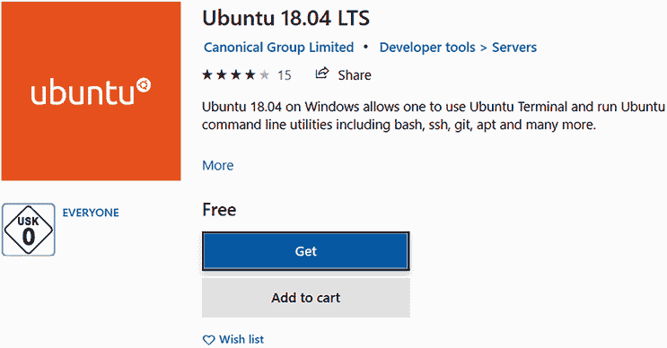

图 A.3 要在 Windows 上安装 Ubuntu 18.04，请点击获取。

安装完成后，我们可以通过点击启动按钮（图 A.4）来使用它。

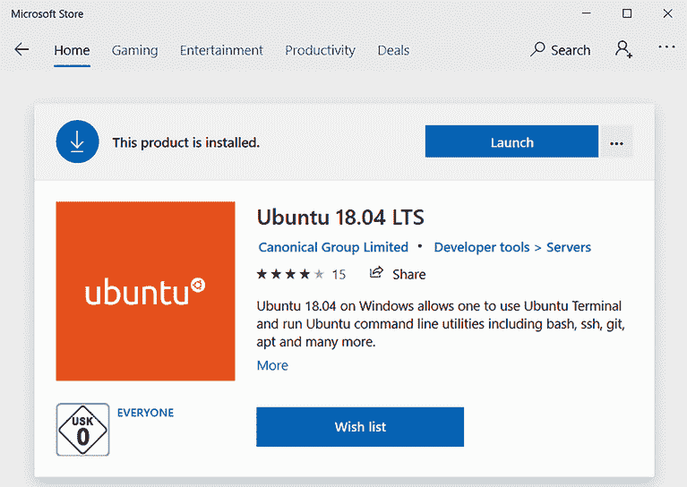

图 A.4 点击启动以运行 Ubuntu 终端。

首次运行时，它将要求你指定用户名和密码（图 A.5）。之后，终端就准备好使用了。

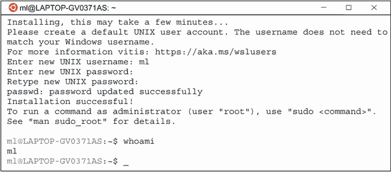

图 A.5 在 Windows 上运行的 Ubuntu 终端

现在，你可以使用 Ubuntu 终端并遵循 Linux 的说明来安装 Anaconda。

Anaconda Windows 安装程序

或者，我们可以使用 Anaconda 的 Windows 安装程序。首先，我们需要从[`anaconda.com/distribution`](https://anaconda.com/distribution)（图 A.6）下载它。导航到 Windows 安装程序部分并下载 64 位图形安装程序（或者如果你使用的是较旧的计算机，可以选择 32 位版本）。


图 A.6 下载 Anaconda 的 Windows 安装程序

下载安装程序后，只需运行它并按照设置指南（图 A.7）进行操作。

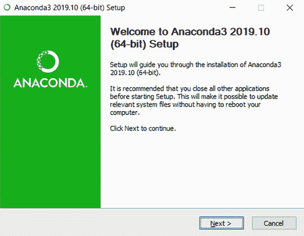

图 A.7 Anaconda 安装程序

这非常直接，你应该没有问题运行它。安装成功后，你应该可以通过从开始菜单中选择 Anaconda Navigator 来运行它。

### A.1.3 在 macOS 上安装 Python 和 Anaconda

macOS 的说明应该与 Linux 和 Windows 类似：选择带有最新 Python 版本的安装程序并执行它。

## A.2 运行 Jupyter

### A.2.1 在 Linux 上运行 Jupyter

安装 Anaconda 后，你可以运行 Jupyter。首先，你需要创建一个目录，Jupyter 将使用该目录来存储所有的 notebooks：

```
mkdir notebooks
```

然后`cd`到这个目录，从这里运行 Jupyter：

```
cd notebooks
```

它将使用此目录来创建 notebooks。现在让我们运行 Jupyter：

```
jupyter notebook
```

如果你想在本地计算机上运行 Jupyter，这应该足够了。如果你想在远程服务器上运行它，例如 AWS 的 EC2 实例，你需要添加一些额外的命令行选项：

```
jupyter notebook --ip=0.0.0.0 --no-browser
```

在这种情况下，你必须指定两个东西：

+   Jupyter 将用于接受传入 HTTP 请求的 IP 地址（`--ip=0.0.0.0`）。默认情况下，它使用 localhost，这意味着只能从计算机内部访问 Notebook 服务。

+   `--no-browser`参数，这样 Jupyter 就不会尝试使用默认的网页浏览器打开带有笔记本的 URL。当然，远程机器上没有网页浏览器，只有终端。

注意：在 AWS 上的 EC2 实例的情况下，你还需要配置安全规则，以允许实例在端口 8888 上接收请求。请参阅“在 AWS 上租用服务器”部分以获取更多详细信息。

当你运行此命令时，你应该会看到类似以下内容：

```
[C 04:50:30.099 NotebookApp] 

    To access the notebook, open this file in a browser:
        file:/ / /run/user/1000/jupyter/nbserver-3510-open.html
    Or copy and paste one of these URLs:
        http://(ip-172-31-21-255 or 127.0.0.1):8888/?token=670dfec7558c9a84689e4c3cdbb473e158d3328a40bf6bba
```

当启动时，Jupyter 会生成一个随机令牌。你需要这个令牌来访问网页。这是出于安全考虑，所以没有人可以访问 Notebook 服务，除了你。

从终端复制 URL，并将（ip-172-31-21-255 或 127.0.0.1）替换为实例 URL。你应该得到类似以下内容：

http://ec2-18-217-172-167.us-east-2.compute.amazonaws.com:8888/?token=f04317713e74e65289fe5a43dac43d5bf164c144d05ce613

此 URL 由三部分组成：

+   实例的 DNS 名称：如果你使用 AWS，你可以从 AWS 控制台或使用 AWS CLI 获取它。

+   端口（8888，这是 Jupyter 笔记本服务的默认端口）。

+   你刚刚从终端复制的令牌。

之后，你应该能够看到 Jupyter Notebooks 服务并创建一个新的笔记本（图 A.8）。

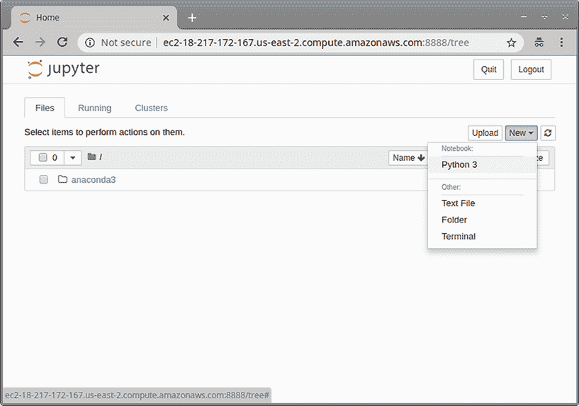

图 A.8 Jupyter Notebook 服务。现在你可以创建一个新的笔记本。

如果你使用的是远程机器，当你退出 SSH 会话时，Jupyter Notebook 服务将停止工作。内部进程附属于 SSH 会话，并将被终止。为了避免这种情况，你可以在 screen 工具中运行服务，这是一个用于管理多个虚拟终端的工具：

```
screen -R jupyter
```

此命令将尝试连接到名为 jupyter 的 screen，但如果不存在这样的 screen，它将创建一个。

然后，在 screen 内部，你可以输入相同的命令来启动 Jupyter Notebook：

```
jupyter notebook --ip=0.0.0.0 --no-browser
```

通过尝试从你的网页浏览器访问它来检查它是否工作。在确认它工作后，你可以通过按 Ctrl-A 后跟 D 来断开 screen：首先按 Ctrl-A，稍等片刻，然后按 D（对于 macOS，首先按 Ctrl-A 然后按 Ctrl-D）。screen 内部运行的所有内容都不附加到当前的 SSH 会话，所以当你断开 screen 并退出会话时，Jupyter 进程将继续运行。

你现在可以断开 SSH 连接（通过按 Ctrl-D）并验证 Jupyter URL 是否仍然可用。

### A.2.2 在 Windows 上运行 Jupyter

与 Python 和 Anaconda 一样，如果你使用 Windows 的 Linux 子系统安装 Jupyter，Linux 的说明也适用于 Windows。

默认情况下，Linux 子系统没有配置浏览器运行。因此，我们需要使用以下命令来启动 Jupyter：

```
jupyter notebook --no-browser
```

或者，我们可以将 `BROWSER` 变量设置为指向 Windows 中的浏览器：

```
export BROWSER='/mnt/c/Windows/explorer.exe'
```

然而，如果您没有使用 Linux 子系统，而是使用 Windows 安装程序安装 Anaconda，启动 Jupyter Notebook 服务的方式就不同了。

首先，我们需要在开始菜单中打开 Anaconda Navigator。一旦打开，在应用程序标签页中找到 Jupyter 并点击启动（图 A.9）。

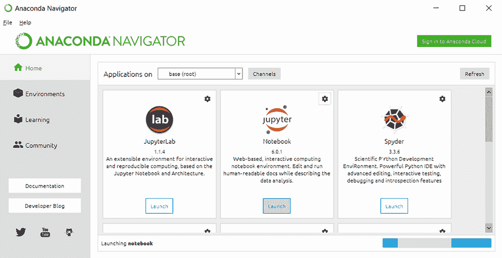

图 A.9 要运行 Jupyter Notebook 服务，在应用程序标签页中找到 Jupyter 并点击启动。

服务成功启动后，带有 Jupyter 的浏览器应该会自动打开（图 A.10）。

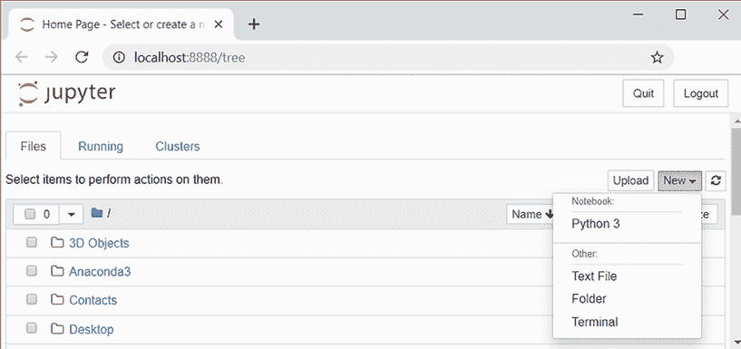

图 A.10 使用 Anaconda Navigator 启动的 Jupyter Notebook 服务

### A.2.3 在 MacOS 上运行 Jupyter

Linux 的说明也应该适用于 macOS，无需进行任何额外更改。

## A.3 安装 Kaggle CLI

Kaggle CLI 是访问 Kaggle 平台的命令行界面，包括 Kaggle 竞赛和 Kaggle 数据集的数据。

您可以使用 pip 安装它：

```
pip install kaggle --upgrade
```

然后，您需要对其进行配置。首先，您需要从 Kaggle 获取凭证。为此，请访问您的 Kaggle 个人资料（如果您还没有，请创建一个），位于 https://www.kaggle.com/<username>/account。URL 将类似于 [`www.kaggle.com/agrigorev/account`](https://www.kaggle.com/agrigorev/account)。

在 API 部分，点击创建新的 API 令牌（图 A.11）。

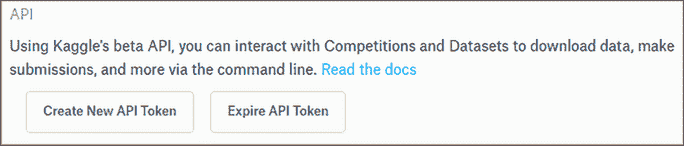

图 A.11 要生成用于 Kaggle CLI 的 API 令牌，请点击您的 Kaggle 账户页面上的创建新 API 令牌。

这将下载一个名为 kaggle.json 的文件，这是一个包含两个字段的 JSON 文件：`username` 和 `key`。如果您在下载文件的同一台计算机上配置 Kaggle CLI，只需将此文件移动到 Kaggle CLI 期望的位置：

```
mkdir ~/.kaggle
mv kaggle.json ~/.kaggle/kaggle.json
```

如果您在远程机器上配置它，例如 EC2 实例，您需要复制此文件的内容并将其粘贴到终端中。使用 nano 打开文件（如果不存在，将创建文件）：

```
mkdir ~/.kaggle
nano ~/.kaggle/kaggle.json
```

将您下载的 kaggle.json 文件的内容粘贴进去。通过按 Ctrl-O 保存文件，并通过按 Ctrl-X 退出 nano。

现在通过尝试列出可用的数据集来测试它是否正在工作：

```
kaggle datasets list
```

您还可以通过尝试第二章的数据集来测试它是否可以下载数据集：

```
kaggle datasets download -d CooperUnion/cardataset
```

它应该下载一个名为 cardataset.zip 的文件。

## A.4 访问源代码

我们已经将本书的源代码存储在 GitHub 上，这是一个托管源代码的平台。您可以在以下链接查看：[`github.com/alexeygrigorev/mlbookcamp-code`](https://github.com/alexeygrigorev/mlbookcamp-code)。

GitHub 使用 Git 来管理代码，因此您需要一个 Git 客户端来访问本书的代码。

Git 在所有主要的 Linux 发行版中都是预安装的。例如，我们用于在 AWS 上创建 Ubuntu 实例的 AMI 已经包含了它。

如果您的发行版没有 Git，安装它也很容易。例如，对于基于 Debian 的发行版（如 Ubuntu），您需要运行以下命令：

```
sudo apt-get install git
```

在 macOS 上，要使用 Git，您需要安装命令行工具，或者，作为替代，从 [`sourceforge.net/projects/git-osx-installer/`](https://sourceforge.net/projects/git-osx-installer/files/) 下载安装程序。

对于 Windows，您可以从 [`git-scm.com/download/win`](https://git-scm.com/download/win) 下载 Git。

一旦您安装了 Git，您就可以使用它来获取书中的代码。要访问它，您需要运行以下命令：

```
git clone https://github.com/alexeygrigorev/mlbookcamp-code.git
```

现在，您可以运行 Jupyter Notebook：

```
cd mlbookcamp-code
jupyter notebook
```

如果您没有 Git 且不想安装它，也可以在不使用 Git 的情况下访问代码。您可以从 zip 存档中下载最新代码并解压。在 Linux 上，您可以通过执行以下命令来完成此操作：

```
wget -O mlbookcamp-code.zip \
    https://github.com/alexeygrigorev/mlbookcamp-code/archive/master.zip  
unzip mlbookcamp-code.zip
rm mlbookcamp-code.zip
```

您也可以直接使用您的网络浏览器：输入 URL，下载 zip 存档，并提取内容。

## A.5 安装 Docker

在第五章，我们使用 Docker 将我们的应用程序打包到隔离的容器中。安装非常简单。

### A.5.1 在 Linux 上安装 Docker

这些步骤基于 Docker 网站上的官方 Ubuntu 指令（[`docs.docker.com/engine/install/ubuntu/`](https://docs.docker.com/engine/install/ubuntu/))。

首先，我们需要安装所有先决条件：

```
sudo apt-get update
sudo apt-get install apt-transport-https ca-certificates curl software-properties-common
```

接下来，我们添加包含 Docker 二进制文件的存储库：

```
curl -fsSL https://download.docker.com/linux/ubuntu/gpg | sudo apt-key add -
sudo add-apt-repository "deb [arch=amd64] https://download.docker.com/linux/ubuntu $(lsb_release -cs) stable"
```

现在，我们可以安装它：

```
sudo apt-get update 
sudo apt-get install docker-ce
```

最后，如果我们想在不使用 sudo 的情况下执行 Docker 命令，我们需要将我们的用户添加到 `docker` 用户组：

```
sudo adduser $(whoami) docker
```

现在，您需要重新启动您的系统。在 EC2 或其他远程机器的情况下，只需注销并重新登录即可。

要测试一切是否正常工作，运行 `hello-world` 容器：

```
docker run hello-world
```

您应该会看到一个表示一切正常的信息：

```
Hello from Docker!
This message shows that your installation appears to be working correctly.
```

### A.5.2 在 Windows 上安装 Docker

要在 Windows 上安装 Docker，您需要从官方网站下载安装程序（[`hub.docker.com/editions/community/docker-ce-desktop-windows/`](https://hub.docker.com/editions/community/docker-ce-desktop-windows/))，然后简单地按照说明操作。

### A.5.3 在 MacOS 上安装 Docker

就像在 Windows 上一样，在 MacOS 上安装 Docker 也非常简单：首先，从官方网站下载安装程序（[`hub.docker.com/editions/community/docker-ce-desktop-mac/`](https://hub.docker.com/editions/community/docker-ce-desktop-mac/)），然后按照说明操作。

## A.6 在 AWS 上租用服务器

使用云服务是获取远程机器的最简单方法，您可以使用它来跟随书中的示例。

现在有很多选择，包括像亚马逊网络服务（AWS）、谷歌云平台、微软 Azure 和 Digital Ocean 这样的云计算提供商。在云中，你可以在短时间内使用服务器，并且通常按小时、按分钟甚至按秒计费。你可以根据计算能力（CPU 或 GPU 的数量）和 RAM 选择最适合你需求的机器。

你也可以租用专用服务器更长时间，并按月支付。如果你打算长期使用服务器——比如说，六个月或更长时间——租用专用服务器会更便宜。[Hetzner.com](http://Hetzner.com)在这种情况下可能是一个不错的选择。他们还提供带有 GPU 的服务器。

为了让你更容易地设置本书所需的所有库的环境，我们在这里提供了在 AWS 上设置 EC2（弹性计算云）机器的说明。EC2 是 AWS 的一部分，允许你按任何配置和任何时长租用服务器。

注意：我们与亚马逊或 AWS 没有关联。我们选择在本书中使用它，因为在写作时它是使用最广泛的云服务提供商。

如果你还没有 AWS 账户或者最近才创建了一个账户，你符合免费层的资格：你有一个为期 12 个月的试用期，期间你可以免费试用 AWS 的大部分产品。我们尽可能使用免费层，如果某些服务不包含在这个层中，我们会特别说明。

注意，本节中的说明是可选的，你不必使用 AWS 或任何其他云服务。代码应该在任何 Linux 机器上都能运行，所以如果你有一台装有 Linux 的笔记本电脑，应该足够你完成本书的学习。Mac 或 Windows 电脑也应该是可以的，但我们没有在这些平台上彻底测试代码。

### A.6.1 在 AWS 上注册

你需要做的第一件事是创建一个账户。为此，请访问[`aws.amazon.com`](https://aws.amazon.com)，然后点击创建 AWS 账户按钮（见图 A.12）。

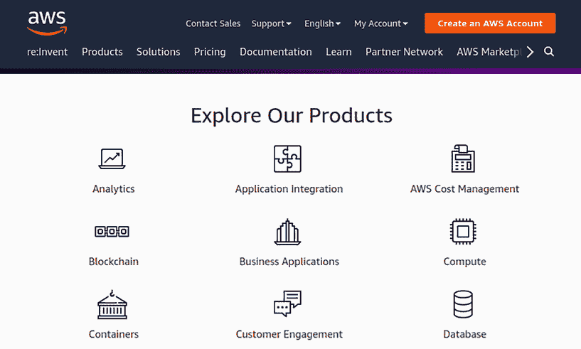

图 A.12 要创建账户，请点击主 AWS 页面上的创建 AWS 账户。

注意：本附录是在 2019 年 10 月编写的，截图也是在那时拍摄的。请注意，AWS 网站上的内容和管理控制台的外观可能会发生变化。

按照说明填写所需详细信息。这应该是一个简单的过程，类似于在任何网站上注册的过程。

注意：在注册过程中，AWS 会要求你提供银行卡的详细信息。

完成注册并验证账户后，你应该会看到主页面——AWS 管理控制台（见图 A.13）。

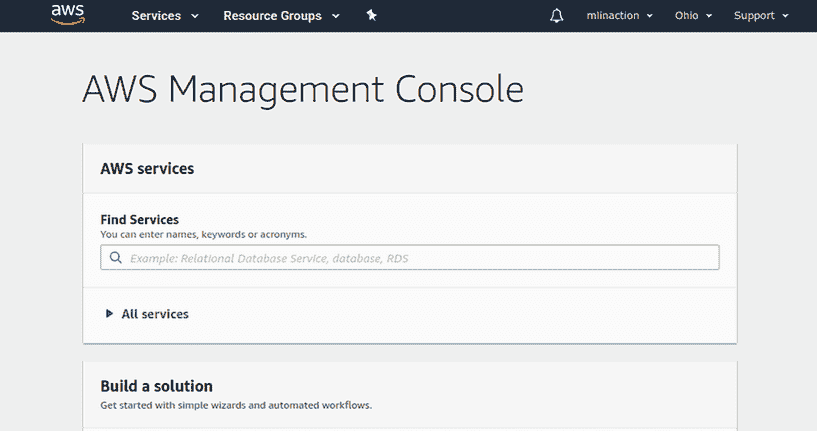

图 A.13 AWS 管理控制台是 AWS 的起始页面。

恭喜！您刚刚创建了一个根账户。然而，不建议将根账户用于任何操作：它具有非常广泛的权限，允许您在 AWS 账户上做任何事。通常，您使用根账户创建更弱权限的账户，然后使用它们来完成日常任务。

要创建此类账户，请在查找服务框中键入“IAM”，然后点击下拉列表中的该项。在左侧菜单中选择用户，然后点击添加用户（见图 A.14）。

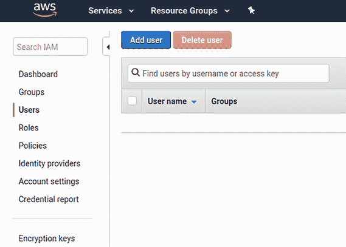

图 A.14 在 AWS 身份和访问管理（IAM）服务中添加用户

现在，您只需遵循说明并回答问题。在某个时候，它将询问访问类型：您需要选择程序性访问和 AWS 管理控制台访问（见图 A.15）。我们将使用命令行界面（CLI）和 Web 界面来处理 AWS。

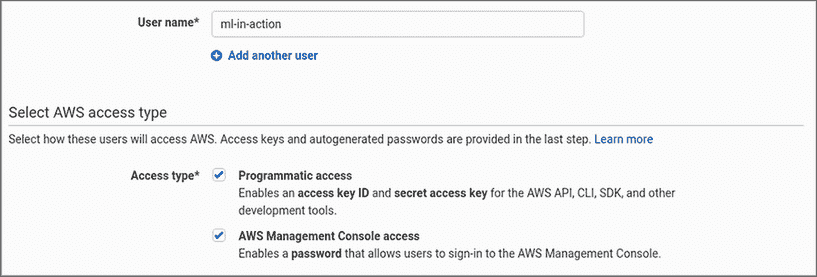

图 A.15 我们将使用 Web 界面和命令行界面来处理 AWS，因此您需要选择两种访问类型。

在设置权限步骤中，您指定新用户将能够做什么。您希望用户拥有完全权限，因此请在上部选择直接附加现有策略，并在策略列表中选择管理员访问（见图 A.16）。

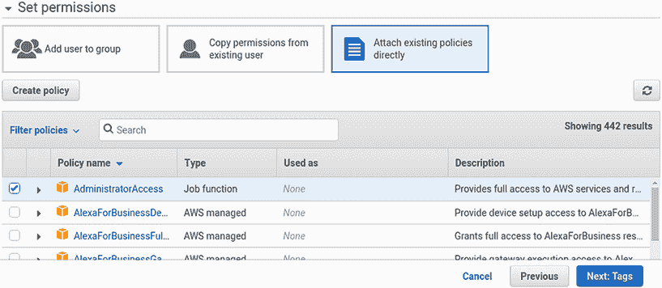

图 A.16 选择管理员访问策略以允许新用户访问 AWS 上的所有内容。

作为下一步，系统将询问您有关标签的问题——现在您可以安全地忽略这些。标签通常用于有多个人在同一 AWS 账户上工作的公司，主要用于费用管理目的，因此它们不应成为您在本书中进行的项目的担忧。

最后，当您成功创建了新用户时，向导将建议您下载凭据（见图 A.17）。下载它们并妥善保管；您稍后配置 AWS CLI 时需要使用它们。

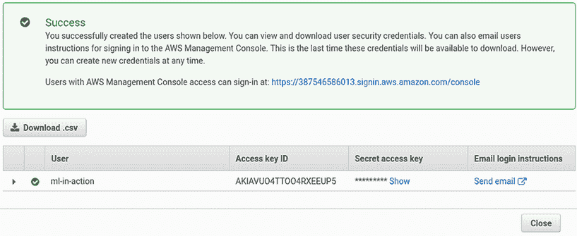

图 A.17 新创建用户的详细信息。您可以看到登录 URL 和下载用于程序性访问的凭据。

要访问管理控制台，您可以使用 AWS 为您生成的链接。它出现在成功框中，并遵循以下模式：

https://<accountid>.signin.aws.amazon.com/console

将此链接添加到书签可能是个好主意。一旦 AWS 验证了账户（这可能需要一点时间），您就可以使用它来登录：只需提供您在创建用户时指定的用户名和密码。

现在，您可以使用 AWS 的服务了。最重要的是，您可以创建一个 EC2 实例。

### A.6.2 访问账单信息

当使用云服务提供商时，您通常按秒计费：对于您使用的每个 AWS 服务，您将支付预定义的费用。每个月底，您将收到账单，通常自动处理。资金将从您与 AWS 账户关联的银行卡中扣除。

重要提示：尽管我们使用免费层来遵循本书中的大多数示例，但您应定期检查计费页面，以确保您没有意外使用可计费服务。

要了解月底您将需要支付多少费用，您可以访问 AWS 的计费页面。

如果您使用的是根账户（您首先创建的账户），只需在 AWS 控制台主页上输入“计费”即可导航到计费页面（图 A.18）。

![图片 A-18.png]

图 A.18 要访问计费页面，在快速访问搜索框中输入“计费”。

如果您尝试从用户账户（或 IAM 用户——在创建根账户后创建的）访问同一页面，您会注意到这是不允许的。为了解决这个问题，您需要

+   允许所有 IAM 用户访问计费页面，

+   给予 AMI 用户访问计费页面的权限。

允许所有 IAM 用户访问计费页面很简单：前往“我的账户”（图 A.19 A），进入“IAM 用户和角色访问计费信息”部分并点击编辑（图 A.19 B），然后选择“激活 IAM 访问”选项并点击更新（图 A.19 C）。

![图片 A-19a.png]

（A）要允许 AMI 用户访问计费信息，点击“我的账户”。

![图片 A-19b.png]

（B）在“我的账户”设置中，找到“IAM 用户和角色访问计费信息”部分并点击编辑。

![图片 A-19c.png]

（C）启用“激活 IAM 访问”选项并点击更新。

图 A.19 为 IAM 用户启用访问计费信息

之后，前往 IAM 服务，找到我们之前创建的 IAM 用户，并点击它。接下来，点击“添加权限”按钮（图 A.20）。

![图片 A-20.png]

图 A.20 要允许 IAM 用户访问计费信息，我们需要为该用户添加特殊权限。为此，点击“添加权限”按钮。

然后将现有的计费策略附加到用户（图 A.21）。

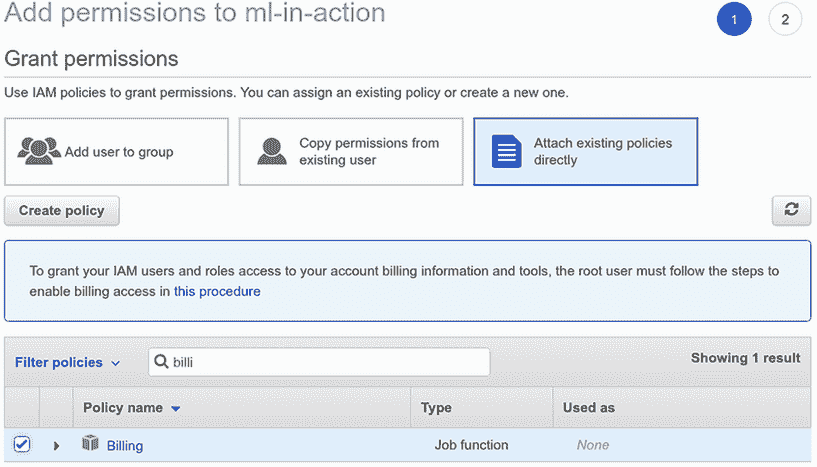

图 A.21 点击“添加权限”按钮后，选择“直接附加现有策略”选项，并在列表中选择“计费”。

之后，IAM 用户应该能够访问计费信息页面。

### A.6.3 创建 EC2 实例

EC2 是一种从 AWS 租用机器的服务。您可以使用它来创建一个 Linux 机器，用于本书中的项目。为此，首先前往 AWS 中的 EC2 页面。最简单的方法是在 AWS 管理控制台主页的“查找服务”框中输入“EC2”；然后从下拉列表中选择 EC2 并按 Enter 键（图 A.22）。

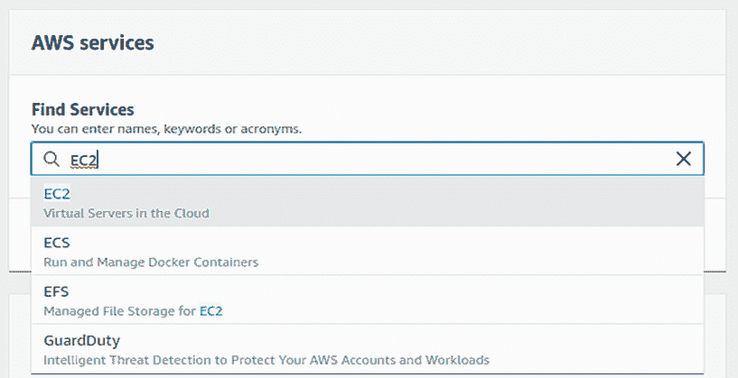

图 A.22 要访问 EC2 服务页面，在 AWS 管理控制台主页的“查找服务”框中输入 EC2 并按 Enter 键。

在 EC2 页面上，从左侧菜单中选择“实例”，然后点击“启动实例”（图 A.23）。

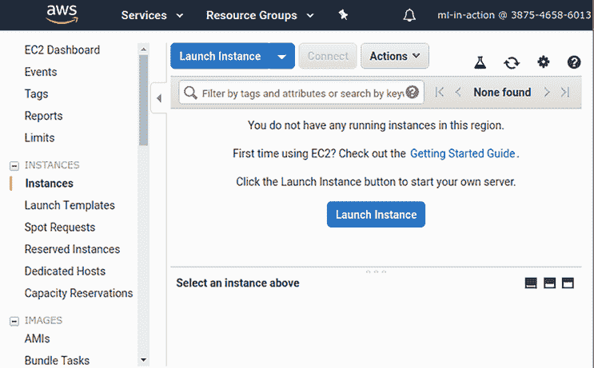

图 A.23 要创建 EC2 实例，在左侧菜单中选择“实例”并点击“启动实例”。

这将带您进入一个六步表单。第一步是指定实例将使用的 AMI（Amazon Machine Image）。我们推荐使用 Ubuntu：它是最受欢迎的 Linux 发行版之一，我们在这本书的所有示例中都使用了它。其他镜像也应该可以正常工作，但我们尚未测试它们。

在撰写本文时，Ubuntu Server 20.04 LTS 可用（图 A.24），因此请使用它。在列表中找到它，然后点击“选择”。

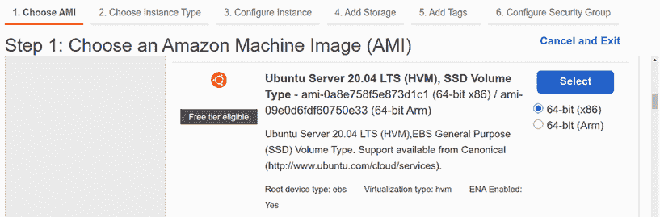

图 A.24 你的实例将基于 Ubuntu Server 18.04 LTS。

你应该注意 AMI 的 ID：在这个例子中是 ami-0a8e758f5e873d1c1，但根据你的 AWS 区域和 Ubuntu 版本，它可能不同。

注意：此 AMI 允许免费层使用，这意味着如果你使用免费层测试 AWS，使用此 AMI 不会产生费用。

之后你需要选择实例类型。有许多选项，包括不同数量的 CPU 内核和不同数量的 RAM。如果你想保持在免费层，请选择 t2.micro（图 A.25）。这是一台相当小的机器：它只有 1 个 CPU 和 1 GB RAM。当然，在计算能力方面，它不是最好的实例，但对于这本书中的许多项目来说应该足够了。

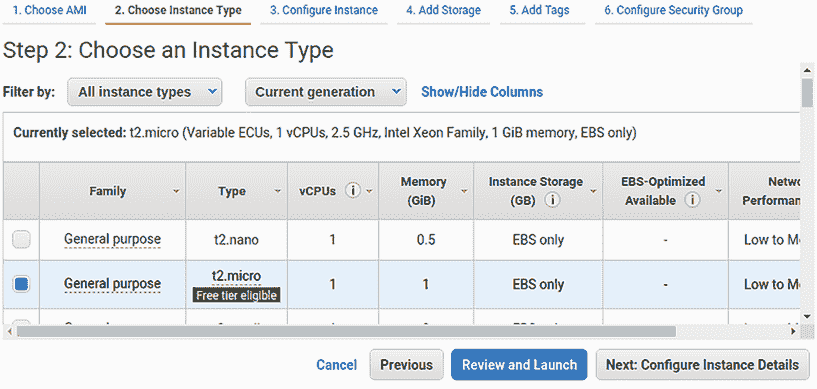

图 A.25 t2.micro 是一个相当小的实例，只有 1 个 CPU 和 1 GB RAM，但可以免费使用。

下一步是配置实例详情。这里你不需要做任何更改，可以直接进入下一步：添加存储（图 A.26）。

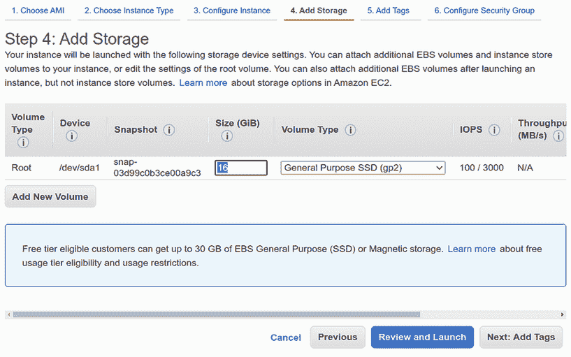

图 A.26 在 AWS 中创建 EC2 实例的第四步：添加存储。将大小更改为 16GB。

在这里，你指定实例上需要多少空间。默认建议的 8GB 不够用，因此选择 18GB。这对于我们在这本书中将要做的多数项目来说应该足够了。更改后，点击“下一步：添加标签”。

在下一步中，你为新的实例添加标签。你应该添加的唯一标签是“名称”，这允许你为实例赋予一个可读性强的名称。添加键“名称”和值“ml-bookcamp-instance”（或你喜欢的任何其他名称），如图 A.27 所示。

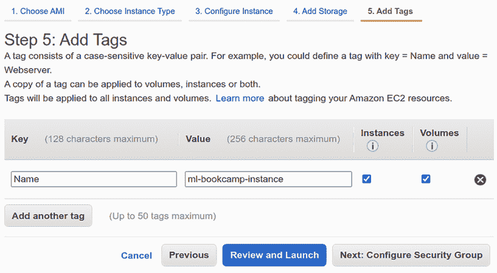

图 A.27 在第五步中你可能想要指定的唯一标签是“名称”：它允许你为实例赋予一个可读性强的名称。

下一步相当重要：选择安全组。这允许你配置网络防火墙并指定实例的访问方式和哪些端口是开放的。你希望在实例上托管 Jupyter Notebook，因此你需要确保其端口已开放并且你可以登录到远程机器。

因为您在 AWS 账户中还没有任何安全组，您现在需要创建一个新的：选择创建新的安全组，并将其命名为 jupyter（图 A.28）。您希望使用 SSH 从您的计算机连接到实例，因此您需要确保 SSH 连接被允许。为了启用此功能，在第一行中选择类型下拉列表中的 SSH。


图 A.28 在 EC2 实例上运行 Jupyter Notebook 的安全组创建

通常 Jupyter Notebook 服务运行在端口 8888 上，因此您需要添加一个自定义 TCP 规则，以便可以从互联网上的任何地方访问端口 8888。

当您这样做时，您可能会看到一个警告，告诉您这可能不安全（图 A.29）。对我们来说这不是问题，因为我们没有在实例上运行任何关键任务。实施适当的安全措施不是一件简单的事情，也不在本书的范围之内。

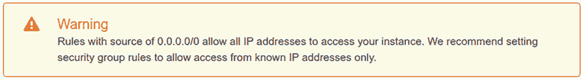

图 A.29 AWS 警告我们，我们添加的规则不够严格。在我们的情况下这不是问题，我们可以安全地忽略这个警告。

下次您创建实例时，您将能够重用这个安全组而不是创建一个新的。选择选择现有的安全组，并从列表中选择它（图 A.30）。

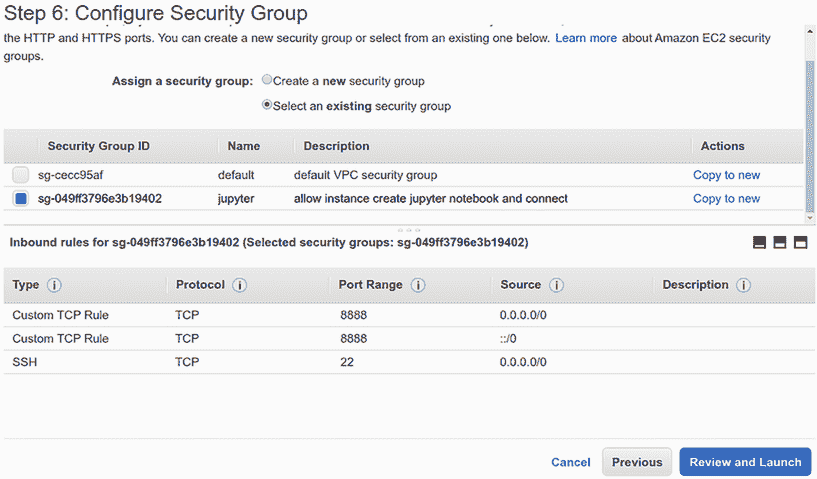

图 A.30 创建实例时，也可以将现有的安全组分配给实例。

配置安全组是最后一步。确认一切正常，然后点击审查和启动。

AWS 还不允许您启动实例：您还需要配置 SSH 密钥以登录到实例。因为您的 AWS 账户还是新的，还没有密钥，您需要创建一个新的密钥对。从下拉列表中选择创建一个新的密钥对，并将其命名为 jupyter（图 A.31）。

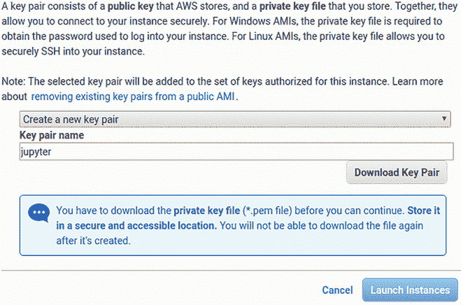

图 A.31 要能够使用 SSH 登录到实例，您需要创建一个密钥对。

点击下载密钥对，并将文件保存在您的计算机上的某个位置。确保您以后可以访问此文件；这对于能够连接到实例非常重要。

下次您创建实例时，您可以重用这个密钥。在第一个下拉列表中选择选择现有的密钥对，选择您想要使用的密钥，并点击复选框以确认您仍然拥有该密钥（图 A.32）。

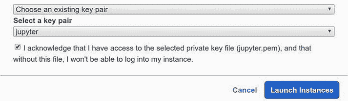

图 A.32 创建实例时也可以使用现有的密钥。

现在，您可以通过点击启动实例来启动实例。您应该看到一个确认，表明一切正常，实例正在启动（图 A.33）。

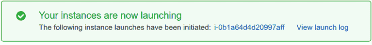

图 A.33 AWS 告诉我们，一切顺利，现在实例正在启动。

在这条消息中，你可以看到实例的 ID。在我们的例子中，它是 i-0b1a64d4d20997aff。你现在可以点击它以查看实例的详细信息（图 A.34）。因为你想要使用 SSH 连接到你的实例，你需要获取公网 DNS 名称来做这件事。你可以在描述标签中找到它。

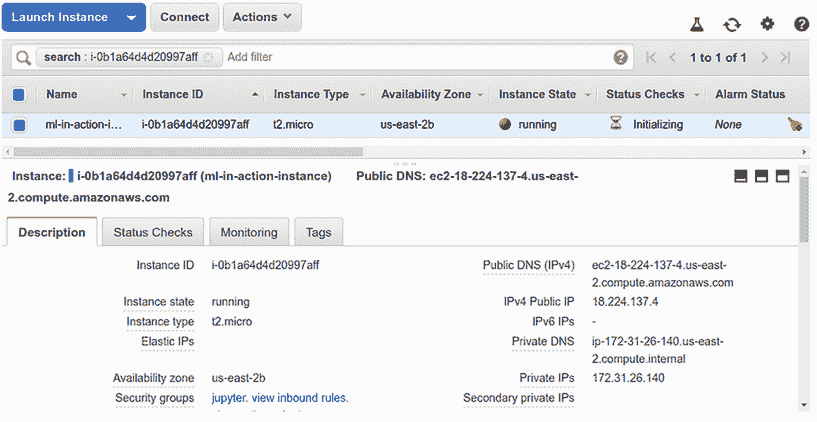

图 A.34 新创建的实例的详细信息。要使用 SSH 连接到它，你需要公网 DNS 名称。

### A.6.4 连接到实例

在上一节中，你在 EC2 上创建了一个实例。现在你需要登录到这个实例来安装所有必需的软件。你将使用 SSH 来做这件事。

在 Linux 上连接到实例

你已经知道你的实例的公网 DNS 名称。在我们的例子中，它是[ec2-18-191-156-172.us-east-2.compute.amazonaws.com](http://ec2-18-191-156-172.us-east-2.compute.amazonaws.com)。在你的情况下，名称将不同：名称的第一部分（ec2-18-191-156-172）取决于实例获得的 IP，第二部分（us-east-2）取决于它运行的区域。要使用 SSH 进入实例，你需要这个名称。

当你第一次使用从 AWS 下载的密钥时，你需要确保文件的权限设置正确。执行以下命令：

```
chmod 400 jupyter.pem
```

现在，你可以使用密钥登录到实例：

```
ssh -i "jupyter.pem" \
    ubuntu@ec2-18-191-156-172.us-east-2.compute.amazonaws.com
```

当然，你应该用从实例描述中复制的 DNS 名称替换这里显示的 DNS 名称。

在允许你进入机器之前，SSH 客户端会要求你确认你信任远程实例：

```
The authenticity of host 'ec2-18-191-156-172.us-east-2.compute.amazonaws.com (18.191.156.172)' can't be established.
ECDSA key fingerprint is SHA256:S5doTJOGwXVF3i1IFjB10RuHufaVSe+EDqKbGpIN0wI.
Are you sure you want to continue connecting (yes/no)?
```

输入“yes”以确认。

现在，你应该能够登录到实例并看到欢迎信息（图 A.35）。

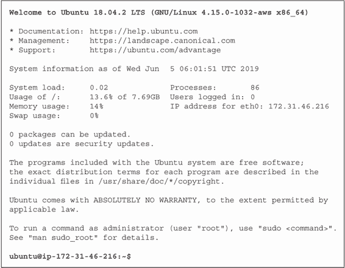

图 A.35 成功登录到 EC2 实例后，你应该看到欢迎信息。

现在，你可以用这台机器做任何你想做的事情。

在 Windows 上连接到实例

在 Windows 上使用 Linux 子系统是连接到 EC2 实例的最简单方法：你可以在那里使用 SSH，并遵循与 Linux 相同的说明。

或者，你可以使用 Putty ([`www.putty.org`](https://www.putty.org)) 从 Windows 连接到 EC2 实例。

在 macOS 上连接到实例

SSH 内置在 macOS 中，因此 Linux 的步骤也应该适用于 Mac。

### A.6.5 关闭实例

在你完成与实例的工作后，你应该关闭它。

重要提示：工作完成后，关闭实例非常重要。即使你不再需要机器并且它是空闲的，每使用一秒钟你都会被收费。如果请求的实例在 AWS 使用的前 12 个月内是免费层资格的，则不适用，但无论如何，定期检查你的账户状态并禁用不必要的服务的习惯是好的。

你可以从终端这样做：

```
sudo shutdown now
```

你也可以从 Web 界面操作：选择你想要关闭的实例，转到操作，然后选择实例状态 > 停止（图 A.36）。

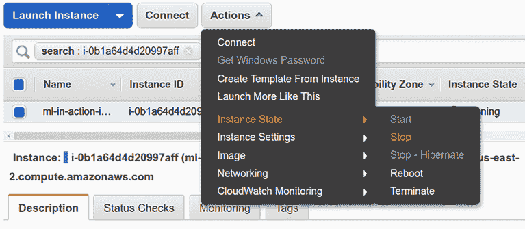

图 A.36 从 AWS 控制台停止实例

一旦实例被停止，您可以通过选择同一子菜单中的“启动”来再次启动它。您还可以完全删除实例：为此，您需要使用“终止”选项。

### A.6.6 配置 AWS CLI

AWS CLI 是 AWS 的命令行界面。对于我们需要的多数事情，使用 AWS 控制台就足够了，但在某些情况下，我们需要命令行工具。例如，在第五章中，我们将模型部署到 Elastic Beanstalk，并需要配置 CLI。

要使用命令行界面（CLI），您需要安装 Python。如果您使用 Linux 或 macOS，您应该已经内置了 Python 发行版。或者，您可以使用下一节中的说明安装 Anaconda。

仅拥有 Python 是不够的；您还需要安装 AWS CLI 本身。您可以在终端中运行以下命令来完成此操作：

```
pip install awscli
```

如果您已经有了，更新它是个好主意：

```
pip install -U awscli
```

安装完成后，您需要配置工具，指定在创建用户时下载的访问令牌和密钥。

完成此操作的一种方法是使用`configure`命令：

```
aws configure
```

在创建用户时，它将要求您提供我们下载的密钥：

```
$ aws configure
AWS Access Key ID [None]: <ENTER_ACCESS_KEY>
AWS Secret Access Key [None]: <ENTER_SECRET_KEY>
Default region name [None]: us-east-2
Default output format [None]:
```

这里使用的区域名称是 us-east-2，位于俄亥俄州。

当您完成工具的配置后，请验证它是否正常工作。您可以要求 CLI 返回您的身份，它应该与您的用户详情相匹配：

```
$ aws sts get-caller-identity
{
    "UserId": "AIDAVUO4TTOO55WN6WHZ4",
    "Account": "XXXXXXXXXXXX",
    "Arn": "arn:aws:iam::XXXXXXXXXXXX:user/ml-bookcamp"
}
```
