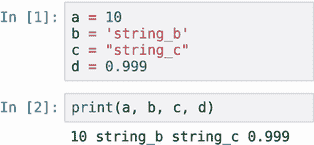
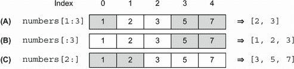

# 附录 B. Python 简介

Python 目前是构建机器学习项目的最流行语言，这就是为什么我们在这本书的项目中使用它。

如果您不熟悉 Python，本附录涵盖了基础知识：本书中使用的语法和语言特性。它不是深入教程，但它应该提供足够的信息，让您在完成附录后立即开始使用 Python。请注意，它很简短，并且针对已经知道如何使用任何其他编程语言进行编程的人。

要充分利用本附录，创建一个 jupyter notebook，给它起一个像 appendix-b-python 这样的名字，并使用它来执行附录中的代码。让我们开始吧。

## B.1 变量

Python 是一种动态语言——因此您不需要像 Java 或 C++ 那样声明类型。例如，要创建一个整型或字符串类型的变量，我们只需要进行简单的赋值：

```
a = 10           ❶
b = 'string_b'   ❷
c = "string_c"   ❷
d = 0.999        ❸
```

❶ a 是一个整数。

❷ b 和 c 是字符串。

❸ d 是一个浮点数。

要将内容打印到标准输出，我们可以使用 `print` 函数：

```
print(a, b, c, d)
```

它打印

```
10 string_b string_c 0.999
```

要执行代码，您可以将每个代码片段放在单独的 jupyter notebook 单元格中，然后执行它。要执行单元格中的代码，您可以按 Run 按钮，或使用 Shift+Enter 快捷键（图 B.1）。



图 B.1 在 Jupyter Notebook 单元格中执行的字节码。您可以在执行代码后立即看到输出。

当我们将多个参数传递给 `print` 时，就像前面的例子一样，它在打印参数之间添加一个空格。

我们可以使用一种称为 *元组* 的特殊构造将多个变量组合在一起：

```
t = (a, b)
```

当我们打印 `t` 时，我们得到以下内容：

```
(10, 'string_b')
```

要将元组展开为多个变量，我们使用 *元组赋值*：

```
(c, d) = t
```

现在 `c` 和 `d` 包含元组的第一个值，以及第二个值：

```
print(c, d)
```

它打印

```
10 string_b
```

在使用元组赋值时，我们可以省略括号：

```
c, d = t
```

这会产生相同的结果。

元组赋值非常有用，可以使代码更简洁。例如，我们可以用它来交换两个变量的内容：

```
a = 10
b = 20
a, b = b, a       ❶
print("a =", a)
print("b =", b)
```

❶ 将 a 替换为 b，将 b 替换为 a。

它将打印

```
a = 20
b = 10
```

在打印时，我们可以使用 `%` 操作符来创建格式化的字符串：

```
print("a = %s" % a)    ❶
print("b = %s" % b)    ❷
```

❶ 将 %s 替换为 a 的内容。

❷ 将 %s 替换为 b 的内容。

它将产生相同的输出：

```
a = 20
b = 10
```

在这里 `%s` 是一个占位符：在这种情况下，它意味着我们想要将传递的参数格式化为字符串。其他常用选项包括

+   使用 `%d` 来格式化为数字

+   使用 `%f` 来格式化为浮点数

我们可以将多个参数传递给元组中的格式化操作符：

```
print("a = %s, b = %s" % (a, b))
```

占位符 `%s` 的第一次出现将被替换为 `a`，第二次出现将被替换为 `b`，因此将生成以下内容：

```
a = 20, b = 10
```

最后，如果我们有一个浮点数，我们可以使用特殊的格式化来处理它：

```
n = 0.0099999999
print("n = %.2f" % n)
```

这将在格式化字符串时将浮点数四舍五入到小数点后第二位，因此执行代码时我们将看到 0.01。

字符串格式化有许多选项，还有其他格式化方式。例如，还有所谓的“新”格式化方式，使用 `string.format` 方法，我们不会在本附录中介绍。您可以在 [`pyformat.info`](https://pyformat.info/) 或官方文档中了解更多关于这些格式化选项的信息。

### B.1.1 控制流

Python 中有三种控制流语句：`if`、`for` 和 `while`。让我们看看每个语句。

条件

控制程序执行流程的简单方法是 `if` 语句。在 Python 中，`if` 的语法如下：

```
a = 10

if a >= 5:
    print('the statement is true')
else:
    print('the statement is false')
```

这将打印第一条语句：

```
the statement is true
```

注意，在 Python 中，我们在 `if` 语句之后使用缩进来分组代码。我们可以使用 `elif`（`else-if` 的缩写）将多个 `if` 语句链接在一起：

```
a = 3

if a >= 5:
    print('the first statement is true')
elif a >= 0:
    print('the second statement is true')
else:
    print('both statements are false')
```

这段代码将打印第二条语句：

```
the second statement is true
```

对于循环

当我们想要多次重复相同的代码块时，我们使用循环。Python 中的传统 `for` 循环看起来像这样：

```
for i in range(10):
    print(i)
```

这段代码将打印从 0 到 9 的数字，不包括 10：

```
0
1
2
3
4
5
6
7
8
9
```

当指定范围时，我们可以设置起始数字、结束数字和增量步长：

```
for i in range(10, 100, 5):
    print(i)
```

这段代码将打印从 10 到 100（不包括）的数字，步长为 5：10, 15, 20, ..., 95。

要提前退出循环，我们可以使用 `break` 语句：

```
for i in range(10):
    print(i)
    if i > 5:
        break
```

这段代码将打印从 0 到 6 的数字。当 `i` 为 6 时，它将中断循环，因此它不会打印 6 之后的任何数字：

```
0
1
2
3
4
5
6
```

要跳过循环的迭代，我们使用 `continue` 语句：

```
for i in range(10):
    if i <= 5:
        continue
    print(i)
```

这段代码将在 `i` 为 5 或更少时跳过迭代，因此它只会打印从 6 开始的数字：

```
6
7
8
9
```

当循环

`while` 循环也适用于 Python。它在某个条件为 `True` 时执行。例如：

```
cnt = 0 

while cnt <= 5:
    print(cnt)
    cnt = cnt + 1
```

在这段代码中，我们重复循环直到条件 `cnt` `<=` `5` 为 `True`。一旦这个条件不再为 `True`，执行停止。这段代码将打印从 0 到 5 的数字，包括 5：

```
0
1
2
3
4
5
```

我们也可以在 `while` 循环中使用 `break` 和 `continue` 语句。

### B.1.2 集合

集合是特殊的容器，允许在其中保持多个元素。我们将查看四种类型的集合：列表、元组、集合和字典。

列表

*列表* 是一个有序集合，可以通过索引访问元素。要创建列表，我们可以简单地将元素放在方括号内：

```
numbers = [1, 2, 3, 5, 7, 11, 13]
```

要通过索引获取元素，我们可以使用括号表示法：

```
el = numbers[1]
print(el)
```

在 Python 中，索引从 0 开始，因此当我们请求索引为 1 的元素时，我们得到 2。

我们也可以更改列表中的值：

```
numbers[1] = -2
```

要从末尾访问元素，我们可以使用负索引。例如，`-1` 将获取最后一个元素，`-2`——倒数第二个元素，依此类推：

```
print(numbers[-1], numbers[-2])
```

如我们所期望的，它打印了 13 11。

要向列表中添加元素，请使用 `append` 函数。它将元素添加到列表的末尾：

```
numbers.append(17)
```

要遍历列表中的元素，我们使用 `for` 循环：

```
for n in numbers:
    print(n)
```

当我们执行它时，我们看到所有元素都被打印出来：

```
1
-2
3
5
7
11
13
17
```

这在其他语言中也称为 `for-each` 循环：我们为集合中的每个元素执行循环体。它不包含索引，只包含元素本身。如果我们还需要访问每个元素的索引，我们可以使用 `range`，就像我们之前做的那样：

```
for i in range(len(numbers)):
    n = numbers[i]
    print("numbers[%d] = %d" % (i, n))
```

函数 `len` 返回列表的长度，因此此代码大致等同于在 C 或 Java 中以传统方式遍历数组并按索引访问每个元素。当我们执行它时，代码将打印以下内容：

```
numbers[0] = 1
numbers[1] = -2
numbers[2] = 3
numbers[3] = 5
numbers[4] = 7
numbers[5] = 11
numbers[6] = 13
numbers[7] = 17
```

实现相同功能的一种更“Pythonic”（在 Python 世界中更常见和更符合习惯用法）的方法是使用 `enumerate` 函数：

```
for i, n in enumerate(numbers):
    print("numbers[%d] = %d" % (i, n))
```

在此代码中，`i` 变量将获取索引，而 `n` 变量将获取列表中的相应元素。此代码将产生与上一个循环完全相同的输出。

要将多个列表连接成一个，我们可以使用加号运算符。例如，考虑两个列表：

```
list1 = [1, 2, 3, 5]
list2 = [7, 11, 13, 17]
```

我们可以通过连接两个列表来创建一个包含 `list1` 中所有元素后跟 `list2` 中元素的第三个列表：

```
new_list = list1 + list2
```

这将产生以下列表：

```
[1, 2, 3, 5, 7, 11, 13, 17]
```

最后，也可以创建一个列表的列表：一个其元素也是列表的列表。为了展示这一点，让我们首先创建三个包含数字的列表：

```
list1 = [1, 2, 3, 5]
list2 = [7, 11, 13, 17]
list3 = [19, 23, 27, 29]
```

现在，让我们将它们组合成另一个列表：

```
lists = [list1, list2, list3]
```

现在 `lists` 是一个列表的列表。当我们使用 `for` 循环遍历它时，在每次迭代中我们都会得到一个列表：

```
for l in lists:
    print(l)
```

这将产生以下输出：

```
[1, 2, 3, 5]
[7, 11, 13, 17]
[19, 23, 27, 29]
```

切片

Python 中另一个有用的概念是 *切片*——它用于获取列表的一部分。例如，让我们再次考虑数字列表：

```
numbers = [1, 2, 3, 5, 7]
```

如果我们想选择包含前三个元素的下标列表，我们可以使用冒号运算符（`:`）来指定选择范围：

```
top3 = numbers[0:3]
```

在这个例子中，`0:3` 表示“从索引 0 开始选择元素，直到索引 3（不包括 3）。”结果包含前三个元素：`[1, 2, 3]`。请注意，它选择了索引为 0、1 和 2 的元素，因此不包括 3。

如果我们想包含列表的开始部分，我们不需要指定范围中的第一个数字：

```
top3 = numbers[:3]
```

如果我们不指定范围中的第二个数字，我们将得到列表的剩余所有元素：

```
last3 = numbers[2:]
```

列表 `last3` 将包含最后三个元素：`[3, 5, 7]`（图 B.2）。



图 B.2 使用冒号运算符选择列表的子列表

元组

我们在变量部分之前已经遇到过元组。元组也是集合；它们与列表非常相似。唯一的区别是它们是不可变的：一旦创建了一个元组，就不能更改元组的内容。

创建元组时使用括号：

```
numbers = (1, 2, 3, 5, 7, 11, 13)
```

与列表一样，我们可以通过索引获取值：

```
el = numbers[1]
print(el)
```

然而，我们无法更新元组中的值。当我们尝试这样做时，我们会得到一个错误：

```
numbers[1] = -2
```

如果我们尝试执行此代码，我们会得到

```
---------------------------------------------------------------------------
TypeError                                 Traceback (most recent call last)
<ipython-input-15-9166360b9018> in <module>
----> 1 numbers[1] = -2

TypeError: 'tuple' object does not support item assignment
```

同样，我们无法向元组中添加新元素。但是，我们可以使用连接来实现相同的结果：

```
numbers = numbers + (17,)
```

在这里，我们创建一个新的元组，它包含旧数字，并将其与只包含一个数字（17）的另一个元组连接起来：17\. 注意，我们需要添加一个逗号来创建一个元组；否则，Python 会将其视为一个简单的数字。

事实上，上一页的表达式等同于以下写法

```
numbers = (1, 2, 3, 5, 7, 11, 13) + (17,)
```

执行此操作后，我们得到一个新的包含新元素的元组，因此当打印时，我们得到

```
(1, 2, 3, 5, 7, 11, 13, 17)
```

集合

另一个有用的集合是*集合*：它是一个无序集合，只保留唯一元素。与列表不同，它不能包含重复项，并且也无法通过索引访问集合中的单个元素。

要创建一个集合，我们使用花括号：

```
numbers = {1, 2, 3, 5, 7, 11, 13}
```

注意：要创建一个空集合，我们需要使用`set`：

```
empty_set = set()
```

简单地放置空花括号将创建一个字典——这是一个我们在附录中稍后要讨论的集合：

```
empty_dict = {}
```

集合在检查集合是否包含一个元素时比列表更快。我们使用`in`运算符进行检查：

```
print(1 in numbers)
```

由于“1”在`numbers`集合中，这一行代码将打印`True`。

要向集合中添加一个元素，我们使用`add`方法：

```
numbers.add(17)
```

要遍历集合中的所有元素，我们再次使用`for`循环：

```
for n in numbers:
    print(n)
```

当我们执行它时，它打印

```
1
2
3
5
7
11
13
17
```

字典

字典是 Python 中另一个极其有用的集合：我们使用它来构建键值映射。要创建字典，我们使用花括号，并使用冒号（`:`）分隔键和值：

```
words_to_numbers = {
    'one': 1,
    'two': 2,
    'three': 3,
}
```

要通过键检索值，我们使用方括号：

```
print(words_to_numbers['one'])
```

如果某个元素不在字典中，Python 会引发异常：

```
print(words_to_numbers['five'])
```

当我们尝试执行它时，我们得到以下错误：

```
---------------------------------------------------------------------------
KeyError                                  Traceback (most recent call last)
<ipython-input-38-66a309b8feb5> in <module>
----> 1 print(words_to_numbers['five'])

KeyError: 'five'
```

为了避免它，我们可以在尝试获取值之前先检查键是否在字典中。我们可以使用`in`语句进行检查：

```
if 'five' in words_to_numbers:
    print(words_to_numbers['five'])
else:
    print('not in the dictionary')
```

当运行此代码时，我们将在输出中看到`not` `in` `the` `dictionary`。

另一个选项是使用`get`方法。它不会引发异常，但如果键不在字典中，则返回`None`：

```
value = words_to_numbers.get('five')
print(value)
```

它将打印`None`。当使用`get`时，我们可以指定默认值，以防键不在字典中：

```
value = words_to_numbers.get('five', -1)
print(value)
```

在这种情况下，我们将得到`-1`。

要遍历字典中的所有键，我们使用`keys`方法的返回结果进行`for`循环：

```
for k in words_to_numbers.keys():
    v = words_to_numbers[k]
    print("%s: %d" % (k, v))
```

它将打印

```
one: 1
two: 2
three: 3
```

或者，我们可以直接使用`items`方法遍历字典中的键值对：

```
for k, v in words_to_numbers.items():
    print("%s: %d" % (k, v))
```

它产生的输出与之前的代码完全相同。

列表推导

列表推导是 Python 中创建和过滤列表的特殊语法。让我们再次考虑一个包含数字的列表：

```
numbers = [1, 2, 3, 5, 7]
```

假设我们想要创建另一个列表，其中包含原始列表中所有元素的平方。为此，我们可以使用`for`循环：

```
squared = []

for n in numbers:
    s = n * n
    squared.append(s)
```

我们可以使用列表推导式简洁地重写此代码为单行：

```
squared = [n * n for n in numbers]
```

还可以在其中添加一个`if`条件，以仅处理满足条件的元素：

```
squared = [n * n for n in numbers if n > 3]
```

它等价于以下代码：

```
squared = []

for n in numbers:
    if n > 3:
        s = n * n
        squared.append(s)
```

如果我们只需要应用过滤器并保持元素不变，我们也可以这样做：

```
filtered = [n for n in numbers if n > 3]
```

这等价于

```
filtered = []

for n in numbers:
    if n > 3:
        filtered.append(n)
```

也可以使用列表推导来创建具有稍不同语法的其他集合。例如，对于字典，我们在表达式周围放置花括号，并使用冒号来分隔键和值：

```
result = {k: v * 10 for (k, v) in words_to_numbers.items() if v % 2 == 0}
```

这是对以下代码的快捷方式：

```
result = {}

for (k, v) in words_to_numbers.items():
    if v % 2 == 0:
        result[k] = v * 10
```

警告 当学习列表推导时，可能会诱使你开始到处使用它。通常它最适合简单情况，但对于更复杂的情况，为了更好的代码可读性，应优先使用`for`循环而不是列表推导。如果有疑问，请使用`for`循环。

### B.1.3 代码复用

在某个时候，当我们编写了大量代码时，我们需要考虑如何更好地组织它。我们可以通过将小块可重用代码放入函数或类中来实现这一点。让我们看看如何做到这一点。

函数

要创建一个函数，我们使用`def`关键字：

```
def function_name(arg1, arg2):
    # body of the function
    return 0
```

当我们想要退出函数并返回某个值时，我们使用`return`语句。如果我们简单地放置`return`而不带任何值或在函数体中不包括`return`，则函数将返回`None`。

例如，我们可以编写一个函数，该函数打印从 0 到指定数字的值：

```
def print_numbers(max):        ❶
    for i in range(max + 1):   ❷
        print(i)
```

❶ 创建一个带有一个参数的函数：max。

❷ 在函数内部使用 max 参数。

要调用此函数，只需在名称后添加括号内的参数：

```
print_numbers(10)
```

在调用函数时，也可以提供参数的名称：

```
print_numbers(max=10)
```

类

类比函数提供了更高层次的抽象：它们可以有一个内部状态和操作这个状态的方法。让我们考虑一个类，`NumberPrinter`，它和上一节中的函数做同样的事情——打印数字。

```
class NumberPrinter:

    def __init__(self, max):              ❶
        self.max = max                    ❷

    def print_numbers(self):              ❸
        for i in range(self.max + 1):     ❹
            print(i)
```

❶ 类初始化器

❷ 将 max 参数分配给 max 字段。

❸ 类的方法

❹ 在调用方法时使用内部状态。

在此代码中，`__init__`是初始化器。每次我们想要创建类的实例时都会运行：

```
num_printer = NumberPrinter(max=10)
```

注意，在类内部，`__init__`方法有两个参数：`self`和`max`。所有方法的第一参数始终必须是`self`：这样我们可以在方法内部使用`self`来访问对象的状态。

然而，当我们稍后调用方法时，我们不需要向`self`参数传递任何内容：它对我们来说是隐藏的。因此，当我们对`NumberPrinter`对象的实例调用`print_number`方法时，我们只需简单地放置没有参数的空括号：

```
num_printer.print_numbers()
```

这段代码产生的输出和上一节中的函数相同。

导入代码

现在假设我们想要将一些代码放入一个单独的文件中。让我们创建一个名为 useful_code.py 的文件，并将其放置在笔记本所在的同一文件夹中。

使用编辑器打开此文件。在文件内部，我们可以放置我们刚刚创建的函数和类。这样，我们创建了一个名为`useful_code`的模块。要访问模块内部的函数和类，我们使用`import`语句导入它们：

```
import useful_code
```

一旦导入，我们就可以使用它：

```
num_printer = useful_code.NumberPrinter(max=10)
num_printer.print_numbers()
```

同样，我们也可以导入一个模块并给它一个短名。例如，如果我们想用`uc`代替`useful_code`，我们可以这样做：

```
import useful_code as uc

num_printer = uc.NumberPrinter(max=10)
num_printer.print_numbers()
```

这是在科学 Python 中一个非常常见的习语。像 NumPy 和 Pandas 这样的软件包通常使用较短的别名导入：

```
import numpy as np
import pandas as pd
```

最后，如果我们不想从模块中导入所有内容，我们可以使用`from ... import`语法选择确切要导入的内容：

```
from useful_code import NumberPrinter

num_printer = NumberPrinter(max=10)
num_printer.print_numbers()
```

### B.1.4 安装库

我们可以将我们的代码放入对每个人可用的软件包中。例如，NumPy 或 Pandas 就是这样的软件包。它们已经在 Anaconda 发行版中可用，但通常它们不会与 Python 预先安装。

要安装这样的外部软件包，我们可以使用内置的软件包安装器 pip。要使用它，打开您的终端并执行那里的`pip install`命令：

```
pip install numpy scipy pandas
```

在安装命令之后，我们列出我们想要安装的软件包。在安装时，也可以指定每个软件包的版本：

```
pip install numpy==1.16.5 scipy==1.3.1 pandas==0.25.1
```

当我们已经有了一个软件包，但它已经过时，我们想要更新它时，我们需要运行带有`-U`标志的`pip install`：

```
pip install -U numpy
```

最后，如果我们想要删除一个软件包，我们使用`pip uninstall`：

```
pip uninstall numpy
```

### B.1.5 Python 程序

要执行 Python 代码，我们可以简单地调用 Python 解释器并指定我们想要执行的文件。例如，要运行`useful_code.py`脚本中的代码，在命令行中执行以下命令：

```
python useful_code.py
```

当我们执行它时，没有任何事情发生：我们只是在其中声明了一个函数和一个类，实际上并没有使用它们。为了看到一些结果，我们需要在文件中添加几行代码。例如，我们可以添加以下内容：

```
num_printer = NumberPrinter(max=10)
num_printer.print_numbers()
```

现在我们执行这个文件时，我们看到`NumberPrinter`打印的数字。

然而，当我们导入一个模块时，Python 内部会执行模块内的所有内容。这意味着下次我们在笔记本中执行`import useful_code`时，我们会看到那里打印的数字。

为了避免这种情况，我们可以告诉 Python 解释器某些代码只有在作为脚本执行时才需要运行，而不是导入。为了实现这一点，我们将我们的代码放在以下构造中：

```
if __name__ == "__main__":
    num_printer = NumberPrinter(max=10)
    num_printer.print_numbers()
```

最后，我们也可以在运行 Python 脚本时传递参数：

```
import sys

# declarations of print_numbers and NumberPrinter

if __name__ == "__main__":
    max_number = int(sys.argv[1])                 ❶
    num_printer = NumberPrinter(max=max_number)   ❷
    num_printer.print_numbers()
```

❶ 将参数解析为整数：默认情况下，它是一个字符串。

❷ 将解析的参数传递给 NumberPrinter 实例。

现在我们可以使用自定义参数运行脚本：

```
python useful_code.py 5
```

结果，我们会看到从`0`到`5`的数字：

```
0
1
2
3
4
5
```
