# 附录 C. NumPy 简介

我们不期望读者有任何 NumPy 知识，并试图在前进的过程中将所有必要的信息放入章节中。然而，因为本书的目的是教授机器学习而不是 NumPy，所以我们无法在章节中详细涵盖所有内容。这就是附录的重点：在一个集中的地方概述 NumPy 最重要的概念。

除了介绍 NumPy 外，附录还涵盖了一些对机器学习有用的线性代数知识，包括矩阵和向量乘法、矩阵逆和正则方程。

NumPy 是一个 Python 库，所以如果你还不熟悉 Python，请查看附录 B。

## C.1 NumPy

NumPy 代表*数值 Python*——它是一个用于数值操作的 Python 库。NumPy 在 Python 机器学习生态系统中扮演着核心角色：Python 中的几乎所有库都依赖于它。例如，Pandas、Scikit-learn 和 TensorFlow 都依赖于 NumPy 进行数值运算。

NumPy 在 Anaconda 的 NumPy 发行版中预先安装，所以如果你使用它，你不需要做任何额外的事情。但是如果你不使用 Anaconda，使用`pip`安装 NumPy 相当简单：

```
pip install numpy
```

要实验 NumPy，让我们创建一个新的 Jupyter Notebook，并将其命名为 appendix-c-numpy。

要使用 NumPy，我们需要导入它。这就是为什么在第一个单元中我们写下

```
import numpy as np
```

在科学 Python 社区中，导入 NumPy 时使用别名是很常见的。这就是为什么我们在安装代码中添加了`as np`。这允许我们在代码中使用`np`而不是`numpy`。

我们将从 NumPy 的核心数据结构：NumPy 数组开始探索。

### C.1.1 NumPy 数组

NumPy 数组类似于 Python 列表，但它们在机器学习等数值计算任务上进行了更好的优化。

要创建一个预定义大小且填充零的数组，我们使用`np.zeros`函数：

```
zeros = np.zeros(10)
```

这创建了一个包含 10 个零元素的数组（图 C.1）。

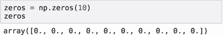

图 C.1 创建一个长度为 10 且填充零的 NumPy 数组

同样，我们可以使用`np.ones`函数创建一个包含 1 的数组：

```
ones = np.ones(10)
```

它的工作方式与 zeros 完全相同，只是元素是 1。

这两个函数都是更通用函数的快捷方式：`np.full`。它创建一个特定大小的数组，并用指定的元素填充。例如，要创建一个大小为 10 且填充零的数组，我们执行以下操作：

```
array = np.full(10, 0.0) 
```

我们可以使用`np.repeat`函数达到相同的结果：

```
array = np.repeat(0.0, 10) 
```

这段代码产生的结果与早期代码（图 C.2）相同。

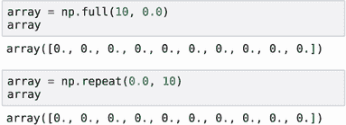

图 C.2 要创建一个填充特定数字的数组，请使用`np.full`或`np.repeat`。

尽管在这个例子中两个函数都产生了相同的代码，但`np.repeat`实际上更强大。例如，我们可以使用它创建一个多个元素依次重复的数组：

```
array = np.repeat([0.0, 1.0], 5)
```

它创建了一个大小为 10 的数组，其中数字 0 重复了五次，然后数字 1 重复了五次（图 C.3）：

```
array([0., 0., 0., 0., 0., 1., 1., 1., 1., 1.]) 
```

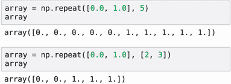

图 C.3 `np.repeat`函数比`np.full`更灵活：它可以通过重复多个元素来创建数组。

我们甚至可以更加灵活，并指定每个元素应该重复多少次：

```
array = np.repeat([0.0, 1.0], [2, 3])
```

在这种情况下，0.0 重复两次，1.0 重复三次：

```
array([0., 0., 1., 1., 1.]) 
```

就像列表一样，我们可以使用方括号访问数组的元素：

```
el = array[1]
print(el)
```

这段代码打印 0.0。

与通常的 Python 列表不同，我们可以通过使用方括号中的索引列表同时访问数组的多个元素：

```
print(array[[4, 2, 0]])
```

结果是另一个大小为 3 的数组，包含原始数组中通过 4、2 和 0 分别索引的元素：

```
[1., 1., 0.]
```

我们还可以使用方括号更新数组的元素：

```
array[1] = 1
print(array)
```

因为我们将索引 1 处的元素从 0 改为 1，所以它打印以下内容：

```
[0\. 1\. 1\. 1\. 1.]
```

如果我们已经有了一个包含数字的列表，我们可以使用`np.array`将其转换为 NumPy 数组：

```
elements = [1, 2, 3, 4]
array = np.array(elements)
```

现在`array`是一个大小为 4 的 NumPy 数组，其元素与原始列表相同：

```
array([1, 2, 3, 4])
```

另一个用于创建 NumPy 数组的非常有用的函数是`np.arange`。它是 Python 的`range`的 NumPy 等价物：

```
np.arange(10)
```

它创建了一个长度为 10 的数组，包含从 0 到 9 的数字，并且像标准 Python 的`range`一样，10 不包括在数组中：

```
array([0, 1, 2, 3, 4, 5, 6, 7, 8, 9])
```

经常我们需要创建一个大小一定的数组，并用介于某个数字*x*和某个数字*y*之间的数字填充。例如，想象我们需要创建一个包含从 0 到 1 的数字的数组：

0.0, 0.1, 0.2, ..., 0.9, 1.0

我们可以使用`np.linspace`：

```
thresholds = np.linspace(0, 1, 11)
```

此函数有三个参数：

+   起始数字：在我们的例子中，我们希望从 0 开始。

+   最后一个数字：我们希望以 1 结束。

+   结果数组的长度：在我们的例子中，我们希望在数组中有 11 个数字。

此代码生成从 0 到 1（图 C.4）的 11 个数字。

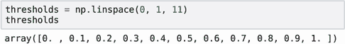

图 C.4 NumPy 的`linspace`函数生成一个指定长度的序列（11），从 0 开始，到 1 结束。

Python 列表通常可以包含任何类型的元素。对于 NumPy 数组来说情况并非如此：数组中的所有元素必须具有相同的类型。这些类型被称为*dtype*。

有四种广泛的 dtype 类别：

+   无符号整数（uint）：始终为正数（或零）的整数

+   有符号整数（int）：可以是正数和负数的整数

+   浮点数（float）：实数

+   布尔值（bool）：只有 True 和 False 值

每种 dtype 都有多种变体，这取决于在内存中表示值所使用的位数。

对于 uint，我们有四种类型：`uint8`、`uint16`、`uint32`和`uint64`，分别具有 8、16、32 和 64 位大小。同样，我们有四种 int 类型：`int8`、`int16`、`int32`和`int64`。我们使用的位数越多，可以存储的数字就越大（表 C.1）。

表 C.1 三种常见的 NumPy dtype：uint、int 和 float。每种 dtype 都有多种大小从 8 到 64 位的变体。[链接](https://variations)

| 大小（位） | **无符号整型** | **整型** | **浮点型** |
| --- | --- | --- | --- |
| **8** | 0 .. 2⁸ – 1 | –2⁷ .. 2⁷ – 1 | – |
| **16** | 0 .. 2¹⁶ – 1 | –2¹⁵ .. 2¹⁵ – 1 | 半精度 |
| **32** | 0 .. 2³² – 1 | –2³¹ .. 2³¹ – 1 | 单精度 |
| **64** | 0 .. 2⁶⁴ – 1 | –2⁶³ .. 2⁶³ – 1 | 双精度 |

对于浮点数，我们有三种类型：`float16`、`float32`和`float64`。我们使用的位数越多，浮点数就越精确。

你可以在官方文档中查看不同数据类型的完整列表（[`docs.scipy.org/doc/numpy-1.13.0/user/basics.types.html`](https://docs.scipy.org/doc/numpy-1.13.0/user/basics.types.html)）。

注意 在 NumPy 中，默认的浮点数据类型是`float64`，每个数字使用 64 位（8 字节）。对于大多数机器学习应用，我们不需要这样的精度，可以通过使用`float32`而不是`float64`来减少内存占用两倍。

在创建数组时，我们可以指定数据类型。例如，当使用`np.zeros`和`np.ones`时，默认数据类型是`float64`。我们可以在创建数组时指定数据类型（图 C.5）：

```
zeros = np.zeros(10, dtype=np.uint8)
```

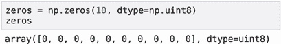

图 C.5 我们可以在创建数组时指定数据类型。

当我们有一个整数数组并赋值一个超出范围的数字时，数字会被截断：只保留最低有效位。

例如，假设我们使用我们刚刚创建的`uint8`数组`zeros`。因为数据类型是`uint8`，它能够存储的最大数字是 255。让我们尝试将 300 赋值给数组的第一个元素：

```
zeros[0] = 300
print(zeros[0])
```

因为 300 大于 255，所以只保留最低有效位，所以这段代码打印出 44。

警告 在选择数组的数据类型时要小心。如果你不小心选择了一个过窄的数据类型，当你输入一个大的数字时，NumPy 不会警告你。它将简单地截断它们。

遍历数组中的所有元素与列表类似。我们只需使用一个`for`循环：

```
for i in np.arange(5):
    print(i)
```

这段代码打印从 0 到 4 的数字：

```
0
1
2
3
4
```

### C.1.2 二维 NumPy 数组

到目前为止，我们已经介绍了 NumPy 的一维数组。我们可以将这些数组视为向量。然而，对于机器学习应用，仅仅有向量是不够的：我们还需要矩阵。

在纯 Python 中，我们会使用列表的列表来表示。在 NumPy 中，等价的是二维数组。

要创建一个全为零的二维数组，我们只需在调用`np.zeros`时使用一个元组而不是一个数字：

```
zeros = np.zeros((5, 2), dtype=np.float32)
```

我们使用元组（5, 2），因此它创建了一个有五行两列的全零数组（图 C.6）。

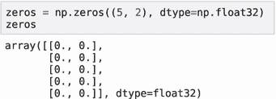

图 C.6 要创建一个二维数组，使用包含两个元素的元组。第一个元素指定行数，第二个元素指定列数。

同样地，我们可以使用`np.ones`或`np.fill`——而不是一个单独的数字，我们放入一个元组。

数组的维度称为 *形状*。这是传递给 `np.zeros` 函数的第一个参数：它指定数组将有多少行和列。要获取数组的形状，使用 `shape` 属性：

```
print(zeros.shape)
```

当我们执行它时，我们看到 (5, 2)。

可以将列表的列表转换为 NumPy 数组。与通常的数字列表一样，只需使用 `np.array` 即可：

```
numbers = [                    ❶
    [1, 2, 3],
    [4, 5, 6],
    [7, 8, 9]
]

numbers = np.array(numbers)    ❷
```

❶ 创建一个列表的列表

❷ 将列表转换为二维数组

执行此代码后，`numbers` 变成了一个形状为 (3, 3) 的 NumPy 数组。当我们打印它时，我们得到

```
array([[1, 2, 3],
       [4, 5, 6],
       [7, 8, 9]])
```

要访问二维数组的一个元素，我们需要在括号内使用两个数字：

```
print(numbers[0, 1])
```

这段代码将访问索引为 0 的行和索引为 1 的列。所以它将打印 2。

与一维数组一样，我们使用赋值运算符 (=) 来改变二维数组的一个单独的值：

```
numbers[0, 1] = 10
```

当我们执行它时，数组的内容会改变：

```
array([[ 1, 10,  3],
       [ 4,  5,  6],
       [ 7,  8,  9]])
```

如果我们只放一个数字而不是两个，我们将得到整个行，这是一个一维的 NumPy 数组：

```
numbers[0]
```

这段代码返回索引为 0 的整个行：

```
array([1 2 3])
```

要访问二维数组的一列，我们使用冒号 (:) 而不是第一个元素。像行一样，结果也是一个一维的 NumPy 数组：

```
numbers[:, 1]
```

当我们执行它时，我们看到整个列：

```
array([2 5 8])
```

也可以使用赋值运算符覆盖整个行或列的内容。例如，假设我们想要替换矩阵中的一行：

```
numbers[1] = [1, 1, 1]
```

这导致以下变化：

```
array([[ 1, 10,  3],
       [ 1,  1,  1],
       [ 7,  8,  9]])
```

同样，我们可以替换整个列的内容：

```
numbers[:, 2] = [9, 9, 9]
```

因此，最后一列改变了：

```
array([[ 1, 10,  9],
       [ 1,  1,  9],
       [ 7,  8,  9]])
```

### C.1.3 随机生成的数组

通常，生成填充随机数的数组很有用。在 NumPy 中，我们使用 `np.random` 模块来完成此操作。

例如，要生成一个 5 × 2 的随机数数组，这些数在 0 和 1 之间均匀分布，使用 `np.random.rand`：

```
arr = np.random.rand(5, 2)
```

当我们运行它时，它生成一个看起来像这样的数组：

```
array([[0.64814431, 0.51283823],
       [0.40306102, 0.59236807],
       [0.94772704, 0.05777113],
       [0.32034757, 0.15150334],
       [0.10377917, 0.68786012]])
```

每次我们运行代码，它都会生成不同的结果。有时我们需要结果可重复，这意味着如果我们稍后想要执行此代码，我们将得到相同的结果。为了实现这一点，我们可以设置随机数生成器的种子。一旦设置了种子，随机数生成器每次运行代码时都会产生相同的序列：

```
np.random.seed(2)
arr = np.random.rand(5, 2)
```

在 Ubuntu Linux 版本 18.04 和 NumPy 版本 1.17.2 上，它生成以下数组：

```
array([[0.4359949 , 0.02592623],
       [0.54966248, 0.43532239],
       [0.4203678 , 0.33033482],
       [0.20464863, 0.61927097],
       [0.29965467, 0.26682728]])
```

无论我们重新执行这个单元格多少次，结果都是相同的。

警告：固定随机数生成器的种子可以保证在相同的操作系统和相同的 NumPy 版本下执行时生成器产生相同的结果。然而，没有保证更新 NumPy 版本不会影响可重复性：版本的变化可能会导致随机数生成器算法的变化，这可能导致不同版本的结果不同。

如果我们想要从标准正态分布中采样，而不是均匀分布，我们使用 `np.random.randn`：

```
arr = np.random.randn(5, 2)
```

注意：每次我们在附录中生成随机数组时，我们都会确保在生成之前固定种子数字，即使我们没有在代码中明确指定它——我们这样做是为了确保一致性。我们使用 2 作为种子。这个数字没有特别的原因。

要生成介于 0 和 100（不包括 100）之间的均匀分布随机整数，我们可以使用 `np.random.randint`：

```
randint = np.random.randint(low=0, high=100, size=(5, 2))
```

当执行代码时，我们得到一个 5 × 2 的整数 NumPy 数组：

```
array([[40, 15],
       [72, 22],
       [43, 82],
       [75,  7],
       [34, 49]])
```

另一个非常有用的功能是打乱数组——以随机顺序重新排列数组的元素。例如，让我们创建一个范围数组并对其进行打乱：

```
idx = np.arange(5)
print('before shuffle', idx)

np.random.shuffle(idx)
print('after shuffle', idx)
```

当我们运行代码时，我们看到以下内容：

```
before shuffle [0 1 2 3 4]
after shuffle  [2 3 0 4 1]
```

## C.2 NumPy 操作

NumPy 附带了一系列与 NumPy 数组一起工作的操作。在本节中，我们将介绍本书中需要用到的操作。

### C.2.1 逐元素操作

NumPy 数组支持所有算术运算：加法（+）、减法（–）、乘法（*）、除法（/）以及其他。

为了说明这些操作，我们首先使用 `arange` 创建一个数组：

```
rng = np.arange(5)
```

这个数组包含从 0 到 4 的五个元素：

```
array([0, 1, 2, 3, 4])
```

要将数组中的每个元素乘以 2，我们只需使用乘法运算符 (*)：

```
rng * 2
```

结果，我们得到一个新数组，其中每个原始数组的元素都乘以 2：

```
array([0, 2, 4, 6, 8])
```

注意，我们不需要显式地编写任何循环来对每个元素单独应用乘法操作：NumPy 为我们做了。我们可以说乘法操作是 *逐元素* 应用的——一次应用到所有元素。加法（+）、减法（–）和除法（/）操作也是逐元素的，不需要显式循环。

这种逐元素操作通常被称为 *向量化的*：`for` 循环在本地代码（用 C 和 Fortran 编写）中内部执行，因此操作非常快！

注意：尽可能使用 NumPy 的向量化操作而不是循环：它们总是快得多。

在之前的代码中，我们只使用了一个操作。在一个表达式中可以同时应用多个操作：

```
(rng - 1) * 3 / 2 + 1
```

这段代码创建了一个包含结果的新数组：

```
array([-0.5, 1\. , 2.5, 4\. , 5.5])
```

注意，原始数组包含整数，但由于我们使用了除法操作，结果是一个浮点数数组。

之前，我们的代码涉及一个数组和简单的 Python 数字。如果两个数组具有相同的形状，也可以对它们进行逐元素操作。

例如，假设我们有两个数组，一个包含从 0 到 4 的数字，另一个包含一些随机噪声：

```
noise = 0.01 * np.random.rand(5)
numbers = np.arange(5)
```

我们有时需要这样做来模拟不理想的真实数据：在现实中，收集数据时总是存在不完美，我们可以通过添加噪声来模拟这些不完美。

我们通过首先生成 0 到 1 之间的数字，然后将它们乘以 0.01 来构建 `noise` 数组。这实际上生成了介于 0 和 0.01 之间的随机数：

```
array([0.00435995, 0.00025926, 0.00549662, 0.00435322, 0.00420368])
```

然后，我们可以将这两个数组相加，得到一个包含总和的第三个数组：

```
result = numbers + noise
```

在此数组中，结果中的每个元素是两个其他数组相应元素的总和：

```
array([0.00435995, 1.00025926, 2.00549662, 3.00435322, 4.00420368])
```

我们可以使用`round`方法将数字四舍五入到任何精度：

```
result.round(4)
```

它也是一个逐元素操作，因此它一次性应用于所有元素，并将数字四舍五入到第四位：

```
array([0.0044, 1.0003, 2.0055, 3.0044, 4.0042])
```

有时我们需要对数组的所有元素进行平方。为此，我们可以简单地乘以数组自身。让我们首先生成一个数组：

```
pred = np.random.rand(3).round(2)
```

此数组包含三个随机数：

```
array([0.44, 0.03, 0.55])
```

现在，我们可以将它乘以自身：

```
square = pred * pred
```

因此，我们得到一个新的数组，其中每个元素都是原始数组元素的平方：

```
array([0.1936, 0.0009, 0.3025])
```

或者，我们可以使用幂运算符（**）：

```
square = pred ** 2
```

这两种方法都会得到相同的结果（图 C.7）。

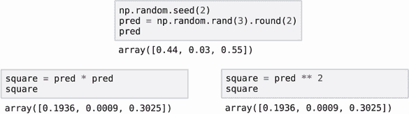

图 C.7 有两种方法可以平方数组的元素：将数组与自身相乘或使用幂运算（**）。

对于机器学习应用，我们可能需要的一些其他有用的逐元素操作包括指数、对数和平方根：

```
pred_exp = np.exp(pred)     ❶
pred_log = np.log(pred)     ❷
pred_sqrt = np.sqrt(pred)   ❸
```

❶ 计算指数

❷ 计算对数

❸ 计算平方根

布尔操作也可以逐元素应用于 NumPy 数组。为了说明它们，让我们再次生成一个包含一些随机数的数组：

```
pred = np.random.rand(3).round(2)
```

此数组包含以下数字：

```
array([0.44, 0.03, 0.55])
```

我们可以看到大于 0.5 的元素：

```
result = pred >= 0.5
```

因此，我们得到一个包含三个布尔值的数组：

```
array([False, False, True])
```

我们知道原始数组的最后一个元素大于 0.5，所以它是`True`，其余都是`False`。

与算术运算一样，我们可以在形状相同的两个 NumPy 数组上应用布尔操作。让我们生成两个随机数组：

```
pred1 = np.random.rand(3).round(2)
pred2 = np.random.rand(3).round(2)
```

数组具有以下值：

```
array([0.44, 0.03, 0.55])
array([0.44, 0.42, 0.33])
```

现在我们可以使用大于等于运算符（>=）来比较这些数组的值：

```
pred1 >= pred2
```

因此，我们得到一个包含布尔值的数组（图 C.8）：

```
array([ True, False, True])
```

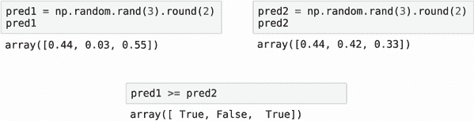

图 C.8 NumPy 中的布尔操作是逐元素的，并且可以应用于形状相同的两个数组以比较值。

最后，我们可以将逻辑运算（如逻辑与（&）和逻辑或（|））应用于布尔 NumPy 数组。让我们再次生成两个随机数组：

```
pred1 = np.random.rand(5) >= 0.3
pred2 = np.random.rand(5) >= 0.4
```

生成的数组具有以下值：

```
array([ True, False, True])
array([ True, True, False])
```

与算术运算一样，逻辑运算符也是逐元素进行的。例如，为了计算逐元素与，我们只需使用数组中的&运算符（图 C.9）：

```
res_and = pred1 & pred2
```

因此，我们得到

```
array([ True, False, False]) 
```

逻辑或以相同的方式工作（图 C.9）：

```
res_or = pred1 | pred2
```

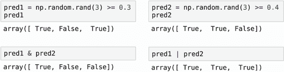

图 C.9 逻辑运算，如逻辑与和逻辑或，也可以逐元素应用。

这将创建以下数组：

```
array([ True, True, True])
```

### C.2.2 汇总操作

而逐元素操作接受一个数组并产生一个形状相同的数组，而汇总操作接受一个数组并产生一个单一数字。

例如，我们可以生成一个数组，然后计算所有元素的总和：

```
pred = np.random.rand(3).round(2)
pred_sum = pred.sum()
```

在这个例子中，`pred`是

```
array([0.44, 0.03, 0.55])
```

然后`pred_sum`是所有三个元素的总和，即 1.02：

0.44 + 0.03 + 0.55 = 1.02

其他汇总操作包括 `min`、`mean`、`max` 和 `std`：

```
print('min = %.2f' % pred.min())
print('mean = %.2f' % pred.mean())
print('max = %.2f' % pred.max())
print('std = %.2f' % pred.std())
```

运行此代码后，它产生

```
min = 0.03
mean = 0.34
max = 0.55
std = 0.22
```

当我们有一个二维数组时，汇总操作也会产生一个数字。然而，我们也可以单独将这些操作应用于行或列。

例如，让我们生成一个 4 × 3 的数组：

```
matrix = np.random.rand(4, 3).round(2)
```

这将生成一个数组：

```
array([[0.44, 0.03, 0.55],
       [0.44, 0.42, 0.33],
       [0.2 , 0.62, 0.3 ],
       [0.27, 0.62, 0.53]])
```

当我们调用 `max` 方法时，它返回一个数字：

```
matrix.max()
```

结果是 0.62，这是矩阵所有元素中的最大数。

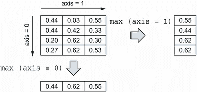

图 C.10 我们可以指定应用操作的轴：`axis=1` 表示应用于行，`axis=0` 表示应用于列。

如果我们现在想要找到每行的最大数，我们可以使用 `max` 方法并指定应用此操作的轴。当我们想要对行进行操作时，我们使用 `axis=1`（图 C.10）：

```
matrix.max(axis=1)
```

因此，我们得到一个包含四个数字的数组——每行的最大数：

```
array([0.55, 0.44, 0.62, 0.62])
```

同样，我们也可以找到每列的最大数。为此，我们使用 `axis=0`：

```
matrix.max(axis=0)
```

这次结果是三个数字——每列的最大数：

```
array([0.44, 0.62, 0.55])
```

其他操作——`sum`、`min`、`mean`、`std` 以及许多其他操作——也可以接受 `axis` 作为参数。例如，我们可以轻松计算每行的元素总和：

```
matrix.sum(axis=1)
```

执行时，我们得到四个数字：

```
array([1.02, 1.19, 1.12, 1.42])
```

### C.2.3 排序

经常我们需要对数组的元素进行排序。让我们看看如何在 NumPy 中进行操作。首先，让我们生成一个包含四个元素的数组：

```
pred = np.random.rand(4).round(2)
```

我们生成的数组包含以下元素：

```
array([0.44, 0.03, 0.55, 0.44])
```

要创建数组的排序副本，请使用 `np.sort`：

```
np.sort(pred)
```

它返回一个包含所有元素排序的数组：

```
array([0.03, 0.44, 0.44, 0.55])
```

因为它创建了一个副本并对其进行排序，所以原始数组 `pred` 保持不变。

如果我们想要就地排序数组的元素而不创建另一个数组，我们可以在数组本身上调用 `sort` 方法：

```
pred.sort()
```

现在，数组 `pred` 已经排序。

当涉及到排序时，我们还有另一个有用的工具：`argsort`。它不是对数组进行排序，而是返回排序后数组中的索引（图 C.11）：

```
idx = pred.argsort()
```

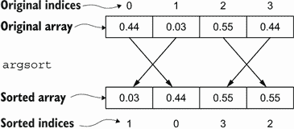

图 C.11 `sort` 函数对数组进行排序，而 `argsort` 生成一个索引数组，该数组可以排序数组。

现在，数组 `idx` 包含排序顺序的索引：

```
array([1, 0, 3, 2])
```

现在，我们可以使用带索引的数组 `idx` 来获取排序后的原始数组：

```
pred[idx]
```

如我们所见，它确实已经排序：

```
array([0.03, 0.44, 0.44, 0.55])
```

### C.2.4 重新塑形和组合

每个 NumPy 数组都有一个形状，它指定了它的大小。对于一维数组，它是数组的长度，对于二维数组，它是行数和列数。我们已经知道，我们可以通过使用 `shape` 属性来访问数组的形状：

```
rng = np.arange(12)
rng.shape
```

`rng` 的形状是 (12)，这意味着它是一个长度为 12 的一维数组。因为我们使用了 `np.arange` 来创建数组，它包含从 0 到 11（包含）的数字：

```
array([ 0, 1, 2, 3, 4, 5, 6, 7, 8, 9, 10, 11])
```

将数组的形状从一维转换为二维是可能的。我们使用 `reshape` 方法来完成：

```
rng.reshape(4, 3)
```

结果，我们得到一个四行三列的矩阵：

```
array([[ 0,  1,  2],
       [ 3,  4,  5],
       [ 6,  7,  8],
       [ 9, 10, 11]])
```

重塑之所以成功，是因为可以将 12 个原始元素重新排列成四行三列。换句话说，元素的总数没有改变。然而，如果我们尝试将其重塑为(4, 4)，它将不允许我们这样做：

```
rng.reshape(4, 4)
```

当我们这样做时，NumPy 会引发一个`ValueError`：

```
---------------------------------------------------------------------------
ValueError                                Traceback (most recent call last)
<ipython-input-176-880fb98fa9c8> in <module>
----> 1 rng.reshape(4, 4)

ValueError: cannot reshape array of size 12 into shape (4,4)
```

有时我们需要通过将多个数组组合在一起来创建一个新的 NumPy 数组。让我们看看如何做。

首先，我们创建两个数组，我们将使用它们来演示：

```
vec = np.arange(3)
mat = np.arange(6).reshape(3, 2)
```

第一个，`vec`，是一个包含三个元素的向量：

```
array([0, 1, 2])
```

第二个，`mat`，是一个二维数组，有三行两列：

```
array([[0, 1],
       [2, 3],
       [4, 5]])
```

将两个 NumPy 数组组合在一起的最简单方法是使用`np.concatenate`函数：

```
np.concatenate([vec, vec])
```

它接受一个一维数组列表并将它们组合成一个更大的数组。在我们的例子中，我们传递了两次`vec`，因此结果是一个长度为六的数组：

```
array([0, 1, 2, 0, 1, 2])
```

我们可以使用`np.hstack`（水平堆叠的简称）达到相同的结果：

```
np.hstack([vec, vec])
```

它再次接受一个数组列表并将它们水平堆叠，产生一个更大的数组：

```
array([0, 1, 2, 0, 1, 2])
```

我们也可以将`np.hstack`应用于二维数组：

```
np.hstack([mat, mat])
```

结果是另一个矩阵，其中原始矩阵通过列水平堆叠：

```
array([[0, 1, 0, 1],
       [2, 3, 2, 3],
       [4, 5, 4, 5]])
```

然而，对于二维数组，`np.concatenate`的工作方式与`np.hstack`不同：

```
np.concatenate([mat, mat])
```

当我们将`np.concatenate`应用于矩阵时，它将它们垂直堆叠，而不是像一维数组那样水平堆叠，创建一个具有六行的新矩阵：

```
array([[0, 1],
       [2, 3],
       [4, 5],
       [0, 1],
       [2, 3],
       [4, 5]])
```

结合 NumPy 数组的另一种有用方法是`np.column_stack`：它允许我们将向量和矩阵堆叠在一起。例如，假设我们想要给我们的矩阵添加一个额外的列。为此，我们只需传递一个包含向量和矩阵的列表：

```
np.column_stack([vec, mat])
```

结果，我们得到一个新的矩阵，其中`vec`成为第一列，其余的`mat`跟在后面：

```
array([[0, 0, 1],
       [1, 2, 3],
       [2, 4, 5]])
```

我们可以将`np.column_stack`应用于两个向量：

```
np.column_stack([vec, vec])
```

结果是一个两列的矩阵：

```
array([[0, 0],
       [1, 1],
       [2, 2]])
```

与`np.hstack`类似，它水平堆叠数组，存在`np.vstack`，它垂直堆叠数组：

```
np.vstack([vec, vec])
```

当我们垂直堆叠两个向量时，我们得到一个有两行的矩阵：

```
array([[0, 1, 2],
       [0, 1, 2]])
```

我们也可以垂直堆叠两个矩阵：

```
np.vstack([mat, mat])
```

结果与`np.concatenate([mat, mat])`相同——我们得到一个具有六行的新矩阵：

```
array([[0, 1],
       [2, 3],
       [4, 5],
       [0, 1],
       [2, 3],
       [4, 5]])
```

`np.vstack`函数也可以将向量和矩阵堆叠在一起，实际上创建了一个具有新行的矩阵：

```
np.vstack([vec, mat.T])
```

当我们这样做时，`vec`成为新矩阵的第一行：

```
array([[0, 1, 2],
       [0, 2, 4],
       [1, 3, 5]])
```

注意，在这段代码中，我们使用了`mat`的`T`属性。这是一个矩阵转置操作，它将矩阵的行转换为列：

```
mat.T
```

原始的`mat`具有以下数据：

```
array([[0, 1],
       [2, 3],
       [4, 5]])
```

经过转置后，原本是列的变成了行：

```
array([[0, 2, 4],
       [1, 3, 5]])
```

### C.2.5 切片和过滤

与 Python 列表类似，我们也可以使用切片来访问 NumPy 数组的一部分。例如，假设我们有一个 5 × 3 的矩阵：

```
mat = np.arange(15).reshape(5, 3)
```

这个矩阵有五行三列：

```
array([[ 0,  1,  2],
       [ 3,  4,  5],
       [ 6,  7,  8],
       [ 9, 10, 11],
       [12, 13, 14]])
```

我们可以通过使用切片操作来访问矩阵的某些部分。例如，我们可以使用范围操作符 (:) 获取第一行自由行：

```
mat[:3]
```

它返回索引为 0、1 和 2 的行（不包括 3）：

```
array([[0, 1, 2],
       [3, 4, 5],
       [6, 7, 8]])
```

如果我们只需要第 1 行和第 2 行，我们指定范围的开头和结尾：

```
mat[1:3]
```

这给我们所需的行：

```
array([[3, 4, 5],
       [6, 7, 8]])
```

与行类似，我们也可以只选择一些列；例如，前两列：

```
mat[:, :2]
```

这里我们有两个范围：

+   第一个是一个简单的冒号 (:)，没有起始和结束，这意味着“包含所有行。”

+   第二个是一个包括列 0 和 1（不包括列 2）的范围。

因此，我们得到

```
array([[ 0,  1],
       [ 3,  4],
       [ 6,  7],
       [ 9, 10],
       [12, 13]])
```

当然，我们可以将两者结合起来，选择任何我们想要的矩阵部分：

```
mat[1:3, :2]
```

这给我们第 1 行和第 2 行以及第 0 列和第 1 列：

```
array([[3, 4],
       [6, 7]])
```

如果我们不需要范围，而是需要一些特定的行或列，我们可以简单地提供一个索引列表：

```
mat[[3, 0, 1]]
```

这给我们三个索引为 3、0 和 1 的行：

```
array([[ 9, 10, 11],
       [ 0,  1,  2],
       [ 3,  4,  5]])
```

而不是使用单个索引，我们可以使用二进制掩码来指定要选择哪些行。例如，假设我们想要选择行中第一个元素是奇数的行。

要检查第一个元素是否为奇数，我们需要做以下操作：

1.  选择矩阵的第一列。

1.  将模 2 操作 (%) 应用于所有元素以计算除以 2 的余数。

1.  如果余数是 1，则该数字是奇数，如果是 0，则该数字是偶数。

这对应于以下 NumPy 表达式：

```
mat[:, 0] % 2 == 1
```

最后，它产生一个布尔数组：

```
array([False, True, False, True, False])
```

我们可以看到，对于第 1 行和第 3 行表达式是 `True`，而对于第 0 行、第 2 行和第 5 行是 `False`。

现在，我们可以使用这个表达式来选择只包含 `True` 的行：

```
mat[mat[:, 0] % 2 == 1]
```

这给我们一个只有两行的矩阵：第 1 行和第 3 行：

```
array([[ 3,  4,  5],
       [ 9, 10, 11]])
```

## C.3 线性代数

NumPy 非常受欢迎的原因之一是它支持线性代数操作。NumPy 将所有内部计算委托给 BLAS 和 LAPACK——经过时间考验的用于高效低级计算的库——这就是为什么它如此之快。

在本节中，我们简要概述了本书中需要的线性代数操作。我们首先从最常见的开始：矩阵和向量乘法。

### C.3.1 乘法

在线性代数中，我们有多种乘法类型：

+   向量-向量乘法：向量乘以另一个向量

+   矩阵-向量乘法：矩阵乘以向量

+   矩阵-矩阵乘法：矩阵乘以另一个矩阵

让我们更仔细地看看每一个，并看看如何在 NumPy 中实现它们。

向量-向量乘法

向量-向量乘法涉及两个向量。它通常被称为 *点积* 或 *标量积*；它接受两个向量并产生一个 *标量*——一个单一的数字。

假设我们有两个向量，*u* 和 *v*，每个向量的长度为 *n*；那么 *u* 和 *v* 之间的点积是

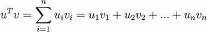

注意：在本附录中，长度为 *n* 的向量的元素从 0 到 *n*–1 编号：这样更容易将数学符号的概念映射到 NumPy。

这直接转换为 Python。如果我们有两个 NumPy 数组 `u` 和 `v`，它们之间的点积是

```
dot = 0

for i in range(n):
    dot = u[i] * v[i]
```

当然，我们可以利用 NumPy 中的向量运算功能，用一行表达式来计算它：

```
(u * v).sum()
```

然而，由于这是一个相当常见的操作，它被实现为 NumPy 中的 `dot` 方法。因此，为了计算点积，我们只需调用 `dot`：

```
u.dot(v)
```

矩阵-向量乘法

另一种乘法类型是矩阵-向量乘法。

假设我们有一个大小为 *m*×*n* 的矩阵 *X* 和一个大小为 *n* 的向量 *u*。如果我们用 *X* 乘以 *u*，我们得到另一个大小为 *m* 的向量（图 C.12）：

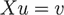

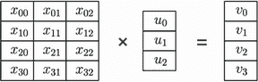

图 C.12 当我们将一个 4×3 矩阵乘以一个长度为 3 的向量时，我们得到一个长度为 4 的向量。

我们可以将矩阵 *X* 视为一组 *n* 个行向量 *x[i]*，每个大小为 *m*（图 C.13）。

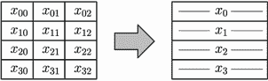

图 C.13 我们可以将矩阵 X 视为四个行向量 *x[i]*，每个大小为 3。

然后，我们可以将矩阵-向量乘法 *Xu* 表示为 *m* 次向量-向量乘法，每次乘法都是矩阵的每一行 *x[i]* 与向量 *u* 之间的乘法。结果是另一个向量——向量 *v*（图 C.14）。

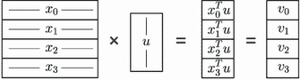

图 C.14 矩阵-向量乘法是一组向量-向量乘法：我们将矩阵 *X* 的每一行 *x[i]* 乘以向量 *u*，并得到向量 *v*。

将这个想法转换为 Python 是直接的：

```
v = np.zeros(m)           ❶

for i in range(m):        ❷
    v[i] = X[i].dot(u)    ❸
```

❶ 创建一个空向量 *v*

❷ 对于 *X* 的每一行 x[i]

❸ 计算向量 *v* 的第 *i* 个元素作为点积 *x[i]* * *u*

就像向量-向量乘法一样，我们可以使用矩阵 `X`（一个二维数组）的 `dot` 方法来乘以向量 `u`（一个一维数组）：

```
v = X.dot(u)
```

结果是向量 `v`——一个一维的 NumPy 数组。

矩阵-矩阵乘法

最后，我们有一个矩阵-矩阵乘法。假设我们有两个矩阵，*X* 的大小为 *m*×*n* 和 *U* 的大小为 *n*×*k*。那么结果是另一个大小为 *m*×*k* 的矩阵 *V*（图 C.15）：

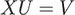


图 C.15 当我们将一个 4×3 矩阵 *X* 乘以一个 3×2 矩阵 *U* 时，我们得到一个 4×2 矩阵 *V*。

理解矩阵-矩阵乘法最简单的方法是将 *U* 视为一组列：*u*[0]*, *u*[1], ..., *u*[k]*[-1]（图 C.16）。

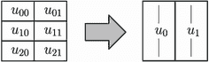

图 C.16 我们可以将 *U* 视为一组列向量。在这种情况下，我们有两个列：*u*[0] 和 *u*[1]。

然后矩阵-矩阵乘法 *XU* 是一系列矩阵-向量乘法 *Xu[i]*。每次乘法的结果是一个向量 *v[i]*，它是结果矩阵 *V* 的第 *i* 列（图 C.17）：

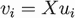

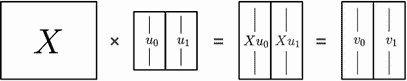

图 C.17 我们可以将矩阵-矩阵乘法 *XU* 视为一组矩阵-向量乘法 *v[i]* *= Xu[i]*，其中 *u[i]*s 是 *U* 的列。结果是所有 *v[i]* 的堆叠组成的矩阵 *V*。

在 NumPy 中实现它，我们可以简单地这样做：

```
V = np.zeros((m, k))       ❶

for i in range(k):         ❷
    vi = X.dot(U[:, i])    ❸
    V[:, i] = vi           ❹
```

❶ 创建一个空矩阵 *V*

❷ 对于矩阵 *U* 的每一列 *u*[i]

❸ 计算 *v*[i] 作为矩阵-向量乘法 *X * u*[i]

❹ 将 *v*[i] 作为 *V* 的第 *i* 列传递

回想一下，`U[:, i]` 表示获取第 *i* 列。然后我们用 `X` 乘以该列，得到 `vi`。使用 `V[:, i]`，并且因为我们有赋值（=），我们用 `vi` 覆盖 `V` 的第 *i* 列。

当然，在 NumPy 中有一个快捷方式——又是 `dot` 方法：

```
V = X.dot(U)
```

### C.3.2 矩阵逆

方阵 *X* 的逆矩阵是矩阵 *X*^(–1)，使得 *X*^(–1)*X = I*，其中 *I* 是单位矩阵。单位矩阵 *I* 在进行矩阵-向量乘法时不会改变向量：

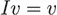

我们为什么需要它？假设我们有一个系统：

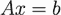

我们知道矩阵 *A* 和结果向量 *b*，但不知道向量 *x*——我们想要找到它。换句话说，我们想要*解*这个系统。

做这件事的一种可能方式是

+   计算 *A*^(–1)，即 *A* 的逆矩阵，然后

+   将方程的两边乘以逆矩阵 *A*^(–1)

在这样做的时候，我们得到

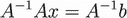

因为 *A*^(–1)*A = I*，所以我们有

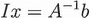

或者

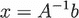

在 NumPy 中，为了计算逆矩阵，我们使用 `np.linalg.inv`：

```
A = np.array([
    [0, 1, 2],
    [1, 2, 3],
    [2, 3, 3]
])

Ainv = np.linalg.inv(A)
```

对于这个特定的方阵 `A`，可以计算其逆矩阵，所以 `Ainv` 有以下值：

```
array([[-3.,  3., -1.],
       [ 3., -4.,  2.],
       [-1.,  2., -1.]])
```

我们可以验证，如果我们用矩阵乘以其逆矩阵，我们得到单位矩阵：

```
A.dot(Ainv)
```

结果确实是单位矩阵：

```
array([[1., 0., 0.],
       [0., 1., 0.],
       [0., 0., 1.]])
```

注意：如果你只想解方程 *Ax = b*，那么你实际上不需要计算逆矩阵。从计算的角度来看，计算逆矩阵是一个昂贵的操作。相反，我们应该使用 `np.linalg.solve`，这要快得多：

```
b = np.array([1, 2, 3])
x = np.linalg.solve(A, b)
```

在这本书中，当计算线性回归的权重时，我们为了简单起见使用逆矩阵：这使得代码更容易理解。

有些矩阵没有逆矩阵。首先，非方阵无法求逆。此外，并非所有方阵都可以求逆：存在*奇异*矩阵——对于这些矩阵，不存在逆矩阵。

当我们尝试在 NumPy 中求一个奇异矩阵的逆时，我们会得到一个错误：

```
B = np.array([
    [0, 1, 1],
    [1, 2, 3],
    [2, 3, 5]
])

np.linalg.inv(B)
```

这段代码会引发 `LinAlgError`：

```
---------------------------------------------------------------------------
LinAlgError                               Traceback (most recent call last)
<ipython-input-286-14528a9f848e> in <module>
      5 ])
      6
----> 7 np.linalg.inv(B)

<__array_function__ internals> in inv(*args, **kwargs)

<...>

LinAlgError: Singular matrix
```

### C.3.3 正则方程

在第二章中，我们使用了正则方程来计算线性回归的权重向量。在本节中，我们简要概述了如何得到公式，但不深入细节。更多信息，请参阅任何线性代数教科书。

这一节可能看起来数学性很强，但请随意跳过：它不会影响你对本书的理解。如果你在大学里学习过正则方程和线性回归，但现在已经忘记了大部分内容，这一节应该能帮助你刷新记忆。

假设我们有一个包含观测的矩阵 *X* 和一个包含结果的向量 *y*。我们想要找到一个向量 *w*，使得

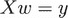

然而，因为 *X* 不是一个方阵，我们无法简单地求逆，这个系统的精确解不存在。我们可以尝试找到一个不精确的解，并执行以下技巧。我们将两边乘以 *X* 的转置：

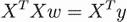

现在 *X^TX* 是一个方阵，应该可以求逆。让我们称这个矩阵为 *C*：

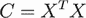

该方程变为

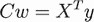

在这个方程中，*X^Ty* 也是一个向量：当我们用一个矩阵乘以一个向量时，我们得到一个向量。让我们称它为 *z*。所以现在我们有

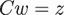

这个系统现在有一个精确解，这是我们最初想要解决的系统的最佳近似解。证明这一点超出了本书的范围，所以请参考教科书以获取更多细节。

为了解这个系统，我们可以求逆 *C* 并将两边乘以它：

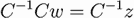

或者

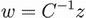

现在我们已经得到了 *w* 的解。让我们用原始的 *X* 和 *y* 来重新表示它：

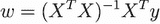

这是正规方程，它找到原始系统 *Xw = y* 的最佳近似解 *w*。

将其转换为 NumPy 非常简单：

```
C = X.T.dot(X)
Cinv = np.linalg.inv(C)
w = Cinv.dot(X.T).dot(y)
```

现在数组 `w` 包含了该系统的最佳近似解。
