# 附录 D. Pandas 简介

我们不期望本书的读者具备 Pandas 知识。然而，我们在整本书中广泛使用它。当我们这样做时，我们尝试解释代码，但并不总是能够详细涵盖所有内容。

在这个附录中，我们更深入地介绍了 Pandas，涵盖了我们在章节中使用到的所有功能。

## D.1 Pandas

Pandas 是一个用于处理表格数据的 Python 库。它是数据操作中流行且方便的工具。它在准备数据以训练机器学习模型时特别有用。

如果你使用 Anaconda，它已经预装了 Pandas。如果没有，请使用 `pip` 安装：

```
pip install pandas
```

为了实验 Pandas，让我们创建一个名为 appendix-d-pandas 的笔记本，并使用它来运行这个附录中的代码。

首先，我们需要导入它：

```
import pandas as pd
```

与 NumPy 一样，我们遵循一个约定，并使用别名 `pd` 而不是全名。

我们从 Pandas 的核心数据结构开始探索：DataFrame 和 Series。

### D.1.1 DataFrame

在 Pandas 中，*DataFrame* 简单来说就是一个表格：一个具有行和列的数据结构（图 D.1）。

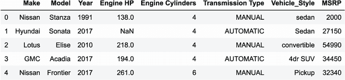

图 D.1 Pandas 中的 DataFrame：一个包含五行八列的表格

要创建一个 DataFrame，我们首先需要创建一些我们将放入表中的数据。它可以是包含一些值的列表列表：

```
data = [
    ['Nissan', 'Stanza', 1991, 138, 4, 'MANUAL', 'sedan', 2000],
    ['Hyundai', 'Sonata', 2017, None, 4, 'AUTOMATIC', 'Sedan', 27150],
    ['Lotus', 'Elise', 2010, 218, 4, 'MANUAL', 'convertible', 54990],
    ['GMC', 'Acadia',  2017, 194, 4, 'AUTOMATIC', '4dr SUV', 34450],
    ['Nissan', 'Frontier', 2017, 261, 6, 'MANUAL', 'Pickup', 32340],
]
```

这份数据来自我们在第二章使用的价格预测数据集：我们有一些汽车特征，如型号、制造商、制造年份和变速类型。

在创建 DataFrame 时，我们需要知道每一列包含什么，所以让我们创建一个包含列名的列表：

```
columns = [
    'Make', 'Model', 'Year', 'Engine HP', 'Engine Cylinders',
    'Transmission Type', 'Vehicle_Style', 'MSRP'
]
```

现在我们已经准备好从它创建一个 DataFrame。为此，我们使用 `pd.DataFrame`：

```
df = pd.DataFrame(data, columns=columns)
```

它创建了一个包含五行八列的 DataFrame（图 D.1）。

我们可以用 DataFrame 做的第一件事是查看数据的前几行，以了解里面的内容。为此，我们使用 `head` 方法：

```
df.head(n=2)
```

它显示了 DataFrame 的前两行。显示的行数由 `n` 参数控制（图 D.2）。

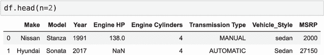

图 D.2 使用 `head` 预览 DataFrame 的内容

或者，我们可以使用字典列表来创建一个 DataFrame：

```
data = [
    {
        "Make": "Nissan",
        "Model": "Stanza",
        "Year": 1991,
        "Engine HP": 138.0,
        "Engine Cylinders": 4,
        "Transmission Type": "MANUAL",
        "Vehicle_Style": "sedan",
        "MSRP": 2000
    },
    ... # more rows
]

df = pd.DataFrame(data)
```

在这种情况下，我们不需要指定列名：Pandas 会自动从字典的字段中获取它们。

### D.1.2 Series

DataFrame 中的每一列都是一个 *Series*——一个用于包含单一类型值的特殊数据结构。在某种程度上，它与一维 NumPy 数组非常相似。

我们可以通过两种方式访问列的值。首先，我们可以使用点符号（图 D.3，A）：

```
df.Make
```

另一种方式是使用括号符号（图 D.3，B）：

```
df['Make']
```

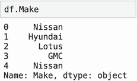

(A) 点符号

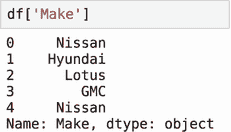

(B) 括号符号

图 D.3 访问 DataFrame 列的两种方式：（A）点符号和（B）括号符号

结果完全相同：一个包含制造商列值的 Pandas Series。

如果列名包含空格或其他特殊字符，则我们只能使用方括号表示法。例如，要访问 Engine HP 列，我们只能使用方括号：

```
df['Engine HP']
```

方括号表示法也更加灵活。我们可以将列名保存在变量中，并使用它来访问其内容：

```
col_name = 'Engine HP'
df[col_name]
```

如果我们需要选择列的子集，我们再次使用方括号，但使用名称列表而不是单个字符串：

```
df[['Make', 'Model', 'MSRP']]
```

这将返回一个仅包含三个列的 DataFrame（图 D.4）。

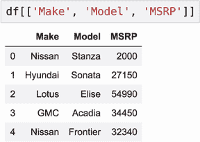

图 D.4 要选择 DataFrame 的列子集，请使用带有名称列表的方括号。

要向 DataFrame 中添加列，我们同样使用方括号表示法：

```
df['id'] = ['nis1', 'hyu1', 'lot2', 'gmc1', 'nis2']
```

DataFrame 中有五行，因此值列表也应该有五个值。结果，我们又有了一个新列，id（图 D.5）。

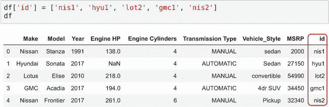

图 D.5 要添加新列，请使用方括号表示法。

在这种情况下，id 不存在，因此我们在 DataFrame 的末尾添加了一个新列。如果 id 存在，则此代码将覆盖现有值：

```
df['id'] = [1, 2, 3, 4, 5]
```

现在 id 列的内容发生了变化（图 D.6）。

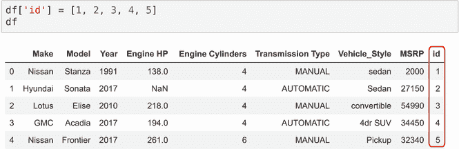

图 D.6 要更改列的内容，也请使用方括号表示法。

要删除列，请使用 `del` 操作符：

```
del df['id']
```

运行后，此列将从 DataFrame 中消失。

### D.1.3 索引

DataFrame（图 D.7，A）和 Series（图 D.7，B）的左侧都有数字；这些数字被称为*索引*。索引描述了如何从 DataFrame（或 Series）中访问行。

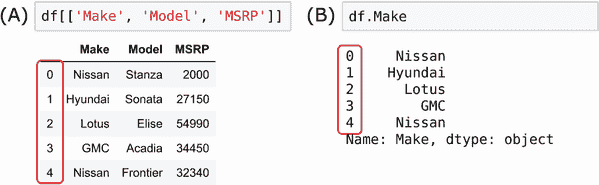

图 D.7 DataFrame 和 Series 都有一个索引—左侧的数字。

我们可以使用 `index` 属性来获取 DataFrame 的索引：

```
df.index
```

因为我们在创建 DataFrame 时没有指定索引，它使用了默认的索引，即从 0 开始的自动递增数字序列：

```
RangeIndex(start=0, stop=5, step=1)
```

索引的行为与 Series 对象相同，因此适用于 Series 的所有操作也适用于索引。

虽然一个 Series 只有一个索引，但一个 DataFrame 有两个：一个用于访问行，另一个用于访问列。当我们从 DataFrame 中选择单个列时，我们已经使用了 Index：

```
df['Make']     ❶
```

❶ 使用列索引获取 Make 列

要获取列名，我们使用 `columns` 属性（图 D.8）：

```
df.columns
```

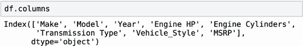

图 D.8 `columns` 属性包含列名。

### D.1.4 访问行

我们可以通过两种方式访问行：使用 `iloc` 和 `loc`。

首先，让我们从 `iloc` 开始。我们使用它通过位置数字访问 DataFrame 的行。例如，要访问 DataFrame 的第一行，请使用索引 0：

```
df.iloc[0]
```

这将返回第一行的内容：

```
Make                 Nissan
Model                Stanza
Year                   1991
Engine HP               138
Engine Cylinders          4
Transmission Type    MANUAL
Vehicle_Style         sedan
MSRP                   2000
Name: 0, dtype: object
```

要获取行子集，请传递一个包含整数的列表—行号：

```
df.iloc[[2, 3, 0]]
```

结果是另一个仅包含所需行的 DataFrame（图 D.9）。

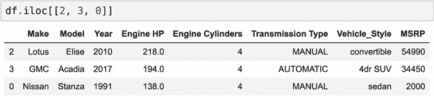

图 D.9 使用 `iloc` 访问 DataFrame 的行

我们可以使用`iloc`来洗牌 DataFrame 的内容。在我们的 DataFrame 中，我们有五行。因此，我们可以创建一个从 0 到 4 的整数列表并对其进行洗牌。然后我们可以使用洗牌后的列表在`iloc`中；这样，我们将得到一个所有行都洗牌的 DataFrame。

让我们实现它。首先，我们使用 NumPy 创建一个大小为 5 的范围：

```
import numpy as np

idx = np.arange(5)
```

它创建了一个从 0 到 4 的整数数组：

```
array([0, 1, 2, 3, 4])
```

现在我们可以对这个数组进行洗牌：

```
np.random.seed(2)
np.random.shuffle(idx)
```

结果，我们得到

```
array([2, 4, 1, 3, 0])
```

最后，我们使用这个数组与`iloc`一起按洗牌顺序获取行：

```
df.iloc[idx]
```

在结果中，行是按照`idx`中的数字重新排序的（图 D.10）。

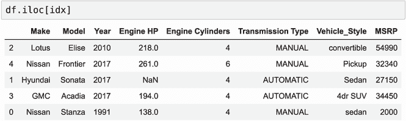

图 D.10 使用`iloc`洗牌 DataFrame 的行

这不会改变我们`df`中已有的 DataFrame。但我们可以将`df`变量重新赋值给新的 DataFrame：

```
df = df.iloc[idx]
```

因此，`df`现在包含了一个洗牌后的 DataFrame。

在这个洗牌后的 DataFrame 中，我们仍然可以使用`iloc`通过它们的位号来获取行。例如，如果我们向`iloc`传递`[0, 1, 2]`，我们将得到前三行（图 D.11）。

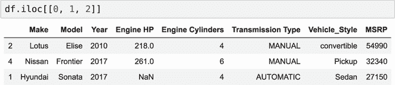

图 D.11 当使用`iloc`时，我们通过位置来获取行。

然而，你可能已经注意到左边的数字不再连续了：当洗牌 DataFrame 时，我们也洗牌了索引（图 D.12）。

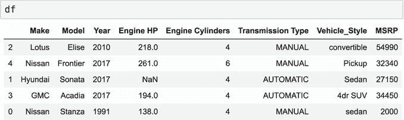

图 D.12 当洗牌 DataFrame 的行时，我们也改变了索引：它不再连续。

让我们检查索引：

```
df.index
```

现在它不同了：

```
Int64Index([2, 4, 1, 3, 0], dtype='int64')
```

要使用此索引来访问行，我们需要`loc`而不是`iloc`。例如：

```
df.loc[[0, 1]]
```

因此，我们得到一个按 0 和 1 索引的 DataFrame——最后一行和中间的行（图 D.13）。

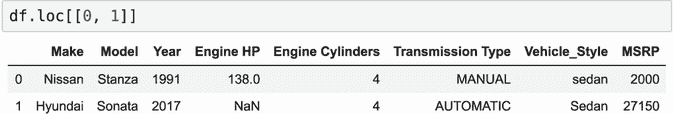

图 D.13 当使用`loc`时，我们通过索引而不是位置来获取行。

它与`iloc`非常不同：`iloc`不使用索引。让我们比较一下：

```
df.iloc[[0, 1]]
```

在这种情况下，我们也得到一个两行的 DataFrame，但这些都是前两行，分别按 2 和 4 索引（图 D.14）。

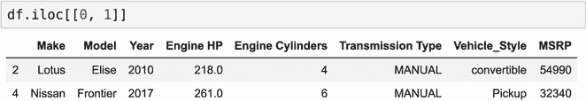

图 D.14 与`loc`不同，`iloc`通过位置而不是索引来获取行。在这种情况下，我们获取位置为 0 和 1 的行（分别按 2 和 4 索引）。

因此，`iloc`根本不查看索引；它只使用实际位置。

可以替换索引并将其重置为默认值。为此，我们可以使用`reset_index`方法：

```
df.reset_index(drop=True)
```

它创建了一个具有连续索引的新 DataFrame（图 D.15）。


图 D.15 我们可以通过使用`reset_index`来将索引重置为连续编号。

### D.1.5 分割 DataFrame

我们也可以使用`iloc`来选择 DataFrame 的子集。假设我们想要将 DataFrame 分成三个部分：训练、验证和测试。我们将使用 60%的数据进行训练（三行），20%用于验证（一行），20%用于测试（一行）：

```
n_train = 3
n_val = 1
n_test = 1
```

在选择行范围时，我们使用切片操作符（:）。它在 DataFrame 中的工作方式与在列表中的工作方式相同。

因此，对于分割 DataFrame，我们执行以下操作：

```
df_train = df.iloc[:n_train]              ❶
df_val = df.iloc[n_train:n_train+n_val]   ❷
df_test = df.iloc[n_train+n_val:]         ❸
```

❶ 选择训练数据行

❷ 选择验证数据行

❸ 选择测试数据行

在 ❶ 中，我们得到训练集：`iloc[:n_train]` 从 DataFrame 的开始选择直到 `n_train` 前的行。对于 `n_train=3`，它选择行 0、1 和 2。行 3 不包括在内。

在 ❷ 中，我们得到验证集：`iloc[n_train:n_train+n_val]` 从 3 到 3 + 1 = 4 选择行。它是不包含的，所以它只选择行 3。

在 ❸ 中，我们得到测试集：`iloc[n_train+n_val:]` 从 3 + 1 = 4 开始选择直到 DataFrame 的末尾。在我们的例子中，它只选择行 4。

因此，我们有三个 DataFrame（图 D.16）。

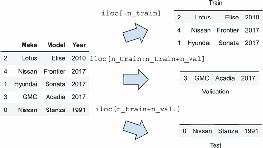

图 D.16 使用 `iloc` 和冒号运算符将 DataFrame 分割为训练、验证和测试 DataFrame

更多有关 Python 中切片的信息，请参阅附录 B。

我们已经介绍了 Pandas 的基本数据结构，现在让我们看看我们可以用它们做什么。

## D.2 操作

Pandas 是一个强大的数据处理工具，它支持各种操作。我们可以将这些操作分为逐元素操作、汇总操作、过滤、排序、分组等。在本节中，我们将介绍这些操作。

### D.2.1 逐元素操作

在 Pandas 中，Series 支持 *逐元素* 操作。就像在 NumPy 中一样，逐元素操作应用于 Series 中的每个元素，我们得到另一个 Series 作为结果。

所有基本算术运算都是逐元素进行的：加法 (+)、减法 (–)、乘法 (*) 和除法 (/)。对于逐元素操作，我们不需要编写任何循环：Pandas 会为我们完成。

例如，我们可以将 Series 的每个元素乘以 2：

```
df['Engine HP'] * 2
```

结果是另一个 Series，每个元素都乘以 2（图 D.17）。

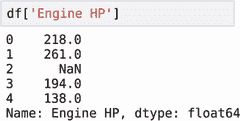

(A) 原始序列

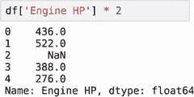

(B) 乘法结果

图 D.17 与 NumPy 数组一样，Series 的所有基本算术运算都是逐元素进行的。

与算术运算一样，逻辑运算也是逐元素进行的：

```
df['Year'] > 2000
```

此表达式返回一个布尔 Series，对于大于 2000 的元素返回 `True`（图 D.18）。

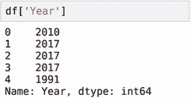

(A) 原始序列

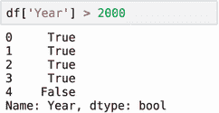

(B) 结果

图 D.18 逻辑运算逐元素应用：在结果中，对于满足条件的所有元素，我们都有 `True`。

我们可以将多个逻辑运算与逻辑与 (&) 或逻辑或 (|) 结合使用：

```
(df['Year'] > 2000) & (df['Make'] == 'Nissan')
```

结果也是一个 Series。逻辑运算对于过滤非常有用，我们将在下一节中介绍。

### D.2.2 过滤

通常，我们需要根据某些标准选择行的一个子集。为此，我们使用布尔运算和括号表示法。

例如，要选择所有尼桑汽车，将条件放在括号内：

```
df[df['Make'] == 'Nissan']
```

因此，我们还有一个只包含尼桑汽车的 DataFrame（图 D.19）。

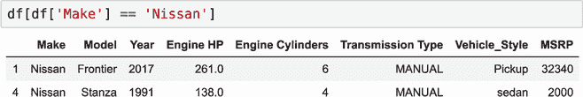

图 D.19 要过滤行，将过滤条件放在括号内。

如果我们需要更复杂的筛选条件，我们可以使用逻辑运算符如 and (&) 和 or (|) 组合多个条件。

例如，为了选择 2000 年后制造的自动挡汽车，我们使用 and 运算符（图 D.20）：

```
df[(df['Year'] > 2010) & (df['Transmission Type'] == 'AUTOMATIC')]
```

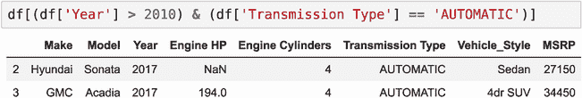

图 D.20 要使用多个选择条件，使用逻辑与 (&) 将它们组合起来。

### D.2.3 字符串操作

虽然对于 NumPy 数组来说，只能进行算术和逻辑元素级操作，但 Pandas 支持字符串操作：小写转换、替换子字符串以及所有可以在字符串对象上进行的其他操作。

让我们看看 DataFrame 中的 `Vehicle_Style` 列，它是其中的一个列。我们注意到数据中存在一些不一致性：有时名称以小写字母开头，有时以大写字母开头（图 D.21）。

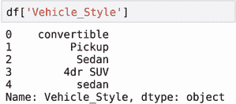

图 D.21 数据中存在一些不一致性的 Vehicle_Style 列

为了解决这个问题，我们可以将所有内容转换为小写。对于常规 Python 字符串，我们会使用 `lower` 函数并将其应用于序列的所有元素。在 Pandas 中，我们不是编写循环，而是使用特殊的 `str` 访问器——它使字符串操作元素级，并允许我们避免显式编写 `for` 循环：

```
df['Vehicle_Style'].str.lower() 
```

结果是一个新 Series，其中所有字符串都转换为小写（图 D.22）。

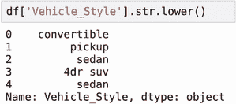

图 D.22 要将 Series 中的所有字符串转换为小写，使用 `lower`。

也可以通过多次使用 `str` 访问器链式执行多个字符串操作（图 D.23）：

```
df['Vehicle_Style'].str.lower().str.replace(' ', '_')
```

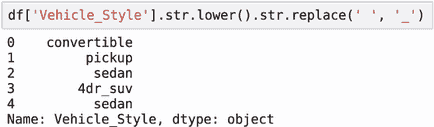

图 D.23 要替换 Series 中所有字符串中的字符，使用 `replace` 方法。在一行中可以链式调用多个方法。

在这里，我们一次性将所有内容转换为小写并替换空格为下划线。

我们的 DataFrame 的列名也不一致：有时有空格，有时有下划线（图 D.24）。

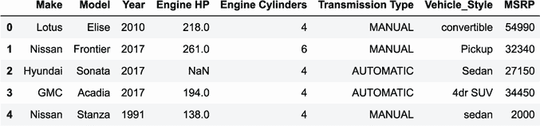

图 D.24 DataFrame：列名不一致。

我们也可以使用字符串操作来标准化列名：

```
df.columns.str.lower().str.replace(' ', '_')
As a result, we have:
Index(['make', 'model', 'year', 'engine_hp', 'engine_cylinders',
       'transmission_type', 'vehicle_style', 'msrp'],
      dtype='object')
```

这行代码返回新的名称，但它不会改变 DataFrame 的列名。要修改它们，我们需要将结果重新赋值给 `df.columns`：

```
df.columns = df.columns.str.lower().str.replace(' ', '_')
```

当我们这样做时，列名会改变（图 D.25）。

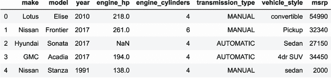

图 D.25 标准化列名后的 DataFrame

我们可以在 DataFrame 的所有列中解决这种不一致性问题。为此，我们需要选择所有包含字符串的列并将它们标准化。

要选择所有字符串，我们可以使用 DataFrame 的 `dtype` 属性（图 D.26）。

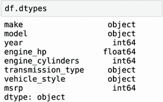

图 D.26 `dtypes` 属性返回 DataFrame 每列的类型。

所有字符串列的 `dtype` 都设置为 `object`。因此，如果我们想选择它们，我们使用过滤：

```
df.dtypes[df.dtypes == 'object']
```

这给了我们一个只包含 `object` 数据类型列的 Series（图 D.27）。

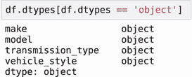

图 D.27 要选择只有字符串的列，选择 `object` 数据类型。

实际名称存储在索引中，因此我们需要获取它们：

```
df.dtypes[df.dtypes == 'object'].index

```

这给我们以下列名：

```
Index(['make', 'model', 'transmission_type', 'vehicle_style'], dtype='object')
```

现在，我们可以使用此列表遍历字符串列，并对每个列分别应用归一化：

```
string_columns = df.dtypes[df.dtypes == 'object'].index

for col in string_columns:
    df[col] = df[col].str.lower().str.replace(' ', '_')
```

这是我们运行后的结果（如图 D.28 所示）。

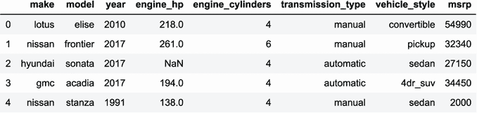

图 D.28 列名和值都已归一化：名称为小写，空格被下划线替换。

接下来，我们将介绍另一种类型的操作：汇总操作。

### D.2.4 汇总操作

正如我们在 NumPy 中所做的那样，在 Pandas 中我们也有逐元素操作，这些操作产生另一个 Series，以及产生汇总的汇总操作——一个或多个数字。

汇总操作对于进行探索性数据分析非常有用。对于数值字段，操作类似于我们在 NumPy 中所拥有的。例如，要计算列中所有值的平均值，我们使用 `mean` 方法：

```
df.msrp.mean()
```

我们还可以使用的其他方法包括

+   `sum`: 计算所有值的总和

+   `min`: 获取 Series 中的最小数字

+   `max`: 获取 Series 中的最大数字

+   `std`: 计算标准差

而不是单独检查这些内容，我们可以使用 `describe` 一次性获取所有这些值：

```
df.msrp.describe()
```

它创建一个包含行数、平均值、最小值、最大值以及标准差和其他特性的汇总：

```
count        5.000000
mean     30186.000000
std      18985.044904
min       2000.000000
25%      27150.000000
50%      32340.000000
75%      34450.000000
max      54990.000000
Name: msrp, dtype: float64
```

当我们对整个 DataFrame 调用 `mean` 时，它计算所有数值列的平均值：

```
df.mean()
```

在我们的例子中，我们有四个数值列，因此我们得到每个的平均值：

```
year                  2010.40
engine_hp              202.75
engine_cylinders         4.40
msrp                 30186.00
dtype: float64
```

同样，我们可以在 DataFrame 上使用 `describe`：

```
df.describe()
```

因为 `describe` 已经返回一个 Series，当我们对 DataFrame 调用它时，我们也会得到一个 DataFrame（如图 D.29 所示）。

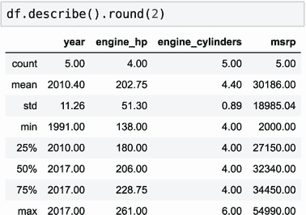

图 D.29 要获取所有数值特征的汇总统计信息，请使用 `describe` 方法。

### D.2.5 缺失值

我们之前没有关注它，但我们的数据中有一个缺失值：我们不知道第 2 行的 engine_hp 值（如图 D.30 所示）。


图 D.30 在我们的 DataFrame 中有一个缺失值。

我们可以使用 `isnull` 方法查看哪些值缺失：

```
df.isnull()
```

此方法返回一个新的 DataFrame，其中如果对应的值在原始 DataFrame 中缺失，则单元格为 True（如图 D.31 所示）。

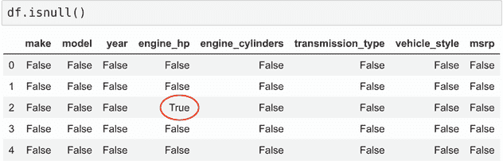

图 D.31 要查找缺失值，请使用 `isnull` 方法。

然而，当我们有大的 DataFrame 时，查看所有值是不切实际的。我们可以通过在结果上运行 `sum` 方法轻松地汇总它们：

```
df.isnull().sum()
```

它返回一个 Series，其中包含每列的缺失值数量。在我们的例子中，只有 engine_hp 有缺失值；其他没有（如图 D.32 所示）。

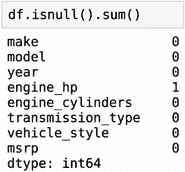

图 D.32 要查找具有缺失值的列，请使用 `isnull` 后跟 `sum`。

要用一些实际值替换缺失值，我们使用 `fillna` 方法。例如，我们可以用零填充缺失值：

```
df.engine_hp.fillna(0)
```

因此，我们得到一个新的 Series，其中 NaN 被替换为 0：

```
0    218.0
1    261.0
2      0.0
3    194.0
4    138.0
Name: engine_hp, dtype: float64
```

或者，我们可以通过获取平均值来替换它：

```
df.engine_hp.fillna(df.engine_hp.mean())
```

在这种情况下，NaN 被平均值替换：

```
0    218.00
1    261.00
2    202.75
3    194.00
4    138.00
Name: engine_hp, dtype: float64
```

`fillna` 方法返回一个新的 Series。因此，如果我们需要从我们的 DataFrame 中删除缺失值，我们需要将结果写回：

```
df.engine_hp = df.engine_hp.fillna(df.engine_hp.mean())
```

现在我们得到了一个没有缺失值的 DataFrame（图 D.33）。

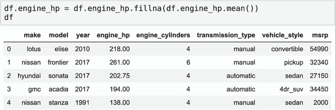

图 D.33 无缺失值的 DataFrame

### D.2.6 排序

我们之前讨论的操作主要用于 Series。我们也可以对 DataFrame 执行操作。

排序是这些操作之一：它重新排列 DataFrame 中的行，使得它们按某些列（或多个列）的值进行排序。

例如，让我们按 MSRP 对 DataFrame 进行排序。为此，我们使用 `sort_values` 方法：

```
df.sort_values(by='msrp')
```

结果是一个新的 DataFrame，其中行按最小的 MSRP（2000）到最大的（54990）排序（图 D.34）。

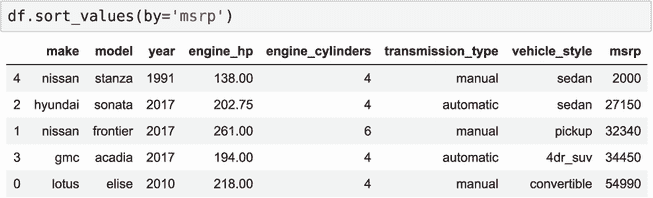

图 D.34 要对 DataFrame 的行进行排序，请使用 `sort_values`。

如果我们希望最大的值首先出现，我们将 `ascending` 参数设置为 `False`：

```
df.sort_values(by='msrp', ascending=False)
```

现在我们有第一行的 MSRP 为 54990，最后一行为 2000（图 D.35）。

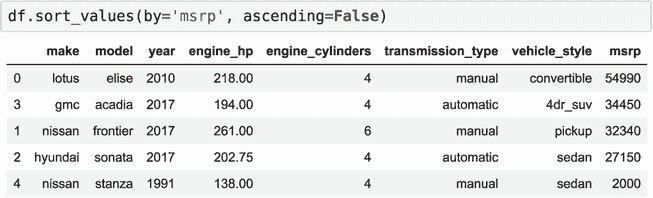

图 D.35 要按降序对 DataFrame 的行进行排序，请使用 `ascending=False`。

### D.2.7 分组

Pandas 提供了许多汇总操作：求和、平均值以及许多其他操作。我们之前已经看到如何将它们应用于整个 DataFrame 的汇总计算。有时，我们可能希望按组进行操作——例如，计算每种变速器的平均价格。

在 SQL 中，我们会写类似的东西：

```
SELECT
    tranmission_type,
    AVG(msrp)
FROM
    cars
GROUP BY
    transmission_type;
```

在 Pandas 中，我们使用 `groupby` 方法：

```
df.groupby('transmission_type').msrp.mean()
```

结果是每种变速器的平均价格：

```
transmission_type
automatic    30800.000000
manual       29776.666667
Name: msrp, dtype: float64
```

如果我们还想计算每种类型的记录数以及平均价格，在 SQL 中，我们会在 `SELECT` 子句中添加另一个语句：

```
SELECT
    tranmission_type,
    AVG(msrp),
    COUNT(msrp)
FROM
    cars
GROUP BY
    transmission_type
```

在 Pandas 中，我们使用 `groupby` 后跟 `agg`（代表“聚合”）：

```
df.groupby('transmission_type').msrp.agg(['mean', 'count'])
```

因此，我们得到一个新的 DataFrame（图 D.36）。

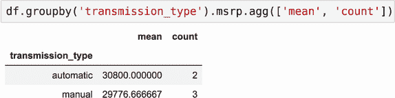

图 D.36 在分组时，我们可以使用 `agg` 方法应用多个聚合函数。

Pandas 是一个相当强大的数据处理工具，它通常用于在训练机器学习模型之前准备数据。有了本附录的信息，你应该更容易理解本书中的代码。
