# 附录 E. AWS SageMaker

AWS SageMaker 是 AWS 提供的一套与机器学习相关的服务。SageMaker 使得在 AWS 上创建一个安装了 Jupyter 的服务器变得非常简单。笔记本已经配置好了：它们包含了我们需要的绝大多数库，包括 NumPy、Pandas、Scikit-learn 和 TensorFlow，因此我们可以直接在项目中使用它们！

## E.1 AWS SageMaker 笔记本

SageMaker 的笔记本有两个特别有趣的原因，用于训练神经网络：

+   我们不需要担心设置 TensorFlow 和所有库。

+   可以租用带有 GPU 的计算机，这使我们能够更快地训练神经网络。

要使用 GPU，我们需要调整默认配额。在下一节中，我们将告诉你如何做到这一点。

### E.1.1 增加 GPU 配额限制

AWS 上的每个账户都有配额限制。例如，如果我们的 GPU 实例数量配额限制是 10，我们就不能请求第 11 个带有 GPU 的实例。

默认情况下，配额限制为零，这意味着如果不更改配额限制，就无法租用 GPU 机器。

要请求增加，在 AWS 控制台中打开支持中心：点击右上角的“支持”并选择支持中心（图 E.1）。

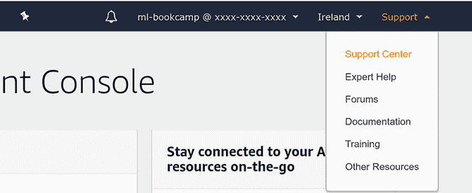

图 E.1 要打开支持中心，点击支持 > 支持中心。

接下来，点击创建案例按钮（图 E.2）。

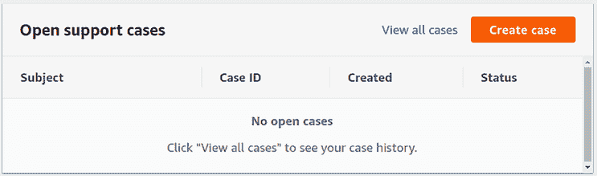

图 E.2 在支持中心，点击创建案例按钮。

现在选择服务限制增加选项。在案例详情部分，从限制类型下拉列表中选择 SageMaker（图 E.3）。

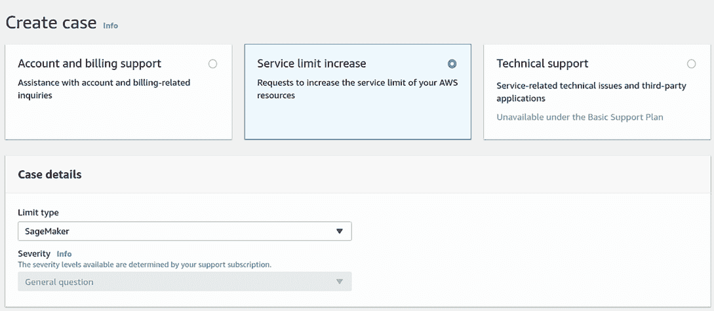

图 E.3 创建新案例时，选择服务限制增加 > SageMaker。

之后，填写配额增加表单（图 E.4）：

+   区域：选择离你最近或最便宜的。你可以在这里看到价格：[`aws.amazon.com/sagemaker/pricing/`](https://aws.amazon.com/sagemaker/pricing/)。资源类型：SageMaker 笔记本。

+   限制：一台具有一个 GPU 的 ml.p2.xlarge 实例。

+   新的限制值：1。

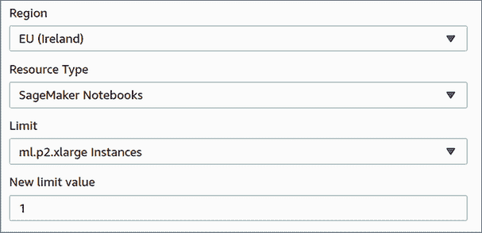

图 E.4 将 ml.p2.xlarge 的限制增加到一台实例。

最后，描述为什么需要增加配额限制。例如，你可以输入“我想使用 GPU 机器训练神经网络”（图 E.5）。

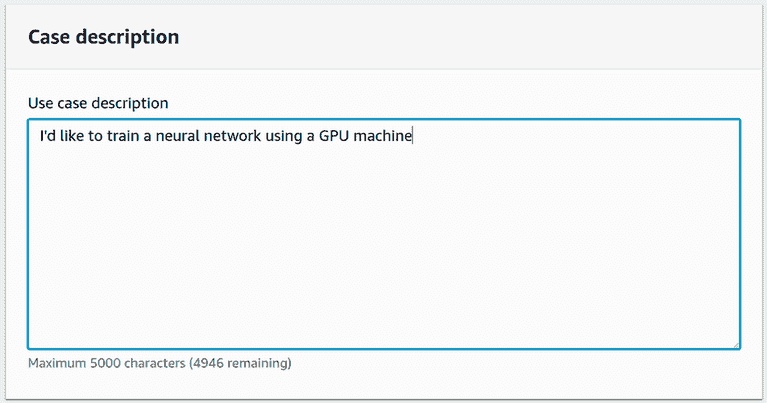

图 E.5 我们需要解释为什么想要增加限制。

我们已经准备好了；现在点击提交。

之后，我们看到了请求的一些详细信息。回到支持中心，我们在打开的案例列表中看到了新的案例（图 E.6）。

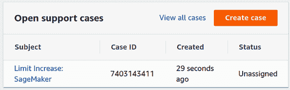

图 E.6 打开的支持案例列表

通常需要一到两天来处理请求并增加限制。

一旦限制增加，我们就可以创建一个带有 GPU 的 Jupyter Notebook 实例。

### E.1.2 创建笔记本实例

要在 SageMaker 中创建 Jupyter Notebook，首先在服务列表中找到 SageMaker（图 E.7）。

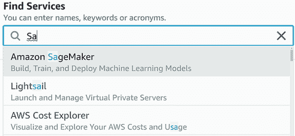

图 E.7 在搜索框中输入 SageMaker 以找到 SageMaker。

注意 SageMaker 笔记本不包含在免费层中，因此租用 Jupyter Notebook 需要付费。

对于具有一个 GPU（ml.p2.xlarge）的实例，在撰写本文时的每小时费用为

+   法兰克福：$1.856

+   爱尔兰：$1.361

+   北弗吉尼亚：$1.26

第七章的项目需要一到两个小时才能完成。

注意 确保您位于您请求增加配额限制的区域。

在 SageMaker 中，选择“笔记本实例”，然后点击“创建笔记本实例”按钮（图 E.8）。

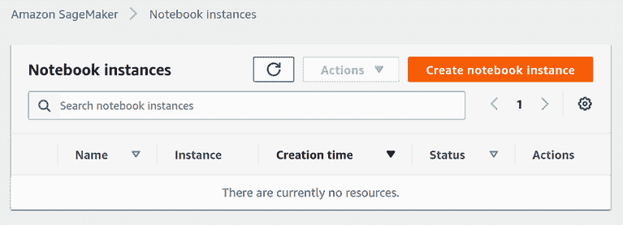

图 E.8 要创建 Jupyter Notebook，请点击“创建笔记本实例”。

接下来，我们需要配置实例。首先，输入实例名称以及实例类型。因为我们感兴趣的是 GPU 实例，所以在加速计算部分选择 ml.p2.xlarge（图 E.9）。

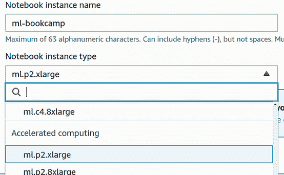

图 E.9 加速计算部分包含具有 GPU 的实例。

在“附加配置”中，在卷大小字段中写入 5 GB。这样，我们应该有足够的空间来存储数据集以及保存我们的模型。

如果您之前已使用 SageMaker 并已为其创建 IAM 角色，请在 IAM 角色部分选择它。

但如果您是第一次这样做，请选择“创建新角色”（图 E.10）。

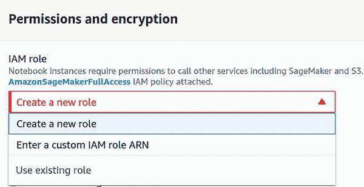

图 E.10 要使用 SageMaker 笔记本，我们需要为其创建 IAM 角色。

在创建角色时，保留默认值，并点击“创建角色”按钮（图 E.11）。

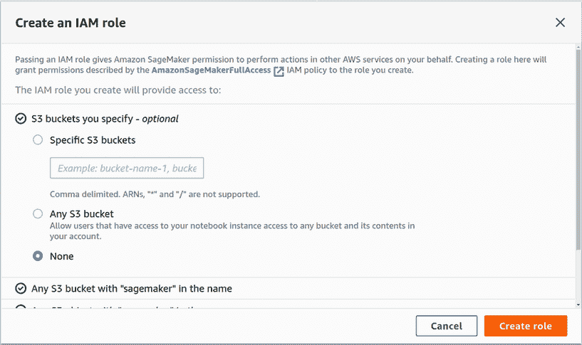

图 E.11 新 IAM 角色的默认值足够。

保持其余选项不变：

+   根权限：启用

+   加密密钥：无自定义加密

+   网络：无 VPC

+   Git 仓库：无

最后，点击“创建笔记本实例”以启动它。

如果由于某些原因您看到 ResourceLimitExceeded 错误消息（图 E.12），请确保

+   您已请求增加 ml.p2.xlarge 实例类型的配额限制。

+   请求已处理。

+   您正在尝试在您请求增加配额限制的区域中创建笔记本。

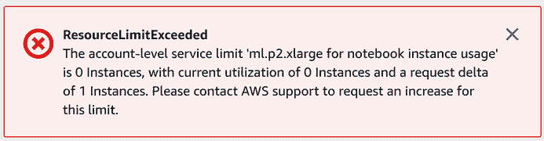

图 E.12 如果您看到 ResourceLimitExceeded 错误消息，您需要增加配额限制。

创建实例后，笔记本将出现在笔记本实例列表中（图 E.13）。

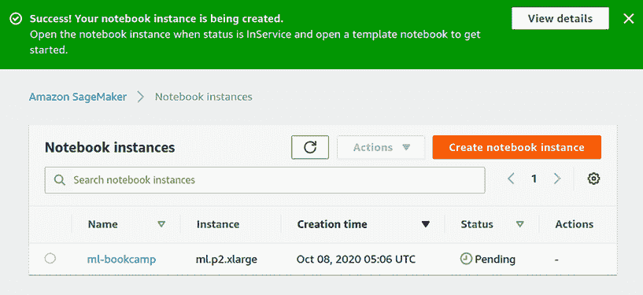

图 E.13 成功！笔记本实例已创建。

现在我们需要等待笔记本状态从 Pending 变更为 InService；这可能需要一到两分钟。

一旦处于 InService 状态，即可使用（图 E.14）。点击“打开 Jupyter”以访问它。

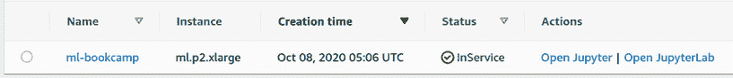

图 E.14 新的笔记本实例已投入使用，并准备好使用。

接下来，我们将展示如何使用 TensorFlow。

### E.1.3 训练模型

点击“打开 Jupyter”后，我们看到了熟悉的 Jupyter Notebook 界面。

要创建一个新的笔记本，点击“新建”，并选择 conda_tensorflow2_p36（图 E.15）。

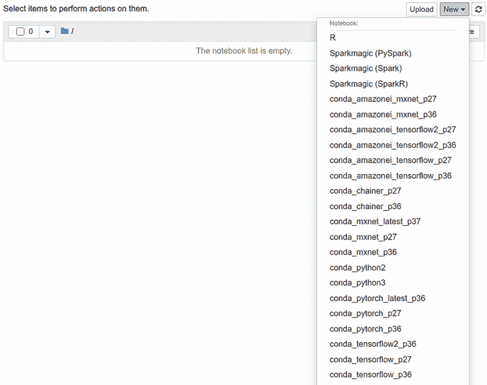

图 E.15 要创建一个新的 TensorFlow 笔记本，请选择 conda_tensorflow2_p36。

这个笔记本有 Python 版本 3.6 和 TensorFlow 版本 2.1.0。在撰写本文时，这是 SageMaker 中可用的最新 TensorFlow 版本。

现在，导入 TensorFlow 并检查其版本：

```
import tensorflow as tf
tf.__version__
```

版本应该是 2.1.0 或更高（如图 E.16 所示）。

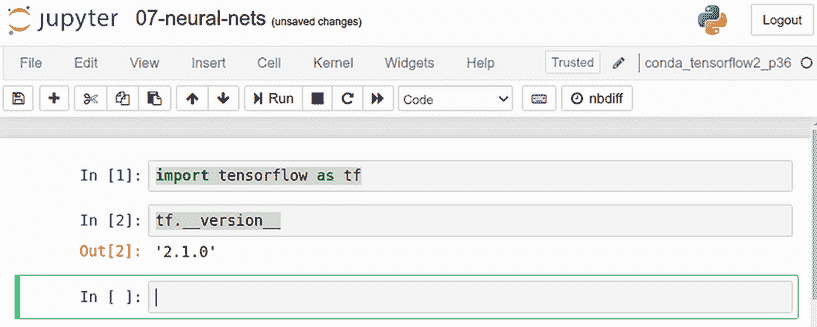

图 E.16 对于我们的示例，我们需要至少 TensorFlow 版本 2.1.0。

现在，转到第七章并训练一个神经网络！训练完成后，我们需要关闭笔记本。

### E.1.4 关闭笔记本

要停止一个笔记本，首先选择你想要停止的实例，然后在操作下拉列表中选择 Stop（如图 E.17 所示）。

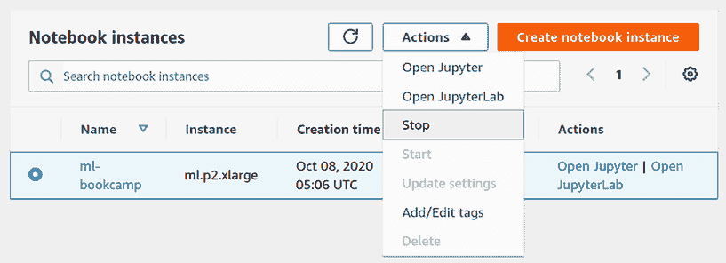

图 E.17 要关闭一个笔记本，请选择停止操作。

在完成此操作后，笔记本的状态将从 InService 变为 Stopping。它可能需要几分钟才能完全停止，并从 Stopping 状态变为 Stopped 状态。

注意：当我们停止一个笔记本时，所有的代码和数据都会被保存。下次启动时，我们可以从上次停止的地方继续。

重要提示：笔记本实例成本较高，所以请确保你不会意外地让它继续运行。SageMaker 不包含免费层，所以如果你忘记停止它，你将在月底收到一笔巨额账单。在 AWS 中设置预算可以避免巨额账单。请参阅 AWS 管理成本文档：[`docs.aws.amazon.com/awsaccountbilling/latest/aboutv2/budgets-managing-costs.html`](https://docs.aws.amazon.com/awsaccountbilling/latest/aboutv2/budgets-managing-costs.html)。请小心，当你不再需要笔记本时，请关闭它。

一旦你完成了一个项目的所有工作，你可以删除笔记本。选择一个笔记本，然后从下拉列表中选择删除（如图 E.18 所示）。笔记本必须处于 Stopped 状态才能删除。

它将首先从 Stopped 状态变为 Deleting，30 秒后将从笔记本列表中消失。

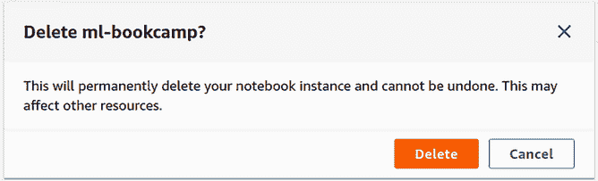

图 E.18 在完成第七章后，你可以删除笔记本。
