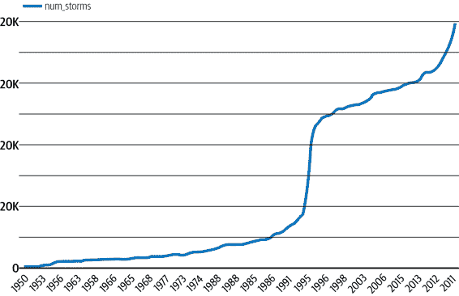

# 第一章：机器学习设计模式的需求

在工程学科中，设计模式捕捉到常见问题的最佳实践和解决方案。它们将专家的知识和经验编码为所有从业者都可以遵循的建议。本书是我们在与数百个机器学习团队合作中观察到的机器学习设计模式的目录。

# 什么是设计模式？

模式的概念和已证实的模式目录是由克里斯托弗·亚历山大和五位共同作者在一本极具影响力的书籍*一种模式语言*（牛津大学出版社，1977）中引入建筑领域的。在他们的书中，他们列出了 253 种模式，并以这种方式介绍它们：

> 每个模式描述了在我们的环境中反复出现的问题，然后以这样的方式描述了解决这个问题的核心，这样你可以一百万次地使用这个解决方案，而不必两次做同样的事情。
> 
> …
> 
> 每个解决方案都以一种方式陈述，即给出解决问题所需的关系领域的核心，但以非常一般和抽象的方式—这样你就可以根据自己的偏好和所处地点的局部条件自己解决问题。

例如，在建造家庭时，包含人类细节的几种模式是*每个房间两面有光*和*六英尺阳台*。想象一下你家中最喜欢的房间和最不喜欢的房间。你最喜欢的房间是否有两面墙的窗户？而你最不喜欢的房间呢？根据亚历山大：

> 两侧自然采光的房间在人和物体周围产生较少的眩光；这使我们能更加细致地看到事物；最重要的是，它使我们能够详细阅读人们脸上瞬间的微表情……。

有一个这种模式的名字可以让建筑师们免于不断重新发现这个原则。然而，在任何特定的地方条件下，你如何获取两个光源取决于建筑师的技能。同样地，在设计阳台时，它应该有多大？亚历山大建议尺寸为 6 英尺×6 英尺足够放置两把（不匹配的！）椅子和一个边桌，如果你想要既有遮阳的休息空间又有阳光的休息空间，建议尺寸为 12 英尺×12 英尺。

Erich Gamma、Richard Helm、Ralph Johnson 和 John Vlissides 在 1994 年的书籍*设计模式：可重用面向对象软件的元素*（Addison-Wesley，1995）中列出了 23 种面向对象设计模式，将这一想法引入了软件领域。他们的目录包括代理、单例和装饰者等模式，并对面向对象编程领域产生了深远影响。2005 年，计算机协会（ACM）将年度编程语言成就奖颁发给了这些作者，以表彰他们的工作“对编程实践和编程语言设计的影响”。

构建生产机器学习模型越来越成为一门工程学科，利用在研究环境中已被证明有效的机器学习方法，并将其应用于业务问题。随着机器学习变得更加普及，重要的是从业者利用经过验证的方法来解决反复出现的问题。

我们在 Google Cloud 面向客户的部分工作的一个好处是，它让我们接触到来自世界各地的各种机器学习和数据科学团队以及个人开发人员。同时，我们与内部 Google 团队密切合作，解决前沿的机器学习问题。最后，我们有幸与推动机器学习研究和基础设施民主化的 TensorFlow、Keras、BigQuery ML、TPU 和 Cloud AI 平台团队合作。所有这些使我们能够从独特的视角来整理我们观察到的这些团队正在实施的最佳实践。

本书是机器学习工程中常见问题的设计模式或可重复解决方案的目录。例如，转换模式（第六章）强制分离输入、特征和转换，并使转换持久化，以简化将机器学习模型移至生产环境。类似地，有钥匙预测，在第五章，这是一种模式，可以实现批量预测的大规模分发，例如推荐模型。

对于每种模式，我们描述正在解决的常见问题，然后逐步介绍问题的各种潜在解决方案，这些解决方案的权衡以及选择这些解决方案的建议。这些解决方案的实现代码提供在 SQL 中（如果您在 Spark SQL、BigQuery 等中进行预处理和其他 ETL 操作时有用）、scikit-learn 和/或带有 TensorFlow 后端的 Keras 中。

# 如何使用本书

这是一个实践中观察到的模式目录，涉及多个团队。在某些情况下，这些模式的概念已经为人所知多年。我们并不声称发明或发现这些模式。相反，我们希望为机器学习从业者提供一个共同的参考框架和工具集。如果这本书能够为您和您的团队在讨论您已经在机器学习项目中直觉地整合的概念时提供词汇，那么我们就算达到了目标。

我们不期望您按顺序阅读本书（尽管您可以！）。相反，我们预计您会快速浏览本书，深入阅读某些部分，与同事讨论想法，并在面对您记得读过的问题时参考本书。如果您计划跳跃阅读，我们建议您从第一章和第八章开始，然后再深入到各个模式中。

每个模式都有简短的问题陈述、一个经典解决方案、解决方案有效性的解释，以及对权衡和替代方案的多部分讨论。建议您在心中牢记经典解决方案的前提下阅读讨论部分，以便进行比较和对比。模式描述将包括从经典解决方案的实现中提取的代码片段。完整的代码可以在[我们的 GitHub 代码库](https://github.com/GoogleCloudPlatform/ml-design-patterns)中找到。强烈建议您在阅读模式描述时浏览代码。

# 机器学习术语

因为今天的机器学习实践者可能拥有不同的主要专业领域 —— 软件工程、数据分析、DevOps 或统计学 —— 所以不同实践者对某些术语的使用方式可能会有微妙的差异。在本节中，我们定义了本书中使用的术语。

## 模型和框架

在其核心，*机器学习* 是一个从数据中学习的模型构建过程。这与传统编程不同，传统编程中我们编写明确的规则来告诉程序如何行为。机器学习的*模型* 是从数据中学习模式的算法。为了说明这一点，想象我们是一个搬家公司，需要为潜在客户估算搬家成本。在传统编程中，我们可能会用 if 语句来解决这个问题：

```
if num_bedrooms == 2 and num_bathrooms == 2:
  estimate = 1500
elif num_bedrooms == 3 and sq_ft > 2000:
  estimate = 2500
```

您可以想象，随着我们添加更多变量（大型家具件数、衣物量、易碎物品等等）并尝试处理边缘情况，这将很快变得复杂起来。更重要的是，要求客户提前提供所有这些信息可能会导致他们放弃估算过程。相反，我们可以训练一个机器学习模型，根据我们公司已经搬迁过的以往家庭的数据来估算搬家成本。

本书中，我们主要在示例中使用前馈神经网络模型，但我们也会提到线性回归模型、决策树、聚类模型等其他模型。*前馈神经网络*，通常我们简称为*神经网络*，是一种机器学习算法，多层次、每层具有多个神经元，分析和处理信息，然后将该信息传递到下一层，最终产生预测作为输出。尽管它们并非完全相同，神经网络常被比作大脑中的神经元，因为节点之间的连接方式和它们处理数据后生成新预测的能力。具有超过一个*隐藏层*（除了输入和输出层以外的层）的神经网络被归类为*深度学习*（见图 1-1）。

机器学习模型，无论它们在视觉上如何表现，都是数学函数，因此可以使用数值软件包从头开始实现。然而，在工业界，机器学习工程师倾向于使用几种设计用于构建模型的开源框架之一。我们的大多数示例将使用*TensorFlow*，这是由 Google 创建的专注于深度学习模型的开源机器学习框架。在 TensorFlow 库中，我们将在示例中使用*Keras* API，可以通过`tensorflow.keras`导入。Keras 是一个构建神经网络的高级 API。虽然 Keras 支持多种后端，我们将使用其 TensorFlow 后端。在其他示例中，我们将使用*scikit-learn, XGBoost*和*PyTorch*，这些都是其他流行的开源框架，提供了用于准备数据的实用工具，以及构建线性和深度模型的 API。机器学习变得越来越易于接触，一个令人兴奋的发展是可以在 SQL 中表达机器学习模型的可用性。我们将使用*BigQuery ML*作为这种情况的示例，特别是在我们希望结合数据预处理和模型创建的情况下。


###### 图 1-1\. 不同类型的机器学习分解，以及每种类型的几个示例。请注意，尽管此图中未包含，像自编码器这样的神经网络也可用于无监督学习。

相反，只有输入和输出层的神经网络是机器学习的另一种子集，被称为*线性模型*。线性模型使用线性函数表示它们从数据中学到的模式。*决策树*是一种机器学习模型，它使用你的数据创建带有各种分支的路径子集。这些分支近似于你的数据中不同结果的结果。最后，*聚类*模型寻找数据不同子集之间的相似性，并使用这些识别的模式将数据分组成簇。

机器学习问题（见图 1-1）可以分为两种类型：监督学习和无监督学习。*监督学习*定义了你提前知道数据的地面真实标签的问题。例如，这可以包括将图像标记为“猫”或将婴儿标记为出生时体重为 2.3 公斤。你将这些标记数据提供给你的模型，希望它能够学习足够多的内容来标记新的例子。*无监督学习*则不知道数据的标签，目标是构建一个能够找到数据的自然分组（称为*聚类*）、压缩信息内容（*降维*）或找到关联规则的模型。本书的大部分内容将集中在监督学习上，因为在生产中使用的大多数机器学习模型都是监督学习模型。

在监督学习中，问题通常可以定义为分类或回归。*分类*模型为你的输入数据分配来自离散预定义类别集的标签（或标签）。分类问题的例子包括确定图像中宠物品种的类型、标记文档或预测交易是否欺诈。*回归*模型为你的输入分配连续的数值。回归模型的例子包括预测自行车行程的持续时间、公司未来的收入或产品的价格。

## 数据与特征工程

数据是任何机器学习问题的核心。当我们谈论 *数据集* 时，我们指的是用于训练、验证和测试机器学习模型的数据。大部分数据将是 *训练数据*：在训练过程中输入模型的数据。*验证数据* 是从训练集中留出来用于评估模型在每个训练 *轮次*（或通过训练数据的次数）后表现的数据。模型在验证数据上的表现用于决定何时停止训练过程，并选择 *超参数*，例如随机森林模型中的树的数量。*测试数据* 是完全不参与训练过程的数据，用于评估训练好的模型的表现。机器学习模型的性能报告必须基于独立的测试数据集计算，而不是基于训练或验证数据。同样重要的是，数据必须以这样一种方式分割，使得所有三个数据集（训练、测试、验证）具有类似的统计特性。

训练模型所使用的数据可以采用多种形式，这取决于模型类型。我们将 *结构化数据* 定义为数值和分类数据。数值数据包括整数和浮点数值，而分类数据则包括可以划分为有限组的数据，例如汽车类型或教育水平。你也可以将结构化数据看作是常见的电子表格中的数据。在本书中，我们将 *表格数据* 与结构化数据互换使用。另一方面，*非结构化数据* 则包括不能整齐表示的数据。这通常包括自由文本、图像、视频和音频。

数值数据通常可以直接输入到机器学习模型中，而其他数据则需要进行各种 *数据预处理* 才能准备好送入模型。这个预处理步骤通常包括对数值进行缩放，或将非数值数据转换为模型可理解的数值格式。预处理的另一个术语是 *特征工程*。在本书中，我们将这两个术语交替使用。

在特征工程过程中，有各种术语用来描述数据。*输入* 指的是在处理前数据集中的单个列，而 *特征* 则指处理后的单个列。例如，时间戳可以是你的输入，而特征则是一周中的某一天。要将数据从时间戳转换为一周中的某一天，你需要进行一些数据预处理。这个预处理步骤也可以称为 *数据转换*。

*实例*是您想要发送到模型进行预测的项目。 实例可以是测试数据集中的一行（不包括标签列），要分类的图像，或者要发送给情感分析模型的文本文档。 给定实例的特征集，模型将计算预测值。 为了做到这一点，模型是在*训练示例*上进行训练的，这些示例将实例与*标签*关联起来。 *训练示例*指的是从数据集中提取的单个实例（行），将其馈送到模型中。 基于时间戳用例，完整的训练示例可能包括：“星期几”，“城市”和“汽车类型”。 *标签*是数据集中的输出列-模型正在预测的项目。 *标签*可以同时指数据集中的目标列（也称为*地面实况标签*）和模型提供的输出（也称为*预测*）。 例如，上述训练示例的一个样本标签可能是“行程持续时间”-在这种情况下，是表示分钟的浮点值。

一旦您组装好数据集并确定了模型的特征，*数据验证*就是计算数据统计信息，理解架构并评估数据集以识别漂移和训练-服务偏差等问题的过程。 对数据进行各种统计信息的评估可以帮助您确保数据集包含每个特征的平衡表示。 在无法收集更多数据的情况下，理解数据平衡将帮助您设计模型以解决这个问题。 理解您的架构涉及为每个特征定义数据类型，并识别其中某些值可能不正确或缺失的训练示例。 最后，数据验证可以识别可能影响训练和测试集质量的不一致之处。 例如，也许您的大部分训练数据集包含*工作日*示例，而您的测试集主要包含*周末*示例。

## 机器学习流程

典型的机器学习工作流程中的第一步是*训练*——将训练数据传递给模型，使其能够学习识别模式。 训练后，流程的下一步是测试模型在训练集之外的数据上的表现。 这称为模型*评估*。 您可能会多次运行训练和评估，进行额外的特征工程并调整模型架构。 一旦您对模型在评估过程中的性能感到满意，您可能会希望提供您的模型，以便其他人可以访问它来进行预测。 我们使用术语*服务*来接受传入请求，并通过将模型部署为微服务来发送预测。 服务基础设施可以在云端、本地或设备上。

向模型发送新数据并利用其输出的过程称为*预测*。这既可以指尚未部署的本地模型生成预测，也可以指获取已部署模型的预测结果。对于已部署的模型，我们将同时提到在线预测和批处理预测。*在线预测*用于在几个示例上近实时获取预测结果。在线预测强调低延迟。另一方面，*批处理预测*是指在大量数据上离线生成预测。批处理预测作业比在线预测时间长，适用于预先计算预测结果（例如在推荐系统中），以及分析模型在大量新数据样本上的预测表现。

在预测未来值时，如预测自行车骑行时间或预测购物车是否会被放弃，使用词语*预测*非常恰当。但在图像和文本分类模型的情况下，这种用法就不那么直观了。如果一个机器学习模型分析文本评论并输出情感是积极的，这并不算是一个真正的“预测”（因为没有未来结果）。因此，你也会看到词语*推断*用于指代预测。这里推断这一统计术语被重新定义，但实际上并不涉及推理过程。

通常情况下，收集训练数据、特征工程、训练和评估模型的过程是与生产管道分开处理的。在这种情况下，当您认为有足够的额外数据可以训练新版本的模型时，将重新评估您的解决方案。在其他情况下，可能会持续不断地摄入新数据，并需要在将其送入模型进行训练或预测之前立即处理这些数据。这被称为*流式处理*。为了处理流式数据，您将需要一个多步骤解决方案来执行特征工程、训练、评估和预测。这样的多步骤解决方案被称为*ML 流水线*。

## 数据与模型工具

我们将引用多种谷歌云产品，提供解决数据和机器学习问题的工具。这些产品只是在本书中实现设计模式的一种选择，而非详尽的列表。所有这些产品都是无服务器的，使我们能够更专注于实现机器学习设计模式，而不是它们背后的基础设施。

[*BigQuery*](https://oreil.ly/7PnVj) 是一种专为通过 SQL 快速分析大型数据集而设计的企业数据仓库。我们将在示例中使用 BigQuery 进行数据收集和特征工程。BigQuery 中的数据通过数据集（Datasets）进行组织，一个数据集可以包含多个表（Tables）。我们的许多示例将使用来自[*Google Cloud Public Datasets*](https://oreil.ly/AbTaJ)的数据，这是一组在 BigQuery 中免费提供的公共数据。Google Cloud Public Datasets 包括数百个不同的数据集，包括从 1929 年起的 NOAA 天气数据，Stack Overflow 的问题与回答，GitHub 的开源代码，出生率数据等等。为了构建一些示例中的模型，我们将使用[*BigQuery Machine Learning*](https://oreil.ly/_VjVz)（或简称 BigQuery ML）。BigQuery ML 是一个用于从 BigQuery 存储的数据构建模型的工具。使用 BigQuery ML，我们可以使用 SQL 训练、评估和生成模型的预测。它支持分类和回归模型以及无监督的聚类模型。还可以将之前训练好的 TensorFlow 模型导入 BigQuery ML 进行预测。

[*Cloud AI Platform*](https://oreil.ly/90KLs) 包括多种产品，用于在 Google Cloud 上训练和提供自定义机器学习模型。在我们的示例中，我们将使用 AI Platform Training 和 AI Platform Prediction。AI Platform Training 提供 Google Cloud 上的机器学习模型训练基础设施。通过 AI Platform Prediction，您可以部署已训练的模型并使用 API 生成预测。这两项服务支持 TensorFlow、scikit-Learn 和 XGBoost 模型，以及使用其他框架构建的自定义容器模型。我们还将提到[*Explainable AI*](https://oreil.ly/lDocn)，这是一个用于解释模型预测结果的工具，适用于部署到 AI Platform 的模型。

## 角色

在一个组织中，涉及数据和机器学习的许多不同职务角色。以下是书中经常提到的一些常见角色定义。本书主要针对数据科学家、数据工程师和 ML 工程师，我们先从这些角色开始。

*数据科学家* 是专注于收集、解释和处理数据集的人员。他们对数据进行统计和探索性分析。在涉及机器学习时，数据科学家可能参与数据收集、特征工程、模型构建等工作。数据科学家通常在 Python 或 R 的笔记本环境中工作，并且通常是组织内第一个构建机器学习模型的人员。

*数据工程师* 专注于支持组织数据的基础架构和工作流程。他们可能帮助管理公司如何摄取数据、数据管道以及数据的存储和传输方式。数据工程师实施围绕数据的基础设施和管道。

*机器学习工程师*执行与数据工程师类似的任务，但针对的是机器学习模型。他们接手数据科学家开发的模型，并管理围绕训练和部署这些模型的基础设施和运营。机器学习工程师帮助构建生产系统，处理模型更新、模型版本管理，并向最终用户提供预测服务。

在一家公司，数据科学团队越小且团队越敏捷，同一个人承担多个角色的可能性就越大。如果你处于这种情况下，很可能你读到上述三种描述时，在所有三类中都能找到自己的一部分影子。你可能通常会以数据工程师的身份开始一个机器学习项目，构建数据管道以实现数据的摄取。然后，你会转向数据科学家的角色，建立机器学习模型。最后，你会换上机器学习工程师的帽子，将模型移植到生产环境中。在规模较大的组织中，机器学习项目可能会经历相同的阶段，但每个阶段可能会涉及不同的团队。

研究科学家、数据分析师和开发人员也可能构建和使用 AI 模型，但这些工作角色并不是本书的焦点读者群。

*研究科学家*主要专注于找到和开发新的算法来推动机器学习学科的发展。这可能涉及机器学习的多个子领域，如模型架构、自然语言处理、计算机视觉、超参数调整、模型可解释性等等。与本文中讨论的其他角色不同，研究科学家大部分时间用于原型设计和评估新的机器学习方法，而不是构建生产环境中的机器学习系统。

*数据分析师*评估和从数据中获取洞见，然后为组织内的其他团队总结这些洞见。他们倾向于在 SQL 和电子表格中工作，并使用商业智能工具创建数据可视化来分享他们的发现。数据分析师与产品团队密切合作，了解他们的洞见如何帮助解决业务问题并创造价值。虽然数据分析师专注于识别现有数据中的趋势并从中获得洞见，数据科学家则关注如何利用这些数据生成未来的预测，并自动化或扩展洞见的生成。随着机器学习的民主化趋势，数据分析师可以通过提升自己的技能成为数据科学家。

*开发人员*负责构建能让最终用户访问机器学习模型的生产系统。他们通常参与设计 API，用于查询模型并以用户友好的方式通过 Web 或移动应用返回预测结果。这可能涉及在云中托管模型或在设备上提供模型。开发人员利用由机器学习工程师实施的模型服务基础设施来构建应用程序和用户界面，以向模型用户呈现预测结果。

图 1-2 展示了这些不同角色如何在一个组织的机器学习模型开发过程中共同合作。


###### 图 1-2。与数据和机器学习相关的许多不同工作角色，这些角色在机器学习工作流中进行协作，从数据摄取到模型服务和最终用户界面。例如，数据工程师负责数据摄取和数据验证，并与数据科学家密切合作。

# 机器学习中的常见挑战

为什么我们需要一本关于机器学习设计模式的书？构建机器学习系统的过程中存在多种独特的挑战，这些挑战影响着机器学习的设计。理解这些挑战将有助于您作为机器学习从业者，在整本书中介绍的解决方案中建立一个参考框架。

## 数据质量

机器学习模型的可靠性取决于用于训练它们的数据。如果您在不完整的数据集、选择不当的特征或不能准确代表使用该模型的人群的数据上训练机器学习模型，那么您的模型的预测将直接反映出这些数据的情况。因此，机器学习模型通常被称为“垃圾进垃圾出”。在这里，我们将重点介绍数据质量的四个重要组成部分：准确性、完整性、一致性和及时性。

数据*准确性*既涉及您的训练数据的特征，也涉及与这些特征对应的地面真相标签。了解数据的来源以及数据收集过程中可能存在的任何错误可以帮助确保特征的准确性。在数据收集完成后，进行彻底分析以筛查拼写错误、重复条目、表格数据中的测量不一致性、缺失特征以及可能影响数据质量的任何其他错误非常重要。例如，训练数据集中的重复条目可能导致模型错误地为这些数据点分配更多的权重。

准确的数据标签与特征准确性同样重要。您的模型仅依赖于训练数据中的地面真相标签来更新其权重并最小化损失。因此，错误标记的训练样本可能导致误导性的模型准确性。例如，假设您正在构建一个情感分析模型，其中 25%的“正面”训练示例被错误标记为“负面”。您的模型将对什么应该被视为负面情感有一个不准确的理解，并且这将直接反映在其预测中。

要理解数据*完整性*，假设你正在训练一个模型来识别猫的品种。你在一个广泛的猫图像数据集上训练模型，结果模型能够将图像分类为 10 个可能的类别之一（“孟加拉猫”，“暹罗猫”等），准确率达到 99%。然而，当你将模型部署到生产环境时，你发现除了上传猫照片进行分类外，许多用户还上传了狗的照片，并对模型的结果感到失望。因为模型只被训练来识别 10 种不同的猫品种，这就是它知道如何做的全部。这 10 种品种类别，本质上就是模型的整个“世界观”。无论你发送什么样的图像给模型，它都会将其分类为这 10 个类别之一。即使是看起来一点也不像猫的图像，它也可能以很高的置信度进行分类。此外，如果在训练数据集中没有包括这些数据和标签，“不是猫”的返回结果也无法由模型实现。

数据完整性的另一个方面是确保你的训练数据包含每个标签的多样化代表。以猫品种检测为例，如果你所有的图像都是猫脸的特写，那么你的模型将无法正确识别侧面或全身的猫图像。再看一个表格数据的例子，如果你正在建立一个模型来预测特定城市房地产的价格，但只包括大于 2000 平方英尺的房屋的训练样本，那么你得到的模型将在较小的房屋上表现不佳。

数据质量的第三个方面是数据*一致性*。对于大型数据集，将数据收集和标记工作分配给一组人是很常见的。制定这一过程的一套标准可以帮助确保数据集的一致性，因为参与其中的每个人都会不可避免地带入他们自己的偏见。像数据完整性一样，数据不一致性可以在数据特征和标签中找到。例如，在不一致的特征方面，假设你正在从温度传感器收集大气数据。如果每个传感器都校准到不同的标准，那么将导致不准确和不可靠的模型预测。不一致性还可以指数据格式。如果你正在捕捉位置数据，有些人可能会将完整街道地址写成“Main Street”，而其他人可能会缩写为“Main St.”，而测量单位，如英里和公里，在世界各地也可能不同。

关于标签一致性问题，让我们回到文本情感分类的例子。在这种情况下，当标记训练数据时，人们可能不会总是同意什么是正面和负面。为了解决这个问题，你可以让多人为数据集中的每个示例进行标记，然后采用每个项上应用最常见的标签。意识到可能存在的标签者偏见，并实施系统来解决这个问题，将确保数据集中的标签一致性。我们将在第七章中探讨“设计模式 30：公平性视角”中的偏见概念。

*数据的及时性* 指的是事件发生与其被添加到数据库之间的延迟。例如，如果你收集应用程序日志数据，错误日志可能需要几个小时才会出现在日志数据库中。对于记录信用卡交易的数据集，从交易发生到报告到系统中可能需要一天时间。为了处理数据的及时性，记录关于特定数据点的尽可能多的信息是有用的，并确保这些信息在将数据转换为机器学习模型特征时得到反映。更具体地说，你可以跟踪事件发生的时间戳以及将其添加到数据集中的时间。然后，在进行特征工程时，可以相应地考虑这些差异。

## 可复现性

在传统编程中，程序的输出是可复现且有保证的。例如，如果你编写一个反转字符串的 Python 程序，你知道输入单词“banana”将始终返回“ananab”的输出。同样地，如果你的程序有一个 bug 导致它错误地反转包含数字的字符串，你可以将程序发送给同事，并期望他们能够使用相同的输入复现错误（除非 bug 与程序保持一些错误的内部状态、架构差异如浮点精度或执行差异如线程有关）。

另一方面，机器学习模型具有一定的随机性元素。在训练时，ML 模型权重使用随机值进行初始化。随着模型迭代并从数据中学习，这些权重逐渐收敛。因此，给定相同的训练数据，相同的模型代码将在训练运行中产生略有不同的结果。这引入了可复现性的挑战。如果你训练一个模型达到了 98.1%的准确率，重复的训练运行不保证会达到相同的结果。这可能使得跨实验进行比较变得困难。

为了解决这种重复性问题，通常会将模型使用的随机种子值设置为固定值，以确保每次运行训练时应用相同的随机性。在 TensorFlow 中，您可以通过在程序开头运行 `tf.random.set_seed(value)` 来实现这一点。

另外，在 scikit-learn 中，许多用于洗牌数据的实用函数还允许您设置随机种子值：

```
from sklearn.utils import shuffle
data = shuffle(data, random_state=value)
```

请记住，在训练模型时需要使用相同的数据 *和* 相同的随机种子，以确保在不同实验中获得可重复的结果。

训练 ML 模型涉及多个需要固定的工件，以确保可重复性：使用的数据、用于生成训练和验证数据集的分割机制、数据准备和模型超参数，以及诸如批量大小和学习率调度等变量。

可重复性还适用于机器学习框架依赖项。除了手动设置随机种子外，框架还在调用训练模型函数时内部实现了随机性元素。如果这些底层实现在不同框架版本之间发生更改，重复性就无法保证。具体而言，如果一个框架版本的 `train()` 方法调用 `rand()` 13 次，而同一框架的新版本调用 14 次，则在不同实验之间使用不同版本会导致稍有不同的结果，即使使用相同的数据和模型代码。在容器中运行 ML 工作负载并标准化库版本可以帮助确保重复性。第六章介绍了一系列用于实现 ML 过程可重复性的模式。

最后，可重复性还可能指模型的训练环境。通常由于大型数据集和复杂性，许多模型需要大量时间来训练。通过采用数据或模型并行等分布策略可以加速此过程（参见第五章）。然而，当重新运行利用分布式训练的代码时，重复性也带来了额外的挑战。

## 数据漂移

虽然机器学习模型通常代表输入和输出之间的静态关系，但数据随时间可能会发生显著变化。数据漂移指的是确保机器学习模型保持相关性，并且模型预测能够准确反映其使用环境的挑战。

例如，假设您正在训练一个模型来将新闻文章标题分类为“政治”、“商业”和“技术”等类别。如果您在 20 世纪的历史新闻文章上训练和评估您的模型，它可能不会在当前数据上表现出色。今天，我们知道标题中含有“智能手机”一词的文章可能是关于技术的。然而，一个在历史数据上训练的模型将不会知道这个词。为了解决漂移问题，持续更新您的训练数据集，重新训练您的模型，并修改模型分配给特定输入数据组的权重是非常重要的。

要看一个不太明显的漂移示例，请查看 NOAA 在 BigQuery 中的严重风暴数据集。如果我们正在训练一个模型来预测特定区域的风暴可能性，我们需要考虑天气报告随时间变化的方式。我们可以从《图 1-3：年度记录的严重风暴数量》中看到，自 1950 年以来记录的严重风暴总数一直在稳步增加。



###### 图 1-3. 1950 年至 2011 年由 NOAA 记录的每年记录的严重风暴数量。

从这一趋势中，我们可以看出，使用 2000 年以前的数据来训练模型，以预测今天的风暴，将导致不准确的预测。除了报告风暴总数增加外，还应考虑可能影响数据的其他因素，例如时间。例如，随着天气雷达在 1990 年代的引入，观测风暴的技术得到了显著改进。在特征的背景下，这可能意味着较新的数据包含了更多关于每场风暴的信息，并且今天的数据中可能存在的特征在 1950 年可能没有被观察到。探索性数据分析有助于识别这种漂移，并能够确定用于训练的正确数据时间窗口。《设计模式 23：桥接架构》提供了处理随着时间推移特征可用性改善的数据集的方法。

## 规模

缩放问题贯穿了典型的机器学习工作流的许多阶段。在数据收集和预处理、训练以及服务过程中，您可能会遇到缩放挑战。当摄取和准备数据以供机器学习模型使用时，数据集的大小将决定所需解决方案的工具。通常情况下，数据工程师的工作是构建能够扩展处理包含数百万行数据集的数据管道。

对于模型训练，机器学习工程师负责确定特定训练任务所需的基础设施。根据数据集的类型和大小，模型训练可能会耗时且计算成本高昂，需要专为机器学习工作负载设计的基础设施（如 GPU）。例如，图像模型通常需要比完全基于表格数据训练的模型更多的训练基础设施。

在模型服务的背景下，支持数据科学家团队从模型原型获取预测所需的基础设施与支持生产模型每小时获得数百万预测请求所需的基础设施完全不同。开发人员和机器学习工程师通常负责处理与模型部署和服务预测请求相关的扩展挑战。

本书中的大多数机器学习模式无论组织成熟度如何都很有用。然而，第六章和第七章中的几种模式以不同的方式解决了韧性和可再现性挑战，选择哪种模式通常取决于使用案例以及组织吸收复杂性的能力。

## 多个目标

尽管通常有一个团队负责构建机器学习模型，但组织中的许多团队都会以某种方式使用该模型。不可避免地，这些团队可能对定义成功模型有不同的看法。

要了解这在实践中如何发挥作用，假设你正在构建一个模型来识别图像中的缺陷产品。作为数据科学家，你的目标可能是最小化模型的交叉熵损失。另一方面，产品经理可能希望减少被误分类并发送给客户的缺陷产品数量。最后，高管团队的目标可能是增加 30%的收入。每个目标在其优化的方面存在差异，在组织内平衡这些不同需求可能是一项挑战。

作为一名数据科学家，你可以通过说假阴性的成本是假阳性的五倍来将产品团队的需求转化为你模型的上下文。因此，在设计模型时，你应该优化召回率而不是精确度来满足这一点。然后，你可以在产品团队优化精确度的目标和你最小化模型损失的目标之间找到平衡。

在定义模型的目标时，考虑到组织中不同团队的需求以及每个团队的需求如何与模型相关是很重要的。通过在构建解决方案之前分析每个团队的优化目标，你可以找到折中的领域，以最优地平衡这些多重目标。

# 摘要

设计模式是将专家的知识和经验编码为所有从业者可以遵循的建议的一种方式。本书中的设计模式捕捉了在设计、构建和部署机器学习系统中常见问题的最佳实践和解决方案。机器学习中的常见挑战通常围绕数据质量、可重现性、数据漂移、规模以及满足多个目标展开。

在机器学习生命周期的不同阶段，我们倾向于使用不同的 ML 设计模式。有些模式对问题框架和可行性评估非常有用。大多数模式涉及开发或部署，还有一些模式涉及这些阶段之间的相互作用。
