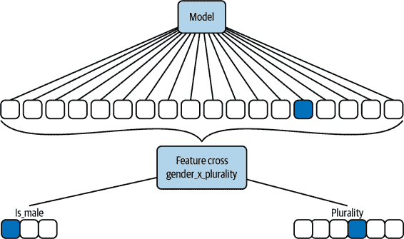

# 第二章：数据表示设计模式

任何机器学习模型的核心是一个数学函数，该函数定义为仅在特定类型的数据上操作。与此同时，现实世界中的机器学习模型需要操作可能无法直接插入数学函数中的数据。例如，决策树的数学核心操作于布尔变量上。请注意，我们这里讨论的是决策树的数学核心——决策树机器学习软件通常还包括从数据中学习最优树的函数以及读取和处理不同类型的数值和分类数据的方法。然而，支撑决策树的数学函数（见图 2-1）实际上操作布尔变量，并使用 AND（在图 2-1 中为&&）和 OR（在图 2-1 中为+）等操作。


###### 图 2-1 决策树机器学习模型的核心，用于预测婴儿是否需要重症监护。

假设我们有一个决策树来预测婴儿是否需要重症监护（IC）或可以正常出院（ND），并且假设决策树的输入是两个变量，*x1* 和 *x2*。训练模型可能看起来像图 2-1 所示。

很明显，*x1* 和 *x2* 必须是布尔变量，才能使 *f(x1, x2)* 正常工作。假设我们希望模型在分类婴儿是否需要重症监护时考虑两个信息：婴儿出生的医院和婴儿的体重。我们能够将婴儿出生的医院作为决策树的输入吗？不行，因为医院既不是 True 也不是 False 的值，不能被传入&&（AND）运算符。从数学上讲是不兼容的。当然，我们可以通过进行操作如下：

```
                x1 = (hospital IN France)
```

所以，当医院位于法国时，*x1* 为 True，否则为 False。同样，婴儿的体重不能直接输入模型，但可以通过进行操作如下：

```
                x1 = (babyweight < 3 kg)
```

我们可以将医院或者婴儿体重作为模型的输入。这是输入数据（医院，一个复杂对象或婴儿体重，一个浮点数）如何以模型期望的形式（布尔型）表示的示例。这就是我们所说的*数据表示*。

在本书中，我们将使用术语*输入*来表示输入到模型的真实世界数据（例如，婴儿体重），并使用术语*特征*来表示模型实际操作的转换后的数据（例如，婴儿体重是否小于 3 公斤）。创建用于表示输入数据的特征的过程称为*特征工程*，因此我们可以将特征工程视为一种选择数据表示的方式。

当然，我们更希望机器学习模型能够学习如何通过选择输入变量和阈值来创建每个节点，而不是硬编码参数，比如 3 公斤的阈值。决策树就是能够学习数据表示的机器学习模型的一个例子¹。本章我们将看到的许多模式将涉及类似的*可学习的数据表示*。

*嵌入*设计模式是深度神经网络能够自行学习的数据表示的典型示例。在嵌入中，学习得到的表示是密集的，并且比输入（可能是稀疏的）更低维度。学习算法需要从输入中提取最显著的信息，并在特征中以更简洁的方式表示它。学习用于表示输入数据的特征的过程称为*特征提取*，我们可以将可学习的数据表示（如嵌入）视为自动化生成的特征。

数据表示甚至可以不仅仅是单个输入变量的表示 —— 例如，斜决策树通过设定两个或更多输入变量的线性组合的阈值来创建一个布尔特征。每个节点只能表示一个输入变量的决策树会简化为分段线性函数，而每个节点可以表示输入变量线性组合的斜决策树会简化为分段线性函数（见图 2-2）。考虑到需要学习来充分表示线性的步骤数量，分段线性模型更为简单且更快速。这个想法的扩展是*特征交叉*设计模式，简化了多值分类变量之间 AND 关系的学习。


###### 图 2-2\. 决策树分类器，每个节点只能阈值化一个输入值（x1 或 x2），将导致一个逐步线性边界函数，而一个斜树分类器，其中一个节点可以阈值化输入变量的线性组合，将导致一个分段线性边界函数。分段线性函数需要更少的节点，并且可以达到更高的准确度。

数据表示不需要学习或固定，还可以使用混合方法。*哈希特征*设计模式是确定性的，但不需要模型知道特定输入可能采用的所有潜在值。

到目前为止，我们查看的数据表示都是一对一的。虽然我们可以分别表示不同类型的输入数据或将每个数据片段表示为单个特征，但使用*多模态输入*可能更有利。这是本章将要探讨的第四种设计模式。

# 简单的数据表示

在深入学习数据表示、特征交叉等之前，让我们先看看更简单的数据表示。我们可以将这些简单的数据表示视为机器学习中常见的*惯用法*，虽然不完全是模式，但通常被广泛采用。

## 数值输入

大多数现代大规模机器学习模型（随机森林、支持向量机、神经网络）都是基于数值的操作，因此如果我们的输入是数值型的，我们可以将其直接传递给模型。

### 为什么缩放是可取的

通常情况下，由于机器学习框架使用的优化器经过调优，能够很好地处理[–1, 1]范围内的数字，因此将数值缩放到该范围内可能会有益处。

通过 scikit-learn 内置数据集的快速测试可以证明这一点（这是来自本书代码[仓库](https://github.com/GoogleCloudPlatform/ml-design-patterns/blob/master/02_data_representation/simple_data_representation.ipynb)的摘录）：

```
from sklearn import datasets, linear_model
diabetes_X, diabetes_y = datasets.load_diabetes(return_X_y=True)
raw = diabetes_X[:, None, 2]
max_raw = max(raw)
min_raw = min(raw)
scaled = (2*raw - max_raw - min_raw)/(max_raw - min_raw)

def train_raw():
    linear_model.LinearRegression().fit(raw, diabetes_y)

def train_scaled():
    linear_model.LinearRegression().fit(scaled, diabetes_y)

raw_time = timeit.timeit(train_raw, number=1000)
scaled_time = timeit.timeit(train_scaled, number=1000)
```

当我们运行这个模型时，我们得到了几乎 9% 的改进，这个模型只使用了一个输入特征。考虑到典型机器学习模型中的特征数量，这些节省可能会积累起来。

缩放的另一个重要原因是，一些机器学习算法和技术对不同特征的相对大小非常敏感。例如，使用欧氏距离作为其接近度测量的 k-means 聚类算法将主要依赖具有较大幅度特征。缺乏缩放还会影响 L1 或 L2 正则化的效果，因为特征的权重大小取决于该特征的值的大小，因此不同特征会受到正则化的影响不同。通过将所有特征缩放到[–1, 1]之间，我们确保不同特征的相对大小差异不大。

### 线性缩放

常用的四种缩放形式：

最小-最大缩放

数值线性缩放，使得输入可以取的最小值缩放到–1，最大可能值缩放到 1：

```
x1_scaled = (2*x1 - max_x1 - min_x1)/(max_x1 - min_x1)
```

最小-最大缩放的问题在于必须从训练数据集中估计最大和最小值（`max_x1`和`min_x1`），它们通常是异常值。真实数据经常被缩小到[–1, 1]范围内的一个非常窄的区域。

裁剪（与最小-最大缩放结合使用）

通过使用“合理”的值而不是从训练数据集估计最小和最大值来解决异常值问题。数值线性缩放在这两个合理范围内，然后裁剪到范围[–1, 1]。这样做的效果是将异常值视为–1 或 1。

Z-score 标准化

通过使用训练数据集上估计的均值和标准差，线性缩放输入来解决异常值问题，而无需事先知道合理范围是什么：

```
x1_scaled = (x1 - mean_x1)/stddev_x1

```

该方法的名称反映了缩放值具有零均值，并且通过标准差进行归一化，从而使其在训练数据集上具有单位方差的事实。缩放值是无界的，但大多数时间（如果基础分布是正态分布，为 67%）位于[–1, 1]之间。绝对值越大的值超出此范围的概率较低，但仍然存在。

温索化

使用训练数据集中的经验分布将数据集裁剪到由数据值的第 10 和 90 百分位给出的边界（或第 5 和 95 百分位，依此类推）。修剪后的值是最小-最大缩放的。

到目前为止讨论的所有方法都对数据进行线性缩放（在剪裁和温索化的情况下，典型范围内是线性的）。最小-最大缩放和剪裁倾向于最适合均匀分布的数据，而 Z-score 倾向于最适合正态分布的数据。在婴儿体重预测示例中，不同缩放函数对 `mother_age` 列的影响显示在图 2-3 中（查看[完整代码](https://github.com/GoogleCloudPlatform/ml-design-patterns/blob/master/02_data_representation/simple_data_representation.ipynb)）。

在图 2-3 中，请注意 minmax_scaled 将 x 值放入所需范围[-1, 1]，但继续保留分布极端端点的值，这些端点的例子不足。Clipping 将许多问题值折叠起来，但需要准确设置截断阈值——在此处，40 岁以上母亲的婴儿数量的缓慢下降造成了设置硬阈值的问题。Winsorizing 与 Clipping 类似，需要准确设置百分位阈值。Z-score 标准化改善了范围（但不限制值为[-1, 1]），并将问题值推迟。对于这三种方法中，零规范化对`mother_age`效果最好，因为原始年龄值有点钟形曲线。对于其他问题，min-max 缩放、Clipping 或 Winsorizing 可能更好。


###### 图 2-3\. 母亲年龄在婴儿体重预测示例中的直方图显示在左上方面板，不同的缩放函数（见 x 轴标签）显示在其余面板中。

### 非线性变换

如果我们的数据出现偏斜，既不均匀分布也不像钟形曲线分布怎么办？在这种情况下，在缩放之前应用非线性变换会更好。一个常见的技巧是在缩放之前取输入值的对数。其他常见的转换包括 sigmoid 函数和多项式扩展（平方、平方根、立方、立方根等）。我们会知道我们有一个好的转换函数，如果转换后的值的分布变得均匀或正态分布。

假设我们正在建立一个模型来预测一本非虚构书籍的销售情况。模型的一个输入是与主题对应的维基百科页面的流行程度。然而，维基百科页面的访问量存在严重的偏斜，并且占据了很大的动态范围（见图 2-4 的左侧面板：分布向极少被访问的页面倾斜，但最常见的页面被访问了数千万次）。通过取对数，然后取该对数值的四次方根，并线性缩放结果，我们得到了一个在所需范围内且略呈钟形的分布。有关查询维基百科数据、应用这些转换和生成此图的代码详细信息，请参阅本书的[GitHub 代码库](https://github.com/GoogleCloudPlatform/ml-design-patterns/blob/master/02_data_representation/simple_data_representation.ipynb)。


###### 图 2-4\. 左面板：维基百科页面浏览数分布高度偏斜，动态范围大。第二面板展示了通过连续使用对数、幂函数和线性缩放来转换浏览数的方法。第三面板展示了直方图均衡化的效果，第四面板展示了 Box-Cox 变换的效果。

设计一个线性化函数，使分布看起来像钟形曲线可能会很困难。更简单的方法是将浏览次数分桶化，选择桶的边界以适应所需的输出分布。选择这些桶的一个有原则的方法是进行*直方图均衡化*，直方图的箱子根据原始分布的分位数选择（见图 2-4 的第三面板）。在理想情况下，直方图均衡化会导致均匀分布（尽管在本例中不会，因为分位数中存在重复值）。

要在 BigQuery 中执行直方图均衡化，我们可以执行以下操作：

```
ML.BUCKETIZE(num_views, bins) AS bin
```

其中箱子是从以下位置获取的：

```
APPROX_QUANTILES(num_views, 100) AS bins
```

查看本书代码库中的[notebook](https://github.com/GoogleCloudPlatform/ml-design-patterns/blob/master/02_data_representation/simple_data_representation.ipynb)获取完整详情。

处理偏斜分布的另一种方法是使用像*Box-Cox 变换*这样的参数化转换技术。Box-Cox 选择其单一参数 lambda 来控制“异方差性”，使得方差不再取决于大小。在这里，很少被查看的维基百科页面之间的方差要比经常被查看的页面之间的方差小得多，而 Box-Cox 试图在所有浏览数的范围内均衡化方差。可以使用 Python 的 SciPy 包来完成这个过程：

```
traindf['boxcox'], est_lambda = (
    scipy.stats.boxcox(traindf['num_views']))
```

在训练数据集上估计的参数`(est_lambda)`然后用于转换其他值：

```
evaldf['boxcox'] = scipy.stats.boxcox(evaldf['num_views'], est_lambda)
```

### 数字数组

有时，输入数据是一个数字数组。如果数组长度固定，数据表示可能会很简单：展平数组，并将每个位置视为单独的特征。但通常，数组长度会变化。例如，用于预测非小说书籍销量模型的输入之一可能是该主题所有先前书籍的销售量。例如输入可能是：

```
[2100, 15200, 230000, 1200, 300, 532100]

```

显然，这个数组的长度在每一行中会有所不同，因为不同主题的书籍数量各不相同。

处理数字数组的常见习语包括以下内容：

+   以其总体统计数据表示输入数组。例如，我们可能会使用长度（即以前有关该主题的书籍的数量）、平均值、中位数、最小值、最大值等。

+   以其经验分布表示输入数组——例如第 10/20/...百分位数等。

+   如果数组以特定方式排序（例如按时间顺序或按大小排序），则通过最后三个或其他固定数量的项目表示输入数组。对于长度小于三的数组，该特征将使用缺失值填充到长度为三。

所有这些最终都将变量长度数组表示为固定长度特征。我们也可以将这个问题表述为时间序列预测问题，即基于以前书籍销售的时间历史来预测下一本书的销售。通过将以前书籍的销售视为数组输入，我们假设预测书籍销售最重要的因素是书籍本身的特征（作者、出版商、评论等），而不是销售金额的时间连续性。

## 分类输入

因为大多数现代大规模机器学习模型（随机森林、支持向量机、神经网络）都是基于数值值运行的，所以分类输入必须表示为数字。

枚举可能的值并将它们映射到一个有序标度将会效果不佳。假设模型的一个输入是预测非小说书籍销售的语言。我们不能简单地创建这样的映射表：

| 分类输入 | 数值特征 |
| --- | --- |
| 英文 | 1.0 |
| 中文 | 2.0 |
| 德语 | 3.0 |

这是因为机器学习模型将尝试在德语和英语书籍的流行度之间进行插值，以获取中文书籍的流行度！由于语言之间没有顺序关系，我们需要使用分类到数值的映射，使模型能够独立学习这些语言书籍市场。

### 独热编码

将分类变量映射为保证变量独立的最简单方法是*独热编码*。在我们的例子中，分类输入变量将通过以下映射转换为三元素特征向量：

| 分类输入 | 数值特征 |
| --- | --- |
| 英语 | [1.0, 0.0, 0.0] |
| 中文 | [0.0, 1.0, 0.0] |
| 德语 | [0.0, 0.0, 1.0] |

独热编码要求我们事先知道分类输入的*词汇*。在这里，词汇包括三个标记（英语、中文和德语），生成的特征长度是这个词汇表的大小。

在某些情况下，将数字输入视为分类变量，并将其映射到一个独热编码列可能会有所帮助：

当数字输入是一个索引

例如，如果我们试图预测交通水平，而我们的输入之一是星期几，我们可以将星期几视为数值（1、2、3，…，7），但认识到这里的星期几并不是连续的刻度，而只是一个索引。将其视为分类（星期日、星期一，…，星期六）更有帮助，因为索引是任意的。周的起始日应该是星期天（美国）、星期一（法国）还是星期六（埃及）？

当输入和标签之间的关系不是连续的时候

应该将一周中的某一天作为分类特征的理由在于，星期五的交通水平不受星期四和星期六的影响。

当将数字变量分桶时

在大多数城市中，交通水平取决于是否是周末，并且这可能因地点而异（大部分世界在周六和周日，某些伊斯兰国家在星期四和星期五）。因此，将一周中的某一天视为布尔特征（周末或工作日）会很有帮助。这种映射中，独立输入的数量（这里是七个）大于独立特征值的数量（这里是两个），被称为分桶。通常，分桶是根据范围进行的——例如，我们可以将`mother_age`分桶为在 20、25、30 等处断开的范围，并将每个桶视为分类变量，但应意识到这会丢失`mother_age`的序数性质。

当我们希望处理数值输入的不同值时，视其对标签的影响为独立

例如，婴儿的体重取决于分娩的多胎情况²，因为双胞胎和三胞胎的体重通常比单胎轻。因此，如果三胞胎中有一个体重较轻的婴儿，可能比体重相同的双胞胎更健康。在这种情况下，我们可以将多胎数映射为分类变量，因为分类变量允许模型为不同的多胎值学习独立可调参数。当然，只有在我们的数据集中有足够的双胞胎和三胞胎的例子时才能这样做。

### 数组的分类变量

有时，输入数据是一个类别数组。如果数组长度固定，我们可以将每个数组位置视为单独的特征。但通常，数组的长度是可变的。例如，新生模型的一个输入可能是母亲之前的分娩类型：

```
[Induced, Induced, Natural, Cesarean]

```

显然，该数组的长度在每一行中会有所不同，因为每个婴儿的哥哥姐姐的数量也不同。

处理数组分类变量的常见习语包括以下内容：

+   *计数*每个词汇项的出现次数。因此，我们示例的表示将是`[2, 1, 1]`，假设词汇表是`Induced, Natural`和`Cesarean`（按顺序）。现在这是一个固定长度的数字数组，可以展平并按位置顺序使用。如果我们有一个数组，其中一个项目只能出现一次（例如一个人说的语言），或者如果该特征只表示存在而不是计数（例如母亲是否曾经接受过剖腹产手术），那么每个位置的计数为 0 或 1，这被称为*多热编码*。

+   为避免大数字，可以使用*相对频率*代替计数。我们示例的表示方法将是`[0.5, 0.25, 0.25]`而不是`[2, 1, 1]`。空数组（没有兄弟姐妹的第一个孩子）表示为`[0, 0, 0]`。在自然语言处理中，词的整体相对频率通过包含该词的文档的相对频率来归一化，从而产生[TF-IDF](https://oreil.ly/kNYHr)（词频-逆文档频率）。

+   如果数组以特定方式排序（例如，按时间顺序），则用最后三个项目表示输入数组。长度小于三的数组用缺失值填充。

+   通过批量统计来表示数组，例如数组的长度，众数（最常见的条目），中位数，第 10/20/…百分位等。

在这些表示方法中，计数/相对频率的习惯用法最为常见。请注意，这两者都是独热编码的一般化——如果婴儿没有兄弟姐妹，其表示将为`[0, 0, 0]`，如果婴儿有一个自然分娩的兄弟姐妹，则表示将为`[0, 1, 0]`。

看过简单的数据表示后，让我们讨论有助于数据表示的设计模式。

# 设计模式 1：散列特征

散列特征设计模式解决了与分类特征相关的三个可能的问题：不完整的词汇表、模型大小由于基数、以及冷启动。它通过分组分类特征来做到这一点，并接受数据表示中碰撞的权衡。

## 问题

对分类输入变量进行独热编码需要预先知道词汇表。如果输入变量类似于书写语言或预测交通量的星期几，这不是问题。

如果所讨论的分类变量是类似于`hospital_id`（婴儿出生地的医院编号）或`physician_id`（接生的医生编号）这样的内容，这些分类变量会带来一些问题：

+   学会词汇需要从训练数据中提取。由于随机抽样，训练数据可能不包含所有可能的医院或医生。词汇可能是*不完整*的。

+   分类变量具有*高基数*。与具有三种语言或七天的特征向量不同，我们的特征向量长度可能达到数千到数百万。这种特征向量在实践中存在几个问题。它们涉及如此多的权重，以至于训练数据可能不足。即使我们可以训练模型，训练好的模型在服务时也需要大量空间来存储，因为整个词汇表在服务时都是必需的。因此，我们可能无法在较小的设备上部署模型。

+   模型投入生产后，可能会建造新的医院并雇佣新的医生。模型将无法预测这些情况，因此需要一个单独的服务基础设施来处理这些*冷启动*问题。

###### 提示

即使像单热编码这样简单的表示法，也值得预见冷启动问题，并明确保留所有零值以用于词汇外输入。

作为具体例子，让我们来看一下预测航班到达延误的问题。模型的输入之一是出发机场。在收集数据集时，美国有 347 个机场：

```
SELECT 
   DISTINCT(departure_airport)
FROM `bigquery-samples.airline_ontime_data.flights`
```

一些机场在整个时间段内只有一到三次航班，因此我们预计训练数据词汇表将不完整。347 足够大，特征将非常稀疏，新机场肯定会建造。如果我们对出发机场进行单热编码，这三个问题（不完整的词汇表，高基数，冷启动）都会存在。

航空数据集，如出生数据集和我们在本书中用于说明的几乎所有其他数据集，都是[BigQuery 中的公共数据集](https://oreil.ly/lgcKA)，因此您可以尝试查询。在我们编写本文时，每月 1 TB 的查询免费，还有一个沙盒可供使用，因此您可以在不用信用卡的情况下使用 BigQuery 达到此限制。我们建议您收藏我们的 GitHub 存储库。例如，查看 GitHub 中的[notebook](https://github.com/GoogleCloudPlatform/ml-design-patterns/blob/master/02_data_representation/hashed_feature.ipynb)以获取完整的代码。

## 解决方案

哈希特征设计模式通过以下方式表示分类输入变量：

1.  将分类输入转换为唯一字符串。对于出发机场，我们可以使用[三字母 IATA 代码](https://oreil.ly/B8nLw)。

1.  对字符串应用确定性（无随机种子或盐）和可移植（以便在训练和服务中都可以使用相同算法）的哈希算法。

1.  取哈希结果除以所需的桶数得到余数。通常，哈希算法返回一个整数，可能为负数，而负数的模仍为负数。因此，需要取结果的绝对值。

在 BigQuery SQL 中，可以通过以下方式实现这些步骤：

```
ABS(MOD(FARM_FINGERPRINT(airport), numbuckets))
```

`FARM_FINGERPRINT` 函数使用 FarmHash，一系列确定性、[分布良好](https://github.com/google/farmhash/blob/master/Understanding_Hash_Functions)的哈希算法，并且这些算法的实现在多种编程语言中都有[提供](https://github.com/google/farmhash)。

在 TensorFlow 中，这些步骤由 `feature_column` 函数实现：

```
tf.feature_column.categorical_column_with_hash_bucket(
    airport, num_buckets, dtype=tf.dtypes.string)
```

例如，表格 2-1 显示了一些 IATA 机场代码在散列到 3、10 和 1,000 个桶时的 FarmHash。

表格 2-1\. 将一些 IATA 机场代码散列到不同数量的桶时的 FarmHash

| 行 | 出发机场 | hash3 | hash10 | hash1000 |
| --- | --- | --- | --- | --- |
| 1 | DTW | 1 | 3 | 543 |
| 2 | LBB | 2 | 9 | 709 |
| 3 | SNA | 2 | 7 | 587 |
| 4 | MSO | 2 | 7 | 737 |
| 5 | ANC | 0 | 8 | 508 |
| 6 | PIT | 1 | 7 | 267 |
| 7 | PWM | 1 | 9 | 309 |
| 8 | BNA | 1 | 4 | 744 |
| 9 | SAF | 1 | 2 | 892 |
| 10 | IPL | 2 | 1 | 591 |

## 为什么它有效

假设我们选择使用 10 个桶对机场代码进行散列（hash10 在 表格 2-1 中）。这如何解决我们所识别的问题？

### 超出词汇表的输入

即使一个只有少数航班的机场不在训练数据集中，其散列特征值将在 [0–9] 范围内。因此，在服务期间不存在韧性问题——未知机场将获得与哈希桶中其他机场对应的预测。模型不会出错。

如果我们有 347 个机场，如果将其散列到 10 个桶中，平均每个桶将有相同哈希桶代码的大约 35 个机场。训练数据集中缺失的机场将从哈希桶中的其他相似 ~35 个机场中“借用”其特征。当然，对于未知输入的预测不会准确（期望未知输入的准确预测是不合理的），但它将在正确范围内。

通过平衡处理合理的超出词汇表输入的需求和准确反映分类输入的需求来选择哈希桶的数量。使用 10 个哈希桶，大约有 ~35 个机场混合在一起。一个经验法则是选择哈希桶的数量，使每个桶大约有五个条目。在这种情况下，选择 70 个哈希桶是一个很好的折衷方案。

### 高基数

只要我们选择足够少的哈希桶数量，就能解决高基数问题。即使我们有数百万个机场、医院或医生，我们也可以将它们哈希到几百个桶中，从而保持系统的内存和模型大小要求实用。

我们不需要存储词汇表，因为转换代码与实际数据值无关，模型的核心只处理 `num_buckets` 输入，而不是整个词汇表。

确实，哈希是损失的——因为我们有 347 个机场，如果我们将其哈希到 10 个桶中，平均每个桶将有 35 个机场共享相同的哈希桶代码。然而，当选择是舍弃这个变量因为它太宽时，损失编码是一个可以接受的折衷方案。

### 冷启动

冷启动情况类似于词汇外情况。如果新机场被添加到系统中，它最初会获得与哈希桶中其他机场对应的预测。随着一个机场变得流行，将会有更多的航班从该机场起飞。只要我们定期重新训练模型，其预测将开始反映来自新机场的到达延误情况。这在“设计模式 18：持续模型评估”中更详细地讨论了。

通过选择哈希桶的数量，使每个桶大约有五个条目，我们可以确保任何桶都具有合理的初始结果。

## 折衷与替代方案

大多数设计模式都涉及某种折衷，哈希特征设计模式也不例外。这里的关键折衷是我们会失去模型的准确性。

### 桶碰撞

哈希特征实现中的模数部分是一个损失的操作。通过选择 100 个哈希桶的大小，我们选择让 3-4 个机场共享一个桶。我们明确地在能够准确表示数据（使用固定词汇表和单热编码）的能力上进行了妥协，以处理词汇外输入、基数/模型大小约束和冷启动问题。这不是一顿免费的午餐。如果您事先知道词汇表，词汇表大小相对较小（对于包含数百万示例的数据集，数千是可以接受的），或者冷启动不是问题，请不要选择哈希特征。

注意，我们不能简单地将桶的数量增加到非常高的数字，希望完全避免碰撞。即使我们将桶的数量增加到 10 万个，仅有 347 个机场，至少两个机场共享相同哈希桶的概率为 45%——这是不可接受的高概率（参见表 2-2）。因此，我们应仅在愿意容忍多个分类输入共享相同哈希桶值的情况下使用哈希特征。

表 2-2\. 每个桶预期条目数及当 IATA 机场代码哈希到不同数量的桶时至少一次碰撞的概率

| num_hash_buckets | entries_per_bucket | collision_prob |
| --- | --- | --- |
| 3 | 115.666667 | 1.000000 |
| 10 | 34.700000 | 1.000000 |
| 100 | 3.470000 | 1.000000 |
| 1000 | 0.347000 | 1.000000 |
| 10000 | 0.034700 | 0.997697 |
| 100000 | 0.003470 | 0.451739 |

### 偏斜

当分类输入的分布高度倾斜时，精度损失特别严重。考虑包含 ORD（芝加哥，世界上最繁忙的机场之一）的哈希桶的情况。我们可以通过以下方式找到这个哈希桶：

```
CREATE TEMPORARY FUNCTION hashed(airport STRING, numbuckets INT64) AS (
   ABS(MOD(FARM_FINGERPRINT(airport), numbuckets))
);

WITH airports AS (
SELECT 
   departure_airport, COUNT(1) AS num_flights
FROM `bigquery-samples.airline_ontime_data.flights`
GROUP BY departure_airport 
)

SELECT 
   departure_airport, num_flights
FROM airports
WHERE hashed(departure_airport, 100) = hashed('ORD', 100)
```

结果显示，虽然 ORD 有约 360 万次航班，但 BTV（佛蒙特州伯灵顿市）只有约 67000 次航班：

| departure_airport | num_flights |
| --- | --- |
| ORD | 3610491 |
| BTV | 66555 |
| MCI | 597761 |

这表明，从实际目的来看，模型将芝加哥经历的长时间出租车等待和天气延误归因于佛蒙特州伯灵顿市的市政机场！对于 BTV 和 MCI（堪萨斯城机场），模型的准确率将非常低，因为芝加哥的航班数量如此之多。

### 聚合特征

在分类变量的分布偏斜或桶的数量过小导致桶碰撞频繁的情况下，我们可能会发现添加一个聚合特征作为模型输入很有帮助。例如，对于每个机场，我们可以找到训练数据集中准点航班的概率，并将其添加为模型的特征。这样一来，当我们对机场代码进行哈希时，就可以避免丢失与个别机场相关联的信息。在某些情况下，我们甚至可以完全避免使用机场名称作为特征，因为准点航班的相对频率可能已经足够。

### 超参数调优

由于桶碰撞频率的权衡，选择桶的数量可能很困难。这往往取决于问题本身。因此，我们建议将桶的数量视为一个需要调优的超参数：

```
- parameterName: nbuckets
      type: INTEGER
      minValue: 10
      maxValue: 20
      scaleType: UNIT_LINEAR_SCALE

```

确保桶的数量保持在哈希的分类变量的基数合理范围内。

### 密码哈希

哈希特征的丢失性质来自于实现中的取模部分。如果我们完全避免取模会怎么样？毕竟，农场指纹具有固定长度（INT64 为 64 位），因此可以用 64 个特征值来表示，每个特征值为 0 或 1。这被称为*二进制编码*。

然而，二进制编码并不能解决词汇表外的输入或冷启动问题（只能解决高基数的问题）。实际上，比特编码是一个误导。如果我们不进行取模操作，只需对形成 IATA 代码的三个字符进行编码，即可得到唯一的表示（因此使用长度为 3*26=78 的特征）。这种表示的问题显而易见：以字母 O 开头的机场在航班延误特征上毫无共同之处——编码在相同字母开头的机场之间创建了一个*虚假相关性*。在二进制空间中也是如此。因此，我们不推荐对农场指纹值进行二进制编码。

MD5 哈希的二进制编码不会遭受这种虚假相关问题的困扰，因为 MD5 哈希的输出是均匀分布的，所以结果位将是均匀分布的。然而，与 Farm Fingerprint 算法不同，MD5 哈希不是确定性的，也不是唯一的——它是单向哈希，并且会有许多意外的碰撞。

在哈希特征设计模式中，我们必须使用指纹哈希算法而不是加密哈希算法。这是因为指纹函数的目标是产生确定性和唯一的值。如果考虑一下，这是机器学习预处理函数的关键要求，因为在模型服务期间我们需要应用相同的函数并获得相同的哈希值。指纹函数不会产生均匀分布的输出。像 MD5 或 SHA1 这样的加密算法会产生均匀分布的输出，但它们不是确定性的，并且被故意设计成计算昂贵。因此，在特征工程的上下文中，加密哈希不适用，因为在预测期间对于给定的输入计算的哈希值必须与训练期间计算的哈希值相同，而且哈希函数不应减慢机器学习模型的运行速度。

###### 注意

MD5 不确定的原因在于典型情况下会向要进行哈希的字符串添加“盐”。盐是一个[添加到每个密码的随机字符串](https://oreil.ly/cv7PS)，以确保即使两个用户使用相同的密码，数据库中的哈希值也会不同。这是为了防止基于“彩虹表”的攻击，彩虹表依赖于常用密码的字典，并将已知密码的哈希与数据库中的哈希进行比较。随着计算能力的增加，现在可以对每个可能的盐进行暴力攻击，因此现代加密实现在循环中进行哈希以增加计算开销。即使我们关闭盐并将迭代次数减少到一次，MD5 哈希也只是一种方式。它不会是唯一的。

底线是，我们需要使用指纹哈希算法，并对得到的哈希值进行取模。

### 操作顺序

请注意，我们首先执行模运算，然后再执行绝对值：

```
CREATE TEMPORARY FUNCTION hashed(airport STRING, numbuckets INT64) AS (
   ABS(MOD(FARM_FINGERPRINT(airport), numbuckets))
);
```

在前面片段中`ABS`、`MOD`和`FARM_FINGERPRINT`的顺序很重要，因为`INT64`的范围不对称。具体来说，它的范围在`–9,223,372,036,854,775,808`和`9,223,372,036,854,775,807`之间（包括两者）。所以，如果我们执行：

```
ABS(FARM_FINGERPRINT(airport))
```

如果`FARM_FINGERPRINT`操作返回`–9,223,372,036,854,775,808`，由于其绝对值无法用`INT64`表示，我们可能会遇到罕见且可能无法重现的溢出错误！

### 空散列桶

虽然不太可能，但有一种遥远的可能性，即使我们选择了 10 个哈希桶来表示 347 个机场，其中一个哈希桶可能为空。因此，在使用哈希特征列时，[可能有利](https://oreil.ly/xlwAH)也使用 L2 正则化，以便与空桶关联的权重被推向接近零。这样，如果一个超出词汇表的机场确实掉入一个空桶中，它不会导致模型在数值上不稳定。

# 设计模式 2：嵌入

嵌入是一种可学习的数据表示，将高基数数据映射到低维空间，以保留与学习问题相关的信息。嵌入是现代机器学习的核心，并在该领域中有各种各样的体现。

## 问题

机器学习模型系统地寻找数据中的模式，捕捉模型输入特征与输出标签的属性关系。因此，输入特征的数据表示直接影响最终模型的质量。虽然处理结构化的数值输入相对简单，但用于训练机器学习模型的数据可以是多种多样的，如分类特征、文本、图像、音频、时间序列等等。对于这些数据表示，我们需要提供一个有意义的数值供给我们的机器学习模型，以便这些特征能够符合典型的训练范式。嵌入提供了一种处理这些不同数据类型的方式，可以保持项目之间的相似性，从而提高我们模型学习这些重要模式的能力。

单热编码是表示分类输入变量的常用方式。例如，考虑出生数据集中的多重输入。³ 这是一个具有六种可能值的分类输入：`['Single(1)'`, `'Multiple(2+)'`, `'Twins(2)'`, `'Triplets(3)'`, `'Quadruplets(4)'`, `'Quintuplets(5)']`。我们可以使用单热编码来处理这种分类输入，将每个潜在的输入字符串值映射到 R⁶ 中的单位向量，如表 2-3 所示。

表 2-3\. 对出生数据集进行分类输入单热编码的示例

| 多重输入 | 单热编码 |
| --- | --- |
| Single(1) | [1,0,0,0,0,0] |
| Multiple(2+) | [0,1,0,0,0,0] |
| Twins(2) | [0,0,1,0,0,0] |
| Triplets(3) | [0,0,0,1,0,0] |
| Quadruplets(4) | [0,0,0,0,1,0] |
| Quintuplets(5) | [0,0,0,0,0,1] |

通过这种方式编码，我们需要六个维度来表示不同的类别。六个维度可能并不算太多，但如果我们需要考虑更多的类别呢？

例如，假设我们的数据集包含顾客对视频数据库的观看历史，我们的任务是根据顾客以前的视频互动建议一组新视频？在这种情况下，`customer_id`字段可能有数百万个唯一条目。同样，先前观看视频的`video_id`也可能包含数千个条目。将高基数分类特征如`video_ids`或`customer_ids`使用一位有效编码作为机器学习模型的输入，会导致一个对多种机器学习算法不太适用的稀疏矩阵。

使用一位有效编码的第二个问题是它将分类变量视为*独立*的。然而，对双胞胎的数据表示应接近对三胞胎的数据表示，而与五胞胎的数据表示相距甚远。多胞胎最有可能是双胞胎，但可能是三胞胎。例如，表 2-4 显示了在较低维度中捕获这种*紧密*关系的多数列的替代表示。

表 2-4\. 使用较低维度的嵌入表示出生数据集中的多数列。

| Plurality | 候选编码 |
| --- | --- |
| Single(1) | [1.0,0.0] |
| Multiple(2+) | [0.0,0.6] |
| Twins(2) | [0.0,0.5] |
| Triplets(3) | [0.0,0.7] |
| Quadruplets(4) | [0.0,0.8] |
| Quintuplets(5) | [0.0,0.9] |

这些数字当然是任意的。但是否可能仅使用两个维度学习出最佳的多数列表示法来解决出生问题？这就是嵌入设计模式解决的问题。

高基数和相关数据的相同问题也存在于图像和文本中。图像由数千个像素组成，这些像素并不相互独立。自然语言文本来自数万个单词的词汇表，像`walk`这样的词比`book`更接近`run`。

## 解决方案

嵌入设计模式解决了在较低维度中密集表示高基数数据的问题，通过将输入数据传递到一个具有可训练权重的嵌入层，将高维度的分类输入变量映射到某个低维度空间的实值向量中。创建密集表示的权重是作为模型优化的一部分学习的（见图 2-5）。实际上，这些嵌入最终捕获了输入数据中的紧密关系。


###### 图 2-5\. 嵌入层的权重在训练过程中作为参数学习。

###### 提示

因为嵌入捕捉输入数据中的接近关系，并以较低维度的表示，我们可以将嵌入层用作聚类技术（例如客户分割）和主成分分析（PCA）等降维方法的替代品。嵌入权重在主模型训练循环中确定，因此不需要事先进行聚类或进行 PCA。

在训练出生模型时，嵌入层中的权重会作为梯度下降过程的一部分而被学习。

训练结束时，嵌入层的权重可能是表 2-5 中所示分类变量的编码，详情请见表 2-5。

表 2-5\. 出生数据集中多胞胎列的单热编码和学习编码

| 多胞胎 | 单热编码 | 学习编码 |
| --- | --- | --- |
| 单胞胎(1) | [1,0,0,0,0,0] | [0.4, 0.6] |
| 多胞胎(2+) | [0,1,0,0,0,0] | [0.1, 0.5] |
| 双胞胎(2) | [0,0,1,0,0,0] | [-0.1, 0.3] |
| 三胞胎(3) | [0,0,0,1,0,0] | [-0.2, 0.5] |
| 四胞胎(4) | [0,0,0,0,1,0] | [-0.4, 0.3] |
| 五胞胎(5) | [0,0,0,0,0,1] | [-0.6, 0.5] |

嵌入将稀疏的单热编码向量映射到 R² 中的密集向量。

在 TensorFlow 中，我们首先为特征构建一个分类特征列，然后将其包装在嵌入特征列中。例如，对于我们的多胞胎特征，我们将会有：

```
plurality = tf.feature_column.categorical_column_with_vocabulary_list(
            'plurality', ['Single(1)', 'Multiple(2+)', 'Twins(2)', 
'Triplets(3)', 'Quadruplets(4)', 'Quintuplets(5)'])
plurality_embed = tf.feature_column.embedding_column(plurality, dimension=2)
```

结果特征列 (`plurality_embed`) 作为输入传递给神经网络的下游节点，而不是单热编码特征列 (`plurality`)。

### 文本嵌入

文本提供了一个自然的背景，使用嵌入层是有利的。考虑到词汇的基数（通常是数万个词），使用单热编码每个词并不实际。这将创建一个非常大（高维度）且稀疏的矩阵进行训练。此外，我们希望相似的词在嵌入空间中靠近，不相关的词则远离。因此，在将离散文本输入模型之前，我们使用密集的词嵌入来向量化。

在 Keras 中实现文本嵌入，我们首先为词汇中的每个单词创建一个标记化，如图 2-6 所示。然后，我们使用这个标记化将其映射到嵌入层，类似于对多胞胎列的处理。


###### 图 2-6\. 分词器创建一个查找表，将每个单词映射到一个索引。

Tokenization 是一个查找表，将我们词汇表中的每个单词映射到一个索引。我们可以将其视为每个单词的一热编码，其中 tokenized 索引是一热编码中非零元素的位置。这需要对整个数据集进行完整遍历（假设这些数据集由文章标题组成⁴），以创建查找表，并可以在 Keras 中完成。有关本书的完整代码，请查看[存储库](https://github.com/GoogleCloudPlatform/ml-design-patterns/blob/master/02_data_representation/embeddings.ipynb)：

```
from tensorflow.keras.preprocessing.text import Tokenizer

tokenizer = Tokenizer()
tokenizer.fit_on_texts(titles_df.title)
```

在这里，我们可以使用 *keras.preprocessing.text* 库中的 `Tokenizer` 类。调用 `fit_on_texts` 方法会创建一个查找表，将标题中的每个单词映射到一个索引。通过调用 `tokenizer.index_word`，我们可以直接查看这个查找表：

```
tokenizer.index_word
{1: 'the',
 2: 'a',
 3: 'to',
 4: 'for',
 5: 'in',
 6: 'of',
 7: 'and',
 8: 's',
 9: 'on',
 10: 'with',
 11: 'show',
...
```

然后，我们可以使用我们的 tokenizer 的 `texts_to_sequences` 方法调用这个映射。这将每个输入文本中的单词序列（这里假设它们是文章的标题）映射到与每个单词对应的 token 序列，就像图 2-7 中描述的那样。

```
integerized_titles = tokenizer.texts_to_sequences(titles_df.title)
```


###### 图 2-7\. 使用 tokenizer，每个标题被映射到一个整数索引值序列。

Tokenizer 还包含其他相关信息，稍后我们将用于创建嵌入层。特别是，`VOCAB_SIZE` 捕获了索引查找表的元素数量，而 `MAX_LEN` 包含了数据集中文本字符串的最大长度：

```
VOCAB_SIZE = len(tokenizer.index_word)
MAX_LEN = max(len(sequence) for sequence in integerized_titles)
```

在创建模型之前，需要对数据集中的标题进行预处理。我们将需要填充标题的元素以输入模型。Keras 提供了 `pad_sequence` 辅助函数来完成这一操作。函数 `create_sequences` 接受标题和最大句子长度作为输入，并返回整数列表，这些整数对应于我们的 token 并填充到句子的最大长度：

```
from tensorflow.keras.preprocessing.sequence import pad_sequences

def create_sequences(texts, max_len=MAX_LEN):
    sequences = tokenizer.texts_to_sequences(texts)
    padded_sequences = pad_sequences(sequences,
                                     max_len,
                                     padding='post')
    return padded_sequences
```

接下来，我们将在 Keras 中构建一个深度神经网络（DNN）模型，实现一个简单的嵌入层，将单词整数映射到密集向量。Keras 的 `Embedding` 层可以被视为从特定单词的整数索引到密集向量（它们的嵌入）的映射。嵌入的维度由 `output_dim` 决定。参数 `input_dim` 表示词汇表的大小，`input_shape` 表示输入序列的长度。因为我们在传递给模型之前对标题进行了填充，所以我们设置 `input_shape=[MAX_LEN]`：

```
model = models.Sequential([layers.Embedding(input_dim=VOCAB_SIZE + 1,
                                            output_dim=embed_dim,
                                            input_shape=[MAX_LEN]),
                           layers.Lambda(lambda x: tf.reduce_mean(x,axis=1)),
                           layers.Dense(N_CLASSES, activation='softmax')])
```

请注意，在嵌入层和密集 softmax 层之间，我们需要添加一个自定义的 Keras Lambda 层，以对嵌入层返回的单词向量进行平均。这个平均值被馈送到密集 softmax 层。通过这样做，我们创建了一个简单的模型，但是失去了单词顺序的信息，从而创建了一个将句子视为“词袋”的模型。

### 图像嵌入

虽然文本处理的输入非常稀疏，但其他数据类型，如图像或音频，由稠密、高维度向量组成，通常具有多个包含原始像素或频率信息的通道。在这种情况下，嵌入捕获了输入的相关低维表示。

对于图像嵌入，首先在大型图像数据集（如包含数百万图像和数千个可能分类标签的 ImageNet）上训练复杂的卷积神经网络（如 Inception 或 ResNet）。然后，从模型中删除最后一个 softmax 层。没有最终的 softmax 分类器层，模型可以用于提取给定输入的特征向量。这个特征向量包含图像的所有相关信息，因此实质上是输入图像的低维嵌入。

同样，考虑图像字幕生成任务，即生成给定图像的文本说明，如图 2-8 所示。


###### 图 2-8\. 对于图像翻译任务，编码器生成图像的低维嵌入表示。

通过在大量图像/说明对的数据集上训练此模型架构，编码器学习了图像的有效向量表示。解码器学习如何将这个向量翻译成文本说明。在这个意义上，编码器成为了一个 Image2Vec 嵌入机器。

## 为什么它有效

嵌入层只是神经网络的另一个隐藏层。然后，将权重与每个高基数维度相关联，并将输出通过网络的其余部分。因此，通过梯度下降的过程学习用于创建嵌入的权重就像神经网络中的任何其他权重一样。这意味着生成的向量嵌入代表了相对于学习任务最有效的低维表示的特征值。

虽然这种改进的嵌入最终有助于模型，但嵌入本身具有固有的价值，并允许我们深入了解数据集。

再次考虑客户视频数据集。仅使用独热编码时，任意两个独立用户，user_i 和 user_j，将具有相同的相似度测量。类似地，出生多胞胎的六维独热编码的任何两个不同点积或余弦相似度将具有零相似度。这是有道理的，因为独热编码本质上告诉我们的模型将任何两个不同的出生多胞胎视为分开且不相关的。对于我们的客户和视频观看数据集，我们失去了客户或视频之间的任何相似性概念。但这感觉不太对。两个不同的客户或视频可能确实存在相似之处。出生多胞胎也是如此。四胞胎和五胞胎的出现可能会以与单胞胎出生体重统计上相似的方式影响出生体重（参见图 2-9）。


###### 图 2-9\. 通过将我们的分类变量强制投射到低维嵌入空间，我们还可以学习不同类别之间的关系。

在计算以独热编码向量表示的多类别相似性时，我们得到了单位矩阵，因为每个类别被视为一个独特的特征（参见表格 2-6）。

表格 2-6\. 当特征被独热编码时，相似性矩阵就是单位矩阵

|  | 单胞胎(1) | 多个(2+) | 双胞胎(2) | 三胞胎(3) | 四胞胎(4) | 五胞胎(5) |
| --- | --- | --- | --- | --- | --- | --- |
| **单胞胎(1)** | 1 | 0 | 0 | 0 | 0 | 0 |
| **多个(2+)** | - | 1 | 0 | 0 | 0 | 0 |
| **双胞胎(2)** | - | - | 1 | 0 | 0 | 0 |
| **三胞胎(3)** | - | - | - | 1 | 0 | 0 |
| **四胞胎(4)** | - | - | - | - | 1 | 0 |
| **五胞胎(5)** | - | - | - | - | - | 1 |

然而，一旦多样性被嵌入到两个维度中，相似度测量变得非平凡，并且不同类别之间的重要关系显现出来（参见表格 2-7）。

表格 2-7\. 当特征嵌入到两个维度时，相似性矩阵提供了更多信息

|  | 单胞胎(1) | 多个(2+) | 双胞胎(2) | 三胞胎(3) | 四胞胎(4) | 五胞胎(5) |
| --- | --- | --- | --- | --- | --- | --- |
| **单胞胎(1)** | 1 | 0.92 | 0.61 | 0.57 | 0.06 | 0.1 |
| **多个(2+)** | - | 1 | 0.86 | 0.83 | 0.43 | 0.48 |
| **双胞胎(2)** | - |  | 1 | 0.99 | 0.82 | 0.85 |
| **三胞胎(3)** | - |  |  | 1 | 0.85 | 0.88 |
| **四胞胎(4)** | - |  |  |  | 1 | 0.99 |
| **五胞胎(5)** | - | - | - | - | - | 1 |

因此，学习得到的嵌入允许我们提取两个不同类别之间的内在相似性，并且，鉴于有数值向量表示，我们可以精确量化两个分类特征之间的相似度。

这在出生率数据集中很容易进行可视化，但在处理嵌入到 20 维空间的`customer_ids`时也适用相同的原则。在应用于我们的客户数据集时，嵌入使我们能够检索与给定`customer_id`相似的客户，并基于相似性提供建议，例如他们可能观看的视频，如图 2-10 所示。此外，这些用户和项目嵌入可以与训练独立机器学习模型时的其他特征结合使用。在机器学习模型中使用预训练的嵌入被称为*迁移学习*。


###### Figure 2-10\. 通过为每个客户和视频学习低维、密集的嵌入向量，基于嵌入的模型能够在减少手工特征工程负担的同时，表现出良好的泛化能力。

## 折衷与替代方案

使用嵌入的主要折衷是数据表示的损失。从高基数表示转换为低维表示涉及信息的丢失。作为回报，我们获取有关项目接近度和上下文的信息。

### 选择嵌入维度

嵌入空间的确切维度是我们作为从业者选择的。那么，我们应该选择大的还是小的嵌入维度？当然，就像大多数机器学习中的事物一样，这里存在一个权衡。表示的损失性由嵌入层的大小控制。选择一个非常小的嵌入层输出维度会强制过多的信息进入一个小的向量空间，可能导致上下文丢失。另一方面，当嵌入维度过大时，嵌入会失去对特征学习到的上下文重要性的理解。在极端情况下，我们回到了使用一热编码时遇到的问题。通过实验通常可以找到最佳的嵌入维度，类似于选择深度神经网络层中的神经元数量。

如果我们急于求成，一个经验法则是使用[总共唯一分类元素的第四根](https://oreil.ly/ywFco)，而另一个则是嵌入维度应该约为[唯一元素数的平方根的 1.6 倍](https://oreil.ly/github-fastai-2-blob-fastai-2-tabular-model-py)，且不少于 600\. 例如，假设我们想要使用嵌入层来编码一个有 625 个唯一值的特征。按照第一个经验法则，我们会选择嵌入维度为 5，按照第二个经验法则，我们会选择 40\. 如果我们进行超参数调整，可能值得在这个范围内进行搜索。

### 自编码器

以监督方式训练嵌入可能很困难，因为它需要大量标记数据。像 Inception 这样的图像分类模型要能够生成有用的图像嵌入，它是在拥有 1400 万标记图像的 ImageNet 数据集上训练的。自编码器提供了一种方法来绕过对大量标记数据的需求。

典型的自编码器架构，如图 2-11，包括一个瓶颈层，这实质上是一个嵌入层。瓶颈层之前的网络（“编码器”）将高维输入映射到低维嵌入层，而后面的网络（“解码器”）将该表示映射回与原始输入相同的更高维度。该模型通常在某种重构误差的变体上进行训练，这迫使模型的输出尽可能与输入相似。


###### 图 2-11。当训练自编码器时，特征和标签是相同的，损失函数是重构误差。这使得自编码器能够实现非线性降维。

因为输入与输出相同，不需要额外的标签。编码器通过学习输入的最优非线性降维。类似于 PCA 通过线性降维，自编码器的瓶颈层能够通过嵌入实现非线性降维。

这使我们能够将一个困难的机器学习问题分解为两个部分。首先，我们利用所有未标记的数据，通过将自编码器作为*辅助学习任务*，从高基数向低基数转换。然后，我们使用辅助自编码器任务生成的嵌入来解决实际的图像分类问题，对于这类问题，我们通常拥有较少的标记数据。这很可能会提升模型性能，因为现在模型只需学习较低维度设置的权重（即，它只需学习较少的权重）。

除了图像自编码器外，[最近的工作](https://oreil.ly/ywFco)还专注于应用深度学习技术处理结构化数据。TabNet 是一种专门设计用于从表格数据中学习的深度神经网络，可以以非监督方式训练。通过修改模型以具有编码器-解码器结构，TabNet 在表格数据上工作作为自编码器，允许模型通过特征转换器从结构化数据中学习嵌入。

### 上下文语言模型

是否有适用于文本的辅助学习任务？像 Word2Vec 这样的上下文语言模型和像 BERT 这样的遮蔽语言模型改变了学习任务的方式，以解决标签稀缺的问题。

Word2Vec 是一种利用浅层神经网络构建嵌入的知名方法，结合了连续词袋（CBOW）和跳字模型两种技术，应用于大型文本语料库，如维基百科。虽然这两种模型的目标都是通过将输入单词映射到具有中间嵌入层的目标单词来学习单词的上下文，但还实现了一个辅助目标，即学习最能捕捉单词上下文的低维嵌入。通过 Word2Vec 学到的单词嵌入捕捉了单词之间的语义关系，因此在嵌入空间中，向量表示保持了有意义的距离和方向性（Figure 2-12）。


###### 图 2-12\. 单词嵌入捕获语义关系。

BERT 使用了掩码语言模型和下一个句子预测进行训练。对于掩码语言模型，文本中的单词会被随机掩码，模型猜测缺失的单词是什么。下一个句子预测是一个分类任务，模型预测原始文本中两个句子是否相邻。因此，任何文本语料库都适合作为标记数据集。BERT 最初在整个英文维基百科和 BooksCorpus 上进行了训练。尽管在这些辅助任务上进行了学习，但从 BERT 或 Word2Vec 学到的嵌入在用于其他下游训练任务时已被证明非常强大。Word2Vec 学到的单词嵌入与单词出现的句子无关。然而，BERT 单词嵌入是上下文相关的，意味着嵌入向量依赖于单词使用的上下文。

类似 Word2Vec、NNLM、GLoVE 或 BERT 这样的预训练文本嵌入可以添加到机器学习模型中，以处理文本特征，同时与结构化输入和来自我们的客户和视频数据集的其他学习嵌入一起使用（Figure 2-13）。

最终，嵌入学习保留了与指定训练任务相关的信息。在图像字幕任务中，任务是学习图像元素的上下文如何与文本相关联。在自编码器架构中，标签与特征相同，因此瓶颈的维度缩减试图学习所有内容，没有特定上下文可以说明什么是重要的。


###### 图 2-13\. 可以向模型添加预训练文本嵌入以处理文本特征。

### 数据仓库中的嵌入

在数据仓库上对结构化数据进行机器学习最好直接在 SQL 上进行。这样可以避免将数据从数据仓库导出，减少数据隐私和安全问题。

然而，许多问题需要结构化数据和自然语言文本或图像数据的混合。在数据仓库中，自然语言文本（例如评论）直接存储为列，图像通常存储为云存储桶中文件的 URL。在这些情况下，将文本列的嵌入或图像的嵌入作为数组类型列存储，可以简化后续的机器学习过程。这样做将使得将这些非结构化数据轻松地整合到机器学习模型中成为可能。

要创建文本嵌入，我们可以将诸如 TensorFlow Hub 中的 Swivel 预训练模型加载到 BigQuery 中。完整的代码位于[GitHub](https://github.com/GoogleCloudPlatform/ml-design-patterns/blob/master/02_data_representation/%E2%81%A0text_%E2%80%8Bembeddings.ipynb)上：

```
CREATE OR REPLACE MODEL advdata.swivel_text_embed
OPTIONS(model_type='tensorflow', model_path='gs://BUCKET/swivel/*')
```

然后，使用模型将自然语言文本列转换为嵌入数组，并将嵌入查找存储到新表中：

```
CREATE OR REPLACE TABLE advdata.comments_embedding AS
SELECT
  output_0 as comments_embedding,
  comments
FROM ML.PREDICT(MODEL advdata.swivel_text_embed,(
  SELECT comments, LOWER(comments) AS sentences
  FROM `bigquery-public-data.noaa_preliminary_severe_storms.wind_reports`
))
```

现在可以针对此表进行连接，以获取任何评论的文本嵌入。对于图像嵌入，我们可以类似地将图像 URL 转换为嵌入并加载到数据仓库中。

以这种方式预计算特征是“设计模式 26：特征存储”的一个示例（参见第 6 章中的“设计模式 26：特征存储”）。

# 设计模式 3：特征交叉

特征交叉设计模式通过显式地将每个输入值的组合作为独立特征，帮助模型更快地学习输入之间的关系。

## 问题

考虑在图 2-14 中的数据集以及创建将+和−标签分离的二元分类器的任务。

使用仅*x_1*和*x_2*坐标，不可能找到分离+和−类的线性边界。

这意味着要解决这个问题，我们必须使模型更复杂，也许通过向模型添加更多层次。然而，存在一个更简单的解决方案。


###### 图 2-14\. 仅使用 x_1 和 x_2 作为输入，该数据集不是线性可分的。

## 解决方案

在机器学习中，特征工程是利用领域知识创建新特征的过程，这有助于机器学习过程并增强模型的预测能力。一个常用的特征工程技术是创建特征交叉。

特征交叉是通过连接两个或多个分类特征来形成的合成特征，以捕捉它们之间的交互作用。通过这种方式联结两个特征，可以在模型中编码非线性，这可以允许超出单独每个特征能够提供的预测能力。特征交叉为模型学习特征之间的关系提供了一种方法。虽然像神经网络和树这样的更复杂模型可以自行学习特征交叉，但显式使用特征交叉可以让我们只需训练线性模型就能摆脱。因此，特征交叉可以加快模型训练速度（更经济）并减少模型复杂性（需要更少的训练数据）。

为了创建上述数据集的特征列，我们可以将 x_1 和 x_2 分别分桶成两个桶，取决于它们的符号。这将把 x_1 和 x_2 转换成分类特征。让 A 表示 x_1 >= 0 的桶，B 表示 x_1 < 0 的桶。让 C 表示 x_2 >= 0 的桶，D 表示 x_2 < 0 的桶（参见 图 2-15）。


###### 图 2-15\. 特征交叉引入了四个新的布尔特征。

对于我们的模型，这些分桶特征的特征交叉引入了四个新的布尔特征：

> AC，其中 x_1 >= 0 且 x_2 >= 0
> 
> BC，其中 x_1 < 0 且 x_2 >= 0
> 
> AD，其中 x_1 >= 0 且 x_2 < 0
> 
> BD，其中 x_1 < 0 且 x_2 < 0

当训练模型时，这四个布尔特征（AC、BC、AD 和 BD）各自会得到自己的权重。这意味着我们可以将每个象限视为其自身的特征。由于原始数据集完全按照我们创建的桶进行了分割，A 和 B 的特征交叉能够线性分离数据集。

但这只是一个例子。那么真实世界的数据呢？考虑纽约市黄色出租车的公共数据集（参见 表 2-8）⁵。

表 2-8\. BigQuery 中公共纽约市出租车数据集的预览

| pickup_datetime | pickuplon | pickuplat | dropofflon | dropofflat | passengers | fare_amount |
| --- | --- | --- | --- | --- | --- | --- |
| 2014-05–17 15:15:00 UTC | -73.99955 | 40.7606 | -73.99965 | 40.72522 | 1 | 31 |
| 2013–12-09 15:03:00 UTC | -73.99095 | 40.749772 | -73.870807 | 40.77407 | 1 | 34.33 |
| 2013-04–18 08:48:00 UTC | -73.973102 | 40.785075 | -74.011462 | 40.708307 | 1 | 29 |
| 2009–11-05 06:47:00 UTC | -73.980313 | 40.744282 | -74.015285 | 40.711458 | 1 | 14.9 |
| 2009-05-21 09:47:06 UTC | -73.901887 | 40.764021 | -73.901795 | 40.763612 | 1 | 12.8 |

这个数据集包含有关纽约市出租车行程的信息，包括接客时间戳、接送点纬度和经度以及乘客数量。标签是 `fare_amount`，即出租车费用。这个数据集中可能与特征交叉相关的特征是哪些？

可能有很多个。我们来考虑 `pickup_datetime`。从这个特征中，我们可以使用有关行程小时和星期几的信息。每个都是分类变量，并且肯定都包含预测出租车费用的预测能力。对于这个数据集，考虑 `day_of_week` 和 `hour_of_day` 的特征交叉是有意义的，因为合理地假设星期一下午 5 点的出租车行程应该与星期五下午 5 点的出租车行程有所不同（参见表 2-9）。

表 2-9\. 我们用于创建特征交叉的数据预览：星期几和小时数列

| day_of_week | hour_of_day |
| --- | --- |
| 星期日 | 00 |
| 星期日 | 01 |
| ... | ... |
| 星期六 | 23 |

特征交叉包括这两个特征的一个 168 维的 one-hot 编码向量（24 小时 × 7 天 = 168），例如“星期一下午 5 点”占据单个索引，表示 (`day_of_week` 是星期一与 `hour_of_day` 是 17 连接)。

虽然这两个特征本身很重要，但允许 `hour_of_day` 和 `day_of_week` 的特征交叉使得出租车费用预测模型更容易识别周末高峰时段如何影响出租车行程持续时间，从而影响出租车费用。

### 在 BigQuery ML 中的特征交叉

要在 BigQuery 中创建特征交叉，我们可以使用 `ML.FEATURE_CROSS` 函数，并传递特征 `day_of_week` 和 `hour_of_day` 的 `STRUCT`：

```
ML.FEATURE_CROSS(STRUCT(day_of_week,hour_of_week)) AS day_X_hour
```

`STRUCT` 子句创建这两个特征的有序对。如果我们的软件框架不支持特征交叉函数，我们可以使用字符串连接来达到同样的效果：

```
CONCAT(CAST(day_of_week AS STRING),
       CAST(hour_of_week AS STRING)) AS day_X_hour
```

下面展示了一个完整的生育问题的训练示例，使用了 `is_male` 和 `plurality` 列作为特征交叉；详见本书的[代码库](https://github.com/GoogleCloudPlatform/ml-design-patterns/blob/master/02_data_representation/feature_cross.ipynb)。

```
CREATE OR REPLACE MODEL babyweight.natality_model_feat_eng
TRANSFORM(weight_pounds,
    is_male,
    plurality,
    gestation_weeks,      
    mother_age,
    CAST(mother_race AS string) AS mother_race,
    ML.FEATURE_CROSS(
            STRUCT(
                is_male,
                plurality)
 `)` AS gender_X_plurality)
OPTIONS
  (MODEL_TYPE='linear_reg',
   INPUT_LABEL_COLS=['weight_pounds'],
   DATA_SPLIT_METHOD="NO_SPLIT") AS    
SELECT
  *
FROM
    babyweight.babyweight_data_train
```

###### 提示

当工程化出生模型的特征时，这里使用了转换模式（参见第 6 章），这也允许模型在预测期间“记住”执行输入数据字段的特征交叉。

当我们拥有足够的数据时，特征交叉模式使模型变得更加简单。在 natality 数据集上，带有特征交叉模式的线性模型在评估集上的 RMSE 为 1.056。相比之下，在同一数据集上使用没有特征交叉的 BigQuery ML 深度神经网络训练，其 RMSE 为 1.074。尽管使用了更简单的线性模型，但我们的性能有轻微提升，而且训练时间也大幅减少。

### TensorFlow 中的特征交叉

在 TensorFlow 中使用 `is_male` 和 `plurality` 来实现特征交叉，我们使用 `tf.feature_column.crossed_column` 方法。`crossed_column` 方法接受两个参数：要交叉的特征键列表和哈希桶大小。交叉特征将根据 `hash_bucket_size` 进行哈希，因此它应该足够大，以便舒适地降低碰撞的可能性。由于 `is_male` 输入可以取 3 个值（True、False、Unknown），而 plurality 输入可以取 6 个值（Single(1)、Twins(2)、Triplets(3)、Quadruplets(4)、Quintuplets(5)、Multiple(2+)），因此有 18 种可能的 `(is_male, plurality)` 对。如果我们将 `hash_bucket_size` 设置为 1,000，我们可以确保有 85% 的把握没有碰撞发生。

最后，在 DNN 模型中使用交叉列，我们需要将其包装在 `indicator_column` 或 `embedding_column` 中，具体取决于我们是想要进行独热编码还是在较低维度中表示它（见本章中的 “设计模式 2: 嵌入” ）：

| `gender_x_plurality = fc.crossed_column(["is_male", "plurality"],` `hash_bucket_size=1000)`

`crossed_feature = fc.embedding_column(gender_x_plurality, dimension=2)` |

或者

| `gender_x_plurality = fc.crossed_column(["is_male", "plurality"],` `hash_bucket_size=1000)`

`crossed_feature = fc.indicator_column(gender_x_plurality)` |

## 为什么有效

特征交叉提供了一种有价值的特征工程手段。它们为简单模型提供了更多的复杂性、表现力和容量。再次思考一下在 natality 数据集中 `is_male` 和 `plurality` 的交叉特征。这种特征交叉模式允许模型将双胞胎男性、女性双胞胎、三胞胎男性和单身女性等分开对待。当我们使用 `indicator_column` 时，模型能够将每个结果交叉视为独立变量，实质上为模型添加了额外的 18 个二进制分类特征（见 图 2-16 ）。

特征交叉在大数据场景中表现良好。虽然向深度神经网络添加额外层可以潜在地提供足够的非线性来学习(`is_male, plurality`)对的行为方式，但这会极大地增加训练时间。在出生数据集上，我们观察到使用 BigQuery ML 训练的带有特征交叉的线性模型与不带特征交叉的 DNN 相比表现相当。然而，线性模型的训练速度明显更快。



###### 图 2-16\. `is_male` 和 `plurality` 之间的特征交叉在我们的 ML 模型中创建了额外的 18 个二进制特征。

表 2-10 比较了 BigQuery ML 中线性模型带有 (`is_male, plurality`) 特征交叉和不带特征交叉的深度神经网络的训练时间和评估损失。

**表 2-10\. BigQuery ML 训练指标的比较：带有特征交叉和不带特征交叉的模型**

| 模型类型 | 包括特征交叉 | 训练时间（分钟） | 评估损失（RMSE） |
| --- | --- | --- | --- |
| 线性 | 是 | 0.42 | 1.05 |
| DNN | No | 48 | 1.07 |

简单的线性回归在评估集上达到了可比较的误差，但训练速度快了一百倍。将特征交叉与大数据结合使用是学习训练数据中复杂关系的另一种策略。**  **## 折衷方案和替代方案

尽管我们讨论特征交叉作为处理分类变量的一种方式，但经过一些预处理，它们也可以应用于数值特征。特征交叉会导致模型稀疏性，并常与抵消该稀疏性的技术一起使用。

### 处理数值特征

我们绝不希望对连续输入进行特征交叉。记住，如果一个输入有 *m* 个可能的取值，另一个输入有 *n* 个可能的取值，那么这两者的特征交叉将导致 m*n 个元素。数值输入是密集的，可以取连续的值。在连续输入数据的特征交叉中无法枚举所有可能的值。 

如果我们的数据是连续的，那么在应用特征交叉之前，我们可以将数据进行分桶处理，使其变成分类数据。例如，纬度和经度是连续的输入，使用这些输入创建特征交叉是直觉上的合理选择，因为位置由纬度和经度的有序对确定。然而，我们不会直接使用原始的纬度和经度创建特征交叉，而是对这些连续数值进行分箱处理，然后交叉`binned_latitude`和`binned_longitude`：

```
import tensorflow.feature_column as fc

# Create a bucket feature column for latitude.
latitude_as_numeric = fc.numeric_column("latitude")
lat_bucketized = fc.bucketized_column(latitude_as_numeric,
                                      lat_boundaries)
# Create a bucket feature column for longitude.
longitude_as_numeric = fc.numeric_column("longitude")
lon_bucketized = fc.bucketized_column(longitude_as_numeric,
                                      lon_boundaries)

# Create a feature cross of latitude and longitude
lat_x_lon = fc.crossed_column([lat_bucketized, lon_bucketized],  
                               hash_bucket_size=nbuckets**4)

crossed_feature = fc.indicator_column(lat_x_lon)
```

### 处理高基数

由于特征交叉后结果类别的基数与输入特征的基数呈乘法关系，特征交叉导致我们模型输入的稀疏性。 即使是`day_of_week`和`hour_of_day`特征交叉，特征交叉也会生成一个维数为 168 的稀疏向量（参见图 2-17）。

将特征交叉通过嵌入层传递（参见本章的“设计模式 2：嵌入”）以创建一个较低维度的表示，如图 2-18 所示。


###### 图 2-17. 星期几和小时的特征交叉生成一个维数为 168 的稀疏向量。


###### 图 2-18. 嵌入层是解决特征交叉稀疏性的有效方法。

由于嵌入设计模式允许我们捕捉接近关系，通过嵌入层传递特征交叉允许模型概括来自小时和日期组合对模型输出的影响。 在上述纬度和经度的例子中，我们可以使用嵌入特征列代替指示器列：

```
crossed_feature = fc.embedding_column(lat_x_lon, dimension=2)
```

### 正则化的必要性

当交叉两个具有大基数的分类特征时，我们产生一个具有乘法基数的交叉特征。 自然而然，对于单个特征，给定更多类别，特征交叉中的类别数可能会显著增加。 如果这一点达到使得单个存储桶中的项目太少，这将阻碍模型的泛化能力。 想象一下纬度和经度的例子。 如果我们对纬度和经度进行非常精细的划分，那么特征交叉将非常精确，使得模型可以记住地图上的每一点。 但是，如果这种记忆是基于只有少数示例的话，这种记忆实际上是过度拟合的。

举例说明，例如预测纽约的出租车费用，给定接送地点和接送时间：⁶

```
CREATE OR REPLACE MODEL mlpatterns.taxi_l2reg
TRANSFORM(
  fare_amount
 , ML.FEATURE_CROSS(STRUCT(CAST(EXTRACT(DAYOFWEEK FROM pickup_datetime) 
                    AS STRING) AS dayofweek,
                            CAST(EXTRACT(HOUR FROM pickup_datetime) 
                    AS STRING) AS hourofday), 2) AS day_hr
  , CONCAT(
     ML.BUCKETIZE(pickuplon, GENERATE_ARRAY(-78, -70, `0``.``01`)),
     ML.BUCKETIZE(pickuplat, GENERATE_ARRAY(37, 45, 0.01)),
     ML.BUCKETIZE(dropofflon, GENERATE_ARRAY(-78, -70, 0.01)),
     ML.BUCKETIZE(dropofflat, GENERATE_ARRAY(37, 45, 0.01))
  ) AS pickup_and_dropoff
)
OPTIONS(input_label_cols=['fare_amount'], 
        model_type='linear_reg', `l2_reg``=``0``.``1`) 
AS
SELECT * FROM mlpatterns.taxi_data
```

这里有两个特征交叉：一个在时间上（星期几和小时），另一个在空间上（接送地点）。 特别是地点具有非常高的基数，某些存储桶可能只有非常少的示例。

为此，建议将特征交叉与 L1 正则化配对，以鼓励特征的稀疏性，或者与 L2 正则化配对，以限制过拟合。这使得我们的模型能够忽略由许多合成特征生成的多余噪音，并抵抗过拟合。事实上，在这个数据集上，正则化略微改善了 RMSE，提高了 0.3%。

作为相关的一点，在选择要组合成特征交叉的特征时，我们不希望交叉两个高度相关的特征。我们可以将特征交叉视为将两个特征组合成有序对。实际上，“交叉”在“特征交叉”中的术语指的是笛卡尔积。如果两个特征高度相关，那么它们的特征交叉的“跨度”不会为模型带来任何新信息。举一个极端的例子，假设我们有两个特征，x_1 和 x_2，其中 x_2 = 5*x_1。通过它们的符号对 x_1 和 x_2 进行分桶，并创建特征交叉，仍然会产生四个新的布尔特征。然而，由于 x_1 和 x_2 的依赖性，这四个特征中有两个实际上是空的，另外两个恰好是为 x_1 创建的两个桶。**# 设计模式 4：多模态输入**

多模态输入设计模式解决了表示不同类型数据或可以通过连接所有可用数据表示的复杂方式表达的数据问题。

## 问题

通常，模型的输入可以表示为数字或类别、图像或自由形式文本。许多现成的模型仅定义了特定类型的输入——例如，标准的图像分类模型如 Resnet-50 并不具备处理除图像外的其他类型输入的能力。

要理解多模态输入的必要性，我们可以假设有一台摄像机在路口拍摄录像以识别交通违规行为。我们希望我们的模型处理图像数据（摄像头录像）以及有关图像捕捉时间的一些元数据（时间、星期几、天气等），如图 2-19 所示。

当训练结构化数据模型时，其中一个输入是自由形式文本时，也会出现这个问题。与数值数据不同，图像和文本不能直接输入模型。因此，我们需要以模型理解的方式表示图像和文本输入（通常使用嵌入设计模式），然后将这些输入与其他表格⁷特征结合起来。例如，我们可能希望根据顾客的评价文本以及他们支付的金额和用餐时间（午餐还是晚餐等）来预测餐厅顾客的评分（见图 2-20）。


###### 图 2-19\. 模型结合图像和数字特征，以预测交叉口镜头是否显示交通违规行为。


###### 图 2-20\. 模型结合自由文本输入和表格数据，以预测餐厅评论的评分。

## 解决方案

首先，让我们以餐厅评论中的文本为例，结合有关评论所引用的餐点的表格元数据。我们将首先结合数字和分类特征。对于`meal_type`，有三种可能的选项，所以我们可以将其转换为一种独热编码，并将晚餐表示为[`0, 0, 1`]。通过将餐点的价格添加为数组的第四个元素，我们现在可以将其与 meal_total 结合起来：[`0, 0, 1, 30.5`]。

嵌入设计模式是一种常见的方法，用于为机器学习模型编码文本。如果我们的模型只有文本，我们可以使用以下`tf.keras`代码将其表示为嵌入层：

```
from tensorflow.keras import Sequential
from tensorflow.keras.layers import Embedding

model = Sequential()
model.add(Embedding(batch_size, 64, input_length=30))
```

在这里，我们需要展平嵌入⁸，以便与`meal_type`和`meal_total`连接：

```
model.add(Flatten())
```

然后，我们可以使用一系列稠密层将这个非常大的数组⁹转换成较小的数组，最后以我们的输出结束，这是一个由三个数字组成的数组：

```
model.add(Dense(3, activation="relu"))
```

现在，我们需要将形成评论嵌入的这三个数字连接起来，与前面的输入一起：[`0, 0, 1, 30.5, 0.75, -0.82, 0.45`]。

为了做到这一点，我们将使用 Keras 的功能 API，并应用相同的步骤。功能 API 构建的层是可调用的，这使我们能够将它们链接在一起，从一个`输入层`开始。¹⁰ 为了利用这一点，我们将首先定义我们的嵌入和表格层：

```
embedding_input = Input(shape=(30,))
embedding_layer = Embedding(batch_size, 64)(embedding_input)
embedding_layer = Flatten()(embedding_layer)
embedding_layer = Dense(3, activation='relu')(embedding_layer)

tabular_input = Input(shape=(4,))
tabular_layer = Dense(32, activation='relu')(tabular_input)
```

注意，我们已经将这些层的`Input`部分定义为它们自己的变量。这是因为我们在使用功能 API 构建`Model`时需要传递输入层。接下来，我们将创建一个串联层，将其馈送到输出层，最后通过传递我们上面定义的原始输入层来创建模型：

```
merged_input = keras.layers.concatenate([embedding_layer, tabular_layer])
merged_dense = Dense(16)(merged_input)
output = Dense(1)(merged_dense)

model = Model(inputs=[embedding_input, tabular_input], outputs=output)
merged_dense = Dense(16, activation='relu')(merged_input)
output = Dense(1)(merged_dense)

model = Model(inputs=[embedding_input, tabular_input], outputs=output)
```

现在我们有一个接受多模态输入的单一模型。

## 折衷和替代方案

正如我们刚刚看到的，多模态输入设计模式探讨了如何在同一个模型中表示*不同的输入格式*。除了混合不同*类型*的数据之外，我们还可能希望以不同的方式表示*相同的数据*，以便我们的模型更容易识别模式。例如，我们可能有一个评级字段，它在 1 星到 5 星的序数比例上，可以将该评级字段既作为数字又作为分类处理。在这里，我们将*多模态输入*称为以下两种形式：

+   结合不同类型的数据，如图像 + 元数据

+   以多种方式表示复杂数据

我们将从探索如何以不同方式表示表格数据开始，然后再看文本和图像数据。

### 表格数据的多种方式

为了看到如何以相同模型不同方式表示表格数据，让我们回到餐厅评论的例子。我们假设评分是我们模型的*输入*，我们试图预测评论的有用性（多少人喜欢这条评论）。作为输入，评分可以表示为从 1 到 5 的整数值，也可以作为分类特征。为了将评分进行分类表示，我们可以对其进行分桶。我们如何分桶数据取决于我们的数据集和使用情况。为了保持简单，假设我们想创建两个桶：“好”和“差”。“好”桶包括评分为 4 和 5 的情况，“差”包括 3 及以下的评分。然后我们可以创建一个布尔值来编码评分桶，并将整数和布尔值连接成一个数组（[完整代码在 GitHub 上](https://github.com/GoogleCloudPlatform/ml-design-patterns/blob/master/02_data_representation/mixed_representation.ipynb)）。

这是一个小数据集的三个数据点示例：

```
rating_data = [2, 3, 5]

def good_or_bad(rating):
  if rating > 3:
    return 1
  else:
    return 0

rating_processed = []

for i in rating_data:
  rating_processed.append([i, good_or_bad(i)])
```

结果特征是一个两元素数组，包括整数评分和其布尔表示：

```
[[2, 0], [3, 0], [5, 1]]

```

如果我们决定创建超过两个桶，我们将对每个输入进行独热编码，并将这个独热数组附加到整数表示中。

将评分以两种方式表示的原因是因为评分的价值（1 到 5 星）并不一定是线性增长的。4 和 5 星的评分非常相似，而 1 到 3 星的评分很可能表明评论者不满意。你给出你不喜欢的东西 1、2 或 3 星，通常与你的评论倾向相关，而不仅仅是评论本身。尽管如此，保留星级评分中更精细的信息仍然很有用，这就是我们以两种方式对其进行编码的原因。

此外，考虑具有比 1 到 5 更大范围的特征，比如评论者家和餐厅之间的距离。如果有人开车两个小时去餐厅，他们的评论可能比从对面来的人更严格。在这种情况下，我们可能会有异常值，因此在 50 公里左右的数值距离表示上限，并包括一个单独的距离分类表示是有意义的。分类特征可以分为“本州内”，“国内”和“国外”。

### 文本的多模态表示

文本和图像都是非结构化的，比表格数据需要更多的转换。以不同格式表示它们有助于我们的模型提取更多的模式。我们将在前一节讨论文本模型的基础上继续讨论，探讨表示文本数据的不同方法。然后，我们将介绍图像并深入探讨几种用于表示图像数据的选项。

#### 文本数据的多种方式

鉴于文本数据的复杂性，有许多方法可以从中提取含义。嵌入设计模式使模型能够将相似的单词分组在一起，识别单词之间的关系，并理解文本的句法元素。虽然通过单词嵌入表示文本最接近人类如何本能理解语言，但还有其他文本表示方法可以最大化我们模型在给定预测任务中的能力。在本节中，我们将看看词袋方法来表示文本，以及从文本中提取表格特征。

为了展示文本数据的表示，我们将引用一个包含来自 Stack Overflow 数百万问题和答案文本的数据集，¹¹ 以及每个帖子的元数据。例如，以下查询将给出标记为“keras”，“matplotlib”或“pandas”的问题子集，并显示每个问题收到的答案数：

```
SELECT
  title,
  answer_count,
  REPLACE(tags, "|", ",") as tags
FROM
  `bigquery-public-data.stackoverflow.posts_questions`
WHERE
  REGEXP_CONTAINS( tags, r"(?:keras|matplotlib|pandas)")
```

查询结果如下输出：

| 行 | 标题 | 答案数 | 标签 |
| --- | --- | --- | --- |
| 1 | 通过匹配列表中的字符串值在 pandas dataframe 中构建新列 | 6 | python,python-2.7,pandas,replace,nested-loops |
| 2 | 作为副本提取特定选择的列到新的 DataFrame | 6 | python,pandas,chained-assignment |
| 3 | 在 Keras 中何时调用 BatchNormalization 函数？ | 7 | python,keras,neural-network,data-science,batch-normalization |
| 4 | 在 Python 或 SQL 中使用类似 Excel 的求解器 | 8 | python,sql,numpy,pandas,solver |

在使用词袋（BOW）方法表示文本时，我们将每个文本输入想象成一个拼字游戏的袋子，每个袋子中包含一个单词而不是一个字母。BOW 不保留文本的顺序，但它确实检测我们发送到模型的每个文本中特定单词的存在或缺失。这种方法是一种多热编码，其中每个文本输入被转换为一个由 1 和 0 组成的数组。这个 BOW 数组中的每个索引对应于我们词汇表中的一个单词。

鉴于有两种不同的文本表示方法（嵌入和词袋），在给定任务中应该选择哪种方法？与机器学习的许多方面一样，这取决于我们的数据集，我们预测任务的性质，以及我们计划使用的模型类型。

Embeddings（嵌入）为我们的模型增加了额外的层次，并提供了关于单词含义的额外信息，这是从 BOW 编码中无法获得的。然而，嵌入需要训练（除非我们可以为我们的问题使用预训练的嵌入）。深度学习模型可能会达到更高的准确率，但我们也可以尝试在像 scikit-learn 或 XGBoost 这样的框架中使用 BOW 编码进行线性回归或决策树模型。使用简单模型类型的 BOW 编码可以用于快速原型设计或验证我们选择的预测任务是否适用于我们的数据集。与嵌入不同，BOW 不考虑文本文档中单词的顺序或含义。如果其中任何一个对我们的预测任务很重要，嵌入可能是最佳选择。

构建结合*包和文本嵌入*表示的深层模型也可能有益于从我们的数据中提取更多模式。为此，我们可以使用多模态输入方法，除了连接文本和表格特征之外，我们还可以连接嵌入和 BOW 表示（参见[GitHub 上的代码](https://github.com/GoogleCloudPlatform/ml-design-patterns/blob/master/02_data_representation/mixed_representation.ipynb)）。这里，我们的输入层的形状将是 BOW 表示的词汇量大小。表示文本的多种方式的一些好处包括：

+   BOW 编码为我们词汇表中存在的最重要单词提供了强烈信号，而嵌入可以在更大的词汇表中识别单词之间的关系。

+   如果我们的文本在不同语言之间切换，我们可以为每种语言构建嵌入（或 BOW 编码）并将它们连接起来。

+   嵌入可以编码文本中单词的频率，而 BOW 则将每个单词的存在视为布尔值。这两种表示方式都是有价值的。

+   BOW 编码可以识别所有包含“amazing”单词的评论之间的模式，而嵌入可以学习将短语“not amazing”与低于平均水平的评论相关联。同样，这两种表示都是有价值的。

#### 从文本中提取表格特征

除了对原始文本数据进行编码外，文本通常还具有可以表示为表格特征的其他特征。假设我们正在构建一个模型来预测是否会对 Stack Overflow 问题做出回应。关于文本但与确切单词本身无关的各种因素可能对训练此任务的模型有影响。例如，问题的长度或是否有问号可能影响答案的可能性。然而，当我们创建嵌入时，通常会将单词截断到一定长度，这样实际的问题长度就在数据表示中丢失了。类似地，标点通常会被移除。我们可以使用多模态输入设计模式将丢失的这些信息重新引入模型。

在下面的查询中，我们将从 Stack Overflow 数据集的 `title` 字段中提取一些表格特征，以预测问题是否会得到回答：

```
SELECT
  LENGTH(title) AS title_len,
  ARRAY_LENGTH(SPLIT(title, " ")) AS word_count,
  ENDS_WITH(title, "?") AS ends_with_q_mark,
IF
  (answer_count > 0,
    1,
    0) AS is_answered,
FROM
  `bigquery-public-data.stackoverflow.posts_questions`
```

这导致以下结果：

| Row | title_len | word_count | ends_with_q_mark | is_answered |  |
| --- | --- | --- | --- | --- | --- |
| 1 | 84 | 14 | true | 0 |  |
| 2 | 104 | 16 | false | 0 |  |
| 3 | 85 | 19 | true | 1 |  |
| 4 | 88 | 14 | false | 1 |  |
| 5 | 17 | 3 | false | 1 |  |

除了直接从问题标题中提取的这些特征外，我们还可以表示问题的 *元数据* 作为特征。例如，我们可以添加代表问题标签数量和问题发布的星期几的特征。然后，我们可以使用 Keras 的 Concatenate 层将这些表格特征与我们的编码文本组合起来，将两种表示同时输入模型。

### 图像的多模态表示

与我们对文本嵌入和 BOW 编码的分析类似，准备 ML 模型时表示图像数据的方法有很多种。像原始文本一样，图像不能直接输入模型，需要将其转换为模型能理解的数值格式。我们将首先讨论一些常见的图像数据表示方法：作为像素值、作为瓦片集以及作为窗口化序列集。多模态输入设计模式提供了一种在模型中使用图像的多种表示方式的方法。

#### 图像作为像素值

图像的核心是像素值数组。例如，黑白图像的像素值范围从 0 到 255。因此，我们可以将一个 28×28 像素的黑白图像表示为一个 28×28 的整数值数组，值的范围从 0 到 255。在本节中，我们将引用 MNIST 数据集，这是一个包含手写数字图像的流行 ML 数据集。

使用 `Sequential` API，我们可以使用 Flatten 层来表示我们的 MNIST 图像，将其像素值展平为一个一维的 784 (28 * 28) 元素数组：

```
layers.Flatten(input_shape=(28, 28))
```

对于彩色图像，情况变得更加复杂。RGB 彩色图像中的每个像素具有三个值——红色、绿色和蓝色。如果我们上面的例子中的图像是彩色的，我们会将一个第三维添加到模型的 `input_shape`，使其变为：

```
layers.Flatten(input_shape=(28, 28, 3))
```

尽管将图像表示为像素值数组对于像 MNIST 数据集中的灰度图像这样的简单图像效果很好，但当我们引入具有更多边缘和形状的图像时，它开始出现问题。当网络一次性输入图像中的所有像素时，它很难集中在包含重要信息的相邻像素的较小区域上。

#### 图像作为瓦片结构

我们需要一种表示更复杂的真实世界图像的方法，以使我们的模型能够提取有意义的细节并理解模式。如果我们每次只向网络输入图像的小部分，它更可能识别出相邻像素中存在的空间梯度和边缘等内容。用于实现这一点的常见模型架构是卷积神经网络（*convolutional neural network*，CNN）。

Keras 提供了卷积层来构建将图像分割为较小、窗口化块的模型。假设我们正在构建一个将 28×28 彩色图像分类为“狗”或“猫”的模型。由于这些图像是彩色的，每个图像将被表示为一个 28×28×3 维数组，因为每个像素具有三个颜色通道。下面是我们如何使用卷积层和`Sequential` API 定义这个模型的输入：

```
Conv2D(filters=16, kernel_size=3, activation='relu', input_shape=(28,28,3))
```

在这个例子中，我们将输入图像分成 3×3 块，然后通过最大池化层传递它们。构建一个将图像分割为滑动窗口块的模型架构使我们的模型能够识别图像中更细粒度的细节，如边缘和形状。

#### 结合不同的图像表示方式

此外，与词袋和文本嵌入类似，用多种方式表示相同的图像数据可能是有用的。同样，我们可以通过 Keras 功能 API 实现这一点。

下面是我们如何使用 Keras Concatenate 层将像素值与滑动窗口表示组合起来：

```
# Define image input layer (same shape for both pixel and tiled 
# representation)
image_input = Input(shape=(28,28,3))

# Define pixel representation
pixel_layer = Flatten()(image_input)

# Define tiled representation
tiled_layer = Conv2D(filters=16, kernel_size=3, 
                     activation='relu')(image_input)
tiled_layer = MaxPooling2D()(tiled_layer)
tiled_layer = tf.keras.layers.Flatten()(tiled_layer)

# Concatenate into a single layer
merged_image_layers = keras.layers.concatenate([pixel_layer, tiled_layer])
```

要定义一个接受多模态输入表示的模型，我们可以将拼接层的输出馈送到输出层中：

```
merged_dense = Dense(16, activation='relu')(merged_image_layers)
merged_output = Dense(1)(merged_dense)

model = Model(inputs=image_input, outputs=merged_output)
```

选择使用哪种图像表示或是否使用多模态表示主要取决于我们处理的图像数据类型。通常来说，我们的图像越详细，我们越有可能将它们表示为瓷砖或瓦片的滑动窗口。对于 MNIST 数据集，仅将图像表示为像素值可能已经足够了。另一方面，对于复杂的医学图像，通过结合多种表示可能会提高准确性。为什么要结合多种图像表示呢？将图像表示为像素值使模型能够识别图像中的高级焦点，如显著的高对比度对象。而瓦片表示则帮助模型识别更细粒度的、低对比度的边缘和形状。

-   使用带元数据的图像

早些时候，我们讨论了可能与文本关联的不同类型的元数据，以及如何提取和表示这些元数据作为我们模型的表格特征。我们还可以将这个概念应用到图像上。为此，让我们回到一个例子，即模型使用十字路口的摄像头镜头来预测它是否包含交通违规，如图 2-19 中引用的例子。我们的模型可以单独从交通图片中提取许多模式，但可能还有其他可用的数据可以提高我们模型的准确性。例如，也许某些行为（例如，红绿灯右转）在交通高峰期间不允许，但在其他时段可以。或者也许驾驶员在恶劣天气下更有可能违反交通法规。如果我们从多个十字路口收集图像数据，了解图像的位置对我们的模型也可能有帮助。

我们现在已经确定了三个可以增强我们图像模型的表格特征：

+   一天中的时间

+   天气

+   位置

接下来，让我们考虑每个特征的可能表示。我们可以将时间表示为一个整数，指示*一天中的小时*。这可能有助于我们识别与高流量时间相关的模式，如交通高峰时段。在这个模型的背景下，了解拍摄图片时是否天黑可能更有用。在这种情况下，我们可以将时间表示为一个布尔特征。

天气也可以用各种方式表示，既可以是数值也可以是分类值。我们可以将温度包括为一个特征，但在这种情况下，能见度可能更有用。表示天气的另一个选项是通过指示是否有雨或雪的分类变量。

如果我们从许多位置收集数据，我们可能希望将其编码为一个特征。这最好作为一个分类特征，根据我们从多少个位置收集镜头，甚至可能是多个特征（城市，国家，州等）。

对于这个示例，假设我们想使用以下表格特征：

+   一天中的小时数（整数）

+   能见度（浮点数）

+   恶劣天气（分类：下雨，下雪，无）

+   位置 ID（分类，有五个可能的位置）

这是对这三个示例数据集子集的一些内容：

```
data = {
    'time': [9,10,2],
    'visibility': [0.2, 0.5, 0.1],
    'inclement_weather': [[0,0,1], [0,0,1], [1,0,0]],
    'location': [[0,1,0,0,0], [0,0,0,1,0], [1,0,0,0,0]] 
}
```

然后，我们可以将这些表格特征组合成每个示例的一个单一数组，这样我们模型的输入形状将是 10。第一个示例的输入数组将如下所示：

```
[9, 0.2, 0, 0, 1, 0, 1, 0, 0, 0]

```

我们可以将此输入馈送到一个密集全连接层中，我们模型的输出将是一个介于 0 和 1 之间的单个值，指示该实例是否包含交通违规。要将此与我们的图像数据结合起来，我们将使用类似于我们用于文本模型的方法。首先，我们将定义一个卷积层来处理我们的图像数据，然后是一个处理我们的表格数据的密集层，最后我们将两者连接成一个单一输出。

这种方法在图 2-25 中有详细说明。


###### 图 2-25\. 连接层以处理图像和表格元数据特征。*### 多模态特征表示和模型可解释性

深度学习模型本质上难以解释。即使我们构建了一个准确率达到 99%的模型，我们仍然不知道模型究竟是如何进行预测的，因此也不知道它是否正确地进行预测。例如，假设我们在实验室拍摄的培养皿图像上训练了一个高准确率的模型。这些图像还包含了科学家拍摄时的注释信息。我们不知道的是，该模型实际上是错误地使用了这些注释来进行预测，而不是培养皿的内容。

有几种解释图像模型的技术可以突出显示指示模型预测的像素。然而，当我们在单一模型中结合多个数据表示时，这些特征变得相互依赖。因此，解释模型如何进行预测可能会变得困难。可解释性在第七章中有所涵盖。*# 总结

在这一章中，我们学习了表示模型数据的不同方法。我们首先讨论了如何处理数值输入，以及如何通过缩放这些输入来加快模型训练时间并提高准确性。然后，我们探讨了如何对分类输入进行特征工程，特别是使用独热编码和使用分类值数组。

在本章的其余部分，我们讨论了四种表示数据的设计模式。第一种是*散列特征*设计模式，它涉及将分类输入编码为唯一的字符串。我们使用 BigQuery 中的机场数据集探讨了几种不同的散列方法。本章中我们看到的第二种模式是*嵌入*，这是一种用于表示高基数数据的技术，例如具有许多可能类别或文本数据的输入。嵌入将数据表示为多维空间中的点，其中维数取决于我们的数据和预测任务。接下来，我们看了*特征交叉*，这是一种将两个特征结合起来以提取关系的方法，这些关系可能无法通过单独编码特征来捕捉。最后，我们看了*多模态输入*表示法，解决了如何将不同类型的输入合并到同一模型中的问题，以及如何以多种方式表示单一特征。

本章重点是为我们的模型准备*输入*数据。在下一章中，我们将着眼于模型*输出*，深入探讨表示我们预测任务的不同方法。

¹ 在这里，学习的数据表示包括`baby weight`作为输入变量，小于操作符，以及 3 公斤的阈值。

² 如果是双胞胎，则多数是 2。如果是三胞胎，则多数是 3。

³ 此数据集在 BigQuery 中可用：*bigquery-public-data.samples.natality*。

⁴ 此数据集在 BigQuery 中可用：*bigquery-public-data.hacker_news.stories*。

⁵ 本书的[代码库](https://github.com/GoogleCloudPlatform/ml-design-patterns/blob/master/02_data_representation/feature_cross.ipynb)中的 feature_cross.ipynb 笔记本将帮助您更好地跟进讨论。

⁶ 本书的代码库中*02_data_representation/feature_cross.ipynb*包含完整代码。

⁷ 我们使用术语“表格数据”来指代数值和分类输入，但不包括自由形式的文本。您可以将表格数据视为在电子表格中常见的任何内容。例如，如年龄、汽车类型、价格或工作小时数等数值。表格数据不包括如描述或评论等自由形式文本。

⁸ 当我们将一个编码为 30 个词的数组传递给我们的模型时，Keras 层将其转换为 64 维嵌入表示，因此我们将拥有一个表示评论的[64×30]矩阵。

⁹ 起点是一个包含 1,920 个数字的数组。

¹⁰ 请参阅本书代码库中的*02_data_representation/mixed_representation.ipynb*获取完整的模型代码。

¹¹ 此数据集在 BigQuery 中可用：*bigquery-public-data.stackoverflow.posts_questions*。
