# 第三章：问题表示设计模式

第二章讨论了设计模式，目的是列举机器学习模型输入的多种表示方式。本章将探讨不同类型的机器学习问题，并分析模型架构如何根据问题的不同而变化。

输入和输出类型是影响模型架构的两个关键因素。例如，在监督学习问题中，输出可以根据解决的问题是分类问题还是回归问题而有所不同。针对特定类型的输入数据存在特殊的神经网络层：用于图像、语音、文本以及具有时空相关性的其他数据的卷积层，用于序列数据的循环网络等等。围绕这些类型的层面已经出现了大量文献，专门讨论诸如最大池化、注意力等特殊技术。此外，针对常见问题已经形成了特殊类别的解决方案，如推荐问题（例如矩阵分解）或时间序列预测（例如 ARIMA）。最后，一组更简单的模型以及常见的习惯用法可以用来解决更复杂的问题，例如文本生成通常涉及使用分类模型，其输出经过使用波束搜索算法进行后处理。

为了限制我们的讨论并避开正在研究的领域，我们将忽略与专门的机器学习领域相关的模式和习惯用法。相反，我们将专注于回归和分类，并分析在这两种类型的机器学习模型中，问题表示的模式。

*重构*设计模式将一个直观上是回归问题的解决方案转化为分类问题（反之亦然）。*多标签*设计模式处理训练示例可以属于多个类的情况。*级联*设计模式处理可以将机器学习问题有利地分解成一系列（或级联）机器学习问题的情况。*集成*设计模式通过训练多个模型并聚合它们的响应来解决问题。*中立类*设计模式探讨如何处理专家意见不一致的情况。*再平衡*设计模式建议处理高度倾斜或不平衡数据的方法。

# 设计模式 5：重构

*重构*设计模式指的是改变机器学习问题输出表示的方法。例如，我们可以将一个直观上是回归问题的东西改变为分类问题（反之亦然）。

## 问题

建立任何机器学习解决方案的第一步是确立问题框架。这是一个监督学习问题吗？还是非监督学习？特征是什么？如果是监督问题，标签是什么？什么样的误差是可接受的？当然，这些问题的答案必须与训练数据、手头任务和成功的度量标准结合考虑。

例如，假设我们想构建一个机器学习模型来预测给定位置未来降水量。从宽泛的角度来看，这将是一个回归任务还是分类任务？嗯，因为我们试图预测降水量（例如，0.3 厘米），考虑这个问题作为时间序列预测问题是有道理的：在当前和历史气候和天气模式的基础上，我们应该预期在下一个 15 分钟内在某个区域内降水量是多少？或者，因为标签（降水量）是一个实数，我们可以构建一个回归模型。当我们开始开发和训练我们的模型时，我们发现（也许不足为奇）天气预测比听起来更难。我们预测的降水量都不准确，因为对于相同的特征集，有时会下 0.3 厘米的雨，有时会下 0.5 厘米的雨。我们应该怎么做来改进我们的预测？我们应该给我们的网络添加更多层吗？或者工程化更多特征？也许更多的数据会有帮助？也许我们需要一个不同的损失函数？

这些调整中的任何一个都可以改进我们的模型。但是等等。回归难道是我们唯一可以提出这个任务的方式吗？也许我们可以重新构思我们的机器学习目标，以改善我们的任务表现。

## 解决方案

这里的核心问题是降水是概率性的。对于相同的特征集，有时会下 0.3 厘米的雨，有时会下 0.5 厘米的雨。然而，即使回归模型能够学习这两种可能的量，它也仅限于预测一个单一的数字。

而不是试图将降水量作为回归任务进行预测，我们可以重新构思我们的目标，将其作为一个分类问题。有不同的方法可以实现这一点。一种方法是建模离散概率分布，如图 3-1 所示。与其预测降水量作为实值输出，我们将输出建模为一个多类分类，给出下一个 15 分钟内降水概率在一定降水量范围内的概率。

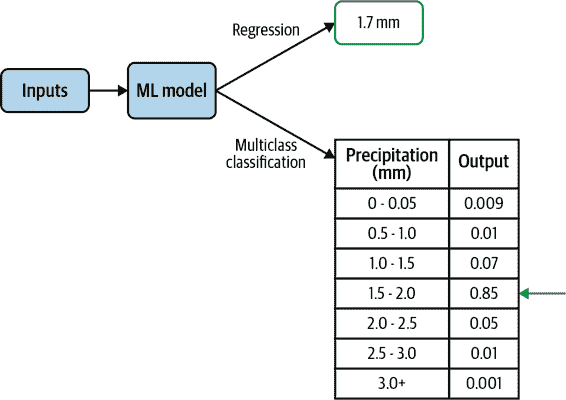

###### 图 3-1。而不是将降水预测为回归输出，我们可以使用多类分类来建模离散概率分布。

这种回归方法和这种重新构思为分类方法都能预测接下来 15 分钟的降雨情况。然而，分类方法允许模型捕捉不同数量降雨的概率分布，而不是必须选择分布的平均值。以这种方式建模分布是有利的，因为降水不展示正态分布的典型钟形曲线，而是遵循[Tweedie 分布](https://oreil.ly/C8JfK)，这种分布允许在零点处有大量数据点。实际上，这是谷歌研究论文中采用的方法，该论文使用 512 种分类分布预测给定位置的降水率。另一个建模分布有利的原因是当分布是双峰时，甚至是当分布是正态分布但方差很大时。最近一篇打破了所有[预测蛋白质折叠结构的基准](https://oreil.ly/-Hi3k)的论文也将氨基酸之间的距离预测为 64 种分类问题，其中距离被分桶为 64 个区间。

另一个重新构思问题的原因是当目标在另一类型的模型中表现更好时。例如，假设我们试图构建一个视频推荐系统。将这个问题自然地框定为分类问题，即预测用户是否可能观看某个视频，可能会导致推荐系统优先考虑点击诱饵。将这个问题重新构思为预测将会观看的视频的分数，可能会更好。

## 为什么有效

改变上下文和重新构思问题的任务可以帮助构建机器学习解决方案。我们不再学习单一实数，而是将预测目标放宽为离散概率分布。由于分桶，我们失去了一些精度，但获得了完整概率密度函数（PDF）的表达能力。分类模型提供的离散预测比更为严格的回归模型更擅长学习复杂的目标。

这种分类框架的另一个优势是我们获得了预测值的后验概率分布，这提供了更细致的信息。例如，假设学习的分布是双峰的。通过将分类建模为离散概率分布，模型能够捕捉到预测的双峰结构，正如图 3-2 所示。相反，如果只预测单个数值，这些信息将会丢失。根据使用情况，这可能会使任务更容易学习并且更加有利。

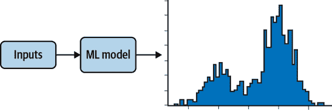

###### 图 3-2\. 将分类任务重新框架为建模概率分布允许预测捕捉双峰输出。预测不限于回归中的单个值。

### 捕捉不确定性

让我们再次看一下出生数据集和预测婴儿体重的任务。由于婴儿体重是一个正实数值，这在直觉上是一个回归问题。然而，请注意，对于给定的输入集合，`weight_pounds`（标签）可以取多种不同的值。我们看到，对于特定的输入值集合（例如，在 38 周时出生的 25 岁母亲的男婴），婴儿体重的分布大致遵循以约 7.5 磅为中心的正态分布。生成图 3-3 中图表的代码可以在此书的[存储库](https://github.com/GoogleCloudPlatform/ml-design-patterns/03_problem_representation/reframing.ipynb)中找到。

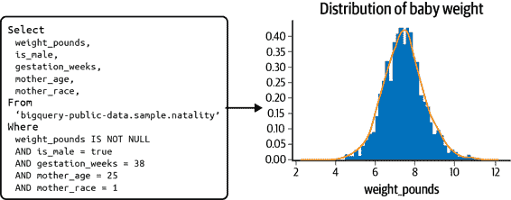

###### 图 3-3\. 对于特定的输入集合（例如，在 38 周时出生的 25 岁母亲的男婴），`weight_pounds`变量会取一系列值，大致遵循以 7.5 磅为中心的正态分布。

但请注意分布的宽度——即使分布的峰值在 7.5 磅，有相当可观的可能性（实际上是 33%）某个婴儿的体重小于 6.5 磅或大于 8.5 磅！这个分布的宽度显示了预测婴儿体重问题中固有的不可减少的误差。事实上，如果我们将其视为回归问题，那么在这个问题上我们可以获得的最佳均方根误差是图 3-3 中所见分布的标准偏差。

如果我们将其视为回归问题，我们必须将预测结果表述为 7.5 +/- 1.0（或者标准偏差是多少）。然而，对于不同的输入组合，这个分布的宽度将有所不同，因此学习这个宽度本身也是另一个机器学习问题。例如，在第 36 周，对于同龄母亲的母婴来说，标准偏差是 1.16 磅。*分位数回归*，稍后在模式讨论中涵盖，试图以非参数化方式做到这一点。

###### 提示

如果分布是多模态的（具有多个峰值），将问题重新定义为分类任务的情况将更为有力。然而，有助于认识到，由于大数定律的存在，只要我们捕捉到所有相关的输入，我们在大型数据集上会遇到的许多分布将是钟形的，尽管其他分布也是可能的。钟形曲线越宽，而在不同输入值处这种宽度变化越大，捕捉不确定性的重要性也越大，这就更加支持将回归问题重新定义为分类问题。

通过重新定义问题，我们训练模型作为一个多类别分类，学习给定训练示例的离散概率分布。这些离散化的预测更灵活，能够捕捉不确定性，并且比回归模型更能逼近复杂的目标。在推理时，模型预测与这些潜在输出相对应的一系列概率。也就是说，我们获得了一个离散的概率分布，给出了任何特定权重的相对可能性。当然，在这里需要注意——分类模型可能会出现严重的不校准（例如模型过于自信而错误）。

### 改变目标

在某些场景中，将分类任务重新定义为回归任务可能会有益。例如，假设我们有一个大型电影数据库，其中包含用户对所有观看并评价的电影的评分（评分从 1 到 5）。我们的任务是构建一个机器学习模型，用于为用户提供推荐。

如果将其视为分类任务，我们可以考虑构建一个模型，该模型以`user_id`及其用户先前观看的视频和评分作为输入，并预测从我们的数据库中推荐哪部电影。然而，我们也可以将这个问题重新构造为回归问题。模型不再具有与数据库中电影对应的分类输出，而是可以进行多任务学习，模型学习用户可能观看给定电影的若干关键特征（如收入、客户段等）。

将其重新构造为回归任务，模型现在预测给定电影的用户空间表示。为了提供推荐，我们选择那些与用户已知特征最接近的电影集合。通过这种方式，与分类任务中模型提供用户可能会喜欢某部电影的概率不同，我们将得到一组被这类用户观看过的电影。

通过将推荐电影的分类问题重新定义为用户特征的回归问题，我们能够轻松地调整我们的推荐模型，以推荐流行视频、经典电影或纪录片，而无需每次训练一个单独的分类模型。

当数值表示具有直观解释时，这种模型方法也非常有用；例如，经度和纬度对可以用来代替对城市地区的预测。假设我们想要预测哪个城市将出现下一次病毒爆发，或者哪个纽约社区将出现房地产价格的激增。预测经度和纬度，然后选择最接近该位置的城市或社区可能比直接预测城市或社区本身更容易。

## 折中和替代方案

很少只有一种方式来构建问题，了解任何实现的折中或替代方案是有帮助的。例如，将回归输出值分桶化是将问题重新构建为分类任务的一种方法。另一种方法是使用多任务学习，将分类和回归任务结合到单个模型中，使用多个预测头部。对于任何重新构建技术，了解数据限制或引入标签偏差的风险是很重要的。

### 分桶化输出

将回归任务重构为分类任务的典型方法是对输出值进行分桶。例如，如果我们的模型用于指示婴儿在出生时可能需要重视护理的时机，表格 3-1 中的类别可能足够了。

Table 3-1\. 婴儿体重的分桶化输出

| 类别 | 描述 |
| --- | --- |
| 高出生体重 | 大于 8.8 磅 |
| 平均出生体重 | 5.5 磅至 8.8 磅之间 |
| 低出生体重 | 3.31 磅至 5.5 磅之间 |
| 非常低出生体重 | 少于 3.31 磅 |

现在我们的回归模型变成了多类分类。直观地说，预测四种可能的分类情况中的一种比预测一个连续的实数值要容易——就像预测二进制的 `is_underweight` 目标 0 或 1 比预测 `高体重` versus `平均体重` versus `低体重` versus `非常低体重` 四种分开的类别要容易一样。通过使用分类输出，我们的模型更少地被激励于接近实际输出值，因为我们本质上已经将输出标签更改为数值范围而不是单个实数。

在本节附带的[笔记本](https://github.com/GoogleCloudPlatform/ml-design-patterns/blob/master/03_problem_representation/reframing.ipynb)，我们训练了回归模型和多类别分类模型。回归模型在验证集上达到了 1.3 的 RMSE，而分类模型的准确率为 67%。由于一个评估指标是 RMSE，另一个是准确率，因此比较这两个模型是困难的。最终，设计决策由使用案例决定。如果医疗决策基于分桶值，则我们的模型应该是使用这些桶的分类模型。然而，如果需要更精确地预测婴儿体重，那么使用回归模型是有意义的。

### 捕捉不确定性的其他方法

在回归中捕获不确定性还有其他方法。一个简单的方法是进行分位数回归。例如，我们可以估计需要预测的条件 10th、20th、30th、…、90th 百分位数，而不是仅预测均值。分位数回归是线性回归的扩展。另一方面，重构可以与更复杂的机器学习模型配合使用。

另一种更复杂的方法是使用像[TensorFlow Probability](https://oreil.ly/AEtLG)这样的框架进行回归。然而，我们必须显式地对输出的分布进行建模。例如，如果预期输出以输入为依赖的均值正态分布，则模型的输出层将是：

```
tfp.layers.DistributionLambda(lambda t: tfd.Normal(loc=t, scale=1))
```

另一方面，如果我们知道方差随着均值增加而增加，我们可能能够使用 lambda 函数对其进行建模。另一方面，重构并不要求我们对后验分布进行建模。

###### 提示

在训练任何机器学习模型时，数据至关重要。通常，更复杂的关系需要更多的训练数据示例来找到这些难以捉摸的模式。考虑到这一点，重要的是要考虑回归或分类模型的数据需求。分类任务的一个常见经验法则是，每个标签类别的模型特征应该有 10 倍的训练数据。对于回归模型，经验法则是模型特征的 50 倍。当然，这些数字只是粗略的启发式，而不是精确的。然而，直觉是回归任务通常需要更多的训练示例。此外，随着任务复杂性的增加，对大量数据的需求也会增加。因此，在考虑使用的模型类型或分类任务中标签类别数量时，应考虑数据限制。

### 预测的精度

当考虑将回归模型重新构建为多类别分类时，输出标签的箱宽度决定了分类模型的精度。在我们的婴儿体重示例中，如果我们需要从离散概率密度函数中获取更精确的信息，则需要增加分类模型的箱数。图 3-4 显示了离散概率分布如何表现为 4 通道或 10 通道分类。

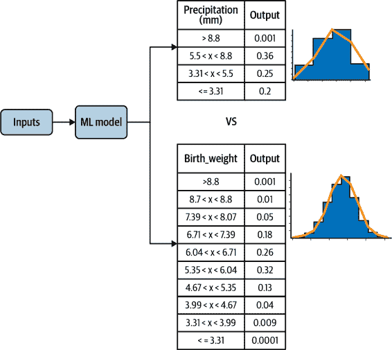

###### 图 3-4\. 多类别分类的精度由标签的分箱宽度控制。

PDF 的尖锐度表示回归任务的精度。更尖锐的 PDF 表示输出分布的标准偏差较小，而更宽的 PDF 表示标准偏差较大，因此具有更多方差。对于非常尖锐的密度函数，最好使用回归模型（见 图 3-5）。

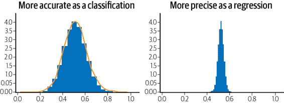

###### 图 3-5\. 回归的精度由概率密度函数在固定输入值集合上的尖锐程度表示。

### 限制预测范围

另一个重新构建问题的原因是限制预测输出范围的必要性。例如，对于回归问题，实际输出值的合理范围为 [3, 20]。如果我们训练一个输出层为线性激活函数的回归模型，模型预测可能会超出此范围。限制输出范围的一种方法是重新构建问题。

使倒数第二层的激活函数为 sigmoid 函数（通常与分类相关联），使其处于区间 [0,1]，并让最后一层将这些值缩放到期望的范围内：

```
MIN_Y =  3
MAX_Y = 20
input_size = 10
inputs = keras.layers.Input(shape=(input_size,))
h1 = keras.layers.Dense(20, 'relu')(inputs)
h2 = keras.layers.Dense(1, 'sigmoid')(h1)  # 0-1 range
output = keras.layers.Lambda(
             lambda y : (y*(MAX_Y-MIN_Y) + MIN_Y))(h2) # scaled
model = keras.Model(inputs, output)
```

我们可以验证（请查看 GitHub 上的 [笔记本](https://github.com/GoogleCloudPlatform/ml-design-patterns/blob/master/03_problem_representation/reframing.ipynb) 获取完整代码），此模型现在输出的数字范围为 [3, 20]。请注意，因为输出是 sigmoid 函数，模型实际上永远不会达到范围的最小值和最大值，只会非常接近。当我们对一些随机数据进行训练时，得到的值在范围 [3.03, 19.99] 内。

### 标签偏差

像矩阵分解这样的推荐系统可以在神经网络的背景下重新构建，可以作为回归或分类的形式。这种背景变化的一个优点是，作为回归或分类模型的神经网络可以整合更多除了仅仅用户和物品嵌入之外的附加特征。因此，这可以是一个吸引人的替代选择。

然而，当重构问题时要考虑目标标签的性质是很重要的。例如，假设我们将我们的推荐模型重构为一个分类任务，预测用户点击某个视频缩略图的可能性。这似乎是一个合理的重构，因为我们的目标是提供用户选择和观看的内容。但要小心。这种标签的变化实际上并不符合我们的预测任务。通过优化用户点击，我们的模型将无意中促进点击诱饵，并不会真正推荐对用户有用的内容。

相反，一个更有利的标签是视频观看时间，将我们的推荐重新构建为一个回归任务。或者也许我们可以修改分类目标，预测用户至少观看视频片段一半的可能性。通常有多种适当的方法，当构建解决方案时综合考虑问题是很重要的。

###### 警告

当改变机器学习模型的标签和训练任务时要小心，因为这可能会无意中引入标签偏差到你的解决方案中。考虑我们在“为什么有效”中讨论的视频推荐示例。

### 多任务学习

重构的另一种选择是多任务学习。不要试图在回归或分类之间选择，两者都做！一般来说，多任务学习是指任何一个优化多个损失函数的机器学习模型。这可以通过许多不同的方式实现，但神经网络中最常见的两种形式是硬参数共享和软参数共享。

参数共享指的是神经网络的参数在不同输出任务之间共享，比如回归和分类。硬参数共享发生在模型的隐藏层在所有输出任务之间共享时。在软参数共享中，每个标签有自己的神经网络和自己的参数，通过某种形式的正则化，不同模型的参数被鼓励保持相似。图 3-6 展示了硬参数共享和软参数共享的典型架构。

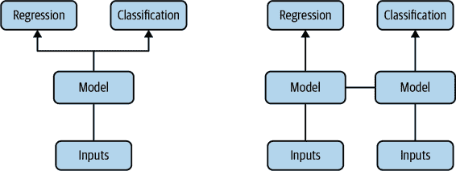

###### 图 3-6\. 多任务学习的两种常见实现方式是硬参数共享和软参数共享。

在这种情况下，我们的模型可以有两个头部：一个用于预测回归输出，另一个用于预测分类输出。例如，[这篇论文](https://oreil.ly/sIjsF)使用分类输出的 softmax 概率训练计算机视觉模型，同时使用回归输出预测边界框。他们表明，这种方法比单独为分类和定位任务训练网络的相关工作表现更好。其核心思想是通过参数共享，同时学习任务，并且两个损失函数的梯度更新会影响两个输出，从而产生更具泛化能力的模型。

# 设计模式 6：多标签

多标签设计模式指的是我们可以为给定的训练样本分配*多个*标签的问题。对于神经网络，这种设计需要改变模型最终输出层中使用的激活函数，并选择我们的应用程序如何解析模型输出。请注意，这与*多类别*分类问题不同，后者是指从许多（> 1）可能的类别中为单个示例分配一个标签。您可能还会听到多标签设计模式称为*多标签，多类别分类*，因为它涉及从多个可能的类别中选择多个标签。在讨论此模式时，我们将主要关注神经网络。

## 问题

通常，模型预测任务涉及为给定的训练示例应用单一分类。此预测是从*N*个可能的类别中确定，其中*N*大于 1。在这种情况下，常见做法是使用 softmax 作为输出层的激活函数。使用 softmax，我们模型的输出是一个 N 元素数组，其中所有值的总和为 1。每个值表示特定训练示例与该索引处类别相关的概率。

例如，如果我们的模型将图像分类为猫、狗或兔子，则给定图像的 softmax 输出可能如下所示：[`.89`, `.02`, `.09`]。这意味着我们的模型预测图像是猫的概率为 89%，是狗的概率为 2%，是兔子的概率为 9%。在这种情况下，每个图像只能有*一个可能的标签*，我们可以使用 argmax（最高概率的索引）来确定模型预测的类别。较少见的场景是每个训练示例可以分配*多个*标签，这正是这种模式要解决的。

多标签设计模式适用于在所有数据模态上训练的模型。对于图像分类，在前述猫、狗、兔子的示例中，我们可以使用每个描绘 *多个* 动物的训练图像，因此可以有多个标签。对于文本模型，我们可以想象几种情况，其中文本可以用多个标签进行标记。以 BigQuery 上的 Stack Overflow 问题数据集为例，我们可以构建一个模型来预测与特定问题相关联的标签。例如，问题“如何绘制 pandas DataFrame？”可以被标记为“Python”、“pandas”和“visualization”。另一个多标签文本分类的例子是识别有毒评论的模型。对于这种模型，我们可能希望标记同时具有多个毒性标签的评论。因此，评论可能被标记为“恶意”和“淫秽”。

这种设计模式也适用于表格数据集。想象一下，一个包含各种患者的健康数据集，如身高、体重、年龄、血压等。这些数据可以用来预测多种病症的存在。例如，一个患者可能显示出患心脏病和糖尿病的风险。

## 解决方案

为了构建能够给定训练示例分配 *多个标签* 的模型解决方案，我们在最终输出层使用 *Sigmoid* 激活函数。与生成所有值总和为 1 的数组（如 Softmax）不同，Sigmoid 数组中的每个 *独立* 值是介于 0 和 1 之间的浮点数。也就是说，在实现多标签设计模式时，我们的标签需要进行多热编码。多热数组的长度对应于模型中类的数量，标签数组中的每个输出将是一个 Sigmoid 值。

延续上面的图像示例，假设我们的训练数据集包含了多种动物的图像。对于包含猫和狗但不包含兔子的图像，其 Sigmoid 输出可能如下所示：[`.92`, `.85`, `.11`]。这个输出意味着模型对图像包含猫的信心为 92%，包含狗的信心为 85%，包含兔子的信心为 11%。

对于具有 28×28 像素图像的模型的一个版本，其 Sigmoid 输出可能如下所示，使用 Keras `Sequential` API：

```
model = keras.Sequential([
    keras.layers.Flatten(input_shape=(28, 28)),
    keras.layers.Dense(128, activation='relu'),
    keras.layers.Dense(3, activation='sigmoid')
])
```

这里 Sigmoid 模型与问题部分的 Softmax 示例之间的主要输出差异在于，Softmax 数组保证包含三个值，其总和为 1，而 Sigmoid 输出将包含三个值，每个值介于 0 和 1 之间。

## 折衷与替代方案

在遵循多标签设计模式和使用 Sigmoid 输出时，有几个特殊情况需要考虑。接下来，我们将探讨如何构建具有两个可能标签类别的模型，如何理解 Sigmoid 结果，以及多标签模型的其他重要考虑因素。

### 两类模型的 Sigmoid 输出

有两种类型的模型，其输出可以属于两种可能的类别：

+   每个训练示例只能分配*一个*类别。这也称为*二元分类*，是一种特殊类型的多类分类问题。

+   一些训练示例可能属于*两种*类别。这是一种*多标签分类*问题。

图 3-8 展示了这些分类之间的区别。

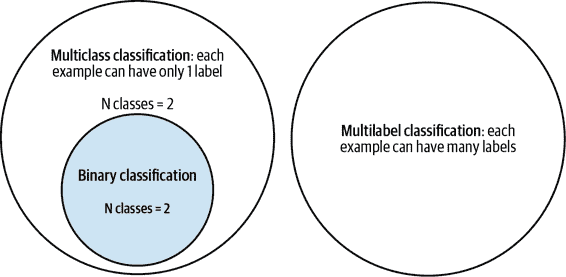

###### 图 3-8\. 理解多类、多标签和二分类问题之间的区别。

第一个案例（二分类）在于它是唯一一个我们会考虑使用 sigmoid 作为激活函数的单标签分类问题。对于几乎任何其他多类分类问题（例如，将文本分类为五个可能的类别之一），我们会使用 softmax。然而，当我们只有两类时，softmax 是多余的。例如，考虑一个模型，预测特定交易是否欺诈。如果我们在这个例子中使用 softmax 输出，那么一个欺诈模型的预测可能会像这样：

```
[.02, .98]

```

在这个例子中，第一个索引对应“非欺诈”，第二个索引对应“欺诈”。这是多余的，因为我们也可以用单一标量值表示，并因此使用 sigmoid 输出。相同的预测可以简单地表示为`.98`。由于每个输入只能分配一个类别，我们可以从`.98`的输出推断出，模型预测欺诈的可能性为 98%，非欺诈的可能性为 2%。

因此，对于二分类模型，使用输出形状为`1`和 sigmoid 激活函数是最优的。具有单个输出节点的模型也更有效率，因为其可训练参数较少，很可能训练速度更快。以下是二分类模型的输出层示意图：

```
keras.layers.Dense(1, activation='sigmoid')
```

对于第二种情况，其中一个训练示例可能属于*两种可能的类别*并且符合多标签设计模式，我们还将使用 sigmoid，这次是具有两个元素的输出：

```
keras.layers.Dense(2, activation='sigmoid')
```

### 我们应该使用哪种损失函数呢？

现在我们知道在模型中何时使用 sigmoid 作为激活函数，接下来应该选择哪种损失函数呢？对于二分类情况，当我们的模型具有单元素输出时，使用二元交叉熵损失函数。在 Keras 中，我们在编译模型时指定损失函数：

```
model.compile(loss='binary_crossentropy', optimizer='adam', 
  metrics=['accuracy'])
```

有趣的是，对于具有 sigmoid 输出的多标签模型，我们也使用二元交叉熵损失。这是因为，如图 3-9 所示，具有三个类别的多标签问题本质上是三个较小的二分类问题。

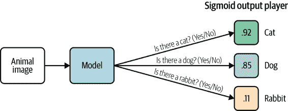

###### 图 3-9。通过将问题分解为较小的二元分类任务来理解多标签模式。

### 解析 sigmoid 结果

要提取具有 softmax 输出模型的预测标签，我们可以简单地取输出数组的 argmax（最高值索引）来获取预测类别。解析 sigmoid 输出则不那么直接。我们不是取预测概率最高的类别，而是需要评估输出层中每个类别的概率，并考虑我们用例的概率*阈值*。这两种选择在很大程度上取决于我们模型的最终用户应用。

###### 注意

通过*阈值*，我们指的是我们对确认输入属于特定类别的概率感到满意的程度。例如，如果我们正在构建一个模型来分类图像中的不同动物类型，即使模型只有 80%的信心图像包含猫，我们可能也会确认图像中有一只猫。另外，如果我们正在构建一个进行医疗预测的模型，我们可能希望在确认特定医疗状况是否存在之前，模型的信心水平接近 99%。虽然对于任何类型的分类模型都需要考虑阈值设定，但它对多标签设计模式尤为重要，因为我们需要为每个类别确定阈值，而这些阈值可能不同。

要查看一个具体的例子，让我们使用 BigQuery 中的 Stack Overflow 数据集构建一个模型，该模型可以根据问题的标题预测与 Stack Overflow 问题相关联的标签。我们将限制我们的数据集仅包含五个标签的问题，以保持简单。

```
SELECT
  title,
  REPLACE(tags, "|", ",") as tags
FROM
  `bigquery-public-data.stackoverflow.posts_questions`
WHERE
  REGEXP_CONTAINS(tags, 
r"(?:keras|tensorflow|matplotlib|pandas|scikit-learn)")
```

我们模型的输出层如下所示（本节的完整代码在[GitHub 代码库](https://github.com/GoogleCloudPlatform/ml-design-patterns/blob/master/03_problem_representation/multilabel.ipynb)中可用）：

```
keras.layers.Dense(5, activation='sigmoid')
```

让我们以 Stack Overflow 的问题*“*什么是不可训练参数的定义？*”*作为输入示例。假设我们的输出索引与查询中标签的顺序相对应，那么该问题的输出可能如下所示：

```
[.95, .83, .02, .08, .65]

```

我们的模型对该问题应该被标记为 Keras 有 95%的信心，应该被标记为 TensorFlow 有 83%的信心。在评估模型预测时，我们需要遍历输出数组中的每个元素，并确定如何向最终用户显示这些结果。如果我们所有标签的阈值是 80%，我们将显示与该问题相关联的`Keras`和`TensorFlow`。或者，也许我们希望鼓励用户尽可能添加更多标签，并且我们希望为任何预测置信度超过 50%的标签显示选项。

对于像这样的示例，主要目标是提出可能的标签建议，而不是强调准确获取标签，一个典型的经验法则是对每个类别使用`n_specific_tag` / `n_total_examples`作为阈值。这里，`n_specific_tag`是数据集中具有一个标签的示例数量（例如，“pandas”），而`n_total_examples`是训练集中所有标签的总样本数。这确保模型比基于训练数据集中标签出现频率来猜测某个标签要好。

###### 提示

对于更精确的阈值处理方法，可以考虑使用 S-Cut 或优化模型的 F-measure。关于这两者的详细信息可以在[这篇论文](https://oreil.ly/oyR57)中找到。调整每个标签的概率通常也很有帮助，特别是在存在成千上万个标签并且想要考虑它们的前 K 个时（这在搜索和排名问题中很常见）。

如你所见，多标签模型在我们解析预测时提供了更大的灵活性，并且需要我们仔细考虑每个类别的输出。

### 数据集考虑事项

在处理单标签分类任务时，我们可以通过确保数据集中每个类别的训练样本数量相对均衡来保持数据集的平衡。构建平衡的数据集对于多标签设计模式来说更加微妙。

以 Stack Overflow 数据集为例，可能会有许多问题同时被标记为`TensorFlow`和`Keras`。但也会有关于 Keras 的问题，与 TensorFlow 无关。同样地，我们可能会看到关于用`matplotlib`和`pandas`标记的数据绘图问题，以及关于数据预处理的问题，同时被标记为`pandas`和`scikit-learn`。为了使我们的模型学习到每个标签的独特内容，我们需要确保训练数据集包含各种标签组合。如果我们的数据集中大多数关于`matplotlib`的问题也同时被标记为`pandas`，那么模型将无法单独学习分类`matplotlib`。为了解决这个问题，考虑我们的模型中可能存在的标签之间的不同关系，并计算属于每个标签重叠组合的训练示例数量。

在探索数据集中标签之间的关系时，我们可能还会遇到层次标签。[ImageNet](https://oreil.ly/0VXtc)，这个流行的图像分类数据集，包含数千个带标签的图像，并且通常作为图像模型迁移学习的起点。ImageNet 中所有的标签都是层次化的，这意味着所有的图像至少有一个标签，而许多图像还具有更具体的层次标签，这些标签构成了一个层次结构。以下是 ImageNet 中一个标签层次结构的示例：

动物 → 无脊椎动物 → 节肢动物 → 蜘蛛 → 蜘蛛

根据数据集的大小和特性，处理层次标签通常有两种常见方法：

+   使用扁平方法，并将每个“叶节点”标签放入相同的输出数组中，确保每个标签都有足够的示例。

+   使用级联设计模式。构建一个模型来识别高级标签。根据高级分类，将示例发送到另一个模型进行更具体的分类任务。例如，我们可能有一个初始模型，将图像标记为“植物”、“动物”或“人物”。根据第一个模型应用的标签，将图像发送到不同的模型来应用更细粒度的标签，如“多肉植物”或“巴巴里狮”。

与级联设计模式相比，扁平方法更为直接，因为它只需要一个模型。然而，这可能会导致模型丢失有关更详细标签类的信息，因为我们的数据集中自然会有更多具有高级标签的训练示例。

### 具有重叠标签的输入

多标签设计模式在输入数据偶尔具有重叠标签的情况下也非常有用。举个例子，我们拿服装分类目录的图像模型来说。如果我们训练数据集中的每个图像都有多个人标记，一个标注者可能会将一张裙子的图像标记为“长裙”，而另一个标记为“褶皱裙”。这两种标记都是正确的。然而，如果我们在这些数据上构建一个多类别分类模型，将具有不同标签的同一图像多次输入，当进行预测时可能会遇到模型在标记相似图像时产生不同预测的情况。理想情况下，我们希望模型像在图 3-10 中看到的那样，将这张图像标记为“长裙”和“褶皱裙”，而不是仅预测其中一种标签。

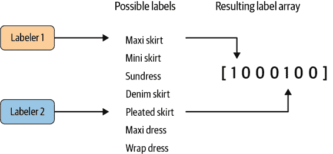

###### 图 3-10\. 使用多个标注者的输入创建重叠标签，以处理多个对同一项的描述都正确的情况。

多标签设计模式通过允许我们将重叠标签与图像关联来解决这个问题。在具有多个标签器评估训练数据集中每个图像的重叠标签的情况下，我们可以选择我们希望标签器为给定图像分配的最大标签数，然后在训练期间选择最常选择的标签与图像关联。对于“最常选择的标签”，阈值将取决于我们的预测任务和我们有多少人类标签器。例如，如果我们有 5 个标签器评估每个图像，并且每个图像有 20 个可能的标签，我们可能鼓励标签器为每个图像提供 3 个标签。从每个图像的这 15 个标签“投票”列表中，我们可以选择具有最多投票的 2 到 3 个标签。在评估此模型时，我们需要注意模型对每个标签返回的平均预测置信度，并使用这些数据迭代地改进我们的数据集和标签质量。

### 一对多

处理多标签分类的另一种技术是训练多个二元分类器而不是一个多标签模型。这种方法称为*一对多*。在 Stack Overflow 示例中，我们想要将问题标记为 TensorFlow、Python 和 pandas 时，我们会为这三个标签分别训练一个单独的分类器：Python 或非 Python，TensorFlow 或非 TensorFlow 等。然后，我们会选择一个置信度阈值，并使用每个二元分类器在某个阈值以上标记原始输入问题的标签。

一对多的好处在于我们可以将其与只能进行二元分类的模型架构（如 SVM）一起使用。它也可能有助于处理罕见的类别，因为模型每次只对每个输入执行一个分类任务，可以应用重新平衡设计模式。这种方法的缺点在于训练许多不同分类器增加了复杂性，需要我们构建应用程序以一种生成来自每个模型的预测的方式，而不是只有一个模型。

总之，在您的数据属于以下任何分类场景时，请使用多标签设计模式：

+   单个训练示例可以与互斥标签相关联。

+   单个训练示例可以具有许多层次标签。

+   标签器以不同方式描述同一项，并且每种解释都是准确的。

当实现多标签模型时，请确保您的数据集中充分代表了重叠标签的组合，并考虑您在模型中愿意接受的每个可能标签的阈值值。使用 sigmoid 输出层是构建能够处理多标签分类的模型的最常见方法。此外，sigmoid 输出也可以应用于只能有两种可能标签之一的二元分类任务。

# 设计模式 7：集成

集成设计模式指的是机器学习中的一种技术，它结合多个机器学习模型并聚合它们的结果来进行预测。集成可以有效提高性能，产生比任何单一模型更好的预测结果。

## 问题

假设我们已经训练了我们的婴儿体重预测模型，工程师设计了特殊特征并添加了额外的神经网络层，以使训练集上的错误几乎为零。太棒了，你说！然而，当我们试图在医院生产环境中使用我们的模型或评估保留测试集的性能时，我们的预测全都错了。发生了什么？更重要的是，我们如何修复它？

没有机器学习模型是完美的。为了更好地理解我们的模型错在哪里以及如何修复，一个 ML 模型的错误可以分解为三个部分：不可减少的错误、由于偏差而引起的错误以及由于方差而引起的错误。不可减少的错误是模型固有的错误，由数据集中的噪声、问题的框架或糟糕的训练示例（如测量错误或混淆因素）引起。正如其名，我们对*不可减少的错误*无能为力。

另外两个，偏差和方差，被称为*可减少的错误*，这里是我们可以影响模型性能的地方。简而言之，偏差是模型在模型特征和标签之间学习不足的能力，而方差捕捉模型在新的、未见的示例上泛化能力不足的问题。高偏差的模型过度简化了关系，被称为*欠拟合*。高方差的模型对训练数据学习过多，被称为*过拟合*。当然，任何 ML 模型的目标是既低偏差又低方差，但在实践中，同时实现这两个是困难的。这被称为偏差-方差权衡。我们不能两全其美。例如，增加模型复杂性会降低偏差但增加方差，而减少模型复杂性会降低方差但引入更多偏差。

[最近的研究工作](https://oreil.ly/PxUvs)表明，当使用现代机器学习技术，如具有高容量的大型神经网络时，这种行为只在某个阈值之内有效。在观察的实验中，存在一个“插值阈值”，超过这个阈值，非常高容量的模型能够在训练错误为零的同时，在未见数据上达到低错误率。当然，我们需要更大的数据集来避免在高容量模型上过拟合。

是否有办法在小规模和中等规模问题上减轻这种偏差-方差权衡呢？

## 解决方案

*集成方法* 是一种元算法，它将多个机器学习模型结合起来，以减少偏差和/或方差，并提高模型性能。一般来说，这种方法的思想是通过结合多个模型来改善机器学习结果。通过构建具有不同归纳偏差的多个模型并聚合它们的输出，我们希望得到性能更好的模型。在本节中，我们将讨论一些常用的集成方法，包括 Bagging、Boosting 和 Stacking。

### Bagging

Bagging（即自助聚合）是一种并行集成方法，用于解决机器学习模型中的高方差问题。Bagging 中的自助部分指的是用于训练集成成员的数据集。具体来说，如果有 *k* 个子模型，则使用 *k* 个单独的数据集来训练集成的每个子模型。每个数据集通过从原始训练数据集中随机抽样（有放回地）构建而成。这意味着 *k* 个数据集中有很高的概率会缺少一些训练样本，但也可能会有重复的训练样本。聚合操作在多个集成模型成员的输出上进行——在回归任务中通常是平均值，在分类任务中通常是多数投票。

一个很好的 Bagging 集成方法的例子是随机森林：多个决策树在整个训练数据的随机抽样子集上进行训练，然后聚合树的预测结果以生成预测，如在图 3-11 中所示。

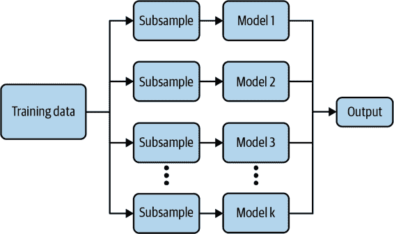

###### 图 3-11\. Bagging 对于减少机器学习模型输出的方差非常有效。

流行的机器学习库中都有 Bagging 方法的实现。例如，在 scikit-learn 中实现随机森林回归，以预测我们的出生数据集中婴儿的体重：

```
from sklearn.ensemble import RandomForestRegressor

# Create the model with 50 trees
RF_model = RandomForestRegressor(`n_estimators``=``50``,`
                                 max_features='sqrt',
                                 n_jobs=-1, verbose = 1)

# Fit on training data
RF_model.fit(X_train, Y_train)
```

在 Bagging 中看到的模型平均化是一种强大且可靠的降低模型方差的方法。正如我们将看到的，不同的集成方法以不同的方式结合多个子模型，有时使用不同的模型、不同的算法或甚至不同的目标函数。在 Bagging 中，模型和算法都是相同的。例如，在随机森林中，子模型都是短决策树。

### Boosting

提升是另一种集成技术。但与装袋不同的是，提升最终构建一个具有 *更多* 容量的集成模型，而不是单个成员模型。因此，提升提供了比方差更有效的减少偏差的手段。提升背后的思想是迭代地构建一个模型集合，每个后续模型专注于学习上一个模型错误的示例。简而言之，提升通过迭代改进一系列弱学习器的加权平均值，最终产生一个强学习器。

在提升过程开始时，选择一个简单的基础模型 `f_0`。对于回归任务，基础模型可以只是目标值的平均值：`f_0 = np.mean(Y_train)`。在第一次迭代步骤中，测量并通过一个独立模型近似残差 `delta_1`。这个残差模型可以是任何模型，但通常不是非常复杂；我们通常会使用一个弱学习器，比如决策树。残差模型提供的近似值然后添加到当前预测中，并且该过程继续。

经过多次迭代后，残差趋近于零，并且预测在建模原始训练数据集时变得越来越好。请注意，在 图 3-12 中，数据集每个元素的残差随着每次迭代逐渐减小。

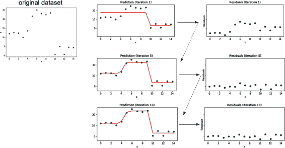

###### 图 3-12\. 提升通过迭代改进模型预测将弱学习器转化为强学习器。

一些知名的提升算法包括 AdaBoost、Gradient Boosting Machines 和 XGBoost，在流行的机器学习框架如 scikit-learn 或 TensorFlow 中都有易于使用的实现。

在 scikit-learn 中的实现也很简单：

```
from sklearn.ensemble import GradientBoostingRegressor

# Create the Gradient Boosting regressor
GB_model = GradientBoostingRegressor(n_estimators=1,
                                     max_depth=1,
                                     learning_rate=1,
                                     criterion='mse')

# Fit on training data
GB_model.fit(X_train, Y_train)
```

### 堆叠

堆叠是一种集成方法，它结合了一系列模型的输出来进行预测。初始模型通常是不同类型的模型，并在完整的训练数据集上进行训练。然后，使用初始模型输出作为特征训练一个次级元模型。这第二个元模型学习如何最佳地组合初始模型的输出以减少训练误差，并且可以是任何类型的机器学习模型。

要实施堆叠集成，我们首先在训练数据集上训练集合中的所有成员。以下代码调用一个函数 `fit_model`，该函数接受模型和训练数据集输入 `X_train` 和标签 `Y_train` 作为参数。这样 *members* 是一个包含我们集合中所有训练过的模型的列表。这个示例的完整代码可以在本书的代码 [存储库](https://github.com/GoogleCloudPlatform/ml-design-patterns/blob/master/03_prob%E2%81%A0lem_representation/ensemble_methods.ipynb) 中找到。

```
members = [model_1, model_2, model_3]

# fit and save models
n_members = len(members)

for i in range(n_members):
    # fit model
    model = fit_model(members[i])
    # save model
    filename = 'models/model_' + str(i + 1) + '.h5'
    model.save(filename, save_format='tf')
    print('Saved {}\n'.format(filename))
```

这些子模型被整合到一个更大的堆叠集成模型中作为单独的输入。由于这些输入模型是与次要集成模型一起训练的，我们对这些输入模型的权重进行了固定。可以通过将 `layer.trainable` 设置为 `False` 来实现这一点，用于集成成员模型：

```
for i in range(n_members):
    model = members[i]
    for layer in model.layers:
        # make not trainable
        layer.trainable = False
        # rename to avoid 'unique layer name' issue
        layer._name = 'ensemble_' + str(i+1) + '_' + layer.name
```

我们使用 Keras 函数式 API 创建集成模型，将组件连接在一起：

```
member_inputs = [model.input for model in members]

# concatenate merge output from each model
member_outputs = [model.output for model in members]
merge = layers.concatenate(member_outputs)
hidden = layers.Dense(10, activation='relu')(merge)
ensemble_output = layers.Dense(1, activation='relu')(hidden)
ensemble_model = Model(inputs=member_inputs, outputs=ensemble_output)

# plot graph of ensemble
tf.keras.utils.plot_model(ensemble_model, show_shapes=True, 
                          to_file='ensemble_graph.png')

# compile
ensemble_model.compile(loss='mse', optimizer='adam', metrics=['mse'])
```

在这个例子中，次要模型是一个具有两个隐藏层的密集神经网络。通过训练，这个网络学习如何在进行预测时最好地结合集成成员的结果。

## 为什么有效

像 Bagging 这样的模型平均方法之所以有效，是因为通常组成集成模型的单个模型在测试集上不会都产生相同的误差。在理想情况下，每个单独的模型都会有一定随机的偏差，因此当它们的结果被平均时，随机误差会相互抵消，预测结果更接近正确答案。简而言之，众人的智慧。

Boosting 之所以有效，是因为模型会根据每个迭代步骤的残差而越来越严厉地受到惩罚。随着每次迭代，集成模型被鼓励在预测那些难以预测的示例时变得越来越好。堆叠之所以有效，是因为它结合了 Bagging 和 Boosting 的优点。次要模型可以被看作是模型平均的更复杂版本。

### Bagging

更确切地说，假设我们已经训练了 *k* 个神经网络回归模型，并对它们的结果进行平均以创建一个集成模型。如果每个模型在每个示例上的误差为 `error_i`，其中 `error_i` 是从方差 `var` 和协方差 `cov` 的零均值多变量正态分布中抽取的，则集成预测器将具有以下误差：

```
ensemble_error = 1./k * np.sum([error_1, error_2,...,error_k])
```

如果误差 `error_i` 完全相关，使得 `cov = var`，则集成模型的均方误差减少到 `var`。在这种情况下，模型平均根本没有帮助。另一极端是，如果误差 `error_i` 完全不相关，则 `cov = 0`，集成模型的均方误差为 `var/k`。因此，预期的平方误差随着集成中模型数 *k* 的增加而线性减少。¹ 总之，平均而言，集成的表现至少与集成中的任何单个模型一样好。此外，如果集成中的模型产生独立的误差（例如，`cov = 0`），那么集成的性能将显著提高。归根结底，集成成功的关键在于模型的多样性。

这也解释了为什么对于稳定性较强的学习器如 k 最近邻（kNN）、朴素贝叶斯、线性模型或支持向量机（SVM），装袋通常效果较差，因为通过自助法抽样减少了训练集的大小。即使使用相同的训练数据，神经网络也能通过随机权重初始化、随机小批量选择或不同的超参数达到各种解决方案，创建部分独立误差的模型。因此，即使是在相同数据集上训练的神经网络，模型平均也能够带来好处。实际上，修复神经网络高方差的一个推荐解决方案是训练多个模型并聚合它们的预测。

### Boosting

提升算法通过迭代改进模型以减少预测误差。每个新的弱学习器通过建模每一步的残差`delta_i`来纠正上一个预测的错误。最终预测是基础学习器和每个后续弱学习器输出之和，如 Figure 3-13 所示。

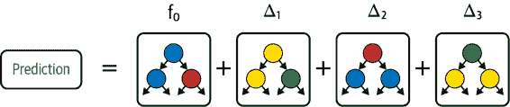

###### Figure 3-13\. Boosting 通过一系列模型化上一次迭代残差误差的弱学习器来逐步构建强学习器。

因此，结果集成模型变得越来越复杂，具有比其任何一个成员更多的容量。这也解释了为什么提升特别适用于对抗高偏差。记住，偏差与模型倾向于欠拟合有关。通过迭代地关注难以预测的例子，提升有效地减少了生成模型的偏差。

### Stacking

Stacking 可以被看作是简单模型平均的扩展，我们在训练数据集上完全训练*k*个模型，然后平均结果以确定预测。简单模型平均类似于装袋，但集成中的模型可以是不同类型的，而对于装袋来说，模型是相同类型的。更一般地，我们可以修改平均步骤以进行加权平均，例如，在我们的集成中给一个模型更多的权重，如 Figure 3-14 所示。

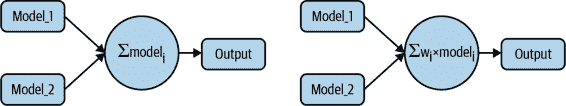

###### Figure 3-14\. 最简单的模型平均将两个或更多不同的机器学习模型的输出进行平均。或者，平均值可以用基于模型相对精度的加权平均替换。

您可以将堆叠视为模型平均的更高级版本，其中我们不是取平均或加权平均，而是训练第二个机器学习模型来学习如何最好地组合我们集成模型中的结果以生成预测，如图 3-15 所示。这不仅提供了减少方差的所有好处，就像装袋技术一样，还控制了高偏差。

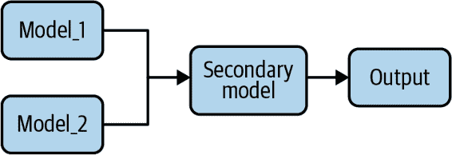

###### 图 3-15\. 堆叠是一种集成学习技术，将几个不同的 ML 模型的输出作为二级 ML 模型的输入，该模型进行预测。

## 折衷和替代方案

集成方法在现代机器学习中变得非常流行，并在赢得众所周知的挑战中发挥了重要作用，也许最为著名的是[Netflix Prize](https://oreil.ly/ybZ28)。有大量的理论证据支持这些在真实世界挑战中展示的成功。

### 增加的训练和设计时间

集成学习的一个缺点是增加了训练和设计时间。例如，对于堆叠集成模型，选择集成成员模型可能需要自己的专业知识，并提出了自己的问题：是重新使用相同的架构还是鼓励多样性？如果我们使用不同的架构，应该选择哪些？以及数量是多少？不是开发单个 ML 模型（这本身可能就是很大的工作！），而是现在开发*k*个模型。我们在模型开发中引入了额外的开销，更不用说如果集成模型投入生产，维护、推理复杂性和资源使用问题了。随着集成模型中模型数量的增加，这很快可能变得不切实际。

流行的机器学习库，如 scikit-learn 和 TensorFlow，为许多常见的装袋和提升方法（如随机森林、AdaBoost、梯度提升和 XGBoost）提供了易于使用的实现。然而，我们应该仔细考虑是否值得使用集成方法所带来的额外开销。始终将准确性和资源使用与线性或 DNN 模型进行比较。请注意，蒸馏（参见“设计模式 11：有用的过拟合”）神经网络的集成通常可以减少复杂性并提高性能。

### 退火作为装袋

像 dropout 这样的技术提供了一个强大且有效的替代方案。Dropout 被称为深度学习中的一种正则化技术，但也可以理解为对 bagging 的一种近似。在神经网络中，dropout 会随机（以预定的概率）在每个训练小批量中“关闭”网络的神经元，本质上评估了指数级许多神经网络的袋装集成。尽管如此，使用 dropout 训练神经网络并不完全等同于 bagging。有两个显著的不同点。首先，在 bagging 的情况下，模型是独立的，而使用 dropout 训练时，模型共享参数。其次，在 bagging 中，模型被训练以收敛于各自的训练集。然而，在使用 dropout 训练时，集成成员模型只会在单个训练步骤中进行训练，因为在训练循环的每次迭代中会有不同的节点被丢弃。

### 降低模型的可解释性

另一个需要记住的点是模型的可解释性。在深度学习中，有效解释为什么我们的模型做出它所做的预测可能会很困难。这个问题在集成模型中更加严重。例如，考虑决策树与随机森林。决策树最终学习每个特征的边界值，指导单个实例到模型的最终预测。因此，解释决策树为何做出其预测是很容易的。而随机森林作为许多决策树的集成，失去了这种局部可解释性。

### 选择适合问题的正确工具

同样重要的是要牢记偏差和方差的权衡。一些集成技术比其他技术更擅长解决偏差或方差问题（见表格 3-2）。特别是，boosting 适用于解决高偏差问题，而 bagging 则用于修正高方差问题。尽管如此，正如我们在“Bagging”章节中看到的，组合两个具有高度相关错误的模型不会帮助降低方差。简而言之，对于我们的问题使用错误的集成方法不一定会改善性能；它只会增加不必要的开销。

表格 3-2. 偏差和方差之间的权衡总结

| 问题 | 集成解决方案 |
| --- | --- |
| 高偏差（欠拟合） | Boosting |
| 高方差（过拟合） | Bagging |

### 其他集成方法

我们已经讨论了一些常见的集成技术在机器学习中。之前讨论的列表绝非详尽无遗，这些广义分类下还有许多适合的算法。还有其他集成技术，包括一些结合贝叶斯方法或者结合神经架构搜索和强化学习的技术，比如谷歌的 AdaNet 或者 AutoML 技术。简而言之，集成设计模式涵盖了多种结合多个机器学习模型以提升整体模型性能的技术，特别适用于解决常见的训练问题，比如高偏差或高方差。

# 设计模式 8：级联

级联设计模式解决了机器学习问题可以有利地分解成一系列机器学习问题的情况。这种级联往往需要仔细设计机器学习实验。

## 问题

如果我们需要在正常活动和异常活动期间预测值，会发生什么？模型会学会忽略异常活动，因为它很少见。如果异常活动也与异常值相关联，则可训练性会受到影响。

例如，假设我们试图训练一个模型来预测顾客退货的可能性。如果我们只训练一个模型，经销商的退货行为将会被忽略，因为有数百万的零售买家（和零售交易），而只有几千个经销商。在购买时，我们不知道这是零售买家还是经销商。然而，通过监控其他市场，我们已经确定了我们销售的物品后续是否被转售，因此我们的训练数据集有一个标签，标识了由经销商购买的物品。

解决这个问题的一种方法是在训练模型时加大经销商实例的权重。这是次优的，因为我们需要尽可能准确地获取更常见的零售买家用例。我们不希望为了提高经销商用例的准确性而牺牲零售买家用例的准确性。然而，零售买家和经销商的行为非常不同；例如，零售买家在一周左右内退货，而经销商只有在无法销售时才退货，因此退货可能在数月后发生。从零售买家和经销商的角度来看，库存管理的业务决策是不同的。因此，有必要尽可能准确地获取这两种类型的退货。简单地加大经销商实例的权重是行不通的。

解决这个问题的一个直观方法是使用级联设计模式。我们将问题分解为四个部分：

1.  预测特定交易是否由经销商进行

1.  训练一个模型以销售给零售买家

1.  训练第二个模型以销售给经销商

1.  在生产中，结合三个独立模型的输出来预测每个购买物品的退货可能性和交易可能由转售商进行的概率

这允许在可能返回不同决策的项目上取得不同的决定，这取决于买家类型，并确保步骤 2 和步骤 3 模型在其训练数据段上尽可能准确。每个模型相对容易训练。第一个仅仅是一个分类器，如果异常活动非常罕见，我们可以使用重新平衡模式来处理。接下来的两个模型本质上是在不同训练数据段上训练的分类模型。该组合是确定性的，因为我们根据活动是否属于转售商选择运行哪个模型。

问题出现在预测过程中。在预测时，我们没有真实标签，只有第一个分类模型的输出。基于第一个模型的输出，我们将不得不确定调用哪个销售模型。问题在于我们在标签上训练，但在推断时，我们必须根据预测做出决策。而预测存在误差。因此，第二个和第三个模型将需要对它们可能在训练期间从未见过的数据进行预测。

举个极端的例子，假设转售商提供的地址总是在城市的工业区域，而零售买家可以住在任何地方。如果第一个（分类）模型出错，并且错误地将零售买家识别为转售商，那么调用的取消预测模型将不会在其词汇表中包含客户居住的邻域。

我们如何训练级联模型，其中一个模型的输出是后续模型的输入或决定后续模型的选择？

## 解决方案

任何一个机器学习问题，其中一个模型的输出是后续模型的输入或决定后续模型的选择，被称为*级联*。在训练级联机器学习模型时必须特别小心。

例如，有时涉及异常情况的机器学习问题可以通过将其视为四个机器学习问题的级联来解决：

1.  用于识别情况的分类模型

1.  一个在异常情况下训练的模型

1.  一个在典型情况下训练的独立模型

1.  一个模型来组合两个独立模型的输出，因为输出是两个输出的概率组合

乍看之下，这似乎是集成设计模式的一个特例，但由于进行级联时需要的特殊实验设计，它被单独考虑。

例如，假设为了估算在车站储存自行车的成本，我们希望预测旧金山租赁和返回站点之间的距离。换句话说，模型的目标是预测我们需要将自行车运回租赁地点的距离，给定特征，例如租赁开始的时间、租赁自行车的地点、租客是否为订阅者等。问题在于超过四小时的租赁涉及的租客行为与较短租赁大不相同，而库存算法需要两个输出（租赁超过四小时的概率和需要运输自行车的预计距离）。然而，只有极小一部分租赁涉及这样的异常行程。

解决这个问题的一种方法是首先训练一个分类模型来根据租赁是否为长期或典型进行分类（这本书的代码库中有[完整代码](https://github.com/GoogleCloudPlatform/ml-design-patterns/blob/master/03_problem_representation/cascade.ipynb)）：

```
        CREATE OR REPLACE MODEL mlpatterns.classify_trips
        TRANSFORM(
          trip_type,
          EXTRACT (HOUR FROM start_date) AS start_hour,
          EXTRACT (DAYOFWEEK FROM start_date) AS day_of_week,
          start_station_name,
          subscriber_type,
          ...
        )
        OPTIONS(model_type='logistic_reg', 
                auto_class_weights=True,
                input_label_cols=['trip_type']) AS

        SELECT
          start_date, start_station_name, subscriber_type, ...
          IF(duration_sec > 3600*4, `'Long'``,` `'Typical'`) AS trip_type
        FROM `bigquery-public-data.san_francisco_bikeshare.bikeshare_trips`
```

简单地根据租赁的实际持续时间将训练数据集分为两部分，然后分别训练下两个模型（一个针对长租赁，另一个针对典型租赁）可能是很诱人的。问题在于前面讨论的分类模型会有误差。实际上，在旧金山自行车数据的保留部分上评估模型表明，模型的准确率仅约为 75%（见图 3-16）。鉴于此，将模型训练在数据的完美分割将导致泪水。

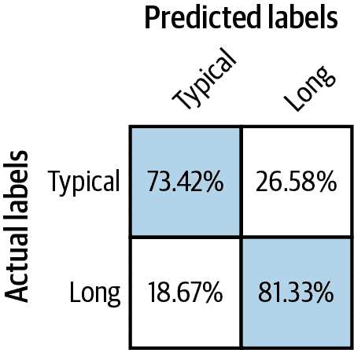

###### 图 3-16。用于预测非典型行为的分类模型的准确率不太可能达到 100%。

然后，在训练完这个分类模型后，我们需要使用该模型的预测来创建下一个模型的训练数据集。例如，我们可以使用以下方式创建用于预测典型租赁距离的模型的训练数据集：

```
        CREATE OR REPLACE TABLE mlpatterns.`Typical_trips` AS
        SELECT 
          * EXCEPT(predicted_trip_type_probs, predicted_trip_type)
        FROM
        ML.PREDICT(MODEL mlpatterns.classify_trips,
          (SELECT
          start_date, start_station_name, subscriber_type, ...,
          ST_Distance(start_station_geom, end_station_geom) AS distance
          FROM `bigquery-public-data.san_francisco_bikeshare.bikeshare_trips`)
        )
        WHERE predicted_trip_type = 'Typical' AND distance IS NOT NULL
```

然后，我们应该使用这个数据集来训练预测距离的模型：

```
        CREATE OR REPLACE MODEL mlpatterns.predict_distance_Typical
        TRANSFORM(
          distance,
          EXTRACT (HOUR FROM start_date) AS start_hour,
          EXTRACT (DAYOFWEEK FROM start_date) AS day_of_week,
          start_station_name,
          subscriber_type,
          ...
        )
        OPTIONS(model_type='linear_reg', input_label_cols=['distance']) AS

        SELECT
          *
        `FROM` 
          mlpatterns.Typical_trips
```

最后，我们的评估、预测等都应考虑到，我们需要使用三个经过训练的模型，而不仅仅是一个。这就是我们所称的级联设计模式。

在实践中，保持级联工作流的清晰度可能变得困难。与单独训练模型相比，最好使用工作流程管道模式自动化整个工作流程（如第六章所示），如图 3-17。关键是确保每次运行实验时，基于上游模型的预测创建两个下游模型的训练数据集。

尽管我们介绍级联模式作为在通常和不寻常活动期间预测值的一种方式，但级联模式的解决方案能够处理更一般的情况。管道框架使我们能够处理任何可以将机器学习问题有利地分解为一系列（或级联）机器学习问题的情况。每当一个机器学习模型的输出需要作为另一个模型的输入时，第二个模型需要根据第一个模型的预测进行训练。在所有这些情况下，正式的管道实验框架将会很有帮助。

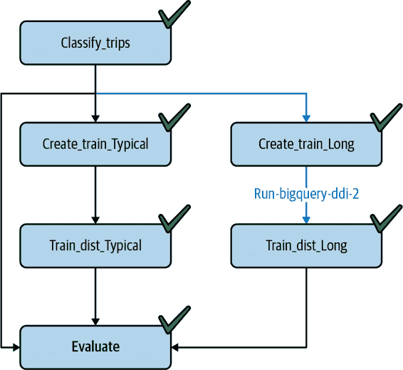

###### 图 3-17\. 一个将级联模型作为单个作业进行训练的管道。

Kubeflow Pipelines 提供了这样一个框架。由于它与容器一起工作，底层的机器学习模型和粘合代码可以用几乎任何编程或脚本语言编写。在这里，我们将上述的 BigQuery SQL 模型封装成 Python 函数，使用 BigQuery 客户端库。我们可以使用 TensorFlow 或 scikit-learn，甚至 R 来实现各个组件。

使用 Kubeflow Pipelines 的管道代码可以简单地表达如下（本书的[完整代码](https://github.com/GoogleCloudPlatform/ml-design-patterns/blob/master/03_problem_representation/cascade.ipynb)可以在代码存储库中找到）：

```
@dsl.pipeline(
    name='Cascade pipeline on SF bikeshare',
    description='Cascade pipeline on SF bikeshare'
)
def cascade_pipeline(
    project_id = PROJECT_ID
):
    ddlop = comp.func_to_container_op(run_bigquery_ddl, 
                    packages_to_install=['google-cloud-bigquery'])

    c1 = train_classification_model(ddlop, PROJECT_ID)
    c1_model_name = c1.outputs['created_table']

    c2a_input = create_training_data(ddlop, 
                   PROJECT_ID, c1_model_name, 'Typical')
    c2b_input = create_training_data(ddlop, 
                   PROJECT_ID, c1_model_name, 'Long')

    c3a_model = train_distance_model(ddlop, 
                   PROJECT_ID, c2a_input.outputs['created_table'], 'Typical')
    c3b_model = train_distance_model(ddlop, 
                   PROJECT_ID, c2b_input.outputs['created_table'], 'Long')

    ...
```

整个管道可以提交运行，并可以使用 Pipelines 框架跟踪实验的不同运行。

###### 提示

如果我们正在使用 TFX 作为我们的管道框架（我们可以在 Kubeflow Pipelines 上运行 TFX），那么没有必要部署上游模型以使用它们的输出预测在下游模型中。相反，我们可以在预处理操作中使用 TensorFlow Transform 方法 `tft.apply_saved_model`。转换设计模式在第六章中有所讨论。

强烈建议在我们将会有串联的机器学习模型时使用管道实验框架。这样的框架将确保在上游模型修订时重新训练下游模型，并且我们有所有先前训练运行的历史记录。

## 折衷与替代方案

不要过度使用级联设计模式——与本书涵盖的许多设计模式不同，级联模式不一定是最佳实践。它会给你的机器学习工作流程增加相当多的复杂性，实际上可能导致性能下降。请注意，管道实验框架绝对是最佳实践，但尽可能地，尝试将管道限制在单个机器学习问题上（摄取、预处理、数据验证、转换、训练、评估和部署）。避免像级联模式中那样，在同一个管道中包含多个机器学习模型。

### 确定性输入

在大多数情况下，将机器学习问题拆分通常是一个不好的主意，因为机器学习模型可以/应该学习多个因素的组合。例如：

+   如果一个条件可以从输入中确定地知道（假期购物与工作日购物），我们应该将该条件作为模型的另一个输入添加进去。

+   如果条件涉及仅一个输入的极值（一些居住在附近与远处的客户，其中“附近/远处”的含义需要从数据中学习），我们可以使用混合输入表示来处理它。

级联设计模式解决了一个不寻常的场景，其中我们没有分类输入，而且需要从多个输入中学习极值。

### 单一模型

在常见情况下不应使用级联设计模式，适用单一模型即可。例如，假设我们正在尝试学习客户的购买倾向。我们可能认为我们需要为那些进行比较购物和不进行比较购物的人学习不同的模型。我们真的不知道谁进行了比较购物，但我们可以根据访问次数、商品在购物车中停留的时间等进行合理猜测。这个问题不需要级联设计模式，因为它足够常见（大部分客户都会进行比较购物），机器学习模型应该能在训练过程中隐式地学习到它。对于常见情况，只需训练一个单一模型。

### 内部一致性

当我们需要在多个模型的预测之间保持内部一致性时，需要级联。请注意，我们试图做的不仅仅是预测不寻常的活动。我们正在尝试预测回报，考虑到还会有一些转售活动。如果任务仅仅是预测销售是否由转售商进行，我们将使用再平衡模式。使用级联的原因是，不平衡的标签输出需要作为后续模型的输入，并且本身也很有用。

同样地，假设我们训练模型来预测客户购买的倾向是为了提供折扣优惠。我们是否提供折扣优惠，以及优惠的金额，很大程度上会取决于这位客户是否进行比较购物。鉴于此，我们需要在两个模型之间保持内部一致性（用于比较购物者和购买倾向的模型）。在这种情况下，可能需要级联设计模式。

### 预训练模型

当我们希望重用预训练模型的输出作为我们模型的输入时，级联也是必需的。例如，假设我们正在构建一个模型来检测建筑物的授权入口者，以便我们可以自动打开门。我们模型的一个输入可能是车辆的车牌。与其直接使用安全照片在我们的模型中，我们可能会发现使用光学字符识别（OCR）模型的输出更简单。重要的是要认识到 OCR 系统会有误差，因此我们不应该使用完美的车牌信息来训练我们的模型。相反，我们应该根据 OCR 系统的实际输出来训练模型。实际上，因为不同的 OCR 模型的行为不同且具有不同的错误，如果更改 OCR 系统的供应商，有必要重新训练模型。

###### 提示

使用预训练模型作为流水线的第一步的常见情况是使用对象检测模型，然后是精细图像分类模型。例如，对象检测模型可能会在图像中找到所有的手提包，中间步骤可能会裁剪到检测到的对象的边界框，并且随后的模型可能会识别手提包的类型。我们建议使用级联，以便在对象检测模型更新时（例如使用 API 的新版本时）可以重新训练整个流水线。

### 重新构思而不是级联

注意，在我们的示例问题中，我们试图预测物品退货的可能性，因此这是一个分类问题。假设我们希望预测每小时销售额。大多数情况下，我们只会服务零售买家，但偶尔（例如每年四到五次），我们会有批发买家。

这在概念上是一个回归问题，即预测每日销售额，我们有一个混淆因素，即批发买家。重新构思回归问题，将其作为不同销售额分类问题可能是更好的方法。虽然这将涉及针对每个销售额桶训练分类模型，但可以避免需要正确区分零售与批发。

### 在罕见情况下的回归

当进行回归时，某些值比其他值常见时，级联设计模式可能是有帮助的。例如，我们可能想要从卫星图像预测降雨量。有可能在 99%的像素上没有雨。在这种情况下，创建堆叠分类模型后跟回归模型可能是有帮助的：

1.  首先，预测是否会下雨。

1.  对于模型预测雨不太可能的像素，预测降雨量为零。

1.  训练回归模型，以预测模型预测降雨可能性的像素上的降雨量。

必须认识到分类模型并不完美，所以回归模型必须根据分类模型预测可能下雨的像素进行训练（而不仅仅是标记数据集中对应于雨的像素）。关于这个问题的补充解决方案，请参见“设计模式 10：再平衡”和“设计模式 5：重新构架”的讨论。

# 设计模式 9：中性类

在许多分类情况下，创建一个中性类可能会有所帮助。例如，不是训练输出事件概率的二元分类器，而是训练一个三类分类器，为“是”、“否”和“或许”分别输出互斥的概率。这里的互斥意味着类别不重叠。一个训练模式只能属于一个类别，因此“是”和“或许”之间没有重叠。在这种情况下，“或许”就是中性类。

## 问题

想象一下，我们试图创建一个关于止痛药的指导模型。有两种选择，布洛芬和对乙酰氨基酚，² 根据我们的历史数据集，对乙酰氨基酚倾向于优先给存在胃问题风险的患者开药，而布洛芬倾向于优先给存在肝损伤风险的患者开药。除此之外，情况相当随机；一些医生倾向于默认给对乙酰氨基酚，而另一些则倾向于布洛芬。

在这样的数据集上训练二元分类器会导致准确率低，因为模型需要正确处理本质上是任意的案例。

## 解决方案

想象一个不同的场景。假设电子记录捕捉到医生的处方，同时询问他们是否可以接受替代止痛药。如果医生开了对乙酰氨基酚，应用程序会问医生患者如果已经在药柜里有布洛芬，是否可以使用布洛芬。

根据第二个问题的答案，我们得到一个中性类。处方可能仍然被写为“对乙酰氨基酚”，但记录显示医生对这位患者持中立态度。请注意，这从根本上要求我们适当设计数据收集——我们不能事后制造中性类。我们必须正确设计机器学习问题。在这种情况下，正确的设计从问题的提出开始。

如果我们只有历史数据集，我们需要引入一个[标记服务](https://oreil.ly/OSZsi)。我们可以请人工标记员验证医生的原始选择，并回答是否可以接受替代止痛药。

## 为什么它有效

我们可以通过模拟涉及合成数据集的机制来探索其工作原理。接着，我们将展示类似的情况在边缘案例中也会发生于现实世界。

### 合成数据

让我们创建一个长度为*N*的合成数据集，其中 10%的数据代表有黄疸病史的患者。因为他们有肝损伤的风险，他们的正确处方是布洛芬（完整代码见 GitHub：[链接](https://github.com/GoogleCloudPlatform/ml-design-patterns/blob/master/03_problem_representation/neutral.ipynb)）：

```
    jaundice[0:N//10] = True
    prescription[0:N//10] = 'ibuprofen'
```

另外 10%的数据将代表有胃溃疡病史的患者；因为他们有胃损伤的风险，他们的正确处方是对乙酰氨基酚：

```
    ulcers[(9*N)//10:] = True
    prescription[(9*N)//10:] = 'acetaminophen'
```

剩下的患者将被随机分配到两种药物中的任意一种。显然，这种随机分配将导致仅基于两个类别训练的模型的总体准确率较低。事实上，我们可以计算准确率的上限。因为 80%的训练示例具有随机标签，模型在这些示例的最佳表现是猜对其中一半。因此，在这些训练示例的准确率将为 40%。剩下的 20%训练示例具有系统标签，并且理想模型将学会这一点，因此我们预计总体准确率最多可以达到 60%。

实际上，使用 scikit-learn 训练模型如下，我们得到了 0.56 的准确率：

```
    ntrain = 8*len(df)//10 # 80% of data for training
    lm = linear_model.LogisticRegression()
    lm = lm.fit(df.loc[:ntrain-1, ['jaundice', 'ulcers']], 
                df[label][:ntrain])
    acc = lm.score(df.loc[ntrain:, ['jaundice', 'ulcers']], 
                df[label][ntrain:])
```

如果我们创建三个类，并将所有随机分配的处方放入该类中，我们得到了预期的完美（100%）的准确率。合成数据的目的是说明，只要工作中有随机分配，中性类设计模式可以帮助我们避免因任意标记数据而失去模型准确性。

### 在真实世界中

在实际情况中，情况可能不像合成数据集中那样精确随机，但是任意分配范式仍然适用。例如，婴儿出生后一分钟，婴儿会被分配一个“Apgar 评分”，这是一个介于 1 到 10 之间的数字，其中 10 表示婴儿完美度过了分娩过程。

考虑一个模型，该模型训练用于预测一个婴儿是否能够健康地度过分娩过程，或者是否需要立即关注（完整代码见 GitHub：[链接](https://github.com/GoogleCloudPlatform/ml-design-patterns/blob/master/03_problem_representation/neutral.ipynb)）：

```
CREATE OR REPLACE MODEL mlpatterns.neutral_2classes
OPTIONS(model_type='logistic_reg', input_label_cols=['health']) AS

SELECT 
  IF(apgar_1min >= 9, 'Healthy', 'NeedsAttention') AS health,
  plurality,
  mother_age,
  gestation_weeks,
  ever_born
FROM `bigquery-public-data.samples.natality`
WHERE apgar_1min <= 10
```

我们将 Apgar 评分阈值设定为 9，并将 Apgar 评分为 9 或 10 的婴儿视为健康，将 Apgar 评分为 8 或更低的婴儿视为需要关注的对象。在 natality 数据集上训练并在留出数据上评估的这种二元分类模型的准确率为 0.56。

然而，分配 Apgar 评分涉及多个相对主观的评估，而婴儿是否被分配为 8 或 9 往往减少到医生的偏好问题。这些婴儿既不是完全健康的，也不需要严重的医疗干预。如果我们创建一个中性类来容纳这些“边缘”评分，会怎样？这需要创建三个类别，Apgar 评分为 10 被定义为健康，评分为 8 到 9 被定义为中性，低分被定义为需要关注：

```
CREATE OR REPLACE MODEL mlpatterns.neutral_3classes
OPTIONS(model_type='logistic_reg', input_label_cols=['health']) AS

SELECT 
  IF(apgar_1min = 10, 'Healthy',
     IF(apgar_1min >= 8, 'Neutral', 'NeedsAttention')) AS health,
  plurality,
  mother_age,
  gestation_weeks,
  ever_born
FROM `bigquery-public-data.samples.natality`
WHERE apgar_1min <= 10
```

该模型在保留评估数据集上达到了 0.79 的准确率，远高于两类模型达到的 0.56 的准确率。

## 折衷和替代方案

在机器学习问题的初期，中性类设计模式是需要牢记的一个模式。收集正确的数据，我们可以避免后续出现许多棘手的问题。以下是一些使用中性类有帮助的情况。

### 当人类专家存在分歧时

中性类对处理人类专家之间的分歧非常有帮助。假设我们有人类标记者，向他们展示病人的历史记录，并询问他们会开什么药。在某些情况下，我们可能会对乙酰氨基酚有清晰的信号，在其他情况下，对布洛芬有明确的信号，而在大部分情况下，人类标记者存在分歧。中性类为处理这些情况提供了一种方法。

在人类标注的情况下（与只有一个医生看过患者的历史数据集不同），每个模式都由多位专家标记。因此，我们预先知道人类在哪些案例上存在分歧。简单地丢弃这些案例并简单地训练一个二元分类器似乎更加简单。毕竟，模型在中性案例上的表现无关紧要。这样做有两个问题：

1.  错误的自信往往会影响人类专家对模型的接受程度。一个输出中性决定的模型通常比在人类专家会选择另一种情况时错误地充满信心的模型更容易被专家接受。

1.  如果我们正在训练一系列模型，那么下游模型将极其敏感于中性类。如果我们继续改进该模型，那么下游模型可能会从一个版本改变到另一个版本。

另一种选择是在训练期间使用人类标记者之间的一致性作为模式的权重。因此，如果有 5 位专家对一个诊断意见一致，那么训练模式将获得权重为 1，而如果专家意见分歧为 3 比 2，模式的权重可能仅为 0.6。这样可以训练一个二元分类器，但是过多地偏向“确定”的案例。这种方法的缺点是，当模型输出的概率为 0.5 时，不清楚是因为训练数据不足，还是人类专家存在分歧。使用中性类捕捉分歧的领域允许我们消除这两种情况的歧义。

### 客户满意度

中性类的需求也出现在试图预测客户满意度的模型中。如果训练数据包括客户根据 1 到 10 的评分对其体验进行评级的调查响应，那么将评级分为三类可能会很有帮助：1 到 4 为差评，8 到 10 为好评，5 到 7 为中性评价。如果我们尝试通过在 6 处设定阈值来训练二元分类器，模型将花费过多精力来正确预测实质上是中性的响应。

### 作为改进嵌入的一种方式

假设我们正在为航班创建一个定价模型，并希望预测客户是否会以某个价格购买航班。为了做到这一点，我们可以查看航班购买和放弃购物车的历史交易。然而，假设我们的许多交易也包括了代理人和旅行代理商的购买 - 这些人已经签订了票价协议，因此对他们来说，票价并没有实际动态设定。换句话说，他们不会支付当前显示的价格。

我们可以丢弃所有非动态购买，并仅在基于当前显示价格做出购买或不购买决策的客户上训练模型。然而，这样的模型会错过关于代理人或旅行代理商在不同时间点关注的目的地的所有信息 - 这将影响到如何嵌入机场和酒店等因素。保留这些信息而不影响定价决策的一种方法是为这些交易使用一个中性类。

### 使用中性类重新构架

假设我们正在训练一个基于预期安全性价格上升或下降而进行交易的自动交易系统。由于股市的波动性以及新信息在股价中反映的速度，试图在预测的小幅上涨和下跌上进行交易很可能会导致高昂的交易成本和长期的低利润。

在这种情况下，考虑最终目标是很有帮助的。机器学习模型的最终目标不是预测股票将上涨还是下跌。我们无法购买每一只我们预测将上涨的股票，也无法出售我们不持有的股票。

更好的策略可能是购买对最有可能在未来 6 个月内上涨超过 5%的 10 只股票买入看涨期权³，并为那些最有可能在未来 6 个月内下跌超过 5%的股票买入看跌期权。

因此，解决方案是创建一个包含三种类别的训练数据集：

+   上涨超过 5%的股票 - 看涨。

+   下跌超过 5%的股票 - 看跌。

+   剩余的股票属于中性类别。

不再训练回归模型来预测股票将上涨多少，而是可以用这三个类别训练分类模型，并从模型中选择最可信的预测。

# 设计模式 10：再平衡

重新平衡设计模式提供了处理固有不平衡数据集的各种方法。我们指的是数据集中一个标签占据大部分数据集，其他标签的示例明显较少。

此设计模式并*不*解决数据集缺乏特定人群或现实环境表征的情况。这类情况通常只能通过额外的数据收集来解决。重新平衡设计模式主要解决的是如何使用少量类别或类别的数据集构建模型的问题。

## 问题

当模型在数据集中每个标签类别给出相似数量的示例时，机器学习模型学习效果最佳。然而，许多现实世界的问题并不如此平衡。例如，考虑欺诈检测用例，您正在构建一个模型来识别欺诈信用卡交易。欺诈交易远比常规交易罕见，因此用于训练模型的欺诈案例数据较少。对于其他问题，如预测是否会有人贷款违约、识别有缺陷的产品、根据医学图像预测疾病的存在、过滤垃圾邮件、标记软件应用程序中的错误日志等，情况也是如此。

不平衡数据集适用于许多类型的模型，包括二元分类、多类分类、多标签分类和回归。在回归情况下，不平衡数据集指的是数据中具有远高于或远低于数据集中位数的异常值。

在训练具有不平衡标签类别的模型时，常见的陷阱是依赖于误导性的准确率值进行模型评估。如果我们训练一个欺诈检测模型，而我们的数据集仅包含 5% 的欺诈交易，那么我们的模型有可能在没有对数据集或底层模型架构进行任何修改的情况下训练到 95% 的准确率。虽然这个 95% 的准确率在技术上是正确的，但模型很有可能是在每个示例中猜测多数类（在本例中是非欺诈类）。因此，它并没有学习如何区分少数类与数据集中其他示例的差异。

为了避免过度依赖这种误导性的准确率值，值得查看模型的混淆矩阵，以查看每个类别的准确率。在不平衡数据集上训练的表现不佳的模型的混淆矩阵通常看起来像图 3-18 中描述的样子。

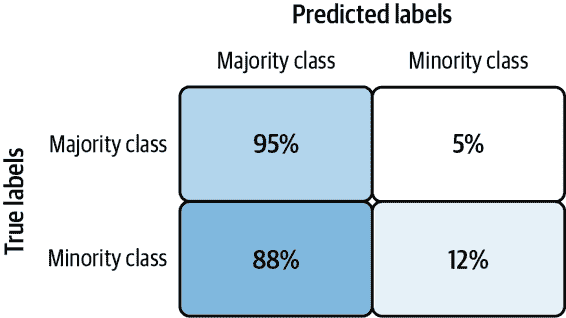

###### 图 3-18\. 在未对数据集或模型进行调整的情况下训练的不平衡数据集的混淆矩阵。

在这个示例中，模型在大多数情况下能够正确猜测出主要类别，但只有 12%的时间能够正确猜测出少数类别。通常，高性能模型的混淆矩阵在对角线上的百分比接近 100%。

## 解决方案

首先，由于在不平衡数据集上准确度可能具有误导性，因此在构建我们的模型时选择适当的评估指标非常重要。然后，我们可以在数据集和模型级别上采用各种技术来处理固有的不平衡数据集。*降采样*改变了我们基础数据集的平衡，而*加权*改变了我们的模型如何处理某些类别。*过采样*从我们的少数类别中复制示例，并且通常涉及应用增强以生成额外的样本。我们还将研究*重新构架*问题的方法：将其改变为回归任务，分析我们模型对每个示例的错误值，或进行聚类。

### 选择评估指标

对于像我们的欺诈检测示例中那样不平衡的数据集，最好使用精度、召回率或 F-度量来全面了解我们的模型表现如何。*精度*衡量了模型正确预测出所有正预测中正确的积极分类的百分比。相反，*召回率*衡量了模型正确识别出的实际正例的比例。这两个指标之间的最大区别在于用于计算它们的分母。对于精度，分母是我们的模型做出的积极类别预测的总数。对于召回率，它是我们数据集中*实际*正类示例的数量。

完美的模型应该具有精度和召回率均为 1.0，但实际上，这两个指标通常是互相对立的。*F-度量*是一个从 0 到 1 的度量，同时考虑了精度和召回率。它的计算公式如下：

```
2 * (precision * recall / (precision + recall))
```

让我们回到欺诈检测用例，看看这些指标在实践中如何发挥作用。例如，假设我们的测试集包含总共 1,000 个示例，其中有 50 个应标记为欺诈交易。对于这些示例，我们的模型正确预测出了 930/950 个非欺诈示例，以及 15/50 个欺诈示例。我们可以在图 3-19 中可视化这些结果。


###### 图 3-19\. 一个欺诈检测模型的样本预测。

在这种情况下，我们模型的精度为 15/35（42%），召回率为 15/50（30%），而 F-度量为 35%。与准确率相比，这些指标更能有效捕捉到我们模型在正确识别欺诈交易方面的能力不足。准确率为 945/1000（94.5%）。因此，在训练于不平衡数据集上的模型中，除准确率外的其他度量标准更受青睐。实际上，在优化这些指标时，准确率甚至可能会下降，但这没关系，因为在这种情况下，精度、召回率和 F-度量更能体现模型的性能。

注意，在评估训练于不平衡数据集上的模型时，我们需要在计算成功度量标准时使用*未经采样的数据*。这意味着无论我们如何修改我们的数据集用于训练，我们将在下面概述的解决方案中，都应保持测试集的原样，以便它能够准确地反映原始数据集。换句话说，我们的测试集应该与原始数据集具有大致相同的类别平衡。例如，在上述示例中，这将是 5% 的欺诈交易和 95% 的非欺诈交易。

如果我们正在寻找一个能够捕捉模型在所有阈值下性能的指标，平均精度-召回率是一个[更具信息性](https://oreil.ly/5iJX2)的指标，比 ROC 曲线下面积（AUC）更好用于模型评估。这是因为平均精度-召回率更加强调模型在*总体*分配给正类的预测中有多少个预测是正确的。这更加重视正类，这对于不平衡数据集是很重要的。而 AUC 则平等对待两个类别，对于模型改进不太敏感，这在不平衡数据的情况下并不理想。

### **降采样**

降采样是一种处理不平衡数据集的解决方案，通过改变底层数据集而不是模型。通过降采样，我们减少了在模型训练过程中使用的多数类示例数量。为了看看这是如何运作的，让我们来看看[Kaggle 上的合成欺诈检测数据集](https://oreil.ly/WqUM-)。⁴ 数据集中的每个示例都包含有关交易的各种信息，包括交易类型、交易金额以及交易发生前后的账户余额。该数据集包含 630 万个示例，其中仅有 8,000 个是欺诈交易。这仅占整个数据集的 0.1%。

尽管大数据集通常能够提高模型识别模式的能力，但在数据显著不平衡的情况下，其帮助作用就不那么大了。如果我们[在整个数据集上训练模型](https://github.com/GoogleCloudPlatform/ml-design-patterns/blob/master/03_problem_representation/rebalancing.ipynb)（630 万行），而没有进行任何修改，很可能会看到误导性的准确率达到 99.9%，因为模型每次随机猜测非欺诈类。我们可以通过移除数据集中大部分多数类示例来解决这个问题。

我们将所有 8,000 个欺诈示例分开设置，以便在训练模型时使用。然后，我们将随机抽取少量非欺诈交易。然后，我们将与我们的 8,000 个欺诈示例组合，重新洗牌数据，并使用这个新的、较小的数据集来训练模型。以下是我们如何可以用 pandas 实现这一点的方式：

```
data = pd.read_csv('fraud_data.csv')

# Split into separate dataframes for fraud / not fraud
fraud = data[data['isFraud'] == 1]
not_fraud = data[data['isFraud'] == 0]

# Take a random sample of non fraud rows
not_fraud_sample = not_fraud.sample(random_state=2, frac=.005)

# Put it back together and shuffle
df = pd.concat([not_fraud_sample,fraud])
df = shuffle(df, random_state=2)
```

随后，我们的数据集将包含 25％的欺诈交易，比原始数据集中仅 0.1％的少数类更加平衡。在进行下采样时，值得尝试不同的精确平衡。在这里，我们使用了一个 25/75 的分割，但是不同的问题可能需要接近 50/50 的分割才能达到良好的准确性。

Downsampling 通常与 Ensemble 模式结合使用，按以下步骤进行：

1.  对多数类进行下采样，并使用少数类的所有实例。

1.  训练一个模型并将其添加到集成中。

1.  重复。

在推断期间，获取集成模型的中位数输出。

我们在这里讨论了一个分类示例，但是下采样也可以应用于回归模型，其中我们预测数值。在这种情况下，由于我们的数据中的多数“类”包括一系列值而不是单个标签，从多数类样本中随机抽取样本将更加微妙。

### 加权类别

处理不平衡数据集的另一种方法是改变模型为每个类别示例赋予的*权重*。请注意，这是与训练期间学习的权重（或参数）不同的“权重”用法，您无法手动设置。通过加权*类别*，我们告诉模型在训练期间对特定标签类别给予更多重视。我们希望模型为来自少数类的示例分配更多权重。您的模型应该为某些示例分配多少重要性，完全取决于您，这是一个可以进行实验的参数。

在 Keras 中，当我们使用`fit()`训练模型时，可以传递`class_weights`参数给我们的模型。`class_weights`参数是一个字典，将每个类映射到 Keras 应分配给该类示例的权重。但是，我们应该如何确定每个类的确切权重呢？类权重值应与数据集中每个类的平衡相关联。例如，如果少数类仅占数据集的 0.1％，合理的结论是，我们的模型应该以比多数类高 1000 倍的权重处理该类的示例。在实践中，通常将该权重值除以 2 以使每个类的平均示例权重为*1.0*。因此，对于仅包含 0.1％少数类值的数据集，我们可以使用以下代码计算类权重：

```
num_minority_examples = 1
num_majority_examples = 999
total_examples = num_minority_examples + num_majority_examples

minority_class_weight = 1/(num_minority_examples/total_examples)/2
majority_class_weight = 1/(num_majority_examples/total_examples)/2

# Pass the weights to Keras in a dict
# The key is the index of each class
keras_class_weights = {0: majority_class_weight, 1: minority_class_weight}
```

然后在训练模型时传递这些权重：

```
model.fit(
    train_data,
    train_labels, 
    class_weight=keras_class_weights
)
```

在 BigQuery ML 中，我们可以在创建模型时的`OPTIONS`块中设置`AUTO_CLASS_WEIGHTS = True`，以便根据训练数据中的频率对不同类别进行加权。

虽然遵循类平衡启发式设置类权重可能有所帮助，但模型的业务应用可能也会决定我们选择分配的类权重。例如，假设我们有一个分类缺陷产品图像的模型。如果运输缺陷产品的成本是错误分类正常产品的 10 倍，我们将选择 10 作为少数类的权重。

### 上采样

处理不平衡数据集的另一种常见技术是*上采样*。通过上采样，我们通过复制少数类示例和生成额外的合成示例来过度表示我们的少数类。通常与减少多数类同时进行。这种方法——结合减少和上采样——在 2002 年提出，并称为合成少数过采样技术（[SMOTE](https://oreil.ly/CFJPz)）。SMOTE 提供了一种算法，通过分析数据集中少数类示例的特征空间来构造这些合成示例，然后使用最近邻方法在这个特征空间内生成类似的示例。根据我们选择同时考虑多少相似数据点（也称为最近邻数），SMOTE 方法随机生成这些点之间的新的少数类示例。

让我们以高层次来看 Pima 印第安人[糖尿病数据集](https://oreil.ly/ljqnc)来看看这是如何工作的。这个数据集中有 34%的例子是患有糖尿病的患者，所以我们将其视为我们的少数类。表格 3-3 显示了两个少数类样本的列的子集。

表格 3-3\. Pima 印第安人糖尿病数据集中少数类（患有糖尿病）的两个训练样本的特征子集

| 葡萄糖 | 血压 | 皮肤厚度 | BMI |
| --- | --- | --- | --- |
| 148 | 72 | 35 | 33.6 |
| 183 | 64 | 0 | 23.3 |

基于数据集中这两个实际样本的新的合成示例可能看起来像表格 3-4，通过计算每个列值之间的中点。

表格 3-4\. 使用 SMOTE 方法从两个少数训练样本生成的合成示例的合成示例

| 葡萄糖 | 血压 | 皮肤厚度 | BMI |
| --- | --- | --- | --- |
| 165.5 | 68 | 17.5 | 28.4 |

SMOTE 技术主要涉及表格数据，但类似的逻辑也可以应用于图像数据集。例如，如果我们正在构建一个模型来区分孟加拉和暹罗猫，并且我们的数据集中仅包含 10%的孟加拉猫图像，我们可以使用 Keras `ImageDataGenerator` 类通过图像增强生成数据集中孟加拉猫的附加变化。使用几个参数，这个类将通过旋转、裁剪、调整亮度等方式生成同一图像的多个变化。

## 权衡与替代方案

对于具有固有不平衡数据集的构建模型，还有一些其他替代解决方案，包括重新构建问题和处理异常检测案例。我们还将探讨不平衡数据集的几个重要考虑因素：整体数据集大小，不同问题类型的最优模型架构以及解释少数类预测。

### 重新构建和级联

重新构建问题是处理不平衡数据集的另一种方法。首先，我们可以考虑将问题从分类转换为回归或者利用重新构建设计模式部分中描述的技术来进行反向操作并训练一系列模型。例如，假设我们有一个回归问题，其中大多数训练数据落在某个范围内，有一些异常值。假设我们关心预测异常值，我们可以通过将大多数数据放在一个桶中，将异常值放在另一个桶中，将这个问题转换为分类问题。

想象我们正在构建一个使用 BigQuery 生育数据集预测婴儿体重的模型。使用 pandas，我们可以创建一个样本的婴儿体重数据直方图以查看体重分布：

```
%%bigquerydf
SELECT
  weight_pounds
FROM
  `bigquery-public-data.samples.natality`
LIMIT 10000
```

```
df.plot(kind='hist')
```

图 3-20 展示了得到的直方图。

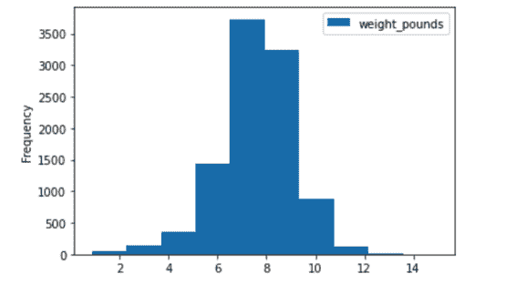

###### 图 3-20\. 展示了 BigQuery 生育数据集中 1 万个例子的婴儿体重分布的直方图。

如果我们统计整个数据集中重量为 3 磅的婴儿数量，约为 96,000 个（占数据的 0.06%）。重量为 12 磅的婴儿仅占数据集的 0.05%。为了在整个范围内获得良好的回归性能，我们可以结合降采样和重新构建与级联设计模式。首先，我们将数据分成三个桶：“欠重”，“平均”和“超重”。我们可以使用以下查询完成：

```
SELECT
  CASE
    WHEN weight_pounds < 5.5 THEN "underweight"
    WHEN weight_pounds > 9.5 THEN "overweight"
  ELSE
  "average"
END
  AS weight,
  COUNT(*) AS num_examples,
  round(count(*) / sum(count(*)) over(), 4) as percent_of_dataset
FROM
  `bigquery-public-data.samples.natality`
GROUP BY
  1
```

表 3-5 展示了结果。

表 3-5\. 生育数据集中每个重量类的百分比

| 重量 | 样本数 | 数据集百分比 |
| --- | --- | --- |
| 平均 | 123781044 | 0.8981 |
| 欠重 | 9649724 | 0.07 |
| 超重 | 4395995 | 0.0319 |

为了演示目的，我们将从每个类别中取 100,000 个示例来训练更新的平衡数据集上的模型：

```
SELECT
  is_male,
  gestation_weeks,
  mother_age,
  weight_pounds,
  weight
FROM (
  SELECT
    *,
    ROW_NUMBER() OVER (PARTITION BY weight ORDER BY RAND()) AS row_num
  FROM (
    SELECT
      is_male,
      gestation_weeks,
      mother_age,
      weight_pounds,
      CASE
        WHEN weight_pounds < 5.5 THEN "underweight"
        WHEN weight_pounds > 9.5 THEN "overweight"
      ELSE
      "average"
    END
      AS weight,
    FROM
      `bigquery-public-data.samples.natality`
    LIMIT
      4000000) )
WHERE
  row_num < 100000
```

我们可以将该查询的结果保存到一个表中，并且通过一个更平衡的数据集，现在我们可以训练一个分类模型来标记婴儿为“欠重”，“平均”或“超重”：

```
CREATE OR REPLACE MODEL
  `project.dataset.baby_weight_classification` OPTIONS(model_type='logistic_reg',
    input_label_cols=['weight']) AS
SELECT
  is_male,
  weight_pounds,
  mother_age,
  gestation_weeks,
  weight
FROM
  `project.dataset.baby_weight`
```

另一种方法是使用级联模式，为每个类别训练三个单独的回归模型。然后，我们可以使用我们的多设计模式解决方案，通过将我们的初始分类模型传递给一个例子并使用该分类的结果来决定将该例子发送到哪个回归模型进行数值预测。

### 异常检测

处理不平衡数据集的回归模型有两种方法：

+   使用模型对预测的错误作为信号。

+   对传入数据进行聚类，并比较每个新数据点与现有聚类的距离。

为了更好地理解每种解决方案，我们假设正在训练一个模型，用传感器收集的数据预测未来的温度。在这种情况下，我们需要模型输出为数值。

对于第一种方法——使用错误作为信号——在训练模型后，我们将比较模型对当前时点的预测值与实际值。如果预测值与当前实际值之间存在显著差异，我们可以将传入的数据点标记为异常。当然，这需要模型在足够多的历史数据上训练得到良好的准确度，以便依赖其质量进行未来的预测。这种方法的主要限制是需要我们能够及时获得新数据，以便将传入数据与模型预测进行比较。因此，它最适合涉及流数据或时间序列数据的问题。

第二种方法是——聚类数据——我们首先使用聚类算法构建模型，这是一种将数据组织成簇的建模技术。聚类是一种*无监督学习*方法，意味着它在没有任何地面真实标签知识的情况下查找数据集中的模式。一个常见的聚类算法是 k 均值，我们可以在 BigQuery ML 中实现它。以下展示了如何在 BigQuery natality 数据集上使用三个特征训练 k 均值模型：

```
CREATE OR REPLACE MODEL
  `project-name.dataset-name.baby_weight` OPTIONS(model_type='kmeans',
    num_clusters=4) AS
SELECT
  weight_pounds,
  mother_age,
  gestation_weeks
FROM
  `bigquery-public-data.samples.natality`
LIMIT 10000
```

结果模型将把我们的数据聚类成四组。一旦模型创建完成，我们可以对新数据生成预测，并查看该预测与现有聚类的距离。如果距离很大，我们可以将数据点标记为异常。要在我们的模型上生成一个聚类预测，我们可以运行以下查询，传递给它数据集中的一个假设平均示例：

```
SELECT
  *
FROM
  ML.PREDICT (MODEL `project-name.dataset-name.baby_weight`,
    (
    SELECT
      7.0 as weight_pounds,
      28 as mother_age,
      40 as gestation_weeks 
     )
  )
```

查询结果在表 3-6 中显示了这个数据点与模型生成的称为质心的聚类之间的距离。

表 3-6\. 我们平均体重示例数据点与由我们的 k 均值模型生成的每个聚类之间的距离

| 质心 ID | 最近质心距离.质心 ID | 最近质心距离.距离 |
| --- | --- | --- |
| 4 | 4 | 0.29998627812137374 |
| 1 | 1.2370167418282159 |  |
| 2 | 1.376651161584178 |  |
| 3 | 1.6853517159990536 |  |

此示例明显属于质心 4，如距离小（.29）所示。

将此与我们将异常值、体重不足的示例发送到模型后得到的结果进行比较，如表 3-7 所示。

表 3-7\. 我们体重不足示例数据点与由我们的 k 均值模型生成的每个聚类之间的距离

| CENTROID_ID | NEAREST_CENTROIDS_DISTANCE.CENTROID_ID | NEAREST_CENTROIDS_DISTANCE.DISTANCE |
| --- | --- | --- |
| 3 | 3 | 3.061985789261998 |
| 4 | 3.3124603501734966 |  |
| 2 | 4.330205096751425 |  |
| 1 | 4.658614918595627 |  |

在这里，该示例与每个质心之间的距离非常大。然后，我们可以使用这些高距离值来推断此数据点可能是异常值。如果我们事先不知道数据的标签，这种无监督聚类方法尤其有用。一旦我们对足够的示例生成了集群预测，我们就可以建立一个使用预测的集群作为标签的监督学习模型。

### 可用的少数类示例数量

尽管我们第一个欺诈检测示例中的少数类仅占数据的 0.1%，但数据集足够大，我们仍然有 8,000 个欺诈数据点可供使用。对于甚至少有少数类示例的数据集，降采样可能会使结果数据集过小，不利于模型学习。对于决定使用降采样时的最小示例数量并没有硬性规则，因为这在很大程度上取决于我们的问题和模型架构。一个经验法则是，如果你只有几百个少数类示例，你可能需要考虑除降采样外的其他解决方案来处理数据集不平衡问题。

值得注意的是，删除我们大多数类别的子集的自然效果是丢失这些示例中存储的一些信息。这可能会略微降低我们模型识别多数类别的能力，但通常情况下，降采样的好处仍然超过了这一点。

### 结合不同的技术

上面描述的降采样和类别权重技术可以结合以获得最佳结果。为此，我们首先通过降采样我们的数据，直到找到适合我们用例的平衡点。然后，基于重新平衡数据集的标签比率，使用加权类别部分描述的方法向我们的模型传递新的权重。当我们面临异常检测问题并且最关心少数类预测时，结合这些方法尤为有用。例如，如果我们正在构建一个欺诈检测模型，我们可能更关心我们的模型标记为“欺诈”的交易，而不是标记为“非欺诈”的交易。此外，正如 SMOTE 所提到的，从少数类生成合成示例的方法通常与从少数类中移除随机示例相结合。

下采样通常也与集成设计模式结合使用。采用这种方法，我们不是完全移除多数类的随机样本，而是使用其不同子集来训练多个模型，然后集成这些模型。举个例子，假设我们有一个数据集，其中包含 100 个少数类示例和 1,000 个多数类示例。与其从多数类中移除 900 个示例以完全平衡数据集，我们将多数示例随机分为 10 组，每组包含 100 个示例。然后我们会训练 10 个分类器，每个分类器使用相同的少数类示例和从多数类随机选择的不同 100 个示例。图 3-11 中展示的装袋技术对这种方法非常有效。

除了结合这些数据中心的方法外，我们还可以根据使用案例调整分类器的阈值以优化精度或召回率。如果我们更关心模型在进行正类预测时的准确性，我们将优化召回率的预测阈值。这在我们希望避免假阳性的任何情况下都适用。或者，如果即使可能会出错，错过一个潜在的正分类也更加昂贵，我们就会优化模型的召回率。

### 选择模型架构

根据我们的预测任务，解决具有重新平衡设计模式的问题时，需要考虑不同的模型架构。如果我们正在处理表格数据并构建用于异常检测的分类模型，研究表明决策树模型在这类任务上表现良好。基于树的模型在处理小型和不平衡数据集的问题时也效果显著。XGBoost、scikit-learn 和 TensorFlow 都有实现决策树模型的方法。

我们可以使用以下代码在 XGBoost 中实现一个二元分类器：

```
# Build the model
model = xgb.XGBClassifier(
    objective='binary:logistic'
)

# Train the model
model.fit(
    train_data, 
    train_labels
)
```

我们可以在每个框架中使用下采样和类权重进一步优化我们的模型，使用重新平衡设计模式。例如，要在上述`XGBClassifier`中添加加权类，我们将添加一个基于数据集中类别平衡计算的`scale_pos_weight`参数。

如果我们在时间序列数据中检测异常，长短期记忆（LSTM）模型很适合识别序列中存在的模式。聚类模型也是处理具有不平衡类别的表格数据的一个选项。对于具有图像输入的不平衡数据集，使用深度学习架构配合下采样、加权类、上采样或这些技术的组合。然而，对于文本数据来说，生成合成数据并不是那么直接，最好依赖于下采样和加权类。

无论我们处理的是哪种数据模态，都可以尝试不同的模型架构来确定在我们的不平衡数据上表现最佳的模型。

### 解释可解释性的重要性

在构建用于标记数据中罕见事件（如异常）的模型时，特别重要的是理解我们的模型如何进行预测。 这既可以验证模型是否捕捉到正确的信号以进行预测，也可以帮助解释模型对最终用户的行为。 有几种工具可供我们解释模型和预测，包括开源框架[SHAP](https://github.com/slundberg/shap)，[What-If Tool](https://oreil.ly/Vf3D-)和[Google Cloud 上的可解释 AI](https://oreil.ly/lDocn)。

模型解释可以采用多种形式，其中之一称为*归因值*。 归因值告诉我们模型中每个特征对模型预测的影响程度。 正面的归因值意味着某个特征推动了我们模型的预测结果上升，而负面的归因值则意味着该特征推动了我们模型的预测结果下降。 归因值的绝对值越高，它对模型预测的影响越大。 在图像和文本模型中，归因值可以显示出对模型预测最具信号性的像素或单词。 对于表格模型，归因值为每个特征提供数值，指示其对模型预测的整体影响。

在从 Kaggle 合成欺诈检测数据集上训练了 TensorFlow 模型并将其部署到 Google Cloud 上的可解释 AI 后，让我们看一些实例级归因的示例。 在图 3-21 中，我们看到了两个例子交易，我们的模型正确识别为欺诈，并且显示它们的特征归因。

在第一个例子中，模型预测有 99%的欺诈可能性时，交易前的原始账户余额是欺诈的最大指标。 在第二个例子中，我们的模型对欺诈的预测有 89%的信心，交易金额被确认为欺诈的最大信号。 然而，原始账户余额使我们的模型在预测欺诈时*不太自信*，并且解释了预测置信度稍微*降低*了 10 个百分点的*原因*。

解释对任何类型的机器学习模型都很重要，但我们可以看到它们对遵循再平衡设计模式的模型特别有用。 在处理不平衡数据时，重要的是超越我们模型的准确性和误差度量，验证它是否捕捉到我们数据中的有意义信号。

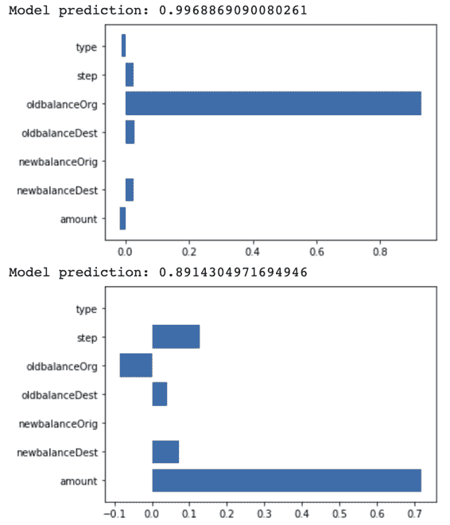

###### 图 3-21. 从可解释 AI 中获取的特征归因，用于两笔正确分类的欺诈交易。

# 摘要

本章探讨了通过模型架构和模型输出的角度来表示预测任务的不同方式。考虑如何应用模型可以指导您在构建模型类型和格式化输出以进行预测时的决策。在这方面，我们从*Reframing*设计模式开始，探讨将问题从回归任务转换为分类任务（反之亦然）以提高模型质量的方法。您可以通过重新格式化数据中的标签列来实现这一点。接下来，我们探讨了*Multilabel*设计模式，该模式处理了输入模型可以与多个标签相关联的情况。为处理此类情况，可以在输出层使用 sigmoid 激活函数和二元交叉熵损失。

而 Reframing 和 Multilabel 模式专注于格式化模型*输出*，*Ensemble*设计模式则涉及模型*架构*，包括各种组合多个模型以改进单一模型机器学习结果的方法。具体来说，Ensemble 模式包括装袋、提升和堆叠等不同的技术，用于将多个模型聚合成一个 ML 系统。*Cascade*设计模式也是一种模型级方法，涉及将机器学习问题分解为几个较小的问题。与集成模型不同，Cascade 模式要求将初始模型的输出作为下游模型的输入。由于级联模型可能带来的复杂性，只有在初始分类标签不同且同等重要的情况下才应使用它们。

接下来，我们介绍了*Neutral Class*设计模式，该模式解决了输出级别的问题表示。该模式通过添加第三个“中性”类来改进二元分类器。在想要捕捉不属于两个明显二元类别之一的任意或较少极化分类的情况下，此模式非常有用。最后，*Rebalancing*设计模式提供了解决本质上不平衡数据集情况的解决方案。该模式建议使用降采样、加权类别或特定重构技术来解决标签类别不平衡的数据集。

第二章和第三章专注于结构化机器学习问题的初始步骤，具体包括格式化输入数据、模型架构选项和模型输出表示。在下一章中，我们将探讨机器学习工作流程的下一步——用于训练模型的设计模式。

¹ 要计算这些值，请参阅 Ian Goodfellow、Yoshua Bengio 和 Aaron Courville 的《深度学习》（剑桥，马萨诸塞州：MIT 出版社，2016 年），第七章。

² 这只是用于说明目的的示例，请不要将其视为医疗建议！

³ 请参阅[*https://oreil.ly/kDndF*](https://oreil.ly/kDndF)了解期权的基础知识。

⁴ 数据集基于本文提出的 PaySim 研究生成：EdgarLopez-Rojas，Ahmad Elmir 和 Stefan Axelsson，“PaySim：用于欺诈检测的金融移动支付模拟器”，*第 28 届欧洲建模与仿真研讨会*，EMSS，塞浦路斯拉纳卡（2016 年）：249–255。
