# 第四章：模型训练模式

机器学习模型通常是通过迭代训练的，这个迭代过程通常被非正式地称为*训练循环*。在本章中，我们讨论了典型的训练循环是什么样子，并列举了一些可能需要采取不同方法的情况。

# 典型的训练循环

机器学习模型可以使用不同类型的优化进行训练。决策树通常根据信息增益度量逐节点构建。在遗传算法中，模型参数被表示为基因，并且优化方法涉及基于进化理论的技术。然而，确定机器学习模型参数的最常见方法是*梯度下降*。

## 随机梯度下降

在大数据集上，梯度下降被应用于输入数据的小批量中，用于训练从线性模型和增强树到深度神经网络（DNN）和支持向量机（SVM）等各种模型。这被称为*随机梯度下降（SGD）*，SGD 的扩展（如 Adam 和 Adagrad）是现代机器学习框架中使用的事实上的优化器。

因为随机梯度下降（SGD）要求在训练数据集的小批量上进行迭代训练，所以训练机器学习模型就是一个循环过程。SGD 找到一个最小值，但它不是一个封闭形式的解，因此我们必须检测模型是否收敛。由于这个原因，在训练数据集上的误差（称为*损失*）必须被监控。如果模型复杂度高于数据集的大小和覆盖范围，就可能发生过拟合。不幸的是，在你真正在特定数据集上训练该模型之前，你无法知道模型复杂度是否过高。因此，评估必须在训练循环内完成，并且还必须监控*验证数据集*（训练数据保留的一部分）上的*错误度量*。因为训练和验证数据集已经在训练循环中使用过，所以有必要保留另一个被称为*测试数据集*的训练数据拆分，以报告在新的未见数据上可能预期的实际错误度量。这种评估是在最后完成的。

## Keras 训练循环

Keras 中典型的训练循环如下所示：

```
model = keras.Model(...)
model.compile(optimizer=keras.optimizers.`Adam`(),
              loss=keras.losses.categorical_`crossentropy`(),
              metrics=[`'``accuracy``'`])

history = model.fit(x_train, y_train,
                    batch_size=`64`,
                    epochs=`3`,
                    validation_data=(x_val, y_val))
results = model.evaluate(x_test, y_test, batch_size=128))
model.save(...)
```

这里，模型使用 Adam 优化器在训练数据集上执行交叉熵的 SGD，并报告在测试数据集上获得的最终准确度。模型的拟合循环在训练数据集上进行三次（每次遍历训练数据集称为*epoch*），每次模型看到 64 个训练样本组成的批次。在每个 epoch 结束时，会在验证数据集上计算错误度量，并将其添加到历史记录中。在拟合循环结束时，模型会在测试数据集上进行评估、保存，并可能部署为服务，如图 4-1 所示。

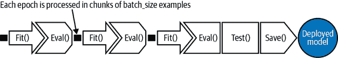

###### 图 4-1\. 典型训练循环由三个 epoch 组成。每个 epoch 按批量大小的示例进行处理。在第三个 epoch 结束时，模型在测试数据集上进行评估，并保存以便可能部署为 Web 服务。

而非使用预构建的`fit()`函数，我们也可以编写自定义训练循环，明确迭代批次，但对于本章讨论的任何设计模式，我们不需要这样做。

## 训练设计模式

本章涵盖的设计模式都涉及以某种方式修改典型的训练循环。在*有用的过拟合*中，我们放弃使用验证或测试数据集，因为我们希望故意在训练数据集上过拟合。在*检查点*中，我们定期存储模型的完整状态，以便可以访问部分训练的模型。当我们使用检查点时，通常也使用*虚拟 epoch*，在这种情况下，我们决定在`fit()`函数的内部循环中不使用完整的训练数据集，而是使用固定数量的训练样本。在*迁移学习*中，我们使用先前训练模型的部分，冻结权重，并将这些不可训练层合并到解决相同问题的新模型中，但在较小的数据集上进行。在*分布策略*中，训练循环在多个工作节点上以规模进行，通常包括缓存、硬件加速和并行化。最后，在*超参数调整*中，训练循环本身被插入到优化方法中，以找到最佳的模型超参数集。

# 设计模式 11：有用的过拟合

有用的过拟合是一种设计模式，其中我们放弃使用泛化机制，因为我们希望故意在训练数据集上过拟合。在过拟合可能有益的情况下，该设计模式建议我们进行机器学习时不使用正则化、dropout 或早期停止的验证数据集。

## 问题

机器学习模型的目标是在新的未见数据上进行泛化并进行可靠的预测。如果你的模型*过拟合*训练数据（例如，它在验证误差开始增加的点之后继续减少训练误差），那么它的泛化能力将会受到影响，进而影响到未来的预测。介绍性的机器学习教材建议通过早停和正则化技术来避免过拟合。

然而，考虑一种模拟物理或动力系统行为的情况，例如气候科学、计算生物学或计算金融中发现的系统。在这些系统中，观察的时间依赖性可以用数学函数或偏微分方程组描述。尽管控制这些系统的方程可以被形式化地表达，但它们没有封闭形式的解。相反，已经开发了经典的数值方法来近似解这些系统。不幸的是，对于许多现实世界的应用，这些方法可能太慢而无法实际使用。

考虑如 图 4-2 所示的情况。从物理环境中收集的观察结果被用作物理模型的输入（或初始条件），该模型进行迭代、数值计算以计算系统的精确状态。假设所有观察结果都有有限的可能性（例如，温度将在 60°C 到 80°C 之间，增量为 0.01°C）。然后可以为机器学习系统创建包含完整输入空间的训练数据集，并使用物理模型计算标签。

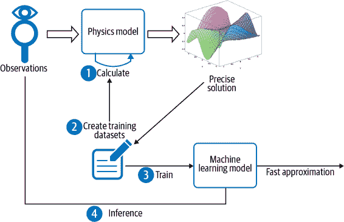

###### 图 4-2\. 当整个观察域空间可以列成表格并且具有计算精确解的物理模型可用时，过拟合是可以接受的一种情况。

机器学习模型需要学习这个精确计算且不重叠的输入输出查找表。将这样的数据集分为训练数据集和评估数据集是适得其反的，因为我们会期望模型学习训练数据集中未见过的输入空间的部分。

## 解决方案

在这种情况下，没有需要泛化到的“未见”数据，因为所有可能的输入已经被列入表格。当构建一个机器学习模型来学习这样一个物理模型或动态系统时，不存在过拟合的问题。基本的机器学习训练范式略有不同。在这里，您正在尝试学习由基础 PDE 或 PDE 系统控制的某些物理现象。机器学习仅提供了一种数据驱动的方法来近似精确解，因此诸如过拟合的概念必须重新评估。

例如，采用射线追踪方法模拟卫星图像，该图像是由数值天气预报模型的输出产生的。这涉及计算预测的水凝物（雨、雪、冰雹、冰粒等）在每个大气层中吸收多少太阳射线。可能的水凝物类型和数值模型预测的高度是有限的。因此，射线追踪模型必须将光学方程应用于一个大但有限的输入集合。

辐射传输方程控制电磁辐射在大气中传播的复杂动态系统，并且前向辐射传输模型是推断卫星图像未来状态的有效手段。然而，计算这些方程的解的传统数值方法需要巨大的计算工作量，而且在实践中速度太慢。

进入机器学习。可以使用机器学习构建一个模型，该模型[近似解决方案](https://oreil.ly/IkYKm)到前向辐射传输模型（见图 4-3）。这种机器学习的近似解可以接近最初通过更传统方法获得的模型解。其优势在于，使用学习的机器学习近似解进行推理（只需计算一个封闭公式）所需的时间仅为进行光线追踪所需时间的一小部分（后者需要数值方法）。同时，训练数据集过大（多达数太字节），在生产环境中使用作为查找表格是不可行的。

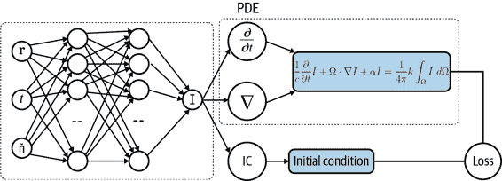

###### 图 4-3\. 使用神经网络建模部分微分方程解决 I(r,t,n)的架构。

训练机器学习模型以近似解决像这样的动态系统与根据多年来收集的新生数据预测婴儿体重之间存在重要区别。换句话说，动态系统是由电磁辐射法则控制的一组方程，没有未观察到的变量，没有噪声，也没有统计变异。对于给定的输入集，只有一个可以精确计算的输出。在训练数据集中，不同示例之间没有重叠。因此，我们可以不必担心泛化问题。我们*希望*我们的机器学习模型尽可能完美地拟合训练数据，以“过度拟合”。

这与训练机器学习模型的典型方法相反，后者考虑偏差、方差和泛化误差的因素。传统的训练说，模型可能学习训练数据“太好”，使得训练损失函数等于零更像是一个警告信号，而不是庆祝的原因。以这种方式过度拟合训练数据集会导致模型在新的、未见的数据点上做出误导性预测。这里的不同之处在于，我们事先知道不会有未见数据，因此模型是在整个输入频谱上逼近偏微分方程的解。如果你的神经网络能够学习一组参数，使得损失函数为零，那么这个参数集确定了所讨论的偏微分方程的实际解。

## 为什么它有效

如果所有可能的输入都能被列出，那么如图 4-4 中所示的虚线曲线，即使是过拟合模型，也会产生与“真实”模型相同的预测结果，如果所有可能的输入点都经过训练，过拟合就不是问题。我们必须确保推断是基于输入值的四舍五入值进行的，而这个四舍五入是由输入空间的网格分辨率确定的。

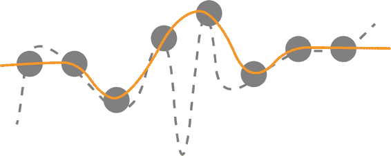

###### 图 4-4\. 如果所有可能的输入点都经过训练，过拟合就不是问题，因为预测结果与两个曲线都相同。

是否有可能找到一个模型函数，它可以无限接近真实标签？对于为什么这能行的直觉，部分来源于深度学习的均匀逼近定理，它粗略地表明，任何函数（及其导数）都可以用至少一个隐藏层和任何“压缩”激活函数（如 sigmoid）的神经网络来逼近。这意味着，无论我们得到什么函数，只要它相对合理，就存在一个仅具有一个隐藏层的神经网络，可以尽我们所需地逼近那个函数。¹

深度学习方法用于解决微分方程或复杂动态系统的方法，旨在使用神经网络表示由微分方程或方程组隐含定义的函数。

当满足以下两个条件时，过拟合是有用的：

+   没有噪音，因此所有实例的标签都是准确的。

+   您可以随时使用完整的数据集（所有示例都在那里）。在这种情况下，过拟合变成了对数据集进行插值。

## 折衷与替代方案

当输入集可以详尽列出并可以计算每个输入集的准确标签时，我们将过拟合作为有用的。如果可以列出完整的输入空间，则过拟合不是一个问题，因为没有看不见的数据。然而，有用的过拟合设计模式在超出这个狭窄用例之外仍然有效。

### 插值与混沌理论

机器学习模型本质上充当输入到输出查找表的近似。如果查找表很小，只需将其用作查找表即可！没有必要通过机器学习模型来近似它。在查找表过于庞大以致无法有效使用时，ML 近似才是有用的。当查找表过于笨重时，最好将其视为机器学习模型的训练数据集，以近似查找表。

请注意，我们假设观察结果将有限数量的可能性。例如，我们假设温度将以 0.01°C 的增量进行测量，并且位于 60°C 到 80°C 之间。如果通过数字仪器进行观察，则情况将如此。如果不是这种情况，则需要 ML 模型在查找表中的条目之间进行插值。

机器学习模型通过未见值与训练示例的距离加权来进行插值。只有在底层系统不混沌时，这种插值才有效。在混沌系统中，即使系统是确定性的，初始条件的微小差异也可能导致截然不同的结果。尽管如此，在实践中，每个具体的混沌现象都有一个特定的[分辨率阈值](https://oreil.ly/F-drU)，在这个阈值之上，模型可以在短时间内预测它。因此，只要查找表足够精细，并且了解到可解析性的极限，就可以得到有用的近似。

### 蒙特卡罗方法

实际上，可能不可能列出所有可能的输入，并且您可能采取蒙特卡罗方法来对输入空间进行采样以创建输入集，特别是在所有可能的输入组合在物理上不可能的情况下。

在这种情况下，过拟合是技术上可能的（参见 图 4-5，其中未填充的圆圈被错误的估计用交叉圆圈表示）。

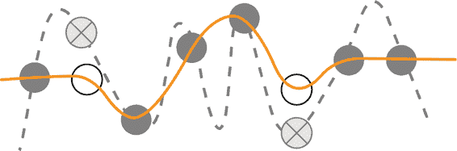

###### 图 4-5\. 如果输入空间是采样的，而不是表格化的，则需要注意限制模型的复杂性。

然而，即使在这里，您也可以看到机器学习模型将在已知答案之间进行插值计算。计算始终是确定性的，只有输入点受到随机选择的影响。因此，这些已知答案不包含噪声，并且由于没有未观察到的变量，未采样点处的错误将严格受到模型复杂性的限制。在这里，过拟合的危险来自模型复杂性，而不是适应噪声。当数据集的大小大于自由参数的数量时，过拟合问题就不会那么严重。因此，在蒙特卡罗选择输入空间的情况下，使用低复杂度模型和轻度正则化的组合提供了一种实用的方式来避免不可接受的过拟合。

### 数据驱动的离散化

尽管对一些偏微分方程可以推导出闭合形式的解，但使用数值方法确定解更为普遍。偏微分方程的数值方法已经是一个深入研究的领域，有许多与该主题相关的 [书籍](https://oreil.ly/RJWVQ)，[课程](https://oreil.ly/wcl_n)，和 [期刊](https://msp.org/apde)。一个常见的方法是使用有限差分方法，类似于龙格-库塔方法，用于求解常微分方程。这通常通过将偏微分方程的微分算子离散化，并在原始域的时空网格上找到离散问题的解来完成。然而，当问题的维数变大时，由于维度诅咒的存在，这种基于网格的方法会因为网格间距必须足够小以捕捉解的最小特征尺寸而遭遇严重失败。因此，要达到图像 10 倍更高分辨率需要 10,000 倍的计算能力，因为网格的间距必须在四个维度上进行缩放，考虑到空间和时间。

然而，可以使用机器学习（而不是蒙特卡罗方法）来选择采样点，以创建用于 PDE 离散化的数据驱动方法。在论文"[学习 PDE 的数据驱动离散化](https://oreil.ly/djDkK)"中，Bar-Sinai 等人展示了这种方法的有效性。作者们使用低分辨率的固定点网格，通过标准有限差分方法以及从神经网络获取的方法，来近似解决方案的分段多项式插值。从神经网络获得的解决方案在最小化绝对误差方面远远优于数值模拟，在某些地方实现了 10²数量级的改进。虽然增加分辨率需要使用更多的计算能力来使用有限差分方法，但神经网络能够在仅有边际额外成本的情况下保持高性能。像深度 Galerkin 方法这样的技术可以使用深度学习来提供给定 PDE 解的无网格近似。通过这种方式，解决 PDE 问题被简化为链式优化问题（参见“设计模式 8：级联”）。

### 无界域

蒙特卡洛方法和数据驱动离散化方法都假设即使不完美地对整个输入空间进行采样也是可能的。这就是为什么将机器学习模型视为已知点之间的插值的原因。

每当我们无法对函数的整个域进行采样时，例如对于具有无界域或将来时间轴上的投影的函数，泛化和过拟合的问题就变得难以忽视。在这些设置中，重要的是考虑过拟合、欠拟合和泛化误差。事实上，已经表明，尽管像深度 Galerkin 方法这样的技术在采样充分的区域表现良好，但以这种方式学习的函数在训练阶段未采样的域外区域上的泛化能力不佳。这对于使用 ML 解决定义在无界域上的 PDE 可能会有问题，因为在训练阶段无法捕获代表性样本。

### 神经网络知识的精炼

另一种情况是过拟合被证明是合理的，那就是在将知识从大型机器学习模型转移到较小模型中进行精炼或知识转移时。当大型模型的学习能力没有充分利用时，知识精炼就非常有用。如果情况如此，大型模型的计算复杂度可能是不必要的。然而，训练较小的模型也是困难的。虽然较小的模型具有足够的容量来表示知识，但可能没有足够的能力来有效地学习知识。

解决方案是在大量由较大模型标记的生成数据上训练较小模型。较小模型学习较大模型的软输出，而不是实际数据上的标签。这是一个较简单的问题，可以被较小模型学习。就像通过机器学习模型逼近数值函数一样，较小模型的目标是忠实地表示较大机器学习模型的预测。这第二个训练步骤可以利用有用的过拟合。

### 对一个批次过拟合

在实践中，训练神经网络需要大量的实验，并且从网络的大小和架构到学习率、权重初始化或其他超参数的选择，从业者必须做出许多选择。

对小批量过拟合是一个[很好的健全性检查](https://oreil.ly/AcLtu)，无论是对模型代码还是数据输入管道。仅仅因为模型编译通过并且代码运行没有错误，并不意味着您计算了您认为的内容或者训练目标正确配置了。一个足够复杂的模型*应该*能够在足够小的批量数据上过拟合，假设一切设置正确。因此，如果您无法用任何模型在小批量上过拟合，那么值得重新检查您的模型代码、输入管道和损失函数是否存在错误或简单的错误。在训练和排除神经网络问题时，对批量过拟合是一个有用的技术。

###### 提示

过拟合不仅仅限于一个批次。从更全面的角度来看，过拟合遵循通常给出的关于深度学习和正则化的一般建议。最佳拟合模型是一个[经过适当正则化的大模型](https://oreil.ly/A7DFC)。简而言之，如果您的深度神经网络无法过拟合您的训练数据集，那么您应该使用一个更大的模型。然后，一旦您有一个能够过拟合训练集的大模型，您可以应用正则化来提高验证精度，即使训练精度可能会降低。

您可以通过使用您为输入管道编写的`tf.data.Dataset`来测试您的 Keras 模型代码。例如，如果您的训练数据输入管道称为`trainds`，我们将使用`batch()`来拉取一个单一批次的数据。您可以在伴随本书的存储库中找到这个例子的[完整代码](https://github.com/GoogleCloudPlatform/ml-design-patterns/blob/master/04_hacking_training_loop/distribution_strategies.ipynb)：

```
BATCH_SIZE = 256
single_batch = trainds.batch(BATCH_SIZE).take(1`)`
```

然后，在训练模型时，而不是在`fit()`方法中调用完整的`trainds`数据集，使用我们创建的单个批次：

```
model`.`fit`(`single_batch`.`repeat`(``)``,`
          validation_data`=`evalds`,`
          `…``)`
```

注意，我们应用`repeat()`以确保在训练时不会耗尽数据。这确保了我们在训练时一遍又一遍地使用同一批数据。其余内容（验证数据集、模型代码、工程特征等）保持不变。

###### 提示

我们建议不要选择训练数据集的任意样本，而是建议你在一个小数据集上过度拟合。这些样本都经过仔细验证，确保其标签是正确的。设计你的神经网络架构，使其能够精确地学习这批数据，并且达到零损失。然后，将同样的网络用于完整的训练数据集。

# 设计模式 12：检查点

在   在检查点中，我们定期存储模型的完整状态，以便能够使用部分训练过的模型。这些部分训练过的模型可以作为最终模型（在提前停止的情况下），或者作为继续训练的起点（在机器故障和微调的情况下）。

## 问题

模型越复杂（例如，神经网络具有的层数和节点数越多），训练它有效所需的数据集就越大。这是因为更复杂的模型往往具有更多可调参数。随着模型大小的增加，每个批次的拟合时间也会增加。随着数据大小的增加（假设批次大小固定），批次数量也会增加。因此，在计算复杂性方面，这种双重打击意味着训练将需要很长时间。

在撰写本文时，在一流的张量处理单元（TPU）Pod 上训练一款英译德模型，使用相对较小的数据集，[大约需要两个小时](https://oreil.ly/vDRve)。在用于训练智能设备的真实数据集上，训练可能需要几天时间。

当我们进行如此长时间的训练时，机器故障的可能性非常高。如果出现问题，我们希望能够从一个中间点恢复，而不是从头开始。

## 解决方案

在每个时代结束时，我们可以保存模型状态。然后，如果由于任何原因训练循环中断，我们可以回到保存的模型状态并重新启动。然而，在这样做时，我们必须确保保存的是中间模型状态，而不仅仅是模型本身。这意味着什么呢？

训练完成后，我们保存或者*导出*模型，以便可以部署它进行推断。导出的模型不包含整个模型状态，只包含创建预测函数所需的信息。例如，对于决策树来说，这将是每个中间节点的最终规则以及每个叶子节点的预测值。对于线性模型来说，这将是权重和偏差的最终值。对于全连接神经网络，我们还需要添加激活函数和隐藏连接的权重。

当从检查点恢复而导出的模型没有的模型状态数据是什么？一个导出的模型不包含模型当前处理的轮次和批次号，这显然是为了恢复训练而重要的。但模型训练循环可能包含更多信息。为了有效地执行梯度下降，优化器可能会按计划改变学习率。这种学习率状态在导出的模型中不存在。另外，模型可能会有随机行为，比如 dropout。这也不在导出的模型状态中。像循环神经网络这样的模型会包含先前输入值的历史记录。总的来说，完整的模型状态可能是导出模型大小的多倍。

保存完整的模型状态以便从某一点恢复模型训练称为*检查点*，保存的模型文件称为*检查点*。我们应该多久做一次检查点？由于梯度下降的缘故，模型状态在每个批次后都会发生变化。因此，从技术上讲，如果我们不想丢失任何工作，我们应该在每个批次后做检查点。然而，检查点非常大，这种 I/O 会增加相当大的开销。相反，模型框架通常提供在每个时期结束时做检查点的选项。这是在从不做检查点和每批次后都做检查点之间的一个合理折衷。

要在 Keras 中进行模型检查点，需要在`fit()`方法中提供一个回调函数：

```
checkpoint_path = '{}/checkpoints/taxi'.format(OUTDIR)
cp_callback = tf.keras.callbacks.ModelCheckpoint(checkpoint_path, 
                                                 save_weights_only=False,
                                                 verbose=1)
history = model.fit(x_train, y_train,
                    batch_size=64,
                    epochs=3,
                    validation_data=(x_val, y_val), 
                    verbose=2, 
                    callbacks=[cp_callback])
```

添加检查点后，训练循环变得如图 4-6 所示。

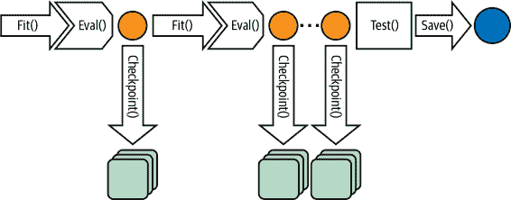

###### 图 4-6\. 检查点在每个时期结束时保存完整的模型状态。

## 为什么它有效

如果在输出路径中找到检查点文件，TensorFlow 和 Keras 会自动从检查点恢复训练。因此，要从头开始训练，你必须从新的输出目录开始（或者从输出目录中删除之前的检查点）。这是因为企业级机器学习框架会尊重检查点文件的存在。

尽管检查点主要设计用于支持韧性，但部分训练模型的可用性打开了许多其他用例。这是因为部分训练的模型通常比后续迭代中创建的模型更具普适性。为什么会发生这种情况的直观感受可以从[TensorFlow playground](https://oreil.ly/sRjkN)获得，如图 4-7 所示。

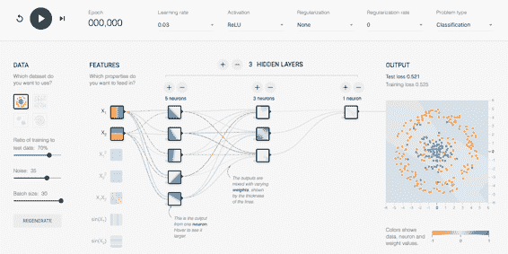

###### 图 4-7\. 螺旋分类问题的起点。你可以通过在浏览器中打开[这个链接](https://oreil.ly/ISg9X)来到达这个设置。

在这个实验中，我们试图构建一个分类器来区分蓝点和橙点（如果你在纸质书中阅读此内容，请在网络浏览器中导航到链接以跟随）。两个输入特征是 x[1] 和 x[2]，它们是点的坐标。基于这些特征，模型需要输出点是蓝色的概率。模型从随机权重开始，点的背景显示了每个坐标点的模型预测。正如你所见，由于权重是随机的，概率倾向于在所有像素的中心值附近波动。

通过点击图像左上角的箭头开始训练，我们可以看到模型随着连续的 epochs 缓慢开始学习，如 图 4-8 所示。

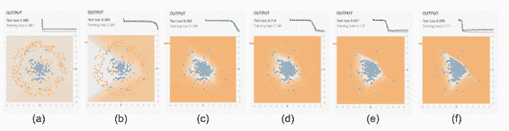

###### 图 4-8\. 模型在训练过程中学到的内容。顶部的图表显示训练损失和验证错误，而图像则展示了模型在每个坐标网格中预测点的颜色。

在图 4-8 中，我们看到学习的第一个迹象是在 (b) 处，我们看到模型通过图 4-8 (c) 学到了数据的高级视角。从那时起，模型调整边界以将更多的蓝点移到中心区域，同时保持橙点在外。这有助于提高效果，但只能到一定程度。当我们到达图 4-8 (e) 时，权重的调整开始反映在训练数据中的随机扰动上，这对验证数据集是有害的。

因此，我们可以将训练分为三个阶段。在第一阶段（a 到 c 之间），模型学习数据的高级组织。在第二阶段（c 到 e 之间），模型学习细节。当我们到达第三阶段，即阶段 f 时，模型出现了过拟合。从第一阶段或第二阶段结束时的部分训练模型中，我们可以看到它学到了高级组织，但并未深入到细节中。

## 折中和替代方案

除了提供韧性之外，保存中间检查点还使我们能够实施提前停止和精细调整功能。

### 提前停止

一般来说，训练时间越长，训练数据集上的损失就越低。然而，在某个时候，验证数据集上的错误可能停止减少。如果开始对训练数据集过拟合，验证误差甚至可能开始增加，如图 4-9 所示。

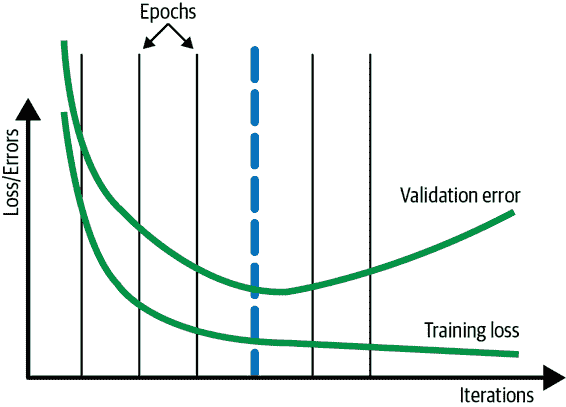

###### 图 4-9。一般来说，训练时间越长，训练损失会持续下降，但一旦开始过拟合，验证数据集上的验证错误则会增加。

在这种情况下，查看每个时代结束时的验证错误并在验证错误超过上一个时代的情况下停止训练过程可能会有所帮助。在图 4-9 中，这将在第四个时代结束时，由粗虚线表示。这被称为*早停止*。

###### 提示

如果我们在每个批次结束时做检查点，我们可能能够捕捉到真正的最小值，这可能在时代边界之前或之后一点点。有关虚拟时代的讨论，请参阅本节更频繁的检查点方法。

如果我们更频繁地进行检查点，早停止不会对验证误差中的小扰动过于敏感将是有帮助的。相反，我们可以在验证误差连续*N*个检查点没有改进后再应用早停止。

#### 检查点选择

尽管可以通过在验证错误开始增加时停止训练来实现早停止，我们建议延长训练时间，并在后处理步骤中选择最佳运行。我们建议训练直至第 3 阶段（请参阅前述的“为什么有效”部分，以了解训练循环的三个阶段的解释），因为验证误差在某些情况下可能会短暂增加，然后开始再次下降。这通常是因为训练最初关注更常见的情况（阶段 1），然后开始追踪更罕见的情况（阶段 2）。由于训练和验证数据集之间可能对稀有情况进行不完全采样，因此在第 2 阶段的训练运行期间偶尔会出现验证误差的增加是可以预期的。此外，对于大型模型普遍存在[深度双下降](https://oreil.ly/Kya8h)的情况，因此最好稍微延长训练时间以防万一。

在我们的示例中，我们将不会在训练运行结束时导出模型，而是将加载第四个检查点并从那里导出我们的最终模型。这被称为*检查点选择*，在 TensorFlow 中可以通过[BestExporter](https://oreil.ly/UpN1a)来实现。

#### 正则化

在使用早停止或检查点选择之前，尝试向模型添加 L2 正则化可能会有所帮助，以确保验证错误不会增加，并且模型永远不会进入第 3 阶段。相反，训练损失和验证错误应该会趋于平稳，正如图 4-10 所示。我们将这样的训练循环（其中训练和验证指标均达到平稳状态）称为*良好行为*的训练循环。

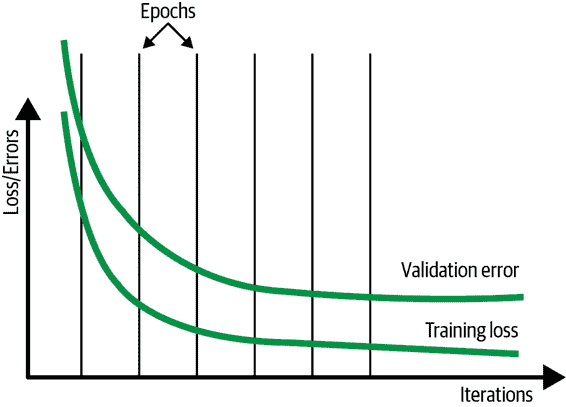

###### 图 4-10。在理想情况下，验证错误不会增加。相反，训练损失和验证错误都会趋于平稳。

如果不执行早停止，并且仅使用训练损失来决定收敛性，那么我们可以避免设置单独的测试数据集。即使我们不执行早停止，显示模型训练进度也可能很有帮助，特别是当模型训练时间较长时。虽然通常在训练循环期间，模型的性能和进度通常在验证数据集上进行监控，但这只是为了可视化目的。由于我们不需要根据显示的指标采取任何行动，我们可以在测试数据集上进行可视化。

**使用正则化而不是早停止的原因在于，正则化允许您使用整个数据集来调整模型的权重，而早停止则要求您浪费 10%至 20%的数据集仅用于决定何时停止训练。其他限制过拟合的方法（如丢弃法和使用复杂度较低的模型）也是早停止的良好替代方法。此外，[最近的研究](https://oreil.ly/FJ_iy)表明，双下降现象在各种机器学习问题中都会发生，因此与其早停止，不如继续训练以避免出现次优解。**  **#### 两种分割方法

正则化部分的建议是否与早停止或检查点选择部分的建议相矛盾？实际上并不是。

我们建议您将数据分为两部分：训练数据集和评估数据集。在实验中，评估数据集充当测试数据集的角色（没有验证数据集），而在生产环境中，评估数据集充当验证数据集的角色（没有测试数据集）。

你的训练数据集越大，你可以使用的模型就越复杂，得到的模型准确性也越高。使用正则化而不是早停或检查点选择，允许你使用更大的训练数据集。在实验阶段（当你正在探索不同的模型架构、训练技术和超参数时），我们建议你关闭早停并使用更大的模型进行训练（还可参见“设计模式 11：有益过拟合”）。这是为了确保模型具有足够的容量来学习预测模式。在此过程中，监视训练集上的错误收敛。在实验结束时，你可以使用评估数据集来诊断模型在训练过程中未曾遇到的数据上的表现。

当训练模型用于生产部署时，你需要准备好进行持续评估和模型再训练。开启早停或检查点选择，并监控评估数据集上的错误指标。根据你是否需要控制成本（在这种情况下，你会选择早停）或者想要优先考虑模型准确性（在这种情况下，你会选择检查点选择），选择早停或检查点选择。**  **### 微调

在一个良好的训练循环中，梯度下降的行为是这样的，它通过优化大多数数据来快速到达最优错误的邻域，然后通过优化边缘情况来缓慢收敛到最低错误。

现在，想象一下，你需要定期在新鲜数据上重新训练模型。你通常希望强调新鲜数据，而不是上个月的边缘情况。你更好地从标记为蓝线的检查点恢复你的训练，而不是从上个检查点开始，这对应于我们之前讨论的模型训练阶段中第 2 阶段的开始“为什么有效”。这有助于确保你有一种通用方法，然后你能对刚刚的新鲜数据进行几个时期的微调。

当你从标记为粗虚线的检查点恢复时，你将处于第四个时期，因此学习速率会非常低。因此，新鲜数据不会显著改变模型。然而，模型在新鲜数据上的表现会达到最佳（在更大模型的背景下）。这是被称为*微调*的过程。微调也在“设计模式 13：迁移学习”中讨论过。


###### 图 4-11。从在训练损失开始平台化之前的检查点恢复。仅对后续迭代使用新鲜数据进行训练。

###### 警告

只有在不改变模型架构的情况下，微调才有效。

不必总是从较早的检查点开始。在某些情况下，最终检查点（用于提供模型）可以用作另一个模型训练迭代的热启动。然而，从较早的检查点开始通常能提供更好的泛化能力。

### 重新定义一个 epoch

机器学习教程经常有这样的代码：

```
model.fit(X_train, y_train, 
          batch_size=100, 
          epochs=15)
```

这段代码假设你有一个可以放入内存的数据集，并且你的模型可以在 15 个 epochs 中迭代而不会出现机器故障的风险。然而，这两个假设都是不合理的——机器学习数据集的范围达到了几个 TB，而且在训练时间长达数小时时，机器故障的几率很高。

为了使上述代码更加弹性，提供一个[TensorFlow 数据集](https://oreil.ly/EKJ4V)（而不仅仅是一个 NumPy 数组），因为 TensorFlow 数据集是一个内存外的数据集。它提供迭代能力和延迟加载。现在代码如下：

```
cp_callback = tf.keras.callbacks.ModelCheckpoint(...)
history = model.fit(trainds, 
                    validation_data=evalds,
                    epochs=15, 
                    batch_size=128,
                    callbacks=[cp_callback])
```

但是，在大型数据集上使用 epochs 仍然是一个不好的主意。epochs 可能很容易理解，但是在实际的机器学习模型中使用 epochs 会导致不良影响。为了了解为什么，请想象一下你有一个包含一百万个示例的训练数据集。简单地设置 epochs 为 15，然后简单地遍历这个数据集 15 次可能很诱人。但是存在一些问题：

+   epochs 的数量是一个整数，但是在处理数据集 14.3 次和 15 次之间的训练时间差异可能会达到数小时。如果模型在观察了 1430 万个示例后已经收敛，您可能希望退出，而不是浪费处理 700000 个示例所需的计算资源。

+   每个 epoch 只需进行一次检查点，而等待一百万个示例之间的检查点可能会太长。为了弹性，您可能希望更频繁地进行检查点。

+   数据集会随着时间增长。如果您获取了 10 万个更多的示例并训练模型，并且得到了更高的错误，是因为您需要早停，还是新数据在某种方式上损坏了？您无法确定，因为先前的训练是在 1500 万个示例上进行的，而新的训练是在 1650 万个示例上进行的。

+   在分布式参数服务器训练（参见“设计模式 14：分布策略”）中，使用数据并行和适当的洗牌，epoch 的概念不再清晰。由于可能存在滞后的工作节点，您只能指示系统对一些小批次进行训练。

#### 每个 epoch 的步骤

我们可能决定不再训练 15 个 epochs，而是决定训练 143000 步，其中 batch_size 为 100：

```
NUM_STEPS = 143000
BATCH_SIZE = 100
NUM_CHECKPOINTS = 15
cp_callback = tf.keras.callbacks.ModelCheckpoint(...)
history = model.fit(trainds, 
                    validation_data=evalds,
                    epochs=NUM_CHECKPOINTS,
                    steps_per_epoch=NUM_STEPS // NUM_CHECKPOINTS, 
                    batch_size=BATCH_SIZE,
                    callbacks=[cp_callback])
```

每个步骤涉及基于单个小批量数据的权重更新，这使我们可以在 14.3 个时代停止。这为我们提供了更多的粒度，但我们必须将“时代”定义为总步数的 1/15：

```
steps_per_epoch=NUM_STEPS // NUM_CHECKPOINTS, 
```

这样可以确保我们获得正确数量的检查点。只要确保无限重复`trainds`即可：

```
trainds = trainds.repeat()
```

`repeat()`是必需的，因为我们不再设置`num_epochs`，所以默认的时代数为一。如果没有`repeat()`，模型将在读取数据集一次后退出一旦训练模式耗尽。

#### 使用更多数据重新训练

当我们获得额外的 100,000 个示例时会发生什么？很简单！我们将其添加到我们的数据仓库中，但不更新代码。我们的代码仍然希望处理 143,000 步，它将处理这么多数据，只是它看到的示例中有 10% 是新的。如果模型收敛了，太棒了。如果没有，我们知道这些新数据点是问题所在，因为我们的训练时间并没有比以前长。通过保持步数恒定，我们能够将新数据的影响与更多数据的训练效果分离开来。

一旦我们训练了 143,000 步，我们重新开始训练并继续运行一段时间（比如说，10,000 步），只要模型继续收敛，我们就继续延长训练时间。然后，我们更新上述代码中的 143,000 这个数字（实际上，它将是代码的一个参数），以反映新的步数。

这一切都很好，直到您想进行超参数调整。当进行超参数调整时，您将希望更改批处理大小。不幸的是，如果您将批处理大小更改为 50，您会发现自己的训练时间减少了一半，因为我们正在进行 143,000 步的训练，每步只有以前的一半时间。显然，这是不好的。

#### 虚拟时代

答案是保持向模型显示的总训练示例数量（而不是步数；参见图 4-12）恒定：

```
NUM_TRAINING_EXAMPLES = 1000 * 1000
STOP_POINT = 14.3
TOTAL_TRAINING_EXAMPLES = int(STOP_POINT * NUM_TRAINING_EXAMPLES)
BATCH_SIZE = 100
NUM_CHECKPOINTS = 15
steps_per_epoch = (TOTAL_TRAINING_EXAMPLES // 
                   (BATCH_SIZE*NUM_CHECKPOINTS))
cp_callback = tf.keras.callbacks.ModelCheckpoint(...)
history = model.fit(trainds, 
                    validation_data=evalds,
                    epochs=NUM_CHECKPOINTS,
                    steps_per_epoch=steps_per_epoch, 
                    batch_size=BATCH_SIZE,
                    callbacks=[cp_callback])
```

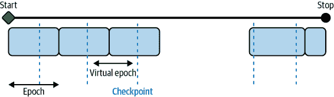

###### 图 4-12\. 在期望的检查点之间的步数定义虚拟时代。

当您获得更多数据时，首先使用旧设置进行训练，然后增加示例的数量以反映新数据，并最终更改`STOP_POINT`以反映达到收敛所需遍历数据的次数。

这现在即使在超参数调整（本章后面讨论）之后也是安全的，并保留保持步数恒定的所有优势。 **# 设计模式 13：迁移学习**

在迁移学习中，我们采用先前训练模型的一部分，冻结权重，并将这些不可训练的层合并到解决类似问题但在较小数据集上的新模型中。

## 问题

训练非结构化数据上的定制机器学习模型需要非常庞大的数据集，这并不总是随时可得。考虑一个模型识别手臂 X 光是否有骨折的情况。为了达到高精度，你将需要成千上万张图片，甚至更多。在你的模型学会辨别骨折看起来是什么之前，它需要先学会理解数据集中图片的像素、边缘和形状。对于基于文本数据训练的模型也是如此。假设我们正在构建一个模型，接受患者症状描述并预测可能的相关病症。除了学习哪些词汇可以区分感冒和肺炎之外，模型还需要学习基本的语言语义以及词汇序列如何创建含义。例如，模型不仅需要学会检测“发烧”这个词的存在，还需要理解“无发烧”与“高烧”这两个序列的含义完全不同。

要了解训练高精度模型所需的数据量有多大，我们可以看看[ImageNet](https://oreil.ly/t6583)，这是一个拥有超过 1400 万标记图像的数据库。ImageNet 经常用作评估机器学习框架在各种硬件上性能的基准。例如，[MLPerf 基准套件](https://oreil.ly/hDPiJ)使用 ImageNet 来比较各种 ML 框架在不同硬件上达到 75.9%分类准确率所需的时间。在 v0.7 MLPerf 训练结果中，运行在 Google TPU v3 上的 TensorFlow 模型大约花了 30 秒达到这一目标精度²。随着更多的训练时间，模型在 ImageNet 上的准确率可以进一步提高。然而，这主要是由于 ImageNet 的数据规模。大多数有专门预测问题的组织并没有如此大量的数据可用。

因为像上面描述的图像和文本示例这样的用例涉及特定的专业数据领域，使用通用模型无法成功识别骨折或诊断疾病。一个在 ImageNet 上训练的模型也许能够标记 X 光图像为“X 光”或“医学成像”，但不太可能能够标记为“股骨骨折”。因为这些模型通常是在各种高级标签类别上进行训练的，我们不期望它们能理解特定于我们数据集的图像中存在的条件。为了解决这个问题，我们需要一个解决方案，允许我们仅使用我们可用的数据和我们关心的标签来构建定制模型。

## 解决方案

通过转移学习设计模式，我们可以采用一个已经在相同类型数据上训练过的模型，并将其应用于使用我们自己定制数据的专业任务。所谓的“相同类型数据”，指的是相同的数据形态——图像、文本等等。除了像图像这样的广泛类别外，最好还使用已经在相同类型图像上预训练过的模型。例如，如果要用于照片分类，则最好使用已经在照片上预训练过的模型；如果要用于卫星图像分类，则最好使用已经在遥感图像上预训练过的模型。所谓的“相似任务”，是指解决的问题。例如，要进行图像分类的转移学习，最好从已经用于图像分类的模型开始，而不是目标检测的模型。

继续以示例为例，假设我们正在构建一个二元分类器，以确定 X 光图像是否包含骨折。我们每类只有 200 张图像：*骨折*和*未骨折*。这些图像数量不足以从头开始训练一个高质量的模型，但足以进行转移学习。为了用转移学习解决这个问题，我们需要找到一个已经在大型数据集上训练过的图像分类模型。然后，我们会移除该模型的最后一层，冻结该模型的权重，并继续使用我们的 400 张 X 光图像进行训练。理想情况下，我们会找到一个已经在类似 X 光图像的数据集上训练过的模型，比如实验室或其他受控条件下拍摄的图像。然而，即使数据集不同，只要预测任务相同，我们仍然可以利用转移学习。在本例中，我们进行的是图像分类任务。

除了图像分类外，只要存在一个已经预训练的模型与您想要在您的数据集上执行的任务匹配，您还可以将转移学习用于许多预测任务。例如，转移学习也经常应用于图像目标检测、图像风格转移、图像生成、文本分类、机器翻译等领域。

###### 注意

转移学习之所以有效，是因为它让我们站在巨人的肩膀上，利用已经在非常大的标记数据集上训练过的模型。我们能够利用转移学习，要归功于多年来其他人为我们创建这些数据集所做的研究和工作，这些工作推动了转移学习技术的发展。一个这样的数据集的例子是 2006 年由李飞飞（Fei-Fei Li）启动并于 2009 年发布的 ImageNet 项目。ImageNet³对转移学习的发展至关重要，并为其他大型数据集如[COCO](https://oreil.ly/mXt77)和[Open Images](https://oreil.ly/QN9KU)铺平了道路。

迁移学习的理念是，您可以利用在与预测任务相同领域中训练的模型的权重和层。在大多数深度学习模型中，最后一层包含特定于预测任务的分类标签或输出。通过迁移学习，我们移除此层，冻结模型的训练权重，并在继续训练之前用我们专门预测任务的输出替换最后一层。我们可以在图 4-13 中看到这是如何工作的。

通常，模型的倒数第二层（输出层之前的层）被选为*bottleneck layer*。接下来，我们将解释瓶颈层以及在 TensorFlow 中实施迁移学习的不同方法。

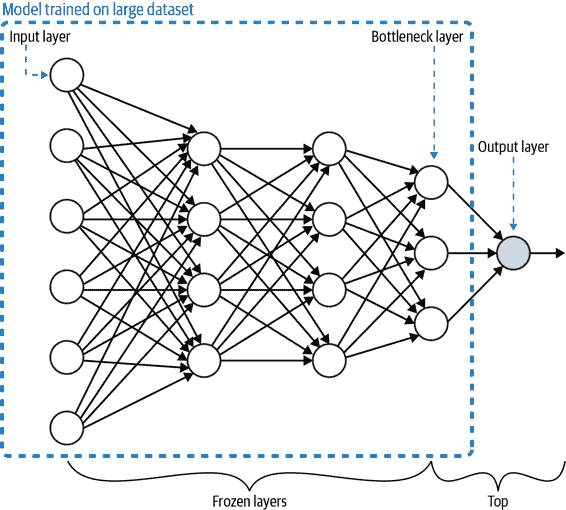

###### 图 4-13\. 迁移学习涉及在大型数据集上训练模型。模型的“顶部”（通常只是输出层）被移除，剩余层的权重被冻结。剩余模型的最后一层被称为瓶颈层。

### 瓶颈层

在整个模型中，瓶颈层代表着输入（通常是图像或文本文档）在最低维度空间中的表示。更具体地说，当我们将数据输入模型时，前几层几乎以其原始形式查看这些数据。为了看到这是如何工作的，让我们继续使用一个医学影像的例子，但这次我们将使用一个[建模](https://oreil.ly/QfOU_)，使用[结直肠组织学数据集](https://oreil.ly/r4HHq)将组织学图像分类为八个类别之一。

要探索用于迁移学习的模型，让我们加载在 ImageNet 数据集上预训练的 VGG 模型架构：

```
vgg_model_withtop = tf.keras.applications.VGG19(
    include_top=True, 
    weights='imagenet', 
)
```

注意，我们设置了`include_top=True`，这意味着我们加载了完整的 VGG 模型，包括输出层。对于 ImageNet，该模型将图像分类为 1,000 个不同的类别，因此输出层是一个 1,000 元素的数组。让我们查看`model.summary()`的输出，以了解哪一层将被用作瓶颈层。为简洁起见，这里省略了一些中间层的信息：

```
Model: "vgg19"
_________________________________________________________________
Layer (type)                 Output Shape              Param # 
=================================================================
input_3 (InputLayer)         [(None, 224, 224, 3)]     0         
_________________________________________________________________
block1_conv1 (Conv2D)        (None, 224, 224, 64)      1792     
...more layers here...
_________________________________________________________________
block5_conv3 (Conv2D)        (None, 14, 14, 512)       2359808   
_________________________________________________________________
block5_conv4 (Conv2D)        (None, 14, 14, 512)       2359808   
_________________________________________________________________
block5_pool (MaxPooling2D)   (None, 7, 7, 512)         0         
_________________________________________________________________
flatten (Flatten)            (None, 25088)             0         
_________________________________________________________________
fc1 (Dense)                  (None, 4096)              102764544 
_________________________________________________________________
fc2 (Dense)                  (None, 4096)              16781312  
_________________________________________________________________
predictions (Dense)          (None, 1000)              4097000   
=================================================================
Total params: 143,667,240
Trainable params: 143,667,240
Non-trainable params: 0
_________________________________________________________________
```

如您所见，VGG 模型接受图像作为一个 224×224×3 像素的数组。这个 128 元素的数组然后通过连续的层（每一层可能会改变数组的维度）传递，直到在`flatten`层中被展开成一个 25,088×1 维度的数组。最后，它被送入输出层，返回一个 1,000 元素的数组（每个类在 ImageNet 中）。在这个例子中，当我们调整这个模型以在我们的医学组织学图像上进行训练时，我们将选择`block5_pool`层作为瓶颈层。瓶颈层产生一个 7×7×512 维度的数组，这是输入图像的低维表示。它保留了足够的信息以便对其进行分类。当我们将这个模型应用于我们的医学图像分类任务时，我们希望信息的提取足以成功地在我们的数据集上进行分类。

数据集的组织结构包含了(150,150,3)维度的图像数组。这个 150×150×3 的表示是*最高*维度。为了使用 VGG 模型处理我们的图像数据，我们可以按以下步骤加载它：

```
vgg_model = tf.keras.applications.VGG19(
    include_top=False, 
    weights='imagenet', 
    input_shape=((150,150,3))
)

vgg_model.trainable = False
```

通过设置`include_top=False`，我们指定要加载的 VGG 的最后一层是瓶颈层。我们传递的`input_shape`匹配我们的组织学图像的输入形状。此更新后的 VGG 模型最后几层的摘要如下所示：

```
block5_conv3 (Conv2D)        (None, 9, 9, 512)         2359808 
_________________________________________________________________
block5_conv4 (Conv2D)        (None, 9, 9, 512)         2359808 
_________________________________________________________________
block5_pool (MaxPooling2D)   (None, 4, 4, 512)         0 
=================================================================
Total params: 20,024,384
Trainable params: 0
Non-trainable params: 20,024,384
_________________________________________________________________
```

最后一层现在是我们的瓶颈层。您可能会注意到，`block5_pool`的大小为(4,4,512)，而之前为(7,7,512)。这是因为我们在实例化 VGG 时使用了一个`input_shape`参数来考虑我们数据集中图像的大小。值得注意的是，设置`include_top=False`是硬编码为使用`block5_pool`作为瓶颈层，但如果您想要自定义此过程，可以加载完整模型并删除不需要使用的任何额外层。

在这个模型准备好进行训练之前，我们需要在顶部添加几层，这些层针对我们的数据和分类任务进行了特定设置。还值得注意的是，因为我们设置了`trainable=False`，当前模型中没有可训练的参数。

###### 提示

作为一个一般的经验法则，瓶颈层通常是最后一个、最低维度的、在展平操作之前的层。

因为它们都表示降维后的特征，所以瓶颈层在概念上与嵌入类似。例如，在具有编码器-解码器架构的自编码器模型中，瓶颈层是一个嵌入。在这种情况下，瓶颈作为模型的中间层，将原始输入数据映射到更低维度的表示，解码器（网络的第二部分）使用该表示将输入映射回其原始的高维表示。要查看自编码器中瓶颈层的图示，请参见图 2-13 在第 2 章。

嵌入层本质上是一个权重查找表，将特定特征映射到向量空间中的某个维度。主要区别在于嵌入层中的权重可以训练，而所有导致并包括瓶颈层的权重都被冻结。换句话说，直到并包括瓶颈层的整个网络是不可训练的，而瓶颈层后面的层中的权重是模型中唯一可训练的层。

###### 注意

还值得注意的是，预训练的嵌入可以在迁移学习设计模式中使用。当您构建包含嵌入层的模型时，您可以利用现有（预训练的）嵌入查找表，或者从头开始训练您自己的嵌入层。

总之，迁移学习是您可以用来解决较小数据集上类似问题的解决方案。迁移学习总是使用具有不可训练冻结权重的瓶颈层。嵌入是一种数据表示类型。最终，这归结为目的。如果目的是训练类似的模型，您将使用迁移学习。因此，如果目的是更简洁地表示输入图像，您将使用嵌入。代码可能完全相同。

### 实现迁移学习

您可以使用以下两种方法之一在 Keras 中实现迁移学习：

+   自己加载预训练模型，移除瓶颈层后面的层，并添加一个新的最终层，使用您自己的数据和标签

+   使用一个预训练的[TensorFlow Hub](https://tfhub.dev)模块作为您的迁移学习任务的基础

让我们首先看看如何加载和使用自己的预训练模型。为此，我们将建立在我们之前介绍的 VGG 模型示例上。请注意，VGG 是一个模型架构，而 ImageNet 是它训练的数据。这两者共同组成了我们将用于迁移学习的预训练模型。在这里，我们使用迁移学习来对结肠镜组织学图像进行分类。原始的 ImageNet 数据集包含 1000 个标签，而我们的最终模型将仅返回 8 个我们指定的可能类别，与 ImageNet 中存在的成千上万个标签形成对比。

###### 注意

加载一个预训练模型并在其上获取*原始标签*的分类并不算是迁移学习。迁移学习是更进一步，用自己的预测任务替换模型的最终层。

我们加载的 VGG 模型将是我们的基础模型。我们需要添加几个层来展平我们的瓶颈层的输出，并将这个展平的输出馈送到一个 8 元素 softmax 数组中：

```
global_avg_layer = tf.keras.layers.GlobalAveragePooling2D()
feature_batch_avg = global_avg_layer(feature_batch)

prediction_layer = tf.keras.layers.Dense(8, activation='softmax')
prediction_batch = prediction_layer(feature_batch_avg)
```

最后，我们可以使用 `Sequential` API 来创建我们的新迁移学习模型，作为一系列层堆叠：

```
histology_model = keras.Sequential([
  vgg_model,
  global_avg_layer,
  prediction_layer
])
```

让我们注意一下在我们的迁移学习模型上使用 `model.summary()` 的输出：

```
_________________________________________________________________
Layer (type)                 Output Shape              Param # 
=================================================================
vgg19 (Model)                (None, 4, 4, 512)         20024384 
_________________________________________________________________
global_average_pooling2d (Gl (None, 512)               0 
_________________________________________________________________
dense (Dense)                (None, 8)                 4104 
=================================================================
Total params: 20,028,488
Trainable params: 4,104
Non-trainable params: 20,024,384
_________________________________________________________________
```

这里的重要部分是，在我们的瓶颈层之后，唯一可训练的参数是那些 *后续* 的参数。在这个例子中，瓶颈层是来自 VGG 模型的特征向量。编译完这个模型之后，我们可以使用我们的组织学图像数据集来训练它。

### 预训练嵌入

虽然我们可以加载一个预训练模型来自行操作，但我们也可以利用 TF Hub 中提供的许多预训练模型来实现迁移学习，TF Hub 是一个包含各种数据领域和用例的预训练模型（称为模块）库，包括分类、目标检测、机器翻译等。在 TensorFlow 中，您可以将这些模块加载为一层，然后在其上添加您自己的分类层。

要了解 TF Hub 的工作原理，让我们构建一个模型，将电影评论分类为*积极*或*消极*。首先，我们将加载一个在大型新闻文章语料库上训练的预训练嵌入模型。我们可以将此模型实例化为 `hub.KerasLayer`：

```
hub_layer = hub.KerasLayer(
    "https://tfhub.dev/google/tf2-preview/gnews-swivel-20dim/1",
    input_shape=[], dtype=tf.string, trainable=True)
```

我们可以在其上堆叠额外的层来构建我们的分类器：

```
model = keras.Sequential([
  hub_layer,
  keras.layers.Dense(32, activation='relu'),
  keras.layers.Dense(1, activation='sigmoid')                          
])
```

现在我们可以训练这个模型，将我们自己的文本数据集作为输入传递给它。结果的预测将是一个包含一个元素的数组，指示我们的模型认为给定的文本是积极的还是消极的。

## 为什么它有效

要理解为什么迁移学习有效，让我们先看一个类比。当孩子们学习他们的第一门语言时，他们会接触到许多例子，并在他们误识别某些事物时得到纠正。例如，当他们第一次学会辨认猫时，他们会看到他们的父母指向猫并说“猫”的词，这种重复会加强他们大脑中的路径。类似地，当他们说“猫”指代不是猫的动物时，他们也会得到纠正。然后，当孩子学会辨认狗时，他们不需要从头开始。他们可以使用类似的识别过程来处理稍微不同的任务。通过这种方式，孩子们建立了学习的基础。除了学习新事物，他们还学会了*如何*学习新事物。将这些学习方法应用于不同的领域，大致就是迁移学习的工作原理。

这在神经网络中如何发挥作用？在典型的卷积神经网络（CNN）中，学习是分层的。第一层学习识别图像中存在的边缘和形状。在猫的例子中，这可能意味着模型可以识别图像中猫身体边缘与背景相接触的区域。模型中的下一层开始理解边缘的组合——也许意识到图像左上角有两条边缘相交。CNN 的最终层可以将这些边缘组合在一起，形成对图像中不同特征的理解。在猫的例子中，模型可能能够识别图像顶部两个三角形状和下方的两个椭圆形状。作为人类，我们知道这些三角形状是耳朵，椭圆形状是眼睛。

我们可以在图 4-14 中看到这个过程，这是由 Zeiler 和 Fergus 进行的研究，他们解构了 CNN 以理解模型每一层激活的不同特征。在一个五层 CNN 的每一层中，这显示了给定层的图像特征映射以及实际图像。这让我们能够看到模型对图像的感知如何随着其在网络中的移动而进展。第 1 层和第 2 层仅识别边缘，第 3 层开始识别对象，第 4 层和第 5 层可以理解整个图像中的焦点。

记住，对于我们的模型而言，这些仅仅是像素值的分组。它并不知道三角形和椭圆形状是耳朵和眼睛——它只知道将特定的特征组合与它所训练的标签相关联。因此，从模型学习组成猫的特征组合的过程，并不与学习其他对象（如桌子、山或甚至名人）的特征组合的过程*有多大*不同。对于模型来说，这些只是不同的像素值、边缘和形状的组合。

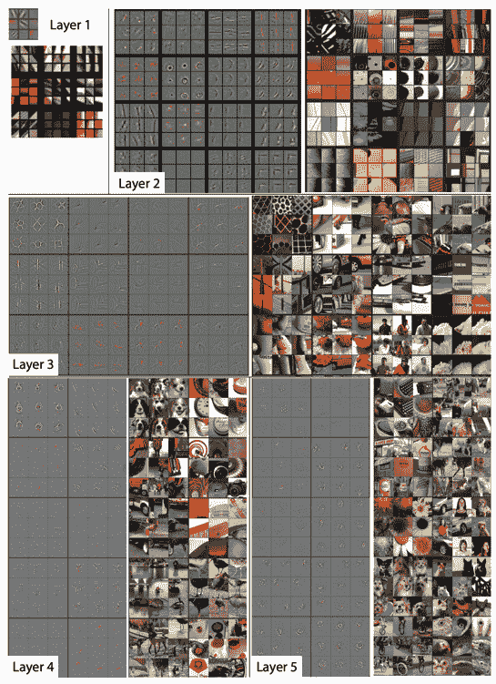

###### 图 4-14\. Zeiler 和 Fergus（2013 年）的研究解构 CNN 帮助我们可视化 CNN 如何在网络的每一层中看待图像。

## 折衷与替代方案

到目前为止，我们还没有讨论在实施迁移学习时如何修改原始模型的权重。在这里，我们将探讨两种方法：特征提取和微调。我们还将讨论为什么迁移学习主要集中在图像和文本模型上，并查看文本句子嵌入与迁移学习之间的关系。

### 微调与特征提取

*特征提取*描述了一种迁移学习的方法，其中您冻结了瓶颈层之前的所有层的权重，并在您自己的数据和标签上训练后续层。另一个选择是代替地*微调*预训练模型的层权重。通过微调，您可以更新预训练模型中每一层的权重，或者只是在瓶颈之前的几层。使用微调训练迁移学习模型通常比特征提取需要更长的时间。正如在我们的文本分类示例中所示，当初始化 TF Hub 层时，我们将`trainable=True`。这是微调的一个示例。

当进行微调时，通常会将模型初始层的权重保持冻结状态，因为这些层已经训练用于识别基本特征，这些特征通常在许多类型的图像中都是共通的。例如，要微调一个 MobileNet 模型，我们会将`trainable=False`仅应用于模型的一部分层，而不是将每一层都设置为不可训练。例如，要在第 100 层之后进行微调，我们可以运行：

```
base_model = tf.keras.applications.MobileNetV2(input_shape=(160,160,3),
                                               include_top=False,
                                               weights='imagenet')

for layer in base_model.layers[:100]:
  layer.trainable =  False
```

一个推荐的确定要冻结多少层的方法被称为[*渐进微调*](https://oreil.ly/fAv1S)，它涉及在每次训练运行后逐步解冻层，以找到要微调的理想层数。如果您保持学习速率低（通常为 0.001），并且训练迭代次数相对较少，这种方法效果最好且最有效。要实施渐进微调，首先只解冻转移模型的最后一层（最靠近输出的层），并在训练后计算模型的损失。然后，逐层解冻更多的层，直到达到输入层或损失开始趋于平稳。利用这一过程确定要微调的层数。

如何确定是否要微调或冻结预训练模型的所有层？通常情况下，当你有一个小数据集时，最好将预训练模型作为特征提取器而不是进行微调。如果你重新训练一个模型的权重，而该模型很可能是在成千上万个示例上进行了训练，微调可能会导致更新后的模型对你的小数据集过拟合，并且丢失从那些成千上万个示例中学到的更一般性的信息。虽然这取决于你的数据和预测任务，但在这里所说的“小数据集”，是指具有数百或数千个训练示例的数据集。

在决定是否进行微调时，另一个要考虑的因素是您的预测任务与您正在使用的原始预训练模型的预测任务有多相似。当预测任务相似或者是前一训练的延续时，例如我们的电影评论情感分析模型，微调可以产生更高准确率的结果。当任务不同或数据集显著不同时，最好冻结所有预训练模型的层而不是进行微调。Table 4-1 总结了关键点。⁴

Table 4-1\. 帮助选择特征提取和微调的标准

| 标准 | 特征提取 | 微调 |
| --- | --- | --- |
| 数据集大小如何？ | 小 | 大 |
| 您的预测任务是否与预训练模型相同？ | 不同任务 | 相同任务，或具有相同类别分布标签的相似任务 |
| 训练时间和计算成本预算 | 低 | 高 |

在我们的文本示例中，预训练模型是在新闻文本语料库上训练的，但我们的用例是情感分析。因为这些任务不同，我们应该将原始模型作为特征提取器而不是进行微调。在图像领域中不同预测任务的例子可能是使用我们在 ImageNet 上训练的 MobileNet 模型作为在医学图像数据集上进行迁移学习的基础。尽管这两个任务都涉及图像分类，但每个数据集中的图像性质却非常不同。

### 专注于图像和文本模型

您可能已经注意到，本节中所有的示例都集中在图像和文本数据上。这是因为迁移学习主要适用于可以将类似任务应用于相同数据域的情况。然而，使用表格数据训练的模型涵盖了潜在无限数量的可能预测任务和数据类型。例如，您可以训练一个模型来预测如何定价您的活动门票，是否有人可能会违约贷款，公司下个季度的收入，出租车行程的持续时间等等。这些任务的具体数据也非常多样化，定价问题取决于艺术家和场馆信息，贷款问题则取决于个人收入，出租车行程时间则取决于城市交通模式。因此，将一个表格模型的学习迁移到另一个表格模型中存在固有的挑战。

尽管迁移学习在表格数据上尚不如在图像和文本领域普遍，但一种新的模型架构称为[TabNet](https://oreil.ly/HI5Xl)在这一领域提出了新的研究。与图像和文本模型相比，大多数表格模型需要进行重要的特征工程。TabNet 采用一种技术，首先使用无监督学习来学习表格特征的表示，然后微调这些学习到的表示以生成预测。通过这种方式，TabNet 自动化了表格模型的特征工程。

### 词嵌入与句子嵌入

到目前为止，在我们讨论的文本嵌入中，我们大多数时候都在提及*词*嵌入。另一种文本嵌入是*句子*嵌入。词嵌入代表向量空间中的单个词，而句子嵌入则代表整个句子。因此，词嵌入是上下文无关的。让我们看看以下句子的表现：

*“我把新鲜烤饼放在厨房柜台左侧。”*

注意到在那个句子中，单词*left*出现了两次，首先是动词，然后是形容词。如果我们为这个句子生成词嵌入，我们会得到每个单词的单独数组。使用词嵌入时，*left*这个词的两个实例的数组是相同的。然而，使用句子级嵌入，我们会得到一个单一的向量来代表整个句子。有几种方法可以生成句子嵌入——从对句子的词嵌入进行平均到训练一个大型语料库上的监督学习模型以生成嵌入。

这与迁移学习有何关联？后一种方法——训练监督学习模型以生成句子级嵌入——实际上是一种迁移学习形式。这是 Google 的[通用句子编码器](https://oreil.ly/Y0Ry9)（可在 TF Hub 中找到）和[BERT](https://oreil.ly/l_gQf)采用的方法。这些方法与词嵌入不同，它们不仅仅是为单个词提供权重查找。相反，它们通过在大量文本数据集上训练模型来理解*词序列*传达的含义。这样，它们被设计用于在不同的自然语言任务中进行迁移，并因此可用于构建实施迁移学习的模型。

# 设计模式 14: 分布策略

在分布策略*中*，训练循环在多个工作节点上按比例进行，通常包括缓存、硬件加速和并行化。

## 问题

这些天，大型神经网络通常具有数百万个参数，并且在大量数据上进行训练。事实上，已经证明，随着深度学习规模的增加，无论是训练示例的数量、模型参数的数量还是两者兼而有之，都会显著提高模型性能。然而，随着模型和数据规模的增加，计算和内存需求成比例增加，这使得训练这些模型所需的时间成为深度学习的最大问题之一。

GPU 提供了显著的计算提升，并使得适度大小的深度神经网络的训练时间可以接受。然而，对于在大量数据上训练的非常大型模型，单个 GPU 是不足以使训练时间变得可行的。例如，在撰写本文时，使用单个 NVIDIA M40 GPU 对 ImageNet 数据集上的 ResNet-50 进行 90 个周期的训练需要进行 10¹⁸ 个单精度操作，并且需要 14 天的时间。随着人工智能在解决复杂领域内的问题中的应用越来越广泛，以及像 TensorFlow 和 PyTorch 这样的开源库使得构建深度学习模型更加可访问，类似 ResNet-50 的大型神经网络已经成为常态。

这是一个问题。如果训练你的神经网络需要两周的时间，那么在你可以迭代新想法或尝试调整设置之前，你必须等待两周。此外，对于一些复杂的问题，如医学影像、自动驾驶或语言翻译，将问题分解成较小的组件或仅使用数据子集并不总是可行的。只有使用完整的数据规模，你才能评估事物是否有效。

训练时间直接转化为金钱。在无服务器机器学习世界中，与其购买昂贵的 GPU，不如通过云服务提交训练作业，您将按照训练时间付费。无论是为了购买 GPU 还是为了购买无服务器训练服务，训练模型的成本都会迅速累积。

是否有办法加速这些大型神经网络的训练？

## 解决方案

加速训练的一种方法是通过训练循环中的分发策略。有不同的分发技术，但共同的想法是将训练模型的工作分散到多台机器上。有两种方法可以实现这一点：*数据并行* 和 *模型并行*。在数据并行中，计算被分割到不同的机器上，并且不同的工作节点在训练数据的不同子集上进行训练。在模型并行中，模型被分割，并且不同的工作节点负责模型的不同部分的计算。在本节中，我们将专注于数据并行，并展示如何在 TensorFlow 中使用 `tf.distribute.Strategy` 库进行实现。我们将在 “权衡和替代方案” 中讨论模型并行。

要实现数据并行，必须有一种方法让不同的工作节点计算梯度并共享该信息，以更新模型参数。这确保了所有工作节点的一致性，并使每个梯度步骤都能有效地训练模型。广义上说，数据并行可以同步或异步进行。

### 同步训练

在同步训练中，工作节点并行训练不同的输入数据片段，并且在每个训练步骤结束时聚合梯度值。这是通过*全局归约*算法实现的。这意味着每个工作节点（通常是 GPU）都有设备上的模型副本，对于单个随机梯度下降（SGD）步骤，一小批数据被分割给各个不同的工作节点。每个设备使用其部分的小批量数据进行前向传递，并计算模型的每个参数的梯度。然后从每个设备收集并聚合这些局部计算的梯度（例如，平均值），以生成每个参数的单个梯度更新。中央服务器保存模型参数的最新副本，并根据从多个工作节点收到的梯度执行梯度步骤。一旦根据这个聚合梯度步骤更新了模型参数，新模型将与下一小批量数据的另一个分割一起发送回工作节点，并且这个过程重复进行。图 4-15 展示了同步数据分布的典型全局归约架构。

与任何并行策略一样，这会引入额外的开销来管理工作节点之间的时间和通信。大型模型可能会导致 I/O 瓶颈，因为在训练期间从 CPU 传输数据到 GPU，并且慢网络也可能会引起延迟。

在 TensorFlow 中，`tf.distribute.MirroredStrategy` 支持在同一台机器上多个 GPU 上进行同步分布式训练。每个模型参数都会在所有工作节点上进行镜像并存储为一个称为 `MirroredVariable` 的概念变量。在全局归约步骤中，所有梯度张量都会在每个设备上可用。这有助于显著减少同步的开销。还有许多其他的全局归约算法实现可用，其中许多使用[NVIDIA NCCL](https://oreil.ly/HX4NE)。

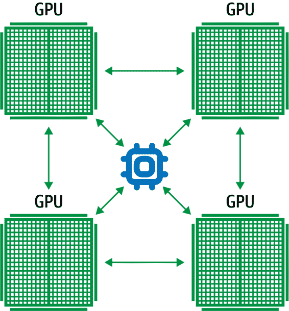

###### 图 4-15\. 在同步训练中，每个工作节点持有模型副本，并使用训练数据小批量的一个片段计算梯度。

要在 Keras 中实现这种镜像策略，首先创建一个镜像分布策略的实例，然后将模型的创建和编译移动到该实例的范围内。以下代码展示了如何在训练三层神经网络时使用 `MirroredStrategy`：

```
mirrored_strategy = tf.distribute.MirroredStrategy()
with mirrored_strategy.scope():
    model = tf.keras.Sequential([tf.keras.layers.Dense(32, input_shape=(5,)),
                                 tf.keras.layers.Dense(16, activation='relu'),
                                 tf.keras.layers.Dense(1)])
    model.compile(loss='mse', optimizer='sgd')
```

在此范围内创建模型时，模型参数被创建为镜像变量而不是常规变量。在将模型拟合到数据集时，一切操作与之前完全相同。模型代码保持不变！将模型代码包装在分发策略范围内即可启用分布式训练。`MirroredStrategy` 处理在可用 GPU 上复制模型参数、聚合梯度等工作。要训练或评估模型，只需像往常一样调用 `fit()` 或 `evaluate()`：

```
model.fit(train_dataset, epochs=2)
model.evaluate(train_dataset)
```

训练期间，每个输入数据批次均平均分配给多个工作进程。例如，如果使用两个 GPU，则批量大小为 10 的数据将在这两个 GPU 之间分割，每个 GPU 每步接收 5 个训练样本。Keras 中还有其他同步分发策略，如 `CentralStorageStrategy` 和 `MultiWorkerMirroredStrategy`。`MultiWorkerMirroredStrategy` 不仅能够在单台机器上的 GPU 上进行分布，还能在多台机器上进行分布。在 `CentralStorageStrategy` 中，模型变量不是镜像的；相反，它们被放置在 CPU 上，并且操作在所有本地 GPU 上被复制。因此，变量更新仅发生在一个地方。

在选择不同的分发策略时，最佳选项取决于您的计算机拓扑结构以及 CPU 和 GPU 之间通信的速度。表 4-2 总结了这些策略在这些标准下的比较情况。

表 4-2\. 在选择分发策略时，取决于您的计算机拓扑结构以及 CPU 和 GPU 之间通信的速度

|  | 更快的 CPU-GPU 连接 | 更快的 GPU-GPU 连接 |
| --- | --- | --- |
| 单台机器多个 GPU | `CentralStorageStrategy` | `MirroredStrategy` |
| 多台机器多个 GPU | `MultiWorkerMirroredStrategy` | `MultiWorkerMirroredStrategy` |

### 异步训练

在异步训练中，各工作进程独立地训练不同切片的输入数据，并且模型权重和参数通过异步方式更新，通常通过 [参数服务器架构](https://oreil.ly/Wkk5B) 实现。这意味着没有一个工作进程需要等待来自其他工作进程的模型更新。在参数服务器架构中，有一个单一的参数服务器管理模型权重的当前值，如 图 4-16。

与同步训练类似，每个 SGD 步骤的数据小批量被分割并分配给每个独立的工作进程。每个设备使用其分配的数据小批量进行前向传播，并计算模型参数的梯度。这些梯度被发送到参数服务器，执行参数更新，然后将新的模型参数发送回工作进程，以进行下一个数据小批量的处理分割。

同步训练与异步训练的关键区别在于参数服务器不执行*all*-reduce 操作。相反，它根据自上次计算以来接收到的梯度更新周期性地计算新的模型参数。通常，异步分发比同步训练实现更高的吞吐量，因为慢速工作节点不会阻塞训练步骤的进展。如果一个工作节点失败，训练将继续计划中的其他工作节点进行，而该工作节点重新启动。因此，在训练过程中可能会丢失一些小批量的分割，这使得准确跟踪处理了多少个 epoch 的数据变得困难。这也是为什么我们在训练大型分布式作业时通常指定虚拟 epoch 而不是真正的 epoch 的另一个原因；请参阅“设计模式 12：检查点”以讨论虚拟 epoch。

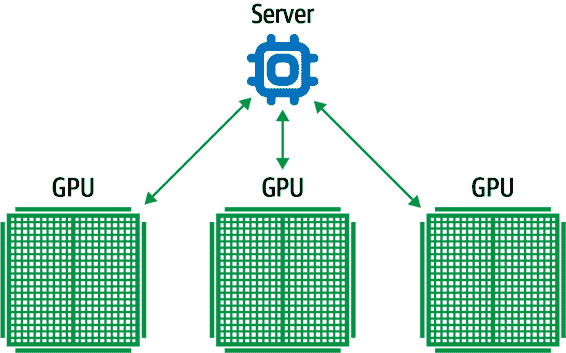

###### 在异步训练中，每个工作节点使用小批量的梯度下降步骤，没有一个工作节点等待来自其他工作节点的模型更新。

此外，由于权重更新之间没有同步，一个工作节点基于过时的模型状态可能更新模型权重。然而，在实践中，这似乎不是一个问题。通常，大型神经网络经过多个 epoch 的训练，这些小的差异最终变得可以忽略不计。

在 Keras 中，`ParameterServerStrategy`在多台机器上实现异步参数服务器训练。在使用此分发方式时，一些机器被指定为工作节点，而另一些机器则作为参数服务器。参数服务器保存模型的每个变量，并在工作节点上执行计算，通常是在 GPU 上。

实现与 Keras 中其他分发策略类似。例如，在您的代码中，只需用`ParameterServerStrategy()`替换`MirroredStrategy()`。

###### Tip

另一个在 Keras 中支持的值得一提的分发策略是`OneDeviceStrategy`。此策略将其作用域内创建的任何变量放置在指定的设备上。这种策略在切换到实际分发到多个设备/机器的其他策略之前，作为测试代码的一种有效方式。

同步和异步训练各有其优缺点，选择其中之一往往取决于硬件和网络限制。

同步训练对于低速设备或者网络连接差的情况尤为脆弱，因为训练会因为等待所有工作节点更新而停滞不前。这意味着在所有设备都在单个主机上且具有高速设备（例如 TPU 或 GPU）和强大链接时，同步分发是首选。另一方面，如果存在许多低功率或不可靠的工作节点，异步分发则更为合适。如果单个工作节点失败或者在返回梯度更新时停滞，它不会阻碍整个训练循环。唯一的限制是 I/O 约束。

## 为何这样做有效

大型复杂神经网络需要大量训练数据才能有效果。分布式训练方案显著增加了这些模型处理的数据吞吐量，并且可以有效地将训练时间从几周缩短到几小时。在工作节点和参数服务器任务之间共享资源会大幅增加数据吞吐量。图 4-17 比较了不同分发设置下训练数据吞吐量的情况，例如图像。⁵ 最显著的是，随着工作节点数量的增加，吞吐量也在增加，即使参数服务器执行的任务与 GPU 工作节点上的计算无关，将工作负载分配给更多机器仍然是最有利的策略。

此外，数据并行化可以在训练期间加快收敛时间。在类似的研究中，显示增加工作节点会更快地达到最小损失⁶。图 4-18 比较了不同分发策略下达到最小训练损失所需的时间。随着工作节点数量的增加，达到最小训练损失的时间显著减少，仅使用 8 个工作节点比使用 1 个工作节点速度提升了近 5 倍。

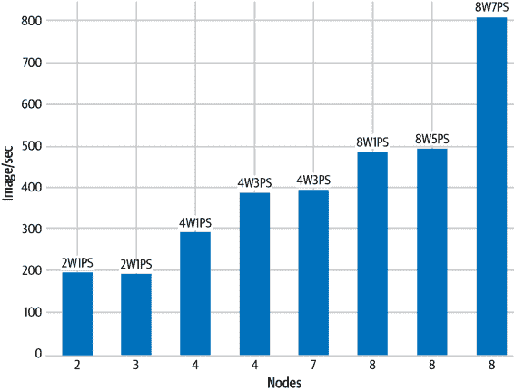

###### 图 4-17。比较不同分发设置之间的吞吐量。这里，2W1PS 表示两个工作节点和一个参数服务器。

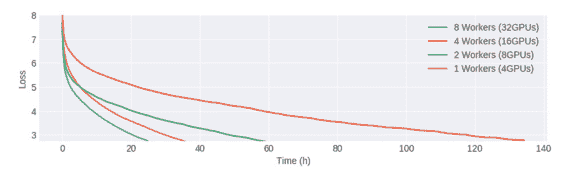

###### 图 4-18。随着 GPU 数量的增加，训练收敛时间缩短。

## 权衡与替代方案

除了数据并行化外，还有其他分发方式需要考虑，例如模型并行化、其他训练加速器（例如 TPU）以及其他因素（例如 I/O 限制和批处理大小）。

### 模型并行化

在某些情况下，神经网络非常庞大，无法适应单个设备的内存；例如，[Google 的神经机器翻译](https://oreil.ly/xL4Cu)拥有数十亿个参数。为了训练这么大的模型，必须将其分割到多个设备上，如图 4-19 所示。这称为*模型并行性*。通过将网络的部分及其相关计算分布到多个核心上，计算和内存负载分布到多个设备上。每个设备在训练过程中处理相同的小批量数据，但仅执行与模型各部分相关的计算。

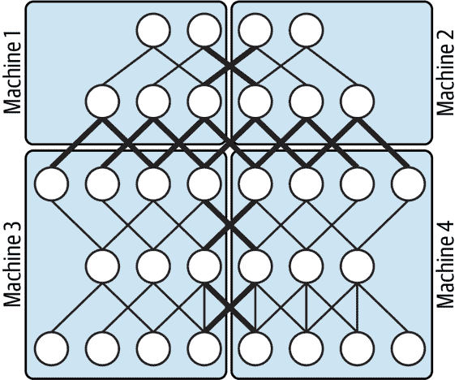

###### 图 4-19\. 模型并行性将模型分割到多个设备上。

### ASIC 提升性能降低成本

加速训练过程的另一种方法是加速底层硬件，例如使用特定应用集成电路（ASIC）。在机器学习中，这指的是专门设计的硬件组件，旨在优化训练循环核心的大型矩阵计算性能。Google Cloud 中的 TPU 是既用于模型训练又用于预测的 ASIC。类似地，Microsoft Azure 提供 Azure FPGA（现场可编程门阵列），它也是一种像 ASIC 一样的自定义机器学习芯片，但可以随时间重新配置。这些芯片能够极大地缩短在大型复杂神经网络模型上训练的时间至准确度。在 GPU 上训练两周的模型，在 TPU 上几小时内就可以收敛。

使用自定义机器学习芯片还有其他优势。例如，随着加速器（GPU、FPGA、TPU 等）的速度提升，I/O 成为 ML 训练中的一个重要瓶颈。许多训练过程浪费时间等待读取和移动数据到加速器，等待梯度更新进行全局归约。TPU Pod 具有高速互联，因此我们不太担心 Pod 内部的通信开销（一个 Pod 由数千个 TPU 组成）。此外，磁盘上有大量的可用内存，这意味着可以预先获取数据，并减少对 CPU 的调用次数。因此，应使用更大的批量大小，以充分利用像 TPU 这样高内存、高互联的芯片。

在分布式训练方面，`TPUStrategy`允许您在 TPU 上运行分布式训练作业。在内部，`TPUStrategy`与`MirroredStrategy`相同，尽管 TPU 有自己的全局归约算法实现。

使用`TPUStrategy`与在 TensorFlow 中使用其他分布策略类似。其中一个区别在于，您必须首先设置`TPUClusterResolver`，指向 TPU 的位置。目前在 Google Colab 上可以免费使用 TPU，而在那里您不需要为`tpu_address`指定任何参数。

```
cluster_resolver = tf.distribute.cluster_resolver.TPUClusterResolver(
    tpu=tpu_address)
tf.config.experimental_connect_to_cluster(cluster_resolver)
tf.tpu.experimental.initialize_tpu_system(cluster_resolver)
tpu_strategy = tf.distribute.experimental.TPUStrategy(cluster_resolver)
```

### 选择批量大小

另一个需要考虑的重要因素是批量大小。特别是对于同步数据并行性，当模型特别大时，最好减少总训练迭代次数，因为每个训练步骤需要更新后的模型在不同的工作节点之间共享，从而导致传输时间减慢。因此，尽可能增加小批量大小非常重要，这样可以通过更少的步骤实现相同的性能。

然而，[已经表明](https://oreil.ly/FOtIX)非常大的批量大小会对随机梯度下降的收敛速度以及最终解的质量产生不利影响。⁸ 图 4-20 显示，仅增加批量大小最终导致了 top-1 验证错误的增加。事实上，他们认为，线性缩放学习率作为大批量大小的函数是必要的，以保持低验证错误同时减少分布式训练时间。

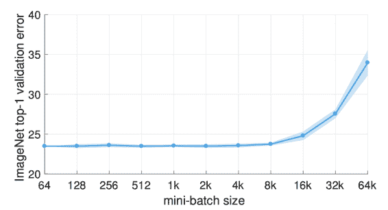

###### 图 4-20\. 大批量训练已被证明会对最终训练模型的质量产生不利影响。

因此，在分布式训练环境中设置小批量大小是一个复杂的优化空间，因为它既影响模型的统计精度（泛化），又影响硬件效率（利用率）。[相关工作](https://oreil.ly/yeALI)专注于此优化，引入了一种称为 LAMB 的逐层自适应大批量优化技术，能够将 BERT 的训练时间从 3 天缩短到仅 76 分钟。

### 最小化 I/O 等待

GPU 和 TPU 可以比 CPU 更快地处理数据，在使用多个加速器的分布式策略时，I/O 管道可能难以跟上，从而创建更有效的训练瓶颈。具体来说，在一个训练步骤完成之前，下一个步骤的数据尚未准备好进行处理。这在图 4-21 中有所展示。CPU 处理输入管道：从存储中读取数据，预处理并发送到加速器进行计算。随着分布式策略加快训练速度，更有必要拥有高效的输入管道来充分利用可用的计算能力。

可以通过多种方式实现这一目标，包括使用优化的文件格式如 TFRecords，并使用 TensorFlow 的 `tf.data` API 构建数据管道。`tf.data` API 能够处理大量数据，并且具有内置的转换功能，有助于创建灵活、高效的管道。例如，`tf.data.Dataset.prefetch` 可以使预处理和模型执行在训练步骤中重叠，因此当模型执行训练步骤 *N* 时，输入管道正在读取和准备训练步骤 *N + 1* 的数据，如图 4-22 所示。

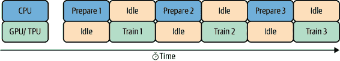

###### 图 4-21\. 通过多个 GPU/TPU 进行分布式训练，需要高效的输入管道。

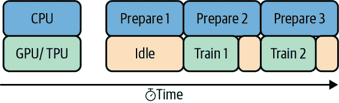

###### 图 4-22\. 预取重叠预处理和模型执行，因此当模型执行一个训练步骤时，输入管道正在读取和准备下一个步骤的数据。

# 设计模式 15：超参数调优

在超参数调优中，训练循环本身被插入到一种优化方法中，以找到最优的模型超参数集。

## 问题

在机器学习中，模型训练涉及寻找最优的断点集（决策树的情况下）、权重（神经网络的情况下）或支持向量（支持向量机的情况下）。我们称这些为 *模型* 参数。然而，为了进行模型训练并找到最优的模型参数，我们经常需要硬编码各种事物。例如，我们可能决定树的最大深度为 5（决策树的情况下），或者激活函数将为 ReLU（神经网络的情况下），或选择我们将使用的核函数集（在 SVM 中）。这些参数称为 *超参数*。

模型参数指的是模型学习到的权重和偏置。你无法直接控制模型参数，因为它们很大程度上取决于你的训练数据、模型架构以及许多其他因素。换句话说，你不能手动设置模型参数。模型的权重是用随机值初始化的，然后在训练迭代过程中由模型进行优化。另一方面，超参数是指你作为模型构建者可以控制的任何参数。它们包括学习率、迭代次数、模型中的层数等。

### 手动调整

因为你可以手动选择不同超参数的值，你的第一反应可能是尝试错误来找到最优的超参数组合。这种方法对于在几秒或几分钟内完成训练的模型可能有效，但对于需要大量训练时间和基础设施的大型模型来说，成本会很快上升。想象一下，你正在训练一个图像分类模型，需要在 GPU 上花费数小时来完成训练。你先确定了几个要尝试的超参数值，然后等待第一次训练运行的结果。根据这些结果，你调整超参数，再次训练模型，将结果与第一次运行的结果进行比较，然后通过查看具有最佳指标的训练运行来确定最佳的超参数值。

这种方法存在一些问题。首先，你已经花了将近一天的时间和大量计算资源来完成这个任务。其次，你无法确定是否找到了最优的超参数组合。你只尝试了两种不同的组合，而且因为你同时更改了多个值，所以不知道哪个参数对性能影响最大。即使进行额外的尝试，采用这种方法也会迅速消耗你的时间和计算资源，并且可能得不到最优的超参数值。

###### 注意

我们在这里使用术语*试验*来指代使用一组超参数值进行的单次训练运行。

### 网格搜索与组合爆炸

较结构化的试错方法的更完整版本称为*网格搜索*。当使用网格搜索进行超参数调整时，我们选择要优化的每个超参数的可能值列表。例如，在 scikit-learn 的`RandomForestRegressor()`模型中，假设我们想为模型的`max_depth`和`n_estimators`超参数尝试以下组合的值：

```
grid_values = {
  'max_depth': [5, 10, 100],
  'n_estimators': [100, 150, 200]
}
```

使用网格搜索，我们将尝试每个指定值的组合，然后使用在我们模型上产生最佳评估指标的组合。让我们看看如何在预先安装了 scikit-learn 的波士顿房价数据集上的随机森林模型上运行这个方法。我们可以通过创建`GridSearchCV`类的一个实例并传递我们之前定义的值来运行网格搜索训练模型：

```
from sklearn.ensemble import RandomForestRegressor
from sklearn.datasets import load_boston

X, y = load_boston(return_X_y=True)
housing_model = RandomForestRegressor()

grid_search_housing = GridSearchCV(
   housing_model, param_grid=grid_vals, scoring='max_error')
grid_search_housing.fit(X, y)
```

注意这里的评分参数是我们希望优化的度量标准。在这个回归模型的情况下，我们希望使用导致模型误差最低的超参数组合。要从网格搜索中获得最佳值组合，我们可以运行 `grid_search_housing.best_params_`。返回以下内容：

```
{'max_depth': 100, 'n_estimators': 150}
```

我们希望将这与训练随机森林回归模型（*没有*超参数调优）得到的误差进行比较，使用 scikit-learn 的这些参数的默认值。这种网格搜索方法在我们上面定义的小例子上效果还行，但是对于更复杂的模型，我们可能希望优化超过两个超参数，每个参数有广泛的可能值。最终，网格搜索将导致*组合爆炸*——随着我们添加额外的超参数和值到我们的选项网格中，需要尝试的可能组合数量以及尝试它们所需的时间显著增加。

另一个问题是，在选择不同组合时没有应用逻辑。网格搜索本质上是一种蛮力解决方案，尝试每一个可能的数值组合。假设在某个`max_depth`值之后，我们模型的误差增加了。网格搜索算法不会从之前的试验中学习，因此它不会知道在某个阈值之后停止尝试`max_depth`值。它会简单地尝试你提供的每一个数值，不管结果如何。

###### 注

scikit-learn 支持一种称为`RandomizedSearchCV`的网格搜索替代方法，它实现了*随机搜索*。与从一个集合中尝试每个可能的超参数组合不同，您确定要为每个超参数随机抽样值的次数。要在 scikit-learn 中实现随机搜索，我们会创建一个`RandomizedSearchCV`实例，并传递一个类似上面`grid_values`的字典，指定*范围*而不是具体的值。随机搜索运行速度比网格搜索快，因为它不会尝试所有可能值的每一种组合，但是很可能最优的超参数集不会在随机选择的集合中。

对于稳健的超参数调优，我们需要一个解决方案，可以扩展并从先前试验中学习，以找到超参数值的最佳组合。

**## 解决方案

`keras-tuner`库实现了在 Keras 中直接进行超参数搜索的贝叶斯优化。要使用`keras-tuner`，我们在一个接受超参数参数的函数中定义我们的模型，这里称为`hp`。然后我们可以在函数中使用`hp`，无论我们想在哪里包含一个超参数，指定超参数的名称、数据类型、我们想要搜索的值范围以及每次尝试新值时递增多少。

在我们定义 Keras 模型中的层时，我们不会硬编码超参数值，而是使用超参数变量来定义。在这里，我们希望调整神经网络第一个隐藏层中的神经元数量：

```
keras.layers.Dense(hp.Int('first_hidden', 32, 256, step=32), activation='relu')
```

`first_hidden` 是我们给这个超参数起的名字，32 是我们为其定义的最小值，256 是最大值，并且在我们定义的范围内，每次应增加此值 32。如果我们正在构建一个 MNIST 分类模型，我们将传递给 `keras-tuner` 的完整函数可能如下所示：

```
def build_model(hp):
 model = keras.Sequential([
  keras.layers.Flatten(input_shape=(28, 28)),
  keras.layers.Dense(
    hp.Int('first_hidden', 32, 256, step=32), activation='relu'),
  keras.layers.Dense(
    hp.Int('second_hidden', 32, 256, step=32), activation='relu'),
  keras.layers.Dense(10, activation='softmax')
])

 model.compile(
   optimizer=tf.keras.optimizers.Adam(
     hp.Float('learning_rate', .005, .01, sampling='log')),
   loss='sparse_categorical_crossentropy', 
   metrics=['accuracy'])

 return model
```

`keras-tuner` 库支持许多不同的优化算法。在这里，我们将使用贝叶斯优化来实例化我们的调优器，并优化验证精度：

```
import kerastuner as kt

tuner = kt.BayesianOptimization(
    build_model,
    objective='val_accuracy',
    max_trials=10
)
```

运行调优作业的代码类似于使用 `fit()` 训练我们的模型。当这个过程运行时，我们将能够看到每个试验中选择的三个超参数的值。作业完成后，我们可以看到导致最佳试验的超参数组合。在 图 4-23 中，我们可以看到使用 `keras-tuner` 进行单次试验运行的示例输出。

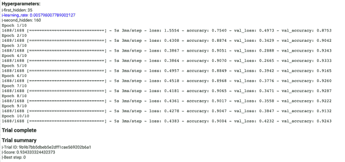

###### 图 4-23。使用 `keras-tuner` 进行一次超参数调优试验的输出。在顶部，我们可以看到调优器选择的超参数，在摘要部分，我们可以看到生成的优化指标。

除了这里显示的示例之外，`keras-tuner` 还提供了我们尚未涵盖的其他功能。您可以通过在循环内定义一个 `hp.Int()` 参数来尝试不同层数的模型，并且您还可以为超参数提供一组固定的值而不是一个范围。对于更复杂的模型，`hp.Choice()` 参数可以用于尝试不同类型的层，如 `BasicLSTMCell` 和 `BasicRNNCell`。`keras-tuner` 可在任何可以训练 Keras 模型的环境中运行。

## 为什么它有效

尽管网格搜索和随机搜索比超参数调优的试错方法更高效，但对于需要大量训练时间或具有大型超参数搜索空间的模型，它们很快变得昂贵。

由于机器学习模型本身和超参数搜索过程都是优化问题，我们可以使用一种学习方法来找到在给定可能值范围内的最优超参数组合，就像我们的模型从训练数据中学习一样。

我们可以把超参数调优看作是一个外部优化循环（参见图 4-24），其中内部循环包括典型的模型训练。虽然我们将神经网络描绘为正在优化其参数的模型，但这种解决方案适用于其他类型的机器学习模型。此外，尽管更常见的用例是从所有潜在的超参数中选择一个最佳模型，但在某些情况下，超参数框架可以用来生成一个作为集成的模型族（参见第 3 章中集合模式的讨论）。

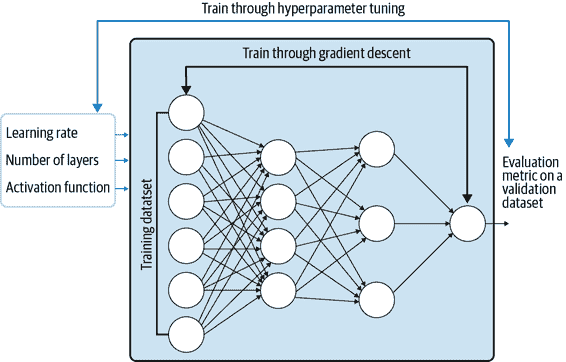

###### 图 4-24\. 超参数调优可以看作是一个外部优化循环。

### 非线性优化

需要调优的超参数分为两组：与模型*架构*相关的参数和与模型*训练*相关的参数。模型架构的超参数，例如模型中的层数或每层的神经元数，控制着机器学习模型底层的数学函数。与模型训练相关的参数，例如 epoch 数、学习率和批大小，控制着训练循环，通常与梯度下降优化器的工作方式有关。考虑到这两类参数，显然总体模型函数关于这些超参数不是可微的。

内部训练循环是可微分的，通过随机梯度下降可以寻找最优参数。通过随机梯度训练的机器学习模型单步可能只需几毫秒。另一方面，超参数调优问题的单次试验涉及在训练数据集上训练完整的模型，可能需要数小时。此外，超参数的优化问题必须通过适用于非可微问题的非线性优化方法来解决。

一旦我们决定使用非线性优化方法，我们的度量选择范围就更广了。这个度量将在验证数据集上评估，并不一定与训练损失相同。对于分类模型，你的优化度量可能是准确率，因此你希望找到导致模型准确率最高的超参数组合，即使损失是二元交叉熵。对于回归模型，你可能希望优化中位数绝对误差，即使损失是平方误差。在这种情况下，你会希望找到导致*最低*均方误差的超参数。这个度量甚至可以基于业务目标进行选择。例如，我们可能选择最大化预期收入或最小化由于欺诈造成的损失。

### 贝叶斯优化

贝叶斯优化是一种优化黑盒函数的技术，最早由[乔纳斯·莫库斯在 1970 年代开发](https://oreil.ly/Ak24H)。该技术已应用于许多领域，并首次应用于[2012 年的超参数调整](https://oreil.ly/KkGlG)。在这里，我们将重点介绍贝叶斯优化与超参数调整的关系。在这个背景下，机器学习模型是我们的*黑盒函数*，因为 ML 模型会根据我们提供的输入产生一组输出，而无需我们了解模型本身的内部细节。训练 ML 模型的过程被称为调用*目标函数*。

贝叶斯优化的目标是尽可能少地直接训练我们的模型，因为这样做成本很高。请记住，每次我们在模型上尝试新的超参数组合时，都需要运行整个模型的训练周期。对于像我们上面训练的 scikit-learn 模型这样的小模型来说，这似乎微不足道，但对于许多生产模型来说，训练过程需要大量基础设施和时间。

代替每次尝试新的超参数组合来训练我们的模型，贝叶斯优化定义了一个新的函数，模拟我们的模型但运行成本要低得多。这称为*替代函数*—该函数的输入是您的超参数值，输出是优化度量。替代函数的调用频率远高于目标函数，其目标是在完成模型训练之前找到最佳的超参数组合。采用这种方法，与网格搜索相比，每次试验为选择超参数花费了更多计算时间。但是，因为这比每次尝试不同超参数时运行我们的目标函数要便宜得多，所以使用替代函数的贝叶斯方法更可取。生成替代函数的常见方法包括[高斯过程](https://oreil.ly/-Srjj)或[树结构帕尔森估计器](https://oreil.ly/UqxDd)。

到目前为止，我们已经涉及了贝叶斯优化的不同部分，但它们如何协同工作呢？首先，我们必须选择要优化的超参数，并为每个超参数定义一系列值的范围。这一过程是手动的，并且将定义我们的算法将搜索优化值的空间。我们还需要定义我们的目标函数，这是调用我们模型训练过程的代码。从那里，贝叶斯优化开发一个替代函数来模拟我们的模型训练过程，并使用该函数来确定在我们的模型上运行的最佳超参数组合。只有当这个替代函数认为找到了一个好的超参数组合时，我们才会对我们的模型进行完整的训练运行（试验）。然后将这些结果反馈给替代函数，并且重复这个过程，直到达到我们指定的试验次数为止。

## 折中与替代方案

遗传算法是超参数调整的替代方案，但它们通常需要比贝叶斯方法更多的模型训练运行。我们还将向您展示如何使用托管服务优化模型，该服务适用于多种 ML 框架构建的超参数调整。

### 完全托管的超参数调整

由于我们希望试验同时进行，并且随着模型训练时间延长，机器出错和其他故障的可能性增加，`keras-tuner`方法可能无法扩展到大型机器学习问题。因此，提供黑盒优化的完全托管和弹性方法对于超参数调整非常有用。一个实施贝叶斯优化的托管服务示例是由 Google Cloud AI Platform 提供的[超参数调整服务](https://oreil.ly/MO8FZ)。这项服务基于 Google 内部使用的[Vizier](https://oreil.ly/tScQa)，这是一个黑盒优化工具。

云服务的基本概念与`keras-tuner`类似：您指定每个超参数的名称、类型、范围和比例，并且这些值在您的模型训练代码中被引用。我们将向您展示如何在 AI Platform 上运行超参数调整，使用基于 BigQuery natality 数据集训练的 PyTorch 模型来预测婴儿的出生体重。

第一步是创建一个*config.yaml*文件，指定您希望作业优化的超参数，以及有关作业的其他一些元数据。使用云服务的一个好处是，您可以通过在 GPU 或 TPU 上运行并在多个参数服务器上分布来扩展调整作业。在此配置文件中，您还要指定您希望运行的超参数试验总数以及您希望并行运行的这些试验数量。并行运行的试验越多，作业运行得越快。但是，较少并行运行试验的好处是，服务将能够从每个已完成试验的结果中学习，以优化接下来的试验。

对于我们的模型，一个使用 GPU 的示例配置文件可能如下所示。在这个例子中，我们将调整三个超参数——模型的学习率，[优化器的动量值](https://oreil.ly/8mHPQ)，以及模型隐藏层中的神经元数量。我们还指定了我们的优化度量标准。在这个例子中，我们的目标是*最小化*在验证集上的模型损失：

```
trainingInput:
 scaleTier: BASIC_GPU
 parameterServerType: large_model
 workerCount: 9
 parameterServerCount: 3
 hyperparameters:
 goal: MINIMIZE
 maxTrials: 10
 maxParallelTrials: 5
 hyperparameterMetricTag: val_error
 enableTrialEarlyStopping: TRUE
 params:
 - parameterName: lr
 type: DOUBLE
 minValue: 0.0001
 maxValue: 0.1
 scaleType: UNIT_LINEAR_SCALE
 - parameterName: momentum
 type: DOUBLE
 minValue: 0.0
 maxValue: 1.0
 scaleType: UNIT_LINEAR_SCALE
 - parameterName: hidden-layer-size
 type: INTEGER
 minValue: 8
 maxValue: 32
 scaleType: UNIT_LINEAR_SCALE
```

###### 注意

而不是使用配置文件来定义这些值，您还可以使用 AI 平台 Python API 来完成这些操作。

为了做到这一点，我们需要向我们的代码中添加一个参数解析器，该解析器将指定我们在上述文件中定义的参数，然后在我们的模型代码中引用这些超参数。

接下来，我们将使用 PyTorch 的`nn.Sequential` API 和 SGD 优化器构建我们的模型。由于我们的模型预测婴儿体重为浮点数，因此这将是一个回归模型。我们使用`args`变量指定每个超参数，该变量包含在我们的参数解析器中定义的变量：

```
import torch.nn as nn

model = nn.Sequential(nn.Linear(num_features, args.hidden_layer_size),
                      nn.ReLU(),
                      nn.Linear(args.hidden_layer_size, 1))

optimizer = torch.optim.SGD(model.parameters(), lr=args.lr, 
                            momentum=args.momentum)
```

在我们的模型训练代码结尾，我们将创建一个`HyperTune()`的实例，并告诉它我们试图优化的度量标准。这将报告每次训练运行后我们优化度量标准的结果值。重要的是，我们选择的任何优化度量标准都应该在我们的测试或验证数据集上计算，而不是在我们的训练数据集上：

```
import hypertune

hpt = hypertune.HyperTune()

val_mse = 0
num_batches = 0

criterion = nn.MSELoss()

with torch.no_grad():
    for i, (data, label) in enumerate(validation_dataloader):
        num_batches += 1
        y_pred = model(data)
        mse = criterion(y_pred, label.view(-1,1))
        val_mse += mse.item()

    avg_val_mse = (val_mse / num_batches)

hpt.report_hyperparameter_tuning_metric(
    hyperparameter_metric_tag='val_mse',
    metric_value=avg_val_mse,
    global_step=epochs        
)
```

一旦我们将训练作业提交到 AI 平台，我们就可以在云控制台中监控日志。在每次试验完成后，您将能够看到为每个超参数选择的值以及您优化度量标准的结果值，如图 4-25 所示。

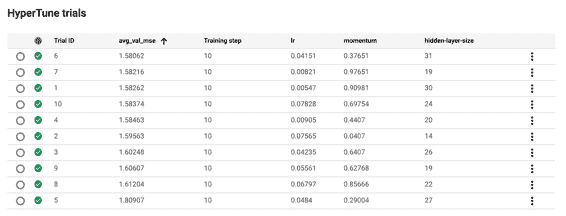

###### 图 4-25\. AI 平台控制台中 HyperTune 摘要的示例。这是一个 PyTorch 模型优化三个模型参数的摘要，目标是在验证数据集上最小化均方误差。

默认情况下，AI 平台训练将使用贝叶斯优化来进行调优作业，但您也可以指定是否希望改用网格或随机搜索算法。云服务还通过多个训练作业优化您的超参数搜索 *跨* 训练作业。如果我们运行另一个类似上述作业的训练作业，但对超参数和搜索空间进行了一些微调，它将利用上次作业的结果，有效地为下一组试验选择数值。

我们在这里展示了一个 PyTorch 的例子，但您可以通过打包您的训练代码并提供一个 *setup.py* 文件来安装任何库依赖项，利用 AI 平台训练进行任何机器学习框架的超参数调整。

### 遗传算法

我们探索了多种超参数优化算法：手动搜索、网格搜索、随机搜索和贝叶斯优化。另一个不太常见的选择是遗传算法，它大致基于查尔斯·达尔文的进化理论，即“适者生存”。该理论认为，群体中表现最好（“适者”）的成员将生存下来，并将其基因传给未来的后代，而表现较差的成员则不会。遗传算法已应用于不同类型的优化问题，包括超参数调整。

关于超参数搜索，遗传算法首先通过定义一个 *适应度函数* 来工作。该函数衡量特定试验的质量，通常可以由您模型的优化度量（准确率、误差等）来定义。在定义适应度函数后，您随机选择几组超参数的组合，并针对每个组合运行一次试验。然后，您选择表现最佳的试验的超参数，并使用这些值来定义您的新搜索空间。这个搜索空间成为您的新“种群”，您可以使用它生成新的数值组合，用于下一组试验。您可以继续这个过程，逐渐减少您运行的试验数量，直到达到满足您需求的结果。

由于它们利用先前试验的结果来改进，遗传算法比手动搜索、网格搜索和随机搜索更“智能”。然而，当超参数搜索空间很大时，遗传算法的复杂性增加。与贝叶斯优化中使用代理函数作为模型训练的代理不同，遗传算法需要为每种可能的超参数值组合训练您的模型。此外，截至撰写本文时，遗传算法较不常见，支持它们进行超参数调优的 ML 框架也较少。

本章重点讨论了修改机器学习典型 SGD 训练循环的设计模式。我们首先看了*有用的过拟合* 模式，涵盖了过拟合有益的情况。例如，当使用数据驱动方法如机器学习来近似解复杂动力系统或 PDEs 时，目标是在训练集上过拟合。过拟合也是在开发和调试 ML 模型架构时的一种有用技术。接下来，我们讨论了*模型检查点* 及其在训练 ML 模型时的使用方法。在这种设计模式中，我们定期保存模型的完整状态。这些检查点可以作为最终模型使用，例如在早停止的情况下，或者在训练失败或微调时作为起始点使用。

*迁移学习* 设计模式涵盖了重新使用先前训练模型的部分内容。当您自己的数据集有限时，迁移学习是利用预训练模型学习特征提取层的有效方法。它还可以用于对在大规模通用数据集上训练的预训练模型进行微调，以适应更专业的数据集。接着，我们讨论了*分布策略* 设计模式。训练大型复杂神经网络可能需要相当长的时间。分布策略提供了多种方式，可以修改训练循环，通过并行化和硬件加速器在多个工作节点上扩展执行。

最后，*超参数调整* 设计模式讨论了如何优化 SGD 训练循环本身，以适应模型的超参数。我们看到了一些有用的库，可以用来为使用 Keras 和 PyTorch 创建的模型实现超参数调整。

下一章将探讨将模型投入生产时，与*韧性*（对大量请求、尖峰流量或变更管理）相关的设计模式。

¹ 当然，并不一定是我们可以使用梯度下降来学习网络，仅仅因为存在这样一个神经网络（这就是为什么通过增加层次改变模型架构有帮助——这使得损失函数的形态更适合 SGD）。

² MLPerf v0.7 训练 Closed ResNet。来源于 www.mlperf.org 2020 年 9 月 23 日，条目 0.7-67\. MLPerf 名称和标识是商标。有关详细信息，请参阅 www.mlperf.org。

³ Jia Deng 等人，“ImageNet: A Large-Scale Hierarchical Image Database”，IEEE 计算机学会计算机视觉与模式识别会议（CVPR）（2009 年）：248–255。

⁴ 更多信息，请参阅 [“CS231n Convolutional Neural Networks for Visual Recognition](https://oreil.ly/w109T).”

⁵ Victor Campos 等人，《计算科学国际会议 ICCS 2017 上的计算机视觉深度学习算法分布式训练策略》，2017 年 6 月 12–14 日。

⁶ 同上。

⁷ Jeffrey Dean 等人，《大规模分布式深度网络》，*NIPS 会议论文集*（2012）。

⁸ Priya Goyal 等人，《准确的大批量随机梯度下降：在 1 小时内训练 ImageNet》（2017），arXiv:1706.02677v2 [cs.CV].****
