# 第五章：弹性服务的设计模式

机器学习模型的目的是在训练期间未见过的数据上进行推断。因此，一旦模型训练完毕，通常会将其部署到生产环境中，并用于根据传入请求进行预测。部署到生产环境中的软件预期是具有弹性的，并且在保持运行时需要很少的人工干预。本章中的设计模式解决了与生产 ML 模型的弹性相关的不同情况下的问题。

*Stateless Serving Function*设计模式允许服务基础架构扩展和处理每秒数千甚至数百万的预测请求。*Batch Serving*设计模式允许服务基础架构异步处理偶发或周期性的数百万到数十亿次预测请求。这些模式不仅在提高弹性方面有用，而且还减少了机器学习模型创建者和用户之间的耦合。

*持续模型评估*设计模式处理了检测部署模型不再适用的常见问题。*两阶段预测*设计模式提供了一种解决方案，用于在部署到分布式设备时保持模型的复杂性和性能。*键控预测*设计模式是实现本章讨论的多个设计模式的必要条件。

# 设计模式 16：无状态服务功能

无状态服务功能设计模式使得生产 ML 系统能够同步处理每秒数千到数百万的预测请求。生产 ML 系统围绕一个捕获训练模型体系结构和权重的无状态函数进行设计。

## 问题

让我们来看一个文本分类模型，该模型使用来自互联网电影数据库（IMDb）的电影评论作为其训练数据。对于模型的初始层，我们将使用一个预训练的嵌入，将文本映射到 20 维嵌入向量（有关完整代码，请参见[*serving_function.ipynb* notebook](https://github.com/GoogleCloudPlatform/ml-design-patterns/blob/master/05_resilience/serving_function.ipynb) 在本书的 GitHub 存储库中）：

```
model = tf.keras.Sequential()
embedding = (
        "https://tfhub.dev/google/tf2-preview/gnews-swivel-20dim-with-oov/1")
hub_layer = hub.KerasLayer(embedding, input_shape=[], 
                           dtype=tf.string, `trainable``=``True``,` name='full_text')
model.add(hub_layer)
model.add(tf.keras.layers.Dense(16, activation='relu', name='h1_dense'))
model.add(tf.keras.layers.Dense(1, name='positive_review_logits'))
```

嵌入层来自 TensorFlow Hub，并标记为可训练，以便我们可以对 IMDb 评论中的词汇进行微调（详见“设计模式 13：迁移学习”在第四章中）。随后的层是一个简单的神经网络，具有一个隐藏层和一个输出对数层。然后，这个模型可以在电影评论数据集上进行训练，以学习预测评论是正面还是负面。

一旦模型训练完毕，我们可以使用它进行推断，判断评论的积极程度：

```
review1 = 'The film is based on a prize-winning novel.'
review2 = 'The film is fast moving and has several great action scenes.'
review3 = 'The film was very boring. I walked out half-way.'
logits = `model``.``predict`(x=tf.constant([review1, review2, review3]))
```

结果是一个可能类似于的二维数组：

```
[[ 0.6965847]
 [ 1.61773  ]
 [-0.7543597]]
```

在内存对象（或加载到内存中的可训练对象）上调用 `model.predict()` 进行推断存在几个问题，正如前面代码片段所述：

+   我们必须将整个 Keras 模型加载到内存中。文本嵌入层设置为可训练，可能会很大，因为它需要存储英文词汇的嵌入。具有许多层的深度学习模型也可能会很大。

+   前述架构对可达到的延迟施加了限制，因为必须逐个调用 `predict()` 方法。

+   尽管数据科学家选择的编程语言是 Python，但模型推断可能会由偏好其他语言的开发人员编写的程序调用，或者在需要不同语言的移动平台（如 Android 或 iOS）上调用。

+   用于训练最有效的模型输入和输出可能不够用户友好。在我们的例子中，模型输出为 [logits](https://oreil.ly/qCWdH)，因为它对于梯度下降更好。这就是为什么输出数组中的第二个数字大于 1 的原因。客户通常希望对其进行 sigmoid 处理，使输出范围为 0 到 1，并以更用户友好的格式解释。我们希望在服务器上进行这种后处理，以便客户端代码尽可能简单。类似地，模型可能已经是从压缩的二进制记录中训练出来的，而在生产环境中，我们可能希望能够处理像 JSON 这样的自描述输入格式。

## 解决方案

解决方案由以下步骤组成：

1.  将模型导出为捕获模型数学核心且与编程语言无关的格式。

1.  在生产系统中，“前向”计算模型的公式被恢复为无状态函数。

1.  无状态函数部署到提供 REST 端点的框架中。

### 模型导出

解决方案的第一步是将模型导出为一种格式（TensorFlow 使用 [SavedModel](https://oreil.ly/9TjS3)，但 [ONNX](https://onnx.ai) 是另一个选择），该格式捕获了模型的数学核心。整个模型状态（学习率、丢失率、短路等）不需要保存，只需计算输出所需的数学公式。通常，训练后的权重值在数学公式中是常数。

在 Keras 中，通过以下方式实现：

```
model.save('export/mymodel')
```

SavedModel 格式依赖于[协议缓冲区](https://oreil.ly/g3Vjc)以实现跨平台、高效的恢复机制。换句话说，`model.save()`方法将模型写入协议缓冲区（扩展名为`.pb`），并将训练好的权重、词汇表等外部化到其他文件中，采用标准的目录结构：

```
*`export``/``.``.``.``/``variables``/``variables``.``data``-``00000``-``of``-``00001`*
*`export``/``.``.``.``/``assets``/``tokens``.``txt`*
*`export``/``.``.``.``/``saved_model``.``pb`*
```

### Python 中的推断

在生产系统中，模型的公式从协议缓冲区及其他相关文件中恢复为一个无状态函数，该函数符合特定的模型签名，包括输入和输出变量名及数据类型。

我们可以使用 TensorFlow 的 `saved_model_cli` 工具检查导出文件，以确定我们可以在服务中使用的无状态函数的签名：

```
saved_model_cli show --dir ${export_path} \
     --tag_set serve --signature_def serving_default
```

这样就输出了：

```
The given SavedModel SignatureDef contains the following input(s):
  inputs['full_text_input'] tensor_info:
      dtype: DT_STRING
      shape: (-1)
      name: serving_default_full_text_input:0
The given SavedModel SignatureDef contains the following output(s):
  outputs['positive_review_logits'] tensor_info:
      dtype: DT_FLOAT
      shape: (-1, 1)
      name: StatefulPartitionedCall_2:0
Method name is: tensorflow/serving/predict

```

签名指定预测方法接受一个作为输入的单元素数组（称为`full_text_input`），其类型为字符串，并输出一个名为`positive_review_logits`的浮点数。这些名称来自我们分配给 Keras 层的名称：

```
hub_layer = hub.KerasLayer(..., name=`'``full_text``'`)
...
model.add(tf.keras.layers.Dense(1, name=`'``positive_review_logits``'`))
```

下面是如何获取服务函数并用于推断：

```
serving_fn = tf.keras.models.load_model(export_path). \
                     signatures[`'``serving_default``'`]
outputs = serving_fn(`full_text_input`=
                     tf.constant([review1, review2, review3]))
logit = outputs['positive_review_logits']
```

注意我们在代码中使用了服务函数的输入和输出名称。

### 创建 Web 端点

上述代码可以放入 Web 应用程序或无服务器框架，如 Google App Engine、Heroku、AWS Lambda、Azure Functions、Google Cloud Functions、Cloud Run 等。所有这些框架的共同点是它们允许开发人员指定需要执行的函数。这些框架会自动扩展基础架构，以处理每秒大量预测请求，并保持低延迟。

例如，我们可以在 Cloud Functions 中调用服务函数如下：

```
serving_fn = None
def handler(request):
    global serving_fn
    if serving_fn is None:
        serving_fn = (tf.keras.models.load_model(export_path)
                              .signatures['serving_default'])
    request_json = request.get_json(silent=True)
    if request_json and 'review' in request_json:
        review = request_json['review']
        outputs = serving_fn(`full_text_input`=tf.constant([review]))
        return outputs[`'``positive_review_logits``'`] 
```

注意，我们应该谨慎地将服务函数定义为全局变量（或单例类），以免在每个请求的响应中重新加载它。实际上，服务函数将仅在冷启动时从导出路径（在 Google Cloud Storage 上）重新加载。

## 为何有效

将模型导出为无状态函数，并在 Web 应用程序框架中部署这一方法之所以有效，是因为 Web 应用程序框架提供了自动扩展功能，可以完全托管，并且与编程语言无关。对于可能缺乏机器学习经验的软件和业务开发团队来说，这些框架也是熟悉的。对于敏捷开发也有好处——机器学习工程师或数据科学家可以独立更改模型，而应用程序开发人员只需更改他们正在访问的端点。

### 自动扩展

将 Web 端点扩展到每秒数百万次请求是一个众所周知的工程问题。与其构建专门用于机器学习的服务，不如依赖几十年来在构建可靠 Web 应用和 Web 服务器方面所做的工程工作。云服务提供商知道如何高效地自动扩展 Web 端点，且热启动时间最小。

我们甚至不需要自己编写服务系统。大多数现代企业机器学习框架都配备了服务子系统。例如，TensorFlow 提供 TensorFlow Serving，PyTorch 提供 TorchServe。如果使用这些服务子系统，我们只需提供导出的文件，软件便会自动创建 Web 端点。

### 完全托管

云平台也抽象化了 TensorFlow Serving 等组件的管理和安装。因此，在 Google Cloud 上，将服务功能部署为 REST API 就像运行这个命令行程序一样简单，只需提供 SavedModel 输出的路径：

```
gcloud ai-platform versions create ${MODEL_VERSION} \
       --model ${MODEL_NAME} --origin ${MODEL_LOCATION} \
       --runtime-version $TFVERSION
```

在 Amazon 的 SageMaker 中，部署 TensorFlow SavedModel 同样简单，使用如下命令实现：

```
model = Model(model_data=MODEL_LOCATION, role='SomeRole')
predictor = model.deploy(initial_instance_count=1,
                         instance_type='ml.c5.xlarge')
```

在设置了 REST 端点后，我们可以发送一个 JSON 预测请求，格式如下：

```
{"instances":
  [
      {"reviews": "The film is based on a prize-winning novel."},
      {"reviews": "The film is fast moving and has several great action scenes."},
      {"reviews": "The film was very boring. I walked out half-way."}
  ]
}
```

我们返回的预测值也被封装在 JSON 结构中：

```
{"predictions": [{ "positive_review_logits": [0.6965846419334412]},
                 {"positive_review_logits": [1.6177300214767456]},
                 {"positive_review_logits": [-0.754359781742096]}]}
```

###### 提示

通过允许客户端发送带有多个实例的 JSON 请求，即所谓的 *批处理*，我们允许客户端在较少的网络调用和发送更多请求时增加并行化之间进行权衡。

除了批处理，还有其他方法可以提高性能或降低成本。例如，使用更强大的 GPU 通常有助于提升深度学习模型的性能。选择具有多个加速器和/或线程的机器有助于提高每秒请求的数量。使用自动扩展的机器集群可以帮助降低尖峰工作负载的成本。这些调整通常由 ML/DevOps 团队完成；其中一些是特定于机器学习的，另一些则不是。

### 语言中立

所有现代编程语言都可以使用 REST，且提供了一个发现服务来自动生成必要的 HTTP 存根。因此，Python 客户端可以如下调用 REST API。请注意，下面的代码没有特定于框架的内容。因为云服务抽象了我们的 ML 模型的具体细节，我们不需要提供任何关于 Keras 或 TensorFlow 的引用：

```
credentials = GoogleCredentials.get_application_default()
api = discovery.build("ml", "v1", credentials = credentials,
            discoveryServiceUrl = "https://storage.googleapis.com/cloud-
ml/discovery/ml_v1_discovery.json")

request_data = {"instances":
 [
  {"reviews": "The film is based on a prize-winning novel."},
  {"reviews": "The film is fast moving and has several great action scenes."},
  {"reviews": "The film was very boring. I walked out half-way."}
 ]
}

parent = "projects/{}/models/imdb".format("PROJECT", "v1")
response = api.projects().predict(body = request_data, 
                                  name = parent).execute()
```

上述   上述代码的等效写法可以用多种语言实现（我们展示 Python 是因为我们假设你对它有所了解）。在本书撰写时，开发者[可以从 Java、PHP、.NET、JavaScript、Objective-C、Dart、Ruby、Node.js 和 Go 中访问 Discovery API](https://oreil.ly/zCZir)。

### 强大的生态系统

由于 Web 应用程序框架被广泛使用，有很多工具可用于测量、监视和管理 Web 应用。如果我们将 ML 模型部署到 Web 应用程序框架中，可以使用软件可靠性工程师（SREs）、IT 管理员和 DevOps 人员熟悉的工具对模型进行监控和节流。他们不必了解任何关于机器学习的知识。

同样，您的业务发展同事知道如何使用 API 网关对 Web 应用进行计量和货币化。他们可以借鉴这些知识并将其应用于对机器学习模型进行计量和货币化。

## 折衷和替代方案

就像[David Wheeler 的一个笑话](https://oreil.ly/uskud)所说，计算机科学中任何问题的解决方案都是添加额外的间接层。引入导出的无状态函数规范提供了额外的间接层。无状态服务函数设计模式允许我们更改服务签名以提供额外的功能，如超出 ML 模型功能的额外预处理和后处理。事实上，可以使用此设计模式为模型提供多个端点。此设计模式还有助于为在数据仓库等长时间运行查询系统上训练的模型创建低延迟的在线预测。

### 自定义服务函数

我们文本分类模型的输出层是一个 Dense 层，其输出范围为(-∞,∞)：

```
model.add(tf.keras.layers.Dense(1, name='positive_review_logits'))
```

我们的损失函数考虑到了这一点：

```
model.compile(optimizer='adam',
              loss=tf.keras.losses.BinaryCrossentropy(
                      from_logits=True),
              metrics=['accuracy'])
```

当我们用该模型进行预测时，模型自然返回其训练预测的内容并输出 logits。然而，客户期望的是评论为积极的概率。为了解决这个问题，我们需要返回模型的 sigmoid 输出。

我们可以通过编写一个自定义服务函数并导出它来实现这一点。这里是一个在 Keras 中的自定义服务函数，它添加了一个概率并返回一个包含每个输入评论的 logits 和概率的字典：

```
@tf.function(input_signature=[tf.TensorSpec([None], 
                              dtype=tf.string)])
def add_prob(`reviews`):
    logits = model(reviews, training=False) # call model
    probs = tf.sigmoid(logits)
    return {
        'positive_review_logits' : logits,
        'positive_review_probability' : probs
    }
```

然后我们可以将以上函数导出为默认服务：

```
model.save(export_path, 
           signatures={'serving_default': add_prob})
```

`add_prob`方法定义保存在导出路径中，并将在响应客户请求时被调用。

导出模型的服务签名反映了新的输入名称（请注意`add_prob`的输入参数名称）和输出字典键及其数据类型：

```
The given SavedModel SignatureDef contains the following input(s):
  inputs['reviews'] tensor_info:
      dtype: DT_STRING
      shape: (-1)
      name: serving_default_reviews:0
The given SavedModel SignatureDef contains the following output(s):
  outputs['positive_review_logits'] tensor_info:
      dtype: DT_FLOAT
      shape: (-1, 1)
      name: StatefulPartitionedCall_2:0
  outputs['positive_review_probability'] tensor_info:
      dtype: DT_FLOAT
      shape: (-1, 1)
      name: StatefulPartitionedCall_2:1
Method name is: tensorflow/serving/predict
```

当此模型部署并用于推断时，输出的 JSON 包含 logits 和概率：

```
{'predictions': [
   {'positive_review_probability': [0.6674301028251648], 
    'positive_review_logits': [0.6965846419334412]}, 
   {`'``p``o``s``i``t``i``v``e``_``r``e``v``i``e``w``_``p``r``o``b``a``b``i``l``i``t``y``'``:` `[``0``.``8``3``4``4``8``1``8``3``5``3``6``5``2``9``5``4``]`,
    'positive_review_logits': [1.6177300214767456]}, 
   {'positive_review_probability': [0.31987208127975464], 
    'positive_review_logits': [-0.754359781742096]}
]}
```

请注意，`add_prob`是我们编写的一个函数。在这种情况下，我们对输出进行了一些后处理。但是，我们可以在该函数内进行几乎任何（无状态的）操作。

### 多个签名

模型通常支持多个目标或有不同需求的客户端。虽然输出字典可以让不同的客户端取出他们想要的任何东西，但在某些情况下可能不是理想的。例如，我们必须调用的函数以从 logits 获取概率只是`tf.sigmoid()`。这相当便宜，即使对于会丢弃它的客户端也没有问题。另一方面，如果该函数很昂贵，在不需要该值的客户端上计算它会增加相当大的开销。

如果少数客户端需要非常昂贵的操作，则有助于提供多个服务签名，并让客户端告知服务框架要调用哪个签名。这是通过在导出模型时指定一个非`serving_default`的名称来完成的。例如，我们可以使用以下方式写出两个签名：

```
model.save(export_path, signatures={
        'serving_default': func1,
        'expensive_result': func2,
   })
```

然后，输入 JSON 请求包括签名名称，以选择所需模型的哪个服务端点：

```
{
  "signature_name": "expensive_result",
   {"instances": …}
}

```

### 在线预测

因为导出的服务函数最终只是一个文件格式，所以在原始机器学习训练框架不原生支持在线预测时，它可以用来提供在线预测能力。

例如，我们可以通过在新生儿数据集上训练逻辑回归模型来推断婴儿是否需要关注：

```
CREATE OR REPLACE MODEL 
 mlpatterns.neutral_3classes OPTIONS(model_type='logistic_reg', 
  input_label_cols=['health']) AS
SELECT 
IF
 (apgar_1min = 10, 
  'Healthy',
 IF
  (apgar_1min >= 8, 
   'Neutral', 
   'NeedsAttention')) AS health,
 plurality,
 mother_age,
 gestation_weeks,
 ever_born
FROM 
 `bigquery-public-data.samples.natality`
WHERE 
 apgar_1min <= 10
```

模型训练完成后，我们可以使用 SQL 进行预测：

```
SELECT * FROM ML.PREDICT(MODEL mlpatterns.neutral_3classes,
    (SELECT 
     2 AS plurality,
     32 AS mother_age,
     41 AS gestation_weeks,
     1 AS ever_born
    )
)
```

然而，BigQuery 主要用于分布式数据处理。虽然用它来训练千兆字节数据上的 ML 模型很棒，但在单行数据上进行推断并不是最佳选择——延迟可能高达一到两秒。相反，`ML.PREDICT`功能更适合批量服务。

为了进行在线预测，我们可以要求 BigQuery 将模型导出为 TensorFlow SavedModel：

```
bq extract -m --destination_format=`ML_TF_SAVED_MODEL` \
     mlpatterns.neutral_3classes  gs://${BUCKET}/export/baby_health
```

现在，我们可以将 SavedModel 部署到像 Cloud AI Platform 这样支持 SavedModel 的服务框架中，以获得低延迟、自动扩展的 ML 模型服务优势。查看 GitHub 中的[notebook](https://github.com/GoogleCloudPlatform/ml-design-patterns/blob/master/05_resilience/serving_function.ipynb)获取完整代码。

即使不存在将模型导出为 SavedModel 的能力，我们也可以提取权重，编写数学模型来执行线性模型，将其容器化，并部署容器映像到服务平台。

### 预测库

而不是将服务函数部署为可以通过 REST API 调用的微服务，可以将预测代码实现为库函数。库函数在第一次调用时加载导出的模型，使用提供的输入调用`model.predict()`，并返回结果。需要在应用程序中进行预测的应用程序开发人员可以包含该库。

如果模型由于物理原因（没有网络连接）或性能约束而无法通过网络调用，则库函数是比微服务更好的选择。库函数方法还将计算负担放在客户端上，从预算的角度来看，这可能更可取。在希望在浏览器中运行模型时，使用`TensorFlow.js`的库方法可以避免跨站点问题。

库方法的主要缺点是模型的维护和更新困难——所有使用模型的客户端代码都必须更新为使用新版本的库。模型更新得越频繁，微服务方法就越有吸引力。第二个缺点是，库方法仅限于已编写库的编程语言，而 REST API 方法则可以打开模型给几乎任何现代编程语言编写的应用。

库开发者应注意使用线程池和并行化来支持所需的吞吐量。然而，通常存在此方法可达到的可扩展性限制。

# 设计模式 17：批量服务

批量服务设计模式使用通常用于分布式数据处理的软件基础设施，一次性对大量实例进行推断。

## 问题

通常情况下，预测是按需单独进行的。无论信用卡交易是否欺诈性，在处理付款时确定。无论婴儿是否需要重症监护，都是在婴儿出生后立即检查时确定的。因此，当你将模型部署到机器学习服务框架时，它被设置为处理一个实例，或者最多几千个实例，嵌入在一个单一请求中。

正如在“设计模式 16：无状态服务功能”中讨论的那样，服务框架的架构设计为同步尽可能快速地处理单个请求。服务基础设施通常设计为微服务，将重计算（如深度卷积神经网络）卸载到高性能硬件，如张量处理单元（TPU）或图形处理单元（GPU），并最小化与多个软件层相关的低效率。

然而，有些情况下需要异步地对大量数据进行预测。例如，确定是否重新订购库存商品（SKU）可能是每小时执行一次的操作，而不是每次 SKU 在收银机上被购买时都执行。音乐服务可能为每位用户创建个性化的每日播放列表并将其推送给这些用户。个性化播放列表不是根据用户与音乐软件的每次交互按需创建的。因此，机器学习模型需要一次对数百万个实例进行预测，而不是逐个实例进行预测。

尝试将设计为一次处理一个请求的软件端点发送到数百万个 SKU 或数十亿用户将会使机器学习模型不堪重负。

## 解决方案

批量服务设计模式使用分布式数据处理基础设施（MapReduce、Apache Spark、BigQuery、Apache Beam 等）异步地对大量实例进行机器学习推断。

在讨论无状态服务功能设计模式时，我们训练了一个文本分类模型，用于输出一个评价是正面还是负面。假设我们想将这个模型应用于向美国消费者金融保护局（CFPB）投过投诉的每一个投诉。

我们可以将 Keras 模型加载到 BigQuery 中，操作如下（完整代码在[GitHub 的笔记本](https://github.com/GoogleCloudPlatform/ml-design-patterns/blob/master/05_resilience/batch_serving.ipynb)中提供）：

```
CREATE OR REPLACE MODEL mlpatterns.imdb_sentiment
OPTIONS(`model_type``=``'tensorflow'`, model_path='gs://.../*')
```

通常情况下，人们会使用 BigQuery 中的数据来训练模型，但在这里我们只是加载一个外部训练好的模型。尽管如此，仍然可以使用 BigQuery 进行机器学习预测。例如，SQL 查询。

```
SELECT * FROM `ML``.``PREDICT`(MODEL mlpatterns.imdb_sentiment,
  (SELECT 'This was very well done.' AS reviews)
)
```

返回了`positive_review_probability`为 0.82 的概率。

使用像 BigQuery 这样的分布式数据处理系统进行一次性预测效率不高。但是，如果我们想将机器学习模型应用于消费者金融保护局（CFPB）数据库中的每一条投诉，怎么办？¹ 我们只需简单地调整上述查询，确保在内部`SELECT`中将`consumer_complaint_narrative`列别名为要评估的`reviews`：

```
SELECT * FROM ML.PREDICT(MODEL mlpatterns.imdb_sentiment,
  (SELECT consumer_complaint_narrative AS reviews 
   FROM `bigquery-public-data`.cfpb_complaints.complaint_database
   WHERE consumer_complaint_narrative IS NOT NULL
   )
)
```

数据库有超过 150 万条投诉，但处理时间大约为 30 秒，证明了使用分布式数据处理框架的好处。

## 它为什么有效

无状态服务函数设计模式旨在支持数千个同时查询的低延迟服务。对数百万个项目进行偶尔或定期处理时，使用这样的框架会变得非常昂贵。如果这些请求不受延迟影响，使用分布式数据处理架构来调用数百万个项目上的机器学习模型更具成本效益。原因在于，在数百万个项目上调用 ML 模型是一个尴尬并行问题——可以将百万个项目分成 1000 组，每组 1000 个项目，将每组项目发送到一台机器，然后组合结果。项目编号 2000 上的机器学习模型的结果与项目编号 3000 上的机器学习模型的结果完全独立，因此可以分割工作并处理。

例如，查询查找五个最积极投诉的情况如下：

```
WITH all_complaints AS (
SELECT * FROM ML.PREDICT(MODEL mlpatterns.imdb_sentiment,
  (SELECT consumer_complaint_narrative AS reviews 
   FROM `bigquery-public-data`.cfpb_complaints.complaint_database
   WHERE consumer_complaint_narrative IS NOT NULL
   )
)
)
SELECT * FROM all_complaints 
ORDER BY positive_review_probability DESC LIMIT 5
```

在 BigQuery Web 控制台的执行详情中，我们看到整个查询花费了 35 秒（参见图 5-1 中标记为＃1 的方框）。

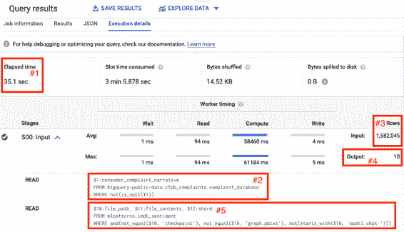

###### 图 5-1\. 在消费者金融保护局消费者投诉数据集中查找五个最“积极”投诉的查询的前两个步骤。

第一步（参见图 5-1 中的方框＃2）从 BigQuery 公共数据集中读取`consumer_complaint_narrative`列，其中投诉叙述不为`NULL`。从方框＃3 中突出显示的行数中，我们了解到这涉及读取 1582045 个值。该步骤的输出写入 10 个分片（参见图 5-1 中的方框＃4）。

第二步从这个分片中读取数据（注意查询中的`$12:shard`），但也获取机器学习模型`imdb_sentiment`的`file_path`和`file_contents`，并将模型应用于每个分片中的数据。 MapReduce 的工作方式是每个分片由一个工作器处理，因此存在 10 个分片表明第二步由 10 个工作器执行。原始的 150 万行可能存储在许多文件中，因此第一步很可能由构成该数据集的文件数量相同的工作器处理。

剩余步骤在图 5-2 中显示。

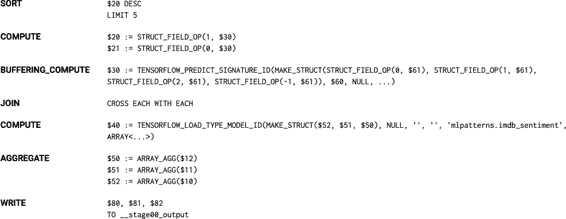

###### 图 5-2\. 查询的第三步及后续步骤，以找出五个最“积极”的投诉。

第三步将数据集按降序排序并取前五个。每个工人都会执行这个步骤，因此每个 10 个工人都会在“它们”的片段中找到 5 个最积极的投诉。剩余的步骤检索并格式化剩余的数据片段，并将其写入输出。

最后一步（未显示）将这 50 个投诉进行排序，并选择其中的 5 个作为实际结果。能够跨多个工人这样分割工作，正是使得 BigQuery 能够在 35 秒内处理完 150 万份投诉文件的关键。

## 权衡和替代方案

批量服务设计模式依赖于能够将任务分割成多个工人处理的能力。因此，它不仅限于数据仓库或 SQL。任何 MapReduce 框架都可以使用。然而，SQL 数据仓库往往是最简单的选择，尤其是在数据结构化的情况下。

尽管批量服务用于不关注延迟的情况，但可以将预计算结果和定期刷新结合起来，以便在预测输入空间有限的情况下使用。

### 批处理和流水线

像 Apache Spark 或 Apache Beam 这样的框架在需要预处理输入数据以供模型使用、如果机器学习模型输出需要后处理、或者预处理或后处理难以用 SQL 表达时非常有用。如果模型的输入是图像、音频或视频，则无法使用 SQL，必须使用能够处理非结构化数据的数据处理框架。这些框架还可以利用加速硬件如 TPU 和 GPU 来对图像进行预处理。

使用 Apache Beam 这类框架的另一个理由是客户端代码需要维护状态。客户端需要维护状态的一个常见原因是，如果 ML 模型的输入之一是时间窗口平均值。在这种情况下，客户端代码必须对传入的数据流执行移动平均，并将移动平均值提供给 ML 模型。

假设我们正在构建一个评论审核系统，并希望拒绝那些每天多次评论特定人物的人。例如，如果评论者第一次写关于奥巴马总统的事情，我们会放过他，但是对于当天的其他关于奥巴马的评论，我们会禁止该评论者继续提及。这是一个需要维护状态的后处理示例，因为我们需要计算每个评论者提及特定名人的次数。此外，这个计数器需要在一个 24 小时的滚动时间段内进行。

我们可以使用能够维护状态的分布式数据处理框架来完成这个过程。Apache Beam 就是这样一个例子。从 Apache Beam 中调用 ML 模型以识别名人的提及，并将其与规范化的知识图（例如，提及 Obama 和 President Obama 都与*en.wikipedia.org/wiki/Barack_Obama*相关联）进行关联，可以通过以下方式完成（参见 GitHub 上的[notebook](https://github.com/GoogleCloudPlatform/ml-design-patterns/blob/master/05_resilience/nlp_api.ipynb)获取完整代码）：

```
 | beam.Map(lambda x : nlp.Document(x, type='PLAIN_TEXT'))
 | nlp.AnnotateText(features)
 | beam.Map(parse_nlp_result)
```

其中`parse_nlp_result`解析通过`AnnotateText`变换传递的 JSON 请求，该变换在底层调用 NLP API。

### 批量服务的缓存结果

我们讨论了批量服务作为在通常使用无状态服务函数设计模式在线提供模型时，调用模型处理数百万项的一种方法。当然，即使模型不支持在线服务，批量服务也可以运行。重要的是，进行推断的机器学习框架能够利用尴尬并行处理。

例如，推荐引擎需要填写由每个用户-项目对组成的稀疏矩阵。一个典型的企业可能有 1000 万的历史用户和 10000 个产品目录中的项目。为了为用户做出推荐，必须为这 10000 个项目计算推荐分数，排名并将前 5 个呈现给用户。这在几乎实时的服务函数中是不可行的。然而，近乎实时的需求意味着简单地使用批量服务也不起作用。

在这种情况下，使用批量服务预先计算所有 1000 万用户的推荐：

```
SELECT
  *
FROM
  ML.RECOMMEND(MODEL mlpatterns.recommendation_model)
```

将其存储在诸如 MySQL、Datastore 或 Cloud Spanner 之类的关系型数据库中（有预构建的传输服务和 Dataflow [模板](https://github.com/GoogleCloudPlatform/DataflowTemplates/blob/master/src/main/java/com/google/cloud/teleport/templates/BigQueryToDatastore.java)可以完成此操作）。当任何用户访问时，从数据库中获取该用户的推荐内容，并立即以极低的延迟提供。

在后台，推荐定期刷新。例如，我们可以根据网站上最新的操作每小时重新训练推荐模型。然后，我们可以仅针对最近一小时访问的用户进行推断：

```
SELECT
  *
FROM
  ML.RECOMMEND(MODEL mlpatterns.recommendation_model,
    (
    SELECT DISTINCT
      visitorId
    FROM
      mlpatterns.analytics_session_data
    WHERE
      visitTime > TIME_DIFF(CURRENT_TIME(), 1 HOUR)
    ))
```

我们接着更新用于服务的关系型数据库中的相应行。

### Lambda 架构

支持在线服务和批量服务的生产 ML 系统称为[*Lambda 架构*](https://oreil.ly/jLZ46) ——这样的生产 ML 系统允许 ML 从业者在延迟（通过无状态服务功能模式）和吞吐量（通过批量服务模式）之间进行权衡。

###### 注意

[AWS Lambda](https://oreil.ly/RqPan)，尽管名字如此，不是 Lambda 架构。它是一个无服务器框架，用于扩展无状态函数，类似于 Google Cloud Functions 或 Azure Functions。

通常，Lambda 架构通过拥有在线服务和批处理服务的分离系统来支持。例如，在 Google Cloud 中，在线服务基础设施由 Cloud AI Platform Predictions 提供，而批处理服务基础设施由 BigQuery 和 Cloud Dataflow 提供（Cloud AI Platform Predictions 提供了方便的界面，使用户不必显式使用 Dataflow）。可以将 TensorFlow 模型导入 BigQuery 进行批处理服务。还可以将训练好的 BigQuery ML 模型导出为 TensorFlow SavedModel 用于在线服务。这种双向兼容性使得 Google Cloud 的用户能够在延迟和吞吐量之间的任何点上进行权衡。

# 设计模式 18：持续模型评估

持续模型评估设计模式处理了一个常见问题，即在部署的模型不再适用时需要检测并采取行动。

## 问题

所以，你已经训练好了你的模型。你收集了原始数据，进行了清洗，设计了特征，创建了嵌入层，调优了超参数，整个过程都做到了。你在留存测试集上能够达到 96%的准确率。太棒了！你甚至经历了将模型部署的繁琐过程，把它从 Jupyter 笔记本转换为生产中的机器学习模型，并通过 REST API 提供预测服务。恭喜你，你成功了。你完成了！

嗯，并不完全是这样。部署并不是机器学习模型生命周期的终点。你怎么知道你的模型在实际应用中表现如预期？如果输入数据出现意外变化怎么办？或者模型不再产生准确或有用的预测了？这些变化如何被检测到？

世界是动态的，但通常开发机器学习模型会根据历史数据创建静态模型。这意味着一旦模型投入生产，它可能会开始退化，其预测可能变得越来越不可靠。模型随时间退化的两个主要原因是概念漂移和数据漂移。

概念漂移发生在模型输入与目标之间的关系发生变化时。这经常发生是因为您的模型的基本假设发生了变化，例如针对学习对抗性或竞争性行为的模型，比如欺诈检测、垃圾邮件过滤、股票市场交易、在线广告竞价或网络安全。在这些场景中，预测模型旨在识别特定活动的特征模式（或非期望活动），而对手则学会适应并可能随着情况改变其行为。例如，考虑开发用于检测信用卡欺诈的模型。随着人们使用信用卡的方式随时间改变，信用卡欺诈的常见特征也发生了变化。例如，当“芯片和 PIN”技术推出时，欺诈交易开始更多地发生在线。随着欺诈行为的适应，在此技术之前开发的模型性能突然开始下降，并且模型预测将变得不太准确。

模型性能随时间降低的另一个原因是数据漂移。我们在“机器学习中的常见挑战”一文中介绍了数据漂移问题，该章节位于第一章中。数据漂移指的是与用于训练模型的数据相比，用于模型预测的数据发生的任何变化。数据漂移可能由多种原因引起：输入数据架构在源头发生变化（例如，上游添加或删除字段），特征分布随时间改变（例如，由于附近开设滑雪度假村，医院可能开始看到更多年轻成年人），或者即使结构/架构没有变化，数据的含义也发生了变化（例如，随着时间推移，一个病人是否被视为“超重”可能会改变）。软件更新可能引入新的错误，或者业务场景变化并创建了以前在训练数据中不可用的新产品标签。用于构建、训练和预测 ML 模型的 ETL 流水线可能脆弱且不透明，这些变化中的任何一种都会对模型的性能产生重大影响。

模型部署是一个持续的过程，要解决概念漂移或数据漂移问题，有必要使用新鲜数据更新您的训练数据集并重新训练模型以改进预测结果。但是如何知道何时需要重新训练？以及多久重新训练一次？数据预处理和模型训练可能在时间和金钱上都很昂贵，模型开发周期的每个步骤都增加了开发、监控和维护的额外开销。

## 解决方案

最直接识别模型退化的方法是持续监视模型随时间的预测性能，并使用与开发期间使用的相同评估指标评估该性能。这种持续模型评估和监控是我们确定模型或我们对模型所做任何更改是否正常工作的方法。

### 概念

这种连续评估需要访问原始预测请求数据、模型生成的预测以及真实数据，全部在同一个地方。Google Cloud AI 平台提供了配置部署模型版本的能力，以便将在线预测的输入和输出定期采样并保存到 BigQuery 中的表中。为了保持服务对每秒大量请求的性能，我们可以通过指定输入请求数量的百分比来自定义采样数据量。为了测量性能指标，有必要将这些保存的预测样本与真实数据进行结合。

在大多数情况下，直到确切的真实标签变得可用之前，可能需要一段时间。例如，对于流失模型，直到下一个订阅周期，才会知道哪些客户已经停止使用其服务。或者对于财务预测模型，真实的收入直到季度结束和收益报告后才会知道。在任何这些情况下，只有在真实数据可用之后，才能进行评估。

要了解连续评估的工作原理，我们将在 Google Cloud AI 平台上部署一个基于 HackerNews 数据集训练的文本分类模型。此示例的完整代码可以在伴随本书的存储库中的 [连续评估笔记本](https://github.com/GoogleCloudPlatform/ml-design-patterns/blob/master/05_resilience/continuous_eval.ipynb) 中找到。

### 部署模型

我们的训练数据集的输入是文章标题，其相关标签是文章来源的新闻源，可以是`nytimes`、`techcrunch`或`github`。随着新闻趋势随时间变化，与*纽约时报*标题相关的词语也会变化。同样地，新技术产品的发布将影响在 TechCrunch 上找到的词语。连续评估使我们能够监控模型预测，以跟踪这些趋势如何影响我们的模型性能，并在必要时启动重新训练。

假设模型是使用自定义服务输入函数导出的，如 “设计模式 16: 无状态服务函数” 中描述的那样：

```
@tf.function(input_signature=[tf.TensorSpec([None], dtype=tf.string)])
def source_name(text):
    labels = tf.constant(['github', 'nytimes', 'techcrunch'],dtype=tf.string)
    probs = txtcls_model(text, training=False)
    indices = tf.argmax(probs, axis=1)
    pred_source = tf.gather(params=labels, indices=indices)
    pred_confidence = tf.reduce_max(probs, axis=1)
    return {'source': pred_source,
            'confidence': pred_confidence}
```

部署了这个模型后，当我们进行在线预测时，模型将返回预测的新闻来源作为字符串值，并且与模型对于该预测标签的置信度相关的数字分数。例如，我们可以通过编写一个名为 *input.json* 的输入 JSON 示例文件来进行在线预测发送：

```
%%writefile input.json
{"text": 
"YouTube introduces Video Chapters to make it easier to navigate longer videos"}

```

这将返回以下预测输出：

```
CONFIDENCE  SOURCE
0.918685    techcrunch

```

### 保存预测

模型部署后，我们可以设置一个任务来保存一部分预测请求的样本——之所以保存样本而不是所有请求，是为了避免不必要地减慢服务系统的速度。我们可以在 Google Cloud AI Platform（CAIP）控制台的连续评估部分进行此操作，通过指定`LabelKey`（模型输出的列，在我们的例子中将是`source`，因为我们预测文章的来源）、预测输出中的`ScoreKey`（一个数值，我们的情况下是`confidence`）以及在 BigQuery 中存储在线预测请求的表。在我们的示例代码中，该表称为`txtcls_eval.swivel`。配置完成后，每当进行在线预测时，CAIP 将模型名称、模型版本、预测请求的时间戳、原始预测输入以及模型的输出流到指定的 BigQuery 表中，如 Table 5-1 所示。

Table 5-1\. 在 BigQuery 中保存在线预测请求和原始预测输出的比例表

| 行 | 模型 | 模型版本 | 时间 | 原始数据 | 原始预测 | 地面真实值 |  |
| --- | --- | --- | --- | --- | --- | --- | --- |
| 1 | txtcls | swivel | 2020-06-10 01:40:32 UTC | {"instances”: [{"text”: “Astronauts Dock With Space Station After Historic SpaceX Launch"}]} | {"predictions”: [{"source”: “github”, “confidence”: 0.9994275569915771}]} | *null* |  |
| 2 | txtcls | swivel | 2020-06-10 01:37:46 UTC | {"instances”: [{"text”: “Senate Confirms First Black Air Force Chief"}]} | {"predictions”: [{"source”: “nytimes”, “confidence”: 0.9989787340164185}]} | *null* |  |
| 3 | txtcls | swivel | 2020-06-09 21:21:47 UTC | {"instances”: [{"text”: “A native Mac app wrapper for WhatsApp Web"}]} | {"predictions”: [{"source”: “github”, “confidence”: 0.745254397392273}]} | *null* |  |

### 捕获地面真实值

对于发送给模型进行预测的每个实例，捕获地面真实值也是必要的。根据用例和数据可用性，可以通过多种方式进行。一种方法是使用人工标注服务——将发送给模型进行预测的所有实例，或者可能只是对模型信心较低的实例，发送给人工注释。大多数云服务提供商都提供某种形式的人工标注服务，以便以这种方式批量标记实例。

地面真相标签也可以根据用户与模型及其预测的互动方式推导出来。通过让用户采取特定行动，可以获得对模型预测的隐式反馈或生成地面真相标签。例如，当用户在 Google 地图中选择推荐的替代路线之一时，所选路线作为隐式地面真相。更明确地说，当用户对推荐电影进行评分时，这清楚地表明了建立用于预测用户评级以提供推荐的模型的地面真相。类似地，如果模型允许用户更改预测，例如在医疗设置中，当医生能够更改模型建议的诊断时，这提供了地面真相的明确信号。

###### 警告

重要的是要牢记模型预测的反馈循环和捕捉地面真相可能会如何影响未来的训练数据。例如，假设您建立了一个模型来预测何时会放弃购物车。您甚至可以定期检查购物车的状态，以创建模型评估的地面真相标签。然而，如果您的模型建议用户会放弃他们的购物车，并且您提供免费运输或某些折扣以影响他们的行为，那么您将永远不会知道原始模型预测是否正确。简而言之，您违反了模型评估设计的假设，并且需要以其他方式确定地面真相标签。在不同情景下估计特定结果的任务被称为反事实推理，通常在欺诈检测、医学和广告等使用案例中出现，其中模型的预测可能导致某些干预，这些干预可能会模糊该示例的实际地面真相的学习。

### 评估模型性能

最初，在 BigQuery 中`txtcls_eval.swivel`表的`groundtruth`列是空的。一旦可用，我们可以通过直接使用 SQL 命令更新值来提供地面真相标签。当然，在运行评估作业之前，我们应确保地面真相是可用的。请注意，地面真相遵循与模型预测输出相同的 JSON 结构：

```
UPDATE 
 txtcls_eval.swivel
SET 
 groundtruth = '{"predictions": [{"source": "techcrunch"}]}'
WHERE
 raw_data = '{"instances":
[{"text": "YouTube introduces Video Chapters to help navigate longer
videos"}]}'

```

更新更多行时，我们会使用`MERGE`语句而不是`UPDATE`语句。一旦地面真相已经添加到表中，就可以轻松地检查文本输入和模型预测，并与地面真相（如表 5-2）进行比较：

```
SELECT
  model,
  model_version,
  time,
  REGEXP_EXTRACT(raw_data, r'.*"text": "(.*)"') AS text,
  REGEXP_EXTRACT(raw_prediction, r'.*"source": "(.*?)"') AS prediction,
  REGEXP_EXTRACT(raw_prediction, r'.*"confidence": (0.\d{2}).*') AS confidence,
  REGEXP_EXTRACT(groundtruth, r'.*"source": "(.*?)"') AS groundtruth,
FROM
  txtcls_eval.swivel
```

表 5-2. 一旦地面真相可用，它可以添加到原始 BigQuery 表中，并且可以评估模型的性能。

| 行 | 模型 | 模型版本 | 时间 | 文本 | 预测 | 置信度 | 地面真相 |  |
| --- | --- | --- | --- | --- | --- | --- | --- | --- |
| 1 | txtcls | swivel | 2020-06-10 01:38:13 UTC | WhatsApp Web 的本地 Mac 应用程序包装器 | github | 0.77 | github |  |
| 2 | txtcls | swivel | 2020-06-10 01:37:46 UTC | **参议院确认第一位黑人空军首脑** | nytimes | 0.99 | nytimes |  |
| 3 | txtcls | swivel | 2020-06-10 01:40:32 UTC | **宇航员历史性的 SpaceX 发射后与空间站对接** | github | 0.99 | nytimes |  |
| 4 | txtcls | swivel | 2020-06-09 21:21:44 UTC | **YouTube 推出视频章节功能，以便更轻松地浏览更长的视频** | techcrunch | 0.77 | techcrunch |  |

有了这些信息在 BigQuery 中可访问，我们可以将评估表加载到一个名为 `df_evals` 的数据帧中，并直接计算该模型版本的评估指标。由于这是多类分类，我们可以计算每个类别的精确度、召回率和 F1 分数。我们还可以创建一个混淆矩阵，帮助分析模型预测在某些分类标签内的情况。图 5-3 显示了将该模型预测与地面真实标签进行比较的混淆矩阵。

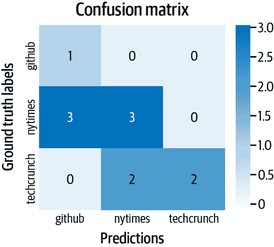

###### 图 5-3\. 混淆矩阵显示所有地面真实标签和预测标签的配对，因此您可以探索模型在不同类别内的性能。

### 持续评估

我们应确保输出表还捕获了模型版本和预测请求的时间戳，以便我们可以使用同一张表对比两个不同模型版本之间的指标。例如，如果我们部署了一个名为 `swivel_v2` 的新模型版本，该版本是根据最新数据或具有不同超参数进行训练的，我们可以通过切片评估数据帧来比较它们的性能：

```
df_v1 = df_evals[df_evals.version == "swivel"]
df_v2 = df_evals[df_evals.version == "swivel_v2"]
```

同样，我们可以创建时间段内的评估切片，仅关注最近一个月或最近一周内的模型预测：

```
today = pd.Timestamp.now(tz='UTC')
one_month_ago = today - pd.DateOffset(months=1)
one_week_ago = today - pd.DateOffset(weeks=1)

df_prev_month = df_evals[df_evals.time >= one_month_ago]
df_prev_week = df_evals[df_evals.time >= one_week_ago]
```

为了持续进行上述评估，可以安排笔记本电脑（或容器化形式）。我们可以设置它在评估指标低于某个阈值时触发模型重新训练。

## 为什么会有效

在开发机器学习模型时，有一个隐含的假设，即训练、验证和测试数据来自相同的分布，如图 5-4 所示。当我们将模型部署到生产环境时，这一假设意味着未来的数据将与过去的数据相似。然而，一旦模型在生产环境中“野外”运行，对数据的这种静态假设可能不再有效。事实上，许多生产中的机器学习系统会遇到快速变化的非静态数据，而模型随时间变得陈旧，从而对预测质量产生负面影响。

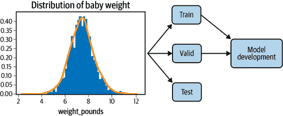

###### 图 5-4\. 在开发机器学习模型时，训练、验证和测试数据来自相同的数据分布。然而，一旦模型部署，该分布可能会改变，严重影响模型性能。

持续模型评估提供了一个框架，专门用于评估部署模型在新数据上的性能。这使我们能够尽早检测模型陈旧。这些信息有助于确定重新训练模型的频率或何时完全替换为新版本。

通过捕捉预测的输入和输出，并与真实情况进行比较，可以量化地跟踪模型的性能或者在当前环境中进行 A/B 测试以衡量不同模型版本的表现，而不考虑过去版本的表现。

## 权衡和替代方案

持续评估的目标是提供一种监控模型性能并保持生产中模型新鲜的方法。通过持续评估，可以确定何时重新训练模型的触发器。在这种情况下，重要的是考虑模型性能的容忍阈值及其所带来的权衡，以及定期重新训练的作用。还有一些技术和工具，如 TFX，通过直接监控输入数据分布来帮助预防性地检测数据和概念漂移。

### 重新训练的触发器

模型性能通常会随时间而下降。持续评估允许您以结构化方式精确测量下降程度，并提供重新训练模型的触发器。那么，这是否意味着一旦性能开始下降就应该重新训练模型？这取决于情况。这个问题的答案与业务用例紧密相关，应与评估指标和模型评估一起讨论。根据模型复杂性和 ETL 流水线，重新训练的成本可能很高。要考虑的权衡是在何种程度的性能恶化可以接受与成本相比。

阈值本身可以设置为绝对值；例如，当模型准确率低于 95% 时进行模型重新训练。或者阈值可以设置为性能变化率，例如，一旦性能开始出现下降趋势。无论哪种方法，选择阈值的理念类似于训练过程中对模型进行检查点。具有更高、更敏感的阈值时，生产中的模型保持更新，但频繁重新训练的成本更高，并且需要维护和切换不同模型版本的技术开销。阈值较低时，训练成本降低，但生产中的模型可能更陈旧。图 5-5 显示了性能阈值与模型重新训练作业数量之间的权衡。

如果模型重新训练管道由此类阈值自动触发，跟踪和验证触发器非常重要。不知道何时重新训练您的模型不可避免地会导致问题。即使流程是自动化的，您也应始终控制模型的重新训练，以便更好地理解和调试生产中的模型。

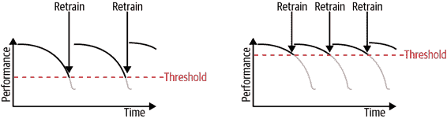

###### 图 5-5\. 设置更高的性能阈值以确保生产中的更高质量模型，但将需要更频繁的重新训练作业，这可能会很昂贵。

### 定期重新训练

持续评估为了知道何时有必要重新训练您的模型提供了关键信号。这种重新训练的过程通常是通过使用任何新收集的训练数据微调前一个模型来完成的。持续评估可能每天发生一次，而定期重新训练作业可能仅每周或每月发生一次（图 5-6）。

一旦新版本的模型训练完成，其性能将与当前模型版本进行比较。只有在新模型在当前数据测试集上表现优于先前模型时，更新后的模型才会作为替换部署。

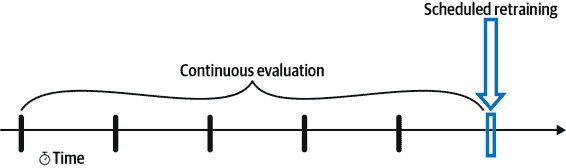

###### 图 5-6\. 持续评估在每天收集新数据时提供模型评估。定期重新训练和模型比较在离散时间点提供评估。

如何安排重新训练的频率？重新训练的时间表取决于业务用例、新数据的普遍性以及执行重新训练流水线的时间和金钱成本。有时候，模型的时间视角自然决定了何时安排重新训练作业。例如，如果模型的目标是预测下个季度的收益，因为每个季度只能获取一次新的真实标签，那么频率高于此是没有意义的。然而，如果新数据的量和发生频率很高，那么频繁进行重新训练将是有益的。这种情况的极端版本是[在线机器学习](https://oreil.ly/Mj-DA)。某些机器学习应用，如广告投放或新闻推荐，需要在线、实时决策，并可以通过不断重新训练和更新参数权重来持续改善性能。

总的来说，最佳的时间框架是你作为从业者通过经验和实验确定的。如果你试图建模一个快速变化的任务，比如对手或竞争行为，那么设置更频繁的重新训练计划是有意义的。如果问题相对静态，例如预测婴儿的出生体重，那么较少频繁的重新训练就足够了。

无论哪种情况，建立一个自动化流水线非常有帮助，它可以通过单个 API 调用执行完整的重新训练过程。像 Cloud Composer/Apache Airflow 和 AI Platform Pipelines 这样的工具非常有用，可以从原始数据预处理和训练到超参数调整和部署，创建、调度和监控机器学习工作流。我们在下一章节进一步讨论这个话题，详见“设计模式 25：工作流管道”。

### 使用 TFX 进行数据验证

数据分布随时间可能会发生变化，如图 5-7 所示。例如，考虑出生体重数据集。随着医学和社会标准随时间的变化，模型特征（如母亲年龄或妊娠周数）与模型标签——婴儿体重之间的关系也会发生变化。这种数据漂移对模型泛化到新数据的能力产生负面影响。简而言之，你的模型已经*过时*，需要用新数据重新训练。

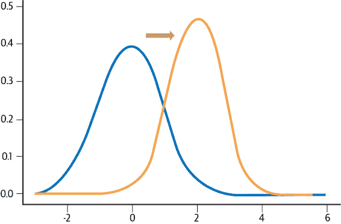

###### 图 5-7\. 数据分布随时间可能会发生变化。数据漂移是指与训练用数据相比，用于模型预测的数据发生的任何变化。

虽然持续评估提供了监控部署模型的后续方式，但监控接收到的新数据并预先识别数据分布变化也是有价值的。

TFX 的数据验证是一个有用的工具来完成这个任务。[TFX](https://oreil.ly/RP2e9) 是一个由谷歌开源的用于部署机器学习模型的端到端平台。数据验证库可以用来比较训练中使用的数据示例与服务中收集的数据示例。有效性检查可以检测数据中的异常、训练与服务中的偏差，或者数据漂移。TensorFlow 数据验证使用 [Facets](https://oreil.ly/NE-SQ)，一个用于机器学习的开源可视化工具，创建数据可视化。Facets 概述可以高层次地查看各种特征值的分布，并能发现一些常见和不常见的问题，比如意外的特征值、缺失的特征值和训练与服务中的偏差。

### 估算重新训练间隔

了解数据和概念漂移如何影响模型的一个有用且相对便宜的策略是，仅使用陈旧数据训练模型，并评估该模型在更当前的数据上的表现（图 5-8）。这模仿了离线环境中持续模型评估的过程。也就是说，收集六个月或一年前的数据，并经历通常的模型开发工作流程，生成特征，优化超参数，并捕获相关的评估指标。然后，将这些评估指标与仅一个月前收集的更近期数据的模型预测进行比较。你的陈旧模型在当前数据上表现差多少？这可以很好地估计模型性能随时间下降的速度，以及重新训练的必要性。

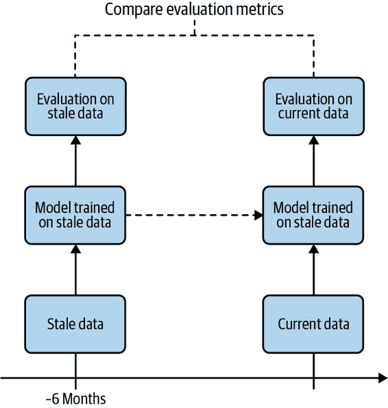

###### 图 5-8\. 在陈旧数据上训练模型，并在当前数据上评估，模仿了离线环境中持续模型评估过程。

# 设计模式 19：两阶段预测

两阶段预测设计模式提供了一种解决当需要在分布式设备上部署大型复杂模型时保持性能的方法，通过将用例分成两个阶段，只在边缘执行更简单的阶段。

## 问题

在部署机器学习模型时，我们不能总是依赖最终用户有可靠的互联网连接。在这种情况下，模型被部署在*边缘*——意味着它们被加载到用户的设备上，并且不需要互联网连接来生成预测。考虑到设备的限制，部署在边缘的模型通常需要比在云中部署的模型更小，并因此需要在模型复杂性和大小、更新频率、准确性和低延迟之间进行权衡。

存在多种场景需要我们的模型部署在边缘设备上。一个例子是健身追踪设备，模型根据通过加速计和陀螺仪跟踪的用户活动为用户提供建议。在没有连接性的远程户外区域进行锻炼时，用户可能会使用这种设备。在这些情况下，我们仍希望我们的应用程序正常工作。另一个例子是环境应用程序，该应用程序使用温度和其他环境数据预测未来趋势。在这两个示例中，即使我们有互联网连接，从部署在云中的模型连续生成预测可能会变得缓慢和昂贵。

将训练好的模型转换为适用于边缘设备的格式，通常需要经历一种称为*量化*的过程，其中学习的模型权重用较少的字节表示。例如，TensorFlow 使用名为 TensorFlow Lite 的格式来[转换](https://oreil.ly/UaMq7)保存的模型为更小的优化格式，以便在边缘提供服务。除了量化之外，用于边缘设备的模型可能也会从一开始就更小，以适应严格的内存和处理器约束。

TF Lite 使用的量化和其他技术显著减少了生成的 ML 模型的大小和预测延迟，但可能会降低模型的准确性。此外，由于我们无法始终依赖边缘设备具有连接性，及时向这些设备部署新的模型版本也是一个挑战。

通过观察在[Cloud AutoML Vision](https://oreil.ly/MWsQH)中训练边缘模型的选项，我们可以看到这些权衡在实践中是如何发挥作用的，见图 5-9。

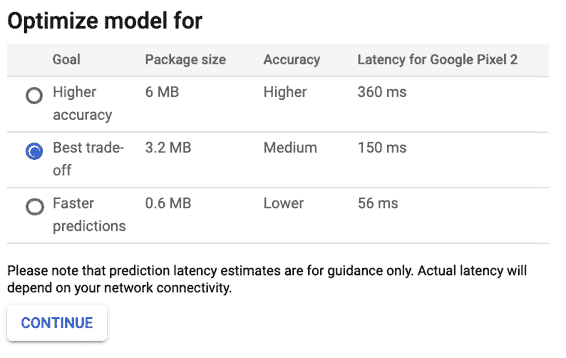

###### 图 5-9\. 在云 AutoML Vision 中为边缘部署的模型之间进行准确性、模型大小和延迟的权衡。

要考虑这些权衡，我们需要一个解决方案来平衡边缘模型的尺寸和延迟的减少与云模型的增强复杂性和准确性。

## 解决方案

使用两阶段预测设计模式，我们将问题分成两部分。我们从一个较小、成本较低的模型开始，该模型可以部署在设备上。由于这个模型通常具有较简单的任务，它可以在设备上以相对较高的准确率完成这个任务。接着是第二个更复杂的模型，部署在云端，仅在需要时触发。当然，这种设计模式要求你有一个可以分成两个具有不同复杂程度部分的问题。一个这样的问题的例子是智能设备，比如[Google Home](https://oreil.ly/3ROKg)，它们通过唤醒词激活，然后可以回答问题和响应设置闹钟、阅读新闻以及与灯光和恒温器等集成设备交互的命令。例如，Google Home 可以通过说“OK Google”或“Hey Google”来激活。一旦设备识别到唤醒词，用户可以提出更复杂的问题，比如：“你能安排和萨拉在上午 10 点的会议吗？”

这个问题可以分成两个明确的部分：一个初始模型用于监听唤醒词，另一个更复杂的模型可以理解并响应任何其他用户查询。两个模型都将执行音频识别。然而，第一个模型只需要执行二元分类：刚刚听到的声音是否匹配唤醒词？虽然这个模型在复杂性上更简单，但如果部署到云端并且需要不断运行，这将非常昂贵。第二个模型将需要音频识别和自然语言理解来解析用户的查询。这个模型只需要在用户提问时运行，但更强调高准确率。两阶段预测模式可以通过在设备上部署唤醒词模型和在云端部署更复杂的模型来解决这个问题。

除了这种智能设备的使用案例外，还有许多其他情况可以使用两阶段预测模式。比如说，你在一个工厂生产线上工作，同时许多不同的机器在运行。当一个机器停止正常工作时，通常会发出可能与故障相关的噪音。不同的噪音对应于每台不同的机器以及机器可能出现故障的不同方式。理想情况下，你可以构建一个模型来标记问题噪音并识别其含义。使用两阶段预测，你可以构建一个离线模型来检测异常声音。然后可以使用第二个云模型来确定通常的声音是否表明某种故障状态。

您还可以针对基于图像的场景使用两阶段预测模式。假设您在野外部署了摄像头以识别和追踪濒危物种。您可以在设备上有一个模型，用于检测最新捕捉的图像是否包含濒危动物。如果是，该图像将被发送到一个云模型，以确定图像中特定类型的动物。

为了说明两阶段预测模式，让我们使用来自 Kaggle 的通用音频识别[数据集](https://oreil.ly/I89Pr)。该数据集包含约 9,000 个熟悉声音的音频样本，共 41 个标签类别，包括“大提琴”，“敲门声”，“电话”，“小号”等。我们解决方案的第一阶段将是一个模型，预测给定声音是否是一种乐器。然后，对于第一个模型预测为乐器的声音，我们将从云中部署的模型中获得对 18 种可能选项中特定乐器的预测结果。图 5-10 显示了这个示例的两阶段流程。

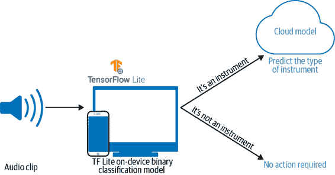

###### 图 5-10\. 使用两阶段预测模式来识别乐器声音。

为了构建这些模型，我们将把音频数据转换为声谱图，这些图像是声音的可视化表示。这将允许我们使用常见的图像模型架构以及转移学习设计模式来解决这个问题。请参见图 5-11 中我们数据集中的萨克斯管音频片段的声谱图。

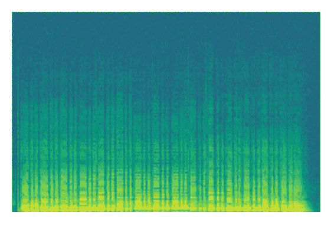

###### 图 5-11\. 我们训练数据集中萨克斯管音频片段的图像表示（声谱图）。将.wav 文件转换为声谱图的代码可以在[GitHub 仓库](https://github.com/GoogleCloudPlatform/ml-design-patterns/blob/master/05_resilience/audio_to_spectro.ipynb)中找到。

### 阶段 1：构建离线模型

我们的两阶段预测解决方案中的第一个模型应该足够小，以便可以加载到移动设备上进行快速推断，而无需依赖互联网连接。延续上面介绍的仪器示例，我们将通过构建一个优化用于设备内推断的二元分类模型来提供第一个预测阶段的示例。

最初的声音数据集有 41 个标签，用于不同类型的音频剪辑。我们的第一个模型只有两个标签：“乐器”或“非乐器”。我们将使用在 ImageNet 数据集上训练过的 [MobileNetV2](https://oreil.ly/zvbzR) 模型架构来构建我们的模型。MobileNetV2 可直接在 Keras 中使用，并且是为将在设备上提供服务的模型优化的架构。对于我们的模型，我们将冻结 MobileNetV2 的权重，并加载它，但不包括顶部，以便我们可以添加自己的二元分类输出层：

```
mobilenet = tf.keras.applications.MobileNetV2(
    input_shape=((128,128,3)), 
    include_top=False,
    weights='imagenet'
)
mobilenet.trainable = False
```

如果我们将我们的频谱图像组织到具有相应标签名称的目录中，我们可以使用 Keras 的 `ImageDataGenerator` 类来创建我们的训练和验证数据集：

```
train_data_gen = image_generator.flow_from_directory(
      directory=data_dir,
      batch_size=32,
      shuffle=True,
      target_size=(128,128),
      classes = ['not_instrument','instrument'],
      class_mode='binary')
```

当我们的训练和验证数据集准备好后，我们可以像通常一样训练模型。用于将训练好的模型导出用于服务的典型方法是使用 TensorFlow 的 `model.save()` 方法。但是，请记住，此模型将在设备上提供服务，因此我们希望尽可能将其保持小巧。为了构建符合这些要求的模型，我们将使用 [TensorFlow Lite](https://oreil.ly/dyx93)，这是一个专为在移动和嵌入式设备上直接构建和提供模型而优化的库，这些设备可能没有可靠的互联网连接。TF Lite 在训练期间和训练后都有一些内置工具来量化模型。

为了准备在边缘提供服务的训练模型，我们使用 TF Lite 将其导出为优化格式：

```
converter = tf.lite.TFLiteConverter.from_keras_model(model)
converter.optimizations = [tf.lite.Optimize.DEFAULT]
tflite_model = converter.convert()
open('converted_model.tflite', 'wb').write(tflite_model)
```

这是训练后量化模型的最快方法。使用 TF Lite 的优化默认设置，它将将我们模型的权重减少到它们的 8 位表示。在推断时，它还会量化输入，当我们对模型进行预测时。通过运行上述代码，导出的 TF Lite 模型的大小仅为没有量化时的四分之一。

###### 提示

为了进一步优化您的模型以进行离线推断，您还可以在训练期间量化模型的权重，或者在权重之外量化模型的所有数学操作。在撰写本文时，TensorFlow 2 模型的量化优化训练已在路线图上。

要在 TF Lite 模型上生成预测，您需要使用 TF Lite 解释器，该解释器针对低延迟进行了优化。您可能希望将模型加载到 Android 或 iOS 设备上，并直接从应用程序代码中生成预测。这两个平台都有 API，但我们将在此展示生成预测的 Python 代码，以便您可以从创建模型的同一笔记本中运行它。首先，我们创建 TF Lite 解释器的实例，并获取它期望的输入和输出格式的详细信息：

```
interpreter = tf.lite.Interpreter(model_path="converted_model.tflite")
interpreter.allocate_tensors()

input_details = interpreter.get_input_details()
output_details = interpreter.get_output_details()
```

对于我们上面训练的 MobileNetV2 二元分类模型，`input_details` 看起来如下：

```
[{'dtype': numpy.float32,
  'index': 0,
  'name': 'mobilenetv2_1.00_128_input',
  'quantization': (0.0, 0),
  'quantization_parameters': {'quantized_dimension': 0,
  'scales': array([], dtype=float32),
  'zero_points': array([], dtype=int32)},
  'shape': array([  1, 128, 128,   3], dtype=int32),
  'shape_signature': array([  1, 128, 128,   3], dtype=int32),
  'sparsity_parameters': {}}]
```

然后，我们将验证批次中的第一个图像传递给加载的 TF Lite 模型进行预测，调用解释器并获取输出：

```
input_data = np.array([image_batch[21]], dtype=np.float32)
interpreter.set_tensor(input_details[0]['index'], input_data)

interpreter.invoke()
output_data = interpreter.get_tensor(output_details[0]['index'])
print(output_data)
```

结果输出是一个在 [0,1] 范围内的 sigmoid 数组，指示给定输入声音是否为乐器。

###### 提示

根据调用云模型的成本，您可以在训练设备上的模型时更改您优化的度量标准。例如，如果您更关心避免假阳性，可以选择优化精确度而不是召回率。

现在我们的模型在设备上运行，可以快速预测，无需依赖互联网连接。如果模型确信给定的声音不是乐器，我们可以在此停止。如果模型预测为“乐器”，则是时候将音频剪辑发送到更复杂的云托管模型进行下一步处理了。

### 第二阶段：构建云模型

由于我们的云托管模型不需要优化以在没有网络连接的情况下进行推理，我们可以按照更传统的方法进行训练、导出和部署此模型。根据您的两阶段预测用例，第二个模型可以采取多种不同的形式。在 Google Home 示例中，第二阶段可能包括多个模型：一个将说话者的音频输入转换为文本，第二个执行自然语言处理以理解文本并路由用户的查询。如果用户要求更复杂的内容，甚至可能会有第三个模型基于用户偏好或过去活动提供推荐。

在我们的乐器示例中，我们解决方案的第二阶段将是一个多类别模型，将声音分类为可能的 18 个乐器类别之一。由于这个模型不需要在设备上部署，我们可以使用像 VGG 这样的更大模型架构作为起点，然后按照第 4 章中概述的迁移学习设计模式进行。

我们将加载在 ImageNet 数据集上训练的 VGG，指定我们的频谱图像的大小在 `input_shape` 参数中，并在添加自己的 softmax 分类输出层之前冻结模型的权重：

```
vgg_model = tf.keras.applications.VGG19(
    include_top=False, 
    weights='imagenet', 
    input_shape=((128,128,3))
)

vgg_model.trainable = False
```

我们的输出将是一个包含 softmax 概率的 18 元素数组：

```
prediction_layer = tf.keras.layers.Dense(18, activation='softmax')
```

我们将数据集限制为仅包含乐器音频剪辑，然后将乐器标签转换为 18 元素的独热向量。我们可以使用上述 `image_generator` 方法将图像馈送到我们的模型进行训练。与将其导出为 TF Lite 模型不同，我们可以使用 `model.save()` 导出模型以供服务。

要演示如何将第二阶段模型部署到云端，我们将使用云[AI Platform Prediction](https://oreil.ly/P5Cn9)。我们需要将保存的模型资产上传到云存储桶，然后通过指定框架并将 AI Platform Prediction 指向我们的存储桶来部署模型。

###### 提示

您可以使用任何基于云的自定义模型部署工具来实现两阶段预测设计模式的第二阶段。除了 Google Cloud 的 AI Platform Prediction 外，[AWS SageMaker](https://oreil.ly/zIHey)和[Azure Machine Learning](https://oreil.ly/dCxHE)都提供部署自定义模型的服务。

当我们将模型导出为 TensorFlow SavedModel 时，我们可以直接向保存模型方法传递 Cloud Storage 存储桶 URL：

```
model.save('gs://your_storage_bucket/path')
```

这将以 TF SavedModel 格式导出我们的模型并上传到我们的 Cloud Storage 存储桶。

在 AI Platform 中，模型资源包含您模型的不同版本。每个模型可以有数百个版本。我们将首先使用 Google Cloud CLI 通过 gcloud 创建模型资源：

```
gcloud ai-platform models create instrument_classification
```

有几种部署模型的方法。我们将使用 gcloud 并将 AI Platform 指向包含我们保存的模型资产的存储子目录：

```
gcloud ai-platform versions create v1 \
  --model instrument_classification \
  --origin 'gs://your_storage_bucket/path/model_timestamp' \
  --runtime-version=2.1 \
  --framework='tensorflow' \
  --python-version=3.7
```

现在我们可以通过 AI Platform 预测 API 向我们的模型发出预测请求，支持在线和批处理预测。在线预测让我们能够在几个示例上几乎实时获取预测结果。如果我们要发送数百或数千个示例进行预测，我们可以创建一个批处理预测作业，该作业将在后台异步运行，并在完成时将预测结果输出到文件。

为了处理调用我们模型的设备可能不总是连接互联网的情况，我们可以在设备离线时将音频片段存储为仪器预测。当恢复连接时，我们可以将这些片段发送到云托管模型进行预测。

## 折衷与替代方案

虽然**两阶段预测模式**适用于许多情况，但存在这样的情况：您的最终用户可能几乎没有互联网连接，因此无法依赖于能够调用云托管模型。在本节中，我们将讨论两种仅离线使用的替代方案，一个客户需要同时进行多个预测请求的场景，以及如何针对离线模型运行持续评估的建议。

### 独立单阶段模型

有时，您的模型最终用户可能几乎没有互联网连接。即使这些用户的设备无法可靠地访问云模型，仍然重要的是为他们提供访问您的应用程序的方式。对于这种情况，与依赖于两阶段预测流程不同，您可以使您的第一个模型足够强大，以使其能够自给自足。

为了实现这一点，我们可以创建我们复杂模型的一个较小版本，并让用户选择在脱机时下载这个更简单、更小的模型。这些脱机模型可能不如其更大的在线对应版本精确，但这个解决方案比完全没有脱机支持要好得多。要构建更复杂的设计用于脱机推断的模型，最好使用一种工具，在训练期间和训练后都允许你量化模型的权重和其他数学操作。这被称为[*量化感知训练*](https://oreil.ly/ABd8r)。

提供较简单脱机模型的一个应用示例是[Google Translate](https://oreil.ly/uEWAM)。Google Translate 是一个强大的在线翻译服务，支持数百种语言。然而，有许多情况下，您需要在没有互联网访问的情况下使用翻译服务。为了处理这个问题，Google Translate 允许您下载超过 50 种不同语言的离线翻译。这些脱机模型较小，大约在 40 到 50 兆字节之间，并且在精度上接近更复杂的在线版本。图 5-12 显示了基于设备和在线翻译模型的质量比较。


###### 图 5-12。基于设备的短语翻译模型与（更新的）神经机器翻译模型以及在线神经机器翻译的比较（来源：[The Keyword](https://oreil.ly/S_woM)）。

另一个独立的单相模型示例是[Google Bolo](https://oreil.ly/zTy79)，这是一个面向儿童的语音语言学习应用程序。该应用完全脱机工作，并且旨在帮助那些可靠的互联网访问并非总是可用的人群。

### 特定用例的脱机支持

另一个使您的应用程序适用于具有最小互联网连接性的用户的解决方案是仅使应用程序的某些部分脱机可用。这可能涉及启用一些常见的离线功能或缓存 ML 模型预测的结果以供以后脱机使用。通过这种替代方案，我们仍然使用两个预测阶段，但我们限制了离线模型覆盖的用例。在这种方法中，应用程序在脱机状态下可以正常工作，但在恢复连接时提供完整功能。

例如，Google Maps 允许您提前下载地图和路线指南。为了避免在移动设备上占用太多空间，可能仅提供驾驶路线的离线模式（而不是步行或骑行）。另一个例子可以是健身应用程序，该应用程序跟踪您的步数并为未来活动提供建议。假设该应用程序最常见的用途是检查您当天走了多少步。为了支持离线使用情况，我们可以通过蓝牙将健身跟踪器的数据同步到用户设备上，以便离线检查当天的健身状态。为了优化我们应用程序的性能，我们可能决定仅在线提供健身历史记录和建议。

我们可以进一步发展这一点，即在设备离线时存储用户的查询，并在它们重新连接时将其发送到云模型，以提供更详细的结果。此外，我们甚至可以提供基本的离线推荐模型，旨在在用户查询发送到云托管模型时补充改进结果。通过这种解决方案，用户在未连接时仍可获得部分功能。当它们重新连接时，它们可以从完整功能的应用程序和强大的机器学习模型中获益。

### 处理近实时的大量预测

在其他情况下，您的机器学习模型的最终用户可能具有可靠的连接性，但可能需要一次对模型进行数百甚至数千次预测。如果您只有一个云托管模型，并且每个预测都需要向托管服务发起 API 调用，那么一次获取数千个示例的预测响应将花费太长时间。

要理解这一点，假设我们在用户家中的各个区域部署了嵌入式设备。这些设备捕获温度、气压和空气质量数据。我们在云中部署了一个模型，用于从这些传感器数据中检测异常。由于传感器不断收集新数据，将每个传入数据点发送到我们的云模型将是低效且昂贵的。因此，我们可以在传感器上直接部署模型，以从传入数据中识别可能的异常候选项。然后，我们只将潜在的异常发送到我们的云模型进行综合验证，考虑所有位置的传感器读数。这是早期描述的两阶段预测模式的变体，其主要区别在于离线和云模型执行相同的预测任务，但输入不同。在这种情况下，模型还限制了一次发送到云模型的预测请求数量。

### 离线模型的持续评估

我们如何确保我们的设备上的模型保持更新，并且不会受到数据漂移的影响？有几种方法可以对没有网络连接的模型执行持续评估。首先，我们可以保存在设备上接收到的预测子集。然后，我们可以定期评估这些示例上模型的性能，并确定是否需要重新训练模型。对于我们的两阶段模型，定期进行此评估非常重要，因为很可能我们设备上模型的许多调用不会进入第二阶段云模型。另一种选择是创建设备上模型的副本，仅用于连续评估目的。如果我们的离线和云模型运行类似的预测任务，比如前面提到的翻译案例，这种解决方案更可取。

# 设计模式 20：键控预测

通常情况下，您会在模型训练时使用与部署时实时提供的输入特征相同的输入集。然而，在许多情况下，您的模型也可以通过客户提供的键来传递。这被称为键控预测设计模式，在本章讨论的几种设计模式中实现可扩展性时是必需的。

## 问题

如果您的模型部署为 Web 服务并接受单个输入，则很明确每个输出对应哪个输入。但如果您的模型接受包含百万个输入的文件，并返回一个包含百万个输出预测的文件呢？

您可能会认为第一个输出实例对应于第一个输入实例，第二个输出实例对应于第二个输入实例，依此类推是显而易见的。然而，使用 1:1 的关系时，每个服务器节点需要按顺序处理完整的输入集。如果您使用分布式数据处理系统，并将实例分发到多台机器，收集所有结果输出并发送回来会更有优势。但这种方法的问题在于输出会被混乱排序。要求输出以相同的方式排序会带来可扩展性挑战，而以无序方式提供输出则要求客户端以某种方式知道哪个输出对应哪个输入。

如果您的在线服务系统接受一组实例数组，则会出现相同的问题，就像无状态服务函数模式中讨论的那样。问题在于在本地处理大量实例将导致热点。接收到少量请求的服务器节点将能够跟上，但是接收到特别大数组的任何服务器节点将开始落后。这些热点将迫使您使服务器机器比实际需要的更强大。因此，许多在线服务系统将对可以在一次请求中发送的实例数量施加限制。如果没有这样的限制，或者如果模型的计算成本如此之高，以至于比此限制更少的实例请求可能会使服务器超载，那么您将会遇到热点问题。因此，批处理服务问题的任何解决方案也将解决在线服务中的热点问题。

## 解决方案

解决方案是使用透传键。让客户端为每个输入提供一个关联的键。例如（见图 5-13），假设您的模型训练有三个输入（a、b、c），如左侧所示，生成右侧的输出 d。让您的客户端提供（k、a、b、c）给您的模型，其中 k 是具有唯一标识符的键。该键可以简单地对输入实例进行编号 1、2、3 等。然后，您的模型将返回（k、d），因此客户端将能够确定哪个输出实例对应哪个输入实例。

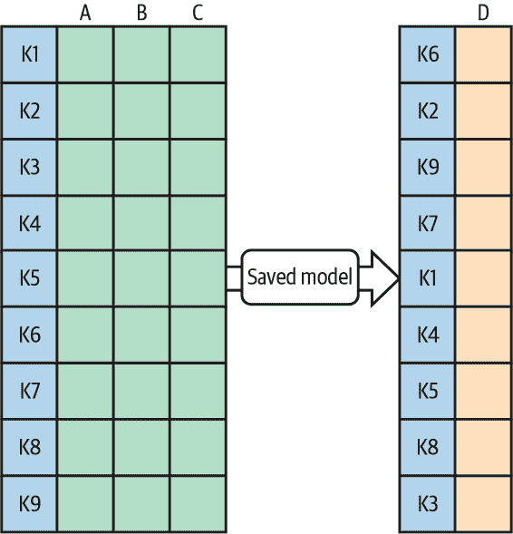

###### 图 5-13\. 客户端为每个输入实例提供一个唯一键。服务系统将这些键附加到相应的预测上。这使得客户端能够检索每个输入的正确预测，即使输出顺序不同。

### 如何在 Keras 中透传键

为了使您的 Keras 模型透传键，当导出模型时提供一个服务签名。

例如，以下是将本来需要四个输入（`is_male`、`mother_age`、`plurality`和`gestation_weeks`）的模型修改为还接收一个键，并将其传递到输出中的代码：

```
# Serving function that passes through keys
@tf.function(input_signature=[{
    'is_male': tf.TensorSpec([None,], dtype=tf.string, name='is_male'),
    'mother_age': tf.TensorSpec([None,], dtype=tf.float32, 
name='mother_age'),
    'plurality': tf.TensorSpec([None,], dtype=tf.string, name='plurality'),
    'gestation_weeks': tf.TensorSpec([None,], dtype=tf.float32, 

name='gestation_weeks'),
    `'``key``'``:` `tf``.``TensorSpec``(``[``None``,``]``,` `dtype``=``tf``.``string``,` `name``=``'``key``'``)`
}])
def keyed_prediction(inputs):
    feats = inputs.copy()
    key = feats.pop('key') # get the key from input
    output = model(feats) # invoke model
    return `{``'``key``'``:` `key``,` 'babyweight': output}

```

然后按照无状态服务函数设计模式讨论的方式保存此模型：

```
model.save(EXPORT_PATH, 
           signatures={'serving_default': keyed_prediction})

```

### 将键控预测功能添加到现有模型

注意上述代码即使原始模型未保存服务函数也能正常工作。只需使用`tf.saved_model.load()`加载模型，附加一个服务函数，然后使用上述代码片段，如图 5-14 所示。

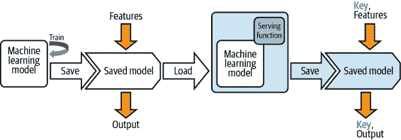

###### 图 5-14\. 加载一个 SavedModel，附加一个非默认的服务函数，并保存它。

在这样做时，最好提供一个服务函数，复制旧的无密钥行为：

```
# Serving function that does not require a key
@tf.function(input_signature=[{
    'is_male': tf.TensorSpec([None,], dtype=tf.string, name='is_male'),
    'mother_age': tf.TensorSpec([None,],  dtype=tf.float32, 
name='mother_age'),
    'plurality': tf.TensorSpec([None,], dtype=tf.string, name='plurality'),
    'gestation_weeks': tf.TensorSpec([None,], dtype=tf.float32, 

name='gestation_weeks')
}])
def nokey_prediction(inputs):
    output = model(inputs) # invoke model
    return `{`'babyweight': output}

```

将以前的行为用作默认，并添加`keyed_prediction`作为新的服务函数：

```
model.save(EXPORT_PATH, 
           signatures={'serving_default': nokey_prediction,
                       'keyed_prediction': keyed_prediction
})
```

## 折衷与替代方案

为什么服务器不能只为接收到的输入分配密钥？对于在线预测，服务器可以分配缺乏任何语义信息的唯一请求 ID。对于批量预测，问题在于需要将输入与输出关联起来，因此服务器分配唯一 ID 是不够的，因为无法将其与输入重新关联起来。服务器必须在调用模型之前为接收到的输入分配密钥，使用这些密钥对输出进行排序，然后在发送输出之前移除密钥。问题在于，在分布式数据处理中，排序是计算非常昂贵的过程。

此外，还有几种其他情况下客户提供的密钥很有用——异步服务和评估。鉴于这两种情况，最好确定密钥的构成因用例而异，并且需要能够识别。因此，要求客户提供密钥会使解决方案更简单。

### 异步服务

如今许多生产机器学习模型都是神经网络，神经网络涉及矩阵乘法。在像 GPU 和 TPU 这样的硬件上，如果您可以确保矩阵在某些大小范围内和/或某个数字的倍数内，矩阵乘法会更有效率。因此，积累请求（当然最大延迟）并以块处理传入请求可能会有所帮助。由于这些块将包含来自多个客户端的交织请求，因此在这种情况下，密钥需要具有某种客户标识符。

### 连续评估

如果您正在进行连续评估，记录有关预测请求的元数据可能会有所帮助，以便您可以监视整体性能是否下降，或者仅在特定情况下下降。如果键标识了所讨论的情况，这种切片操作将变得更加容易。例如，假设我们需要应用公平性镜头（参见第七章）来确保我们模型在不同客户段（例如客户的年龄和/或种族）之间的性能公平。模型不会将客户段作为输入使用，但我们需要按客户段切片评估模型的性能。在这种情况下，将客户段嵌入密钥中（例如一个示例密钥可能是 35-黑人-男性-34324323）会使切片操作更加容易。

另一个解决方案是让模型忽略未识别的输入，并不仅返回预测输出，而是返回所有输入，包括未识别的输入。这允许客户端将输入与输出匹配，但在带宽和客户端计算方面更为昂贵。

由于高性能服务器将支持多个客户端，并由集群支持，并且批处理请求以获得性能优势，因此最好提前计划——要求客户端在每次预测时提供键，并要求客户端指定不会与其他客户端发生冲突的键。

# 摘要

在本章中，我们探讨了使机器学习模型运营化的技术，以确保它们具有韧性并能够扩展以处理生产负载。我们讨论的每个韧性模式都涉及典型机器学习工作流程中的部署和服务步骤。

我们从探讨如何使用*无状态服务函数*设计模式将训练好的机器学习模型封装为无状态函数开始。服务函数通过定义一个函数来执行对模型导出版本的推断，并部署到 REST 端点，从而解耦了模型的训练和部署环境。并非所有生产模型都需要立即的预测结果，因为在某些情况下，您需要将大批数据发送到模型进行预测，但不需要立即获取结果。我们看到*批量服务*设计模式如何通过利用设计为异步后台作业运行多个模型预测请求的分布式数据处理基础设施来解决这一问题，并将输出写入指定位置。

接下来，使用*持续模型评估*设计模式，我们探讨了一种验证部署模型在新数据上表现良好的方法。这种模式通过定期评估模型并利用结果来确定是否需要重新训练，从而解决了数据和概念漂移的问题。在*两阶段预测*设计模式中，我们解决了需要在边缘部署模型的特定用例。当你能够将问题分解为两个逻辑部分时，这种模式首先创建一个可以在设备上部署的简化模型。这个边缘模型连接到云端托管的更复杂的模型。最后，在*关键预测*设计模式中，我们讨论了在进行预测请求时每个示例都提供唯一键值的好处。这确保你的客户将每个预测输出与正确的输入示例关联起来。

在下一章中，我们将探讨*可复现性*模式。这些模式解决了许多机器学习中固有随机性带来的挑战，并专注于每次机器学习过程运行时都能产生可靠一致结果。

¹ 好奇“正面”投诉是什么样？这里是一个例子：

“我每天早上和晚上都接到电话。我告诉他们停止打电话了，但他们仍然会打电话，甚至在星期天早上也是如此。星期天早上我连续接到两个来自 XXXX XXXX 的电话。星期六我接到了九个电话。平日我每天也接到大约九个电话。

唯一的提示是，抱怨者不高兴的迹象是他们已经要求打电话的人停止了。否则，其余的陈述可能会是关于某人在吹嘘自己有多受欢迎！
