# 第六章：可重现性设计模式

软件最佳实践，如单元测试，假设如果我们运行一段代码，它会产生确定性输出：

```
def sigmoid(x):
    return 1.0 / (1 + np.exp(-x))

class TestSigmoid(unittest.TestCase):
    def test_zero(self):
        self.assertAlmostEqual(sigmoid(0), 0.5)

    def test_neginf(self):
        self.assertAlmostEqual(sigmoid(float("-inf")), 0)

    def test_inf(self):
        self.assertAlmostEqual(sigmoid(float("inf")), 1)
```

在机器学习中，这种可重复性是困难的。在训练过程中，机器学习模型使用随机值初始化，然后根据训练数据进行调整。例如，由 scikit-learn 实施的简单 k-means 算法需要设置 `random_state` 以确保算法每次返回相同结果：

```
def cluster_kmeans(X):
    from sklearn import cluster
    k_means = cluster.KMeans(n_clusters=10, `random_state``=``10`)
    labels = k_means.fit(X).labels_[::]
    return labels
```

除了随机种子外，还有许多其他需要修复的工件，以确保在训练期间的可重复性。此外，机器学习包括不同阶段，如训练、部署和重新训练。重要的是，在这些阶段之间某些事物的可重复性通常也很重要。

在本章中，我们将看到处理可重现性不同方面的设计模式。*Transform* 设计模式从模型训练流程中捕获数据准备依赖项，以在服务过程中重现它们。*Repeatable Splitting* 捕获数据在训练、验证和测试数据集之间的拆分方式，以确保训练中使用的训练样本不会在评估或测试中使用，即使数据集增长。*Bridged Schema* 设计模式考虑了在训练数据集是符合不同架构的数据混合时如何确保可重复性。*Workflow Pipeline* 设计模式捕获机器学习过程中的所有步骤，以确保在重新训练模型时可以重复使用流水线的部分。*Feature Store* 设计模式解决了在不同机器学习作业中特征的可重复性和可重用性。*Windowed Inference* 设计模式确保以动态、时间依赖方式计算的特征在训练和服务之间能够正确重复。数据和模型的*版本控制* 是本章中处理许多设计模式的先决条件。

# 设计模式 21: Transform

Transform 设计模式通过精心分离输入、特征和转换，使将 ML 模型移至生产环境变得更加容易。

## 问题

问题在于机器学习模型的*输入*不是其在计算中使用的*特征*。例如，在文本分类模型中，输入是原始文本文档，而特征是该文本的数值嵌入表示。当我们训练一个机器学习模型时，我们使用从原始输入中提取出的特征进行训练。以 BigQuery ML 预测伦敦自行车骑行时长的模型为例：

```
CREATE OR REPLACE MODEL ch09eu.bicycle_model
OPTIONS(input_label_cols=['duration'], 
        model_type='linear_reg')
AS
SELECT 
 duration
 , start_station_name
 , CAST(EXTRACT(dayofweek from start_date) AS STRING)
 as dayofweek
 , CAST(EXTRACT(hour from start_date) AS STRING)
 as hourofday
FROM 
 `bigquery-public-data.london_bicycles.cycle_hire`
```

该模型有三个特征（`start_station_name`、`dayofweek` 和 `hourofday`），这些特征是从两个输入 `start_station_name` 和 `start_date` 计算得出的，如 Figure 6-1 所示。

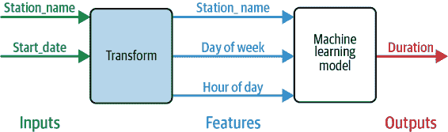

###### 图 6-1。该模型从两个输入计算出三个特征。

但上述 SQL 代码混淆了输入和特征，并且没有跟踪执行的转换。当我们尝试使用此模型进行预测时，这会对我们造成困扰。因为模型是基于三个特征进行训练的，这就是预测签名应该看起来的样子：

```
SELECT * FROM ML.PREDICT(MODEL ch09eu.bicycle_model,(
   'Kings Cross' AS start_station_name
 , '3' as dayofweek
 , '18' as hourofday
))
```

注意，在推断时，我们必须知道模型训练的特征是什么，它们应该如何解释以及应用的转换的细节。我们必须知道我们需要发送 `'3'` 作为星期几。这个 `'3'` 是星期二还是星期三？这取决于模型使用的库或我们认为一周的开始是什么！

*训练与服务之间的偏差*，由于这些因素在训练和服务环境之间的差异而引起，是 ML 模型投产困难的主要原因之一。

## 解决方案

解决方案是明确捕捉应用于将模型输入转换为特征的转换。在 BigQuery ML 中，可以通过使用 `TRANSFORM` 子句来实现这一点。使用 `TRANSFORM` 确保在 `ML.PREDICT` 期间自动应用这些转换。

鉴于对 `TRANSFORM` 的支持，上述模型应进行如下重写：

```
CREATE OR REPLACE MODEL ch09eu.bicycle_model
OPTIONS(input_label_cols=['duration'], 
        model_type='linear_reg')
TRANSFORM(
 SELECT * EXCEPT(start_date)
 , CAST(EXTRACT(dayofweek from start_date) AS STRING)
 as dayofweek -- feature1
 , CAST(EXTRACT(hour from start_date) AS STRING)
 as hourofday –- feature2
)
AS
SELECT 
 duration, start_station_name, start_date -- inputs
FROM 
 `bigquery-public-data.london_bicycles.cycle_hire`
```

注意我们如何明确将输入（在 `SELECT` 子句中）与特征（在 `TRANSFORM` 子句中）分离开来。现在，预测变得更加容易。我们只需向模型发送站点名称和时间戳（即输入）即可：

```
SELECT * FROM ML.PREDICT(MODEL ch09eu.bicycle_model,(
   'Kings Cross' AS start_station_name
 , CURRENT_TIMESTAMP() as start_date
))
```

然后模型会负责执行适当的转换以创建必要的特征。它通过捕捉转换逻辑和工件（如缩放常数、嵌入系数、查找表等）来执行转换。

只要我们在 `SELECT` 语句中仔细使用原始输入并将所有后续处理放在 `TRANSFORM` 子句中，BigQuery ML 将在预测期间自动应用这些转换。

## 折衷与替代方案

上述描述的解决方案之所以有效，是因为 BigQuery ML 为我们跟踪转换逻辑和工件，将它们保存在模型图中，并在预测期间自动应用这些转换。

如果我们使用的框架不支持内置的 Transform 设计模式，我们应该设计我们的模型架构，以便在训练期间执行的转换在服务期间易于重现。我们可以通过确保将转换保存在模型图中或创建转换特征的存储库（“设计模式 26：特征存储”）来实现这一点。

### TensorFlow 和 Keras 中的转换

假设我们正在训练一个 ML 模型来估算纽约的出租车费用，并且有六个输入（上车纬度、上车经度、下车纬度、下车经度、乘客数量和上车时间）。TensorFlow 支持特征列的概念，这些特征列保存在模型图中。但是，API 设计时假设原始输入与特征相同。

假设我们想要缩放纬度和经度（详见“简单的数据表示”第第二章），创建一个转换后的特征作为欧几里德距离，并从时间戳中提取小时数。我们必须仔细设计模型图（参见图 6-2），牢记“转换”概念。当我们逐步分析下面的代码时，请注意我们如何设置事物，以便清晰地设计我们 Keras 模型中的三个单独层——输入层、转换层和`DenseFeatures`层。

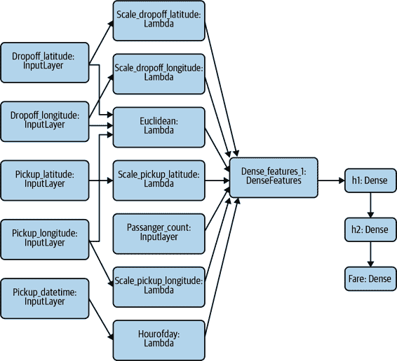

###### 图 6-2\. Keras 中出租车费用估算问题的模型图。

首先，将 Keras 模型的每个输入都作为一个`Input`层（完整代码在[GitHub](https://github.com/GoogleCloudPlatform/training-data-analyst/blob/master/quests/serverlessml/06_feateng_keras/solution/taxifare_fc.ipynb)的笔记本中）：

```
inputs = {
        colname : tf.keras.layers.Input(
                    name=colname, shape=(), dtype='float32')
           for colname in ['pickup_longitude', 'pickup_latitude', 
                           'dropoff_longitude', 'dropoff_latitude']
}
```

在图 6-2 中，这些方框标记为`dropoff_latitude`、`dropoff_longitude`等。

第二，维护一个转换特征的字典，并使每个转换成为 Keras 预处理层或`Lambda`层。在这里，我们使用`Lambda`层缩放输入：

```
transformed = {}
for lon_col in ['pickup_longitude', 'dropoff_longitude']:
            transformed[lon_col] = tf.keras.layers.Lambda(
                lambda x: (x+78)/8.0, 
                name='scale_{}'.format(lon_col)
            )(inputs[lon_col])
for lat_col in ['pickup_latitude', 'dropoff_latitude']:
            transformed[lat_col] = tf.keras.layers.Lambda(
                lambda x: (x-37)/8.0, 
                name='scale_{}'.format(lat_col)
            )(inputs[lat_col])
```

在图 6-2 中，这些方框标记为`scale_dropoff_latitude`、`scale_dropoff_longitude`等。

我们还将有一个`Lambda`层来计算从四个`Input`层计算出的欧几里德距离（详见图 6-2）：

```
def euclidean(params):
    lon1, lat1, lon2, lat2 = params
    londiff = lon2 - lon1
    latdiff = lat2 - lat1
    return tf.sqrt(londiff*londiff + latdiff*latdiff)
transformed['euclidean'] = tf.keras.layers.Lambda(euclidean, name='euclidean')([
            inputs['pickup_longitude'],
            inputs['pickup_latitude'],
            inputs['dropoff_longitude'],
            inputs['dropoff_latitude']
        ])
```

类似地，从时间戳创建小时数的列是一个`Lambda`层：

```
transformed['hourofday'] = tf.keras.layers.Lambda(
            lambda x: tf.strings.to_number(tf.strings.substr(x, 11, 2), 
                                           out_type=tf.dtypes.int32),
            name='hourofday'
        )(inputs['pickup_datetime'])
```

第三，所有这些转换层将被串联成一个`DenseFeatures`层：

```
dnn_inputs = tf.keras.layers.DenseFeatures(feature_columns.values())(transformed)
```

因为`DenseFeatures`的构造函数需要一组特征列，我们将不得不指定如何将每个转换后的值转换为神经网络的输入。我们可以原样使用它们、对它们进行独热编码，或者选择对数字进行分桶。为简单起见，让我们仅仅使用它们原样：

```
feature_columns = {
        colname: tf.feature_column.numeric_column(colname)
           for colname in ['pickup_longitude', 'pickup_latitude', 
                           'dropoff_longitude', 'dropoff_latitude']
}
feature_columns['euclidean'] = \
               tf.feature_column.numeric_column('euclidean')
```

一旦我们有了`DenseFeatures`输入层，我们可以像往常一样构建剩余的 Keras 模型：

```
h1 = tf.keras.layers.Dense(32, activation='relu', name='h1')(dnn_inputs)
h2 = tf.keras.layers.Dense(8, activation='relu', name='h2')(h1)
output = tf.keras.layers.Dense(1, name='fare')(h2)
model = tf.keras.models.Model(inputs, output)
model.compile(optimizer='adam', loss='mse', metrics=['mse'])
```

完整示例在 GitHub 上的[这里](https://github.com/GoogleCloudPlatform/training-data-analyst/blob/master/quests/serverlessml/06_feateng_keras/solution/taxifare_fc.ipynb)。

注意我们如何设置事物，使得 Keras 模型的第一层是`Inputs`。第二层是`Transform`层。第三层是`DenseFeatures`层，将它们组合在一起。在这些层序列之后，通常的模型架构开始。由于`Transform`层是模型图的一部分，通常的 Serving 功能和批量 Serving 解决方案（参见第五章）将如原样工作。

### 使用`tf.transform`进行高效的转换

上述方法的一个缺点是转换将在每次训练迭代期间执行。如果我们只是通过已知常数进行缩放，这并不是什么大问题。但是如果我们的转换计算更昂贵呢？如果我们想使用均值和方差进行缩放，那么我们需要首先通过所有数据来计算这些变量。

###### 小贴士

区分*实例级*变换和可以直接成为模型一部分的变换（其唯一缺点是在每次训练迭代时应用它们）以及*数据集级*变换是有帮助的。对于数据集级变换，我们需要完整地遍历数据以计算整体统计信息或分类变量的词汇表。这样的数据集级变换不能成为模型的一部分，必须作为可扩展的预处理步骤应用，这样就产生了 Transform，捕捉了逻辑和制品（均值、方差、词汇等），以便附加到模型上。对于数据集级变换，请使用`tf.transform`。

`tf.transform`库（作为[TensorFlow Extended](https://oreil.ly/OznI3)的一部分）提供了一种高效的方式，在数据的预处理传递中执行变换并保存生成的特征和转换制品，以便在预测时由 TensorFlow Serving 应用这些变换。

第一步是定义转换函数。例如，要将所有输入缩放为零均值和单位方差并对其进行分桶，我们将创建此预处理函数（在 GitHub 上查看[完整代码](https://github.com/tensorflow/tfx/blob/master/tfx/examples/chicago_taxi_pipeline/taxi_utils_native_keras.py)）：

```
def preprocessing_fn(inputs):
  outputs = {}
  for key in ...:
      outputs[key + '_z'] = tft.scale_to_z_score(inputs[key])
      outputs[key + '_bkt'] = tft.bucketize(inputs[key], 5)
  return outputs
```

在训练之前，使用 Apache Beam 中的先前函数读取并转换原始数据：

```
      transformed_dataset, transform_fn = (raw_dataset |
          beam_impl.AnalyzeAndTransformDataset(preprocessing_fn))
      transformed_data, transformed_metadata = transformed_dataset
```

然后，将转换后的数据写入适合训练流水线读取的格式：

```
      transformed_data | tfrecordio.WriteToTFRecord(
          PATH_TO_TFT_ARTIFACTS,
          coder=example_proto_coder.ExampleProtoCoder(
              transformed_metadata.schema))
```

Beam 流水线还将预处理函数以及函数所需的任何制品存储为 TensorFlow 图格式的工件。例如，上述情况下，此工件将包括用于缩放数字的均值和方差，以及用于分桶数字的桶边界。训练函数读取转换后的数据，因此在训练循环内不必重复转换。

服务函数需要加载这些制品并创建一个 Transform 层：

```
tf_transform_output = tft.TFTransformOutput(PATH_TO_TFT_ARTIFACTS)
tf_transform_layer = tf_transform_output.transform_features_layer()
```

然后，服务功能可以将 Transform 层应用于解析的输入特征，并使用转换后的数据调用模型以计算模型输出：

```
  @tf.function
  def serve_tf_examples_fn(serialized_tf_examples):
    feature_spec = tf_transform_output.raw_feature_spec()
    feature_spec.pop(_LABEL_KEY)
    parsed_features = tf.io.parse_example(serialized_tf_examples, feature_spec)

    transformed_features = tf_transform_layer(parsed_features)
    return model(transformed_features)
```

这样，我们确保将转换插入模型图中以供服务。同时，因为模型训练是在转换后的数据上进行的，所以我们的训练循环不必在每个时期执行这些转换操作。

### 文本和图像转换

在文本模型中，通常会对输入文本进行预处理（例如去除标点符号、停用词、大写、词干提取等），然后将清理后的文本作为特征提供给模型。其他常见的文本输入特征工程包括标记化和正则表达式匹配。在推理时，执行相同的清理或提取步骤至关重要。

即使在使用深度学习处理图像时，即使没有明确的特征工程，捕捉转换的需求也是重要的。图像模型通常具有一个接受特定大小图像的输入层。大小不同的图像必须在输入模型之前进行裁剪、填充或重新采样到固定大小。图像模型中其他常见的转换包括颜色操作（伽马校正、灰度转换等）和方向校正。这些转换在训练数据集和推理过程中必须保持一致。Transform 模式有助于确保这种可重现性。

对于图像模型，有一些转换（如通过随机裁剪和缩放进行数据增强）仅在训练过程中应用。这些转换不需要在推理过程中捕获。这些转换不会成为 Transform 模式的一部分。

### 替代模式方法

解决训练-服务偏差问题的另一种方法是采用特征存储模式。特征存储包括协调计算引擎和转换特征数据的存储库。计算引擎支持推理的低延迟访问和批量创建转换特征，而数据存储库提供快速访问转换特征以进行模型训练。特征存储的优点是不需要转换操作符合模型图。例如，只要特征存储支持 Java，预处理操作可以在 Java 中执行，而模型本身可以用 PyTorch 编写。特征存储的缺点是使模型依赖于特征存储，并使服务基础设施变得更加复杂。

另一种将特征转换的编程语言和框架与编写模型的语言分开的方法是在容器中进行预处理，并将这些自定义容器作为训练和服务的一部分。这在“设计模式 25：工作流程管道”中有所讨论，并且被 Kubeflow Serving 实践采纳。

# 设计模式 22：可重复的分割

为了确保抽样是可重复和可再现的，必须使用一个分布良好的列和确定性哈希函数来将可用数据分割为训练、验证和测试数据集。

## 问题

许多机器学习教程会建议使用类似以下代码将数据随机分割为训练、验证和测试数据集：

```
df = pd.DataFrame(...)
rnd = np.random.rand(len(df))
train = df[ rnd < 0.8  ]
valid = df[ rnd >= 0.8 & rnd < 0.9 ]
test  = df[ rnd >= 0.9 ]
```

不幸的是，这种方法在许多实际情况下失败了。原因在于很少有行是独立的。例如，如果我们正在训练一个模型来预测航班延误，同一天的航班到达延误将高度相关。这会导致在训练数据集中有些航班在任何特定日期上的某些航班和测试数据集中有些其他航班之间泄漏信息。由于相关行导致的这种泄漏是一个经常发生的问题，我们在进行机器学习时必须避免。

另外，`rand`函数每次运行时都会以不同的顺序排序数据，因此如果我们再次运行程序，将获得不同的 80%行。如果我们正在尝试不同的机器学习模型，并希望选择最佳模型，这可能会带来麻烦——我们需要在相同的测试数据集上比较模型性能。为了解决这个问题，我们需要预先设置随机种子或在分割数据后存储数据。硬编码数据分割方式并不是一个好主意，因为在执行像自助法、交叉验证和超参数调整等技术时，我们需要改变这些数据分割方式，并且以允许我们进行单独试验的方式进行。

对于机器学习，我们希望轻量级、可重复的数据分割，不受编程语言或随机种子的影响。我们还希望确保相关行进入同一分割中。例如，如果在训练数据集中有 2019 年 1 月 2 日的航班，我们不希望测试数据集中也有这一天的航班。

## 解决方案

首先，我们需要确定一个列，该列捕获行之间的相关关系。在我们的航空延误数据集中，这是`date`列。然后，我们使用哈希函数在该列上的最后几位数字来分割数据。对于航空延误问题，我们可以在`date`列上使用 Farm Fingerprint 哈希算法来将可用数据分割为训练、验证和测试数据集。

###### 小贴士

关于 Farm Fingerprint 算法的更多信息、其他框架和语言的支持以及哈希与加密的关系，请参阅“设计模式 1：哈希特征”中的第二章。特别地，Farm Hash 算法的开源封装可在多种语言中使用（[包括 Python](https://oreil.ly/526Dc)），因此即使数据不在原生支持可重复哈希的数据仓库中，也可以应用此模式。

这是根据`date`列的哈希如何分割数据集的方法：

```
SELECT
  airline,
  departure_airport,
  departure_schedule,
  arrival_airport,
  arrival_delay
FROM
  `bigquery-samples`.airline_ontime_data.flights
WHERE
  ABS(MOD(FARM_FINGERPRINT(date), 10)) < 8 -- 80% for TRAIN
```

要根据`date`列进行分割，我们使用`FARM_FINGERPRINT`函数计算其哈希，然后使用模函数找出 80%的行的任意子集。这样做是可重复的——因为`FARM_FINGERPRINT`函数在特定日期上每次调用时返回相同的值，我们可以确保每次都会得到相同的 80%数据。因此，同一天的所有航班将属于同一分割——训练集、验证集或测试集。无论随机种子如何，这都是可重复的。

如果我们想按`arrival_airport`分割数据集（例如因为我们试图预测机场设施的某些内容），我们将在`arrival_airport`上计算哈希，而不是在`date`上。

获取验证数据也很简单：将上述查询中的`< 8`更改为`=8`，对于测试数据，则更改为`=9`。这样，我们可以在验证集中获得 10%的样本，在测试集中获得 10%的样本。

选择分割列的考虑因素是什么？`date`列必须具有多个特征，我们才能将其用作分割列：

+   相同日期的行往往具有相关性——这正是我们希望确保所有相同日期的行都在同一分割中的关键原因。

+   `date`不是模型的输入，尽管它用作分割的标准。从`date`提取的特征，如星期几或每天的小时数，可以作为输入，但我们不能使用实际输入作为分割字段，因为训练过的模型将无法看到 80%数据集中`date`列的所有可能输入值。

+   必须有足够的`date`数值。因为我们正在计算哈希并对 10 取模，所以我们至少需要 10 个唯一的哈希数值。拥有更多唯一数值会更好。为了保险起见，一个经验法则是以模数的 3-5 倍为目标，因此在这种情况下，我们需要大约 40 个唯一日期。

+   标签必须在日期之间良好分布。如果所有延误都发生在 1 月 1 日，并且全年没有延误，那么这种方法将不起作用，因为分割的数据集将会倾斜。为了安全起见，请查看图表，确保三个分割数据集的标签分布相似。为了更安全，请确保通过出发延误和其他输入值的标签分布在三个数据集中也相似。

###### 提示

我们可以使用 Kolomogorov–Smirnov 测试自动化检查标签在三个数据集中的分布是否相似：只需绘制标签在三个数据集中的累积分布函数，并找出每对之间的最大距离。最大距离越小，分割效果越好。

## 折衷和替代方案

让我们看一下我们可能会如何进行可重复分割的几个变体，并讨论每种方法的利弊。让我们还讨论如何将这个想法扩展到不仅是分割而且是可重复抽样。

### 单一查询

我们不需要三个单独的查询来生成训练、验证和测试分割。我们可以在一个查询中完成如下操作：

```
CREATE OR REPLACE TABLE mydataset.mytable AS
SELECT
  airline,
  departure_airport,
  departure_schedule,
  arrival_airport,
  arrival_delay,
  CASE(ABS(MOD(FARM_FINGERPRINT(date), 10)))
      WHEN 9 THEN 'test'
      WHEN 8 THEN 'validation'
      ELSE 'training' END AS split_col
FROM
  `bigquery-samples`.airline_ontime_data.flights
```

然后我们可以使用`split_col`列来确定每一行属于哪个数据集。使用单一查询减少了计算时间，但需要创建新表或修改源表以添加额外的`split_col`列。

### 随机分割

如果行之间没有相关性怎么办？在这种情况下，我们希望进行随机的、可重复的分割，但没有自然的列可以进行分割。我们可以通过将整行数据转换为字符串并对该字符串进行哈希来对数据进行哈希化：

```
SELECT
  airline,
  departure_airport,
  departure_schedule,
  arrival_airport,
  arrival_delay
FROM
  `bigquery-samples`.airline_ontime_data.flights f
WHERE
  ABS(MOD(FARM_FINGERPRINT(`TO_JSON_STRING``(``f``)`, 10)) < 8
```

请注意，如果我们有重复的行，它们将始终出现在相同的分割中。这可能正是我们所期望的。如果不是，则必须在`SELECT`查询中添加唯一 ID 列。

### 基于多列的分割

我们已经讨论了一个捕捉行之间相关性的单一列。如果是一组捕捉两行何时相关的列呢？在这种情况下，只需在计算哈希之前简单地连接字段（这是特征交叉）。例如，假设我们只希望确保同一天从同一机场出发的航班不会出现在不同的分割中。在这种情况下，我们将执行以下操作：

```
SELECT
  airline,
  departure_airport,
  departure_schedule,
  arrival_airport,
  arrival_delay
FROM
  `bigquery-samples`.airline_ontime_data.flights
WHERE
  ABS(MOD(FARM_FINGERPRINT(`CONCAT``(``date``,` `arrival_airport``)``)`, 10)) < 8
```

如果我们根据多列的特征交叉进行分割，我们可以将`arrival_airport`作为模型的输入之一，因为训练集和测试集中会有任何特定机场的示例。另一方面，如果我们仅根据`arrival_airport`进行分割，则训练集和测试集将具有互斥的到达机场集合，因此`arrival_airport`不能作为模型的输入。

### 可重复抽样

如果我们想要 80% 的整个数据集作为训练，那么基本解决方案就很好了，但是如果我们想要使用比我们在 BigQuery 中拥有的较小的数据集进行玩耍，那怎么办？这在本地开发中很常见。航班数据集有 70 百万行，也许我们想要的是一百万次航班的较小数据集。我们如何选择 70 次航班中的一次，然后选择其中的 80% 作为训练？

我们不能做的是：

```
SELECT
   date,
   airline,
   departure_airport,
   departure_schedule,
   arrival_airport,
   arrival_delay
 FROM
   `bigquery-samples`.airline_ontime_data.flights
 WHERE
  ABS(MOD(FARM_FINGERPRINT(date), 70)) = 0
  AND ABS(MOD(FARM_FINGERPRINT(date), 10)) < 8
```

我们不能选择 70 行中的 1 行，然后选择 10 行中的 8 行。如果我们选择可以被 70 整除的数字，当然它们也会被 10 整除！那第二个取模操作是无用的。

这里有一个更好的解决方案：

```
SELECT
   date,
   airline,
   departure_airport,
   departure_schedule,
   arrival_airport,
   arrival_delay
 FROM
   `bigquery-samples`.airline_ontime_data.flights
 WHERE
  ABS(MOD(FARM_FINGERPRINT(date), 70)) = 0
  AND ABS(MOD(FARM_FINGERPRINT(date), 700)) < 560
```

在这个查询中，700 是 70*10，560 是 70*8\. 第一个取模操作在 70 行中选择了 1，第二个取模操作在这些行中的 10 个中选择了 8。

对于验证数据，你可以通过适当的范围替换 `< 560`：

```
ABS(MOD(FARM_FINGERPRINT(date), 70)) = 0
AND ABS(MOD(FARM_FINGERPRINT(date), 700)) `BETWEEN` `560` `AND` `629` 
```

在上述代码中，我们的一百万次航班来自数据集中仅有的 1/70。这可能正是我们想要的——例如，当我们使用较小的数据集进行实验时，可能是在特定一天上建模所有航班的全谱。然而，如果我们想要的是任何特定一天的航班的 1/70，我们将不得不使用`RAND()`并将结果保存为新表以实现可重复性。从这个较小的表中，我们可以使用`FARM_FINGERPRINT()`来抽取 80% 的日期。因为这个新表只有一百万行，而且只用于实验，所以重复可能是可以接受的。

### 顺序拆分

在时间序列模型的情况下，一种常见的方法是使用数据的顺序拆分。例如，在训练需求预测模型时，我们会使用过去 45 天的数据来预测接下来 14 天的需求，我们会通过获取必要的数据来训练模型（[完整代码](https://github.com/GoogleCloudPlatform/bigquery-oreilly-book/blob/master/blogs/bqml_arima/bqml_arima.ipynb)）：

```
CREATE OR REPLACE MODEL ch09eu.numrentals_forecast
OPTIONS(model_type='ARIMA',
        time_series_data_col='numrentals',
        time_series_timestamp_col='date') AS
SELECT
   CAST(EXTRACT(date from start_date) AS TIMESTAMP) AS date
   , COUNT(*) AS numrentals
FROM
  `bigquery-public-data`.london_bicycles.cycle_hire
GROUP BY date
HAVING date BETWEEN 
DATE_SUB(CURRENT_DATE(), INTERVAL 45 DAY) AND CURRENT_DATE()
```

即使目标不是预测时间序列的未来值，快速变动的环境中也需要对数据进行顺序拆分。例如，在欺诈检测模型中，坏人会迅速适应欺诈算法，因此模型必须根据最新数据进行持续重新训练以预测未来的欺诈。从历史数据的随机拆分生成评估数据是不够的，因为目标是预测坏人将来会展示的行为。间接目标与时间序列模型的目标相同，一个好的模型将能够根据历史数据进行训练并预测未来的欺诈。数据必须按时间顺序进行拆分以正确评估这一点。例如（[完整代码](https://github.com/GoogleCloudPlatform/training-data-analyst/blob/master/blogs/bigquery_datascience/bigquery_tensorflow.ipynb)）：

```
def read_dataset(client, `row_restriction`, batch_size=2048):
    ...
    bqsession = client.read_session(
        ...
        row_restriction=row_restriction)
    dataset = bqsession.parallel_read_rows()
    return (dataset.prefetch(1).map(features_and_labels)
               .shuffle(batch_size*10).batch(batch_size))

client = BigQueryClient()
`train_df` = read_dataset(client, `'``Time <= 144803``'`, 2048)
eval_df = read_dataset(client, `'``Time > 144803``'`, 2048)
```

当连续时间之间存在高相关性时，需要顺序分割数据的另一个例子是。例如，在天气预报中，连续几天的天气高度相关。因此，将 10 月 12 日放入训练数据集，将 10 月 13 日放入测试数据集是不合理的，因为会有相当大的泄漏（例如，10 月 12 日有飓风）。此外，天气具有很强的季节性，因此有必要在所有三个分割中都包含来自所有季节的天。评估预测模型性能的一种正确方法是使用顺序分割，但通过在训练数据集中使用每个月的前 20 天，在验证数据集中使用接下来的 5 天，在测试数据集中使用最后的 5 天来考虑季节性。

在所有这些情况下，可重复分割只需要将用于创建分割的逻辑放入版本控制，并确保每次更改此逻辑时更新模型版本。

### 分层分割

季节变化在不同季节之间的天气模式差异的示例是分层之后数据集*分层*的一个情况的例子。在进行分割之前，我们需要确保每个分割中都有所有季节的示例，因此我们按月份对数据集进行了分层。在训练数据集中使用每个月的前 20 天，在验证数据集中使用接下来的 5 天，在测试数据集中使用最后的 5 天。如果我们不关心连续天数之间的相关性，我们可以在每个月内随机分割日期。

数据集越大，我们对分层的担忧就越少。在非常大的数据集上，特征值在所有分割中的分布可能非常均匀。因此，在大规模机器学习中，只有在数据集倾斜的情况下分层的需求才很常见。例如，在航班数据集中，不到 1%的航班在上午 6 点之前起飞，因此满足这一标准的航班数量可能非常少。如果对于我们的业务用例来说，正确获取这些航班行为非常关键，我们应该根据起飞时间分层数据集，并均匀地分割每个分层。

出发时间是一个倾斜特征的例子。在不平衡分类问题（例如欺诈检测，其中欺诈示例数量相当少）中，我们可能希望根据标签分层数据集，并均匀地分割每个分层。如果我们有一个多标签问题，并且一些标签比其他标签更罕见，这也很重要。这些内容在“设计模式 10：重新平衡”的第三章中讨论。

### 非结构化数据

尽管本节重点放在结构化数据上，但相同的原则也适用于非结构化数据，如图像、视频、音频或自由格式文本。只需使用元数据进行拆分即可。例如，如果拍摄于同一天的视频之间存在关联，可以使用视频的元数据中的拍摄日期将视频拆分到独立数据集中。同样地，如果来自同一人的文本评论倾向于关联，可以使用评论者的`user_id`的 Farm Fingerprint 重复将评论拆分到数据集中。如果元数据不可用或实例之间不存在相关性，则使用 Base64 编码对图像或视频进行编码，并计算编码的指纹。

对于拆分文本数据集的一个自然方法可能是使用文本本身的哈希值进行拆分。然而，这类似于随机拆分，并不能解决评论之间的关联问题。例如，如果一个人在他们的负面评价中经常使用“惊人”这个词，或者如果一个人将所有星球大战电影评为不好，那么他们的评论是相关的。类似地，对于拆分图像或音频数据集的一个自然方法可能是使用文件名的哈希值进行拆分，但不能解决图像或视频之间的关联问题。因此，需要仔细考虑拆分数据集的最佳方法。根据我们的经验，通过考虑可能存在的相关性来设计数据拆分（和数据收集），可以解决许多机器学习性能不佳的问题。

在计算嵌入或预训练自编码器时，我们应确保首先对数据进行拆分，并仅在训练数据集上执行这些预计算。因此，在嵌入图像、视频或文本的数据之前，不应进行拆分，除非这些嵌入是在完全不同的数据集上创建的。

# 设计模式 23：桥接模式

桥接模式设计模式提供了将模型训练数据从其旧的原始数据模式适应到更新、更好数据的方法。这种模式很有用，因为当输入提供者改进其数据源时，通常需要一些时间来收集足够数量的改进后数据以充分训练替代模型。桥接模式允许我们使用尽可能多的新数据，但通过一些旧数据增强以提高模型准确性。

## 问题

考虑一个点对点销售应用程序，该应用程序建议适当的小费金额给送货人。该应用可能使用一个机器学习模型来预测小费金额，考虑订单金额、交货时间、交货距离等因素。这样的模型将在顾客实际添加的小费基础上进行训练。

假设模型的一个输入是支付类型。在历史数据中，这些记录为“现金”或“卡”。但是，假设支付系统已升级，现在提供了更详细的卡类型信息（礼品卡、借记卡、信用卡）。这是非常有用的信息，因为小费行为在这三种卡类型之间有所不同。

在预测时，新信息始终可用，因为我们始终在预测支付系统升级后进行的交易的小费金额。因为新信息非常有价值，并且已经在预测系统的生产中可用，我们希望尽快在模型中使用它。

我们无法仅使用新数据训练新模型，因为新数据的数量相当有限，仅限于支付系统升级后的交易。机器学习模型的质量高度依赖于用于训练的数据量，只用新数据训练的模型可能表现不佳。

## 解决方案

解决方案是将旧数据的模式与新数据匹配。然后，我们使用尽可能多的新数据来训练 ML 模型，并用旧数据进行增强。有两个问题需要解决。首先，我们如何解决旧数据仅具有两种支付类型类别，而新数据有四种类别的问题？其次，如何进行增强以创建训练、验证和测试数据集？

### 跨桥模式

考虑旧数据有两个类别（现金和卡）。在新模式中，卡类别现在更加细化（礼品卡、借记卡、信用卡）。我们知道，在旧数据中编码为“卡”的交易可能是这些类型之一，但实际类型未记录。可以通过概率或静态方法进行模式转换。我们建议使用静态方法，但首先通过概率方法进行解释会更容易理解。

#### 概率方法

假设我们从新的训练数据中估计，卡交易中有 10%是礼品卡，30%是借记卡，60%是信用卡。每次将旧的训练示例加载到训练程序中时，我们可以通过在[0, 100)范围内生成均匀分布的随机数来选择卡类型，并在随机数小于 10 时选择礼品卡，在[10, 40)时选择借记卡，在其他情况下选择信用卡。只要我们训练足够的时期，任何训练示例都将按照实际发生频率显示所有三个类别。当然，新的训练示例始终会有实际记录的类别。

概率方法的理由是，我们将每个老示例视为已发生了数百次。当训练器遍历数据时，在每个时期，我们模拟这些实例之一。在模拟中，我们期望当卡被使用时，交易有 10% 的概率使用礼品卡。这就是为什么我们选“礼品卡”作为分类输入值的 10%。当然，这是简化的——仅因为礼品卡总体上使用频率为 10%，并不意味着对于任何具体交易，礼品卡将会被使用 10% 的时间。作为一个极端的例子，也许出租车公司不允许在机场行程中使用礼品卡，因此某些历史示例中根本没有礼品卡作为合法值。然而，在没有任何额外信息的情况下，我们将假设频率分布对所有历史示例都是相同的。

#### 静态方法

类别变量通常进行独热编码。如果我们采用上述的概率方法并且训练足够长时间，老数据中“卡”交易被呈现给训练程序的平均独热编码值将会是[0, 0.1, 0.3, 0.6]。第一个 0 对应现金类别。第二个数字是 0.1，因为在卡交易中，10% 的时间这个数字会是 1，其他情况下为 0。类似地，我们有 0.3 表示借记卡，0.6 表示信用卡。

为了将老数据转换为新模式，我们可以将老的类别数据转换为这种表示形式，在这种表示中，我们插入从训练数据估计得到的新类别的先验概率。另一方面，新数据将会有[0, 0, 1, 0]，表示这笔交易已知是通过借记卡支付的。

我们推荐静态方法而不是概率方法，因为如果概率方法运行足够长时间，实际上就是静态方法的结果。而且静态方法实现起来更简单，因为老数据中的每笔卡付款都有相同的值（4 元素数组[0, 0.1, 0.3, 0.6]）。我们只需一行代码就可以更新老数据，而不是像概率方法那样编写生成随机数的脚本。而且计算上也更加经济。

### 增强数据

为了最大化使用新数据，请确保只使用数据的两个拆分部分，这在《设计模式 12：检查点》（ch04.xhtml#design_pattern_onetwo_checkpoints）的第四章中有所讨论。假设我们有 100 万个示例可用于旧模式，但只有 5000 个示例可用于新模式。我们应该如何创建训练和评估数据集？

让我们首先考虑评估数据集。重要的是要意识到，训练 ML 模型的目的是对未见过的数据进行预测。在我们的情况下，未见过的数据将完全匹配新模式的数据。因此，我们需要从新数据中设置足够数量的示例，以充分评估泛化性能。也许我们需要在评估数据集中有 2,000 个示例，以确保模型在生产环境中表现良好。评估数据集不会包含任何已经桥接以匹配新模式的旧示例。

我们如何知道我们是否需要 1,000 个或 2,000 个示例在评估数据集中？为了估计这个数字，计算当前生产模型的评估指标（该模型是在旧模式上训练的）在其评估数据集的子集上，并确定在评估指标一致之前子集必须有多大。

在不同子集上计算评估指标可以如下完成（通常情况下，[完整代码在 GitHub 上](https://github.com/GoogleCloudPlatform/ml-design-patterns/blob/master/06_reproducibility/bridging_schema.ipynb) 是本书代码库中的）：

```
for subset_size in range(100, 5000, 100):
    sizes.append(subset_size)
    # compute variability of the eval metric
    # at this subset size over 25 tries
    scores = []
    for x in range(1, 25):
        indices = np.random.choice(N_eval, 
                           size=subset_size, replace=False)
        scores.append(
            model.score(df_eval[indices], 
                        df_old.loc[N_train+indices, 'tip'])
        )
    score_mean.append(np.mean(scores))
    score_stddev.append(np.std(scores))
```

在上述代码中，我们尝试不同的评估大小，分别为 100、200、…、5,000\. 在每个子集大小上，我们对模型进行 25 次评估，每次使用完全评估集的不同随机抽样子集。因为这是当前生产模型的评估集（我们能够使用一百万个示例进行训练），这里的评估数据集可能包含数十万个示例。然后，我们可以计算 25 个子集上评估指标的标准偏差，将这个过程重复应用于不同的评估大小，并将这些标准偏差绘制成图表。得到的图表将类似于 图 6-3。

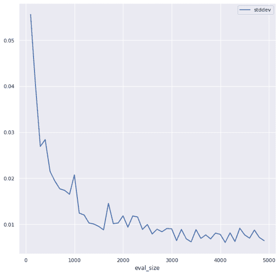

###### 图 6-3\. 通过评估生产模型在不同大小子集上的表现来确定所需的评估示例数量，并通过子集大小跟踪评估指标的变化情况。在这里，标准偏差在大约 2,000 个示例时开始趋于稳定。

从 图 6-3 中可以看出，所需的评估示例数量至少为 2,000 个，最好是 3,000 个或更多。让我们假设在本讨论的其余部分中，我们选择在 2,500 个示例上进行评估。

训练集将包含剩余的 2,500 个新样本（在保留 2,500 个用于评估后可用的新数据量）以及一些已经桥接以匹配新模式的较老样本。我们如何知道需要多少较老的例子？我们不知道。这是一个需要调整的超参数。例如，在梯度搜索中，我们从图 6-4（GitHub 上的[笔记本](https://github.com/GoogleCloudPlatform/ml-design-patterns/blob/master/06_reproducibility/bridging_schema.ipynb)详细介绍了全部细节）可以看出，在 20,000 个样本之前，评估指标急剧下降，然后开始趋于稳定。

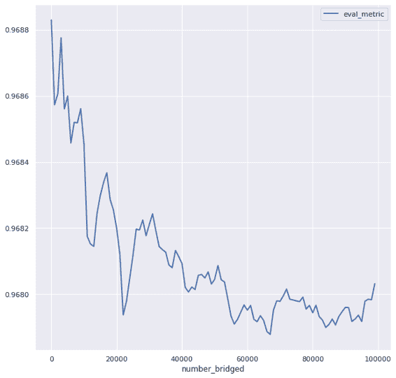

###### 图 6-4\. 通过进行超参数调整确定桥接的较老例子数量。在这种情况下，很明显，在桥接 20,000 个例子之后，收益递减。

为了获得最佳结果，我们应该选择能够应付的最少数量的较老例子，理想情况下，随着新样本数量的增长，我们将越来越少依赖桥接的例子。在某个时刻，我们将能够完全摆脱较老的例子。

值得注意的是，在这个问题上，桥接确实带来了好处，因为当我们没有使用桥接的例子时，评估指标会变差。如果不是这种情况，那么需要重新审视填充方法（用于桥接的静态值选择方法）。我们建议在下一节中使用另一种填充方法（级联）。

###### 警告

非常重要的是，比较在桥接示例上训练的新模型与评估数据集上未改变的老模型的性能。可能情况是，新信息尚未具备足够的价值。

因为我们将使用评估数据集来测试桥接模型是否具有价值，所以非常重要的是评估数据集不在训练或超参数调整过程中使用。因此，必须避免使用早停止或检查点选择等技术。相反，使用正则化来控制过拟合。训练损失将作为超参数调整的度量。更多关于如何通过仅使用两个分割来节省数据的讨论，请参阅第 4 章中关于检查点设计模式的详细信息。

## 折衷和替代方案

让我们看看一个通常提出但并不起作用的方法，一种复杂的桥接替代方案，以及解决类似问题的解决方案的扩展。

### 联合模式

可能会诱人的是简单地创建旧版和新版模式的联合。例如，我们可以定义支付类型模式为具有五个可能值：现金、卡片、礼品卡、借记卡和信用卡。这样做将使历史数据和新数据都有效，并且是我们在数据仓库中处理此类更改时采取的方法。这样，旧数据和新数据都是有效的，无需任何更改。

然而，对于机器学习来说，向后兼容的、联合模式并不适用。

在预测时，我们永远不会得到支付类型为“卡”的值，因为输入提供者已经全部升级了。事实上，所有这些训练实例都将是徒劳的。出于可重现性考虑（这是将此模式分类为可重现性模式的原因），我们需要将旧模式桥接到新模式中，而不能简单地将两个模式进行联合。

### 级联方法

统计学中的插补是一组可以用来替换缺失数据的技术。常见的插补技术是用该列在训练数据中的均值替换空值。为什么选择均值？因为在没有更多信息的情况下，并且假设值正态分布时，最可能的值是均值。

在主要解决方案中讨论的静态方法，即分配先验频率的方法，也是一种插补方法。我们假设分类变量按照频率表分布（我们从训练数据中估算出来），并且将均值的独热编码值（根据该频率分布）插补到“缺失”的分类变量中。

我们是否知道其他方法可以根据一些示例来估计未知值？当然！机器学习。我们可以做的是训练一系列模型（参见“设计模式 8：级联”在第三章）。第一个模型使用任何新示例来训练一个机器学习模型以预测卡类型。如果原始的技巧模型有五个输入，这个模型将有四个输入。第五个输入（支付类型）将是此模型的标签。然后，第一个模型的输出将用于训练第二个模型。

在实践中，级联模式为一些被认为是临时性的解决方案添加了太多复杂性，直到你有足够的新数据。静态方法实际上是最简单的机器学习模型——如果我们有无信息输入，那么这就是我们将得到的模型。我们建议采用静态方法，并且只有在静态方法效果不够好时才使用级联方法。

### 处理新功能

另一种需要桥接的情况是输入提供者向输入数据流添加额外信息。例如，在我们的出租车费用示例中，我们可以开始接收有关出租车是否打开雨刷或车辆是否移动的数据。根据这些数据，我们可以创建一个特征，表示出租车行程开始时是否下雨，以及出租车空闲时间的分数等。

如果我们有新的输入特征希望立即开始使用，我们应该通过插补新特征的值来桥接旧数据（其中这个新特征将缺失）。推荐的插补值选择有：

+   如果特征是数值且正态分布，则特征的平均值。

+   如果特征是数值且存在偏斜或大量异常值，则特征的中位数值。

+   如果特征是分类的且可排序，则特征的中位数值。

+   如果特征是分类的且不可排序，则特征的众数。

+   如果特征是布尔值，则特征为真的频率。

如果特征是是否下雨的布尔值，则插补值可能是像 0.02 这样的值，如果在训练数据集中下雨的时间占比为 2%。如果特征是空闲分钟的比例，则可以使用中位数值。在所有这些情况下，级联模式方法仍然可行，但静态插补更简单且通常足够。

### 处理精度增加

当输入提供者增加其数据流的精度时，按照桥接方法创建一个训练数据集，其中包含更高分辨率数据的一部分，并加上一些旧数据。

对于浮点数值，不需要显式地调整旧数据以匹配新数据的精度。为了理解这一点，考虑一种情况：一些数据最初提供到小数点后一位（例如，3.5 或 4.2），但现在提供到小数点后两位（例如，3.48 或 4.23）。如果我们假设在旧数据中的 3.5 由在新数据中均匀分布于[3.45, 3.55]的值组成，那么静态插补值将是 3.5，这正是存储在旧数据中的值。

对于分类值——例如，如果旧数据将位置存储为州或省代码，而新数据提供县或区代码——使用主解决方案中描述的州内县的频率分布进行静态插补。

# 设计模式 24：窗口推断

窗口推理设计模式处理需要连续一系列实例才能运行推理的模型。这种模式通过外部化模型状态并从流分析管道调用模型来工作。当机器学习模型需要从时间窗口的聚合中计算特征时，此模式也非常有用。通过将状态外部化到流水线，窗口推理设计模式确保了在训练和服务之间正确重复计算动态、时间相关特征。这是避免在时间聚合特征情况下训练-服务偏差的一种方式。

## 问题

查看 2010 年 5 月在图 6-5 上展示的达拉斯-沃思堡（DFW）机场的到达延误情况（完整的笔记本在 GitHub 上）。

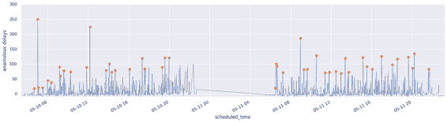

###### 图 6-5\. 2010 年 5 月 10 日至 11 日达拉斯-沃思堡（DFW）机场的到达延误。异常到达延误用点标记。

到达延误表现出相当大的变异性，但仍然可以注意到异常的大到达延误（用点标记）。请注意，“异常”的定义根据上下文而异。在早晨（图表左上角），大多数航班准时到达，因此即使是小的峰值也是异常的。到了中午（5 月 10 日下午 12 点后），变异性增加，25 分钟的延误相当普遍，但 75 分钟的延误仍然是异常的。

特定延误是否异常取决于时间上下文，例如过去两小时内观察到的到达延误。为了确定延误是否异常，我们首先需要根据时间对数据帧进行排序（如图 6-5 中的图表，并在 pandas 中显示）：

```
df = df.sort_values(by='scheduled_time').set_index('scheduled_time')
```

然后，我们需要对两小时的滑动窗口应用异常检测函数：

```
df['delay'].rolling('2h').apply(is_anomaly, raw=False)
```

异常检测函数`is_anomaly`可能非常复杂，但让我们简单地考虑丢弃极值并在两小时窗口中，如果数据值超过均值四个标准差，则将其视为异常：

```
def is_anomaly(d):
    outcome = d[-1] # the last item

    # discard min & max value & current (last) item
    xarr = d.drop(index=[d.idxmin(), d.idxmax(), d.index[-1]])    
    prediction = xarr.mean()
    acceptable_deviation = 4 * xarr.std()
    return np.abs(outcome - prediction) > acceptable_deviation
```

这在历史（训练）数据上运行，因为整个数据帧都在手头上。当然，在生产模型上运行推理时，我们将不会有整个数据帧。在生产中，我们将逐个接收航班到达信息，每到一个航班就会有一个延误值。因此，我们将只有一个时间戳上的单个延误值：

```
2010-02-03 08:45:00,19.0
```

鉴于上面的航班（在 2 月 3 日 08:45）晚点了 19 分钟，这是否不寻常？ 通常，要对航班进行 ML 推断，我们只需要该航班的特征。 但是，在这种情况下，模型需要有关 06:45 到 08:45 之间所有飞往 DFW 机场的航班的信息：

```
2010-02-03 06:45:00,?
2010-02-03 06:?:00,?
...
2010-02-03 08:45:00,19.0
```

不可能一次进行单个航班的推断。 我们需要以某种方式向模型提供关于所有先前航班的信息。

当模型不仅需要一个实例而是一系列实例时，我们如何进行推断？

## 解决方案

解决方案是进行有状态流处理，即通过时间跟踪模型状态进行流处理：

+   对航班到达数据应用滑动窗口。 滑动窗口将覆盖 2 小时，但窗口可以更频繁地关闭，例如每 10 分钟。 在这种情况下，将在过去 2 小时内每 10 分钟计算聚合值。

+   内部模型状态（这可能是航班列表）每次新航班到达时都会更新航班信息，从而建立起 2 小时的历史航班数据记录。

+   每次窗口关闭时（例如我们的例子中每 10 分钟），将在 2 小时内的航班列表上训练时间序列 ML 模型。 然后，此模型用于预测未来的航班延误以及此类预测的置信区间。

+   时间序列模型参数外部化为状态变量。 我们可以使用时间序列模型，如自回归积分滑动平均（ARIMA）或长短期记忆（LSTMs），在这种情况下，模型参数将是 ARIMA 模型系数或 LSTM 模型权重。 为了保持代码易于理解，我们将使用零阶回归模型，² 因此，我们的模型参数将是平均航班延误和过去两小时窗口内航班延误的方差。

+   当航班到达时，可以使用外部化模型状态对其到达延误进行异常分类，而不必拥有过去 2 小时内所有航班的完整列表。

我们可以使用 Apache Beam 进行流水线处理，因为同样的代码将适用于历史数据和新到达的数据。 在 Apache Beam 中，滑动窗口设置如下（[完整代码在 GitHub 上](https://github.com/GoogleCloudPlatform/ml-design-patterns/blob/master/06_reproducibility/find_anomalies_model.py)）：

```
windowed = (data
        | 'window' >> beam.WindowInto(
                beam.window.SlidingWindows(2 * 60 * 60, 10*60))
```

模型通过整合过去两小时收集的所有航班数据并传递给我们称之为`ModelFn`的函数来进行更新：

```
model_state = (windowed 
        | 'model' >> beam.transforms.CombineGlobally(ModelFn()))
```

`ModelFn`使用航班信息更新内部模型状态。 在这里，内部模型状态将包括一个带有窗口内航班的 pandas dataframe：

```
class ModelFn(beam.CombineFn):
    def create_accumulator(self):
        return pd.DataFrame()

    def add_input(self, df, window):
        return df.append(window, ignore_index=True)
```

每次窗口关闭时，提取输出。 这里的输出（我们称之为外部化模型状态）包括模型参数：

```
    def extract_output(self, df):
        if len(df) < 1:
            return {}
        orig = df['delay'].values
        xarr = np.delete(orig, [np.argmin(orig), np.argmax(orig)])
        return {
            'prediction': np.mean(xarr),
            'acceptable_deviation': 4 * np.std(xarr)
        }
```

外部化模型状态每 10 分钟更新一次，基于 2 小时滚动窗口：

| 窗口关闭时间 | 预测 | 可接受偏差 |
| --- | --- | --- |
| 2010-05-10T06:35:00 | -2.8421052631578947 | 10.48412597725367 |
| 2010-05-10T06:45:00 | -2.6818181818181817 | 12.083729926046008 |
| 2010-05-10T06:55:00 | -2.9615384615384617 | 11.765962341537781 |

提取模型参数的代码与 pandas 情况类似，但在 Beam 管道内完成。这使代码可以在流式处理中工作，但模型状态仅在滑动窗口的上下文中可用。为了在每次到达的航班上进行推理，我们需要外部化模型状态（类似于在无状态服务函数模式中将模型权重导出到文件以将其与训练程序的上下文分离，其中这些权重是计算的）：

```
model_external = beam.pvalue.AsSingleton(model_state)
```

可以使用此外部化状态检测给定航班是否异常：

```
def is_anomaly(flight, model_external_state):
    result = flight.copy()
    error = flight['delay'] - model_external_state['prediction']
    tolerance = model_external_state['acceptable_deviation']
    result['is_anomaly'] = np.abs(error) > tolerance
    return result
```

然后将`is_anomaly`函数应用于滑动窗口的最后一个项目：

```
anomalies = (windowed 
        | 'latest_slice' >> beam.FlatMap(is_latest_slice)
        | 'find_anomaly' >> beam.Map(is_anomaly, model_external))
```

## 折中与替代方案

上述提到的解决方案在高吞吐量数据流的情况下具有计算效率，但如果可以在线更新机器学习模型参数，则可以进一步改进。这种模式也适用于状态化机器学习模型，如循环神经网络，以及当无状态模型需要有状态输入特征时。

### 减少计算开销

在问题部分，我们使用了以下 pandas 代码：

```
dfw['delay'].rolling('2h').apply(is_anomaly, raw=False);
```

而在解决方案部分，Beam 代码如下所示：

```
windowed = (data
        | 'window' >> beam.WindowInto(
                beam.window.SlidingWindows(2 * 60 * 60, 10*60))
model_state = (windowed 
        | 'model' >> beam.transforms.CombineGlobally(ModelFn()))
```

由于`is_anomaly`函数的调用频率以及模型参数（均值和标准差）的计算频率，pandas 中的滚动窗口和 Apache Beam 中的滑动窗口存在有意义的区别。这些将在下文讨论。

#### 按元素与按时间间隔

在 pandas 代码中，`is_anomaly`函数在数据集中的每个实例上都被调用。异常检测代码计算模型参数，并立即将其应用于窗口中的最后一个项目。在 Beam 管道中，模型状态也是在每个滑动窗口上创建的，但在这种情况下，滑动窗口是基于时间的。因此，模型参数每 10 分钟仅计算一次。

异常检测本身在每个实例上执行：

```
anomalies = (windowed 
        | 'latest_slice' >> beam.FlatMap(is_latest_slice)
        | 'find_anomaly' >> beam.Map(is_anomaly, model_external))
```

注意，这将计算昂贵的训练与计算廉价的推理仔细分离。昂贵的部分每 10 分钟仅执行一次，同时允许对每个实例进行异常分类。

#### 高吞吐量数据流

数据量不断增加，其中大部分增加是由实时数据引起的。因此，这种模式必须应用于高吞吐量数据流——其中元素数量可能超过每秒数千个项目。例如，考虑来自网站点击流或来自计算机、可穿戴设备或汽车的机器活动流。

使用流水线处理的建议解决方案具有优势，因为它避免了在每个实例中重新训练模型，这是问题声明中的 pandas 代码所做的事情。然而，建议的解决方案通过创建一个包含所有接收记录的内存数据框架来还原这些收益。如果我们每秒接收 5,000 个项目，那么在 10 分钟内存数据框架将包含 3 百万条记录。因为任何时刻都需要维护 12 个滑动窗口（每个 10 分钟窗口，每个 2 小时），内存需求可能变得相当大。

为了在窗口结束时计算模型参数，存储所有接收的记录可能会变得棘手。当数据流量大时，能够每个元素更新模型参数变得非常重要。可以通过如下更改`ModelFn`来实现此操作（[完整代码位于 GitHub](https://github.com/GoogleCloudPlatform/ml-design-patterns/blob/master/06_reproducibility/find_anomalies_model.py)）：

```
class OnlineModelFn(beam.CombineFn):
    ...
    def add_input(self, inmem_state, input_dict):
        (sum, sumsq, count) = inmem_state
        input = input_dict['delay']
        return (sum + input, sumsq + input*input, count + 1)

    def extract_output(self, inmem_state):
        (sum, sumsq, count) = inmem_state
        ...
            mean = sum / count
            variance = (sumsq / count) - mean*mean
            stddev = np.sqrt(variance) if variance > 0 else 0
            return {
                'prediction': mean,
                'acceptable_deviation': 4 * stddev
            }
        ...
```

主要区别在于，仅在内存中保存了三个浮点数（`sum`、`sum²`、`count`），用于提取输出模型状态所需的模型参数，而不是接收实例的整个数据框架。逐个实例更新模型参数称为*在线更新*，只有在模型训练不需要对整个数据集进行迭代时才能完成。因此，在上述实现中，通过维护 x² 的总和来计算方差，这样在计算均值后就不需要对数据进行第二次遍历。

### 流式 SQL

如果我们的基础架构包括一个能够处理流数据的高性能 SQL 数据库，那么可以通过使用聚合窗口来实现 Windowed Inference 模式的另一种方式（[完整代码位于 GitHub](https://github.com/GoogleCloudPlatform/ml-design-patterns/blob/master/06_reproducibility/find_anomalies_model.py)）。

我们从 BigQuery 中提取飞行数据：

```
WITH data AS (
  SELECT 
    PARSE_DATETIME('%Y-%m-%d-%H%M',
                   CONCAT(CAST(date AS STRING), 
                   '-', FORMAT('%04d', arrival_schedule))
                   ) AS scheduled_arrival_time,
     arrival_delay
  FROM `bigquery-samples.airline_ontime_data.flights`
  WHERE arrival_airport = 'DFW' AND SUBSTR(date, 0, 7) = '2010-05'
),
```

然后，我们通过计算一个时间窗口的模型参数来创建`model_state`，该窗口指定为前两小时到前一秒：

```
model_state AS (
  SELECT
    scheduled_arrival_time,
    arrival_delay,
    AVG(arrival_delay) OVER (time_window) AS prediction,
    4*STDDEV(arrival_delay) OVER (time_window) AS acceptable_deviation
  FROM data
  WINDOW time_window AS 
    (ORDER BY UNIX_SECONDS(TIMESTAMP(scheduled_arrival_time))
     RANGE BETWEEN 7200 PRECEDING AND 1 PRECEDING)
)
```

最后，我们对每个实例应用异常检测算法：

```
SELECT 
  *,
  (ABS(arrival_delay - prediction) > acceptable_deviation) AS is_anomaly 
FROM model_state
```

结果看起来像表 6-1，到达延迟 54 分钟被标记为异常，因为所有先前的航班都提前到达。

表 6-1\. BigQuery 查询结果，确定传入的航班数据是否异常

| scheduled_arrival_time | arrival_delay | prediction | acceptable_deviation | is_anomaly |
| --- | --- | --- | --- | --- |
| 2010-05-01T05:45:00 | -18.0 | -8.25 | 62.51399843235114 | false |
| 2010-05-01T06:00:00 | -13.0 | -10.2 | 56.878818553131005 | false |
| 2010-05-01T06:35:00 | -1.0 | -10.666 | 51.0790237442599 | false |
| 2010-05-01T06:45:00 | -9.0 | -9.28576 | 48.86521793473886 | false |
| 2010-05-01T07:00:00 | **54.0** | -9.25 | 45.24220532707422 | **true** |

与 Apache Beam 解决方案不同，分布式 SQL 的效率将允许我们计算以每个实例为中心的 2 小时时间窗口（而不是以 10 分钟窗口的分辨率）。然而，其缺点是 BigQuery 往往具有相对较高的延迟（以秒计），因此不能用于实时控制应用程序。

### 序列模型

通过传递前几个实例的滑动窗口给推断函数的窗口推断模式，不仅对异常检测或甚至时间序列模型有用。特别是对于任何需要历史状态的模型类，如序列模型，它非常有用。例如，翻译模型需要看到几个连续的单词才能执行翻译，以便翻译考虑到单词的上下文。毕竟，“left”、“Chicago”和“road”的翻译在句子“I left Chicago by road”和“Turn left on Chicago Road”中有所不同。

为了性能原因，翻译模型将被设置为无状态，并要求用户提供上下文。例如，如果模型是无状态的，那么可以根据流量的增加自动扩展模型的实例，并且可以并行调用以获得更快的翻译。因此，翻译莎士比亚《哈姆雷特》中著名的独白到德语可能会按照这些步骤进行，从中间开始，加粗的单词是要翻译的单词：

| 输入（9 个单词，每边 4 个） | 输出 |
| --- | --- |
| 未曾探索的国度，从**其**的彼岸，没有旅行者回来 | dessen |
| 未曾探索的国度，从其**彼岸**没有旅行者回来，这令 | Bourn |
| 国度，从其彼岸**没有**旅行者回来，这令 | Kein |
| 从其彼岸没有**旅行者**回来，这令思 | Reisender |

因此，客户端将需要一个流水线。该流水线可以接收输入的英文文本，将其标记化，每次发送九个标记，收集输出，并将其连接成德语句子和段落。

大多数序列模型，如循环神经网络和 LSTM，需要流水线以实现高性能推断。

### 有状态的特征

即使模型本身是无状态的，如果模型的输入特征需要状态，窗口推理模式也可能很有用。例如，假设我们正在训练一个模型来预测到达延误，而模型的一个输入是出发延误。我们可能希望将过去两小时该机场航班的平均出发延误作为模型的一个输入。

在训练期间，我们可以使用 SQL 窗口函数来创建数据集：

```
WITH data AS (
  SELECT 
     SAFE.PARSE_DATETIME('%Y-%m-%d-%H%M',
                   CONCAT(CAST(date AS STRING), '-', 
                   FORMAT('%04d', departure_schedule))
                   ) AS scheduled_depart_time,
     arrival_delay,
     departure_delay,
     departure_airport
  FROM `bigquery-samples.airline_ontime_data.flights`
  WHERE arrival_airport = 'DFW'
),

  SELECT
    * EXCEPT(scheduled_depart_time),
    EXTRACT(hour from scheduled_depart_time) AS hour_of_day,
    AVG(departure_delay) OVER (depart_time_window) AS avg_depart_delay
  FROM data
  WINDOW depart_time_window AS 
    (PARTITION BY departure_airport ORDER BY 
     UNIX_SECONDS(TIMESTAMP(scheduled_depart_time))
     RANGE BETWEEN 7200 PRECEDING AND 1 PRECEDING)
```

训练数据集现在包括平均延误作为另一个特征：

| 行 | 到达延误 | 出发延误 | 出发机场 | 小时 | 平均出发延误 |
| --- | --- | --- | --- | --- | --- |
| 1 | -3.0 | -7.0 | LFT | 8 | **-4.0** |
| 2 | 56.0 | 50.0 | LFT | 8 | **41.0** |
| 3 | -14.0 | -9.0 | LFT | 8 | **5.0** |
| 4 | -3.0 | 0.0 | LFT | 8 | **-2.0** |

然而，在推理过程中，我们将需要一个流水线来计算这个平均出发延误，以便将其提供给模型。为了限制训练与服务之间的偏差，最好在流水线中使用相同的 SQL 作为一个滚动窗口函数，而不是尝试将 SQL 翻译成 Scala、Python 或 Java。

### 批处理预测请求

另一种情况是，即使模型是无状态的，我们也可能希望使用窗口推理，例如当模型部署在云端，但客户端嵌入到设备或本地时。在这种情况下，将推理请求逐个发送到云端部署的模型可能会导致网络延迟过大。在这种情况下，可以使用 “设计模式 19: 两阶段预测” 来处理，其中第一阶段使用管道收集一些请求，第二阶段将其作为一个批次发送到服务端。

这仅适用于对延迟具有容忍性的用例。如果我们在五分钟内收集输入实例，那么客户端必须能够容忍获取预测结果的最多五分钟的延迟。

# 设计模式 25: 工作流管道

在工作流管道设计模式中，我们通过将机器学习流程中的步骤容器化和编排来解决创建端到端可重复的管道的问题。容器化可以明确完成，也可以使用简化该过程的框架来完成。

## 问题

一个数据科学家可能能够从头到尾（在 Figure 6-6 中描绘）在单个脚本或笔记本中运行数据预处理、训练和模型部署步骤。然而，随着机器学习过程中的每个步骤变得更加复杂，并且组织内更多的人希望为这个代码库做出贡献，从单个笔记本运行这些步骤将无法扩展。

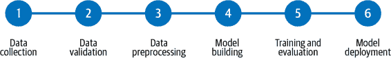

###### 图 6-6\. 典型端到端 ML 工作流程中的步骤。这并不是包罗万象，但捕捉了 ML 开发过程中最常见的步骤。

在传统的编程中，*单体应用程序*被描述为所有应用程序逻辑都由单个程序处理的情况。要在单体应用程序中测试一个小功能，我们必须运行整个程序。部署或调试单体应用程序也是如此。对一个程序的一个小错误修复进行部署需要部署整个应用程序，这很快就会变得笨拙。当整个代码库紧密耦合时，个别开发人员很难调试错误并独立于应用程序的不同部分工作。近年来，单体应用程序已被*微服务*架构取代，其中业务逻辑的各个部分作为独立的（微）代码包构建和部署。通过微服务，大型应用程序被拆分成更小、更易管理的部分，使开发人员可以独立地构建、调试和部署应用程序的各个部分。

这个单体与微服务的讨论为扩展 ML 工作流程、促进协作以及确保 ML 步骤在不同工作流程中可重复和可重用提供了一个很好的类比。当某人独自构建 ML 模型时，“单体”方法可能更快地进行迭代。这也常常有效，因为一个人积极参与开发和维护每个部分：数据收集和预处理、模型开发、训练和部署。然而，当扩展此工作流程时，组织中的不同人员或团队可能负责不同的步骤。为了扩展 ML 工作流程，我们需要一种方法让正在构建模型的团队能够独立于数据预处理步骤运行试验。我们还需要跟踪管道每个步骤的性能，并管理每个过程部分生成的输出文件。

此外，当每个步骤的初始开发完成后，我们希望安排像重新训练这样的操作，或者创建在环境更改（例如将新的训练数据添加到存储桶）时触发的事件驱动的流水线运行。在这种情况下，解决方案需要允许我们一次性运行整个工作流程，同时仍能够跟踪单个步骤的输出并追踪错误。

## 解决方案

为了处理机器学习流程的扩展带来的问题，我们可以将 ML 工作流程中的每个步骤制作成单独的容器化服务。容器保证我们能够在不同的环境中运行相同的代码，并且能够在运行之间保持一致的行为。这些单独的容器化步骤联合在一起形成一个*管道*，可以通过 REST API 调用运行。由于管道步骤在容器中运行，我们可以在开发笔记本、本地基础设施或托管的云服务上运行它们。这种管道工作流程允许团队成员独立构建管道步骤。容器还提供了一种可重现的方式来端到端运行整个管道，因为它们保证了库依赖版本和运行环境之间的一致性。此外，因为容器化管道步骤允许关注点分离，各个步骤可以使用不同的运行时和语言版本。

创建管道的工具有很多选择，包括本地和云端选项，如[云 AI 平台管道](https://oreil.ly/nJo1p)，[TensorFlow Extended](https://oreil.ly/OznI3)（TFX），[Kubeflow 管道](https://oreil.ly/BoegQ)（KFP），[MLflow](https://mlflow.org)和[Apache Airflow](https://oreil.ly/63_GG)。在这里展示 Workflow Pipeline 设计模式，我们将使用 TFX 定义我们的管道，并在云 AI 平台管道上运行它，这是一个托管服务，可在 Google 云上使用 Google Kubernetes Engine（GKE）作为底层容器基础设施来运行 ML 管道。

TFX 管道中的步骤被称为*组件*，提供了预构建和可定制的组件。通常，TFX 管道中的第一个组件用于从外部源接收数据。这称为`ExampleGen`组件，其中“example”是机器学习术语，指用于训练的标记实例。[`ExampleGen`](https://oreil.ly/Sjx9F)组件允许您从 CSV 文件、TFRecords、BigQuery 或自定义源获取数据。例如，`BigQueryExampleGen`组件允许我们通过指定查询来连接存储在 BigQuery 中的数据到我们的管道，然后将该数据存储为 TFRecords 在 GCS 存储桶中，以便下一个组件使用。通过传递查询来定制此组件。这些`ExampleGen`组件解决了 ML 工作流程中数据收集阶段的问题，如 Figure 6-6 所述。

工作流程的下一步是数据验证。一旦我们摄入数据，我们可以将其传递给其他组件进行转换或分析，然后再训练模型。[`StatisticsGen`](https://oreil.ly/kX1QY) 组件接收从`ExampleGen`步骤摄入的数据，并生成所提供数据的摘要统计信息。[`SchemaGen`](https://oreil.ly/QpBlu) 从我们摄入的数据中输出推断的模式。利用`SchemaGen`的输出，[`ExampleValidator`](https://oreil.ly/UD7Uh) 对我们的数据集执行异常检测，并检查数据漂移或潜在的训练–服务偏差迹象³。[`Transform`](https://oreil.ly/xsJYT) 组件还从`SchemaGen`输出，并在这里执行特征工程，将我们的数据输入转换为模型所需的正确格式。这可能包括将自由格式文本输入转换为嵌入、标准化数值输入等。

一旦我们的数据准备好输入模型，我们可以将其传递给[`Trainer`](https://oreil.ly/XFtR_)组件。在设置`Trainer`组件时，我们指定一个定义模型代码的函数，并可以指定在哪里训练模型。在这里，我们将展示如何从这个组件使用 Cloud AI Platform 进行训练。最后，[`Pusher`](https://oreil.ly/qP8GU)组件处理模型部署。TFX 提供了许多其他预构建组件——我们只在此处包含了一些在示例流水线中使用的组件。

在此示例中，我们将使用 BigQuery 中的 NOAA 飓风数据集构建一个推断 SSHS 代码⁴ 的模型。为了专注于流水线工具，我们将保持特征、组件和模型代码相对简短。我们的流水线步骤如下所述，大致遵循 Figure 6-6 中概述的工作流程：

1.  数据收集：运行查询从 BigQuery 获取飓风数据。

1.  数据验证：使用`ExampleValidator`组件来识别异常并检查数据漂移。

1.  数据分析和预处理：在数据上生成一些统计信息并定义模式。

1.  模型训练：在 AI 平台上训练一个`tf.keras`模型。

1.  模型部署：将训练好的模型部署到 AI 平台预测⁵。

当我们的流水线完成时，我们将能够通过单个 API 调用来调用上述整个流程。让我们首先讨论典型 TFX 流水线的脚手架和在 AI 平台上运行它的过程。

### 构建 TFX 流水线。

我们将使用 `tfx` 命令行工具来创建和调用我们的管道。管道的新调用称为 *运行*，与我们对管道本身的更新不同，例如添加新组件。TFX CLI 可以完成这两种操作。我们可以在一个单独的 Python 脚本中定义我们管道的支架，这个脚本有两个关键部分：

+   一个实例化的 [tfx.orchestration.pipeline](https://oreil.ly/62kf3)，在其中我们定义我们的管道及其包含的组件。

+   一个来自 [tfx](https://oreil.ly/62kf3) 库的 [kubeflow_dag_runner](https://oreil.ly/62kf3) 实例。我们将使用它来创建和运行我们的管道。除了 Kubeflow runner 外，还有一个用于使用 [Apache Beam](https://oreil.ly/hn0vF) 在本地运行 TFX 管道的 API。

我们的管道（参见 [GitHub 上的完整代码](https://github.com/GoogleCloudPlatform/ml-design-patterns/tree/master/06_reproducibility/workflow_pipeline)）将包括上述五个步骤或组件，我们可以通过以下方式定义我们的管道：

```
pipeline.Pipeline(
      pipeline_name='huricane_prediction',
      pipeline_root='path/to/pipeline/code',
      components=[
          bigquery_gen, statistics_gen, schema_gen, train, model_pusher
      ]
  )
```

要使用 TFX 提供的 `BigQueryExampleGen` 组件，我们提供将获取数据的查询。我们可以在一行代码中定义这个组件，其中 `query` 是我们的 BigQuery SQL 查询字符串：

```
bigquery_gen = BigQueryExampleGen(query=query)
```

使用管道的另一个好处是它提供了工具来跟踪每个组件的输入、输出结果和日志。例如，`statistics_gen` 组件的输出是我们数据集的摘要，我们可以在 图 6-7 中看到这些内容。[`statistics_gen`](https://oreil.ly/wvq9n) 是 TFX 中的一个预构建组件，使用 TF Data Validation 生成我们数据集的摘要统计信息。

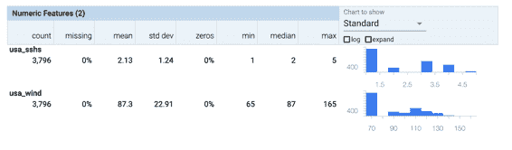

###### 图 6-7\. TFX 管道中 statistics_gen 组件的输出结果。

### 在 Cloud AI Platform 上运行管道

我们可以在 Cloud AI Platform Pipelines 上运行 TFX 管道，这将为我们管理基础设施的底层细节。要将管道部署到 AI Platform，我们将我们的管道代码打包为一个 [Docker 容器](https://oreil.ly/rdXeb)，并将其托管在 [Google Container Registry](https://oreil.ly/m5wqD)（GCR）。⁶ 一旦我们的容器化管道代码已推送到 GCR，我们将使用 TFX CLI 创建该管道：

```
tfx pipeline create  \
--pipeline-path=kubeflow_dag_runner.py \
--endpoint='your-pipelines-dashboard-url' \
--build-target-image='gcr.io/your-pipeline-container-url'
```

在上述命令中，endpoint 对应着 AI Platform Pipelines 仪表板的 URL。完成后，我们将在管道仪表板中看到我们刚刚创建的管道。`create` 命令创建一个可以通过创建运行来调用的管道 *资源*：

```
tfx run create --pipeline-name='your-pipeline-name' --endpoint='pipeline-url'
```

运行此命令后，我们将能够看到一个图表，实时更新我们的管道通过每个步骤的情况。从管道仪表板，我们可以进一步检查单个步骤生成的任何工件、元数据等。我们可以在图 6-8 中看到一个单个步骤的输出示例。

我们可以直接在 GKE 上的容器化管道中训练我们的模型，但是 TFX 提供了一个实用程序，用于将 Cloud AI 平台训练作为我们过程的一部分。TFX 还有一个扩展，用于将我们训练好的模型部署到 AI 平台预测中。我们将在我们的管道中利用这两个集成。AI 平台训练使我们能够以成本效益的方式利用专门的硬件来训练我们的模型，例如 GPU 或 TPU。它还提供了使用分布式训练的选项，这可以加快训练时间并减少训练成本。我们可以在 AI 平台控制台内跟踪单个训练作业及其输出。

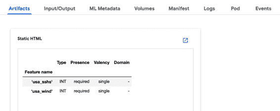

###### 图 6-8\. ML 管道中 schema_gen 组件的输出。顶部菜单栏显示每个单独管道步骤可用的数据。

###### 提示

使用 TFX 或 Kubeflow Pipelines 构建管道的一个优点是，我们不会被锁定在 Google Cloud 上。我们可以在[Azure ML Pipelines](https://oreil.ly/A5Rxe)、[Amazon SageMaker](https://oreil.ly/H3p3Y)或本地环境上运行我们在这里演示的相同代码。

在 TFX 中实现训练步骤，我们将使用[`Trainer`组件](https://oreil.ly/TGKcP)，并传递关于要用作模型输入的训练数据以及我们的模型训练代码的信息。TFX 提供了在 AI 平台上运行训练步骤的扩展，我们可以通过导入`tfx.extensions.google_cloud_ai_platform.trainer`并提供有关我们的 AI 平台训练配置的详细信息来使用它。这包括我们的项目名称、地区以及包含训练代码的容器的 GCR 位置。

类似地，TFX 还有一个 AI 平台[`Pusher`](https://oreil.ly/wS6lc) [组件](https://oreil.ly/bJavO) 用于将训练好的模型部署到 AI 平台预测中。为了在 AI 平台上使用`Pusher`组件，我们提供有关我们模型的名称和版本的详细信息，以及一个服务函数，告诉 AI 平台它应该期望我们模型的输入数据格式。有了这些，我们就可以通过 AI 平台完成一个完整的管道，该管道摄取数据、分析数据、运行数据转换，最终使用 AI 平台进行模型训练和部署。

## 为什么它有效

不将我们的 ML 代码作为一个流水线运行，其他人可靠地复现我们的工作将会很困难。他们需要使用我们的预处理、模型开发、训练和服务代码，并尝试复制我们运行它的相同环境，同时考虑库依赖、认证等因素。如果有逻辑控制基于上游组件输出选择下游组件的逻辑，这个逻辑也必须能够可靠地复制。工作流程管道设计模式允许其他人在本地和云环境中运行和监控我们整个 ML 工作流程的端到端，并且能够调试单个步骤的输出。将管道的每个步骤容器化确保其他人能够复现我们用来构建它和在管道中捕获的整个工作流的环境。这也允许我们在数月后重现环境以支持监管需求。使用 TFX 和 AI 平台管道，仪表板还为我们提供了一个 UI，用于跟踪每个管道执行生成的输出艺术品。这在“权衡与替代方案”中进一步讨论。

此外，每个管道组件在自己的容器中，不同团队成员可以并行构建和测试管道的不同部分。这允许更快的开发，并最小化与更单片化 ML 流程相关的风险，其中步骤彼此不可分割地联系在一起。例如，构建数据预处理步骤所需的包依赖和代码可能与模型部署的不同。通过将这些步骤作为管道的一部分构建，每个部分都可以在单独的容器中构建，具有自己的依赖项，并在完成后整合到更大的管道中。

总结一下，工作流管道模式为我们带来了有向无环图（DAG）的优势，以及像 TFX 这样的管道框架提供的预构建组件。因为管道是一个 DAG，我们可以选择执行单个步骤或从头到尾运行整个管道。这还为我们提供了对管道的每个步骤在不同运行中的日志记录和监控，并允许在一个集中的地方跟踪每个步骤和管道执行的艺术品。预构建组件为 ML 工作流程的常见组件（包括训练、评估和推断）提供了独立、即用即用的步骤。这些组件作为单独的容器运行，无论我们选择在哪里运行我们的管道。

## 权衡与替代方案

使用管道框架的主要替代方案是使用临时方法来运行我们的 ML 工作流的步骤，并为每个步骤跟踪笔记本和相关输出。当然，在将我们的 ML 工作流的不同部分转换为组织良好的管道时会涉及一些开销。在本节中，我们将探讨 Workflow Pipeline 设计模式的一些变体和扩展：手动创建容器、使用持续集成和持续交付（CI/CD）工具自动化管道、从开发到生产工作流管道的流程以及构建和编排管道的替代工具。我们还将探讨如何使用管道进行元数据跟踪。

### 创建自定义组件

我们可以定义自己的容器作为组件来构建我们的管道，而不是使用预构建或可自定义的 TFX 组件，或者将 Python 函数转换为组件。

要使用由 TFX 提供的基于容器的组件，我们使用`create_container_component`方法，向其传递我们组件的输入和输出，以及基础 Docker 镜像和容器的任何入口点命令。例如，以下基于容器的组件调用命令行工具`bq`下载 BigQuery 数据集：

```
component = create_container_component(
    name='DownloadBQData',
    parameters={
        'dataset_name': string,
        'storage_location': string
    },
    `image``=`'google/cloud-sdk:278.0.0'`,`
,
    command=[
        'bq', 'extract', '--compression=csv', '--field_delimiter=,',
        InputValuePlaceholder('dataset_name'),
        InputValuePlaceholder('storage_location'),
    ]
)
```

最好使用已包含大部分所需依赖项的基础镜像。我们正在使用 Google Cloud SDK 镜像，该镜像提供了`bq`命令行工具。

还可以使用`@component`装饰器将自定义 Python 函数转换为 TFX 组件。为了演示它，假设我们有一个用于准备整个管道中使用的资源的步骤，例如创建一个 Cloud Storage 存储桶。我们可以使用以下代码定义此自定义步骤：

```
from google.cloud import storage
client = storage.Client(project="your-cloud-project")

@component
def CreateBucketComponent(
    bucket_name: Parameter[string] = 'your-bucket-name',
    ) -> OutputDict(bucket_info=string):
  client.create_bucket('gs://' + bucket_name)
  bucket_info = storage_client.get_bucket('gs://' + bucket_name)

  return {
    'bucket_info': bucket_info
  }
```

然后，我们可以将此组件添加到我们的管道定义中：

```
create_bucket = CreateBucketComponent(
    bucket_name='my-bucket')
```

### 将 CI/CD 集成到管道中

除了通过仪表板或通过 CLI 或 API 编程方式调用管道外，我们可能希望在将模型投入生产时自动运行我们的管道。例如，当有一定量的新训练数据可用时，我们可能希望调用我们的管道。或者在管道的源代码更改时，我们可能希望触发管道运行。将 CI/CD 集成到我们的工作流管道中可以帮助连接触发事件和管道运行。

有许多托管服务可用于设置触发器，以在我们需要基于新数据重新训练模型时运行流水线。我们可以使用托管调度服务按计划调用我们的流水线。或者，我们可以使用像 [Cloud Functions](https://oreil.ly/rVyzX) 这样的无服务器事件驱动服务，在存储位置添加新数据时调用我们的流水线。在我们的函数中，我们可以指定条件，例如添加新数据的阈值，以创建新的流水线运行。一旦有足够的新训练数据可用，我们就可以实例化一个流水线运行来进行重新训练和重新部署模型，如 Figure 6-9 所示。

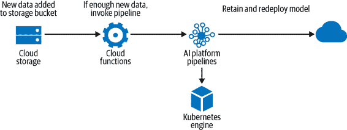

###### 图 6-9\. 使用云函数调用流水线的 CI/CD 工作流，当存储位置新增足够的新数据时。

如果我们希望基于源代码更改触发我们的流水线，像 [Cloud Build](https://oreil.ly/kz8Aa) 这样的托管 CI/CD 服务可以帮助。当 Cloud Build 执行我们的代码时，它作为一系列容器化步骤运行。这种方法很适合在流水线的上下文中使用。我们可以将 Cloud Build 连接到我们的流水线代码所在的 GitHub Actions 或 GitLab Triggers。当代码提交时，Cloud Build 将基于新代码构建与我们的流水线相关联的容器，并创建一个运行。

### Apache Airflow 和 Kubeflow Pipelines

除了 TFX，[Apache Airflow](https://oreil.ly/rQlqK) 和 [Kubeflow Pipelines](https://oreil.ly/e_7zJ) 都是实现工作流程管道模式的替代方案。与 TFX 一样，Airflow 和 KFP 都将流水线视为 DAG，其中每个步骤的工作流由 Python 脚本定义。然后，它们采用此脚本并提供 API 来处理调度并在指定的基础设施上编排图形。Airflow 和 KFP 都是开源的，因此可以在本地或云端运行。

Airflow 在数据工程中被广泛使用，因此对组织的数据 ETL 任务值得考虑。然而，虽然 Airflow 提供了强大的工具来运行作业，但它是作为通用解决方案构建的，并未考虑 ML 工作负载。另一方面，KFP 是专为 ML 设计的，并且在比 TFX 更低的层次上操作，提供了更多在如何定义流水线步骤上的灵活性。虽然 TFX 实现了其自己的编排方式，但 KFP 允许我们通过其 API 选择如何编排我们的流水线。TFX、KFP 和 Kubeflow 之间的关系总结在 Figure 6-10 中。


###### 图 6-10\. TFX、Kubeflow Pipelines、Kubeflow 和基础架构之间的关系。TFX 在 Kubeflow Pipelines 的顶层运行，具有预构建组件，提供常见工作流步骤的特定方法。Kubeflow Pipelines 提供 API 用于定义和编排 ML 管道，提供更灵活的实现每个步骤的方式。TFX 和 KFP 都在 Kubeflow 上运行，这是一个在 Kubernetes 上运行基于容器的 ML 工作负载的平台。这个图中的所有工具都是开源的，因此管道运行的基础架构由用户决定，一些选项包括 GKE、Anthos、Azure、AWS 或本地部署。

### 开发与生产管道

从开发到生产，管道调用的方式通常会发生变化。我们可能希望从笔记本构建和原型化我们的管道，在那里我们可以通过运行笔记本单元重新调用我们的管道，调试错误，并从同一环境中更新代码。一旦准备好投入生产，我们可以将组件代码和管道定义移动到一个单一脚本中。在脚本中定义了我们的管道之后，我们可以安排运行，并使组织内的其他人以可重复的方式调用管道变得更加容易。用于将管道投入生产的工具之一是 [Kale](https://github.com/kubeflow-kale/kale)，它使用 Kubeflow Pipelines API 将 Jupyter 笔记本代码转换为脚本。

生产管道还允许对 ML 工作流进行*编排*。编排意味着在我们的管道中添加逻辑以确定将执行哪些步骤，以及这些步骤的结果将是什么。例如，我们可能决定只想将准确率达到 95% 或更高的模型部署到生产环境中。当新可用数据触发管道运行并训练更新的模型时，我们可以添加逻辑以检查我们评估组件的输出，如果准确度超过我们的阈值，则执行部署组件，否则结束管道运行。在本节前面讨论过的 Airflow 和 Kubeflow Pipelines 都提供了管道编排的 API。

### ML 管道中的谱系跟踪

管道的另一个功能是使用它们来跟踪模型元数据和工件，也称为*血统跟踪*。每次我们调用管道时，都会生成一系列工件。这些工件可能包括数据集摘要、导出的模型、模型评估结果、特定管道调用的元数据等。血统跟踪允许我们可视化我们的模型版本历史及其他相关模型工件。例如，在 AI 平台管道中，我们可以使用管道仪表板查看特定模型版本是在哪些数据上进行训练的，可以按数据模式和日期进行分解。图 6-11 展示了 AI 平台上运行的 TFX 管道的 Lineage Explorer 仪表板。这使我们能够追踪与特定模型相关的输入和输出工件。

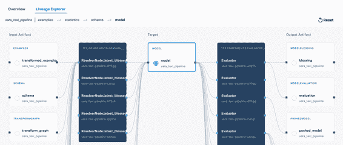

###### 图 6-11\. AI 平台管道的 TFX 管道的 Lineage Explorer 部分。

使用血统跟踪管理管道运行期间生成的工件的一个好处是，它支持云端和本地环境。这为我们在模型训练和部署的位置以及模型元数据存储的位置之间提供了灵活性。血统跟踪也是使 ML 管道可复制的重要方面，因为它允许比较不同管道运行生成的元数据和工件。

# 设计模式 26: 特征存储

*特征存储* 设计模式通过将特征创建过程与使用这些特征的模型开发过程解耦，简化了跨项目管理和重用特征的过程。

## 问题

良好的特征工程对于许多机器学习解决方案的成功至关重要。然而，它也是模型开发中最耗时的部分之一。有些特征需要大量领域知识才能正确计算，而业务策略的变化可能会影响特征的计算方式。为了确保这些特征能够以一致的方式计算，最好由领域专家而不是机器学习工程师控制这些特征。一些输入字段可能允许采用不同的数据表示方式（见第二章），使其更适合机器学习。机器学习工程师或数据科学家通常会尝试多种不同的转换方法，以确定哪些是有帮助的，哪些不是，在决定最终模型中将使用哪些特征之前。许多情况下，用于机器学习模型的数据并非来自单一来源。某些数据可能来自数据仓库，某些数据可能作为非结构化数据存储在存储桶中，而其他数据可能通过流式传输实时收集。这些数据的结构也可能在各个来源之间有所不同，因此在将其输入模型之前，每个输入都需要进行自己的特征工程步骤。这种开发通常在虚拟机或个人机器上进行，导致特征创建与构建模型的软件环境紧密相关，而模型变得越复杂，这些数据管道就变得越复杂。

针对单次模型开发和训练，可以采用按需创建特征的临时方法，但随着组织规模扩大，这种特征工程方法变得不切实际，会带来重大问题：

+   临时特征不容易重复使用。特征一遍又一遍地被重新创建，无论是由个别用户还是团队内部，或者永远停留在创建它们的管道（或笔记本电脑）中。这对于复杂计算的高级特征尤为棘手。这可能是因为它们通过昂贵的过程派生，比如预训练用户或目录项嵌入。其他时候，它可能是因为特征从业务优先事项、合同可用性或市场细分等上游过程中捕获。当高级特征，如客户过去一个月的订单数量，涉及到随时间的聚合时，也会引入复杂性。为每个新项目从头开始创建相同的特征，会浪费大量的努力和时间。

+   数据治理如果每个机器学习项目都不同地从敏感数据计算特征，会变得困难。

+   临时特征不容易在团队之间或跨项目共享。在许多组织中，多个团队使用相同的原始数据，但不同团队可能会以不同方式定义特征，并且没有易于访问的特征文档。这也阻碍了团队之间有效的跨部门合作，导致工作被隔离并且存在不必要的重复劳动。

+   训练和服务中使用的临时特征不一致——即存在训练和服务的偏差。通常使用历史数据进行训练，批量特征在离线情况下创建。但是，服务通常在线进行。如果训练中的特征处理流程与生产环境中用于服务的流程有任何不同（例如，使用不同的库、预处理代码或语言），那么我们就存在训练和服务的偏差的风险。

+   将特征投入生产是困难的。在进入生产环境时，没有标准化的框架用于为在线机器学习模型提供特征以及为离线模型训练提供批处理特征。模型通常是使用批处理过程中创建的特征进行离线训练，但在生产环境中服务时，这些特征通常更注重低延迟而不是高吞吐量。特征生成和存储框架不能灵活处理这两种场景。

简言之，临时特征工程方法减慢了模型开发速度，并导致重复劳动和工作效率低下。此外，特征创建在训练和推断中不一致，存在意外将标签信息引入模型输入流程的风险。

## 解决方案

解决方案是创建一个共享特征存储库，一个集中存储和记录特征数据集的地方，这些特征数据集将用于构建机器学习模型，并可以在项目和团队之间共享。特征存储库充当数据工程师为特征创建而设计的流水线和数据科学家使用这些特征构建模型的工作流之间的接口（图 6-12）。这样一来，就有一个中央仓库来存放预计算的特征，这加快了开发时间，并有助于特征的发现。这还允许将版本控制、文档编制和访问控制等基本软件工程原则应用于创建的特征。

典型的特征存储库具有两个关键设计特点：工具化处理大型特征数据集的能力，以及支持低延迟访问（用于推断）和大批量访问（用于模型训练）的特征存储方式。还有一个元数据层，简化不同特征集的文档编制和版本控制，以及管理加载和检索特征数据的 API。

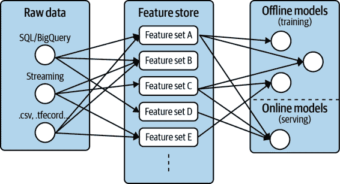

###### 图 6-12。特征存储提供了原始数据源和模型训练与服务之间的桥梁。

数据或机器学习工程师的典型工作流程是从数据源（结构化或流式数据）读取原始数据，使用他们喜欢的处理框架对数据进行各种转换，并将转换后的特征存储在特征存储中。与创建支持单个机器学习模型的特征管道不同，特征存储模式将特征工程与模型开发分离。特别是在构建特征存储时经常使用 Apache Beam、Flink 或 Spark 等工具，因为它们可以处理批处理和流处理数据。这也减少了训练和服务偏差的发生，因为特征数据由相同的特征创建管道填充。

创建特征后，它们将存储在数据存储中，以便用于训练和服务。对于服务中的特征检索，速度被优化。生产中的模型可能需要在毫秒内生成实时预测，因此低延迟至关重要。但是，对于训练来说，较高的延迟并不是问题。相反，重点是高吞吐量，因为历史特征将以大批量用于训练。特征存储通过使用不同的数据存储解决了这两种用例，用于在线和离线特征访问。例如，特征存储可以使用 Cassandra 或 Redis 作为在线特征检索的数据存储，并使用 Hive 或 BigQuery 获取历史大批量特征集。

最终，典型的特征存储将包含许多不同的特征集，其中包含从各种原始数据源创建的特征。元数据层用于记录特征集并提供注册表，以便团队之间轻松发现特征并进行跨团队协作。

### Feast

作为此模式在实际中的示例，请考虑[Feast](https://github.com/feast-dev)，这是由 Google Cloud 和[Gojek](https://oreil.ly/PszIn)开发的面向机器学习的开源特征存储。它围绕[Google Cloud 服务](https://oreil.ly/ecJou)使用 BigQuery 进行离线模型训练和 Redis 进行低延迟的在线服务（参见图 6-13 中的高级架构）。Apache Beam 用于特征创建，从而为批处理和流处理提供一致的数据管道。

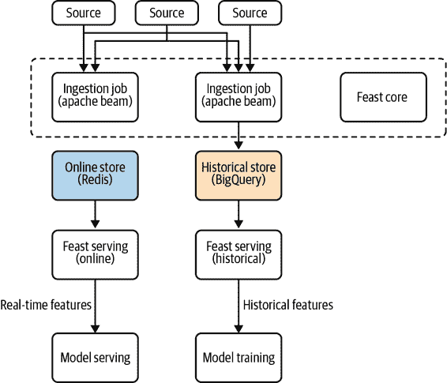

###### 图 6-13。Feast 特征存储的高级架构。Feast 围绕 Google BigQuery、Redis 和 Apache Beam 构建。

要了解这在实践中是如何工作的，我们将使用一个公共的 BigQuery 数据集，其中包含关于纽约市出租车乘车的信息。⁷ 表的每一行包含接送时间戳、接送点的纬度和经度、乘客数量以及出租车费用。ML 模型的目标将是使用这些特征预测出租车费用，表示为`fare_amount`。

该模型受益于从原始数据中工程化额外特征。例如，由于出租车乘车基于行程的距离和时长，预先计算接送点之间的距离是一个有用的特征。一旦在数据集上计算了这个特征，我们可以将其存储在特征集中以供将来使用。

#### 向 Feast 添加特征数据

数据使用`FeatureSet`在 Feast 中存储。`FeatureSet`包含数据架构和数据源信息，无论是来自 pandas 数据框还是流式 Kafka 主题。`FeatureSet`是 Feast 知道从哪里获取所需特征数据、如何摄取以及一些基本数据类型特征的方式。特征组可以一起摄取和存储，并且特征集在这些存储中提供高效的存储和逻辑命名空间。

一旦我们的特征集被注册，Feast 将启动一个 Apache Beam 作业，从源中填充特征存储。特征集用于生成离线和在线特征存储，确保开发人员用相同的数据训练和服务他们的模型。Feast 确保源数据符合特征集的预期模式。

将特征数据导入 Feast 有四个步骤，如图 6-14 所示。

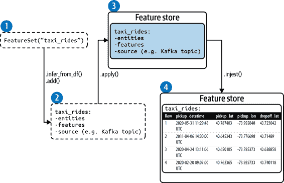

###### 图 6-14。将特征数据导入 Feast 有四个步骤：创建一个 FeatureSet，添加实体和特征，注册 FeatureSet，并将特征数据导入 FeatureSet。

这四个步骤如下：

1.  创建一个`FeatureSet`。特征集指定实体、特征和源。

1.  向`FeatureSet`添加实体和特征。

1.  注册`FeatureSet`。这在 Feast 中创建了一个命名特征集。特征集不包含特征数据。

1.  将特征数据加载到`FeatureSet`中。

本示例的完整代码可以在[附带本书的存储库](https://github.com/GoogleCloudPlatform/ml-design-patterns/blob/master/06_reproducibility/feature_store.ipynb)中找到。

#### 创建一个 FeatureSet

我们通过设置一个 Python SDK 客户端连接到 Feast 部署：

```
from feast import Client, FeatureSet, Entity, ValueType

# Connect to an existing Feast deployment
client = Client(core_url='localhost:6565')
```

要检查客户端是否连接，可以通过打印现有功能集合来实现，命令为 `client.list_feature_sets()`。如果这是一个新的部署，它将返回一个空列表。要创建一个新的功能集合，请调用 `FeatureSet` 类并指定功能集合的名称：

```
# Create a feature set
taxi_fs = FeatureSet("taxi_rides")
```

#### 向 FeatureSet 添加实体和特征

在 Feast 的上下文中，`FeatureSets` 包括实体和特征。实体用作查找特征值的键，并在创建用于训练或服务的数据集时用于在不同特征集之间进行特征连接。实体作为数据集中任何相关特征的标识符。它是一个可以建模和存储信息的对象。在打车或食品配送服务的上下文中，相关实体可能是 `customer_id`、`order_id`、`driver_id` 或 `restaurant_id`。在流失模型的上下文中，实体可以是 `customer_id` 或 `segment_id`。这里的实体是 `taxi_id`，每次行程的出租车供应商的唯一标识符。

在这个阶段，我们创建的功能集称为 `taxi_rides`，不包含任何实体或特征。我们可以使用 Feast 核心客户端从包含原始数据输入和实体的 pandas 数据帧中指定这些内容，如 表 6-2 所示。

表 6-2\. 纽约出租车行程数据集包含有关出租车行程的信息。实体是 taxi_id，每次行程的出租车供应商的唯一标识符

| 行 | 接载时间 | 接载纬度 | 接载经度 | 卸载纬度 | 卸载经度 | 乘客数量 | 出租车 ID | 费用金额 |
| --- | --- | --- | --- | --- | --- | --- | --- | --- |
| 1 | 2020-05-31 11:29:48 UTC | 40.787403 | -73.955848 | 40.723042 | -73.993106 | 2 | 0 | 15.3 |
| 2 | 2011-04-06 14:30:00 UTC | 40.645343 | -73.776698 | 40.71489 | -73.987242 | 2 | 0 | 45.0 |
| 3 | 2020-04-24 13:11:06 UTC | 40.650105 | -73.785373 | 40.638858 | -73.9678 | 2 | 2 | 32.1 |
| 4 | 2020-02-20 09:07:00 UTC | 40.762365 | -73.925733 | 40.740118 | -73.986487 | 2 | 1 | 21.3 |

这里的 `pickup_datetime` 时间戳很重要，因为需要检索批处理特征，并且用于确保批处理特征的正确时间连接。要创建额外的特征，如欧几里得距离，请将数据集加载到 pandas 数据框架中并计算该特征：

```
# Load dataframe
taxi_df = pd.read_csv("taxi-train.csv")

# Engineer features, Euclidean distance
taxi_df['euclid_dist'] = taxi_df.apply(compute_dist, axis=1)
```

我们可以使用 `.add(...)` 向特征集添加实体和特征。或者，方法 `.infer_fields_from_df(...)` 将直接从 pandas 数据帧为我们的 `FeatureSet` 创建实体和特征。我们只需指定表示实体的列名。然后，从数据帧中推断出 `FeatureSet` 的特征的模式和数据类型：

```
# Infer the features of the feature set from the pandas DataFrame
    taxi_fs.infer_fields_from_df(taxi_df, 
               entities=[Entity(name='taxi_id', dtype=ValueType.INT64)],
replace_existing_features=`True`)
```

#### 注册 FeatureSet

创建 FeatureSet 后，我们可以使用`client.apply(taxi_fs)`将其注册到 Feast。要确认功能集已正确注册或探索另一个功能集的内容，我们可以使用`.get_feature_set(...)`检索它：

```
print(client`.``get_feature_set`("taxi_rides"))
```

这将返回一个 JSON 对象，其中包含`taxi_rides`功能集的数据架构：

```
{
  "spec": {
    "name": "taxi_rides",
    "entities": [
      {
        "name": "key",
        "valueType": "INT64"
      }
    ],
    "features": [
      {
        "name": "dropoff_lon",
        "valueType": "DOUBLE"
      },
      {
        "name": "pickup_lon",
        "valueType": "DOUBLE"
      },
      ...
    ...
    ],
    }
}
```

#### 将功能数据摄入 FeatureSet

一旦我们对架构满意，我们可以使用`.ingest(...)`将数据框架功能数据摄入 Feast。我们将指定称为`taxi_fs`的`FeatureSet`和用于填充功能数据的名为`taxi_df`的数据框架。

```
# Load feature data into Feast for this specific feature set
client`.`ingest(taxi_fs, taxi_df)
```

此摄取步骤期间的进度打印到屏幕上，显示我们已经在 Feast 中将 28,247 行摄入到`taxi_rides`功能集中：

```
100%|██████████|28247/28247 [00:02<00:00, 2771.19rows/s]
Ingestion complete!

Ingestion statistics:
Success: 28247/28247 rows ingested
```

在此阶段，调用`client.list_feature_sets()`现在将列出我们刚刚创建的功能集`taxi_rides`并返回`[default/taxi_rides]`。这里，`default`指的是 Feast 内功能集的项目范围。在实例化功能集时可以更改此设置，以保留某些功能集在项目访问范围内。

###### 警告

数据集可能随时间变化，从而导致功能集也发生变化。在 Feast 中，一旦创建功能集，只能进行少数更改。例如，允许进行以下更改：

+   添加新功能。

+   移除现有功能。（请注意，功能被删除并保留记录，因此它们并未完全删除。这将影响新功能能否使用先前删除的功能名称。）

+   更改功能的架构。

+   更改功能集的来源或`max_age`的功能集示例。

不允许以下更改：

+   更改功能集名称。

+   更改实体。

+   更改现有功能的名称。

### 从 Feast 检索数据

一旦功能集已经通过功能进行了数据源化，我们可以检索历史或在线功能。用户和生产系统通过 Feast 服务数据访问层检索功能数据。由于 Feast 支持离线和在线存储类型，因此通常同时部署两者，如图 6-15 所示。同一功能数据包含在两个功能存储中，确保训练和服务之间的一致性。

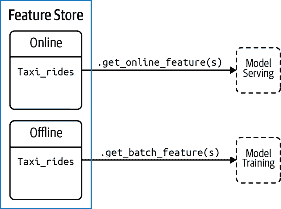

###### 图 6-15。功能数据可以从离线中检索，用于模型训练的历史功能，或在线用于服务。

这些部署可以通过单独的在线和批处理客户端访问：

```
_feast_online_client = Client(serving_url='localhost:6566')
_feast_batch_client = Client(serving_url='localhost:6567',
                             core_url='localhost:6565')
```

#### 批量服务

对于模型训练，历史特征检索由 BigQuery 支持，并使用批处理服务客户端`.get_batch_features(...)`访问。在这种情况下，我们提供一个包含实体和时间戳的 pandas 数据帧，特征数据将与之结合。这允许 Feast 基于请求的特征生成准确的时点数据集：

```
# Create a entity df of all entities and timestamps
`entity_df` = pd.DataFrame(
    {
        "datetime": taxi_df.datetime,
        "taxi_id": taxi_df.taxi_id,
    }
)
```

要检索历史特征，可以通过特征集名称和特征名称（以冒号分隔）引用特征集中的特征，例如，`taxi_rides:pickup_lat`：

```
    FS_NAME = taxi_rides
model_features = ['pickup_lat',
                     'pickup_lon',
                     'dropoff_lat',
                     'dropoff_lon',
                     'num_pass',
                     'euclid_dist']
    label = 'fare_amt'

    features = model_features + [label]

# Retrieve training dataset from Feast
dataset = _feast_batch_client`.`get_batch_features(
    feature_refs=[FS_NAME + ":" + feature for feature in features],
    entity_rows=entity_df).to_dataframe()
```

数据帧数据集现在包含我们模型的所有特征和标签，直接从特征存储中提取。

#### 在线服务

对于在线服务，Feast 仅存储最新的实体数值，而不是所有历史数值。Feast 的在线服务设计非常低延迟，并提供由[Redis](https://redis.io)支持的 gRPC API。例如，在使用训练模型进行在线预测时，我们使用`.get_online_features(...)`指定要捕获的特征和实体：

```
# retrieve online features for a single taxi_id
online_features = _feast_online_client.get_online_features(
    feature_refs=["taxi_rides:pickup_lat",
"taxi_rides:pickup_lon",
    "taxi_rides:dropoff_lat",       
"taxi_rides:dropoff_lon",
                     "taxi_rides:num_pass",
"taxi_rides:euclid_dist"],
    entity_rows=[
        GetOnlineFeaturesRequest.EntityRow(
            fields={
                "taxi_id": Value(
                    int64_val=5)
            }
        )
    ]
)
```

这将`online_features`保存为一个映射列表，列表中的每个项包含提供的实体（例如，`taxi_id = 5`）的最新特征值：

```
field_values {
  fields {
    key: "taxi_id"
    value {
      int64_val: 5
    }
  }
  fields {
    key: "taxi_rides:dropoff_lat"
    value {
      double_val: 40.78923797607422
    }
  }
  fields {
    key: "taxi_rides:dropoff_lon"
    value {
      double_val: -73.96871948242188
    }
  …
```

为了对这个示例进行在线预测，我们将从返回的对象中的字段值作为名为`predict_df`的 pandas 数据帧传递给`model.predict`：

```
predict_df = pd.DataFrame.from_dict(online_features_dict)
model.predict(predict_df)
```

## 为什么它有效

特征存储的工作原理在于将特征工程与特征使用解耦，允许在模型开发期间独立进行特征开发和创建。随着特征添加到特征存储中，它们立即可用于训练和服务，并存储在单个位置。这确保了模型训练和服务之间的一致性。

例如，作为面向客户的应用程序提供服务的模型可能只从客户端接收到 10 个输入值，但这些 10 个输入值可能需要通过特征工程转换成更多特征。这些工程特征保存在特征存储中。在开发期间检索特征的管道与服务模型时的管道必须相同是至关重要的。特征存储确保了特征的一致性（图 6-16）。

Feast 通过在后端使用 Beam 进行特征摄入管道来实现这一点，将特征值写入特征集，并使用 Redis 和 BigQuery 进行在线和离线（分别）特征检索（图 6-17）。⁸ 与任何特征存储一样，摄入管道还处理可能导致某些数据在一个存储中而不在另一个存储中的部分失败或竞争条件。

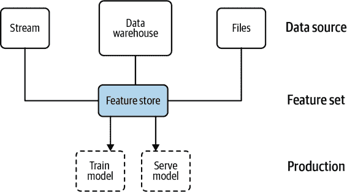

###### 图 6-16\. 特征存储确保特征工程流水线在模型训练和服务之间保持一致。另请参阅[*https://docs.feast.dev/*](https://docs.feast.dev/)。

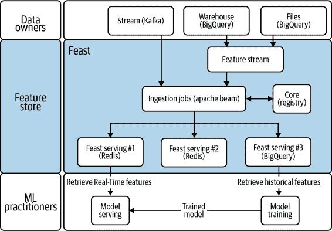

###### 图 6-17\. Feast 在后端使用 Beam 进行特征摄入，Redis 和 BigQuery 用于在线和离线特征检索。

不同系统可能以不同速率生成数据，特征存储库足够灵活，能够处理这些不同的节奏，无论是在摄入过程中还是在检索期间（图 6-18）。例如，传感器数据可以实时产生，每秒到达，或者可能有一个每月生成的文件，由外部系统报告上个月交易的摘要。每一个这些都需要被处理并摄入到特征存储库中。同样地，从特征存储库检索数据可能有不同的时间视野。例如，用户面向的在线应用可以使用最低延迟，使用最新的秒级特征，而在训练模型时，特征以更大的批量离线拉取，但延迟较高。

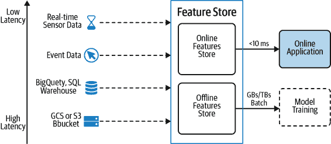

###### 图 6-18\. 特征存储设计模式可以处理数据在训练期间进行大批量高度扩展和为在线应用提供极低延迟的需求。

没有单个数据库可以既扩展到可能的数据量级（可能达到几 TB）*又*在毫秒级的极低延迟上处理。特征存储通过在线和离线特征存储的分开实现了这一点，并确保在两种情况下以一致的方式处理特征。

最后，特征存储库充当特征数据集的版本控制存储库，允许将代码和模型开发的相同 CI/CD 实践应用于特征工程过程。这意味着新的机器学习项目从目录中进行特征选择，而不是从头开始进行特征工程，使组织能够实现规模经济效应——随着新特征的创建和添加到特征存储库中，构建重复使用这些特征的新模型变得更加简单和快速。

## 折衷与替代方案

我们讨论的 Feast 框架是建立在 Google BigQuery、Redis 和 Apache Beam 之上的。然而，也有一些特征存储依赖于其他工具和技术堆栈。虽然特征存储是规模化管理特征的推荐方式，`tf.transform` 提供了一种解决训练-服务偏差问题的替代方案，但不能解决特征的可重用性问题。还有一些特征存储的替代用法尚未详细介绍，例如特征存储如何处理来自不同来源和以不同频率到达的数据。

### 替代实现

许多大型科技公司，如 Uber、LinkedIn、Airbnb、Netflix 和 Comcast，都拥有自己版本的特征存储，尽管架构和工具各不相同。Uber 的 Michelangelo Palette 是围绕 Spark/Scala 构建的，使用 Hive 进行离线特征创建和 Cassandra 进行在线特征。Hopsworks 提供了 Feast 的另一种开源特征存储替代方案，构建在使用 Spark 和 pandas 的数据框架上，使用 Hive 进行离线存储和 MySQL Cluster 进行在线特征访问。Airbnb 在其生产 ML 框架 Zipline 中构建了自己的特征存储。它使用 Spark 和 Flink 进行特征工程作业，使用 Hive 进行特征存储。

无论使用哪种技术堆栈，特征存储的主要组件都是相同的：

+   用于快速处理大规模特征工程作业的工具，例如 Spark、Flink 或 Beam。

+   用于存储创建的特征集的存储组件，例如 Hive、云存储（Amazon S3、Google Cloud Storage）、BigQuery、Redis、BigTable 和/或 Cassandra。Feast 使用的组合（BigQuery 和 Redis）针对离线与在线（低延迟）特征检索进行了优化。

+   元数据层用于记录特征版本信息、文档和特征注册表，以简化特征集的发现和共享。

+   用于从特征存储区摄取和检索特征的 API。

### 转换设计模式

如果在训练和推理期间特征工程代码不同，存在两个代码源不一致的风险。这导致训练-服务偏差，因为特征可能不同，模型预测可能不可靠。特征存储通过使其特征工程作业将特征数据写入在线和离线数据库来解决此问题。特征存储本身并不执行特征转换，但提供了一种将上游特征工程步骤与模型服务分离并提供时点正确性的方式。

在本章讨论的 Transform 设计模式还提供了一种保持特征转换分离和可复制的方法。例如，`tf.transform`可以用来使用完全相同的代码预处理数据，用于训练模型和在生产环境中提供预测，从而消除训练和服务之间的偏差。这确保了训练和服务特征工程流水线的一致性。

然而，特征存储提供了`tf.transform`不具备的特征重用优势。虽然`tf.transform`流水线确保可复制性，但这些特征仅为该模型创建并开发，并不容易与其他模型和流水线共享或重用。

另一方面，`tf.transform` 特别注意确保在服务过程中使用加速硬件进行特征创建，因为它是服务图的一部分。目前特征存储通常不提供这种能力。

# 设计模式 27：模型版本管理

在模型版本设计模式中，通过将更改的模型部署为具有不同 REST 端点的微服务来实现向后兼容性。这是本章讨论的许多其他模式的必要前提。

## 问题

正如我们在*数据漂移*（见第一章介绍）中所看到的，随着时间推移，模型可能变得陈旧，并且需要定期更新，以确保其反映组织的变化目标以及与其训练数据相关的环境。将模型更新部署到生产环境将不可避免地影响模型在新数据上的行为方式，这提出了一个挑战——我们需要一种方法来保持生产模型的更新，同时确保现有模型用户的向后兼容性。

对现有模型的更新可能包括更改模型架构以提高准确性，或者使用更近期数据重新训练模型以解决漂移问题。虽然这些更改可能不需要不同的模型输出格式，但它们会影响用户从模型获取的预测结果。例如，让我们想象一下，我们正在构建一个模型，根据书籍描述预测书籍的流派，并使用预测的流派向用户推荐。我们最初在一个旧经典书籍数据集上训练了我们的模型，但现在我们可以使用数千个更近期书籍的新数据来进行训练。在更新的数据集上训练可以提高我们整体模型的准确性，但在旧的“经典”书籍上略微降低了准确性。为了处理这个问题，我们需要一个解决方案，让用户可以选择我们模型的旧版本。

或者，我们模型的最终用户可能开始需要更多关于*模型如何*得出特定预测的信息。在医疗用例中，医生可能需要查看造成模型预测存在疾病的 X 光中的区域，而不仅仅依赖于预测的标签。在这种情况下，部署模型的响应需要更新以包含这些突出显示的区域。这个过程被称为*可解释性*，并且在第七章中进一步讨论。

当我们部署模型更新时，我们很可能也希望有一种方式来跟踪模型在生产环境中的表现，并与以前的迭代进行比较。我们可能还希望以一种方式测试新模型，只涉及我们用户的一个子集。性能监控和分割测试以及其他可能的模型更改，将通过每次更新单个生产模型来解决将会很困难。这样做会破坏那些依赖我们模型输出匹配特定格式的应用程序。为了处理这个问题，我们需要一种解决方案，允许我们在不破坏现有用户的情况下持续更新我们的模型。

## 解决方案

为了优雅地处理模型的更新，使用不同的 REST 端点部署多个模型版本。这确保了向后兼容性——通过在给定时间内部署多个版本的模型，依赖旧版本的用户仍然能够使用服务。版本控制还允许在版本间进行精细化的性能监控和分析跟踪。我们可以比较准确性和使用统计数据，并使用这些数据来确定何时将特定版本下线。如果我们有一个想要仅对少数用户进行测试的模型更新，模型版本设计模式使得进行 A/B 测试成为可能。

此外，通过模型版本控制，我们的每个部署版本都是一个微服务——因此将模型的更改与应用程序前端分离开来。要为新版本添加支持，我们团队的应用程序开发人员只需更改指向模型的 API 端点的名称。当然，如果新模型版本引入了模型响应格式的更改，我们将需要修改应用程序以适应这些更改，但模型和应用程序代码仍然是分开的。因此，数据科学家或机器学习工程师可以在我们自己的环境中部署和测试新的模型版本，而不必担心破坏我们的生产应用程序。

### 模型用户类型

当我们提到我们模型的“终端用户”时，这包括两类不同的人群。如果我们将模型 API 端点提供给组织外的应用程序开发人员使用，这些开发人员可以被视为一类模型用户。他们正在构建依赖我们模型为他人提供预测服务的应用程序。模型版本化所带来的向后兼容性好处对这些用户至关重要。如果我们模型响应的格式发生变化，应用程序开发人员可能希望使用旧的模型版本，直到他们更新其应用程序代码以支持最新的响应格式。

另一类终端用户指的是使用调用我们已部署模型的应用程序的人。这可以是依赖我们模型来预测图像中疾病存在的医生，使用我们的图书推荐应用程序的人，我们组织的业务单位分析我们构建的收入预测模型输出的人，等等。这类用户较少可能遇到向后兼容性问题，但可能希望在我们的应用程序中启用新功能时选择开始使用的时间。此外，如果我们能够将用户分为不同的组（即基于他们的应用使用情况），我们可以根据他们的偏好为每个组提供不同的模型版本。

### 使用托管服务进行模型版本控制

为了演示版本控制，我们将构建一个预测航班延误的模型，并将此模型部署到 [Cloud AI Platform Prediction](https://oreil.ly/-GAVQ)。因为我们在前几章中已经看过 TensorFlow 的 SavedModel，这里我们将使用 XGBoost 模型。

训练完模型后，我们可以将其导出以准备服务：

```
model.save_model('model.bst')
```

要将此模型部署到 AI 平台，我们需要创建一个指向 Cloud Storage 存储桶中的 `model.bst` 的模型版本。

在 AI 平台中，一个模型资源可以关联多个版本。要使用 gcloud CLI 创建新版本，我们将在终端中运行以下命令：

```
gcloud ai-platform versions create 'v1' \
  --model 'flight_delay_prediction' \
  --origin gs://your-gcs-bucket \
  --runtime-version=1.15 \
  --framework 'XGBOOST' \
  --python-version=3.7
```

部署了此模型后，它可以通过 HTTPS URL 中的端点 */models/flight_delay_predictions/versions/v1* 访问，这个端点绑定到我们的项目。由于这是我们目前唯一部署的版本，它被视为 *默认* 版本。这意味着如果我们在 API 请求中不指定版本，预测服务将使用 v1\. 现在我们可以向部署的模型发送符合模型期望格式的示例来进行预测，本例中是一个包含 110 个元素的虚拟编码机场代码数组（完整代码请参见 [GitHub 上的笔记本](https://github.com/GoogleCloudPlatform/ml-design-patterns/blob/master/06_reproducibility/model_versioning.ipynb)）。该模型返回 sigmoid 输出，一个介于 0 到 1 之间的浮点值，表示给定航班延误超过 30 分钟的可能性。

要向已部署的模型发出预测请求，我们将使用以下 gcloud 命令，其中 *input.json* 是一个包含要发送给预测的新行分隔示例的文件：

```
gcloud ai-platform predict --model 'flight_delay_prediction' 
--version 'v1' 
--json-request 'input.json'
```

如果我们发送五个示例进行预测，我们将会收到一个五元素数组，对应每个测试示例的 sigmoid 输出，如下所示：

```
[0.019, 0.998, 0.213, 0.002, 0.004]

```

现在我们的生产环境中已经有一个可用的模型，假设我们的数据科学团队决定将模型从 XGBoost 更改为 TensorFlow，因为这样可以提高准确性，并让他们能够使用 TensorFlow 生态系统中的附加工具。该模型具有相同的输入和输出格式，但其架构和导出的资产格式已更改。现在我们的模型不再是一个 *.bst* 文件，而是以 TensorFlow SavedModel 格式存储。理想情况下，我们可以将底层模型资产与应用程序前端分开管理，这样可以让应用程序开发人员专注于应用程序功能，而不是模型格式的变化，这种变化不会影响最终用户与模型的交互方式。这就是模型版本控制的用武之地。我们将把 TensorFlow 模型作为第二个版本部署在同一个 `flight_delay_prediction` 模型资源下。用户可以通过更改 API 端点中的版本名称，轻松升级到新版本以获取更好的性能。

要部署我们的第二个版本，我们将导出模型并复制到我们之前使用的存储桶中的新子目录中。我们可以使用与上述相同的部署命令，将版本名称替换为 v2，并指向新模型的 Cloud Storage 位置。如 图 6-19 所示，我们现在可以在云控制台中看到已部署的两个版本。

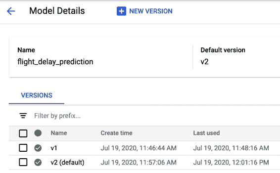

###### 图 6-19\. 云 AI 平台控制台中管理模型和版本的仪表板。

注意，我们还将 *v2* 设置为新的默认版本，因此如果用户未指定版本，他们将从 *v2* 收到响应。由于我们的模型的输入和输出格式相同，客户可以升级而无需担心破坏性更改。

###### 提示

Azure 和 AWS 都提供类似的模型版本服务。在 Azure 上，模型部署和版本控制可通过 [Azure 机器学习](https://oreil.ly/Q7NWh) 实现。在 AWS 上，这些服务则通过 [SageMaker](https://oreil.ly/r98Ve) 提供。

作为 ML 工程师，在将模型的新版本部署为 ML 模型端点时，可能希望使用 API 网关（例如 Apigee），该网关确定要调用哪个模型版本。进行此操作的原因有很多，包括通过分割测试测试新版本。对于分割测试，也许他们想要测试一个模型更新，观察它如何影响应用程序用户总体参与度的随机选择的 10%用户组。API 网关通过用户的 ID 或 IP 地址确定要调用的部署模型版本。

部署多个模型版本后，AI 平台允许在各个版本之间进行性能监控和分析。这使我们能够将错误追溯到特定版本，监控流量，并将其与我们应用程序中收集的其他数据结合起来。

## 折衷和替代方案

虽然我们推荐模型版本控制设计模式而不是维护单个模型版本，但在上述解决方案之外还有几种实施替代方案。在这里，我们将讨论其他无服务器和开源工具，以及创建多个服务功能的方法。我们还将讨论何时创建一个全新的模型资源而不是一个版本。

### 其他无服务器版本控制工具

我们使用了一个专门设计用于 ML 模型版本控制的托管服务，但我们也可以通过其他无服务器提供的服务达到类似的结果。在底层，每个模型版本都是一个具有指定输入和输出格式的无状态函数，部署在 REST 端点后面。因此，我们可以使用例如[Cloud Run](https://oreil.ly/KERBV)这样的服务，在单独的容器中构建和部署每个版本。每个容器都有唯一的 URL，并且可以通过 API 请求调用。这种方法使我们在配置部署模型环境时具有更大的灵活性，让我们能够添加诸如模型输入的服务器端预处理功能。在我们上面的航班示例中，我们可能不希望客户需要对分类值进行独热编码。相反，我们可以让客户将分类值作为字符串传递，并在我们的容器中处理预处理。

为什么我们要使用像 AI 平台预测这样的托管 ML 服务，而不是更通用的无服务器工具？由于 AI 平台专门用于 ML 模型部署，它内置了针对 ML 优化的 GPU 支持。它还处理依赖管理。当我们部署我们的 XGBoost 模型时，我们无需担心安装正确的 XGBoost 版本或其他库依赖。

### TensorFlow Serving

而不是使用 Cloud AI 平台或其他基于云的无服务器提供的服务来进行模型版本控制，我们可以使用像[TensorFlow Serving](https://oreil.ly/NzDA9)这样的开源工具。实施 TensorFlow Serving 的推荐方法是通过最新的[`tensorflow/serving`](https://oreil.ly/G0_Z7) Docker 镜像使用 Docker 容器。使用 Docker，我们可以使用任何我们想要的硬件来提供模型，包括 GPU。TensorFlow Serving API 内置了对模型版本控制的支持，遵循与解决方案部分讨论的类似方法。除了 TensorFlow Serving 之外，还有其他开源模型服务选项，包括[Seldon](https://oreil.ly/Cddpi)和[MLFlow](https://mlflow.org)。

### 多个服务功能

部署多个版本的另一种选择是为导出的模型的单个版本定义多个服务函数。“设计模式 16：无状态服务函数”（介绍见第五章）解释了如何将训练好的模型导出为一个在生产中提供服务的无状态函数。当模型输入需要预处理以将客户端发送的数据转换为模型期望的格式时，这尤为有用。

为了处理不同模型终端用户组的需求，我们可以在导出模型时定义多个服务函数。这些服务函数是*一个*导出模型版本的一部分，并且该模型被部署到单个 REST 端点。在 TensorFlow 中，服务函数使用模型*签名*实现，定义模型期望的输入和输出格式。我们可以使用`@tf.function`装饰器定义多个服务函数，并为每个函数传递一个输入签名。

在应用程序代码中，当我们调用部署的模型时，我们会根据从客户端发送的数据确定要使用哪个服务函数。例如，这样的请求：

```
{"signature_name": `"`get_genre`"`, "instances": … }
```

将会发送到名为`get_genre`的导出签名，而像以下这样的请求：

```
{"signature_name": `"`get_genre_with_explanation`"``,` "instances": … }
```

将会发送到名为`get_genre_with_explanation`的导出签名。

因此，部署多个签名可以解决向后兼容性问题。然而，有一个显著的区别——只有一个模型，当部署该模型时，所有签名同时更新。在我们从提供单一流派到提供多个流派的原始示例中，模型架构已更改。多签名方法在这个例子中不适用，因为我们有两个不同的模型。当我们希望保持模型的不同版本分开并随时间淘汰旧版本时，多签名解决方案也不合适。

如果您希望将来维护*两个*模型签名，使用多个签名比使用多个版本更好。在有些客户只想要最佳答案，而其他客户希望既有最佳答案又有解释的场景中，将所有签名与新模型一起更新具有额外的好处，而不是每次模型重新训练和重新部署时逐个更新版本。

有哪些情况下我们可能希望保留模型的两个版本？对于文本分类模型，我们可能有一些客户需要将原始文本发送给模型，而另一些客户能够在获取预测之前将原始文本转换为矩阵。根据客户的请求数据，模型框架可以确定使用哪种服务函数。将文本嵌入矩阵传递给模型比预处理原始文本要便宜，所以这是一个多个服务函数能够减少服务器端处理时间的例子。值得注意的是，我们可以拥有多个服务函数 *和* 多个模型版本，尽管这可能会增加太多复杂性的风险。

### 新模型与新模型版本

有时很难决定是创建另一个模型版本还是完全新的模型资源。当模型的预测任务发生变化时，我们建议创建一个新模型。新的预测任务通常会导致不同的模型输出格式，更改这一点可能会导致破坏现有客户端。如果我们不确定是否要使用新版本或模型，我们可以考虑是否希望现有客户端升级。如果答案是肯定的，那么我们很可能已经改进了模型而没有改变预测任务，并且创建一个新版本就足够了。如果我们以一种需要用户决定是否要进行更新的方式更改了模型，那么我们可能会希望创建一个新的模型资源。

为了看到这一实践，让我们返回到我们的航班预测模型，看一个例子。当前模型已经定义了它认为的延迟（晚 30 分钟以上），但是我们的最终用户可能对此有不同的看法。有些用户认为只要晚 15 分钟就算是延迟，而另一些用户认为只有晚一个小时以上才算延迟。让我们想象一下，我们现在希望我们的用户能够将他们自己对延迟的定义纳入考虑，而不是使用我们的定义。在这种情况下，我们将使用 “设计模式 5：重新定义 ”（在 第三章 中讨论）来将其更改为回归模型。该模型的输入格式保持不变，但现在的输出是代表延迟预测的数值。

当我们的模型用户解析此响应时，与第一个版本显然是不同的。借助我们最新的回归模型，应用开发者可以选择在用户搜索航班时显示预测延迟，而不是像第一个版本中那样替换“这个航班通常延迟超过 30 分钟”。在这种情况下，最好的解决方案是创建一个新的模型 *资源*，可能称为 `flight_model_regression`，以反映这些变化。这样，应用开发者可以选择使用哪一个，并且我们可以通过部署新版本继续对每个模型进行性能更新。

# 摘要

本章重点讨论了解决可重复性不同方面的设计模式。从*Transform*设计开始，我们看到了该模式如何用于确保数据准备在模型训练管道和模型服务管道之间的可重复性。通过明确捕获应用的转换，将模型输入转换为模型特征。*Repeatable Splitting*设计模式捕获了数据在训练、验证和测试数据集之间的分割方式，以确保训练中使用的示例永远不会用于评估或测试，即使数据集在增长。

*Bridged Schema*设计模式研究了在训练数据集是具有不同架构的新旧数据混合时如何确保可重复性。这允许以一致的方式组合两个具有不同架构的数据集进行训练。接下来，我们讨论了*Windowed Inference*设计模式，它确保在动态、时间相关方式计算特征时，这些特征在训练和服务之间能够正确重复。当机器学习模型需要从时间窗口聚合计算特征时，这个设计模式尤为有用。

*Workflow Pipeline*设计模式解决了通过容器化和编排我们机器学习工作流中的步骤来创建端到端可重复的管道的问题。接下来，我们看到了*Feature Store*设计模式如何用于跨不同机器学习任务的特征的可重复性和可重用性。最后，我们看了*Model Versioning*设计模式，通过将更改后的模型部署为具有不同 REST 端点的微服务来实现向后兼容性。

下一章中，我们将探讨设计模式，这些模式有助于负责任地执行人工智能。

¹ 注意，整体概率分布函数不需要是均匀的——我们只需要原始箱子足够窄，以便我们能够通过阶梯函数近似概率分布函数。当这种假设失败时，是因为旧数据中高度偏斜的分布未经充分采样。在这种情况下，可能会出现 3.46 比 3.54 更有可能的情况，这需要在桥接数据集中反映出来。

² 换句话说，我们正在计算平均值。

³ 关于数据验证的更多信息，请参阅“设计模式 30：公平性镜头”在第七章，“负责任的人工智能”中。

⁴ SSHS 代表[Saffir–Simpson 飓风等级](https://oreil.ly/62kf3)，是一个用于测量飓风强度和严重程度的 1 到 5 级的等级。请注意，ML 模型不预测飓风在稍后时间的严重程度，而是简单地学习 Saffir–Simpson 等级中使用的风速阈值。

⁵ 尽管部署是我们示例流水线中的最后一步，但生产流水线通常包括更多步骤，例如将模型存储在共享存储库中或执行单独的服务流水线，进行 CI/CD 和测试。

⁶ 请注意，为了在 AI 平台上运行 TFX 流水线，您目前需要将代码托管在 GCR 上，不能使用像 DockerHub 这样的其他容器注册服务。

⁷ 数据存储在 BigQuery 表中：*bigquery-public-data.new_york_taxi_trips.tlc_yellow_trips_2016*。

⁸ 参见 Gojek 博客，“[Feast: Bridging ML Models and Data](https://oreil.ly/YVta5)”。
