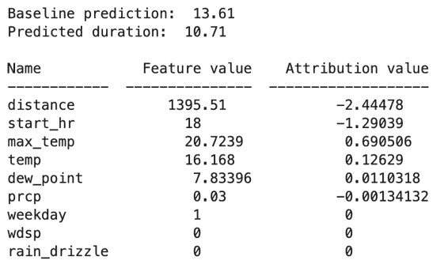
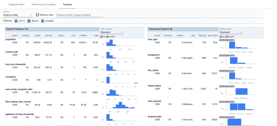

# 第七章：负责任的人工智能

到目前为止，我们专注于设计模式，以帮助数据和工程团队为生产使用准备、构建、训练和扩展模型。这些模式主要是为直接参与 ML 模型开发过程的团队设计的。一旦模型投入生产，它的影响将远远超出建造它的团队。在本章中，我们将讨论模型的其他*利益相关者*，包括组织内外的人员。利益相关者可能包括制定模型目标的业务执行人员，模型的最终用户，审计员和合规监管者。

本章中我们将提到几个模型利益相关者群体：

模型构建者

直接参与构建 ML 模型的数据科学家和 ML 研究人员。

ML 工程师

直接参与部署 ML 模型的 ML 运维团队成员。

业务决策者

决定是否将 ML 模型纳入其业务流程或面向客户的应用程序，并需要评估模型是否适合此目的。

ML 系统的最终用户

利用 ML 模型的预测。模型的最终用户有多种类型：客户、员工以及两者的混合体。例如，客户从模型中获得电影推荐，工厂车间的员工使用视觉检测模型来判断产品是否损坏，或者医务人员使用模型辅助患者诊断。

监管和合规机构

需要模型决策的高级摘要的人员和组织，从监管合规的角度来看。这可能包括财务审计员、政府机构或组织内的治理团队。

在本章中，我们将探讨模型对团队和组织外个人和团体的影响的模式。*启发式基准*设计模式提供了一种将模型的性能置于最终用户和决策者可以理解的背景中的方式。*可解释预测*模式通过促进对模型用于进行预测所使用的信号的理解，提供了提高对 ML 系统信任的方法。*公平性视角*设计模式旨在确保模型在不同用户子集和预测场景中表现公平。

综合起来，本章的模式属于[*负责任的 AI*](https://oreil.ly/MlJkM)实践。这是一个积极研究的领域，关注如何最佳地将公平性、可解释性、隐私性和安全性融入 AI 系统。负责任的 AI 推荐实践包括采用人本设计方法，在项目开发过程中与多样化用户和使用案例场景进行互动，理解数据集和模型的局限性，并在部署后继续监测和更新 ML 系统。负责任的 AI 模式不仅限于本章讨论的三种——早期章节的许多模式（如连续评估、可重复分割和中立类等）提供了实施这些推荐实践和实现将公平性、可解释性、隐私性和安全性融入 AI 系统目标的方法。

# 设计模式 28：启发式基准

启发式基准模式将 ML 模型与一个简单易懂的启发式进行比较，以便向业务决策者解释模型的性能。

## 问题

假设一家自行车租赁公司希望利用租赁预期持续时间来建立动态定价解决方案。在训练 ML 模型以预测自行车租赁期间的持续时间后，他们在测试数据集上评估模型，并确定训练 ML 模型的平均绝对误差（MAE）为 1,200 秒。当他们向业务决策者展示此模型时，他们可能会问：“一个 1,200 秒的 MAE 是好还是坏？”这是我们在开发模型并向业务利益相关者展示时需要准备好处理的问题。如果我们在产品目录中的物品上训练图像分类模型，并且平均精度（MAP）为 95％，我们可以预计会被问到：“95％的 MAP 是好还是坏？”

对于挥手并说这取决于问题是没有好处的。当然，它确实如此。那么，在纽约市的自行车租赁问题中什么是一个好的 MAE？在伦敦呢？对于产品目录图像分类任务，一个好的 MAP 是多少呢？

模型性能通常以难以让最终用户放入背景的冷冰冰的数字来表述。解释 MAP、MAE 等的公式并不能提供业务决策者所需的直觉。

## 解决方案

如果这是为某项任务开发的第二个 ML 模型，一个简单的答案是将模型的性能与当前运行版本进行比较。我们可以轻松地说 MAE 现在降低了 30 秒，或者 MAP 高出 1%。即使当前的生产工作流程不使用 ML，只要正在进行生产和收集评估指标，我们就可以比较我们的新 ML 模型与当前生产方法的性能。

但是，如果当前没有现有的生产方法，而我们正在为一个全新的任务构建第一个模型呢？在这种情况下，解决方案是为了与我们新开发的机器学习模型进行比较而创建一个简单的基准。我们称之为*启发式基准*。

一个好的启发式基准应该在直觉上易于理解并且相对容易计算。如果我们发现自己在为基准使用的算法进行辩护或调试，我们应该寻找一个更简单、更易理解的基准。启发式基准的好例子包括常数、经验法则或者大量统计数据（如均值、中位数或众数）。避免诱惑去训练一个简单的机器学习模型，比如线性回归，用其作为基准——尤其是一旦我们开始包含分类变量、超过少数输入或工程特征时，线性回归可能不够直观。

###### 警告

如果已经有一个操作实践，请不要使用启发式基准。相反，我们应该将我们的模型与现有的标准进行比较。现有的操作实践不需要使用机器学习——它只是当前用于解决问题的任何技术。

显示了良好的启发式基准示例以及我们可能在其中应用它们的情况的示例，详见表 7-1。这本书的 GitHub 仓库中包含了这些启发式基准实现的示例代码。

表 7-1\. 一些选定场景的启发式基准（参见[GitHub 中的代码](https://oreil.ly/WoESU)）

| 场景 | 启发式基准 | 示例任务 | 示例任务的实现 |
| --- | --- | --- | --- |
| 特定场景中特定任务的回归问题，业务对特征及其交互不够理解。 | 在训练数据上标签值的均值或中位数。如果有很多异常值，则选择中位数。 | Stack Overflow 上问题被回答前的时间间隔。 | 始终预测需要 2,120 秒。这是整个训练数据集中首次回答的中位数时间。 |
| 业务对特征及其交互不够理解的二元分类问题。 | 训练数据中正例的总体比例。 | Stack Overflow 上接受回答是否会被编辑。 | 总是预测输出概率为 0.36。0.36 是所有被接受答案中被编辑的比例。 |
| 多标签分类问题，业务方面对特征及特征之间的交互理解不深。 | 训练数据中标签值的分布。 | 从哪个国家回答 Stack Overflow 问题。 | 预测法国为 0.03，印度为 0.08，依此类推。这些是法国、印度等国家答案的比例。 |
| 有一个非常重要的数值特征的回归问题。 | 基于直觉上最重要的单一特征进行线性回归。 | 预测出租车费用，给定上车和下车位置。这两点之间的距离在直觉上是一个关键特征。 | 车费 = 每公里 $4.64。$4.64 是从所有行程的训练数据计算出来的。 |
| 有一个或两个重要特征的回归问题。这些特征可以是数值型或分类型，但应是常用的启发式方法。 | 查找表，其中行和列对应于关键特征（如有必要进行离散化），并且每个单元格的预测是在训练数据中估计的该单元格中的平均标签。 | 预测自行车租赁的持续时间。这里的两个关键特征是租车站点及是否为通勤高峰时间。 | 根据高峰和非高峰时段，基于每个站点的平均租赁时长的查找表。 |
| 有一个或两个重要特征的分类问题。这些特征可以是数值型或分类型。 | 与上述类似，每个单元格的预测是该单元格中标签的分布。如果目标是预测单一类别，则计算每个单元格中标签的众数。 | 预测 Stack Overflow 问题是否在一天内得到回答。这里最重要的特征是主要标签。 | 对于每个标签，计算在一天内获得答案的问题的比例。 |

| 回归问题，涉及预测时间序列未来值。 | 持续性或线性趋势。考虑季节性因素。对于年度数据，与去年同一天/周/季度进行比较。 | 预测每周销售量 | 预测下周销售额 = s[0]，其中 s[0] 是本周销售额。 (或者)

下周销售额 = s[0] + (s[0] - s[-1])，其中 s[-1] 是上周销售额。

(或者)

下周销售额 = s[-1y]，其中 s[-1y] 是去年同期的销售额。

避免诱惑，不要合并这三个选项，因为相对权重的价值不直观。

| 当前由人类专家解决的分类问题。这在图像、视频和文本任务中很常见，包括成本高昂，无法经常性地通过人类专家解决问题的情况。 | 人类专家的表现。 | 从视网膜扫描中检测眼病。 | 每张图像至少由三名医生检查。以多数医生的决定为正确，并查看机器学习模型在人类专家中的百分位排名。 |
| --- | --- | --- | --- |
| 预防性或预测性维护。 | 按固定时间表进行维护。 | 车辆的预防性维护。 | 每三个月进行一次车辆维护。三个月是车辆从上次服务日期到故障的中位时间。 |
| 异常检测。 | 从训练数据集估算的第 99 百分位值。 | 从网络流量中识别拒绝服务（DoS）攻击。 | 在历史数据中找到每分钟请求量的第 99 百分位数。如果在任何一分钟内，请求量超过此数值，则标记为 DoS 攻击。 |
| 推荐模型。 | 推荐客户最后一次购买类别中最受欢迎的商品。 | 向用户推荐电影。 | 如果用户刚刚看过（并喜欢）*盗梦空间*（一部科幻电影），则向他们推荐*伊卡洛斯*（他们尚未观看的最受欢迎的科幻电影）。 |

表 7-1 中的许多场景涉及“重要特征”。从业务角度看，这些特征被广泛接受为对预测问题有着深入理解的影响。特别是，这些不是通过对训练数据集使用特征重要性方法确定的特征。例如，在出租车行业中，普遍认为出租车费用的最重要决定因素是距离，长途旅行成本更高。这就是距离成为重要特征的原因，而不是特征重要性研究的结果。

## 折衷和替代方案

我们经常发现启发式基准在解释模型性能之外也很有用。在某些情况下，启发式基准可能需要特殊的数据收集。最后，有时启发式基准可能不足以满足比较本身的需求。

### 开发检查

往往启发式基准证明在解释机器学习模型性能方面非常有用。在开发过程中，它还可以帮助诊断特定模型方法的问题。

例如，假设我们正在建立一个模型来预测租赁的持续时间，我们的基准是一个查找表，根据站点名称和是否高峰通勤时间给出平均租赁持续时间：

```
CREATE TEMPORARY FUNCTION is_peak_hour(start_date TIMESTAMP) AS
    EXTRACT(DAYOFWEEK FROM start_date) BETWEEN 2 AND 6 -- weekday
    AND (
       EXTRACT(HOUR FROM start_date) BETWEEN 6 AND 10
       OR
       EXTRACT(HOUR FROM start_date) BETWEEN 15 AND 18)
;

SELECT 
   start_station_name,
   is_peak_hour(start_date) AS is_peak,
   AVG(duration) AS predicted_duration,
FROM `bigquery-public-data.london_bicycles.cycle_hire`
GROUP BY 1, 2
```

在开发我们的模型时，将模型性能与这一基准进行比较是一个好主意。为了做到这一点，我们将评估评估数据集的不同分层。在这里，评估数据集将按`start_station_name`和`is_peak`分层。通过这样做，我们可以轻松诊断我们的模型是否过度强调繁忙的热门站点，而忽视了训练数据中不频繁的站点。如果发生这种情况，我们可以尝试增加模型复杂性或平衡数据集，以加权不那么受欢迎的站点。

### 人类专家

我们建议在诊断眼部疾病等分类问题中，由人类专家执行工作时，基准应涉及这样一个专家组。通过让三名或更多医生检查每张图像，可以确定人类医生出错的程度，并将模型的错误率与人类专家的错误率进行比较。对于这种图像分类问题，这是标注阶段的自然延伸，因为眼部疾病的标签是通过人类标注创建的。

即使我们有实际的地面真相，有时候使用人类专家也是有优势的。例如，当建立一个模型来预测事故后汽车修理的成本时，我们可以查看历史数据并找到实际修理的成本。对于这个问题，我们通常不会使用人类专家，因为地面真相可以直接从历史数据集中获得。然而，为了传达基准，让保险代理人评估车辆损坏估算，并将我们模型的估算与代理人的估算进行比较，这也可能会有帮助。

使用人类专家不必仅限于无结构数据，如眼部疾病或损伤成本估算。例如，如果我们正在构建一个模型来预测贷款在一年内是否会进行再融资，数据将是表格形式的，而地面真相将在历史数据中可得。然而，即使在这种情况下，我们可能要求人类专家识别将会再融资的贷款，以便传达现场贷款代理人的正确率。

### 效用值

即使我们有一个运行中的模型或优秀的启发式规则来进行比较，我们仍然需要解释我们的模型提供的改进带来的影响。仅仅传达 MAE 降低了 30 秒或 MAP 提高了 1%可能还不足够。下一个问题很可能是：“1%的改进好吗？是否值得将 ML 模型投入生产而不是简单的启发式规则？”

如果可以的话，将模型性能改善翻译成模型的效用值是很重要的。这个值可以是货币性的，但也可以对应于其他效用衡量，如更好的搜索结果、早期疾病检测或由于改善制造效率而减少的浪费。这个效用值在决定是否部署此模型时非常有用，因为部署或更改生产模型总是伴随着可靠性和误差预算成本。例如，如果图像分类模型用于预填充订单表单，我们可以计算出 1%的改善将意味着每天减少 20 个放弃订单，因此这对应一定金额的价值。如果这超过了我们的站点可靠性工程团队设定的阈值，我们将部署该模型。

在我们的自行车租赁问题中，可能可以通过使用这个模型来衡量对业务的影响。例如，我们可以根据使用动态定价解决方案中的模型来计算自行车供应的增加或利润的增加。

# 设计模式 29：可解释预测

可解释预测设计模式（[model](https://oreil.ly/5W-2n)）通过向用户提供模型如何以及为何做出特定预测的理解，增强了用户对 ML 系统的信任。虽然决策树等模型天生具有可解释性，但深度神经网络的架构使其难以解释。对于所有模型，能够解释预测以理解影响模型行为的特征组合是非常有用的。

## 问题

在评估机器学习模型是否准备投入生产时，像准确率、精确度、召回率和均方误差等指标只能讲述故事的一部分。它们提供了关于模型预测与测试集中真实值相对正确程度的数据，但并没有提供模型为何得出这些预测的洞见。在许多 ML 场景中，用户可能不愿意单纯接受模型的预测结果。

要理解这一点，让我们来看一个[模型](https://oreil.ly/5W-2n)，该模型根据视网膜图像预测糖尿病视网膜病变（DR）的严重程度。¹ 模型返回一个 softmax 输出，表示个别图像属于表明图像中 DR 严重程度的 5 个类别中的一类的概率，从 1（无 DR）到 5（增生性 DR，最严重的形式）。假设对于给定的图像，模型返回 95%的置信度，表示图像包含增生性 DR。这可能看起来是一个高置信度的准确结果，但如果医务专业人员仅仅依赖于这个模型输出来进行患者诊断，他们仍然不了解模型是如何得出这一预测的。也许模型确定了图像中表明 DR 的正确区域，但也有可能模型的预测基于图像中显示没有疾病迹象的像素。例如，数据集中的一些图像可能包含医生的笔记或注释。模型可能错误地使用存在注释来进行预测，而不是图像中的疾病区域。² 在模型当前的形式下，无法将预测归因于图像中的区域，这使医生难以信任模型。

医学影像只是一个例子——在许多行业、场景和模型类型中，对模型决策过程缺乏洞察力可能会导致用户信任问题。如果一个机器学习模型用于预测个人的信用评分或其他财务健康指标，人们很可能想知道他们为什么得到了特定的分数。是因为延迟支付吗？信用额度太多？信用历史太短？也许模型仅依赖于人口统计数据来进行预测，并在不知情的情况下引入偏见。只有分数，并没有办法知道模型是如何得出预测的。

除了模型最终用户外，另一组利益相关者是与机器学习模型的监管和合规标准相关的人员，因为某些行业的模型可能需要审核或额外透明度。参与审计模型的利益相关者可能需要模型如何得出其预测的高级摘要，以证明其使用和影响的合理性。在这种情况下，像准确度这样的度量标准是没有用的——没有洞察到模型为何做出其预测，其使用可能会变得问题重重。

最后，作为数据科学家和机器学习工程师，我们只能在没有了解模型依赖于哪些特征来进行预测的情况下，将模型质量提高到一定程度。我们需要一种方法来验证模型是否按我们预期的方式运行。例如，假设我们正在对表格数据进行训练，以预测航班是否会延误。该模型基于 20 个特征进行训练。在幕后，也许它仅依赖于这 20 个特征中的 2 个，如果我们去掉其余的特征，我们可以显著提高系统的性能。或者也许这 20 个特征每一个都是必需的，以达到我们需要的精度水平。没有更多关于模型使用了哪些特征的细节，很难知道。

## 解决方案

要处理机器学习中固有的未知，我们需要一种方法来了解模型在幕后的工作方式。理解和解释机器学习模型如何以及为何做出预测的技术是一个活跃研究领域。也称为可解释性或模型理解，解释性是机器学习中一个新兴且快速发展的领域，可以根据模型的架构和所训练的数据类型采用各种形式。解释性还可以帮助揭示机器学习模型中的偏见，在本章中讨论公平性镜头模式时，我们将重点讨论使用特征归因解释深度神经网络。为了在此背景下理解这一点，首先我们将看看对于具有较简单体系结构的模型的可解释性。

简单模型如决策树比深度模型更容易解释，因为它们通常是*设计可解释的*。这意味着它们学习到的权重直接揭示了模型进行预测的方式。如果我们有一个具有独立数值输入特征的线性回归模型，权重有时可能是可以解释的。例如，考虑一个预测汽车燃油效率的线性回归模型。³ 在[scikit-learn](https://oreil.ly/V9GT5)，我们可以通过以下方式获取线性回归模型的学习系数：

```
model = LinearRegression().fit(x_train, y_train)
coefficients = model.coef_
```

我们模型的每个特征的学习系数如图 7-1 所示。


###### 图 7-1\. 我们线性回归燃油效率模型的学习系数，预测汽车每加仑英里数。我们使用 pandas 的 get_dummies()函数将原产地特征转换为布尔列，因为它是分类的。

系数向我们展示了每个特征与模型输出（预测每加仑英里数）之间的关系。例如，通过这些系数，我们可以得出结论，每增加一汽缸，我们模型预测的每加仑英里数将会下降。我们的模型还学习到，随着新车型的引入（以“车型年份”特征表示），它们通常具有更高的燃油效率。通过这些系数，我们可以从中学到比深度神经网络隐藏层学习的权重更多关于模型特征与输出之间关系的知识。这就是为什么像上面展示的模型经常被称为*设计可解释的*模型。

###### 警告

虽然很容易给线性回归或决策树模型学到的权重分配重要意义，但我们在这样做时必须非常谨慎。我们之前得出的结论仍然正确（例如汽缸数量与燃油效率的反向关系），但我们不能仅仅从系数的大小推断出，例如，分类原产地特征或汽缸数量对我们的模型比马力或重量更重要。首先，每个特征使用不同的单位表示。一个汽缸不等同于一磅——数据集中的汽车最多有 8 个汽缸，但重量超过 3000 磅。此外，原产地是一个用虚拟值表示的分类特征，因此每个原产地值只能是 0 或 1。系数也不告诉我们模型特征之间的关系。更多汽缸通常与更多马力相关，但我们不能仅凭学到的权重推断出这一点。⁴

当模型更复杂时，我们使用*事后*可解释性方法来近似模型特征与其输出之间的关系。通常，事后方法执行此分析，而不依赖于学习的权重等模型内部信息。这是一个正在研究的领域，提出了各种解释方法以及用于将这些方法添加到您的机器学习工作流程中的工具。我们将讨论的解释方法类型被称为*特征归因*。这些方法旨在将模型的输出（无论是图像、分类还是数值）归因于其特征，通过为每个特征分配归因值来指示该特征对输出的贡献。特征归因有两种类型：

实例级别

特征归因解释模型对个体预测结果的输出。例如，在预测某人是否应该获得信用额度时，实例级别的特征归因将揭示为什么特定人的申请被拒绝的原因。在图像模型中，实例级别的归因可能会突出显示导致模型预测图像包含猫的像素。

全局

全局特征归因分析模型在整体上的行为以得出关于模型整体行为的结论。通常，这是通过从测试数据集平均实例级别特征归因来完成的。在预测航班是否延误的模型中，全局归因可能会告诉我们，总体上，极端天气是预测延误时最重要的特征。

我们将探讨的两种特征归因方法⁵在 表 7-2 中概述，并提供可用于实例级别和全局解释的不同方法。

表 7-2\. 不同解释方法的描述及其研究论文链接

| 名称 | 描述 | 论文 |
| --- | --- | --- |
| 采样 Shapley | 基于 Shapley 值的概念^(a)，该方法通过计算添加和删除特征如何影响预测（分析多种特征值组合）来确定特征的边际贡献。 | [*https://oreil.ly/ubEjW*](https://oreil.ly/ubEjW) |
| 综合梯度（IG） | 使用预定义的模型基线，IG 计算沿着从此基线到特定输入的路径的导数（梯度）。 | [*https://oreil.ly/sy8f8*](https://oreil.ly/sy8f8) |
| ^(a) Shapley 值是由 Lloyd Shapley 在 1951 年的一篇论文中引入的，基于博弈论的概念。 |

虽然我们可以从头开始实施这些方法，但有些工具旨在简化获取特征归因过程。现有的开源和基于云的可解释性工具使我们能够专注于调试、改进和总结我们的模型。

### 模型基线

要使用这些工具，我们首先需要理解作为解释模型特征归因时所适用的*基线*概念。任何可解释性方法的目标是回答：“为什么模型预测了 X？” 特征归因试图通过为每个特征提供数值来实现这一点，这些数值指示该特征对最终输出的贡献程度。例如，考虑一个模型预测患者是否患有心脏病，给定一些人口统计和健康数据。对于我们测试数据集中的一个示例，假设一个患者的胆固醇特征的归因值为 0.4，血压的归因为 −0.2。没有上下文的情况下，这些归因值意义不大，我们的第一个问题可能是：“0.4 和 −0.2 相对于什么？” 这个“什么”就是模型的*基线*。

每当我们获得特征归因值时，它们都是相对于我们模型预测的预定义基线值的。基线预测可以是*信息性的*或*非信息性的*。非信息性基线通常与训练数据集中某些平均情况进行比较。在图像模型中，非信息性基线可以是纯黑或纯白的图像。在文本模型中，非信息性基线可以是模型嵌入矩阵的 0 值或诸如“the”、“is”或“and”之类的停用词。在具有数值输入的模型中，选择基线的常见方法是使用模型中每个特征的中位数值生成预测。

图 7-2 显示了一个模型的实例级特征归因，该模型预测骑行的持续时间。此模型的非信息性基线是一个骑行持续时间为 13.6 分钟，我们通过使用数据集中每个特征的中位数值生成预测得到这个值。当模型的预测值*低于*基线预测值时，我们应该期望大多数归因值为负，反之亦然。在这个例子中，我们得到了预测的持续时间为 10.71，低于模型的基线，这解释了为什么许多归因值为负。我们可以通过取特征归因的绝对值来确定最重要的特征。在这个例子中，行程的距离是最重要的特征，使得我们模型的预测比基线减少了 2.4 分钟。另外，作为一种合理性检查，我们应确保特征归因值大致等于当前预测与基线预测之间的差值。



###### 图 7-2\. 在预测自行车行程持续时间的模型中，单个示例的特征归因值。该模型的基线，使用每个特征值的中位数计算得到，为 13.6 分钟，归因值显示了每个特征对预测的影响。

信息性基线相比之下，则是将模型的预测与特定的备选场景进行比较。在识别欺诈交易的模型中，信息性基线可能回答这样一个问题：“为什么将这笔交易标记为欺诈而不是非欺诈？”我们不会使用整个训练数据集中的特征值中位数来计算基线，而是只取非欺诈值的中位数。在图像模型中，训练图像可能包含大量的纯黑色和白色像素，如果将其作为基线则会导致不准确的预测。在这种情况下，我们需要提出一个不同的*信息性*基线图像。

### SHAP

开源库[SHAP](https://github.com/slundberg/shap)提供了一个 Python API，用于在许多类型的模型上获取特征归因，并且基于 Shapley 值的概念在表 7-2 中进行了介绍。为了确定特征归因值，SHAP 计算添加或删除每个特征对模型预测输出的贡献。它通过许多不同的特征值组合和模型输出来执行此分析。

SHAP 不依赖框架，并且适用于在图像、文本或表格数据上训练的模型。为了看到 SHAP 在实践中的应用，我们将使用之前提到的燃油效率数据集。这次，我们将使用 Keras 的`Sequential` API 构建一个深度模型：

```
model = tf.keras.Sequential([
  tf.keras.layers.Dense(16, input_shape=(len(x_train.iloc[0])),
  tf.keras.layers.Dense(16, activation='relu'),
  tf.keras.layers.Dense(1)                
])
```

要使用 SHAP，我们首先会通过将模型和训练集中一部分示例传递给`DeepExplainer`对象来创建它。然后，我们将获取测试集中前 10 个示例的归因值：

```
import shap
explainer = shap.DeepExplainer(model, x_train[:100])
attribution_values = explainer.shap_values(x_test.values[:10])
```

SHAP 具有一些内置的可视化方法，使理解生成的归因值更加容易。我们将使用 SHAP 的`force_plot()`方法来绘制测试集中第一个示例的归因值，代码如下：

```
shap.force_plot(
  explainer.expected_value[0],
  shap_values[0][0,:], 
  x_test.iloc[0,:]
)
```

在上述代码中，`explainer.expected_value` 是我们模型的基准。SHAP 将基准计算为我们在创建解释器时通过的数据集的模型输出均值（在本例中为 `x_train[:100]`），尽管我们也可以向 `force_plot` 传递自定义的基准值。此示例的真实值为每加仑 14 英里，而我们的模型预测为 13.16。因此，我们的解释将解释模型对 13.16 的预测值的特征归因值。在这种情况下，这些归因值相对于模型的 24.16 MPG 基线。因此，这些归因值应大致相加到 11，即模型基线和此示例预测之间的差异。通过查看具有最高绝对值的特征，我们可以确定最重要的特征。图 7-3 展示了该示例的归因值结果图。


###### 图 7-3\. 我们燃油效率预测模型的一个示例的特征归因值。在本例中，汽车的重量是 MPG 的最重要指标，其特征归因值约为 6。如果我们的模型预测超过 24.16 的基准，我们将看到主要是负的归因值。

对于这个例子，燃油效率最重要的指标是重量，从基准下降了约 6 MPG。其次是马力、排量，然后是汽车的年份型号。我们可以通过以下方式获取测试集前 10 个样本的特征归因值的摘要（或全局解释）：

```
shap.summary_plot(
  shap_values, 
  feature_names=data.columns.tolist(), 
  class_names=['MPG']
)
```

这导致了图 7-4 的摘要图的显示（#an_example_of_global-level_feature_attr）。

实际应用中，我们会有更大的数据集，并希望在更多样本上计算全局级别的归因。我们可以利用这些分析来向组织内外的其他利益相关者总结模型的行为。


###### 图 7-4\. 燃油效率模型的全局特征归因示例，基于测试数据集的前 10 个样本计算。

### 部署模型的解释

SHAP 提供了一个直观的 Python API，用于在脚本或笔记本环境中获取归因。这在模型开发期间非常有效，但在某些情况下，您可能希望在部署模型时获取解释，以补充模型的预测输出。在这种情况下，云端可解释性工具是最佳选择。在这里，我们将演示如何使用 Google Cloud 的[Explainable AI](https://oreil.ly/lDocn)获取部署模型的特征归因。在撰写本文时，Explainable AI 与使用 AutoML 构建的自定义 TensorFlow 模型和表格数据模型兼容。

我们将部署一个图像模型到 AI 平台以展示解释，但我们也可以使用基于表格或文本数据训练的 TensorFlow 模型进行可解释的 AI。首先，我们将部署一个[TensorFlow Hub](https://oreil.ly/Ws8jx)模型，该模型是在 ImageNet 数据集上训练的。这样我们就可以专注于获取解释的任务，不会对模型进行任何迁移学习，并且将使用 ImageNet 原始的 1,000 个标签类别：

```
model = tf.keras.Sequential([
    hub.KerasLayer(".../mobilenet_v2/classification/2", 
               input_shape=(224,224,3)),
    tf.keras.layers.Softmax()
])
```

要将模型部署到具有解释功能的 AI 平台，我们首先需要创建一个元数据文件，该文件将被解释服务用于计算特征归因。此元数据以 JSON 文件提供，并包含我们想要使用的基线信息以及我们想要解释的模型部分。为了简化此过程，可解释的 AI 提供了一个 SDK，通过以下代码生成元数据：

```
from explainable_ai_sdk.metadata.tf.v2 import SavedModelMetadataBuilder

model_dir = 'path/to/savedmodel/dir'

model_builder = SavedModelMetadataBuilder(model_dir)
model_builder.set_image_metadata('input_tensor_name')
model_builder.save_metadata(model_dir)
```

此代码未指定模型基线，这意味着它将使用默认值（对于图像模型，这是黑白图像）。我们可以选择添加`input_baselines`参数到`set_image_metadata`以指定自定义基线。上面的`save_metadata`方法在模型目录中创建一个*explanation_metadata.json*文件（完整代码在[GitHub 存储库](https://github.com/GoogleCloudPlatform/ml-design-patterns/blob/master/07_stakeholder_management/explainability.ipynb)中）。

当通过 AI 平台笔记本使用此 SDK 时，我们还有选项在笔记本实例内本地生成解释，而无需将我们的模型部署到云端。我们可以通过`load_model_from_local_path`方法实现这一点。

使用我们导出的模型和存储桶中的*explanation_metadata.json*文件，我们已准备好创建一个新的模型版本。在执行此操作时，我们需要指定我们想要使用的解释方法。

要将我们的模型部署到 AI 平台，我们可以将模型目录复制到 Cloud Storage 存储桶，并使用 gcloud CLI 创建一个模型版本。AI 平台有三种可能的解释方法可供选择：

集成梯度（IG）

此方法是在[IG paper](https://oreil.ly/FJhMd)中介绍的，并且适用于任何可微分的 TensorFlow 模型——图像、文本或表格。对于部署在 AI 平台上的图像模型，IG 会返回一个高亮像素的图像，指示出导致模型预测的区域。

Sampled Shapley

基于[Sampled Shapley paper](https://oreil.ly/EAS8T)，这使用了类似于开源 SHAP 库的方法。在 AI 平台上，我们可以在表格和文本 TensorFlow 模型中使用此方法。因为 IG 仅适用于可微分模型，AutoML Tables 使用 Sampled Shapley 为所有模型计算特征归因。

XRAI

[这种方法](https://oreil.ly/niGVQ)建立在 IG 之上，并应用平滑处理返回基于区域的归因。XRAI 仅适用于部署在 AI 平台上的图像模型。

在我们的 gcloud 命令中，我们指定要使用的解释方法以及在计算归因值时希望方法使用的整数步骤或路径的数量。⁶ `steps parameter` 指的是为每个输出采样的特征组合数量。通常情况下，增加这个数字会提高解释的准确性：

```
!gcloud beta ai-platform versions create $VERSION_NAME \
--model $MODEL_NAME \
--origin $GCS_VERSION_LOCATION \
--runtime-version 2.1 \
--framework TENSORFLOW \
--python-version 3.7 \
--machine-type n1-standard-4 \
--explanation-method xrai \
--num-integral-steps 25
```

一旦模型部署完成，我们可以使用可解释 AI SDK 获取解释：

```
model = explainable_ai_sdk.load_model_from_ai_platform(
  GCP_PROJECT, 
  MODEL_NAME, 
  VERSION_NAME
)
request = model.explain([test_img])

# Print image with pixel attributions
request[0].visualize_attributions()
```

在图 7-5 中，我们可以看到从可解释 AI 返回的 IG 和 XRAI 解释的比较，突出显示了对我们模型预测“哈士奇”贡献最大的像素区域。

通常情况下，对于像医疗、工厂或实验室环境中拍摄的“非自然”图像，建议使用 IG。XRAI 通常适用于自然环境中拍摄的图像，比如这只哈士奇的图像。要了解为什么 IG 更适用于非自然图像，请参见图 7-6 中糖尿病视网膜病变图像的 IG 归因。在这种医疗情况下，有助于在像素级别查看归因。而在狗的图像中，知道导致模型预测“哈士奇”的确切像素不那么重要，XRAI 为我们提供了重要区域的更高级别摘要。


###### 图 7-5\. 部署到 AI 平台的 ImageNet 模型返回的特征归因，由可解释 AI 提供。左侧是原始图像。中间显示了 IG 的归因，右侧显示了 XRAI 的归因。下方的键显示了 XRAI 中区域的含义——浅色区域最重要，深色区域代表最不重要的区域。


###### 图 7-6。作为一项[研究](https://oreil.ly/Xp_vp)，2019 年 Rory Sayres 及其同事的研究中，不同组的眼科医生被要求在三种情况下评估一幅图像上的 DR 程度：单独的图像，没有模型预测的图像，以及带有预测和像素归因（如图所示）的图像。我们可以看到像素归因如何帮助增强模型预测的信心。

###### 提示

可解释人工智能（Explainable AI）也适用于[AutoML Tables](https://oreil.ly/CSQly)，这是一个用于训练和部署表格数据模型的工具。AutoML Tables 处理数据预处理并选择最适合我们数据的模型，这意味着我们无需编写任何模型代码。通过 Explainable AI 进行的特征归因在 AutoML Tables 中的模型默认启用，并提供全局和实例级别的解释。

## 权衡和替代方案

虽然解释提供了对模型如何做出决策的重要见解，但它们只能和模型的训练数据、模型的质量以及所选的基准一样好。在本节中，我们将讨论解释的一些限制，以及特征归因的一些替代方案。

### 数据选择偏差

人们经常说机器学习是“垃圾进，垃圾出”。换句话说，模型只能和用于训练它的数据一样好。如果我们训练一个图像模型来识别 10 种不同的猫种类，那么它所知道的就只有这 10 种猫的种类。如果我们给模型展示一只狗的图像，它只能试图将这只狗分类为它训练过的 10 个猫类别中的一个。它甚至可能会以很高的信心这样做。也就是说，模型直接反映了它的训练数据。

如果我们在训练模型之前没有捕捉到数据不平衡，那么像特征归因这样的解释方法可以帮助揭示数据选择偏差的问题。举个例子，假设我们正在构建一个模型来预测图像中存在的船只类型。假设我们正确地将测试集中的一幅图像标记为“kayak”，但是通过特征归因，我们发现模型依赖于船只的桨来预测“kayak”，而不是船只的形状。这表明我们的数据集可能没有足够多角度、带桨和不带桨的 kayak 图像，我们可能需要回去添加更多这样的图像。

### 反事实分析和基于示例的解释

除了在解决方案部分描述的特征归因之外，还有许多其他解释机器学习模型输出的方法。本节不旨在提供所有可解释性技术的详尽列表，因为这个领域发展迅速。在这里，我们简要介绍另外两种方法：反事实分析和基于示例的解释。

反事实分析是一种实例级的可解释性技术，指的是在我们的数据集中找到具有类似特征但模型预测结果不同的示例。其中一种方法是通过[What-If Tool](https://oreil.ly/Vf3D-)，这是一个用于评估和可视化机器学习模型输出的开源工具。在“公平性镜头设计模式”中，我们将提供对 What-If Tool 更深入的概述——在这里，我们专注于其反事实分析功能。在 What-If Tool 中可视化我们测试集中的数据点时，我们可以选择显示与所选数据点最接近的反事实数据点。这样做可以让我们比较这两个数据点的特征值和模型预测，帮助我们更好地理解模型最依赖的特征。在图 7-7，我们看到了一个来自抵押申请数据集的两个数据点的反事实比较。在粗体字中，我们看到了这两个数据点不同的特征，底部则展示了每个数据点的模型输出。

基于示例的解释会比较新示例及其相应的预测与训练数据集中类似示例。这种类型的解释对于理解训练数据集如何影响模型行为尤为有用。基于示例的解释在图像或文本数据上效果最佳，并且比特征归因或反事实分析更直观，因为它们直接将模型的预测映射到用于训练的数据上。


###### 图 7-7. What-If Tool 中针对美国抵押申请数据集中两个数据点的反事实分析。突出显示了这两个数据点的不同之处。有关此数据集的更多信息可以在本章中公平性镜头模式的讨论中找到。

为了更好地理解这种方法，让我们来看看游戏[Quick, Draw](https://oreil.ly/-QsHl)!⁷。这款游戏要求玩家实时绘制物品，并使用一个基于成千上万次他人绘图的深度神经网络猜测他们正在绘制的内容。玩家完成绘画后，可以通过查看训练数据集中的示例来了解神经网络是如何进行预测的。在图 7-8 中，我们可以看到关于一幅薯条绘画的基于示例的解释，模型成功地识别了它。


###### 图 7-8\. 来自游戏 Quick, Draw 的基于示例的解释，展示了模型如何通过训练数据集中的示例正确预测了“薯条”的给定绘画。

### 解释的局限性

解释性代表了对理解和解释模型的显著改进，但我们在对模型的解释过于信任或假设它们提供对模型完美洞察力时应保持谨慎。任何形式的解释都直接反映了我们的训练数据、模型和选择的基准线。换句话说，如果我们的训练数据集不准确地反映了模型所反映的群体，或者我们选择的基准线不适合我们要解决的问题，就不能指望我们的解释具有高质量。

此外，解释可以识别模型特征与输出之间的关系，这仅代表我们的数据和模型，而不一定代表此上下文之外的环境。例如，假设我们训练一个模型来识别欺诈信用卡交易，并且它作为全局特征归因发现交易金额是欺诈的最明显特征。但是，不能因此得出结论金额*总是*信用卡欺诈的最大指标——这仅适用于我们训练数据集、模型和指定的基准值的上下文中。

我们可以将解释视为评估 ML 模型准确性、错误和其他指标的重要补充。它们提供了对模型质量和潜在偏见的有用见解，但不应成为高质量模型的唯一决定因素。我们建议将解释作为模型评估标准的一个组成部分，除了数据和模型评估之外，还可以考虑本章和前几章中提到的许多其他模式。

# 设计模式 30：公平性视角

公平镜头设计模式建议使用预处理和后处理技术，以确保模型预测在不同用户群体和场景中是公平和公正的。机器学习中的公平性是一个不断发展的研究领域，没有单一的万能解决方案或定义可以使模型“公平”。通过公平的镜头评估整个端到端的机器学习工作流程——从数据收集到模型部署——对于构建成功的高质量模型至关重要。

## 问题

带有“机器”一词的名字，很容易就会认为机器学习模型不会存在偏见。毕竟，模型是计算机学习到的模式的结果，对吧？这种想法的问题在于，模型学习的数据集是由*人类*创建的，而不是机器，而人类充满了偏见。这种固有的人类偏见是不可避免的，但并不一定总是坏事。举个例子，考虑用于训练金融欺诈检测模型的数据集——由于大多数情况下欺诈案例相对较少，因此这些数据很可能会严重不平衡。这是自然存在的偏见的一个例子，因为它反映了原始数据集的统计特性。当偏见影响到不同群体时，偏见就会变得*有害*。这被称为*问题性偏见*，这是我们在本节中将重点关注的内容。如果不考虑这种类型的偏见，它可能会进入模型中，在生产模型中直接反映出数据中存在的偏见，从而产生负面影响。

即使在你可能没有预料到的情况下，问题性偏见也存在。例如，想象一下我们正在构建一个模型来识别不同类型的服装和配饰。我们被要求收集所有的鞋类图片作为训练数据集。当我们想到鞋子时，我们注意到首先想到的是什么。是网球鞋？便鞋？人字拖？高跟鞋呢？假设我们生活在全年气候温暖的地方，我们认识的大多数人都一直穿凉鞋。当我们想到鞋子时，凉鞋是首先浮现在脑海中的东西。因此，我们收集了各种款式的凉鞋图片，有不同类型的带子、鞋底厚度、颜色等。我们将这些贡献给更大的服装数据集，当我们在朋友的鞋子测试图像集上测试模型时，它在“鞋子”标签上达到了 95%的准确率。模型看起来很有前途，但当我们的来自不同地区的同事在他们的高跟鞋和运动鞋图像上测试模型时，问题就出现了。“鞋子”标签根本不返回。

这个鞋子的例子展示了训练数据分布中的偏见，尽管它可能看起来过于简化，但这种类型的偏见在生产环境中经常发生。数据分布偏差发生在我们收集的数据不能准确反映将使用我们模型的整个人群时。如果我们的数据集以人为中心，这种类型的偏见特别明显，如果我们的数据集未能包含对年龄、种族、性别、宗教、性取向和其他身份特征的平等代表。⁸

即使我们的数据集在这些身份特征方面看起来是平衡的，它仍然受到这些群体在数据中表示方式的偏见影响。假设我们正在训练一个情感分析模型，用于将餐厅评论分类为 1（极其负面）到 5（极其正面）。我们已经小心翼翼地在数据中获得了不同类型餐厅的平衡代表。然而，事实证明，大多数海鲜餐厅的评论是正面的，而大多数素食餐厅的评论是负面的。这种数据表现偏见将直接由我们的模型表现出来。每当针对素食餐厅添加新评论时，它们被分类为负面的可能性就会大大增加，这可能会影响某人未来访问这些餐厅的意愿。这也被称为*报告偏见*，因为数据集（这里是“报告”的数据）不能准确反映现实世界。

处理数据偏见问题时的一个常见谬误是，从数据集中删除偏见区域将解决问题。假设我们正在建立一个模型来预测某人违约贷款的可能性。如果我们发现模型对不同种族的人不公平，我们可能会认为通过简单地从数据集中删除种族作为特征来修复问题。问题在于，由于系统性偏见，诸如种族和性别之类的特征通常会隐含地反映在其他特征如邮政编码或收入中。这被称为*隐性*或*代理偏见*。删除明显具有潜在偏见的特征，如种族和性别，通常比保留它们更糟，因为这使得更难以识别和纠正模型中的偏见实例。

在收集和准备数据时，引入偏见的另一个领域是数据标记的方式。团队通常会外包大型数据集的标记，但重要的是要小心理解标记人员如何向数据集引入偏见，特别是如果标记是主观的。这被称为*实验者偏见*。想象一下我们正在构建情感分析模型，我们将标签外包给一组 20 个人——他们的工作是根据 1（负面）到 5（正面）的评分标准标记每一段文本。这种分析极具主观性，并可能受文化、成长背景及许多其他因素的影响。在使用这些数据训练我们的模型之前，我们应确保这组 20 个标签人员反映了多样化的人群。

除了数据之外，偏见也可能通过我们选择的目标函数在模型训练过程中引入。例如，如果我们优化模型的整体准确率，这可能不能准确反映模型在所有数据片段上的性能。在数据集天生不平衡的情况下，仅使用准确率作为我们的唯一指标可能会忽略模型在少数类别数据上表现不佳或做出不公平决策的情况。

本书贯穿始终，我们已经看到机器学习有能力提高生产力，增加业务价值，并自动化以前手工操作的任务。作为数据科学家和机器学习工程师，我们有责任确保我们构建的模型不会对使用它们的人群产生不利影响。

## 解决方案

要处理机器学习中的问题偏见，我们需要解决方案，即在训练模型之前识别数据中有害偏见的领域，并通过公平性视角评估我们训练的模型。公平性镜头设计模式提供了构建数据集和模型以平等对待所有用户群体的方法。我们将使用[What-If Tool](https://oreil.ly/Sk36z)，一个开源工具，用于从多个 Python 笔记本环境中运行数据集和模型评估，演示这两种分析技术。

###### 提示

在继续本节中列出的工具之前，值得分析数据集和预测任务，以确定是否存在潜在的问题偏见。这需要更仔细地观察*谁*会受到模型影响，以及*如何*这些群体会受到影响。如果存在问题偏见的可能性较大，本节中概述的技术方法提供了缓解这种类型偏见的良好起点。另一方面，如果数据集中的偏斜包含自然产生的偏见，并不会对不同群体产生不利影响，“设计模式 10：重新平衡” 在第三章 提供了处理天生不平衡数据的解决方案。

在本节中，我们将引用一个[公共数据集](https://oreil.ly/azFUV)，该数据集包含美国抵押贷款申请。美国的贷款机构需要报告关于个人申请的信息，如贷款类型、申请人收入、处理贷款的机构及申请的状态。我们将在这个数据集上训练一个贷款申请批准模型，以展示公平性的不同方面。据我们了解，该数据集并未被任何贷款机构直接用于训练机器学习模型，因此我们提出的公平性问题仅为假设。

我们已经创建了该数据集的一个子集，并进行了一些预处理，将其转化为二元分类问题——申请是否批准。在图 7-9 中，我们可以看到数据集的预览。


###### 图 7-9\. 来自本节引用的美国抵押贷款申请数据集的几列预览。

### 在训练之前

因为机器学习模型直接反映了用于训练它们的数据，通过进行彻底的数据分析并利用分析结果来调整我们的数据，可以在建立或训练模型之前减少大量偏差。在这个阶段，重点是识别数据收集或数据表现中的偏差，详见问题部分。表 7-3 展示了根据数据类型考虑的一些问题。

表 7-3\. 不同类型数据偏差的描述

|  | 定义 | 分析考虑因素 |
| --- | --- | --- |
| 数据分布偏差 | 数据不包含所有将在生产中使用模型的可能群体的平衡代表 |

+   数据是否包含跨所有相关人口片段（性别、年龄、种族、宗教等）的平衡示例集？

+   每个数据标签是否包含该标签所有可能变体的平衡分割？（例如，在问题部分中的鞋子示例。）

|

| 数据表现偏差 | 数据平衡但未平等代表不同数据片段 |
| --- | --- |

+   对于分类模型，*标签*是否在相关特征上平衡？例如，在用于信用评估预测的数据集中，数据是否包含了跨性别、种族和其他身份特征的人群的均衡代表？

+   不同人口群体在数据中的表现是否存在偏见？这对于预测情绪或评分值的模型特别相关。

+   数据标签者是否引入了主观偏见？

|

一旦我们检查了数据并纠正了偏见，我们在将数据分成训练、测试和验证集时应考虑相同的考虑因素。也就是说，一旦我们的整个数据集平衡了，我们的训练、测试和验证分割也必须保持相同的平衡。回到我们的鞋子图像示例，假设我们改进了数据集以包含 10 种类型的鞋的各种图像。训练集应包含与测试和验证集中每种鞋的类似百分比。这将确保我们的模型反映并在真实场景中进行评估。

要查看这个数据集分析在实践中的表现，我们将使用上面介绍的抵押贷款数据集的 What-If 工具。这将使我们能够在各种分片上可视化我们数据的当前平衡状态。What-If 工具既可以在有模型的情况下使用，也可以在没有模型的情况下使用。由于我们还没有建立模型，我们可以通过仅传递我们的数据来初始化 What-If 工具小部件：

```
config_builder = WitConfigBuilder(test_examples, column_names)
WitWidget(config_builder)
```

在图 7-10 中，我们可以看到工具在加载时的样子，当传递了我们数据集中的 1,000 个示例时。第一个选项卡称为“数据点编辑器”，它提供了我们数据的概述，并允许我们检查单个示例。在这个可视化中，我们的数据点根据标签着色——无论抵押贷款申请是否获批。还突出显示了一个单个示例，并且我们可以看到与其关联的特征值。


###### 图 7-10. What-If 工具的“数据点编辑器”，我们可以看到数据如何按标签类别分割，并检查数据集中单个示例的特征。

在数据点编辑器中，有许多自定义可视化选项，通过这样做可以帮助我们理解数据集如何在不同分片中分布。如果我们从分箱 | Y 轴 下拉菜单中选择`agency_code`列，并保持相同的标签颜色编码，工具现在显示了关于每个申请贷款机构承保情况的图表。这在图 7-11 中展示。假设这 1,000 个数据点能很好地代表我们数据集的其余部分，在图 7-11 中揭示了一些潜在偏见的实例：

数据表示偏见

HUD 申请*未*获批准的百分比高于数据集中其他代理机构。模型很可能会学习到这一点，导致它更频繁地预测通过 HUD 发起的申请“未获批准”。

数据收集偏见

对于来自 FRS、OCC、FDIC 或 NCUA 的贷款数据，我们可能没有足够的数据来准确地将`agency_code`作为模型的特征使用。我们应确保数据集中每个机构的申请百分比反映现实世界的趋势。例如，如果类似数量的贷款通过 FRS 和 HUD，我们应该在数据集中为这些机构的每个例子提供相同数量的示例。


###### 图 7-11\. 一个美国抵押贷款数据集的子集，按照数据集中的 agency_code 列分组。

我们可以在数据的其他列上重复此分析，并使用我们的结论添加示例并改进数据。在 What-If Tool 中创建自定义可视化的许多其他选项，请查看 GitHub 上的[完整代码](https://github.com/GoogleCloudPlatform/ml-design-patterns/blob/master/07_responsible_ai/fairness.ipynb)获取更多想法。

另一种使用 What-If Tool 理解我们的数据的方法是通过显示在图 7-12 中的“特征”选项卡。这显示了我们的数据在数据集的每列中是如何平衡的。从中，我们可以看出我们需要在哪些地方添加或移除数据，或更改我们的预测任务。⁹ 例如，也许我们想要限制我们的模型仅在再融资或购房贷款上进行预测，因为在`loan_purpose`列中可能没有足够的其他可能值的数据。



###### 图 7-12\. What-If Tool 中的“特征”选项卡，显示了数据集在每列中如何平衡的直方图。

一旦我们优化了数据集和预测任务，我们可以考虑在模型训练期间想要优化的其他内容。例如，也许我们最关心模型在被预测为“批准”的应用中的准确性。在模型训练期间，我们希望在这个二分类模型中优化“批准”类别的 AUC（或其他指标）。

###### Tip

如果我们已经尽了最大努力消除数据收集偏差，并发现某个特定类别的数据不足，我们可以参考“设计模式 10：再平衡”，位于第三章。这个模式讨论了处理不平衡数据的建模技术。

### 训练后

即使进行了严格的数据分析，偏见可能会潜入训练模型中。这可能是由于模型的架构、优化指标或在训练之前未能识别的数据偏差所致。为了解决这个问题，重要的是从公平的角度评估我们的模型，并深入研究除整体模型准确度之外的度量标准。这篇文章后训练分析的目标是理解模型准确性与模型预测对不同群体影响之间的权衡。

What-If 工具是进行模型后分析的一个选择。为了演示如何在训练模型上使用它，我们将在我们的抵押贷款数据集示例基础上构建。基于先前的分析，我们精炼了数据集，仅包括用于再融资或购房的贷款，¹⁰ 并训练了一个 XGBoost 模型来预测申请是否会被批准。由于我们使用了 XGBoost，我们使用 pandas 的 `get_dummies()` 方法将所有分类特征转换为布尔列。

我们将在上述的 What-If 工具初始化代码中进行一些添加，这次传入一个调用我们训练模型的函数，同时配置指定我们的标签列和每个标签的名称：

```
def custom_fn(examples):
  df = pd.DataFrame(examples, columns=columns)
  preds = bst.predict_proba(df)
  return preds

config_builder = (WitConfigBuilder(test_examples, columns)
  .set_custom_predict_fn(custom_fn)
  .set_target_feature('mortgage_status')
  .set_label_vocab(['denied', 'approved']))
WitWidget(config_builder, height=800)
```

现在我们已经将我们的模型传递给了工具，生成的可视化如 图 7-13 所示，根据 y 轴上我们模型的预测置信度绘制了我们的测试数据点。


###### 图 7-13\. What-If 工具用于二元分类模型的数据点编辑器。y 轴是每个数据点的模型预测输出，范围从 0（拒绝）到 1（通过）。

What-If 工具的性能和公平性选项卡让我们能够评估我们模型在不同数据切片上的公平性。通过选择一个我们模型特征来“切片”，我们可以比较这个特征不同值的模型结果。在 图 7-14 中，我们通过 `agency_code_HUD` 特征进行了切片，这是一个布尔值，指示申请是否由 HUD 监督（非 HUD 贷款为 0，HUD 贷款为 1）。


###### 图 7-14\. What-If 工具的性能和公平性选项卡，展示我们的 XGBoost 模型在不同特征值上的表现。

从这些性能和公平性图表中，我们可以看到：

+   我们模型对由 HUD 监督的贷款的准确率显著更高——94% 相比于 85%。

+   根据混淆矩阵，非 HUD 贷款的批准率更高——72%比 55%。这很可能是由于前一节中识别出的数据表现偏差所致（我们特意保留了数据集以展示模型如何放大数据偏差）。

有几种方法可以根据所展示的见解进行操作，如“优化策略”框中在图 7-14 中所示。这些优化方法涉及更改我们模型的*分类阈值*——模型输出积极分类的阈值。在这个模型的背景下，我们对什么置信阈值表示“批准”申请感到满意？如果我们的模型超过 60%的置信度认为申请应该被批准，我们应该批准吗？或者我们只在我们的模型超过 98%的置信度时批准申请？这个决定在很大程度上取决于模型的背景和预测任务。如果我们预测一张图像是否包含猫，即使我们的模型只有 60%的置信度，我们可能也可以返回标签“猫”。然而，如果我们有一个预测一张医学图像是否包含疾病的模型，我们可能希望我们的阈值要高得多。

What-If 工具帮助我们根据各种优化选择阈值。例如，优化“人口统计学平等”将确保我们的模型批准 HUD 和非 HUD 贷款的申请百分比相同¹¹。或者，使用“机会平等”公平性指标将确保 HUD 和非 HUD 切片中在测试数据集中具有“批准”地面真实值的数据点被模型预测为“批准”的机会相等¹²。

请注意，更改模型的预测阈值仅是对公平性评估指标进行操作的一种方式。还有许多其他方法，包括重新平衡训练数据、重新训练模型以优化不同的指标等。

###### 提示

What-If 工具是与模型无关的，可以用于任何类型的模型，无论其架构或框架如何。它可以与加载在笔记本中或在[TensorBoard](https://oreil.ly/xWV4_)中的模型一起工作，也可以与通过 TensorFlow Serving 提供的模型以及部署到 Cloud AI Platform Prediction 的模型一起工作。What-If 工具团队还为基于文本的模型创建了一个工具，称为[语言可解释性工具（LIT）](https://oreil.ly/CZ60B)。

后训练评估的另一个重要考虑因素是在平衡的示例集上测试我们的模型。如果我们预期数据的特定切片对我们的模型可能存在问题——比如可能受数据收集或表现偏差影响的输入——我们应确保我们的测试集包含足够多这些案例。在拆分我们的数据之后，我们将在本节“训练前”部分使用与我们数据的*每个*拆分相同类型的分析：训练、验证和测试。

正如本分析所示，不存在适用于所有情况的模型公平性解决方案或评估指标。这是一个持续的迭代过程，应在整个 ML 工作流程中使用 —— 从数据收集到部署模型。

## 权衡与替代方案

除了解决方案部分讨论的预训练和后训练技术外，还有许多方法可以处理模型公平性。在这里，我们将介绍一些实现公平模型的替代工具和流程。ML 公平性是一个快速发展的研究领域 —— 本节包含的工具并非旨在提供详尽列表，而是当前可用于提升模型公平性的几种技术和工具。我们还将讨论公平性镜头和可解释预测设计模式之间的区别，因为它们相关且经常一起使用。

### 公平性指标

[公平性指标](https://github.com/tensorflow/fairness-indicators)（FI）是一套开源工具，旨在帮助理解数据集在训练前的分布，并使用公平性指标评估模型性能。FI 中包含的工具有 TensorFlow 数据验证（TFDV）和 TensorFlow 模型分析（TFMA）。公平性指标通常作为 TFX 流水线的组件（详见“设计模式 25：工作流程管道”在第六章中获取更多细节），或通过 TensorBoard 使用。在 TFX 中，有两个预构建组件利用公平性指标工具：

+   ExampleValidator 用于数据分析，检测漂移以及使用 TFDV 进行训练-服务偏差。

+   评估器使用 TFMA 库评估数据集的模型子集。从 TFMA 生成的交互式可视化示例在 图 7-15 中展示。它查看数据中的一个特征（身高），并分析该特征的每个可能分类值的模型假阴性率。


###### 图 7-15\. 比较模型在不同数据子集上的假阴性率。

从 [公平性指标 Python 包](https://oreil.ly/pYM1j) 看，TFMA 还可以作为一个独立工具，与 TensorFlow 和非 TensorFlow 模型一起使用。

### 自动化数据评估

我们在解决方案部分讨论的公平评估方法主要侧重于手动交互式数据和模型分析。这种类型的分析在模型开发的初期阶段尤为重要。随着我们将模型投入运行并专注于其维护和改进，找到自动化公平评估的方法将提高效率，并确保公平性贯穿整个 ML 过程。我们可以通过讨论的“设计模式 18：持续模型评估”在第五章，或使用“设计模式 25：工作流管道”在第六章中进行这样的操作，使用像 TFX 提供的数据分析和模型评估组件。

### 允许和禁止列表

当我们无法直接修复数据或模型中固有偏见时，可以在生产模型之上硬编码规则，使用允许和禁止列表。这主要适用于分类或生成模型，当我们不希望模型返回某些标签或词语时。例如，如 Google Cloud Vision API 的标签检测功能中已经移除了类别化的词语“man”和“woman” [详见](https://oreil.ly/WY2vp)。因为仅凭外观无法确定性别，如果仅基于视觉特征返回这些标签，会强化不公平的偏见。因此，Vision API 返回“person”。同样，在 Gmail 的智能撰写功能中，避免使用性别化代词 [详见](https://oreil.ly/dtMhK)，例如在完成句子“我下周将见投资人，你要见 ___ 吗？”时。

在 ML 工作流的两个阶段之一中可以应用这些允许和禁止列表：

数据收集

当从头开始训练模型或使用迁移学习设计模式添加我们自己的分类层时，我们可以在数据收集阶段定义模型的标签集，这是在模型训练之前。

训练后

如果我们依赖预训练模型进行预测，并且使用与该模型相同的标签，可以在生产中实施允许和禁止列表——在模型返回预测结果后，但在这些标签呈现给最终用户之前。这也适用于文本生成模型，其中我们无法完全控制所有可能的模型输出。

### 数据增强

除了之前讨论的数据分布和表示解决方案之外，减少模型偏差的另一种方法是进行数据*增强*。使用这种方法，在训练之前会修改数据，以消除潜在的偏见源。数据增强的一种具体类型被称为剔除，特别适用于文本模型。例如，在文本情感分析模型中，我们可以从文本中删除身份术语，以确保它们不会影响我们模型的预测。继续我们在本节早些时候使用的冰淇淋示例，句子“Mint chip is their best ice cream flavor”在应用剔除后会变成“BLANK is their best ice cream flavor”。然后，我们会将数据集中的所有其他单词替换为相同的词（我们这里使用了 BLANK，但是数据集中未出现的任何单词也可以）。请注意，虽然这种剔除技术对许多文本模型效果很好，但是在从表格数据集中移除偏见区域时需要小心，如问题部分所述。

另一种数据增强方法涉及生成新数据，谷歌翻译在将文本从性别中性到性别特定语言和从性别特定到性别中性语言时使用了这种方法以[减少性别偏见](https://oreil.ly/3Rkdr)。解决方案包括重新编写翻译数据，以便在适用时，提供翻译的女性和男性形式。例如，性别中性的英文句子“We are doctors”在翻译成西班牙语时会产生两个结果，如在图 7-16 中所示。在西班牙语中，“we”可以有女性和男性形式。


###### Figure 7-16\. 当将一个语言中的性别中性词（这里是英语中的“we”）翻译成一个性别特定的语言时，Google Translate 现在提供多种翻译选项以减少性别偏见。

### 模型卡

最初在一篇[研究论文](https://oreil.ly/OAIcs)中引入，模型卡提供了报告模型能力和限制的框架。模型卡的目标是通过提供模型适用和不适用的场景细节来提高模型的透明性，因为减轻问题性偏差只有在模型按照预期的方式使用时才会起作用。通过模型卡，鼓励在正确的上下文中使用模型的责任感。

第一个[模型卡片](https://oreil.ly/OwiJY)发布提供了 Google Cloud Vision API 中面部检测和物体检测功能的摘要和公平度量。为了为我们自己的 ML 模型生成模型卡片，TensorFlow 提供了一个[模型卡片工具包](https://github.com/tensorflow/model-card-toolkit)（MCT），可以作为独立的 Python 库运行，也可以作为 TFX 管道的一部分运行。该工具包读取导出的模型资产，并生成一系列具有各种性能和公平度量的图表。

### 公平性与可解释性

在 ML 中，公平性和可解释性的概念有时会引起混淆，因为它们经常一起使用，并且都是责任 AI 大计划的一部分。公平性特别适用于识别和消除模型中的偏见，而解释性则是诊断偏见存在的一种方法。例如，将解释性应用于情感分析模型可能会揭示，该模型依赖于身份术语进行预测，而应该使用像“最差”，“惊人”或“不是”等词语。

解释性也可以在公平性背景之外使用，以揭示模型为什么会标记特定的欺诈交易，或者导致模型在医学图像中预测“患病”的像素。因此，解释性是改进模型透明度的一种方法。有时透明性可以揭示模型在处理某些群体时存在不公平的情况，但也可以提供更高层次的洞察模型的决策过程。

# 总结

虽然彼得·帕克在说“伴随着强大的力量而来的是巨大的责任”时可能并不是在谈论机器学习，但这句话在这里确实适用。ML 有能力颠覆行业、提高生产力，并从数据中获得新的见解。有了这种潜力，我们尤其需要了解我们的模型将如何影响不同利益相关者群体。模型的利益相关者可能包括不同的模型用户人群、监管组织、数据科学团队，或者组织内的业务团队。

本章介绍的负责任人工智能模式是每个机器学习工作流程的重要组成部分——它们可以帮助我们更好地理解模型生成的预测，并在模型投入生产之前捕捉潜在的不良行为。从*启发式基准*模式开始，我们研究了如何识别模型评估的初始度量标准。这种度量标准对于理解后续模型版本和总结业务决策者的模型行为非常有用。在*可解释预测*模式中，我们展示了如何使用特征归因来查看哪些特征在信号化模型预测中最重要。特征归因是一种解释方法，可以用于评估单个示例或一组测试输入的预测。最后，在*公平性透镜*设计模式中，我们介绍了确保模型预测以公平、公正和无偏见方式对待所有用户群体的工具和度量标准。

¹ DR 是一种影响全球数百万人的眼部疾病。它可能导致失明，但如果早期发现，可以成功治疗。要了解更多信息并找到数据集，请参见[这里](https://oreil.ly/ix21h)。

² 解释被用来识别和纠正放射图像中存在的注释，详见[这项研究](https://oreil.ly/qowNO)。

³ 此处讨论的模型是在[公共 UCI 数据集](https://oreil.ly/cNixp)上训练的。

⁴ [scikit-learn 文档](https://oreil.ly/DAmIm)详细介绍了如何正确解释线性模型中学到的权重。

⁵ 我们专注于这两种解释方法，因为它们被广泛使用并涵盖多种模型类型，但本分析未包括的其他方法和框架包括[LIME](https://oreil.ly/0c4uB)和[ELI5](https://github.com/TeamHG-Memex/eli5)。

⁶ 关于这些解释方法及其实现的更多细节，请参见[可解释人工智能](https://oreil.ly/PYn8P)白皮书。

⁷ 关于 Quick, Draw!和基于示例的解释的更多细节，请参见这篇[paper](https://oreil.ly/Yvexy)。

⁸ 关于种族和性别偏见如何影响图像分类模型的更详细信息，请参见 Joy Buolamwini 和 Timmit Gebru 的[“性别阴影：商业性别分类中的交叉准确性差异”](https://oreil.ly/1zw3e)，*机器学习研究会议论文集* 81 (2018): 1-15。

⁹ 要了解更多关于改变预测任务的信息，请参见“设计模式 5: 重新构架”和“设计模式 9: 中性类”，位于第三章中。

¹⁰ 在这个数据集上，还可以进行许多更多的预训练优化。我们在这里只选择了一个作为演示可能性的示例。

¹¹ [本文](https://oreil.ly/wFx_W)提供了更多关于 What-If 工具用于公平优化策略的详细信息。

¹² 更多关于机会平等作为公平度量标准的详细信息，请查看[此处](https://oreil.ly/larIS)。
