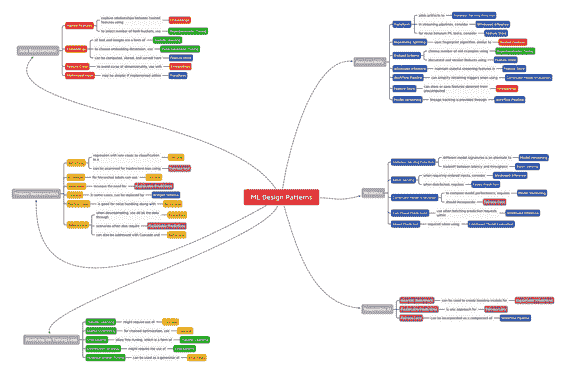
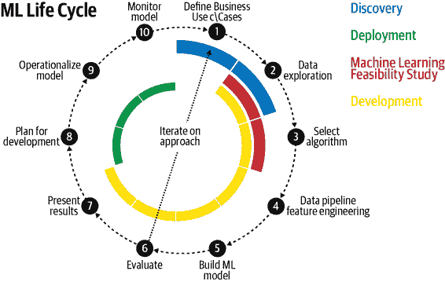
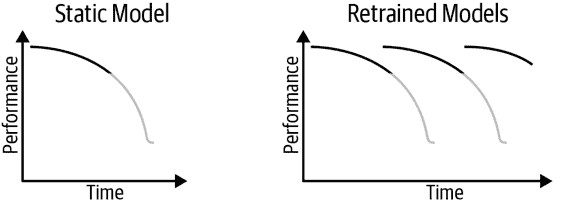
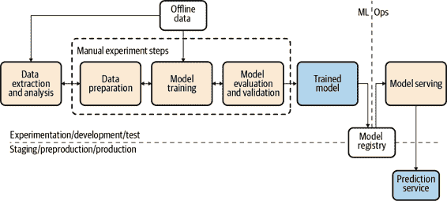
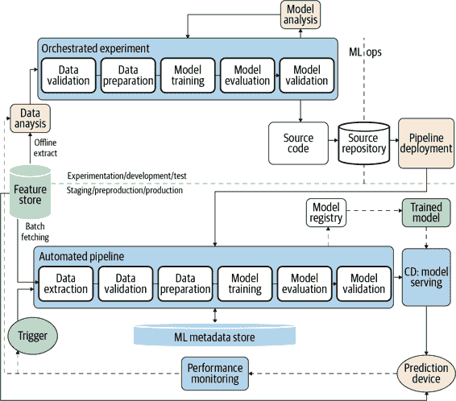
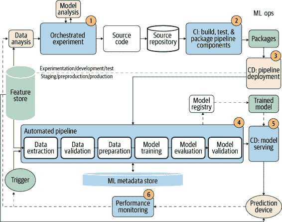

# 第八章：连接模式

我们致力于创建一个机器学习设计模式的目录，用于解决在设计、训练和部署机器学习模型和管道时经常遇到的问题。在本章中，我们提供了对这些模式清单的快速参考。

我们按照它们在典型 ML 工作流中的使用位置组织了这本书中的模式。因此，我们有一个关于输入表示的章节，另一个关于模型选择。然后，我们讨论了修改典型训练循环并使推断更具韧性的模式。最后，我们讨论了促进 ML 系统负责使用的模式。这类似于在食谱书中分别设置关于开胃菜、汤、主菜和甜点的部分。然而，这样的组织方式可能会使人难以确定何时选择哪种汤以及哪种甜点适合某些主菜。因此，在本章中，我们还阐明了模式之间的关系。最后，我们还通过讨论模式如何相互作用来制定“餐谱”，以解决常见 ML 任务类别的问题。

# 模式参考

我们讨论了许多不同的设计模式以及它们如何用于解决机器学习中常见的挑战。以下是总结。

| 章节 | 设计模式 | 解决的问题 | 解决方案 |
| --- | --- | --- | --- |
| 数据表示 | 散列特征 | 与分类特征相关的问题，如词汇不完整、模型大小由基数导致、以及冷启动。 | 对字符串表示的确定性和可移植哈希进行分桶，并接受数据表示中碰撞的权衡。 |
| 嵌入 | 高基数特征，其中保留接近关系很重要。 | 学习一种数据表示，将高基数数据映射到低维空间，以保留与学习问题相关的信息。 |
| 特征交叉 | 模型复杂度不足以学习特征之间的关系。 | 通过明确将每个输入值组合作为单独的特征，帮助模型更快地学习输入之间的关系。 |
| 多模态输入 | 如何在几种潜在的数据表示之间进行选择。 | 连接所有可用的数据表示。 |
| 问题表示 | 重新构建 | 包括数值预测的置信度、序数类别、限制预测范围以及多任务学习等多个问题。 | 改变机器学习问题输出的表示方式；例如，将回归问题表示为分类问题（反之亦然）。 |
| 多标签 | 一个给定训练示例适用于多个标签。 | 使用多热编码数组对标签进行编码，并将*k*个 sigmoid 函数用作输出层。 |
| 集成 | 在小到中等规模问题上的偏差-方差权衡。 | 结合多个机器学习模型并聚合它们的结果以进行预测。 |
| 级联 | 当机器学习问题被分解为一系列机器学习问题时，可维护性或漂移问题。 | 将机器学习系统视为用于训练、评估和预测的统一工作流程。 |
| 中性类 | 某些示例子集的类标签本质上是任意的。 | 为分类模型引入额外的标签，与当前标签不相交。 |
| 重平衡 | 数据严重不平衡。 | 根据不同考虑因素进行下采样、过采样或使用加权损失函数。 |
| 修改模型训练的模式 | 有用的过拟合 | 使用机器学习方法学习基于物理的模型或动态系统。 | 放弃通常的泛化技术，故意在训练数据集上过拟合。 |
| 检查点 | 由于机器故障导致长时间运行的训练作业丢失进度。 | 定期存储模型的完整状态，以便可以使用部分训练的模型来恢复训练，而不是从头开始。 |
| 迁移学习 | 缺乏训练复杂机器学习模型所需的大型数据集。 | 取出先前训练模型的一部分，冻结权重，并在新模型中使用这些不可训练层解决类似问题。 |
| 分布策略 | 训练大型神经网络可能需要很长时间，这会减慢实验速度。 | 在多个工作节点上以规模执行训练循环，利用缓存、硬件加速和并行化。 |
| 超参数调整 | 如何确定机器学习模型的最佳超参数。 | 将训练循环插入优化方法中，以找到最佳的模型超参数集。 |
| 弹性 | 无状态服务函数 | 生产机器学习系统必须能够同步处理每秒数千到数百万个预测请求。 | 将机器学习模型导出为无状态函数，以便可以以可扩展的方式由多个客户端共享。 |
| 批量服务 | 使用设计用于逐个处理请求的端点对大量数据进行模型预测会压垮模型。 | 使用常用于分布式数据处理的软件基础设施，在大量实例上异步执行推理。 |
| 持续模型评估 | 部署模型的性能随时间逐渐下降，原因可能是数据漂移、概念漂移或其他影响向模型提供数据的管道的变化。 | 通过持续监控模型预测和评估模型性能来检测部署模型何时不再适合用途。 |
| 两阶段预测 | 在边缘或分布式设备上部署大型复杂模型时必须保持性能。 | 将用例分成两个阶段，仅在边缘执行更简单的阶段。 |
| 键控预测 | 如何映射返回的模型预测到相应的模型输入，当提交大规模预测作业时。 | 允许模型在预测过程中传递一个客户端支持的关键字，该关键字可用于将模型输入与模型预测结果连接起来。 |
| 可重现性 | 转换 | 必须将输入数据转换为模型期望的特征，并且该过程在训练和服务过程中必须保持一致。 | 明确捕获并存储应用的转换步骤，将模型输入转换为特征。 |
| 可重复切分 | 在创建数据切分时，重要的是拥有一种轻量级且可重复的方法，无论编程语言或随机种子如何。 | 确定一个捕获行之间相关关系的列，并使用 Farm Fingerprint 哈希算法将可用数据拆分为训练、验证和测试数据集。 |
| 桥接模式 | 随着新数据的出现，任何数据架构的更改都可能阻止同时使用新旧数据进行重新训练。 | 适应数据从其旧的原始数据架构转换为与新数据的架构匹配。 |
| 窗口推断 | 一些模型需要持续序列的实例来运行推断，或者必须对时间窗口内的特征进行聚合，以避免训练与服务之间的偏差。 | 将模型状态外部化，并从流分析管道调用模型，以确保以动态、时间依赖的方式计算的特征能够在训练和服务之间正确重复。 |
| 工作流水线 | 在扩展机器学习工作流时，独立运行试验，并跟踪管道每一步的性能。 | 将机器学习工作流的每个步骤作为一个单独的容器化服务，可以将它们链接在一起，以便通过单个 REST API 调用运行管道。 |
| 特征存储 | 非专用的特征工程方法减慢了模型开发，并导致团队之间的工作重复，以及工作流效率低下。 | 创建一个特征存储库，用于存储和记录特征数据集的集中位置，这些特征数据集将用于构建机器学习模型，并可跨项目和团队共享。 |
| 模型版本控制 | 在生产环境中仅有一个模型时，进行性能监控和拆分测试模型更改非常困难，或者在不影响现有用户的情况下更新模型。 | 部署一个更改后的模型作为一个微服务，并使用不同的 REST 端点，以实现对已部署模型的向后兼容性。 |
| 负责任的 AI | 启发式基准 | 使用复杂的评估指标解释模型性能不能提供业务决策者所需的直观感受。 | 将机器学习模型与简单易懂的启发式方法进行比较。 |
| 可解释预测 | 有时需要知道模型为何做出某些预测，无论是用于调试还是遵守监管和合规标准。 | 应用模型可解释性技术来理解模型为何如何进行预测，并提升用户对 ML 系统的信任。 |
| 公平性镜头 | 偏见可能导致机器学习模型对所有用户不公平对待，并对某些人群产生不利影响。 | 使用工具在训练前识别数据集中的偏见，并通过公平性镜头评估训练后的模型，确保模型预测在不同用户群体和不同场景中是公平的。 |

# 模式互动

设计模式并不孤立存在。许多设计模式要么直接要么间接地彼此紧密相关，并且通常互为补充。图 8-1 中的互动图表总结了不同设计模式之间的相互依赖和某些关系。如果你发现自己在使用某个模式，你可能会受益于考虑如何将其他与之相关的模式整合进来。

在这里，我们将突出一些模式之间的关系以及在开发完整解决方案时它们如何结合使用。例如，在处理分类特征时，可以将散列特征设计模式与嵌入设计模式结合使用。这两种模式共同处理高基数模型输入，例如处理文本。在 TensorFlow 中，通过将`categorical_column_with_hash_bucket`特征列包装在`embedding`特征列中，将稀疏的分类文本输入转换为密集表示来演示这一点：

```
import tensorflow.feature_column as fc
keywords = fc.categorical_column_with_hash_bucket("keywords", 
   hash_bucket_size=10K)
keywords_embedded = fc.embedding_column(keywords, num_buckets=16)
```

当讨论嵌入时，我们发现在使用特征交叉设计模式时推荐使用这一技术。散列特征与可重复分割设计模式紧密相关，因为 Farm Fingerprint 散列算法可用于数据分割。而在使用散列特征或嵌入设计模式时，通常会考虑到超参数调整的概念，以确定使用的最佳散列桶数或正确的嵌入维度。



###### 图 8-1\. 本书讨论的许多模式都相关或可以一起使用。此图像在[GitHub 存储库](https://github.com/GoogleCloudPlatform/ml-design-patterns)中可用。

实际上，超参数调优设计是机器学习工作流程的常见部分，并经常与其他模式结合使用。例如，我们可以使用超参数调优来确定在实施桥接模式（Bridged Schema pattern）时要使用的旧示例数量。而在使用超参数调优时，重要的是要记住我们如何设置模型检查点（Checkpoints）使用虚拟时代和分布式训练。与此同时，检查点设计模式自然地与迁移学习联系在一起，因为在微调过程中通常使用较早的模型检查点。

嵌入（Embeddings）在整个机器学习中广泛应用，因此嵌入设计模式与其他模式的交互方式多种多样。也许最显著的是迁移学习（Transfer Learning），因为从预训练模型的中间层生成的输出实质上就是学习到的特征嵌入。我们还看到，通过在分类模型中自然地或通过重构模式（Reframing pattern）将中性类设计模式（Neutral Class design pattern）整合进去，可以改善这些学习到的嵌入。进一步地，如果这些嵌入被用作模型的特征，使用特征存储模式（Feature Store pattern）将它们保存下来以便轻松访问和版本管理可能会很有优势。或者，在迁移学习的情况下，预训练模型输出可以被视为级联模式的初始输出。

我们还看到如何通过将两种其他设计模式结合起来——重构模式（Reframing）和级联模式（Cascade），来处理再平衡设计模式（Rebalancing pattern）。重构模式将允许我们将不平衡的数据集表示为“正常”或“异常”的分类。该模型的输出然后将传递给一个次要的回归模型，该模型针对任一数据分布进行优化预测。这些模式很可能还会导致可解释预测设计模式（Explainable Predictions pattern），因为在处理不平衡数据时，验证模型是否捕捉到了正确的预测信号尤为重要。事实上，当构建涉及多个模型级联的解决方案时，鼓励考虑可解释预测设计模式，因为这可以限制模型的可解释性。模型可解释性的这种权衡再次出现在集成模型和多模型输入模式中，因为这些技术也不太适合某些可解释性方法。

当使用桥接模式时，级联设计模式可能也会有所帮助，并且可以作为一个替代模式，通过具有初步模型的方式来填补辅助架构的缺失值。然后可以将这两种模式结合起来，以保存后续在特征存储模式中描述的特征集。这是另一个突显特征存储模式多功能性的例子，以及它如何经常与其他设计模式结合使用。例如，特征存储提供了一种方便的方式来维护和利用通过窗口推理模式产生的流模型特征。特征存储还与管理在重新框架模式中可能出现的不同数据集紧密配合，并提供了在使用转换模式时出现的可重复使用的技术版本。正如在特征存储模式中讨论的特征版本控制能力，也在模型版本设计模式中发挥作用。

另一方面，模型版本设计模式与无状态服务函数和持续模型评估模式密切相关。在持续模型评估中，可以在评估模型性能随时间而变差时使用不同的模型版本。同样，服务函数的不同模型签名提供了创建不同模型版本的简便方式。通过无状态服务函数模式进行模型版本管理的这种方法可以追溯到重新框架模式，其中两个不同的模型版本可以为两种不同的模型输出表示提供它们自己的 REST API 端点。

当使用持续模型评估模式时，探索工作流管道模式中呈现的解决方案通常是有利的，这样可以设置触发器来启动重新训练管道，并且保持对创建的各种模型版本的血统跟踪。持续模型评估还与键控预测模式密切相关，因为这可以为将真实数据与模型预测输出轻松结合提供机制。同样，键控预测模式也与批量服务模式紧密相连。同理，批量服务模式通常与无状态服务函数模式结合使用，以执行规模化的预测任务，而这又依赖于底层的转换模式来保持训练与服务之间的一致性。

# 在机器学习项目中的模式

机器学习系统使组织内的团队能够按比例构建、部署和维护机器学习解决方案。它们为自动化和加速 ML 生命周期的所有阶段提供了平台，从管理数据到训练模型、评估性能、部署模型、提供预测和监控性能。本书讨论的模式将出现在任何机器学习项目中。在本节中，我们将描述 ML 生命周期的各个阶段以及这些模式可能出现的位置。

## ML 生命周期

构建机器学习解决方案是一个循环过程，从清晰理解业务目标开始，最终导致生产一个机器学习模型，以实现这一目标的利益。这个 ML 生命周期的高级概述（见图 8-2）提供了一个有用的路线图，旨在使 ML 为企业带来价值。每个阶段同等重要，未能完成任何一个步骤将增加后续阶段产生误导性见解或毫无价值模型的风险。



###### 图 8-2\. ML 生命周期始于定义业务用例，并最终导致生产一个机器学习模型，以实现这一目标的利益。

ML 生命周期包括三个阶段，如图 8-2 所示：发现、开发和部署。每个阶段的各个步骤有一个规范的顺序。然而，这些步骤是以迭代的方式完成的，较早的步骤可能会根据后续阶段收集到的结果和见解进行重新访问。

### 发现

机器学习存在作为解决问题的工具。ML 项目的发现阶段始于定义业务用例（图 8-2 的步骤 1）。这是业务领导者和 ML 从业者对问题具体细节进行协调，并理解 ML 能够做到什么和不能做到什么来实现这一目标的关键时刻。

在生命周期的每个阶段都要牢记业务价值的重要性。在各个阶段必须做出许多选择和设计决策，通常情况下并没有单一的“正确”答案。相反，最佳选择取决于模型如何支持业务目标。虽然研究项目的可行目标可能是在基准数据集上再提高 0.1%的准确率，但这在行业中是不可接受的。对于为企业组织构建的生产模型，成功取决于与业务更紧密相关的因素，如提高客户保留率、优化业务流程、增加客户参与度或减少流失率。还可能存在间接影响开发选择的与业务用例相关的因素，如推断速度、模型大小或模型可解释性。任何机器学习项目都应始于对业务机会的深入理解，以及机器学习模型如何能够对当前运营进行实质性改进。

一个成功的发现阶段需要业务领域专家和机器学习专家之间的合作，以评估 ML 方法的可行性。关键是有人理解业务和数据，与了解技术挑战及工程工作量的团队合作。如果开发资源的整体投资超过了对组织的价值，那么这不是一个值得的解决方案。可能技术开销和生产资源成本超过了模型只能提高 0.1%流失预测的好处。或者也可能不是这样。如果一个组织的客户基础达到 10 亿人，那么 0.1%仍然意味着 100 万更加满意的客户。

在发现阶段，明确任务的业务目标和范围非常重要。这也是确定将用于衡量或定义成功的指标的时候。成功在不同组织中可能看起来不同，甚至在同一组织的不同组中也是如此。例如，可以参考“机器学习中的常见挑战”中对多目标的讨论，该讨论在第一章中有详述。在 ML 项目开始时创建明确定义的指标和关键绩效指标（KPIs）可以帮助确保所有人都朝着共同的目标对齐。理想情况下，已经有某些程序可供参考，以便将来的进展进行测量。这可能是一个已经在生产中的模型，甚至只是目前正在使用的基于规则的启发式。机器学习并非所有问题的答案，有时候基于规则的启发式难以超越。开发不应仅仅是为了开发而开发。一个基准模型，无论多么简单，都有助于指导未来的设计决策，并理解每个设计选择如何在预定的评估指标上推动进展。在第七章中，我们讨论了启发式基准的作用，以及与商业利益相关方沟通时经常涉及的负责任 AI 相关的其他主题。

当然，这些对话也应该发生在数据的背景下。业务的深度挖掘应该与数据探索的深度挖掘（见图 8-2 的第二步）手牵手进行。即使解决方案可能非常有益，如果没有质量数据可用，那么就没有项目。或许数据是存在的，但由于数据隐私原因，不能使用或必须清洗掉模型所需的相关信息。无论如何，项目的可行性和成功的潜力都依赖于数据。因此，早期让组织内的数据管理者参与这些对话至关重要。

数据指导整个过程，了解可用数据的质量非常重要。关键特征的分布是什么样的？有多少缺失值？如何处理缺失值？是否存在异常值？输入值是否高度相关？输入数据中存在哪些特征，哪些特征应该被设计？许多机器学习模型需要大量的训练数据集。是否有足够的数据？我们如何增加数据集？数据集中是否存在偏差？这些都是重要的问题，它们只是触及表面。在这个阶段可能的一个决定是，在项目可以继续之前需要收集更多数据，或者收集特定场景的数据。

数据探索是回答数据是否具有足够质量的关键步骤。单凭对话很少能替代亲自动手并进行数据实验。在此步骤中，可视化起着重要作用。密度图和直方图有助于理解不同输入值的分布情况。箱线图可以帮助识别异常值。散点图有助于发现和描述双变量关系。百分位数可以帮助识别数值数据的范围。平均数、中位数和标准差有助于描述中心趋势。这些技术及其他方法有助于确定哪些特征可能对模型有益，以及进一步了解需要对数据进行哪些转换以准备建模所需。

在发现阶段内，进行几个建模实验以查看是否确实有“信号在噪声中”。此时，执行机器学习可行性研究（第 3 步）可能会有益。顾名思义，这通常是一个短期技术冲刺，仅持续几周，旨在评估解决问题的数据的可行性。这提供了探索框架机器学习问题、尝试算法选择以及了解哪些特征工程步骤最有益的机会。在发现阶段的可行性研究步骤也是创建启发式基准的好时机（参见第七章）。

### 开发

在同意关键评估指标和业务 KPI 后，机器学习生命周期的开发阶段开始。许多机器学习资源详细介绍了开发 ML 模型的细节。在这里，我们重点介绍关键组成部分。

在开发阶段，我们首先通过构建数据管道和工程化特征（图 8-2 的第 4 步）来处理数据输入，这些数据输入将被馈送给模型。在实际应用中收集的数据可能存在许多问题，如缺失值、无效示例或重复数据点。数据管道需要预处理这些数据输入，以便模型可以使用它们。特征工程是将原始输入数据转换为更符合模型学习目标并以可供训练的格式表达的特征的过程。特征工程技术可能涉及将输入进行分桶、在不同数据格式之间转换、对文本进行标记化和词干提取、创建分类特征或独热编码、哈希输入、创建特征交叉和特征嵌入等。本书的第二章讨论了数据表示设计模式，并涵盖了在 ML 生命周期的这一阶段涉及的许多数据方面。第五章和第六章描述了与 ML 系统中弹性和可重现性相关的模式，有助于构建数据管道。

在这一步骤中，可能还涉及工程化问题的标签以及与问题表示方式相关的设计决策。例如，对于时间序列问题，可能需要创建特征窗口，并尝试滞后时间和标签间隔的大小。或者可能有助于将回归问题重新构造为分类问题，并完全改变标签的表示方式。或者，如果输出类的分布被单一类别过度代表，可能需要采用重新平衡技术。本书的第三章侧重于问题表示，并讨论了与问题框架相关的这些重要设计模式及其他内容。

发展阶段的下一步（图 8-2 中的第 5 步，参见#the_ml_life_cycle_begins_with_defining）专注于构建 ML 模型。在这一开发阶段，遵循在管道中捕获 ML 工作流的最佳实践至关重要：参见“设计模式 25：工作流管道”在第六章中。这包括在任何模型开发之前创建可重复使用的训练/验证/测试集划分，以确保没有数据泄漏。可以训练不同的模型算法或算法组合，以评估它们在验证集上的性能，并检查其预测的质量。调整参数和超参数，采用正则化技术，并探索边缘案例。典型的 ML 模型训练循环在第四章开头详细描述，我们还讨论了用于更改训练循环以达到特定目标的有用设计模式。

ML 生命周期的许多步骤都是迭代的，特别是在模型开发阶段尤为如此。经过一些试验后，经常需要重新审视数据、业务目标和关键绩效指标。在模型开发阶段，会得到新的数据洞察，这些洞察能够更清晰地展示可能性（以及不可能性）。在开发自定义模型时，通常会花费很长时间，这在模型开发阶段尤为突出。第六章还讨论了许多解决在这一迭代阶段中出现的挑战的再现性设计模式。

在模型开发的整个过程中，每一次新的调整或方法都会根据在发现阶段设定的评估指标进行衡量。因此，成功执行发现阶段至关重要，并且有必要在该阶段做出的决策上达成一致。最终，模型开发将在最终评估步骤（图 8-2 的第 6 步，参见#the_ml_life_cycle_begins_with_defining）中结束，并根据那些预先确定的评估指标评估模型性能。

开发阶段的关键结果之一是解释并向业务内的利益相关者和监管组织呈现结果（见图 8-2 的第 7 步）。这种高级评估至关重要，有必要将开发阶段的价值传达给管理层。此步骤专注于为将呈现给组织内利益相关者的初步报告创建数字和可视化内容。第七章讨论了一些确保 AI 被负责使用并有助于利益相关者管理的常见设计模式。通常，这是决定是否将进一步资源投入到机器学习生产化和部署的最后阶段的关键决策点。

### 部署

假设模型开发成功并证明了有希望的结果，下一阶段便是专注于模型的生产化，第一步（见图 8-2 的第 8 步）是规划部署。

训练机器学习模型需要大量工作，但要充分实现这些努力的价值，模型必须在生产环境中运行，以支持其旨在改进的业务工作。有几种方法可以实现这一目标，根据使用情况，不同组织的部署方式可能不同。例如，生产化的机器学习资产可以采取交互式仪表盘、静态笔记本、封装在可重用库中的代码或者网页服务端点的形式。

对于生产化模型，存在许多考虑因素和设计决策。与之前一样，发现阶段中的许多决策也指导这一步。如何管理模型重新训练？输入数据是否需要实时流入？训练应该在新的数据批次上进行还是实时进行？模型推断如何？我们应该计划每周一次的一次性批量推断作业，还是需要支持实时预测？是否需要考虑特殊的吞吐量或延迟问题？是否需要处理尖峰工作负载？低延迟是否是首要考虑的？网络连接是否存在问题？第五章中的设计模式涉及了在将 ML 模型操作化过程中出现的一些问题。

这些都是重要的考虑因素，而这个最终阶段往往是许多企业面临的最大障碍，因为它可能需要组织的不同部分之间的强大协调，并且需要整合各种技术组件。这种困难部分原因在于，生产化需要将一个依赖于机器学习模型的新流程整合到现有系统中。这可能涉及处理为支持单一方法而开发的遗留系统，或者在组织内部导航复杂的变更控制和生产流程。此外，许多时候，现有系统没有支持来自机器学习模型预测的机制，因此必须开发新的应用程序和工作流程。预见到这些挑战是非常重要的，从业务运营方面开发全面的解决方案需要大量投资，以尽可能简化过渡并增加市场推出速度。

部署阶段的下一步是将模型运营化（图 8-2 中的第 9 步）[¹]。这一实践领域通常被称为 MLOps（机器学习运营），涵盖了自动化、监控、测试、管理和维护生产中的机器学习模型相关的方方面面。对于任何希望在其组织内扩展机器学习驱动应用数量的公司来说，这是一个必要的组成部分。

运营化模型的关键特征之一是自动化工作流管道。ML 生命周期的开发阶段是一个多步骤过程。构建用于自动化这些步骤的管道能够实现更高效的工作流和可重复的过程，从而改进未来模型开发，并允许在解决出现问题时提高灵活性。今天，像[Kubeflow](https://oreil.ly/I_cJf)这样的开源工具提供了这种功能，许多大型软件公司也开发了自己的端到端 ML 平台，例如[Uber 的 Michelangelo](https://oreil.ly/se4G9)或[Google 的 TFX](https://oreil.ly/OznI3)，这些平台也是开源的。

成功的运营化包括持续集成和持续交付（CI/CD）的组成部分，这些是软件开发的熟悉最佳实践。这些 CI/CD 实践侧重于代码开发中的可靠性、可重复性、速度、安全性和版本控制。ML/AI 工作流也从相同的考虑因素中受益，尽管存在一些显著的差异。例如，除了用于开发模型的代码外，将这些 CI/CD 原则应用于数据，包括数据清理、版本控制和数据管道的编排，也非常重要。

部署阶段需考虑的最后一步是监控和维护模型。一旦模型被操作化并投入生产，监控模型的性能就变得必要了。随着时间的推移，数据分布会发生变化，导致模型变得陈旧。这种模型过时（见图 8-3）可能由多种原因引起，从客户行为变化到环境变动。因此，建立有效监控机制以监控机器学习模型及其性能相关的各个组成部分（从数据收集到服务期间预测质量）非常重要。第五章的“设计模式 18：持续模型评估”详细讨论了这一常见问题及其解决方案。



###### 图 8-3\. 模型过时可能出现很多原因。定期重新训练模型有助于随着时间推移提高它们的性能。

例如，监控特征值的分布以与开发阶段使用的分布进行比较是很重要的。监控标签值的分布也很重要，以确保数据漂移没有导致标签分布的不平衡或偏移。机器学习模型通常依赖于从外部来源收集的数据。也许我们的模型依赖于第三方交通 API 来预测汽车接送等待时间，或使用天气 API 的数据作为预测航班延误的模型的输入。这些 API 不由我们团队管理。如果该 API 失败或其输出格式发生显著变化，将会对我们的生产模型产生后果。在这种情况下，设置监控以检查这些上游数据源的变化非常重要。最后，建立系统来监控预测分布，并在可能时衡量生产环境中预测质量也是至关重要的。

在完成监控步骤后，重新审视业务用例并客观、准确地评估机器学习模型如何影响业务绩效可能是有益的。很可能会带来新的见解并开启新的机器学习项目，生命周期再次开始。

## AI 准备度

我们发现，不同的组织在构建机器学习解决方案时处于 AI 准备的不同阶段。根据[Google Cloud 发布的白皮书](https://oreil.ly/5GljC)，公司在将 AI 整合到业务中的成熟度通常可以划分为三个阶段：战术、战略和变革。这三个阶段中的机器学习工具从战术阶段的主要手动开发，到战略阶段的使用流水线，再到变革阶段的完全自动化。

### 战术阶段：手动开发

AI 准备的战术阶段通常出现在刚开始探索 AI 潜力以交付的组织中，重点放在短期项目上。在这里，AI/ML 用例往往更加狭窄，更多地关注概念验证或原型;与业务目标的直接联系并不总是清晰的。在这个阶段，组织认识到先进分析工作的潜力，但执行主要由个人贡献者驱动或完全外包给合作伙伴;在组织内部获取大规模、高质量数据集可能会很困难。

通常，在这个阶段，没有一致扩展解决方案的过程，并且使用的 ML 工具（见图 8-4）是根据特定需求开发的。数据离线存储或在孤立的数据岛中，并手动访问进行数据探索和分析。目前没有工具可以自动化 ML 开发周期的各个阶段，也没有太多关注于开发工作流程的可重复过程。这使得在组织成员之间共享资产变得困难，并且没有专门的硬件用于开发。

MLOps 的范围仅限于训练模型的存储库，并且在测试和生产环境之间几乎没有区别，最终模型可能会部署为基于 API 的解决方案。



###### 图 8-4\. AI 模型的手动开发。图示改编自[Google Cloud 文档](https://oreil.ly/aC1HP)。

### 战略阶段：利用流水线

战略阶段的组织已经将 AI 工作与业务目标和优先事项对齐，ML 被视为业务的关键推动因素。因此，通常会有高级执行赞助和专门的 ML 项目预算，由熟练的团队和战略合作伙伴执行。为这些团队提供了基础设施，以便轻松共享资产并开发利用现成和定制模型的 ML 系统。在开发和生产环境之间有明确的区别。

团队通常已具备数据清洗技能，擅长描述性和预测性分析。数据存储在企业数据仓库中，并有一个统一的模型用于集中管理数据和机器学习资产。ML 模型的开发是作为一项协调的实验进行的。这些管道的 ML 资产和源代码存储在一个集中的源代码库中，并且在组织成员之间轻松共享。

开发 ML 模型的数据管道是自动化的，利用完全托管的、无服务器的数据服务进行数据摄取和处理，可以按计划或事件驱动。此外，ML 训练、评估和批量预测的工作流由自动化管道管理，以便通过性能监控触发器执行 ML 生命周期的各个阶段，从数据验证和准备到模型训练和验证（见 图 8-5）。

在生产环境中可能部署和维护多个具有日志记录、性能监控和通知功能的机器学习系统。这些机器学习系统利用模型 API 处理实时数据流，既用于推理，也用于收集数据，这些数据被馈送到自动化机器学习管道中以更新模型以供后续训练。



###### 图 8-5\. AI 开发的管道阶段。图来源于[Google Cloud 文档](https://oreil.ly/sMNo7)。

### 转型阶段：完全自动化的流程

正在进行 AI 准备转型阶段的组织正在积极使用 AI 来推动创新，支持敏捷性，并培养一个实验和学习不断进行的文化。战略合作伙伴关系用于创新、共同创造，并增强公司内的技术资源。与 AI 准备阶段相关的许多与可复现性和弹性相关的设计模式在第五章和第六章中出现。

这一阶段，通常会将特定产品的 AI 团队嵌入更广泛的产品团队，并得到高级分析团队的支持。通过这种方式，ML 专业知识能够在组织内各业务线中传播。建立的常见模式和最佳实践，以及用于加速 ML 项目的标准工具和库，在组织内不同的团队之间轻松共享。

数据集存储在一个对所有团队都可访问的平台上，使得发现、共享和重复使用数据集和 ML 资产变得容易。有标准化的 ML 特征存储，并鼓励整个组织之间的合作。完全自动化的组织在集成 ML 实验和生产平台上运行，模型构建和部署以及 ML 实践对组织中的每个人都是可访问的。该平台由可扩展和无服务器的计算支持批处理和在线数据摄入和处理。例如，可按需使用专用的 ML 加速器如 GPU 和 TPU，并对端到端数据和 ML 管道进行编排实验。

开发和生产环境类似于流水线阶段（见图 8-6），但已将 CI/CD 实践整合到其 ML 工作流的各个阶段中。这些 CI/CD 最佳实践侧重于代码可靠性、可重复性和版本控制，以便生成 ML 模型以及数据和数据管道及其编排。这允许构建、测试和打包各种流水线组件。ML 模型版本控制由 ML 模型注册表维护，该注册表还存储必要的 ML 元数据和工件。



###### 图 8-6\. 完全自动化的过程支持 AI 开发。图源自[Google Cloud 文档。](https://oreil.ly/VX31C)

# 按用例和数据类型的常见模式

本书讨论的许多设计模式在任何机器学习开发周期中都会被使用，并且可能会被用于生产用例，例如超参数调整、启发式基准、可重复分割、模型版本控制、分布式训练、工作流管道或检查点。其他设计模式可能会在特定场景中特别有用。在这里，我们将根据流行的机器学习用例将常用的设计模式分组在一起使用。

## 自然语言理解

自然语言理解（NLU）是人工智能的一个分支，专注于训练机器理解文本和语言背后的含义。NLU 被语音助手如亚马逊的 Alexa、苹果的 Siri 和谷歌的 Assistant 用于理解句子，例如“这个周末天气预报如何？”有许多应用场景属于 NLU 的范畴，可以应用于许多过程，如文本分类（电子邮件过滤）、实体提取、问题回答、语音识别、文本摘要和情感分析。

+   嵌入

+   哈希特征

+   中性类

+   多模态输入

+   迁移学习

+   两阶段预测

+   级联

+   窗口推断

## 计算机视觉

计算机视觉是训练机器理解视觉输入（如图像、视频、图标等）的广泛父类 AI。计算机视觉模型旨在自动化依赖于人类视觉的任何任务，从使用 MRI 检测肺癌到自动驾驶汽车。计算机视觉的一些经典应用包括图像分类、视频运动分析、图像分割和图像去噪。

+   重构

+   中性类

+   多模态输入

+   迁移学习

+   嵌入

+   多标签

+   级联

+   两阶段预测

## 预测分析

预测建模使用历史数据来发现模式并确定未来事件发生的可能性。预测模型可以在许多不同的行业领域找到。例如，企业可能使用预测模型更准确地预测收入或预测产品的未来需求。在医学上，预测模型可能用于评估患者发展慢性疾病的风险或预测患者可能未按预约出现的时间。其他示例包括能源预测、客户流失预测、财务建模、天气预测和预测性维护。

+   特征存储

+   特征交叉

+   嵌入

+   集成

+   转换

+   重构

+   级联

+   多标签

+   中性类

+   窗口推断

+   批量服务

物联网分析也是预测分析的一个广泛类别。物联网模型依赖于由称为物联网设备的互联网连接传感器收集的数据。考虑一架商用飞机，它有数千个传感器，每天收集超过 2 TB 的数据。物联网传感器设备数据的机器学习可以提供预测模型，以在故障发生之前发出警告。

+   特征存储

+   转换

+   重构

+   散列特征

+   级联

+   中性类

+   两阶段预测

+   无状态服务函数

+   窗口推断

## 推荐系统

推荐系统是机器学习在业务中应用最广泛的领域之一，当用户与物品互动时通常会出现。推荐系统捕捉过去行为和类似用户的特征，并推荐对于给定用户最相关的物品。想象一下，YouTube 会根据你的观看历史推荐一系列视频，或者亚马逊可能根据购物车中的商品推荐购买。推荐系统在许多企业中非常流行，特别是产品推荐、个性化和动态营销以及流媒体视频或音乐平台。

+   嵌入

+   集成

+   多标签

+   迁移学习

+   特征存储

+   散列特征

+   重构

+   转换

+   窗口推断

+   两阶段预测

+   中性类

+   多模态输入

+   批量服务

## 欺诈和异常检测

许多金融机构利用机器学习进行欺诈检测，以确保消费者账户的安全。这些机器学习模型经过训练，根据数据中学习到的某些特征或模式来标记可能是欺诈的交易。

更广泛地说，异常检测是一种用于发现数据集中异常行为或离群元素的技术。异常可以表现为偏离正常模式的突增或突降，也可以是较长期的异常趋势。异常检测在机器学习中出现在许多不同的用例中，甚至可能与其他用例一起使用。例如，考虑一个基于图像识别异常火车轨道的机器学习模型。

+   重新平衡

+   特征交叉

+   嵌入

+   集成

+   两阶段预测

+   转换

+   特征存储

+   级联

+   中性类别

+   重新构架
