# 1 什么是机器学习工程师？

本章涵盖

+   机器学习工程师的知识和技能范围

+   应用机器学习项目工作的六个基本方面

+   机器学习工程师的功能性目的

机器学习（ML）令人兴奋。它很有趣，具有挑战性、创造性，并且富有智力刺激。它还为公司赚钱，自主处理压倒性的大任务，并从那些更愿意做其他事情的人那里移除了单调乏味的工作负担。

机器学习也非常复杂。从数千种算法、数百个开源包，以及需要从数据工程（DE）到高级统计分析与可视化的多种技能集的从业者职业，专业机器学习从业者所需完成的工作确实令人畏惧。再加上需要能够与广泛的跨职能专家、领域专家（SMEs）和业务单元团队合作——在解决问题的性质和机器学习支持的解决方案的输出上进行沟通和协作，增加了这种复杂性。

机器学习工程应用了一套*系统*来处理这种令人敬畏的复杂性。它使用一系列标准、工具、流程和方法，旨在最大限度地减少在解决商业问题或需求时进行废弃、误导或不相关工作的可能性。本质上，它是创建可以部署到生产中、未来几年内可以维护和更新的基于机器学习的系统的路线图，使企业能够获得机器学习在效率、盈利能力和准确性方面证明可以提供的收益（当正确执行时）。

这本书本质上就是那条路线图。它是一份指南，帮助你导航开发具有生产能力的机器学习解决方案的路径。图 1.1 显示了本书涵盖的机器学习项目工作的主要元素。我们将通过这些经过验证的过程集（主要是从我的职业生涯中犯过的错误中吸取的教训）来提供一个框架，通过应用机器学习来解决商业问题。

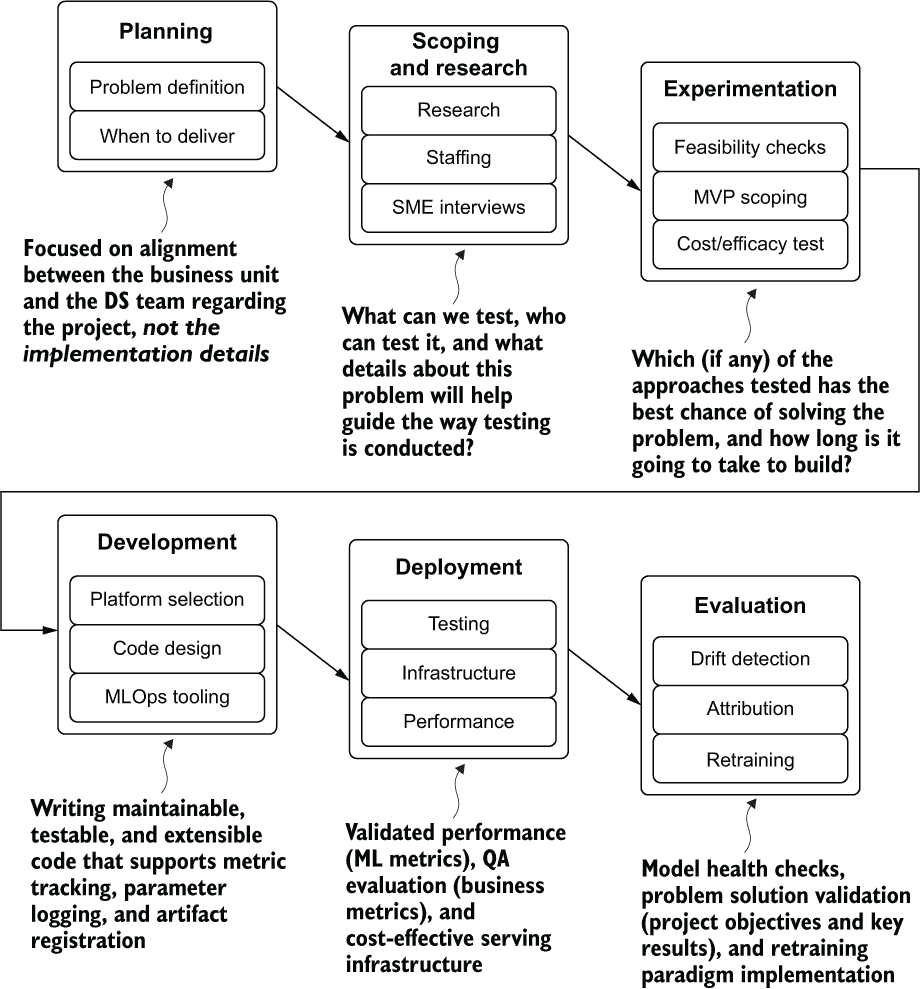

图 1.1 项目工作的机器学习工程路线图

这个项目工作路径并不是要专注于每个阶段应该完成的任务。相反，它是每个阶段内的方法论（即“我们为什么要这样做”的元素），这使得项目工作能够成功。

机器学习工作的最终目标毕竟是为了解决问题。作为数据科学（DS）从业者，解决我们所有人都要面对的业务问题的最有效方式是遵循一个旨在防止返工、混乱和复杂性的流程。通过拥抱机器学习工程的概念并遵循有效项目工作的道路，获得有用建模解决方案的最终目标可以更短，成本更低，成功的可能性也更高，而不是仅仅碰运气，寄希望于最好的结果。

## 1.1 为什么是机器学习工程？

简而言之，机器学习是*困难的*。在正确地以可靠频率大规模提供相关预测的意义上，它甚至更难。考虑到该领域存在许多专业领域——如自然语言处理（NLP）、预测、深度学习和传统的基于线性树建模——以及大量为解决特定问题而构建的算法，学习该领域所有知识的一小部分都极具挑战性。理解应用机器学习的理论和实践方面是具有挑战性和耗时的工作。

然而，这些知识在构建模型解决方案与外部世界之间的接口方面没有帮助。它也没有帮助告知确保可维护和可扩展解决方案的开发模式。

数据科学家还应该熟悉其他领域的专业技能。从中级数据工程技能（你总得从某处获取你的数据科学数据，对吧？），软件开发技能，项目管理技能，可视化技能，到演示技能，这个列表越来越长，需要积累的经验量也变得相当令人畏惧。考虑到所有这些，对于创建生产级机器学习解决方案所需的所有技能“只是弄清楚”来说，这并不令人惊讶。

机器学习工程的目标不是迭代上述技能列表，并要求数据科学家（DS）掌握每一项技能。相反，机器学习工程收集了这些技能的某些方面，精心设计以与数据科学家相关，所有这些都有助于增加将机器学习项目投入生产的可能性，并确保它不是一个需要不断维护和干预才能运行的解决方案。

无论如何，机器学习工程师不需要能够为通用算法用例创建应用程序和软件框架。他们也不太可能编写自己的大规模流式处理提取、转换和加载（ETL）管道。他们同样不需要能够使用 JavaScript 创建详细和动态的前端可视化。

机器学习工程师需要掌握“足够”的软件开发技能，以便能够编写模块化代码和实现单元测试。他们不需要了解非阻塞异步消息代理的复杂性。他们需要“足够”的数据工程技能来构建（并为模型调度 ETL）特征数据集，但不需要构建 PB 级流式摄取框架。他们需要“足够”的可视化技能来创建能够清晰传达其研究和模型所做工作的图表，但不需要开发具有复杂用户体验（UX）组件的动态 Web 应用程序。他们还需要“足够”的项目管理经验，知道如何正确定义、范围和控制在解决问题时项目，但不需要通过项目管理专业（PMP）认证。

在机器学习领域，有一个巨大的问题仍然存在。具体来说，为什么——随着许多公司全力投入机器学习，雇佣大量高薪数据科学家，并投入大量财务和时间资源到项目中——这么多努力最终都以失败告终？图 1.2 描绘了我所看到的六个主要项目失败原因的粗略估计（并且根据我的经验，任何特定行业的这些失败率确实令人惊讶）。

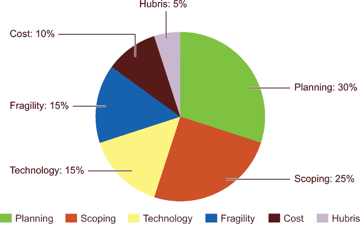

图 1.2：我对为什么机器学习项目失败的原因估计，基于我所参与和指导的数百个项目

在本书的第一部分，我们将讨论如何识别导致许多项目失败、被放弃或远远超出预期时间才达到生产阶段的原因。我们还将讨论解决这些常见失败的方法，并介绍可以显著降低这些因素导致项目受阻的流程。

通常，这些失败发生是因为数据科学团队要么缺乏解决所需规模问题（技术或流程驱动型失败）的经验，要么没有完全理解业务所期望的结果（沟通驱动型失败）。我从未见过这种情况是由于恶意意图造成的。相反，大多数机器学习项目极其具有挑战性、复杂，并且由难以向非专业人士解释的算法软件工具组成——这就是为什么大多数项目在业务部门之间沟通出现破裂的原因。

机器学习项目的复杂性还增加了两个其他关键元素，这些元素（大多数）传统软件开发项目并不具备：项目期望的细节经常不足，以及工具的相对行业不成熟。这两个方面与 20 世纪 90 年代初的软件工程状态并无不同。当时的企业不确定如何最好地利用技术能力的新方面，工具发展严重不足，许多项目未能满足那些委托工程团队为其建设的人的期望。从我的偏见来看，机器学习工作（仅与为数不多的公司合作）在 21 世纪的第二个十年处于与 30 年前软件工程相同的位置。

这本书并不是关于机器学习挑战的末日预言论文；相反，它的目的是展示这些元素如何成为项目的风险。目的是教授那些有助于最小化失败风险的流程和工具。图 1.3 展示了在项目执行过程中可能出现的各种绕行；每一项都会给项目成功的执行带来不同的风险元素。

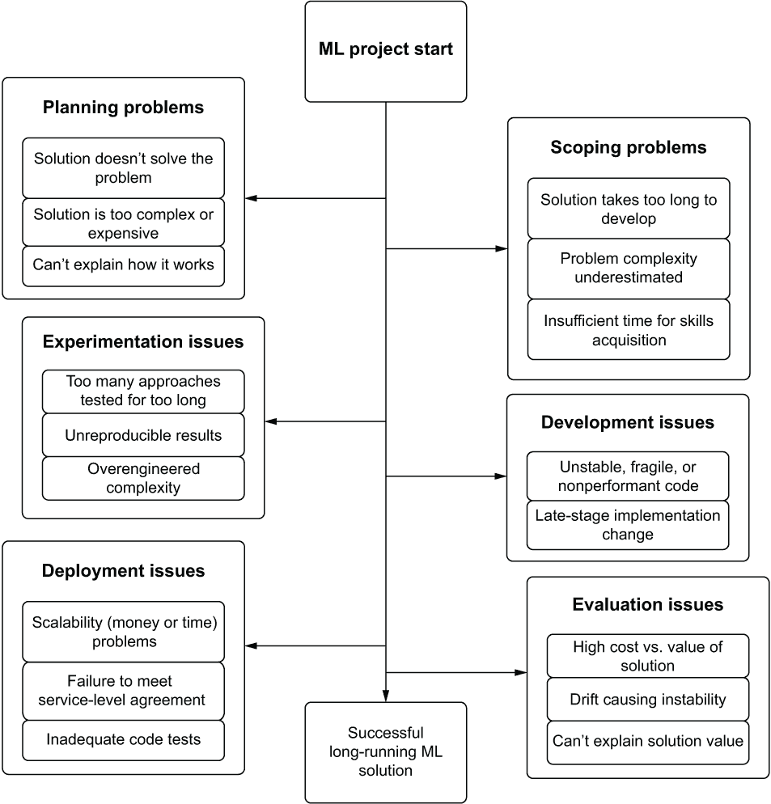

图 1.3 导致项目失败的机器学习项目绕行

机器学习工程中使用的框架正是专门用来解决这些主要失败模式的。消除这些失败的可能性是这个方法的核心。这是通过提供更好的决策流程、简化与内部客户的沟通、在实验和开发阶段消除返工、创建易于维护的代码库，并将最佳实践方法应用于任何受数据科学工作严重影响的项目来实现的。正如几十年前的软件工程师从大规模瀑布式实施中提炼出更灵活、更高效的敏捷流程一样，机器学习工程寻求定义一套新的实践和工具，以优化数据科学家完全独特的软件开发领域。

## 1.2 机器学习工程的核心原则

既然你对机器学习工程有了大致的了解，我们现在可以稍微关注一下构成图 1.2 中那些极其广泛的类别的主要元素。这些主题中的每一个都将在本书后面的章节中进行深入讨论，但就目前而言，我们将通过可能令人痛苦熟悉的情况来全面审视它们，以阐明它们为什么如此重要。

### 1.2.1 规划

*构建一个解决错误问题的机器学习解决方案是最令人沮丧的事情。*

到目前为止，项目失败的最大原因之一是未能彻底规划项目，这是项目被取消最令人沮丧的方式之一。想象一下，你是一家公司第一位雇佣的数据科学家。在你第一周的时候，营销部门的负责人来找你，用他们的术语解释他们正在面临的一个严重的业务问题。他们需要找出一种高效的方法通过电子邮件与客户沟通，让他们知道即将到来的促销活动。给你提供的额外细节非常少，高管只是说：“我想看到我们的电子邮件的点击率和打开率上升。”

如果这是唯一提供的信息，并且对营销团队成员的重复查询只是陈述相同的最终目标——提高点击率和打开率，那么可以追求的途径似乎是无尽的。如果完全由你自己决定，你会

+   专注于内容推荐并为每个用户定制电子邮件吗？

+   提供一个基于 NLP 系统的预测，为每个用户定制相关的主题行吗？

+   试图预测每天对客户群最相关的产品列表以进行销售吗？

在如此多的不同复杂性和方法的选择中，且缺乏指导，创建一个符合高管期望的解决方案几乎是不可能的。相反，如果进行适当的规划讨论，深入探讨正确的细节程度，避免 ML 方面的复杂性，真正的期望可能会被揭示。那时你就会知道，唯一的期望是预测每个用户最有可能打开邮件的时间。高管只想知道某人最有可能不在工作、通勤或睡觉的时间，这样公司就可以在一天中向不同的客户群体发送批量的电子邮件。

令人悲哀的现实是，许多 ML 项目都是以这种方式开始的。通常，在项目启动时很少进行沟通，普遍的期望是 DS 团队“只需弄清楚”。然而，如果没有关于需要构建什么、如何运行以及预测的最终目标等方面的适当指导，项目几乎注定会失败。

毕竟，如果为这种情况构建了一个整个内容推荐系统，投入了数月的时间和精力，而实际上只需要基于 IP 地址地理位置的简单分析查询，那么这个项目不仅会被取消，而且很可能会从高层提出许多问题，询问为什么建立这个系统以及为什么其开发成本如此之高。

让我们看看图 1.4 中展示的简化规划讨论。即使在讨论的初期阶段，我们也能看到仅仅几个精心设计的问题和清晰的答案就能提供每个数据科学家在这种情况下都应该寻找的东西（尤其是作为公司第一个解决第一个问题的 DS）：快速胜利。

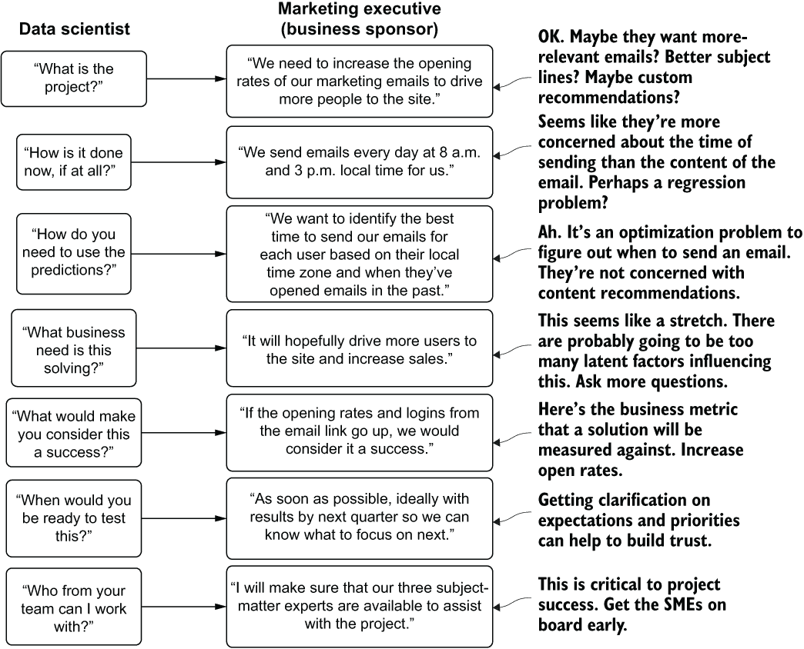

图 1.4 简化规划讨论图

如您从右侧展示的 DS 内部独白中可以看到，当前的问题根本不在最初假设的列表中。没有关于电子邮件内容、与主题行相关性的讨论，也没有关于电子邮件中条目的讨论。这是一个简单的分析查询，旨在确定客户所在的时区，并分析每个客户在本地时间的历史开启情况。通过花几分钟时间规划和全面理解用例，节省了数周（如果不是数月）的无效努力、时间和金钱。

通过关注**将要建设的内容**和**为什么需要建设它**，DS 团队和业务部门都能够更有效地引导讨论。避免讨论**如何建设**的问题，可以使 DS 团队成员专注于问题本身。忽略**由谁在何时完成**的问题，有助于业务部门保持对项目需求的关注。

在项目这个阶段避免讨论实施细节，不仅对团队专注于问题至关重要。将算法和解决方案设计的神秘细节排除在更大团队的讨论之外，可以保持业务单元成员的参与度。毕竟，他们真正关心的不是混合了多少个鸡蛋，鸡蛋是什么颜色，甚至是什么物种下的蛋；他们只想在完成时吃到蛋糕。在第一部分的剩余部分，我们将详细讨论规划过程、与内部业务客户进行项目期望讨论以及与非技术受众进行关于机器学习工作的通用沟通。

### 1.2.2 范围和调研

*如果在开发过程中半途改变方法，你将不得不面对与业务部门的艰难对话，解释项目延误是由于你没有做好作业。*

总的来说，内部客户（业务单元）对项目只有两个问题：

+   这能解决我的问题吗？

+   这需要多长时间？

让我们看看另一个可能熟悉的场景，以讨论 ML 项目开发这个阶段可能出现的两种截然不同的错误方式。假设我们有一家公司的两个 DS 团队，每个团队都被置于对立面，以开发解决公司账单系统中日益严重的欺诈行为的解决方案。团队 A 的调研和范围过程如图 1.5 所示。

图 1.5 初级团队的数据科学家（有良好意图但缺乏经验）对欺诈检测问题的调研和范围

A 团队主要由初级数据科学家组成，他们中的所有人进入职场时都没有在学术界度过一段长时间。在获得项目细节和他们的期望后，他们的行动是立即查阅博客文章。他们在互联网上搜索“检测支付欺诈”和“欺诈算法”，找到了来自咨询公司的数百个结果，几篇来自类似初级数据科学家的极高层次的博客文章，这些初级数据科学家可能从未将模型投入生产，以及一些基本的开源数据示例。

与此相反，B 团队由一群博士级别的学术研究人员组成。他们的研究和范围界定如图 1.6 所示。

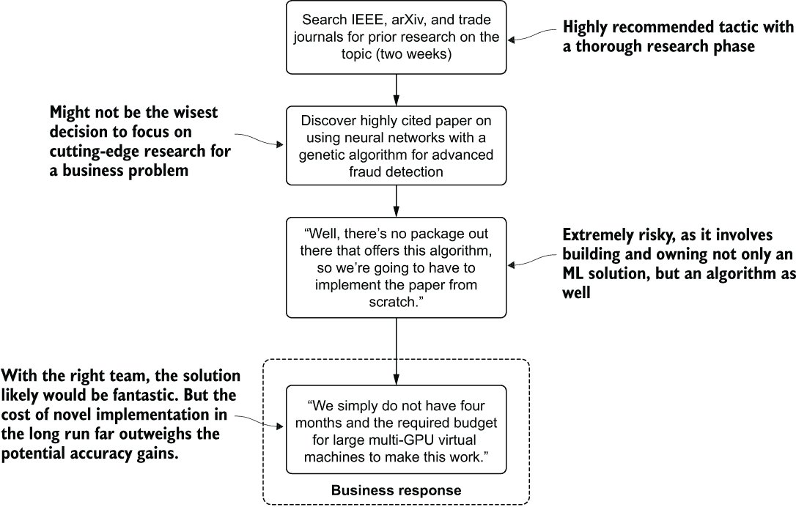

图 1.6 针对学术研究团队针对欺诈检测问题的研究和范围界定

B 团队对研究和想法的严谨态度，首先的行动是深入研究关于欺诈建模主题的已发表论文。经过几天阅读期刊和论文，这些团队成员现在掌握了一大堆理论，涵盖了检测欺诈活动的一些最前沿的研究。

如果我们要求任何一队估算出产生解决方案所需的工作量，我们会得到截然不同的答案。A 团队可能会估计大约需要两周时间来构建其 XGBoost 二分类模型，而 B 团队则会讲述一个截然不同的故事。这些团队成员会估计需要几个月时间来实现、训练和评估他们在一份备受推崇的论文中发现的创新深度学习结构，该论文的研究证明其准确性显著优于任何 Perforce 实现的算法。

在范围界定和研究方面的问题在于，这两个截然不同的方面都可能导致项目失败，原因完全不同。A 团队可能会失败，因为问题的解决方案比博客文章中展示的例子**要复杂得多**（仅平衡类别问题就是一个过于复杂的话题，难以在博客的简短篇幅中有效记录）。尽管 B 团队的解决方案可能非常准确，但公司作为初始的欺诈检测服务，**永远不会分配资源来构建风险解决方案**。

对于机器学习项目来说，范围界定极具挑战性。即使是经验丰富的机器学习老手，预测一个项目需要多长时间，哪种方法最可能成功，以及需要多少资源，都是一项徒劳且令人沮丧的练习。做出错误断言的风险相当高，但合理地构建范围界定和解决方案研究可以帮助最小化估计失误的可能性。

大多数公司都拥有这种夸张场景中的人的类型混合。有些人是为了进一步推进算法的知识和研究进步，为行业内的未来发现铺平道路的学者。其他人则是“机器学习应用”工程师，他们只想将机器学习作为解决业务问题的工具。在 ML 工作中，重要的是要接受并平衡这些哲学观点的各个方面，在项目的研究和规划阶段达成妥协，并知道这里的中间地带是确保项目真正投入生产的最佳途径。

### 1.2.3 实验

*测试方法是一种金发姑娘活动；如果你测试的选项不够多，你很可能找不到最佳解决方案，而测试太多东西则浪费宝贵的时间。找到中间地带。*

在实验阶段，项目失败的最大原因要么是实验时间过长（测试太多东西或花费太多时间微调方法），要么是原型开发不足，糟糕到业务决定转向其他事情。

让我们用一个类似的例子来阐述，说明这两家公司如何在一个试图为检测零售店货架上的产品构建图像分类器的公司中发挥作用。这两个小组采取的实验路径（显示了实验的极端对立面）如图 1.7 和 1.8 所示。

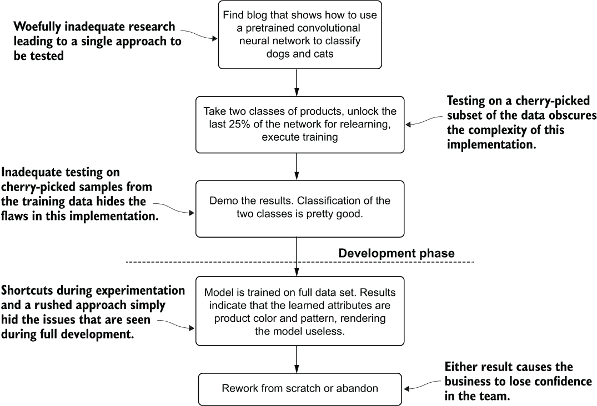

图 1.7 不经验丰富的数据科学家团队匆忙的实验阶段

团队 A 体现了在项目早期阶段完全不足的研究和实验的例子。一个在解决方案开发的关键阶段草草了事的项目，如图 1.7 所示，面临着结果严重不成熟，以至于与业务无关的风险。这样的项目会削弱业务对 DS 团队的信心，浪费金钱，并无谓地消耗多个团队的宝贵资源。

这些缺乏经验的数据科学团队成员只进行最肤浅的研究，从博客文章中改编了一个基本的演示。虽然他们的基本测试显示出希望，但他们未能彻底研究在他们的数据上应用模型所需的实现细节。通过仅在他们图像库中的成千上万种产品中的两种产品上重新训练预训练模型，他们误导的结果掩盖了他们方法中的问题。

这与另一支队伍的情况正好相反。团队 B 处理这个问题的方法如图 1.8 所示。

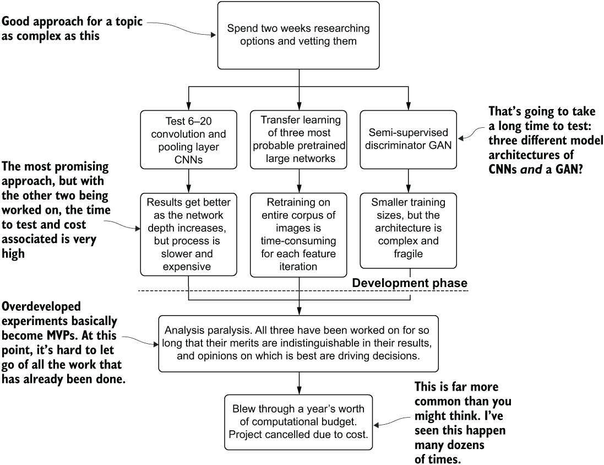

图 1.8 项目实验阶段过度测试的案例

B 团队解决这个问题的方法是在数周内搜索最新的论文、阅读期刊，并理解涉及各种卷积神经网络（CNN）和生成对抗网络（GAN）方法的原理。他们确定了三种广泛的潜在解决方案，每个解决方案都包含需要运行和评估其整个训练图像数据集的多个测试。

在这种情况下，失败并不是因为研究的深度，就像其他团队一样。B 团队的问题在于他们的最小可行产品（MVP），因为他们试图在深度上尝试太多事情。为了解决他们试图解决的问题，调整自定义构建的 CNN 的结构和深度需要数十次（如果不是数百次）迭代才能正确。这项工作应该纳入项目的开发阶段，而不是在评估阶段，在基于早期结果选择了一种方法之后。

虽然不是项目失败的主要原因，但实验阶段的不正确实施可能会阻碍或取消本应很棒的项目。这两个极端例子都不合适，最好的做法是在两者之间采取适度的方法。

### 1.2.4 开发

*没有人会在周六凌晨 4 点，已经调试失败 18 个小时，仍然没有修复错误时认为代码质量很重要。*

对于机器学习项目来说，不良的开发实践可能会以多种方式表现出来，这些方式可能会完全摧毁一个项目。尽管通常不像其他一些主要原因那样直接可见，但脆弱且设计不良的代码库以及不良的开发实践会使项目更难工作，更容易在生产中崩溃，并且随着时间的推移，改进起来也更加困难。

例如，让我们看看在建模解决方案开发过程中经常出现的一种相对简单且常见的修改情况：特征工程的变更。在图 1.9 中，我们看到两位数据科学家试图在一个单体代码库中做出一系列修改。在这种开发模式中，整个工作的所有逻辑都通过脚本变量声明和函数写在一个单独的笔记本中。

朱莉在单体代码库中可能需要进行大量的搜索和滚动，找到特征向量定义的每个单独位置，并将她的新字段添加到集合中。她的编码工作必须正确，并且需要在脚本中的正确位置进行。对于任何足够复杂的机器学习代码库来说，这是一项艰巨的工作（因为特征工程和建模的代码行数总和可以达到数千行，如果以脚本方式开发的话），并且容易发生遗漏、打字错误和其他转录错误等令人沮丧的错误。

与此同时，Joe 需要做的编辑要少得多。但他仍然需要搜索长代码库并正确地编辑硬编码的值。

单体方法真正的问题在于他们试图将每个更改合并到单个脚本副本中时。由于他们相互依赖对方的工作，他们都必须更新他们的代码，并选择其中一个副本作为项目的 master，将另一个人的工作更改复制进来。这个过程既长又辛苦，浪费了宝贵的发展时间，并且可能需要大量的调试才能正确完成。

图 1.10 展示了维护 ML 项目代码库的另一种方法。这次，模块化的代码架构将图 1.9 中大型脚本内存在的紧密耦合分离出来。

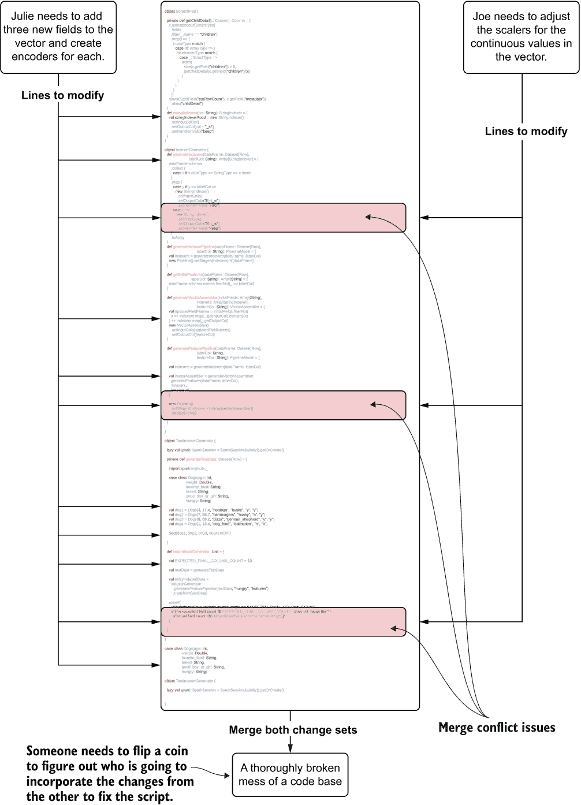

图 1.9 编辑用于 ML 项目工作的单体代码库（脚本）

这个模块化代码库是在集成开发环境（IDE）中编写的。虽然两个数据科学家（DS）所做的更改在本质上与图 1.9 中的更改相同（Julie 正在向特征向量添加一些字段并更新这些新字段的编码，而 Joe 正在更新用于特征向量的缩放器），但将这些更改协同工作所花费的努力和时间却大不相同。

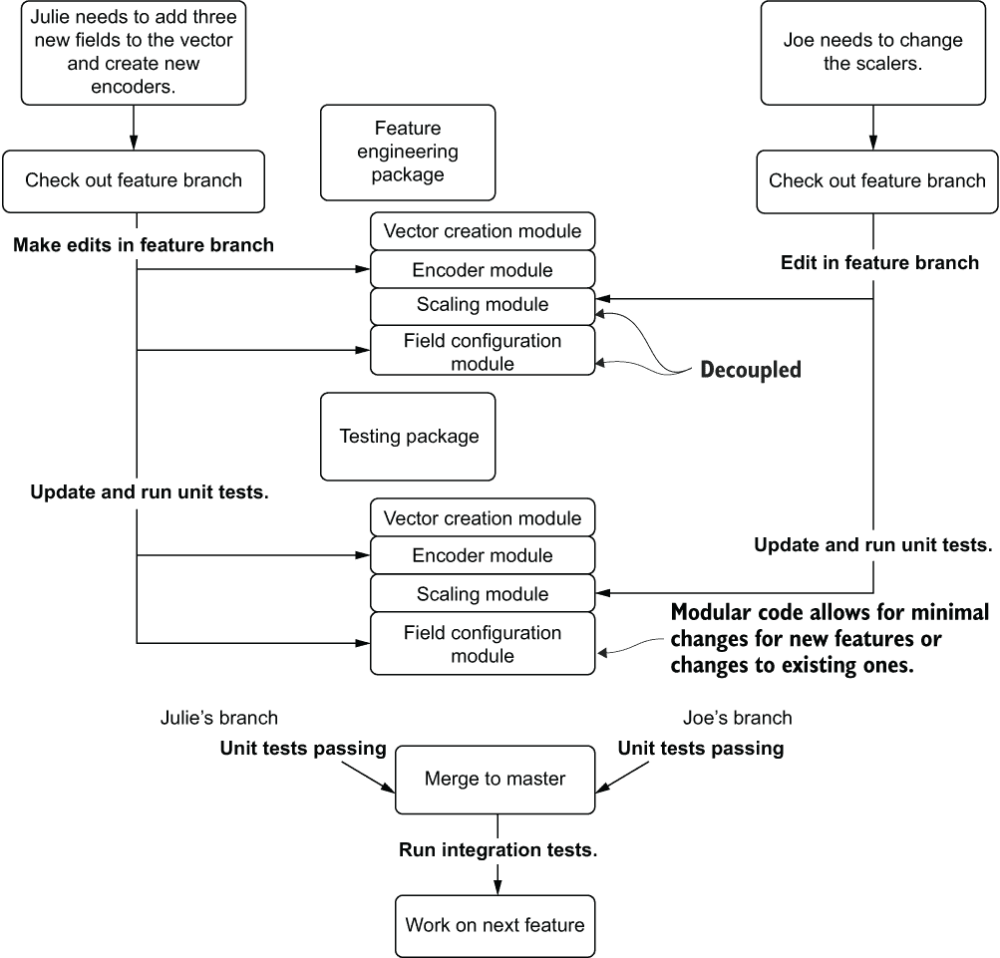

图 1.10 更新模块化 ML 代码库以防止返工和合并冲突

在 Git 中注册了完全模块化的代码库后，他们每个人都可以从主分支检出功能分支，对其功能所属的模块进行小幅度编辑，如果需要的话，编写新的测试，运行他们的测试，并提交拉取请求。一旦他们的工作完成——因为基于配置的代码以及每个模块类中方法的能力，可以通过利用作业配置来对其项目的数据进行操作——每个功能分支都不会影响其他分支，应该按设计正常工作。Julie 和 Joe 可以在单个构建中同时发布他们的更改分支，运行完整的集成测试，并安全地合并到主分支，自信他们的工作是正确的。实际上，他们可以高效地在同一代码库上协作，极大地减少错误发生的可能性，并减少调试代码所花费的时间。

### 1.2.5 部署

*没有围绕部署策略规划项目就像不知道有多少客人会出席的晚宴。你可能会浪费钱或破坏体验。*

对于新团队来说，ML 项目工作中最令人困惑和复杂的部分可能是如何构建一个成本效益高的部署策略。如果它能力不足，预测质量无关紧要（因为基础设施无法正确服务预测）。如果它能力过剩，你实际上是在烧钱购买未使用的基础设施和复杂性。

以一家快餐公司的库存优化问题为例。数据科学团队多年来在为区域分组提供库存管理预测方面相当成功，每周进行大量批量预测，以满足预期顾客数量每日需求的预测，并且每周提交大量提取的预测。直到这一点，数据科学团队已经习惯了类似于图 1.11 所示的 ML 架构。

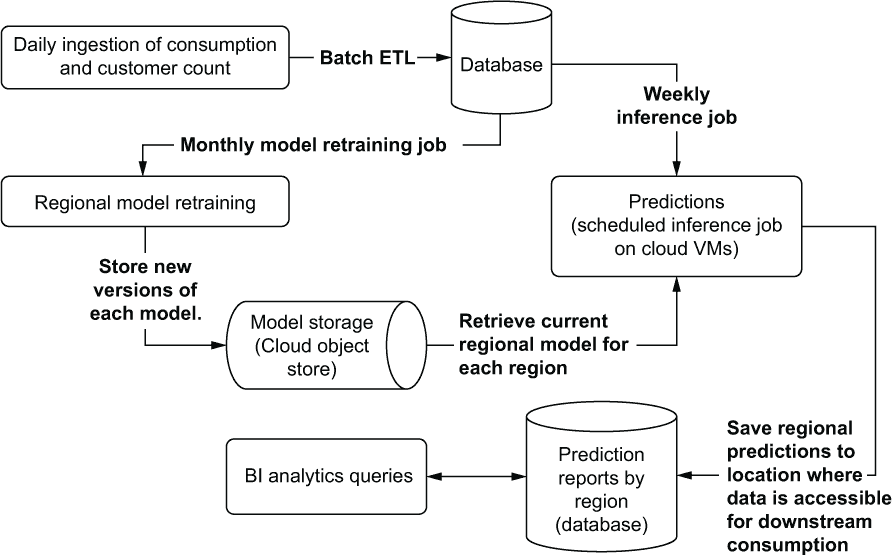

图 1.11 基本的批量预测提供架构

这种为提供计划好的批量预测相对标准的架构，主要关注向内部分析人员暴露结果，他们提供有关订购材料数量的指导。这种预测提供架构并不特别复杂，是数据科学团队成员所熟悉的范例。由于设计的计划同步性质以及后续重新训练和推理之间的大量时间，其技术堆栈的总体复杂性不必特别高（这很好；请参阅以下侧边栏）。

简单架构的简要说明

在机器学习的世界里，构建架构时始终追求尽可能简单的方案。如果项目需要每周进行一次推理的周期性，使用批量处理（而不是实时流）。如果数据量以兆字节计算，使用数据库和简单的虚拟机（而不是 25 节点的 Apache Spark 集群）。如果训练运行时间以分钟计算，坚持使用 CPU（而不是 GPU）。

仅为了使用而使用复杂的架构、平台和技术将不可避免地导致你后悔，因为它向一个已经复杂的解决方案中引入了不必要的复杂性。随着引入的每个新复杂性，出现故障的可能性增加（通常以极其复杂的方式）。为了解决项目即将到来的商业需求，保持技术、堆栈和架构尽可能简单，始终是推荐的最佳实践，以便向企业提供一致、可靠和有效的解决方案。

随着公司随着时间的推移认识到这些批量方法在预测建模方面的好处，其对数据科学团队（DS team）的信心也在增加。当出现新的商业机会，需要针对每个门店进行近实时库存预测时，公司高管会要求数据科学团队为这一用例提供解决方案。

机器学习团队明白，他们标准的预测服务架构不适用于这个项目。他们需要构建一个 REST 应用程序编程接口（API），以支持预测数据的请求量和预测更新频率。为了适应每个门店库存预测的粒度级别（以及其中涉及的不稳定性），团队知道他们需要在一天中频繁地重新生成预测。有了这些要求，他们寻求公司一些软件工程师的帮助，并构建出解决方案。

直到上线后的第一周，企业才意识到实施云计算的成本比更高效的库存管理系统节省的成本高出整整一个数量级。新的架构，以及解决该问题所需的自回归积分移动平均（ARIMA）模型，如图 1.12 所示。

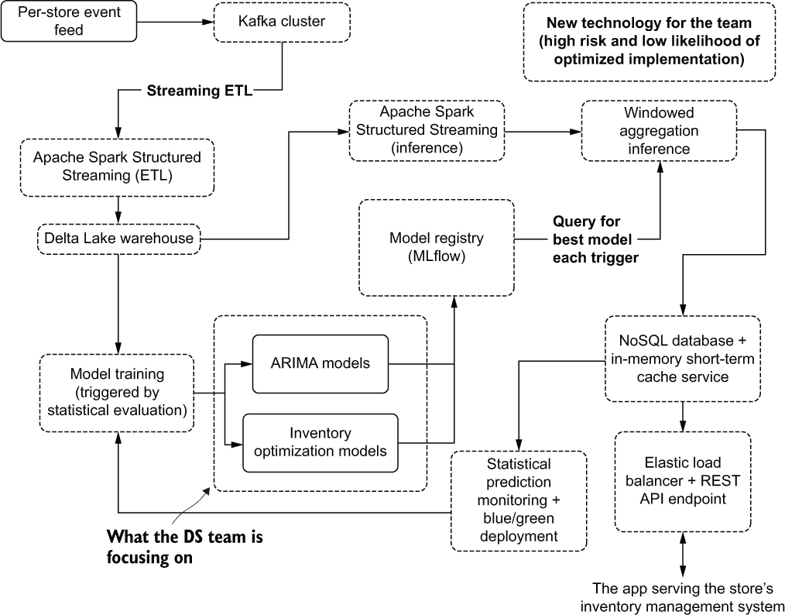

图 1.12 满足项目业务需求所需的更加复杂的伪实时服务架构

项目取消和为降低成本而对该实施架构进行完全重新设计的情况并不少见。这是一个在实施机器学习以解决新问题和有趣问题（而且公平地说，我在职业生涯中亲自造成了三次）的公司中反复出现的故事。

如果在项目开始时不专注于部署和服务，那么构建一个低效的解决方案——不符合服务级别协议（SLA）或流量需求，或者过度设计的解决方案——以不可接受的高成本超出技术规范的风险是高的。图 1.13 显示了在提供预测结果及其相关成本极端范围时需要考虑的一些（不是全部，无论如何想象）要素。

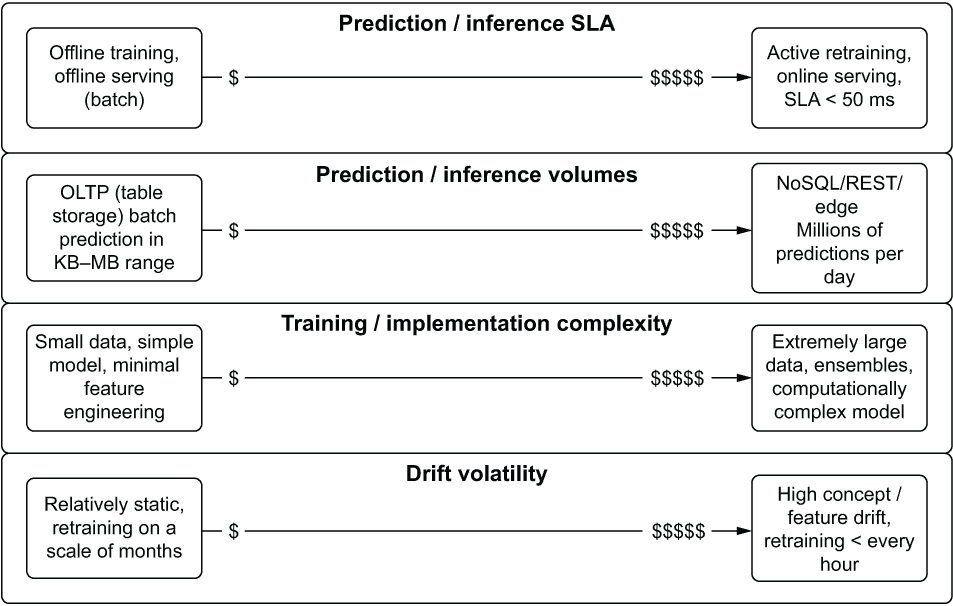

图 1.13 部署成本考虑因素

面对用算法以巧妙的方式解决一个新颖问题的挑战时，考虑成本可能并不特别令人兴奋或重要。虽然数据科学团队可能不会考虑特定项目的总拥有成本，但请放心，高管们会考虑。通过在构建项目的早期阶段尽早评估这些考虑因素，可以进行分析，以确定项目是否值得。

无论如何，在规划的第一周取消一个项目，总比在花费数月构建后关闭生产服务要好。然而，要了解相对昂贵的架构是否值得运行的成本，唯一的方法是衡量和评估其对业务的影响。

### 1.2.6 评估

*如果你无法证明你的项目在生产中的好处，不要期望它在那里停留很长时间。*

导致机器学习项目被取消或放弃的最糟糕的原因是预算。通常情况下，如果项目一开始就进入了生产阶段，那么与开发解决方案相关的初始成本已经被公司领导层接受并理解。由于无法看到其对公司的影响，导致项目在生产过程中被取消，这完全是另一回事。如果你无法证明解决方案的价值，你将面临有人告诉你某天为了省钱而关闭它的真实可能性。

想象一家公司，在过去六个月里，他们不懈地努力通过使用预测模型来提高销售额的新举措。DS 团队在整个项目开发过程中遵循最佳实践——确保他们构建的正是业务所要求的，并将开发努力集中在可维护和可扩展的代码上——并将解决方案推向了生产。

在过去的三个月里，该模型的表现一直非常好。每次团队对预测与现实状态进行事后分析时，预测结果都出奇地接近。然后，图 1.14 以一个简单的问题出现在我们面前，这是公司一位关注运行此机器学习解决方案成本的执行董事提出的问题。

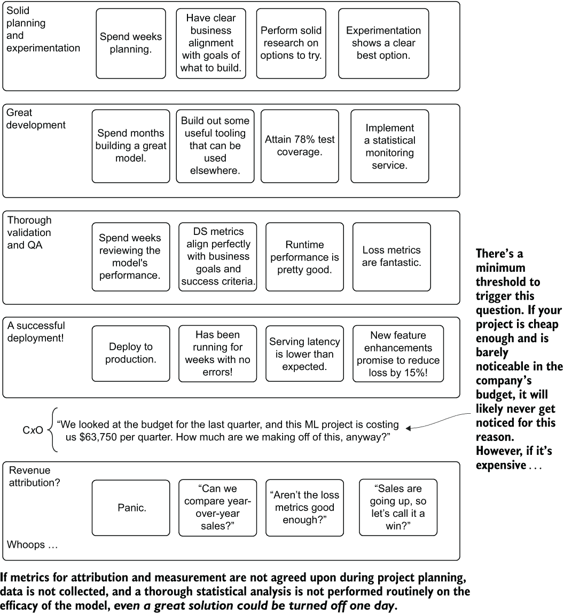

图 1.14 一个几乎完美的机器学习项目因为缺乏 A/B 测试和统计上有效的归因测量而被取消

团队在创建一个伟大的机器学习项目时忘记的一件事是如何将他们的预测与业务的一个方面联系起来，以证明其存在的合理性。他们一直在开发和目前在生产中运行的模型旨在增加收入，但当团队仔细审查使用它的成本时，他们意识到他们还没有想到一个归因分析的方法来证明解决方案的价值。

他们能否简单地将销售额相加，并将其全部归因于模型？不，这甚至完全不正确。他们能否看看销售额与去年相比的情况？这也不正确，因为太多潜在因素正在影响销售额。

他们能做的唯一一件事就是通过进行 A/B 测试和使用合理的统计模型来得出收入提升的计算（包括估计误差），以显示额外销售量有多少是由于他们的模型。然而，船已经开走了，因为解决方案已经对所有客户部署。团队失去了证明模型继续存在的合理性的机会。虽然项目可能不会立即关闭，但如果公司需要减少预算支出，它肯定会在削减名单上。

提前思考和规划这种情况总是一个好主意。无论它是否已经发生在你身上，我可以向你保证，在某个时候，它肯定会发生（我通过两次非常痛苦的教训才学到这个小小的智慧）。如果你有经过验证和具有统计学意义的测试作为弹药，证明模型继续存在的合理性，那么捍卫你的工作会容易得多。第十一章涵盖了构建 A/B 测试系统的方法、归因的统计测试以及相关的评估算法。

## 1.3 机器学习工程的目标

在最基本的意义上，任何数据科学家的主要目标是通过使用统计、算法和预测建模来解决一个对人类来说过于繁重、单调、易出错或复杂的难题。这并不是要构建最花哨的模型，撰写关于他们解决方案的最令人印象深刻的论文，或者寻找最激动人心的新技术来强迫其进入项目工作。

我们所有人都在这个职业中是为了解决问题。在大量可供数据科学家使用的工具、算法、框架和核心责任中，很容易感到不知所措，并专注于工作的技术方面。如果没有流程指南来处理机器学习项目工作的复杂性，很容易失去解决问题的真正目标。

通过关注第 1.2 节中突出显示的项目工作核心方面，并在本书的其余部分进行更详细的阐述，你可以达到机器学习工作的真正期望状态：看到你的模型在生产环境中运行，并解决一个真正的商业问题。

你可以做到这一点

外面有一个完整的行业旨在说服你，你做不到——你需要雇佣他们为你完成所有这些复杂的工作。他们通过这样做赚了很多钱。

但请相信我，你可以学习这些核心概念，并组建一个遵循方法论来处理机器学习工作的团队，这可以显著提高项目的成功率。这项工作可能一开始很复杂，也很令人困惑，但遵循指南并使用合适的工具来帮助管理复杂性，可以帮助任何团队开发出复杂的机器学习解决方案，而不会需要巨额预算或消耗数据科学团队所有的时间来维持那些实施不当的解决方案的运行。你完全能行。

在深入探讨这些机器学习工程方法论和方法的细节之前，请参阅图 1.15 中的详细大纲。这实际上是一个生产机器学习工作的流程计划，我已看到它为任何团队和任何项目证明是成功的。

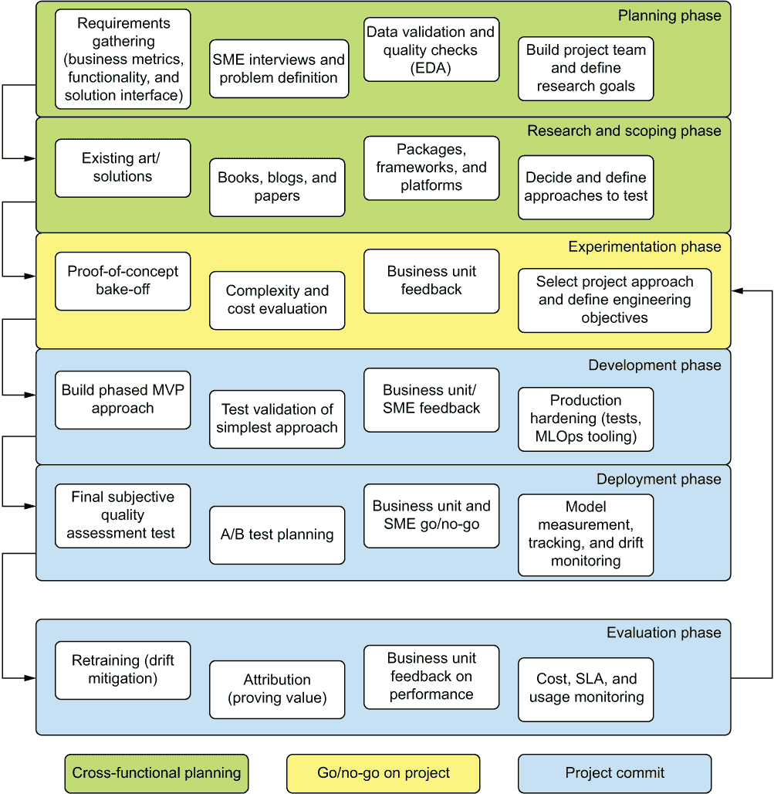

图 1.15 机器学习工程方法论组件图

在本书中，我们将涵盖这些要素，不仅关注每个要素的讨论和实现，还关注它们为什么如此重要。这条道路——关注支持成功机器学习项目的人员、流程和工具——是在我职业生涯中看到的许多失败项目的废墟上铺就的。然而，通过遵循本书概述的实践，你可能会看到更少的这些失败，让你能够构建更多不仅能够进入生产，而且被使用并保持生产的项目。

## 摘要

+   机器学习工程师需要了解数据科学、传统软件工程和项目管理方面的知识，以确保应用机器学习项目能够高效开发，专注于解决实际问题，并且易于维护。

+   在应用机器学习工作的六个主要项目阶段（规划、范围和调研、实验、开发、部署和评估）中始终关注最佳实践，将极大地帮助项目降低放弃的风险。

+   放下对技术实现细节、工具和方法的创新性的担忧，将有助于将项目工作集中在真正重要的事情上：解决问题。
