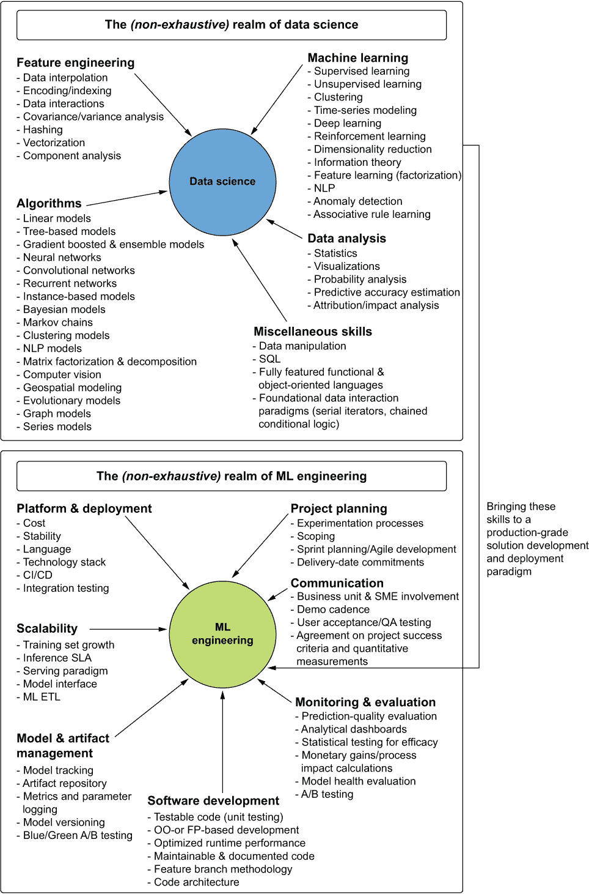
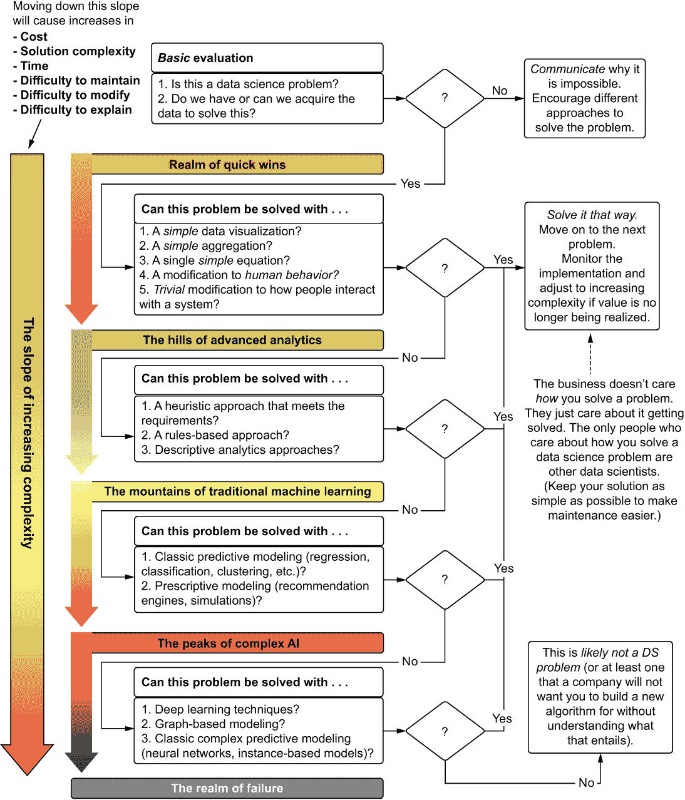
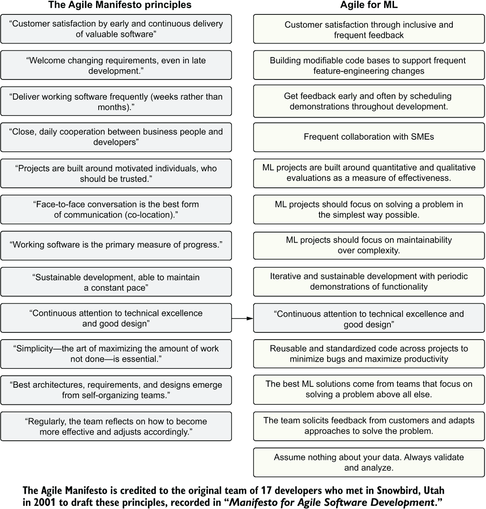
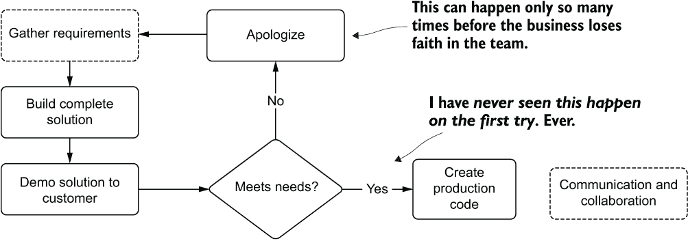
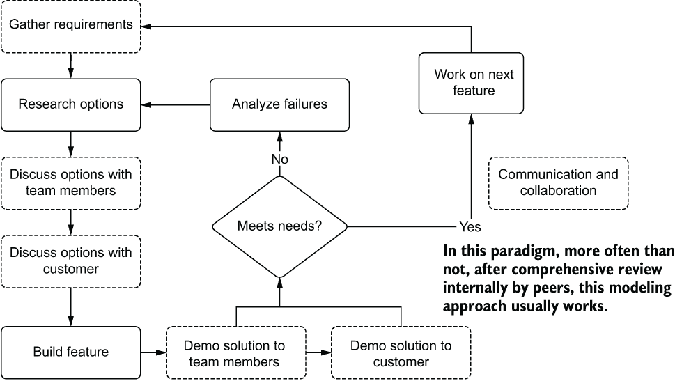
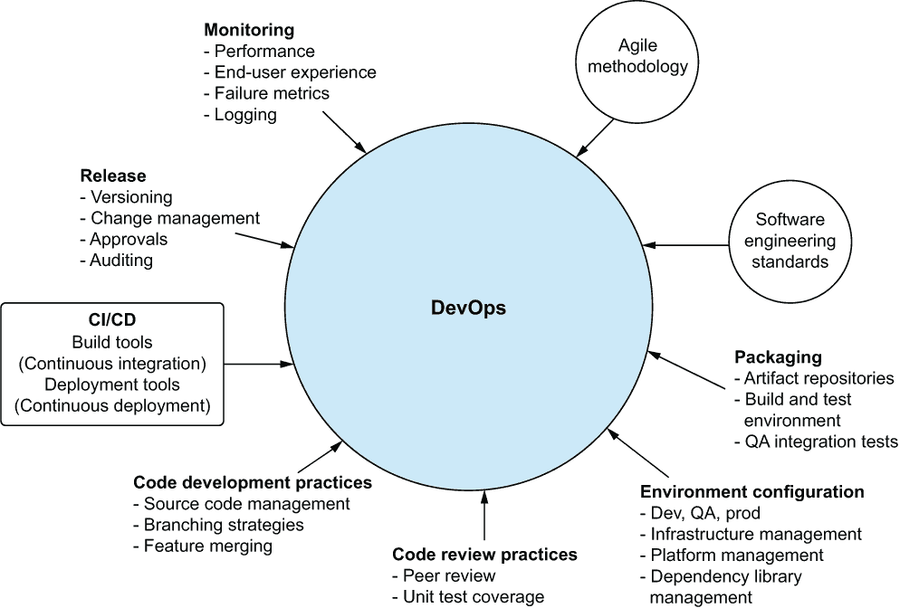
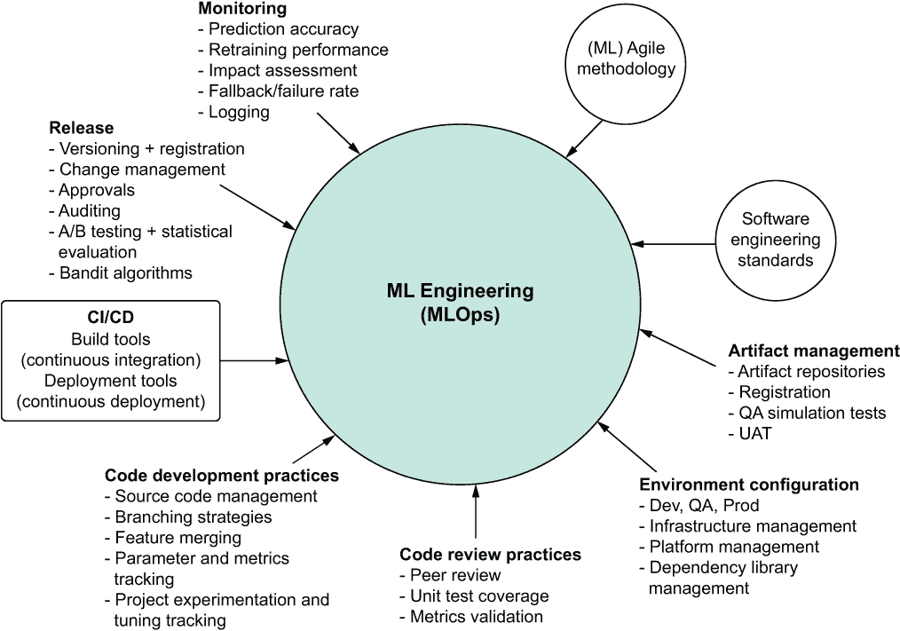

# 2 你的数据科学可能需要一些工程

本章涵盖了

+   阐明数据科学家和机器学习工程师之间的差异

+   在所有项目工作中注重简单性以降低风险

+   将敏捷原则应用于机器学习项目工作

+   阐述 DevOps 和 MLOps 之间的差异和相似之处

在上一章中，我们从项目工作的角度介绍了机器学习工程的组成部分。从项目层面的角度来看，解释这种数据科学工作方法所包含的内容只是故事的一部分。从更高的层面来看，机器学习工程可以被视为一个包含三个核心概念的食谱：

+   技术（工具、框架、算法）

+   人员（协作工作，沟通）

+   流程（软件开发标准，实验严谨性，敏捷方法）

这个职业的简单真理是，专注于每个这些要素的项目工作通常都是成功的，而那些省略一个或多个要素的项目往往失败。这正是工业界机器学习项目高得令人难以置信且经常引用的失败率的原因（我认为这相当自私，并且当来自供应商营销材料时，充满了恐慌）。

本章从高层次上涵盖了这三个成功项目的组件。采用适当的平衡，专注于创建与内部客户共同开发、协作和包容性的可维护解决方案，将大大增加构建持久机器学习解决方案的机会。毕竟，所有数据科学工作的*主要重点是解决问题*。将工作模式符合一个专注于可维护性和效率的经过验证的方法论，直接转化为以更少的努力解决更多的问题。 

## 2.1 通过增加项目成功的过程来增强复杂职业

在《数据科学、分类及相关方法》（Springer，1996 年），由 C. Hayashi 等人编写的关于术语“数据科学”的最早定义中，三个主要关注点如下：

+   *数据设计*——具体来说，围绕如何收集信息和需要以何种结构获取信息以解决特定问题的规划

+   *数据收集*——获取数据的行为

+   *数据分析*——通过使用统计方法从数据中获取见解以解决问题

现代数据科学的大部分内容主要集中在这三个项目中的最后一个（尽管在许多情况下，数据科学团队被迫开发自己的 ETL），因为前两个通常由现代数据工程团队处理。在这个广泛的术语中，“数据分析”，现代数据科学的一个主要焦点：应用统计技术、数据操作活动以及统计算法（模型）来从数据中获取见解并对其做出预测。

图 2.1 的上半部分（以故意简明扼要和高度概括的方式）展示了现代数据科学家从技术角度的关注点。这些是人们在谈论我们所做的工作时最关注的职业要素：从数据访问到构建复杂的预测模型，利用令人眼花缭乱的算法方法和高级统计学。这并不是对数据科学家在实际项目工作中所做工作的特别准确的评估，而是关注了一些在解决问题中使用的任务和工具。以这种方式思考数据科学几乎和通过列出语言、算法、框架、计算效率以及他们职业的其他技术考虑因素来分类软件工程师的工作一样没有帮助。

图 2.1 软件工程技能与 DS 融入 ML 工程师角色的融合

我们可以在图 2.1 中看到，DS 的技术关注点（许多从业者专注于这一点）只是下半部分所示更广泛系统的一个方面。正是在这个区域，ML 工程，互补的工具、流程和范式提供了一个指导框架，这个框架在 DS 技术的核心方面得到根本性的支持，以更建设性的方式工作。

作为一种概念，ML 工程是一种范式，它帮助从业者关注项目工作中真正重要的方面：提供真正有效的解决方案。那么，从哪里开始呢？

## 2.2 简单性的基础

当真正解释数据科学家做什么时，没有比“他们通过将数学创造性地应用于数据来解决问题”更简洁的描述了。尽管这个描述很广泛，但它反映了从记录的信息（数据）中可以开发出的广泛解决方案。

在追求解决商业问题的过程中，关于 DS 在算法、方法或技术方面的期望没有任何规定。事实上，恰恰相反。*我们是问题解决者*，利用各种技术和方法。

对于数据科学领域的初学者来说，不幸的是，许多数据科学家认为，只有当他们使用最新的“最伟大”的技术时，他们才为公司提供价值。与其关注在权威白皮书或博客文章中大量宣传的新方法周围的最新炒作，经验丰富的数据科学家意识到，真正重要的是解决问题的行为，无论方法如何。尽管新技术和方法令人兴奋，但一个 DS 团队的有效性是通过它提供的解决方案的质量、稳定性和成本来衡量的。

如图 2.2 所示，机器学习工作中最重要的部分之一是在面对任何问题时导航复杂性的路径。通过以这种心态——将最简单的解决方案作为机器学习原则的基石（关注解决业务问题的最简单方案）——来处理每个新的业务请求，可以专注于解决方案本身，而不是特定的方法或新算法。

图 2.2 构建机器学习问题的最简单解决方案指南

围绕这一原则——追求尽可能简单的实现来解决问题——是构建所有其他机器学习工程方面的基础。这无疑是机器学习工程最重要的一个方面，因为它将影响项目工作的所有其他方面，包括范围界定和实施细节。尽早退出路径可能是决定项目是否失败的最大驱动因素。

“但如果解决方案没有使用 AI，那就不是数据科学工作”

我从未带着使用技术、特定算法、框架或方法的期望进入这条职业道路。我遇到过很多人是这样做的，而且在我所知道的一些人的整个职业生涯中，他们最终对他们在工作中实际上使用到的特定框架或库的少之又少感到惊讶。他们中大多数人对他们花在编写 SQL、对他们的数据进行统计分析以及清理杂乱数据以解决问题所花费的大量时间感到特别惊讶。

我想，我之所以从未有过许多同行在“现实世界”中不经常应用前沿方法时所经历的那种看似令人泄气的经历，是因为我在进入机器学习之前先从事了数据分析工作。在我转向这个领域的早期，我就意识到，解决问题的最简单方法总是最好的方法。

这个原因很简单：我必须维护解决方案。无论是每月、每日还是实时，我的解决方案和代码都是我需要调试、改进、解决不一致性以及坦白地说，只是保持运行的东西。一个解决方案越复杂，诊断失败所需的时间就越长，调试就越困难，更改其内部逻辑以添加功能就越令人沮丧。

追求解决方案简单性的目的（即仍然解决问题的最简单设计和方法）直接转化为在维护已解决的问题上花费的时间更少。这让你有更多的时间去解决问题，为公司带来更多价值，并且通常让你接触到更多的问题。

我多次看到人们对使用令人兴奋的算法的热情表现不佳。其中一个更引人注目的是一个用于图像分辨率提升的生成对抗网络（GAN），一个由 12 名数据科学家组成的团队花费了 10 个月才达到生产就绪和可扩展的状态。在与他们的高层管理人员交谈时，他们说他们正在招聘顾问来构建流失模型、欺诈模型和收入预测模型。他们认为，由于他们内部团队忙于研发项目，他们不得不聘请外部顾问来完成重要的关键建模工作。在与那家公司合作的前 12 周内，整个数据科学团队被解雇，图像项目被放弃。

有时，专注于为公司带来巨大价值的基本事物可以帮助你保住工作（这并不是说预测、流失和欺诈建模很简单，即使它们看起来并不特别有趣）。

## 2.3 借鉴敏捷软件开发的原则

开发运维（DevOps）将指导原则和成功的工程工作范式引入到软件开发中。随着敏捷宣言的出现，经验丰富的行业专业人士意识到了软件开发方式的不足。我和我的同事们尝试将这些指导原则应用于数据科学领域，如图 2.3 所示。

图 2.3 将敏捷宣言元素应用于机器学习项目工作

通过对敏捷开发原则的轻微修改，我们为将数据科学应用于商业问题建立了一套规则。我们将涵盖所有这些主题，包括为什么它们很重要，并给出如何在本书中应用它们以解决问题的事例。虽然其中一些与敏捷原则有显著差异，但它们在机器学习项目工作中的适用性为我们和许多人提供了可重复的成功模式。

然而，当应用于机器学习项目工作时，敏捷开发的两个关键点可以显著改善数据科学团队的工作方式：沟通与合作，以及拥抱和期待变化。我们将在下一节探讨这些内容。

### 2.3.1 沟通与合作

正如本书多次讨论的那样（尤其是在接下来的两章中），成功的机器学习解决方案开发的核心原则集中在人身上。这对于一个深深植根于数学、科学、算法和巧妙编码的职业来说可能看起来非常反直觉。

事实是，对问题解决方案的质量实施永远不会在真空中产生。我所参与或看到他人实施的最成功的项目是那些更关注人和项目及其状态的相关沟通，而不是围绕解决方案开发的技术和正式流程（或文档）。

在传统的敏捷开发中，这一点非常正确，但对于机器学习工作来说，编码解决方案的人员与解决方案的目标用户之间的互动更为关键。这是由于构建解决方案所涉及内容的复杂性。由于绝大多数机器学习工作对一般公众来说相当陌生，需要多年的专注学习和持续学习才能掌握，因此我们需要付出更大的努力，以进行有意义的和有用的讨论。

在确保项目成功且重工作最少的情况下，最大的推动因素是机器学习团队与业务部门之间的**协作参与**。确保成功的第二大因素是机器学习团队内部的**沟通**。

以孤狼心态（这在大多数人的学术生涯中一直是焦点）来处理项目工作，对于解决困难问题是无效的。图 2.4 说明了这种风险行为（我在职业生涯早期做过，并看到其他人做过几十次）。

图 2.4 在独立工作于完整的机器学习解决方案中所学到的艰难教训。这种情况很少会有好结果。

这种开发风格的原因可能很多，但最终结果通常相同：要么是大量的重工作，要么是业务部门的大量挫败感。即使数据科学团队没有其他成员（一个“团队”只有一个人），请求同行评审并向其他软件开发人员、架构师或业务部门中为该解决方案构建的部门的专业人士展示解决方案，也可能是有帮助的。

你最不想做的事情（相信我，我做过，结果很糟糕）是收集需求然后直接去键盘解决问题，而不与任何人交谈。满足所有项目需求、正确处理边缘情况以及构建客户期望的产品，这些可能性极小，如果一切顺利，也许你应该考虑买一些彩票，用你所有多余的运气。

一个更全面且与敏捷开发流程相匹配的机器学习开发过程，与通用软件开发中的敏捷开发非常相似。唯一的区别是，对于软件开发来说，可能不需要额外的内部演示级别（通常一个同行评审的功能分支就足够了）。对于机器学习工作来说，展示性能作为影响输入到代码中的数据的函数，演示功能，以及展示输出可视化非常重要。图 2.5 展示了基于敏捷的机器学习工作的一种更可取的方法，该方法高度重视内部和外部合作与沟通。

图 2.5 机器学习敏捷特征创建过程，侧重于需求收集和反馈

团队成员之间更高的互动水平几乎总是会导致更多想法、观点和对假设事实的挑战，从而产生更高品质的解决方案。如果你选择让你的客户（请求你帮助的业务单元）或你的同事（即使在开发选择中的细节）不参与讨论，那么你构建的可能是他们没有预期或渴望的东西。

### 2.3.2 接受并预期变化

在实验和项目方向上，以及在项目开发过程中，做好充分准备并预期不可避免的变化发生，这一点至关重要。在我参与过的几乎所有机器学习（ML）项目中，项目开始时设定的目标最终都没有完全实现。这适用于从具体技术、开发语言和算法，到对数据的假设或期望——有时甚至包括最初使用机器学习（ML）来解决问题（例如，一个简单的聚合仪表板，帮助人们更有效地解决问题）。

如果你为不可避免的变化做好准备，你就可以帮助聚焦于所有数据科学（DS）工作中最重要的目标：解决问题。这种期望还可以帮助将注意力从无关紧要的元素（例如，哪种花哨的算法、酷炫的新技术或惊人的强大框架来开发解决方案）上移开。

如果没有预期或允许变化发生，关于项目实施的决定可能会使修改变得极其困难（或不可能），除非对之前完成的所有工作进行全面重写。通过思考项目方向可能如何变化，工作被迫更多地采用模块化格式，将功能松散耦合的片段，从而减少方向性转变对已完成工作其他部分的影响。

敏捷拥抱这种松散耦合设计和在迭代冲刺中构建新功能的概念，即使在面对动态和不断变化的需求时，代码仍然能够正常工作。将这种范式应用于机器学习（ML）工作，可以相对简化突然甚至较晚出现的变更——当然，在合理范围内。（从基于树的算法迁移到深度学习算法不可能在两周内完成。）虽然简化了，但这*并不保证简单*。事实很简单，预测变化并构建支持快速迭代和修改的项目架构将使开发过程变得更加容易。

## 2.4 机器学习工程的基础

现在你已经看到了将敏捷原则应用于机器学习（ML）的 DS 工作基石，让我们简要地看一下整个生态系统。这个项目工作系统通过我在行业中构建的许多经历，已经证明是成功的，这些经历旨在解决问题的弹性和有用解决方案。

如本章引言中所述，机器学习操作（MLOps）作为一种范例的想法根植于 DevOps 应用于软件开发中类似原则的应用。图 2.6 显示了 DevOps 的核心功能。

图 2.6 DevOps 的组件

比较这些核心原则，正如我们在第 2.3 节中与敏捷方法所做的那样，图 2.7 展示了数据科学版本的 DevOps：MLOps。通过合并和整合这些元素，可以完全避免 DS 工作中的最灾难性事件：消除失败、取消或未被采用解决方案。

图 2.7 将 DevOps 原则应用于机器学习项目工作（MLOps）

在本书中，我们将不仅涵盖为什么这些元素都很重要，还会展示有用的示例和实际应用，您可以跟随这些示例来进一步巩固这些实践在自己的工作中。毕竟，所有这些的目标是让您成功。实现这一目标最好的方式是帮助您通过提供如何处理项目工作的指南，使您的业务成功，该指南将用于使用、提供价值，并且尽可能容易维护，对您和您的数据科学团队同事来说也是如此。

## 摘要

+   机器学习工程将数据科学家、数据工程师和软件工程师的核心功能能力整合到一个混合角色中，该角色支持创建专注于通过专业软件开发严格性解决问题的机器学习解决方案。

+   开发最简单的解决方案有助于降低任何给定项目的开发、计算和运营成本。

+   将敏捷的基本原则借鉴和应用于机器学习项目工作有助于缩短开发周期，迫使开发架构更容易修改，并强制执行复杂应用程序的可测试性，以减少维护负担。

+   正如 DevOps 增强软件工程工作一样，MLOps 增强机器学习工程工作。虽然这些范例的许多核心概念是相同的，但管理模型工件和执行新版本持续测试的附加方面引入了细微的复杂性。
