# 3 在建模之前：规划和范围界定一个项目

本章涵盖了

+   为 ML 项目工作制定有效的规划策略

+   使用高效的方法来评估机器学习（ML）问题的潜在解决方案

在机器学习项目的世界中，最大的杀手与大多数数据科学家所想象的毫无关系。这些杀手与算法、数据或技术专长无关。它们与您使用哪个平台无关，也与将优化模型的处理引擎无关。项目未能满足业务需求的最大原因在于任何技术方面的步骤之前：项目的规划和范围界定阶段。

在我们接受的教育和培训过程中，直到成为公司数据科学家（DS）的工作，我们被强调要独立解决复杂问题。将自己孤立并专注于展示在理论理解和算法应用方面的可证明技能，使我们形成了这样的预期：我们在工业界的工作将是一项单独的任务。面对一个问题，我们会想出如何去解决它。

作为数据科学家的生活现实与仅凭个人解决问题的学术方法相去甚远。实际上，这个职业远不止算法和积累如何使用它们的知识。这是一个高度协作和同伴驱动的领域；最成功的项目是由集成团队共同努力、在整个过程中进行沟通而构建的。有时这种孤立是由公司文化强加的（出于错误的目的，有意将团队与其他组织隔离开来，以“保护”团队免受随机项目请求的干扰），有时则是自我强加的。

本章涵盖了为什么这种范式转变——使机器学习团队减少对*如何*（算法、技术和独立工作）的关注，而更多地关注*什么*（关于正在构建的内容的沟通和协作）——可以使项目成功。这种转变有助于减少实验时间，使团队专注于构建适合公司的解决方案，并规划出包含跨职能团队 SME 知识的分阶段项目工作，以极大地提高项目成功的可能性。

这个包容性旅程的开始，即尽可能多地聚集人员，创建一个能够解决问题的功能性解决方案，是在范围界定阶段。让我们将一个缺乏或缺少范围界定和规划的机器学习团队的工作流程（图 3.1）与包括适当范围界定和规划的工作流程（图 3.2）进行对比。

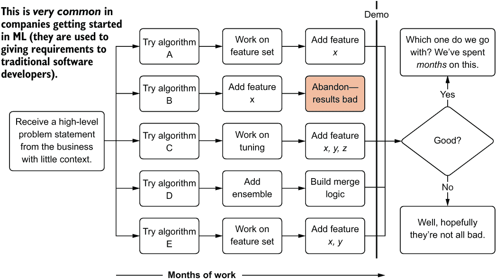

图 3.1 缺乏规划、不恰当的范围界定和缺乏实验流程

这些机器学习团队成员通过绝对不是他们自己的错误（除非我们想责怪团队没有对业务单元施加压力以获取更多信息，而这我们不会做），他们尽最大努力构建几个解决方案来解决向他们抛出的模糊需求。如果他们幸运的话，他们最终会得到四个 MVP，以及三个月的努力浪费在三个永远不会进入生产的解决方案上（大量的浪费工作）。如果他们非常不幸，他们会在没有任何解决问题的解决方案上浪费数月的时间。无论如何，都不会有好的结果。

如图 3.2 所示，适当的范围界定和计划可以显著减少构建解决方案所需的时间。这种变化的最大原因是团队需要验证的总方法更少（所有方法都限制在两周内），主要是因为“尽早和经常”的反馈来自内部客户。另一个原因是，在新的功能开发每个阶段，都会进行快速会议和演示，以便 SMEs 进行验收测试。

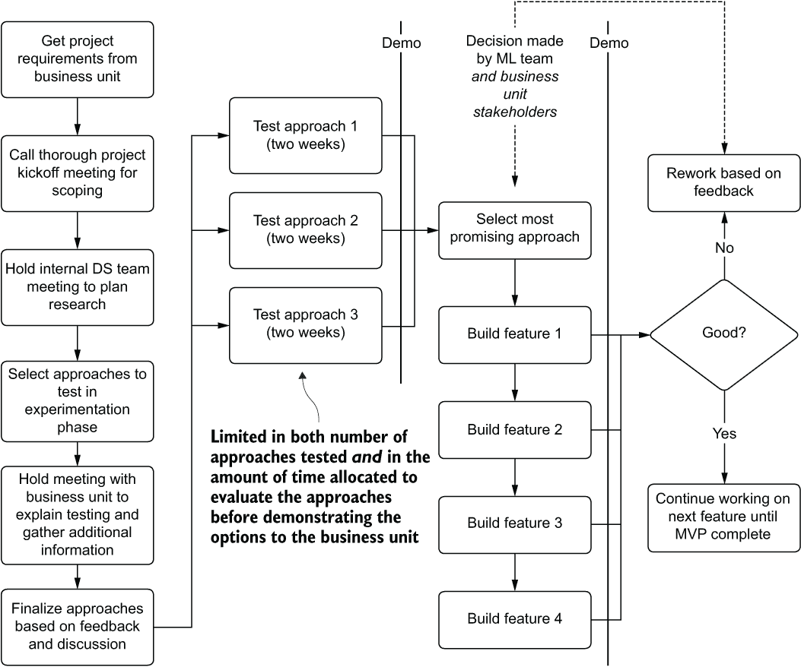

图 3.2 一个彻底的范围界定、计划和协作的机器学习 MVP 项目路线图

为了进一步增加效率的显著提升，这种方法在内部客户包容性方面的另一个重大好处是，最终解决方案满足业务期望的概率显著提高。图 3.1 中显示的极端风险已经消失：经过数月的工作后，展示多个解决方案，却发现整个项目需要从头开始重新启动。

计划、范围界定、头脑风暴和组织会议不是项目经理的事情吗？

一些机器学习实践者可能会对在机器学习项目讨论中包含计划、沟通、头脑风暴和其他项目管理相关的元素表示反对。作为回应，我只能提供另一条轶事证据：在我参与的最成功的项目中，机器学习团队负责人不仅与其他涉及的团队负责人和项目经理紧密合作，还与请求解决方案的部门代表合作。

因为负责人参与了解决方案的项目管理方面，团队通常承受的工作相关波动和返工要少得多。团队成员可以采用整体方法专注于开发，以便将最佳解决方案交付到生产环境中。

相比之下，在孤岛中运作的团队通常难以使项目成功。这种挣扎可能是因为未能将讨论保持在抽象术语上，从而将其他人孤立起来，使他们无法为解决方案贡献想法（例如，机器学习团队将讨论集中在实施细节上，或在会议中过于深入地讨论算法）。此外，“我们不是项目经理……我们的工作是构建模型”的态度可能也起到了作用。在没有适当和有效的沟通模式的情况下，跨职能团队工作的最终结果不可避免地会导致范围蔓延、混乱，以及项目内部子团队之间的普遍社会对抗。

以开放的心态（以及非常开放的心态，倾听和观察他人的观点和想法，无论他们的技术专长如何）和慷慨地接纳跨职能团队中的各种观点，你可能会发现，对于手头的问题，一个简单的解决方案可以出现。正如我将会反复强调（因为它值得重复，作为机器学习实践者的生活格言），最简单的方法就是最好的方法。我发现，大多数情况下，这些启示发生在早期规划和范围界定阶段。

在本章（以及下一章）中，我们将讨论帮助这些讨论的方法，一个我用来指导这些阶段的标准，以及我在这个阶段犯了很多错误后学到的教训。

但如果所有的测试都是垃圾怎么办？

我收到了一些关于图 3.2 的相当一致的反馈。几乎每个参与过真实世界机器学习项目的人都会问这个问题：“好吧，本，限制测试范围确实是个好主意。但如果什么都没用怎么办？那怎么办？”

我对每个人都以同样的方式回应：“你还能做什么其他工作？”

这可能看起来是最荒谬的答案，但它打开了围绕项目的更大元问题。如果对最有希望的测试方法的研究都遇到了失败的结果，那么你试图解决的问题可能从开发努力和时间上讲将非常昂贵。如果项目非常重要，业务坚决要求承担额外测试带来的延误，并且团队有足够的带宽来支持这项额外工作，那么就去做吧。开始新一轮的测试。弄清楚它。如果需要，寻求帮助。

然而，如果项目不符合这些要求，那么向业务解释继续工作的巨大风险是至关重要的。这一评估阶段的重要性不仅仅是因为要做出以下裁决：“我们真的能构建这个吗？”或者“我们甚至知道我们能否构建这个吗？”

如果答案不是响亮的“是”，并且没有定量证据来支持这一说法，那么是时候与业务部门进行大量的坦诚交流，进行更多的概念验证工作，并与项目负责人共同讨论项目周围任何未知元素的风险讨论。

## 3.1 计划：你想要我预测什么？！

在我们深入探讨成功进行机器学习项目规划阶段的方法之前，让我们模拟一下在一个没有建立或证明的流程来启动机器学习工作的公司中，一个典型项目的起源。让我们想象我们是一家电子商务公司，这家公司刚开始尝试现代化其网站。

在看到竞争对手多年来通过在其网站上添加个性化服务来夸大销售增长后，公司的高层管理人员要求公司全力以赴进行推荐。公司的高层管理人员没有人完全清楚这些服务是如何构建的技术细节，但他们都知道首先需要接触的是机器学习专家。业务部门（在这种情况下，销售部门领导、市场营销和产品团队）召开会议，邀请整个机器学习团队，邀请函中除了标题“个性化推荐项目启动”外，几乎没有添加任何额外的色彩。

管理层和您合作过的各个部门都对贵团队构建的小规模机器学习项目（欺诈检测、客户估值估计、销售预测和客户流失概率风险模型）感到满意。从机器学习的角度来看，每个先前项目在复杂程度上各有不同，但基本上都是封闭的——在机器学习团队内部处理，该团队提出了一个可以被各个业务单元消费的解决方案。这些项目都不需要主观质量评估或过多的业务规则来影响结果。这些解决方案的数学纯粹性根本不容争辩或解释；要么是正确的，要么是错误的。

成功的受害者，团队被业务部门提出一个新概念：现代化网站和移动应用程序。高管们已经听说，随着个性化推荐的出现，带来了巨大的销售增长和客户忠诚度，他们希望贵团队为网站和应用程序构建一个集成系统。他们希望每个用户在登录时都能看到一个独特的商品列表。他们希望这些商品对用户来说既相关又有趣，最终，他们希望增加用户购买这些商品的可能性。

在一次简短的会议中，展示了其他网站上的例子后，他们询问系统何时可以准备好。你根据过去阅读的关于这些系统的几篇论文估计大约需要两个月，然后开始工作。团队在接下来的 scrum 会议中制定了一个初步的开发计划，然后每个人都开始努力解决问题。

你和 ML 团队的其余成员都认为管理层正在寻找许多其他网站上显示的行为，即在主屏幕上推荐产品。毕竟，这纯粹是个性化的体现：一个算法预测将对单个用户具有相关性的独特产品集合。你们都同意，这种方法看起来相当直接，团队开始迅速规划如何构建一个数据集，该数据集基于每个网站和移动应用用户的浏览和购买历史，列出每个用户的排名产品键。

稍等一下。规划项目不是与敏捷开发相矛盾吗？

好吧，是的，也不是。引用 Scott Ambler（敏捷基础流程最多产的作家之一）的话：“项目计划很重要，但它不能过于僵化，以至于无法适应技术或环境的变化、利益相关者的优先级以及人们对问题和解决方案的理解。” ([`www.ambysoft.com/essays/agileManifesto.html`](http://www.ambysoft.com/essays/agileManifesto.html))。

在我的职业生涯中，我经常看到这种观点的误解。Ambler 和敏捷宣言的原始创作者指出，项目不应该由一个预先计划且不可更改的元素构建脚本来指导。意图从来不是，也永远不会是根本不规划。这仅仅是为了使创建的计划具有灵活性，以便在需要时进行更改。

如果出现了一种更简单的方法来实现某事，一种在仍然达到相同最终结果的同时减少复杂性的更好方法，那么项目计划应该改变。在机器学习的世界里，这种情况很常见。

也许在项目开始时（在彻底的研究阶段完成之前），跨职能团队确定唯一可能的解决方案是一个高度复杂和复杂的建模方法。然而，在进行了实验之后，团队发现可以开发一个简单的线性方程，以在开发时间和成本的一小部分内以可接受的精度解决问题。尽管最初的计划是使用深度学习来解决问题，但团队可以、应该并且必须转向这个简单得多的方法。计划确实改变了，但如果没有计划，研究和实验阶段就像在夜晚迷失的船只——没有引导，没有方向，在黑暗中混乱地移动。

在机器学习中，规划是好的。但关键是要避免将这些计划固定化。

在接下来的几个冲刺中，*你们都专心致志地独立工作*。你测试了你在博客文章中看到的各种实现，消费了数百篇关于不同算法和解决隐式推荐问题的理论论文，最终使用交替最小二乘法（ALS）构建了一个 MVP 解决方案，实现了 0.2334 的均方根误差（RMSE），以及基于先前行为的有序评分的粗略实现。

带着自信，你相信有令人惊叹的东西可以向业务团队赞助商展示，你带着测试笔记本、显示总体指标的图表以及你相信会真正打动团队的样本推理数据去参加会议。你首先展示了亲和度的总体评分，将数据以 RMSE 图的形式展示，如图 3.3 所示。

图 3.3 为亲和度得分与其预测值之间的 RMSE 的相当标准的损失图表

对展示图表的反应最多是冷淡。提出了许多问题，集中在数据的意义、穿过点的线代表什么以及数据是如何生成的。会议没有聚焦于解决方案和下一个阶段你希望工作的内容（提高准确性），而是开始变成了一团混乱和无聊的混合体。为了更好地解释数据，你展示了一个使用非折扣累积增益（NDCG）指标的非折扣累积增益（NDCG）排名有效性快速表格，以展示随机选择的一个用户的预测能力，如图 3.4 所示。

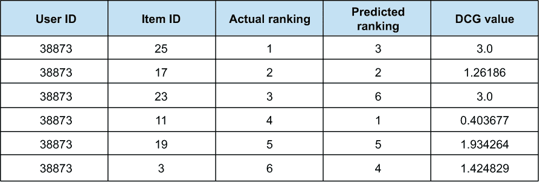

图 3.4 为单个用户的推荐引擎的 NDCG 计算。在没有上下文的情况下，展示这样的原始分数对数据科学团队没有任何益处。

第一张图表引起了一丝困惑，但表格却带来了完全的混乱。没有人理解展示的内容或看到与项目的相关性。大家心中想的只是，“这真的是几周努力的结果吗？数据科学团队这段时间都做了些什么？”

在数据科学团队解释这两个可视化图表的过程中，一位市场分析师开始查看会议提供的样本数据集中某位团队成员账户的产品推荐列表。图 3.5 展示了结果，以及市场分析师在提出列表中每个推荐的产品目录数据时的想法。

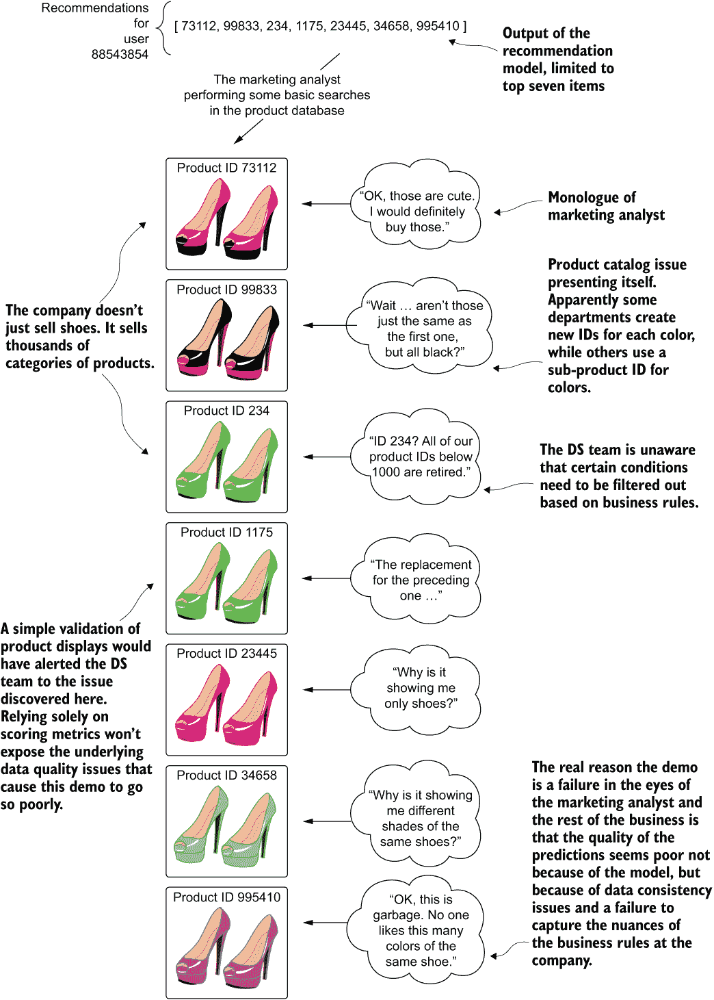

图 3.5 使用视觉模拟进行 SME 定性验收测试

DS 团队从这次会议中学到的最大教训，实际上并不是验证其模型结果的方式，这种方式能够模拟预测的最终用户会如何反应。尽管这是一个重要的考虑因素，并且在接下来的侧边栏中进行了讨论，但它被一个更重要的认识所超越，那就是模型之所以受到如此糟糕的对待，是因为团队没有正确规划这个项目的细微之处。

不要盲目相信你的指标

在进行特别大规模的机器学习时，过分依赖错误指标和模型验证分数是非常诱人的。它们不仅是衡量大型数据集（我们中的许多人现在经常处理）预测客观质量的唯一真正现实的方法，而且往往是评估特定实现预测质量唯一真实、有效的定量方法。

然而，仅仅依赖这些模型评分指标是不够的。当然要使用它们（适用于手头工作的适当指标），但要用额外的手段来获取预测有效性的主观测量。如图 3.5 所示，对单个用户的预测进行简单可视化，比任何预测排序评分算法或损失估计能揭示更多客观和主观的质量评估。

请记住，这种额外的最终用户模拟样本评估不应该由 DS 团队成员执行，除非他们正在评估他们自己被认为是领域专家的数据的预测质量。对于我们在讨论的使用案例，DS 团队应该与几位营销分析师合作，在进行结果展示给更大团队之前，进行一些非正式的质量保证（QA）验证。

DS 团队并没有从了解业务问题的角度理解房间里其他团队成员的看法，这些团队成员知道所有所谓的“尸体”都埋在数据中，并且拥有关于数据性质和产品的累积数十年的知识。这种失败的负担并不完全落在项目经理、DS 团队负责人或任何单个团队成员身上。相反，这是更广泛团队中每个成员的集体失败，因为他们没有彻底定义项目的范围和细节。他们怎么能做得不同呢？

分析师查看自己账户的预测时，发现了许多对他们来说显而易见的问题。他们看到了由于旧产品 ID 的退役而导致的重复项目数据，同样立刻意识到鞋类部门为每种鞋款的颜色使用单独的产品 ID，这些都是导致演示效果不佳的核心问题。所有发现的问题，导致项目取消的高风险，都是由于项目规划不当造成的。

### 3.1.1 项目的基本规划

任何机器学习项目的规划通常从高层次开始。业务部门、高管甚至 DS 团队的一员可能会提出一个想法，即利用 DS 团队的专长来解决一个具有挑战性的问题。虽然在这个早期阶段可能只是一个概念，但这在项目生命周期中是一个关键节点。

在我们一直在讨论的场景中，高层次的想法是*个性化*。对于一个经验丰富的 DS 来说，这可能意味着许多事情。对于业务部门的小专家来说，它可能意味着 DS 团队可能想到的许多相同概念，但也可能不是。从这个想法的早期阶段到甚至基本研究开始之前，这个项目中所有相关人员应该做的第一件事就是开会。这次会议的主题应该集中在一个基本要素上：*我们为什么要构建这个*？

提出这样的问题可能听起来像是一个敌对或对抗性的问题。当听到这个问题时，可能会让一些人感到惊讶。然而，这是最有效和最重要的问题之一，因为它开启了对人们想要构建项目的真正动机的讨论。是为了增加销售额吗？是为了让我们的外部客户更快乐吗？还是为了让人们更长时间地浏览网站？

每个这些细微的答案都可以帮助确定这次会议的目标：*定义任何机器学习工作的输出期望*。这个答案也满足了模型性能的测量指标标准，以及生产中性能的归因评分（这个评分将用于衡量稍后进行的 A/B 测试）。

在我们的示例场景中，团队未能提出这个重要的*为什么*问题。图 3.6 显示了业务方和 ML 方期望的分歧，因为两组都没有讨论项目的本质方面，而是各自陷入了他们自己创造的思维孤岛。ML 团队完全专注于如何解决问题，而业务团队则对交付的内容有期望，错误地假设 ML 团队“自然会明白”。

图 3.6 总结了 MVP 的规划过程。在极端模糊的需求、对原型最小功能的期望缺乏充分沟通，以及未能控制实验复杂性的情况下，演示被认为是一个彻底的失败。防止这种结果只能在项目想法讨论的早期会议中实现。扩大这些期望差距区域的重叠是 DS 团队领导和项目经理的责任。在规划会议结束时，理想的状态是所有人的期望一致（没有人专注于实施细节或可能在未来添加的具体范围外功能）。

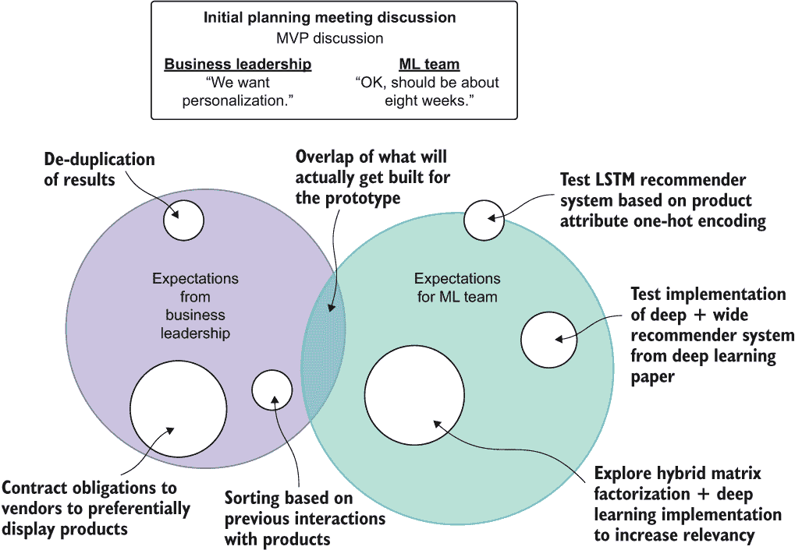

图 3.6 由无效的规划讨论驱动的项目期望差距

在继续这个场景的基础上，让我们看看 MVP 演示反馈讨论，看看在早期规划和范围会议期间可能讨论过的问题。图 3.7 显示了问题及其潜在的根本原因。

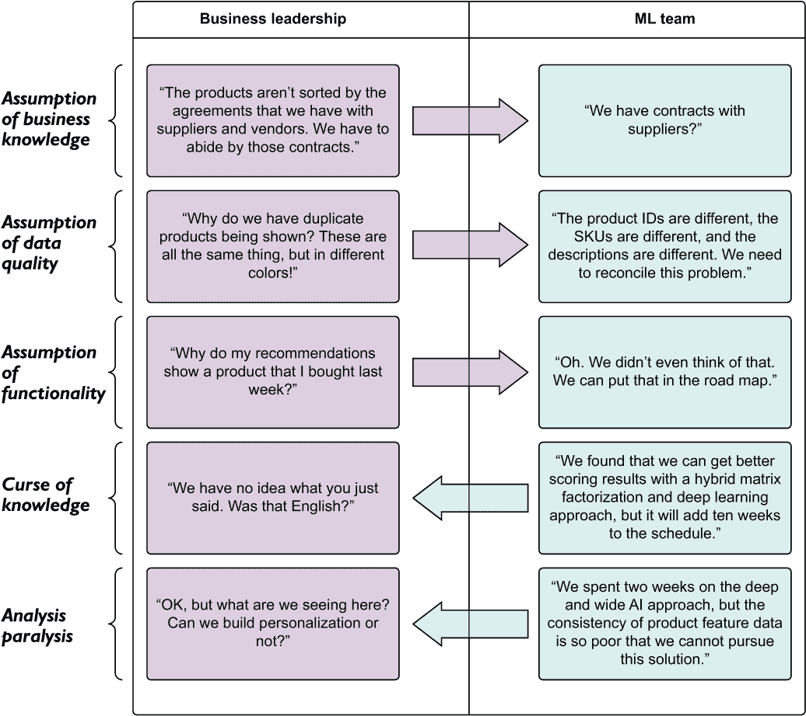

图 3.7 MVP 演示的结果。问题和它们随后的讨论本可以在规划阶段进行，以防止显示的五个核心问题。

尽管这个例子故意夸张，但我发现许多机器学习项目（那些主要不是以机器学习为重点的公司）中存在这种混淆的元素，这是可以预料的。机器学习经常旨在解决的问题很复杂，充满了具体且独特的细节，这些细节对每个业务（以及公司内的每个业务部门）都是特定的，并且充满了关于这些细节的细微差别的错误信息。

重要的是要认识到，这些挑战将是任何项目的必然部分。最大限度地减少它们影响的最佳方式是进行一系列彻底的讨论，旨在尽可能多地捕捉关于问题、数据和预期结果的细节。

假设业务知识

假设业务知识是一个具有挑战性的问题，尤其是对于一个刚开始利用机器学习（ML）的公司，或者对于一个之前从未与 ML 团队合作过的公司业务部门来说。在我们的例子中，业务领导层假设 ML 团队了解业务方面，这些方面是领导层认为普遍公认的知识。由于没有明确和直接的要求被提出，这个假设并没有被识别为一个明确的需求。在数据探索过程中，没有来自业务部门的小型专家（SME）参与指导 ML 团队，因此在构建最小可行产品（MVP）的过程中，他们根本无法了解这些信息。

假设业务知识通常是大多数公司的一条危险道路。在许多公司中，机器学习从业者与业务的内部运作隔绝。他们的主要关注点在于提供高级分析、预测建模和自动化工具，几乎没有时间来理解业务如何运作以及为什么运作的细微差别。虽然一些明显的业务方面是众所周知的（例如，“我们在网站上销售产品*x*”），但期望模型员了解存在一个业务流程，其中某些商品供应商会在网站上被优先推广，而其他供应商则不是，这是不合理的。

获得这些细微差别的一个好方法是让请求为他们构建解决方案的小组（在这种情况下，是产品营销组）的专家解释他们如何决定在网站和应用的每一页上产品的排序。进行这项练习将使房间里的人都能理解可能应用于模型输出的具体规则。

数据质量假设

在演示输出中重复产品列表的责任并不完全在任何一个团队。虽然机器学习团队成员当然可以计划这个问题，但他们并没有精确地意识到其影响范围。即使他们知道了，他们可能也会明智地提到纠正这个问题不会是演示阶段的一部分（因为需要的工作量很大，并且要求原型不要延迟太久）。

这里的主要问题是**没有计划**。由于没有讨论期望，业务领导对机器学习团队能力的信心就会减弱。原型成功的客观衡量标准将主要被忽视，因为业务成员只关注这样一个事实：对于一些用户的样本数据，前 300 个推荐只显示了 80 种颜色和图案中的 4 种产品。

对于我们的用例，机器学习团队认为他们使用的数据非常干净，正如 DE 团队告诉他们的那样。然而，对于大多数公司来说，现实情况比大多数人想象中的要严峻得多，尤其是在数据质量方面。图 3.8 总结了 IBM 和德勤进行的两项行业研究，表明成千上万的公司在机器学习实施方面挣扎，特别是指出数据清洁度方面的问题。在开始构建模型之前检查数据质量非常重要。

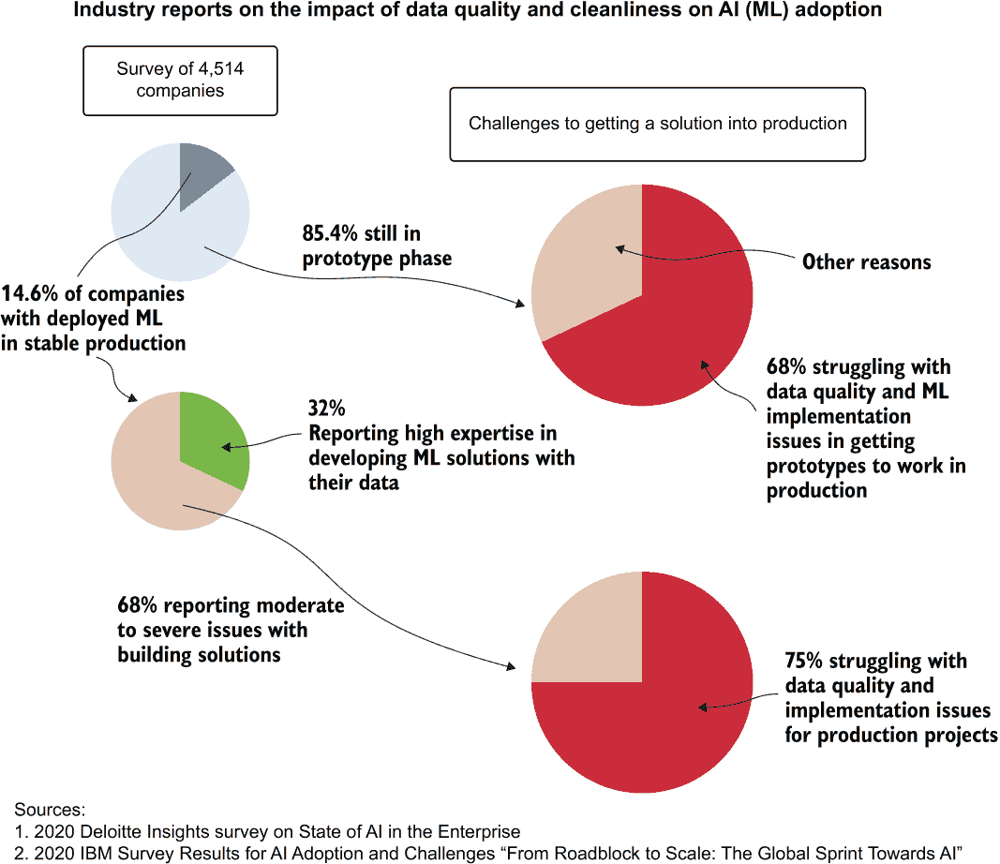

图 3.8 数据质量问题对公司参与机器学习项目工作的影响。数据质量问题很常见，因此在项目工作的早期阶段应该始终对其进行审查。

拥有“完美”的数据并不重要。即使是图 3.8 中那些成功部署许多机器学习模型到生产中的公司，仍然会定期遇到数据质量问题（据报道为 75%）。这些问题只是生成数据的极其复杂系统、多年（如果不是几十年）的技术债务以及设计“完美”系统（不允许工程师生成问题数据）相关的费用所带来的副产品。处理这些已知问题的正确方式是预测它们，在建模开始之前验证任何项目将涉及的数据，并向最熟悉这些数据的专家询问数据性质的问题。

对于我们的推荐引擎，机器学习团队成员未能不仅就他们所建模的数据的性质提出问题（即，“所有产品是否以相同的方式在我们的系统中注册？”），而且还通过分析验证数据。快速统计报告可能已经清楚地揭示了这个问题，特别是如果鞋类的独特产品数量比任何其他类别高得多。在规划会议中提出的“我们为什么卖这么多鞋？”这个问题，可以立即揭示解决这一问题的必要性，同时也导致了对所有产品类别的深入检查和验证，以确保进入模型的数据是正确的。

功能假设

在这个例子中，业务领导者担心推荐的产品是上周购买的。无论产品类型（消耗品或非消耗品），这里的规划失败在于未能表达这种做法对最终用户来说是多么令人不悦。

机器学习团队确保这一关键元素需要成为最终产品的一部分的回应是有效的。在处理过程的这个阶段，虽然从业务部门的角度来看，看到这样的结果令人沮丧，但几乎是不可避免的。在这个讨论方面的前进路径应该是确定功能添加工作范围，决定是否将其包含在未来的迭代中，然后继续下一个话题。

到今天为止，我还没有参与过在演示过程中没有出现这种情况的机器学习项目。改进想法总是来自这些会议——毕竟，这是召开会议的主要原因之一：使解决方案更好！最糟糕的事情是直接拒绝或盲目接受实施负担。最好的做法是提出改进的代价（时间、金钱和人力资本），让内部客户决定这是否值得。

知识诅咒

在这个讨论点上，机器学习团队立刻变得“全神贯注”。第四章详细介绍了知识诅咒，但就目前而言，要意识到，在沟通时，已经测试过的事物的内部细节总是会落在聋子的耳朵里。假设房间里的人除了伪科学的流行词汇之外，对解决方案的细节了如指掌，这对作为机器学习实践者的你（你无法传达你的观点）和对听众（他们会感到无知和愚蠢，因为你觉得他们会知道这样一个具体的话题）都是一种伤害。

讨论你尝试的众多解决方案失败的最佳方式：尽可能以尽可能抽象的方式说话：“我们尝试了几种方法，其中一种可能会使推荐变得更好，但这将使我们的时间表增加几个月。您想做什么？”

在非专业人士的背景下处理复杂话题总是比深入研究技术细节要好得多。如果你的听众对更技术性的讨论感兴趣，逐渐深入到更深的技术细节，直到问题得到解答。用他们无法合理理解的术语来解释问题绝不是个好主意。

分析瘫痪

没有适当的规划，机器学习团队很可能会对许多方法进行实验，很可能是他们能找到的最先进的方法，以追求提供最佳可能的推荐。如果在规划阶段没有关注解决方案的重要方面，这种仅关注模型纯净度的混乱方法可能会导致一个偏离整个项目目标的解决方案。

总的来说，最精确的模型并不一定是最佳解决方案。大多数时候，一个好的解决方案是能够满足项目需求，并且通常意味着将解决方案保持尽可能简单，以满足这些需求。带着这种想法来处理项目工作将有助于减轻在选择最佳模型时可能出现的犹豫和复杂性。

### 3.1.2 那次第一次会议

如我们之前讨论的，我们的示例机器学习团队在规划方面采取了有问题的方法。那么，团队是如何陷入无法沟通项目应关注什么的状态的呢？

当机器学习团队的每个人都安静地思考算法、实现细节以及如何获取数据来填充模型时，他们过于专注于这些问题，以至于没有提出应该提出的问题。没有人询问实现方式的具体细节，需要实施的限制类型，或者产品是否应该在排序的集合中以某种方式显示。他们所有人都专注于“如何”，而不是“为什么”和“什么”。

在跨职能会议中关注“如何”进行

虽然在项目的规划和范围定义阶段讨论潜在解决方案可能很有诱惑力，但我强烈建议您抵制这种诱惑。并不是说在您的内部客户面前进行讨论有什么危险。恰恰相反。只是他们并不关心（也不应该关心）。对于一些机器学习从业者（我在对你，年轻的自己）来说，人们不会立即讨论项目中涉及的所有酷炫算法和复杂的特征工程的想法，这在他们看来简直是不可想象的。当然，每个人都必须觉得这些话题和我们一样令人兴奋，对吧？

错误。如果你不相信我，我挑战你和你配偶、伴侣、孩子、朋友、非数据科学同事、发型师（或理发师）、邮递员或狗讨论你的下一个项目。我可以向你保证，唯一感兴趣的可能就是你的狗。

而且这只是在你们在告诉他们的时候吃东西的情况下。特别是如果它是一个芝士汉堡。狗喜欢芝士汉堡。特别是我的狗。

讨论如何做的问题应该在内部进行，稍后，在 DS 团队内部进行。进行头脑风暴会议。彼此辩论（文明地进行）。但是为了你和你的业务单元成员的利益，我建议不要在他们在场时进行。

相反，将项目带到 ML 团队的内部营销团队成员没有清楚地讨论他们的期望。没有恶意意图，他们对开发此解决方案的方法论的无知，加上他们对客户和解决方案应该如何表现的高度了解，创造了一个完美的实施灾难的配方。

这该如何处理才能有所不同？如何安排第一次会议，以确保业务单元团队成员持有的最大数量的隐藏期望（如我们在 3.1.1 节中讨论的）可以以最有效的方式进行公开讨论？这可以简单到从一个简单的问题开始：“你现在如何决定在哪些地方展示哪些产品？”在图 3.9 中，让我们看看提出这个问题可能会揭示什么，以及它如何可以告知应该为 MVP 范围的关键特性要求。

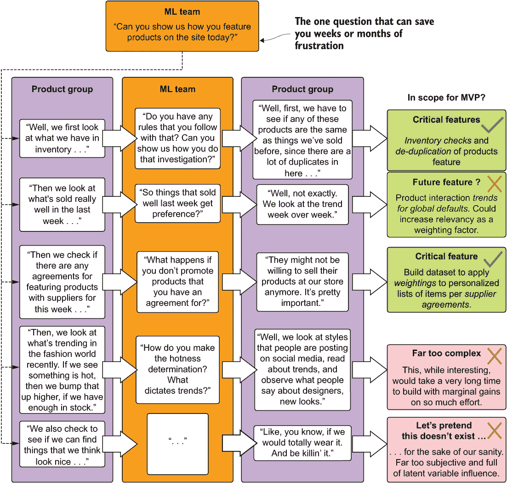

图 3.9 一个专注于定义特性的范围和规划会议的示例

正如你所看到的，并不是每个想法都是绝妙的。有些超出了预算的范围（时间、金钱或两者兼而有之）。还有些超出了我们的技术能力极限（“看起来不错”的需求）。然而，重要的是要关注的是，已经确定了两个关键的关键特性，以及一个潜在的附加未来特性，可以将其放入项目的待办事项列表中。

尽管这个图表中的对话可能看起来相当夸张，但这几乎是对我参与的一个实际会议的逐字记录。尽管我在一些请求上几次忍俊不禁，但我发现这次会议非常有价值。花几个小时讨论 SME 们看到的所有可能性，使我和我团队获得了一个我们没有考虑过的视角，同时揭示了关于项目的关键需求，这些需求我们如果没有从团队那里听到，永远都不会猜到或假设。

在这些讨论中要确保避免的一件事就是讨论机器学习解决方案。记下笔记，以便你和 DS 团队成员可以稍后讨论。确保你不会将讨论偏离会议的主要目的（了解业务目前是如何解决问题的）是至关重要的。

接近这个主题的最简单方法之一，如以下侧边栏所示，是询问 SMEs 目前是如何解决这个问题。除非项目是一个完全的绿色田野月球射击项目，否则很可能有人以某种方式解决了这个问题。你应该和他们谈谈。这种方法论正是图 3.9 中提问和讨论的依据。

解释你是如何做的，这样我才能帮你自动化这个过程

虽然不是所有的机器学习都是直接替代人类进行的无聊、易出错或重复性工作，但我发现绝大多数都是。这些解决方案中的大多数要么是为了取代这种手工工作，要么至少在人们试图在没有算法帮助的情况下完成的工作上做得更全面。

对于我们一直在讨论的推荐引擎，业务一直在尝试进行个性化；这只是通过尽可能吸引尽可能多的人（或他们自己）在选择产品时进行个性化，以突出特征和展示。这适用于从供应链优化到销售预测的各种机器学习项目。在你即将面临的大多数项目中，可能有人在公司里正在尽最大努力完成同样的事情（尽管没有能够从我们的大脑在可接受的时间内识别的复杂关系中筛选数十亿数据点并得出优化解决方案的算法的好处）。

我一直觉得最好的办法是找到这些人，并问他们：“请教我你现在是如何做的。”真正令人震惊的是，几个小时听一个人解决这个问题的过程可以消除后续的浪费工作和返工。他们对你要建模的任务以及解决方案的整体要求的丰富知识将有助于不仅获得更准确的项目范围评估，而且确保你正在构建正确的东西。

我们将在本章后面更深入地讨论规划和定期创意会议的例子。

### 3.1.3 规划演示——大量的演示

在向业务展示他们的个性化解决方案时，ML 团队成员犯的另一个重大错误是只展示一次 MVP。也许他们的冲刺节奏是这样的，他们无法在方便的时候生成模型预测的构建，或者他们不想放慢向业务展示真正 MVP 的进度。无论原因如何，团队成员实际上在试图节省时间和精力时浪费了时间和精力。他们显然处于图 3.10 的上半部分。

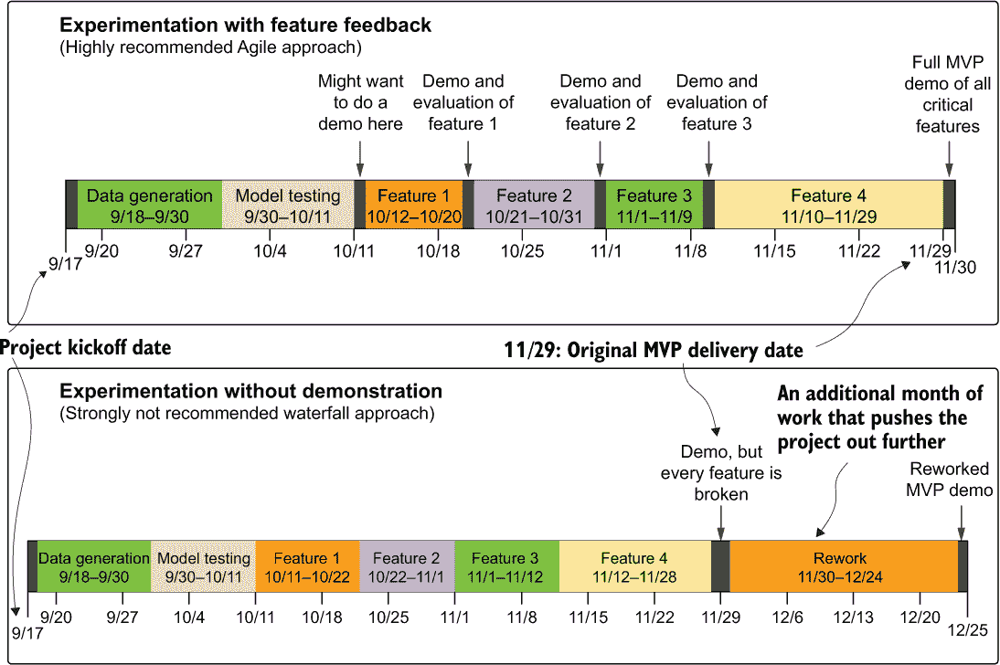

图 3.10 反馈导向的演示密集型项目工作与仅关注内部开发的时间线比较。虽然演示需要时间和精力，但它们节省的返工是无价的。

在最佳情况下（频繁展示每个关键功能），演示后每个功能都可能需要进行一些返工。这不仅是可以预见的，而且与在真空环境中开发所需的返工相比，采用这种敏捷方法调整功能所需的时间要少，因为紧密耦合的依赖性更少。

尽管在机器学习团队内部使用了敏捷实践，但对于市场营销团队来说，最小可行产品（MVP）演示是他们两个月工作的两个月内看到的第一个演示。在这两个月的时间里，没有会议来展示实验的当前状态，也没有关于从建模工作中看到结果节奏的计划被传达。

在构建功能时没有频繁的演示，整个团队在项目机器学习方面只是在黑暗中操作。与此同时，机器学习团队错过了来自 SME 成员的宝贵时间节省反馈，这些成员能够停止功能开发并帮助完善解决方案。

对于大多数涉及足够复杂机器学习的项目，存在太多的细节和细微差别，以至于在没有经过审查的情况下自信地构建数十个功能是不可能的。即使机器学习团队展示了预测质量的指标，汇总排名统计，"最终证明"他们所构建的强大和质量，但只有机器学习团队关心这一点。为了有效地完成复杂项目，需要 SME 小组——市场营销团队——根据它可以消费的数据提供反馈。向该团队展示任意或复杂的指标几乎等同于故意模糊不清，这只会阻碍项目并抑制使项目成功的必要关键思想。

通过提前规划演示，在特定的节奏上，机器学习内部的敏捷开发过程可以适应业务专家的需求，以创建更相关和更成功的项目。机器学习团队成员可以采用真正的敏捷方法：在构建过程中测试和展示功能，调整未来的工作，并以高度有效的方式调整元素。他们可以帮助确保项目能够真正见光。

但是我不知道前端开发。我该如何构建一个演示？

我之前用过一句话。

如果你确实知道如何构建可以托管你的基于机器学习的演示的交互式轻量级应用，那真是太棒了。利用这些技能。但请不要在构建这部分上花费太多时间。尽可能保持简单，并将你的精力和时间集中在手头的机器学习问题上。

对于我们这些 99%的机器学习从业者来说，你不需要制作网站、应用程序或微服务来展示内容。如果你能制作幻灯片（注意，我并不是在问你是否愿意——我们都知道我们都讨厌制作幻灯片），那么你可以通过展示一个模拟来展示你的项目将如何工作，即展示最终用户将看到的内容。复制并粘贴图片。制作一个基本的线框图。任何可以近似展示给生成数据用户最终结果的东西都将是足够的。

如果你清楚地传达，UX 团队、前端开发者或应用程序设计师的最终设计将完全不同于你的演示，而你只是在这里展示数据，那么一个简单的幻灯片或 PDF 的平易近人布局就足够了。我可以向你保证，将主键数组或 matplotlib ROC 曲线下的面积转换为以可消化的方式讲述模型性能的故事，在涉及非技术受众的会议中总是效果更好。

### 3.1.4 通过构建解决方案进行实验：为了虚荣而浪费时间

回顾 ML 团队成员为网站个性化项目构建原型推荐引擎的不幸场景，他们的实验过程令人担忧，但不仅限于业务方面。在没有制定明确的计划来尝试什么以及他们将花费多少时间和精力在他们同意追求的不同解决方案上，大量的时间（和代码）被不必要地浪费了。

在他们的初次会议之后，他们作为一个团队独立行动，开始通过头脑风暴来开始他们的孤立式构思会议，讨论哪些算法可能最适合以隐式方式生成推荐。大约进行了 300 次左右的网络搜索后，他们制定了一个基本的计划，即进行三种主要方法的面对面比较：一个 ALS 模型、一个奇异值分解（SVD）模型和一个深度学习推荐模型。在了解满足项目最低要求所需的功能后，三个不同的团队开始以友好的竞争方式构建他们能构建的内容。

以这种方式进行实验的最大缺陷在于进行此类 bake-offs 所涉及的巨大范围和规模的无谓浪费。通过类似黑客马拉松的方法来处理复杂问题可能对某些人来说很有趣，而且从流程管理的角度来看，对团队领导来说也容易得多（你们都是自己一个人——无论谁赢，我们都跟着走！），但这是一种极其不负责任的方式来开发软件。

这种有缺陷的概念，即在实验中进行解决方案构建，与图 3.11 中展示的更有效（但有些人可能会认为不那么有趣）的原型实验方法形成对比。通过定期的演示，无论是内部对机器学习团队还是对外部跨职能团队，项目的实验阶段可以优化，以便有更多的手（和思想）专注于尽可能快地将项目做得尽可能成功。

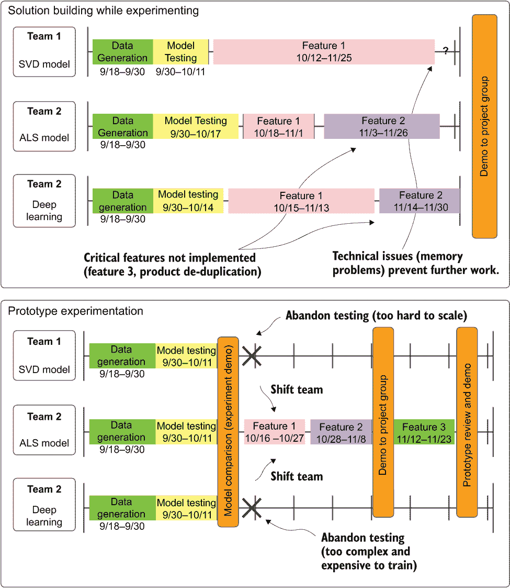

图 3.11 比较了多-MVP 开发和实验淘汰开发（底部）。通过早期淘汰选项，团队可以完成更多的工作（质量更高，时间更短）。

如图 3.11 顶部所示，在没有计划进行原型淘汰的情况下处理模型烘焙问题存在两个主要风险。首先，在上部部分，团队 A 在整合业务指定的第一个关键特性时遇到了困难。

由于在模型工作初始公式化后没有进行评估，因此在构建支持需求的功能上花费了大量时间。在那之后，当转向第二个最关键的功能时，团队成员意识到他们没有足够的时间在演示会议中实现该功能，这实际上保证了所有投入到 SVD 模型中的工作都将付诸东流。

使用其他两种方法的团队，在原型实现方面都人手不足，无法完成第三个关键特性。结果，这三种方法都无法满足关键项目需求。由于项目的多学科性质，这种延误影响了其他工程团队。团队本应采取的做法是遵循图 3.11 底部原型实验部分的路径。

在这种方法中，团队在早期就与业务部门进行了会面，提前沟通说明关键特性不会在这个时间点实现。他们选择决定对每个正在测试的模型类型的原始输出进行决策。在决定专注于单一选项后，整个机器学习团队的资源和时间可以集中用于实现所需的最小特性（并在核心解决方案展示后增加一个检查演示，以确保他们处于正确的轨道上），并更快地达到原型评估阶段。

虽然特性尚未完全构建，但专注于早期和频繁的演示，有助于最大化利用人力资源，并从行业专家那里获得宝贵的反馈。最终，所有机器学习项目都是资源受限的。通过尽可能早地专注于最少且最有潜力的选项，即使是精简的资源集也能创造出成功的复杂机器学习解决方案。

## 3.2 实验范围：设定期望和边界

我们现在已经完成了推荐引擎的规划。我们有了对业务重要性的细节，我们理解用户在与我们的推荐互动时期望什么，并且我们为项目中的特定日期的演示里程碑制定了一个稳固的计划。现在，对我们大多数机器学习爱好者来说，是时候进行有趣的部分了。现在是规划我们的研究的时候了。

在我们指尖上有关于这个主题几乎无限的资料来源，而我们只有有限的时间去处理它们，我们真的应该制定关于我们将要测试的内容以及我们将如何进行测试的指南。这就是实验界定发挥作用的地方。

到目前为止，团队应该已经与 SME 团队成员进行了适当的发现会议，知道需要构建的关键特性：

+   我们需要一种方法来去重我们的产品库存。

+   我们需要将基于产品的规则纳入，以根据每个用户的隐含偏好进行加权。

+   我们需要根据产品类别、品牌和特定页面类型对推荐进行分组，以便在网站和应用程序中满足不同的结构化元素。

+   我们需要一个算法，它将生成用户到物品的亲和力，而不会花费大量资金来运行。

在列出 MVP 的绝对关键方面之后，团队可以开始规划解决这些四个关键任务所需的工作量估计。通过设定这些期望并为每个任务设定边界（无论是时间还是实施复杂度级别），机器学习团队可以提供业务寻求的一件事：*预期的交付日期以及对可行性的判断*。

这可能对一些人来说有些矛盾。 “难道实验不是我们确定从机器学习角度如何界定项目范围的地方吗？” 这可能是你现在脑海中正在浮现的想法。在本节中，我们将讨论为什么，如果缺乏边界，解决这个推荐引擎问题的研究和实验可能会轻易地填满整个项目界定时间表。如果我们计划和界定我们的实验，我们将能够专注于找到，可能不是最好的解决方案，但希望是一个足够好的解决方案，以确保我们最终能够从我们的工作中构建出产品。

一旦完成初步规划阶段（这肯定不会只通过一次会议就能完成），并且对项目涉及的内容有一个大致的想法已经形成并记录下来，就不应该再谈论界定或估计实际解决方案实施所需的时间，至少最初不应该。界定非常重要，是设定整个项目团队期望的主要手段之一，但对于机器学习团队来说更是至关重要。然而，在机器学习的世界中（由于大多数解决方案的复杂性，这与其他类型的软件开发非常不同），需要发生两种不同的界定。

对于习惯与其他开发团队互动的人来说，实验范围的概念是完全陌生的，因此，对初始阶段范围估计的任何估计都将被误解。然而，考虑到这一点，没有为实验设定内部目标范围显然是不明智的。

### 3.2.1 什么是实验范围？

在开始估计项目将花费多长时间之前，你需要研究不仅其他人如何解决类似问题，而且从理论角度的潜在解决方案。就我们一直在讨论的情况而言，在初步项目规划和整体范围（需求收集）阶段，决定了一系列潜在的方法。当项目进入研究和实验阶段时，向更大的团队设定 DS 团队将花费多长时间审查每个想法的预期是*绝对关键的*。

设定预期对 DS 团队有益。尽管为完全不可知的事物（即最佳解决方案）设定任意截止日期可能看似适得其反，但有一个目标截止日期可以帮助集中测试的通常无序过程。在其他情况下可能看起来值得探索的元素被忽略，并标记为“将在 MVP 开发期间研究”，随着即将到来的截止日期的临近。这种方法仅仅有助于集中工作。

这些期望同样有助于业务和参与项目的跨职能团队成员。他们不仅将获得一个更有可能最终成功的项目方向的决定，而且还将保证近期未来的进展。记住，*沟通对于成功的机器学习项目工作至关重要*，即使是为实验设定交付目标也将有助于继续让每个人参与过程。这只会使最终结果更好。

对于相对简单直接的人工智能应用案例（例如预测、异常检测、聚类和转化预测），分配给测试方法的时长应该相对较短。通常一到两周就足够探索标准人工智能的潜在解决方案；记住，这不是构建最小可行产品（MVP）的时间，而是要获得不同算法和方法有效性的总体印象。

对于更加复杂的应用案例，例如这种情况，可能需要更长的调查期。仅仅研究阶段可能就需要两周时间，再加上两周的“黑客”（粗略地编写测试 API、库和构建粗略的可视化）。

这些阶段唯一的目的是决定一条路径，但要在尽可能短的时间内做出决定。挑战在于平衡做出最佳裁决所需的时间与 MVP 交付的时间表。

没有一个标准的标准来决定这个时期应该有多长，因为它取决于问题、行业、数据、团队的经验以及每个被考虑的选项的相对复杂性。随着时间的推移，团队将获得智慧，这将使实验（黑客）估计更加准确。最重要的要点是要记住，这个阶段以及向业务单位传达所需时间的沟通**决不能**被忽视。

### 3.2.2 机器学习团队的实验范围：研究

所有机器学习实践者的内心都渴望实验、探索和学习新事物。在机器学习领域的深度和广度面前，我们可能一生只能学到所做工作的很小一部分，目前正在进行的研究，以及将作为解决复杂问题的新解决方案的工作。我们所有人共有的这种天生的欲望意味着，在研究新问题的解决方案时，设定时间和距离的界限是极其重要的。

在规划会议和项目范围规划的第一阶段之后，现在是时候开始做一些实际工作了。这个初始阶段，实验阶段，在各个项目和实施中可能会有很大的不同，但对于机器学习团队来说，它**必须**是时间限制的。这对我们中的许多人来说可能会感到非常沮丧。我们有时被迫进入“只管做出来”的情况，而不是从零开始研究一个新颖的解决方案，或者利用最近开发的新技术。为了满足这种时间紧迫的要求，一种很好的方法是限制机器学习团队研究解决方案可能性的时间。

对于本章中我们一直在讨论的推荐引擎项目，机器学习团队的研究路径可能看起来像图 3.12。

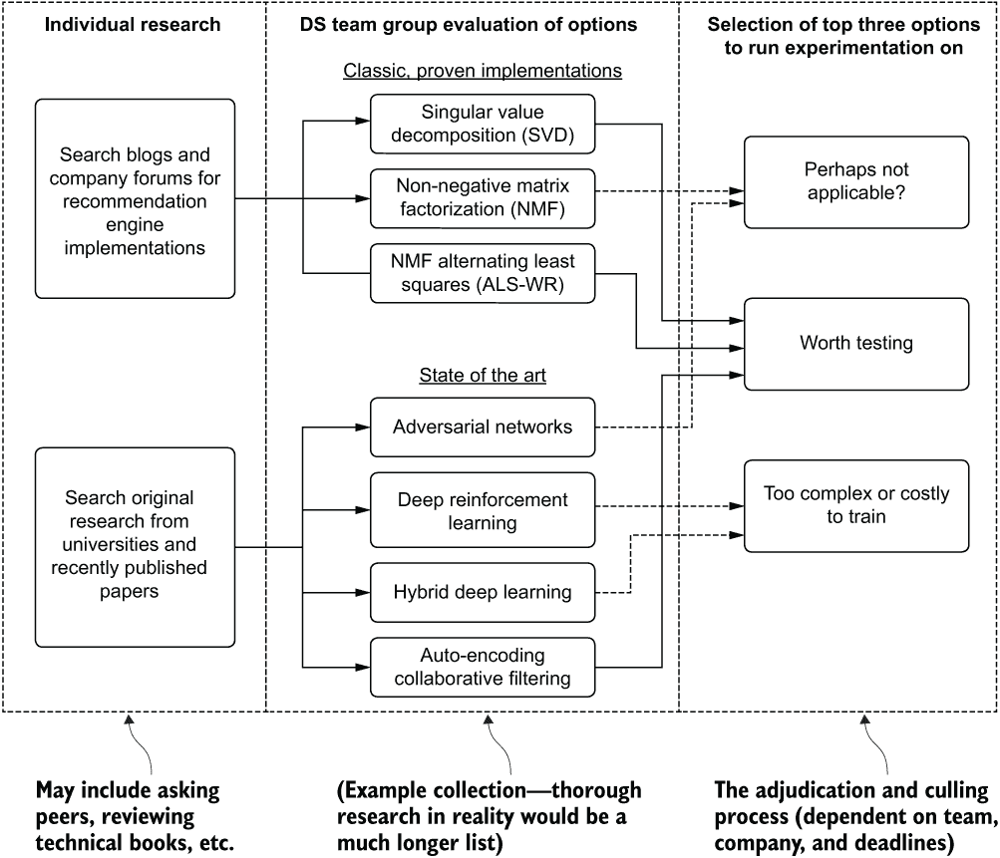

图 3.12 为机器学习团队确定要测试的潜在解决方案的研究规划阶段图。定义这样的结构化计划可以显著减少在迭代想法上花费的时间。

在这个简化的图中，有效的研发限制了团队可用的选项。经过几番初步的互联网搜索、博客阅读和白皮书咨询后，团队可以在一天左右的时间内确定行业和学术界现有解决方案的“大致轮廓”。

一旦确定了常见的做法（并由团队成员个别整理），就可以更深入地研究所有可能性的完整列表。一旦达到这种适用性和复杂性的水平，团队可以开会讨论其发现。

如图 3.12 所示，在呈现发现的过程中，候选的测试方法被筛选出来。在这个裁决阶段结束时，团队应该有一个坚实的计划，包括两到三个值得通过原型开发进行测试的选项。

注意该小组选择的方法的混合。在选择中存在足够的异质性，这将有助于后来基于最小可行产品（MVP）的决策（例如，如果所有三个选项都是深度学习方法的轻微变化，在某些情况下，将很难决定选择哪一个）。

另一个关键行动是缩减大量选项的列表，以帮助防止过度选择（一种几乎因为选项过多而使决策变得令人瘫痪的情况）或小决策的暴政（在连续做出许多看似微不足道的小选择后，可能导致不利的后果）。为了推动项目进展并在项目结束时创建一个可行的产品，最好限制实验的范围。

图 3.12 中的最终决策，基于团队的研究，是专注于三个独立的解决方案（一个具有复杂依赖关系）：交替最小二乘法（ALS）、奇异值分解（SVD）和深度学习（DL）解决方案。一旦这些路径被确定，团队就可以开始尝试构建原型。就像研究阶段一样，实验阶段的时间限制允许完成的工作量有限，确保在实验结束时可以产生可衡量的结果。

### 3.2.3 机器学习团队的实验范围：实验

在制定计划后，机器学习团队负责人可以自由地分配资源到原型解决方案。一开始，明确实验的期望是很重要的。目标是产生最终产品的模拟，以便对正在考虑的解决方案进行无偏见的比较。不需要调整模型，也不需要编写代码，使其能够被考虑用于最终项目的代码库。这里的游戏规则是在两个主要目标之间取得平衡：速度和可比性。

在决定采取哪种方法时，需要考虑许多事情，这些内容在后续的几个章节中进行了详细讨论。但就目前而言，这一阶段的临界估计是关于解决方案的性能以及开发完整解决方案的难度。可以在这一阶段结束时创建总最终代码复杂性的估计，从而通知更大的团队预计的开发时间，以产生项目的代码库。除了与代码复杂度相关的承诺时间外，这还可以帮助了解解决方案的总拥有成本：重新训练模型、生成亲和力推断、托管数据和提供数据每日运行成本。

在通过编写故事和任务来规划将通过普遍接受的最佳方法（敏捷）完成的工作之前，为实验制定一个测试计划可能会有所帮助。这个计划，不包含技术实现细节和故事票据的冗长性质，这些票据将在测试阶段完成，可以用来不仅通知冲刺计划，还可以跟踪机器学习团队将要进行的 bake-off 状态。这个计划可以作为沟通工具与更大的团队共享和利用，有助于展示完成的任务和结果，并可以伴随两个（或更多！）正在追求的竞争性实现进行演示。

图 3.13 展示了推荐引擎实验阶段的分阶段测试计划。

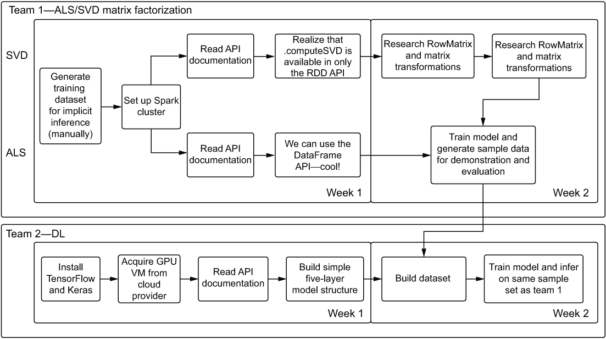

图 3.13 为推荐引擎项目原型阶段的两个阶段的实验跟踪流程图

这些测试路径清楚地显示了研究阶段的结果。团队 1 的矩阵分解方法显示了一个需要手动生成（不是通过 ETL 作业为此测试阶段）的常见数据源。基于团队成员对这些算法的计算复杂性（以及数据本身的规模）的研究和理解，他们选择了 Apache Spark 来测试解决方案。在这个阶段，两个团队都必须将他们的努力分开来研究两个模型的 API，得出两个非常不同的结论。对于 ALS 实现，SparkML 中的高级 DataFrame API 实现使得代码架构比基于 RDD 的低级实现简单得多。团队可以在这次测试中定义这些复杂性，让更大的团队意识到 SVD 实现将显著更复杂，需要实施、维护、调整和扩展。

所有这些步骤对于团队 1 都有助于定义后续的开发范围。如果更大的团队整体决定 SVD 是他们用例的更好解决方案，他们应该权衡实施复杂性与团队的熟练程度。如果团队不熟悉编写利用 Breeze 的 Scala 实现，项目和团队预算是否有时间让团队成员学习这项技术？如果实验结果的质量显著高于其他正在测试的结果（或是对另一个更好的解决方案的依赖），更大的团队需要意识到交付项目所需的额外时间。

团队 2 的实现方式显著更复杂，需要输入 SVD 模型的推理。为了评估这种类型两种方法的结果，评估复杂性是很重要的。

评估复杂性风险

如果团队 2 的结果显著优于 SVD 本身的结果，团队应该仔细审查这种性质的复杂解决方案。审查的主要原因是在解决方案中增加的复杂性水平。这不仅将增加开发成本（在时间和金钱方面），而且维护这种架构将更加困难。

从增加的复杂性中获得的性能提升应该始终是如此显著的级别，以至于在如此改进面前，团队增加的成本是可以忽略不计的。如果明显的收益对每个人（包括商业）来说并不明显，那么应该进行一次关于基于简历的开发（RDD）和承担如此增加工作的动机的内部讨论。每个人只需要意识到他们将要进入什么，如果他们选择追求这种额外的复杂性，他们可能需要维护几年。

跟踪实验阶段

当讨论实验阶段时，提供给更大团队的另一个有用的可视化是，从机器学习的角度来看，解决方案的大致轮廓的粗略估计。复杂的架构图是不必要的，因为在开发的早期阶段，它将改变很多次，在这个项目阶段创建任何实质性的详细内容纯粹是浪费时间。

然而，一个高级图，如图 3.14 所示，它引用了我们的个性化推荐引擎，可以帮助向更大的团队解释需要构建什么来满足解决方案。这种视觉“工作架构”指南（在实际项目中会有更多细节）也可以帮助机器学习团队跟踪当前和即将到来的工作（作为敏捷看板的一个补充）。

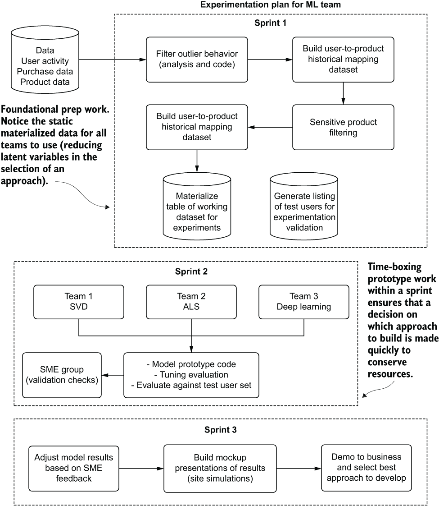

图 3.14 情景项目的实验阶段高级架构

这些注释可以帮助与更大的团队进行沟通。而不是坐在可能包括十几个或更多人参加的状态会议上，像这样的工作图可以被机器学习团队用来与每个人高效地沟通。可以添加各种解释来回答关于团队在做什么以及为什么在特定时间的工作的问题，以及提供与按时间顺序聚焦的交付状态报告（对于一个如此复杂的项目，对于不参与项目的人来说可能很难阅读）的背景信息。

理解界定研究（实验）阶段的重要性

如果负责个性化项目的机器学习团队成员有无限的时间（以及无限的预算），他们可能有机会找到他们问题的最优解。他们可以筛选数百篇白皮书，阅读关于一种方法相对于另一种方法的益处的论文，甚至花时间寻找一种新颖的方法来解决他们业务视为理想解决方案的特定用例。不受发布日期或降低技术成本的约束，他们可以轻松地花费数月甚至数年，仅用于研究将个性化引入他们的网站和应用的最好方法。

而不是仅仅测试两三种在其他类似行业和用例中已被证明有效的方法，他们可以致力于构建数十种方法的原型，并通过仔细的比较和裁决，选择绝对最佳的方法来创建一个能够为用户提供最佳推荐的引擎。他们甚至可能提出一种新颖的方法，这可能会彻底改变问题空间。如果团队被允许自由测试他们想要的任何内容以构建这个个性化的推荐引擎，那么他们的想法白板可能看起来就像图 3.15 所示。

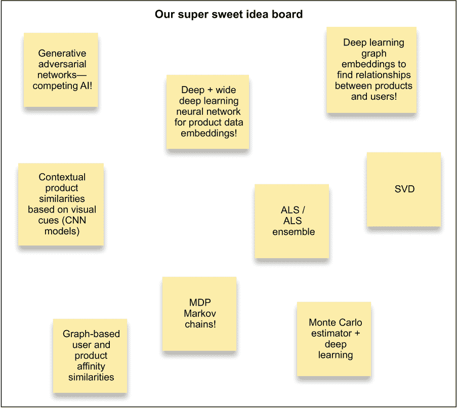

图 3.15 提出解决问题的潜在方法

在产生这些想法的头脑风暴会议（这与我与大型的雄心勃勃的数据科学团队进行的许多创意会议有惊人的相似之处）之后，团队应采取的下一步集体行动是开始对这些实现进行估算。在每个替代方案旁边附上注释可以帮助制定一个计划，在合理的实验时间内确定最有可能成功的两种或三种方案。图 3.16 中的评论可以帮助团队决定要测试哪些内容以满足将产品实际投入生产的需求。

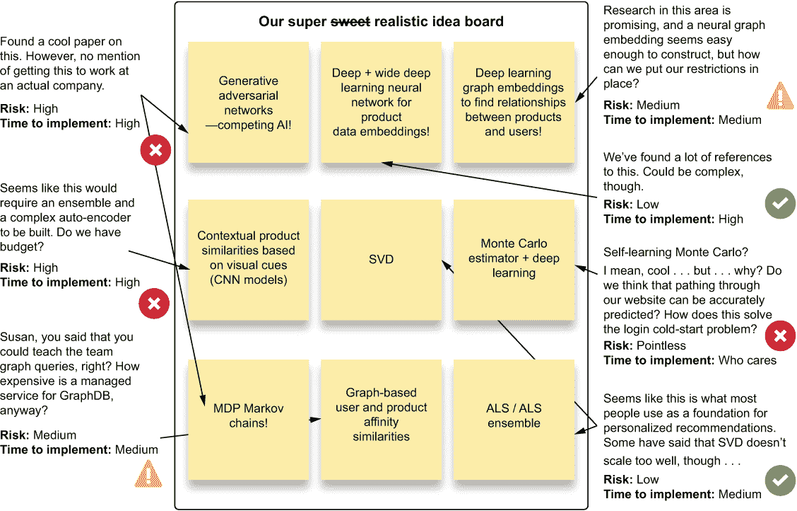

图 3.16 在头脑风暴会议中评估和评级讨论的选项。这是在实验中相互测试两种或三种方法的有效方式。

在团队完成如图 3.16 所示的分配不同方法的风险的练习后，可以决定在测试分配的时间范围内最可能且风险最低的选项。评估和分类各种想法的主要重点是确保尝试可行的实现。为了满足项目的目标（准确性、实用性、成本、性能和业务问题解决的成功标准），追求能够实现所有这些目标的实验至关重要。

一些建议实验的目标是找到最有可能且最简单的方法来解决问题，而不是使用最技术复杂的解决方案。专注于解决问题而不是你打算用它来解决问题的工具，总是会提高成功的几率。

看一下图 3.17。这是两个在实验阶段工作的团队实验计划的基于时间的表示的略微修改过的转置。最需要注意的部分是顶部：时间尺度。

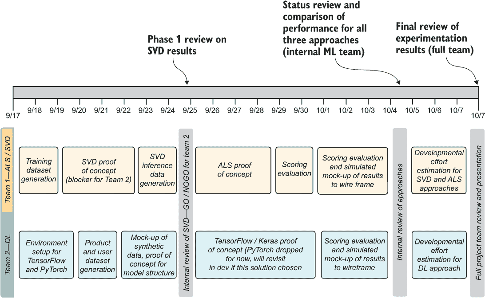

图 3.17 两个在项目实验阶段工作的团队的历时表示

这个关键因素——时间——是建立实验控制如此重要的一个元素。实验需要时间。构建概念验证（PoC）是一项艰苦的学习新 API、研究编写代码的新方法以支持模型应用，以及整合所有组件以确保至少有一次运行成功的努力。这可能需要惊人的努力（取决于问题）。

如果团队正在努力构建最佳可能的解决方案，那么这个时间尺度将比图 3.17 所示的时间长得多。公司根本不会感兴趣花费如此多的资源在尝试通过两个永远不会见天日的解决方案来实现完美。然而，通过限制总时间支出并接受实施策略的比较将远远不如完美，团队可以做出一个权衡预测质量与所选择方向的总拥有成本的明智决策。

总拥有成本

虽然在实验阶段对这种性质的项目维护成本的估计几乎不可能准确，但这是一个需要考虑的重要方面，并做出有根据的猜测。

在实验过程中，不可避免地会从业务的整体数据架构中缺失一些元素。可能需要创建服务来捕获数据。需要构建服务层。如果组织从未处理过围绕矩阵分解的建模，它可能需要使用之前从未使用过的平台。

如果实际上无法获取数据来满足项目需求怎么办？这是识别阻止性问题的时刻。识别它们，询问是否将提供解决方案来支持实施需求，如果没有，则提醒团队，如果没有投资来创建所需的数据，项目应该停止。

假设没有如此严重的问题，以下是一些在这个阶段当发现差距和关键问题时需要考虑的问题：

+   我们需要构建哪些额外的 ETL？

+   我们需要多频繁地重新训练模型和生成推理？

+   我们将使用什么平台来运行这些模型？

+   对于我们需要的平台和基础设施，我们是打算使用托管服务还是尝试自己运行？

+   我们是否有运行和维护此类 ML 服务的专业知识？

+   我们的服务层计划的成本是多少？

+   存储的成本是多少，推理数据将存放在哪里以支持这个项目？

你不必在开发开始之前回答这些问题（除了与平台相关的问题），但它们应该始终作为在整个开发过程中重新审视的元素保持。如果你没有足够的预算来运行这些引擎之一，也许应该选择一个不同的项目。

我们为这些元素中的每一个都设定了时间块，还有一个最终原因：快速做出项目决策。这个概念可能对大多数数据科学家来说相当冒犯。毕竟，如果模型没有完全调优，一个人如何能够充分评估实施的成败？如果解决方案的所有组件都没有完成，一个人如何合法地声称其预测能力？

我明白了。真的，我明白了。我曾经在那里，提出过同样的论点。回顾过去，在我职业生涯的早期，当我忽视软件开发者给我的关于为什么长时间在多个前端运行测试是坏事的高见时，我意识到他们试图向我传达什么。

*如果你早点做出决定，你花在其他事情上的所有工作都会投入到最终选择的实施中。*

——许多优秀的工程师

即使我知道他们告诉我的事情是真实的，但听到这一点仍然有点令人沮丧，意识到我浪费了这么多时间和精力。

关于士气的轶事

时间块并不是为了给团队施加不切实际的压力，而是为了防止团队在货架软件上浪费时间和精力。限制在潜在解决方案上花费的时间也有助于提高团队对那些永远不会实现实施的士气——毕竟，你实际上只能为一个项目构建一个解决方案。

限制人们可以用于解决方案的时间量是有价值的，因为如果他们只工作了一周，那么放弃他们的工作就会痛苦得多。但如果他们已经工作了几个月，当他们被告知他们的解决方案不会被使用时，这会感觉相当令人沮丧。

在测试实施时，最毒害的事情之一是团队内部形成部落。每个团队都花费了大量时间研究其解决方案，并且可能被可能使其不适合作为解决问题途径的因素所蒙蔽。如果实验从原型验证（PoC）阶段发展到真正最小可行产品（MVP）阶段（坦白说，如果给予足够的时间，大多数机器学习团队都会构建一个 MVP 而不是一个 PoC），在决定使用哪个实现时，紧张关系就会出现。脾气会爆发，冰箱里的午餐会消失，站立会议期间会爆发争吵，团队的总体士气会受到影响。拯救你的团队，拯救你自己，并确保人们不要对 PoC 产生依恋。

如果项目完全新颖，时间块也非常关键。虽然拥有成熟机器学习（ML）存在的公司中，月亮射击项目可能并不常见，但一旦出现，限制早期阶段投入的时间就很重要。这些项目风险较大，有很高的可能性最终一无所获，并且可能最终在构建和维护上花费巨额费用。对于这些项目，快速失败和尽早失败总是最好的选择。

当任何人第一次接触一个对他们来说陌生的全新问题时，通常需要做大量的准备工作。研究阶段可能涉及大量的阅读、与同行交谈、搜索研究论文以及在入门指南中测试代码。如果解决问题的唯一可用工具是在特定平台上，使用团队中没有人使用过的语言，或者涉及团队中全新的系统设计（例如，分布式计算），这个问题会成倍增加。

在这种情况下，研究和工作负担的增加使得在研究和实验上设定时间限制变得更加重要。如果团队成员意识到他们需要掌握新技术来解决业务问题，这是可以的。然而，项目的实验阶段应该适应这一需求。如果发生这种情况，关键点是向业务领导沟通这一点，以便他们在项目工作开始之前理解范围的增加。这是一个风险（尽管我们都很聪明，可以快速学习新事物），他们应该以开放和诚实的态度意识到这一点。

唯一的例外是，如果可以采用简单且熟悉的方法，并在实验期间显示出有希望的结果，那么这个时间阻塞规则不适用。如果问题可以用熟悉且简单的方式解决，但新技术可能（也许）使项目变得更好，那么在团队熟悉新的语言或框架的同时，花费数月时间从失败中学习，在我看来，这是不道德的。最好在数据科学团队的时间表中为独立或基于团队的继续教育和个人项目工作腾出时间。在为商业执行项目时，不是学习新技术的时候，除非没有其他选择。

总之，这项工作会有多少工作量？

在实验阶段结束时，应该理解项目机器学习方面的概貌。重要的是要强调，他们应该被理解，*但尚未实施*。

团队应该对需要开发以符合项目规格的功能有一个总体看法，以及需要定义和开发的所有额外 ETL 工作。团队成员应该就进入和离开模型的数据达成一致，如何增强这些数据，以及将用于满足这些需求的工具。

在这个阶段，可以开始识别风险因素。以下是最重要的两个问题：

+   建造这个需要多长时间？

+   运行这个需要多少成本？

这些问题应该是实验阶段和开发阶段之间的审查阶段的一部分。有一个粗略的估计可以通知更广泛的团队关于为什么应该选择一个解决方案而不是另一个解决方案的讨论。但机器学习团队应该单独决定使用哪种实现吗？任何团队的假设都存在固有的偏见，因此为了减轻这些因素，创建一个加权矩阵报告可能是有用的，这个报告可以让更大的团队（以及项目负责人）用来选择一个实现。

机器学习中的所有者偏见

我们都喜欢我们所建造的东西，尤其是如果它很聪明。然而，在实验阶段之后，一个项目可能遇到的最有害的事情之一就是仅仅因为自己建造了它，就紧紧抓住一些聪明而独特的东西。

如果团队中的其他人有一些具有相似预测质量但远不那么无聊或标准的解决方案，那么应该接受这个更好的选择。记住，团队中的每个人都将不得不维护这个解决方案，为其做出贡献，随着时间的推移对其进行改进，也许有一天将其升级以适应新的生态系统。如果这个聪明的定制解决方案过于复杂而难以维护，它可能会给团队带来沉重的负担。

这也是为什么我一直觉得请一个同行来起草比较分析是有用的。重要的是要找到一个熟悉评估不同方法成本和效益的人——一个有足够经验经历过维护脆弱方法困难时期的人。我通常找到一个直到目前为止未参与项目的人，以确保他们对决策没有偏见。他们的客观意见，没有偏见，可以帮助确保报告中的数据准确，以便更大的团队能够诚实地评估选项。

当我的复杂解决方案因为其复杂性而被摒弃时，我迅速地转向了其他方向。我总是对“酷”的解决方案被丢弃持开放态度，无论当时我多么想构建它。毕竟，团队、公司和项目比我的自尊心更重要。

图 3.18 展示了一个这样的加权矩阵报告示例（为了简洁而简化），以便让更大的团队积极参与。每个元素的评分由进行无偏见评估不同解决方案相对属性的专家评审员锁定，但权重在会议中可以自由修改。这样的工具帮助团队在考虑每个实现的多种权衡后做出数据驱动的选择。

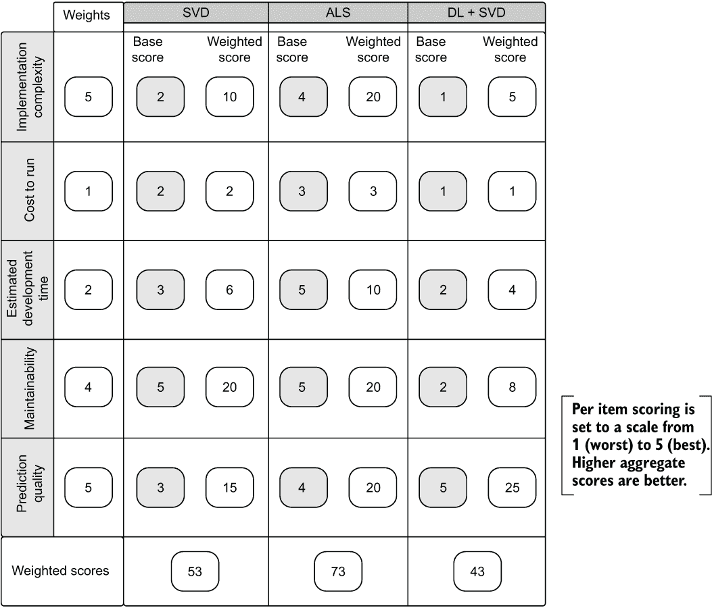

图 3.18 评估推荐引擎三个测试实现实验结果、开发复杂性、拥有成本、维护解决方案的能力和比较开发时间的加权决策矩阵

如果这个矩阵是由从未构建过如此复杂系统的 ML 团队成员填充，他们可能会对预测质量给予很高的权重，而对其他方面则很少考虑。一个更有经验的 ML 工程师团队可能会过分强调可维护性和实施复杂性（任何经历过这些的人都不喜欢无休止的史诗级任务和周五凌晨 2 点的呼叫警报）。数据科学总监可能只关心运行成本，而项目负责人可能只对预测质量感兴趣。

需要记住的重要一点是，这是一个平衡行为。随着更多对项目有利益关系的成员聚集在一起辩论和解释他们的观点，可以做出更明智的决定，这有助于确保解决方案的成功和长期运行。

最后，正如俗话所说，天下没有免费的午餐。需要做出妥协，并且这些妥协应该由更大的团队、团队领导和将整体实施这些解决方案的工程师达成一致。

## 摘要

+   在项目初期专注于如何最好地解决特定问题，可以带来巨大的成功。收集关键需求，评估方法时不引入技术复杂性或实现细节，并确保与业务的沟通清晰，有助于避免许多需要后期返工的陷阱。

+   使用敏捷方法中的研究和实验原则，ML 项目可以显著缩短评估方法和确定项目可行性的时间，从而更快地完成。
