# 4 在建模之前：项目和后勤的沟通

本章涵盖

+   为机器学习项目工作安排规划会议

+   从跨职能团队征求反馈以确保项目健康

+   进行研究、实验和原型设计以最小化风险

+   在项目早期就包含业务规则逻辑

+   使用沟通策略来吸引非技术团队成员

在我多年的数据科学家工作经历中，我发现 DS 团队在将他们的想法和实施应用于公司时面临的最大挑战，其根源在于沟通效果不佳。这并不是说我们作为职业，在沟通方面做得不好。

更多的原因是，为了在与公司内部客户（业务单元或跨职能团队）打交道时有效，我们需要使用不同于团队内部使用的*不同形式的沟通*。以下是我看到 DS 团队在与客户讨论项目时遇到的一些最大问题（以及我个人遇到的）：

+   知道在何时提出哪些问题

+   将沟通策略有针对性地集中在关键细节上，忽略与项目工作无关的细微错误

+   用通俗易懂的语言讨论项目细节、解决方案和结果

+   将讨论集中在问题上而不是解决方案的运作上

由于这个领域非常专业化，没有普遍的平民指南可以像其他软件工程领域那样提炼我们的工作。因此，需要额外的努力。从某种意义上说，我们需要学习一种将我们所做的工作翻译成另一种语言的方法，以便与业务进行有意义的对话。

我们还需要作为机器学习从业者，努力提高质量沟通实践。处理那些不可避免地会让人感到沮丧和困惑的复杂主题，需要一定的同理心沟通。

与愤怒或沮丧的人进行艰难的对话

在我目前的工作中，我与很多人进行了很多艰难的对话。有时人们会感到沮丧，因为解决方案没有进展。有时，人们会愤怒，因为解决方案不可解释。在罕见的情况下，人们坚决反对使用机器学习解决方案，因为他们认为这将取代他们的工作。

在每一次这些艰难的对话之后，不可避免地有人后来找我，询问如何在会议中做我刚才做的事情。在过去几年里，我对这个问题感到困惑。对我来说，这个问题几乎没有意义。毕竟，我所做的就是倾听投诉，进行专注于他们关注的开放讨论，并就如何前进达成共识。然而，如今，我认为我知道为什么人们会问这个问题。

作为高度专业领域的专家，数据科学实践者很容易忽视普通人知道或不知道的东西。随着人工智能越来越成为今天时代精神的一部分，这种情况在行业中正在逐渐改变。但这并不意味着你与之交谈的每个人都会理解你的解决方案能做什么和不能做什么。

我对那些问我如何管理困难讨论的人给出的答案很简单：就是多听少说。不要对业务单位说教。倾听他们的担忧，并以他们理解的方式清晰地沟通。最重要的是，要诚实。不要承诺那些超出你执行能力的神奇解决方案或交付日期。他们会欣赏被倾听和进行真诚的讨论。真正倾听他们的不满，具有同理心的心态可以帮助比我所知的任何其他方法更好地降低敌对讨论的级别。

图 4.1 展示了我一直认为效果很好的一个通用对话路径，我们将在本章中应用这个路径。

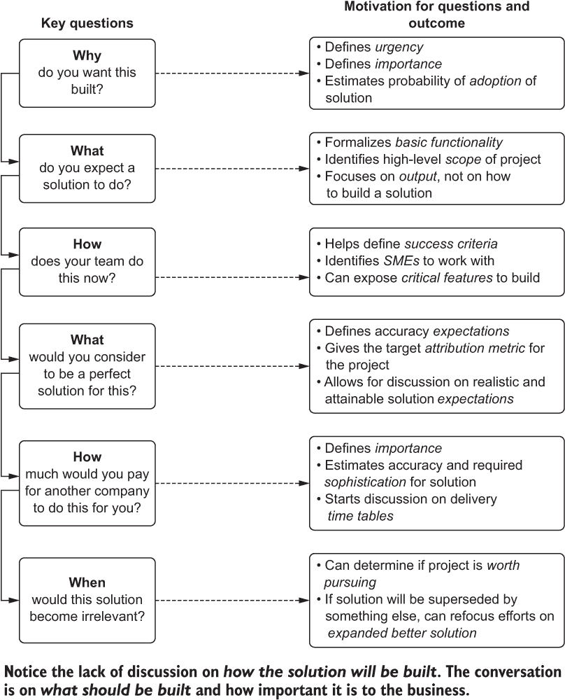

图 4.1 在第一次规划会议期间与业务单位讨论的关键问题，以及将告知如何构建、何时构建和成功标准的至关重要答案

通过使用清晰、直接、以结果为导向的沟通风格，可以更紧密地将项目结果与业务对工作的期望相一致。以这个为主要目标的针对性讨论有助于定义“要构建什么，如何构建，何时完成，以及成功标准是什么”。这实际上是为项目的每个后续阶段，包括在生产中切换到开启状态所概述的整个食谱。

## 4.1 沟通：定义问题

如第三章所述，我们将继续讨论我们的数据科学团队被分配构建的产品推荐系统。我们已经看到了规划项目和为最小可行产品（MVP）设定范围的有效和无效方法的对比，但我们还没有看到团队是如何达到创建一个有效项目计划并合理设定项目范围的这个点的。

如我们在第 3.1 节中讨论的，第一个例子会议围绕高度抽象的目标展开。业务希望其网站实现个性化。DS 团队在那个对话中的第一个错误是没有继续追问。最重要的问题从未被问过：“你为什么想构建一个个性化服务？”

大多数人，尤其是技术人员（可能是在讨论这个初步项目提案和头脑风暴会议的房间里的人中的绝大多数），更喜欢关注项目的“如何”。我该如何构建这个？系统将如何与这些数据进行集成？我需要多久运行一次我的代码来解决需求？

对于我们的推荐引擎项目，如果有人提出这个问题，它将开启关于需要构建什么、预期的功能应该是什么、项目对业务的重要性如何以及业务希望何时开始测试解决方案的开放而坦率的对话。一旦收到这些关键答案，就可以进行所有围绕后勤的细节工作。

在这些启动会议中需要记住的重要事项是，当双方——客户和解决方案的供应商——都得到他们所需的东西时，这些会议是有效的。DS 团队得到其研究、范围和计划细节。业务得到对即将进行的工作的审查日程。业务获得对项目成功至关重要的包容性，这将在项目期间安排的各种演示和创意会议中得到体现（关于这些演示边界的更多内容请参阅 4.1.2 节）。如果没有如图 4.1 所示的有指导和富有成效的对话，会议中的相关人员可能会陷入图 4.2 所示的思维模式。

通过将会议聚焦于共同目标，可以协作地引导图 4.2 中每个角色的个人责任和期望，以定义项目和确保其成功。

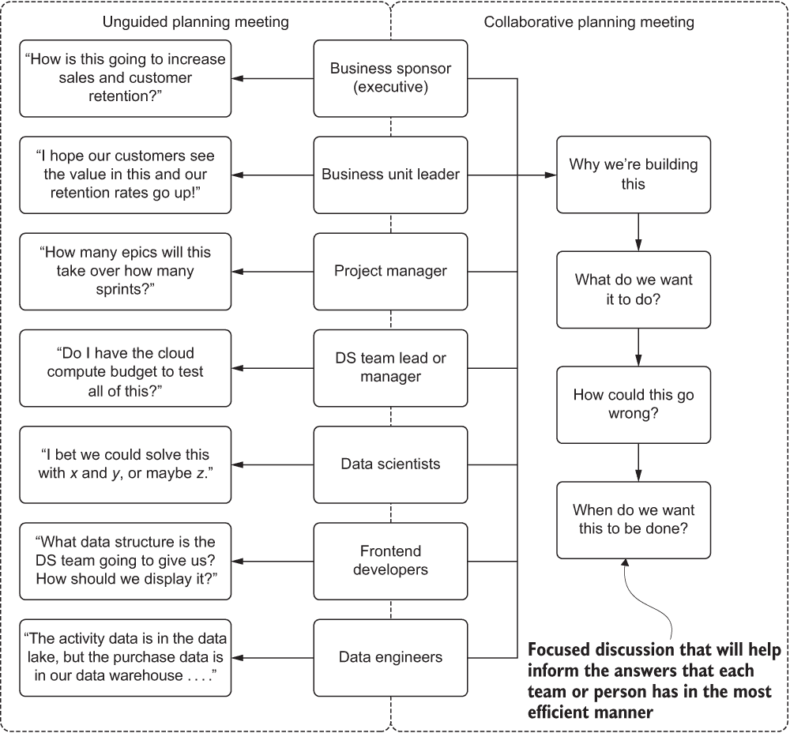

图 4.2 无指导和有指导规划会议的比较

与集体现讨论项目的关键原则的其他主要好处是帮助定义*解决问题的最简单可能方案*。通过获得业务部门的认可、来自领域专家的反馈以及来自同行软件工程师的输入，最终解决方案可以量身定制以满足确切需求。它还可以在后续阶段适应新的功能，而不会给更大的团队带来挫败感。毕竟，从一开始大家就一起讨论了项目。

机器学习开发的重要原则：始终构建尽可能简单的解决方案来解决问题。记住，你必须维护这个系统并随着时间推移不断改进以满足不断变化的需求。

### 4.1.1 理解问题

在我们的场景中，规划会议的无指导性质导致 DS 团队成员对*要构建什么*没有明确的方向。在没有业务对期望的最终状态进行任何实际定义的情况下，他们把精力集中在构建他们能够通过评分算法证明的每个用户的最佳推荐集合上。他们所做的是实际上错过了重点。

核心问题是沟通的根本破裂。没有询问业务部门希望从他们的工作中得到什么，他们错过了对业务部门（以及外部的“真实”客户）意义最大的细节。你总是想避免这种情况。这种沟通和规划的破裂可以以多种方式表现出来，从缓慢、沸腾的被动攻击到项目结束时直接的大喊大叫（通常是单方面的）。

我们这里的问题是沟通失败

在我作为开发者、数据科学家、架构师或顾问参与的众多机器学习项目中，所有未能成功投入生产的项目中，一个始终如一、普遍的主题就是缺乏沟通。这并不是指工程团队中的沟通失败（尽管在我的职业生涯中，我已经见证了许多我不太喜欢的情况）。

最糟糕的沟通破裂发生在数据科学团队和请求解决方案的业务部门之间。无论是漫长的、缓慢的、拖延的沟通熵，还是完全拒绝使用所有各方都能理解的共同对话形式，当客户（内部）没有被开发者听取时，结果总是相同的。

项目最终发布到生产阶段时，缺乏沟通对项目所有参与者来说变得明显，这时问题尤为突出。最终用户在使用预测结果时得出结论，不仅预测模型输出的结果似乎有些不对劲，而且问题基本上是根本性的。

沟通破裂不仅限于生产发布。它们通常在解决方案的开发过程中缓慢发生，或者在用户验收测试期间发生。各方都做出了假设；想法要么没有说出来，要么被忽视，在全体团队会议期间，评论被驳回，要么被认为是不相关的，要么简单地被认为是浪费时间。

几乎没有什么比团队之间由于沟通破裂而导致的项目失败更让人无限沮丧的了，但这种失败完全可以避免。这些失败，导致时间和资源的巨大浪费，可以追溯到项目的早期阶段——在写下第一行代码之前——当问题的范围和定义发生时。这些失败完全可以通过有意识和坚定的计划来预防，确保在项目的每个阶段都保持开放和包容的对话，从最初的构思和头脑风暴会议开始。

你希望它做什么？

对于这个建议的“**什么**”比“**如何**”对团队中的每个人来说都更为重要。通过关注项目目标的职能（即“它将做什么？”这个问题），产品团队可以参与讨论。前端开发者也可以做出贡献。整个团队可以审视一个复杂主题，并计划看似无限的边缘情况和商业的细微差别，这些都需要在构建最终项目和最小可行产品（MVP）时考虑。

为构建这个个性化解决方案的团队解决这些复杂主题的最简单方法是通过使用模拟和流程路径模型。这些模型可以帮助确定整个团队对项目的期望，以便随后通知数据科学团队所需了解的细节，以便限制构建解决方案的选项。

你是什么意思，你不在乎我的困境？

是的，我的机器学习同行们，我可以承认：**如何**是复杂的，涉及项目的大部分工作，并且极具挑战性。然而，**如何**是我们被付薪去解决的问题。对我们中的某些人来说，这正是我们选择这个职业的原因。关于“如何解决问题”的问题占据了我们在交谈时很多专注于极客的讨论。这是有趣的事情，它很复杂，学习起来也很有趣。

但团队的其他成员并不关心将要使用哪种建模方法；请相信我，即使他们假装感兴趣，他们提出问题的唯一目的就是让他们看起来关心——他们并不真的关心。如果你想进行有意义的、协作的和包容性的会议，请将这些细节排除在小组讨论之外。只有当讨论保持这种欢迎的团队合作氛围时，你才会得到见解、创意想法，以及识别出看似无害但需要处理的细节，以便使项目尽可能成功。

对于正在从事这个项目的团队来说，通过借鉴前端软件开发者的最佳实践来通过这次对话是最好的方式。在切分任何功能分支之前，在将任何 Jira 任务分配给开发者之前，前端开发团队会利用线框图来模拟最终状态。

对于我们的推荐引擎，图 4.3 展示了在网站上应用个性化功能后，用户旅程可能的高层次流程路径的初始样子。绘制这样的简单架构用户导向旅程可以帮助整个团队思考所有这些移动部件将如何工作。这个过程也将讨论向非技术团队成员开放，其方式远比查看他们不熟悉的代码片段、键值集合和以高度复杂表示的准确性指标要简单得多。

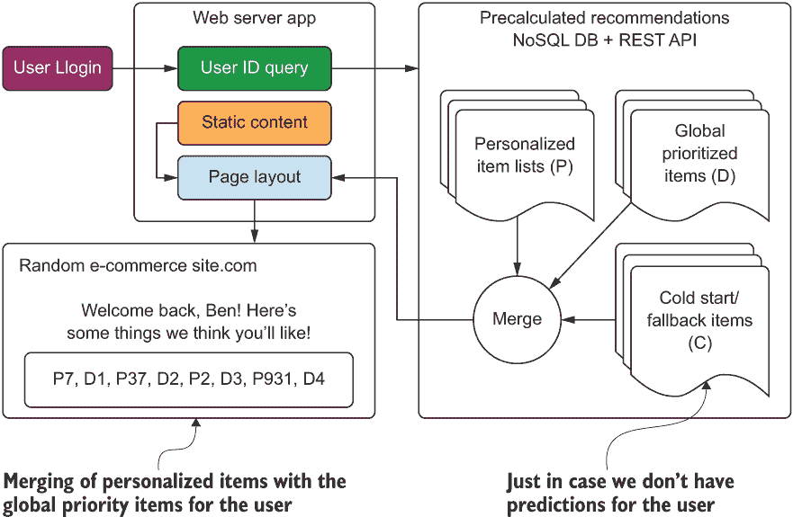

图 4.3 展示了个性化推荐引擎的简化、基本概述，有助于规划个性化项目的需求和功能。这是启动构思会议的核心、最小功能。

注意：即使您不打算生成与网站的用户界面功能（或任何需要与外部服务集成的 ML）交互的预测，在规划阶段明确项目的最终状态流程也是极其有用的。这并不意味着要为业务单元构建完整的架构图进行分享，但一个展示项目各部分如何交互以及最终输出如何被利用的线图可以是一个很好的沟通工具。

像这样的图表有助于与更广泛的团队进行规划讨论。将您的架构图、建模讨论和对推荐系统评分指标适用性的辩论保留在 DS 团队内部讨论中。从用户的角度提出潜在解决方案不仅使整个团队能够讨论重要方面，而且也使非技术团队成员能够对直接影响实验和实际代码生产开发的考虑因素有所见解。

由于该图非常简单，便于看到系统的基本功能，同时隐藏了特别是预计算推荐部分中包含的复杂性，因此讨论可以从房间里每个人都被吸引并能够贡献定义项目初始状态的想法开始。例如，图 4.4 显示了在更广泛的团队中举行初步会议时可能产生的结果，讨论在一个彻底的构思会议中*可以构建*的内容。

将图 4.4 与图 4.3 进行比较，显示了项目构思的演变。重要的是要考虑，如果没有产品团队和 SMEs 参与讨论，DS 团队可能不会考虑许多提出的思想。将实施细节排除在讨论之外，使每个人都能继续关注最大的问题：“我们为什么要讨论构建这个，它应该如何为最终用户工作？”

什么是用户体验之旅？

从商业对消费者（B2C）行业的项目管理领域借鉴而来，用户体验之旅（或旅程图）是对产品的模拟，探索特定用户将如何消费新功能或系统。它类似于一种地图，从用户最初与您的系统交互（例如图 4.4 中的登录）开始，然后跟随他们在系统元素的用户界面交互。

我发现这些不仅对电子商务和基于应用的实现有用，这些实现通过摄入机器学习来提供功能，而且对于设计面向内部系统的设计也非常有帮助。最终，你希望你的预测被某人或某物使用。很多时候，绘制一个图来展示那个人、系统或下游过程将如何与您产生的数据进行交互，这可以

帮助设计机器学习解决方案，以最好地满足客户的需求。映射过程可以帮助找到需要告知设计的信息，不仅包括服务层，还包括在解决方案开发过程中可能需要考虑作为关键功能的元素。

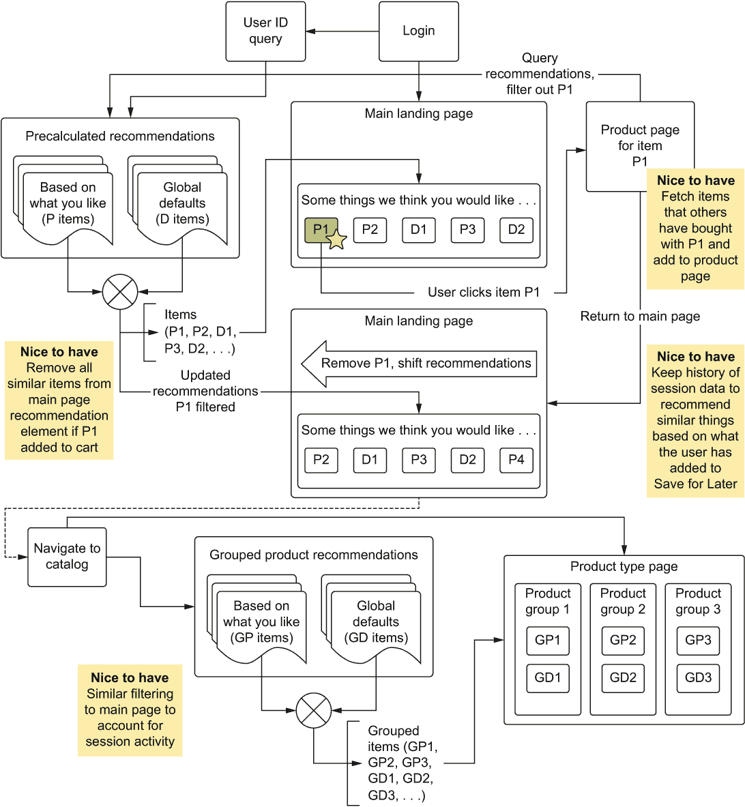

图 4.4：在跨职能团队内的包容性构思会议后，对核心最小功能所做的添加

在图 4.4 中，注意标记为*希望拥有*的四个项目。这是初始规划会议的一个重要且具有挑战性的方面。所有参与的人都希望头脑风暴并努力为问题提供最佳解决方案。DS 团队应欢迎所有这些想法，但在讨论中添加一个警告，即每个添加都*与成本相关*。

应真诚关注项目的关键方面（最小可行产品，MVP）。追求 MVP 确保首先只构建最关键的部分。另一个要求是，在包含任何附加功能之前，它们必须正确运行。辅助项目应标注为辅助项目；想法应记录、可引用、修改，并在项目的实验和开发阶段被引用。曾经可能看似难以逾越的困难，随着代码库的形成可能会变得微不足道，甚至值得将这些功能包括在 MVP 中。

*唯一糟糕的想法是那些被忽视的想法*。不要忽视想法，但也不允许每个想法都进入核心实验计划。如果想法看起来遥不可及且极其复杂，简单地在项目成形后重新审视它，在项目复杂性被更深入地了解时，可以考虑实施的可能性。

将工程元素排除在构思会议之外

在我的职业生涯中，我曾参与过许多规划会议。它们通常分为三类。图 4.2 和图 4.3 中的示例代表了我所见到的并取得最大成功的规划事件。

其中最无用的（那些导致后续会议、线下讨论和混乱的结果）是那些完全关注项目中的机器学习（ML）方面，或者关注使系统工作所需的工程考虑的。

如果模型是主要关注点，那么小组中的许多人可能会感到完全陌生（他们没有知识或参考框架来参与算法讨论）或者烦恼到他们从对话中退出。在这个时候，这仅仅是一群数据科学家在争论他们是否应该使用 ALS 或深度学习来生成原始推荐分数，以及如何将历史信息融合到预测结果中。在市场营销团队面前讨论这些事情是没有意义的。

如果工程方面是重点，那么图表将不再是用户体验流程路径的图表，而是一个架构图，这将使完全不同的一群人感到疏远。工程和建模讨论都是重要的，但它们可以在更广泛的团队之外进行，并且可以在实验完成后迭代式地开发。

在走过这个用户体验工作流程时，可能会发现团队成员对于这些引擎中某一个的工作方式存在相互冲突的假设。市场营销团队认为，如果用户点击了某个东西，但没有将其添加到购物车中，我们可以推断用户不喜欢这个产品。这些团队成员不希望用户再次在推荐中看到这个产品。

这将如何改变 MVP 的实施细节？架构将不得不改变。

现在比在模型构建之前更容易发现这一点，并且能够在规划阶段为这个特性分配范围化的复杂性；否则，更改必须被猴子补丁到现有的代码库和架构中。定义的功能架构也可能，如图 4.4 所示，开始增加对引擎的整体视图：它将要支持什么，以及什么将不会得到支持。功能架构设计将允许数据科学团队、前端团队和设计团队开始关注他们各自需要研究和实验以证明或反驳将要构建的原型。记住，所有这些讨论都是在**在写下一行代码之前**发生的。

提出简单的问题“这个应该如何工作？”并避免专注于标准的算法实现，这是一种习惯，比任何技术、平台或算法更能帮助确保机器学习项目成功。这个问题可以说是确保所有参与项目的人都在同一页上讨论的最重要问题之一。我建议在必要的提问过程中提出这个问题，以挖掘出需要调查和实验的核心功能。如果对核心需求存在困惑或缺乏具体理论，那么在早期阶段花几个小时开会规划，尽可能多地梳理所有业务细节，要比浪费几个月的时间和精力去构建不符合项目发起人愿景的东西要好得多。

理想的最终状态是什么样的？

在一开始（尤其是在进行任何实验之前）很难定义理想的实现方式，但对于实验团队来说，了解理想状态的各个方面非常有用。在这些开放式、意识流的讨论中，大多数机器学习实践者的一个倾向是立即根据那些不了解机器学习的人的想法来判断什么是可能的，什么是不可能的。我的建议是简单地倾听。不要立即关闭一个对话线程，认为它超出了范围或不可能，让对话继续进行。

在这个创意构思阶段，你可能会发现一条你原本可能错过的替代路径。你可能会发现一个更简单、不那么独特且更易于维护的机器学习解决方案，而不是你独自想出来的。我多年来参与的最成功的项目都来自于与广泛的专家（以及当我幸运的时候，实际的用户）进行这类创意讨论，这让我能够将我的思维方式转向尽可能接近他们愿景的创造性方式。

讨论理想的最终状态不仅对更出色的机器学习解决方案有益。让请求构建项目的个人参与进来，他们的观点、想法和创造力可以以积极的方式影响项目。这种讨论还有助于建立信任和项目开发中的所有权感，这有助于团结团队。

学习仔细倾听机器学习项目客户的需要是机器学习工程师最重要的技能之一——比掌握任何算法、语言或平台都重要。这将有助于指导你将要尝试什么，将要研究什么，以及如何以不同的方式思考问题，以提出尽可能最佳的解决方案。

在图 4.4 所示的场景中，初步规划会议的结果是一个理想状态的草图。根据我的经验，这很可能不是最终的引擎（那绝对不是一种可能的情况）。但这个图将指导如何将这些功能模块转换为系统。它将帮助确定实验的方向，以及你需要和团队深入研究以最大限度地减少或防止意外范围蔓延的项目领域，如图 4.5 所示。

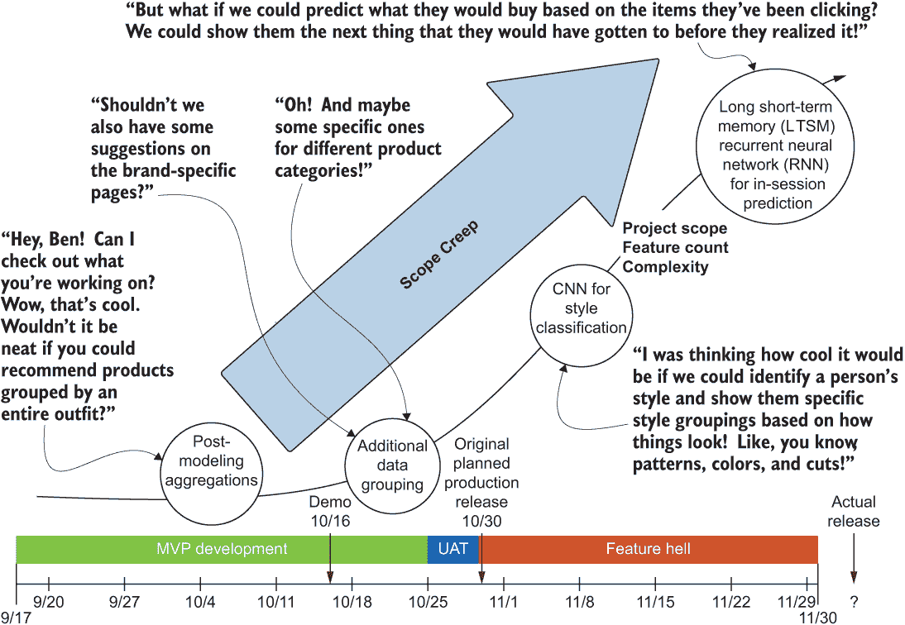

图 4.5 恐怖的机器学习项目范围蔓延。在规划初期就要明确这一点是不可容忍的，你也就不必为此担心。

图 4.5 对于任何曾在初创公司工作过的人来说都应该是熟悉的。那些想要做些非凡事情的驱动和有创造力的人所激发的兴奋和想法是具有感染力的，并且经过适当的调整，可以创建一个真正革命性的公司，该公司在其核心使命上做得非常出色。然而，如果没有这种调整和专注，尤其是对于一个机器学习项目来说，解决方案的规模和复杂性可能会迅速失控。

注意：在我的职业生涯中，我从未允许任何项目达到图 4.5 中展示的那种荒谬程度（尽管有几个项目几乎做到了）。然而，在几乎所有我参与过的项目中，都曾出现过这样的评论、想法和问题。我的建议是：感谢提出想法的人，用非技术性的语言温和地解释目前无法实现，然后继续完成项目。

范围蔓延：几乎肯定会导致项目失败的杀手

不当规划（或未涉及为项目构建的团队进行的规划）是项目缓慢、痛苦死亡的最令人沮丧的方式之一。也被称为“千次请求导致的机器学习死亡”，这个概念在开发的后期阶段出现，尤其是在向对项目构建细节不知情的小组展示演示时。如果客户（内部业务单元）没有参与规划讨论，他们不可避免地会有问题，其中许多问题都是关于演示做了什么。

在我看到的几乎所有情况下（或在我早期试图“英雄式”通过项目而不寻求输入时造成的），演示会议的结果将是数十个要求添加额外功能和需求。这是预期的（即使在设计合理和计划得当的项目中也是如此），但如果实施无法轻松包括与不可变业务操作“法则”相关的关键功能，可能需要完全重新实施项目。这留给决策者一个困难的抉择：是否因为 DS 团队（或个人）的决定而推迟项目，或者完全放弃项目以防止初始失败的重演。

在机器学习的世界里，没有什么比在生产环境中发布后立即收到强烈的负面反馈更令人沮丧的了。收到来自高层管理人员的大量邮件，指出你刚刚发布的解决方案建议给狗主人买猫玩具，这简直是可笑，但如果是向儿童推荐成人主题产品，那几乎是最糟糕的情况。更糟糕的是，在项目即将发布之前，在用户验收测试（UAT）期间意识到需要做出无法克服的一系列更改以满足业务的紧急需求，而且从头开始重新启动项目所需的时间比修改现有解决方案的时间要少。

识别范围蔓延很重要，但其程度可以最小化，在某些情况下甚至可以消除。需要达到适当的讨论水平，并在将单个字符输入实验笔记本或 IDE 之前，将项目的关键方面以有时令人痛苦且详尽的递归和痛苦细节包括在内。

谁是这个项目的支持者，我可以与之合作构建这些实验？

我合作过的任何团队中最有价值的成员都是 SME——被分配与我或我的团队合作以检查我们的工作、回答我们所有的愚蠢问题，并提供有创意的想法，帮助项目以我们都没有预见到的方式发展。虽然通常不是技术人员，但 SME 对这个问题的联系和知识非常深入。花点额外的时间将工程和机器学习的世界翻译成外行术语总是值得的，主要是因为它创造了一个包容的环境，使 SME 能够投资于项目的成功，因为他们看到他们的意见和想法正在被考虑和实施。

我必须强调，你绝对不希望担任这个角色的人是实际的高层项目所有者。虽然一开始可能看起来合乎逻辑，认为能够要求经理、总监或副总裁批准想法和实验会更容易，但我可以向你保证，这只会使项目停滞不前。这些人非常忙碌，正在处理他们委托给其他人的数十个其他重要且耗时的工作。期望这个人——他可能或可能不是项目所涉及领域的专家——提供关于细节的广泛和深入讨论（毕竟，所有机器学习解决方案都是关于细节的），这可能会使项目处于风险之中。在第一次启动会议上，确保有一个来自团队的资源，他是领域专家，并且有时间、可用性和权限来处理这个项目和在整个过程中需要做出的关键决策。

我们何时应该开会分享进度？

由于大多数机器学习项目（尤其是那些需要作为推荐引擎与业务多个部分接口的项目）的复杂性质，会议至关重要。然而，并非所有会议都同等重要。

虽然人们想要按照每周规定的固定时间进行节奏会议非常有吸引力，但项目会议应与项目相关的里程碑相一致。这些基于项目的里程碑会议应该

+   不要替代每日站立会议

+   不要与各部门的团队会议重叠

+   总是应该有整个团队在场进行

+   总要有项目负责人在场，以便对有争议的话题做出最终决定

+   应专注于展示该点当前的状态解决方案，而不要涉及其他内容

虽然出发点良好但具有毒性的外部想法

讨论发生在这些结构化展示和数据聚焦会议之外非常有吸引力。也许你的团队中不参与项目的人好奇，并希望提供反馈和额外的头脑风暴会议。同样，与更大团队中的小组成员讨论你卡住的问题可能也很方便。

我无法强调得更多，这些团队外的讨论可能会造成多大的干扰。在大型项目中（甚至在实验阶段），团队成员做出的任何决定都应该被视为神圣不可侵犯的。涉及外部声音和“试图帮助”的人会侵蚀共同建立的全员沟通环境。

外部构思通常也会给项目引入一种难以管理的*不可控的混乱*，这对于所有参与实施的人来说都是困难的。例如，如果 DS 团队在没有通知和讨论的情况下决定改变预测的交付方式（例如，重用带有附加有效载荷数据的 REST 端点），这将影响整个项目。尽管这可能通过不必创建另一个 REST 端点而节省 DS 团队一周的工作量，但对于前端工程师正在进行的任何工作来说，这将是一场灾难。这可能导致前端团队重做数周的工作。

在没有通知和讨论的情况下引入变更，可能会浪费大量时间和资源，这反过来又削弱了团队和整个业务对流程的信心。这是一种让项目成为积压品或在不同业务单元的微观群体中引入隔阂行为的极其有效的方法。

在早期会议中，DS 团队向小组传达这些基于事件的会议需求是至关重要的。你希望让每个人都知道，对其他团队来说可能微不足道的变更，可能与其相关的重做风险，这可能导致 DS 团队额外工作数周或数月。同样，DS 变更可能对其他团队产生重大影响。

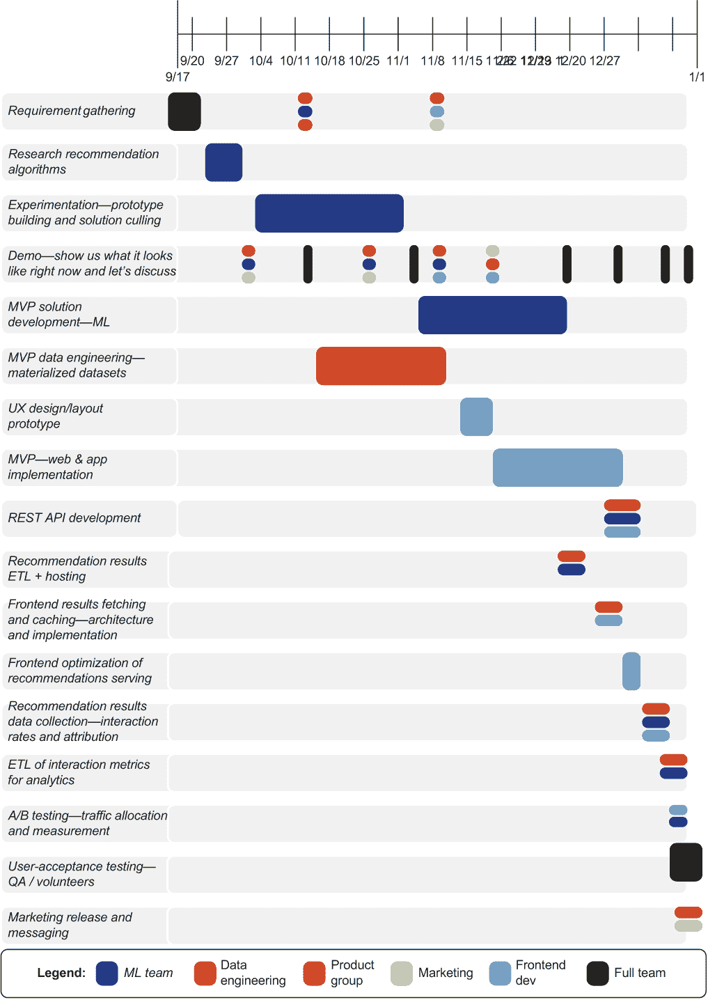

图 4.6 跨职能团队项目时间线图表。注意每个演示和讨论的频率和成员要求（大多数都是针对整个团队）。

为了说明项目的相互关联性以及不同的交付如何影响项目，让我们来看看图 4.6。这张图表显示了在一个相对较大的公司（比如说有超过 1,000 名员工）中，这种解决方案将是什么样子，其中角色和责任在各个小组之间分配。在一个较小的公司（例如，一家初创公司）中，许多这些责任将落在前端或 DS 团队，而不是单独的 DE 团队。

图 4.6 展示了来自机器学习实验的依赖关系如何影响 DE 和前端开发团队的未来工作。增加过多的延迟或需要重做不仅会导致 DS 团队重做其代码，还可能导致整个工程组织浪费数周的工作。这就是为什么规划、频繁展示项目状态以及与相关团队的开放讨论如此关键。

但它什么时候会完成？

诚实总是最好的政策。我见过很多 DS 团队认为在项目规划期间承诺少、交付多是一种明智的做法。这不是一个明智的选择。

许多时候，给予项目一些灵活性以保护项目开发过程中出现的不可预见复杂性的政策被采用。但将这些因素纳入估计的交付日期并不会对团队有任何好处。这是不诚实的，可能会侵蚀业务对团队的信任。更好的做法是向每个人坦诚。让他们知道机器学习项目中有许多未知因素。

这种做法唯一会导致的结果是让内部业务部门客户感到沮丧和愤怒。他们不会喜欢不断地比承诺的时间提前几周得到结果，并且会很快发现你的行为。*信任很重要*。

这枚事实遗漏的另一面与在交付中设定不切实际的期望有关。通过没有告诉业务在项目工作的许多阶段事情可能会出错，并为迭代设计设定激进的交付日期，每个人都将期望在那个日期交付一些有用的东西。未能解释这些是一般目标，可能需要稍作调整，意味着唯一适应不可预见复杂性的方法是通过迫使 DS 团队长时间且艰苦地工作以达到那些目标。

唯一可以保证的是：团队疲惫不堪。如果团队因为努力满足不合理的要求而完全失去动力和疲惫不堪，解决方案永远不会很好。细节会被遗漏，代码中会滋生错误，一旦解决方案投入生产，团队中最优秀的成员将更新他们的简历以寻找更好的工作。

图 4.7 展示了与一般电子商务机器学习项目相关的里程碑的高级甘特图，仅关注主要概念。使用此类图表作为常见的集中沟通工具可以大大提高所有团队的效率，并减少跨学科团队中的一些混乱，尤其是在部门壁垒之间。

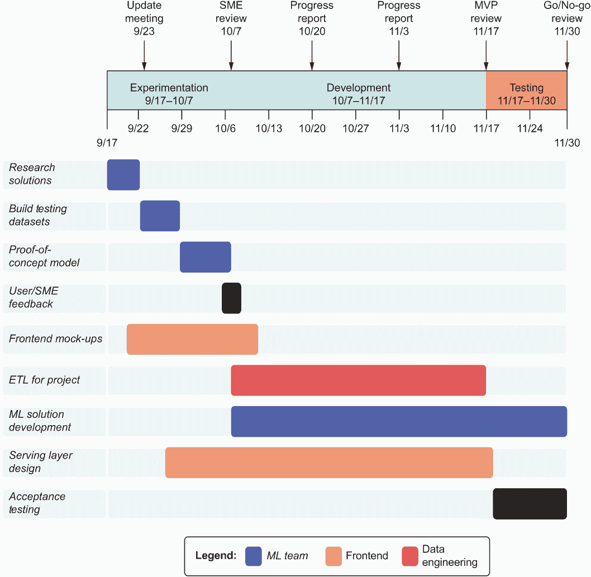

图 4.7 工程和 DS 的高级项目时间线

正如图 4.7 顶部的时间里程碑箭头所示，在关键阶段，整个团队应该聚在一起，确保所有团队成员都理解所开发和发现的内容的影响，以便他们可以集体调整自己的项目工作。我所合作的多数团队都会在这些会议和他们的冲刺计划在同一天举行，这值得注意。

这些断点允许展示演示，探索基本功能，并识别风险。这个常见的沟通点有两个主要目的：

+   最小化浪费在返工上的时间

+   确保项目按照既定目标顺利进行

虽然为每个项目创建甘特图并不是绝对必要的，但至少创建一些可以跟踪进度和里程碑的东西是明智的。对于由单个机器学习工程师负责整个项目的独立项目来说，五彩斑斓的图表和多学科的系统开发跟踪显然没有意义。但即使你可能是在键盘上敲击的唯一一个人，弄清楚项目开发中的主要边界在哪里，并安排一些展示和说明，也可以非常有帮助。

你是否有一个经过调整的模型生成的演示测试集，你想要确保它解决了问题？在那个点上设置一个边界，生成数据，以可消费的形式展示，并展示给请求你帮助解决问题的小组。及时获得——正确的反馈——可以为你和你的客户节省大量的挫败感。

### 4.1.2 设置关键讨论边界

接下来需要问的问题是，“我在我的项目中设置这些边界在哪里？”每个项目在解决问题的所需工作量、参与解决方案的人数以及实施过程中的技术风险方面都是完全独特的。

但一些一般性指南对于设置所需的最小会议数量是有帮助的。在我们计划构建的推荐引擎的范围内，我们需要设定某种形式的日程，表明我们将何时开会，我们将讨论什么，我们可以期待从这些会议中得到什么，最重要的是，如何让所有参与项目的人的积极参与有助于最小化及时交付解决方案的风险。

让我们暂时想象一下，这是公司首次处理涉及机器学习的大型项目。这是这么多开发者、工程师、产品经理和行业专家首次共同工作，他们都没有关于何时开会和讨论项目的想法。你意识到会议确实需要发生，因为你已经在规划阶段确定了这一点。你只是不知道*何时*开会。

在每个团队内部，成员们对能够交付解决方案的节奏有稳固的理解——假设他们正在使用某种形式的敏捷开发，他们很可能会进行敏捷的 scrum 会议和每日站立会议。但没有人真正清楚其他团队的开发阶段是什么样的。

自然地，这个简单答案对所有相关人员来说都是令人沮丧的：“让我们每周三下午一点开会。”建立一个“定期安排的会议”通常会导致团队没有太多可讨论、演示或审查的内容。没有明确的议程，会议的重要性和有效性可能会受到质疑，导致在需要审查关键事项时人们未能出席。

我发现最好的政策是设定具有可审查具体成果的交付日期会议，制定明确的议程，并期望每位与会者做出贡献。这样，每个人都会意识到会议的重要性，每个人的声音和意见都会被听到，并且尽可能尊重宝贵的时间资源。

关于 DS 团队的无意义会议的注意事项

当有有趣的事情在进行时，每个人都想与 DS 团队交谈。这可能是因为对项目进展的一般兴奋，或者是因为商业领导者只是害怕您会在一个项目上完全爆发监狱暴乱，以囚犯管理疯人院的方式开发（希望这不是真的）。

想要开会讨论项目状态是有可理解的原因的。（好吧，如果您的公司担心您会完全变成牛仔/女孩，您可以通过一些成功交付的项目来及时缓解他们的担忧。）然而，举行许多除了陈述自上次会议以来没有变化的进度报告之外几乎没有其他目的的会议，对团队是有害的。

我强烈建议在项目开始时就传达这一概念：为了达到每个演示和演示的预定交付目标，团队需要被大部分放手去完成其工作。面对面进行的问题、思考和有益的对话是受欢迎的（并且是敏捷的基石）。但是，状态会议、进度报告和重复的繁琐计算没有任何作用，应该立即从团队的负担中消除。

这可能是一次困难的对话，尤其是如果公司因为机器学习的创新性而对其持谨慎态度。但应该提出这个问题，以便清楚地传达为什么按时交付可交付成果会带来伤害，而不是帮助。

更合理、有用和高效地利用每个人的时间，是在需要审查新内容时才召开会议来审查正在进行的解决方案。但是，这些决策点何时出现？我们如何定义这些边界，以便在讨论项目元素的需求与因过于频繁的工作干扰会议而产生的疲惫之间取得平衡？

这取决于项目、团队和公司。我想要表达的观点是，每种情况都是不同的。关于会议频率、会议议程以及应参与人员等期望的讨论，简单来说，必须发生，以帮助控制可能出现的混乱，并防止进度偏离解决问题的方向。

研究阶段后的讨论（更新会议）

为了在我们的场景中举例，让我们假设 DS 团队确定必须构建两个模型以满足规划阶段用户旅程模拟的要求。基于团队成员的研究，他们决定想要将协同过滤和频繁模式增长（FP-growth）市场篮子分析算法与深度学习实现进行对比，以查看哪个提供了更高的准确性和更低的拥有成本，用于重新训练。

DS 负责人指派两组数据科学家和机器学习工程师来工作这些竞争性实现。两组都在相同的合成客户数据集上生成模型结果的模拟，向显示这些推荐的实际网站页面的线框提供模拟产品图像。

这次会议不应关注任何实施细节。相反，它应专注于研究阶段的结果：对那些已阅读、研究和尝试过的几乎无限的选择进行筛选。团队发现了很多很好的想法，以及基于现有数据的更大一群潜在解决方案，这些方案可能不会奏效，并将优秀想法的列表缩减为两个实施方案的较量。不要提出你探索过的所有选项。不要提及那些结果惊人但可能需要两年时间来构建的事情。相反，将讨论浓缩到启动下一阶段所需的核心理念：实验。

向 SMEs 展示这两个选项，仅限于展示每个算法解决方案可以做什么，一个或两个算法无法做到什么，以及 SMEs 何时可以期望看到原型以决定他们更喜欢哪一个。如果预测质量没有明显的差异，那么选择哪个的决定应基于方法的缺点，将技术复杂度或实施细节排除在讨论之外。

在这些密集的会议中，讨论应集中在听众能够理解和与之相关联的语言和参考资料上。你可以在脑海中完成翻译并保留在那里。技术细节应由 DS 团队、架构师和工程管理内部讨论。

在我参与的许多案例中，实验测试阶段可能会测试出十几个想法，但只向业务单位展示两个最可接受的想法进行审查。如果实施过于繁重、成本高昂或复杂，最好提出能够*最大程度保证项目成功*的选项——即使它们不如其他解决方案那样花哨或令人兴奋。记住：DS 团队必须维护解决方案，而在实验中听起来非常酷的东西可能会变成维护的噩梦。

实验后阶段（SME/UAT 审查）

在实验阶段之后，DS 小组内的子团队为推荐引擎构建了两个原型。在之前的里程碑会议上，讨论了这两个选项，以观众能够理解的方式展示了它们的优缺点。现在，是时候把预测卡片摆到桌面上，展示解决方案的原型看起来是什么样子。

在之前对潜在解决方案的审查中，展示了一些相当粗略的预测。具有不同产品 ID 的重复产品并排摆放，为某些用户生成了无限的产品类型列表（没有人会那么喜欢腰带），并且列出了演示中的关键问题以供考虑。在这些最初的早期预原型中，业务逻辑和功能需求尚未构建，因为这些元素直接依赖于模型平台和技术选择。

完成实验阶段的演示目标应该是展示核心功能的原型。可能需要根据相关性对元素进行排序。特殊考虑可能需要根据价格点、基于最近非会话的历史浏览和某些客户对某些品牌有隐含忠诚度的理论来推荐项目。每个这些达成一致的功能都应该向整个团队展示。然而，完整的实现不应该在这个阶段完成，而只是模拟以展示最终设计系统的样子。

这次会议的结果应该与初始规划会议的结果相似：可以将未被识别为重要的额外功能添加到开发计划中，如果发现任何原始功能是不必要的，它们应该从计划中移除。回顾原始计划，更新的用户体验可能看起来像图 4.8 所示。

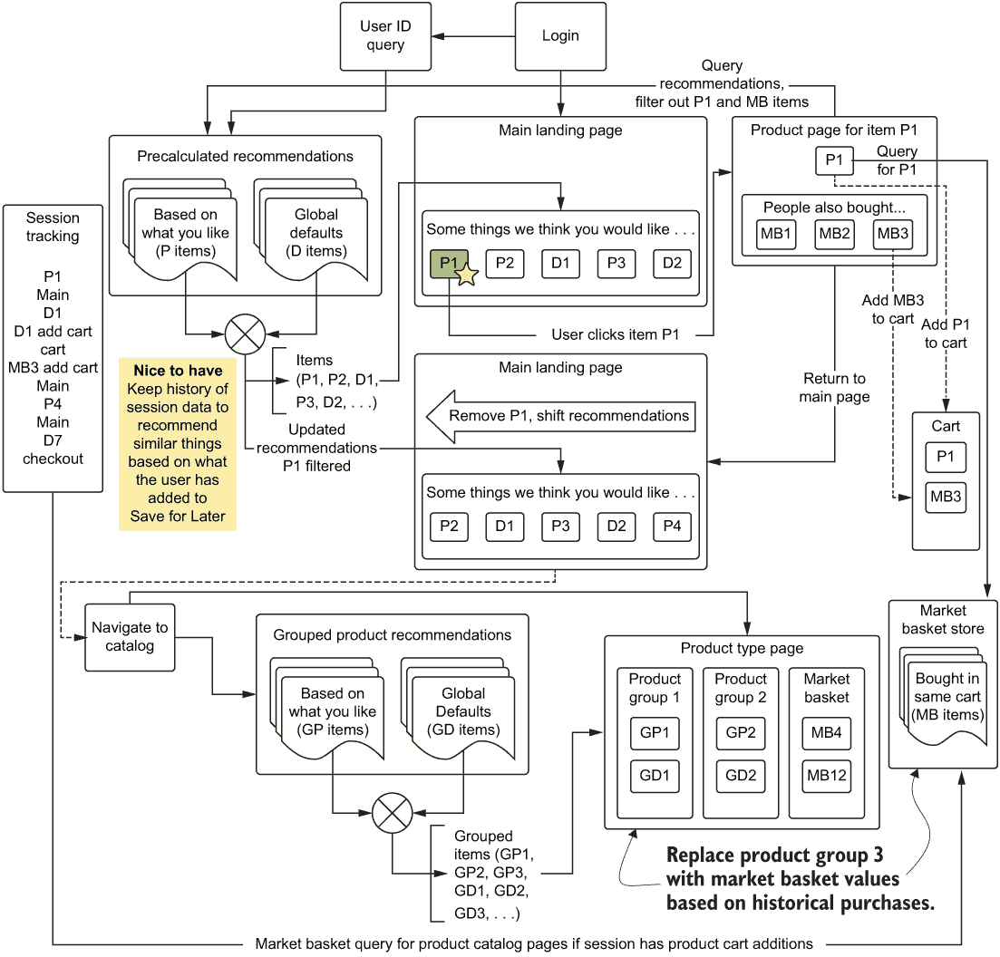

图 4.8 实验结果审查后推荐引擎的最终线框设计

实验阶段结束后，DS 团队可以解释说，早期阶段中那些“想要有”的元素不仅可行，而且可以在不进行大量额外工作的前提下进行整合。图 4.8 展示了这些想法（市场篮子分析、动态过滤和聚合过滤）的整合，同时也保留了一个“想要有”的想法。如果在开发过程中发现整合这个功能是可行的，它就会被保留在这个活生生的规划文档中。

这个阶段会议最重要的部分是确保团队中的每个人（从将处理事件数据传递到服务器进行过滤的前端开发者到产品团队）都了解涉及的元素和移动部件。会议确保团队了解哪些元素需要界定范围，以及需要为冲刺规划创建的一般史诗和故事。对实施进行协作估计至关重要。

开发冲刺审查（面向非技术受众的进度报告）

举行非工程重点的定期会议不仅有助于将信息从开发团队传递到业务部门，还可以作为项目状态的晴雨表，并帮助指示何时可以开始不同系统的集成。尽管如此，这些会议仍然应该是以项目为重点的高层次讨论。

许多跨职能团队在类似项目上的诱惑是将这些更新会议变成一个超级回顾会议或超级冲刺规划会议。虽然这样的讨论可能是有用的（尤其是在各个工程部门之间的集成目的上），但这些话题应该留给工程团队的会议。

全团队进度报告会议应努力展示到那个点的当前状态进度演示。应展示解决方案的模拟，以确保业务团队和领域专家可以对工程师在项目工作中可能忽略的细节提供相关反馈。这些定期会议（无论是每个冲刺还是每两个冲刺一次）可以帮助防止上述可怕的范围蔓延和最后一刻发现一个未被视为必要的关键组件缺失，导致项目交付严重延迟。

MVP 审查（完整的演示与 UAT）

*代码* *完成* 对不同的组织可能意味着不同的事情。一般来说，它被广泛接受为一个状态，即

+   代码已经经过测试（并且通过了单元/集成测试）。

+   系统作为一个整体在评估环境中使用生产规模的数据（模型已在生产数据上训练）运行。

+   所有计划好的、达成一致的功能都已完成，并且按设计运行。

尽管如此，这并不意味着解决方案的主观质量已经达到要求。这个阶段仅仅意味着系统会为这个推荐引擎示例将推荐传递给页面上的正确元素。MVP 审查以及为准备这次会议而进行的关联 UAT 是这个阶段进行主观质量评估的阶段。

这对我们推荐引擎意味着什么？这意味着 SMEs 登录到 UAT 环境并浏览网站。他们根据自己的偏好查看推荐内容，并对所见做出判断。这也意味着模拟了高价值账户，确保 SMEs 通过这些客户的视角看到的推荐与他们对这类用户的了解相一致。

对于许多机器学习实现，指标是一个非常好的工具（并且当然应该被大量利用和记录，用于所有建模）。但确定解决方案是否在质量上解决问题的关键，是使用内部用户和专家的广泛知识，他们在系统部署给最终用户之前就可以使用该系统。

在评估历时数月开发的解决方案的 UAT 反馈的会议中，我曾看到业务团队和 DS 团队之间就某个特定模型的验证指标更高，但定性审查质量却远低于相反情况而爆发争论。这正是为什么这次会议如此关键的原因。它可能会揭露在规划阶段、实验阶段以及开发阶段都未注意到的明显问题。对解决方案结果的最终检查只能使最终结果更好。

关于这次会议和审查期间对质量估计的注意事项，有一点至关重要：几乎每个项目都伴随着大量*创造者偏见*。在创造某物时，尤其是具有足够挑战性的令人兴奋的系统，创造者可能会因为对它的熟悉和喜爱而忽略和错过重要的缺陷。

*父母永远无法看到自己孩子有多么丑陋或愚蠢。无条件地爱你所创造的一切是人的天性。*

——每一位理性的父母，都是如此。

如果在这些审查会议结束时，唯一的回应是对解决方案的压倒性正面赞誉，那么团队应该有所担忧。创建一个由共享项目所有权集体感的跨职能团队的一个副作用是，对项目的情感偏见可能会模糊对其有效性的判断。

如果你曾参加过关于解决方案质量的总结会议，却听不到任何问题，那么你和你所在的项目团队最好邀请公司中与此项目无关的其他人参与。他们无偏见且客观的视角可能会带来可操作的改进或修改，这些是团队在近乎家庭般热爱项目的偏见下可能会完全忽略的。

预生产审查（最终演示与 UAT）

最后的预生产审查会议就在“启动时间”之前。最终修改已完成，UAT（用户接受测试）开发完成的测试反馈已处理，系统已经连续几天没有出现故障。

发布计划在接下来的周一（提示：永远不要在周五发布），需要对系统进行最终检查。系统负载测试已完成，通过模拟高峰流量 10 倍的用户量来衡量响应性，日志记录正在工作，并且在对合成用户行为进行模型重新训练后，模型已适应模拟数据。从工程角度来看，所有测试都已通过。

*那么我们为什么又要开会呢？*

—所有被无数会议累垮的人

在发布前的这次最终会议应该回顾与原始计划的比较，被拒绝的超出范围的功能，以及任何新增内容。这有助于了解发布后应查询的分析数据。用于收集推荐项交互数据的系统已经构建，并创建了一个 A/B 测试数据集，允许分析师检查项目的性能。

这次最终会议应关注数据集将位于何处，工程师如何查询它，以及哪些图表和报告将可供非技术团队成员使用（以及如何访问它们）。这个新引擎在业务部分运行的前几个小时、几天和几周将受到大量的审查。为了保持分析师和 DS 团队的精神健康，确保人们可以自助访问项目的指标和统计数据，这将确保公司中每个人，即使那些没有参与创建解决方案的人，也能做出基于关键数据的决策。

关于耐心的注意事项

对于电子商务公司来说，发布一个像推荐引擎这样对业务有重大影响的 ML 项目是令人恐惧的。业务领导者将想知道今天的数字是昨天的。嘿，他们可能还想知道明天的销售额将如何，就像昨天一样。在这种期待和恐惧的水平上，传达分析结果耐心的重要性是重要的。重要的是提醒人们要呼吸。

许多潜在因素都可能影响项目感知的成功或失败，其中一些可能在设计团队的控制范围内，而另一些则完全超出控制，完全未知。由于这些潜在因素众多，对设计有效性的任何判断都需要推迟，直到收集到足够关于解决方案性能的数据，以便进行统计上有效的裁决。

等待，尤其是对于一个投入了如此多时间和精力的团队来说，看到项目转向生产使用是一个挑战。人们会不断检查状态，以实验室老鼠按杠杆获取奶酪的速度和猛烈程度，追踪广泛的聚合和趋势中的互动结果。

对于 DS 团队来说，为负责此项目的决策者提供统计分析的速成课程是最有益的。对于一个如推荐引擎这样的项目，以相对较高的水平解释诸如方差分析（ANOVA）、复杂系统中的自由度、最近、频率、货币（RFM）群体分析以及置信区间等主题（主要关注分析在短时间内将有多大的信心——好吧，具体来说，就是分析将有多大的不确定性），将有助于这些人做出明智的决策。根据用户数量、你服务的平台数量以及客户到达你网站的频率，可能需要几天或几周的时间才能收集足够的数据，以便对项目对公司的影响做出明智的决策。

同时，努力安抚担忧，抑制对看到销售大幅增长可能与项目直接相关的期望。只有通过仔细和负责任的数据分析，任何人才能知道新功能可能带来的参与度和收入提升。

## 4.2 不要浪费我们的时间：与跨职能团队会议

在第三章讨论项目的规划和实验阶段时，指出要记住的最重要方面之一（除了机器学习工作本身之外）是那些阶段的**沟通**。收到的反馈和评估可以是一个无价的工具，以确保最小可行产品（MVP）按时交付，并且尽可能正确，以便整个开发工作可以继续进行。

让我们再次查看图 4.7 中的甘特图，以跟踪每个团队在整个阶段中的工作的高层次进展。然而，出于沟通的目的，我们只关注图 4.9 中显示的上部部分。

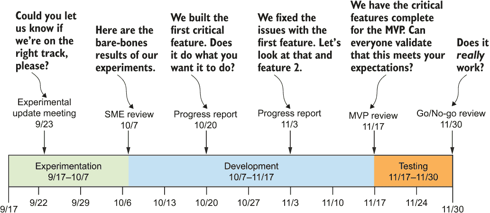

图 4.9 项目中关键会议边界的翻译

根据要构建的项目类型，可能在整个阶段以及发布后几个月的后续会议中会有无数更多的会议（包括审查指标、统计数据和解决方案弹性的估计）。例如，即使开发阶段需要九个月，每周两次的进度报告会议也只是对上一个冲刺中成就进展的重复讨论。我们将在下一节详细分解这些阶段。

### 4.2.1 实验更新会议：我们在这里知道我们在做什么吗？

*实验更新会议*是 DS 团队最害怕的会议，而其他所有人都对此会议充满期待。这个会议在 DS 团队进行半成品原型实现和未完成研究的过程中打断他们。元素处于流动状态，几乎达到最大熵。

然而，这个会议可能是项目中第二重要的会议。这是团队成员最后一次优雅地举起白旗表示投降的时候，如果他们发现项目不可行，最终会花费比团队分配的时间和经济资源更多，或者其复杂性如此之大，以至于在接下来的 50 年内无法发明出满足要求的技术。这是一个诚实和反思的时刻。如果情况需要，这是一个放下自我，承认失败的时刻。

在这次讨论中占主导地位的压倒性问题应该是，“我们实际上能否解决这个问题？”在这个阶段，关于项目的任何其他讨论或想法都是完全不相关的。DS 团队的任务是报告其发现的状态（例如，不涉及特定模型的具体细节或他们将为测试采用的其他算法）。这次会议最关键的讨论点应该是以下内容：

+   原型开发的进展如何？

    +   你是否已经弄清楚你正在测试的任何事物？

    +   哪一个看起来目前最有希望？

    +   你打算停止追求你计划测试的任何东西吗？

    +   我们是否按计划在预定截止日期前完成原型？

+   你迄今为止发现了哪些风险？

    +   DE 团队需要了解的数据存在哪些挑战？

    +   我们是否需要团队不熟悉的新技术、平台或工具？

    +   就目前而言，你是否觉得这是一个我们可以解决的问题？

除了这些直接问题外，目前实际上没有太多其他可以讨论的内容，除了浪费 DS 团队的时间。这些问题都是为了评估这个项目在人员、技术、平台和成本方面的可行性。

举起白旗：在承认失败可以接受的情况下

很少有严肃的 DS 人士愿意承认失败。对于一个刚从博士项目中毕业的人来说，这个项目可能持续数月甚至数年，承认问题无法解决的想法永远不会进入他们的脑海。这对他们来说也是好事，因为这些人正是发明新算法的人！（注意：他们得到了公司的批准来做这件事，而不仅仅是为了新颖而选择以新颖的方式解决问题。）

然而，在为公司开发机器学习（ML）解决方案时，问题不在于“这个问题对我们来说是否可以解决”，而在于我们是否能在足够短的时间内创造出解决方案，以免浪费过多的金钱和资源。急于找到解决方案的愿望可能会模糊即使是最高技能的 ML 实践者的能力评估。

在积累了足够多的通过维护脆弱或不稳定解决方案的斗争经验后，人们会获得一定的自制力。有了这样的认识，解决“所有问题”的欲望可以被抑制，即解决方案可能并不适合这个特定的项目、公司或参与维护该解决方案的团队。毕竟，并非每个项目、团队或公司都需要解决最苛刻和复杂的问题。每个人都有自己的极限。我可以向你保证，即使那面失败的白色旗帜被举起，也还有足够多的 DS 项目等待团队和公司在接下来的几个世纪里去完成。

越早意识到这一点越好。如前所述，随着时间和精力投入的增加，创作者放弃其作品的意愿只会增长。如果你能尽早叫停一个项目（并且希望能够认识到这不值得继续追求的迹象），你将能够转向更有价值的事情，而不是盲目地通过那些最终只会带来挫败感、遗憾以及完全失去对团队——在最坏的情况下，对贵公司机器学习（ML）的信心——的解决方案。

假设本次会议的所有答案都是积极的，工作应正式开始。（希望不会进一步干扰 DS 团队成员的工作，以便他们能够满足下一个截止日期并在下次会议上进行展示。）

### 4.2.2 SME 审查/原型审查：我们能解决这个问题吗？

早期会议中最重要的莫过于*SME 审查*，你真的不希望错过这个环节。这是资源承诺发生的时候。这是最终决定这个项目是否会发生，或者是否会被放入待办事项列表中，直到解决一个更简单的问题。

在这次审查会议中，应该提出与之前 SME 团队会议中相同的问题。唯一的修改是，它们应该根据现在对工作范围有更全面的了解来调整，以回答是否具备开发完整解决方案的能力、预算和意愿。

这场讨论的主要焦点通常是模拟的原型。对于我们的推荐引擎，原型可能看起来像是带有叠加的产品图像和标签的网站合成线框。为了这些演示的目的，使用真实数据总是有帮助的。如果你向一组行业专家展示推荐演示，展示他们的数据。展示他们的账户推荐（当然是在他们的同意下！）并评估他们的反应。记录他们给出的每一个正面——更重要的是，每一个负面——印象。

如果它真的很糟糕怎么办？

根据项目、涉及的模型以及处理机器学习任务的总体方法，对原型的主观评价“糟糕”可能是微不足道的（适当调整模型，增加特征集等）或者完全不可能（没有数据来增加额外的特征请求，数据不够细粒度以解决问题，或者提高预测以满足团队需求可能需要大量的魔法，因为目前还没有解决该问题的技术）。

快速提炼出任何已识别问题发生的原因至关重要。如果原因明显且众所周知，可以通过 DS 团队进行修改，那么只需这样回答即可。“别担心，我们会调整预测，这样你就不会看到一双又一双的凉鞋并排出现”是完全可行的。但如果问题性质极其复杂，例如“我真的不想看到波希米亚长裙旁边是朋克风格的鞋子”（希望你在会议期间能快速搜索这些术语的含义），那么回应应该是深思熟虑地向对方表达，或者记录下来进行额外的研究，并设定时间和努力的上限。

在下一个合适的机会，回应可能是这样的：“我们调查了这个问题，因为我们没有数据表明这些鞋子的风格，我们不得不构建一个 CNN 模型，训练它来识别风格，并创建数百万个标签来识别我们产品目录中的这些风格。这可能会花费几年时间来构建。”或者“我们调查了这个问题，因为我们有每个产品的标签，我们可以轻松地按风格类型分组推荐，给你更多关于产品混合的灵活性。”

在原型评审会议之前，确保你知道什么可行什么不可行。如果你遇到一个不确定的请求，请使用机器学习的八句黄金法则：“我不知道，但我去查一下。”

在演示结束时，整个团队应该能够判断项目是否值得继续推进。你希望看到的是*共识*，即推荐的方法是每个人都（无论他们是否了解其工作原理）都*舒适地认为是一个合适的方向*，项目即将采取的方向。

一致性并非绝对关键。但如果每个人的担忧都得到了解决，并且进行了无偏见和理性的讨论以缓解他们的恐惧，团队将更加团结。

### 4.2.3 开发进度审查：这个玩意儿能行吗？

*开发进度审查*是开发过程中“纠正航向”的机会。团队应该关注里程碑，例如展示正在开发的功能当前状态的里程碑。在实验审查阶段使用的相同线框方法是有用的，同样，使用相同的原型数据，以便整个团队能够看到早期阶段的直接比较。为 SME 提供共同的参考框架有助于他们从他们完全理解的角度评估解决方案的主观质量。

在这些会议的前几场应该是实际开发的审查。虽然细节不应该涉及到软件开发的具体方面、模型调整或实施的详细技术，但应该以抽象术语讨论功能开发的总体进度。

如果在之前的会议中，预测的质量被判定为在某些方面不足，应该展示更新和修复的演示，以确保问题得到了 SME 小组的满意解决。仅仅声称“功能已完成并已检查到 master”是不够的。相反，应该证明这一点。用他们最初识别问题的相同数据向他们展示修复。

随着项目不断推进，这些会议应该变得越来越短，并且更加专注于集成方面。当推荐项目的最终会议到来时，SME 小组应该正在查看一个在 QA 环境中的网站的实际演示。推荐应该按照计划通过导航进行更新，并且应该检查在不同平台上的功能验证。在这些后期阶段，复杂性增加时，将项目的 QA 版本构建推送给 SME 团队成员，以便他们可以在自己的时间内评估解决方案，并在定期安排的节奏会议上向团队提供反馈，这可能是有帮助的。

预想不到的变化：欢迎来到机器学习的世界

说大多数机器学习项目很复杂，这只是一个悲哀的轻描淡写。一些实现，比如推荐引擎，可能是公司中最复杂的代码库之一。抛开建模，这可能相对复杂，预测的相关规则、条件和用法可能复杂到足以几乎保证在最彻底的计划阶段也会遗漏或忽视。

机器学习项目的有时不稳定但通常可互换的本质意味着事情会发生变化。这是可以接受的。将敏捷方法应用于机器学习应该允许变化尽可能小地干扰工作（和代码）。

可能数据不存在或成本太高，无法在构建到那个阶段的基础上解决特定问题。通过一些方法上的改变，解决方案可以实现，但代价是增加解决方案的复杂性或成本。这既是幸运的也是不幸的（取决于需要改变什么），这是机器学习的一部分。

明白事物会变化的重要一点是，当出现阻碍时，应清楚地通知所有需要了解变化的人。这是否影响服务层的 API 合约？那就与前端团队沟通；不要召开全员会议来讨论技术细节。这是否影响过滤性别特定推荐的能力？这对 SMEs 来说是个大问题，并且讨论解决方案可能会让团队中的每一个聪明头脑一起解决问题和探索替代方案。

当问题出现（它们会出现），只需确保你不是在进行“忍者解决”。不要默默地对看似可行的解决方案进行黑客攻击，并且不告诉任何人。你后来可能会创建未预见的问题的机会非常高，解决方案的影响应该由更大的团队进行审查。

### 4.2.4 MVP 审查：我们要求的功能是否已经构建完成？

到你进行**MVP 审查**的时候，每个人都应该既兴奋又对项目感到相当疲惫。这是最后阶段；内部工程审查已经完成，系统运行正常，集成测试全部通过，在大规模突发流量下已经测试了延迟，所有参与开发的人都准备好度假了。

我看到团队和公司在这个阶段直接将解决方案发布到生产环境的次数令人震惊。每次发生这种情况，他们都会后悔。在构建并达成一致意见的 MVP 之后，接下来的几个迭代应该专注于代码加固（创建可测试、可监控、可记录且经过仔细审查的生产就绪代码——我们将在本书的第二部分和第三部分中讨论所有这些主题）。

成功的发布涉及在工程 QA 阶段完成后，解决方案进行 UAT 的阶段。这个阶段旨在衡量解决方案的主观质量，而不是可以计算（预测质量的统计指标）或由对项目有情感投入的 SME 团队进行的带有偏见的客观质量衡量。

UAT 阶段是极好的。正是在这个时候，解决方案以来自项目外一组人的反馈的形式首次亮相。这组新鲜、无偏见的眼光可以看到拟议的解决方案本身，而不是构建它所投入的辛勤工作和情感。

虽然项目中的所有其他工作都通过工作/不工作的布尔尺度进行有效衡量，但机器学习方面是一个根据预测的最终消费者的解释而变化的质量滑动尺度。对于像推荐的相关性这样的主观性内容，这个尺度可以非常广泛。为了收集相关数据以创建调整，一种有效的技术是调查（尤其是对于像推荐这样的主观性项目）。基于有效质量的有控制测试和数字排名的反馈可以允许在分析响应时实现标准化，从而对需要添加到引擎或需要修改的设置中的任何额外元素提供一个广泛的估计。

评估和指标收集的关键方面是确保评估解决方案的成员在以任何方式参与创建它，或者他们不了解引擎的内部工作原理。对引擎任何方面的功能有先知可能会污染结果，并且如果任何项目团队成员被包括在评估中，审查数据将立即受到怀疑。

在评估 UAT 结果时，使用适当的统计方法对数据进行标准化非常重要。分数，尤其是那些在大数值范围内的分数，需要在每个用户提供分数的范围内进行标准化，以考虑到大多数人都有（有些人倾向于给出最高或最低分数，其他人则围绕平均值波动，还有一些人在他们的评价分数中过于积极）。一旦标准化，就可以评估和排名每个问题的相对重要性以及它对模型整体预测质量的影响，并确定实施的可行性。如果时间足够，变化是合理的，并且实施风险足够低，不需要额外的完整 UAT 轮次，这些变化可以实施，以在发布时创建最佳可能的解决方案。

如果你从未在 UAT 审查会议中找到任何问题，那么要么是你所在的团队运气好得令人难以置信，要么是评估者完全失去了判断力。这在小型公司中相当常见，几乎每个人都完全了解并支持项目（伴随着不健康的确认偏差）。在这种情况下，引入外部人员来验证解决方案可能是有帮助的（前提是项目不是像欺诈检测模型或其他极端敏感的东西）。

许多在为外部客户构建解决方案方面取得成功的公司通常会进行 alpha 或 beta 测试新功能，正是为了这个目的：从对其产品和平台有投资的客户那里获取高质量反馈。为什么不使用你最热情的最终用户（无论是内部还是外部）来提供反馈呢？毕竟，他们将是使用你正在构建的东西的人。

### 4.2.5 预生产审查：我们真心希望没有搞砸这件事

项目即将结束。最终功能已根据 UAT（用户验收测试）反馈添加，开发已完成，代码已加固，QA（质量保证）检查全部通过，解决方案已在一周多的压力测试环境中稳定运行，没有任何问题。性能收集指标已设置，分析报告数据集也已创建，准备填充以衡量项目的成功。最后要做的就是将其部署到生产环境。

最好是再开一次会，但不是为了自我庆祝（不过，稍后作为跨职能团队，一定要庆祝一下）。这次最终的*预生产审查*会议应该结构化为基于项目的回顾和分析功能。会议上的每个人，无论专业领域和贡献水平如何，都应该问同样的问题：“我们是否构建了我们最初设定的东西？”

要回答这个问题，应该将原始计划与最终设计解决方案进行比较。原始设计中每个功能都应该经过检查并验证其在 QA（测试）环境中是否能够实时运行。在切换页面时，项目是否会过滤掉？如果连续添加多个项目到购物车中，是否所有相关产品都会被过滤，或者只是最后一个？如果从购物车中移除项目，产品是否仍然从推荐中移除？如果用户浏览网站并添加了一千个产品到购物车然后又全部移除，会发生什么？

希望到这一点之前，所有这些场景都已经进行了测试，但与整个团队一起进行这项重要练习，以确保功能最终被确认已正确实现，这是一个重要的步骤。在此之后，就无法回头了；一旦发布到生产环境中，它就掌握在客户手中，无论好坏。我们将在后面的章节中讨论如何处理生产中的问题，但就目前而言，想想如果发布了一个根本性的错误，会对项目的声誉造成多大的损害。正是在这个最后的预生产会议中，可以在不可逆转的生产发布之前计划关注点和最后的修复。

## 4.3 对实验设置限制

我们已经为推荐引擎项目付出了巨大的努力，准备到了这一点。我们已经参加了会议，表达过担忧和风险，制定了设计计划，并根据研究阶段，我们有一套明确的模型要尝试。现在是时候来点爵士乐，发挥创意，看看我们能否做出一些不是完全垃圾的东西。

然而，在我们过于兴奋之前，重要的是要意识到，就像 ML 项目工作的所有其他方面一样，我们应该适度行事，并且我们做的事情背后要有深思熟虑的目的。这一点在实验阶段比项目的任何其他方面都更为重要——主要是因为这是少数几个完全隔离的阶段之一。

如果我们拥有世界上所有的时间和资源，我们会对这个个性化的推荐引擎做些什么呢？我们会研究最新的白皮书并尝试实施一个完全新颖的解决方案吗？（这取决于你的行业和公司。）我们会考虑构建一个广泛的推荐模型集合，以涵盖我们所有的想法吗？（让我们基于客户的生命周期价值分数、倾向性和一般的产品组亲和力，为每个客户群体构建一个协同过滤模型，然后将其与 FP-growth 市场篮子模型合并，以填充某些用户的稀疏预测。）也许我们会构建一个图嵌入到深度学习模型中，以找到产品和用户行为之间的关系，从而可能创造出最复杂和最准确的预测。

所有这些想法都很不错，如果我们的公司整个目的就是向人类推荐物品，那么它们都可能是值得的。然而，在大多数公司最紧缺的资源——时间上，这些想法都是**非常昂贵**的。

我们需要理解时间是一种有限的资源，业务单位请求解决方案的耐心也是如此。正如我们在 3.2.2 节中讨论的，实验的范围直接与可用资源相关：团队中数据科学家的数量，我们将尝试比较的选项数量，以及，最重要的是，我们完成这项工作的时间。我们知道时间和开发者的限制有限，因此我们需要控制的最终限制是，在 MVP 阶段只能构建这么多内容。

想要完全构建出心中所想并看到它按设计工作是完全有诱惑力的。这对于帮助自身生产力的内部工具或 DS 团队内部的内部项目来说效果很好。但几乎每个机器学习工程师或数据科学家在其职业生涯中将要从事的其他所有工作都有客户方面，无论是内部还是外部。这意味着将有人依赖你的工作来解决一个问题。他们可能对解决方案的需求有细微的理解，这可能与你的假设不一致。

不仅如前所述，将它们纳入项目与目标对齐的过程中是极其重要的，而且在没有获取他们对所建内容有效性的意见的情况下，完全构建一个紧密耦合且复杂的解决方案可能存在潜在危险。解决这一问题，即让专家参与过程的方法，是在将要测试的原型周围设定边界。

### 4.3.1 设定时间限制

可能最简单的方法是通过在初始原型上花费过多时间和精力来拖延或取消一个项目。这可能出于任何数量的原因，但我发现，其中大多数是由于团队内部沟通不畅，非 DS 团队成员对 ML 过程的工作方式（通过测试进行细化，其中包含适量的试验、错误和重工作）的错误假设，或者经验不足的 DS 团队认为他们需要在任何人看到他们的原型之前有一个“完美”的解决方案。

防止这种混淆和完全浪费时间最好的方法是为围绕想法验证的实验设定时间限制。由于这种限制的本质，它将消除这一阶段所编写的代码量。项目团队的所有成员都应该清楚，在规划阶段表达的大多数想法在验证阶段都不会被实施；相反，为了做出关于采用哪种实现方式的关键决策，项目应该仅测试最基本的部分。

图 4.10 显示了实现实验阶段目标所需的最小化实现量。在此阶段，任何额外的工作都不符合当前的需求：决定一个在大规模和成本上都能良好工作，并且符合客观和主观质量标准的算法。

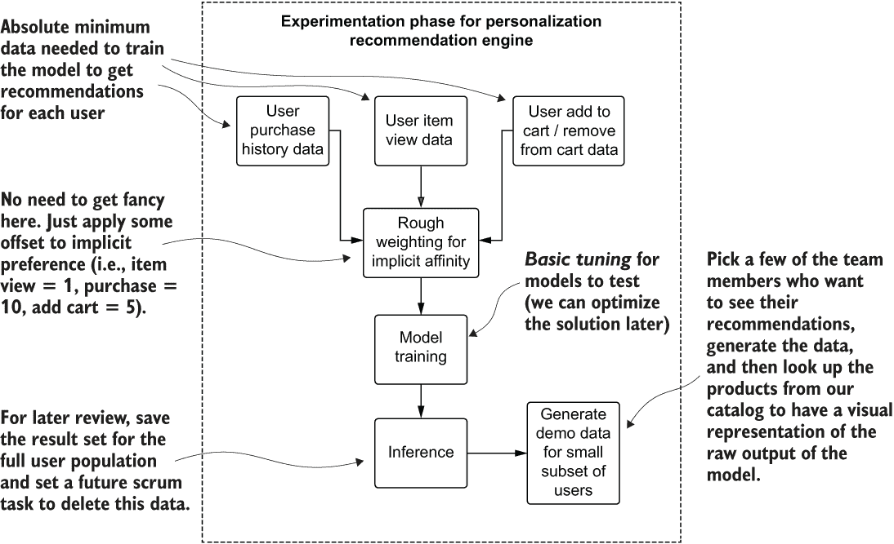

图 4.10 为测试想法的团队映射高级实验阶段

相比之下，图 4.11 展示了基于规划会议初始计划的某些潜在核心特征的简化视图。

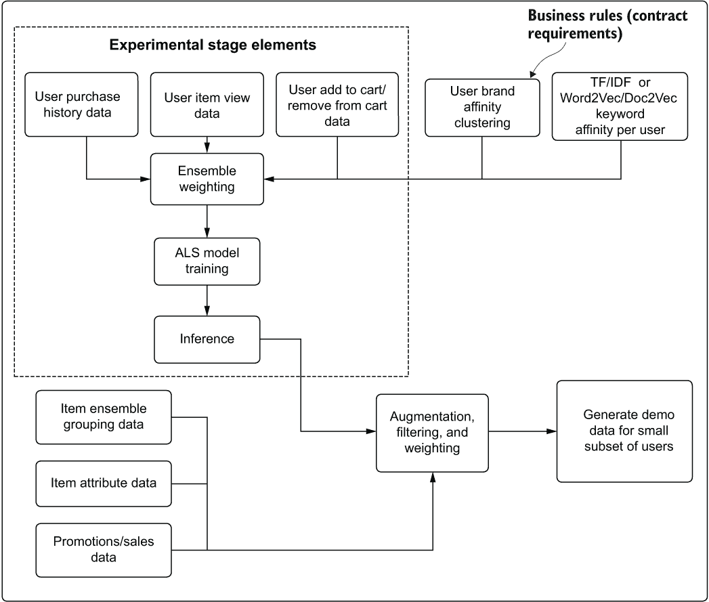

图 4.11 通过有效的实验和从更大团队获得反馈，实现开发阶段涉及到的扩展功能的伪架构计划

通过比较图 4.10 和图 4.11，应该很容易想象从第一个计划到第二个计划的过渡中工作范围的扩大。需要构建全新的模型，需要进行大量的动态运行特定聚合和过滤，必须整合自定义权重，并且可能需要生成数十个额外的数据集。这些元素中的任何一个都不能解决实验边界上的核心问题：我们应该选择哪个模型进行开发？

限制做出这个决定的时间将防止（或至少最小化）大多数机器学习从业者想要构建解决方案的自然倾向，无论已经制定出的计划如何。有时强迫完成更少的工作对于减少流失和确保正在工作的正确元素是有好处的。

关于实验代码质量的说明

实验代码应该有点“粗糙”。它应该是脚本化的，注释掉的，丑陋的，几乎不可测试的。它应该是一个脚本，里面充满了图表、图形、打印语句和所有种类的糟糕编码实践。

毕竟，这是一个实验。如果你正在遵循紧张的进度表来做出实验性的决策，你很可能没有时间去创建类、方法、接口、枚举器、工厂构建模式、配置传递等等。你将使用高级 API、声明性脚本和静态数据集。

不要担心实验结束时代码的状态。它应该作为开发努力的参考，在这些努力中，将进行适当的编码（并且绝不应该在最终解决方案上扩展实验代码），团队将构建可维护的软件，使用标准的软件开发实践。

但在这个阶段，并且仅在这个阶段，编写一些看起来相当糟糕的脚本通常是可行的。我们有时都会这样做。

### 4.3.2 你能将其投入生产吗？你愿意维护它吗？

对于更大的团队来说，实验阶段的主要目的是决定模型实现的预测能力，而在 DS 团队内部，其中一个主要目的是确定这个解决方案是否适合团队。DS 团队的负责人、架构师或高级 DS 人员应该仔细审查这个项目将涉及的内容，提出困难的问题，并给出诚实的答案。以下是一些最重要的问题：

+   这个解决方案需要多长时间才能构建？

+   这个代码库将会多么复杂？

+   根据需要重新训练的日程安排，这个解决方案的培训成本将会是多少？

+   我的团队是否有维护这个解决方案所需的技能？每个人是否都了解这个算法/语言/平台？

+   如果训练或推断的数据发生重大变化，我们将多快能够修改这个解决方案？

+   有没有人报告过使用这种方法/平台/语言/API 取得成功的案例？我们是在重新发明轮子，还是在制造一个方轮？

+   为了使这个解决方案在满足所有其他功能目标的同时工作，团队需要额外做多少工作？

+   这个解决方案是否具有可扩展性？当不可避免地需要这个解决方案的 2.0 版本时，我们能否轻松地增强这个解决方案？

+   这个解决方案是否可测试？

+   这个解决方案是否可审计？

在我的职业生涯中，无数次我要么是构建这些原型的人，要么是在审查他人原型时提出这些问题的人。尽管机器学习实践者看到结果的第一反应通常是“让我们选择结果最好的一项”，但很多时候，“最好”的那一项最终要么几乎不可能完全实施，要么难以维护。

考虑到维护性和可扩展性，这些关于未来的问题至关重要，无论是关于正在使用的算法、调用算法的 API，还是它运行的平台。花时间正确评估实施的生产特定问题，而不是仅仅评估模型原型的预测能力，这可能是成功解决方案和空谈之间的区别。

### 4.3.3 机器学习项目中的 TDD vs. RDD vs. PDD vs. CDD

在开发软件时，我们似乎有无穷无尽的方法可供选择。从瀑布模型到敏捷革命（及其无数种风味），每种方法都有其优点和缺点。

我们不会讨论哪种开发方法可能最适合特定项目或团队的具体细节。已经出版了一些绝对出色的书籍，深入探讨了这些主题，我强烈推荐阅读它们以提高机器学习项目的开发流程。Greg Smith 和 Ahmed Sidky 的《在一个不完美的世界中变得敏捷》（Manning，2009 年）以及 Lasse Koskela 的《测试驱动：Java 开发者的 TDD 和验收 TDD》（Manning，2007 年）是值得注意的资源。然而，在这里值得讨论的是四种机器学习开发的一般方法（其中一种是成功的方法，其他则是警示性的故事）。

测试驱动开发或特性驱动开发

纯粹的*测试驱动开发*（TDD）对于机器学习项目来说极具挑战性（并且最终无法达到传统软件开发所能达到的相同测试覆盖率），这主要是因为模型本身的非确定性。纯粹的*特性驱动开发*（FDD）方法在项目过程中可能会导致大量的返工。

但大多数成功的机器学习项目方法都融合了这两种开发风格的一些方面。保持工作增量化、适应变化，并专注于模块化代码，这些代码不仅可测试，而且完全专注于满足项目指南所需的功能，这是一种经过验证的方法，有助于按时交付项目，同时创建一个可维护和可扩展的解决方案。

这些敏捷方法需要借鉴和调整，以创建一个有效的开发策略，不仅适用于开发团队，也适用于组织的整体软件开发实践。此外，特定的设计需求可能决定了实施特定项目的不同方法。

为什么我想使用不同的开发哲学？

当讨论机器学习作为一个广泛的话题时，我们面临过度简化的风险，这是一个极其复杂且动态的学科。由于机器学习被用于如此广泛的应用场景（以及拥有如此广泛的一套技能、工具、平台和语言），各种项目之间复杂性的差异程度确实是惊人的。

对于像“我们希望预测客户流失”这样简单的项目，以 TDD 为主的方法可以是一种开发解决方案的成功方式。用于实现客户流失预测模型的模型和推理管道通常相当简单（绝大多数的复杂性在于数据工程部分）。因此，将代码模块化，并以这种方式构建代码库，使得数据采集阶段中的每个组件都可以独立测试，对于高效的实现周期和易于维护的最终产品是有益的。

另一方面，像集成推荐引擎这样的复杂项目可能使用实时预测服务，拥有数百个基于逻辑的重排序功能，使用多个模型的预测，并且有一个大型多学科团队在开发它。这种类型的项目可以从使用 TDD 的可测试性组件中受益，但在整个项目过程中，应使用 FDD 的原则来确保只有最关键的组件在需要时才被开发，以帮助减少功能蔓延。

每个项目都是独特的。从开发角度来看，负责实施的项目负责人或架构师应该根据测试和适应项目需求的通用代码架构来设定工作速度的期望。在最佳实践和这些经过验证的开发标准之间保持适当的平衡，项目可以在最低风险失败点达到所需的功能完整状态，从而使解决方案在生产中稳定且可维护。

祈祷驱动开发

在某个时候，所有的机器学习项目都源于“祈祷驱动开发”（*PDD*）。在许多刚开始机器学习开发的公司中，项目仍然如此。在有了便于建模的、文档齐全的高级 API 之前，一切都是在痛苦地尝试，希望所拼凑的东西至少能足够好，以至于模型在生产中不会爆炸。虽然这里所说的并不是指这种希望“请让它正常工作”的祈祷。

我所讽刺地指的是通过跟随来自互联网论坛或可能没有比搜索者更多实际经验的人的糟糕建议，疯狂寻找解决特定问题的线索的行为。搜索者可能会找到一个覆盖机器学习技术或应用的博客，这似乎与手头的问题有些相关，但几个月后，他们才会发现他们所希望的神奇解决方案不过是空谈。

祈祷驱动的机器学习开发是将不知道如何解决的问题交给一个以前已经解决过的人的象征性手，所有这一切都是为了消除对技术方法进行适当研究和评估的讨厌任务。走这样一条简单的路很少会有好结果。随着代码库的损坏、浪费的努力（“我做了他们做的事——为什么这个不工作？”）以及在最极端情况下项目的放弃，这是一个正在增长规模和严重性的问题和开发反模式。

我看到的最常见的由这种机器学习“复制文化”方法产生的影响是，接受这种心态的人要么想为每个问题使用单个工具（是的，XGBoost 是一个可靠的算法。不，它并不适用于每个监督学习任务）或者只尝试最新的流行趋势（“我认为我们应该使用 TensorFlow 和 Keras 来预测客户流失”）。

*如果你只知道 XGBoost，那么所有东西看起来都像梯度提升问题*。

当你以这种方式限制自己——不做研究，不学习或测试其他方法，并将实验或开发限制在狭窄的工具集时——解决方案将反映这些限制和自我强加的界限。在许多情况下，将单一工具或新潮流强加给每个问题，会创造次优解，或者更糟糕的是，迫使你写出更多不必要的复杂代码，以将方钉塞入圆孔。

一个很好的方法来检测团队（或你自己）是否在 PDD 的道路上，就是看看项目原型阶段计划了什么。有多少模型正在被测试？有多少框架正在被审查？如果这两个问题的答案都是“一个”，并且团队中没有人在之前解决过那个特定问题，那么你就是在做 PDD。你应该停止。

驱动开发的混乱

也被称为**牛仔式开发**（或黑客式开发），**驱动开发的混乱**（CDD）是跳过实验和原型设计阶段的过程。一开始可能看起来更容易，因为早期并没有太多的重构发生。然而，在项目工作中根据需要构建机器学习的方法充满了危险。

在开发解决方案的过程中，随着修改请求和新功能需求的出现，大量的返工，有时甚至是从头开始，使得项目进展缓慢。到了最后（如果真的能走到那一步），DS 团队精神状态的脆弱状态将完全阻止任何未来的改进或对代码的更改，因为实施的混乱性质。

如果我希望你能从这本书中学到一件事，那就是避免这种开发风格。我在机器学习项目工作的早期就犯过这样的错误，也看到它成为我合作过的公司中项目放弃的最大原因之一。如果你不能阅读你的代码，修复你的代码，甚至解释它是如何工作的，那么它可能不会很好地工作。

简历驱动开发

最有害的开发实践——为问题设计一个过度工程化的、炫耀性的实现——是项目在生产后放弃的主要原因之一。这些**简历驱动开发**（RDD）实现通常关注几个关键特性：

+   涉及到一个**新颖的算法**。

    +   除非问题的独特性质要求如此

    +   除非多个经验丰富的机器学习专家一致认为没有其他解决方案可用

+   涉及到一个新的（在机器学习社区中尚未得到验证的）框架来执行项目的任务（具有在解决问题中没有任何目的的功能）。

    +   现在实际上并没有什么借口可以解释这种情况。

+   正在开发过程中撰写关于解决方案的博客文章，或一系列博客文章（项目完成后写也可以！）。

    +   这应该在团队中引起健康的怀疑。

    +   项目发布到生产环境，经过一个月的稳定验证，并验证了影响指标后，将有时间自我庆祝。

+   大量的代码都致力于机器学习算法，而不是特征工程或验证。

    +   对于绝大多数机器学习解决方案，特征工程代码与模型代码的比例应该始终大于 4 倍。

+   状态会议中异常高水平的讨论是关于模型，而不是要解决的问题。

    +   我们在这里是为了*解决商业问题*，对吧？

这并不是说不需要开发新的算法或极其深入和复杂的解决方案。当然，它们确实可能需要。但只有在所有其他选项都已用尽的情况下，才应该追求这些方案。

对于本章中我们一直在审查的例子，如果有人从没有任何实施措施的位置提出一个前所未有的独特解决方案，应该提出反对意见。这种开发实践及其背后的动机不仅对将不得不支持该解决方案的团队是有毒的，而且会毒害项目的根基，几乎可以保证它将花费更长的时间，成本更高，除了填充开发者的简历外，什么也做不了。

## 4.4 为商业规则混乱做准备

作为我们本章中一直在构建的推荐引擎的一部分（或者至少，在谈论构建过程时），出现了许多新功能，这些功能被实施并增强了模型的结果。其中一些是为了解决最终结果的具体用例（例如，为了可视化目的，为网站和应用程序的不同部分提供集合聚合），而另一些则是为了满足与供应商的合同义务。

最关键的是保护用户免受冒犯或过滤不适当的内容。我喜欢将这些额外的细微差别称为机器学习的*商业规则混乱*。这些具体的限制和控制极其重要，但也是项目实施中最具挑战性的方面。

如果没有相应地规划（或者完全未能实施）这些限制，几乎可以保证你的项目在达到预期发布日期之前就会被搁置。如果这些限制在发布前未被捕捉到，它们可能会损害你公司的品牌。

### 4.4.1 通过规划来拥抱混乱

让我们假设一下，正在为推荐引擎 MVP 工作的数据科学团队没有意识到公司销售敏感产品。这是可以理解的，因为大多数电子商务公司销售大量产品，数据科学团队成员不是产品专家。他们可能是网站用户，但肯定不是所有人都可能对销售的所有产品都了如指掌。由于他们没有意识到项目可能作为推荐的一部分引起冒犯，因此他们未能识别这些项目并将它们从结果集中过滤掉。

忽略这个细节并没有什么问题。根据我的经验，这类细节总是在复杂的机器学习解决方案中浮现出来。唯一规划这些细节的方法是预期这类情况会发生，并以一种方式构建代码库，使其具有“杠杆和旋钮”——可以通过传入的配置应用或修改的功能或方法。这样，实施新的限制不需要完全重写代码或花费数周时间调整代码库。

在开发解决方案的过程中，许多机器学习从业者往往主要考虑模型预测能力的质量。为了追求在验证指标方面最佳数学解决方案，他们投入了无数小时进行实验、调整、验证和重新工作。因此，在花费了如此多的时间和精力构建理想系统之后，发现需要对模型的预测施加额外的限制，这可能会让人感到非常恼火。

这些限制几乎存在于所有以预测性机器学习为核心的系统（无论是最初还是如果解决方案在生产环境中运行足够长时间后）中。在金融系统中，可能存在过滤或调整结果的法律原因。也许，基于防止客户对预测感到冒犯的内容限制可能存在于推荐系统中（相信我，你不想向任何人解释为什么一个未成年人被推荐了成人向产品）。无论出于财务、法律、道德还是纯粹的老式常识原因，不可避免地，大多数机器学习实现中的原始预测将需要进行一些改变。

在开始花费大量时间开发解决方案之前理解潜在的限制绝对是一种最佳实践。提前了解限制可以影响解决方案的整体架构和特征工程，并允许控制机器学习模型学习向量的方式。它可以节省团队无数小时的调整时间，并消除充满不断循环的`if`/`elif`/`else`语句的昂贵且难以阅读的代码库，这些语句用于处理模型输出的事后纠正。

对于我们的推荐引擎项目，可能需要向来自 ALS 模型的原始预测输出添加许多规则。作为一个练习，让我们回顾一下早期开发阶段的工作组件图。图 4.12 显示了计划解决方案中旨在强制执行推荐输出约束的元素。其中一些是绝对必要的——合同需求元素，以及旨在筛选不适合某些用户的产品的过滤器。其他则是项目团队怀疑将对用户参与推荐产生重大影响的想法。

图 4.12 识别推荐引擎项目的业务上下文需求——即风险检测图

此图显示了位置，但更重要的是，模型的*业务限制类型*。在规划阶段，在实验之后和全面开发开始之前，识别和分类每个这些特征是值得的。

绝对必要的方面，如图 4.12 所示的“业务规则”，*必须在工作范围内进行规划*，并作为建模过程的组成部分构建。它们是否以可调整解决方案方面（通过权重、条件逻辑或布尔开关）构建取决于团队的需求，但它们应被视为基本功能，而不是可选或可测试的功能。

规则的其余部分，如图 4.12 所示的“业务假设”，可以以各种方式处理。它们可以被优先考虑为可测试的功能（将构建配置，允许对不同的想法进行 A/B 测试，以微调解决方案）。或者，它们可以被看作是未来工作的一部分，不属于引擎的初始 MVP 发布版本，只是作为可以在以后轻松修改的占位符实现。

### 4.4.2 人工参与设计

无论哪种方法最适合团队（尤其是正在开发引擎的机器学习开发者），需要记住的重要事实是，这些对模型输出的限制应该在早期识别出来，并且如果需要，应该允许它们可变，以便改变其行为。然而，对于这些需求，你绝对不希望构建的是源代码中的硬编码值，因为这需要修改源代码才能进行测试。

最好以这种方式处理这些项目，使 SMEs 能够修改性能，快速改变系统的行为，而无需长时间发布期关闭系统。你还想确保建立控制措施，限制在没有经过适当的验证程序的情况下修改这些内容的能力。

### 4.4.3 你的备份计划是什么？

当有新客户时会发生什么？对于一个已经超过一年没有访问过你的网站而返回的客户，推荐会发生什么？对于一个只看过一个产品并在第二天返回网站的客户呢？

为稀疏数据规划并不仅限于推荐引擎，但它确实比其他机器学习应用对它们的影响更大。

所有机器学习项目都应该预期出现数据质量问题，当数据不完整或缺失时，需要制定回退计划。这种安全模式可以像使用注册信息或 IP 地理定位跟踪来从用户登录的地区提取聚合的流行产品（希望他们没有使用虚拟私人网络，或 VPN）一样复杂，或者可以像所有用户的通用流行度排名一样简单。无论选择哪种方法，如果用户没有个性化数据集，重要的是要有一个安全的数据集作为回退。

这个一般概念适用于许多用例，而不仅仅是推荐引擎。如果你正在运行预测，但没有足够的数据来完全填充特征向量，这可能会与推荐引擎的冷启动问题相似。处理这个问题有多种方法，但在规划阶段，重要的是要意识到这将是一个问题，并且应该有一个回退方案，以便向期望返回数据的用户提供一定水平的信息。

## 4.5 讨论结果

向非专业人士解释机器学习算法的工作原理是一项挑战。使用类比、基于思想实验的例子以及与之相伴的易懂图表，在最好的情况下（当有人出于真正的好奇心而提问时）也是困难的。当这些问题由试图发布项目的跨职能团队成员提出时，这可能会更加具有挑战性和精神负担，因为他们对黑盒要执行的操作有期望。当这些团队成员在发现预测结果或质量有问题，并对主观上较差的结果感到愤怒时，描述所选算法的功能和能力的这一冒险之旅可能会非常紧张。

在任何项目的开发过程中，无论是在规划阶段的早期，在原型演示期间，甚至在开发阶段结束时进行 UAT 评估时，都会不可避免地出现一些问题。以下问题特定于我们的示例推荐引擎，但我可以向你保证，这些问题的替代形式可以应用于任何机器学习项目，从欺诈预测模型到威胁检测视频分类模型：

+   “为什么它认为我会喜欢那个？我永远不会为自己挑选那样东西！”

+   “为什么它会推荐雨伞？那个客户住在沙漠里。它在想什么？！”

+   “为什么它会认为这个客户会喜欢 T 恤？他们只买高级时装。”

对所有这些问题的轻率回答很简单：“它并没有思考。算法只‘知道’我们‘教’了它什么。’（提示：如果你打算使用这句话，不要用；为了在你职位上的进一步任期，在传达这句话时强调那些引用的元素。再想想，即使你很烦，也不应该这样和同事说话，即使你不得不在项目中进行第 491 次解释这个概念。）一个可以接受的回答，用耐心和理解的方式传达，是简单诚实：“我们没有数据来回答这个问题。”在声称这一点之前，最好用尽所有特征工程创造性的可能性，但如果你已经这样做了，这确实是唯一值得给出的答案。

对我来说，通过阐述因果关系概念，但以一种与问题的机器学习方面相关的方式，解释这个问题及其根本原因已经成功了。图 4.13 展示了有助于解释机器学习可以做什么，但更重要的是，它不能做什么的有用可视化。

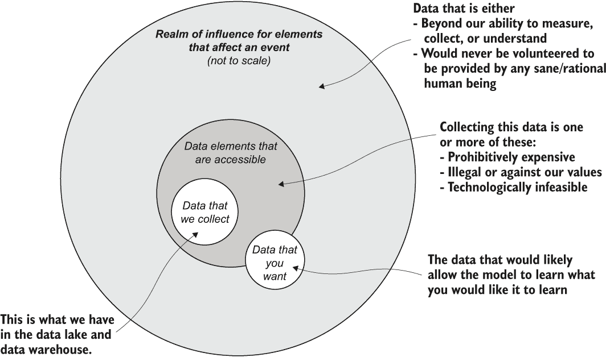

图 4.13 机器学习的数据领域——我们不可能拥有所有数据

如图 4.13 所示，会议中的人要求的数据超出了获取的能力。也许那些可以告知某人对于一双袜子主观偏好的数据具有如此个人化的性质，以至于根本无法推断或收集这些信息。也许，为了使模型得出所要求得出的结论，需要收集的数据可能如此复杂、存储成本高昂或难以收集，以至于这超出了公司的预算范围。

当会议中的小企业主问，“为什么这个群体的人没有将这些商品添加到他们的购物车中，如果模型预测这些对他们来说如此相关的话？”时，你绝对无法回答这个问题。不要忽视这个问题，这不可避免地会导致提问者感到烦恼和沮丧，而应该在你解释模型能够“看到”的现实观的同时，提出自己的一些问题。也许用户在为别人购物。也许他们正在寻找一些新事物，这些新事物是从我们无法以数据形式看到的事件中受到启发的。也许他们只是没有心情。

影响现实世界事件行为的潜在因素有着惊人的无限性。即使你收集了关于可观测宇宙的所有可知信息和指标，你仍然无法可靠地预测将要发生什么，它将在哪里发生，以及为什么它会以这种方式发生或不会发生。对于那个行业专家想要知道为什么模型以某种方式表现，以及预期的结果（用户为我们购买商品）没有发生，这是可以理解的；作为人类，我们追求可解释的秩序。

*放松。我们，就像我们的模型一样，不可能完美。*

*世界是一个相当混乱的地方。我们只能希望猜对将要发生的事情，而不是猜错。*

以这种方式（我们无法预测我们没有信息来训练的东西）解释局限性是有帮助的，尤其是在项目的初期，可以帮助消除人们对机器学习对门外汉所假设的不切实际能力的误解。在项目背景下进行这些讨论，包括涉及的数据如何与业务相关，可以在项目向前推进到演示和审查的里程碑时，作为消除失望和挫折的强大工具。

清楚地、直白地解释期望，尤其是对项目领导来说，可能是可以创造性解决的风险与项目完全停滞和放弃之间的区别，因为解决方案没有达到业务领导所期望的效果。正如历史上许多明智的人所说，“总是最好少承诺，多交付。”

请像对我这个五岁的孩子一样解释给我听

有时候，当谈论模型、数据、机器学习、算法等等时，可能会感觉就像是在经历《洞穴寓言》。尽管可能感觉像是自己身处阳光下，试图说服每个人日光的样子，但事实远非如此。

我们在前两章中讨论的沟通目标很简单：让对方理解。抵制将自己或你的团队视为“步入光明”的洞穴居民的想法，他们只是返回洞穴，向其他人展示全彩的奇迹图像和“现实世界”。你可能比门外汉更了解机器学习，但采取“开明者”的立场，在向其他团队成员解释概念时采用优越的语气，只会招致嘲笑和愤怒，就像试图将其他人拖向光明的那群人一样。

你总是会在用熟悉术语向听众解释概念，并通过寓言和例子来处理复杂话题，而不是默认使用排他性对话中取得更多成功，这种对话其他人可能无法完全理解，尤其是那些不熟悉你职业内部运作的团队成员。

## 摘要

+   将跨职能团队沟通聚焦于目标导向、非技术性、基于解决方案且无专业术语的言辞，将有助于营造一个协作和包容的环境，确保机器学习项目达成其目标。

+   为向广泛的领域专家和内部客户展示项目功能设定具体里程碑，将显著减少机器学习项目中的返工和意外功能缺陷。

+   以应用于敏捷开发的严谨性来处理研究、实验和原型制作工作的复杂性，可以缩短到达可行开发选项所需的时间。

+   在项目早期理解、定义和整合业务规则和期望，将有助于确保机器学习实施适应并围绕这些要求进行设计和调整，而不是在解决方案构建完成后强行加入。

+   避免讨论实施细节、深奥的机器学习相关主题以及算法内部工作原理的解释，将有助于进行清晰且专注的解决方案性能讨论，从而允许所有团队成员进行富有创造性的讨论。
