# 5 实验行动：规划和研究机器学习项目

本章涵盖

+   项目研究阶段的细节

+   对项目进行解决方案实验的过程和方法

我们在前两章中专注于围绕机器学习项目规划、工作范围和团队沟通的过程。本章和接下来的两章将关注与数据科学家相关的机器学习工作的下一个最关键方面：研究、实验、原型设计和 MVP 开发。

一旦从规划会议中彻底捕捉到项目的需求（尽可能实现的部分）并且定义了建模解决方案的目标，创建机器学习解决方案的下一阶段就是开始 *实验和研究*。如果没有适当的结构，这些过程很容易导致项目取消。

项目可能会因为看似无休止的实验阶段而被取消，在这个阶段中，对于最终确定解决方案的方法没有明确的方向。停滞的项目也可能是由于预测能力差造成的。无论是由于犹豫不决还是无法满足准确度期望，防止因数据和算法问题而停滞和取消的项目，始于实验阶段。

没有具体的规则集可以用来精确估计实验阶段应该持续多长时间，因为每个独特项目都可能产生无数复杂情况。然而，本章中的方法确保了达到有利的 MVP 状态所需时间的减少，以及显著减少了团队在没有这些方法进行实验时可能面临的重复工作量的减少。

本章涵盖机器学习实验的第一阶段，如图 5.1 所示。我们将介绍一种经过验证的方法来设置有效的实验环境，通过创建可重用的可视化函数来评估数据集，并以受控和高效的方式进行研究和建模方法验证，以帮助更早地进入 MVP 阶段，并减少返工。

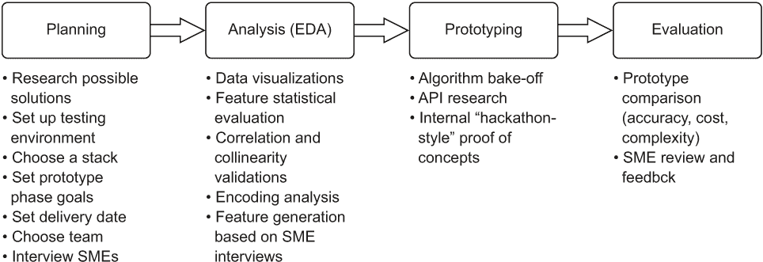

图 5.1 机器学习实验过程

我们将了解如何组织并规划适当的研究，在规划阶段设定期望和规则，正确分析本章中我们将要解决的场景，以指导我们的模型选择和实验，最后，进行实验并为当前项目构建有用的工具。所有这些阶段和过程都是为了最大限度地提高开发期更容易的机会，并最大限度地减少不仅从项目开始就产生技术债务的风险，而且还有项目放弃的风险。

在前几章中，我们一直在处理一家电子商务公司推荐引擎的预实验阶段。为了简洁起见，在接下来的几章中，我们将使用一个更简单的例子。虽然这个时间序列建模项目比许多机器学习实现都要简单，但我们所涉及的内容通常普遍适用于所有机器学习工作；当它们不适用时，我在侧边栏讨论中提供额外的注释。就像软件开发中的所有事情一样，一个高质量的项目始于规划。

## 5.1 规划实验

让我们假设在这个章节中，我们为一家从事花生供应业务的公司工作（具体来说，是那些在世界上大多数主要航空公司发放的单独包装的花生，附带一张方形餐巾、一个设计成当邻座调整到更舒适的位置时会把饮料洒到腿上的凹槽塑料杯，以及一罐经过两次巴氏杀菌的碳酸饮料）。负责花生物流的业务单元要求开发一个项目，以预测这些悲伤的机上零食的需求量，因为航空公司对他们在保质期到期时不断丢弃的大量干烤豆类的大量运输施加了压力。

会议已经召开，需求已经收集，机器学习团队已经内部讨论了该项目。普遍共识是我们面对的是一个简单的需求预测时间序列预测问题。但现在我们知道了我们试图解决的问题是什么？我们还有两周的时间来提出一个粗略的最小可行产品（MVP），以证明我们有一个经过验证的解决方案。最好立即着手。

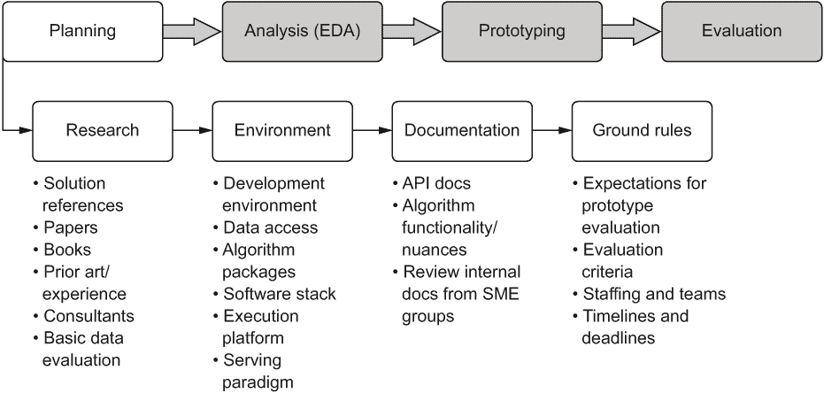

图 5.2 机器学习实验规划阶段路线图

我们将要讨论的内容如图 5.2 所示：机器学习实验规划阶段。在这个阶段，我们将阅读很多东西，希望大部分都能保存在我们的脑海中，并且会创建许多浏览器书签。

### 5.1.1 进行基本研究和规划

一旦团队成员在规划会议后回到他们的办公桌，他们要做的第一件事就是查看可用的数据。由于我们是花生制造商，并且没有与主要航空公司有任何合作，我们无法获得机票销售预测数据。我们当然没有时间构建网络爬虫来尝试查看每个机场的航班容量（也没有人愿意做这件事，因为之前尝试过构建爬虫的人都知道）。不过，我们确实有机场交通管理局免费提供的乘客容量历史数据。

从图 5.2 我们知道，为了了解数据的性质，我们应该做的第一件事是可视化它并运行一些我们可用的统计分析。大多数人会简单地将数据加载到他们的本地计算机环境中，并在笔记本中开始工作。

这是一种灾难性的做法。在您的首选计算机的主要操作系统上运行的默认 Python 环境远非纯净。为了最小化在开发环境中挣扎所浪费的时间（并帮助为后续章节的开发阶段顺利过渡做准备），我们需要为我们的测试创建一个干净的环境。有关如何使用 Docker 和 Anaconda 创建用于本章和所有后续章节代码列表的开发环境的指导，请参阅本书末尾的附录 B。

现在我们已经有一个隔离的环境（笔记本存储位置在容器中映射到本地文件系统位置），我们可以将样本数据放入此位置并创建一个新的笔记本进行实验。

数据集的快速可视化

在选择机器学习方法来解决该问题之前，应该做的第一件事是最简单（但经常被忽视）的数据科学方面：了解您的数据。对于机场预测，让我们看看我们可用的数据。列表 5.1 展示了一种快速可视化需要预测的一个时间序列（JFK 国内乘客）的方法。

注意：要精确地跟随此示例，您可以通过克隆艾伦·图灵研究所维护的存储库来获取此数据集。导航到附录 B 中概述的步骤同步的本地笔记本目录，并运行命令行语句 `git clone https://github.com/alan-turing-institute/TCPD.git`。

列表 5.1 可视化数据

```
import pandas as pd
import numpy as np
import matplotlib.pylab as plt

ts_file = '/opt/notebooks/TCPD/datasets/jfk_passengers/air-passenger-traffic-per-month-port-authority-of-ny-nj-beginning-1977.csv'
raw_data = pd.read_csv(ts_file)
raw_data = raw_data.copy(deep=False)                                          ❶
raw_data['Month'] = pd.to_datetime(raw_data['Month'], format='%b').dt.month   ❷
raw_data.loc[:, 'Day'] = 1                                                    ❸
raw_data['date'] = pd.to_datetime(raw_data[['Year', 'Month', 'Day']])         ❹

jfk_data = raw_data[raw_data['Airport Code'] == 'JFK']                        ❺
jfk_asc = jfk_data.sort_values('date', ascending=True)                        ❻
jfk_asc.set_index('date', inplace=True)                                       ❼
plt.plot(jfk_asc['Domestic Passengers'])
plt.show()
```

❶ 对 DataFrame 进行浅拷贝，以便我们可以对其进行可变修改

❷ 将月份列转换为日期对象，以便我们可以从它组装日期。（目前，它是一个月份的三字母缩写字符串。）

❸ 添加一个常数列，以便我们可以组装日期列

❹ 为每个机场组装基于行的索引的日期列

❺ 过滤 DataFrame，以便我们只查看单个机场（在本例中为 JFK）

❻ 按日期对 DataFrame 进行排序，以便正确地按顺序绘制时间序列（以及未来的活动）

❼ 将过滤后的 DataFrame 的索引设置为日期列

在笔记本的读取-评估-打印循环（REPL）中执行列表 5.1 后，我们将得到一个简单的时间序列趋势可视化，显示 1977 年至 2015 年间在美国国内航班的月度乘客数量。matplotlib 窗口如图 5.3 所示。

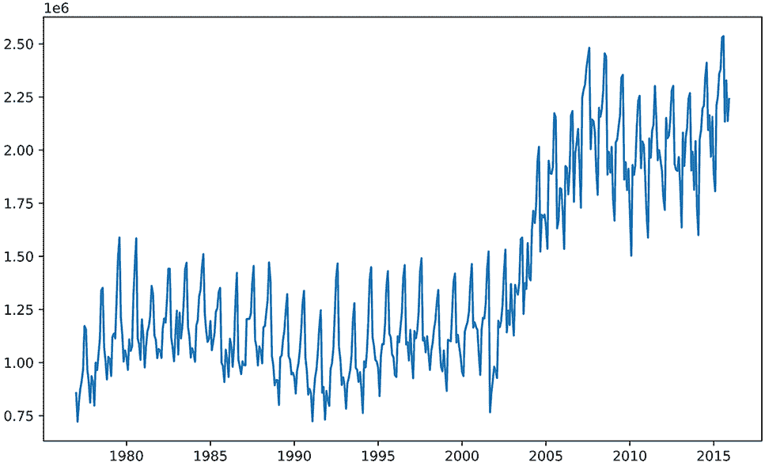

图 5.3 原始数据的基本默认可视化

看到这些原始数据展示出来，我们可以开始思考实验阶段的计划。首先，我们提出应该回答的问题，这些问题不仅将指导我们为了理解预测选项而需要进行的调查，还将指导平台决策（这在第 5.2 节中有深入讨论）。以下是我们的数据观察和问题：

+   潜在因素正在影响趋势。数据看起来不具有平稳性。

+   数据似乎有一个强烈的季节性成分。

+   我们需要为成千上万的机场建模。我们需要考虑选择的方法的可扩展性。

+   对于这个用例，哪些模型是好的？

+   我们有两周的时间来制定这个问题的处理方向。我们能完成吗？

这个数据可视化阶段的问题和答案都可以帮助为项目创建一个更有效的实验阶段。过早地直接创建模型和测试随机想法可能会产生大量的浪费工作，从而推迟了 MVP 的交付，使其无法按时完成。在研究潜在解决方案之前，始终理解数据集的性质和揭示任何隐藏问题都是有效利用时间的方法，因为这个阶段可以帮助通过早期淘汰选项来减少测试和额外研究。

研究阶段

既然我们已经了解了一些数据的问题——它具有高度的季节性，趋势受到我们完全未知的潜在因素的影响——我们可以开始研究。让我们暂时假设团队中没有一个人做过时间序列预测。在没有团队专家知识的情况下，研究应该从哪里开始？

网络搜索是一个很好的起点，但大多数搜索结果都显示了人们提供的时间序列预测解决方案的博客文章，这些文章涉及大量的挥手和简化了构建完整解决方案所涉及的复杂性。白皮书可能是有信息的，但通常不关注他们所涵盖的算法的应用。最后，不同 API 入门指南中的脚本示例对于了解 API 签名的工作原理非常棒，但它们故意简化，仅作为基本起点的参考，正如其名称所示。

那么，我们应该关注哪些方面来弄清楚如何预测机场未来几个月的旅客需求？简短的答案是书籍。关于时间序列预测有很多优秀的书籍。深入的研究博客也有帮助，但它们应该仅作为解决手头问题的初始方法，而不是直接复制代码的代码库。

注意：G. E. P. Box 和 G. M. Jenkins 所著的奠基性作品《时间序列分析》（Holden-Day，1970 年）被广泛认为是所有现代时间序列预测模型的基础。Box-Jenkins 方法是今天几乎所有预测实现的基础。

在对时间序列预测进行了一些研究之后，我们发现了一些似乎足够常用，值得努力实现粗略脚本方法的选项。我们决定尝试的简短列表如下：

+   线性回归（OLS、岭回归、Lasso、弹性网络和集成）

+   ARIMA（自回归积分移动平均）

+   指数平滑（Holt-Winters）

+   VAR（向量自回归）

+   SARIMA（季节性自回归积分移动平均）

在有了要测试的这些列表之后，下一步是找出哪些包有这些算法，并阅读它们的 API 文档。在机器学习世界中，一个很好的生活规则是建立一个健康的库和团队预算，以持续扩展该库。拥有一系列深入的技术书籍可以帮助团队应对新的挑战，并确保机器学习应用的细微复杂性能够用正确的信息来完成。

### 5.1.2 忘掉博客——阅读 API 文档

当一个团队——通常是一个相当年轻的团队——如此坚信博客文章的真实性，以至于他们围绕该博客的方法（有时甚至是确切代码）构建整个项目时，项目失败几乎是必然的。虽然几乎总是出于好意，但关于机器学习主题的短博客作者由于媒体格式的限制，无法深入覆盖所有必要的信息，这些信息对于现实世界的生产级机器学习解决方案至关重要。

让我们看看博客文章可能为我们的时间序列问题提供什么。如果我们搜索“时间序列预测示例”，我们可能会找到很多结果。毕竟，预测已经存在很长时间了。我们可能会发现的是，代码片段高度脚本化，使用 API 默认值，并省略了许多使练习可重复的更细微的细节。

如果你选择跟随此示例（假设它已经说服了你），你可能会花几个小时查找 API 文档，并对作者看起来简单的东西感到沮丧，结果发现他们为了达到那神奇的 10 分钟阅读时间，省略了所有复杂的细节。以下是从一个虚构的弹性网络回归博客（scikit-learn 示例）中摘取的示例片段，用于演示目的。

列表 5.2 来自 scikit-learn 的弹性网络博客示例

```
import pandas as pd
import numpy as np
from sklearn.model_selection import train_test_split
from sklearn import datasets
from sklearn.linear_model import ElasticNet
from sklearn import metrics
boston_data = datasets.load_boston()                                    ❶
boston_df = pd.DataFrame(boston_data.data, columns=boston_data.feature_names)
boston_df['House_Price'] = boston_data.target
x = boston_df.drop('House_Price', axis=1)
y = boston_df['House_Price']
train_x, test_x, train_y, test_y = train_test_split(x, y, test_size=0.3, random_state=42)                                  ❷
lm_elastic = ElasticNet()                                               ❸
lm_elastic.fit(train_x, train_y)                                        ❹
predict_lm_elastic = lm_elastic.predict(test_x)
print("My score is:")
np.round(metrics.mean_squared_error(test_y, predict_lm_elastic)         ❺
>> My score is:
>> 25.0
```

❶ 使用内置数据集——对于可重复的演示来说是一个稳健的举措

❷ 随机样本分割

❸ 希望默认值是好的……

❹ 我想我们不需要对拟合模型进行引用？

❺ 单个指标？当然，我们可以做得更好……

使用此代码有哪些问题？抛开糟糕的格式化和文本墙，让我们列举一下将此类示例作为进行时间序列回归基础的问题：

+   这是一个演示。相当糟糕的一个。但它的目的是尽可能简单，展示 API 的大致轮廓。

+   训练-测试分割使用随机抽样。这不会对预测时间序列产生好结果。（请记住，博客的目的是展示弹性网络回归，而不是时间序列问题。）

+   模型使用默认的超参数。从博客的简洁性考虑，这是可以理解的，但这并不帮助读者了解他们可能需要更改什么才能将其应用于他们的用例。

+   这是一种方法链和打印到标准输出的方式，使得对象无法用于进一步处理。

请不要误解我的意思。博客是好的。它们有助于教授新概念，并为可能正在解决的问题提供替代解决方案的灵感。我总是告诉人们不要过度依赖它们的主要原因在于，它们旨在易于消化、简洁和简单。为了实现这三个目标，以及最大简洁性的总体目标，绝对必须省略细节。

关于博客的注意事项

我不想让人觉得我在批评他们。他们很棒。他们提供了对概念和潜在解决方案的精彩介绍，这些内容绝对是无价的。如果你是博客作者，请继续保持出色的表现。这真的很有帮助。如果你是博客读者，请谨慎行事。

网上有关机器学习的真正优秀的博客文章有很多。不幸的是，这些文章被充斥着过于简化的概念证明、损坏的代码或无意中糟糕的编程实践的博客淹没。如果你在开始一个项目时将博客作为基本研究的主要来源，请记住，直接基于博客中的示例代码构建原型可能没问题，但在构建最小可行产品（MVP）时，你将不得不完全重写解决方案。

如果将博客作为主要参考工具，我的最好建议是通过对多个观点进行审查。你是否看到多个人使用特定方法撰写关于类似（但不完全相同）的解决方案？那么，在您的数据上测试这种方法可能是一个安全的赌注。

你是否看到过在多个博客中存在完全相同的代码示例的特定解决方案？这很可能是为了获取广告收入或进行其他恶意行为而进行的复制粘贴工作。你查看的博客越多，你就能越容易嗅出糟糕的代码和糟糕的实现，并判断作者是否真的了解他们在谈论的内容，以及是否值得信赖。

只需记住：你绝对不希望直接基于从博客文章中复制的代码来实现你的实现。博客是为了简洁而编写的，通常只关注覆盖一个狭窄的主题。这种短篇写作不适合生产代码的现实示例，因此它应该始终被视为它实际是的东西：以尽可能短的时间和文字跨度传达一个单一主题的手段。

而不是盲目地相信基于似乎会起作用的项目的博客文章，你需要检查和核实额外的信息来源。这包括学术论文、API 教程、关于该主题的出版书籍，以及，最重要的是，团队方法的测试和验证阶段。由于从博主关于他们最近学到的新东西的信息性帖子中复制的（或本质上复制的）工作导致项目取消，这不仅对业务对 DS 团队的看法有害，而且可能具有潜在的危险性。

不，认真地说，阅读 API 文档

一旦我们有了想要测试的建模方法列表，我们应该前往我们使用的模块的 API 文档。以弹性网络为例，如果我们这样做，我们会发现这个模型的超参数有几个重要的选项需要测试和调整，如下所示。

列表 5.3 scikit-learn 中弹性网络的完整 API 签名

```
elasticnet_regressor = ElasticNet(
  alpha=0.8,                             ❶
  l1_ratio=0.6,                          ❷
  fit_intercept=False,                   ❸
  normalize=False,                       ❹
  precompute=True,                       ❺
  max_iter=5000,                         ❻
  copy_X=True,                           ❼
  tol=1e-6,                              ❽
  warm_start=False,                      ❾
  positive=True,                         ❿
  random_state=42                        ⓫
  selection=’random’                     ⓬
)
```

❶ 应用到 l1 和 l2 正则化的惩罚

❷ 弹性网络混合参数（岭回归与 lasso 的比例）

❸ 是否拟合截距（根据数据中心化是否发生，这是一个很重要的问题）

❹ 仅当 fit_intercept 为 False 时使用。通过减去平均值并除以 l2 范数进行归一化。

❺ 要么是布尔值，要么是一个特征形状的数组，作为语法矩阵来加速计算

❻ 允许收敛的最大迭代次数

❼ 是否复制训练集

❽ 每次迭代是否继续尝试收敛的优化容忍度

❾ 是否重用前一次迭代的解决方案来初始化模型拟合

❿ 线性方程中的系数是否将被强制为正值

⓫ 如果选择类型是“随机”，则种子值

⓬ 系数选择的选取类型（循环是默认值，它遍历特征向量，而随机则在每个迭代中为不同的特征使用随机系数选择）

对于许多机器学习算法，默认指定的选项（超参数）偶尔对某些常见的数据结构来说是好的。但始终最好验证这些选项是什么，以及它们被用于什么，并识别出应该调整的选项是构建有效模型的一个基本部分。很多时候，这些选项只是简单地作为占位符指定，API 开发者完全希望最终用户覆盖这些值。

TIP 就像 DS 世界中的任何其他事物一样，不要假设任何事情。假设会导致问题在项目后期工作中困扰你。

根据团队同意测试的模型列表，团队中的每个人都应该去熟悉每个模型 API 的签名选项。这很重要，以便在运行每个快速且粗略的实验结果时，可以同时权衡模型的可维护性和复杂性以及通常作为唯一判断点的准确性指标。

真的，你应该阅读文档

当我看到有人使用特定的 API 时，有时甚至用于生产用例，而从未阅读过围绕该 API 的文档（包括我自己，事后看来），我总是有点惊讶。我惊讶的原因是大多数人会惊讶地看到一名乘务员走进飞机驾驶舱并开始驾驶飞机。他们能保持飞机在空中吗？当然（希望如此）。他们知道飞机的工作原理和飞行动力学吗？可能不知道。让我们希望天空保持晴朗和蓝色。

这并不是说你应该阅读你将要使用的每个模块的每一个开发者 API 文档。这是不可行的，而且有点荒谬。然而，在机器学习的世界里，可用的算法数量似乎无穷无尽（更不用说那些算法背后的代码的内部工作原理极其复杂且冗长），因此阅读至少主要接口级别的 API 文档非常重要。

这意味着要熟悉你正在使用的类，它们的签名，以及你在这些类中使用的方法。没有必要逆向工程包。然而，至少你应该熟悉类的文档字符串描述，知道哪些属性需要传递或覆盖，并理解你将要调用和与之交互的方法的基本功能。

大多数这些算法的实现都有细微差别（尤其是那些由配置决定整个行为的高级元算法）。了解需要调整哪些旋钮，如何调整它们，以及旋转这些旋钮的后果可以帮助在测试期间降低风险。这将节省你大量的时间和挫败感，尤其是当你转向解决方案的完整开发时，知道哪些默认值是占位符，哪些是一般情况下可以保留的值。

我们将在本书的后面部分更详细地讨论这些概念，但到目前为止，你应理解为什么在本章中这个 MVP 模拟的整个 API 中指定了所有设置。

API 文档的一个关键功能是向用户告知可用于控制软件行为（以及相应地，对于机器学习用例，算法的学习模式）的选项。如果不了解如何控制模型的学习行为，我们就有可能构建出无法很好地泛化的模型，因为过度拟合，或者模型过于脆弱，以至于特征输入的基线变异性的一点点变化都会使解决方案对业务完全无用。

当一个模型变得无用，表现不如手动的人为中心解决方案时，它通常会被业务放弃（即使它仍然由机器学习团队在生产环境中运行）。在实验的早期阶段，正确地调整和控制模型的行为至关重要，尽管在这个阶段进行微调的行为并不是必要的。

快速测试和粗略估计

在机器学习项目工作中，可能唯一一次可以忽略对适当超参数调整的广泛评估的时间点就是现在。在快速评估期间，我们并不特别关心我们如何优化模型与数据的拟合程度。相反，我们感兴趣的是测量一组不同算法的总体敏感性，试图评估在后期当我们微调模型并维护它们以应对漂移情况时，特定方法将有多稳定。

前一节涵盖了为什么通过阅读 API 文档（以及可能还有源代码）了解如何调整每个模型很重要。但在快速测试阶段，调整所有这些（参见以下关于过度构建的边栏）根本不可行。在将这九种可能的实现削减为更适合 MVP 实施和全面测试的更易管理的东西的过程中，仅仅使用大多数默认设置并查看结果可能是有帮助的。然而，明确标记实例化块以使用提供的默认条件，或者只是在代码中留下一个 `TODO`，以确保在准备进入 MVP 阶段对模型进行全面调整时，检查 API 文档，并验证和测试 API 中的可选设置，这也是一个有用的实践。

关于过度构建快速原型测试的注意事项

在对候选解决方案的早期烟雾测试实验中，重点应放在速度上，而不是准确性。记住，你是在为公司工作，预期会有结果，而且可能还有其他项目需要工作。

在前几章中，我提到了过度开发原型的一些危险（它使得决定选择什么用于最小可行产品变得更加困难）。然而，从更大的角度来看，不必要的劳动对业务的损害更为严重。团队每天都在努力证明不同的解决方案，而这些时间本可以用来工作在下一个项目上。

效率、基于共同标准的客观选择，以及转向开发 MVP 始终应该是原型设计的首要关注点。没有其他事情。在 MVP 阶段，将有时间构建更好的准确性、巧妙的功能工程和解决问题的创造性方法。

我们将在下一章中通过测试示例来介绍我们的预测问题。现在，只需知道，在初步的探索工作和评估解决方案阶段，预测不必完美。你将把更多的时间花在精简可能性列表上，以便你有一个或两个候选解决方案，而不是花大量时间微调九个（或更多）方法。

### 5.1.3 为内部黑客马拉松抽签

在测试周围设定界限至关重要，尤其是在团队规模增长和项目复杂性随着团队经验的成熟而增长时。为了追求效率（以及选择构建 MVP 方向时上述关键的*时间*方面），如果没有将测试分配给个人或结对编程团队，这可能会对项目的成功造成绝对的损害。

如果每个人都只负责找出最佳解决方案，无疑会重复工作并过度努力在某些解决方案上。通过专注于单一方法，并对其进展进行一致的状态更新，团队可以最小化错过 MVP 交付日期的风险。

现在我们已经为我们的预测模型想出了一系列可能的解决方案，我们该如何测试它们？无论团队中只有一个人还是十几名数据科学家，方法应该是相同的：

+   为测试预留一定的时间。为这个阶段设定一个结束时间截止日期将传达一种紧迫感，以便可以快速决定解决方案的有效性。

+   制定一些规则，就像为黑客马拉松做的那样：

    +   每个人都必须使用相同的 dataset。

    +   每个人都必须使用相同的评估指标。

    +   每次评估都需要在相同的时间段内进行预测。

    +   需要提供预测的可视化以及指标。

    +   实验代码需要从头开始可重跑。

+   确保所选语言得到团队的支持，并且如果业务决定继续推进解决方案，该平台对团队可用。

如果我们以这种方式设置实验，针对这个问题，我们可能会基于这个 dataset 制定以下规则：

+   测试一周——从 scrum 会议后的星期四开始，演示文稿将在下一个星期四上午提交，以便整个团队进行审查。

+   要建模的数据是针对 JFK 国内乘客的。

+   评估指标将如下：

    +   均绝对误差 (MAE)

    +   均方绝对百分比误差 (MAPE)

    +   均方误差 (MSE)

    +   根均方误差 (RMSE)

    +   R-squared

+   评估的预测期将是数据集的最后五年。

+   实验将在运行 Python 3 的 Jupyter 笔记本中完成，利用内置在 Docker 容器中的标准 Anaconda 构建。

在确立了规则之后，团队（如果团队计数大于 1，则为“你”）可以着手寻找解决方案。在我们深入研究如何以高效的方式完成这项工作之前，我们还有最后一件事要讨论：标准。

### 5.1.4 平衡竞争环境

为了使我们的实验这九种不同的方法具有意义，我们需要确保我们是在公平竞争。这意味着我们不仅使用相同的 dataset 进行比较，而且还将测试数据与预测值使用完全相同的误差指标进行评估。我们需要防止的核心问题是团队在衡量解决方案的有效性时出现犹豫不决和混乱（这浪费了时间，正如我们之前提到的，如果我们想进入项目的 MVP 阶段，我们根本就没有时间）。

由于我们正在研究一个时间序列问题，我们将评估一个回归问题。我们知道，为了进行真正的比较，我们需要控制数据拆分（我们将在第 5.2 节中的代码示例中探讨这一点），但我们还需要就每个模型将要记录以进行预测拟合度比较的评估指标达成一致。由于我们最终需要构建数千个这样的模型，而原始预测值具有截然不同的数量级（例如，通过 JFK 和 ATL 机场飞行的人数略多于通过博伊西机场的人数），团队成员已同意使用 MAPE 作为比较指标。然而，在明智的决定中，他们还同意捕获尽可能多的适用于时间序列回归问题的回归指标，以便在后续的模型优化过程中，如果他们选择切换到不同的指标，可以进行相应的调整。

因此，我们将同意收集 MAPE、MAE、MSE、RMSE、解释方差和 R 平方的度量标准。这样，我们将能够根据数据和相关项目讨论不同指标的好处。

度量战争及其解决方法

对于不同机器学习解决方案的最佳度量标准存在许多意见。无数小时被浪费在无意义的争论中，争论是否使用均方误差（MSE）或均方根误差（RMSE），F1 分数是否比 ROC 曲线下的面积更合适，以及是否应该对平均绝对误差（MAE）进行归一化，将其转换为平均绝对百分比误差（MAPE）。

确定每个用例的适当指标确实是一个很好的论点。然而，计算误差通常既便宜又快。计算所有适用的指标并记录它们并不会有什么坏处。显然，不要为回归问题记录分类指标（那将是非常不明智的），反之亦然，但为模型提供 MAE、MSE 和 R 平方的计算以确保每种方法的利益可以被利用，这可能会很有帮助。

同样，记录所有这些内容也是非常有价值的，以防在构建解决方案和调整过程中，团队决定使用不同的指标。从一开始就记录每个指标，可以为每个尝试运行的实验提供历史参考，而无需重新运行旧实验来收集额外的指标（这既昂贵又耗时）。

收集所有指标的唯一明显例外是，如果指标评估（在计算上）非常昂贵，那么它提供的利益超过了计算它的成本。例如，在第四章的推荐引擎中，NDCG 的计算涉及一个在大型数据集（隐式评分数据）上的窗口函数，这在相对较大的 Apache Spark 集群上可能需要数小时才能执行。在关系数据库管理系统（RDBMS）中计算这些分数涉及昂贵的笛卡尔积，这可能需要更长的时间。如果指标不是关键的，并且执行时间过长，不划算收集，那么最好不要浪费时间在它上面。

## 5.2 进行实验准备工作

在一个专注于构建解决商业问题的机器学习解决方案的团队完成规划和研究阶段之后，接下来的阶段，即实验测试的准备阶段，是数据科学社区中最常被忽视的活动之一（这里从个人经验来说）。即使有一个明确的计划，确定谁将测试什么，达成一致的指标系列，对数据集进行评估，以及达成一致的实验深度方法论，如果这个准备阶段被忽视，将会产生更多的低效率，可能导致项目延迟。这个准备阶段专注于对数据集进行深入分析，创建整个团队都可以使用的通用工具，以便提高他们评估实验尝试的速度。

到目前为止，我们已经决定尝试一些模型，为实验阶段设定了基本规则，并选择了我们的语言（主要是 Python，因为 statsmodels 库）和我们的平台（在 Docker 容器上运行的 Jupyter Notebook，这样我们就不必浪费时间在库兼容性问题上了，并且可以快速原型测试并直接查看可视化）。在我们开始发射大量建模测试之前，了解与当前问题相关的数据非常重要。

对于这个预测项目，这意味着对平稳性测试进行彻底分析、分解趋势、识别严重异常值，并构建基本的可视化工具，这些工具将有助于子团队快速进行模型测试。如图 5.4 所示，我们将涵盖这些准备工作的关键阶段，以确保我们的黑客团队将有一个高效的开发过程，并且不会专注于创建九种不同的绘图和评分结果的方式。

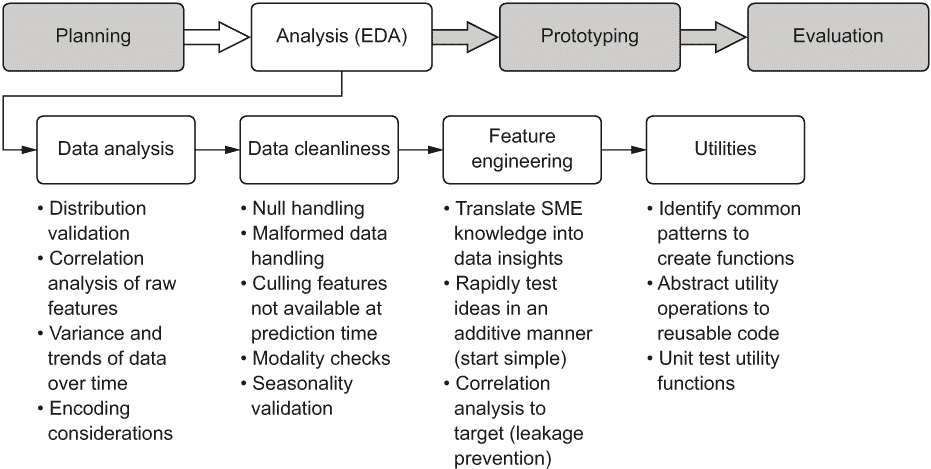

图 5.4 分析阶段，专注于评估数据以指导原型设计工作

这种分析路径高度依赖于正在进行的 ML 项目的类型。对于这种时间序列预测，在构建原型解决方案以评估之前，完成这些项目是一个好主意。每一步都相当适用于任何监督式 ML 问题。然而，对于 NLP 项目，在这个阶段你需要执行一些不同的操作。

展示这些过程及其执行顺序的目的是为了说明在开始模型原型设计工作之前，需要制定一个计划。没有计划，评估阶段肯定会是漫长、艰难、混乱的，并且可能不会有结论。

### 5.2.1 执行数据分析

在研究可能的解决方案的过程中，很多人似乎发现趋势可视化非常有帮助。这项活动不仅为数据的基本可视化做准备，以便向将成为项目解决方案消费者的更广泛的业务单元团队展示，而且有助于最小化在项目后期可能发现的未预见的数据问题；这些问题可能需要完全重新设计解决方案（并且如果从时间和资源角度来看重新设计成本过高，可能还需要取消项目）。为了降低发现数据严重缺陷过晚的风险，我们将构建一些分析可视化。

根据列表 5.1 中构建的初始原始数据可视化（如图 5.3 所示），我们注意到数据集中存在大量的噪声。趋势中的大量噪声当然有助于可视化总体趋势线，因此让我们首先对 JKF 国内乘客的原始数据趋势应用平滑函数。我们将执行的脚本如下所示，使用了基本的 matplotlib 可视化。

列表 5.4 带有两倍标准差误差的移动平均趋势

```
rolling_average = jfk_asc['Domestic Passengers'].rolling(12, center=False).mean()                                                 ❶
rolling_std = jfk_asc['Domestic Passengers'].rolling(12, center=False).std()                                                      ❷
plt.plot(jfk_asc['Domestic Passengers'], color='darkblue', label='Monthly Passenger Count')                                       ❸
plt.plot(rolling_average, color='red', label='Rolling Average')                                                                   ❹
plt.plot(rolling_average + (2 * rolling_std), color='green', linestyle='-.', label='Rolling 2 sigma')                             ❺
plt.plot(rolling_average - (2 * rolling_std), color='green', linestyle='-.')
plt.legend(loc='best')
plt.title('JFK Passengers by Month')                                                                                              ❻
plt.show(block=False)                                                                                                             ❼
```

❶ 基于一年的平滑周期生成滚动平均系列

❷ 在与平滑滚动平均相同的滚动时间周期内生成标准差系列

❸ 使用原始数据（国内乘客）初始化图表，并为图例框创建标签

❹ 将滚动平均系列应用于图表

❺ 通过添加和减去滚动平均值系列中的值，将两倍标准差的滚动标准差系列应用于图表

❻ 为图表添加标题，使得从该图表导出的图像可以立即识别

❼ 在标准输出中显示图表

注意：这里和 5.2 节中展示的代码仅用于快速实验。5.22 节涵盖了编写 MVP 代码的更有效方法。

在我们的 Jupyter 笔记本中运行此代码将生成图 5.5 所示的图表。注意数据在平滑后的总体趋势，并意识到在 2002 年左右发生了一个明确的阶梯函数。此外，还要注意标准差在不同时间段内变化很大。在 2008 年之后，方差变得比历史上更宽。

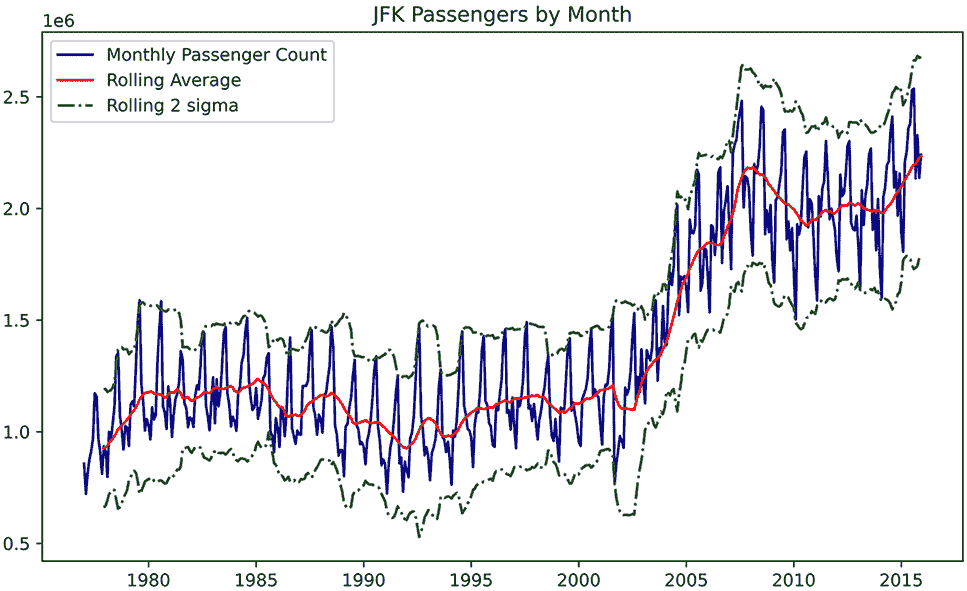

图 5.5 从列表 5.4 中得到的基线平滑和 sigma 拟合

趋势是好的，并且对于理解可能出现的潜在问题有一定的帮助，这些问题可能来自于构建不反映趋势变化的训练和验证数据集。（具体来说，我们可以看到如果我们训练到 2000 年并期望模型能够从 2000 年准确预测到 2015 年，可能会发生什么。）

然而，在研究和规划阶段，我们发现时间序列平稳性的提及非常多，以及某些模型类型在预测非平稳趋势时可能会遇到真正的困难。我们应该看看这是怎么回事。

对于此，我们将使用 statsmodels 模块中提供的增强迪基-富勒平稳性测试。此测试将告诉我们是否需要为无法处理非平稳数据的特定模型提供平稳性调整。如果测试返回的值表明时间序列是平稳的，则几乎所有模型都可以使用未经变换的原始数据。然而，如果数据是非平稳的，则需要额外的工作。接下来将展示用于对 JFK 国内乘客系列运行此测试的脚本。

列表 5.5 时间序列平稳性测试

```
from statsmodel.tsa.stattools import adfuller
dickey_fuller_test = adfuller(jfk_asc['Domestic Passengers'], autolag='AIC')❶
test_items = dickey_fuller_test[:4]                                         ❷
report_items = test_items + (("not " if test_items[1] > 0.05 else "") + "stationary",)                                                         ❸
df_report = pd.Series(report_items, index=['Test Statistic', 'p-value', '# Lags', '# Observations', 'Stationarity Test'])                      ❹
for k, v in dickey_fuller_test[4].items():                                  ❺
    df_report['Critical Value(%s)' % k] = v
print(df_report)
```

❶ 实例化 adfuller（增强迪基-富勒测试）并设置 autolag 以自动最小化滞后计数的信息准则

❷ 获取测试结果的第一部分

❸ 创建一个布尔值是/否平稳性测试。（在实践中，最好将测试统计量与临界值进行比较，以做出真正的平稳性判断。）

❹ 生成信息的索引序列

❺ 从测试统计量中提取临界值

运行此代码后，我们得到图 5.6 的结果，并打印到标准输出。

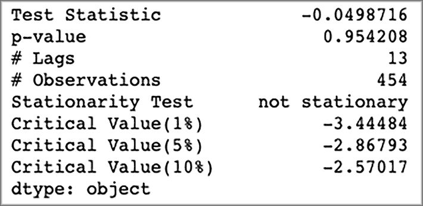

图 5.6 增强迪基-富勒测试的平稳性结果。这就是我们在列表 5.5 中运行代码时将看到的内容。

好吧，那很酷。但这意味着什么呢？

*检验统计量*（总是负数）是衡量时间序列包含单位根的邻近性的度量。（如果必须对时间序列应用多个单位根——例如，多个差分函数——以使其基本平坦，那么它就越不平稳。）用非数学术语来说，如果检验统计量小于临界值，则该序列将被确定为平稳。在这种情况下，我们的检验统计量值远高于临界值，因此给出了一个接受零假设的 p 值，我们可以相当自信地说，“这不是平稳的”（`adfuller`测试的零假设是时间序列是*非平稳的*）。

注意：如果你对测试背后的理论和数学感兴趣，我强烈建议你搜索原始研究论文：“Efficient Tests for an Autoregressive Unit Root” by Graham Elliot et al. (1996) 以及在期刊出版物“Distribution of the Estimators for Autoregressive Time Series with a Unit Root” by D. A. Dickey and W. A. Fuller (1979) 中阐述的基础单位根理论。

其中还有其他有趣的数据——特别是发现的滞后数。我们可以以另一种方式查看这个值，这有助于我们确定在用基于 ARIMA 模型进入建模阶段时应使用的设置。考虑到我们在这里查看的是月度数据，数字 13 似乎有点奇怪。如果我们盲目地只将这个值作为模型中的季节性（周期）成分，我们可能会得到一些相当糟糕的结果。然而，我们可以通过查看图 5.7 中的某些趋势分解来验证这一点。

我们将尝试使用 statsmodels 内置功能有效地分解信号中的趋势、季节性和残差，以帮助告知我们在建模实验中需要使用的某些设置。幸运的是，该软件包的作者不仅构建了分解方法，还提供了一个很好的可视化，我们可以轻松地绘制出来，如下面的列表所示。让我们看看如果我们使用`adfuller`报告中的滞后计数作为季节性周期会发生什么。

列表 5.6 季节性分解趋势

```
from statsmodels.tsa.seasonal import seasonal_decompose
decomposed_trends = seasonal_decompose(jfk_asc['Domestic Passengers'], period=13)❶
trend_plot = decomposed_trends.plot()                                            ❷
plt.savefig("decomposed13.svg", format='svg')                                    ❸
```

❶ 使用 adfuller 滞后值 13 进行季节性分解

❷ 获取用于存储的绘图引用。（它将自动以内联方式显示。）

❸ 保存绘图以供以后参考

图 5.7 显示了当执行列表 5.6 中的代码时该图表的形状。

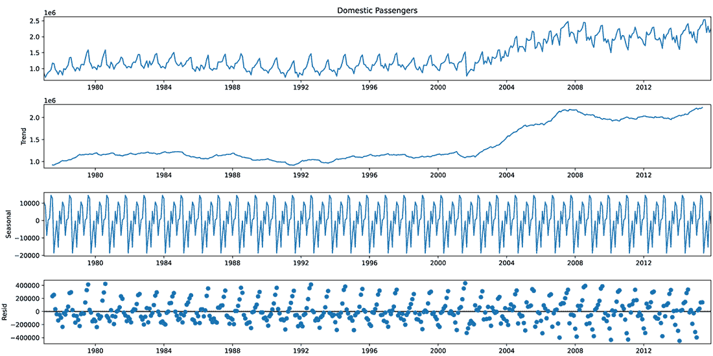

图 5.7 趋势分解图，从上到下包括：原始数据、提取的趋势、季节性成分和残差。这似乎不太对。

这不是最引人注目的数据，对吧？残差（底部面板）似乎存在一个信号。残差应该是从数据中提取出一般趋势和季节性之后留下的未解释的噪声。但在这里，似乎还有相当多的实际可重复信号。让我们尝试不同的运行，但指定周期为 12，如图 5.8 所示。

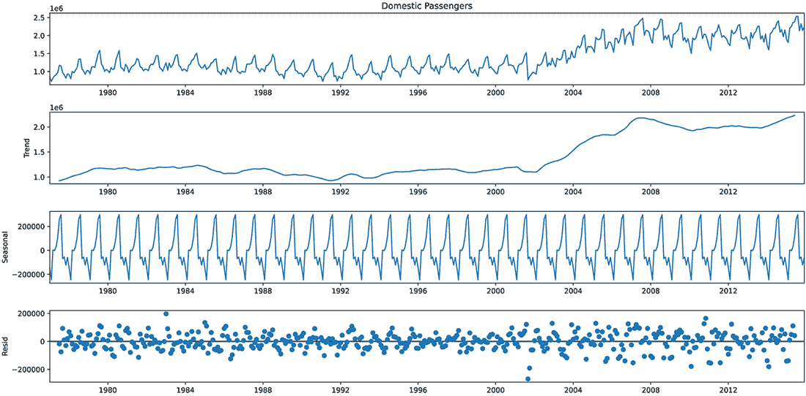

图 5.8 将周期设置为 12 而不是 13 的趋势分解图。这要好一些。

在图 5.8 中，使用 12 个周期的评估看起来明显比之前的 13 个周期的测试要好。我们的趋势很平滑，季节性看起来很好地匹配了数据中重复模式的周期性，残差（大部分）是随机的。当我们第六章进行测试时，我们会记住这个值。

在此之前完成这项准备工作的重要性在于*为我们的测试提供信息*。这是以数据知识为依据指导测试，从而能够快速迭代实验。

请记住，在测试阶段，我们将评估九种预测方法。我们越快确定这九种中哪两种最有希望，我们就越快可以忽略其他七种，并且作为一个团队，我们可以更快地向我们的 MVP 截止日期迈进。

我们的数据有多干净？

数据清洁问题是一个重要原因，导致 MVP 的延期时间远超过对企业的承诺。识别不良数据点不仅对建模训练效果至关重要，而且有助于向企业讲述为什么模型的一些输出有时可能不够准确的原因。构建一系列可视化，可以传达潜在因素、数据质量问题和其他可能影响解决方案的不可预见元素，可以在与项目业务单元的讨论中作为强大的工具。

我们将不得不解释的关于本项目预测的最重要的一点是，它将不会，也不能成为一个无误的系统。在我们的数据集中仍有许多未知因素——影响趋势的元素，这些元素要么过于复杂难以追踪，要么建模成本过高，或者几乎无法预测，这些都需要输入到算法中。对于单变量时间序列模型，模型中除了趋势数据本身外，没有其他任何东西。在更复杂的实现中，例如窗口方法和长短期记忆（LSTM）循环神经网络（RNNs）等深度学习模型，尽管我们可以创建包含更多信息的向量，但我们并不总是有能力或时间收集所有可能影响趋势的特征。

为了帮助进行这次对话，我们可以看看一种简单的方法来识别与季节性影响趋势相比差异巨大的异常值。使用序列数据的一个相对简单的方法是在排序数据上使用差分函数。这可以通过以下列表中的示例实现。

列表 5.7 时间序列差分函数和可视化

```
from datetime import datetime
jfk_asc['Log Domestic Passengers'] = np.log(jfk_asc['Domestic Passengers'])   ❶
jfk_asc['DiffLog Domestic Passengers month'] = jfk_asc['Log Domestic Passengers'].diff(1)                                                    ❷
jfk_asc['DiffLog Domestic Passengers year'] = jfk_asc['Log Domestic Passengers'].diff(12)                                                    ❸
fig, axes = plt.subplots(3, 1, figsize=(16,12))                               ❹
boundary1 = datetime.strptime('2001-07-01', '%Y-%m-%d')                       ❺
boundary2 = datetime.strptime('2001-11-01', '%Y-%m-%d')
axes[0].plot(jfk_asc['Domestic Passengers'], '-', label='Domestic Passengers')❻
axes[0].set(title='JFK Domestic Passengers')
axes[0].axvline(boundary1, 0, 2.5e6, color='r', linestyle='--', label='Sept 11th 2001')                                                      ❼
axes[0].axvline(boundary2, 0, 2.5e6, color='r', linestyle='--')
axes[0].legend(loc='upper left')
axes[1].plot(jfk_asc['DiffLog Domestic Passengers month'], label='Monthly diff of Domestic Passengers')                                      ❽
axes[1].hlines(0, jfk_asc.index[0], jfk_asc.index[-1], 'g')
axes[1].set(title='JFK Domestic Passenger Log Diff = 1')
axes[1].axvline(boundary1, 0, 2.5e6, color='r', linestyle='--', label='Sept 11th 2001')
axes[1].axvline(boundary2, 0, 2.5e6, color='r', linestyle='--')

axes[1].legend(loc='lower left')
axes[2].plot(jfk_asc['DiffLog Domestic Passengers year'], label='Yearly diff of Domestic Passengers')
axes[2].hlines(0, jfk_asc.index[0], jfk_asc.index[-1], 'g')
axes[2].set(title='JFK Domestic Passenger Log Diff = 12')
axes[2].axvline(boundary1, 0, 2.5e6, color='r', linestyle='--', label='Sept 11th 2001')
axes[2].axvline(boundary2, 0, 2.5e6, color='r', linestyle='--')
axes[2].legend(loc='lower left')
plt.savefig("logdiff.svg", format='svg')                                      ❾
```

❶ 获取原始数据的对数以减少后续步骤的差异幅度

❷ 获取每个位置值相对于指定滞后值的单位差分。在这里，我们正在查看立即前一个值。

❸ 获取前 12 个月值的差分（与去年的差异，因为我们的数据是按月计算的）

❹ 生成绘图结构，以便我们可以创建这三个单独绘图的单一图像

❺ 创建 x 轴参考点，以说明序列数据中的异常期（有助于向询问预测失败原因的业务单元成员进行解释）

❻ 如果要生成用于与业务其他部分共享的图形，始终绘制原始数据。这将让您免于以后制作复杂得令人难以置信的幻灯片。

❼ 绘制我们想要突出显示的静态边界，说明不可预见潜在因素如何影响趋势

❽ 以多种方式显示数据中的突出异常，可以帮助更清楚地传达潜在因素的影响。

❾ 无论平台、可视化技术还是流程，保存我们生成的所有绘图以供以后参考都是一个好习惯。

当我们执行此操作时，我们得到图 5.9 中所示的绘图（以及保存到我们共享笔记本目录中的 SVG 图像）。

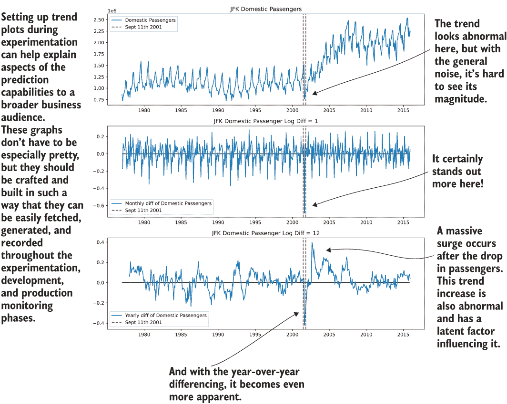

图 5.9 从列表 5.7 的异常值分析演示

我们现在对数据的外观有了一些了解。我们创建了演示图和基本趋势分解，并收集了有关这些趋势外观的数据。代码有点粗糙，读起来像脚本。如果我们不花点时间通过使用实用函数使此代码可重用，我们可能会发现每次有人想要生成这样的可视化时，他们都会在代码库中大量复制粘贴。

### 5.2.2 从脚本到可重用代码的迁移

返回到及时性的主题，如果我们专注于使用可重用代码，那么对项目方向做出决策的紧迫性可以降低。这不仅使代码库更干净（并且减少了由多个人创建的完全相同的东西的版本），还有助于在 MVP（和开发）阶段标准化项目的元素。减少混淆、加快决策时间、在笔记本和脚本中减少混乱，所有这些都是在努力最大化业务对项目有足够信心以继续开发工作的可能性。

我们在这里进行了大量的脚本编写，用于趋势分析和我们的 JFK 国内乘客数据的可视化。这完全适合快速检查事物，对于实验的早期阶段来说也是完全可以理解的（我们都会这样做，任何说否则的人都是在撒谎）。然而，当团队分头进行建模活动时，每个人都构建自己的可视化、自己的类似测试的实现以及可以相对容易地合并到标准函数中的代码，这将是极其浪费的。我们（应该）最不希望看到的是，散布着多个笔记本，它们包含大量几乎完全相同的代码，只是略有修改。虽然使用神奇的复制和粘贴命令可能看起来很方便，但最终会对生产力和理智造成破坏。更好的做法是创建函数。

我当然不建议在这个阶段为这些实用函数构建一个包级项目。这项工作将在项目的实际开发阶段进行，在漫长的生产发布之路上。

现在，让我们将这些有用的可重复代码片段，用于操作原始数据、可视化趋势和从中提取信息，整理成标准的基本函数集合。这项工作将为我们节省数十个小时，尤其是在将要测试针对其他机场数据的不同实现时。我们绝对不希望做的事情是复制和粘贴一大块脚本以展示可视化和分析，这会让每个人都想知道哪种方法最好，造成大量重复工作，并生成难以维护的代码蔓延。

让我们看看列表 5.1 中的数据集导入脚本，看看一个获取数据并正确格式化的函数可能是什么样子。为了使导入函数有用，我们需要获取包含在此文件中的机场列表，能够应用过滤以获取单个机场，并指定与数据相关的时间序列周期性。以下列表显示了这些函数中的每一个。

列表 5.8 数据导入和格式化函数

```
AIRPORT_FIELD = 'Airport Code'                                         ❶

def apply_index_freq(data, freq):                                      ❷
    return data.asfreq(freq)

def pull_raw_airport_data(file_location):                              ❸
    raw = pd.read_csv(file_location)
    raw = raw.copy(deep=False)                                         ❹
    raw['Month'] = pd.to_datetime(raw['Month'], format='%b').dt.month  ❺
    raw.loc[:, 'Day'] = 1                                              ❻
    raw['date'] = pd.to_datetime(raw[['Year', 'Month', 'Day']])        ❼
    raw.set_index('date', inplace=True)                                ❽
    raw.index = pd.DatetimeIndex(raw.index.values, freq=raw.index.inferred_freq)                                     ❾
    asc = raw.sort_index()
    return asc

def get_airport_data(airport, file_location):                          ❿
    all_data = pull_raw_airport_data(file_location)
    filtered = all_data[all_data[AIRPORT_FIELD] == airport]
    return filtered

def filter_airport_data(all_data, airport):
    filtered_data = all_data[all_data[AIRPORT_FIELD] == airport]
    return filtered_data

def get_all_airports(file_location):                                   ⓫
    all_data = pull_raw_airport_data(file_location)
    unique_airports = all_data[AIRPORT_FIELD].unique()
    return sorted(unique_airports)
```

❶ 定义一个静态变量，用于包含机场键的列（为了最小化代码中的字符串替换，如果需要更改的话）

❷ 为 DataFrame 索引设置时间序列频率的函数

❸ 主要数据获取和格式化函数

❹ 设置导入数据的副本，以便可以安全地修改

❺ 从原始数据中的字符串日期值中提取月份

❻ 创建一个日期字段（月份的第一天），以便将编码转换为日期对象

❼ 生成适当的 NumPy 日期时间格式（对于时间序列建模是必需的）

❽ 将 DataFrame 的索引设置为日期列（对于绘图和建模很有用）

❾ 将索引的属性设置为推断出的频率

❿ 确保 DataFrame 已经按日期索引排序，以防止以后数据序列提取时出现问题

⓫ 返回数据中包含的所有机场的列表的实用函数

在这些函数建立之后，它们可以被每个将在实验阶段测试预测项目解决方案的子团队使用。通过更多的工作，这些都可以在开发阶段模块化成一个类，以创建一个标准化的、可测试的生产级最终项目实现（在第 9、10 和 14 章中介绍）。这些的使用可以像下面的列表一样简单。

列表 5.9 通过可重复使用的函数摄取数据

```
DATA_PATH = '/opt/notebooks/TCPD/datasets/jfk_passengers/air-passenger-traffic-per-month-port-authority-of-ny-nj-beginning-1977.csv'
jfk = get_airport_data('JFK', DATA_PATH)      ❶
jfk = apply_index_freq(jfk, 'MS')             ❷
```

❶ 使用函数 get_airport_data()获取作为日期索引的 pandas DataFrame 的数据

❷ 将正确的周期性时间应用到 DataFrame 的日期索引上（MS 代表“月起始频率”）

让我们看看我们可以做的另一个修改，专注于在列表 5.7 中创建并在图 5.9 中展示的异常值可视化脚本。我们将看到这个脚本如何被改编成一行使用，这极大地简化了这些图表的生成，而无需使其完全通用（这将需要大量的时间和精力）。尽管这个可视化逻辑的函数表示稍微复杂一些，并且需要更多的代码行，但最终结果将是非常值得的，因为我们可以用一行代码生成图表。

列表 5.10 可重复使用的可视化异常数据的函数

```
from datetime import datetime
from dateutil.relativedelta import relativedelta

def generate_outlier_plots(data_series, series_name, series_column, event_date, event_name, image_name):                                   ❶
    log_name = 'Log {}'.format(series_column)                               ❷
    month_log_name = 'DiffLog {} month'.format(series_column)
    year_log_name = 'DiffLog {} year'.format(series_column)
    event_marker = datetime.strptime(event_date, '%Y-%m-%d').replace(day=1) ❸
    two_month_delta = relativedelta(months=2)                               ❹
    event_boundary_low = event_marker - two_month_delta
    event_boundary_high = event_marker + two_month_delta
    max_scaling = np.round(data_series[series_column].values.max() * 1.1, 0)❺
    data = data_series.copy(deep=True)                                      ❻
    data[log_name] = np.log(data[series_column])                            ❼
    data[month_log_name] = data[log_name].diff(1)
    data[year_log_name] = data[log_name].diff(12)
    fig, axes = plt.subplots(3, 1, figsize=(16, 12))                        ❽
    axes[0].plot(data[series_column], '-', label=series_column)             ❾
    axes[0].set(title='{} {}'.format(series_name, series_column))
    axes[0].axvline(event_boundary_low, 0, max_scaling, color='r', linestyle='--', label=event_name)
    axes[0].axvline(event_boundary_high, 0, max_scaling, color='r', linestyle='--')
    axes[0].legend(loc='best')
    axes[1].plot(data[month_log_name], label='Monthly diff of {}'.format(series_column))
    axes[1].hlines(0, data.index[0], data.index[-1], 'g')
    axes[1].set(title='{} Monthly diff of {}'.format(series_name, series_column))
    axes[1].axvline(event_boundary_low, 0, max_scaling, color='r', linestyle='--', label=event_name)
    axes[1].axvline(event_boundary_high, 0, max_scaling, color='r', linestyle='--')
    axes[1].legend(loc='best')
    axes[2].plot(data[year_log_name], label='Year diff of {}'.format(series_column))
    axes[2].hlines(0, data.index[0], data.index[-1], 'g')
    axes[2].set(title='{} Yearly diff of {}'.format(series_name, series_column))
    axes[2].axvline(event_boundary_low, 0, max_scaling, color='r', linestyle='--', label=event_name)
    axes[2].axvline(event_boundary_high, 0, max_scaling, color='r', linestyle='--')
    axes[2].legend(loc='best')
    plt.savefig(image_name, format='svg')
    return fig
```

❶ 函数通常不会有这么多参数。*元组打包运算符*和**字典打包运算符*允许传递多个参数。在这个例子中，我明确地命名它们以减少混淆。

❷ 使用字符串插值来构建对 DataFrame 中动态创建的字段的静态引用

❸ 将传入的日期转换为与 DataFrame 的日期索引匹配的东西。在这个例子中，转换传入的值是可以的。在一般实践中（尤其是对于库），正确的行动是对于无效的传入配置引发异常（验证值是否存在于索引中可能是一种方法）以确保函数的最终用户不会得到意外的结果。

❹ 创建一个基于 DataFrame 时间序列索引频率的统一缩放的时间差分

❺ 创建一个基于数据范围的垂直线的最大界限

❻ 对我们将要对数据进行的一系列突变创建一个深拷贝（在不同内存地址的对象复制）。这是一个有用的操作，尤其是在机器学习（ML）中，我们可能想要改变这一点，以便后续对这个函数的调用不会修改源数据，使我们能够对调用此数据的集合进行循环或 map/lambda 操作。

❼ 执行与脚本版本中之前执行相同的日志和差异函数，但这些函数是通过插值名称参数化的，因此不需要硬编码

❽ 这些值也可以作为此函数（figsize 值）的参数，以便用户可以在绘图大小方面有灵活性。在这个例子中，我们保留它们为硬编码。

❾ 从这里到下面的所有代码与之前的脚本版本完全相同，唯一的区别是我们正在使用传入参数的动态变量以灵活的方式构建一切。

插值是你的朋友

在机器学习领域，我们做的大部分工作都涉及到传递字符串引用。这可能会有些繁琐。我发现，处理配置中的字符串比手动覆盖代码中不同用途的字符串还要繁琐。

*插值* 是一个非常强大的工具，一旦你学会了如何正确使用它，就能避免无数因输入错误导致的挫败和失败。然而，尽管它非常出色，但人们正确使用它的方法与“懒惰”的实现方式大相径庭。

你如何以懒惰的方式构建字符串？通过使用连接运算符。

假设我们想从列表 5.10 中构建一个字符串，即 `axes[1]` 的标题。在连接的懒惰实现中，我们可能会这样做：

```
axes[1].set(title=series_name + ' Monthly diff of ' + series_column)
```

虽然技术上正确（它将正确组装字符串），但看起来很糟糕，难以阅读，并且极易出错。如果你忘记在静态定义的字符串中间添加前导和尾随空格怎么办？如果有人后来需要更改该字符串怎么办？如果需要添加标题以提供一打不同的字符串怎么办？在某个时候，代码将开始看起来很业余，难以阅读。

使用 `'{}'.format()` 语法（如果声明变量和类型格式化也在其中，则加分）可以让你避免烦人的错误，并使你的代码看起来更整洁，这对于维护性来说应该是最终目标。如果你不喜欢格式化语法，你总是可以使用 f-strings，这是一种优化且更简短的将值插入字符串的方法。在这本书中，我坚持使用较旧的格式，以便让熟悉这种格式的人更容易理解代码，但在实践中我使用 f-strings。

执行列表 5.10 中的代码并构建可视化（也可以存储以供以后参考）就像以下代码一样简单。

列表 5.11 使用离群值可视化函数

```
irrelevant_outlier = generate_outlier_plots(jfk, 'JFK', 'International Passengers', '2003-10-24', 'Concorde Retired', 'irrelevant_outlier.svg')
```

如果我们执行此操作，我们将得到图 5.10 中所示的可视化。请注意，我们不必指定日期窗口、格式或其他任何样板代码，因为所有这些都是根据函数的配置参数动态生成的。我们甚至可以使用此函数绘制国际乘客计数，而不是像列表 5.7（及其后续可视化）中那样将所有值硬编码到脚本中。

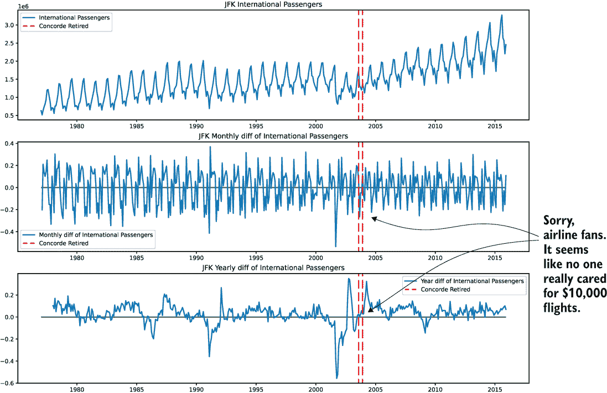

图 5.10 使用函数生成此图提供了适应性，其可重用性允许快速验证数据异常，节省时间。

为了展示花一点额外时间构建函数，即使是实验验证代码的好处，让我们看看我们可以如何使用来自完全不同的机场，拉瓜迪亚（LGA）的数据生成。如果我们编写了原始的异常值绘图脚本，并希望为 LGA 生成相同的绘图，我们就必须复制 JFK 脚本，经过繁琐的过程，逐个覆盖对 `JFK` 的引用，将绘图和分析字段从 `International` `Passengers` 更改为 `Domestic` `Passengers`，并希望我们能够替换所有引用，以防止错误的时间序列或值被绘制。（由于 Python REPL 有对象常性的概念，所有引用都保留在内存中，直到内核 REPL 停止。）接下来将展示具有绘图功能实现的代码。

列表 5.12 用于异常分析实验阶段函数的使用

```
laguardia = get_airport_data('LGA', DATA_PATH)                       ❶
laguardia = apply_index_freq(laguardia, 'MS')                        ❷
useful_outlier = generate_outlier_plots(laguardia, 'LGA', 'Domestic Passengers', '2001-09-11', 'Domestic Passenger Impact of 9/11', 'lga_sep_11_outlier.svg')                                       ❸
```

❶ 从拉瓜迪亚获取数据。（这仅用于演示目的。在一个正确开发的解决方案中，我们只会加载一次数据，并在内存中的 DataFrame 上直接应用过滤器。）

❷ 以与 JFK 数据相同的方式设置“月初”的索引频率

❸ 生成可视化并将其保存到磁盘。此函数的参数使得生成这些绘图变得简单，但更重要的是，可重复。

通过这三行简短的代码，我们可以获取一个存储到磁盘的新可视化，并适当地标记了我们发现的指示异常期，而无需重新实现构建数据集和可视化的所有原始代码。图 5.11 显示了生成的可视化。

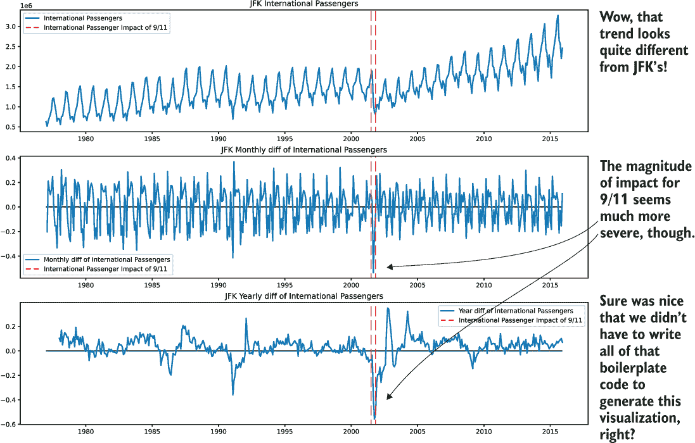

图 5.11 列表 5.12 的绘图结果

注意：这里显示的函数仅用于说明目的。后面的章节将介绍构建函数和机器学习方法的正确方式，以便在单个函数或方法中减少操作步骤。目前，重点是简单地说明即使在项目的早期阶段，可重用代码的好处。

应该创建函数的情况

在实验过程中，除了立即解决问题的焦点之外，我们还应该考虑哪些代码元素需要模块化以供重用。并非解决方案的每个方面都需要达到生产就绪状态，尤其是在早期阶段，但开始思考哪些项目方面需要多次引用或执行是有帮助的。

从快速原型设计转向构建函数有时会感觉像是暂时偏离了你的目标。重要的是要意识到，通过花上一两个小时创建一个通用的可重复任务参考，你可能会在之后节省数十个小时。

这些小时主要是由这样一个简单的事实节省下来的：当你努力将脚本解决方案转换为经过良好开发的机器学习代码库时，你不需要审查那么多的实现。而不是在代码中散布数十个可视化和评分函数，你将只剩下一些单用途函数，这些函数需要作为一个单一单元来查看和评估。

在机器学习（ML）领域，我通常会尽早创建函数的一些元素如下：

+   数据摄取和数据清洗

+   评分和错误计算

+   通用数据可视化

+   验证和预测可视化

+   模型性能报告（例如，ROC 曲线和混淆矩阵）

许多其他实例在构建机器学习解决方案的早期阶段都适合进行“函数处理”。在构建项目早期阶段时，需要记住的重要一点是，要么立即留出时间创建可重用代码，要么至少将代码标记为易于实施，以便一旦可行就易于识别并采取行动。

我们为什么要讨论函数的好处？难道每个人都知道何时使用它们吗？

预测建模实验的现实情况是，大多数机器学习从业者最终会花费大量精力在特征工程、数据验证和建模上。不断的代码重写和测试让我们所有人都习惯了这样一个事实：我们构建的项目实验代码可能会迅速退化成半实现、注释掉且通常难以阅读的混乱状态。

有时候感觉，在想要测试新事物的时候，直接从笔记本的上方单元格复制一大块代码来快速实现某个功能似乎更容易。结果却导致了一团糟的混乱代码，需要巨大的努力才能将其整理成适合进一步开发的形态。

大多数时候，当我看到（或过去做过）这样的绿色田野实验时，一旦确定了方法，所有的原始测试代码就被简单地废弃了。然而，情况并不一定如此。如果在这一阶段稍加注意，后续的开发阶段可以更加高效。

如果你在一个团队中工作，这些问题只会变得更加复杂。想象一下，如果这个项目是由六个数据科学子团队执行的。到测试阶段结束时，仅数据摄取就有几十种实现，至少有十种方式来绘制数据并运行时间序列数据的统计分析。标准化和使用函数可以帮助减少这种冗余代码。

### 5.2.3 关于为实验构建可重用代码的最后一则注意事项

在我们继续进行这个项目实验的建模阶段之前，让我们看看另一个函数。这个函数将帮助我们从一个机场的列表中获取一个特定时间序列（乘客数据系列之一）的有用快照，该列表是每个模型的比较位置。

之前我们查看过绘制异常值（第 5.2.2 节）和获取趋势分解图（第 5.2.1 节）。如果我们有两个额外的图表，将非常有价值，帮助我们了解我们应该为将要测试的一些模型类型使用的初始设置。这两个图表是自相关和偏自相关图。

*自相关* 是一种算法，它将在时间序列和相同序列的滞后值（相同数据系列的先前步骤）之间运行皮尔逊测试，结果在 -1 到 +1 的范围内，表示这些滞后之间的相对相关性。+1 的值表示最大正相关，表明在整个数据系列中指定滞后位置上的值完美同步（如果时间序列中每 10 个值有一个可重复的模式，这将显示为 +1 的最大正相关）。来自自相关测试绘制的图表将显示计算出的每个滞后值，以及从 0 开始向外的蓝色圆锥体，表示置信区间（默认为 95%）。超出这个蓝色圆锥体的点被认为是统计上显著的。自相关测试在滞后测量中包括直接依赖信息以及间接影响。

由于自相关测试的性质对此有影响，单独查看时可能会有些误导。在分析时间序列数据时，除了自相关测试外，还有一个有用的附加图，即*部分自相关测试*也被使用。这个附加测试以与自相关类似的方式评估每个滞后位置，但它更进一步，通过消除先前滞后值对被测量的独立滞后引入的影响。通过消除这些影响，可以测量该特定值处的直接滞后关系。

这为什么很重要？

我们可以使用这些图表中揭示的值作为我们建模的起点（即设计用于自回归的模型）。我们将在第六章中更深入地探讨这一点。

目前，我们应该确保在任何人开始建模之前，我们有一个标准化的方法一次性生成这些图表，以便所有团队都能快速生成这些可视化，以帮助他们调整。让我们创建一个简单的函数来绘制我们分析将要预测的序列所需的大部分内容。

列表 5.13 模型准备的标准时序可视化和分析

```
from statsmodels.graphics.tsaplots import plot_acf, plot_pacf
def stationarity_tests(time_df, series_col, time_series_name, period, image_name, lags=12, cf_alpha=0.05, style='seaborn', plot_size=(16, 32)):
    log_col_name = 'Log {}'.format(series_col) 
    diff_log_col_name = 'LogDiff {}'.format(series_col) 
    time_df[log_col_name] = np.log(time_df[series_col])
    time_df[diff_log_col_name] = time_df[log_col_name].diff()                ❶
    decomposed_trend = seasonal_decompose(time_df[series_col], period=period)❷
    df_index_start = time_df.index.values[0]
    df_index_end = time_df.index.values[len(time_df)-1]                      ❸
    with plt.style.context(style=style):                                     ❹
        fig, axes = plt.subplots(7, 1, figsize=plot_size)
        plt.subplots_adjust(hspace=0.3)                                      ❺
        axes[0].plot(time_df[series_col], '-', label='Raw data for 
          {}'.format(time_series_name))                                      ❻
        axes[0].legend(loc='upper left')
        axes[0].set_title('Raw data trend for {}'.format(time_series_name)) 
        axes[0].set_ylabel(series_col)
        axes[0].set_xlabel(time_df.index.name)
        axes[1].plot(time_df[diff_log_col_name], 'g-', label='Log Diff for   ❼
          {}'.format(time_series_name))
        axes[1].hlines(0.0, df_index_start, df_index_end, 'r', label='Series 
          center')
        axes[1].legend(loc='lower left')
        axes[1].set_title('Diff Log Trend for outliers in 
          {}'.format(time_series_name))
        axes[1].set_ylabel(series_col)
        axes[1].set_xlabel(time_df.index.name) 
        fig = plot_acf(time_df[series_col], lags=lags, ax=axes[2])           ❽
        fig = plot_pacf(time_df[series_col], lags=lags, ax=axes[3])          ❾
        axes[2].set_xlabel('lags')
        axes[2].set_ylabel('correlation')
        axes[3].set_xlabel('lags')
        axes[3].set_ylabel('correlation')
        axes[4].plot(decomposed_trend.trend, 'r-', label='Trend data for 
          {}'.format(time_series_name))                                      ❿
        axes[4].legend(loc='upper left')
        axes[4].set_title('Trend component of decomposition for 
          {}'.format(time_series_name))
        axes[4].set_ylabel(series_col)
        axes[4].set_xlabel(time_df.index.name)
        axes[5].plot(decomposed_trend.seasonal, 'r-', label='Seasonal data for
          {}'.format(time_series_name))                                      ⓫
        axes[5].legend(loc='center left', bbox_to_anchor=(0,1))
        axes[5].set_title('Seasonal component of decomposition for 
          {}'.format(time_series_name))
        axes[5].set_ylabel(series_col)
        axes[5].set_xlabel(time_df.index.name)
        axes[6].plot(decomposed_trend.resid, 'r.', label='Residuals data for 
          {}'.format(time_series_name))                                      ⓬
        axes[6].hlines(0.0, df_index_start, df_index_end, 'black', 
          label='Series Center')
        axes[6].legend(loc='center left', bbox_to_anchor=(0,1))
        axes[6].set_title('Residuals component of decomposition for 
          {}'.format(time_series_name))
        axes[6].set_ylabel(series_col)
        axes[6].set_xlabel(time_df.index.name)
        plt.savefig(image_name, format='svg')                                ⓭
        plt.tight_layout()
    return fig                                                               ⓮
```

❶ 计算异常值图的日志差分数据

❷ 将序列分解为趋势成分、季节性成分和残差作为 NumPy 序列

❸ 提取索引的起始和结束值，以便绘制水平线

❹ matplotlib.pyplot.plot 的包装器，允许设置图形样式和更高效的绘图单元格渲染

❺ 对渲染的图形进行轻微调整，以确保标题和轴标签不重叠

❻ 绘制原始数据图，为其他所有图表提供视觉参考

❼ 异常值数据图（日志差分）

❽ 自相关图，为调整（连同部分自相关）提供洞察，用于自回归模型

❾ 部分自相关图，为调整自回归模型提供洞察

❿ 从序列中提取的趋势图示

⓫ 序列季节性信号的图示

⓬ 系列残差的图示

⓭ 保存图形以供以后参考和演示

⓮ 返回组合图形，以便在需要额外处理的情况下使用

现在我们来看看这段代码会产生什么结果。图 5.12 是执行以下代码的结果。

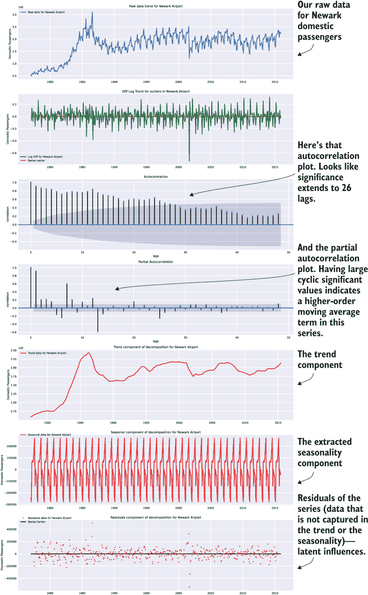

图 5.12 模型准备的全趋势可视化套件，应用于纽瓦克国际机场国内旅客数据

列表 5.14 纽瓦克国内旅客趋势可视化

```
ewr = get_airport_data('EWR', DATA_PATH)                                  ❶
ewr = apply_index_freq(ewr, 'MS')                                         ❷
ewr_plots = stationarity_tests(ewr, 'Domestic Passengers', 'Newark Airport', 12, 'newark_domestic_plots.svg', 48, 0.05)                           ❸
```

❶ 从原始数据源获取 EWR（纽瓦克国际机场）的数据

❷ 在 DataFrame 的日期索引上应用频率

❸ 为指定的时序（国内旅客）生成纽瓦克的快照图表

现在我们终于准备开始模型评估了。我们有一些标准的可视化，它们被很好地封装在可重用的函数中，我们知道哪些机场将被用于测试，而我们开发的工具将确保每个实验测试都将使用相同的可视化集和数据预处理步骤。我们已经消除了可能开发的大部分样板代码，并减少了开始解决我们试图解决的核心理问题的所需时间：预测。

当我们在下一章开始建模阶段时，我们将构建额外的标准可视化。目前，我们可以保证一件事：团队不会重新发明轮子或过度使用复制粘贴。

## 摘要

+   对解决问题可能方法的彻底研究涉及通过数据集统计分析、模型 API 审查、API 文档阅读、快速原型设计和目标比较的时间限制评估。

+   通过适当的统计评估和可视化来深入了解候选特征数据将有助于早期发现问题。从对项目训练数据的清晰和定义良好的熟悉状态开始，将在项目开发周期后期消除昂贵的返工。
