# 6 实验行动：测试和评估一个项目

本章节涵盖

+   评估机器学习项目的潜在方法

+   客观选择项目实施的方法

前一章涵盖了为了最小化与项目实验阶段相关的风险而应采取的所有准备工作。这些工作包括进行研究以提供解决问题的选项，以及构建团队成员在原型设计阶段可以利用的有用功能。我们将继续本章的前一个场景，即机场旅客需求预测的时间序列建模项目，同时关注应用于实验测试的方法，这些方法将有助于降低项目失败的可能性。

我们将花费时间介绍测试方法，因为这个项目开发阶段对于两个主要原因至关重要。首先，在一种极端情况下，如果测试的方法（批判性和客观地评估）不足，所选的方法可能不足以解决实际问题。在另一种极端情况下，测试过多的选项并深入到过大的程度可能导致实验原型设计阶段在业务眼中耗时过长。

通过遵循旨在快速测试想法的方法论，使用统一的评分方法以实现方法之间的可比性，并专注于评估方法的表现而非预测的绝对准确性，可以降低项目放弃的可能性。

图 6.1 比较了在机器学习项目中原型设计的两种极端。中间地带，即适度方法，在我所领导或合作过的团队中显示出最高的成功率。

如此图表所示，两端的极端方法通常会导致截然相反的问题。在左侧，由于业务对 DS 团队交付解决方案能力的信心不足，项目取消的概率极高。除非极端幸运，否则团队随意选择且几乎未经测试的解决方案可能根本不是最优的。他们实施解决方案的方式同样可能糟糕、昂贵且脆弱。

然而，在图表的另一侧，却存在一个完全不同的问题。这里展示的受学术影响的彻底性是值得赞扬的，对于进行原创研究的团队来说效果很好。但对于在工业界工作的 DS 团队来说，彻底评估所有可能解决方案所需的时间将远远超过大多数公司所能容忍的耐心。为每种方法定制特征工程、全面评估流行框架中可用的模型，以及可能的新算法的实施，都是沉没成本。虽然它们作为一系列采取的行动更加科学严谨，但花费时间构建每种方法以正确检验哪种方法最有效，意味着其他项目无法得到工作。正如古老的谚语所说，时间就是金钱，从时间和金钱的角度来看，构建完整的方法来解决问题是昂贵的。

为了以应用为导向的方式探索一种有效的方法，我们将继续使用前一章中关于时间序列建模的场景。在本章中，我们将从图 6.1 的中间地带开始，到达最有可能导致成功 MVP 的候选方法。

在这个阶段，要抵制追求完美的诱惑。

作为数据科学家，我们工作中的自然倾向是构建尽可能最优和数学上正确的解决方案。这是一个重要的驱动力，但应该是整个项目的目标。在早期测试阶段，追求完美实际上可能对项目的成功产生不利影响。

尽管项目的商业赞助者都希望拥有最佳可能的解决方案，但他们对这个解决方案的可见性仅限于你最终决定的方法。他们还专注于开发这个解决方案所需的时间（以及其成本）。他们对你为了找出最佳解决方案所做的一切没有可见性，并且并不真正关心你在发现最佳解决方案的过程中测试了多少东西。

在原型设计和测试方法这个阶段，最好是摒弃你天生的全面探索所有解决问题选项的欲望，而是专注于高效地找到最可能的方法。通过这种方式调整焦点，并将你的范式转变为将交付时间视为项目第二重要的因素，你将确保解决方案有更高的机会沿着生产路径进一步推进。

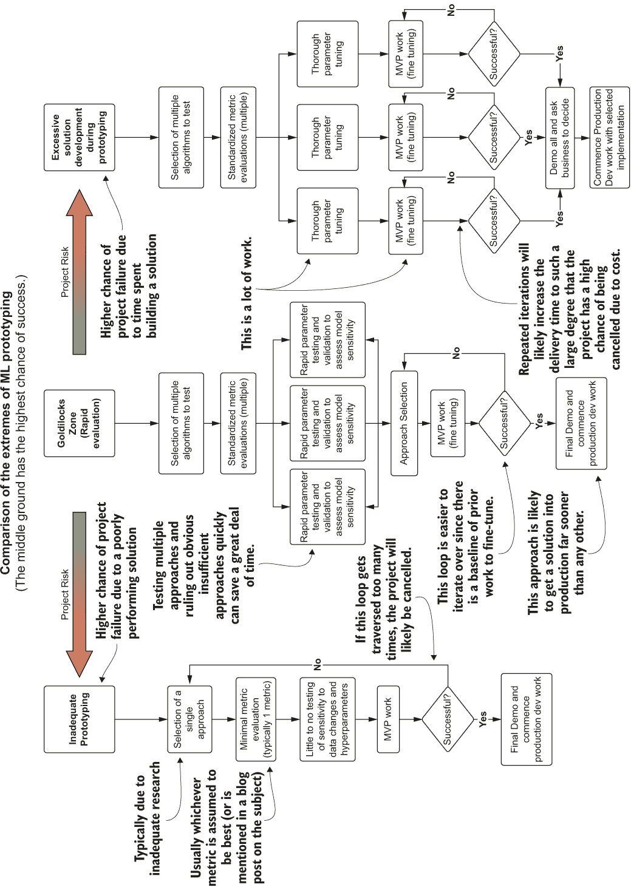

图 6.1 机器学习解决方案原型设计工作的滑动尺度

## 6.1 测试想法

在第五章结束时，我们处于一个准备评估机场乘客预测的不同单变量建模方法的状态。现在，团队准备分成小组；每个小组将专注于实施已发现的各种研究选项，不仅全力以赴以产生尽可能准确的结果，还要理解调整每个模型的细微差别。

在每个人都开始编写实现代码之前，还需要开发一些额外的标准化工具函数，以确保每个人都在评估相同的指标，生成相同的报告，并生成可以轻松显示不同方法优势和劣势的适当可视化。一旦完成这些，团队就可以开始评估和进行研究，每个团队都使用相同的核心功能和评分。图 6.2 概述了在项目模型原型阶段应遵守的典型实用工具、功能标准。

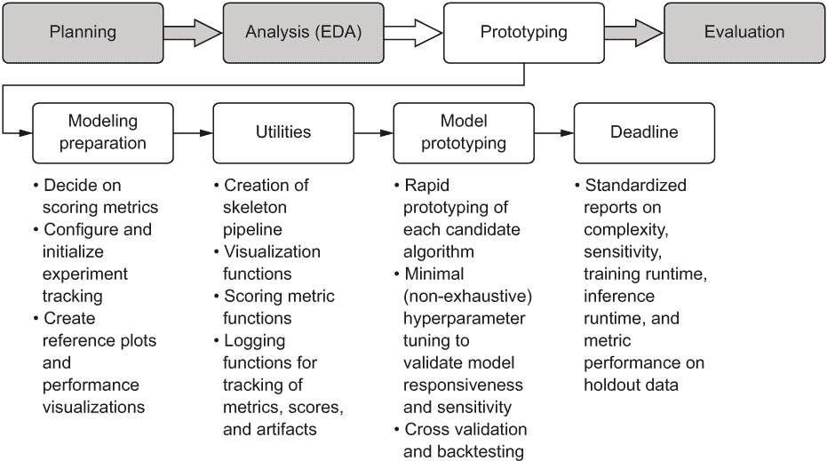

图 6.2 原型阶段的工作要素及其功能

如第 5.2 节所述，这一行动路径通常专注于监督学习项目工作。对于 CNN 等原型阶段，其工作方式会有很大不同（在构建模型性能的可读性评估方面有更多前期工作，尤其是如果我们谈论的是分类器）。但总的来说，如果遵循这些前期行动和原型不同解决方案的方法，将节省几周令人沮丧的重做和困惑。

### 6.1.1 在代码中设置指南

在第五章中，我们查看并开发了一套可视化工具和基本的数据摄入和格式化函数，每个团队都可以使用。我们建立这些工具的主要目的是：

+   *标准化*——以便每个团队生成相同的图表、图形和指标，以便在不同方法之间进行连贯的比较

+   *沟通*——以便我们可以生成可引用的可视化，向业务展示我们的建模工作是如何解决问题的

在项目工作的这个阶段满足这两个需求至关重要。如果没有标准化，我们可能会在 MVP（以及随后的完整解决方案）选择方法上做出错误的决定。此外，我们可能会浪费多个团队的时间，这些团队本应测试他们的方法，却正在构建实际上与可视化本质上做同样事情的实现。如果没有沟通方面，我们可能会留下令人困惑的指标分数值来报告，或者在最坏的情况下，向业务展示原始代码。任何一种方法都会在演示会议上导致灾难。

总是准备好不令人困惑的图表

作为一名初出茅庐的数据科学家（在我们被称为这个名字之前），我学到的最早的教训之一是，公司里的每个人并不都对统计数据有胃口。没有比向为项目提供资金的高管吹嘘你花费数月时间研究出的解决方案的真实性更好的方法了，你可以声称一些晦涩（对他们来说，不是对我们来说）的准确度分数、置信区间或其他数学指标。

作为一种物种，我们渴望在世界上找到秩序和模式。*负熵*（由莱昂·布里渊提出的一个术语）是一种自然的进化趋势，它被有效地编程进我们的身体中。正因为如此，数据的视觉表示，尤其是当它们被精心设计以简化高度复杂的系统时，总是作为沟通工具更加有效。

我强烈推荐，对于任何数据科学家正在工作的特定解决方案，都应该投入大量的思考和精力来思考并构建最有效且易于理解的视觉表示，以传达所使用的算法（或从头开发）的相应预测能力，以解决目标商业问题。这并不是说业务部门的每个人都将是无知的；相反，重点是视觉表示总是比其他任何手段在传达机器学习解决方案的信息方面更强大。

引用这个想法的原始传达者亨利克·易卜生的话，“一千个词也不如一个行动留下的深刻印象。”换句话说，正如弗雷德·R·巴纳德方便地改编的那样，“一图胜千言。”

在团队开始跳出自己的领域并过于专注于开发分配的解决方案之前，我们可能需要由更大的团队进行一次最终分析，以帮助了解他们的预测在视觉上的表现如何。记住，正如我们在第四章中讨论的那样，在这个实验阶段的结束时，团队需要以一种可以轻松被非机器学习和非技术受众消化的方式展示其发现。

实现这种沟通的最有效方式之一是通过简单的可视化。专注于展示方法输出的结果，并使用清晰简单的注释，不仅可以有利于测试的早期阶段，还可以在解决方案投入生产后用于报告其性能。避免使用没有视觉提示来解释其含义的混淆报告和指标表，将确保与业务进行清晰简洁的沟通。

基线比较可视化

为了有一个更复杂模型的基本参考，查看最简单的实现结果可能是有益的；然后我们可以看看我们提出的方案是否能做得更好。对于时间序列建模而言，这个基线可以采取简单移动平均和指数平滑平均的形式。这两种方法都不适用于项目的预测需求，但它们的输出结果可以用来在验证的保留期内查看我们的更复杂的方法是否会是一个改进。

为了创建团队可以用来查看这些关系的可视化，我们首先必须定义一个指数平滑函数，如以下列表所示。请记住，这一切都是为了标准化每个团队的工作，并建立一个有效的沟通工具，以传达项目的成功给业务。

列表 6.1 用于生成比较预测的指数平滑函数

```
def exp_smoothing(raw_series, alpha=0.05):            ❶
    output = [raw_series[0]]                          ❷
    for i in range(1, len(raw_series)):               ❸
        output.append(raw_series[i] * alpha + (1-alpha) * output[i-1])
    return output
```

❶ alpha 是平滑参数，为序列中的前一个值提供阻尼。 (值接近 1.0 具有强烈的阻尼效果，而相反，值接近 0.0 的阻尼效果较小。)

❷ 将序列的起始值添加到初始化正确的索引位置以进行遍历

❸ 对序列进行迭代，将指数平滑公式应用于每个值及其前一个值

为了进行额外的分析目的，需要提供一个补充函数来为这些简单的时间序列建模拟合生成指标和误差估计。以下列表提供了一个计算拟合平均绝对误差的方法，以及计算不确定性区间（`yhat`值）的方法。

列表 6.2 平均绝对误差和不确定性

```
from sklearn.metrics import mean_absolute_error
def calculate_mae(raw_series, smoothed_series, window, scale):
    res = {}                                                             ❶
    mae_value = mean_absolute_error(raw_series[window:], 
      smoothed_series[window:])                                          ❷
    res['mae'] = mae_value
    deviation = np.std(raw_series[window:] - smoothed_series[window:])   ❸
    res['stddev'] = deviation
    yhat = mae_value + scale * deviation                                 ❹
    res['yhat_low'] = smoothed_series - yhat                             ❺
    res['yhat_high'] = smoothed_series + yhat
    return res
```

❶ 实例化一个字典，用于将计算值放入 Currying 的目的地

❷ 使用标准的 sklearn mean_absolute_error 函数获取原始数据和平滑序列之间的 MAE

❸ 计算序列差异的标准差以计算不确定性阈值（yhat）

❹ 计算差分序列的标准基线 yhat 值

❺ 在平滑序列数据周围生成一个低和高 yhat 序列

注意：在这些代码列表中，`import`语句在函数上方需要的地方显示。这只是为了演示目的。所有的`import`语句都应该始终位于代码的顶部，无论是编写笔记本、脚本还是在 IDE 中作为模块。

现在我们已经定义了列表 6.1 和 6.2 中的两个函数，我们可以在另一个函数中调用它们，不仅生成可视化，还可以生成移动平均和指数平滑数据的系列。以下代码用于生成每个机场和乘客类型的参考数据和易于引用的可视化。

列表 6.3 生成平滑图

```
def smoothed_time_plots(time_series, time_series_name, image_name, smoothing_window, exp_alpha=0.05, yhat_scale=1.96, style='seaborn', plot_size=(16, 24)):
    reference_collection = {}                                              ❶
    ts = pd.Series(time_series)
    with plt.style.context(style=style):
        fig, axes = plt.subplots(3, 1, figsize=plot_size)  
        plt.subplots_adjust(hspace=0.3)
        moving_avg = ts.rolling(window=smoothing_window).mean()            ❷
        exp_smoothed = exp_smoothing(ts, exp_alpha)                        ❸
        res = calculate_mae(time_series, moving_avg, smoothing_window, 
          yhat_scale)                                                      ❹
        res_exp = calculate_mae(time_series, exp_smoothed, smoothing_window, 
          yhat_scale)                                                      ❺
        exp_data = pd.Series(exp_smoothed, index=time_series.index)        ❻
        exp_yhat_low_data = pd.Series(res_exp['yhat_low'], 
          index=time_series.index)
        exp_yhat_high_data = pd.Series(res_exp['yhat_high'], 
          index=time_series.index)
        axes[0].plot(ts, '-', label='Trend for {}'.format(time_series_name))
        axes[0].legend(loc='upper left')
        axes[0].set_title('Raw Data trend for {}'.format(time_series_name))
        axes[1].plot(ts, '-', label='Trend for {}'.format(time_series_name))
        axes[1].plot(moving_avg, 'g-', label='Moving Average with window: 
          {}'.format(smoothing_window))
        axes[1].plot(res['yhat_high'], 'r--', label='yhat bounds')
        axes[1].plot(res['yhat_low'], 'r--')
        axes[1].set_title('Moving Average Trend for window: {} with MAE of: 
          {:.1f}'.format(smoothing_window, res['mae']))                    ❼
        axes[1].legend(loc='upper left')
        axes[2].plot(ts, '-', label='Trend for {}'.format(time_series_name))
        axes[2].legend(loc='upper left')
        axes[2].plot(exp_data, 'g-', label='Exponential Smoothing with alpha: 
          {}'.format(exp_alpha))
        axes[2].plot(exp_yhat_high_data, 'r--', label='yhat bounds')
        axes[2].plot(exp_yhat_low_data, 'r--')
        axes[2].set_title('Exponential Smoothing Trend for alpha: {} with MAE 
          of: {:.1f}'.format(exp_alpha, res_exp['mae']))
        axes[2].legend(loc='upper left')
        plt.savefig(image_name, format='svg')
        plt.tight_layout()
        reference_collection['plots'] = fig
        reference_collection['moving_average'] = moving_avg
        reference_collection['exp_smooth'] = exp_smoothed
        return reference_collection
```

❶ 数据返回值的 Currying 字典

❷ 简单的时间序列移动平均计算

❸ 调用列表 6.1 中定义的函数

❹ 调用列表 6.2 中定义的函数以获取简单移动平均序列

❺ 调用列表 6.2 中定义的函数以获取指数平滑趋势

❻ 将 pandas 索引日期序列应用于非索引的指数平滑序列（以及 yhat 序列值）

❼ 使用字符串插值和数字格式化，使可视化更易读

我们将在下一列表中调用此函数。有了这些数据和预建的可视化，团队可以有一个易于使用且标准化的指南，在整个建模实验过程中进行参考。

列表 6.4 调用参考平滑函数以获取序列数据和可视化

```
ewr_data = get_airport_data('EWR', DATA_PATH)
ewr_reference = smoothed_time_plots(ewr_data['International Passengers'], 'Newark International', 'newark_dom_smooth_plot.svg', 12, exp_alpha=0.25)
```

当执行时，此代码将为子团队提供一个快速参考可视化（以及与移动平均和指数加权移动平均平滑算法比较的序列数据），如图 6.3 所示。

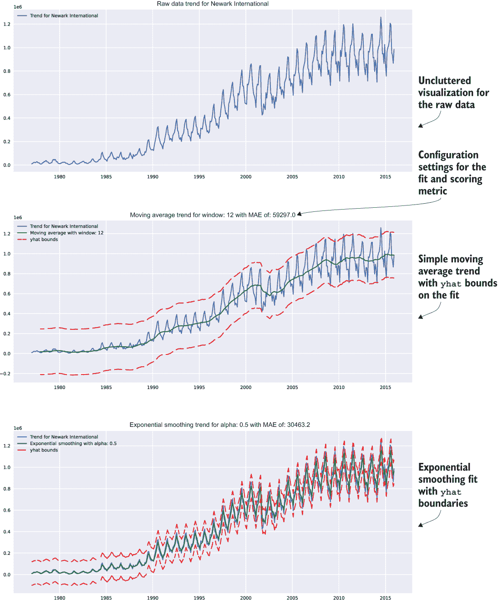

图 6.3 基于列表 6.4 中展示的 smoothed_time_plots()函数使用的参考趋势可视化

在此阶段将此样板可视化代码包装成函数（如列表 6.3 所示，并在列表 6.4 中使用）的目标有两个：

+   *便携性*—每个团队都可以将此函数作为可引用的代码片段使用，作为其工作的依赖项，确保每个人都在生成完全相同的可视化。

+   *为生产做准备*—作为函数，此代码可以轻松地移植到可视化类中，作为方法使用，不仅适用于本项目，也适用于未来的其他预测项目。

在创建可重用代码上花费少量时间可能在此阶段看起来不值得，尤其是考虑到我们一直关注解决方案原型的及时交付。但请放心，随着项目规模的扩大和复杂性的增加远远超出简单的预测问题，现在为模块化代码所做的相对较小的努力将节省大量的时间。

标准指标

在转向模型实验之前，团队需要实施的最后一件事是对预测预测的标准化测量，以保持对保留验证数据的评估。这项工作是为了消除关于每个实现有效性的任何争议。我们通过标准化有效地简化了每个实现优点的裁决，这不仅会在会议中节省时间，而且为每个的比较提供了一个强大的科学方法。

如果我们让每个团队自行确定其最优评估指标，比较它们将几乎不可能，导致测试的重做和项目进一步的延误。如果我们积累足够的这些可避免的延误，我们将大大增加项目放弃的可能性。

就指标进行争论听起来很愚蠢，对吧？

是的。是的，它确实如此。

我见过有人这样做吗？是的，我见过。

我做过吗？羞愧地说，是的，我希望我能把那些生命中的小时重新利用起来。

我作为接受者是否忍受过这种情况？我当然忍受过。

我见过它是导致项目取消的原因吗？不，那太荒谬了。

需要提到的是，时间是有限的。当构建一个解决方案来解决业务问题时，在业务单元继续做它之前的事情，或者会直接要求取消项目，基本上拒绝再次与团队合作之前，只能允许发生如此多的延迟。

围绕着关于使用哪个指标来评估模型持续争论的可避免和多余的延迟是愚蠢的，尤其是当我们考虑到计算模型评估的所有指标并保留其可参考的分数以供未来任何时候的后验评估是一项如此微不足道的时间投资时。只需收集与你要解决的问题相关的所有指标（值得注意的是，前面提到的例外——如果指标的计算复杂度如此之高，以至于获取它明显很昂贵，确保在编写代码之前捕获它是值得的）。使代码适应这种灵活性符合敏捷原则，允许快速转向，而无需进行大量重构来更改功能。

在 5.1.3 节中，我们讨论了团队将用于评估模型的协议指标：R 平方、均方误差（MSE）、均方根误差（RMSE）、平均绝对误差（MAE）、平均绝对百分比误差（MAPE）和解释方差。为了为每个将专注于实施建模测试的子团队节省大量时间，我们应该构建一些函数，这将使评分和标准化报告结果变得更加容易。

首先，我们需要实际实现 MAPE，因为它在 Python 库中（在撰写本文时）并不是作为评分指标 readily available。这个指标对于评估跨许多不同时间序列的预测的整体质量至关重要，因为它是一个缩放和标准化的值，可以用来比较不同的预测，而无需考虑序列值的幅度。

然而，它不应该作为唯一的测量指标，正如我们在实验规划中之前讨论的那样。为每个正在进行的实验记录多个指标将带来好处，如果我们需要根据不同的指标评估以前的实验。以下列表显示了一个基本的 MAPE 实现。

列表 6.5 简单 MAPE 实现

```
def mape(y_true, y_pred):
    return np.mean(np.abs((y_true - y_pred) / y_true)) * 100
```

现在我们已经定义了这一点，我们可以创建一个简单的序列评分函数，它将计算所有商定的指标，而无需在所有实验代码库中手动实现每个计算。此函数还将允许我们将这些计算嵌入到我们的可视化中，而无需在代码中不断重新定义标准指标计算。我们将使用的标准指标函数将在下面展示。

列表 6.6 为评分预测数据的标准误差计算

```
from sklearn.metrics import explained_variance_score, mean_absolute_error, mean_squared_error, r2_score                                         ❶
def calculate_errors(y_true, y_pred):                                     ❷
    error_scores = {}                                                     ❸
    mse = mean_squared_error(y_true, y_pred)                              ❹
    error_scores['mae'] = mean_absolute_error(y_true, y_pred)
    error_scores['mape'] = mape(y_true, y_pred)                           ❺
    error_scores['mse'] = mse
    error_scores['rmse'] = sqrt(mse)
    error_scores['explained_var'] = explained_variance_score(y_true, y_pred)
    error_scores['r2'] = r2_score(y_true, y_pred)
    return error_scores
```

❶ 尽可能多地导入和利用可用的标准评分实现。没有必要重新发明轮子。

❷ 实际序列和预测序列在预测验证时间段的通过情况

❸ 实例化一个字典结构来存储评分以供其他地方使用（注意打印语句的缺失）

❹ 局部变量声明（因为 mse 值将被存储并用于 rmse 指标）

❺ 列表 6.5 中定义的 mape 计算的运算和使用

这个函数明显没有`print`语句。这是出于两个截然不同的原因的设计。

首先，我们希望使用字典封装的评分指标来构建我们将为团队使用的可视化；因此，我们不希望简单地打印到标准输出。其次，在函数和方法中报告标准输出是一种不良做法，因为这将在你开发解决方案时给你带来更多的工作。

在发布到生产之前挖掘代码以清除`print`语句（或将它们转换为日志语句）是乏味、易出错且如果遗漏，可能会对生产解决方案的性能产生影响（尤其是在延迟评估的语言中）。此外，在生产中，*没有人会阅读*标准输出，使得`print`语句除了是无用执行的代码之外别无其他。

打印语句及其为何对机器学习很糟糕

实际上，`print`语句对所有软件都不好。唯一的显著例外是用于代码的临时调试。如果你想检查运行时复杂事物的状态，它们可以非常有帮助。除了这个特定用例之外，应该不惜一切代价避免使用。

问题是我到处都看到它们：打印的行数、打印的评分指标、打印的数组和列表长度、打印正在测试的超参数、打印 I/O 操作的源和目标以及打印传递给方法的参数配置。它们都是同样无用的（而且大多数对团队的基础设施预算有积极破坏作用）。

博客文章、Hello World 示例和 API 的基本入门指南广泛使用它们来展示新语言、主题或 API 的即时和令人满意的结果，但一旦您对语法和用法有了基本的了解，这些应该总是从代码中移除。原因很简单：您永远不会再次查看那些`print`语句，除非是在实验和开发之外。在代码中随意放置它们会在 stdout 中留下令人困惑且难以找到的引用，指示代码将在生产中运行的位置，这通常意味着一旦运行结束，信息就会永远丢失。

对于与机器学习运行相关的信息，更好的做法是将数据持久化到可以轻松查询或视觉参考的位置。这样，您为`print`语句收集的辛苦收集的信息可以存储起来供以后参考、绘图或用于系统控制自动化流程。

做个好事，如果你在实验期间真的需要打印东西，确保`print`语句只存在于实验脚本代码中。更好的替代方案是在代码中记录结果，或者，如我们将在下一章中介绍的，使用 MLflow 这样的服务。

对于最终建模前的准备工作，我们需要构建一个快速的可视化和指标报告函数，这将给每个团队提供一个标准且高度可重用的评估每个模型预测性能的方法。以下列表显示了一个简单的示例，我们将在第 6.1.2 节中的模型实验阶段使用它。

列表 6.7：带有误差度量的预测预报绘图

```
def plot_predictions(y_true, y_pred, time_series_name, value_name, image_name, style='seaborn', plot_size=(16, 12)):                 ❶
    validation_output = {} 
    error_values = calculate_errors(y_true, y_pred)                    ❷
    validation_output['errors'] = error_values                         ❸
    text_str = '\n'.join((
        'mae = {:.3f}'.format(error_values['mae']),
        'mape = {:.3f}'.format(error_values['mape']),
        'mse = {:.3f}'.format(error_values['mse']),
        'rmse = {:.3f}'.format(error_values['rmse']),
        'explained var = {:.3f}'.format(error_values['explained_var']),
        'r squared = {:.3f}'.format(error_values['r2']),
    ))                                                                 ❹
    with plt.style.context(style=style):
        fig, axes = plt.subplots(1, 1, figsize=plot_size)
        axes.plot(y_true, 'b-', label='Test data for 
          {}'.format(time_series_name))
        axes.plot(y_pred, 'r-', label='Forecast data for 
          {}'.format(time_series_name))                                ❺
        axes.legend(loc='upper left')
        axes.set_title('Raw and Predicted data trend for 
          {}'.format(time_series_name))
        axes.set_ylabel(value_name)
        axes.set_xlabel(y_true.index.name)
        props = dict(boxstyle='round', facecolor='oldlace', alpha=0.5) ❻
        axes.text(0.05, 0.9, text_str, transform=axes.transAxes, fontsize=12, 
          verticalalignment='top', bbox=props)                         ❼
        validation_output['plot'] = fig
        plt.savefig(image_name, format='svg')
        plt.tight_layout()
    return validation_output
```

❶ 将输入设置为索引系列值，而不是具有字段名的 DataFrame 输入，以使函数更通用

❷ 调用第 6.6 节中创建的函数，计算项目中所有商定的误差度量

❸ 将误差度量添加到输出字典中，以便在仅生成可视化之外使用

❹ 生成应用于图上叠加的边界框元素的字符串

❺ 以不同颜色将实际和预测预测数据叠加到同一图上

❻ 创建一个文本框，显示所有误差分数以及绘制的数据

❻ 将文本内容写入文本边界框

现在，在创建这些基本函数以加速我们的实验工作之后，我们终于可以开始测试各种时间序列工作的预测算法的过程了。

### 6.1.2 运行快速预测测试

快速测试阶段是原型设计中最关键的方面，必须正确处理。正如本章引言中提到的，努力寻求中间地带至关重要——既不是测试各种方法太少，无法确定每个算法的调整灵敏度，也不是花费过多的时间构建每个方法的完整最小可行产品（MVP）解决方案。由于*时间是这一阶段最重要的方面*，我们需要在做出明智决策的同时保持效率，关于哪种方法最有希望以稳健的方式解决问题。

拥有有用且标准化的效用函数，每个团队都可以在其相应的方法上工作，快速测试以找到最有希望的模式。团队已经同意，用于建模测试的机场是 JFK、EWR 和 LGA（每个团队需要在相同的数据集上测试其模型和调整范式，以便对每种方法进行公平的评价）。

让我们来看看在快速测试期间，团队将如何使用不同的模型方法，将做出哪些关于方法的决策，以及如果他们发现这种方法没有进展，团队如何快速调整。探索阶段不仅将揭示每个算法的细微差别，还将阐明在准备阶段（在第五章中介绍）可能没有意识到的项目方面。重要的是要记住，这是可以预见的，在快速测试阶段，当团队发现这些问题时，他们应该相互之间保持频繁的沟通（以下侧边栏提供了有效管理这些发现的技巧）。

在黑客马拉松期间寻求裁判

我最激动人心的数据科学工作之一发生在项目的快速原型阶段。看到产生的创造力和一群聪明人共同努力解决一个被认为无法解决的问题，这是令人兴奋的。

在黑客马拉松一天（或几天，取决于问题的复杂性）的混乱中，有一个活动调解员非常重要。无论是团队领导、经理、首席数据科学家还是小组中最资深的个人技术贡献者，重要的是要留出一个人来从工作中抽身，作为小组之间的沟通者。

这个人的角色是讨论正在进行的任务，提供建议，并转移在团队之间获得的知识。由于仲裁角色的关键性，这个人不应该积极从事任何解决方案的工作。他们应该花时间在各个小组之间移动，提出简短而尖锐的问题，并在团队遇到困难时提供关于替代策略的建议。

在本节中，我们将看到快速原型设计练习中的发现可以应用于其他团队。有一个中立的第三方技术方来传播这些信息是关键。

无论原型设计阶段是否游戏化，重要的是要记住，毕竟整个团队都在为同一家公司工作。每个人最终都会关注通过 MVP、开发和生产阶段胜出的解决方案的方法。进行激烈和高度竞争的比赛实际上没有什么好处。

等一下……我们怎么创建一个验证数据集？

在模型测试阶段，有一个团队抽到了不吉利的短草，他们采用了一种团队不太理解的预测方法进行研究和测试。团队中的某个人提到了使用向量自回归（VAR）来共同建模多个时间序列（多元内生序列建模），因此这个团队着手研究这个算法是什么以及如何使用它。

他们首先搜索“向量自回归”，结果是一大堆围绕宏观经济计量研究和模型在自然科学应用中的公式化理论分析和数学证明。这很有趣，但如果他们想快速测试这个模型在数据上的应用，就不是很实用了。接下来，他们找到了该模型的 statsmodels API 文档。

团队成员很快意识到，他们还没有考虑过标准化一个共同的功能：分割方法。对于大多数监督机器学习问题，他们一直使用 pandas 的分割方法，通过 DataFrame 切片或利用高级随机分割 API，这些 API 使用随机种子来选择训练集和测试集的数据行。然而，对于预测，他们意识到他们已经有一段时间没有进行时间分割了，需要一种确定性和按时间顺序的分割方法来获取准确的预测验证保留数据。由于数据集有一个从 DataFrame 格式化函数中设置的索引，他们可能可以基于索引位置构建一个相对简单的分割函数。他们想出的方法如下所示。

列表 6.8：训练集和测试集的时间分割（包含验证检查）

```
from dateutil.parser import parse
def split_correctness(data, train, test):                           ❶
    assert data.size == train.size + test.size, \                   ❷
    "Train count {} and test count {} did not match to source count {}".format(train.size, test.size, data.size)

def generate_splits(data, date):                                    ❸
    parsed_date = parse(date, fuzzy=True)                           ❹
    nearest_date = data[:parsed_date].iloc(0)[-1].name              ❺
    train = data[:nearest_date]                                     ❻
    test = data[nearest_date:][1:]                                  ❼
    split_correctness(data, train, test)                            ❽
    return train, test
```

❶ 设计的验证断言函数旨在确保通过自定义函数进行的分割不会在训练集和测试集之间丢失任何数据行

❷ 这样的断言是“加固代码”和单元测试的前奏。我们将在后面的章节中更详细地介绍这一点，但在这个简单的例子中，要意识到我们正在构建一个自定义分割函数，以确保它按用户期望的方式运行。

❸ 用于生成训练集和测试集分割以构建模型并验证它的函数

❻ 允许在这里进行创新输入，对吧？“2005 年 6 月 3 日”应该像“2005-06-03”一样解析。如果我们使用 Python，我们不妨利用这种灵活性。我的意思是，谁还需要类型安全呢？ 

❺ 一个用于查找最近日期的搜索函数。（记住，我们这里的数据是按月度提供的；如果有人输入 2008-04-17 会发生什么？如果他们输入 2008-04-01 会发生什么？我们需要确保无论传入哪个有效数据，行为都是相同的。）

❺ 生成直到最近找到的日期的训练数据

❻ 从训练结束后的下一个索引位置生成测试数据

❽ 验证我们的训练和测试分割没有从原始源 DataFrame 中重复或删除行。（在模糊解析部分我们不需要这样做，因为解析器中的无效日期会抛出异常。）

这个团队的成员，作为他们自己知道的优秀的团队合作和友谊的守护者，立即将这个函数片段发送给其他团队，以便他们可以有一个简单的单行方法来分割他们的数据。他们甚至加入了一个创新的模糊匹配解析器，以防人们想使用不同的日期格式。

为了确保他们正确地编写了代码，他们将对他们的实现进行一些测试。他们想确保如果数据不匹配，实际上会抛出异常。让我们看看他们在图 6.4 中测试了什么。

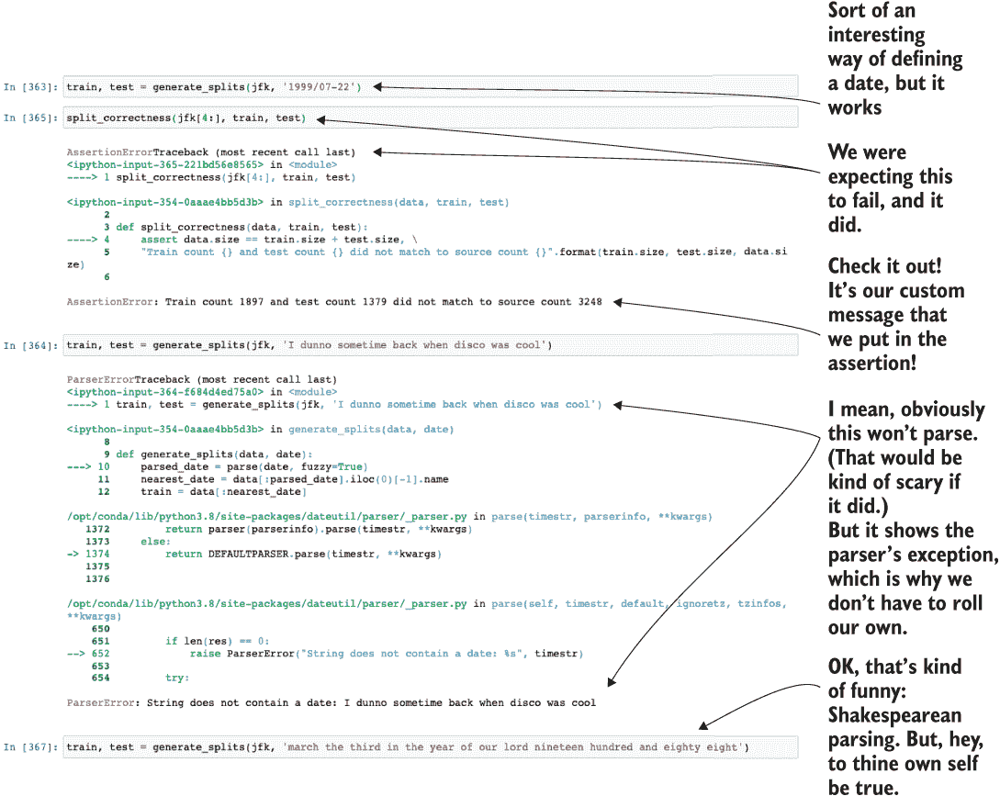

图 6.4 这个自定义逻辑验证函数确保列表 6.8 的功能按预期工作。

VAR 模型方法的快速测试

现在我们有了将数据分割成训练和测试的方法，让我们回顾一下之前设置用于测试 VAR 模型的团队。不深入探讨这个模型能做什么，VAR 模型的目标是单次遍历中对多个时间序列进行同时建模。

备注：如果您想了解更多关于这些高级方法的信息，没有比 Helmut Lütkepohl 的《多时间序列分析新引论》（Springer，2006）更好的资源了，他是这个算法的创造者。

团队查看 API 文档页面上的示例，并开始实现一个简单的测试，如下所示。

列表 6.9 对 VAR 模型的一个粗略的初步尝试

```
from statsmodels.tsa.vector_ar.var_model import VAR                        ❶
jfk = get_airport_data('JFK', DATA_PATH)

jfk = apply_index_freq(jfk, 'MS')
train, test = generate_splits(jfk, '2006-07-08')                           ❷
var_model = VAR(train[['Domestic Passengers', 'International Passengers']])❸
var_model.select_order(12)                                                 ❹
var_fit = var_model.fit()                                                  ❺
lag_order = var_fit.k_ar                                                   ❻
var_pred = var_fit.forecast(test[['Domestic Passengers', 'International Passengers']].values[-lag_order:], test.index.size)        ❼
var_pred_dom = pd.Series(np.asarray(list(zip(*var_pred))[0], dtype=np.float32), index=test.index)                                  ❽
var_pred_intl = pd.Series(np.asarray(list(zip(*var_pred))[1], dtype=np.float32), index=test.index)                                 ❾
var_prediction_score = plot_predictions(test['Domestic Passengers'], 
                                        var_pred_dom, 
                                        "VAR model Domestic Passengers JFK", 
                                        "Domestic Passengers", 
                                        "var_jfk_dom.svg")                 ❿
```

❶ 这就是我们一直在谈论的向量自回归模型！

❷ 使用我们超级棒的分割函数，可以读取人们想输入的各种日期的废话

❸ 使用时间序列数据向量配置 VAR 模型。我们可以同时建模！酷吗？我想？

❹ VAR 类有一个基于最小化赤池信息准则（AIC）的优化器。这个函数试图对滞后阶数的选择设置一个限制，以优化拟合度。我们是通过阅读这个模块的 API 文档了解到这一点的。优化 AIC 将允许算法测试大量的自回归滞后阶数，并选择表现最好的一个（至少理论上是这样）。

❺ 让我们在模型上调用 fit()函数，看看它会得出什么方程。

❻ 文档建议这样做。它应该从拟合模型中获取 AIC 优化的滞后阶数。

❼ 生成预测。这有点难以理解，因为文档非常模糊，而且显然很少有人使用这个模型。我们摸索了一下，终于搞明白了。在这里，我们正在从两个序列的测试数据集中开始预测，提取出纯序列，并预测出与测试数据集中相同数量的数据点。

❽ 这让我头疼，而且是我写的。由于我们得到了一个预测的向量（国内乘客预测和国际乘客预测的元组），我们需要从这个元组数组中提取值，将它们放入一个列表中，将它们转换为 NumPy 数组，然后从测试数据中生成一个具有正确索引的 pandas 序列，这样我们就可以绘制这个图了。呼。

❾ 我们甚至不用这个来绘图（原因即将揭晓），但实验代码中出现这种令人讨厌的复制粘贴是预料之中的。

❿ 最后，让我们使用在列表 6.7 中创建的预测图代码来看看我们的模型做得怎么样！

前面代码中生成的预测图，比较了在保留验证期间预测数据和实际数据，如图 6.5 所示。

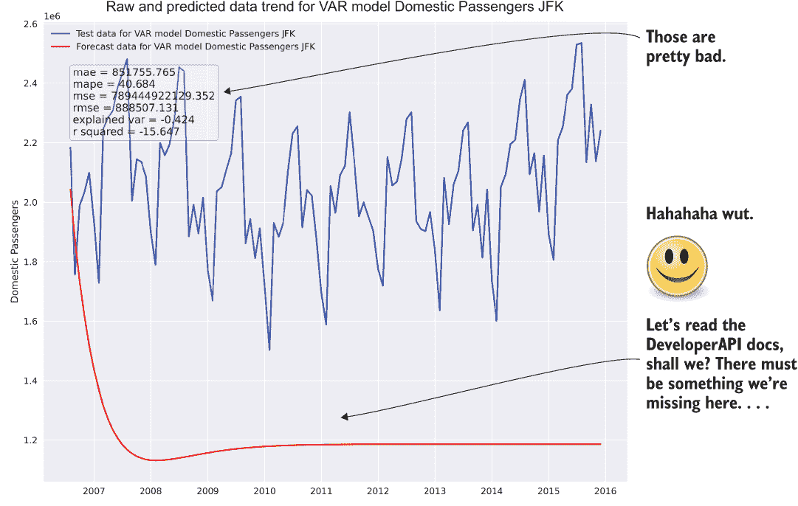

图 6.5 可能应该阅读 API 文档

PRO TIP 如果我每次在预测（或在算法开发代码中）创造出像图 6.5 中那样的混乱局面，我都会有一便士，我现在就不会工作了。我会在某个地方和我的美丽妻子以及半打狗一起放松，啜饮着冰镇鸡尾酒，听着海浪轻拍着水晶般的海岸的美妙声音。当你生成垃圾时，不要气馁。我们都会这样做。这是我们学习的方式。

好吧，那确实很糟糕。但也没有糟糕到无法想象的地步（例如，它没有预测出乘客数量会超过历史上所有人类生活的数量），但基本上是一个垃圾预测。让我们假设这个团队的宪法勇气和智慧足够高，他们愿意挖掘 API 文档和维基百科文章来找出哪里出了问题。

在这里需要记住的最重要的一点是，*糟糕的结果是快速测试阶段预期的一部分*。有时你会很幸运，事情会顺利，但大多数时候，事情在第一次尝试时不太可能顺利。在看到类似于图 6.5 的结果之后，最糟糕的事情就是将这种方法归类为不可行并转向其他事情。通过一些调整和改进方法，这个模型可能就是最好的解决方案。如果它在仅使用默认配置对原始数据系列进行第一次尝试后就放弃了，团队就永远不会知道它可能是一个可行的解决方案。

然而，考虑到这种极端情况，另一个极端对项目的成功同样有害。如果团队成员花费数天（或数周）重新调整方法数百次，以从模型中获得最佳结果，他们就不再是在做原型；相反，他们将会构建一个 MVP，并将大量资源投入到这个单一的方法中。在这个阶段的目标是在几小时内得到一个快速的答案，以确定这种方法是否值得冒险影响项目的成功。

让我们准备好去搞砸一些事情吧

在本章中，我们一直在观察从糟糕的结果到相当不错的结果的实验构建过程。这在机器学习中是可以预料的。对于任何使用机器学习工具解决的问题，可能有许多可能的途径可以解决。有些比其他更容易实现。对于那些更难实现的，隐藏的复杂层次在阅读 API 文档、博客甚至书籍时可能不会立即显现。对于大多数我们这些天生有缺陷的人类来说，完美的解决方案可能不会一开始就能找到。事实上，解决一个问题的前十几次尝试可能都会令人尴尬地糟糕。

我在机器学习开发方面的一般指导原则是，对于我带到生产状态的每一个成功的模型，我都已经扔掉了超过一百次的尝试（并且通常最终解决方案的代码行数也有类似的倍数被扔掉，在构建过程中）。

作为一名专业的机器学习工程师，意识到在实验的早期阶段，你可能会遇到一些真正（也许是有趣的）失败是很关键的。有些可能会相当令人沮丧，但当你最终找出问题并得到一个不那么糟糕的预测结果时，大多数都会给你带来难以置信的满足感。简单地接受失败，从中学习，并在写下你的第一次尝试之前，对需要阅读多少 API 文档有一个稳固的感觉，以在盲目解决问题和花费数周时间学习 API 以达到原作者同样详细程度之间取得平衡。

在下一轮测试中，团队发现`fit()`方法实际上*接受参数*。他们看到的例子和用作第一次尝试基准的例子没有定义这些参数，所以他们直到阅读 API 文档才知道这些参数。他们发现他们可以设置滞后周期性，以帮助模型理解在构建自回归方程时应该回溯多远，根据文档，这应该有助于构建自回归模型的线性方程。

回顾他们从开始建模之前所做的时序分析任务中记住的（以及记录、保存和存储的）内容，他们知道趋势分解有一个 12 个月的周期（那时趋势线的残差变成了噪声，而不是与季节性周期不匹配的某种循环关系）。他们再次尝试，如下一列表所示。

列表 6.10 在阅读文档后，让我们再给 VAR 试一次。

```
var_model = VAR(train[['Domestic Passengers', 'International Passengers']])
var_model.select_order(12)
var_fit = var_model.fit(12)                                                 ❶
lag_order = var_fit.k_ar
var_pred = var_fit.forecast(test[['Domestic Passengers', 'International Passengers']].values[-lag_order:], test.index.size)
var_pred_dom = pd.Series(np.asarray(list(zip(*var_pred))[0], dtype=np.float32), index=test.index)
var_pred_intl = pd.Series(np.asarray(list(zip(*var_pred))[1], dtype=np.float32), index=test.index)                                                      ❷
var_prediction_score = plot_predictions(test['Domestic Passengers'], 
                                        var_pred_dom, 
                                        "VAR model Domestic Passengers JFK", 
                                        "Domestic Passengers", 
                                        "var_jfk_dom_lag12.svg")
var_prediction_score_intl = plot_predictions(test['International Passengers'], 
                                        var_pred_intl, 
                                        "VAR model International Passengers JFK", 
                                        "International Passengers", 
                                        "var_jfk_intl_lag12.svg")             ❸
```

❶ 这是关键。让我们尝试正确设置它，看看我们是否能得到不那么令人尴尬的结果。

❷ 为了彻底，让我们也看看其他时序数据（国际旅客）。

❸ 让我们再绘制国际旅客数据，看看这个模型预测得如何。

在运行这个略微调整的测试后，团队查看结果，如图 6.6 所示。它们确实比之前好，但仍然只是稍微有点偏差。经过最终审查和更多研究后，他们发现 VAR 模型仅设计用于处理平稳时序数据。

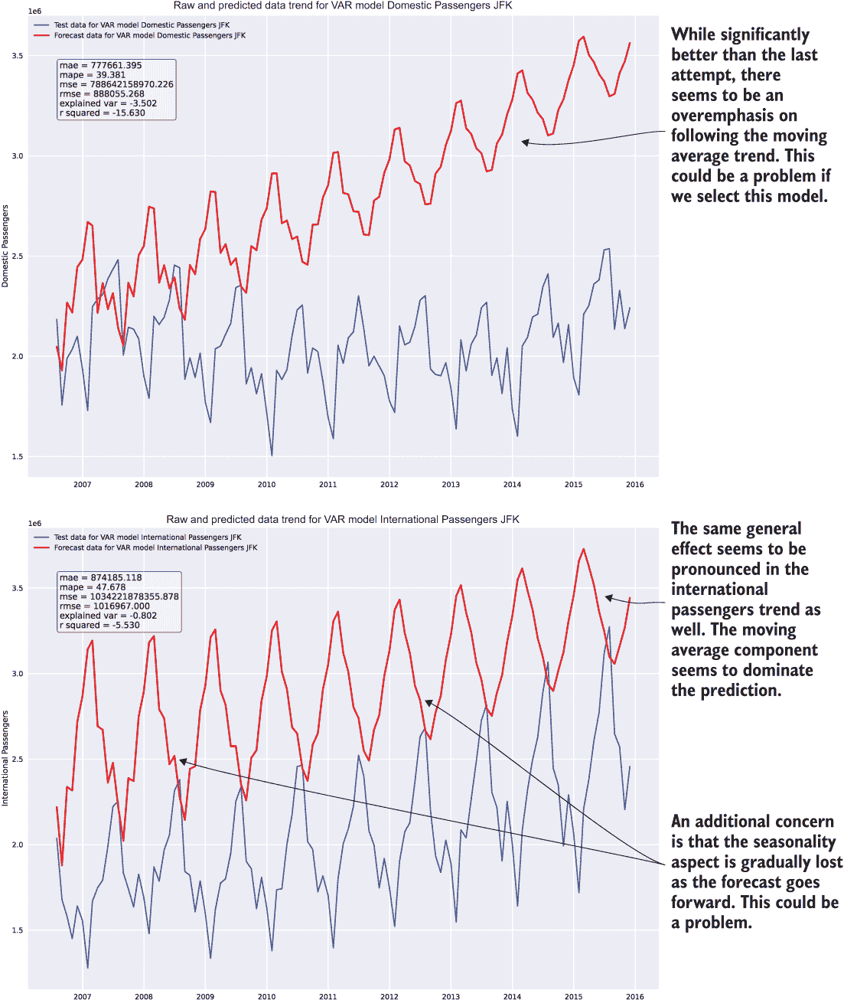

图 6.6 仅因为执行列表 6.10 的结果比之前好了一个数量级，并不意味着它是好的。

到目前为止，这个团队已经完成了其评估。团队成员对这个 API 了解了很多：

+   从这个 API 获取预测很复杂。

+   将多个时序数据通过此模型运行似乎对传入的向量有互补作用。这可能会对同一机场的分歧序列造成问题。

+   如果需要向量具有相似的形状，这将如何处理那些在成为国内枢纽后才开始提供国际航班的机场？

+   季节性成分的分辨率损失意味着，如果预测运行得太远，预测趋势中的细微细节将会丢失。

+   该算法似乎对`fit()`方法的`maxlags`参数很敏感。如果在生产中使用，这将需要广泛的测试和监控。

+   VAR 模型不是设计用来处理非平稳数据的。从早期的测试中，我们知道这些时序数据不是平稳的，这是基于 5.2.1 节中运行代码列表 6.10 时的 Dickey-Fuller 测试。

现在这个团队已经完成了测试，并且对这一模型家族的限制（即平稳性问题）有了坚实的理解，是时候看看其他几个团队的进展了（不用担心，我们不会逐一查看所有九个模型）。也许他们运气会更好。

重新考虑一下，我们再给它最后一次机会。团队有整天的时间来对这个模型得出结论，而且每个团队内部截止日期之前还有几个小时。

让我们快速解决这个平稳性问题，看看我们是否能将预测做得更好一点。要将时间序列转换为平稳序列，我们需要通过应用自然对数来归一化数据。然后，为了消除与序列相关的非平稳趋势，我们可以使用差分函数来获取序列在时间尺度上移动时的变化率。列表 6.11 是转换为差分尺度、运行模型拟合和将时间序列压缩到适当尺度的完整代码。

列表 6.11 使用 VAR 模型的平稳性调整预测

```
jfk_stat = get_airport_data('JFK', DATA_PATH)
jfk_stat = apply_index_freq(jfk, 'MS')
jfk_stat['Domestic Diff'] = np.log(jfk_stat['Domestic Passengers']).diff()    ❶
jfk_stat['International Diff'] = np.log(jfk_stat['International Passengers']).diff()                                                  ❷
jfk_stat = jfk_stat.dropna()
train, test = generate_splits(jfk_stat, '2006-07-08')
var_model = VAR(train[['Domestic Diff', 'International Diff']])              ❸
var_model.select_order(6)
var_fit = var_model.fit(12)
lag_order = var_fit.k_ar
var_pred = var_fit.forecast(test[['Domestic Diff', 'International Diff']].values[-lag_order:], test.index.size)
var_pred_dom = pd.Series(np.asarray(list(zip(*var_pred))[0], dtype=np.float32), index=test.index)
var_pred_intl = pd.Series(np.asarray(list(zip(*var_pred))[1], dtype=np.float32), index=test.index)
var_pred_dom_expanded = np.exp(var_pred_dom.cumsum()) * test['Domestic Passengers'][0]                                                       ❹
var_pred_intl_expanded = np.exp(var_pred_intl.cumsum()) * test['International Passengers'][0]
var_prediction_score = plot_predictions(test['Domestic Passengers'], 
                                        var_pred_dom_expanded, 
                                        "VAR model Domestic Passengers JFK Diff", 
                                        "Domestic Diff", 
                                        "var_jfk_dom_lag12_diff.svg")         ❺
var_prediction_score_intl = plot_predictions(test['International Passengers'], 
                                        var_pred_intl_expanded, 
                                        "VAR model International Passengers JFK
                                         Diff", 
                                        "International Diff", 
                                        "var_jfk_intl_lag12_diff.svg")
```

❶ 对序列的对数取差分函数以创建平稳时间序列（记住，这与我们对异常值分析所做的一样）

❷ 我们还必须对国际乘客的其他向量位置序列数据进行同样的操作。

❸ 在数据的平稳表示上训练模型

❹ 通过使用 diff()的逆函数（累积和）将平稳数据转换回数据的实际尺度。然后通过使用指数将数据的对数尺度转换回线性空间。这个序列被设置为差分，因此我们必须将值乘以起始位置值（这是测试数据集序列开始处的实际值）以获得正确的缩放。

❺ 比较测试序列与扩展预测序列

这么多的复制粘贴是怎么回事？

在本节的所有示例中，我们都看到相同的代码行在每次模型改进的迭代中反复粘贴。将这些代码全部包含在这些片段中，不仅仅是为了展示一个可以执行的完整代码块，而是模拟了许多实验笔记本（或者，如果编写 Python 脚本，这些脚本的副本）在测试过程中最终会呈现的样子，包括对个别想法的迭代，最终一个功能性的脚本将产生可测量的结果。

这是正常的。这是实验中预期会发生的事情。

一个普遍的好做法是确保你的实验和评估代码相对组织良好，易于阅读和跟踪，并且有足够的注释来解释任何特别复杂的内容。无论选择哪种解决方案，保持代码足够整洁将有助于开发下一阶段。边做边清理，删除死代码，并保持显著的结构。

你肯定不希望看到的是，笔记本中充满了无序的单元格、损坏的变量依赖链和大量注释掉的无效代码，处于一种纯粹的混乱状态。试图拼凑一个混乱的实验是一种令人沮丧和无用的练习，它将一个已经复杂的过程（制定生产级代码的封装设计和架构）的难度提升到许多情况下，从头开始重写一切比尝试挽救已经开发的内容更容易。

在项目这个阶段，拥有完全功能和单元格级别的封装并不一定是坏事。只要代码编写整洁且格式正确，这种封装可能比筛选数十个（或数百个！）单元格以找出如何让实验像快速原型阶段那样运行要容易得多。它还使得转换为基于类或基于函数编程的实现变得容易得多。

图 6.7 显示了该团队在迭代模型实现、完全阅读文档并研究模型如何工作（至少在“机器学习应用”层面）之后所达到的最终状态。这个可视化结果是通过运行列表 6.11 中的代码得到的。

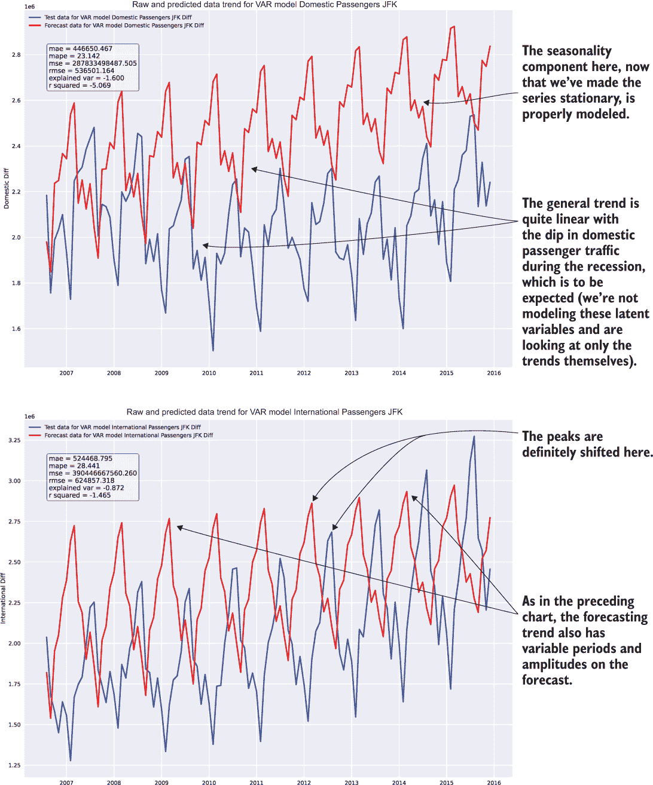

图 6.7 执行列表 6.11 的结果

实验阶段的第一个部分已经完成。团队拥有一个有潜力的模型，更重要的是，他们理解了模型的应用并能够正确调整它。已经记录了可视化结果以展示结果，并在笔记本中编写了干净的示例代码，以便以后参考使用。

在其他团队完成原型设计之前，从事这个特定模型实现的团队成员，可以将他们从工作中获得的智慧传授给其他团队。这种信息共享也将有助于加快所有实验的进度，以便对实际项目工作应采用哪种方法做出决定。

哇，那真是不愉快……

重要的是要注意，采用特定方法获得可接受结果有多么困难。无论是模型需要异常大量的特征工程才能产生除垃圾之外的东西，还是对超参数极端敏感，或者甚至使用一个令人困惑且设计不佳的 API，这个阶段所面临的困难需要由团队记录下来。

正如我们在第 6.2 节中将要回顾的，实施各种解决方案所面临的挑战将对开发具有生产能力的解决方案的复杂性产生重大影响。此外，这些挑战将直接影响团队在解决方案投入生产后维护该解决方案的能力。

在这个阶段思考以下主题并记录笔记是好的，这样在以后评估复杂性时可以参考：

+   对参数变化的敏感性。

+   超参数的数量。（这将影响模型的优化。）

+   API 的流畅性。（是否是标准的？能否放入管道中？）

+   为了得到可接受的结果，必须进行的特征工程工作的数量。

+   适应训练和测试数据量变化的能力。（当分割边界改变时，预测是否崩溃了？）

ARIMA 的快速测试

让我们暂时假设 ARIMA 团队成员在开始时除了系列数据的训练和测试分割方法以对预测进行评分之外，没有从 VAR 团队那里得到任何提示。他们正在开始模型研究和测试阶段，使用与其他团队用于数据预处理和日期索引格式化的相同功能工具，但除此之外，他们处于绿色地带。

团队意识到他们面临的一个主要障碍是 ARIMA 模型所需的设置，特别是模型实例化时需要分配的`p`（自回归参数）、`d`（差分）和`q`（移动平均）变量。阅读文档后，团队成员意识到大家已经贡献的前期实验工作已经提供了一种找到这些值起始点的方法。通过使用第五章列表 5.14 中构建的平稳性测试可视化函数，我们可以获得自回归（AR）参数的显著性值。

为了获得适当的自相关和偏自相关测量值，我们将在时间序列的对数上执行与 VAR 团队在其最终测试模型中执行相同的差分函数（VAR 团队成员特别友好，并分享了他们的发现），以便我们可以消除尽可能多的噪声。图 6.8 显示了结果趋势图。

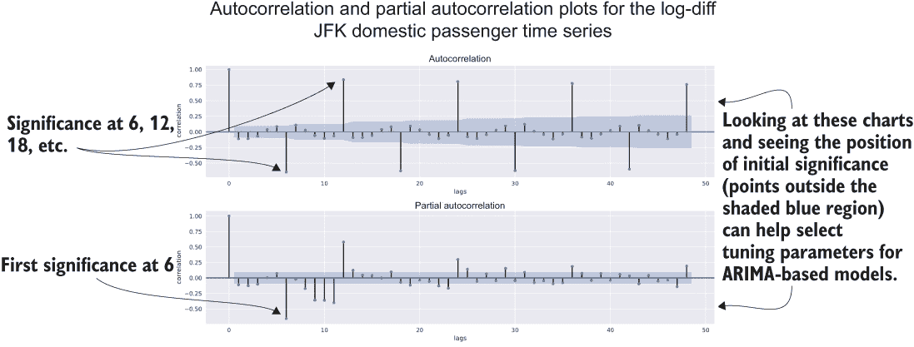

图 6.8 执行 JFK 国内乘客序列的滞后差分平稳性测试

与他们之前的 VAR 团队一样，ARIMA 团队成员尝试了几个不同的参数来获得不是悲惨的结果。我们不会涵盖所有这些迭代（毕竟这不是一本关于时间序列建模的书）。相反，让我们看看他们最终得出的结果。

列表 6.12 ARIMA 实验的最终状态

```
from statsmodels.tsa.arima.model import ARIMA
jfk_arima = get_airport_data('JFK', DATA_PATH)
jfk_arima = apply_index_freq(jfk_arima, 'MS')
train, test = generate_splits(jfk_arima, '2006-07-08')
arima_model = ARIMA(train['Domestic Passengers'], order=(48,1,1), enforce_stationarity=False, trend='c')                               ❶
arima_model_intl = ARIMA(train['International Passengers'], order=(48,1,1), enforce_stationarity=False, trend='c')
arima_fit = arima_model.fit()
arima_fit_intl = arima_model_intl.fit()
arima_predicted = arima_fit.predict(test.index[0], test.index[-1])
arima_predicted_intl = arima_fit_intl.predict(test.index[0], test.index[-1])
arima_score_dom = plot_predictions(test['Domestic Passengers'],
                                   arima_predicted,
                                   “ARIMA model Domestic Passengers JFK",
                                   "Domestic Passengers",
                                   "arima_jfk_dom_2.svg"
                                   )
arima_score_intl = plot_predictions(test['Domestic Passengers'],
                                    arima_predicted_intl,
                                    "ARIMA model International Passengers JFK",
                                    "International Passengers",
                                    "arima_jfk_intl_2.svg"
                                    )
```

❶ (p,d,q)的阶数参数。p（周期）值是从自相关和偏自相关分析中作为显著值的计算因子推导出来的。

特别值得注意的是，在序列上没有采取强制平稳性的对数和差分操作。虽然对这些平稳性调整进行了测试，但结果明显比在原始数据上进行的预测要差。（我们不会查看代码，因为它几乎与列表 6.11 中的方法相同。）

图 6.9 显示了他们一些测试的验证图和分数；对数差分的尝试位于左侧（显然较差），用于训练的未修改序列位于右侧。虽然右侧的图表组合在项目解决方案中并不理想，但它确实为更广泛的团队提供了一个关于 ARIMA 模型在预测目的上的细微差别和能力的主意。

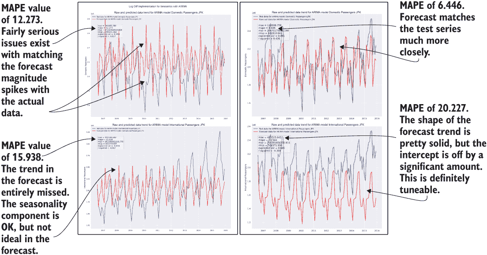

图 6.9 强制平稳性（左侧）和使用原始数据（右侧）进行 ARIMA 模型比较

他们测试的结果表明，在两种方法（原始数据和强制平稳性操作）中都有希望，说明存在更好的调整机会，以使该算法的实现更加完善。凭借这些知识和结果，这个团队可以准备好向更大的团队展示其发现，而无需在此阶段花费更多宝贵的时间来尝试改进结果。

快速测试 Holt-Winters 指数平滑算法

我们将对此部分进行更简短的介绍（抱歉，时间序列建模的粉丝）。对于这个模型评估，团队成员希望将他们的 Holt-Winters 指数平滑模型实现包装在一个函数中，这样他们就不必在整个笔记本单元中重复相同的代码。

为什么这种方法是编写甚至实验代码的首选方式，将在下一章中变得更加明显。现在，我们只需说，这个团队有几位资深的 DS 成员。下一个列表显示了他们最终得出的结果。

列表 6.13 Holt-Winters 指数平滑函数及其用法

```
from statsmodels.tsa.holtwinters import ExponentialSmoothing
def exp_smoothing(train, test, trend, seasonal, periods, dampening, smooth_slope, damping_slope):
    output = {}
    exp_smoothing_model = ExponentialSmoothing(train,
                                               trend=trend,
                                               seasonal=seasonal,
                                               seasonal_periods=periods,
                                               damped=dampening
                                              )
    exp_fit = exp_smoothing_model.fit(smoothing_level=0.9,
                                      smoothing_seasonal=0.2,
                                      smoothing_slope=smooth_slope,
                                      damping_slope=damping_slope,
                                      use_brute=True,
                                      use_boxcox=False,
                                      use_basinhopping=True,
                                      remove_bias=True
                                     )                                     ❶
    forecast = exp_fit.predict(train.index[-1], test.index[-1])            ❷
    output['model'] = exp_fit
    output['forecast'] = forecast[1:]                                      ❸
    return output
jfk = get_airport_data('JFK', DATA_PATH)
jfk = apply_index_freq(jfk, 'MS')
train, test = generate_splits(jfk, '2006-07-08')
prediction = exp_smoothing(train['Domestic Passengers'], test['Domestic Passengers'], 'add', 'add', 48, True, 0.9, 0.5)
prediction_intl = exp_smoothing(train['International Passengers'], test['International Passengers'], 'add', 'add', 60, True, 0.1, 1.0)     ❹
exp_smooth_pred = plot_predictions(test['Domestic Passengers'], 
                                   prediction['forecast'],
                                   "ExponentialSmoothing Domestic Passengers JFK",
                                   "Domestic Passengers",
                                   "exp_smooth_dom.svg"
                                  )
exp_smooth_pred_intl = plot_predictions(test['International Passengers'], 
                                   prediction_intl['forecast'],
                                   "ExponentialSmoothing International Passengers 
                                    JFK",
                                   "International Passengers",
                                   "exp_smooth_intl.svg"
                                  )
```

❶ 在开发过程中，如果选择此模型，所有这些设置（以及此拟合方法可用的其他设置）都将参数化，并使用类似 Hyperopt 的工具进行自动优化。

❷ 与其他测试的模型略有不同，此模型要求预测范围至少包含训练数据中的最后一个元素。

❸ 从训练数据序列的最后一个元素中移除所做的预测

❹ 由于该组时间序列的性质，自动回归元素（seasonal_periods）使用更长的周期。在开发过程中，如果选择此模型，这些值将通过网格搜索或更优雅的自动优化算法自动调整。

在开发过程中，这个子团队发现 Holt-Winters 指数平滑的 API 在版本 0.11 和 0.12 之间发生了相当大的变化（0.12.0 是 API 文档网站上的最新文档，因此默认显示）。因此，团队成员花费了大量时间试图弄清楚为什么他们尝试应用的设置总是因为重命名或修改的参数而抛出异常而失败。

最终，他们意识到他们需要检查安装的 statsmodels 版本以获取正确的文档。（有关 Python 版本管理的进一步阅读，请参阅以下侧边栏。）图 6.10 显示了该团队的工作结果，反映了迄今为止任何团队中最有希望的指标。

如何快速找出模块的版本而无需大费周章

我们在这些示例中使用的包管理器 Anaconda 提供了相当多的模块。除了基本的 Python 本身之外，还包括了数百个对机器学习工作非常有用的工具。每个模块都经过精心整理，以确保相应的依赖项都能协同工作。

由于这个原因，一些模块可能不像 API 文档中提到的“稳定版本”那样新（尤其是对于正在积极开发和频繁发布的项目）。因此，文档可能不会反映你正在交互的模块版本。

这不仅仅是一个 Python 问题。任何大型开源生态系统都会遇到这个问题。你会在 Java、Scala、R、TensorFlow、Keras 等语言中遇到这个问题。然而，在 Python 中，我们可以相对容易地从 Python REPL（或笔记本单元格）中获取版本信息。

为了我们的示例，让我们检查 statsmodels 的版本信息。要获取它，你只需找出方法名（通常是伪私有方法）并调用它。你可以通过导入基本包，执行`dir(<packagename>)`，并查看其命名来找到这些方法名可能被调用（通常是`__VERSION__`、`__version`、`_version`等变体的一个）。

对于 statsmodels，方法名是`_version`。要打印版本信息，我们只需在单元格中输入以下内容，它就会打印到标准输出：

```
import statsmodels
statsmodels._version.get_versions()
```

在撰写本文时，statsmodels 的最新稳定版本是 0.12.0，API 发生了我们一直在使用的重大变化。幸运的是，开源软件包的每个版本通常都会在其网页上保留其旧版本的文档。只是确保你在查看文档时选择了正确的版本，以确保你不会浪费时间实现与你要运行的包的安装版本不兼容的东西。

然而，我们在 Anaconda 构建中使用的版本是 0.11.1。我们需要确保我们正在查看该版本的 API 文档，以查看我们为建模导入的每个类别的选项。

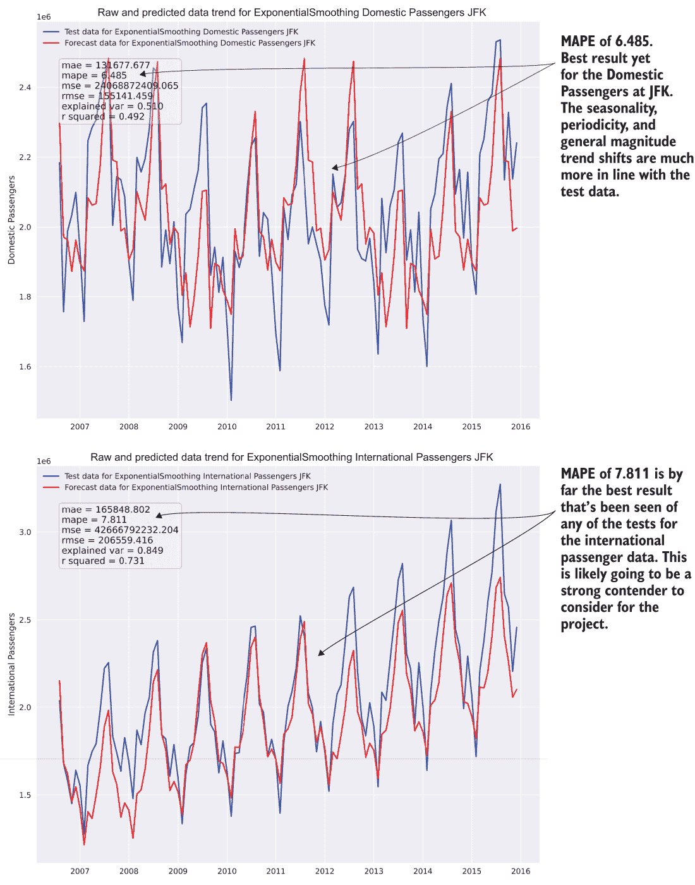

图 6.10 展示了列表 6.13 中的 Holt-Winters 指数平滑测试结果。我们有一个明确的竞争者！

在完成了一天的迷你黑客松后，团队将他们的结果整理成关于算法预测此数据能力的简单且易于消化的报告。然后，团队进行了一段时间的展示和说明。

应用第 6.1 节中定义的准备工作步骤，我们可以高效、可靠和客观地比较不同的方法。标准化意味着团队将有一个真正的基线比较来评判每个方法，而评估的时间限制性质确保没有任何团队在没有知道他们正在构建的方法是否确实是最好的方法之前，花费太多时间构建 MVP 解决方案（浪费时间和计算资源）。

我们已经减少了选择一个较差的实现来解决业务需求的机会，并且做得很快。即使请求解决问题的业务部门对这些内部流程一无所知，但由于这种方法论的方法，公司最终将拥有一个更好的产品，并且能够满足项目的截止日期。

## 6.2 精简可能性

团队作为一个整体如何决定前进的方向？回想一下，在第三章和第四章中，我们讨论了在实验评估完成后，是时候涉及业务利益相关者了。我们需要获取他们的意见，尽管这些意见可能是主观的，但为了确保他们会感到对这种方法感到舒适，并且被包括在方向选择中，以及他们的专业知识在深度主题领域知识中在决策中占有重要地位。

为了确保对项目测试的潜在实施方法进行彻底的审查，更广泛的团队需要查看每个已测试的方法，并基于以下标准做出判断：

+   最大化方法的可预测能力

+   在尽可能解决问题的同时，最大限度地减少解决方案的复杂性

+   评估和估算开发解决方案的难度，以便为交付日期进行现实范围的规划

+   估算（再）培训和推理的总拥有成本

+   评估解决方案的可扩展性

通过在评估阶段关注这些方面的每一个，团队可以显著降低项目风险，集体决定一个 MVP 方法，这将减少大多数机器学习项目失败、最终被废弃或取消的原因。图 6.11 显示了每个这些标准以及它们如何适应机器学习项目工作的整体原型阶段。

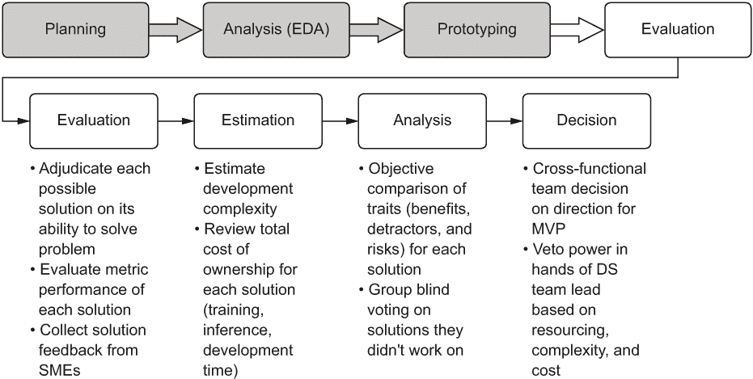

图 6.11 评估阶段元素，以指导构建 MVP 的路径

现在你已经对团队在评估方法时应关注的内容有了稳固的认识，让我们看看这个团队将如何做出决定，选择要实施的方法。

### 6.2.1 正确评估原型

在这一点上，大多数 ML 团队可能会让自己误入歧途，特别是在只展示特定解决方案带来的准确性的意义上。我们之前在 6.1.1 节（以及列表 6.7）中讨论了创建引人入胜的可视化的重要性，以易于消费的格式向 ML 团队和业务部门展示，但这只是决定采用一种 ML 方法而不是另一种方法的故事的一部分。算法的预测能力当然非常重要，但它只是众多重要考虑因素中的一个。例如，让我们继续讨论这三个实现（以及为了简洁我们没有展示的其他实现），并收集它们的数据，以便可以探索构建任何这些解决方案的完整图景。

团队会面，互相展示代码，回顾使用不同参数进行的各种测试运行，并汇总一个关于相对难度的共识比较。对于某些模型（例如 VAR 模型、弹性网络回归器、lasso 回归器和 RNN），ML 团队决定甚至不将这些结果包含在分析中，因为这些模型在预测中产生了压倒性的糟糕结果。向业务部门展示彻底的失败没有任何实际作用，只会让一个已经智力上负担沉重的讨论变得更长、更繁重。如果需要对达到候选方案所需的工作量进行完全披露，只需简单地说，“我们尝试了 15 种其他方法，但它们真的不适合这些数据”，然后继续前进。

在权衡每种方法的客观优点后，内部 DS 团队得出一个类似于图 6.12 的评估矩阵。虽然相对通用，但这个矩阵中的评估元素可以应用于大多数项目实施。在过去，我使用过更加详细和针对项目旨在解决的问题类型定制的选择标准，但一个通用的标准是一个好的起点。

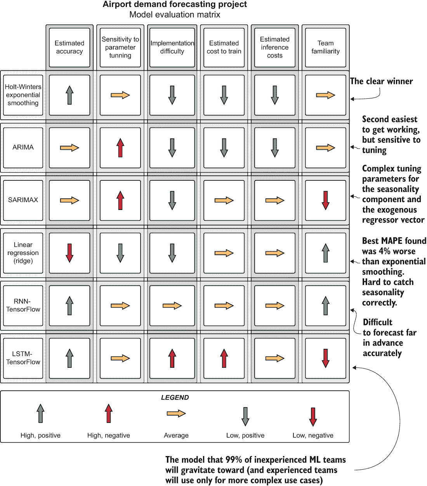

图 6.12 实验原型阶段的结果决策矩阵

正如你所见，全面评估一个方法除了其预测能力之外的元素至关重要。毕竟，所选的解决方案将需要开发、监控、修改和（希望）长期维护。未能考虑可维护性因素可能导致团队获得一个极其强大的解决方案，但几乎不可能保持其运行。

在原型制作完成后，深入思考构建这个解决方案将是什么样的，以及整个生命周期所有权将是什么样的，这是值得的。有人会想要改进它吗？他们能够做到吗？如果预测开始变得不准确，这将是一件相对简单的问题吗？我们能解释模型为什么会做出这样的决策吗？我们能承担运行它的成本吗？

如果你对这些建议的解决方案中的任何方面感到不确定，最好是团队内部讨论这些话题，直到达成共识，或者至少，不要将其作为潜在解决方案提交给业务。你绝对不希望项目结束时意识到你建造了一个令人厌恶的东西，你希望它能够无声无息地消失，永远不再回来，不再露出丑陋的脑袋，像一种令人不安的梦魇一样渗透你的清醒和失眠之夜。在这个时候要明智选择，因为一旦你做出承诺，转向另一种方法将会非常昂贵。

### 6.2.2 确定前进方向

现在已经收集了关于每种方法的相对优势和劣势的数据，并且已经决定了建模方法，真正的乐趣开始了。由于每个人都得出结论，Holt-Winters 指数平滑似乎是构建这些预测的最安全选项，我们可以开始讨论架构和代码。

在编写任何代码之前，团队需要进行另一次规划会议。这是提出*困难问题*的时候。关于这些问题的最重要的注意事项是，*它们应该在承诺开发方向之前得到回答*。

问题 1：这个需求需要运行多频繁？

“这个需求需要运行多频繁？”可能是最重要的问题，考虑到每个人都选定的模型类型。由于这是一个自回归模型，如果模型不是以高频率（可能每次推理运行）重新训练，预测将不会适应新的事实数据。模型只看单一变量的序列来做出预测，所以尽可能最新的训练可以确保预测能够准确适应变化趋势。

TIP 永远不要问业务或任何前端开发者，“那么，你们多久需要一次预测？”他们通常会给出一些荒谬的短时间。相反，问，“预测何时会变得无关紧要？”然后从那里开始工作。4 小时的服务水平协议（SLA）和 10 毫秒的 SLA 之间的差异是几十万美元的基础设施和大约六个月的工作。

业务将需要为这些预测的“freshness”提供最小和最大服务级别协议（SLA）。给出开发支持这些 SLA 要求的解决方案所需时间的粗略估计，以及该解决方案在生产中运行的成本。

问题 2：目前这些数据在哪里？

由于数据由外部数据源提供，我们需要认真考虑如何为训练数据和预测数据创建一个稳定可靠的 ETL 摄取。数据的 freshness 需要满足问题 1 答案的要求（请求的 SLA）。

我们需要将 DE 团队成员纳入其中，以确保他们在我们考虑将此项目投入生产之前，就已经优先考虑获取此数据源。如果他们无法承诺一个可接受的时间，我们就必须自己编写这个 ETL，并手动将数据填充到源表中，这将增加我们的项目范围、成本和风险。

问题 3：预测将被存储在哪里？

用户是否会向预测发出类似商业智能（BI）风格的查询，以临时方式推动分析可视化？然后我们可以将数据写入我们内部拥有的关系数据库管理系统（RDBMS）源。

这将被数百（或数千）个用户频繁查询吗？数据是否将作为服务提供给 Web 前端？如果是这样，我们必须考虑将预测存储为排序数组在 NoSQL 引擎中或可能是一个内存存储，如 Redis。如果我们打算为前端服务提供服务，我们还需要在数据前面构建一个 REST API，这将增加这个项目几个冲刺的工作范围。

问题 4：我们如何设置我们的代码库？

这将是一个新的项目代码库，还是我们将让这段代码与其他机器学习项目共同存在于一个公共仓库中？我们是否追求使用模块化设计的完全面向对象（OO）方法，还是我们将尝试进行函数式编程（FP）？

我们对于未来的改进部署策略是什么？我们将使用持续集成/持续部署（CI/CD）系统、GitFlow 发布，还是标准的 Git？每个运行的指标将存储在哪里？我们将把参数、自动调整的超参数和可视化日志记录在哪里以供参考？

在这个阶段，立即对有关开发的所有这些问题都有答案并不是绝对必要的，但团队领导和架构师应该仔细考虑项目开发的各个方面，并且应该尽快做出关于这些元素的深思熟虑的决策（我们将在下一章详细讨论）。 

问题 5：这个模型将在哪里进行训练？

我们**绝对**不应该在我们的笔记本电脑上运行这个。真的。别这么做。

由于本项目涉及到的模型数量，我们将在下一章中探讨这方面的选项，并讨论每个选项的优缺点。

问题 6：推理将在哪里运行？

我们**绝对**不应该在我们的笔记本电脑上运行这个。云服务提供商的基础设施、本地数据中心，或者在云或本地运行的临时无服务器容器，这里真的是唯一的选择。

问题 7：我们如何将预测结果传递给最终用户？

如问题 3 的答案所述，将预测结果传递给最终用户是任何力求真正有用的机器学习项目中最被忽视但最关键的部分。您是否需要在网页上提供预测结果？现在是与一些前端和/或全栈开发者进行交谈的好时机。

是否需要将其作为 BI 报告的一部分？现在应该咨询 DE 和 BI 工程团队。

是否需要存储以供分析师进行即兴的 SQL 查询？如果是这样，您已经有了这个。这很简单。

问题 8：我们现有的代码中有多少可以用于此项目？

如果您已经开发了可以简化您生活的实用程序包，请检查它们。它们是否有现有的技术债务，您可以在进行此项目时修复并改进？如果是的话，那么现在是修复它的时候了。如果您有现有的代码并且认为它没有技术债务，您应该对自己更诚实一些。

如果您还没有建立现有的实用框架，或者您是第一次开始使用机器学习工程实践，请不要担心！我们将在接下来的许多章节中介绍这种工具的外观。

问题 9：我们的开发节奏是什么，我们将如何处理功能？

您是否在与项目经理打交道？现在花点时间解释一下在开发过程中您将要丢弃多少代码。让项目经理知道整个故事和史诗级的内容将成为死代码，永远从地球上消失，不再被看到。向他们解释机器学习项目工作的混乱，以便他们能够度过那些最初的四个悲伤阶段，并在项目开始之前学会接受它。您不需要给他们一个拥抱或任何东西，但请温柔地告诉他们这个消息，因为它将粉碎他们对现实本质的理解。

机器学习特征工作是一种独特的生物。确实，将开发大量代码，但一旦发现某种方法不可行，这些代码将被完全重构（或丢弃！）这是与“纯”软件开发截然不同，在“纯”软件开发中，特定的功能是理性定义的，并且可以相当准确地界定范围。除非你的项目的一部分是设计和发展一个全新的算法（据我所知，这不应该发生，无论你的团队成员多么试图说服你需要这样做），否则无法保证代码库中会实现特定的功能。

因此，纯敏捷方法通常不是开发机器学习代码的有效方式，仅仅是因为可能需要做出的变化（例如，更换模型可能会引起大量、全面的重构，这可能会消耗两个整个冲刺）。为了帮助处理应用于机器学习开发的敏捷的不同性质，相应地组织你的故事、你的 scrum 和你的提交是至关重要的。

### 6.2.3 那么，接下来是什么？

下一步实际上是构建最小可行产品（MVP）。这是在开发一个可演示的解决方案，该解决方案对模型进行了精确调整，记录了测试结果，并向业务展示问题可以解决。下一步是让*工程*在*机器学习工程*中发挥作用。

我们将在下一章深入探讨这些主题，继续以这个花生库存优化问题为例，观察它从硬编码的原型及其边缘调整到充满函数、自动调整模型的支持以及每个模型调整评估的完整日志记录到 MLflow 的代码库的初期。我们还将从单线程顺序 Python 的世界过渡到 Apache Spark 分布式系统中的并发建模能力的世界。

## 摘要

+   采用时间限制和整体方法测试潜在解决问题的 API，将有助于确保项目快速达到实施方向，彻底评估，并在尽可能短的时间内满足问题的需求。预测能力并不是唯一重要的标准。

+   审查解决一个问题的候选方法的所有方面，鼓励评估不仅仅是预测能力。从可维护性、实现复杂性到成本，在选择解决方案以解决问题时，应考虑许多因素。
