# 7 实验行动：从原型到 MVP

本章涵盖

+   超参数调整技术以及自动化方法的益处

+   提高超参数优化性能的执行选项

在上一章中，我们探讨了针对机场乘客预测的业务问题的潜在解决方案的测试和评估场景。我们最终做出了关于要使用的模型（霍尔特-温特斯指数平滑）的决定，但在快速原型阶段，我们只进行了少量的模型调整。

从实验原型转向 MVP 开发具有挑战性。这需要一种与迄今为止所做工作完全相反的全面认知转变。我们不再思考如何*解决问题*并获得良好的结果。相反，我们思考的是如何*构建一个解决方案*，这个解决方案足够好，能够以足够稳健的方式解决问题，使其不会不断崩溃。我们需要将重点转移到监控、自动化调整、可扩展性和成本上。我们正从以科学为重点的工作转向工程领域。

从原型转向最小可行产品（MVP）的首要任务是确保解决方案调整正确。请参阅以下侧边栏，以获取更多关于为何调整模型如此关键以及这些看似可选的建模 API 设置实际上为何重要的详细信息。

超参数很重要——非常重要

在机器学习代码库中最令人沮丧的事情之一是看到一个*未调整的模型*（一个将由 API 提供的占位符默认值生成的模型）。在构建其余解决方案所涉及的先进特征工程、ETL、可视化和编码努力中，看到一个仅使用默认值的裸模型就像买了一辆高性能跑车，却给它加满了普通汽油。

它会运行吗？当然会。它会表现良好吗？不会。不仅它的表现会不佳，而且一旦将其带入“现实世界”（指模型，使用之前未见过的数据来做出预测），它崩溃的可能性很高。

一些算法会自动处理其方法以到达优化的解决方案，因此不需要覆盖任何超参数。然而，绝大多数算法从单个到数十个参数不等，这些参数不仅影响算法优化器的核心功能（例如，广义线性回归中的`family`参数将比任何其他超参数更直接地影响该模型的预测性能），还影响优化器执行搜索以找到最小目标函数的方式。其中一些超参数仅适用于算法的特定应用——只有当特征向量中的方差极端或与目标变量相关联特定分布时，这些超参数才是适用的。但对于大多数超参数而言，它们的设置值对算法如何“学习”数据的最优拟合方式的影响至关重要。

下面的图表是线性回归模型中两个关键超参数的简化示例。由于每个特征向量集合和问题通常会有与其他人截然不同的最佳超参数设置，因此无法猜测这些值应该设置在哪里。

注意，这些示例仅用于演示目的。对于不同超参数设置的模型效果不仅高度依赖于所使用的算法类型，还取决于特征向量中包含的数据的性质以及目标变量的属性。这就是为什么每个模型都需要进行调优。

如您所见，与每个机器学习算法相关的看似可选设置实际上在训练过程的执行方式中起着非常重要的作用。如果不更改这些值并优化它们，几乎没有成功基于机器学习的解决方案解决问题的可能性。


超参数对过拟合和欠拟合的影响

## 7.1 调优：自动化繁琐的工作

在过去的两章中，我们一直专注于一个花生预测问题。在第六章结束时，我们有一个勉强可行的原型，在一个机场进行了验证。调整和调优模型预测性能的过程是手动进行的，并不特别科学，留下了模型预测能力可能实现的范围和手动调优之间的较大差距。

在这种情况下，从良好预测到非常良好预测之间的差异可能是一个很大的产品差额，这是我们希望在机场进行展示的。毕竟，我们的预测失误可能导致数百万美元的损失。仅仅通过尝试大量超参数来手动调优，既无法提高预测准确性，也无法保证交付的及时性。

如果我们想要提出比部落知识猜测更好的方法来调整模型，我们需要考虑我们的选项。图 7.1 显示了 DS 团队用于调整模型的各种方法，从简单（较弱且不易维护）到复杂（自定义框架）的顺序。

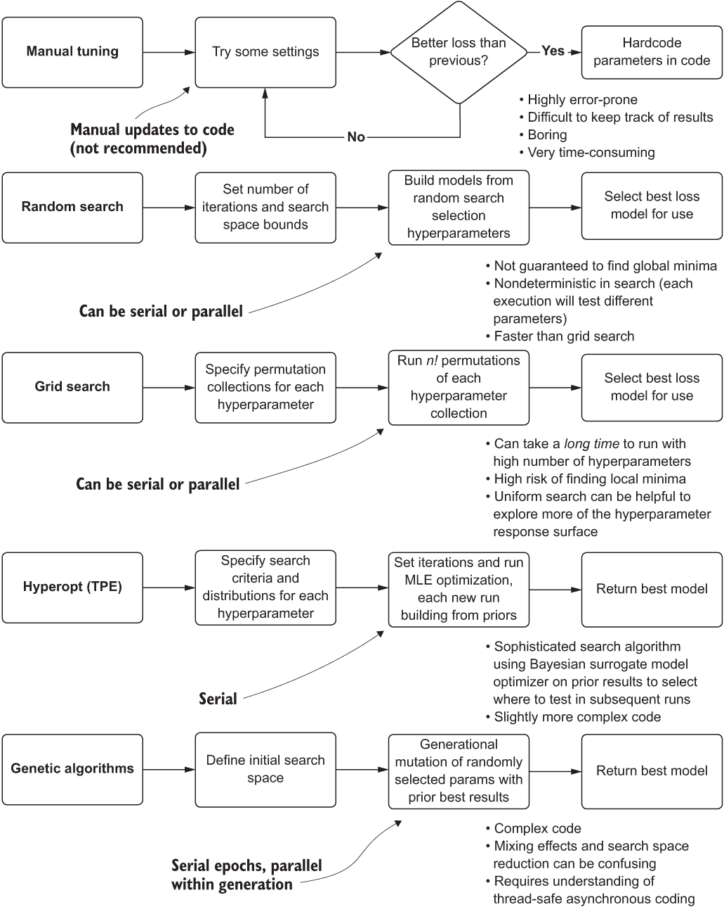

图 7.1 超参数调整方法的比较

顶部部分，手动调整，通常是构建原型的典型方式。在快速测试时，手动测试超参数的值是一种可以理解的方法。如第六章所述，原型的目标是获得解决方案可调整性的近似值。然而，在向生产级解决方案迈进的过程中，需要考虑更多可维护且强大的解决方案。

### 7.1.1 调整选项

我们知道我们需要调整模型。在第六章中，我们清楚地看到了如果我们不这样做会发生什么：生成的预测结果如此糟糕，以至于从帽子里抽数字会更准确。然而，可以追求多种选项以达到最优的超参数集。

手动调整（有根据的猜测）

我们将在稍后看到，当将 Hyperopt 应用于我们的预测问题时，到达每个需要为这个项目构建的模型的最佳超参数将有多么困难。不仅优化值难以猜测，而且每个预测模型的最佳超参数集与其他模型不同。

使用手动测试方法接近最优参数几乎是不可能的。这个过程效率低下，令人沮丧，尝试这个过程是极大的时间浪费，如图 7.2 所示。

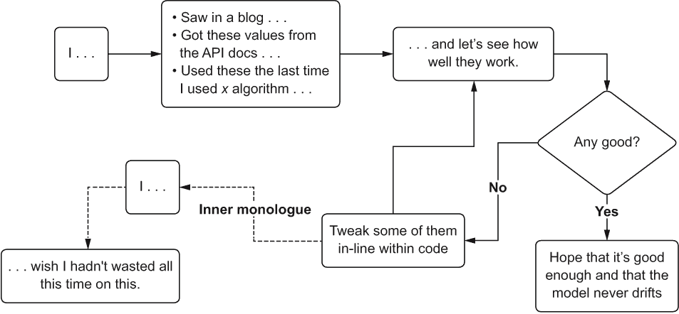

图 7.2 手动超参数调整的剧痛

小贴士：除非你正在使用具有非常少数量的超参数（一个或两个，最好是布尔型或分类型）的算法，否则不要尝试手动调整。

这种方法的主要问题是跟踪已经测试的内容。即使有系统来记录并确保之前没有尝试过相同的值，维护这个目录所需的工作量巨大，容易出错，且在极端情况下毫无意义。

在快速原型阶段之后，项目工作应尽快放弃这种调整方法。相信我，你有很多更好的事情可以做。

网格搜索

机器学习技术的一个基石，基于网格的超参数暴力搜索方法已经存在很长时间了。为了执行网格搜索，数据科学家将选择一组要测试的值集合，对于每个超参数。然后，网格搜索 API 将通过创建每个指定组的每个值的排列来组装要测试的超参数集合。图 7.3 说明了这是如何工作的，以及为什么它可能不是你愿意用于具有许多超参数的模型的某种方法。

正如你所见，随着超参数数量的增加，需要测试的排列数量会迅速变得难以承受。显然，这种权衡是在运行所有排列所需的时间和搜索优化能力之间。如果你想探索更多超参数响应面，你将不得不运行更多的迭代。这里实际上没有免费的午餐。

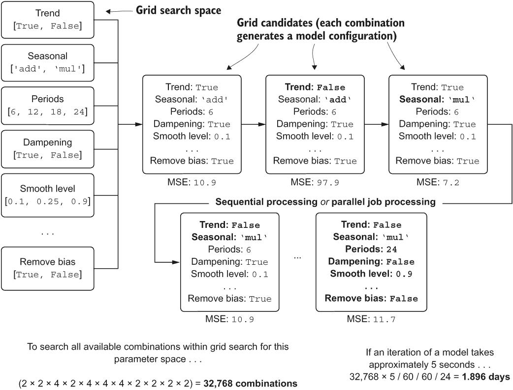

图 7.3 基于暴力搜索的网格搜索方法进行调优

随机搜索

虽然网格搜索存在许多限制，阻碍了其找到一组优化超参数的能力，但从时间和金钱的角度来看，使用它可能会变得过于昂贵。如果我们对彻底测试预测模型中所有连续分布的超参数感兴趣，那么在单核 CPU 上运行时得到答案所需的时间将是以周计，而不是以分钟计。

网格搜索的一个替代方案，尝试同时测试不同超参数的影响（而不是依赖于显式的排列来确定最佳值），是使用每个超参数组的随机抽样。图 7.4 说明了随机搜索；将其与图 7.3 进行比较，以查看方法之间的差异。

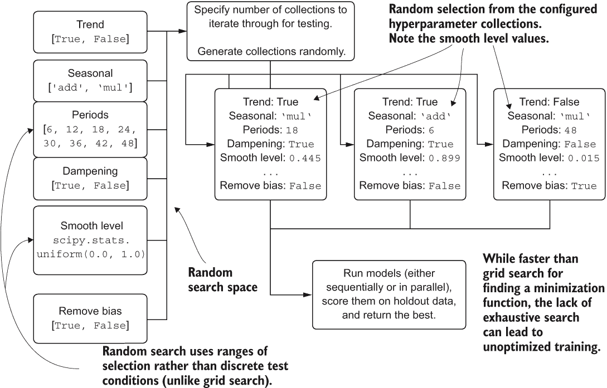

图 7.4 超参数优化的随机搜索过程

正如你所见，要测试的候选者的选择是随机的，并且不是通过所有可能值的排列机制来控制的，而是通过测试的最大迭代次数来控制。这是一把双刃剑：虽然执行时间大大减少，但超参数空间的搜索是有限的。

关于参数搜索的学术性争论

关于为什么随机搜索优于基于网格的搜索，可以提出许多论点，其中许多论点相当有说服力。然而，在在线参考资料、示例和博客文章中展示的大多数例子仍然使用网格搜索作为模型调优的手段。

有一个明显的理由：它速度快。没有任何包开发者或博客作者愿意创建一个对读者来说非常复杂或耗时的示例。尽管如此，这并不意味着这是一种好的做法。

在示例中看到如此多的网格搜索应用，给许多从业者造成了错误的印象，认为它在找到良好参数方面远比其他方法更有效。我们也许也有普遍的熵厌恶，作为人类（我们厌恶随机性，所以随机搜索一定是坏的，对吧？）。我并不完全确定。

然而，我无法强调网格搜索的限制性（如果你想要彻底的话，它也很昂贵）。我并不孤单；参见詹姆斯·伯格斯特拉和约书亚·本吉奥的“随机搜索超参数优化”（2012）[www.jmlr.org/papers/volume13/bergstra12a/bergstra12a.pdf](http://www.jmlr.org/papers/volume13/bergstra12a/bergstra12a.pdf)。我通常同意他们的结论，即网格搜索作为一种方法本质上是有缺陷的；因为某些超参数对特定训练模型的总体质量影响更大，那些影响更大的超参数与那些影响微不足道的超参数获得相同的覆盖量，这限制了有效的搜索，因为计算时间和更广泛测试的成本。在我看来，随机搜索比网格搜索是一个更好的方法，但它仍然不是最有效或最有效的方法。

伯格斯特拉和本吉奥达成共识：“我们对超参数响应表面的分析表明，随机实验更有效率，因为并非所有超参数对调整同等重要。网格搜索实验在探索不重要的维度上分配了过多的试验，并且在重要的维度上覆盖不足。”在下一节中，我们将讨论他们如何通过创建一个真正出色的新算法来解决这个问题。

基于模型的优化：树结构帕累托估计器（Hyperopt）

在我们的时间序列预测模型中，我们面临着复杂的超参数搜索——总共有 11 个超参数，其中 3 个是连续分布的，1 个是序数——这混淆了有效搜索空间的能力。前面提到的方法要么太耗时（手动、网格搜索），要么成本高昂（网格搜索），或者难以获得足够的拟合特征以验证保留数据（所有这些方法）。

同一个团队提出了随机搜索是比网格搜索更优越的方法论的论文，他们也提出了一种选择优化超参数响应表面的过程：使用基于模型的优化，依赖于高斯过程或帕累托树估计器（TPEs）的贝叶斯技术。他们的研究成果包含在开源软件包 Hyperopt 中。图 7.5 展示了 Hyperopt 工作的基本原理。

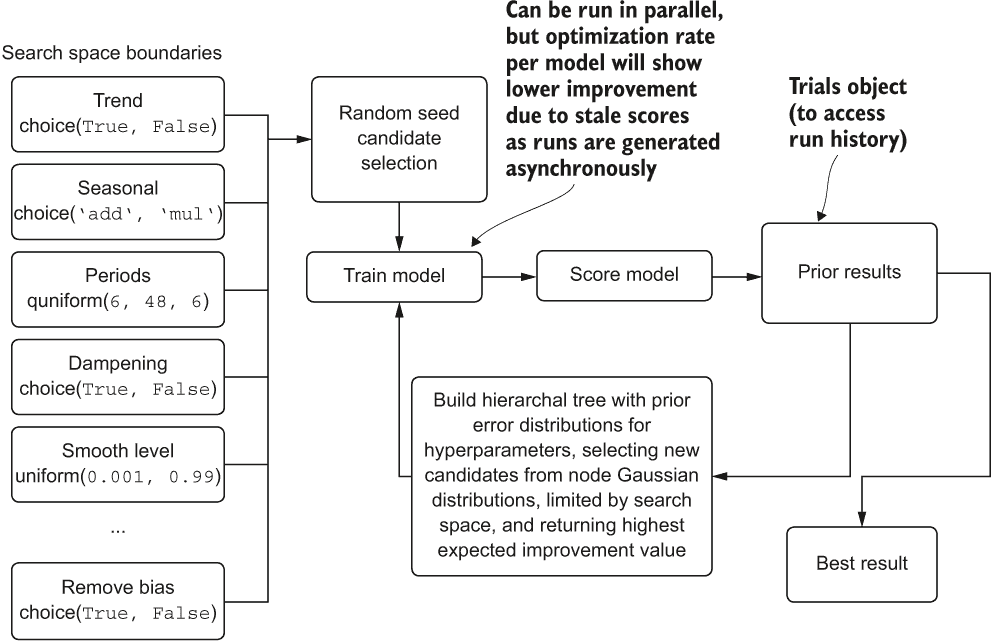

图 7.5 Hyperopt 的树结构帕累托估计器算法的高层次图示

这个系统几乎可以保证在通过任何前面提到的经典调优方法进行工作的经验丰富的 DS（数据科学家）中表现优异。它不仅能够非常出色地探索复杂的超参数空间，而且比其他方法需要的迭代次数要少得多。关于这个主题的进一步阅读，我推荐阅读 James Bergstra 等人于 2011 年撰写的原始白皮书，“超参数优化算法”（[`mng.bz/W76w`](https://shortener.manning.com/W76w)），以及阅读该包的 API 文档以获取其有效性的更多证据（[`hyperopt.github.io/hyperopt/`](http://hyperopt.github.io/hyperopt/))。

更高级（且复杂）的技术

任何比 Hyperopt 的 TPE 和类似的自动化调优包更高级的技术通常意味着做两件事之一：支付提供自动化-ML（autoML）解决方案的公司，或者自己构建。在构建自定义调谐解决方案的领域，你可能会考虑将遗传算法与贝叶斯先验搜索优化相结合，以在*n*-维超参数空间中创建具有最高成功概率的搜索候选者，利用遗传算法所知的选择性优化。

从一个构建了这些 autoML 解决方案（[`github.com/databrickslabs/automl-toolkit`](https://github.com/databrickslabs/automl-toolkit)）的人的角度来看，除非你正在为数百（或更多）个不同的项目构建自定义框架，并且有明确的需求来开发一个高性能且成本较低的优化工具，专门用于解决公司面临的问题，否则我不建议走这条路。

然而，AutoML 绝对不是大多数经验丰富的 DS 团队的可接受选项。这些解决方案的本质，除了配置驱动的界面外，在很大程度上是自主的，这迫使你放弃对软件中包含的决策逻辑的控制和可见性。你失去了发现为什么某些特征被删除而其他特征被创建的原因，为什么选择了特定的模型，以及为了实现声称的最佳结果，可能对特征向量进行了哪些内部验证的能力。

除了这些解决方案是黑盒之外，重要的是要认识到这些应用的目标受众。这些功能齐全的管道生成工具包最初并不是为经验丰富的 ML（机器学习）开发者设计的或打算使用的。它们是为不幸被称为*公民数据科学家*的人构建的——这些人是业务领域的专家，他们深知自己的业务需求，但没有经验或知识自己手工制作 ML 解决方案。

建立一个框架来自动化公司面临的一些更（可以说是）无聊和基础建模需求可能看起来很令人兴奋。这确实可以。然而，这些框架并不简单构建。如果你正在走定制化构建的道路，比如一个 autoML 框架，确保你有足够的带宽去做这件事，确保业务理解并批准这个庞大的项目，以及你能够证明在大量时间和资源投入上的回报。在项目进行到中途时，不是添加几个月酷炫工作的好时机。

### 7.1.2 Hyperopt 入门

回到我们的预测项目工作中，我们可以自信地断言，为每个机场调整模型的最佳方法将是通过使用 Hyperopt 和其 TPE 方法。

注意：Hyperopt 是一个 Anaconda 构建之外的外部包。要使用它，你必须在你的环境中执行 pip 或 conda 安装包。

在我们深入研究将要使用的代码之前，让我们从简化的实现角度来看看这个 API 是如何工作的。首先，Hyperopt 的第一个方面在于目标函数的定义（列表 7.1 展示了寻找最小化的函数的简化实现）。这个目标函数通常是拟合在训练数据上的模型，在测试数据上验证，评分，并返回与验证数据相比预测数据的误差度量。

列表 7.1 Hyperopt 基础：目标函数

```
import numpy as np
def objective_function(x):                   ❶
  func = np.poly1d([1, -3, -88, 112, -5])    ❷
  return func(x) * 0.01                      ❸
```

❶ 定义要最小化的目标函数

❷ 我们想要求解的一维四次多项式方程

❸ 最小化优化的损失估计

为什么选择 Hyperopt？

我使用 Hyperopt 进行这次讨论仅仅是因为它被广泛使用。其他工具执行类似甚至更高级的版本，这些版本是设计这个包要做的（优化超参数）。Optuna ([`optuna.org`](https://optuna.org/)) 是对构建 Hyperopt 的原始研究工作的一个相当显著的延续。我强烈建议您去了解一下。

这本书的重点不在于技术。它关注的是围绕技术使用的过程。在不久的将来，会出现更好的技术。会有一种更优的方法来寻找优化参数。该领域的发展是持续、不可避免且快速的。我对讨论一种技术比另一种技术更好不感兴趣。很多其他书籍都在做这件事。我感兴趣的是讨论为什么使用某种东西来解决这个问题很重要。请随意选择对你来说感觉正确的“某种东西”。

在我们声明了目标函数之后，使用 Hyperopt 的下一个阶段是定义一个搜索空间。对于这个例子，我们只对优化单个值感兴趣，以便解决 7.1 列表中多项式函数的最小化问题。在下一个列表中，我们定义了这个函数一个 `x` 变量的搜索空间，实例化 `Trials` 对象（用于记录优化历史），并使用 Hyperopt API 中的最小化函数运行优化。

列表 7.2 Hyperopt 对简单多项式的优化

```
optimization_space = hp.uniform('x', -12, 12)     ❶
trials = Trials()                                 ❷
trial_estimator = fmin(fn=objective_function,     ❸
                       space=optimization_space,  ❹
                       algo=tpe.suggest,          ❺
                       trials=trials,             ❻
                       max_evals=1000             ❼
)
```

❶ 定义搜索空间——在这种情况下，种子在 -12 和 12 之间的均匀采样，以及在初始种子先验返回后的 TPE 算法的有界高斯随机选择

❷ 实例化 Trials 对象以记录优化历史

❸ 如 7.1 列表中定义的目标函数，传递给 Hyperopt 的 fmin 优化函数

❹ 搜索空间，如上所述（-12 到 12，均匀分布）

❺ 要使用的优化算法——在这种情况下，树结构 Parzen 估计器

❻ 将 Trials 对象传递给优化函数以记录运行历史

❷ 进行优化运行的次数。由于 hpopt 是受迭代次数限制的，我们可以通过这种方式控制优化的运行时间。

一旦执行此代码，我们将收到一个进度条（在基于 Jupyter 的笔记本中），它将在优化过程中返回运行历史中发现的最佳损失。在运行结束时，我们将从 `trial_estimator` 获取 `x` 的最佳设置，以最小化函数 `objective_function` 中定义的多项式返回的值。以下列表显示了此简单示例的工作过程。

列表 7.3 Hyperopt 在最小化简单多项式函数中的性能

```
rng = np.arange(-11.0, 12.0, 0.01)                                    ❶
values = [objective_function(x) for x in rng]                         ❷
with plt.style.context(style='seaborn'):
  fig, ax = plt.subplots(1, 1, figsize=(5.5, 4))
  ax.plot(rng, values)                                                ❸
  ax.set_title('Objective function')
  ax.scatter(x=trial_estimator[‘x’], y=trials.average_best_error(), marker='o', s=100)                                               ❹
  bbox_text = 'Hyperopt calculated minimum value\nx: {}'.format(trial_estimator['x'])
  arrow = dict(facecolor='darkblue', shrink=0.01, connectionstyle='angle3,angleA=90,angleB=45')
  bbox_conf = dict(boxstyle='round,pad=0.5', fc='ivory', ec='grey', lw=0.8)
  conf = dict(xycoords='data', textcoords='axes fraction', arrowprops=arrow, bbox=bbox_conf, ha='left', va='center', fontsize=12)
  ax.annotate(bbox_text, xy=(trial_estimator['x'], trials.average_best_error()), xytest=(0.3, 0.8), **conf)         ❺
  fig.tight_layout()
  plt.savefig('objective_func.svg', format='svg')
```

❶ 生成一系列 x 值，用于绘制 7.1 列表中定义的函数

❷ 从 rng 集合中检索每个 x 值对应的 y 值

❸ 在 rng 的 x 空间上绘制函数

❹ 绘制 Hyperopt 根据我们的搜索空间找到的优化最小值

❺ 在图表上添加注释以指示最小化值

运行此脚本会导致图 7.6 中的图表。

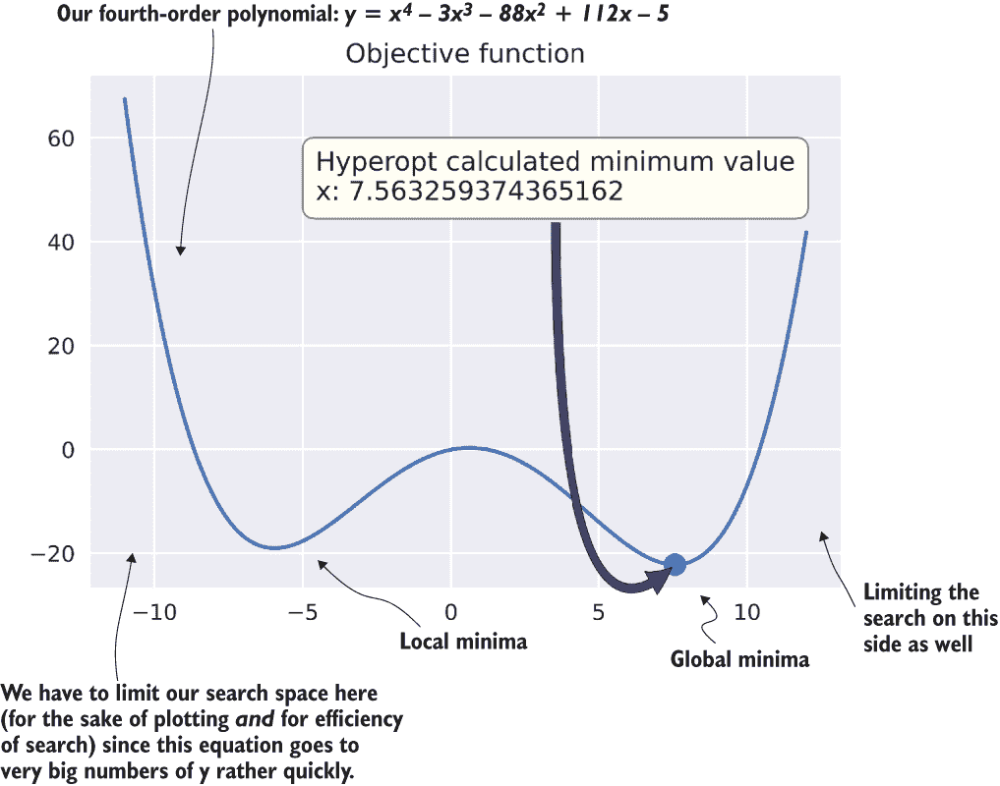

图 7.6 使用 Hyperopt 求解简单多项式的最小值

线性模型在参数和它们的损失度量之间经常有“凹陷”和“山谷”。我们使用术语 *局部最小值* 和 *局部最大值* 来描述它们。如果参数搜索空间没有得到充分探索，模型的调整可能位于局部而不是全局的最小值或最大值。

### 7.1.3 使用 Hyperopt 调整复杂预测问题

现在你已经理解了这种自动化模型调整包背后的概念，我们可以将其应用于我们复杂的预测建模问题。正如我们在本章前面讨论的，如果没有一些帮助，调整这个模型将会很复杂。不仅我们有 11 个超参数要探索，而且我们在第六章中手动调整所取得的成果并不特别令人印象深刻。

我们需要一些帮助。让我们让托马斯·贝叶斯伸出援手（或者更确切地说，皮埃尔-西蒙·拉普拉斯）。列表 7.4 显示了我们的 Holt-Winters 指数平滑（HWES）模型针对机场乘客的优化函数。

列表 7.4：Holt-Winters 指数平滑的最小化函数

```
def hwes_minimization_function(selected_hp_values, train, test, loss_metric):❶
    model = ExponentialSmoothing(train,                                      ❷
                   trend=selected_hp_values['model']['trend'],
                   seasonal=selected_hp_values['model']['seasonal'],
                   seasonal_periods=selected_hp_values['model'][                'seasonal_periods'],
                   damped=selected_hp_values['model']['damped']
                   )
    model_fit = \                                                            ❸
    model.fit(smoothing_level=selected_hp_values['fit']['smoothing_level'],
                smoothing_seasonal=selected_hp_values['fit'][             'smoothing_seasonal'],
                damping_slope=selected_hp_values['fit']['damping_slope'],
                use_brute=selected_hp_values['fit']['use_brute'],
                use_boxcox=selected_hp_values['fit']['use_boxcox'],
                use_basinhopping=selected_hp_values['fit'][             'use_basinhopping'],
                remove_bias=selected_hp_values['fit']['remove_bias']
                )
    forecast = model_fit.predict(train.index[-1], test.index[-1])            ❹
    param_count = extract_param_count_hwes(selected_hp_values)               ❺
    adjusted_forecast = forecast[1:]                                         ❻
    errors = calculate_errors(test, adjusted_forecast, param_count)          ❼
    return {'loss': errors[loss_metric], 'status': STATUS_OK}                ❽
```

❶ selected_hp_values 是一个多级字典。由于我们有两组独立的超参数部分要应用，并且一些参数名称相似，我们通过“model”和“fit”来区分它们，以减少混淆。

❷ 将 ExponentialSmoothing 类实例化为一个对象，配置了 Hyperopt 将为每个模型迭代测试选择的价值

❸ fit 方法有其自己的超参数集，Hyperopt 将为它将生成和测试的模型池选择这些超参数。

❹ 为这次模型运行生成预测，以执行验证和评分。我们是从训练集的末尾到测试集索引的最后一个值进行预测。

❺ 一个获取参数数量（可在书籍的 GitHub 仓库中查看）的实用函数

❻ 移除预测的第一个条目，因为它与训练集最后一个索引条目重叠

❼ 计算所有错误指标——赤池信息准则（AIC）和贝叶斯信息准则（BIC），新添加的指标需要超参数计数

❽ Hyperopt 的最小化函数的唯一返回值是一个字典，包含用于优化的测试指标和来自 Hyperopt API 的状态报告消息。Trials()对象将持久化所有关于运行和最佳调整模型的数据。

如你所回忆的，在第六章中创建这个算法的原型时，我们硬编码了几个这些值（`smoothing_level`，`smoothing_seasonal`，`use_brute`，`use_boxcox`，`use_basin_hopping`和`remove_bias`），以使原型调整变得更容易。在列表 7.4 中，我们将所有这些值设置为 Hyperopt 的可调整超参数。即使搜索空间如此之大，该算法也会允许我们探索它们对保留空间预测能力的影响。如果我们使用基于排列的（或者更糟糕的是，基于人类短期记忆的）方法，如网格搜索，我们可能不会想包括所有这些，仅仅是因为它们会以阶乘的方式增加运行时间。

现在我们已经完成了模型评分的实现，我们可以继续到下一个关键阶段，即高效调整这些模型：定义超参数的搜索空间。

列表 7.5 Hyperopt 探索空间配置

```
hpopt_space = {
    'model': {                                                             ❶
          'trend': hp.choice('trend', ['add', 'mul']),                     ❷
          'seasonal': hp.choice('seasonal', ['add', 'mul']),
          'seasonal_periods': hp.quniform('seasonal_periods', 12, 120, 12),❸
          'damped': hp.choice('damped', [True, False])
    },
    'fit': {
          'smoothing_level': hp.uniform('smoothing_level', 0.01, 0.99),    ❹
          'smoothing_seasonal': hp.uniform('smoothing_seasonal', 0.01, 0.99),
          'damping_slope': hp.uniform('damping_slope', 0.01, 0.99),
          'use_brute': hp.choice('use_brute', [True, False]),
          'use_boxcox': hp.choice('use_boxcox', [True, False]),
          'use_basinhopping': hp.choice('use_basinhopping', [True, False]),
          'remove_bias': hp.choice('remove_bias', [True, False])
    }
}
```

❶ 为了可读性，我们将配置分为类级别超参数（模型）和方法级别超参数（fit），因为其中一些名称是相似的。

❷ hp.choice 用于布尔值和多变量选择（从可能的值列表中选择一个元素）。

❸ hp.quniform 在量化空间中随机选择一个值（在本例中，我们选择 12 的倍数，介于 12 和 120 之间）。

❹ hp.uniform 在连续空间中随机选择（此处，介于 0.01 和 0.99 之间）。

此代码中的设置是截至 statsmodels 版本 0.11.1 可用的 `ExponentialSmoothing()` 类和 `fit()` 方法的所有超参数的总和。其中一些超参数可能不会影响我们模型的预测能力。如果我们通过网格搜索进行评估，我们可能会从评估中省略它们。由于 Hyperopt 的算法以更大的权重提供有影响力的参数，因此将它们保留在评估中不会显著增加总运行时间。

自动化调整此时间模型的令人畏惧的任务的下一步是构建一个函数来执行优化，收集调优运行的数据，并生成我们可以用于在后续微调运行中进一步优化搜索空间的图表。列表 7.6 显示了我们的最终执行函数。

注意：请参阅本书的配套仓库 [`github.com/BenWilson2/ML-Engineering`](https://github.com/BenWilson2/ML-Engineering)，以查看列表 7.6 中调用所有函数的完整代码。其中包含更详细的讨论，可在可下载和可执行的工作簿中找到。

列表 7.6 Hyperopt 调优执行

```
def run_tuning(train, test, **params):                                   ❶
    param_count = extract_param_count_hwes(params['tuning_space'])       ❷
    output = {}
    trial_run = Trials()                                                 ❸
    tuning = fmin(partial(params['minimization_function'],               ❹
                          train=train, 
                          test=test,
                          loss_metric=params['loss_metric']
                         ), 
                  params['tuning_space'],                                ❺
                  algo=params['hpopt_algo'],                             ❻
                  max_evals=params['iterations'],                        ❼
                  trials=trial_run
                 )
    best_run = space_eval(params['tuning_space'], tuning)                ❽
    generated_model = params'forecast_algo'     ❾
    extracted_trials = extract_hyperopt_trials(trial_run, params['tuning_space'], params['loss_metric'])                      ❿
    output['best_hp_params'] = best_run
    output['best_model'] = generated_model['model']
    output['hyperopt_trials_data'] = extracted_trials
    output['hyperopt_trials_visualization'] = \ generate_hyperopt_report(extracted_trials, params['loss_metric'], params['hyperopt_title'], params['hyperopt_image_name'])            ⓫
    output['forecast_data'] = generated_model['forecast']
    output['series_prediction'] = build_future_forecast(
                                                generated_model['model'],
                                                params['airport_name'],
                                                params['future_forecast_                                                  periods'],
                                                params['train_split_cutoff_                                                  months'],
                                                params['target_name']
                                                       )                 ⓬
    output['plot_data'] = plot_predictions(test, 
                                           generated_model['forecast'], 
                                           param_count,
                                           params['name'], 
                                           params['target_name'], 
                                           params['image_name'])         ⓭
    return output
```

❶ 由于执行调优运行和收集优化过程中所有可视化和数据的配置量很大，我们将使用基于命名字典的参数传递（**kwargs**）。

❷ 要计算 AIC 和 BIC，我们需要优化中使用的超参数总数。我们不必强迫此函数的用户计数，我们可以从传递的 Hyperopt 配置元素 tuning_space 中提取它们。

❸ Trials() 对象记录了每个超参数实验的不同试验，并允许我们查看优化是如何收敛的。

❹ fmin() 是启动 Hyperopt 运行的主方法。我们使用部分函数作为对每个模型静态属性的包装器，这样每个 Hyperopt 迭代的唯一区别就在于变量超参数，而其他属性保持不变。

❺ 列表 7.5 中定义的调优空间

❻ Hyperopt 的优化算法（随机、TPE 或自适应 TPE），可以是自动化的或手动控制的

❼ 测试和搜索以找到最佳配置的模型数量

❽ 从 Trials()对象中提取最佳模型

❾ 重建最佳模型以记录和存储

❿ 从 Trials()对象中提取调整信息以进行绘图

⓫ 绘制试验历史图

⓬ 根据 future_forecast_periods 配置值指定的点数构建未来预测

⓭ 在保留验证期间绘制预测，以显示测试与预测（来自第六章的可视化更新版本）

注意：想了解更多关于部分函数和 Hyperopt 如何工作的信息，请参阅 Python 文档中的[`docs.python.org/3/library/functools.html#functools.partial`](https://docs.python.org/3/library/functools.html#functools.partial)以及 Hyperopt 文档和源代码[`github.com/hyperopt/hyperopt.github.io`](https://github.com/hyperopt/hyperopt.github.io)。

注意：列表 7.6 的自定义绘图代码可在本书的配套仓库中找到；请参阅[`github.com/BenWilson2/ML-Engineering`](https://github.com/BenWilson2/ML-Engineering)的 Chapter7 笔记本。

执行列表 7.6 中的`plot_predictions()`调用如图 7.7 所示。从列表 7.6 中调用`generate_hyperopt_report()`产生如图 7.8 所示的图表。

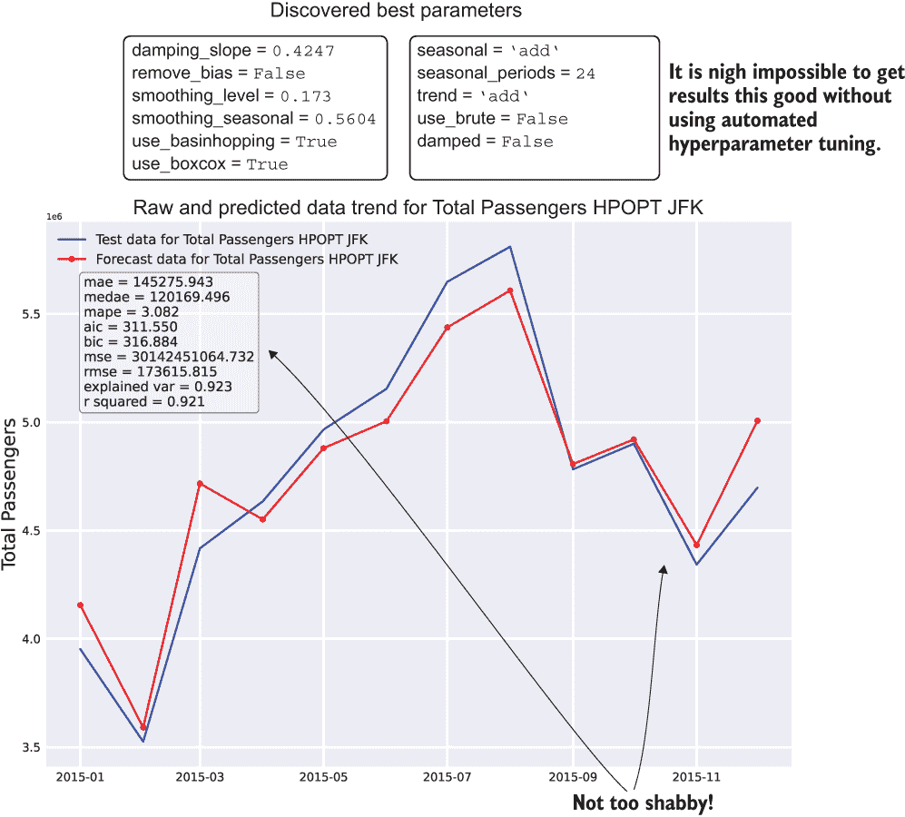

图 7.7 对总时间序列最近数据的预测回测（x 轴放大以提高可读性）

通过使用 Hyperopt 在我们的保留数据上获得最佳预测，我们将超参数优化到了一个程度，可以自信地预测未来的状态（前提是没有意外和不可知的潜在因素影响它）。因此，我们通过使用自动调整来解决了 ML 工作中优化阶段的一些关键挑战性元素：

+   *准确性*—预测是最优的（对于每个模型，前提是我们选择合理的搜索空间并运行足够的迭代）。

+   *训练的及时性*—在这个自动化水平下，我们可以在几分钟内而不是几天（或几周）内获得调优良好的模型。

+   *可维护性*—自动化调整使我们不必手动重新训练模型，因为基线随着时间的推移而变化。

+   *开发的及时性*—由于我们的代码是准模块化的（在笔记本中使用模块化函数），代码是可重用的、可扩展的，并且可以通过控制循环轻松地用于构建每个机场的所有模型。

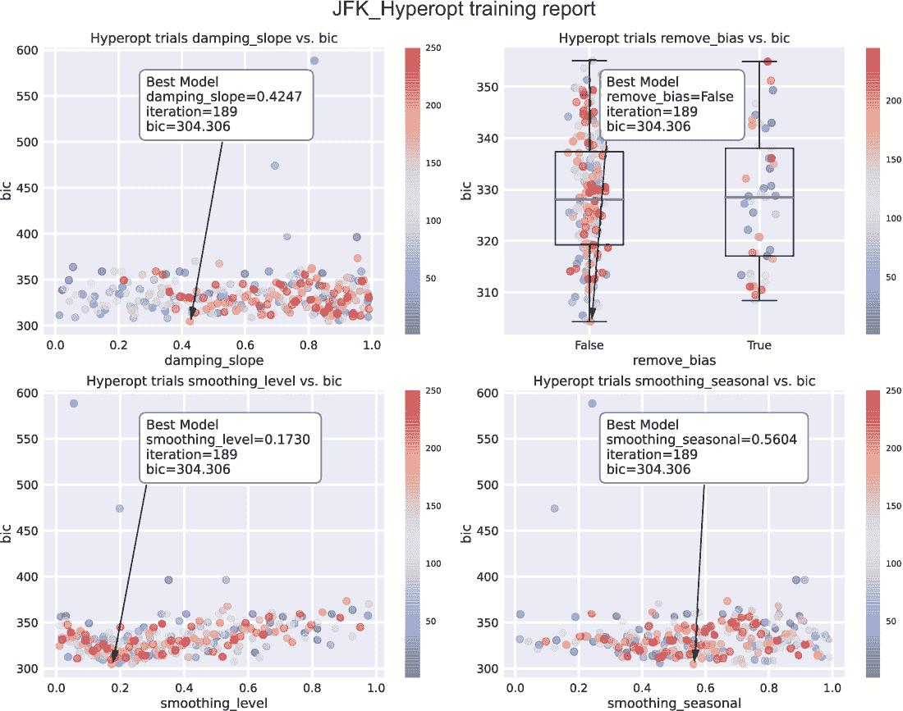

图 7.8 Hyperopt 试验中采样到的超参数结果

注意：我们刚刚使用 Hyperopt 提取的代码示例是书中仓库 Notebooks 部分的一个更大端到端示例的一部分。在这个示例中，你可以看到对数据集中所有机场的自动化调整和优化，以及为支持这种有效的模型调整而构建的所有实用函数。

## 7.2 为平台和团队选择正确的技术

我们一直在讨论的预测场景，当在虚拟机（VM）容器中执行，并对单个机场进行自动调整优化和预测时，效果相当不错。我们对每个机场都得到了相当好的结果。通过使用 Hyperopt，我们还成功地消除了手动调整每个模型的不可维护的负担。虽然令人印象深刻，但这并没有改变我们不仅仅是在预测单个机场的乘客的事实。我们需要为数千个机场创建预测。

图 7.9 展示了我们迄今为止在墙钟时间方面所做的工作。每个机场模型（在`for`循环中）和 Hyperopt 的贝叶斯优化器（也是一个串行循环）的同步性质意味着我们正在等待模型一个接一个地构建，每个后续步骤都在等待前一个步骤完成，正如我们在第 7.1.2 节中讨论的那样。


图 7.9 单线程执行中的串行调整

如此大规模的机器学习问题，如图所示，是许多团队的绊脚石，主要是因为复杂性、时间和成本（这也是为什么此类规模的项目经常被取消的主要原因之一）。对于这些可扩展性问题，存在机器学习项目工作的解决方案；每个解决方案都涉及离开串行执行领域，进入分布式、异步或这两种计算范例的混合世界。

对于大多数 Python 机器学习任务的标准结构化代码方法是以串行方式执行。无论是列表推导式、lambda 函数还是`for`（`while`）循环，机器学习都深深植根于顺序执行。这种方法可能是一个优点，因为它可以减少许多具有高内存需求的算法的内存压力，尤其是那些使用递归的算法，而递归算法很多。但这种方法也可能是一个缺点，因为它执行时间更长，因为每个后续任务都在等待前一个任务完成。

我们将在第 7.4 节简要讨论机器学习中的并发性，并在后面的章节中更深入地讨论（包括安全和不可安全的方法）。现在，鉴于我们项目相对于墙钟时间的可扩展性问题，我们需要考虑一种*分布式方法*来解决这个问题，以便更快地为每个机场探索搜索空间。正是在这一点上，我们离开了单线程虚拟机方法的世界，进入了 Apache Spark 的分布式计算世界。

### 7.2.1 为什么使用 Spark？

为什么使用 Spark？一言以蔽之：速度。

对于我们在这里处理的问题，即预测美国每个主要机场每月的乘客期望值，我们不受以分钟或小时为单位的 SLA（服务等级协议）的约束，但我们仍然需要考虑运行预测所需的时间量。这有多个原因，主要

+   *时间*—如果我们将这个任务作为一个单体建模事件来构建，任何在运行时间极长的任务中的失败都将需要重启（想象一下任务在完成 99%后失败，连续运行了 11 天）。

+   *稳定性*—我们非常关注任务中的对象引用，并确保我们不会创建可能导致任务失败的内存泄漏。

+   *风险*—将机器专门用于运行时间极长的任务（即使在云服务提供商那里）可能会带来平台问题，这些问题可能会导致任务失败。

+   *成本*—无论你的虚拟机在哪里运行，总有人为它们支付账单。

当我们专注于解决这些高风险因素时，分布式计算提供了对串行循环执行的吸引人的替代方案，这不仅因为成本，而且主要是因为执行速度。如果在任务中出现问题，数据中不可预见的问题，或者虚拟机运行的底层硬件问题，这些显著减少的预测任务执行时间将给我们提供灵活性，以便使用预测值快速重新启动任务。

关于 Spark 的简要说明

Spark 是一个大主题，一个巨大的生态系统，一个基于 Java 虚拟机（JVM）的活跃开源分布式计算平台。因为这不是一本关于 Spark 本身的书籍，所以我不打算深入探讨其内部工作原理。

关于这个主题已经写了几本值得注意的书，如果你倾向于了解更多关于这项技术的信息，我推荐阅读它们：Jules Damji 等人所著的《Learning Spark》（O’Reilly，2020 年），Bill Chambers 和 Matei Zaharia 所著的《Spark: The Definitive Guide》（O’Reilly，2018 年），以及 Jean-Georges Perrin 所著的《Spark in Action》（Manning，2020 年）。

话虽如此，在这本书中，我们将探讨如何有效地利用 Spark 来执行机器学习任务。从现在开始，许多示例都集中在利用平台的力量来执行大规模机器学习（包括训练和推理）。

对于当前章节，所涵盖的信息与 Spark 如何工作这些示例相比相对较高层次；相反，我们完全专注于如何使用它来解决问题。

但 Spark 如何帮助我们解决这个问题呢？我们可以采用两种相对简单直观的范式，如图 7.10 所示。我们可以使用不止这两种，但现在我们将从简单且不太复杂的开始；更高级的方法在第 7.4 节中提到。

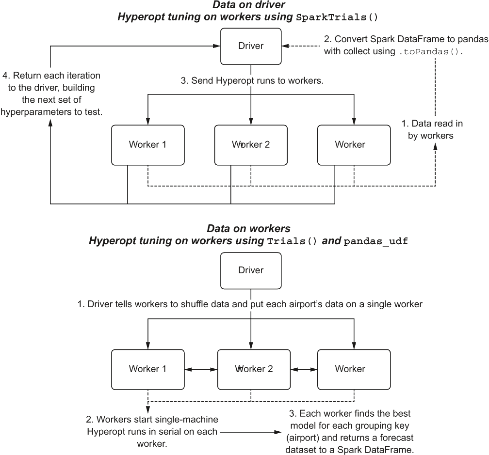

图 7.10 使用 pandas_udf 在 Spark 上扩展超参数调整

第一种方法是利用集群内的工作者来并行评估超参数。在这种范式下，我们的时间序列数据集需要从工作者收集（完全物化）到驱动器。存在限制（在撰写本文时，数据的序列化大小限制为 2 GB），并且对于许多 Spark 上的 ML 用例，这种方法不应使用。对于此类时间序列问题，这种方法将工作得很好。

在第二种方法中，我们将数据留在工作者上。我们使用`pandas_udf`通过使用我们独立的 Hyperopt `Trials()`对象来分发每个工作者上每个机场的并发训练，就像我们在第六章中在单核 VM 上运行时做的那样。

现在我们已经从高层架构的角度定义了两种加速超参数调整的范式，让我们看看下一两个小节中的过程执行（以及每个的权衡）。

### 7.2.2 使用 SparkTrials 从驱动器处理调整

虽然 7.10 图显示了 Spark 集群中处理分布式调整的`SparkTrials()`操作的物理布局，但 7.11 图显示了更详细的执行。每个需要建模的机场在驱动器上迭代，其优化通过分布式实现来处理，其中每个候选超参数集合都提交给不同的工作者。

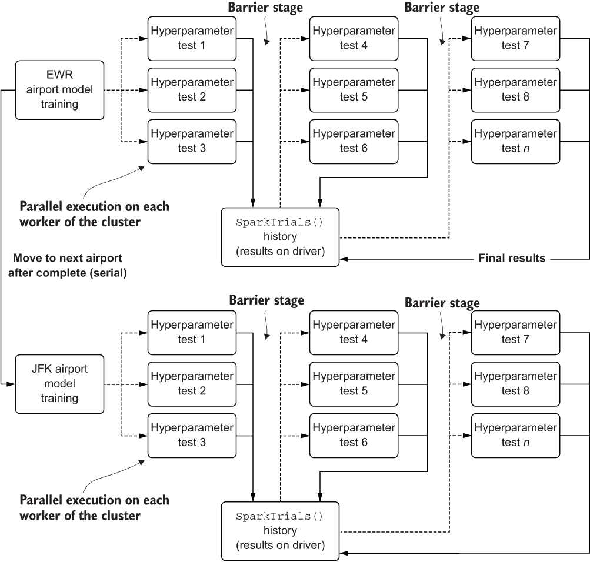

图 7.11：利用 Spark 工作者分布 Hyperopt 测试迭代以进行超参数优化的逻辑架构

这种方法通过最小的修改就能非常有效地工作，与单核方法相比，它只需要在并行级别增加时稍微增加迭代次数。

注意：将迭代次数作为并行级别的因子增加是不推荐的。在实践中，我通常通过简单地调整单核迭代次数 + (并行因子 / 0.2) 来增加迭代次数。这是为了提供一个更大的先前值池来抽取。由于并行运行异步执行，每个启动的边界纪元都不会有同步执行会有的在飞行结果的好处。

这对于 Hyperopt 优化器的本质来说至关重要。作为一个贝叶斯估计器，其能力到达一组经过测试的优化参数的强大之处直接在于其对先前数据的访问。如果同时执行太多的运行，那么它们结果数据的缺乏转化为搜索那些不太可能有效工作的参数的更高频率。没有先前结果，优化就变成了更多随机的搜索，违背了使用贝叶斯优化器的目的。

虽然这种权衡是可以忽略不计的，尤其是与利用 *n* 个工作者将每个迭代分布开来的相当令人印象深刻的性能相比。要将我们的函数移植到 Spark，只需要对这个第一个范式进行一些修改。

注意：要完全跟随 Apache Spark 分布式超参数优化的可参考和可执行示例，请参阅本书仓库中名为 Chapter8_1 的配套 Spark 笔记本，我们将在下一章中继续使用它。

我们首先需要做的是从 Hyperopt 中导入模块 `SparkTrials`。`SparkTrials` 是一个跟踪对象，允许集群的驱动器维护所有尝试过的不同超参数配置的历史记录，这些配置是在远程工作者上执行的（与跟踪在相同 VM 上运行的运行历史的标准 `Trials` 对象相反）。

完成导入后，我们可以通过使用本机 Spark 读取器（在这个例子中，我们的数据已经存储在 Delta 表中并注册到 Apache Hive 元存储中，使其可以通过标准数据库和表名标识符访问）。一旦我们将数据加载到工作者上，我们就可以将序列数据收集到驱动器，如下所示。

列表 7.7 使用 Spark 将数据收集到驱动器作为 pandas DataFrame

```
delta_table_nm = 'airport'                                          ❶
delta_database_nm = 'ben_demo'                                      ❷
delta_full_nm = "{}.{}".format(delta_database_nm, delta_table_nm)   ❸
local_data = spark.table(delta_full_nm).toPandas()                  ❹
```

❶ 定义我们写入机场数据的 Delta 表的名称

❷ 定义 Delta 表注册到的 Hive 数据库名

❸ 将数据库名和表名插入到标准 API 签名中用于数据检索

❹ 使用 Delta 中的工作者读取数据（从 Delta 中直接读取数据到驱动器没有能力），然后将数据收集到驱动节点作为一个 pandas DataFrame

警告：在 Spark 中收集数据时要小心。对于大多数大规模机器学习（训练数据集可能达到数十或数百吉字节），Spark 中的 `.toPandas()` 调用或任何收集操作都会失败。如果您有一大批可以迭代的重复数据，只需过滤 Spark `DataFrame` 并使用迭代器（循环）通过 `.toPandas()` 方法调用收集数据块，以控制每次在驱动器上处理的数据量。

在运行前面的代码后，我们留下数据驻留在驱动器上，准备利用 Spark 集群的分布式特性，以比我们在 7.1 节的 Docker 容器 VM 中处理的可扩展性更高的方式调整模型。以下列表显示了修改列表 7.6 的内容，使我们能够以这种方式运行。

列表 7.8 修改用于在 Spark 上运行 Hyperopt 的调整执行函数

```
def run_tuning(train, test, **params):
    param_count = extract_param_count_hwes(params['tuning_space'])
    output = {}
    trial_run = SparkTrials(parallelism=params['parallelism'], timeout=params['timeout'])                                           ❶
    with mlflow.start_run(run_name='PARENT_RUN_{}'.format(params['airport_name']), nested=True):                                      ❷
      mlflow.set_tag('airport', params['airport_name'])                    ❸
      tuning = fmin(partial(params['minimization_function'], 
                            train=train, 
                            test=test,
                            loss_metric=params['loss_metric']
                           ), 
                    params['tuning_space'], 
                    algo=params['hpopt_algo'], 
                    max_evals=params['iterations'], 
                    trials=trial_run,
                    show_progressbar=False
                   )                                                      ❹
      best_run = space_eval(params['tuning_space'], tuning)
      generated_model = params'forecast_algo'
      extracted_trials = extract_hyperopt_trials(trial_run, 
        params['tuning_space'], params['loss_metric'])
      output['best_hp_params'] = best_run
      output['best_model'] = generated_model['model']
      output['hyperopt_trials_data'] = extracted_trials
      output['hyperopt_trials_visualization'] = 
        generate_Hyperopt_report(extracted_trials, 
                               params['loss_metric'], 
                               params['hyperopt_title'], 
                               params['hyperopt_image_name'])
      output['forecast_data'] = generated_model['forecast']
      output['series_prediction'] = build_future_forecast(
                                          generated_model['model'],
                                          params['airport_name'],
                                          params['future_forecast_periods'],
                                          params['train_split_cutoff_months'],
                                          params['target_name'])
      output['plot_data'] = plot_predictions(test, 
                                             generated_model['forecast'], 
                                             param_count,
                                             params['name'], 
                                             params['target_name'], 
                                             params['image_name'])
      mlflow.log_artifact(params['image_name'])                            ❺
      mlflow.log_artifact(params['hyperopt_image_name'])                    ❻
    return output
```

❶ 配置 Hyperopt 使用 SparkTrials()而不是 Trials()，设置在集群工作节点上运行的并发实验数量和全局超时级别（因为我们使用 Futures 提交测试）

❷ 配置 MLflow 记录每个机场父运行中每个超参数测试的结果

❸ 将机场名称记录到 MLflow 中，以便更容易地搜索跟踪服务的输出结果

❹ 最小化函数在添加 MLflow 记录超参数和正在测试的迭代中计算的损失指标方面基本保持不变。

❺ 将最佳模型的预测图记录到父 MLflow 运行中

❻ 记录运行的超参数报告，写入父 MLflow 运行 ID

对代码进行的小修改就足以使其在 Spark 的分布式框架中工作。作为额外的好处（我们将在第 7.3 节中更深入地讨论），我们还可以轻松地将信息记录到 MLflow 中，解决我们创建可维护项目的关键需求之一：测试的来源，以便于参考和比较。

通过将此方法与我们在单核虚拟机中进行的运行进行并列比较，这种方法满足了我们所寻找的时效性目标。我们已经将此预测努力的优化阶段从超过 3.5 小时减少到相对较小的四节点集群上的不到 30 分钟（使用更高的 Hyperopt 迭代计数 600 和并行化参数 8，以尝试实现类似的损失指标性能）。

在下一节中，我们将探讨一种完全不同的方法来解决我们的可扩展性问题，通过并行化每个机场的模型而不是并行化调整过程。

### 7.2.3 使用 pandas_udf 处理工作节点上的调整

使用上一节的方法，我们能够通过利用 Spark 来分布单个超参数调整阶段，从而显著减少执行时间。然而，我们仍然在每个机场使用顺序循环。随着机场数量的增加，总作业执行时间与机场数量之间的关系仍然会线性增加，无论我们在 Hyperopt 调整框架内进行多少并行操作。当然，这种方法的有效性有一个极限，因为提高 Hyperopt 的并发级别将基本上抵消运行 TPE 的好处，并将我们的优化变成随机搜索。

相反，我们可以并行化实际的模型阶段本身，有效地将此运行时问题转化为水平扩展问题（通过向集群添加更多工作节点来减少所有机场建模的执行时间），而不是垂直扩展问题（迭代受限，只能通过使用更快的硬件来提高运行时间）。图 7.12 阐述了通过在 Spark 上使用 `pandas_udf` 解决我们的多模型问题的替代架构。

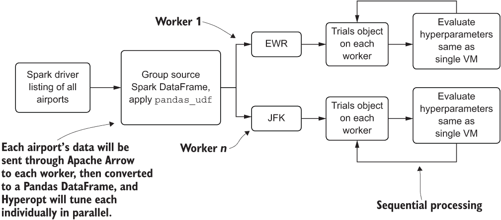

图 7.12 使用 Spark 控制一组 VM 以异步方式处理每个预测

在这里，我们使用 Spark DataFrame——基于不同 VM 上驻留的弹性分布式数据集（`rdd`）关系的分布式数据集——来控制我们的主要建模键的分组（在本例中，我们的 `Airport_Code` 字段）。然后我们将此聚合状态传递给一个 `pandas_udf`，它将利用 Apache Arrow 将聚合数据序列化为工作器作为 pandas DataFrame。这创建了众多并发 Python VM，它们都在处理各自的机场数据，就像它们是一个单独的 VM 一样。

虽然存在权衡。为了使这种方法工作，我们需要对我们的代码进行一些更改。列表 7.9 显示了这些更改中的第一个：将 MLflow 记录逻辑移动到我们的最小化函数中，向我们的函数参数添加记录参数，并在最小化函数中生成每个迭代的预测图，以便在建模阶段完成后查看。

列表 7.9 修改最小化函数以支持分布式模型方法

```
def hwes_minimization_function_udf(selected_hp_values, train, test, loss_metric,  airport, experiment_name, param_count, name, target_name, image_name, trial):                                                  ❶
    model_results = exp_smoothing_raw_udf(train, test, selected_hp_values)
    errors = calculate_errors(test, model_results['forecast'], 
      extract_param_count_hwes(selected_hp_values))
    with mlflow.start_run(run_name='{}_{}_{}_{}'.format(airport,          ❷
        experiment_name,str(uuid.uuid4())[:8], len(trial.results))):
      mlflow.set_tag('airport', airport)                                  ❸
      mlflow.set_tag('parent_run', experiment_name)                       ❹
      mlflow.log_param('id', mlflow.active_run().info.run_id)             ❺
      mlflow.log_params(selected_hp_values)                               ❻
      mlflow.log_metrics(errors)                                           ❼
      img = plot_predictions(test, 
                       model_results['forecast'], 
                       param_count,
                       name, 
                       target_name, 
                       image_name)
      mlflow.log_artifact(image_name)                                     ❽
    return {'loss': errors[loss_metric], 'status': STATUS_OK}
```

❶ 添加参数以支持 MLflow 记录

❷ 初始化每个迭代到其自己的 MLflow 运行，具有唯一名称以防止冲突

❸ 为 MLflow UI 搜索功能添加可搜索的标签

❹ 为特定执行中构建的所有模型集合提供可搜索的标签

❺ 记录 Hyperopt 的迭代次数

❻ 记录特定迭代的超参数

❼ 记录迭代的损失指标

❽ 保存从 plot_predictions 函数生成的图像（PNG 格式），该函数构建测试与预测数据

由于我们将在 Spark 工作器中直接执行伪本地 Hyperopt 运行，我们需要在新的函数中直接创建我们的训练和评估逻辑，该函数将消耗通过 Apache Arrow 传递给工作器作为 pandas DataFrame 处理的分组数据。下一个列表显示了此用户定义函数（`udf`）的创建。

列表 7.10 创建分布式模型 pandas_udf 以并发构建模型

```
output_schema = StructType([
  StructField('date', DateType()),
  StructField('Total_Passengers_pred', IntegerType()),
  StructField('Airport', StringType()),
  StructField('is_future', BooleanType())
])                                                                        ❶

@pandas_udf(output_schema, PandasUDFType.GROUPED_MAP)                     ❷
def forecast_airports(airport_df):

  airport = airport_df['Airport_Code'][0]                                 ❸
  hpopt_space = {
    'model': {
          'trend': hp.choice('trend', ['add', 'mul']),
          'seasonal': hp.choice('seasonal', ['add', 'mul']),
          'seasonal_periods': hp.quniform('seasonal_periods', 12, 120, 12),
          'damped': hp.choice('damped', [True, False])
    },
    'fit': {
          'smoothing_level': hp.uniform('smoothing_level', 0.01, 0.99),
          'smoothing_seasonal': hp.uniform('smoothing_seasonal', 0.01, 0.99),
          'damping_slope': hp.uniform('damping_slope', 0.01, 0.99),
          'use_brute': hp.choice('use_brute', [True, False]),
          'use_boxcox': hp.choice('use_boxcox', [True, False]),
          'use_basinhopping': hp.choice('use_basinhopping', [True, False]),
          'remove_bias': hp.choice('remove_bias', [True, False])
    }
  }                                                                       ❹

  run_config = {'minimization_function': hwes_minimization_function_udf,
                  'tuning_space': hpopt_space,
                  'forecast_algo': exp_smoothing_raw,
                  'loss_metric': 'bic',
                  'hpopt_algo': tpe.suggest,
                  'iterations': 200,
                  'experiment_name': RUN_NAME,
                  'name': '{} {}'.format('Total Passengers HPOPT', airport),
                  'target_name': 'Total_Passengers',
                  'image_name': '{}_{}.png'.format('total_passengers_               validation', airport),
                  'airport_name': airport,
                  'future_forecast_periods': 36,
                  'train_split_cutoff_months': 12,
                  'hyperopt_title': '{}_hyperopt Training 
                    Report'.format(airport),
                  'hyperopt_image_name': '{}_{}.png'.format(
                    'total_passengers_hpopt', airport),
                  'verbose': True
            }                                                             ❺

  airport_data = airport_df.copy(deep=True)
  airport_data['date'] = pd.to_datetime(airport_data['date'])
  airport_data.set_index('date', inplace=True)
  airport_data.index = pd.DatetimeIndex(airport_data.index.values, freq=airport_data.index.inferred_freq)
  asc = airport_data.sort_index()
  asc = apply_index_freq(asc, 'MS')                                       ❻

  train, test = generate_splits_by_months(asc, run_config['train_split_cutoff_months'])

  tuning = run_udf_tuning(train['Total_Passengers'], test['Total_Passengers'], **run_config)                              ❼

  return tuning                                                           ❽
```

❶ 由于 Spark 是强类型语言，我们需要向 udf 提供期望的结构和数据类型，即 pandas 将返回给 Spark DataFrame 的数据类型。这是通过使用定义字段名称及其类型的 StructType 对象来实现的。

❷ 通过应用在函数上方的装饰器定义了 pandas_udf 的类型（在这里我们使用了一个分组映射类型，它接受一个 pandas DataFrame 并返回一个 pandas DataFrame）

❸ 由于我们不能将额外值传递到这个函数中，我们需要从数据本身提取机场名称。

❹ 我们需要在 udf 内部定义我们的搜索空间，因为我们不能将其传递到函数中。

❺ 设置搜索的运行配置（在 udf 内部，因为我们需要在 MLflow 中按机场名称命名运行，而机场名称仅在数据传递给 udf 中的工作节点之后定义）

❻ 将 pandas DataFrame 的机场数据处理放在这里，因为系列数据的索引条件和频率没有在 Spark DataFrame 中定义。

❼ 对“运行调整”功能的唯一修改是移除为基于驱动器的分布式 Hyperopt 优化创建的 MLflow 日志，并仅返回预测数据，而不是包含运行指标和数据的字典。

❽ 返回预测的 pandas DataFrame（这是必需的，以便在所有机场完成异步分布式调整和预测运行后，可以将这些数据“重新组装”成一个汇总的 Spark DataFrame）

通过创建这个`pandas_udf`，我们可以调用分布式建模（使用 Hyperopt 的单节点`Trials()`模式）。

列表 7.11 执行基于模型的异步预测运行的全分布式运行

```
def validate_data_counts_udf(data, split_count):                           ❶
    return (list(data.groupBy(col('Airport_Code')).count()
          .withColumn('check', when(((lit(12) / 0.2) < (col('count') * 0.8)), 
            True)
          .otherwise(False))
          .filter(col('check')).select('Airport_Code').toPandas()[             'Airport_Code']))

RUN_NAME = 'AIRPORT_FORECAST_DEC_2020'                                     ❷
raw_data = spark.table(delta_full_nm)                                      ❸
filtered_data = raw_data.where(col('Airport_Code').isin(validate_data_counts_udf(raw_data, 12))).repartition('Airport_Code')                               ❹
grouped_apply = filtered_data.groupBy('Airport_Code').apply(forecast_airports)        ❺
display(grouped_apply)                                                     ❻
```

❶ 对单节点代码中使用的机场过滤进行了修改，利用 PySpark 过滤来确定特定机场的系列中是否有足够的数据来构建和验证预测模型

❷ 为特定的预测运行定义一个唯一名称（这设置了跟踪 API 的 MLflow 实验名称）

❸ 将 Delta（机场的历史乘客原始数据）中的数据读取到集群上的工作节点

❹ 过滤掉数据不足的情况，其中某个机场没有足够的数据进行建模

❺ 将 Spark DataFrame 分组并发送聚合数据到工作节点，作为 pandas DataFrame 通过 udf 执行

❻ 强制执行（Spark 是惰性评估的）

当我们运行此代码时，我们可以看到正在生成的机场模型数量与可用于处理我们的优化和预测运行的工作节点数量之间存在相对平坦的关系。虽然在最短的时间内（具有数千个工作节点的 Spark 集群）对超过 7,000 个机场进行建模的现实可能有些荒谬（仅成本就天文数字），但我们使用这种范式有一个可排队解决方案，其横向扩展能力是任何其他解决方案都无法比拟的。

尽管由于成本和资源限制（每个模型需要一个工作者），我们无法获得有效的 O(1)执行时间，但我们可以从一个包含 40 个节点的集群开始，实际上可以并行运行 40 个机场建模、优化和预测执行。这将将所有 7,000 个机场的总运行时间显著减少到 23 小时，而不是通过在虚拟机中通过嵌套循环（> 5,000 小时）运行它们，或者收集数据到 Spark 集群的驱动器上并运行分布式调优（> 800 小时）。

当寻找处理此类大规模项目的选项时，执行架构的可扩展性与其他机器学习组件一样关键。无论在构建解决方案的机器学习方面投入了多少努力、时间和勤奋，如果解决问题需要数千（或数百）小时，项目成功的可能性都很小。在下一章，第 8.2 节中，我们将讨论可以进一步减少已经大幅改善的 23 小时运行时间的替代方法。

### 7.2.4 使用团队的新范式：平台和技术

从一个新的平台开始，利用新的技术，也许学习一种新的编程语言（或者在你已知的语言中的新范式）对于许多团队来说是一项艰巨的任务。在前面的场景中，从运行在单台机器上的 Jupyter 笔记本迁移到分布式执行引擎 Spark 是一个相对较大的飞跃。

机器学习的世界提供了许多选择——不仅包括算法，还包括编程语言（R、Python、Java、Scala、.NET、专有语言）以及开发代码的地方（用于原型设计的笔记本、用于 MVP 的脚本工具和用于生产解决方案开发的 IDE）。最重要的是，有许多地方可以运行你编写的代码。正如我们之前看到的，导致项目运行时间大幅下降的不是语言，而是我们选择使用的平台。

在探索项目工作的选项时，做足准备工作是绝对关键的。测试不同的算法方法来解决特定问题至关重要，而找到适合该项目需求的地方来运行解决方案可能更为关键。

为了最大化解决方案被业务采纳的机会，应选择合适的平台以最小化执行成本，最大化解决方案的稳定性，并缩短开发周期以满足交付期限。关于在哪里运行机器学习代码的重要观点是，它就像这个职业的任何其他方面一样：花时间学习用于运行你的模型和分析的框架将是值得的，这将提高你未来工作的生产力和效率。正如 7.2.3 节中提到的，如果不了解如何实际使用特定的平台或执行范式，该项目可能需要为每个启动的预测事件花费数百小时的运行时间。

关于学习新事物的建议

在我的数据科学职业生涯早期，我对学习除 Python 之外的语言感到有些畏惧和犹豫。我错误地认为我的选择语言可以“做所有的事情”，并且我没有必要学习任何其他语言，因为当时我所使用的算法都在那里（据我所知），并且我对使用 pandas 和 NumPy 操作数据的细微差别很熟悉。当我不得不构建第一个涉及预测交付服务级别协议（SLA）的极其大规模的机器学习解决方案时，我深感错误，因为该 SLA 的时间太短，无法允许对兆字节级数据进行循环推理处理。

在接触 Hadoop 后的几年里，我精通了 Java 和 Scala，两者都用于构建机器学习用例的定制算法和框架，并扩展了我的并发异步编程知识，使我能够利用尽可能多的计算能力。我的建议？将学习新技术变成一种常规习惯。

数据科学和机器学习工作不是关于单一语言、单一平台或任何固定不变的东西。它是一个可变的发现职业，专注于以最佳方式解决问题。学习新的解决问题方法将只会对你和你工作的公司有益，并且有一天可能会帮助你利用在旅程中获得的知识回馈社区。

## 摘要

+   依赖于手动和规定性的方法进行模型调优既耗时又昂贵，而且不太可能产生高质量的结果。利用模型驱动的参数优化是首选。

+   选择合适的平台和实现方法对于耗时的 CPU 密集型任务可以显著提高机器学习项目的效率并降低开发成本。对于超参数调优等过程，最大化并行和分布式系统方法可以显著缩短开发时间表。
