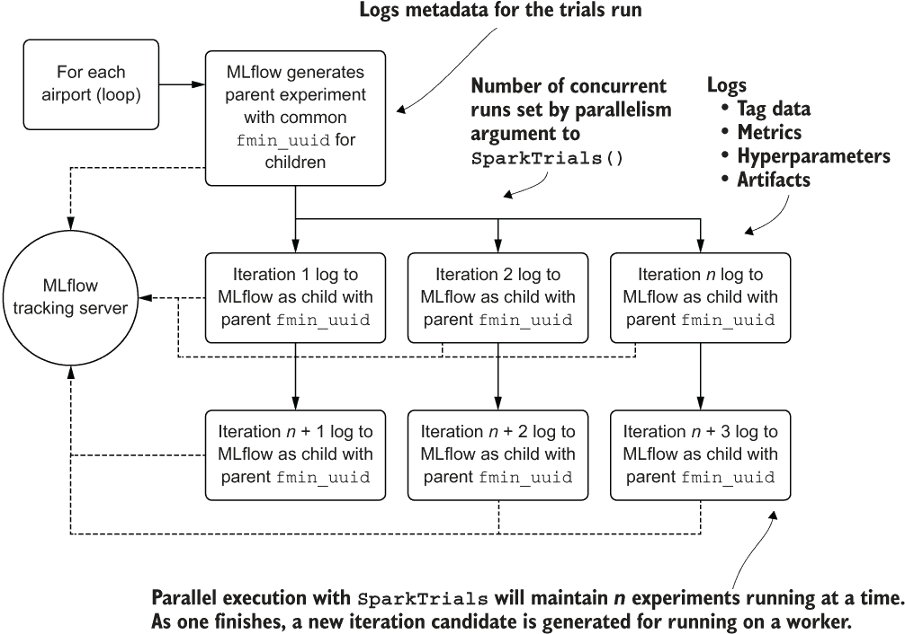
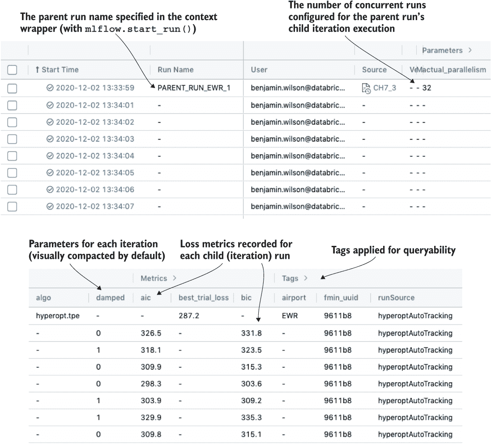
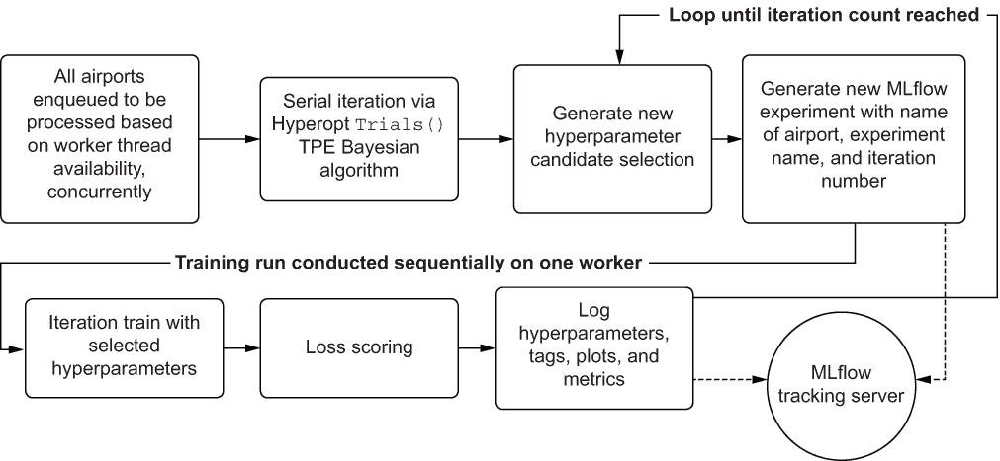
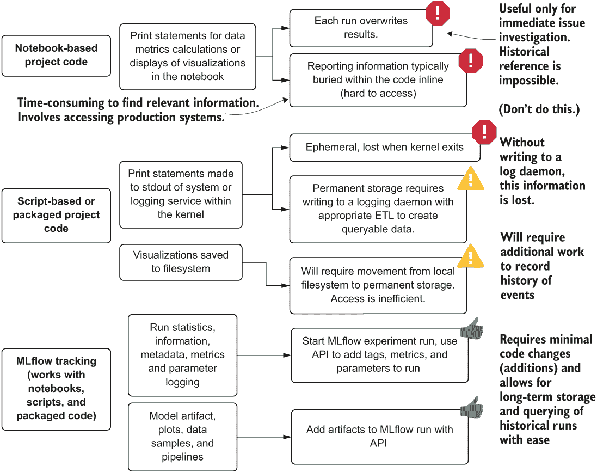
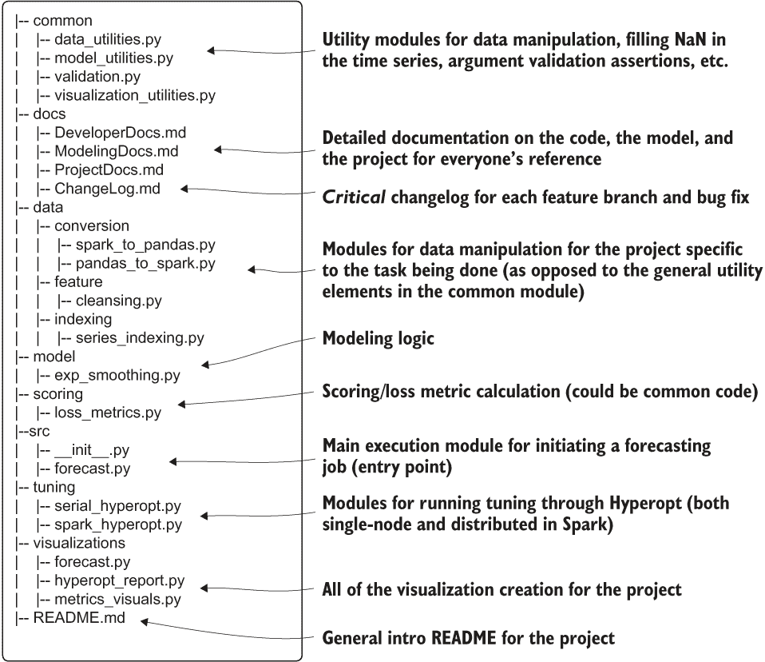
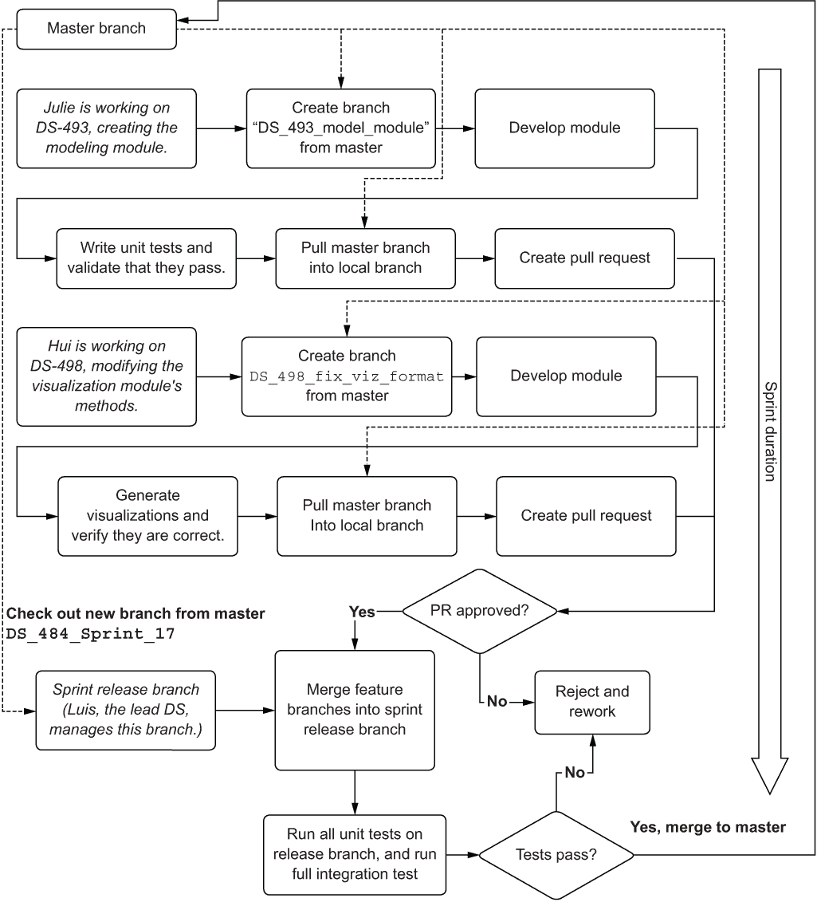
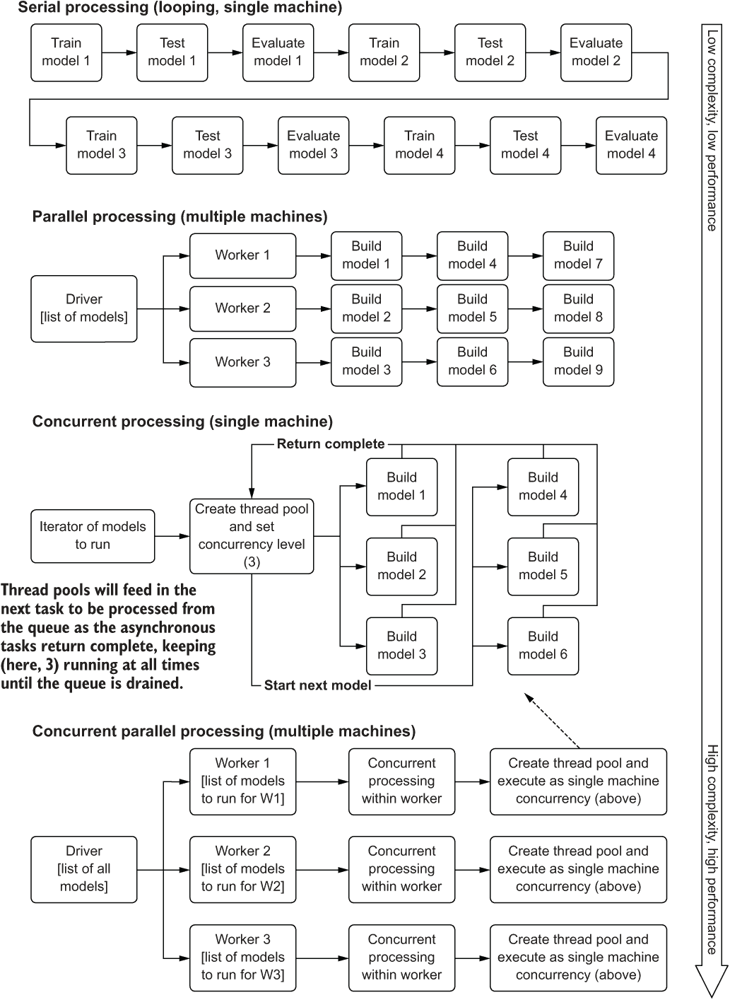
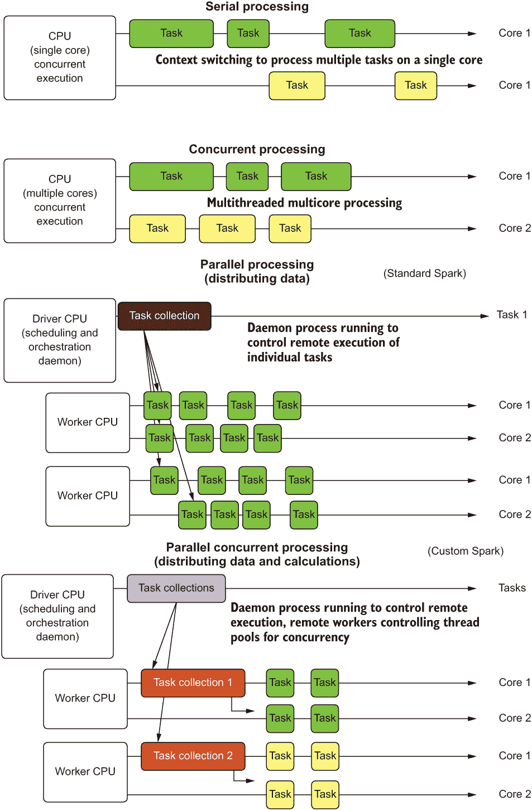

# 8 实验行动：使用 MLflow 和运行时优化完成最小可行产品（MVP）

本章涵盖

+   版本控制 ML 代码、模型和实验结果的方法、工具和技巧

+   模型训练和推理的可扩展解决方案

在前一章中，我们找到了解决作为机器学习从业者面临的最耗时和单调的任务之一的方法：微调模型。通过拥有解决繁琐调优的技术，我们可以大大降低产生不准确到毫无价值的机器学习解决方案的风险。然而，在应用这些技术的过程中，我们默默地欢迎了一个巨大的大象进入我们的项目房间：跟踪。

在过去的几章中，我们每次进行推理时都需要重新训练我们的时间序列模型。对于绝大多数其他监督学习任务，情况并非如此。那些其他建模应用，无论是监督学习还是无监督学习，都将定期进行重新训练事件，在这些事件之间，每个模型将被多次调用进行推理（预测）。

无论我们是否需要每天、每周或每月重新训练（你真的不应该让模型闲置超过那么长时间），我们都会有最终生成评分指标的最终生产模型的版本，以及自动化调优的优化历史。将这一大量建模信息与丰富的统计验证测试、元数据、工件和特定运行数据相结合，这些数据对于历史参考非常有价值，你就拥有了一座需要记录的关键数据山。

在本章中，我们将介绍将我们的调优运行数据记录到 MLflow 的跟踪服务器中，使我们能够对存储关于项目解决方案的重要信息有历史参考。拥有这些数据不仅对于调优和实验有价值；对于监控解决方案的长期健康状况也至关重要。随着时间的推移，可参考的指标和参数搜索历史有助于了解如何可能使解决方案变得更好，同时也提供了洞察，当性能下降到需要重建解决方案的程度时。

注意：本章节提供了一个配套的 Spark 笔记本，其中包含了本章讨论的要点示例。如需进一步详情，请参阅随附的 GitHub 仓库。

## 8.1 记录：代码、指标和结果

第二章和第三章讨论了关于建模活动的沟通对于企业和数据科学家团队的重要性。不仅能够展示我们的项目解决方案，而且拥有一个可追溯的历史记录以供参考，这对于项目的成功至关重要，甚至比解决该问题的算法更为重要。

对于我们在过去几章中一直在讨论的预测项目，解决方案的机器学习方面并不特别复杂，但问题的规模却是巨大的。要为成千上万的机场建模（这反过来意味着需要调整和跟踪成千上万的模型），处理通信并为项目代码的每次执行提供历史数据的参考是一项艰巨的任务。

当我们在生产环境中运行我们的预测项目后，如果业务单元团队中的成员想要解释为什么某个预测与收集到的数据的最终现实相差如此之远，会发生什么？这是许多依赖机器学习预测来告知业务应采取哪些行动的公司常见的疑问。如果发生黑天鹅事件，业务询问为什么模型预测没有预见它，而你又不得不尝试重新生成模型在某个时间点的预测以全面解释不可预测事件无法被建模的情况，这将是你最不愿意面对的事情。

注意：黑天鹅事件是一种不可预见且许多时候具有灾难性的事件，它改变了获取数据的性质。虽然罕见，但它们可以对模型、企业和整个行业产生灾难性的影响。一些最近的黑天鹅事件包括 2001 年 9 月 11 日的恐怖袭击、2008 年的金融危机和 Covid-19 大流行。由于这些事件的影响范围广泛且完全不可预测，对模型的影响可能是绝对毁灭性的。术语“黑天鹅”是由纳西姆·尼古拉斯·塔勒布（Nassim Nicholas Taleb）在他的书中《黑天鹅：几乎不可能发生的事物的影响》（Random House，2007 年）中提出并普及的。

为了解决机器学习从业者历史上必须处理的这些棘手问题，MLflow 被创建出来。在本节中，我们将探讨 MLflow 的跟踪 API，它为我们提供了一个记录所有调整迭代、每个模型调整运行中的指标以及可以轻松检索和引用的预生成可视化（GUI）的地方。

### 8.1.1 MLflow 跟踪

让我们看看第七章（7.2 节）中基于 Spark 的两个实现与 MLflow 日志记录相关的情况。在该章节中展示的代码示例中，MLflow 上下文的初始化在两个不同的地方实例化。

在第一种方法中，使用`SparkTrials`作为状态管理对象（在驱动程序上运行），MLflow 上下文被放置在`run_tuning()`函数中整个调整运行的外部包装器。这是使用`SparkTrials`进行运行跟踪的首选方法，以便可以轻松地将父运行的个人子运行关联起来，以便在跟踪服务器的 GUI 中查询，以及涉及过滤谓词的跟踪服务器 REST API 请求。

图 8.1 展示了与 MLflow 跟踪服务器交互时此代码的图形表示。该代码不仅记录了封装运行的父级元数据，还记录了每个超参数评估发生时工作者进行的迭代日志。

图 8.1 使用分布式超参数优化进行 MLflow 跟踪服务器日志记录。

当查看 MLflow 跟踪服务器 GUI 中的实际代码表现时，我们可以看到这种父子关系的结果，如图 8.2 所示。

图 8.2 MLflow 跟踪 UI 示例

相反，用于`pandas_udf`实现的这种方法略有不同。在第七章的列表 7.10 中，Hyperopt 执行的每个单独迭代都需要创建一个新的实验。由于没有父子关系来分组数据，因此需要应用自定义命名和标记，以便在 GUI 中进行搜索，并且对于具有生产能力的代码来说更为重要——REST API。此替代方案（以及此用例数千个模型的更可扩展实现）的日志机制概述如图 8.3 所示。

图 8.3 MLflow 为 pandas_udf 分布式模型方法提供的日志逻辑执行。

无论选择哪种方法，所有这些讨论的重要方面是，我们已经解决了一个经常导致项目失败的大问题。（每种方法都有其针对不同方法的优点；对于单一模型项目，`SparkTrails`无疑是更好的选择，而对于我们在此处展示的具有数千个模型的预测场景，`pandas_udf`方法则远胜一筹。）我们解决了长期困扰机器学习项目工作的历史跟踪和组织难题。能够轻松访问测试结果以及训练和评分时正在生产的模型的状态，是创建成功的机器学习项目的一个基本要素。

### 8.1.2 请停止打印并记录您的信息

现在我们已经看到了一个可以用来跟踪我们的实验、调整运行和每个预测作业的预生产训练的工具，让我们花点时间讨论使用跟踪服务构建机器学习项目时的另一个最佳实践方面：日志记录。

我在生产 ML 代码中看到的`print`语句的次数确实令人震惊。大多数情况下，这是由于忘记（或故意留下以供未来调试）的调试脚本行，让开发者知道代码正在执行（并且是否在运行时可以安全地去喝咖啡）。在解决方案开发期间的咖啡休息时间之外，这些`print`语句永远不会再次被人类眼睛看到。图 8.4 的顶部显示了这些`print`语句在代码库中的无关性。

图 8.4 比较了在 ML 项目代码中常见的模式，尤其是在前两个领域。虽然顶部部分（在笔记本中打印到 stdout，这些笔记本以某种周期性执行）绝对不推荐，但遗憾的是，这是在行业中看到的最常见的习惯。对于编写 ML 项目打包代码的更复杂的团队（或使用可以编译的语言，如 Java、Scala 或基于 C 的语言），历史上的做法是将运行信息记录到日志守护程序中。虽然这确实为数据记录维护了历史参考，但它也涉及到大量的 ETL 或更常见的是 ELT，以便在出现问题时提取信息。图 8.4 中的最后一个块展示了如何利用 MLflow 解决这些可访问性问题，以及任何 ML 解决方案的历史溯源需求。

图 8.4 比较了 ML 实验的信息存储范式

为了明确起见，我并不是说永远不要使用`print`或`log`语句。在调试特别复杂的代码库时，它们具有非凡的效用，并且在开发解决方案时非常有用。这种效用在你过渡到生产开发时开始减弱。`print`语句不再被查看，当你忙于其他项目时，解析日志以检索状态信息的需求变得远不如以前那样令人愉快。

如果需要记录一个项目代码执行的关键信息，它*应该始终被记录并保存以供将来参考*。在像 MLflow 这样的工具解决这个问题之前，许多数据科学团队会将这些关键信息记录到关系型数据库管理系统（RDBMS）中的一个表中，以用于生产目的。更大规模的团队，拥有数十个在生产中的解决方案，可能会利用 NoSQL 解决方案来处理可扩展性。真正自虐的人会编写 ELT 作业来解析系统日志以检索他们关于模型的关键数据。MLflow 通过创建一个连贯的统一框架来简化所有这些情况，该框架用于指标、属性和工件记录，以消除 ML 日志记录中耗时的工作。

如我们在 Spark 早期示例中看到的那样，我们在这些运行之外记录了额外的信息，这些信息通常与调优执行相关联。我们记录了每个机场的指标和参数，以便于历史搜索，以及我们的预测图表。如果我们有额外的数据要记录，我们可以通过 API 简单地添加一个标签，形式为`mlflow.set_tag(<key>, <value>)`用于运行信息记录，或者，对于更复杂的信息（可视化、数据、模型或高度结构化数据），我们可以使用 API `mlflow.log_artifact(<location and name of data on local filesystem>)`将其记录为工件。

将特定模型调优和训练事件的所有相关信息保存在一个单独的地方，且在执行运行的系统之外，可以在尝试重新创建模型在训练时可能遇到的确切条件时节省无数令人沮丧的工作时间。能够快速回答有关业务对模型性能的信心的问题可以显著降低项目放弃的可能性，以及节省大量时间来改进表现不佳的模型。

### 8.1.3 版本控制、分支策略和与他人协作

影响项目及时且有序地交付到 MVP 阶段的最大开发工作之一是团队（或个人）与存储库的交互方式。在我们的示例场景中，一个相对规模较大的 ML 团队正在处理预测模型的各个组件，每个人都能够以结构化和受控的方式为代码库的各个部分做出贡献，这对于消除令人沮丧的重做、损坏的代码和大规模重构至关重要。虽然我们还没有深入研究该代码的生产版本会是什么样子（它不会在笔记本中开发，这是肯定的），但总体设计看起来可能类似于图 8.5 中的模块布局。

图 8.5 预测项目的初始存储库结构

随着项目的进展，项目不同的团队成员将在任何给定时间贡献代码库中的不同模块。有些人可能在冲刺期间处理与可视化相关的任务和故事。其他人可能在该冲刺期间从事核心建模类的工作，而常见的实用函数将由团队中的几乎每个人添加和改进。

没有使用强大的版本控制系统以及围绕将代码提交到该仓库的基础流程，代码库被显著降级或损坏的可能性很高。虽然机器学习（ML）开发的大部分方面与传统软件开发开发有显著不同，但两个领域完全相同的一个方面是版本控制和分支开发实践。

为了防止不兼容的更改合并到主分支导致的问题，从冲刺中选取的每个故事或任务，DS 需要对其工作的当前主分支的构建进行分支。在这个分支中，应该构建新功能，更新通用功能，并添加新的单元测试，以确保团队相信这些修改不会破坏任何东西。当关闭故事（或任务）的时间到来时，为该故事（或任务）开发代码的 DS 需要确保整个项目的代码通过单元测试（特别是对于他们没有修改的模块和功能）以及完整的运行集成测试，然后才能提交他们的同行评审请求以合并代码到主分支。

图 8.6 显示了处理仓库时机器学习项目工作的标准方法，无论使用的仓库技术或服务如何。每个都有自己的细微差别、功能和命令，我们在这里不会深入探讨；重要的是仓库的使用方式，而不是如何使用特定的一个。

图 8.6 机器学习团队在功能开发期间的仓库管理流程

通过遵循这样的代码合并范例，可以完全避免大量的挫败感和浪费时间。这将简单地为数据科学（DS）团队成员留下更多时间来解决项目的实际问题，而不是解决合并地狱问题以及修复由不良合并导致的损坏代码。对代码合并候选者的有效测试可以带来更高的项目速度，这可以显著降低项目放弃的可能性，为项目创建一个更可靠、更稳定且无错误的代码库。

## 8.2 可扩展性和并发性

在我们一直在工作的这个项目中，解决方案最关键和最复杂的方面是可扩展性。当我们谈论可扩展性时，我们实际上是在指**成本**。虚拟机（VM）运行和执行我们的项目代码的时间越长，我们的账单上的无声计时器就越高。我们可以做的任何事，都是为了最大化硬件随时间变化的资源利用率，这将保持账单在可管理状态，减少企业对解决方案总成本的担忧。

在第七章的后半部分，我们评估了两种将我们的问题扩展以支持建模多个机场的策略。第一种，在集群上并行化超参数评估，与串行方法相比，显著缩短了每个模型的训练时间。第二种，在集群上并行化实际的每个模型的训练，以略不同的方式扩展了解决方案（这更有利于许多模型/合理的训练迭代方法），以更大的方式减少了我们的解决方案的成本足迹。

如第七章所述，这些只是扩展此问题的两种方法，两者都涉及并行实现，将建模过程的各个部分分散到多台机器上。然而，我们可以添加一个额外的处理层来进一步加快这些操作的速度。图 8.7 展示了我们增加机器学习任务吞吐量以减少构建解决方案所需墙钟时间的选项概述。

图 8.7 执行范例比较

在图 8.7 中向下缩放会带来简单性和性能之间的权衡。对于需要分布式计算可以提供的规模的问题，了解将引入代码库的复杂性水平是很重要的。这些实现的挑战不再局限于解决方案的 DS 部分，而是需要越来越复杂的工程技能来构建。

获得构建利用能够处理分布式计算的系统（例如，Spark、Kubernetes 或 Dask）的大规模机器学习项目的知识和能力，将有助于确保你能够实施需要扩展的解决方案。根据我自己的经验，我花费的时间很好地用于学习如何利用并发性和分布式系统的使用来通过尽可能多地垄断可用硬件资源来加速项目性能和降低项目成本。

为了简洁起见，我们不会在本章中详细介绍图 8.7 最后两个部分的实现示例。然而，我们将在本书的后面部分讨论并发操作的一些示例。

### 8.2.1 什么是并发性？

在图 8.7 中，你可以看到在底部两个解决方案中列出了*并发性*这个术语。对于大多数没有软件工程背景的数据科学家来说，这个术语很容易被误解为*并行性*。毕竟，它实际上是在同时做很多事情。

*并发性*，按定义，是指同时执行许多任务的行为。它并不暗示任务的排序或同时处理的顺序。它仅仅要求系统和发送给它的代码指令能够同时运行多个任务。

另一方面，*并行性*通过将任务划分为可以在 CPU 或 GPU 的离散线程和核心上并行执行的子任务来实现。例如，Spark 在执行器上的离散核心分布式系统中并行执行任务。

这两个概念可以在支持它们的系统中结合，一个由多台机器组成，每台机器都有多个可用的核心。这种系统架构在图 8.7 的底部最后部分显示。图 8.8 说明了并行执行、并发执行以及混合并行-并发系统之间的差异。

图 8.8 执行策略比较

利用这些执行策略来解决适当类型的问题可以显著提高项目的成本。虽然使用最复杂的方法（在分布式系统中进行并行并发处理）来处理每个问题可能看起来很有吸引力，但这并不值得。如果你试图解决的问题可以在单台机器上实现，那么通过采用这种方法来降低基础设施复杂性总是最好的选择。只有在你需要的时候，才建议你走更复杂的路径。这尤其适用于数据、算法或任务规模如此之大，以至于简单的方案不可行的情况。

### 8.2.2 你可以（和不可以）异步运行的内容

关于提高运行时性能的最后一句话，重要的是要提到，在机器学习中并非每个问题都可以通过并行执行或在分布式系统中解决。许多算法需要维护状态才能正确运行，因此不能分割成子任务在核心池上执行。

我们在前几章中讨论的单变量时间序列的情景确实可以从并行化中受益。我们可以并行化 Hyperopt 调优和模型训练。我们可以在数据本身内实现隔离（每个机场的数据是自包含的，不依赖于任何其他数据）以及调优操作，这意味着我们可以通过适当利用分布式处理和异步并发来显著减少我们工作的总运行时间。

当选择提高建模解决方案性能的机会时，你应该考虑正在执行的任务之间的依赖关系。如果有机会将任务彼此隔离，例如根据可以应用于数据集的过滤器来分离模型评估、训练或推理，那么利用可以为你处理此处理的框架可能是值得的。

然而，在机器学习中，许多任务是无法分布的（或者至少难以分布）。需要访问整个特征训练集的模型不适合分布式训练。其他模型可能具有分布的能力，但由于需求或构建分布式解决方案的技术复杂性，尚未实现。当考虑一个算法或方法是否可以通过分布式处理利用并发或并行性时，最好的办法是阅读流行框架的库文档。如果一个算法尚未在分布式处理框架上实现，那么很可能有很好的理由。要么有更简单的方法可以满足你正在研究的模型（高度可能），要么构建分布式解决方案的开发和运行成本非常高。

## 摘要

+   在整个解决方案的生命周期中利用实验跟踪服务，例如 MLflow，可以显著提高项目的可审计性和历史监控。此外，利用版本控制和日志记录将增强生产代码库，能够减少故障排除时间，并在生产中允许对项目健康状况的诊断报告。

+   学习在可扩展的基础设施中使用和实现解决方案对于许多大规模机器学习项目至关重要。虽然这不适用于所有实现，但理解分布式系统、并发性和使这些范式成为可能的框架对于机器学习工程师来说是至关重要的。
