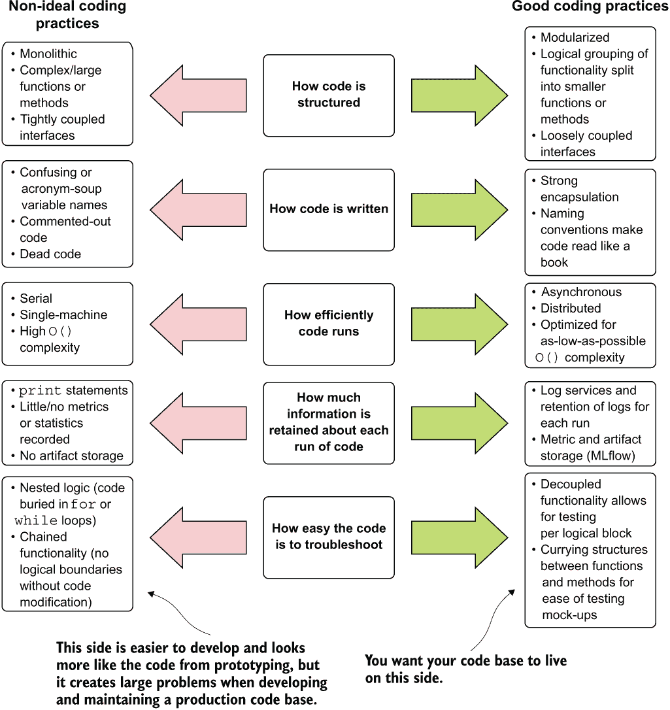
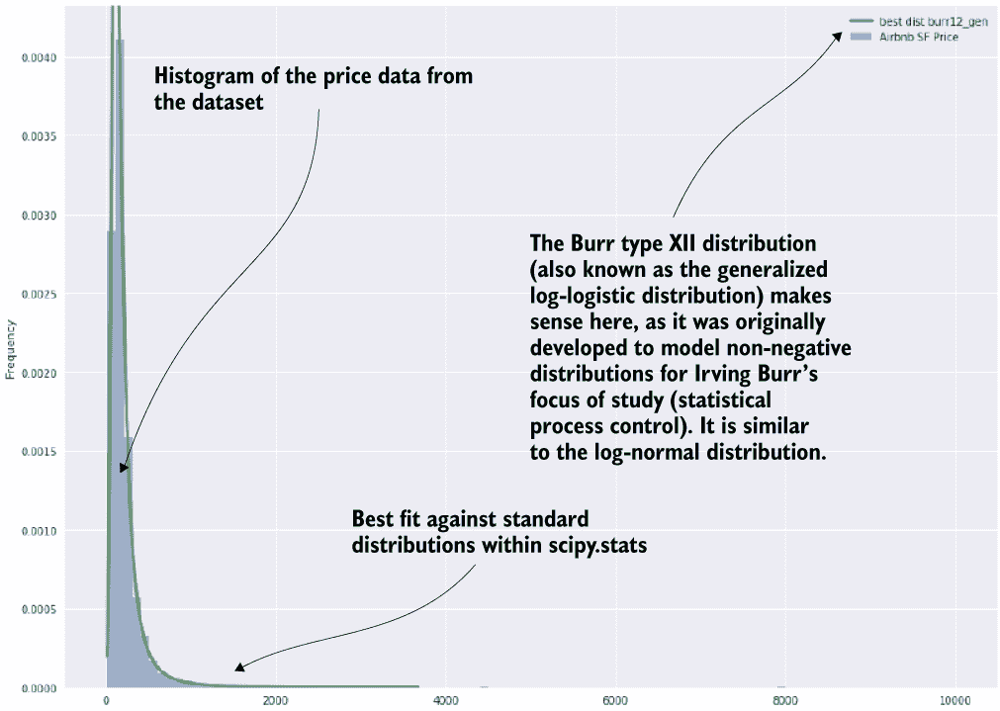
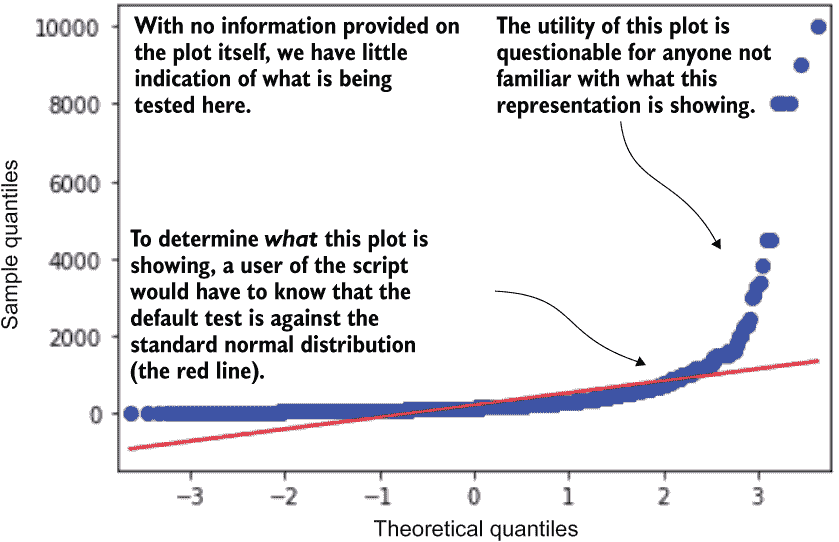
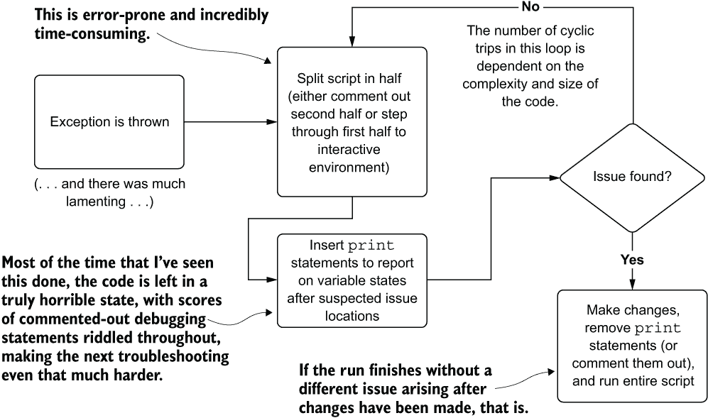
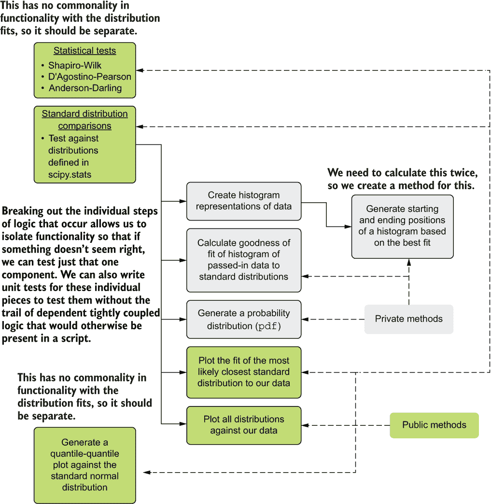
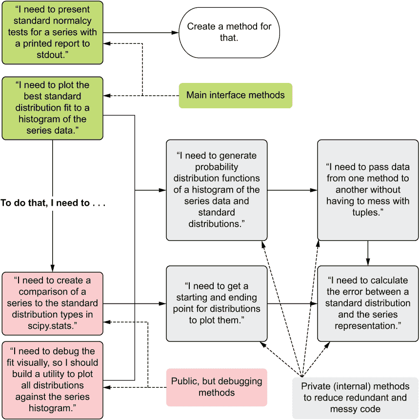

# 9 机器学习的模块化：编写可测试和可读的代码

本章涵盖了

+   阐述为什么单体脚本编码模式使机器学习项目更复杂

+   理解调试非抽象代码的复杂性

+   将基本抽象应用于机器学习项目

+   在机器学习代码库中实现可测试的设计

当你被交给一个别人编写的复杂代码库时，几乎没有比这更让人心灵崩溃的情感。在被告知你负责修复、更新和支持它之后，阅读一大堆难以理解的代码是令人沮丧的。当你继承了一个本质上已经损坏的代码库来维护时，唯一更糟糕的情况是你的名字出现在提交历史中。

这并不是说代码不起作用。它可能运行得很好。代码能运行的事实并不是问题。问题是人类无法轻易地弄清楚它是如何（或者，更糟糕的是，为什么）工作的。我相信这个问题在 2008 年由马丁·福勒最生动地描述了：

*任何傻瓜都能写出计算机能理解的代码。优秀的程序员写出人类能理解的代码。*

大部分机器学习代码不符合良好的软件工程实践。由于我们专注于算法、向量、索引器、模型、损失函数、优化求解器、超参数和性能指标，我们作为实践者的一个职业，通常不会花太多时间遵守严格的编码标准。至少，我们中的大多数是这样的。

我可以自豪地说，我多年来就是这样一个人，编写了一些真正糟糕的代码（大多数时候它在我发布时是能工作的）。我专注于尽可能小的精度改进或是在特征工程任务中变得巧妙，结果我创造了一个真正的弗兰肯斯坦怪物，是难以维护的代码。为了公正地对待这个被误解的复活的生物，我的一些早期项目要恐怖得多。（如果我的同伴拿着火把和长柄叉追赶我，我不会责怪他们。）

本章和下一章致力于我在多年中学习到的编码标准教训。这绝对不是关于软件工程的详尽论述；有书是关于这个话题的。相反，这些是我为了创建更简单、更容易维护的机器学习项目代码库而学到的最重要的方面。我们将按照图 9.1 所示的五个关键领域来介绍这些最佳实践。

本章中的部分内容，如图 9.1 所示，展示了我所做的可怕事情、我在他人代码中看到的可怕元素，以及最重要的是，如何解决这些问题。我们本章的目标是避免复杂的和过度复杂的代码的弗兰肯斯坦怪物。



图 9.1 比较了机器学习项目工作中的编码实践极端

复杂代码与复杂代码

这个短语**复杂与复杂**可能看起来是对语法的一个糟糕解释——毕竟这两个词似乎意味着相同的意思。但是，当应用于代码时，每个词都有明显的不同。一个**复杂的代码库**是对特定封装代码（例如：函数或方法）可以遍历的分支路径的经验性评估。`for`循环、条件语句、匹配的`switch`语句以及传入的参数功能状态变化都是增加代码复杂性的元素。由于包含的代码可以执行许多“事情”，因此从这个代码中可能产生的结果数量非常高。复杂的代码库通常需要大量的测试来确保它们在所有可能的情况下都能正确运行。这种复杂性也使得代码库比那些功能分支路径更少的代码库更难以理解。

然而，一个**复杂的代码库**是这样编写的，使得很难确定代码的功能。这种高度主观的评估“阅读和弄懂有多难”是一个很大程度上取决于阅读代码的人的衡量标准。不管怎样，大多数经验丰富的开发者可以就复杂代码库与简单代码库的区别达成一般共识。

一个高度复杂的代码库可能是在代码反复修补（重构代码以修复延迟的技术债务）之后达到这种状态的。这种代码可能链式连接，使用糟糕的命名约定，以难以阅读的方式重复使用条件逻辑，或者只是自由地使用不常见的缩写符号（我看着你，Scala 通配符，`_`）。

代码库可以是由以下这些元素混合而成的：

+   **复杂但不复杂**——对于机器学习代码库来说是一个具有挑战性但可接受的状态。

+   **不复杂也不复杂**——也是可接受的，但在数据科学工作中的应用案例中通常不常见。

+   **不复杂也不复杂**——我们将在第 9.1.1 节中看到一个例子。

+   **复杂且复杂**——作为机器学习实践者在继承代码库时存在的烦恼。

在开发机器学习项目时，目标是首先尽可能降低代码库的**复杂度**，同时也要尽可能减少复杂性。这两个概念的衡量标准越低，你正在工作的项目不仅能够进入生产阶段，而且更有可能成为一个可维护和可扩展的解决方案，以满足业务需求。

为了让事情变得简单，我们将在本章中通过一个相对简单的例子来进行分析，这是我们所有人都应该相当熟悉的内容：单变量数据的分布估计。我们将坚持使用这个例子，因为它简单且易于接近。我们将从不同编程问题的角度来审视相同的有效解决方案，讨论在所有考虑因素中，关注可维护性和实用性是多么重要。

## 9.1 理解单体脚本及其为何不好

在计算机的世界里，“继承”可以意味着几件事情。这个话题首先出现在我们思考通过抽象（面向对象设计中代码的重用，以减少复制的功能并降低复杂性）来构建可扩展代码时。虽然这种类型的继承无疑是好的，但另一种类型的继承可以从好到噩梦般。这是我们承担他人代码库责任时所获得的继承。

让我们想象一下，你加入了一家新公司。经过培训后，你被分配了一个令牌来访问 DS 存储库（repo）。当你第一次穿越这个 repo 时，这种感觉要么令人兴奋，要么令人恐惧，这取决于你之前做过多少次。你将发现什么？你的前任在这个公司都建立了什么？代码的调试、修改和支持将有多容易？它是否充满了技术债务？它的风格是否一致？它是否遵循语言标准？

初看目录结构时，你会感到胃里一阵恶心。有数十个目录，每个目录都有一个项目名称。在这些目录中，每个目录都只有一个文件。你知道在弄清楚这些庞大且混乱的脚本如何工作时，你将面临一个充满挫折的世界。你将负责提供这些脚本的支持，这将是极其具有挑战性的。毕竟，每个出现的问题都将涉及对这些令人困惑和复杂的脚本进行逆向工程，即使是发生最微不足道的错误也是如此。

### 9.1.1 单体是如何形成的

如果我们要深入研究我们新团队存储库的提交历史，我们可能会发现从原型到实验的无缝过渡。第一个提交很可能是裸骨实验的结果，充满了`TODO`注释和占位符功能。随着我们通过提交历史前进，脚本开始逐渐成形，最终到达你在主分支中看到的代码的生产版本。

这里的问题并不是使用了脚本。包括我在内的绝大多数专业机器学习工程师，我们在原型设计和实验中都在笔记本（脚本）中工作。笔记本的动态性质和快速尝试新想法的能力使其成为这一工作阶段的理想平台。然而，在将原型作为开发路径接受之后，所有这些原型代码都会被丢弃，以便在最小可行产品（MVP）开发期间创建模块化代码。

从原型到脚本的演变是可以理解的。机器学习开发因其无数的变化、需要快速的结果反馈以及在最小可行产品阶段方法上的重大转变而臭名昭著。即使在早期阶段，代码的结构也可以设计得更容易解耦功能、抽象复杂性，并创建一个更容易测试（且易于调试）的代码库。

单一的生产代码库的形成是通过将原型部署到生产环境中实现的。这从来都不是一个明智的选择。

### 9.1.2 文本墙

如果说在我的数据科学家职业生涯早期我学到了什么，那就是我真的很讨厌调试。让我感到沮丧的并不是追踪代码中的错误这一行为，而是为了找出我在告诉计算机做什么时出了什么问题而必须经历的过程。

就像许多数据科学从业者在其职业生涯开始时一样，当我开始用软件解决问题时，我会写很多声明性代码。我按照逻辑思考问题的方法来编写解决方案（“我拉取数据，然后进行一些统计测试，然后做出决定，然后操作数据，然后将其放入向量，然后放入模型……”）。这体现为一系列直接依次流动的动作列表。这种编程模型在最终产品中的意义是一个没有分离或隔离动作，更不用说封装的大块代码墙。

在那种方式的代码中寻找任何错误就像是在干草堆里找针一样，是一项纯粹且未受污染的折磨。代码的架构并不利于我找出其中数百个步骤中哪一个导致了问题。

解决“文本墙”（*WoT*，发音为 *What?!*）是一项需要耐心且深度和所需努力很少能与之相比的练习。如果你是这种代码展示的原作者，那么这是一项令人烦恼的任务（你除了自己之外没有其他人可以恨，因为你创造了这个怪物），是一项令人沮丧的活动（参见前面的评论），而且是一项耗时的工作，可以轻易避免——只要你知道如何、在哪里以及如何隔离你机器学习代码中的元素。

如果代码是别人编写的，而您不幸成为了代码库的继承人，我向您表示哀悼，并热情地欢迎您加入“俱乐部”。也许在修复代码库之后，值得您花时间指导作者，提供丰富的阅读清单，并帮助他们永远不再编写如此令人愤怒的代码。

为了让我们讨论有一个参考框架，让我们看看这些长篇大论的脚本之一可能是什么样子。虽然本节中的示例相当简单，但目的是想象一个完整的端到端机器学习项目在这个格式下会是什么样子，而不必阅读数百行代码。（我想您不会喜欢在印刷书籍中翻阅数十页的代码。）

关于列表 9.1 中代码的简要说明

我将这个示例放入本书的最后一个目的是想表明我从未编写过这样的代码。我可以向您保证，在我职业生涯的早期，我写过更多令人毛骨悚然的代码。我编写过脚本、函数和整个类，其中包含的方法非常糟糕，难以阅读，以至于在写完它不到两周后，我无法理解我所创造的内容。

当这种情况发生时，会感到非常可怕，因为从所有意义上讲，代码的原始作者应该是地球上唯一能够弄清楚它是如何工作的那个人。当这一点失败时，无论是由于复杂性还是需要修改的大量代码以改进代码库，我常常是从头开始的。

我展示这些示例的目的是为了阐明我是如何艰难地学到这些知识的，为什么它们当时让我的生活非常困难（错过截止日期，当我意识到需要完全重写数百行代码时，让其他人感到愤怒），以及您如何以更简单的方式学习我辛苦赚来的教训。亲爱的读者，请沉浸在我过去的无能和无知所带来的荣耀中，请不要重复我的错误。我保证您最终会感谢我——而且您的未来自我也会感谢您的现在自我。

列表 9.1 展示了一个相对简单的脚本块，该脚本块旨在用于确定传递的连续数据序列最近的标准化分布类型。代码在顶部包含一些正常性检查，然后是标准分布的比较，最后生成一个图表。

注意：本章中的代码示例提供在本书的配套仓库中。然而，*我不建议*您运行它们。它们执行时间非常长。

列表 9.1 一段长篇大论的脚本

```
import warnings as warn
import pandas as pd
import numpy as np
import scipy.stats as stat
from scipy.stats import shapiro, normaltest, anderson
import matplotlib.pyplot as plt
from statsmodels.graphics.gofplots import qqplot

data = pd.read_csv('/sf-airbnb-clean.csv')
series = data['price']
shapiro, pval = shapiro(series)                                          ❶
print('Shapiro score: ' + str(shapiro) + ' with pvalue: ' + str(pval))   ❷
dagastino, pval = normaltest(series)                                     ❸
print("D'Agostino score: " + str(dagastino) + " with pvalue: " + str(pval))
anderson_stat, crit, sig = anderson(series)
print("Anderson statistic: " + str(anderson_stat))
anderson_rep = list(zip(list(crit), list(sig)))
for i in anderson_rep:
    print('Significance: ' + str(i[0]) + ' Crit level: ' + str(i[1]))
bins = int(np.ceil(series.index.values.max()))                           ❹
y, x = np.histogram(series, 200, density=True)
x = (x + np.roll(x, -1))[:-1] / 2\.                                       ❺
bl = np.inf                                                              ❻
bf = stat.norm
bp = (0., 1.)
with warn.catch_warnings():
    warn.filterwarnings('ignore')
    fam = stat._continuous_distns._distn_names
    for d in fam:
        h = getattr(stat, d)                                             ❼
        f = h.fit(series)
        pdf = h.pdf(x, loc=f[-2], scale=f[-1], *f[:-2])
        loss = np.sum(np.power(y - pdf, 2.))
        if bl > loss > 0:
            bl = loss
            bf = h
            bp = f
start = bf.ppf(0.001, *bp[:-2], loc=bp[-2], scale=bp[-1])
end = bf.ppf(0.999, *bp[:-2], loc=bp[-2], scale=bp[-1])
xd = np.linspace(start, end, bins)
yd = bf.pdf(xd, loc=bp[-2], scale=bp[-1], *bp[:-2])
hdist = pd.Series(yd, xd)
with warn.catch_warnings():
    warn.filterwarnings('ignore')
    with plt.style.context(style='seaborn'):
        fig = plt.figure(figsize=(16,12))
        ax = series.plot(kind='hist', bins=100, normed=True, alpha=0.5, label='Airbnb SF Price', legend=True)                               ❽
        ymax = ax.get_ylim()
        xmax = ax.get_xlim()
        hdist.plot(lw=3, label='best dist ' + bf.__class__.__name__, legend=True, ax=ax)
        ax.legend(loc='best')
        ax.set_xlim(xmax)
        ax.set_ylim(ymax)
qqplot(series, line='s')
```

❶ pval？这不是一个标准的命名约定。它应该是 p_value_shapiro 或类似的东西。

❷ 字符串连接难以阅读，可能会在执行时出现问题，并且需要输入更多内容。不要这样做。

❸ 修改变量 pval 使得原始的 shapiro 变量在未来使用中不可访问。这是一个不好的习惯，使得更复杂的代码库几乎不可能被跟踪。

❹ 使用这样的通用变量名，我们必须在代码中搜索以找出它是用来做什么的。

❺ 在这里修改 x 是有意义的，但同样，我们没有指示这是用来做什么的。

❻ bl？那是什么？！缩写并不能帮助读者理解正在发生的事情。

❼ 所有这些单字母变量名在没有逆向工程代码的情况下是无法理解的。这可能会使代码更简洁，但确实很难理解。缺乏注释，这种简写变得难以阅读。

❽ 所有这些硬编码的变量（尤其是这些箱子）意味着如果需要调整，源代码需要被编辑。所有这些都应该在函数中抽象化。

对于您刚才不得不看的内容，我表示最诚挚的歉意。这不仅代码令人困惑、密集和业余，而且它的编写方式使得其风格接近于有意混淆功能。

变量名很糟糕。单字母值？变量名中的极端简写符号？*为什么？* 这并不会使程序运行得更快。它只是使它更难以理解。可调值被硬编码，需要修改脚本以进行每个测试，这可能会极其容易出错和出现打字错误。没有设置停止点，这使得找出为什么某些事情没有按预期工作变得容易。

### 9.1.3 单一脚本考虑事项

除了难以阅读之外，9.1 的最大缺陷是它是单一的。虽然它是一个脚本，但 WoT 开发的原则可以应用于类中的函数和方法。这个例子来自一个笔记本，它越来越多地被用作执行 ML 代码的声明性载体，但这个概念在一般意义上是适用的。

在执行封装的范围内包含过多的逻辑会引发问题（因为这是一个在笔记本中运行的脚本，整个代码是一个封装的块）。我邀请您通过以下问题来思考这些问题：

+   如果你必须在这个代码块中插入新功能，那会是什么样子？

+   测试你的更改是否正确是否容易？

+   如果代码抛出了异常怎么办？

+   你会如何找出代码抛出异常时出了什么问题？

+   如果数据结构发生了变化？你会如何更新代码以反映这些变化？

在我们回答这些问题之前，让我们看看这段代码实际上做了什么。由于变量名混乱、编码结构密集和引用紧密耦合，我们必须运行它来找出它在做什么。下一个列表显示了 9.1 列表的第一个方面。

列表 9.2 9.1 列表的打印语句的 Stdout 结果

```
Shapiro score: 0.33195996284484863 with pvalue: 0.0     ❶
D'Agostino score: 14345.798651770001 with pvalue: 0.0   ❷
Anderson statistic: 1022.1779688188954
Significance: 0.576 Crit level: 15.0                    ❸
Significance: 0.656 Crit level: 10.0
Significance: 0.787 Crit level: 5.0
Significance: 0.917 Crit level: 2.5
Significance: 1.091 Crit level: 1.0
```

❶ 这可能是有一些太多有效数字，以至于没有实际用途。

❷ 这些 pvalue 元素可能会让人感到困惑。如果没有某种解释说明它们代表什么，用户不得不查阅 API 文档来理解它们是什么。

❸ 没有关于这些意义和临界水平的解释，这些数据对于不熟悉安德森-达尔林测试的人来说毫无意义。

这段代码正在对一个单变量序列（在这里是一个`DataFrame`中的列）进行正常性测试。这些测试对于回归问题的目标变量来说绝对是有价值的。图 9.2 中显示的是由脚本剩余部分生成的第一个图表的结果（除了最后一行之外）。



图 9.2 列表 9.1 生成的第一个图表

注意：第八章介绍了将日志信息记录到 MLflow 和其他类似工具的强大功能，以及将重要信息打印到 stdout 是多么糟糕的想法。然而，这个例子是个例外。MLflow 作为一个综合性的工具，有助于基于模型的实验、开发和生产监控。在我们的例子中，我们正在进行一次性的验证检查，使用像 MLflow 这样的工具显然是不合适的。如果我们需要看到的信息只与短时间内（例如，决定特定的开发方法时）相关，那么保持这种信息的无限期持久性既令人困惑又毫无意义。

图 9.3 显示了从列表 9.1 生成的最后一个图表。



图 9.3 列表 9.1 中附加在末尾的图表生成

这个分位数-分位数图是一个同样有用的探索性辅助工具，通过绘制一个序列的分位数值与另一个序列的分位数值来决定正常性（或与不同分布的拟合度）。在这个例子中，数据集的价格序列的分位数被绘制在与标准正态分布的分位数上。

然而，如果没有在代码中的注释或对这张图的指示，这个脚本的最终用户可能会对正在发生的事情感到有些困惑。将评估放入代码中的这种做法很少是好的实践；它们很容易被忽略，用户可能会对为什么它们会出现在代码的这个位置感到困惑。

让我们暂时假设我们不受打印媒介的限制。假设我们不是在分析单个目标变量的简单统计分析示例，而是在查看一个作为单体脚本编写的完整项目，就像列表 9.1 中所示的那样。比如说，大约有 1,500 行。如果代码出错了会发生什么？我们能否在这样格式下清楚地看到并理解代码中发生的一切？我们会在哪里开始调试问题？

但是，封装动作不就是在移动复杂性吗？

好吧，是的，也不是。

如果我们将脚本内的代码的常见功能包装成函数或方法，那么重构对代码复杂性的影响并不大（毕竟，逻辑将按照 CPU 看到的顺序以相同的顺序处理）。然而，重构将显著减少代码的复杂性。它将使我们，作为人类开发者，能够看到更小的代码块，允许我们调试功能，测试隔离（封装）的代码分组是否按我们的意图工作，并显著提高我们未来修改代码的能力。

将脚本转换为功能性（FP）或面向对象（OO）代码可能看起来像是增加了复杂性：代码将包含更多行，将有更多元素需要跟踪，并且对于那些不熟悉 FP 或 OO 概念的人来说，最初阅读代码可能更困难。但一旦团队成员对这些范式的设计实践更加熟练，维护结构化和功能隔离的设计将比维护庞大的 WoT 代码库要容易得多。

## 9.2 调试文本墙

如果我们在理论上快速前进到新工作，在看到代码库的状态后，我们最终将处于维护它的位置。也许我们被分配到将新功能集成到现有脚本之一。在逆向工程代码并为我们自己的理解添加注释后，我们继续添加新功能。在这个阶段，测试我们代码的唯一方法就是运行整个脚本。

在将脚本更改为适应新功能的过程中，我们不可避免地会遇到一些错误。如果我们处理的是一个执行一系列操作的脚本或笔记本环境，我们如何调试代码中的错误？图 9.4 显示了纠正列表 9.1 中 WoT 问题的故障排除过程。



图 9.4 二进制故障排除的耗时且考验耐心的过程使单体代码库变得复杂（不一定是复杂的）。

这个过程虽然进行起来很令人沮丧，但如果没有像列表 9.1 中的那样糟糕的变量名和令人困惑的缩写符号，就已经足够复杂了。代码越难以阅读和跟踪，在测试代码时选择二进制边界点进行隔离以及确定哪些变量状态需要报告到 stdout 所需的认知负荷就越大。

这种评估和测试代码部分的过程意味着我们必须实际上*更改源代码来进行测试*。无论我们是添加`print`语句、调试注释还是注释掉代码，使用这种范式进行故障测试都需要做大量工作。很可能会出错，而且无法保证通过这种方式操作代码不会引入新的问题。

关于单体代码的注意事项

列表 9.1 可能看起来像是一个夸张的例子，展示了不良的开发实践。你可能会读一遍，嘲笑，并认为没有人会以这种方式编写整个 ML 解决方案。在我进入咨询之前，我可能也会这样想。

根据观察数百家公司 ML 团队开发解决方案的事实，编写单体块代码是非常常见的。通常，这源于一个孤立的 DS 部门，该部门与公司内其他工程团队的成员没有外部联系，并且团队中没有人与软件开发者合作过。这些团队实际上是在将他们的原型 PoC 解决方案（从算法实现的角度来看，确实解决了问题）推向生产。

实际上，我见过一些代码库（由于缺乏更好的术语，它们在生产中“运行”，但经常出现错误和故障），它们的可读性比列表 9.1 中展示的要差得多。这些大多数拥有类似这样 ML 代码的公司最终会做以下两件事之一：

+   聘请一家昂贵的咨询公司来重构代码并使其准备好生产。在这里，你可能会根据他们解决方案的可维护性、咨询人员的专业技术水平以及聘请一个高质量团队来完成这项工作的总成本而有所不同。

+   在资源限制（你真的希望你的团队不断修复相同的项目代码以保持其运行吗？）和不断修复的成本超过解决方案带来的好处之前，让代码艰难地继续运行。在此之后，完全放弃项目。

提出这些做法的目的是阐明像这样开发代码的问题，并帮助那些不了解为什么编写这样的代码是一个坏主意的人。

当然，组织代码（无论复杂与否）肯定有更好的方法来减少复杂度。列表 9.3 展示了 9.1 列表中脚本的一个面向对象版本的替代方案。

## 9.3 设计模块化 ML 代码

在经历了寻找、修复和验证我们对这个庞大脚本更改的痛苦过程之后，我们达到了临界点。我们向团队传达，代码的技术债务过高，在继续任何其他工作之前，我们需要偿还它。接受这一点后，团队同意根据功能拆分脚本，将复杂性抽象成更小的部分，这些部分可以单独理解和测试。

在我们查看代码之前，让我们分析脚本以查看其主要的功能分组。这种基于功能的分析可以帮助我们了解要创建哪些方法以实现功能隔离（有助于我们将来进行故障排除、测试和插入新功能）。图 9.5 展示了脚本中包含的核心功能以及我们如何提取、封装和创建单一用途的代码分组来定义我们的方法。



图 9.5 列表 9.1 的代码架构重构

这段代码的结构和功能分析帮助我们合理化常见功能的元素。从这个检查中，我们确定了元素，将其隔离并封装，以帮助代码的可读性（帮助我们，人类）和可维护性（故障排除和可扩展性）。注意私有（内部功能，最终用户不需要使用它来从模块中获取值）和公共（面向用户的、基于用户需求从代码中生成特定动作的方法）。隐藏此模块的内部功能将有助于减少用户所承受的认知负荷，同时尽可能减少代码复杂性。

现在我们已经有一个计划，将代码从几乎无法理解的脚本重构为更容易遵循和维护的形式，让我们来看看重构和模块化的最终产品，在下一部分列表中。

列表 9.3 列表 9.1 中脚本的对象化版本

```

import warnings as warn
import pandas as pd
import numpy as np
import scipy
import scipy.stats as stat
from scipy.stats import shapiro, normaltest, anderson
import matplotlib.pyplot as plt
from statsmodels.graphics.gofplots import qqplot

class DistributionAnalysis(object):                                          ❶

    def __init__(self, series, histogram_bins, **kwargs):                    ❷
        self.series = series
        self.histogram_bins = histogram_bins
        self.series_name = kwargs.get('series_name', 'data')
        self.plot_bins = kwargs.get('plot_bins', 200)
        self.best_plot_size = kwargs.get('best_plot_size', (20, 16))
        self.all_plot_size = kwargs.get('all_plot_size', (24, 30))
        self.MIN_BOUNDARY = 0.001                                            ❸
        self.MAX_BOUNDARY = 0.999
        self.ALPHA = kwargs.get('alpha', 0.05)

    def _get_series_bins(self):                                              ❹
        return int(np.ceil(self.series.index.values.max()))

    @staticmethod                                                            ❺
    def _get_distributions():
        scipy_ver = scipy.__version__                                        ❻
        if (int(scipy_ver[2]) >= 5) and (int(scipy_ver[4:]) > 3):
            names, gen_names = stat.get_distribution_names(stat.pairs, stat.rv_continuous)
        else:
            names = stat._continuous_distns._distn_names
        return names

    @staticmethod                                                            ❼
    def _extract_params(params):
        return {'arguments': params[:-2], 'location': params[-2], 'scale': 
          params[-1]}                                                        ❽
    @staticmethod
    def _generate_boundaries(distribution, parameters, x):                   ❾
        args = parameters['arguments']
        loc = parameters['location']
        scale = parameters['scale']
        return distribution.ppf(x, *args, loc=loc, scale=scale) if args else distribution.ppf(x, loc=loc, scale=scale)                               ❿

    @staticmethod
    def _build_pdf(x, distribution, parameters):                             ⓫
        if parameters['arguments']:
            pdf = distribution.pdf(x, loc=parameters['location'], 
              scale=parameters['scale'], *parameters['arguments'])
        else:
            pdf = distribution.pdf(x, loc=parameters['location'], 
              scale=parameters['scale'])
        return pdf

    def plot_normalcy(self):
        qqplot(self.series, line='s')                                        ⓬

    def check_normalcy(self):                                                ⓭
        def significance_test(value, threshold):                             ⓮
            return "Data set {} normally distributed from".format('is' if value 
              > threshold else 'is not')
        shapiro_stat, shapiro_p_value = shapiro(self.series)
        dagostino_stat, dagostino_p_value = normaltest(self.series)
        anderson_stat, anderson_crit_vals, anderson_significance_levels = 
          anderson(self.series)
        anderson_report = list(zip(list(anderson_crit_vals), 
          list(anderson_significance_levels)))
        shapiro_statement = """Shapiro-Wilk stat: {:.4f}
        Shapiro-Wilk test p-Value: {:.4f}
        {} Shapiro-Wilk Test""".format(
            shapiro_stat, shapiro_p_value, significance_test(shapiro_p_value, 
              self.ALPHA))
        dagostino_statement = """\nD'Agostino stat: {:.4f}
        D'Agostino test p-Value: {:.4f}
        {}  D'Agostino Test""".format(
            dagostino_stat, dagostino_p_value, significance_test(dagostino_p_value, self.ALPHA))
        anderson_statement = '\nAnderson statistic: {:.4f}'.format(anderson_stat)
        for i in anderson_report:
            anderson_statement = anderson_statement + """
            For signifance level {} of Anderson-Darling test: {} the evaluation. 
              Critical value: {}""".format(
                i[1], significance_test(i[0], anderson_stat), i[0])
        return "{}{}{}".format(shapiro_statement, dagostino_statement, 
          anderson_statement)

    def _calculate_fit_loss(self, x, y, dist):                                   ⓯
        with warn.catch_warnings():
            warn.filterwarnings('ignore')
            estimated_distribution = dist.fit(x)
            params = self._extract_params(estimated_distribution)
            pdf = self._build_pdf(x, dist, params)
        return np.sum(np.power(y - pdf, 2.0)), estimated_distribution

    def _generate_probability_distribution(self, distribution, parameters, bins):⓰
        starting_point = self._generate_boundaries(distribution, parameters, 
          self.MIN_BOUNDARY)
        ending_point = self._generate_boundaries(distribution, parameters, 
          self.MAX_BOUNDARY)
        x = np.linspace(starting_point, ending_point, bins)
        y = self._build_pdf(x, distribution, parameters)
        return pd.Series(y, x)

    def find_distribution_fit(self):                                           ⓱
        y_hist, x_hist_raw = np.histogram(self.series, self.histogram_bins, 
          density=True)
        x_hist = (x_hist_raw + np.roll(x_hist_raw, -1))[:-1] / 2.
        full_distribution_results = {}                                         ⓲
        best_loss = np.inf
        best_fit = stat.norm
        best_params = (0., 1.)
        for dist in self._get_distributions():
            histogram = getattr(stat, dist)
            results, parameters = self._calculate_fit_loss(x_hist, y_hist, 
              histogram)
            full_distribution_results[dist] = {'hist': histogram,
                                               'loss': results,
                                               'params': {
                                                   'arguments': parameters[:-2],
                                                   'location': parameters[-2],
                                                   'scale': parameters[-1]
                                               }}
            if best_loss > results > 0:
                best_loss = results
                best_fit = histogram
                best_params = parameters
        return {'best_distribution': best_fit,
                'best_loss': best_loss,
                'best_params': {
                    'arguments': best_params[:-2],
                    'location': best_params[-2],
                    'scale': best_params[-1]
                },
                'all_results': full_distribution_results
                }

    def plot_best_fit(self):                                                 ⓲
        fits = self.find_distribution_fit()
        best_fit_distribution = fits['best_distribution']
        best_fit_parameters = fits['best_params']
        distribution_series = self._generate_probability_distribution(best_fit_distribution,        best_fit_parameters,                                                         self._get_series_bins())
        with plt.style.context(style='seaborn'):
            fig = plt.figure(figsize=self.best_plot_size)
            ax = self.series.plot(kind='hist', bins=self.plot_bins, normed=True,
                                  alpha=0.5, label=self.series_name, 
                                  legend=True)
            distribution_series.plot(lw=3,
➥label=best_fit_distribution.__class__.__name__, legend=True, ax=ax)
            ax.legend(loc='best')
        return fig

    def plot_all_fits(self):                                                 ⓴

        fits = self.find_distribution_fit()
        series_bins = self._get_series_bins()

        with warn.catch_warnings():
            warn.filterwarnings('ignore')
            with plt.style.context(style='seaborn'):
                fig = plt.figure(figsize=self.all_plot_size)
                ax = self.series.plot(kind='hist', 
                                      bins=self.plot_bins, 
                                      normed=True, 
                                      alpha=0.5,
                                      label=self.series_name, 
                                      legend=True)
                y_max = ax.get_ylim()
                x_max = ax.get_xlim()
                for dist in fits['all_results']:
                    hist = fits['all_results'][dist]
                    distribution_data = self._generate_probability_distribution(
                      hist['hist'], hist['params'], series_bins)
                    distribution_data.plot(lw=2, label=dist, alpha=0.6, ax=ax)
                ax.legend(loc='best')
                ax.set_ylim(y_max)
                ax.set_xlim(x_max)
        return fig
```

❶ 将整个模块封装为一个类，因为其中所有的功能都集中在分布分析上。

❷ 通过传递**kwargs 参数，可以在类初始化方法中定义默认值，并通过键值组合来覆盖这些默认值（脚本中这些都是硬编码的）。

❸ 这些值被保留为静态的，但在需要的情况下可以包装到 kwargs 覆盖中。

❹ 私有实用方法，以保持调用者位置更干净、更容易阅读。

❺ 静态方法实际上是一个封装的函数；没有将初始化参数的引用传递到类中，也没有依赖于任何其他方法。大多数代码库都有很多这样的方法，并且被认为比定义全局函数是一种更好的实践，以防止全局上下文中可变状态的问题。

❻ 由于 SciPy API 发生了变化（Python 开源库在改进过程中经常发生这种情况），版本检查的 switch 语句。SciPy 的新版本已经保护了分布列表的访问，并创建了一个访问方法来检索它们。

❼ 从分布拟合中提取参数的方法，将它们放入字典结构中（这被称为 currying，是对 Haskell Curry 的命名引用，它将复杂的返回类型压缩成一个单一引用，使代码更加简洁）。

❽ 记住，这个确切的引用逻辑在列表 9.1 中复制了多次。提供单个引用以提取此信息可以减少代码中因打字错误引起的错误的机会，这些错误在调试时令人沮丧

❾ 私有方法通过分布的百分位数函数（累积分布函数的逆函数）生成生成标准直方图的起始和结束点

❿ 切换逻辑用于处理一些只需要两个参数（位置和尺度）的分布，而其他分布则需要额外的参数

⓫ 私有方法基于找到的拟合参数构建概率密度函数（pdf）。条件切换是由于分布家族中参数数量的不同

⓬ 一个公共方法，用于生成比较系列与标准正态分布的 Q-Q 图。对于未来的工作，这可以扩展或重构，以允许与 scipy.stats 中的任何分布进行比较绘图

⓭ 标准输出打印函数，用于向三个主要家族报告正常性测试。这里的插值与脚本中的插值略有不同，而基于传入的 alpha 显著性水平的正常性决策的可读性使得最终报告更容易理解，并且更不容易在假设系列时出错

⓮ 一个私有方法。由于此功能仅旨在使代码更容易阅读和更简洁，并且没有外部用途，因此将其作为此方法中的私有方法是首选的方法

⓯ 私有方法用于评估测试数据系列的直方图与 scipy.stats 中的标准直方图的拟合度，使用 SSE（均方误差）

⓰ 私有方法用于生成 pdf（概率密度函数）并将其转换为一系列数据点，以与原始传入的数据系列进行比较

⓱ 寻找与传入系列最接近（以及所有其他）标准分布的主要原始方法。从最终用户的角度来看，暴露模块的结果中的原始数据有时是有价值的（通常标记为开发者 API），这样用户就可以使用这些数据执行其他操作。

⓲ 再次使用柯里化（Currying），这样我们就不需要返回一个复杂的 n 值元组作为返回语句。在 Python 中（以及 Scala 中的 case 类）中的字典比位置编码的返回语句更可取，这使得调试和最终用户的使用体验更加无缝，即使这意味着模块开发者需要更多输入

⓲ 公共方法用于绘制最佳拟合曲线，该曲线与评估过程中传递给类的系列数据进行拟合

⓴ 一个额外的公共方法，用于将所有分布与传入的系列数据绘制出来，以帮助可视化标准分布之间的相似性

这段代码在功能上与脚本相同。它在相同的时间内产生相同的结果，并且会即时（JIT）编译成与列表 9.1 中的脚本相同的字节码（除了用于将所有标准参考分布与系列数据对比的附加方法）。这段代码的主要区别在于其实用性。

虽然这里的代码行数比脚本多得多，但我们现在在处理代码的核心逻辑方面有了隔离。我们可以逐个方法地遍历代码，以追踪可能出现的任何问题，从而极大地帮助进行故障排除。我们现在还有能力对代码进行单元测试。通过预测性和易于理解的数据的模拟，我们可以将这些方法与已知的功能进行验证，作为一种试金石。

以这种方式编写代码的好处在于，我们可以在进行一次初步的、稍微复杂一些的开发行动投资之后，可能节省自己无数令人沮丧的故障排除时间。这使我们能够去做我们应该做的事情：*解决商业问题*。

**注意** 如果这个解决方案是针对真实代码库的，统计计算将被放入统计模块中的自己的类中，而可视化代码将被放入另一个模块中。列表 9.3 中显示的所有方法都被折叠到一个类中，以便在这本书中更容易阅读。

可读性机器代码与可读性人类代码

关于代码设计和结构的一个重要观点是，它主要是为了人类的利益，而不是执行代码的机器的利益。虽然将操作链在一起以形成密集和复杂的块在执行上可能看起来更有效率，但事实是，对于计算机来说，只要可执行逻辑相同，代码的编写方式（就功能、面向对象和脚本而言）纯粹是为了维护代码的人的利益。

一个高质量的代码库应该像书面文本一样易于阅读。它应该是清晰、简洁的，并且足够容易通过查看变量、函数、方法、类和模块名称以及语言中的标准操作来理解。精通该编程语言的人应该能够像阅读代码库的书面文本描述一样轻松地理解代码的功能。

简写符号、令人困惑的缩写词以及过于密集的控制流程并不能帮助任何人更好地理解代码的工作方式。毕竟，对于执行从您的高级语言代码编译而来的字节码的计算机来说，一个名为 `h` 的变量在引用内存中的相同对象时与 `standard_distribution_histogram` 意义相同。而对于评估代码的人类来说，情况并非如此。

存在一种针对编写代码的设计哲学，它适用于机器学习项目工作。被称为*测试驱动开发*（TDD），它可以帮助以高效的方式构建代码解决方案。在下一节中，我们将探讨 TDD 在机器学习开发中的应用原则。

## 9.4 使用测试驱动开发进行机器学习

作为对我们为新团队解决一个有问题的脚本所做重构工作的后续工作，我们可能需要讨论如何以不同的方式处理 MVP（最小可行产品）开发。多年来已经发展了许多软件开发哲学和模式，而我使用并看到在机器学习项目工作中特别有效的一个是 TDD。

作为一种原则，TDD（测试驱动开发）非常适合通用软件开发。其核心是通过首先编写测试，然后创建一个功能强大且优雅的代码库来支持测试通过，来关注开发工作。它从“我需要执行操作*x*，我期望得到结果*y*，因此我将创建一个断言*y*的测试，然后构建*x*的代码，使得*y*测试通过”的角度来创建最小功能。对于今天大多数软件工程实践，TDD 被认为是敏捷范式下软件开发的基础方法之一。

虽然纯 TDD 作为机器学习用例的开发策略极具挑战性（尤其是如果尝试测试非确定性或半非确定性算法的结果），但当应用于机器学习项目工作时，其基本原理可以显著提高代码的功能性、可读性和稳定性。您的断言可能与传统软件开发者编写的方式不同，但意图和基础保持相同。这全部关于在开发过程中有意和可预测的行为，这些行为可以在开发过程中得到验证，以确保其正确性。

当查看代码列表 9.1 和 9.3 之间的重构时，关于在哪里分割功能的决定更多地是由问题“我如何测试这段代码？”而不是“什么看起来不错？”来指导的。图 9.6 涵盖了我在创建代码列表 9.3 时经历的思维过程。



图 9.6 列表 9.3 的设计过程，重点关注可测试性和可隔离的代码结构

图 9.6 左侧列最右侧的每个框代表为测试目的而分离出的不同逻辑操作。以这种方式分解组件使我们能够减少需要搜索的地方。我们还通过隔离单个功能来降低代码复杂性，使得一系列复杂的动作变成了一条复杂的动作路径，每个阶段都能够独立于其他阶段进行检查和验证，以确保其功能正确。

注意：在编写这些示例时，我实际上首先编写了列表 9.3，然后后来从该代码中改编了列表 9.1。从一开始就编写可生成单元测试的代码的视角有助于使你的解决方案更容易阅读、修改，当然，测试（或者在这种情况下，将其转换为难以阅读的脚本）。当你开始编写抽象代码时，创建抽象的过程可能看起来很陌生。就像这个职业中的任何其他事情一样，随着时间的推移，你自然会倾向于更有效的方法。如果你觉得你在重构过程中从脚本到抽象的转变感到沮丧，请不要气馁。很快你就会发现自己已经离开了脚本的世界。

为了进一步解释图 9.6 中的思维过程是如何从结构设计转化为创建可测试代码的简洁且可隔离的功能分组，让我们以私有方法`_generate_boundaries()`为例。以下列表显示了对此私有方法进行简单单元测试的外观。

列表 9.4 对`_generate_boundaries()`方法的单元测试示例

```
def test_generate_boundaries():                                           ❶
    expected_low_norm = -2.3263478740408408                               ❷
    expected_high_norm = 2.3263478740408408
    boundary_arguments = {'location': 0, 'scale': 1, 'arguments': ()}
    test_object = DistributionAnalysis(np.arange(0,100), 10)              ❸
    normal_distribution_low = test_object._generate_boundaries(stat.norm, 
                                            boundary_arguments, 
                                            0.01)                         ❹
    normal_distribution_high = test_object._generate_boundaries(stat.norm, 
                                            boundary_arguments, 
                                            0.99)
    assert normal_distribution_low == expected_low_norm, \
      'Normal Dist low boundary: {} does not match expected: {}' \
      .format(normal_distribution_low, expected_low_norm)                 ❺
    assert normal_distribution_high == expected_high_norm, \
      'Normal Dist high boundary: {} does not match expected: {}' \
      .format(normal_distribution_high, expected_high_norm)

if __name__ == '__main__':                                                ❻
    test_generate_boundaries()
    print('tests passed')
```

❶ 用于测试`_generate_boundaries()`方法的单元测试定义函数

❷ 我们期望作为结果确保正确功能的静态测试值

❸ 我们类`DistributionAnalysis()`的对象实例化

❹ 使用下限值为 0.01 调用受保护的`_generate_boundaries`方法

❺ 断言`_generate_boundaries`方法的返回值等于我们期望的值

❻ 允许运行模块的所有测试（实际上，这里将调用多个单元测试函数）。如果所有测试都通过（断言不会抛出断言异常），这个脚本将退出，打印测试通过。

在这种方法中，我们测试了几个条件以确保我们的方法按预期工作。重要的是要注意，从这个例子中可以看出，如果这段代码没有从这个模块中其余的动作中隔离出来，那么测试将极其困难（或者不可能）。如果这段代码的部分导致了问题（如果出现了问题）或者另一个与这段代码紧密耦合的动作，我们就没有任何方法来确定罪魁祸首，除非修改代码。然而，通过分离出这个功能，我们可以在这一边界进行测试，并确定它是否表现正确，从而减少我们需要评估的项目数量，如果模块没有按预期工作。

注意：存在许多 Python 单元测试框架，每个框架都有自己的接口和行为（例如，pytest 严重依赖于固定装置注释）。基于 JVM 的语言通常依赖于由 xUnit 设定的标准，这些标准与 Python 中的标准截然不同。这里的重点不是使用特定的风格，而是编写可测试的代码并坚持特定的测试标准。

为了展示这种范式在实践中将为我们做什么，让我们看看当我们将第二个断言语句从相等切换到非相等时会发生什么。当我们运行这个测试套件时，我们得到以下输出，作为`AssertionError`，详细说明了我们的代码中（以及在哪里）出了什么问题。

列表 9.5 故意制造的单元测试失败

```
=================================== FAILURES ===================================
___________________________ test_generate_boundaries ___________________________

    def test_generate_boundaries():
        expected_low_norm = -2.3263478740408408
        expected_high_norm = 2.3263478740408408
        boundary_arguments = {'location': 0, 'scale': 1, 'arguments': ()}
        test_object = DistributionAnalysis(np.arange(0, 100), 10)
        normal_distribution_low = test_object._generate_boundaries(stat.norm,
                                                                   boundary_arguments,
                                                                   0.01)
        normal_distribution_high = test_object._generate_boundaries(stat.norm,
                                                                    boundary_arguments,
                                                                    0.99)
        assert normal_distribution_low == expected_low_norm, \
            'Normal Dist low boundary: {} does not match expected: {}' \
                .format(normal_distribution_low, expected_low_norm)
>       assert normal_distribution_high != expected_high_norm, \                    ❶
            'Normal Dist high boundary: {} does not match expected: {}' \
                .format(normal_distribution_high, expected_high_norm)
E       AssertionError: Normal Dist high boundary: 2.3263478740408408 does not match expected: 2.3263478740408408                                           ❷
E       assert 2.3263478740408408 != 2.3263478740408408                             ❸

ch09/UnitTestExample.py:20: AssertionError
=========================== 1 failed in 0.99 seconds ===========================
Process finished with exit code 0
```

❶ 报告边缘的撇号显示了单元测试中失败的行。

❷ 顶级异常（`AssertionError`）的返回以及我们在测试中放入的消息，以确保我们可以追踪到出了什么问题

❸ 断言尝试执行的实际评估

设计、编写和运行有效的单元测试对于生产稳定性至关重要，尤其是在考虑未来的代码重构或扩展此实用模块的功能时，因为额外的工作可能会改变此方法或其他向此模块提供数据的方法的功能。然而，我们在将代码合并到主分支（或主分支）之前，确实想知道所做的更改不会给此模块中的其他方法引入问题（同时，由于功能与其他模块代码隔离，这还让我们能够直接了解问题可能出在哪里）。通过拥有这种安全网，即知道事情按原意工作，我们可以自信地维护复杂（并且希望不是复杂的）代码库。

注意：有关 TDD 的更多信息，我强烈建议您查看 Kent Beck 的书籍，《通过示例进行测试驱动开发》（Addison-Wesley Professional，2002 年）。

## 摘要

+   单一脚本不仅难以阅读，而且迫使采用低效且易出错的调试技术。

+   大型、急切评估的脚本在修改行为和引入新功能方面极具挑战性。在这些脚本中排除故障变成了一种令人沮丧的练习。

+   在 ML 代码库中使用抽象来定义任务逻辑分离，极大地帮助其他团队成员在维护和改进解决方案的过程中提高可读性。

+   设计项目代码架构以支持对功能进行离散的可测试接口，这在调试、功能增强工作以及长期 ML 项目的持续维护更新方面非常有帮助。
