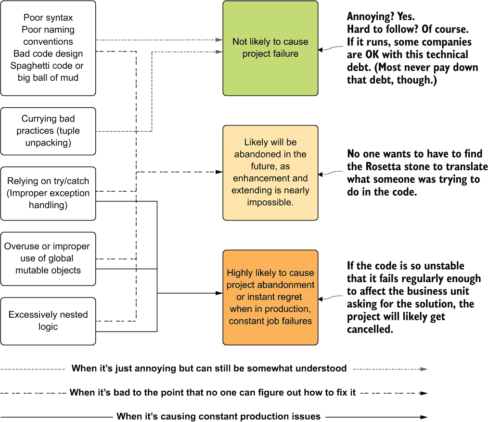
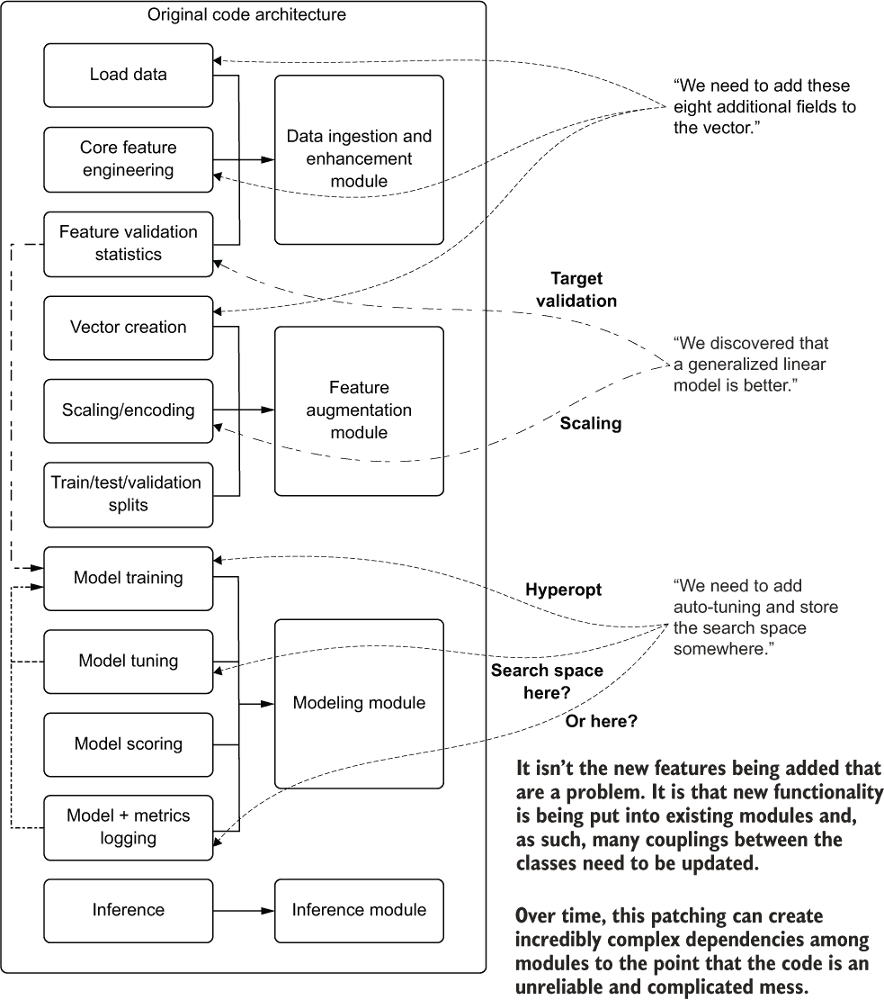
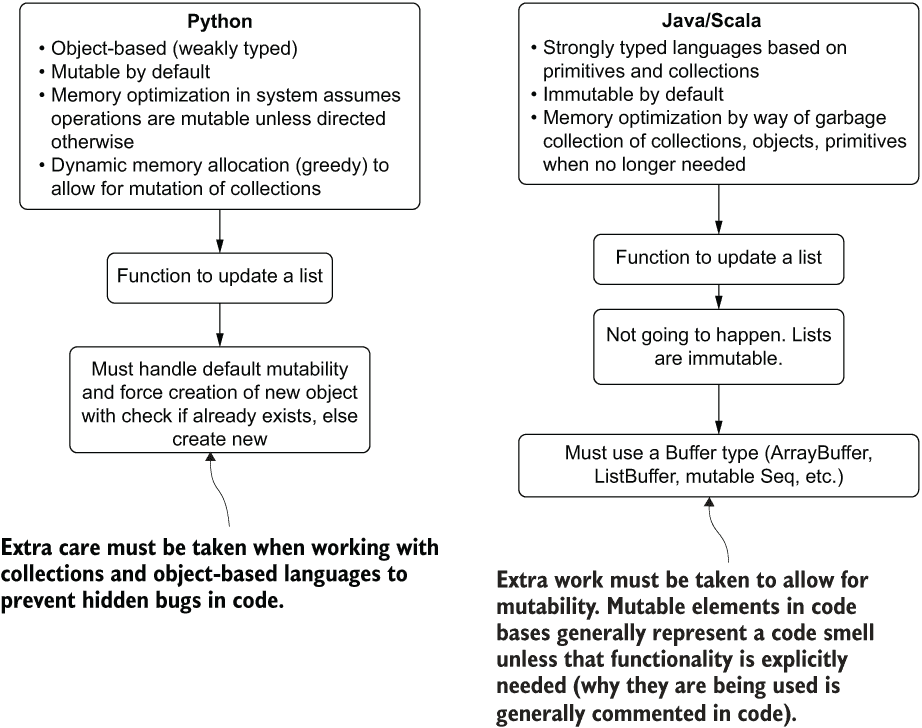

# 10 编码标准和创建可维护的机器学习代码

本章涵盖

+   识别机器学习代码中的问题及其纠正方法

+   在机器学习项目中降低代码复杂性

+   为了更清晰和易于理解的代码进行柯里化

+   在机器学习代码库中应用适当的异常处理

+   理解副作用及其如何导致错误

+   简化嵌套逻辑以提高理解性

在上一章中，我们讨论了代码基础的大致轮廓。通过利用重构和基本的软件工程最佳实践来分解复杂结构，对于进一步讨论机器学习软件开发更详细方面是非常重要的。如果没有建立基本最佳实践的基础，接下来的代码架构和设计元素就无关紧要了。

在软件开发（包括机器学习）的早期阶段，识别实现中潜在问题的能力实际上是不存在的。这是可以理解的，因为知道什么有效什么无效的智慧直接来自于经验。从事软件开发工作的每个人最终都会学到，仅仅因为你可以做某事，并不意味着你应该在代码中这样做。这些教训通常是通过犯很多错误而获得的。

拥有太多上述错误的项目有被放弃的风险。毕竟，如果没有人能够调试代码，更不用说阅读它，那么充斥着技术债务的解决方案能够在生产环境中长时间运行的可能性很小。

本章的目标是确定我在机器学习代码库中看到的最常见问题，这些问题直接影响到解决方案的*稳定性*（以及那些需要维护它的人的一般心理健康）。

## 10.1 机器学习代码中的问题

有时候你看看代码库，就能知道某些地方不对劲。你在格式、集合处理、缺乏适当的递归或死代码数量中看到的问题可以让你对代码库的整体健康状况有一个感觉。如果问题严重，即使是团队中最初级成员也能识别出来。

更隐蔽的问题可能对初级数据科学家来说更难识别，但对团队中的资深成员来说可能很清楚。这些代码中的“问题”（由 Martin Fowler 著名提出）表明了可能出现的潜在严重问题，这些问题可能直接影响到生产稳定性，或者如果出现问题，使得代码几乎无法调试。

表 10.1 列出了我在机器学习代码库中看到的一些更常见的代码异味。虽然列出的这些异味本身并不是灾难性的，但它们通常是“丹麦一切都不好”的第一个迹象。发现这些代码异味通常意味着代码库中可能包含一些可能影响生产稳定性的隐蔽问题。学会识别这些问题，制定计划来解决这些问题的技术债务，并努力学习在机器学习项目中避免这些问题的技术，可以显著减少机器学习团队未来需要进行的重构和修复工作。

表 10.1 机器学习代码库中常见的“非毒性”代码异味

| 代码异味 | 示例 | 为什么它令人厌恶 |
| --- | --- | --- |
| 通配符导入 | from scipy import * | 它会导入包中的所有顶级函数。这可能会在其他导入的库或项目代码库中引起命名空间冲突。 |
| 多重导入 | import numpy as np | 在代码中使用时，混乱且用途不一。 |
|  | from numpy import add | 使代码难以阅读。 |
| 参数过多 | def my_method(df, name,source, fitting, metric,score, value, rename,outliers, train, valid) | 难以阅读、难以维护且令人困惑。表明代码库中存在更深层次的抽象和封装问题。 |
| 复制样板代码 | 训练、测试和推理中的特征工程代码定义在三个不同的地方 | 也称为*散弹手术*——所有地方都需要相同地匹配更改，增加了出错和出现不一致的机会。 |
| 默认 | km = Kmeans() | 默认值通常不是理想的。 |
| 超参数 | km.fit(train) | 在快速原型设计之外看到未调优的模型是危险的。 |
| 变量重用 | pred = lr.predict(test)pred.to_parquet('/<loc>')pred = rf.predict(test)pred.to_parquet('/<loc2>') | 违反了单一职责原则。使代码难以跟踪和调试。可能创建难以修复的状态性错误。添加新功能可能会创建意大利面代码。 |
| 文字常量使用 | profit = 0.72 * revenue | 文字常量是“魔法数字”，当它们散布在代码中时，可能会使更新它们变得噩梦般。这些应该始终定义为命名常量。 |
| 解释代码工作原理的行内注释 | <一些令人厌恶的复杂链式代码> | 如果你需要编写注释来解释代码的工作原理，那么你做错了。任何时候代码变得如此复杂，以至于你需要提醒它是如何工作的，你应该假设没有人能够理解你所写的内容。重构它以减少复杂性。 |
| SQL 没有常用表表达式 (CTEs) | <无封装的临时表定义的链式连接> | CTEs 有助于提高 SQL 的可读性。拥有数百（或数千）行只有单一依赖链的 SQL 代码意味着任何修改（添加或删除列）都可能需要数小时，并且几乎无法调试。 |
| SQL 墙 | <函数无大写，无缩进或换行 SQL> | 所有这三者都难以阅读。 |
| 恒定类型转换 | age = int(age)height = float(height)seniority = int(retirement) - int(age) | 类型转换不会改变。转换一次即可。这表明了编程的幼稚性（“它曾经因为不是整数而抛出异常，所以我会确保所有整数都转换为整数。”）这是没有意义的。 |

本章专注于五种最频繁的“致命”错误。这些问题是导致机器学习代码库根本性损坏的致命问题。看到这些问题可能会意味着每周至少一次的呼叫中心任务。

如果一个项目包含本章中描述的少量问题，这并不保证项目会失败。项目可能难以继续开发，或者维护起来非常不愉快，但这并不意味着它不会运行并实现其预期目的。

然而，如果代码库中充满了多种类型的问题的多个实例，那么在整个值班周都能睡得好的可能性相当渺茫。图 10.1 展示了这些问题严重性与最终项目结果潜在影响之间的关系。



图 10.1 机器学习代码中最常见的五个问题及其与项目结果的关系

我们将在本章的剩余部分探讨这五个主要的不良做法。我们将关注如何修复它们，并讨论为什么它们会对机器学习项目工作造成如此大的损害。

## 10.2 命名、结构和代码架构

在值班支持中，有人会经历一些更加疲惫和令人恐慌的情况，比如意识到刚刚崩溃并需要调查的工作是“那个”工作。这段代码如此混乱、复杂和修补，以至于当它崩溃时，通常需要原始作者回来修复它。更糟糕的是，知道那个人两个月前就离开了公司。现在你必须修复他们的代码。

深入研究后，你看到的只是作为变量名的晦涩缩写，函数内部的庞大代码墙，随意添加的数十个无关的方法的类，无用的内联注释，以及数千行被注释掉的代码。这基本上是两种世界最糟糕的结合：既有 *意大利面代码*（代码中的控制流组织得像意大利面碗中的面条一样）又有 *泥球*（实际上是一团意大利面的泥潭，有重复的代码、全局引用、死代码，并且没有明显的架构设计以供维护）。

很多的机器学习代码看起来都像这样，不幸的是，诊断和重构可能会非常令人沮丧。让我们看看一些关于命名、结构和架构的不良习惯，以及那些不良实践的更好替代方案。

### 10.2.1 命名约定和结构

命名变量可能是一项有点棘手的练习。一些思想流派遵循“少即是多”的哲学，认为最简洁（最短）的代码是最好的。其他人，包括我自己，在编写非机器学习代码时，倾向于坚持更详尽的命名约定。如第九章所述，计算机根本不在乎你如何命名事物（只要你不像列表 10.1 中所示，使用保留关键字作为结构变量名）。

让我们看看一些命名问题的密集表示。从懒惰的缩写（简写占位符变量名）到难以理解的密码式名称，以及一个保留的函数名，这个列表有很多问题。

列表 10.1 坏的命名约定

```
import functools
import operator
import math
gta = tuple([1,2,3,4])                                                ❶
abc = list(range(100))                                                ❷
REF_IND_24G_88A = list(zip(abc, list(range(0, 500, 5))))              ❸
tuple = [math.pow(x[0] - x[1],2) for x in REF_IND_24G_88A]            ❹
rtrn = math.sqrt(functools.reduce(operator.add, tuple) / len(tuple))  ❺
rtrn                                                                  ❻
> 229.20732972573106                                                  ❼
gta                                                                   ❽
> (1, 2, 3, 4)                                                        ❾
another_tuple = tuple([2,3,4]                                         ❿
> TypeErrorTraceback (most recent call last)
<ipython-input-9-e840d888412f> in <module>
----> 1 another_tuple = tuple([2,3,4])
TypeError: 'list' object is not callable                              ⓫
```

❶ 使用内置语言函数 tuple()定义一个元组，该函数接受一个可迭代对象（在这里，是一个列表）。变量定义并没有说明这个用途是什么。

❷ 生成一个数字列表。变量名“abc”只是懒惰的表现。

❸ 创建一个合并列表，包含其他每个列表。在这个语句中定义列表很难阅读，并增加了代码的复杂性。变量名像缩写汤，对阅读代码的人没有任何帮助。

❹ 计算两个数字列表的平方误差。变量名是危险的，因为它是一个保留的函数名，现在在这个上下文中将被覆盖。

❺ 计算均方根误差（RMSE），但定义的变量只是对保留语言特性（“返回”）的一个简写名称。

❻ 将值报告到标准输出（仅用于演示目的）

❼ 两个序列的均方根误差（RMSE）

❽ 现在调用之前定义的元组 gta，看看它在执行时生成了什么

❾ 在 gta 声明中定义元组时的预期结果

❿ 现在尝试生成另一个元组

⓫ 哎呀！为什么它不起作用？好吧，我们用列表定义覆盖了语言函数 tuple。由于 Python 中几乎所有东西都是可变的、弱类型的和基于对象的，如果我们不小心，甚至可以覆盖语言本身的本质。

这明显是一个夸张的例子，将多个不良实践压缩到一个单独的块中。你很少有机会在“野外”看到这样的东西，但这些问题中的每一个都出现在我见过的代码库中。

在这里提出的所有问题中，保留名称的使用可能是最隐蔽的。这不仅在大型的代码库中难以检测，而且可能会对未来的功能开发造成破坏。我无法强调避免使用不具体的变量名称的重要性，尤其是在像 Python 这样的语言中，因为你可以用看似无害的快捷命名覆盖核心功能。

虽然在编译型语言中这并不是一个问题（毕竟编译器不会允许将受保护的方法重新赋值为你定义的内容），但它可以通过无意中覆盖具有依赖性的方法而引入。虽然 JVM 语言会检测并禁止从超类中混合不正确覆盖的特性，但在开发过程中方法命名不当可能会导致浪费无数小时追踪构建失败的原因。

### 10.2.2 试图过于聪明

没有奖项，也永远不会有为使用最少的按键来开发软件而设立的奖项。试图通过看到代码可以多么紧凑和简洁来表现聪明，对解释型语言的代码运行效率没有任何帮助。它唯一达到的效果是激怒了不得不阅读代码的其他人。

注意：代码风格和可理解的结构对人类有益。计算机不在乎你的链式操作有多花哨，但其他人会。他们会因为这种聪明而讨厌你。

列表 10.2 展示了尝试创建最密集和高效代码的例子。虽然它在技术上正确，并且会导致计算均方根误差，但它几乎无法阅读。

编写这样的代码对性能没有任何帮助。作者可能会觉得自己通过编写他们认为高效的代码而变得更聪明，但事实并非如此。这样的代码让其他人难以理解发生了什么，修改起来会非常困难，并且限制了调试的能力。

列表 10.2 复杂的单行代码

```
rmse = math.sqrt(functools.reduce(operator.add, [math.pow(x[0] - x[1], 2) for x in list(zip(list(range(100)), list(range(0,500,5))))]) / 100)       ❶
```

❶ 边界故意混淆的功能。编写这样的代码对你自己或任何人都没有好处。它很密集，难以阅读，需要大量的脑力才能弄清楚它在做什么（即使它被正确命名）。

这种高效的单行编码风格需要非常关注每个元素，以便拼凑出所有发生的操作。幸运的是，这个例子中正在执行一个简单的逻辑集。我之前在 IDE 中见过单行代码长达数十行，这样的代码对任何人都没有好处。

以下是以更干净、更直接的方式编写此功能块的方法。虽然仍然不是最佳选择，但它达到了更高的可读性。

列表 10.3 正确命名和结构化的版本

```
first_series_small = list(range(100))
larger_series_by_five = list(range(0, 500, 5))                               ❶
merged_series_by_index = list(zip(first_series_small, larger_series_by_five))❷
merged_squared_errors = [math.pow(x[0] - x[1],2) for x in merged_series_by_index]
merged_rmse = math.sqrt(functools.reduce(operator.add, merged_squared_errors) / len(merged_squared_errors))                                             ❸
```

❶ 更清晰的变量名称，以纯文本形式解释变量指向的值

❷ 通过在变量名中描述正在发生的事情，代码可以更容易地被扫描。而不是一个令人困惑的名字，这个名字在这个操作的状态下没有任何意义，说明正在做什么会使阅读代码变得容易得多。

❸ 正确命名最终操作，使其基于定义的逻辑成为一个特定的计算值，这使得整个块更容易理解。

然而，编写此代码的正确方式在列表 10.4 中展示。不仅变量名清晰，我们没有重新实现标准包中已经存在的功能。为了使代码尽可能简单和易读，不要试图重新发明轮子。

列表 10.4 应该如何编写

```
import numpy as np
from sklearn.metrics import mean_squared_error                              ❶

def calculate_rmse_for_generated_sequences(**kwargs):
    first_sequence = np.arange(kwargs['seq_1_start'], kwargs['seq_1_stop'],  ❷
        kwargs['seq_1_step'], float)
    second_sequence = np.arange(kwargs['seq_2_start'], kwargs['seq_2_stop'], 
        kwargs['seq_2_step'], float)
    return mean_squared_error(first_sequence, second_sequence, squared=False)❸

calculate_rmse_for_generated_sequences(**{'seq_1_start': 0, 'seq_1_stop': 100,
                                          'seq_1_step': 1, 'seq_2_start': 0,
                                          'seq_2_stop': 500, 'seq_2_step': 5})
> 229.20732972573106
```

❶ RMSE 方程由 scikit-learn 贡献团队慷慨提供并维护。他们当然知道自己在做什么，你应该相信他们的模块是正确工作的。

❷ 在函数或方法中硬编码值是一个反模式（除了在 mean_squared_error 函数中，我们通过将标志设置为 False 来强制特定的功能），因此我们允许生成器通过传入的配置计算生成的序列的不同值。

❸ 将均方误差函数（MSE）的平方参数标志设置为 False，你就有了 RMSE

### 10.2.3 代码架构

代码架构是一个有争议的话题。虽然许多人吹嘘他们有一个理想的方法，但关于什么使得代码库中的逻辑布局好的唯一有效答案是*团队可以维护的那个*。我已经数不清有多少次在项目完成前，我工作过或看到过某个人的理想仓库结构，它如此过度工程化，以至于团队在项目完成前都难以将其代码合并进去。

为项目定义一个良好意图但过于复杂的仓库结构的不幸结果是，适当的抽象发生了崩溃。随着机器学习项目的发展过程，为了解决解决方案的需求而创建额外的功能，新的功能最终被挤入原本不会放置的地方。到开发周期结束时，代码库变得无法导航，如图 10.2 所示。



图 10.2 一个经过深思熟虑的仓库设计和代码架构可能会逐渐变得混乱和令人困惑。

在这个例子中，需要向代码中添加一系列三个主要的功能更新。每个贡献者都试图弄清楚他们的功能分支代码应该放在哪里，这是基于项目开始时构建的现有线框图。向向量添加更多功能的第一个改进并不令人困惑。仓库结构已经明确定义了专门用于此的模块。

第二个更改，即对模型家族的修改，涉及替换之前使用的模型。只要原始模型的核心代码，在更改之前就已经存在，完全从代码库中移除，并且死代码被移除而不是仅仅注释掉，这种重构形式是完全可以接受的。然而，作为模型更改的一部分，需要一种验证检查的新功能。这个功能应该放在哪里？

贡献者最终将这个新功能强行加入到功能验证统计类中。这现在在功能相关统计和新目标相关统计之间创建了一个紧密的功能耦合。

虽然这两个操作确实都在进行数据的统计验证，但所执行的算法、验证和操作之间没有任何关系。此外，为了将这个功能集成到现有的类中，签名需要更改以适应两种用例。这是一个明显的代码混乱案例：完全无关的代码和修改被用来“猴子补丁”功能，最终使代码更加脆弱、更加混乱，并且在未来更难修改。由于新功能必须被考虑，对这个类的测试也将变得更加困难。这纯粹是工作量大于其价值。贡献者应该用这个新功能创建一个*新模块*，其中包含一个（或多个）支持目标统计验证需求的类。

需要做的最后一个更改，即添加 Hyperopt 以自动调整模型，迫使团队成员执行一个高度复杂的重构。他们更新了模型训练模块以支持这一点，这是合理的。然而，搜索空间配置应该被外部化到不同的模块。将无关的功能加载到指标、参数和监控模块中只会创建一个混乱的代码库。这将使同行评审（PR）过程更加复杂，使未来的功能工作更具挑战性，并迫使编写更复杂的单元测试以确保适当的代码覆盖率。

在这里要讲得非常清楚，我并不是在提倡对特定的代码架构进行僵化的遵循，也不是在 MVP 阶段项目结束时坚持任何设计。代码应该始终自然地增长；重构、改进、添加功能、移除功能以及维护代码库的过程应该被所有从事软件开发工作的人所接受。

然而，有一些方法可以使代码库可维护，也有一些方法会使它变得破碎、复杂和混乱。如果你正在更改现有功能或添加一个仅限于当前类或模块封装的新功能，你应该在该模块内编写你的功能。然而，如果更改非常大（可以抽象成其自己的模块的全新功能）或涉及与代码库中分散的许多其他类和模块进行通信，请为自己和你的团队做点好事，只需创建一个新的模块。

## 10.3 元组解包及可维护的替代方案

假设我们正在处理一个相对复杂的处于生产状态的 ML 代码库。我们已经创建了功能分支，并准备实施改进。我们正在处理的工作单，向核心模块添加统计测试，需要向评分方法添加另一个返回值。

看看现有的方法，我们看到返回的是一个值的元组，目前有三个。在添加额外的逻辑并更新返回元组以包含额外的变量后，我们转向需要新返回值的代码部分。在更新我们的功能分支目标消费此方法的返回结构后，我们在我们的功能分支上运行测试。

所有的东西都崩溃了。即使代码库中的其他地方不需要这个新变量，即使它们没有使用它，仍然需要捕获增加的返回值。幸运的是，有一个通过位置引用解决这种 curry 返回值问题的解决方案：元组解包。

### 10.3.1 元组解包示例

让我们看看列表 10.5 中的简单数据生成器。在这段代码中，我们使用逻辑映射函数生成一系列数据，可视化它，并返回图表对象和序列（这样我们就可以根据配置的值对其进行统计分析）。

列表 10.5 带元组返回的逻辑映射数据生成器

```
import matplotlib.pyplot as plt
import numpy as np

def logistic_map(x, recurrence):                                ❶
    return x * recurrence * (1 - x)

def log_map(n, x, r, collection=None):                          ❷
    if collection is None:
        collection = []
    calculated_value = logistic_map(x, r)
    collection.append(calculated_value)
    if n > 0:
        log_map(n-1, calculated_value, r, collection)
    return np.array(collection[:n])

def generate_log_map_and_plot(iterations, recurrence, start):   ❸
    map_series = log_map(iterations, start, recurrence)
    with plt.style.context(style='seaborn'):
        fig = plt.figure(figsize=(16,8))
        ax = fig.add_subplot(111)
        ax.plot(range(iterations), map_series)
        ax.set_xlabel('iterations')
        ax.set_ylabel('logistic map values')
        ax.set_title('Logistic Map with recurrence of: {}'.format(recurrence))
    return (map_series, fig)                                    ❹

log_map_values_chaos, log_map_plot_chaos = generate_log_map_and_plot(1000, 3.869954, 0.5)                                             ❺
```

❶ 用于递归先前值的逻辑映射函数

❷ 通过对每个先前值应用逻辑映射方程生成序列的尾递归函数

❸ 生成序列的函数以及一个展示特定递归值对序列影响的图表

❹ 元组返回类型。这并不是一个特别严重的复杂性展示，即在函数中传递结果，但它仍然需要了解函数签名才能使用。它还要求对每个函数将被调用的位置进行位置引用（在函数的返回类型和它在代码中使用的每个地方之间创建了一个紧密耦合的结构）。

❺ 使用元组解包返回值调用函数，直接将它们分配给变量

注意：关于这些示例的结果，请参阅本书配套仓库中该章节的 Jupyter 笔记本，仓库地址为[`github.com/BenWilson2/ML-Engineering`](https://github.com/BenWilson2/ML-Engineering)。

使用`generate_log_map_and_plot()`函数指定的两个返回值，从使用和维护的角度来看，保持正确的引用并不是一个过于复杂的负担。然而，当返回值的大小和复杂性增加时，使用该函数变得越来越困难。

作为函数复杂返回类型的示例，请参阅列表 10.6。这个简单的单变量序列统计分析生成复杂的输出。虽然利用分组元组使其更容易使用的意图是存在的，但它仍然过于复杂。

列表 10.6 具有噩梦般元组解包的统计分析函数

```
def analyze_series(series):                                                ❶
    minimum = np.min(series)
    mean = np.average(series)
    maximum = np.max(series)
    q1 = np.quantile(series, 0.25)
    median = np.quantile(series, 0.5)
    q3 = np.quantile(series, 0.75)
    p5, p95 = np.percentile(series, [5, 95])
    std_dev = np.std(series)
    variance = np.var(series)
    return ((minimum, mean, maximum), (std_dev, variance), (p5, q1, median,❷
      q3, p95))                                                            ❷

get_all_of_it = analyze_series(log_map_values_chaos)                       ❸
mean_of_chaos_series = get_all_of_it[0][1]                                 ❹
mean_of_chaos_series
> 0.5935408729262835

((minimum, mean, maximum), (std_dev, variance), (p5, q1, median, q3, p95)) = analyze_series(log_map_values_chaos)                                  ❺
```

❶ 用于收集数据序列统计信息的函数

❷ 该函数调用方将强制使用位置（或复杂定义的返回）的复杂分组嵌套元组返回类型

❸ 使用一个对象来在单个变量中持有整个返回结构

❹ 使用位置记法和嵌套来从返回结构中返回特定元素。这非常脆弱且难以使用。大多数时候，当使用这种方法时，如果这个函数发生变化，这些值在重构时会被忽略，导致令人困惑的异常或错误的计算。

❺ 扩展元组的替代访问模式。这只是丑陋的代码，难以维护。当底层函数发生变化时，这个紧密耦合的签名将抛出 ValueError 异常，解包计数与预期不符。

以这种方式编写代码存在其他问题，而不仅仅是需要查看源代码才能使用它。当这个函数需要更改时会发生什么？如果我们不仅需要评估序列的 95 百分位数，还需要计算 99 百分位数，我们把这个放在结构中的哪个位置呢？

如果我们更新返回签名，那么我们就必须更新使用此函数的每个地方。这根本不是一种从函数中提取数据以供其他地方使用的可用形式。它还以使整个代码库更加脆弱、更难以维护和调试测试的方式增加了代码的复杂程度。

### 10.3.2 元组解包的可靠替代方案

列表 10.7 展示了该问题的解决方案，使用了一种类似于用于另一种主导机器学习语言（Scala，通过使用案例类）的结构和方法。在这个列表中，我们使用*命名元组*来处理返回类型结构，使我们能够使用命名引用来访问结构内部的数据。

这种方法使代码具有前瞻性，因为任何对返回结构的修改都不需要在使用位置定义消费模式。它也更容易实现。使用这些结构就像使用字典（使用类似的底层结构），但由于位置命名实体记号，它们比字典有更多的语法糖感。

列表 10.7 使用命名元组重构序列和绘图生成器

```
from collections import namedtuple                                         ❶

def generate_log_map_and_plot_named(iterations, recurrence, start):
    map_series = log_map(iterations, start, recurrence)
    MapData = namedtuple('MapData', 'series plot')                         ❷
    with plt.style.context(style='seaborn'):
        fig = plt.figure(figsize=(16,8))
        ax = fig.add_subplot(111)
        ax.plot(range(iterations), map_series)
        ax.set_xlabel('iterations')
        ax.set_ylabel('logistic map values')
        ax.set_title('Logistic Map with recurrence of: {}'.format(recurrence))
    return MapData(map_series, fig)                                        ❸

other_chaos_series = generate_log_map_and_plot_named(1000, 3.7223976, 0.5) ❹
other_chaos_series.series                                                  ❺

> array([0.9305994 , 0.24040791, 0.67975427, 0.81032278, 0.57213166,
       0.91123186, 0.30109864, 0.78333483, 0.63177043, 0.86596575, ...])
```

❶ 导入标准集合库以访问命名元组

❷ 定义我们将用于在元组返回类型内进行命名访问的命名元组

❸ 创建一个新的命名元组 MapData 实例，并将要从函数中返回的对象放置在定义的命名元组结构中

❹ 返回签名现在是一个单一元素（当使用函数时，代码看起来更干净），但它不再需要位置记号来访问元素。

❺ 通过我们作为命名元组集合定义的一部分定义的命名元素访问返回变量中的单个值。

现在我们有一个简单的示例，展示了如何从列表 10.5 中的序列生成和绘图重构，让我们看看如何使用具有定义结构的命名元组方法帮助我们处理列表 10.6 中的更复杂的返回类型，如以下列表所示。

列表 10.8 使用命名元组重构统计属性函数

```
def analyze_series_legible(series):
    BasicStats = namedtuple('BasicStats', 'minimum mean maximum')               ❶
    Variation = namedtuple('Variation', 'std_dev variance')
    Quantiles = namedtuple('Quantiles', 'p5 q1 median q3 p95')
    Analysis = namedtuple('Analysis', ['basic_stats', 'variation', 'quantiles'])❷
    minimum = np.min(series)
    mean = np.average(series)
    maximum = np.max(series)
    q1 = np.quantile(series, 0.25)
    median = np.quantile(series, 0.5)
    q3 = np.quantile(series, 0.75)
    p5, p95 = np.percentile(series, [5, 95])
    std_dev = np.std(series)
    variance = np.var(series)
    return Analysis(BasicStats(minimum, mean, maximum), 
                    Variation(std_dev, variance), 
                    Quantiles(p5, q1, median, q3, p95))

bi_cycle = generate_log_map_and_plot_named(100, 3.564407, 0.5)                  ❸
legible_return_bi_cycle = analyze_series_legible(bi_cycle.series)               ❹
legible_return_bi_cycle.variation.std_dev                                       ❺
> 0.21570993929353727
```

❶ 定义用于分析每个组件的命名元组

❷ 命名元组可以嵌套以将类似的数据返回类型聚集在一起。

❸ 生成序列数据

❹ 调用函数并传入生成函数返回的命名引用序列数据

❺ 提取嵌套命名元组变量的数据

通过使用命名结构，在重构代码时，你为自己和他人减少了工作量，因为你不必更改函数或方法的全部调用实例。此外，代码的阅读性也大大提高。提高代码的可读性可能不会减少代码执行的操作的复杂性，但它可以保证使你的代码*远没有那么复杂*。

许多机器学习 API 利用元组解包。通常，元组限制为不超过三个元素以减少最终用户的困惑。跟踪三个元素似乎并不复杂（大部分情况下）。但是，使用位置引用从函数或方法返回元素变得麻烦，因为代码必须在这些代码被调用的每个地方反映这些位置返回。

元组解包最终会增加阅读和维护代码的人的困惑程度，并提高代码库的整体复杂性。通过转向封装的返回类型（Python 中的命名元组，Scala 中的 case 类），我们可以最小化在功能分支中需要更改的代码行数，并减少对代码的解释困惑。

## 10.4 对问题视而不见：吞噬异常和其他不良做法

让我们继续我们的场景，即进入一个我们不熟悉的代码库，通过关注运行我们的第一个功能分支的全面测试来集中精力。作为这个分支的一部分，我们必须使用一个为与对象存储数据湖接口而编写的数据加载模块。由于该模块的文档不佳和难以阅读的代码，我们错误地传递了错误的认证令牌。在执行我们的分支时，Stderr 和 stdout 仅打印出一行：`Oops.``Couldn't``read``data.`。

这不仅非常令人烦恼（可爱的错误消息没有用），而且它没有提供任何关于*为什么*数据无法读取的指导。数据是否存在？我们传递了无效的路径吗？我们是否有权访问这些数据？新功能分支中数据加载类的方法使用是否不规范？

没有加载和解析系统上的日志，我们根本无法知道。我们必须追踪、修改我们的代码，插入调试语句，并花费数小时深入挖掘我们的代码和实用模块代码，以找出发生了什么。我们不知不觉成为了*异常吞噬*的受害者：这是一种错误的意图，通过不恰当地使用 try/catch 块来“仅仅让它工作”。

### 10.4.1 使用猎枪精度的 try/catch

在开发机器学习代码时，养成的一个更危险的不良习惯是在异常处理方面。这个软件开发领域通常与大多数数据科学家在尝试解决问题时编写代码的方式不同。

通常，当编写代码时发生错误，问题会得到解决，然后继续解决其他问题。然而，在生产代码领域，代码库中可能发生许多错误。可能传递的数据不规范，数据规模变化到一定程度，计算不再有效，或者可能发生数百万种可能出错的情况之一。

我看到许多人将看似无害的故障周围的 try/catch 快速贴上。然而，如果不完全理解如何实现特定异常的处理，可能会导致使用*盲目捕获*，这可能会使代码库难以调试。

注意：有关异常处理不当可能导致问题的逐步示例，请参阅本书的配套仓库，并跟随 Jupyter 笔记本 CH09_1.ipynb。

列表 10.9 说明了这个概念。在这个简单的例子中，我们正在取一个整数并除以一个整数列表。我们希望从这个函数中得到一个新的集合，表示基数除以传入集合的每个成员的商。函数下面的结果显示了执行代码的必然结果：一个`ZeroDivisionError`。

列表 10.9 一个简单的集合除法函数，它将抛出异常

```
import random
numbers = list(range(0, 100))                           ❶
random.shuffle(numbers)                                 ❷
def divide_list(base, collection):                      ❸
    output = []
    for i in collection:                                ❹
        output.append(base / i)                         ❺
    return output
blown_up = divide_list(100, numbers)                    ❻
> ZeroDivisionErrorTraceback (most recent call last)    ❼
<ipython-input-140-3ed60281fb4b> in <module>
----> 1 blown_up = divide_list(100, numbers)
<ipython-input-75-a0ad45358f8f> in divide_list(base, collection)
      2     output = []
      3     for i in collection:
----> 4         output.append(base / i)                 ❽
      5     return output
ZeroDivisionError: division by zero                     ❾
```

❶ 生成一个介于 0 和 99 之间的数字列表，包括 0 和 99

❷ 在原地打乱以提供生成的整数列表的随机排序

❸ 函数定义——base 的签名是用于除以集合变量内容的数字

❹ 遍历集合中的每个元素

❺ 将基数和列表集合实体的迭代器值在位置 i 的商追加到列表中

❻ 调用函数

❼ 异常抛出的 stdout 结果。堆栈跟踪显示在以下标题下方。

❽ 识别出问题的代码行

❾ 与异常相关的 ZeroDivisionError 异常类名称和消息

我看到许多数据科学家（DSs）用来解决这个问题的“盲目捕获”（也称为“吞噬”所有异常）的解决方案可能看起来像以下列表。为了清楚起见，这绝对不应该这样做。

列表 10.10 不安全的异常处理示例

```
def divide_list_unsafe(base, collection):
    output = []
    for i in collection:
        try:                            ❶
            output.append(base / i)
        except:                         ❷
            pass                        ❸
    return output
```

❶ try 块尝试执行封装的操作，但如果抛出异常（引发），它将移动到 except 块。

❷ 包含处理特定异常的代码的 except 块。这种实现（盲目捕获）是危险的、不充分的，并会导致稳定性和故障排除问题（这实际上是在代码中直接写入错误）。

❸ 危险的“pass”（什么都不做）命令对于无状态事务系统（例如 Web 应用程序）可能是有用的，但不应该在 ML 代码中使用。

当我们运行此代码针对我们的列表时，我们将得到一个包含 99 个数字的列表的返回值，减去抛出异常并被忽略的 0 值，因为使用了`pass`关键字。虽然这看起来像解决了问题并允许执行继续，但这实际上是一个**真正糟糕的解决方案**。以下列表说明了原因。

列表 10.11 盲目异常处理的例子

```
broken = divide_list_unsafe('oops', numbers)   ❶
len(broken)                                    ❷
> 0                                            ❸
```

❶ 传入一个要除以的字符串。这显然不会工作（它将抛出 TypeError）。

❷ 由于我们捕获了所有异常并且只是继续执行（使用 pass 关键字），没有异常被抛出以警告我们某些事情没有正常工作。

❸ 列表为空。这可能会破坏下游的操作。

当我们将非数字传递给此函数时，我们不会得到任何错误。没有抛出任何异常来警告我们返回值是一个空列表。我们可以尝试捕获确切的异常，这样就不会发生类似的情况，使我们能够有效地忽略问题。

捕获所有异常的问题

虽然列表 10.11 中的例子很明显，相当简单，在功能上有些无意义，但这类模式在现实世界中的实例却以真正丑陋的方式出现。

假设你在机器学习项目的绝大多数代码周围编写了一系列盲目的 try/catch 语句。从读取源数据，执行特征工程任务，模型调优，验证和日志记录，每个主要步骤都被包裹在一个 `try`，`except`，然后 `pass` 语句中。如果数据在编码步骤中出现问题会发生什么？关于读取源数据的过期认证令牌呢？如果数据被移动，而你正在读取的位置现在是空的怎么办？如果模型未能收敛呢？

我试图说明的是，对于调查为什么工作没有产生任何输出的人来说，这些场景看起来都是相同的。唯一的指示是工作没有完成它应该做的事情。由于所有异常都被吞噬了，根本没有任何迹象表明从哪里开始寻找问题的根源。

正是因为这个原因，盲目捕获异常是如此危险。在任何长期运行的项目代码库中，未来某个时刻都会出现问题。工作可能会因为各种原因失败。如果你阻碍了自己找出问题的能力，你将不得不手动逐行代码或执行某种二分搜索来追踪发生了什么。以这种方式找出问题会浪费精力和时间。

即使编写适当的异常处理可能看起来更费事，但这确实是正确的事情。当代码最终崩溃——相信我，它会的，因为给足够的时间，所有代码库都会崩溃——当你用额外的 30 分钟编写适当的处理代码，让你在几分钟而不是几天内找到问题的根源时，你会感到非常感激。

### 10.4.2 精确的异常处理

下一个列表展示了正确按类型捕获异常的方法。

列表 10.12 安全地捕获和处理单个异常

```
def divide_list_safer(base, collection):
    output = []
    for i in collection:
        try:
            output.append(base / i)
        except ZeroDivisionError as e:                                     ❶
            print("Couldn't divide {} by {} due to {}".format(base, i, e)) ❷
    return output

safer = divide_list_safer(100, numbers) 
> Couldn’t divide 100 by 0 due to division by zero                         ❸
len(safer) 
> 99                                                                       ❹
```

❶ 捕获了我们想要的精确异常（ZeroDivisionError）并获取了对异常对象的引用（e）

❷ 对异常的处理不够理想（我们仍然通过在发生时将其打印到标准输出而有效地忽略它，但至少我们对它做了些处理）。适当的做法是将错误记录到日志服务或 MLflow。

❸ 调用该函数不会抛出可中断的异常，但它确实让我们知道发生了什么。

❹ 它丢失了一个元素（零整数），但处理了输入列表中剩余的 99 个元素。

这虽然引入了一个新问题。我们有了生成的警告信息，但它被打印到了标准输出。在需要历史记录来排查问题的生产系统中，这并不能帮助我们。

我们需要有一个集中的地方来查看这些问题发生时的*什么*、*哪里*和*何时*的细节。我们还需要确保，至少我们有一个可解析的标准日志格式，这样可以减少搜索日志文件以跟踪问题所花费的时间。

### 10.4.3 正确处理错误

以下列表显示了此异常处理场景的最终实现，包括自定义异常、日志记录和对除以零错误的控制处理。

列表 10.13 带有适当异常处理和日志记录的最终实现

```
from importlib import reload
from datetime import datetime
import logging
import inspect

reload(logging)
log_file_name = 'ch9_01logs_{}.log'.format(datetime.now().date().strftime('%Y-%m-%d'))
logging.basicConfig(filename=log_file_name, level=logging.INFO)          ❶

class CalculationError(ValueError):                                      ❷
    def __init__(self, message, pre, post, *args):
        self.message = message
        self.pre = pre
        self.post = post
        super(CalculationError, self).__init__(message, pre, post, *args)

def divide_values_better(base, collection):
    function_nm = inspect.currentframe().f_code.co_name                  ❸
    output = []
    for i in collection:
        try:
            output.append(base / i)
        except ZeroDivisionError as e:                                   ❹
            logging.error(
                "{} -{}- Couldn't divide {} by {} due to {} in {}".format(
                    datetime.now(), type(e), base, i, e, function_nm)
            )
            output.append(0.0)
        except TypeError as e:                                           ❺
            logging.error(
                "{} -{}- Couldn't process the base value '{}' ({}) in {}".format(
                datetime.now(), type(e), base, e, function_nm)
            )                                                            ❻
            raise e                                                      ❼
    input_len = len(collection)                                          ❽
    output_len = len(output)
    if input_len != output_len:
        msg = "The return size of the collection does not match passed in collection size."
        e = CalculationError(msg, input_len, output_len)                 ❾
        logging.error("{} {} Input: {} Output: {} in {}".format(
            datetime.now(), e.message, e.pre, e.post, function_nm
        ))                                                               ❿
        raise e                                                          ⓫
    return output

placeholder = divide_values_better(100, numbers)
len(placeholder)
> 100                                                                    ⓬
```

❶ 这三条线仅适用于 Jupyter Notebook 功能。在一个.egg 文件中，你只需实例化一个新的日志实例（然而，Jupyter 在初始化会话时会为你启动一个）。

❷ 创建一个自定义异常类，具有从标准 ValueError 异常继承属性的能力，并提供*args 以允许其他开发人员扩展或自定义此异常类

❸ 获取当前函数名称以进行日志记录（防止在多个地方手动输入名称）

❹ 捕获除以零异常，记录它，并提供一个占位符值

❺ 捕获基于传入数据的数学无效操作的 TypeError

❻ 在做任何事情之前记录 TypeError 异常（以便我们有可见性知道它发生了）

❼ 在记录异常后，我们希望手动抛出它，以便函数会提醒与它交互的开发者，他们确实应该向此函数传递数值类型的基变量。

❽ 获取输入列表“collection”的长度和循环后的输出列表长度

❾ 如果列表大小不匹配，创建我们的自定义异常类的对象

❿ 记录我们自定义异常的详细信息

⓫ 抛出自定义异常

⓬ 由于我们在输出列表中将失败的除以零错误替换为 0.0，我们的列表长度匹配（100）。

在这一点上，当我们用有效的集合（包含零或不包含零）运行函数时，我们将得到每个被替换实例的日志报告。当我们用无效的值调用函数时，我们将记录异常并抛出（期望的行为）。最后，当列表不匹配是因为对函数的将来修改（例如捕获新的异常而不替换值或修改逻辑行为）时，进行这些更改的人将以明确的方式被提醒他们的更改引入了错误。

以下列表显示了在原始配置下运行此代码的日志结果，测试作为基参数提供的无效字符串参数，并模拟长度不匹配的情况。

列表 10.14 捕获和处理异常的日志结果

```
def read_log(log_name):                                                  ❶
    try:
        with open(log_name) as log:
            print(log.read())
    except FileNotFoundError as e:                                       ❷
        print("The log file is empty.")

read_log(log_file_name)
>
ERROR:root:2020-12-28 21:01:21.067276 -<class 'ZeroDivisionError'>- Couldn't divide 100 by 0 due to division by zero in divide_values_better  ❸
ERROR:root:2020-12-28 21:01:21.069412 The return size of the collection does not match passed in collection size. Input: 100 Output: 99 in divide_values_better                                      ❹
ERROR:root:2020-12-28 21:01:24.672938 -<class 'TypeError'>- Couldn't process the base value 'oops' (unsupported operand type(s) for /: 'str' and 'int') in divide_values_better                                 ❺
```

❶ 非常简单的函数，用于读取日志文件

❷ 我们甚至处理了 open()函数预期的异常，这样如果日志文件尚未生成（因为函数使用中没有出现任何问题），我们不会抛出一个对函数最终用户来说不清楚的讨厌异常。相反，会打印出一个简单的解释，让我们知道日志尚未创建。

❸ 我们期望从传递包含数字 0 的整数集合列表中获得的异常

❹ 在处理零除错误时，从捕获块中移除“替换为 0.0”功能的结果

❺ 将无效值作为函数的基数参数传递时的记录结果（这也会在运行时抛出异常，但已经在日志中记录了异常）

记录即使是看似不重要的错误，在开发过程中也可能是一个非常有价值的工具，用于解决生产中的问题。无论您是想修复麻烦问题的根本原因还是检查代码库的健康状况，如果没有日志和适当的数据写入其中，您可能完全不知道解决方案代码中可能存在的潜在问题。当有疑问时，记录下来。

## 10.5 使用全局可变对象

在继续探索我们新团队现有的代码库时，我们正在处理要添加的另一个新功能。这个功能添加了完全新的功能。在开发过程中，我们意识到我们分支所需的大部分逻辑已经存在，我们只需要重用几个方法和一个函数。我们没有看到的是，该函数使用了一个全局作用域变量的声明。当我们通过单元测试单独运行我们分支的测试时，一切工作正如预期。然而，整个代码库的集成测试产生了不合理的成果。

经过数小时在代码中搜索，跟踪调试跟踪后，我们发现我们使用的函数的状态实际上从第一次使用后发生了变化，该函数使用的全局变量实际上也发生了变化，这使得我们对它的第二次使用完全错误。我们被突变烧伤了。

### 10.5.1 可变性如何烧伤你

认识到可变性有多危险可能有点棘手。过度使用可变值、状态转换和数据覆盖可以有多种形式，但最终结果通常是相同的：一系列极其复杂的错误。这些错误可以以不同的方式表现出来：*海森堡虫*似乎在你试图调查它们时消失了，而*曼德尔虫*如此复杂和非确定性，以至于它们似乎像分形一样复杂。重构充满变动的代码库是非平凡的，很多时候从头开始重新开始更容易来修复设计缺陷。

可变性和副作用的问题通常在项目的初始 MVP（最小可行产品）之后很久才会显现出来。后来，在开发过程中或生产发布之后，依赖于可变性和副作用的代码库开始出现裂缝。图 10.3 展示了不同语言及其执行环境之间的细微差别，以及为什么可变性问题可能并不那么明显，这取决于你熟悉哪些语言。



图 10.3 比较 Python 和基于 JVM 的语言的可变性

为了简单起见，让我们假设我们正在尝试跟踪一些字段，以便在用于集成建模问题的单独向量中包含它们。以下列表显示了一个包含函数签名参数中默认值的简单函数，当单次使用时，将提供预期的功能。

列表 10.15 维护元素列表的示例实用函数

```
def features_to_add_to_vector(features, feature_collection=[]):    ❶
    [feature_collection.append(x) for x in features]               ❷
    return feature_collection                                      ❸
```

❶ 这是一个简单的函数，用于将一个列表添加到新的元素列表中（这不是创建向量的真实示例，但为了解释的目的，它旨在简单）

❷ 遍历提供的元素列表，并将其添加到新的集合中

❸ 返回新的集合

以下是从该函数的单次使用中得到的输出。这里没有真正的惊喜。

列表 10.16 简单列表函数的使用

```
trial_1 = features_to_add_to_vector(['a', 'b', 'c'])   ❶
trial_1
> ['a', 'b', 'c']                                      ❷
```

❶ 通过将它们传递给我们的函数，将三个字符串元素添加到新的集合中

❷ 如预期的那样，我们有一个包含我们传入的元素的列表。

然而，当我们第二次调用它进行额外操作时会发生什么？下一个列表显示了这种额外使用，包括值是什么，以及原始变量声明发生了什么变化。

列表 10.17 通过重复调用我们的函数来修改对象状态

```
trial_2 = features_to_add_to_vector(['d', 'e', 'f'])   ❶
trial_2
> ['a', 'b', 'c', 'd', 'e', 'f']                       ❷
trial_1
> ['a', 'b', 'c', 'd', 'e', 'f']                       ❸
```

❶ 再次调用函数，传入新的元素列表。我们应该期望返回值是 ['d', 'e', 'f']，对吧？

❷ 哎呀。返回值仍然包含之前调用时的值。这很奇怪。

❸ 并且它更新了我们第一次调用的变量列表。这似乎是出错了。

这有点出乎意料，对吧？如果我们打算构建一个具有字段 `a`、`b` 和 `c` 的模型，然后构建另一个具有字段 `d`、`e` 和 `f` 的模型呢？这两个模型都会有所有六个列的输入向量。以这种方式使用可变性覆盖变量不会破坏项目的代码。这两个模型都会执行而不会抛出异常。然而，除非我们非常仔细地验证一切，否则我们可能会忽略我们实际上构建了两个配置相同的模型。

这样的错误对生产力具有致命的影响。花费在调试以找出为什么某些事情没有按预期工作的时间确实可能很大；这些时间本应该花在构建新事物上，而不是找出我们的代码为什么没有按我们的意图工作。

所有这些发生的原因是因为 Python 函数本身也是对象。它们维护状态，因此，该语言不包含变量和操作在它们内部发生是可隔离的概念。在添加到代码库时，必须注意原始实现是以一种方式构建的，这样就不会引入意外的行为（在这个例子中是避免意外的修改）。

当向代码库添加新功能时，首要目标是确保代码能够运行（不会抛出异常）。如果更改未经验证，可能会出现正确性问题，由于无意中使用诸如不安全的修改等捷径，这会导致难以诊断的错误。我们该如何编写这段代码？

### 10.5.2 封装以防止可变副作用

通过了解 Python 函数维护状态（在这个语言中一切都是可变的），我们本可以预测这种行为。而不是应用默认参数以保持隔离并打破对象修改状态，我们应该用可以与之比较的状态初始化这个函数。

通过执行这种简单的状态验证，我们让解释器知道，为了满足逻辑，需要创建一个新的对象来存储新的值列表。Python 中用于检查集合修改实例状态的正确实现如下所示。

列表 10.18：固定实现实用函数

```
def features_to_add_to_vector_updated(features, feature_collection=None): ❶
    collection = feature_collection if feature_collection else list()     ❷
    [collection.append(x) for x in features]
    return collection
trial_1a = features_to_add_to_vector_updated(['a', 'b', 'c'])
trial_1a
> ['a', 'b', 'c']                                                         ❸
trial_2a = features_to_add_to_vector_updated(['d', 'e', 'f'])
trial_2a
> ['d', 'e', 'f']                                                         ❹
trial_1a
> ['a', 'b', 'c']                                                         ❺
```

❶ 将签名更改为将第二个参数默认设置为 None 而不是空列表

❷ 如果没有传递任何内容给 feature_collection 参数，则创建一个新的空列表（这会触发 Python 在此情况下生成一个新对象）

❸ 如预期的那样，我们得到了一个新的列表，其中包含我们传入的元素。

❹ 现在我们得到了一个新的列表，这是重复调用后的结果。这是预期的行为。

❺ 重复使用函数时，原始变量没有改变。

像这样的看似小的问题可能会给实施项目的人（或团队）带来无尽的麻烦。通常，这类问题在早期开发时就会显现出来，在构建模块时没有问题。即使简单的单元测试，在隔离的情况下验证这个功能，看起来也是正确的。

通常在 MVP（最小可行产品）的中期，与可变性相关的问题开始显现出来。随着复杂性的增加，函数和类可能会被多次使用（这在开发中是一个期望的模式），如果没有正确实现，之前看似正常的工作现在会导致难以调试的错误。

小贴士：最好熟悉你的开发语言如何处理对象、原始类型和集合。了解这些语言的核心细微差别将为你提供必要的工具，以指导你的开发过程，这样就不会在整个过程中给你带来更多的工作和挫败感。

关于封装的说明

在本书中，你会看到多次提到我反复强调使用函数而不是声明性代码。你也会注意到提到优先考虑类和方法而不是函数。这一切都是由于使用封装（以及抽象，但这又是另一个故事，将在文本的其他地方讨论）带来的压倒性好处。

封装代码有两个主要好处：

+   限制最终用户访问内部受保护的功能、状态或数据

+   在传入的数据包和包含在方法中的逻辑上执行逻辑的强制执行

虽然第一个原因对绝大多数数据科学家来说意义不大（除非你在编写开源项目或实用库，或者向公众提供的 API 做出贡献），但封装的第二个属性可以节省机器学习从业者无数的麻烦。通过这种数据捆绑（即将数据作为参数传递给方法的参数）和在该数据上局部执行逻辑，你可以将行为与其他过程隔离开来：

+   在方法中声明的变量只在该方法内部引用。

+   方法对外部世界的唯一外部访问途径就是它的返回值。

+   执行的操作不能受到除传入它的参数之外任何其他状态的影响。

这些封装属性意味着你可以在任何给定时间确保代码的正确性；例如，如果你有一个方法，它的唯一目的是对商品价格应用销售税抵扣，你可以传入商品成本和税率，并确保无论系统外部的基础状态如何，它始终只会做一件事：对传入的价值应用销售税抵扣并返回调整后的值。这些属性还可以帮助使你的代码更容易测试。

封装还有许多其他好处（尤其是对于机器学习工作），我们将在本书的第三部分中介绍。现在，请记住，通过使用函数和方法正确应用封装数据和方法，可以完全消除可变性问题以及状态管理可能带来的头痛。

## 10.6 过度嵌套的逻辑

在所有常见的机器学习代码库编码部分中，没有一个比大型条件逻辑树更让那些必须阅读和调试它们的人感到恐惧。大多数逻辑树在早期使用时相对简单：几个`if`语句，一些`elif`，然后是一小部分通用的`else`语句。等到代码在生产环境中运行了几个月后，这些头痛的逻辑巨石可以扩展到数百行（如果不是数千行）。这些业务逻辑规则通常演变成多层混乱、复杂、几乎无法维护的逻辑。

作为例子，让我们看看机器学习领域的一个常见用例：集成。假设我们有两个模型，每个模型为每个客户生成一个概率。让我们从生成表示这两个模型输出的数据集开始。

列表 10.19 生成集成对齐的合成概率数据

```
import random
def generate_scores(number, seed=42):                            ❶
    def get_random():                                            ❷
        return random.uniform(0.0, 1.0)                          ❸
    random.seed(seed)
    return [(get_random(), get_random()) for x in range(number)] ❹
generated_probabilities = generate_scores(100)
> [(0.6394267984578837, 0.025010755222666936),                   ❺
   (0.27502931836911926, 0.22321073814882275),
   (0.7364712141640124, 0.6766994874229113)...
```

❶ 封装函数用于生成我们的数据

❷ 一个封装的内部函数，它将引用 random()函数的种子状态

❸ 根据提供给 random 的种子状态生成随机数，使用 0.0 和 1.0 之间的均匀分布

❹ 生成包含我们两个模拟概率的元组，并迭代 number 次以创建一个元组列表

❺ 合成数据

现在我们已经生成了一些数据，让我们假设业务希望根据这些不同的概率进行五级分类，将这些分桶值合并成一个代表分数。

由于 Python（截至 Python 3.9）没有提供 switch（case）语句，创建这个评估合并分数的方法可能看起来像以下这样。

列表 10.20 通过 if、elif 和 else 语句实现合并逻辑

```
def master_score(prob1, prob2):                         ❶
    if prob1 < 0.2:
        if prob2 < 0.2:
            return (0, (prob1, prob2))                  ❷
        elif prob2 < 0.4:
            return (1, (prob1, prob2))
        elif prob2 < 0.6:
            return (2, (prob1, prob2))
        elif prob2 < 0.8:
            return (3, (prob1, prob2))
        else:
            return (4, (prob1, prob2))
    elif prob1 < 0.4:
        if prob2 < 0.2:
            return (1, (prob1, prob2))
        elif prob2 < 0.4:
            return (2, (prob1, prob2))
        elif prob2 < 0.6:
            return (3, (prob1, prob2))
        elif prob2 < 0.8:
            return (4, (prob1, prob2))
        else:
            return (5, (prob1, prob2))
    elif prob1 < 0.6:
        if prob2 < 0.2:
            return (2, (prob1, prob2))
        elif prob2 < 0.4:
            return (3, (prob1, prob2))
        elif prob2 < 0.6:
            return (4, (prob1, prob2))
        elif prob2 < 0.8:
            return (5, (prob1, prob2))
        else:
            return (6, (prob1, prob2))
    elif prob1 < 0.8:
        if prob2 < 0.2:
            return (3, (prob1, prob2))
        elif prob2 < 0.4:
            return (4, (prob1, prob2))
        elif prob2 < 0.6:
            return (5, (prob1, prob2))
        elif prob2 < 0.8:
            return (6, (prob1, prob2))
        else:
            return (7, (prob1, prob2))
    else:
        if prob2 < 0.2:
            return (4, (prob1, prob2))
        elif prob2 < 0.4:
            return (5, (prob1, prob2))
        elif prob2 < 0.6:
            return (6, (prob1, prob2))
        elif prob2 < 0.8:
            return (7, (prob1, prob2))
        else:
            return (8, (prob1, prob2))

def apply_scores(probabilities):                        ❸
    final_scores = []
    for i in probabilities:
        final_scores.append(master_score(i[0], i[1]))   ❹
    return final_scores
scored_data = apply_scores(generated_probabilities)     ❺
scored_data
> [(3, (0.6394267984578837, 0.025010755222666936)),     ❻
   (2, (0.27502931836911926, 0.22321073814882275)),
   (6, (0.7364712141640124, 0.6766994874229113))...
```

❶ 处理两个概率的配对组合并通过嵌套条件逻辑解决它们的函数

❷ 嵌套逻辑结构（如果第一个概率小于 0.2，检查第二个概率的条件）

❸ 评估概率值配对元组集合的调用函数

❹ 调用评估函数以将概率解决为单个分数

❺ 调用函数处理分数数据

❻ 根据条件逻辑解决的分数的前三个元素

这个分层逻辑链被写成一系列的`if`、`elif`和`else`语句。它既难以阅读，又会在嵌入额外的现实条件逻辑时难以维护。

如果需要修改这个功能，处理这个工单的人将不得不仔细阅读这堵条件逻辑墙，并确保每个地方都正确更新。对于这个例子来说，由于它的简单性，这并不算过分繁重，但在我所看到的代码库中，业务规则的逻辑很少如此简单直接。相反，通常在条件检查中会有嵌套的`and`和`or`条件语句，这使这种方法变得极其复杂。

如果将这种方法交给一个传统的软件开发者，他们可能会以完全不同的方式来处理这个问题：利用配置结构将业务逻辑与得分的合并处理隔离开。下面的列表显示了这样的模式。

列表 10.21 基于字典配置处理业务逻辑的方法

```
threshold_dict = {                                       ❶
    '<0.2': 'low',
    '<0.4': 'low_med',
    '<0.6': 'med',
    '<0.8': 'med_high',
    '<1.0': 'high'
}
match_dict = {                                           ❷
    ('low', 'low'): 0,
    ('low', 'low_med'): 1,
    ('low', 'med'): 2,
    ('low', 'med_high'): 3,
    ('low', 'high'): 4,
    ('low_med', 'low'): 1,
    ('low_med', 'low_med'): 2,
    ('low_med', 'med'): 3,
    ('low_med', 'med_high'): 4,
    ('low_med', 'high'): 5,
    ('med', 'low'): 2,
    ('med', 'low_med'): 3,
    ('med', 'med'): 4,
    ('med', 'med_high'): 5,
    ('med', 'high'): 6,
    ('med_high', 'low'): 3,
    ('med_high', 'low_med'): 4,
    ('med_high', 'med'): 5,
    ('med_high', 'med_high'): 6,
    ('med_high', 'high'): 7,
    ('high', 'low'): 4,
    ('high', 'low_med'): 5,
    ('high', 'med'): 6,
    ('high', 'med_high'): 7,
    ('high', 'high'): 8
}
def adjudicate_individual(value):                        ❸
    if value < 0.2: return threshold_dict['<0.2']
    elif value < 0.4: return threshold_dict['<0.4']
    elif value < 0.6: return threshold_dict['<0.6']
    elif value < 0.8: return threshold_dict['<0.8']
    else: return threshold_dict['<1.0']
def adjudicate_pair(pair):                               ❹
    return match_dict[(adjudicate_individual(pair[0]), adjudicate_individual(pair[1]))]
def evaluate_raw_scores(scores):                         ❺
    return [(adjudicate_pair(x), x) for x in scores]
dev_way = evaluate_raw_scores(generated_probabilities)   ❻
dev_way
> [(3, (0.6394267984578837, 0.025010755222666936)),      ❼
   (2, (0.27502931836911926, 0.22321073814882275)),
   (6, (0.7364712141640124, 0.6766994874229113))...
```

❶ 用于从处理逻辑中移除映射逻辑的查找字典（在实际代码库中，这些字典会位于后续处理逻辑的不同模块中）

❷ 用于将成对概率的桶化阈值转换为单个得分的解决字典

❸ 函数用于处理单个概率并将其值映射到阈值桶

❹ 函数用于查找和评估成对概率的元组与匹配字典

❺ 函数用于遍历总得分集中的每个元组并应用解决逻辑

❻ 调用主函数以解决概率到得分的转换

❷ 数据的前三个元素

虽然这种方法比列表 10.20 中早期实现的阅读起来容易得多，但它仍然远非理想。让我们假设，在开发项目解决方案的过程中，做出了一个决定，将生成概率得分的模型数量从两个增加到八个。

这将对这两种结构中的哪一种产生影响？接下来的列表说明了为了八个模型解决这两种实现模式，我们需要编写多少行代码。

列表 10.22 一个用于计算我们需要编写多少行代码的函数

```
import math
def how_many_terrible_lines(levels):                    ❶
    return ((5**levels) * 2) + math.factorial(levels)
how_many_terrible_lines(8)
> 821570                                                ❷
```

❶ 一个有趣的小函数，用于计算我们需要为 if、elif、else 模式编写多少行代码

❷ 一个非常可怕的数量！这根本不是现实的尝试。

显然，这不是一个选择。即使我们尝试使用这种方法（使用配置字典处理映射的“开发方式”），如果我们尝试将八个概率合并为一个得分，我们将在字典的元组-8 键中创建 32,768 个条件。这只是一个真正荒谬的配置行数。

关于坚持使用糟糕的设计模式的一则笔记

虽然`if`/`elif`/`else`模式的例子可能对一些读者来说有点荒谬，但我发现这是我在野外看到的机器学习代码库中最常见的方法。当我们谈论八个不同的元素时，考虑到配置控制结构可能创建的排列组合数量，字典方法也可能显得有些荒谬。

这个例子并不是夸张。我见过类似的配置文件，其中字典的键数远远超过 10,000 个，以处理这样的逻辑。其中大部分都不是手工输入的（那将是荒谬的），而是机器生成代码和一些复制粘贴到 IDE 的结果。

问题不在于有数万个键；Python 散列表可以轻松处理，无需太多麻烦就能处理 2²⁶个唯一的键标识符计数，在查找函数的性能成为瓶颈之前（67,108,864 条记录）。Python 可以处理它。你的键盘和你的同伴不能。

以这种方式处理业务逻辑或特征工程工作所暴露的真实问题是，它甚至被尝试了。用`if`/`elif`/`else`模式或字典模式来处理这类问题，就像古老的谚语，“当你只有一把锤子时，一切看起来都像钉子。”有更好的方法来解决这个问题，可以将复杂的逻辑模式分解成更小、更易于管理的部分。

如果你发现自己不得不反复复制粘贴大段逻辑，最好的做法是离开键盘，思考如何更高效地解决这个问题，然后回来测试一些可以帮助你不仅使代码库免于变得难以管理，而且在未来更容易修改和调试的理论。

列表 10.23 展示了处理这个问题的更好方法。在这个代码块中，我们将适配数据生成器以支持作为模型返回元组一部分的任意数量的概率，然后将查找函数从字典转换为分数的直接数学表示。从这一点开始，代码将复杂性降低到一个更易于管理的状态，使得通过扩展、映射到新的解析分数以及创建一个未来可以轻松修改的代码库更容易解析业务规则。

列表 10.23 一个轻松扩展的更好解决方案

```
def generate_scores_updated(number, elements, seed=42):                    ❶
    def get_random():
        return random.uniform(0.0, 1.0)
    random.seed(seed)
    return [tuple(get_random() for y in range(elements)) for x in range(number)]
larger_probabilities = generate_scores_updated(100, 8)                     ❷
larger_probabilities
> [(0.6394267984578837, 0.025010755222666936, 0.27502931836911926,         ❸
     0.22321073814882275, 0.7364712141640124, 0.6766994874229113,  0.8921795677048454, 0.08693883262941615), ...
def updated_adjudication(value):                                           ❹
    if value < 0.2: return 0
    elif value < 0.4: return 1
    elif value < 0.6: return 2
    elif value < 0.8: return 3
    else: return 4
def score_larger(scores):                                                  ❺
    return sum(updated_adjudication(x) for x in scores)
def evaluate_larger_scores(probs):                                         ❻
    return [(score_larger(x), x) for x in probs]
simpler_solution = evaluate_larger_scores(larger_probabilities)
simpler_solution
> [(15, (0.6394267984578837, 0.025010755222666936, 0.27502931836911926,    ❼
     0.22321073814882275, 0.7364712141640124, 0.6766994874229113,   0.8921795677048454, 0.08693883262941615)),
 (10, (0.4219218196852704, 0.029797219438070344, 0.21863797480360336,...
```

❶ 生成每个元组内任意数量元素的函数

❷ 生成一个元组-8 概率集合以解析为单个分数

❸ 生成第一个元组-8 的示例

❹ 将分数解析函数适配到数学桶划分。将这个值的范围返回到原始 2-元组集合设计的范围，就像创建一个上限或下限函数在值的总和上，除以元组长度的二分之一一样简单。

❺ 对概率元组内每个元素的桶的已解析分数进行求和的函数

❻ 遍历所有元组概率集合的主要函数

❼ 分数解析器前两个元素的样本

我们已经在少量代码行中解决了可扩展性和复杂性问题。我们减少了复杂性（去除字典、映射和链式逻辑），并使代码变得更加简单。在编写代码时追求简单性应该是任何开发者的目标，尤其是那些必须处理 DS 工作广度的人。

学习更多，以及我遇到的最频繁的问题

到目前为止，我收到初级数据科学家最频繁的问题之一是，“我如何提高学习所有这些软件开发知识的能力？”这是一个合理的问题。然而，它通常是一个相当错误的观点。

机器学习的软件开发与纯软件开发非常不同。它是一个聚焦于所有开发者需要了解的元素的微观宇宙，更侧重于创建可维护和稳定的代码，以执行数据科学工作所需的功能。当然，与纯软件开发的基本原理存在共同点。了解良好的软件设计、抽象、封装、理解、继承和多态的基础知识对于成为一名成功的机器学习工程师和开发者至关重要。然而，在这些基础知识之后，相似之处开始出现分歧。

当年轻的数据科学家问我这个问题时，我试图告诉他们，他们不需要同时成为经验丰富的数据科学家和经验丰富的开发者。这对绝大多数人来说都是不可行的（就像同时掌握两个不同的职业一样）。

我给出的建设性回答相当开放。这完全取决于他们想要了解多少超出基础知识和成为全面机器学习工程师所需的具体技能。

软件开发技能不是你“仅仅学习”就能掌握的。你不会通过阅读这本书或任何其他书籍来获得它们。你也不会通过参加昂贵的课程或浏览互联网上的代码库来学习它们。这些技能是通过故意花时间专注于用代码解决问题的新方法，同时参考那些比你更有技能的人过去是如何解决问题的来学习的。它们是通过失败、重写、从错误中学习、测试以及努力编写比上周编写的代码更少出错的代码来学习的。这是一段旅程——在我看来，这是一段值得的旅程。

本章涵盖的问题仅仅是我在看到很多数据科学家在他们的代码中做的事情，这些事情使得他们的代码变得复杂且难以调试。这些主题绝对不是详尽的列表，而是一组例子，帮助你思考为什么你写的某些代码可能对你或其他人来说调试、维护甚至解释都很有挑战性。

他们之所以称编程接口为“语言”，是有原因的。就像学习任何语言一样，为了使你的思想和意图被他人理解，你需要理解和遵守基本的语法规则、语法和结构组件。编程语言的某些细微差别与口语和书面语言相似。有精心制作的语法完美的例子，也有只有少数知情者才能理解的简写“俚语”组合。

就像在面试时不宜用那种方式说话一样，编写像给朋友发带内部玩笑的短信一样的代码也不是一个好主意。然而，如果没有语言的知识和标准，即使是那些不了解这些标准的、有良好意图的开发者，也会编写出像语言初学者一样难以理解的代码，或者更糟糕的是，像使用网络简写和模因习语的人那样，编写出粗糙和业余的代码。

一旦超越了学习那些基础概念（而且第一门语言是最难学的，这一点值得注意），基本能力和艺术性的精通之间就存在着巨大的差距。

我喜欢将语言的**精通**视为比较不同作者写诗和散文的类比。一开始，在学会基础知识之后，你的代码可能处于儿童书水平。当然，有句子，也有情节，但普利策奖可能不会是你的目标。然而，随着时间的推移，通过练习和改正很多错误，最终你会达到这样一个水平，你编写的机器学习解决方案将具有像大卫·福斯特·华莱士小说那样的精致和细微之处。

提高编码能力的过程需要时间。很多时间。它充满了如此多的错误和挫折，以至于你可能觉得你永远不会在这方面变得很好。然而，就像你学会的其他任何一项技能一样，你最终会发现，在某个时刻，事情会变得更容易。你过去在基本实现中遇到的难题现在会变得如此普遍和容易做到“完美”，以至于你可能不会意识到你所取得的进步。这一切都归结于学习和实践。

## 摘要

+   能够识别常见的有问题的实现模式（代码异味）可以帮助创建更易于阅读、更容易调试和扩展的机器学习代码库。

+   通过简化实现来提高可读性并减少理解代码库功能时的认知负担是值得花费时间的。

+   使用标准结构进行数据打包可以显著减少扩展代码库所需的重构量，同时减少故障排除的复杂性。

+   安全地使用 try/catch（异常处理）将创建一个更稳定的代码库。确保只捕获特定的异常将有助于在生产环境中调查问题。

+   副作用和全局变量的不当使用可能会在代码库中造成潜在的确定性问题。知道何时有效地使用它们，并且永远不要在那些少数必需的时间之外使用它们，可以增强代码的弹性。

+   即使执行预期行为的逻辑过程可能适合嵌套和复杂的递归行为，但在机器学习代码库中将这种逻辑重构为更易于理解的形式应该是一个优先事项。
