# 11 模型测量及其重要性

本章涵盖

+   确定模型影响的方法论

+   归因数据收集的 A/B 测试方法

在第一部分，我们专注于将机器学习项目工作与业务问题对齐。毕竟，这是使解决方案可行的最关键方面。虽然前面的章节侧重于发布前、发布期间以及发布后立即的沟通，但本章侧重于发布后的项目沟通。我们将介绍如何展示、讨论和准确报告机器学习项目的长期健康状况——特别是以业务能够理解的语言和方法。

关于模型性能的讨论很复杂。当业务部门关注业务性能的可衡量属性时，机器学习团队则专注于与目标变量相关联的模型有效性的测量。尽管在这些不同的目标中隐含地定义了语言障碍，但解决方案是存在的。通过将沟通集中在业务指标上，你可以回答业务领导者真正想要了解的问题：“这个解决方案是如何帮助公司的？”确保在内部客户真正关心的业务指标上执行分析，数据科学团队可以避免图 11.1 所描述的情况。

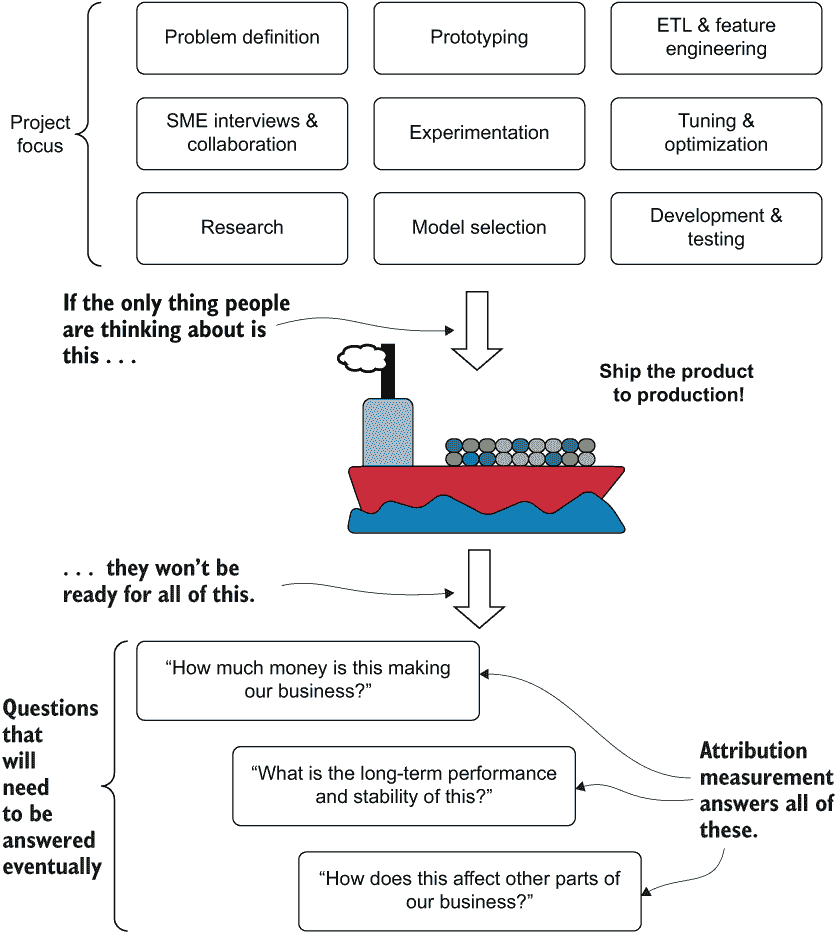

图 11.1 机器学习项目短视

这个机器学习团队存在短视问题。通过专注于自己的需求以将一个稳固的解决方案投入生产，机器学习团队成员没有准备好回答客户不可避免的疑问。毕竟，展示相关性指标对客户来说毫无意义。也不应该这样。

解决这个问题的方案是存在的。它涉及到核心解决方案开发代码之外的一点点工作，但保持业务参与并了解项目状态是非常值得的。一切始于衡量那些业务属性。

## 11.1 测量模型归因

我们将转向冰淇淋。具体来说，我们是一群在冰淇淋公司工作的数据科学家。几个月前，销售和营销团队找到我们，希望有一个模型能帮助他们确定何时发送优惠券给客户，以增加客户在收件箱中看到这些优惠券的机会。营销团队的标准做法是每周一早上 8 点发送大量邮件。我们的项目目标是生成一个日期和小时组合，以便以个性化的方式发送电子邮件。

图 11.2 的顶部显示了我们先前状态下的组件和示例。底部显示了模型输出作为图像组件生成器的一部分，针对我们每个成员个性化。

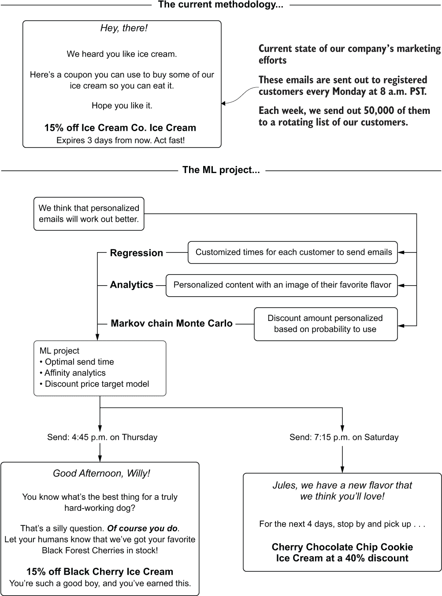

图 11.2 对于我们的冰淇淋项目，我们有一个基线和一项新的实验来测试。我们如何衡量它的成功？

我们已经构建了这个 MVP（最小可行产品），并根据我们的影子运行（shadow runs）展示了一些有希望的结果。通过跟踪我们的像素数据（嵌入在我们电子邮件优惠券代码中的 1 × 1 像素，显示我们营销广告的打开和点击率），我们发现模型基于我们对优惠券实际打开和使用率的监控，得到了令人震惊的准确结果。

虽然这个消息令人兴奋，但业务部门并不被我们的预测到实际打开时间的分钟误差所说服。他们真正想知道的是：“这能增加销售额吗？”为了开始回答这个问题，我们应该分析图 11.3 中显示的指标。

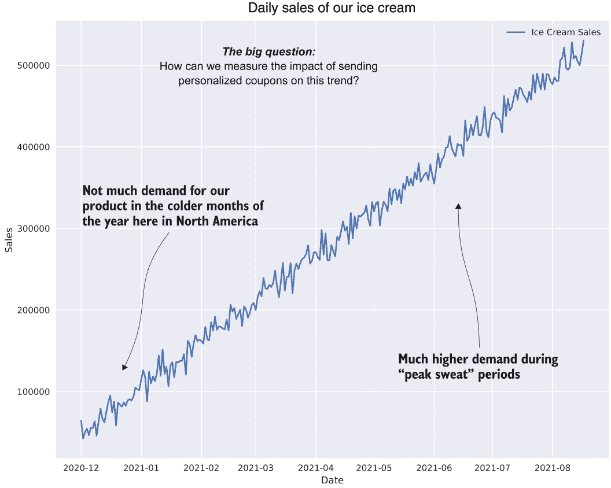

图 11.3 销售额：我们模型的真正目标指标

我们如何确定在客户最有可能看到优惠券的时间发送目标优惠券，与客户使用这些优惠券之间存在因果关系？这一切都始于确定要衡量什么，要在谁身上衡量，以及要利用什么工具来确定模型是否有因果影响。

### 11.1.1 衡量预测性能

在衡量我们模型性能的第一步，我们需要考虑的与任何实验设计（DOE）练习中需要考虑的是相同的。我们在解决方案的生产发布日期之前很久就开始与参与电子邮件营销活动的专家（我们项目的内部客户）交谈。毕竟，这个团队对我们客户及其与我们产品线的互动有着根本的深入理解。

在这些讨论中，我们将希望关注营销团队对我们客户的了解。对客户基础的深入理解将帮助我们确定我们收集的哪些关于他们的数据可以用来限制潜在的效应，以最小化结果中的方差。表 11.1 显示了 SME 小组和 DS 团队提出的假设，以及分析的结果。

表 11.1 假设的不同化因素与我们的数据中的实际先前证据

| 假设 | 显著吗？ | 分层候选者？ |
| --- | --- | --- |
| 热带气候地区的客户购买更多冰淇淋。 | 否 | 否 |
| 居住在农村地区的客户购买更多。 | 是 | 可能* |
| 30 岁以上的客户购买更多。 | 否 | 可能* |
| 打开电子邮件的客户购买更多。 | 是 | 是 |
| 与我们合作历史悠久的客户购买更多。 | 是 | 可能** |
| 有孩子的客户购买更多。 | 是 | 否*** |
| * 可能会引入分析中的巨大偏差。潜在的高风险分层值** 可以与购买金额和购买频率结合。*** 数据不足，可能难以跟踪。 |

评估我们历史数据中不同客户基础分组的分析过程将有助于隔离行为模式以最小化组内方差。图 11.4 说明了我们将使用我们在分析测试中找到的最优分层方法所要做的事情。

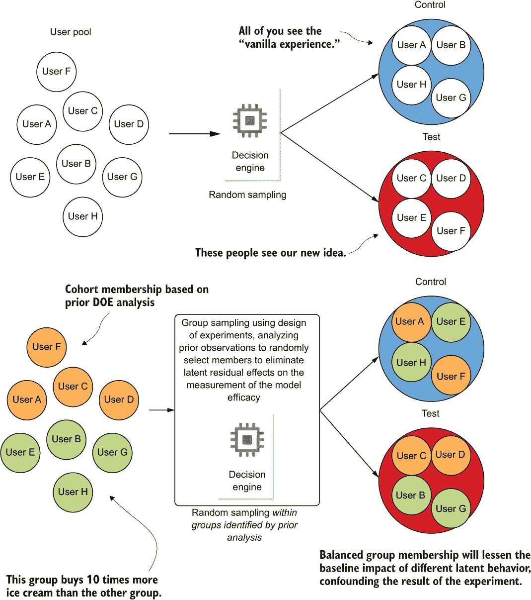

图 11.4 通过分层分组最小化潜在因素效应以减少组内方差

我们知道我们需要最小化导致行为不平衡的潜在变量效应。我们无法获得确定性地识别我们看到的（多模态）行为的资料，但如果我们控制它，我们当然可以改善我们的归因。但我们如何做到这一点？我们如何最有效地对用户进行分组？

根据我们与行业专家小组的讨论，我们着手分析可以减少我们人口内在变异性的方法。通过听取营销团队的意见，我们发现其经过验证的方法论，即评估客户群体的最优化解决方案。通过结合购买的最近性、历史购买次数以及客户发送给我们的总消费金额，我们可以定义一个标准指标来分类我们的群体（有关 RFM 的细分技术功效，请参阅以下侧边栏）。

RFM：如果你向他们销售东西，这是一个将人类分组的好方法

*RFM*，即*最近性、频率和货币价值*的缩写，是一个由 Jan Roelf Bult 和 Tom Wansbeek 提出的直接营销术语。在他们关于“直接邮件最优选择”的文章中，他们提出 RFM 是一种将客户价值化的非常强大的手段。这对估计认为，公司 80%的收入实际上来自其 20%的客户。

虽然极具先见之明，但这种方法的成功已经在许多行业中得到了反复证明（不仅限于面向消费者的公司）。主要概念是在这三个观测变量中的每一个上定义五个基于分位数的客户桶。例如，货币价值高的客户将是花费最高的前 20%，对于`M`的值为`5`。频率低（账户生命周期内的总购买次数）的客户，通常只购买一次，将具有`F`值为`1`。

当结合在一起时，RFM 值会形成一个包含 125 个元素的矩阵，从价值最低的客户（111）到价值最高的客户（555）。在这些原始的 125 个矩阵条目值之上应用业务特定和行业特定的元分组，使公司（以及数据科学团队）能够为假设测试目的拥有无潜在变量分层点。

我曾经对这种将人类行为以如此简单的方式分组的技术有点怀疑——直到我在第三家公司第三次分析它。我现在对这个看似简单但神奇强大的技术深信不疑。

使用我们的 RFM 计算生成客户群体如图 11.5 所示。

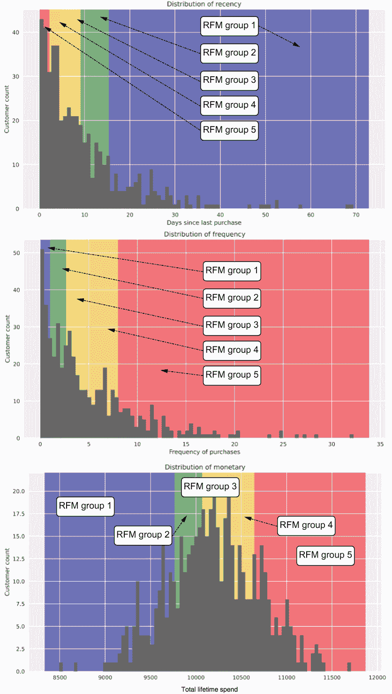

图 11.5 展示了我们客户基础的 RFM 组件的直方图可视化

这个 RFM 示例并不局限于人类（或者，就狗而言）。在我们的客户基础的百分位分析中，我们涵盖了从最有价值（555，有非常近期的购买、频繁的历史购买以及在其一生中的高消费）到最无价值（111，前者的反转）。这使我们能够大致估计影响客户行为的潜在因素的大量数量。这反过来又使我们能够在分析时进行分层，以确保我们向行为相似的人群相对均匀的组别展示测试。这使我们能够通过控制实验来减少方差。

思考练习：如果我们进行人口抽样，并且 90%的 555 名成员被选入对照组，而只有 10%在测试组，那么我们的模型因果验证的结果会是什么？我们可能会得出结论，我们的模型不太好，这将是误导性的。相反，相反的情况会带来哪些危险？

尽管由这三个属性产生的 125 种 RFM 组合很有趣，但它们对于我们分析模型性能与关注的业务指标之间的关系并不特别有帮助。在市场领域的专家共同努力下，我们能够将这些 125 个组别合并为三个主要的元组，以便于我们的分析：高价值、中价值和低价值组。

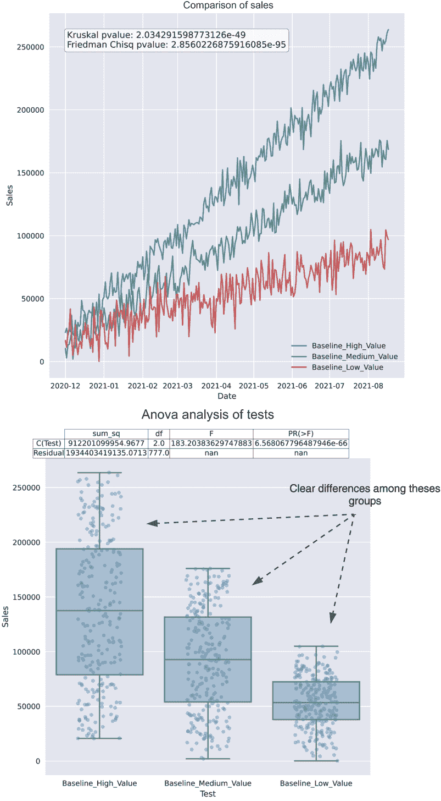

图 11.6 展示了我们与市场领域的专家小组共同定义的三个元组在 RFM 计算中的同质性分析

这导致我们的客户基础出现了一般性的分离，如图 11.6 所示。图表显示了每个组件对我们基准收入的贡献、这些差异的统计显著性，以及我们在进行假设检验时可以使用的获胜公式。

注意：有关如何生成这些图表（以及代码）、用于获取这些显著性值的 Python 中的统计包，以及涉及的数据生成器等更多信息，请参阅 GitHub 上本书的配套代码库[`github.com/BenWilson2/ML-Engineering`](https://github.com/BenWilson2/ML-Engineering)。

为什么我不能仅仅使用我的评分指标来告诉我模型做得怎么样？

让我们暂时不考虑业务可能不熟悉我们用于估计模型拟合优度的预测误差指标的概念。我们无法仅仅使用评分指标来表明模型表现如何的主要原因是我们测量业务影响力时评估的不是同一件事。无论我们的模型在保留验证数据上的表现如何，指标性能并不能保证对任何项目的目标有影响。

看起来我们似乎已经完全解决了基于观察指标性能的问题。然而，仅基于这些指标就宣称整个项目解决方案的胜利是有点过于仓促且极具误导性的。使用相关性分数来估计我们模型的质量的问题在于，收集到的特征并没有涵盖影响结果的所有因素。

在生成特征向量的过程中，我们正在努力优化我们的观察与响应变量的相关性。由于这个事实，我们永远无法确定预测会对我们试图影响的事物产生任何影响。

对于我们的场景，确定预测的影响力的唯一方法是通过 *假设检验*，测量看到模型输出的人和没有看到的人之间的收入影响。这些样本群体之间的收入差异可以让我们有信心，当我们的模型应用于整个群体时，它具有概率效应。

在我们进行更大范围的讨论之前，为什么这是（相关性 versus 因果性）之前，让我们看看一些常见的监督学习问题中的差异：机器学习指标分数与同一项目的业务指标相比会是什么样子。表 11.2 提供了一些例子。

表 11.2 项目指标 vs. 业务指标示例

| 项目 | 机器学习指标 | 业务指标 |
| --- | --- | --- |
| 欺诈检测 | PR 曲线下面积、ROC 曲线下面积、F1 | 欺诈损失金额、欺诈调查数量 |
| 顾客流失预测 | PR 曲线下面积、ROC 曲线下面积、F1 | 购买频率、高流失风险用户的登录事件 |
| 销售预测 | AIC、BIC、RMSE 等 | 收入 |
| 情感分析 | BLEURT、BERTScore | 工具用户数量、参与率 |
| 冰淇淋优惠券 | MAE、MSE、RMSE | 收入、优惠券使用率 |

这种关注点与 DS 团队对业务重要性的看法相一致，而不仅仅是适用损失指标。虽然损失指标对于训练至关重要，但存在一种可能性，即优化的损失指标（尤其是在数据集中优化到虚假相关性的情况下）并不等同于目标业务指标的有利条件。在整个机器学习项目生命周期中利用损失指标和业务指标将大大降低未能满足业务预期的风险。

在向整个企业展示证据结果时，需要记住的最重要的一点是永远不要混淆相关性和因果关系的概念。让人们从你的结果中推断因果关系是一个容易滑倒的斜坡。如果被监控的指标是公司范围内的关键属性，如收入，这会变得更加危险。

A/B 测试可以根据观察到的行为差异提供基于证据的模型影响判断，但这就是你可以做出的声明所能达到的极限。这永远不是确定性。最好的做法是永远不要暗示模型基于相关性的特征或分层分析中使用的分组特征是驱动力的实际原因。我们根本无法拥有完整的画面来做出这样的声明。

关于机器学习指标的一点说明

如果我没有明确指出，我没有对机器学习指标有任何问题。它们非常有用，对于正确构建模型至关重要，并且提供了大量关于我们能够进行的基于相关性的预测的经验质量信息。如果有什么不同的话，我通常在构建解决方案的过程中收集了太多的指标。（我是一个“以防万一”的数学收藏家。）

话虽如此，机器学习指标对业务部门来说毫无用处。它们对内部和外部客户都不相关。

它们并不能保证你将解决你试图解决的问题。根据其设计和目的，它们不过是一个信息工具，用于衡量你如何匹配目标的相对质量，前提是你收集到的关于现实世界的有限数据。

在本章（以及，一般来说，在本书的许多部分）中，我所争论的是，我们的重点始终应该是最终状态。作为机器学习从业者，我们应该关注我们正在构建的东西——不是指我们使用哪种算法，我们使用哪种统计模型，或者我们的特征工程工作多么优雅和巧妙。模型及其所有支持的基础设施和数据流都是为了解决问题而使用的。

任何由数据科学团队承担的项目都具有内在的可衡量质量。如果项目没有，那么它将超出实验阶段的可能性相当有限。任何项目中要解决的问题都有其自己的指标，这些指标通常由请求数据科学团队解决问题的团队定义。

我们是在尝试增加销售额吗？那么就衡量收入、销售单位、客户保留率、重复购买和会话长度。

我们是在尝试增加我们内容的观看量吗？那么就衡量观看百分比、平台上的时间、重复访问和推荐内容的消费。

我们是在尝试检测欺诈吗？那么就衡量成功识别率、损失减少和客户满意度率。

我们是在预测设备故障吗？那么就测量事后设备检查的健康状况、灾难性维修成本水平和设备更换支出。

项目的指令包括一个已经测量并且正在被密切审查的业务方面，这是为了证明值得 DS 团队投入精力去修复。业务对应用机器学习的期望是使事情变得更好。

如果你不是在衡量你是否在使事情变得更好，而是用一些神秘的统计指标来证明你实施预测能力的有效性，那么你是在对自己和你的团队不利。

将项目的术语保持在业务熟悉的指标中——这正是业务领导拿起电话给你打电话，认为你可能成为他们英雄的原因。这种关注将增加他们对团队能力的信心，使团队对项目对业务的影响保持诚实，并帮助每个人清楚地认识到事情不再像以前那样顺利（正如你将在下一节中看到的，这是不可避免的）。

### 11.1.2 明确相关性与因果关系

向业务部门展示模型结果的一个重要部分是明确区分相关性和因果关系。如果业务领导从你展示给他们的任何内容中推断出因果关系，即使只有一点可能性，最好还是进行这次对话。

*相关性*简单来说就是观察到的变量之间存在的相互关系或关联。它并不暗示这种关系的存在之外有任何意义。这个概念对于不参与数据分析的普通人来说，本质上是不直观的。在分析中得出“看似合理”的关于数据关系的还原论结论，实际上就是我们的大脑是如何工作的。

例如，我们可以收集冰淇淋车和手套的销售数据，这两者都按年度周和按国家汇总。我们可以计算出两者之间强烈的负相关性（手套销售增加时冰淇淋销售增加，反之亦然）。大多数人会对因果关系的结论感到好笑：“嗯，如果我们想卖更多冰淇淋，我们需要减少我们的手套供应！”

普通人可能会从这样一个愚蠢的例子中立刻说出，“嗯，人们冷的时候买手套，热的时候买冰淇淋。”这是一种试图定义因果关系的尝试。基于观察数据中的这种负相关性，我们绝对不能做出这样的因果推断。我们无法知道实际上是什么影响了购买冰淇淋或手套对个人的影响（每个观察值）。

如果我们在这个分析中引入一个额外的混淆变量（外部温度），我们可能会发现对我们虚假结论的额外证实。然而，这忽略了驱动购买决策的复杂性。例如，参见图 11.7。

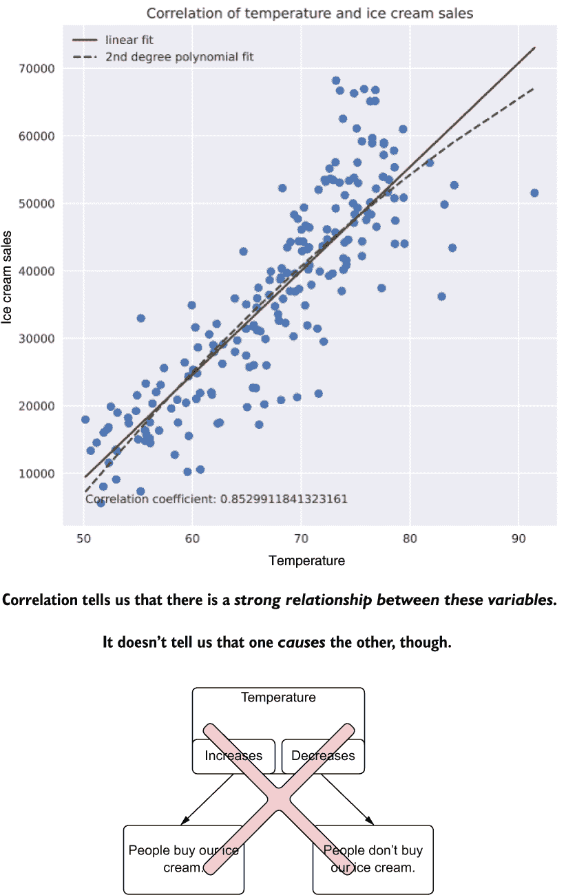

图 11.7 相关性并不表示因果关系。

显然，存在一种关系。随着温度的升高，冰淇淋的销售量也随之增加。所展示的关系相当强。但我们能推断出除了存在这种关系之外的其他任何东西吗？

让我们看看另一个图表。图 11.8 展示了我们可以放入模型中以帮助预测某人是否可能购买我们的冰淇淋的额外观察数据点。

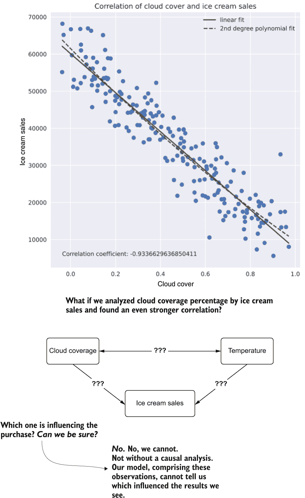

图 11.8 一个混淆的相关性，当我们思考温度与销售之间的关系。是哪一个在推动销售？是温度还是云层？是混合效应吗？

将云层与销售量对比，我们得到比温度更强的相关性。这告诉我们什么？它只是简单地说明这些观察变量之间存在强烈的（相关性）。我们无法推断出除此之外的其他任何东西。我们绝对不能做出逻辑跳跃，声称高温无云的日子将保证冰淇淋的购买。温度和云层似乎对购买率有显著的影响，但我们不能肯定地说这些是购买或不购买我们冰淇淋选择的原因。

在机器学习模型的领域中，我们处理的是在观察变量的关系中优化成本函数，以基于我们所拥有的数据，对（一个或多个）预测变量进行最佳合理估计。在任何情况下，这都不意味着因果关系。

这个现象有一个简单的解释：我们并非全能。我们根本无法捕捉到所有导致决策的原因。由于我们没有观察到所有原因，我们的模型当然也无法了解它们。如果我们能够捕捉到所有的影响因素，那么作为数据科学家，我们都会失业，因为人们能够直接以完美精确和几乎零不确定性来陈述预期的结果。

让我们设想我们正在试图弄清楚某人是否会购买冰淇淋。图 11.9 显示了可能影响某人购买我们产品的各种影响因素的综合。在这个庞大的原因海洋中，我们只收集了关于这个人的有限数据。对于可能影响购买决策的其他影响因素，我们根本无法收集这些信息。如果我们收集了所有这些信息，模型可能不会具有很强的泛化能力。要从一个具有许多特征的有用模型中提取信息，我们需要数亿行数据才能达到哪怕是近似准确的程度。

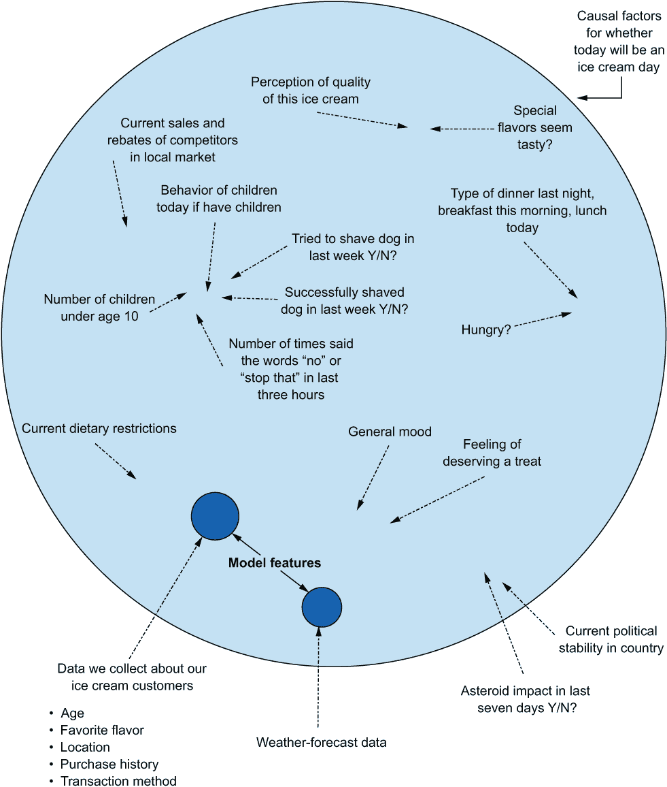

图 11.9 模型无法知晓的事件影响之海。如果我们没有观察到所有这些元素，我们就无法推断因果关系；我们只是*没有所有信息*。

总是最好不尝试将因果关系分配给任何机器学习模型的结果。记住，我们处理的是相关性，以及从相关值中得出结论的最佳努力，以构建预测。我们不是基于这种对众多导致某事发生或不发生的力量的狭隘观点来分配意义或动机（因果关系）。

同样，我们不能仅仅因为 A/B 测试的统计显著结果就直接推断因果关系。我们只能拒绝测试组之间结果的等价性。然而，我们可以通过 A/B 测试来验证我们的预测是否有用。

作为数据科学家，理解这些概念很重要。然而，在向为你的业务构建项目的内部客户沟通时，强化这些概念更为重要。未能传达这些原则在我合作过的团队中造成了大量的困惑和挫败感。

关于因果分析（推断）的说明

某些技术，如设计实验（DOE）和因果建模，可以确定特征与目标之间的因果关系。与仅关注误差项最小化的监督学习不同，通过 DOE 建模发现的因果关系可以自信地确定。

我们可以通过在 DOE 中精心构建有向无环图（DAG）关系，来确定对目标变量的影响程度和方向，这是传统监督学习无法做到的。关于因果建模和 DOE 的进一步阅读，我强烈推荐阅读由 Jonas Peters 等人撰写的《因果推断要素：基础与学习算法》（MIT Press，2017 年）。

## 11.2 利用 A/B 测试进行归因计算

在上一节中，我们确立了归因测量的重要性。对于我们的冰淇淋优惠券模型，我们定义了一种方法来将我们的客户群分为不同的群体段，以最小化潜在变量影响。我们定义了为什么基于我们试图改进的业务指标（我们的收入）来评估我们实施的成功标准是如此关键。

带着这种理解，我们如何进行影响力的计算？我们如何做出一个在数学上合理且对模型对业务影响这样复杂事物提供不可辩驳评估的判断？

### 11.2.1 A/B 测试 101

现在我们已经通过简单的基于百分比的 RFM 分段（第 11.1.1 节中分配给客户的三个组）定义了我们的群体，我们准备对客户进行随机分层抽样，以确定他们将获得哪种优惠券体验。

控制组将获得在周一早上 8 点太平洋标准时间（PST）发送到他们收件箱的通用优惠券的预机器学习处理。测试组将获得目标内容和交付时间。

注意：虽然同时发布多个与控制条件显著不同的项目元素在假设检验中可能看起来反直觉（并且它对因果关系造成混淆），但大多数公司（明智地）愿意为了尽快将解决方案推向市场而放弃评估的科学准确性。如果你面临这种所谓的违反统计标准的所谓违规行为，我最好的建议是：保持耐心，保持沉默，并意识到你可以在后续的 A/B 测试中通过改变实施方面的某些方面来进行变异测试，以确定对解决方案不同方面的因果影响。当是时候发布解决方案时，通常首先发布最佳可能的解决方案，然后分析组件更为有价值。

在生产发布后的短时间内，人们通常希望看到数据开始滚动时即展示影响的图表。将创建许多折线图，基于控制组和测试组汇总业务参数结果。在让每个人都疯狂制作花哨的图表之前，需要定义假设检验的几个关键方面，以确保其成功裁决。

我们需要收集多少数据？

在设计假设检验时，过程的一个关键部分是确定评估的适当样本大小。以下列表显示了一种相对直接的方法，根据业务需求确定适当的样本大小。

列表 11.1 最小样本大小确定器

```
from statsmodels.stats.power import tt_ind_solve_power                    ❶
x_effects = [0.01, 0.05, 0.1, 0.15, 0.2, 0.25, 0.5]                       ❷
sample_sizes = [tt_ind_solve_power(x, None, 0.2, 0.8, 1, 'two-sided') for x in x_effects]                                                ❸
sample_sizes_low_alpha = [tt_ind_solve_power(x, None, 0.01, 0.8, 1, 'two-sided') for x in x_effects]                                     ❹
```

❶ 有人为 SciPy 中的 power 求解器包装了 statsmodels 的高级 API。

❷ 生成控制与测试之间的“提升”差值列表（指标之间的百分比差异）

❸ 通过将 effect_size 设置为 None 来求解 alpha 0.2 的样本大小

❹ 求解 alpha 为 0.01（99%确信没有一类错误）的样本大小

图 11.10 显示了运行此代码的结果（可视化代码可在本书的配套仓库中找到）。在两种情况下，我们都将功效值保持在 0.8，如果此类用例中二类错误的危险对业务有害，则可以也应该进行调整。

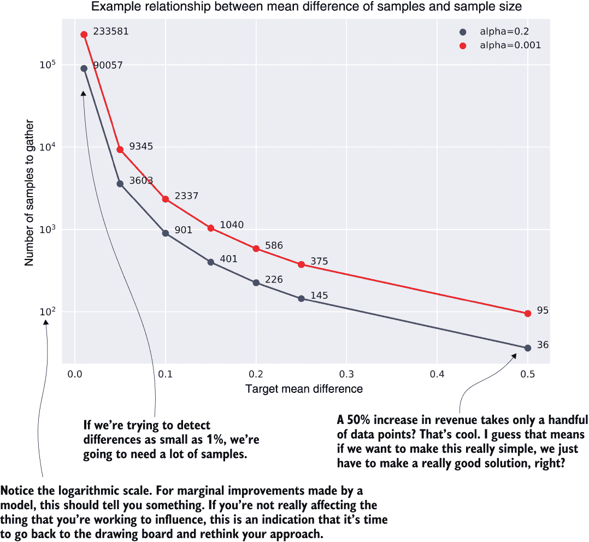

图 11.10 基于置信度要求的样本大小确定

随着 alpha 值（我们测量的显著性水平）的降低，确定测试组和对照组之间差异所需的记录样本数量增加。在模型投入生产之前，能够传达收集足够数据所需的时间以做出结论性判断是绝对必要的。如果没有设定这些期望，企业将仅仅在猜测何时，以及更令人沮丧的是，是否能够从项目中看到有希望的结果。

上述估计完全基于需要正态分布和同质样本群体大小的统计测试。在接下来的章节中，我们将讨论如何不仅测试参数数据，还要测试非参数数据和样本量不平衡的适当显著性测试。

不应该做什么

图 11.11 说明了许多公司在使用机器学习项目工作影响业务早期如何评估归因。如果没有应用适当的统计分析以及合理的统计过程来处理归因测量，企业可能会感到极大的挫败感。

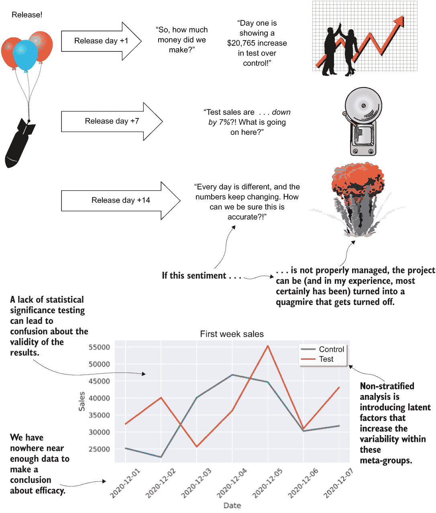

图 11.11 忽略假设测试会带来挫败感。

应对这一问题的最佳方法是制定关于如何评估数据和裁决影响所需时间的既定规则，并建立一个监控系统来测试监控参数的统计显著性。

在定义了 RFM 群体、理解了样本量估计，并且有一个自动监控任务来检索我们的归因数据用于测量后，我们准备开始评估我们的项目。我们准备看看所有辛勤的工作是否值得。

### 11.2.2 评估连续度量

对于我们的冰淇淋优惠券优化，企业关注的其中一个主要指标是收入。在处理货币价值度量时，许多情况下与支出相关的分布通常是高度**非正态**的。图 11.12 显示了与可变价格商品和无限篮子情况（如电子商务中）相关的无界购买图。

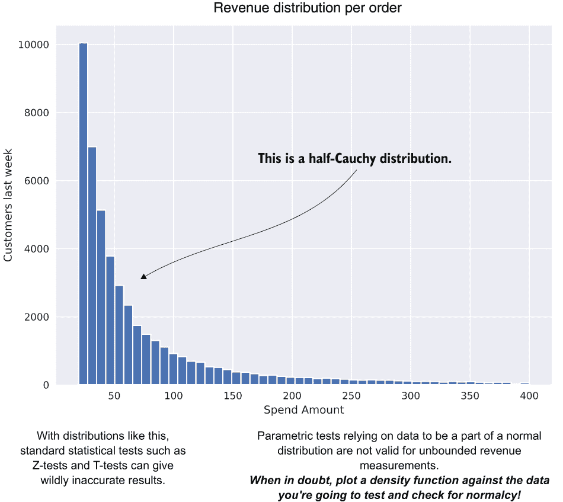

图 11.12 对客户收入的正常性验证检查

如果你处理的是类似这种图表的分布，你将不会使用标准的参数测试。然而，在我们的用例中，我们有一组固定价格的物品（我们所有的冰淇淋价格都相同），我们发放的优惠券针对的是单个物品。尽管如此，我们已经完成了统计分析的家庭作业，验证我们将拥有相对正态分布的数据。

在进行我们解决方案的实验测试时，我们将定义参数测试，如列表 11.2 所示。我们将将这些应用于标准图表，不仅可以显示特定客户群体随时间变化的销售数据，还可以显示每个测试的等效性测试 p 值。在实际操作中，并非所有这些都会包含在报告中（在这里展示和计算参数和非参数测试只是为了演示目的）。你应该只使用最适合你数据的那一个。

列表 11.2 线形图与统计测试

```
from statsmodels.stats import anova
from scipy.stats import f_oneway, mannwhitneyu, wilcoxon, ttest_ind
from collections import namedtuple
import matplotlib.pyplot as plt
DATE_FIELD = 'Date'
TARGET_FIELD = 'Sales'
def calculate_basic_stats_df(series):                                       ❶
    StatsData = namedtuple('StatsData', 'name mean median stddev variance sum')
    return StatsData(series.name,
                     np.mean(series),
                     np.median(series),
                     np.std(series),
                     np.var(series),
                     np.sum(series)
                    )

def series_comparison_continuous_df(a, b):                                  ❷
    BatteryData = namedtuple('BatteryData', 'left right anova mann_whitney_u wilcoxon ttest')
    TestData = namedtuple('TestData', 'statistic pvalue')
    anova_test = f_oneway(a, b)
    mann_whitney = mannwhitneyu(a, b)
    wilcoxon_rank = wilcoxon(a, b)
    t_test = ttest_ind(a, b, equal_var=False)
    return BatteryData(a.name, 
                       b.name, 
                       TestData(anova_test.statistic, anova_test.pvalue),
                       TestData(mann_whitney.statistic, mann_whitney.pvalue),
                       TestData(wilcoxon_rank.statistic, wilcoxon_rank.pvalue),
                       TestData(t_test.statistic, t_test.pvalue)
                      )

def plot_comparison_series_df(x, y1, y2, size=(10,10)):
    with plt.style.context(style='seaborn'):
        fig = plt.figure(figsize=size)
        ax = fig.add_subplot(111)
        ax.plot(x, y1, color='darkred', label=y1.name)
        ax.plot(x, y2, color='green', label=y2.name)
        ax.set_title("Comparison of Sales between tests {} and {}".format(y1.name, y2.name))
        ax.set_xlabel(DATE_FIELD)
        ax.set_ylabel(TARGET_FIELD)
        comparison = series_comparison_continuous_df(y1, y2)                ❸
        y1_stats = calculate_basic_stats_df(y1)                             ❹
        y2_stats = calculate_basic_stats_df(y2)
        bbox_stats = "\n".join((
            "Series {}:".format(y1.name),
            "   Mean: {:.2f}".format(y1_stats.mean),
            "   Median: {:.2f}".format(y1_stats.median),
            "   Stddev: {:.2f}".format(y1_stats.stddev),
            "   Variance: {:.2f}".format(y1_stats.variance),
            "   Sum: {:.2f}".format(y1_stats.sum),
            "Series {}:".format(y2.name),
            "   Mean: {:.2f}".format(y2_stats.mean),
            "   Median: {:.2f}".format(y2_stats.median),
            "   Stddev: {:.2f}".format(y2_stats.stddev),
            "   Variance: {:.2f}".format(y2_stats.variance),
            "   Sum: {:.2f}".format(y2_stats.sum)
        ))
        bbox_text = "Anova pvalue: {}\nT-test pvalue: {}\nMannWhitneyU pvalue: 
          {}\nWilcoxon pvalue: {}".format(
          comparison.anova.pvalue,
          comparison.ttest.pvalue,
          comparison.mann_whitney_u.pvalue,
          comparison.wilcoxon.pvalue
          )
        bbox_props = dict(boxstyle='round', facecolor='ivory', alpha=0.8)
        ax.text(0.05, 0.95, bbox_text, transform=ax.transAxes, fontsize=12, 
          verticalalignment='top', bbox=bbox_props)
        ax.text(0.05, 0.8, bbox_stats, transform=ax.transAxes, fontsize=10, 
          verticalalignment='top', bbox=bbox_props)
        ax.legend(loc='lower right')
        plt.tight_layout()
```

❶ 获取每个序列关键统计信息的简单函数

❷ 调用 SciPy 和 statsmodels 模块进行参数和非参数等效性测试的函数

❸ 调用序列比较函数以获取图表显示的显著性测试值

❹ 调用每个序列的基本统计计算

图 11.13 显示了执行此代码的结果；描绘了高价值客户群体前 150 天的测试结果。


图 11.13 随时间绘制测试组和对照组，显示数据的非参数性质

这里比较的数据集是非参数的。这是由于销售随时间趋势的变化，导致我们的分布随时间变化。唯一可能允许我们使用如方差分析、T 检验和 Z 检验等比较的条件是，我们的数据具有平稳性（趋势为 0）。

以这种方式展示时间序列显示只是展示测试结果的一部分。正如我们在第一部分所关注的，对于任何机器学习项目来说，与业务清晰沟通的能力至关重要。当归因和测量的主题进入对话时，这一点尤为重要。全面了解不仅涉及单一的数据结果展示，我们将在下一部分进行介绍。

我真的必须这样做吗?!

简而言之，不。

机器学习项目工作具有不同的级别。每个影响业务的临界性级别都对应着实施归因（和漂移）测量的紧迫性级别。让我们看看几个例子：

+   *用于为其他项目生成标记数据的公司内部工具模型*——标准的机器学习指标是足够的。

+   *设计用于协助其他部门进行重复性任务的公司内部预测模型*——归因建模不适用，定期的临时漂移检测可能是有价值的。

+   *直接影响关键业务运营的公司内部项目*（帮助影响主要商业决策）——绝对需要具备漂移检测功能，并且建立归因建模是个好主意。

+   *面向外部客户的模型*——归因测量、漂移检测和偏差检测（评估基于收集的数据的性质和类型，具有放大系统性社会问题实际后果的偏见预测）是绝对必要的。

最后一个要素是大多数生产级机器学习所关注的：影响公司盈利能力或效率的关键重要项目。在这个列表中，特别值得注意的是偏差测量，这是在撰写本书时正在进行积极研究的一个主题。我在本书中不深入探讨这个主题，但它是我们工作的一个关键方面。（关于这个主题的书籍已经有很多，我鼓励所有专业机器学习从业者至少阅读其中之一。）

当我们的模型影响人们的生活时，偏差测量变得非常重要：信用卡申请、房屋贷款审批、警察巡逻推荐、城市资金和人类行为风险检测只是基于我们数据集中反映的先前行为的一些严重偏差的机器学习应用的小样本。密切关注结果总是能让你避免后续的困难对话。

### 11.2.3 使用替代显示和测试

为了配合任何时间相关的假设检验，向业务展示结果的箱线图可能很有用。虽然这些图表以易于接受的方式提炼信息非常有用，但绝大多数非专业人士并不熟悉看到这些图表伴随着帮助指导可解释性的关键重要的统计摘要。

没有统计显著性的参考，很容易对不足（或高方差）的数据做出判断。下一个列表展示了参数数据的 ANOVA 图和进行测试所需的 `DataFrame` 操作。

列表 11.3 生成针对参数数据的 ANOVA 箱线图报告

```
from statsmodels.formula.api import ols
from statsmodels.stats import anova
def generate_melted_df(series_collection, dates, date_filtering=DATA_SIZE):❶
    series_df = generate_df(series_collection, dates)
    melted = pd.melt(series_df.reset_index(), id_vars='Date', 
      value_vars=[x.name for x in series_collection])
    melted.columns = [DATE_FIELD, 'Test', 'Sales']
    return melted[melted[DATE_FIELD] > max(melted[DATE_FIELD]) - 
      timedelta(days=date_filtering)]
def run_anova(data, value_name, group_name):                               ❷
    ols_model = ols('{} ~ C({})'.format(value_name, group_name), 
      data=data).fit()
    return anova.anova_lm(ols_model, typ=2)
def plot_anova(melted_data, plot_name, figsize=(16, 16)):
    anova_report = run_anova(melted_data, 'Sales', 'Test')
    with plt.style.context(style='seaborn'):
        fig = plt.figure(figsize=figsize)
        ax0 = fig.add_subplot(111)
        ax0 = sns.boxplot(x='Test', y='Sales', data=melted_data, 
          color='lightsteelblue')
        ax0 = sns.stripplot(x='Test', y='Sales', data=melted_data, 
          color='steelblue', alpha=0.4, jitter=0.2)
        ax1 = fig.add_subplot(211)
        ax1.set_title("Anova Analysis of tests", y=1.25, fontsize=16)
        tbl = ax1.table(cellText=anova_report.values, 
                        colLabels=anova_report.columns, 
                        rowLabels=anova_report.index, 
                        loc='top', 
                        cellLoc='center', 
                        rowLoc='center',
                        bbox=[0.075,1.0,0.875,0.2]
                       )                                                   ❸
        tbl.auto_set_column_width(col=list(range(len(anova_report.columns))))
        ax1.axis('tight')
        ax1.set_axis_off()
        plt.savefig("anova_{}.svg".format(plot_name), format='svg')
```

❶ 将 DataFrame 标准化（熔化）以支持 statsmodels 中的 ANOVA 计算

❷ 创建 ANOVA 所需的线性模型

❸ 将 ANOVA 结果统计信息叠加到图表上，以便于参考

在一个替代数据集（一个静态且没有季节性影响的数据集）上执行此代码的结果显示在图 11.14 中。有关与我们所使用的数据集相比，此数据集生成的详细差异，请参阅本书的配套仓库。

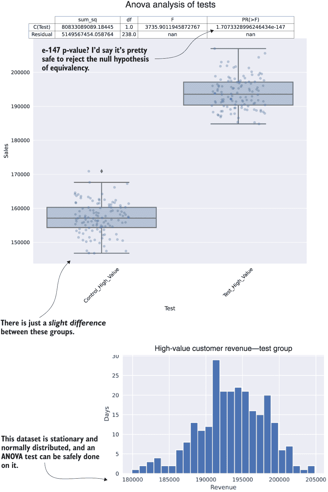

图 11.14 静态参数测试示例

使用这些参数测试，我们可以更准确地确定测试中差异的大小。这主要是因为参数学生测试建立的基础（要求样本均值遵循正态分布，均值的标准误差遵循具有 *n*- 1 个自由度的卡方分布）。在我们的原始问题中，同时测试几个组，可能有点繁重，需要将每个 ANOVA 测试作为配对测试来绘制。当只有三个组被分配到测试组和对照组时，这可能不会太令人痛苦。但是，25 个组进行测试则是另一回事。

进入 Tukey HSD 测试（*HSD* 代表 *honestly significant difference*）。这是另一种参数测试，与学生家族测试的主要区别在于，可以一次性进行每个组之间的配对比较。以下列表展示了该测试的实现和相应的可视化报告。

列表 11.4 Tukey HSD 假设检验和图表

```
from statsmodels.stats.multicomp import pairwise_tukeyhsd
def convert_tukey_to_df(tukey):
    STRUCTURES = [(0, 'str'), (1, 'str'), (2, 'float'),                         ❶
    (3, 'float'), (4, 'float'), (5, 'float'), (6, 'bool')]                      ❶
    fields = tukey.data[0]
    extracts = [extract_data(tukey.data[1:], x[0], x[1]) for x in STRUCTURES]   ❷
    result_df = pd.concat(extracts, axis=1)
    result_df.columns = fields
    return result_df.sort_values(['p-adj', 'meandiff'], ascending=[True, False])❸

def run_tukey(value, group, alpha=0.05):                                        ❹
    paired_test = pairwise_tukeyhsd(value, group, alpha)
    return convert_tukey_to_df(paired_test._results_table)

def plot_tukey(melted_data, name, alpha=0.05, figsize=(14,14)):
    tukey_data = run_tukey(melted_data[TARGET_FIELD], melted_data[TEST_FIELD], 
      alpha)
    with plt.style.context(style='seaborn'):
        fig = plt.figure(figsize=figsize)
        ax_plot = fig.add_subplot(111)
        ax_plot = sns.boxplot(x=TEST_FIELD, y=TARGET_FIELD, data=melted_data, 
          color='lightsteelblue')
        ax_plot = sns.stripplot(x=TEST_FIELD, y=TARGET_FIELD, 
                                data=melted_data, color='steelblue', 
                                alpha=0.4, jitter=0.2)
        ax_table = fig.add_subplot(211)
        ax_table.set_title("TukeyHSD Analysis of tests", y=1.5, fontsize=16)
        tbl = ax_table.table(cellText=tukey_data.values,
                             colLabels=tukey_data.columns,
                             rowLabels=tukey_data.index,
                             loc='top',
                             cellLoc='center',
                             rowLoc='center',
                             bbox=[0.075, 1.0, 0.875, 0.5]
                            )                                                   ❺
        tbl.auto_set_column_width(col=list(range(len(tukey_data.columns))))
        ax_table.axis('tight')
        ax_table.set_axis_off()
        plt.tight_layout()
        plt.savefig('tukey_{}.svg'.format(name), format='svg')
```

❶ 定义 pairwise_tukeyhsd 返回类型的结构

❷ 从 Tukey HSD 测试的结果中提取数据

❸ 运行配对 Tukey HSD 测试

❹ 按显著性排序并返回成对数据

❺ 在箱线图上方创建一个显示表，显示所有待评估配对组之间的关系

将此代码应用于我们的静态全样本测试组结果，产生了图 11.15 中所示的图表。正如您通过查看中等价值和低价值组所看到的，在看似相似的数据之间进行视觉上的区分极其困难。抛开制作视觉或简单汇总评估的危险性不谈，将统计验证测试作为您向业务展示的任何比较图表的一部分，可以帮助巩固结论。

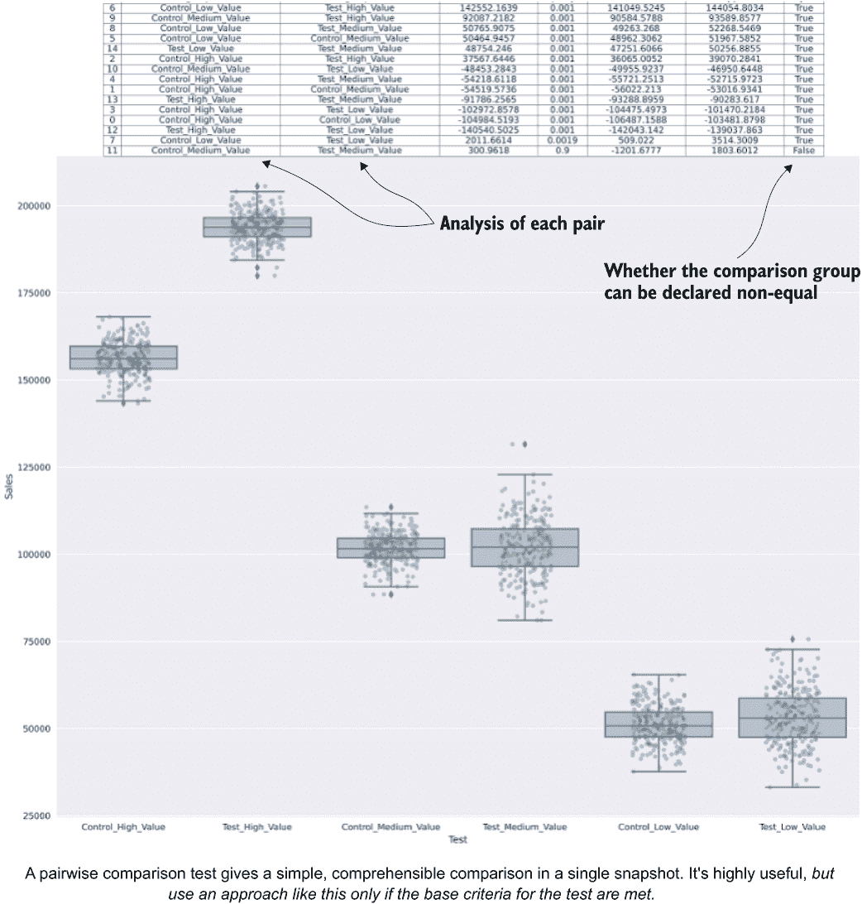

图 11.15 Tukey HSD 配对比较测试，显示每个组与其他每个组的关系以及对于等效性的配对比较中是否可以拒绝零假设

这个简单的图表对于业务单元来说足够容易理解。它有助于防止在存在足够数据支持该结论之前，任何人就对项目的成功（或失败）做出判断。在图表中，我们可以看到，对于我们的中等价值队列，测试组和对照组之间没有明显的差异。这有助于确定哪些组可能需要不同的方法（为模型的下一迭代和进一步的测试打开大门）以及哪些应该谨慎处理（高价值组的测试条件似乎运作得非常出色；现在为什么要改变它呢？）。

### 11.2.4 评估分类指标

到目前为止，我们一直在讨论收入，但这并不是我们冰淇淋消费优化项目的全部故事。虽然高管们关心模型对销售数字的影响，但市场营销团队（我们的内部客户）想知道优惠券的使用率。

很遗憾，我们不能使用与连续数据相同的处理方法来处理名义数据。ANOVA 测试、Tukey HSD 比较或其他类似技术都不再适用。相反，我们需要深入研究分类测试的世界。我们需要开始思考我们在测量事件时，是在考虑“发生”还是“未发生”。

列表 11.5 展示了测量测试组和对照组之间比率的数据的简单模拟，这是测试前 50 天发行的 50,000 张优惠券的例子。为了保持可视化简单，我们将所有队列放入一个单独的组中（但在实践中，您会有不同的图表和针对每个队列的统计测试）。

列表 11.5 分类显著性测试

```
from scipy.stats import fisher_exact, chi2_contingency
def categorical_significance(test_happen, test_not_happen, control_happen, 
      control_not_happen):
    CategoricalTest = namedtuple('CategoricalTest', 
                                 'fisher_stat fisher_p chisq_stat chisq_p
                                 chisq_df chisq_expected')
    t_happen = np.sum(test_happen)                                          ❶
    t_not_happen = np.sum(test_not_happen)
    c_happen = np.sum(control_happen)
    c_not_happen = np.sum(control_not_happen)
    matrix = np.array([[t_happen, c_happen], [t_not_happen, c_not_happen]])
    fisher_stat, fisher_p = fisher_exact(matrix)                            ❷
    chisq_stat, chisq_p, chisq_df, chisq_expected = chi2_contingency(matrix)❸
    return CategoricalTest(fisher_stat, fisher_p, chisq_stat, chisq_p, 
      chisq_df, chisq_expected)

def plot_coupon_usage(test_happen, test_not_happen, control_happen, 
  control_not_happen, name, figsize=(10,8)):
    cat_test = categorical_significance(test_series, test_unused, 
      control_series, control_unused)                                       ❹
    with plt.style.context(style='seaborn'):
        fig = plt.figure(figsize=figsize)
        ax = fig.add_subplot(111)
        dates = np.arange(DATE_START, 
                            DATE_START + timedelta(days=COUPON_DATES), 
                            timedelta(days=1)).astype(date)
        bar1 = ax.bar(dates, test_series, color='#5499C7', label='Test 
          Coupons Used')
        bar2 = ax.bar(dates, test_unused, bottom=test_series, 
          color='#A9CCE3', label='Test Unused Coupons')                     ❺
        bar3 = ax.bar(dates, control_series, bottom=test_series+test_unused,
          color='#52BE80', label='Control Coupons Used')
        bar4 = ax.bar(dates, control_unused, 
          bottom=test_series+test_unused+control_series, 
          color='#A9DFBF', label='Control Unused Coupons')
        bbox_text = "Fisher's Exact pvalue: {}\nChisq Contingency pvalue: 
          {}\nChisq DF: {}".format(
          cat_test.fisher_p, cat_test.chisq_p, cat_test.chisq_df
          )                                                                 ❻
        bbox_props = dict(boxstyle='round', facecolor='ivory', alpha=1.0)
        ax.set_title("Coupon Usage Comparison", fontsize=16)
        ax.text(0.05, 0.95, bbox_text, transform=ax.transAxes, fontsize=12, 
          verticalalignment='top', bbox=bbox_props)
        ax.set_xlabel('Date')
        ax.set_ylabel('Coupon Usage')
        legend = ax.legend(loc='best', shadow=True, frameon=True)
        legend.get_frame().set_facecolor('ivory')
        plt.tight_layout()
        plt.savefig('coupon_usage_{}.svg'.format(name), format='svg')
```

❶ 对于测试组和对照组的每个系列数据（事件发生，事件未发生），获取这些事件的和

❷ 对每个组的“发生/未发生”矩阵运行 Fisher 精确测试

❸ 对矩阵运行卡方列联测试

❹ 从分类显著性函数中获取统计测试

❺ 将条形图堆叠在一起，以便轻松查看随时间变化的交互率

❻ 为图表构建统计测试报告框

当我们运行此代码（在为优惠券设置完成我们的发送和 ETL 处理后），我们最终会得到一个看起来像图 11.16 的图表。

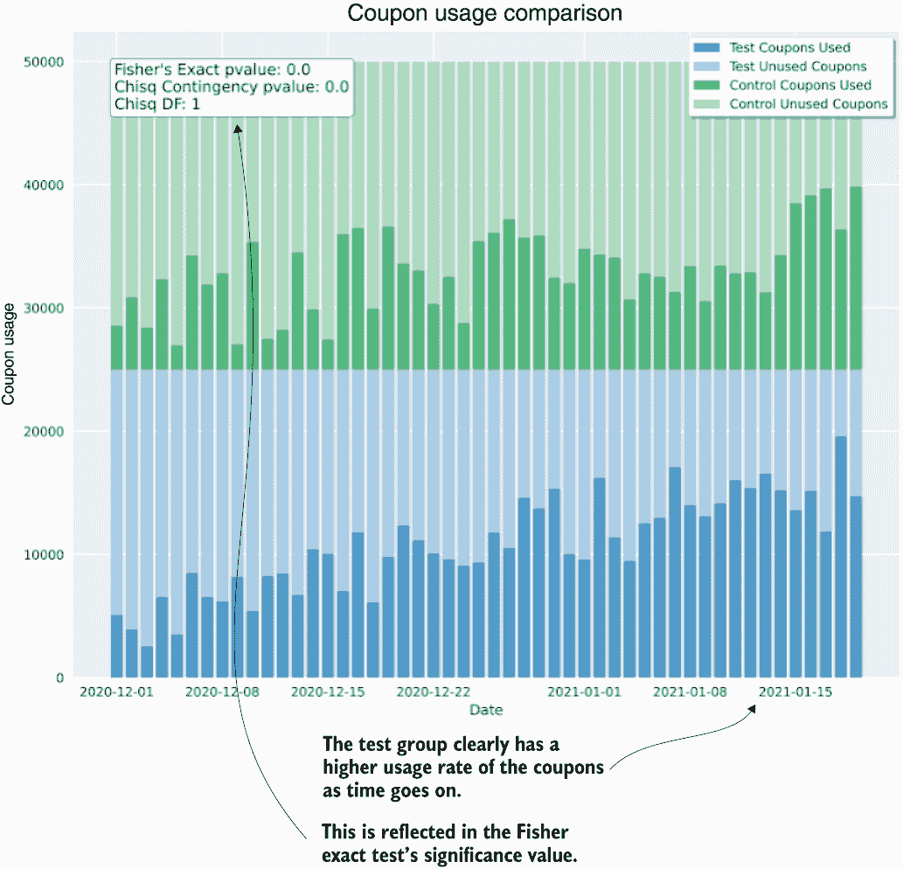

图 11.16 在假设测试分析中测量分类的“发生/未发生”事件

图 11.16 可能不适用于所有机器学习项目。本章前面的连续值测量更为常见。然而，如果您需要评估基于事件的数据并提供关于测试条件是否不同的结论性声明，拥有这种方法作为工具是必不可少的。

归因测量的通用应用

我们已经讨论了冰淇淋优惠券发行的模型归因测量。不是要贬低任何冰淇淋公司（我向你保证，我的狗爱你），但关于稍微“更严肃”的事业呢？

关于监控商业属性的关键是要选择一个有用的度量指标。这些指标的有用性，用更好的词来形容，完全集中在“细节决定成败”的概念上。商业成功的衡量具有细微差别，可以从有用到毫无意义。选择能够体现商业细微差别的可衡量属性至关重要。与负责该业务方面的业务单元 SME 团队进行讨论，以确保您的归因分析的相关性非常有帮助。

细节决定成败

对于外人来说，商业指标似乎是从常识中产生的。如果我们试图从模型中测量收入效应，我们只需查看销售额，对吧？如果我们计算参与度的提升，我们只需查看登录事件。优化飞往国际机场的航线会查看飞机的载客率，对吗？

虽然定义这些规则可能看起来微不足道，但我可以向你保证，事实并非如此。对于每个用例，如何计算哪个指标以及这些指标是如何计算的细节，都已被证明既复杂又高度具体于公司决定如何运营业务的方式。因此，与你的同事讨论任何归因指标非常重要，否则他们将为公司的报告目的计算这些指标。

如果你正在构建一个试图为公司目标收入的解决方案，与财务团队交谈。如果你正在为物流的效率优化工作，与运营部门交谈。如果模型的目标是减少制造部件的缺陷密度，你应该与质量保证和计量部门交谈。

拥有一系列与公司在互动领域定义其成功方式一致的指标，将确保在向业务展示模型影响时几乎不会出现混淆。有了这种一致性，对解决方案的信心得以培养，确保机器学习解决方案成为公司运营的关键关键方面，并有助于增长创新并为数据科学团队解决更多有趣的项目。

我该如何确定要监控哪些业务指标？

简短的回答：询问。

通常，数据科学团队是提出出色的机器学习项目想法的一方——尽管大多数时候，业务单元的赞助商或高管会向团队寻求解决问题的帮助。尽管如此，我可以数得清我参与过的创新问题数量。

我并不是在贬低所做的工作，只是诚实地表示，在构建机器学习解决方案之前，问题就已经存在。区别在于，它是由人类而不是算法和代码来处理的。收入最大化？那是市场营销。欺诈检测？那是欺诈部门。定价优化？需求预测？在你被召唤来帮忙之前，已经有很多人在做这些工作了。

这些人了解他们的技艺。他们对于数据的细微差别、他们负责的领域以及客户或流程的本质的了解将远远超过你。确定哪些业务方面可以用来创建衡量你将要构建的性能的可衡量指标的最佳来源是这些人。

每次我开始一个新的项目——除了最初在真空状态下构建的几个解决方案，它们失败得相当惨烈——我都会认识这些人。我会邀请他们参与讨论、共进午餐、参加会议，并且一般都会倾听他们说的每一句话。我会就他们自己的工作如何衡量成功（如果部门的目标是衡量你的模型的标准，那么每个人都会更容易理解其影响）提出尖锐的问题。我会询问他们用来确定其部门成功与否的查询。我会询问团队的目标和关键结果（OKR）是什么。

他们可能会告诉你，他们不是通过检测到的正确欺诈事件的数量来衡量的，而是更多地通过检测以前未见过的创新欺诈事件来衡量的。他们可能会说，他们专注于捕捉足够的欺诈，但从不希望错误地将欺诈标记在合法客户身上。这些可能会影响你模型的构建，但也可以用作衡量你实施健康状况的指标。

通过进行这种对齐并涉及对主题了解如此深入的人，你将为项目在发布后获得更高的成功率做好准备，但更重要的是，为能够以公司整体将看到的方式衡量生产发布模型的能力做好准备。这将有助于确保你在公司意识到这些问题之前就意识到退化问题（希望如此），从而提高项目的稳定性水平。

现在我们已经讨论了如何衡量归因分析中的 ML 实验，专注于回答业务希望对项目提出的关键问题，现在是时候面对房间里的大象了。我们需要弄清楚如何检测漂移，如何处理它，以及当我们的模型不可避免地恶化时何时采取行动。有了用于测量的统计数据，以及我们内部 DS 关注的损失指标，我们准备直面挑战。现在是时候考虑模型漂移了。

## 摘要

+   归因分析使 DS 团队能够清楚地沟通其解决方案如何解决其打算为业务解决的问题。利用适当的统计方法和受控测试可以提供关于解决方案状态的客观声明。

+   通过使用正确的统计测试来评估 A/B 测试数据，可以就解决方案性能的状态做出声明，提供基于数据的声明性影响。
