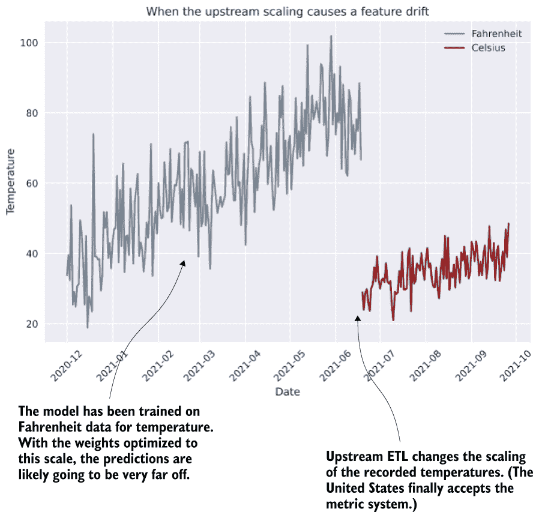
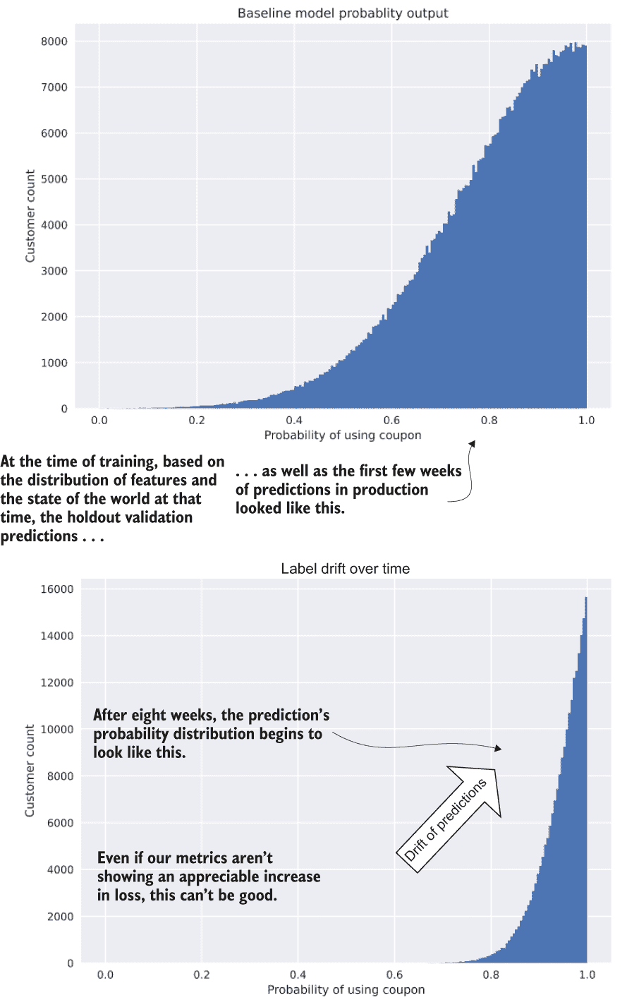
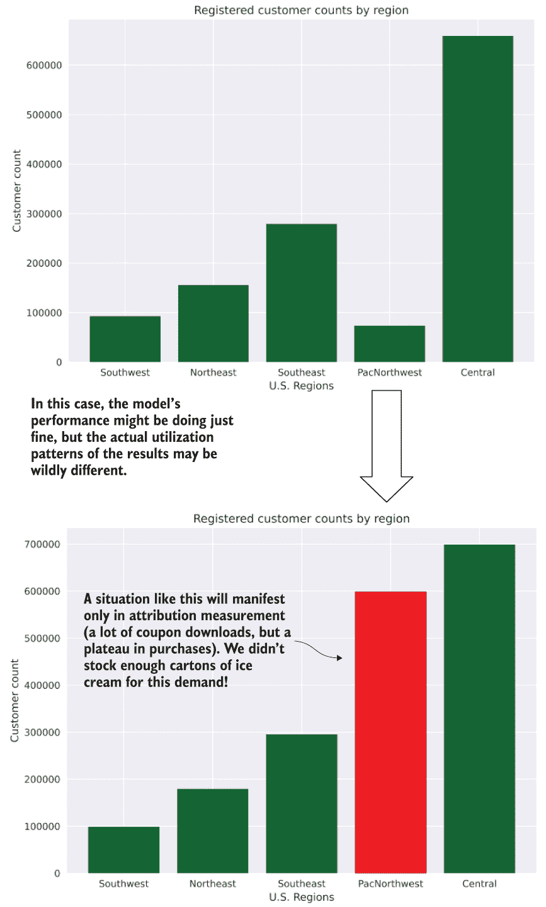
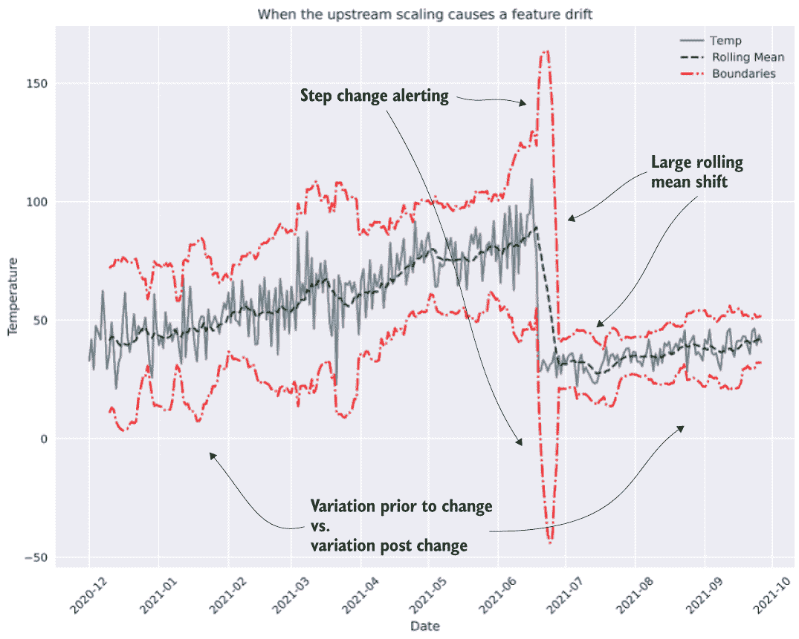
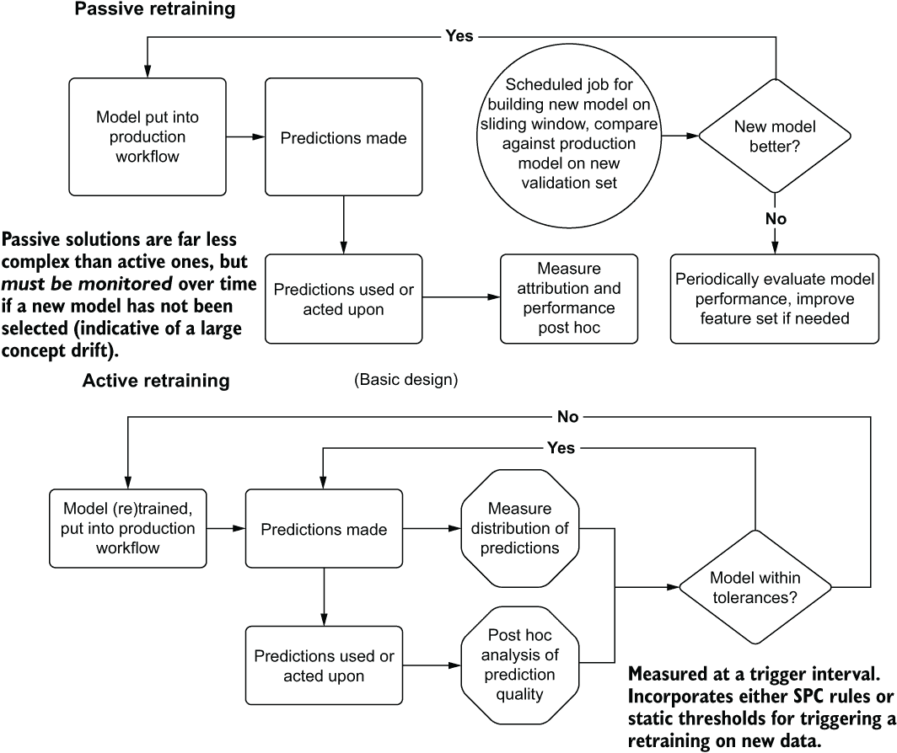

# 12 通过监控漂移来保持您的收益

本章涵盖

+   识别和监控生产解决方案中的漂移

+   定义对检测到的漂移的响应

在上一章中，我们为衡量机器学习解决方案的有效性奠定了基础。这个坚实的基础使数据科学团队能够用与业务相关的术语向业务沟通项目的性能。为了继续（希望）报告关于解决方案有效性的积极结果，还需要做更多的工作。

如果适当的归因监控和向业务报告是项目的基石和基础，那么熵就是试图不断摧毁项目的冲击风暴。我们称这种性能的混乱变化为“漂移”，它有多种形式。对抗它需要持续的监控和对进入和离开模型的一切保持怀疑和不信任。

在本章中，我们将探讨模型漂移的主要类型、原因和解决方案。对抗漂移将有助于确保您为公司带来的收益继续证明是富有成效的。

## 12.1 检测漂移

让我们假设我们已经将第十一章中的冰淇淋推荐器部署到生产中。我们在整个开发过程中都使用了良好的工程实践，我们的内部专家测试看起来很有希望。归因测量已设置，A/B 测试已定义，我们准备开始收集结果。我们将传说中的克苏鲁释放到世界上。

直到模型在生产中运行得非常顺利大约六周后，我们才被营销团队通知其在分析客户基础时发现的一些令人担忧的趋势。在国家的某个地区，优惠券的发行和返利率已经增加到如此程度，以至于出现了产品短缺，而在另一个地区，产品购买类型的失衡变得如此严重，以至于产生了大量过剩的废品。*可能到了稍微恐慌一下的时候了*。

我们集体陷入混乱，以临时方式深入研究特征数据，将所有其他项目工作暂停，以便我们应对这场试图调查问题根本原因是否为模型的即时火灾。经过几天对根本原因的探索性分析，几乎没有取得成果后，我们面临来自业务的最后通牒：要么修复模型，要么关闭它。虽然利润归因提升抵消了产品报废的成本，但这并不是一个足够有说服力的故事，无法安抚业务。

我们在启动模型的新一轮训练时，闭上眼睛，希望一切顺利。根据训练期间保留的验证评分指标的结果，似乎问题已经自行解决。至少目前是这样。

这里发生了什么？为什么模型突然开始表现得像这样？为什么业务会受到看似无害的事情如此严重的影响？最重要的是，在我们将此模型投入生产之前，我们应该做些什么不同的事情？

简单的答案是，*熵无处不在*。特征度量数据，以及影响因果关系的潜在因素，始终在变化。在许多情况下，我们对模型输出采取的行动会导致数据的变化。在训练期间模型未接触到的潜在影响可以引入新的相关性。曾经对目标优化有价值的关联关系可能会恶化或增强到一定程度，以至于模型输出的预测不再解决项目旨在解决的问题。

这些影响在某些用例中可能相当严重且迅速（例如，欺诈检测，因为犯罪分子很聪明，会适应创造性追求以击败你模型检测其活动的能力），而其他影响则是渐进的，如果不进行算法监控则容易忽略。意识到并控制这些不可避免的变动是机器学习项目开发的一部分。我们需要预料到它们，建立系统来发现它们，并知道如何从中恢复。

### 12.1.1 影响漂移的因素有哪些？

模型漂移可以采取六种主要形式。其中一些很容易检测到，而其他一些则需要大量的研究和分析才能发现。表 12.1 简要概述了这些模型退化机制。 

表 12.1 预测漂移类型及纠正措施

| 漂移类型 | 测量方法 | 纠正措施 |
| --- | --- | --- |
| 特征漂移 | 特征分布验证 | 在新数据上重新训练模型 |
|  | 后验预测错误计算 | 重新审视特征工程 |
| 标签漂移 | 预测的后验分析 | 在新数据上重新训练，调整 |
| 概念漂移 | 归因度量 | 执行特征工程工作 |
|  | 特征分布验证 | 重新训练模型 |
|  | 后验预测分析 | 重新审视解决方案（新算法或方法） |
|  | 临时分析 | 评估解决方案的相关性 |
|  | 因果模型（模拟） |  |
| 预测漂移 | 后验预测分析 | 分析对业务的影响 |
|  | 归因度量 |  |
| 现实漂移 | 你会直接知道。一切都在燃烧。 | 转向人工干预 |
|  |  | 重新评估特征 |
|  |  | 在训练数据中创建硬停止边界 |
|  |  | 重新训练模型 |
| 反馈漂移 | 改进模型所花费的时间 | 评估解决方案的有效性 |
|  | 重新训练期间的表现 | 确定是否需要新的解决方案 |

这些测量方法相对常见，在概念漂移检测中得到了最详细的描述。这些测量方法中的每一个都应该用于任何推向生产的模型。持续测量的原因很多，但最重要的是以下这些：

+   模型会漂移。没有静态实施的东西。

+   单凭归因测量很难识别渐进式退化。以多种方式监控性能可以提醒你注意那些在长时间内显现的问题。

+   如果没有历史测量，快速退化很难应对。在没有数据定义出了什么问题的情况下修复模型是极其耗时的。

+   警报可以在问题变成更大问题之前为你赢得宝贵的时间来修复。这有助于项目的使命，并增加企业对数据科学工作的信心。

为了探索这些漂移机制的每一个，我们将为了简便（以及乐趣）在本章中坚持使用冰淇淋场景。

注意：在第 12.2 节中描述的一些用于设置这些效果监控的技术，尤其是基于特征的漂移，对于采用厨房水槽方法的模型来说可能难以扩展。（我见过人们试图实现包含数千个特征的巨大向量，希望提高准确性。）这绝对是在设计预测解决方案时需要考虑的事情。采取简单的方法，只是把大量数据扔进模型，寄希望于最好的结果，最终可能会成为监控这种实施健康状况的噩梦。

特征漂移

让我们暂时想象一下，我们的冰淇淋购买倾向模型使用多个地区的天气预报数据。让我们也假装我们没有在我们的模型上设置监控，并且每月使用被动的模型重新训练。

当我们最初构建模型时，我们对特征进行了彻底的分析。我们确定了相关值（皮尔逊相关系数和卡方值），并发现温度和冰淇淋销量之间存在惊人的强关系。在前几个月，一切进展顺利，根据超过 60%的打开倾向得分，定期发送电子邮件。

突然间，到了六月中旬，归因模型开始急剧下降。打开率和利用率低得令人难以置信。从 20%的收入提升到现在的测试组显示 300%的损失。我们继续这样操作，营销团队尝试不同的营销方法。甚至产品开发团队也开始尝试新的口味，错误地认为顾客厌倦了正在销售的口味。

直到几个月后，当 DS 团队被告知项目可能被取消时，才会进行深入调查。在调查 6 月中旬开始的模型预测时，我们发现倾向性使用优惠券的概率发生了显著的阶梯函数变化。当我们查看特征时，我们发现一些令人担忧的事情，如图 12.1 所示。

尽管这是一个特征漂移的滑稽例子，但它与我职业生涯中见过的许多例子相似。我很少遇到一个数据科学家没有在未被告知的情况下意外地遇到数据流变化的情况，而且我所经历或听说的许多情况与这个例子一样荒谬。

许多时候，这种变化会如此之大，以至于预测结果变得无法使用，在短时间内就会知道发生了重大变化。在某些罕见的情况下，如图 12.1 所示，如果没有自动化监控，这种变化可能会微妙且难以在较长时间内检测到。

图 12.1 通过数值缩放变化引起的特征漂移

对于这个用例，预测输出将为经历新现代冰河事件的客户做出推荐。模型输出的概率对于大多数用户来说可能非常低。由于从模型发送推荐的后预测触发器设置为 60%的倾向性，因此较低的概率将导致评估测试中的绝大多数客户不再收到电子邮件。由于特征监控正在测量平均值和标准差，简单的启发式控制逻辑就会捕捉到这一点。

另一种特征漂移的形式是*特征无知*。当我们的推理数据到达一个训练模型，而这个模型超出了模型训练的范围时，这种漂移就会发挥作用。例如，如果我们的模型是在 60°F 到 95°F（南加州）的温度范围内训练的，而由于转换为摄氏度，插补特征漂移到 20，基于树的模型将很好地处理这种情况。它们将把这些新值归入任何捕获最低温度范围（约 60）的决策标准中。

然而，对于线性模型来说，情况并非如此。模型的缺陷毕竟是一个线性模型中的方程。推理特征向量中的温度值将与系数相乘，然后加到或从训练期间确定的特征计算余数中减去。当值远远超出训练估计期间看到的范围时，预测可能会以完全意想不到的方式表现。

标签漂移

*标签* *漂移*是一个相当难以追踪的问题。通常由几个关键（高重要性）特征分布的变化引起，标签的漂移可能会与业务的愿望背道而驰。

让我们假设由于数据收集不足，我们冰激凌倾向模型的一些方面开始受到我们不完全理解的潜在力量的影响。我们可以在相关性中看到似乎在驱动它的因素，因为它普遍降低了我们特征值中的一个方差。然而，我们无法将我们收集的数据特征与我们所看到的效果明确联系起来。我们看到的主要效果如图 12.2 所示。

图 12.2 标签漂移是预测分布的变化。

在这种分布变化下，我们可能会看到对业务的巨大影响。从机器学习的角度来看，模型在图 12.2 底部场景中的准确性（损失）理论上可能比初始训练时更好。这可能会使发现此类事件变得极其困难；从模型训练的角度来看，它可能看起来要好得多，更理想。然而，从业务角度来看，此类漂移事件可能会证明是灾难性的。

如果营销团队只在使用概率超过 90%的情况下发送定制电子邮件优惠券，会发生什么？这样的限制通常是由于成本（批量发送便宜，而定制解决方案对于服务来说要昂贵得多）。如果营销团队基于这个水平发送的阈值，在分析了模型预测的前几周结果后，它将为这些定制发送选择一个最佳的成本效益比。随着第二张图中标签漂移的发生，这意味着基本上所有测试组客户都会被纳入这个计划。这种成本的大幅增加可能会迅速使营销部门对项目失去兴趣。如果问题严重到足以让团队完全放弃对项目输出的利用。

密切关注模型输出随时间的变化分布，可以揭示潜在问题并确保输出的一致性。当结果发生变化（而且它们会的，请相信我），无论是看似积极的还是消极的，模型内部消费者可能没有准备好的后续影响。

总是最好进行监控。根据你解决的问题类型，如果你不持续监控解决方案输出的预测状态，对业务范围的影响可能会非常严重。标签漂移监控的实施应关注以下方面：

+   预测的收集和存储

+   对于分类问题

    +   定义一个用于聚合预测类别值的窗口时间，并存储每个值的计数。

    +   跟踪标签预测随时间变化的比率，并建立比率值的可接受偏差水平。

    +   进行等效性比较，使用如 Fisher 精确测试之类的算法，具有非常低的 alpha 值（< 0.01），比较最近值和模型生成期间计算的验证（测试）指标。

    +   （可选）确定最近数据的概率质量函数（`pmf`），并与模型在训练期间生成的验证预测的`pm` f 进行比较。可以使用如 Fisher 非中心超几何测试之类的算法进行`pmf`离散分布的比较。

+   对于回归问题

    +   通过捕获窗口数据的均值、中位数、标准差和四分位数间距（IQR）来分析最近预测的分布（根据预测的量和波动性，回溯天数和小时数）。

    +   为监测感兴趣的值设置阈值。当发生偏差时，提醒团队进行调查。

    +   （可选）确定与连续预测最接近的分布拟合，并通过使用如 Kolmogorov-Smirnov 测试之类的算法比较此概率密度函数（`pdf`）的相似性。

概念漂移

*概念* *漂移* 是一个具有挑战性的问题，可能会影响模型。用最简单的话说，它是一个引入了一个具有强烈影响模型预测的大隐含（未收集）变量的过程。这些影响通常在广义上表现出来，改变了一个训练模型用于插补的大多数，如果不是所有特征。继续我们的冰淇淋例子，让我们看看图 12.3。

图 12.3 概念漂移对模型性能、业务影响和归因测量的影响

我们测量并用于基于相关性的训练（天气数据、我们自己的产品数据和事件数据）的这些值，已被用来建立强大的相关性，以预测个人客户在周内购买冰淇淋的倾向。正如我们在第十一章中讨论的，我们无法收集的潜在变量对一个人购买决策的影响比我们收集的数据更强。

当未知因素正面或负面地影响模型输出时，我们可能会在我们的预测或模型归因测量中看到剧烈的变化，这正是这里的情况。追踪根本原因可能是非常明显（全球大流行）或微妙复杂（社交媒体对品牌形象的影响）。我们可以按照以下方式监控我们场景中的此类漂移：

+   实施指标日志记录，包括

    +   主要模型误差（损失）指标

    +   模型归因标准（项目正在努力改善的业务指标）

+   收集并生成预测的聚合统计信息（适用于适用的时间窗口）：

    +   计数（预测次数、分组队列中的预测次数等）

    +   回归器的均值、标准差、四分位数间距

    +   计数（预测次数、预测的标签数量）和分类器的分桶概率阈值

+   评估预测和归因测量随时间推移的聚合统计数据趋势。无法解释的漂移可能是模型重新训练或回归到特征工程评估（可能需要额外的特征来捕捉新的潜在因素效应）的依据。

无论原因如何，重要的是要监控这个问题的潜在症状：与被动重新训练相关的模型指标，以及与主动重新训练相关的模型归因数据。监控这些模型有效性的变化可以帮助进行早期干预，解释性分析报告，以及以不会对整个项目造成干扰的方式解决问题。

与其他类型的漂移（即特征和预测漂移）相比，答案可能并不明显。对于这种无法解释的漂移，生产监控的关键方面是它首先被捕捉到。如果对这种可能对模型性能的影响视而不见，那么根据用例，如果未加控制，可能会对业务产生巨大的影响。通过简单的 ETL 创建这些监控统计数据总是值得花费时间。

预测漂移

*预测* *漂移* 与标签漂移高度相关，但有一个细微的区别，使得从这种类型的漂移中恢复需要遵循另一套行动。像标签漂移一样，它极大地影响了预测，但它与外部影响无关，而是直接与模型的一部分特征（尽管有时是以混淆的方式）相关。

让我们想象一下，我们的冰淇淋公司当时在训练我们的模型解决方案时，在美国太平洋西北地区的表现相当糟糕。由于缺乏训练数据，模型并不适合适应与该地区相关的极端少数特征数据。加上这个数据不足的问题，我们还不知道该地区的潜在未来客户是否喜欢我们的产品，因为同样的信息缺乏导致了探索性数据分析（EDA）的信息不足。

在新活动运行的前几个月，通过口碑提高知名度后，结果发现不仅太平洋西北地区的人们（和狗）非常喜欢我们的冰淇淋，而且他们的行为模式与我们的最活跃客户之一相当吻合。因此，我们的模型增加了向该国该地区客户发放优惠券的频率和速率。由于这种需求增加，模型开始向该地区的客户发放如此多的优惠券，以至于我们创造了一个全新的问题：库存问题。

图 12.4 显示了我们的模型无意中帮助创造的业务影响。虽然这本身并不是一个问题（它确实提高了收入！），但业务运营基础的意外驱动因素可能会引入需要解决的问题。

图 12.4 所示的情况确实是一个积极的局面。然而，在这种情况下，模型的影响不会在建模指标中显示出来。实际上，这可能会显示为一个相当等效的损失分数，即使我们在这个新数据上重新训练模型也是如此。归因测量分析是唯一能够检测这种情况并解释客户基础未来潜在变化的方法。

图 12.4 模型输出的高度有益的商业影响。这可能会引起其他问题，可能需要快速调整（尤其是如果发生相反条件时）。

从一般意义上讲，预测漂移通过特征监控过程处理。这组工具涉及许多以下概念：

+   与最近值相比，每个特征的先验分布的分布监控，滞后一个适当的时间因子：

    +   计算特征在训练时间点的均值、中位数、标准差、四分位数范围。

    +   计算用于推理的最近特征统计指标。

    +   计算这些值之间的距离或百分比误差。

    +   如果这些指标之间的差异超过一个确定的水平，则向团队发出警报。

+   分布等效性测量：

    +   将连续特征转换为训练期间的特征的概率密度函数（`pdf`）。

    +   将名义（分类）特征转换为训练期间的特征的概率质量函数（`pmf`）。

    +   利用 Wasserstein 度量或 Hellinger 距离等算法计算这些与最近（在训练过程中对模型不可见）的推理数据之间的相似性。

+   为每个特征的基本统计指标指定统计过程控制（SPC）规则：

    +   基于 Sigma 的阈值水平，通过测量每个连续特征随时间的变化的平滑值（通常通过移动平均或窗口聚合）并在违反选定规则时发出警报。通常使用 Western Electric 规则。

    +   基于特征中分类或名义值的缩放百分比成员资格的 SPC 规则（按时间函数聚合）。

无论您选择哪种方法（或者如果您想选择全部方法），在训练过程中收集关于特征状态的信息的最重要的方面是，它允许进行监控并提前通知特征退化。

为了帮助跟踪这些统计指标，许多人（包括我自己）严重依赖 MLflow 的跟踪服务器。将值作为模型训练事件的一部分进行记录可以帮助确保该模型用于训练的历史记录得到保留，同时避免每次执行漂移验证时都要进行昂贵的（计算和时间的）历史计算。

现实漂移

我是在 2022 年 1 月 20 日写下这句话的。过去一年对冰淇淋行业来说是个艰难的年份。可以说，对人类来说，这也许是个艰难的一年。曾经是我们公司销售美味佳肴（冰淇淋车在社区、社区公园、体育赛事和狗公园附近巡逻）的主要手段，对我们来说并没有那么顺利。我们不得不重新评估我们的分销策略和营销信息，并在由于 Covid-19 的影响而造成的极其艰难的经济环境中努力。

**现实漂移**是概念漂移的一种特殊情况：虽然它是一种外部（未测量和不可预见的）影响，但这些基础性的转变对模型的有效性可能比一般的概念漂移有更深远和更大规模的影响。不仅仅是流行病会导致现实漂移。毕竟，马蹄铁制造商在 20 世纪的前几十年预测需求时也会遇到类似的问题。

这些事件在根本上是变革性和破坏性的，尤其是当它们是**黑天鹅事件**时。在最严重的情况下，它们对企业的损害可能如此之大，以至于一个功能失调的模型只是他们担忧的最坏情况；公司持续存在的问题更为紧迫。

对于更为温和的破坏性现实漂移，运行在生产中的机器学习解决方案通常受到相当大的冲击。由于无法识别哪些新特征可以解释业务中的潜在构造性变化，适应解决方案以处理大规模和即时变化成为了一个时间问题。简单地来说，没有足够的时间或资源来修复模型（有时甚至没有收集所需数据的可能性）。

当这类基础性的范式转变事件发生时，受到世界状态变化影响的模型应该面临两种命运之一：

+   由于表现不佳和/或成本节约措施而放弃

+   在进行广泛的特征生成和工程后重建模型

你绝对不应该做的事情是安静地忽视问题。预测很可能是无关的，盲目地在原始特征上进行再训练不太可能解决问题，让表现不佳的模型继续运行是代价高昂的。至少，需要对进入模型的特征的性质和状态进行全面评估，以确保其有效性仍然可靠。如果不以这种彻底的验证和验证方式来处理这些事件，模型（以及其他模型）被允许继续长时间产生未经审查的结果的可能性很小。

反馈漂移和收益递减定律

一种较少提及的漂移形式是*反馈漂移*。想象一下，我们正在为估计工厂制造的零件的缺陷密度开发一个建模解决方案。我们的模型是一个因果模型，我们的生产配方被构建成反映一个反映我们的生产过程的定向无环图。通过运行贝叶斯建模方法来模拟改变参数对最终结果（我们的产量）的不同影响，我们发现我们有一组看似最优的参数可以放入我们的机器中。

最初，模型显示的关系并不能导致最佳结果。随着我们进一步探索特征空间并重新训练我们的模型，模拟结果在测试启动时能更准确地反映预期的结果。在模型运行的前几个月，我们的产量稳定在近 100%。

通过控制我们在建模系统中存在的因果关系，我们已经在模型中有效地创建了一个反馈循环。可调整参数的方差缩小，如果我们为验证目的构建一个监督机器学习模型，它将学不到很多东西。这里根本就没有可以学习的信号（至少不是值得太多）。

这种影响并不在所有情况下都存在，因为因果模型比基于相关性的传统机器学习模型更容易受到影响。但在某些情况下，基于相关性的模型预测结果可能会污染我们新收集的特征，从而扭曲那些与实际发生观察结果收集的特征的效果。流失模型、欺诈模型和推荐引擎都高度易受这些影响（我们通过采取行动来促进积极结果和最小化消极结果，直接操纵客户的行为了）。

这是在许多监督学习问题中的一个风险，可以通过评估预测质量随时间的变化来检测。每次重新训练发生时，与模型相关的指标都应该被记录（MLflow 是一个很好的工具），并定期测量，以查看是否在将新特征数据包含到模型中时发生了退化。如果模型根本无法根据用于最近活动的验证数据将损失指标恢复到可接受的水平，那么你可能处于收益递减的领域。

对此现象的响应是重新审视特征工程工作（添加可以帮助模型学习新数据范式的数据）或重新审视项目。重新审视项目有时意味着最好将其关闭。一些问题可以通过利用机器学习来发现系统（或人）行为中的模式并在一段时间内完全解决，可以通过修改业务运营的方式取代。

## 12.2 对漂移的响应

我们已经介绍了如何通过在归因度量上使用适当的统计测试来计算模型影响，我们也讨论了导致我们的模型随时间变得不稳定的影响模型熵的类型。如果我们看到我们的冰淇淋优惠券模型在 12.1 节中定义的六种方式中的任何一种恶化，我们将使用什么过程来纠正它？

### 12.2.1 我们能对此做些什么？

所有这一切都始于监控。对于我们冰淇淋优惠券场景，这涉及到构建 ETL 流程，不仅包括我们的预测（安全存储每个批次的预测以供分析用途），还包括基本统计测量属性，用于设置关于模型健康状况的触发警报。

让我们回顾一下第十一章中作为特征输入到我们模型的外部温度测量。图 12.5 展示了通过在温度特征上设置三个单独的检查，我们可以如何检测底层数据中存在的问题。

此图仅作为视觉辅助。在实际操作中，警报将通过在数据上执行的计算进行配置，如果边界移动的幅度超过预先设定的阈值，则触发警报，这完全基于代码中编写的逻辑。然而，此图中所识别的三个区域是应该嵌入到监控代码中的规则的示例，这些规则可以提醒团队注意模型输入特征中存在的问题。

图 12.5 在特征周围设置阈值边界以警报大范围变化

第一个识别出的检测（基于平均值的阶跃变化警报）对于检测可能对模型预测能力造成问题的较大、意外的偏差非常有用。这类规则相对容易实现，可以配置阈值，并且是机器学习团队在新的数据到达时立即干预的有效早期预警系统。

第二种检测类型（数据方差值的阶跃变化）通常需要更多的时间来触发。同一值（温度）在不同尺度（摄氏度与华氏度）上的方差本质上是不同的。因此，数据的总方差将显示出明显的差异。然而，为了减少在离散时间段内出现假阳性警告的可能性，与方差监控相关的警报条件通常需要更长时间才能触发。

第三种指示类型，尽管与平均值的移动一致，但却是历史上未曾观察到的显著增加的变异性。当变异性测量中出现大峰值（通常远大于本例中第二个案例所监控的变化）时，有必要调查被测量的数据状态。

至少，为了防止模型有效性的缓慢熵减和如图 12.5 所示的基础颠覆性事件，我们需要测量我们模型的一些方面。特征监控、训练标签漂移测量、模型验证指标和归因指标都是构成有效策略以识别漂移的元素。

表 12.2 展示了我在不同行业中看到并参与过的常见建模类型，以及重新训练事件之前稳定性保持的一般估计，以供参考。

表 12.2 模型稳定性和对漂移的鲁棒性

| 应用 | 归因度量指标 | 重新训练周期性（近似） |
| --- | --- | --- |
| 持续流失预测 | 对高概率客户采取行动后的购买事件 | 每月 |
| 客户终身价值（CLV） | 继续 CLV 群体成员的百分比 | 每周 |
|  | 稳定性 |  |
| 交通运输业 | 收入 | 每月 |
| 需求/定价 | 购买率 |  |
| 推荐引擎（个性化） | 购买率或观看率 | 每小时或每日 |
| 图像内容标注 | 分类错误百分比 | 两到六个月 |
| 欺诈检测 | 损失事件计数 | 双周 |
|  | 损失金额 |  |
|  | 未检测到的欺诈事件计数 |  |
| 设备故障 | 维护成本（更换） | 每半年或每年 |
| 预测（生存能力） | 不必要维护的计数 |  |
| 销售预测 | 预测准确性回溯测试 | 每日或每周 |

如您所见，预测的重新训练周期性在各个应用中差异很大。表 12.2 并未反映这些计划之外的情况。即使有系统用于主动重新训练，在模型归因性能下降时触发创建新模型，也不能保证新模型的成功持续。漂移效应可能已经影响了旧模型和新模型（大多数情况下确实如此），以至于仅仅在新的数据上重新训练并不能将模型性能修复到可接受的水平。

对于被动计划的重新训练范式，如果归因测量没有密切监控，问题可能需要更长的时间才能显现。根据表 12.2 中提到的周期性（大致近似），漂移事件后的第一次计划重新训练通常会发现需要手动干预解决的问题。这可能包括重新审视项目的特征工程阶段，包括新特征，这些特征可以帮助模型适应现有特征中的新世界状态，或者是对最初构建项目所使用方法的彻底改革。

通过监控影响模型的因素，从特征指标和模型指标，到归因测量，我们可以识别出预测中存在的问题。然而，一旦我们识别出问题，我们又能做些什么呢？

### 12.2.2 对漂移的响应

对于之前在图 12.5 中展示的温度漂移示例，修复漂移条件时的响应是微不足道的。我们可以对旧数据进行特征转换，使其与新温度值的缩放一致。识别、隔离和修复明显且易于纠正的问题，嗯，很明显。只需修复并继续前进。

不幸的是，并非每个问题都如此简单。如果我们不能轻易地识别导致模型退化的原因怎么办？我们有四种主要方式来应对漂移：

+   安排或触发的重新训练，对先前模型的结果进行验证，对新模型进行新验证数据的验证。保留最好的一个。

+   对于明显的问题（例如，ETL 错误、基数爆炸或特征方差的变化），要么修复或缩放特征，重新训练模型，在新保留数据上验证其性能，然后在新模型上继续运行，就像以前一样。

+   对于与前面列表项中提到的明显因素无关的预测退化问题，重新审视特征工程，进行探索性数据分析和相关性分析。确定是否需要添加任何新特征或删除现有特征。尝试重新训练并发布一个经过验证的新模型到生产环境中。

+   如果模型显示出具有统计学意义的负面业务影响，立即停止使用该模型。尝试进行根本原因分析并修复问题（如果可能）。如果模型的好处不再存在，永久关闭它。

列表中的后三个元素相对容易理解。然而，第一个元素在重新训练的机制上具有一定的细微差别。启动重新训练事件有两种主要方式：被动和主动，如图 12.6 所示。

图 12.6 被动重新训练（计划）和主动重新训练（触发）以应对模型漂移

这两种启动模型重新训练的机制非常不同。在*被动重新训练*中，我们设置一个计划任务，该任务将使用我们的特征数据的一个滑动窗口来训练一个新模型（这种方法对于预测随时间快速变化的值的动态数据集非常有用）或者从时间开始的所有数据，包括之前的生产模型尚未看到的新数据。然后我们从最新数据中取出一组保留验证集，对当前先前的模型（我们的生产模型）和新的模型进行模型评估，评估它们在相同的保留验证数据上的性能。根据我们的模型指标，获胜者将被选为生产模型。

对于这种被动重新训练方法，我们通常会设置警报，以便在新的模型在多次迭代后没有被选为替换时通知我们。这是为了警告我们，最近的数据可能发生了根本性的变化，这可能表明需要重建特征工程集（这将是一项从被动重新训练周期中移除的活动）。

对于图 12.6 下半部分所示的活动重新训练实现，使用了一种持续监控的自动化解决方案，该解决方案测量与模型业务影响和预测质量（分布、方差、均值等）相关的属性。如果归因度量的监控检测到性能下降，将发生自动重新训练事件。与被动实现一样，会进行新触发的模型事件与最近保留数据对比当前运行模型与相同数据的比较。如果新模型表现更好，它将被选中提升到生产环境中（通常通过 CI/CD 自动化）。与被动方法一样，如果早期一代模型迭代连续失败，将触发 DS 团队的警报以进行调查。

选择被动或主动实现完全适用于在项目上工作的 ML 团队的大小、实现的稳定性、业务用例的性质以及团队的能力。对于 ML 项目来说，选择哪种解决方案无关紧要。唯一重要的是要理解，其中之一必须被选择。

将模型置之不理，假设它将继续像最初训练时那样良好地预测，而不采取任何进一步行动，这是灾难的预兆。那些没有考虑到重新训练、健康检查、监控和归因度量的项目注定会失败，因为它们的不相关性或积极的不良结果会对业务产生负面影响。

## 摘要

+   监控漂移的主要类型——特征、标签、概念、预测、现实和反馈——对于确保解决方案的健康至关重要。

+   通过被动或主动的方式重新训练是有效对抗漂移的方法。当这些尝试失败时，重新审视实现方式是至关重要的，以便引入处理漂移的新功能，以确保解决方案继续发挥作用。
