# 13 机器学习开发傲慢

本章涵盖

+   将重构应用于过度工程化的实现以提高开发速度

+   确定要重构的代码

+   建立以简单性为驱动的发展实践

+   通过可持续的方式采用新技术

+   比较实现中的构建、购买和先验艺术

前一章侧重于用于从纯粹预测和解决方案有效性角度衡量项目整体健康的临界组件。当然，旨在通过有效和详细监控其输入和输出以支持长期生存的机器学习项目肯定比那些没有这样做的项目有更高的成功率。然而，这仅仅是故事的一部分。

成功项目中的另一个主要因素与工作的这一人类方面有关。具体来说，我们需要考虑在解决方案的生命周期中支持、诊断项目代码库的问题、改进和维护项目代码库的人类。

注意 当项目发布到生产环境时，这仅仅是其生命周期的开始。机器学习的真正挑战是让某物在长时间内运行良好。

以下是人类元素的表现形式：

+   *代码的构建方式*——其他人能否阅读并理解它？

+   *代码的性能*——它是确定性的吗？它是否有无意之外的副作用？

+   *代码的复杂性*——它是否过度或不足工程化以适应用例？

+   *改进的容易程度*——机器学习代码处于不断的重构状态。

在本章中，我们将探讨需要注意的迹象，这些迹象定义了使机器学习代码库难以维护的模式。从炫耀的开发者的花哨代码（show-off developers）到构建帝国的框架创造者，我们将能够识别这些问题，看到替代方案，并理解为什么最有效的机器学习项目代码开发设计模式与其他项目的所有其他方面相同。

小贴士 只构建解决问题所需的复杂度。毕竟，人们必须维护这段代码。

为什么是“傲慢”？这有点侮辱性。

在经过长时间深思熟虑后，我选择“傲慢”这个词作为本章标题的一个组成部分，这是在两个不同时间版本的我之间进行的。一方面是我的当前自我，由于对自己技能的过度自信而感到失败的痛苦，构建了令人困惑的、以自我为中心的解决方案，追求虚荣的虚荣，以及在代码中吹嘘的人，他衡量项目成功的方式是其实施的巧妙性。另一方面是我年轻得多、刚开始在这个领域工作的版本，感觉自己不称职，就像我能想象到的一个人一样，是一个冒牌货。

我在是否使用“傲慢”这个词而不是“自负”上犹豫不决，但觉得那样做是不诚实的，也不适用于我们将在本章中讨论的内容（以及我希望我能与年轻时的自己进行一场长谈的内容）。“自负”更为适用。根据定义，它是指拥有过度的骄傲和自信。请注意，这并不是关于拥有骄傲（当我们在我们职业中解决一个复杂问题时，我们都应该感到骄傲），而是过度地拥有它。

当我们作为数据科学家表现出傲慢的倾向时，我们往往会构建过于复杂的解决方案来解决问题。无论是因为自负、虚荣，还是简单地想要向同伴证明我们的技能足够高（通常是由于冒充者综合症或过去被我们写过的某些垃圾代码所伤害），最终结果都是一样的：遗憾。我们最终构建了难以维护、令人困惑、过于复杂且无法扩展的解决方案，这些解决方案有很大概率会导致项目失败或让我们的同伴感到沮丧，并且害怕有一天我们必须调试代码中的故障。

本章涵盖了我在追求代码简洁性过程中学到的一些危险方法，定义了可持续的机器学习开发模式，希望这些模式能帮助你避免我多年来犯的一些痛苦错误。

## 13.1 优雅的复杂性 vs. 过度设计

暂时想象一下，我们正在启动一个新的项目。这并不太偏离前两章的内容（剧透：这与狗有关）。我们有一些关于狗的数据。我们知道它们的品种、年龄、体重、最喜欢的食物，以及它们是否通常具有讨人喜欢的性格。此外，我们还拥有标记数据，这些数据衡量了每只狗在走进我们的宠物店连锁店时是否表现出饥饿的迹象。

带着这些数据，我们想要构建一个模型，根据我们犬类消费者的注册数据预测，当他们通过结账线时，我们是否应该给他们提供零食。

注意：是的，我完全清楚这有多愚蠢。不过，这会让我的妻子笑出声，所以这个场景还是保留着。

当我们开始调查数据时，我们意识到我们拥有真正巨大的训练数据量。数以亿计的行数据。然而，我们希望利用所有这些数据来训练模型，因此我们的平台决策为我们留下了简单的选择：Apache Spark。

由于我们在这本书中广泛使用了 Python，让我们利用本章深入探讨另一种广泛用于大规模（就训练行数量而言）机器学习项目的语言：Scala。由于我们将使用 Spark 的 ML 库，为了有效地从我们的列式数据中构建特征向量，我们需要识别任何非连续的数据类型并将它们转换为索引整数值。

在我们进入展示本节主题差异的代码示例之前，让我们讨论一下机器学习编码实践的比例。我喜欢将开发风格（就代码复杂性而言）视为一种微妙的平衡行为，如图 13.1 所示。

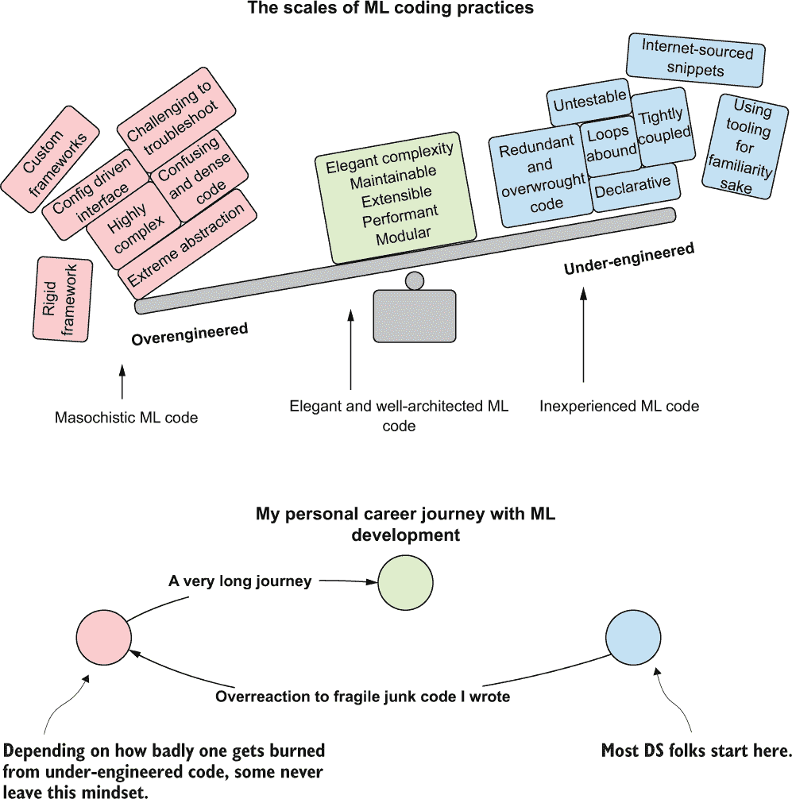

图 13.1 在软件开发实践这两种极端之间取得平衡可以导致更有效和更稳定的工程项目工作。

在这个尺度的右侧，我们有非常轻量级的代码。它高度声明性（几乎像脚本一样），单调（语句被多次复制粘贴，参数略有变化），并且耦合紧密（更改一个元素意味着在代码中搜索并更新所有基于字符串的配置引用）。

这些轻量级代码库往往看起来像是不同公司团队编写的。在许多情况下，确实如此，因为整个函数和代码片段被完整地从流行的开发者问答论坛中提取出来。它们共享的一个附加特性是对高度流行的框架和工具的依赖，这些框架和工具有很好的文档（或者至少足够复杂，以至于在上述开发者论坛上提供了足够的问题和答案，可以自由借用），无论用例是否合适。以下是这种行为的几个关键标识符：

+   当训练数据集有数千行和数十列时，使用为大规模机器学习设计的框架。（例如，而不是使用 SparkML，坚持使用 pandas，并在广播模式下使用 Spark 进行训练。）

+   当请求量永远不会超过每分钟几个请求时，在大型服务架构之上构建实时服务。（而不是使用带有 Seldon 的 Kubernetes，请在 Docker 容器中构建一个简单的 Flask 应用。）

+   当每小时需要处理几百个预测，且服务等级协议（SLA）可以以分钟为单位衡量时，设置一个用于大规模微批预测的流式摄取服务。（而不是使用 Kafka、Spark Structured Streaming 或 Scala 用户定义函数，请使用 Flask 应用。）

+   使用 GPU 硬件上运行的 LSTM 构建时间序列预测模型，使用 Horovod 多 GPU 群组调度模式，对于可以预测出单数 RMSE 值的多变量时间序列。 （使用 ARIMA 模型，并选择远更便宜的基于 CPU 的虚拟机。）

然而，在刻度的一侧，是它的完全对立面。代码密集、简洁、高度抽象，通常复杂。左侧可以在某些团队和组织中工作，但总体来说，它是多余的、令人困惑的，并且由于理解高级语言特性所需的经验，限制了可以贡献项目的人数。一些机器学习工程师在处理足够大且复杂的机器学习开发轻量级脚本式风格的项目后，可能会在后续项目中追求左侧的重型代码方法。他们在维护脚本式风格和所有存在的广泛耦合方面遇到的挑战可能会导致抽象操作器的爆炸性增长，迅速接近构建通用框架。我可以相当诚实地说我就是那个人，这在图 13.1 的底部可以看到我的旅程。

在图表的中间，坐着一个平衡的方法，它为团队开发风格的长期成功提供了最大的可能性。让我们看看我们的代码在开始使用这两种竞争的极端对立面时可能的样子。

### 13.1.1 轻量级脚本式风格（命令式）

在我们深入探讨编写原型机器学习模型的简约声明式代码之前，让我们简要地看一下我们的数据是什么样的。表 13.1 显示了数据集的前五行样本。

表 13.1 我们饥饿狗数据集的数据样本

| 年龄 | 体重 | 最喜欢的食物 | 品种 | 好男孩或女孩 | 饥饿 |
| --- | --- | --- | --- | --- | --- |
| 2 | 3.05 | Labneh | Pug | No | True |
| 7 | 20.44 | Fajitas | Dalmatian | Sometimes | False |
| 5 | 11.3 | Spaghetti | German Shepherd | No | True |
| 3 | 17.9 | Hummus | Estrela | Yes | False |
| 8 | 55.6 | Bolognese | Husky | 是的，当有食物时 | True |

我们可以清楚地看到，我们的大部分数据都需要编码，包括我们的标签（目标）`hungry`。

让我们看看我们如何通过构建向量和运行简单的`DecisionTreeClassifier`来处理这些编码，使用 SparkML 的 Pipeline API。这些操作的代码如下所示。（参见“为什么选择 Scala？”侧边栏，了解为什么我选择用 Scala 而不是 Python 来展示这些示例。）

列表 13.1 命令式模型原型

```
import org.apache.spark.ml.feature.{StringIndexer, 
 VectorAssembler, 
 IndexToString}
import org.apache.spark.ml.classification.DecisionTreeClassifier
import org.apache.spark.ml.evaluation.BinaryClassificationEvaluator
import org.apache.spark.ml.Pipeline
val DATA_SOURCE = dataLarger                              ❶
val indexerFood = new StringIndexer()
  .setInputCol("favorite_food")
  .setOutputCol("favorite_food_si")
  .setHandleInvalid("keep")
  .fit(DATA_SOURCE)                                       ❷
val indexerBreed = new StringIndexer()
  .setInputCol("breed")
  .setOutputCol("breed_si")
  .setHandleInvalid("keep")
  .fit(DATA_SOURCE)                                       ❸
val indexerGood = new StringIndexer()
  .setInputCol("good_boy_or_girl")
  .setOutputCol("good_boy_or_girl_si")
  .setHandleInvalid("keep")
  .fit(DATA_SOURCE)
val indexerHungry = new StringIndexer()
  .setInputCol("hungry")
  .setOutputCol("hungry_si")
  .setHandleInvalid("error")
  .fit(DATA_SOURCE)                                       ❹
val Array(train, test) = DATA_SOURCE.randomSplit(
  Array(0.75, 0.25))                                      ❺
val indexerLabelConversion = new IndexToString()
  .setInputCol("prediction")
  .setOutputCol("predictionLabel")
  .setLabels(indexerHungry.labelsArray(0))
val assembler = new VectorAssembler()
  .setInputCols(Array("age", "weight", "favorite_food_si", 
    "breed_si", "good_boy_or_girl_si"))                   ❻
  .setOutputCol("features")
val decisionTreeModel = new DecisionTreeClassifier()
  .setLabelCol("hungry_si")
  .setFeaturesCol("features")
  .setImpurity("gini")
  .setMinInfoGain(1e-4)
  .setMaxDepth(6)
  .setMinInstancesPerNode(5)
  .setMinWeightFractionPerNode(0.05)                      ❼
val pipeline = new Pipeline()
  .setStages(Array(indexerFood, indexerBreed, indexerGood, 
    indexerHungry, assembler, decisionTreeModel, 
    indexerLabelConversion))                              ❽
val model = pipeline.fit(train)                           ❾
val predictions = model.transform(test)                   ❿
val lossMetric = new BinaryClassificationEvaluator()      ⓫
  .setLabelCol("hungry_si")
  .setRawPredictionCol("prediction")
  .setMetricName("areaUnderROC")
  .evaluate(predictions)
```

❶ dataLarger 是一个包含表 13.1 中样本的完整数据集的 Spark DataFrame。

❷ 索引第一个字符串类型的列（品种）并创建一个基于发生频率的 0th 有序降序排序的新索引

❸ 为下一个分类（字符串）列构建索引器（很高兴只有四个，对吧？）

❹ 为目标（标签）列构建索引器

❺ 创建训练和测试分割

❻ 定义将用于特征向量的字段（列）

❼ 构建决策树分类器模型（为了简洁，超参数硬编码）

❽ 定义操作顺序并包装在管道中（在实验过程中进行了大量修改）

❾ 将管道拟合到训练数据上（执行管道的所有阶段，返回处理步骤以及作为单个操作对象返回的模型）

❿ 针对测试数据进行预测，以进行评分

⓫ 计算评分指标（在这种情况下，为 areaUnderROC）并返回指标值

这段代码看起来相对熟悉。这是我们查看特定建模框架的 API 文档时都会看到的。在这种情况下，是 Spark，但任何特定框架都有类似的例子。它是一种命令式风格，这意味着我们在代码中直接提供执行步骤，保留了我们一步步执行此步骤的方式。虽然这使得代码非常易于阅读（这就是为什么入门指南中的示例使用这种格式），但在实验和 MVP 开发过程中，修改和扩展代码却是一个噩梦。

为什么选择 Scala？

嗯，我们主要使用 Scala 是因为 Spark。Python 是 Spark 的官方语言，Spark 完全支持 Python，但 Spark 的后端（即香肠是如何制成的底层细节）是用 Scala 编写的。Python API 仅仅是 Scala API 的包装器（接口），因此，如果需要将比`DataFrame` API 更底层的功能接口化，我们必须在 Scala 或 Java 中这样做。

在 Spark 中使用 Python 还是 Scala 的选择通常取决于以下简短的因素列表：

+   对 Java（或 Scala）的熟悉程度与 Python 相比

+   需要执行复杂的数据操作，这些操作不能直接通过`DataFrame` API 的函数模块支持——通过使用用户定义的函数、弹性分布式数据集（RDD）操作或开发自定义评估器和转换器

+   需要使用自定义分布式算法来解决特定问题（例如，在撰写本书时，XGBoost 仅作为 Scala/Java 库可用）

“但为什么在这本书中使用 Scala？”

这是一个非常好的问题。主要是因为在行业中存在一个庞大的沉默群体，他们是机器学习工程师，他们更倾向于使用 Scala 来处理他们的机器学习任务，尤其是在处理极其庞大的数据集时。（由于使用 Scala 的代码比 Python 等更宽容的语言的入门门槛更高，因此在互联网搜索结果中很难找到关于 Scala 和 Java 使用的问题。）我将 Scala 包括在本章中，是为了展示一种与大多数人熟悉的方法略有不同的机器学习代码开发方法，以期激发好奇心并拓宽你的视野。虽然如果你只习惯于 Python，这种语言可能看起来很陌生，但请让我向你保证，学习它可以是一项有益的尝试，并且可以帮助你作为一个专业机器学习工程师的技术储备得到扩展（它为你提供了一套在 Python 中可能难以解决的工具，这些工具可能非常困难）。

使用 Scala 而不是 Python 在 Spark 中进行机器学习存在许多其他、更底层和工程导向的原因。这些原因与以下主题相关——并发、线程管理和在 JVM 上直接利用堆内存——这些主题是为机器学习空间中的算法开发者保留的。对于 Spark 的最终用户，进行与机器学习相关的工作，Python 无疑是广泛接受的标准。然而，话虽如此，了解另一种语言总是好的，因为在 5%的情况下，你可能别无选择，只能使用 Scala（此外，它是一种优雅且有趣的编程语言！）。

当我开始从事机器学习项目工作时，我从未意识到以这种命令式风格编写代码会有多大的挑战。我的大部分代码看起来就像 13.1 列表中的那样。那么，如果我承认在作为数据科学家职业生涯早期几十个项目中都做过这样的事情，为什么我还要强调这一点呢？

如果在我们的实验和测试过程中，我们发现需要向这个模型添加更多特征怎么办？如果我们进行了广泛的探索性数据分析（EDA），并发现可以包含 47 个额外的特征，这可能会使模型的表现更好怎么办？如果它们都是分类的怎么办？

然后，如果我们按照 13.1 列表中所示的使用命令式设计风格构建代码，它将变成一个难以管理的文本墙。我们将使用浏览器或 IDE 中的查找功能来了解代码中需要更新内容的位置。仅`VectorAssembler`构造函数本身就会开始成为一个庞大的字符串数组，这将很难维护。

以这种方式编写复杂的代码库是容易出错的、脆弱的，并且会引起头痛。虽然之前提到的理由在项目的实验和开发阶段已经足够糟糕，但想想如果源数据发生变化（源系统中的列被重命名）会发生什么。我们有多少地方需要在代码库中更新？我们能否在值班时及时找到所有这些地方并恢复工作，以免预测服务中断？

我已经经历过那种生活。在我意识到缺乏新的预测并成为问题之前，我修复东西（调整代码库以支持数据上游发生的根本性变化）的成功率，当时还不到 40%。

因此，在经历了这些挫折之后，我致力于在那个摇摆不定的平衡平面上跳舞到完全相反的一侧。我通过拥抱极端抽象和面向对象原则，成为了自己（以及我的团队）的最坏敌人，并真正认为通过产生极其复杂的代码，我正在做正确的事情。

### 13.1.2 过度设计的混乱

那么，年轻的本建造了什么呢？他建造了以下类似的结构。

列表 13.2 过度复杂的模型原型

```
case class ModelReturn(
                      pipeline: PipelineModel,
                      metric: Double
                     )                                                  ❶
class BuildDecisionTree(data: DataFrame,                                ❷
                      trainPercent: Double,
                      labelCol: String) {
  final val LABEL_COL = "label"                                         ❸
  final val FEATURES_COL = "features"
  final val PREDICTION_COL = "prediction"
  final val SCORING_METRIC = "areaUnderROC"
  private def constructIndexers(): Array[StringIndexerModel] = {        ❹
    data.schema
      .collect {
        case x if (x.dataType == StringType) & (x.name != labelCol) => x.name
      }
      .map { x =>
        new StringIndexer()
          .setInputCol(x)
          .setOutputCol(s"${x}_si")
          .setHandleInvalid("keep")
          .fit(data)
      }
      .toArray
  }
  private def indexLabel(): StringIndexerModel = {                      ❺
    data.schema.collect {
      case x if (x.name == labelCol) & (x.dataType == StringType) =>
        new StringIndexer()
          .setInputCol(x.name)
          .setOutputCol(LABEL_COL)
          .setHandleInvalid("error")
          .fit(data)
    }.head
  }
  private def labelInversion(                                           ❻
    labelIndexer: StringIndexerModel
  ): IndexToString = {
    new IndexToString()
      .setInputCol(PREDICTION_COL)
      .setOutputCol(s"${LABEL_COL}_${PREDICTION_COL}")
      .setLabels(labelIndexer.labelsArray(0))
  }
  private def buildVector(                                              ❼
    featureIndexers: Array[StringIndexerModel]
  ): VectorAssembler = {
    val featureSchema = data.schema.names.filterNot(_.contains(labelCol))
    val updatedSchema = featureIndexers.map(_.getInputCol)
    val features = featureSchema.filterNot(
      updatedSchema.contains) ++ featureIndexers
      .map(_.getOutputCol)
    new VectorAssembler()
      .setInputCols(features)
      .setOutputCol(FEATURES_COL)
  }
  private def buildDecisionTree(): DecisionTreeClassifier = {           ❽
    new DecisionTreeClassifier()
      .setLabelCol(LABEL_COL)
      .setFeaturesCol(FEATURES_COL)
      .setImpurity("entropy")
      .setMinInfoGain(1e-7)
      .setMaxDepth(6)
      .setMinInstancesPerNode(5)
  }
  private def scorePipeline(testData: DataFrame, 
pipeline: PipelineModel): Double = {
    new BinaryClassificationEvaluator()
      .setLabelCol(LABEL_COL)
      .setRawPredictionCol(PREDICTION_COL)
      .setMetricName(SCORING_METRIC)
      .evaluate(pipeline.transform(testData))
  }
  def buildPipeline(): ModelReturn = {                                  ❾
    val featureIndexers = constructIndexers()
    val labelIndexer = indexLabel()
    val vectorAssembler = buildVector(featureIndexers)
    val Array(train, test) = data.randomSplit(
Array(trainPercent, 1.0-trainPercent))
    val pipeline = new Pipeline()
      .setStages(
        featureIndexers ++ 
        Array(
          labelIndexer,
          vectorAssembler,
          buildDecisionTree(),
          labelInversion(labelIndexer)
        )
      )
      .fit(train)
    ModelReturn(pipeline, scorePipeline(test, pipeline))
  }
}
object BuildDecisionTree {                                              ❿
  def apply(data: DataFrame,
            trainPercent: Double,
            labelCol: String): BuildDecisionTree =
    new BuildDecisionTree(data, trainPercent, labelCol)
}
```

❶ 为从主方法返回签名（返回管道和评分指标）中提取数据定义的案例类

❷ 包含模型生成代码的类。在项目的早期阶段（在这个复杂度级别），生成它是多余的。在方法内重构依赖关系将比命令式脚本更复杂。

❸ 将使用它们的常量外部化（最终的生产代码将把这些放在它们自己的模块中）

❹ 在 DataFrame 的模式内容上创建映射，并将 StringIndexer 应用于任何不是标签（目标）字段且为字符串类型的字段。

❺ 如果标签（目标）是字符串类型，则生成 String 索引器的函数。请注意，这里没有处理其他值，因此还没有构建完整的泛型实现。

❻ 标签反转器，将标签转换回原始值。在这个实现中，没有检查处理如果目标值不符合索引标准的情况。在这种情况下，此代码将抛出异常。

❼ 通过操作列列表和类型来生成特征向量的动态方法。这不包括除了数值和字符串类型之外的其他类型的数据，这些类型的数据不会被包含到特征向量中。

❽ 这个决策树分类器的超参数是硬编码的。虽然只是一个占位符，但在这个编码风格中，所需的重构将非常广泛。由于这是一个私有方法，主方法签名将需要将这些值作为参数传递，或者类构造函数需要在实例化时传递这些值。这是一个糟糕的设计。

❾ 虽然这是一种基于传入数据的构建管道的相对灵活的设计，但其他人要参与其中可能会很具挑战性，需要密切关注在管道构造函数中插入额外阶段时需要发生的操作顺序。

❿ 类的伴随对象。这当然应该等到项目的最终 API 设计完成后再进行。

这段代码一开始可能看起来并不荒谬。毕竟，如果我们考虑在模型的特征向量中添加更多功能，它将大大减少冗余。实际上，如果我们为模型添加甚至 1,000 个额外的特征，代码将保持不变。这似乎是采用这种方式编写机器学习代码的一个明显优势。

如果我们需要为某些字段而不是其他字段对 `StringIndexer` 进行不同的行为，会发生什么？假设某些字段可能支持将无效键（训练期间未出现的分类值）附加到通配索引值，而其他字段则不能。在这种情况下，我们不得不大量修改此代码。我们需要抽象方法 `constructIndexers()` 并使用 case 和 match 语句为不同类型的列生成索引器。然后我们可能需要修改传递给包装方法的签名参数，以包括字段名称和如何处理键存在验证的元组（或案例类定义）。

虽然这种方法在扩展性方面表现良好，但在实验阶段进行时却显得相当繁琐。我们不是专注于验证针对不同模型类型运行的不同实验的性能，而是花费大量时间重构我们的类，添加新方法，抽象复杂性，并可能是在追求一个可能根本无法成功的想法。

以这种方式（高抽象和泛化）进行原型设计工作，在考虑生产力时可能会带来灾难。在项目的早期阶段，最好采用一种更简单的编码风格，以支持快速迭代和修改。向 13.2 列表中展示的风格更适用于项目的最终预发布阶段（代码加固），特别是在最终项目解决方案的组件已知、定义明确且可以识别为代码库中必要组件的情况下。作为一个如何处理这些开发阶段工作的例子，请参阅图 13.2。

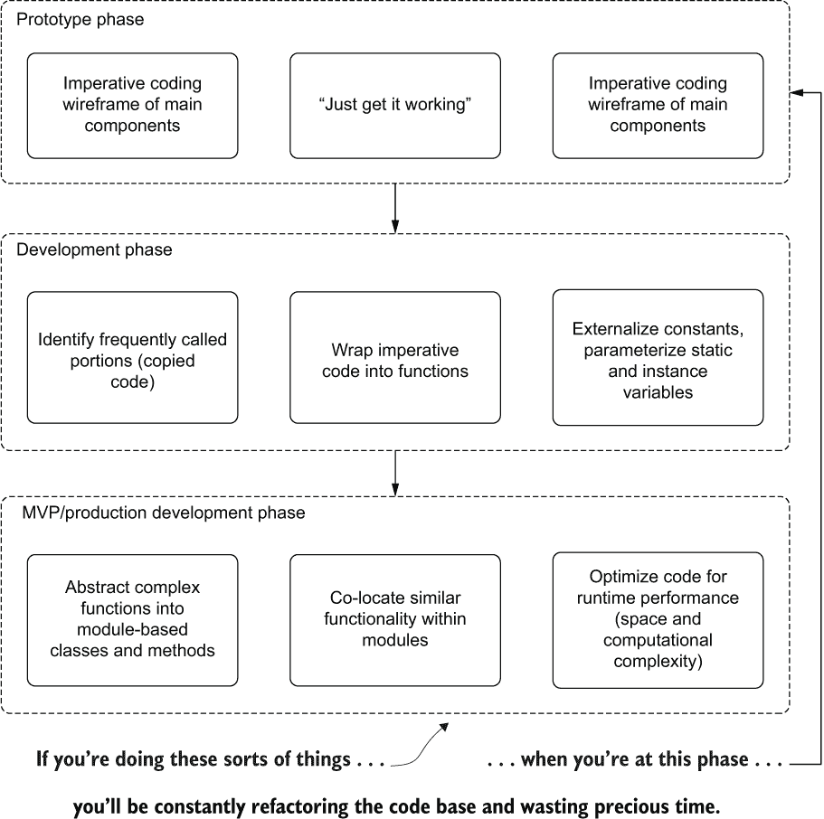

图 13.2 通过分阶段机器学习开发避免重构地狱

由于原型设计的极端可变性（一切都很灵活，元素需要快速更改），我通常坚持使用最小化命令式编程技术。随着项目开发逐步转向生产构建，越来越多的复杂逻辑被抽象为可维护和可重用的部分，分别放在不同的模块中。

在早期过程中构建过度工程化和过于复杂的代码架构，如列表 13.2 所示，将创建封闭的场景，使得为功能增强进行重构变得极其复杂。在项目早期追求过度工程化的开发方法只会浪费时间，让团队感到沮丧，并最终导致一个更加复杂且难以维护的代码库。

不要像我一样做。看起来很花哨的代码，尤其是在开发初期，只会给你带来问题。选择追求最简单和最简约的实现，当你需要扩展时，可以打开扩展的大门，当你编写生产代码时，可以拥有一个结构统一的代码结构，并且更容易调试的代码库，不会充满技术债务（以及数十个永远不会修复的 `TODO` 语句）。

## 13.2 非故意混淆：如果你没有编写它，你能读懂它吗？

一种相当独特的形式的机器学习傲慢体现在代码开发实践中。有时是恶意的，许多时候是由自我（以及被尊敬的愿望）驱动的，但大多数情况下是由于缺乏经验和恐惧，这种特定的破坏性活动通过创建难以理解的复杂代码而形成。

对于我们的场景，让我们看看一个常见且有些简化的任务：将数据类型重新转换为支持特征工程任务。在这个比较示例的旅程中，我们将查看一个需要修改其特征（以及目标字段）类型以支持管道启用处理阶段以构建模型的数据库。这个问题在其最简化的实现中，将在下一个列表中展示。

列表 13.3 强制类型转换

```
def simple(df: DataFrame): DataFrame = {                  ❶
  df.withColumn("age", col("age").cast("double"))         ❷
    .withColumn("weight", col("weight").cast("double"))   ❸
    .withColumn("hungry", col("hungry").cast("string"))   ❹
}
```

❶ 通过返回 DataFrame 封装传入 DataFrame 的修改

❷ 将年龄列从原始的整数类型转换为 Double 类型（仅用于演示目的）

❸ 确保权重列的类型为 Double

❹ 将目标列从布尔类型转换为字符串类型，以便编码器可以工作

从这个相对简单且强制风格的 `DataFrame` 中字段转换的实现，我们将查看混淆的示例，并讨论每个可能对如此简单的情况产生的影响。

注意：在下一节中，我们将探讨一些机器学习工程师在编写代码时的一些坏习惯。必须指出的是，列表 13.3 的方法和实现并不是为了贬低。在构建机器学习代码库时（只要代码库没有紧密耦合，如果一列发生变化，则需要数十次编辑），强制方法没有任何问题。只有当解决方案的复杂性使得修改强制代码成为一种负担时，它才成为一个问题。如果项目足够简单，就坚持使用更简单的代码。当你需要修改并添加新功能时，你会感谢自己的简单性。

### 13.2.1 混淆的多种形式

本节通过一个滑动复杂度量表进行，代码示例变得越来越难以理解，越来越复杂，并且越来越难以维护。我们将分析一些开发者的不良习惯，以帮助您识别这些编码模式，并指出它们是什么——对生产力具有破坏性，并且绝对需要重构以保持可维护性。

如果您发现自己陷入这些兔子洞之一，这些示例可以作为一个提醒，不要遵循这些模式。但在我们来看例子之前，让我们看看我在开发习惯方面看到的角色，如图 13.3 所示。

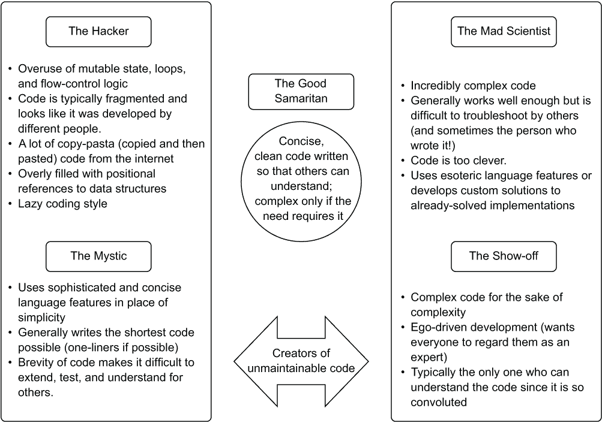

图 13.3 机器学习代码开发中的不同角色。远离中心区域在未来很可能给团队带来很多问题。

这些角色并不是为了识别特定的人，而是描述 DS 在成为更好的开发者过程中可能经历的特质。我遇到的大多数人（包括我自己）一开始都是作为黑客编写代码。我们会发现自己卡在一个以前从未遇到过的问题上，然后立刻在网上搜索解决方案，复制别人的代码，如果它有效，就继续前进。（我并不是说在网上或书中寻找信息是坏事；即使是经验最丰富的开发者也经常这样做。）

随着编码经验的加深，有些人可能会倾向于其他三种编码风格之一，或者如果他们得到了适当的指导，可以直接移动到中心区域。有些人有东西要证明——通常只是对自己，因为大多数人只是希望他们的同伴编写出来自善良的开发者的代码。其他人可能认为代码行数最少是一种有效的开发策略，尽管在这个过程中他们牺牲了可读性、可扩展性和可测试性。图 13.4 展示了我遇到（以及个人经历）的这些模式。

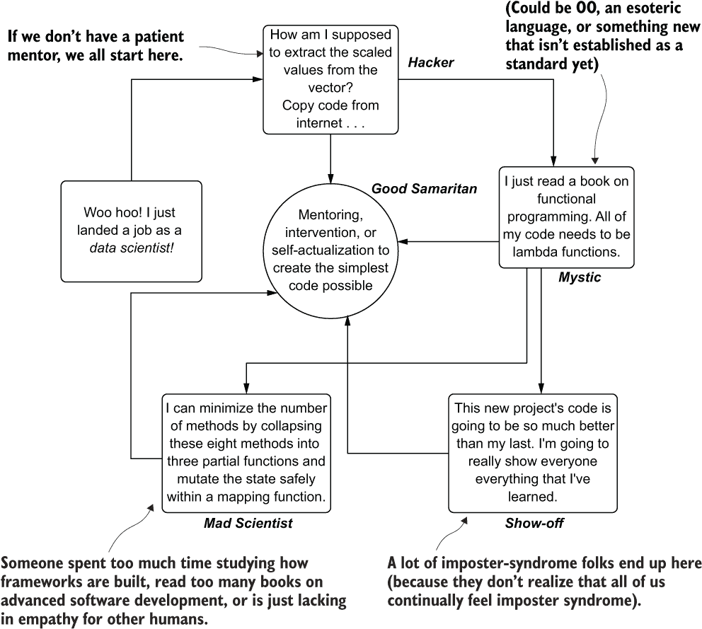

图 13.4 成为更好的开发者的路径

这条曲折的道路导致在达到智慧经验的顶峰之前，实现变得越来越复杂且不必要地复杂。在这次旅程中，我们所能期望的最好的事情是能够识别并学习更好的路径——特别是，对于一个问题（仍然满足任务要求）的最简单解决方案总是解决问题的最佳方式。

我作为开发者的个人成长历史

我在整个职业生涯中的成长路径几乎触及了图 13.4 中展示旅程的每一个方面。这主要是由自负驱动的，但也由于学会了如何在以软件工程为重点的公司之外用代码解决问题，因此在旅途中不断犯错，通过艰难的方式学习东西。我曾是一名黑客（不是像 1995 年电影《黑客》中那样著名、酷炫的那种，电影中有“太酷了以至于不上学”的乔尼·李·米勒，一个短暂的神秘主义者，多年的炫耀者，几个项目上的疯狂科学家（这让我未来的自己感到非常沮丧，因为我不得不修复我无法理解的代码），最终，我一直在努力保持一个中立的善良开发者。

我提到这一点是为了说明，这条旅程正是我所说的那样：一个不断且充满西西弗斯式挣扎的简单设计和连贯代码的追求。这可能是值得忍受的最崇高的斗争之一。追求编写更干净、更简单的代码不仅对你的团队和公司有益，而且可能是你能给予未来自己（他必须修复或改进代码库）的最慷慨的礼物。所有那些在写作时看似好主意，但实际上并非如此的高明技巧、简洁的一行代码、自我满足的复杂设计模式，以及难以置信的复杂实现。

我不得不通过艰难的方式反复学习这一点。我的唯一建议是，从我的例子中学习，并能够识别出你或你合作的他人是否正在走向这些有害的开发模式。点亮灯塔，让人们回归简单，你的项目将更加成功。

在接下来的几节中，我们将查看列表 13.3 的版本，其中我们试图重新构建 Spark `DataFrame`中的某些列，以便为特征工程转换做准备。这似乎是一个简单的任务，但到本节结束时，希望你能看到有人通过创建不同类型的令人困惑（并且可能非常糟糕）的实现方式，有多么“聪明”。

黑客

黑客心态在很大程度上是源于缺乏经验和对软件开发概念（无论是机器学习还是其他）的完全不知所措。许多处于这种开发模式的人担心在构建解决方案或理解其他团队成员的解决方案是如何构建的时寻求帮助。被称为“冒名者综合症”的令人痛苦的不适感，如果他们没有得到有效的指导和团队的接受，可能会限制这个人的成长潜力。

他们许多项目或对项目的贡献可能感觉完全脱节，在调性上也不和谐。这看起来像是不同的人参与了他们提交的拉取请求中的代码编写。很可能确实如此：Stack Overflow 的匿名贡献者。

图 13.5 总结了我多年前开始编写完整项目代码时的一些想法。我询问过其他初级数据科学家，在他们代码的特别粗糙的同行评审之后，是什么促使他们从 Stack Overflow 复制代码，他们的思考过程也在此处进行了概述。

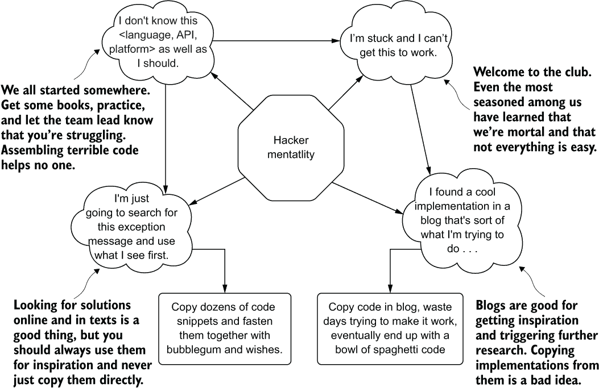

图 13.5 黑客思维模式，创建混乱和不稳定的代码库，这是我们所有人开始机器学习的地方。

黑客的代码看起来像是一块拼布。缺乏连贯的结构、不一致的命名约定以及不同的代码质量程度可能会在代码或同行评审提交中反复被标记。如果编写了单元测试，对代码的测试可能会显示出实现中的许多脆弱点。

列表 13.4 展示了黑客类型开发者可能为解决列转换问题提出的解决方案示例。虽然这并不直接表明是一个拼凑的状态，但它确实充满了反模式。

列表 13.4 黑客尝试转换列

```
def hacker(df: DataFrame, 
  castChanges: List[(String, String)]): DataFrame = {       ❶
  var mutated = df                                          ❷
  castChanges.foreach { x =>                                ❸
    mutated = mutated.withColumn(x._1, 
   mutated(x._1).cast(x._2))                                ❹
  }
  mutated                                                   ❺
}
val hackerRecasting = hacker(dogData, List(("age", "double"), 
  ("weight", "double"), 
  ("hungry", "string")))                                    ❻
```

❶ 函数参数 castChanges 很奇怪。元组列表代表什么？

❷ 在这种情况下，修改对象不被认为是良好的实践。DataFrame 本质上是不可变的，但将其声明为 var 允许在 foreach 迭代器中支持这种黑客式的链式方法。

❸ 遍历传入的元组列表

❹ 元组的定位表示法令人困惑，极易出错，难以理解，并可能在 API 使用中引发挫败感。（如果数据类型和列名被交换会发生什么？）

❺ 返回修改后的 DataFrame 将仍然保持封装性，但这是一种代码嗅探。

❻ 使用繁琐的元组列表定义作为 castChanges 参数的示例用法

在这段代码中，我们可以看到显示的逻辑与 Python 固有的可变性质相似。这位开发者没有研究如何安全地迭代集合以将链式方法应用于对象，而是在 Scala 中实现了一个强烈的反模式：修改共享状态变量。此外，由于函数的参数`castChanges`没有关于那些`String`值的概念（哪一个应该是列名，哪一个被转换成数据类型），使用这个函数的用户将不得不查看源代码来理解哪一个应该放在哪里。

在同事的工作中识别这些代码异味至关重要。无论这些人是否是团队（或职业）的新人，或者有丰富的经验但只是“应付差事”，都应该努力帮助他们。这是一个与团队成员一起工作的完美机会，帮助他们提高技能，在这个过程中，建立一个由工程师组成的更强大团队，他们都在创建更易于维护和更稳定的代码。 

神秘主义者

随着我们逐渐在 ML 软件开发中提高技能和接触新概念，下一个合乎逻辑的旅程是学习 FP 技术。与传统的软件开发不同，大量的 DS 编码工作适合于函数式组合。我们摄取数据结构（通常表示为数组集合），对它们进行操作，并以封装的方式返回修改后的数据状态。我们的许多操作都是基于对数据进行算法应用，无论是通过直接计算值还是通过结构转换。在很大程度上，我们的代码库的大部分内容都可以用无状态 FP 风格编写。

在其核心，ML 中的许多任务都是函数式的。将函数式编程技术应用于我们执行的大多数操作确实有很强的理由。*神秘* 开发者角色并不是一个选择性选择合适位置使用 FP 范式的人。相反，他们投入时间和精力使整个代码库函数化。他们以弱状态的形式将配置单子传递给函数，牺牲了组合，以近乎狂热的热情来遵守 FP 标准。为了说明，图 13.6 展示了我发现 FP 以及它能为代码库带来的所有奇迹时的思维过程。

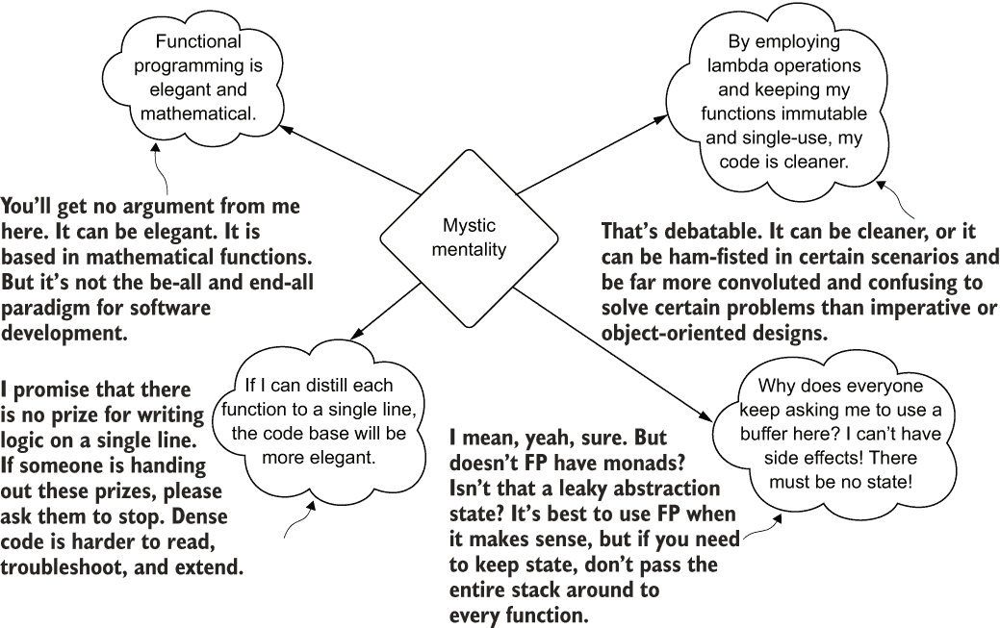

图 13.6 FP 纯粹主义者（神秘）的内心世界

当我开始学习 FP 概念，尽力将所有代码转换为这种标准时，我发现它的简洁性令人解放，高效且优雅。我喜欢无状态编码的简单性和纯封装的纯粹性。在我早期的拙劣代码中，突变状态的副作用问题消失了，取而代之的是光滑且风格化的 `map`、`flatmap`、`reduce`、`scan` 和 `fold`。我绝对喜欢将容器化和定义泛型类型作为减少我需要编写、维护和调试的代码行数的方式。一切似乎都更加优雅。

在以这种方式重构代码的过程中，我成功地激怒了那些正在查看每个重手重构的其他人。他们正确地指出我增加了代码库的复杂性，以不需要解耦的方式解耦函数，并且通常使代码更难以阅读。要了解这种实现风格对我们列铸造的适用性，请参阅以下列表。

列表 13.5 纯函数式编程方法

```
def mystic(df: DataFrame,
          castChanges: List[(String, DataType)]
  ): DataFrame = {                               ❶
  castChanges.foldLeft(df) {                     ❷
    case (data, (c, t)) => 
      data.withColumn(c, df(c).cast(t))          ❸
  }
}
val mysticRecasting = mystic(dogData, 
  List(("age", DoubleType), 
  ("weight", DoubleType), 
  ("hungry", StringType)))                       ❹
```

❶ 函数签名中的 castChanges 参数比黑客的实现更安全。通过要求传递一个 DataType 抽象类，通过此函数引入意外错误的可能性降低了。

❷ 使用 foldLeft（映射 castChanges 集合并对传入的 DataFrame df 应用累加器）可以使 DataFrame 的突变状态比黑客方法更高效。

❸ 使用案例匹配来定义传入参数`castChanges`的结构，允许消除黑客实现中存在的复杂（且令人烦恼）的位置引用。这段代码要干净得多。

使用该函数与黑客实现相比在打字上节省不多，但你可以看出，为铸造转换类型定义这些类型如何使该函数的使用更加便捷。

正如你所见，这个实现具有明显的函数式特性。从技术角度讲，对于这个用例，这个实现是本节所有示例中最好的。`DataFrame`对象以安全累加器友好的方式被突变（链式操作在`DataFrame`上的突变状态被封装在`foldLeft`中），参数签名利用基类型作为铸造的一部分（最小化使用时的错误），并且使用的匹配签名防止了任何令人困惑的变量命名约定。

我会使其变得更好的一种方法就是利用单子来处理`castChanges`参数。定义一个可以包含列名到铸造类型的映射的案例类构造函数可以进一步防止误用或任何令人困惑的实现细节，对于希望使用这个小型实用函数的其他人来说。

列表 13.5 中的问题不在于代码；而在于编写这种代码的人的哲学方法，并在代码库的每个地方强制执行这些模式。如果你在代码库的每个地方都检测到这些开发模式，充满了高度复杂和令人困惑的状态累积，将整个堆栈传递到每个函数，你应该与这个人交谈。向他们展示光明。让他们知道，这种对“纯粹性”的追求就像与风车搏斗一样，是一种徒劳的行为。毕竟，他们不是唯一需要维护这个的人。

关于函数式编程的一席话

我知道这可能会让人觉得我在讨厌函数式编程。我不是。你会在这一章以及我贡献的任何代码库中看到，我选择做很多函数式编程的事情。对于它设计要做的，它是一种非常好的编程风格。在某些语言中，例如 Python 和 Scala，它还有性能优势（使用累加器比使用突变更有效）。

然而，我事后责备自己的是纯粹主义的方法。在 ML 开发的许多领域，使用 FP 技术根本就没有意义。例如，试图将 FP 设计模式强行塞入确定性状态控制的超参数调整中，是一场灾难。

我确实鼓励所有机器学习从业者学习函数式编程（FP）的概念，因为它们在许多地方都非常有意义。你需要遍历一个集合并对其应用一个函数吗？不要使用`for`循环；使用`map`函数（Python 中的列表推导）。你需要根据大量任务更新对象的状态吗？使用 map-reduce 范式（Scala 中的折叠，Python 中的列表推导）。这些语言特性非常有帮助，通常比替代迭代器（如`for`循环和`while`循环）性能更好，并且代码更简洁。

使用函数式编程的唯一缺点是如果你的团队不熟悉它。但这总是可以通过培训来解决。花点时间向你的团队介绍这个话题，你会发现遍历集合将更容易阅读、编写，并且运行成本更低。

炫耀型

*炫耀型*人格可以有多种形式。它可能是一个拥有长期独立开发软件历史、没有任何机器学习组件的极其高级的贡献者。他们可能会审视一个机器学习项目，并试图构建一个定制的算法实现，而这个算法在其他流行的开源库中已经存在。他们也可能是一个已经从黑客型开发者毕业的人，凭借对实现语言和软件设计模式的更深入理解，选择向团队中的每个人展示他们现在的优秀。

无论这种类型的人为什么要在他们的实现中构建复杂性，它都会以相同的方式影响团队和团队必须维护的项目。如果代码没有被重构，构建它的人最终将拥有它。

如果代码的复杂度是由用例和要解决的问题所证明的必要，那么在代码中存在复杂性绝对没有问题。然而，炫耀型的人仅仅为了过度设计解决方案以向团队中的其他人展示自己的技能，而人为地引入复杂性。我想象一下符合炫耀型人格的人的心理状态可能看起来像图 13.7。

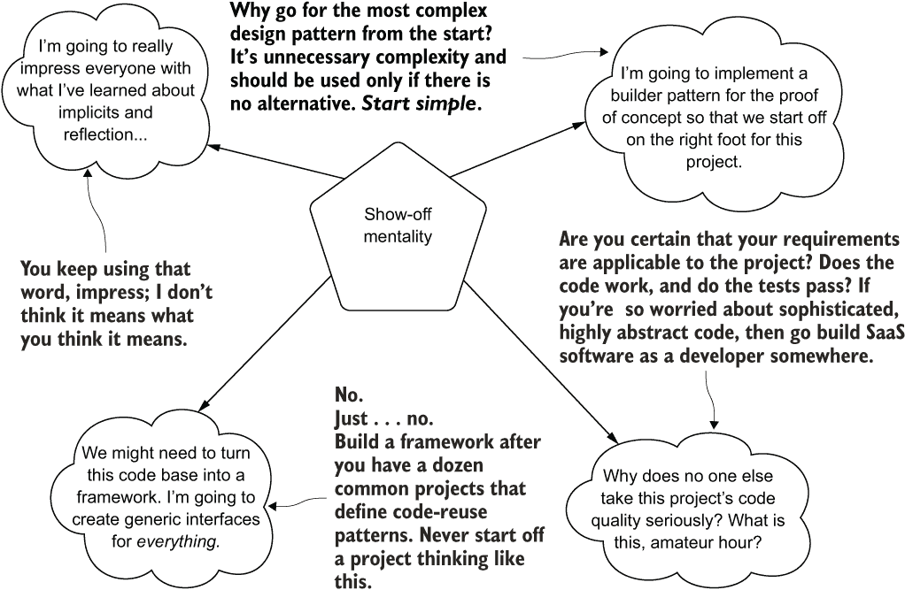

图 13.7 炫耀型的人的不良习惯和思维模式

当你是这个人的同事时，这些习惯和思维模式会让你感到非常不愉快。他们传达的想法并不坏（除了右下角的那个有毒的想法）。构建者模式、重抽象、隐式类型、反射和精心设计的接口都是好事。然而，它们是在需要时使用的工具。

这个人的思考和编写代码的方式的问题在于，他们将从第一个分支上的初始提交开始实施项目，为一个大型的、完全不必要的项目架构创建骨架占位符。这类机器学习工程师只关注项目的代码复杂性，几乎不考虑项目的实际目的。在这种盲目中，他们通常努力编写非常复杂的代码，对于其他团队成员来说，由于他们为当前问题所做的过度工程，这种代码看起来是故意混淆的。

提示：如果你想让人人都认为你很聪明，就报名参加 *Jeopardy* 并赢得几轮。如果你在代码中炫耀，你只是在让你的团队处于危险之中。

让我们来看看我们的类型转换场景函数，这次以展示者的开发风格编写。

列表 13.6 展示者的类型转换实现

```
val numTypes =
    List(IntegerType, FloatType, DoubleType, LongType, DecimalType, ShortType)❶
def showOff(df: DataFrame): DataFrame = {
    df.schema
      .map(
        s =>
          s.dataType match {                                                  ❷
            case x if numTypes.contains(x) => s.name -> "n"                   ❸
            case _                         => s.name -> "s"                   ❹
        }
      )
      .foldLeft(df) {
        case (df, x) =>                                                       ❺
          df.withColumn(x._1, df(x._1).cast(x._2 match {
            case "n" => "double"
            case _   => "string"                                              ❻
          }))
      }
  }
val showOffRecasting = showOff(dogData)                                       ❼
```

❶ 对于这个特定的实现，定义匹配的数值类型是合适的。如果整数需要以不同的方式处理，会发生什么？为了坚持这种设计模式，所需的重构将会相当大！

❷ 在传入的 DataFrame 的数据类型上，匹配方法并不差。这是关于这段代码唯一值得说的好话。

❸ 将列名映射到转换类型的方式很奇怪。它在下一个语句中被消耗。

❹ 对于所有其他条件，使用通配符捕获。如果传入的 DataFrame 包含一个集合，会发生什么？

❺ 从第一阶段懒传递映射集合（x）。现在需要使用位置表示法来访问这些值。

❻ 再次，通配符匹配。如果是一个 ArrayType 或 ListType 列，这里会出现严重问题。

❷ 至少这个函数的实例化相当简单。

这段代码是可行的。它的行为与前面的三个例子完全一样。只是很难阅读。试图展示技巧和“高级”语言特性，做出了一些相当糟糕的决定。

首先，对模式字段进行初始映射是完全不必要的。创建一个由单字符值到列名的伪枚举组成的 Map 类型列不仅无用，而且令人困惑。从第一阶段生成的集合，然后折叠到累加器操作中的 `DataFrame`，立即被消耗，迫使创建一个“临时”的 `Map` 对象集合来应用正确的类型转换。最后，在懒惰地不想完全写出可能发生的所有条件匹配的情况下，在最后部分有一个通配符匹配案例。当有人需要处理不同的数据类型时会发生什么？更新以支持二进制类型、整数或布尔值的步骤是什么？扩展这一点不会特别有趣。

要警惕编写这种代码的人，尤其是如果他们是团队中的资深人员。关于为什么团队中的每个人都能够维护和调试代码的重要性进行一次对话是一个好的方法。他们不太可能有意使代码对其他人变得复杂。如果请求一个更简单的实现，他们很可能会根据这个想法调整他们的开发策略，以适应未来的需求。

疯狂科学家

*疯狂科学家*开发者是善意的。他们也是那些在软件开发知识道路上取得巨大进步的人。凭借他们的经验、项目数量以及他们所编写的代码的巨大数量，他们开始利用语言中的高级技术（他们通常精通一种以上的语言）来减少需要维护的代码量。

这些人通常基于开发效率来考虑如何解决问题，而不是基于希望因为代码的复杂性而获得认可。他们多年来学到了很多，并且不得不维护（和重构）不够理想的代码，以至于他们选择以使调试和维护更容易的方式进行实现。

当团队的其他成员与他们的技术能力相似时，这些目标是非常崇高的。然而，大多数团队由各种不同开发能力的人组成。编写复杂但高效的代码可能会阻碍团队中更初级人员的效果。为了说明这些思维过程，图 13.8 展示了疯狂科学家的思维片段。

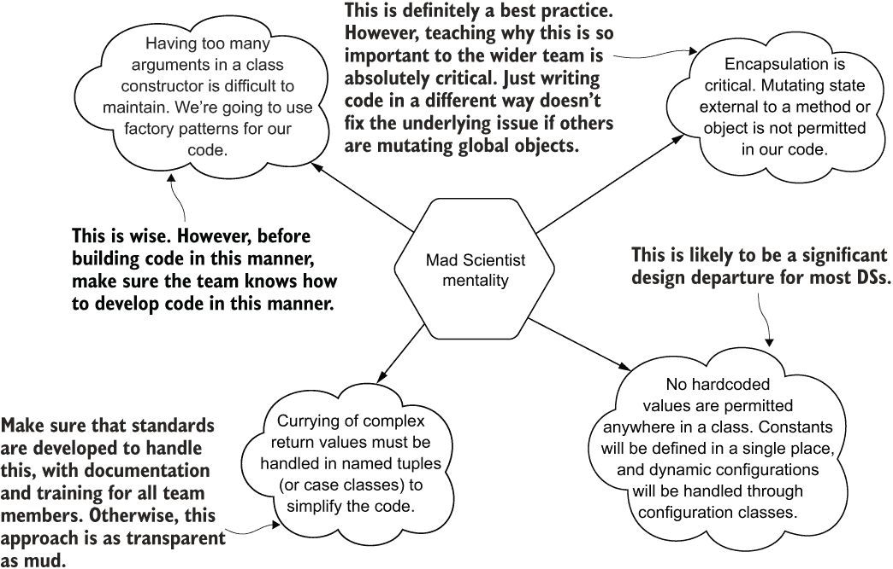

图 13.8 如果没有对团队其他成员进行适当的指导和辅导，一个资历较深、高级的机器学习工程师可能会编写出非常晦涩和复杂的代码。

注意，疯狂科学家的观点并不是不好的。它们非常相关，被认为是通用的最佳实践。然而，这种心态的问题在于，所有其他与代码一起工作的人并不了解这些标准。

如果代码是按照这些组合规则编写的，并且只是通过在分支上提交一个 PR 而没有让团队的其他成员意识到这些标准为什么如此重要，那么代码的设计和实现对他们来说将是难以理解的。让我们看看我们的铸造示例的延续，看看这位疯狂科学家开发者可能会在列表 13.7 中如何编写这段代码。

列表 13.7 一个稍微复杂的铸造实现

```
val numTypes = List(FloatType, DoubleType, LongType, DecimalType, ShortType)
def madScientist(df: DataFrame): DataFrame = {
  df.schema.foldLeft(df) {                                             ❶
    case (accum, s) =>                                                 ❷
      accum.withColumn(s.name, accum(s.name).cast(s.dataType match {   ❸
        case x: IntegerType => x 
        case x if numTypes.contains(x) => DoubleType
        case ArrayType(_,_) | MapType(_,_,_) => s.dataType
        case _                         => StringType
      }))                                                              ❹
  }
}
```

❶ 与前面的例子类似，但我们是直接在 df.schema getter 返回的集合上进行迭代的。

❷ 放弃了前面例子中使用的 df 这样的令人困惑的名称引用。尽管在这里（并且是安全的）将其封装起来，但将其命名为 df 会让阅读变得困惑。

❸ 使用模式返回的命名实体（变量 s）来防止未来出现意外的错误

❹ 通过在转换语句中包装决策逻辑，代码行数更少。直接匹配到模式元数据中的类型将更有利于未来的兼容性。

现在，这段代码没有问题。它简洁，很好地覆盖了所需的使用案例，并且设计得不会在数据集中的列中包含复杂类型（数组映射）时突然爆炸。这里唯一的注意事项是确保你的团队可以维护这种设计模式。如果他们可以接受以这种方式维护和编写代码，这是一个好的解决方案。然而，如果团队的其他成员习惯于命令式编程风格，这种代码设计可能和用另一种语言编写的一样晦涩难懂。

如果团队面临大量强制调用，最好向团队介绍列表 13.7 中展示的编码风格。花时间教授和指导团队其他成员更有效的开发实践可以加速项目工作并减少支持项目所需维护的工作量。然而，对于更资深的人来说，教育其他团队成员了解为什么这些标准很重要是绝对关键的。这并不意味着仅仅抛出一个语言规范的链接（有人将 Python 的 PEP-8 标准链接到 PR 上是我的一个烦恼），也不是仅仅向团队发送包含密集和高效代码的分支。相反，这意味着编写良好的文档，在内部团队文档存储库中提供示例，进行培训课程，并与团队中经验较少的成员进行结对编程。

如果你恰好是这类疯狂科学家类型的人，编写优雅且结构良好的代码，但被团队成员误解且难以理解，你应该首先考虑的是教学。帮助每个人理解为什么这些开发范式是好的，比写严厉的代码审查笔记和拒绝合并请求要有效得多。毕竟，如果你在编写好的代码并将其提交给没有你使用范式经验的团队，它和列表 13.6 中展示的炫耀代码的混乱一样难以理解。

一个更安全的赌注

让我们看看一种更安全、更易读、稍微更标准的解决这个问题的方法。下面是一个更可维护的实现示例。

列表 13.8 对无效类型转换的一个更安全的赌注

```
object SimpleReCasting {                                   ❶
  private val STRING_CONVERSIONS = List(
BooleanType, CharType, ByteType)                           ❷
  private val NUMERIC_CONVERSIONS = List(
FloatType, DecimalType)                                    ❸
  def castInvalidTypes(df: DataFrame): DataFrame = {
    val schema: StructType = df.schema                     ❹
    schema.foldLeft(df) {
      case (outputDataFrame, columnReference) => {
        outputDataFrame.withColumn(columnReference.name, 
         outputDataFrame(columnReference.name)
          .cast(columnReference.dataType match {
            case x if STRING_CONVERSIONS.contains(x) => 
              StringType                                   ❺
            case x if NUMERIC_CONVERSIONS.contains(x) => 
              DoubleType                                   ❻
            case _ => columnReference.dataType             ❼
          }))
}}}}
```

❶ 使用对象进行封装，并通过 JVM 进行更有效的垃圾回收

❷ 明确声明我们想要转换为 StringType 的数据类型

❸ 明确声明我们想要转换为 DoubleType 的数据类型

❹ 仅为了减少代码复杂性和使其他阅读者更容易理解，将模式引用分离出来

❺ 如果它们在我们的配置列表中，将我们声明的类型转换为 StringType

❻ 只转换与我们的列表匹配的数字类型到 DoubleType

❼ 不要触碰任何其他东西。就让它保持原样。

注意代码被封装在对象中？这是为了隔离对已定义的`Lists`的引用。我们不希望在代码库中全局定义这样的变量，因此将它们封装在对象中达到这个目的。

此外，封装使得垃圾收集器更容易移除对不再需要的对象的引用。一旦使用过并且代码中不再引用`SimpleRecasting`，它将和它内部的所有其他封装对象一起从堆中移除。看似更冗长的命名约定（有助于新读者跟随`foldLeft`操作中正在执行的操作），使得这段代码比列表 13.7 中的简短代码更易于阅读。

关于这段代码的最后一句话是，操作完全是显式的。这是与所有之前的例子相比，这段代码最大的特点，除了列表 13.3 中原始引用的命令式转换。在这里，就像那个早期的例子一样，我们只改变我们明确命令系统要改变的列类型。我们不是默认将“将所有其他内容转换为`String`”或其他任何会创建易碎、不可预测行为的操作。

这种思考编码的方法将为你节省很多令人沮丧的小时、天数和月份，用于调试在生产中看似无害但实际上会导致崩溃的代码。我们将在下一章回顾一些将未知状态默认为静态值（或推断值）的方法，这些方法可能会在机器学习工程师的我们身上造成麻烦。现在，只需意识到明确动作绝对是一个好的设计模式。

### 13.2.2 麻烦的编码习惯回顾

在前一节中，我们关注了几种，让我们说，不友好的编写代码的方式。每种都有其自身的坏处和无数的原因，但最令人讨厌的原因在表 13.2 中。

在编写代码时需要牢记的最重要的一点是，你创建的代码并不仅仅是为了执行它的系统的利益。如果真是这样，那么这个职业可能永远不会从低级代码框架（如汇编语言或对真正受虐狂来说，第一代机器代码）转向编写指令的第二代语言。

表 13.2 开发者实现罪过

| 罪恶人格 | 为什么这么糟糕 |
| --- | --- |
| 黑客 | 易碎的代码是碎片化的，并且经常断裂。 |
| 神秘 | 复杂且密集的代码需要花费很长时间才能逆向工程。不可测试的嵌套代码可能会静默地引入难以诊断的错误。 |
| 展示 | 故意复杂的代码旨在让他人感到无足轻重。难以调试、修复或扩展。噩梦般的代码。 |
| 疯狂科学家 | 实现过于复杂，以至于同行难以理解（因为缺乏教学）。过于僵化，不允许进行轻量级测试或扩展。 |

语言的发展并非为了提高计算机处理器和内存的计算效率，而是为了编写代码的人类，更重要的是，为了阅读代码以了解其功能的人类。我们编写代码，尽可能使用高级 API，并按照易于阅读和维护的方式构建代码，仅仅是为了我们同行和未来的自己。

避免表 13.2 中列出的习惯，并朝着编写你、你的团队以及你未来打算招聘的具有类似技术才能的人所需的代码方向发展。这样做将有助于使每个人都能够高效地贡献于构建和维护解决方案，并防止对复杂代码库进行低效的重构，以修复由无思考的开发者造成的沉重技术债务。

## 13.3 过早的泛化、过早的优化以及其他展示你有多聪明的坏方法

假设我们正在与一支相对先进的（从软件开发角度来看）机器学习工程师团队开始一个新的项目。在项目开始时，架构师决定控制代码状态的最佳方式是设计和实现一个用于执行建模和推理任务的框架。团队非常兴奋！团队成员想，终于可以做些有趣的工作了！

在他们的集体兴奋中，他们中没有一个人意识到，除了难以阅读的代码外，最糟糕的傲慢形式之一就是花费时间在不必要的地方。他们正准备构建无用的框架代码库，除了证明他们自己的存在之外，没有任何实际用途。

### 13.3.1 泛化和框架：在你无法避免之前避免使用它们

团队首先着手制作一个产品需求文档（PRD），概述他们希望他们独特的框架能做什么。基于构建者模式的一般设计被草拟。架构师希望团队执行以下操作：

1.  确保在整个项目代码中利用自定义默认值（不依赖于 API 默认值）

1.  强制覆盖建模过程中某些元素以调整超参数

1.  使用与公司代码标准更一致的命名约定和结构元素来包装开源 API

在进行实验之前，会制定一个功能计划，如图 13.9 所示。

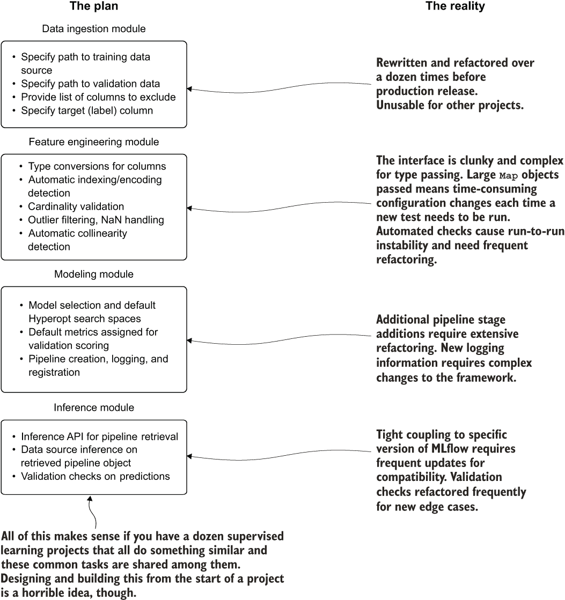

图 13.9 一个建筑师试图围绕不同的框架构建一个统一的包装器，以支持公司所有的机器学习需求。剧透一下：结果并不好。

这个关键功能的计划过于雄心勃勃。如果继续进行，图右侧显示的现实方面很可能会发生（每次我看到有人尝试这样做时，这些事情总是会发生）。这个项目将充满重做、重构和重新设计，注定会失败。

与其专注于使用现有框架（如 Spark、pandas、scikit-learn、NumPy 和 R）解决问题，团队将不仅支持项目解决方案，还要支持一个定制的框架包装器实现——以及所有随之而来的痛苦。如果你没有几十名软件工程师来支持一个框架，最好仔细考虑计划构建一个框架。

在构建和维护这样一个软件堆栈的巨大工作量之上，还有一个简单的事实，那就是你将尝试支持一个比它所包装的框架更通用的包装器。从事这类工作通常不会有好结果，主要有两个原因：

+   *你现在拥有了一个框架*——这意味着更新、兼容性保证，以及需要编写的大量真正庞大的测试（你*确实*在编写测试，对吧？）。功能保证现在与构建框架所使用的包保持一致。

+   *你现在拥有了一个框架*——除非你打算真正地使其通用，开源它，并让一个提交者社区参与其成长，并承诺维护它，否则这项工作是没有意义的。

只有在存在直接需求的情况下，追求通用方法才是真正有意义的。是否需要开发一个关键的新功能，以便使另一个机器学习框架工作得更有效率？也许你可以考虑为那个开源框架做出贡献。是否有必要将不同的低级 API 缝合在一起以解决一个共同的问题？这可能是一个创建框架的好案例。

在开始一个项目时，与我们的建筑师朋友不同，你最后应该考虑的是着手构建一个定制的框架来支持那个特定的项目。这种过早的泛化工作（在时间、分心和挫败感方面）将严重削弱项目的待办工作，将推迟和干扰应该专注于解决问题的生产性工作，并且不可避免地需要在项目演变过程中多次重做。这根本不值得。

我是否应该构建一个通用的框架？

当然！嗯……也许吧。

我会列出一些需要考虑的事项，然后让你自己决定是否真的想追求构建框架（假设这是在指定时间内进行，而不是在项目交付期间）：

+   你的团队有多少人？如果你每周无法至少投入 16 个人时来维护框架、添加功能和解决问题，你应该重新考虑是否值得开始。

+   你打算开源它吗？你能围绕它建立多大的社区？公司关于维护开源软件的法律规定是什么？你能投入多少时间来支持软件？

+   它是否解决了新颖的问题，还是你正在构建另一个工具中已经存在的功能？

+   你能购买一个工具或平台来执行你希望框架执行的任务吗？如果是这样，我保证购买该工具或使用现有的开源解决方案将比投入时间和精力构建自己的框架更便宜。

+   这个框架将有多少依赖项？对于你引入的每个额外包，你都在为其长期维护增加了一个阶乘级的问题。软件包和依赖项不断变化，许多弃用实际上只是未来威胁，你的框架有一天会在你面前爆炸。

+   这个计划中的框架带来了哪些额外的价值？如果它不能通过至少是你将花费在构建和维护此框架上的时间的两倍来加速你当前和未来的项目工作，那么它就是浪费时间精力。

框架只是另一个开源框架的包装器吗？我看到人们围绕 pandas 或 Spark 编写自定义包装器的次数真正令人震惊。一切工作都进行得很好，直到下一个重大版本发布，它有根本性的破坏性变化（或者下一个次要的关键功能添加，现在需要为你的自定义 API 实现包装器），迫使你实际上从零开始重写你的框架。

这些只是我向那些告诉我他们打算为机器学习工作构建通用框架的人提出的一些问题。我并不是试图贬低他们的宏伟目标；只是因为我亲身经历过，深知维护此类事物的痛苦。

当你在生产中运行数百个 XGBoost 模型以提供业务预测洞察时，构建是完美的。但是，业务和你都应该理解你将使自己陷入多么巨大的工作量。只有在不构建框架就会愚蠢的情况下，才追求这条道路；为构建、监控和从数百个 XGBoost 模型中进行推断的高级 API 将是构建一个框架的好理由。

### 13.3.2 过早优化

假设我们为一家不同的公司工作——一家没有上一节中那位架构师的公司，最好是。这家公司，而不是帝国建设的架构师，有一个来自后端工程背景的 DS 团队顾问。在整个职业生涯中，他们专注于可以以毫秒计量的 SLA，以最有效的方式遍历集合的算法，以及大量时间榨取每个可用的 CPU 周期。他们的世界完全专注于代码离散部分的性能。

在第一个项目中，顾问希望通过帮助构建负载测试器来为 DS 团队的工作做出贡献。由于团队再次面临确定狗在进入当地宠物用品店时是否饥饿的问题，顾问指导团队实施解决方案。

基于他们的经验和 Scala 后端系统的知识，团队成员最终专注于高度优化以最小化 JVM 上的内存压力的东西。他们希望避免使用可变缓冲区集合，而是使用显式集合构建（仅使用所需的最小内存量）和固定预定的集合大小。由于先前的经验，他们花了几天时间编写代码，以生成测试建模解决方案吞吐量的数据。

首先，顾问致力于定义将要用于测试的数据结构。列表 13.9 显示了数据结构和用于生成数据的定义静态参数。

备注：列表 13.9 中的 Scala 格式是为了打印目的而压缩的，并不代表正确的 Scala 语法设计。

列表 13.9 数据生成器的配置和常见结构

```
import org.apache.spark.sql.functions._
import org.apache.spark.sql.types._
import org.apache.spark.sql.{DataFrame, SparkSession}
import scala.collection.mutable.ArrayBuffer
import scala.reflect.ClassTag
import scala.util.Random
case class Dogs(age: Int, weight: Double, favorite_food: String,
                breed: String, good_boy_or_girl: String, hungry: Boolean) ❶
case object CoreData {                                                    ❷
  def dogBreeds: Seq[String] = Seq("Husky", "GermanShepherd", "Dalmation", "Pug", "Malamute", "Akita", "BelgianMalinois", "Chinook", "Estrela", "Doberman", "Mastiff")
  def foods: Seq[String] = Seq("Kibble", "Spaghetti", "Labneh", "Steak",
      "Hummus", "Fajitas", "BœufBourgignon", "Bolognese")
  def goodness: Seq[String] = Seq("yes", "no", "sometimes", "yesWhenFoodAvailable")
  def hungry: Seq[Boolean] = Seq(true, false)
  def ageSigma = 3
  def ageMean = 2
  def weightSigma = 12
  def weightMean = 60
}
trait DogUtility {                                                        ❸
  lazy val spark: SparkSession = SparkSession.builder().getOrCreate()     ❹
  def getDoggoDataT: ClassTag: Seq[T] = {
    val rnd = new Random(seed)
    Seq.fill(dogs)(a(rnd.nextInt(a.size)))
  }                                                                       ❺
  def getDistributedIntData(sigma: Double, mean: Double, dogs: Int,
                            seed: Long): Seq[Int] = {
    val rnd = new Random(seed)
    (0 until dogs).map(
      _ => math.ceil(math.abs(rnd.nextGaussian() * sigma + mean)).toInt)
  }                                                                       ❻
  def getDistributedDoubleData(sigma: Double, mean: Double, dogs: Int,
                               seed: Long): Seq[Double] = {
    val rnd = new Random(seed)
    (0 until dogs).map( _ => math.round(math.abs(rnd.nextGaussian() * sigma * 100 + mean)).toDouble / 100)
  }                                                                       ❼
}
```

❶ 定义用于测试的数据集模式（带类型）

❷ 使用案例对象来存储用于数据生成的静态值（Scala 中的伪枚举）

❸ 使用特质进行多重继承以测试不同的实现并使代码更简洁

❹ 我们将在对象中使用 Spark 会话引用，因此在特质中使其可用是有意义的。

❺ 使用泛型类型随机填充值（字符串或布尔值）到固定大小的序列中

❻ 根据传入的均值和标准差值生成基于整数的随机高斯分布

❷ 根据均值和标准差生成基于 Double 值的随机高斯分布

现在已经开发出辅助代码来控制模拟数据的性质和行为，顾问测试了在特质`DogUtility`中定义的方法的性能。经过几小时的调整和重构后，性能在数亿个元素上表现良好。

应该不用说，这个实现对于当前的问题来说有点过度。由于这是项目的开始阶段，不仅模型最终结果所需的功能尚未完全定义，而且特征的概率分布还没有进行分析。导师决定现在是时候构建实际的控制执行代码，以生成作为 Spark `DataFrame` 的数据，如下一列表所示。

列表 13.10 一个过于复杂且优化不当的数据生成器

```
object PrematureOptimization extends DogUtility {                        ❶
  import spark.implicits._                                               ❷
  case class DogInfo(columnName: String,
                     stringData: Option[Either[Seq[String], 
                       Seq[Boolean]]],                                   ❸
                     sigmaData: Option[Double],                          ❹
                     meanData: Option[Double],
                     valueType: String)                                  ❺
  def dogDataConstruct: Seq[DogInfo] = {                                 ❻
    Seq(DogInfo("age", None, Some(CoreData.ageSigma), 
          Some(CoreData.ageMean), "Int"),
        DogInfo("weight", None, Some(CoreData.weightSigma), 
                  Some(CoreData.weightMean), "Double"),
        DogInfo("food", Some(Left(CoreData.foods)), None, None, "String"),
        DogInfo("breed", Some(Left(CoreData.dogBreeds)), 
          None, None, "String"),
        DogInfo("good", Some(Left(CoreData.goodness)), 
          None, None, "String"),
        DogInfo("hungry", Some(Right(CoreData.hungry)), 
          None, None, "Boolean"))
  }
  def generateOptimizedData(rows: Int, 
seed: Long): DataFrame = {                                               ❼
    val data = dogDataConstruct.map( x => x.columnName -> {
            x.valueType match {
              case "Int" => getDistributedIntData(x.sigmaData.get, 
                             x.meanData.get, rows, seed)
              case "Double" => getDistributedDoubleData(x.sigmaData.get, 
                                x.meanData.get, rows, seed)
              case "String" => getDoggoData(x.stringData.get.left.get, 
                                rows, seed)                              ❽
              case _        => getDoggoData(
x.stringData.get.right.get, 
  rows, 
  seed)
            }
        }                                                                ❾
).toMap                                                                  ❿
    val collection = (0 until rows).toArray                              ⓫
      .map(x => {
        Dogs(
          data("age")(x).asInstanceOf[Int],
          data("weight")(x).asInstanceOf[Double],
          data("food")(x).asInstanceOf[String],
          data("breed")(x).asInstanceOf[String],
          data("good")(x).asInstanceOf[String],
          data("hungry")(x).asInstanceOf[Boolean]
        )
      })
      .toSeq
    collection.toDF()                                                    ⓬
  }
}
```

❶ 使用之前定义的 DogUtility 特质来访问那里定义的方法和 SparkContext。

❷ 使用 Spark 的隐式转换，能够直接通过序列化将案例类对象的集合转换为 DataFrame 对象（减少了大量糟糕的代码）。

❸ 这是一团糟。Either 类型允许在两种类型之间进行右对齐选择，并且很难正确扩展。这里使用泛型类型会更好。

❹ 选项类型在这里是因为这些值对于数据生成器的一些配置方法调用不是必需的（不需要为从其中随机抽取的字符串集合定义一个 sigma）。

❺ 值类型允许对以下生成器进行优化实现（针对行数，而不是对读者的理解容易程度）。

❻ 构建控制有效载荷，以定义数据生成器将被如何调用（以及顺序）。

❼ 这是一个针对根据方法 dogDataConstruct 中指定的配置调用数据生成器的过于花哨且优化（针对代码长度）的实现（这种实现很脆弱）

❽ 好吧，这对于访问一个值来说很糟糕。两个 .get 操作？你一定是在开玩笑吧。

❾ 以下是性能问题的根本原因。这默认为 Seq 类型，但应该是 IndexedSeq 类型，以便允许对单个值进行 O(1) 访问，而不是当前的 O(n)。

❿ 将每个数据集合包裹在一个 Map 对象中，以便通过名称访问值比使用位置表示法更容易。

⓫ 这段代码的第二个主要问题——映射每个集合的索引位置以构建行。这在复杂度上是 O(kn)。

⓬ 转换为 Spark DataFrame。

在对这个代码进行了一些测试之后，团队成员很快意识到生成的行大小与运行时间之间的关系远非线性。事实上，它比线性更糟糕，计算复杂度更接近于 O(*n*× log(*n*))。生成 5,000 行大约需要 0.6 秒，而 500,000 行的重负载测试大约需要 1 分钟 20 秒。对于 5000 万行的完全负载测试，等待 2 小时 54 分钟的想法有点过分。

发生了什么问题？他们把所有的时间都花在优化代码的各个部分上，以至于在独立执行时，每个部分都尽可能地快。当整个代码执行时，却是一团糟。实现方式在所有错误的方向上都非常聪明。

然而，为什么它这么慢呢？问题在于最后一部分，它非常致命。尽管对于这个实现，内存压力很小，但定义在变量 `collection` 中的行数生成必须在 `Map` 集合中的每个 `Sequence` 上执行非索引位置查找。在构建 `Dogs()` 对象的每次迭代中，都需要遍历 `Sequence` 到那个位置以检索值。

现在，这个例子有点夸张。毕竟，如果这个后端开发者真的擅长优化，他们可能会利用一个索引集合，并将数据对象从 `Sequence` 强制转换为 `IndexedSeq`（这将能够直接到达请求的位置，并以极短的时间返回正确的值）。即使有这个改变，这种实现仍然是在错误的地方“嗅探”。

性能非常糟糕，但这只是故事的一部分。如果需要添加另一种数据类型以与 `String` 数据相同的方式处理，列表 13.10 中的代码会发生什么？开发者会围绕第一个 `Either[]` 语句包裹另一个吗？然后它会被包裹在另一个 `Option[]` 类型中吗？如果需要生成 Spark `Vector` 类型，这段代码会变成多么混乱的一团？因为这个代码是以这种方式构建的，过度优化到了解决方案预 MVP 版本的早期状态，这段代码要么需要在整个项目中大量修改以保持与 DS 团队特征工程工作的同步，要么在变得笨拙且难以维护时需要从头开始完全重写。这段代码最有可能的路径是它注定要进入 `rm -rf` 命令的无底深渊。

以下列表显示了一种略微不同的实现方式，它利用了一种更简单的方法。这段代码专注于将运行时间减少一个数量级。

列表 13.11 一个性能更好的数据生成器

```
object ConfusingButOptimizedDogData extends DogUtility {           ❶
  import spark.implicits._
  private def generateCollections(rows: Int, 
seed: Long): ArrayBuffer[Seq[Any]] = {
    var collections = new ArrayBuffer[Seq[Any]]()                  ❷
    collections += getDistributedIntData(CoreData.ageSigma,
 CoreData.ageMean, rows, seed)                                     ❸
    collections += getDistributedDoubleData(CoreData.weightSigma,
      CoreData.weightMean, rows, seed)
    Seq(CoreData.foods, CoreData.dogBreeds, CoreData.goodness,
      CoreData.hungry)
      .foreach(x => { collections += getDoggoData(
        x, rows, seed)})                                           ❹
    collections
  }
  def buildDogDF(rows: Int, seed: Long): DataFrame = {
    val data = generateCollections(rows, seed)                     ❺
    data.flatMap(_.zipWithIndex)                                   ❻
        .groupBy(_._2).values.map( x =>                            ❼
          Dogs(
            x(0)._1.asInstanceOf[Int],
            x(1)._1.asInstanceOf[Double],
            x(2)._1.asInstanceOf[String],
            x(3)._1.asInstanceOf[String],
            x(4)._1.asInstanceOf[String],
            x(5)._1.asInstanceOf[Boolean])).toSeq.toDF()
      .withColumn("hungry", when(col("hungry"), 
        "true").otherwise("false"))                                ❽
      .withColumn("hungry", when(col("breed") === "Husky",
        "true").otherwise(col("hungry")))                          ❾
      .withColumn("good_boy_or_girl",  when(col("breed") === "Husky",
        "yesWhenFoodAvailable").otherwise(
          col("good_boy_or_girl")))                                ❿
  }
}
```

❶ 与列表 13.10 中的实现相同

❷ 为了消除集合迭代的一个阶段，我们只需将每个生成的值序列（最终的行数据）追加到一个 Buffer 中。

❸ 将第一列的数据（为年龄生成的随机整数）添加到 Buffer 中

❹ 遍历所有 String 和 Boolean 列的数据集合，并将它们配置的可允许值逐个传递给生成器

❺ 调用上面定义的私有方法来获取用于测试的随机采样数据的 ArrayBuffer

❻ 遍历每一行数据集合，并通过位置表示法直接生成 Dogs 情况类结构

❼ 将数据折叠成元组，这些元组按照正确的生成顺序包含行值

❽ 不如将布尔字段转换为字符串类型，以节省后续的处理步骤

❾ 如果你曾经认识过狗熊，你会知道它们总是很饿。

❿ 狗熊为了食物可以做任何事情。如果没有食物，它什么也不做。

代码重构后表现如何？嗯，现在它是线性扩展的。5000 行数据不到一秒；50000 行数据用了 1 秒；500 万行数据在不到 1 分钟 35 秒内返回。然而，之前实现中测试的 5000 万行目标，返回这个行数大约需要 15 分钟。这比早期实现中的 174 分钟要好得多。

虽然这个场景专注于负载测试数据生成器，对于大多数数据科学从业者来说很晦涩，但关于更多以 ML 为中心的任务的其他方面有很多可以说的。如果有人专注于优化 ML 管道中计算上最不重要的（即）方面，会发生什么？如果有人将所有精力集中在项目上，就像我们在本章第一部分所看到的那样，专注于将列转换为特定类型的性能，会发生什么？

图 13.10 显示了大多数 ML 工作流程训练周期的通用分解。注意每个列出的执行动作的费米能级估计，对于一个通用的 ML 项目。如果你试图优化这个工作，你会在哪里投入努力？你应该首先在哪里寻找问题并解决它们？

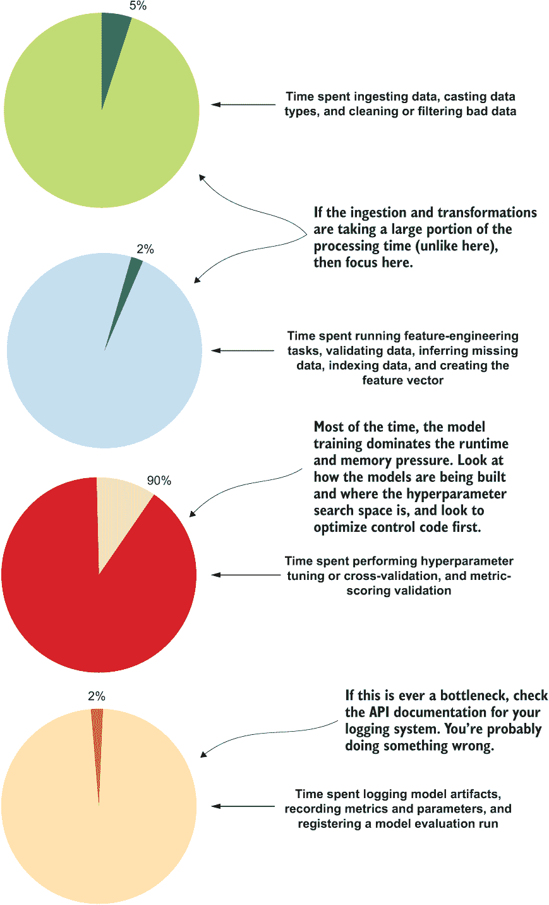

图 13.10 ML 管道内任务墙钟运行时间的通用分解

正如你所见，ML 项目代码的大部分处理时间主要专注于数据摄取操作（加载数据、合并数据、对数据进行聚合计算，以及将序数和分类数据转换为数值表示）和超参数调整。如果你注意到数据摄取绝对主导了你的项目运行时间（假设你所使用的平台可以支持大规模并行摄取，并且数据存储格式对快速读取是最优的，如 Delta、Parquet、Avro 或像 Kafka 这样的流源），那么考虑将数据重新部署到更高效的存储范式，或者研究更有效的数据处理方法。

在日志记录、模型注册和基本数据处理任务上花费的时间极其有限。因此，如果这些问题出现，修复这些问题很可能是通过阅读你所使用的模块的 API 文档，并纠正代码中的错误来相对容易地完成的。

了解这一点，任何优化努力都应该主要集中于减少工作的高时间约束阶段的总运行时间和 CPU 压力，而不是浪费在为解决方案中不重要的部分创建复杂和巧妙的代码上。关键要点是，优化 ML 代码的过程应该关注几个关键的关键方面：

+   *等待整个代码库的端到端功能全部运行正常后再花时间优化代码。* 在开发过程中发生的更改数量和频率可能会使对优化代码的重做变得令人沮丧。

+   *识别代码中运行时间最长的部分。* 在解决已经相对较快的部分之前，尝试变得巧妙，使这些部分更加高效。

+   *不要重新发明轮子。* 如果一个语言结构（或者类似功能在完全不同的语言中，无论如何）可以显著加快你正在尝试做的事情，或者减少内存压力，那么就使用它。实现你自己的链表抽象类或设计一个新的字典集合是极度自负的行为。只需使用现有的，然后继续解决更有价值的问题。

+   *如果运行时间确实非常糟糕，请探索不同的算法。* 只因为你非常喜欢梯度提升树，并不意味着它们是解决每个问题的理想方案。也许一个线性模型可以在运行时间的一小部分内相对接近性能。0.1%的准确度值得为了运行模型而增加 50 倍的预算吗？

在我看到的多支参与过早优化和泛化的团队中，DS-DNA 的集体信念是，ML 项目工作的技术方面超越了他们试图解决的问题。他们热爱工具，热爱大型 ML 专注组织推出的令人惊叹的新工作，以及 ML 生态系统中不断取得的快速进步。这些团队对平台、工具包、框架、算法以及 ML 工作的技术方面的关心远超过他们确保他们的方法能够以最有效和最可维护的方式帮助他们的业务。

## 13.4 你真的想成为那只金丝雀吗？alpha 测试和开源矿井的危险

让我们暂时假设你对 DS 领域非常陌生。实际上，你甚至是在工作的第一周。在办公室里，你环顾你的办公桌。团队中没有任何 DS 成员在职业中工作超过一个月。经理，一位经验丰富的软件工程师，不仅忙于管理 DS 团队，还忙于管理商业智能团队和数据仓库小组，并且忙于面试更多候选人，以使新的 DS 团队更加完整。

作为第一个任务，为团队生成一个低垂的果实建模项目来应对。被告知不能使用你在学校做工作时的笔记本电脑，经理给你们的方向是选择一个用于开发模型的框架。

在对平台和解决方案进行研究和调查的前几天，团队成员之一在博客中发现了正在讨论的一个新框架。它似乎具有前瞻性、功能丰富且易于使用。关于未来几个月计划为它构建的内容的讨论非常强大。有关于支持不仅是在用 C++编写的具有光滑 Python API 作为接口的分布式大规模并行处理（MPP）系统中的 CPU 任务，还包括 GPU 集群以及未来计划支持量子计算接口（量子算子优化所有可能的解的叠加以解决最小二乘问题的讨论）！

如果你曾经阅读过机器学习框架的源代码（即大多数专业人士在解决实际问题时所使用的框架），为其中一个框架做出过贡献，或者甚至围绕其中一些更受欢迎的开源框架的功能构建了一个包装器，你就会意识到这个“新潮且热门”的框架是多么荒谬。如果你是这样的情况，那么你就在图 13.11 的右侧部分（不是苦涩，而是明智的）。

让我们同意，我们所在的团队深深扎根于图 13.11 的中间列。团队成员的天真使他们无法看到他们即将面对的危险，那就是拥抱这个半成品、傲慢的怪物，一个过于雄心勃勃的开发者正在尝试构建。我们尝试了它，我们自愿成为试验品，我们的项目以生命为代价。

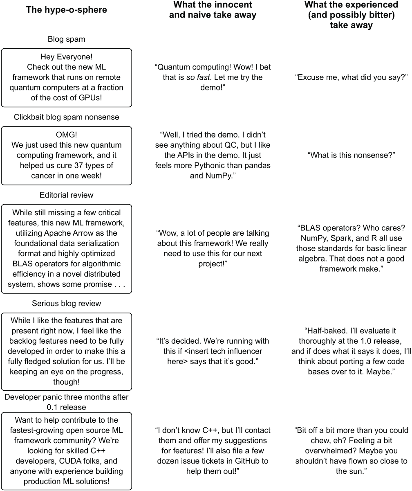

图 13.11 炒作？这是真实的。这也通常意味着炒作的对象实际上真的很糟糕（或者至少不是它所声称的那样）。

在这个新且高度在建的框架中工作的最终结果不可避免：彻底的失败。项目无法启动的失败并不是因为它们使用的 API，也不是因为它们调整解决方案的方式。真正的失败在于开发者的傲慢和围绕新功能和新框架的夸大其词的博客炒作氛围。

尝试新事物绝对没有错。我经常尝试这些新发布的软件包，看看它们是否值得。我在开源数据集上进行测试，在隔离环境中运行它们，以确保不会因为不稳定的依赖而污染我的类路径，并且让它们经历所有测试。我评估它们声称的功能，检查是否容易通过自定义实现来增强其功能，并观察系统如何处理不同的建模任务。内存利用率是否稳定？CPU 使用率是否与广泛使用的类似系统相当（或者，希望更好！）？我通过验证它们的声明来询问所有这些问题以及更多。

我永远不会在早期阶段使用这些软件包之一来构建一个企业依赖的项目。这里有几个原因：

+   *API 将会改变*—*很多。* 到稳定版 1.0 发布时，整个接口很可能会被完全重构。你将不得不更改你的代码以适应。

+   *事情可能会出错。* 可能会有一些事情，但通常在项目的 alpha 发布阶段初期会有很多事情出错。如果你在脆弱的代码上构建了重要的东西，你将不得不面对一个不稳定的代码库。

+   *没有保证项目不会变成积压品。* 如果项目周围没有强大的社区，没有数百或数千的贡献者，以及机器学习社区中相当一部分人的支持，代码库很可能会灭绝并被遗弃。你真的不希望你的项目运行在死代码上。

+   *即使是在首次发布的版本中，技术债务也早已存在。* 有时候会走捷径，省略某些步骤，并且可能存在一些错误。它可能对演示效果很好，对预包装的示例也毫无瑕疵，但很可能不会很好地适用于你需要实现以解决业务预测建模任务的非常具体的自定义逻辑。至少在其生命周期后期之前不会。

+   *新不一定代表更好。* 在决定像框架或平台这样至关重要的东西之前，你绝对必须忽略来自公司、博客作者和广告嘈杂声中的营销炒作。尝试新事物，并对你的选项进行科学的研究。从生产力、可维护性、稳定性和成本的角度选择最合理的解决方案。这个闪亮的新玩具可能具有所有这些特性，但根据我的经验，这几乎从未发生过（尽管有时这些项目最终确实会变成那样，所以请密切关注它们）。

接受他人的傲慢是可能困扰机器学习团队的最具破坏性的任务之一。通过不做适当的测试和研究关于如何以及在哪里运行你的代码的选项，你可能会陷入一个本质上已经破裂的系统，这最终会导致你的团队在仅仅保持系统运行而不是创新到新的项目解决方案上花费更多的时间和金钱。让你的测试阶段成为你的金丝雀，而不是你的机器学习项目。

## 13.5 技术驱动开发与解决方案驱动开发

让我们从第 13.4 节的新手数据科学成员团队转移到充满经验丰富的机器学习工程师的团队。假设团队中没有一个人的软件开发经验少于 20 年，每个人都对构建不同类型的深度学习模型、梯度提升树、线性模型和单变量预测感到厌倦和疲惫。

他们都渴望构建一些东西来自动化处理他们正在工作的数百个预测模型的枯燥工作。他们最想要的莫过于一个挑战。

当面对他们下一个主要项目时，一个基于关联规则的实现（如果他们使用一个经过验证的方法），他们决定要聪明一点。他们感觉可以编写一个在 Apache Spark 上运行性能更好的 FP-growth 算法版本，并开始推导出一个改进的 FP-tree 方程，这样就可以动态挖掘，从而消除树的核心扫描之一，用于项目收集检索。

虽然他们的初衷是好的，但他们最终花了整整三个月的时间来完善他们的算法，测试它，并证明它几乎与参考 FP-growth 实现的结果相同，但构建和扫描树的时间却少了很多。他们创造了一种新的算法实现，并开始使用它来解决他们同意开发的业务用例。

他们喝了一些啤酒，拍了拍彼此的背，开始撰写他们的博客文章和白皮书，并为一些会议演讲活动做准备。哦，天哪，现在每个人都知道他们有多么聪明了！

他们将解决方案投入生产。一切运行良好，在他们看来，这个算法每天都在通过显著提高运行时间的成本节约来为自己付费。当然，直到底层框架的重大修订发布。在这个新的运行时中，开源框架中对这些树的构建方式进行了重大更改，以及如何构建前因和后果的根本性优化。

团队对调整模型以适应他们用来构建解决方案的开发者级 API 的底层变化感到士气低落。图 13.12 展示了他们的困境以及他们本应该做的事情。

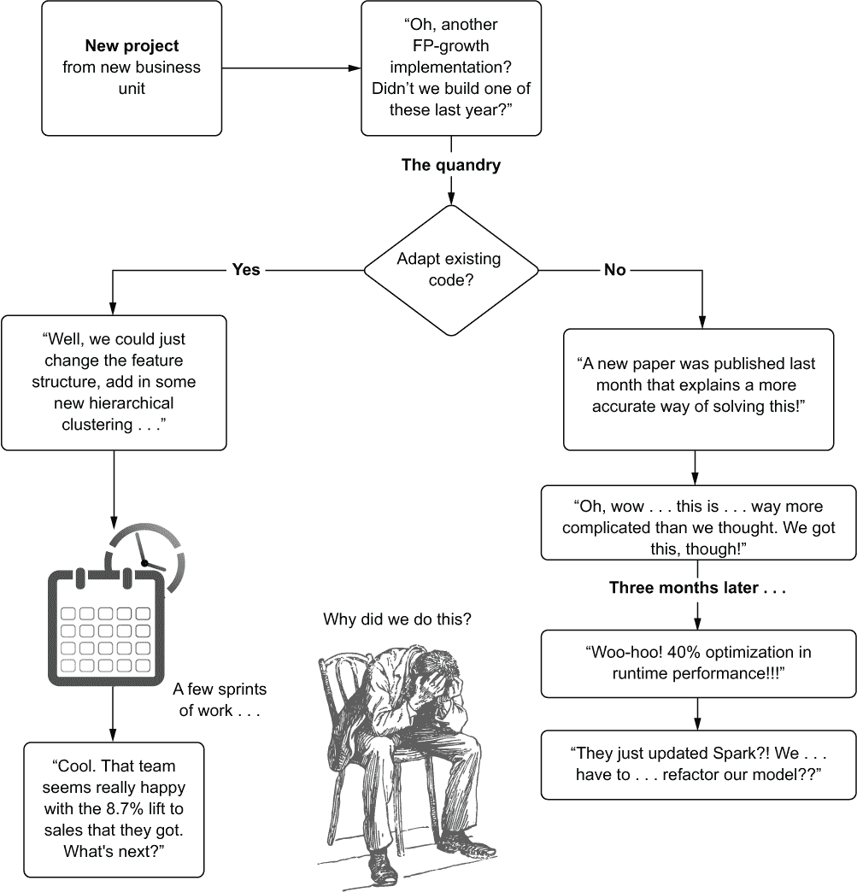

图 13.12 一个机器学习技术债务的“选择你的冒险”路径

正如你所见，导致项目脱轨的关键决策在于没有使用之前多次被证明有效的现有标准。他们不仅需要构建一个支持业务用例的解决方案，还必须构建一个全新的算法，将其整合到框架的低级设计范式，并完全拥有实现权，以确保他们可以继续支持推动他们独特算法创建的业务用例。

由于他们的算法利用了框架的许多内部结构来加速开发过程，团队现在面临一个新的困境。他们是更新他们的算法以在新框架版本中工作，希望它将继续优于提供的 FP-growth 算法？还是重构整个解决方案以使用标准算法？

这里没有好的答案。他们的自定义框架注定要么成为积压品，要么需要几个季度的转换才能使其工作。

他们尝试的主要问题是构建了一个他们没有准备好支持的定制实现。他们构建解决方案不是为了解决业务问题，而是为了出名。他们想要被注意到并得到赞赏，因为他们的技能。团队没有意识到，虽然构建新算法和推进职业状态并没有什么真正的问题，但构建它的动机应该集中在解决问题的必要性上。

如果团队成员以解决方案驱动的思维方式来处理问题，他们永远不会考虑创建自定义解决方案的可能性。也许他们会联系现有流行开源框架的维护者，并自愿创建一个可以由该框架社区支持的新版本。如果有明确的降低运行时间以满足服务级别协议的需要，并且需要构建一个新算法，那是可以的。如果你遇到这种需求，就去构建它。只是要知道，你需要维护那段代码，直到那个业务用例的需求存在。

我发现自己越来越反感这种 TDD（测试驱动开发）的概念，因为它只是给一个已经压力很大的职业增加了更多的压力。通过追求更容易（并且，可以说，更无聊）的解决方案来解决问题，尤其是如果你已经有一个现有的解决方案来解决几乎相同的问题，你是在让业务处于更好的手中。你将会有更少的维护工作要做，有更多的时间创造性地使用你的才能来解决更有趣的未来问题。

## 摘要

+   追求简单实现，不超出项目当前需求，将节省在功能需要改变时大量重构的时间。少即是多。

+   虽然每个人在软件开发技能的增长阶段都不同，但让团队专注于利用易于理解和阅读的通用设计模式，将确保团队中的每个人都能为代码库做出贡献并维护它。

+   在机器学习代码库中构建不必要的功能、复杂的接口和巧妙的独特实现，仅仅意味着你将不得不支持和维护更多的代码，这对组织没有任何价值。保持代码库的复杂度仅限于解决问题的关键，始终是一个明智的选择。

+   在决定将任何此类工具集成到项目中之前，彻底调查任何新技术的能力、实用性和最重要的是需求，以确定它是否对项目有用，这是至关重要的。

+   在为商业需求工作项目时，要注意只实现解决问题所需的功能。任何超出项目需求的东西都是虚荣的开发，会损害解决方案的可维护性。
