# 14 编写生产代码

本章涵盖

+   在尝试使用数据构建模型之前，验证特征数据

+   监控生产中的功能

+   监控生产模型生命周期的各个方面

+   以尽可能简单的方式解决问题的项目方法

+   为机器学习项目定义标准代码架构

+   避免在机器学习中出现货船崇拜行为

我们在这本书的第二部分中花费了全部时间来探讨构建机器学习软件的技术方面。在这一章中，我们将开始从架构师的角度审视机器学习项目工作。

我们将专注于从高度互联、极度复杂且整体性的视角，探讨如何运用机器学习解决问题的理论和方法。我们将研究生产机器学习的案例研究（所有这些案例，以某种方式，都是基于我所犯的错误或看到他人犯的错误），以深入了解那些不常被讨论的机器学习开发要素。这些是我们作为行业，在更关注解决问题的算法方面，而不是我们应该关注的领域时，通常以艰难的方式学到的教训：

+   *数据*——它的生成方式、位置以及它的本质

+   *复杂性*——解决方案和代码的复杂性

+   *问题*——以最简单的方式解决它

正如我们在前面的章节中讨论的，数据科学工作的目标不仅仅是利用算法。它不是框架、工具包或看似越来越热门或流行的特定模型基础设施。

注意数据科学工作应仅专注于解决问题、使用数据和将科学方法应用于我们的方法，以确保我们基于可用的数据以最佳方式解决问题。

带着这种关注，我们将探讨现实世界中生产开发的一些方面，特别是构建解决方案的独特破坏性方面，这些方面可能对那些算法专注且未经历过足够痛苦的实施失败的实践者来说并不明显。在这个行业中工作足够长的时间，每个人都会以某种方式学到这些教训。你越早从他人的错误中学习，学习过程就越不会像我们中的一些人那样痛苦，因为我们从它变得流行之前就开始做这件事了。

所有关于工具和框架的提及在哪里？

正如我在本书的许多地方提到的，成功的机器学习不是关于一系列工具。也不是关于特定的平台。

使成功项目与那些未能继续解决其*存在理由*的项目区别开来的，并不是某些巧妙的 API、炒作的宏伟框架或包装解决方案。使项目成功的四个主要要素简单来说就是这些：数据的质量、解决问题的最小复杂度、解决方案的可监控性（以及易于修复），以及最重要的是，解决方案解决问题的能力。正如我的一个同事经常说的，其他所有东西都只是浮华。

在本章和下一章中，我们将重点关注这些基本要素——保持数据清洁、监控数据和模型的健康状况，以及在解决方案开发中注重简洁性。

虽然框架、工具、平台和其他提高生活质量的工具使机器学习解决方案的生产过程变得更加容易（我们将在最后几章中深入探讨这些主题），但它们并不是成功的万能保障。当你需要它们时，它们都在那里（平台除外——你肯定需要选择最适合你团队和公司的平台），并且可以帮助解决一些组织可能会遇到的具体问题，但它们并不是普遍适用的。

成功机器学习的原则无疑是普遍适用的。如果你没有弄清楚这些，那么你使用的工具箱多么花哨都无关紧要。无论你是否拥有最先进的 CI/CD、特征存储、自动机器学习、特征生成工厂、GPU 加速的深度学习，或者任何其他机器学习领域的炒作术语，这些巧妙的工具并不能拯救你的项目，如果你的数据质量差、代码难以维护，而且你也没有确保你的内部客户对解决方案感到满意。

## 14.1 你是否已经与你的数据相识？

我所说的“相识”并不是在去续杯咖啡的路上对数据简短而礼貌地点头致意，也不是在展会上匆匆忙忙、尴尬地自我介绍 30 秒。相反，你应该与你的数据进行的“相识”更像是长达数小时的私密对话，在一个安静、装饰考究的酒吧里，一边品尝着麦卡伦珍稀桶威士忌，一边分享见解，深入挖掘你们两人所体现的细微差别：*真正地了解它*。

小贴士：在编写任何一行代码，即使是实验性的，确保你拥有以最简单的方式回答问题基本性质所需的数据（一个 if/else 语句）。如果你没有，看看你是否可以获取它。如果你无法获取，就继续做你能解决的问题。

作为仅通过偶然的随意会面使用数据解决问题的危险的一个例子，让我们假设我们都在一家内容提供商公司工作。由于我们小公司的商业模式性质，我们的内容在互联网上通过定时付费墙列出。对于前几篇文章的阅读，不显示广告，内容免费查看，交互体验不受干扰。在阅读了一定数量的文章后，会呈现越来越令人讨厌的一系列弹出窗口和干扰，以诱使读者注册订阅。

系统的先前状态是通过基本启发式方法控制的，该方法通过计算最终用户看到的文章页数来设置。意识到这可能会让在平台上第一次会话期间浏览的人感到厌烦，因此将其调整为查看会话长度以及每篇文章已读行数的估计。随着时间的推移，这个看似简单的规则集变得如此难以驾驭和复杂，以至于网页团队要求我们的数据科学团队构建一个能够预测每个用户级别的干扰类型和频率，以最大化订阅率的系统。

我们花费了几个月的时间，主要使用先前构建来支持启发式方法的工作，让数据工程团队创建与前端团队使用的生成决策数据的数据结构和操作逻辑相对应的镜像 ETL 流程。有了数据湖中的数据，我们继续构建一个高度有效且准确的模型，该模型似乎在我们的所有保留测试中都表现出色。

在发布到生产环境中时，我们意识到了一个问题，如图 14.1 所示。作为构建解决方案的数据科学团队，我们没有做到的是检查我们用于特征的所用数据的条件。

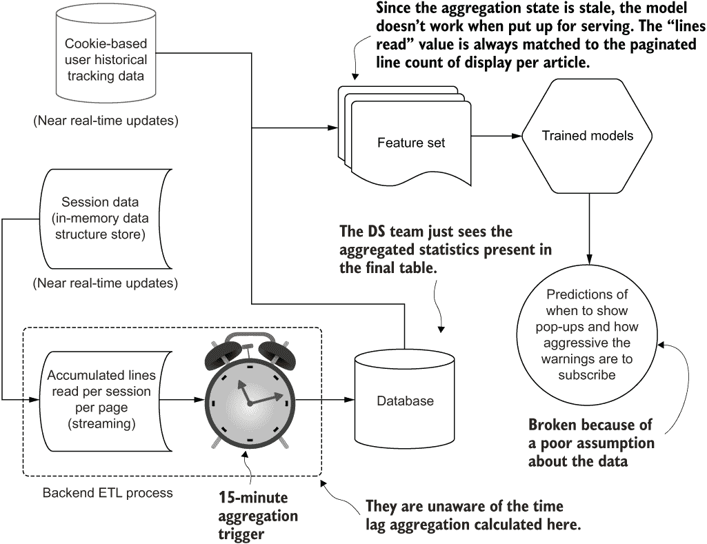

图 14.1 在此情况下，未能理解数据服务等级协议会导致模型非常糟糕。

我们从湖仓中的对象存储数据中训练了我们的模型。在模型开发过程中处理提取的数据时，我们没有意识到数据提取的机制。我们假设我们使用的特征将直接在数据湖中几乎实时可用。然而，为了降低成本并最小化对生产系统的影响，数据工程团队将其 ETL 从 Redis 开发为一个每 15 分钟触发一次的周期性导出。从我们用于训练的数据中，我们看到了会话的消费数据，这些数据被分成 5 秒的活动块，我们可以利用这些数据轻松地创建滚动聚合统计作为主要特征。从逻辑上讲，我们可以假设数据将通过 5 秒触发器连续加载。

一旦解决方案进入生产，问题不仅仅是根据活动个性化效果。相反，巨大的问题是每个人在看到他们的第一篇文章时都会立即收到“显示所有广告和弹出窗口”的相同预测。由于缺乏相关特征数据，模型完全无效。我们让整个网站在整整一天内陷入混乱，迫使项目完全重新设计，最终不得不丢弃大部分基于无法轻易提供给模型的数据的解决方案。哎呀。

让我们来看看在开始数据科学项目时我思考的三个主要指导原则以及为什么它们很重要。如果这三个原则没有得到遵守，根据我的经验，项目能够持续生产的可能性几乎为零——无论其实现多么巧妙，无论其在解决问题上的成功程度如何，或者组织内部使用它的热情有多高。

### 14.1.1 确保你有数据

这个例子可能看起来有点愚蠢，但我已经看到这种情况发生了数十次。无法获取模型服务所需正确数据是一个常见问题。

我看到过团队使用手动提取的数据集（一次性提取），用这些数据构建了一个真正出色的解决方案，当准备将项目部署到生产时，他们才在最后一刻意识到构建这个一次性提取的过程需要 DE 团队完全手动操作。使解决方案有效的必要数据被隔离在 DS 和 DE 团队无法访问的生产基础设施中。图 14.2 展示了一个我见证过太多次的相当熟悉的情况。

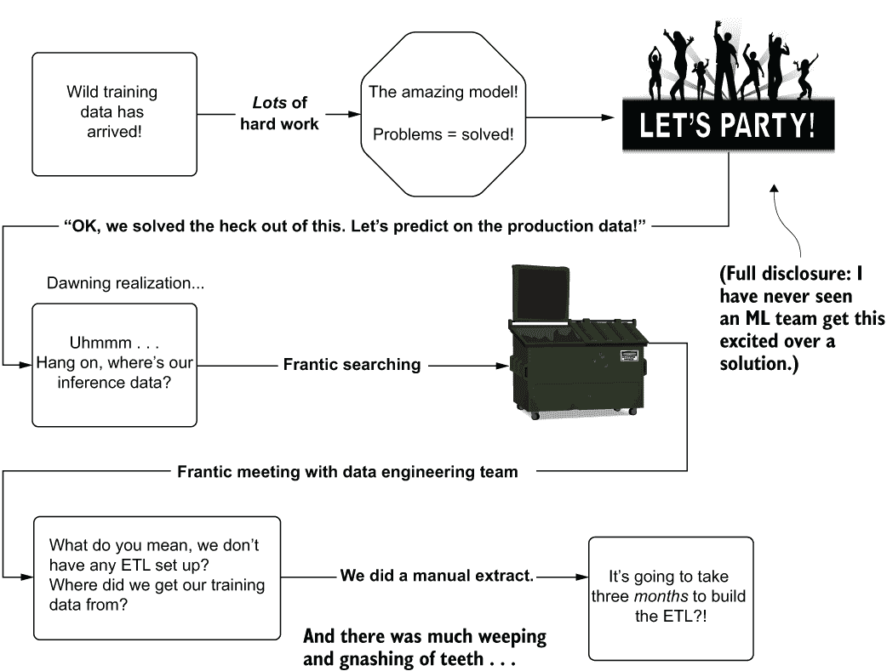

图 14.2 在将解决方案部署到生产之前，最好确保你有数据。

如图 14.2 所示，如果没有基础设施将数据转换为可用于预测的格式，整个项目就需要创建一个，以便 DE 团队构建所需的 ETL 以按计划实现数据。根据数据源复杂性的不同，这可能需要一段时间。毕竟，从多个生产关系数据库和内存键值存储中提取的加固生产级 ETL 作业并非易事。这样的延误可能导致（并且已经导致）项目放弃，无论数据科学部分解决方案的预测能力如何。

如果预测需要在在线进行，那么这个复杂 ETL 作业创建的问题变得更加具有挑战性。到那时，问题不再是 DE 团队努力让 ETL 流程运行；相反，工程组织中的不同团队将不得不将数据积累到单一位置，以便生成可以输入到对 ML 服务的 REST API 请求中的属性集合。

整个问题是可以解决的。在 EDA 期间，DS 团队应该评估数据生成的性质，向数据仓库团队提出尖锐的问题：

+   数据能否压缩到最少的表以降低成本？

+   如果出现问题，团队优先修复这些来源的优先级是什么？

+   我能否从训练层和服务层访问这些数据？

+   查询这些数据用于服务是否满足项目 SLA？

在开始建模工作之前，了解每个问题的答案可以帮助决定是否参与项目工作。如果数据尚未准备好供消费，这些答案可以给 DE 团队时间来优先处理，并在手动提取的最终数据集副本上进行建模的同时，异步地构建这些数据集。

### 14.1.2 检查数据来源

除了围绕数据可用性的基本问题之外，还有一个极其重要的数据**来源**问题。具体来说，数据是通过什么机制进入数据仓库或数据湖屋的？了解即将进入项目的潜在数据来源，有助于你理解其稳定性、清洁程度以及将其包含在模型中的风险。

为了说明来源的重要性，让我们假设我们有三个独立的表，我们从中获取数据来解决一个特定的监督学习问题。所有三个表都存在于由云对象存储支持的数据仓库中，并且每个表都是 parquet 格式。从数据最终用户的角度来看，每个表看起来都很相似。每个表中都有一点重叠，因为一些数据似乎是相同基础信息的重复信息，但所有表都可以根据外键相互连接。

图 14.3 展示了查看这三个表中的数据时可见的信息。

通过查看行数和字段名，我们可以清楚地看到我们正在查看电子商务数据。表 A 是我们的主会员表，B 是我们的订单数据，C 是我们的网站流量数据。如果我们到此结束对数据来源的调查，那么在利用这些数据进行建模时，我们可能会遇到一些令人不快的惊喜。

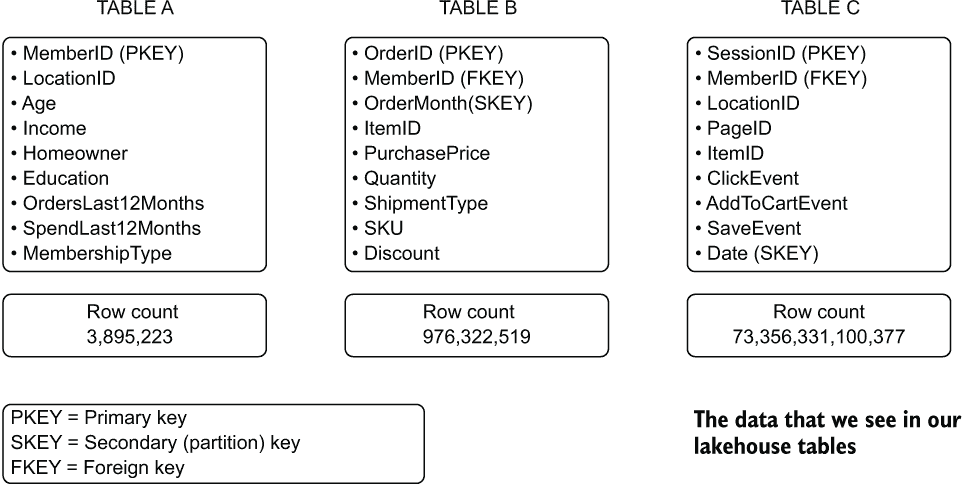

图 14.3 湖屋表中存在的三个数据表，可供我们的项目使用

在我们开始使用这些数据创建特征集之前，我们需要了解摄取机制。如果不了解数据何时加载以及每个表更新的频率，我们创建的任何用于创建插补向量的连接都可能存在重大的正确性问题。

主要是因为这些数据集是由不同的工程团队生产和编排的，而且也因为生成数据的系统性质，它们之间在最近数据上达成一致的可能性非常低。例如，在最近的站点活动数据中，后续的购买事件数据可能延迟超过一小时。理解这些 SLA 考虑因素对于确保从这些 ETL 过程中生成的特征数据准确至关重要。图 14.4 显示了这些表的扩展视图，其中包含通过质疑拥有将数据填充到表中的作业的 DE 团队获得的额外数据。

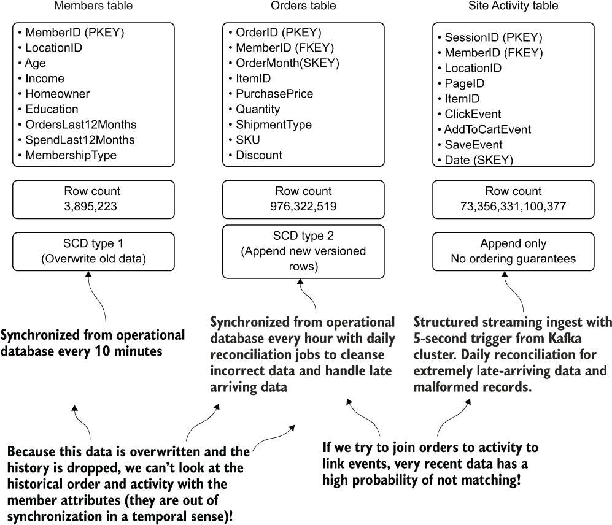

图 14.4 与 DE 团队讨论数据来源、数据如何到达以及关于数据可以和不可以做什么的关键细节所获得的信息补充

从 DE 团队获得这些新细节后，我们可以就数据源做出一些相当关键的决策。然后我们可以将这些信息输入到我们的数据目录解决方案中。这样的例子可能看起来像表 14.1。

表 14.1 我们样本用户跟踪数据的数据目录条目

| 表名 | 更新频率 | 描述/备注 |
| --- | --- | --- |
| 成员表 | 10 分钟 | 用更改覆盖现有数据。历史更改仅在原始表中反映。如果需要建模状态更改，请使用 Members_Historic 表。由前端网络团队拥有。 |
| 订单表 | 1 小时+每日核对 | 从实时订单和发货源系统获取订单数据。要获取最新状态，必须使用版本键值上的窗口函数以获取真正的自然键条目。由后端市场工程团队拥有。 |
| 站点活动表 | 实时+每日核对 | 插入顺序不保证正确。当用户在移动设备上时，数据可能延迟数小时。成员使用 VPN 可能导致位置数据不准确。嵌套模式元素的更改。由 DE 团队拥有。 |

基于在特征存储中收集的这些笔记，DS 团队可以更好地理解数据的细微差别。彻底编制源数据系统的性质可以防止可能困扰 ML 解决方案的最坏问题之一：生成高质量预测所需的数据不足。

在生产开发阶段初期花额外的时间来理解数据究竟在何时、何地以及如何到达用于训练和推理的源系统，可以避免许多问题。我们可以了解哪些数据可以用于特定的用例（在这个示例场景中，是用于历史相关性目的的成员属性与其他表的连接）。我们可以根据最终用途定义的特征来识别项目的局限性；在我们的例子中，我们显然不能使用活动数据来处理极低服务等级协议（SLA）的用例。如果项目需要的数据新鲜度比当前 ETL 过程提供的更新频率短，我们可以在发布前探索缩短 ETL 过程以防止灾难性的生产发布问题。

有足够的时间准备，数据工程（DE）团队可以与机器学习（ML）开发工作并行工作，以提供所需的数据格式，确保实施正在作用于足够近期的数据以支持项目需求。

当我们开始考虑合规性问题，这些问题关于数据来源变得更加复杂。以下是一些需要仔细思考的要素：

+   您想要用于建模的数据是否受到法规的约束，例如欧盟的通用数据保护条例（GDPR）、个人身份信息（PII）或健康保险可携带性和问责制法案（HIPAA）？如果是这样，请遵守这些要求。

+   关于您正在使用的数据，是否有内部限制关于可见性？

+   您的数据中是否存在固有的偏见，这可能会从道德上损害您正在构建的模型？（如果您正在处理与人类相关的数据，答案可能是响亮的肯定，您应该仔细考虑正在收集的数据的来源。）

+   源系统和为这些表提供数据的流程多久会因维护或完全失败而停机？ETL 通常是否稳定？

+   这些表上的模式多久更改一次？对于数据结构中的嵌套元素（主要适用于基于 Web 的数据集）是否有规则和流程来管理它们是否可以更改？

+   生成的数据是从自动化流程（应用程序）还是从人工输入中产生的？

+   是否有数据验证检查正在运行以确保只有干净的数据被允许进入这些表？

+   数据是否一致？源数据是否持久？在向表中写入数据时是否涉及隔离以消除正确性问题发生的可能性？

当信息来自不同的系统时，我们有一长串关于数据质量需要检查的其他事情。在所有关于数据的事情中，最重要的是在使用任何数据集之前，*不要相信任何东西，要验证一切*。在浪费时间构建基于你用来训练的数据性质的使用案例不会工作的模型之前，提出问题并获取关于你的数据的信息。

将未知和可能错误的数据投入模型中是创建完全无法使用的垃圾解决方案的可靠方法。相信我，我已经不止一次地学到了这个教训。

### 14.1.3 寻找真相的来源并与之一致

我还没有在、与或为一家完美无瑕的数据公司工作过。虽然许多组织几乎拥有完美的数据模型、高度稳健的数据工程管道和有效无瑕的摄取架构，但数据本身完美的概念几乎是一个难以达到的目标。

让我们假设我们是一家面向企业的公司，为广泛的行业提供人力资源服务。我们的 DE 团队是世界级的，从公司早期就采用了能够出色处理多年业务变化的数据模型。信息以灵活的关系星型模式呈现，并允许在数据仓库中进行快速分析。

三年前，随着转向云计算的到来以及随之而来的成本效益数据湖（比本地解决方案更便宜）的范式转变，事情开始发生变化。那些所有新的数据分析数据源都必须经过 DE 团队的日子已经过去了。公司中的任何团队都可以创建数据，将其上传到对象存储，将源注册为表，并为其目的使用它。云供应商承诺的数据访问民主化肯定将是我们公司效率和洞察力的一次真正革命！

*然而，事情并没有按这种方式发展。* 随着湖泊恶化成为沼泽，类似的数据的多个副本开始诞生。图 14.5 显示了数据湖分析层中多个位置的行业类型的单一层次表示。

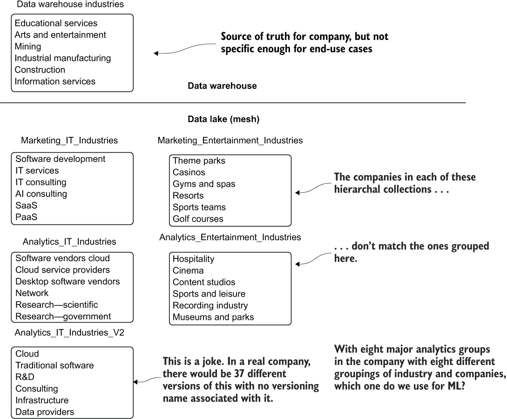

图 14.5 在数据湖上启用自助服务后，如果没有统一的事实来源，可能会让每个人的生活更加困难。

如果我们打算使用数据湖中可用的这些产品层次结构来开展我们的机器学习项目，我们应该选择哪一个？在如此多的重叠和不一致的情况下，我们如何确定哪个是最相关的？

简直没有测试所有这些的方法——尤其是，如图 14.5 底部提到的，考虑到同一组在各个提交周期存在多个版本。我们应该怎么做？

我发现最成功的方法是将团队*对齐*到一个提供单一事实来源的过程，这个来源满足每个团队的需求。这并不意味着每个人都必须遵守相同的定义，即哪些公司群体需要进入哪个聚合桶。相反，这意味着以下内容：

+   维护每个部门支持其与数据交互需求的定义的单一副本（没有 _V2 或 _V37 的相同数据副本，这只会增加混淆）。

+   选择正确的缓慢变化维度（SCD）更新类型，以满足每个团队对这种数据的需求和用途。（一些团队可能需要历史参考，而其他团队可能只需要最新的值。）

+   标准化。如果它是一只鸭子，就称它为鸭子。用独特而可爱的名字，如 aquatic_avian_waterfowl_fun_plumage，对任何人都没有好处。

+   定期清理。如果数据没有被使用，就将其存档。保持湖泊健康意味着每个人都可以在其中游泳。

+   清点数据。在知识库中使用实体关系（ER）图，构建或购买数据目录，或维护每个表中每列的详细文档。

虽然所有这些任务看起来像是大量的工作——确实如此——但它们是现代企业运行的基础。拥有可理解的数据不仅有利于机器学习项目，还允许相同（大部分）干净的数据在分析组和数据科学组之间共享。这意味着当讨论业务状况和可以利用这些数据的创新未来工作时，每个人都使用同一种语言。

在数据质量方面，作为机器学习项目的一部分，你绝对不应该尝试自行纠正数据（即使这样做很有诱惑力）。单一事实来源的概念比你可能认为的要重要得多。

### 14.1.4 不要将数据清理嵌入到你的生产代码中

这将是一个敏感的话题。尤其是对你的数据工程朋友来说。

让我们假设我们正在从事一个旨在估计客户是否应该自动注册一个提供比当前信用卡更高信用额的信用卡优惠的项目。我们已经探索了数据仓库中的数据，并确定了构建原型所需的最小特征数量（一开始保持简单），以及获取数据的三个所需表。

在对数据进行探索和验证时，我们遇到了问题。从重复数据到不一致的产品描述，再到原始金融交易历史数据中的缩放因子问题，我们有很多工作要做。

如果我们利用我们机器学习平台中可用的数据清洗工具来解决这些问题，我们将在代码库中有一个专门用于数据预处理任务的整个模块，以修复数据。运行数据通过预处理阶段，然后是特征工程，最后是模型训练和验证，我们将有一个生成模型的过程，效果相当好。

然而，预测时会发生什么？如果我们坚持这种范式，由于源数据质量极差，我们有三种选择：

+   复制用于预测任务的填充、去重和正则表达式代码。（由于可维护性考虑，这是一个坏主意。）

+   创建一个独立的实用预处理模块，可以从训练和推理任务中调用。（这是一个更好的主意，但仍然不是理想的。）

+   将清洗逻辑集成到一个完整的管道对象中。（这是一个更好的主意，但可能浪费和昂贵。）

假设在我们急于快速完成项目的过程中，我们完全忘记了做这些事情。我们的数据清洗逻辑完全构建在我们的训练代码库中，模型经过验证工作得相当好，我们准备将其部署到生产环境中。

在对生产数据量极小的一部分进行测试时，我们开始意识到，通过监控模型性能，多个客户被反复联系，他们的信用额度被提高了好几次。其他看似有资格的客户正在为没有的卡片和服务申请信用额度增加请求。基本上，我们构建了一个伟大的模型，它正在预测垃圾数据的状态。图 14.6 说明了这个项目所造成的情况。

图 14.6，虽然是一个遗忘和混乱的极端案例，但揭示了当机器学习团队选择修复数据质量问题时所列出的可能解决方案。当你自己修复数据时，你现在负责这个。与其用数据构建解决方案，不如拥有一个解决方案和数据修复任务。

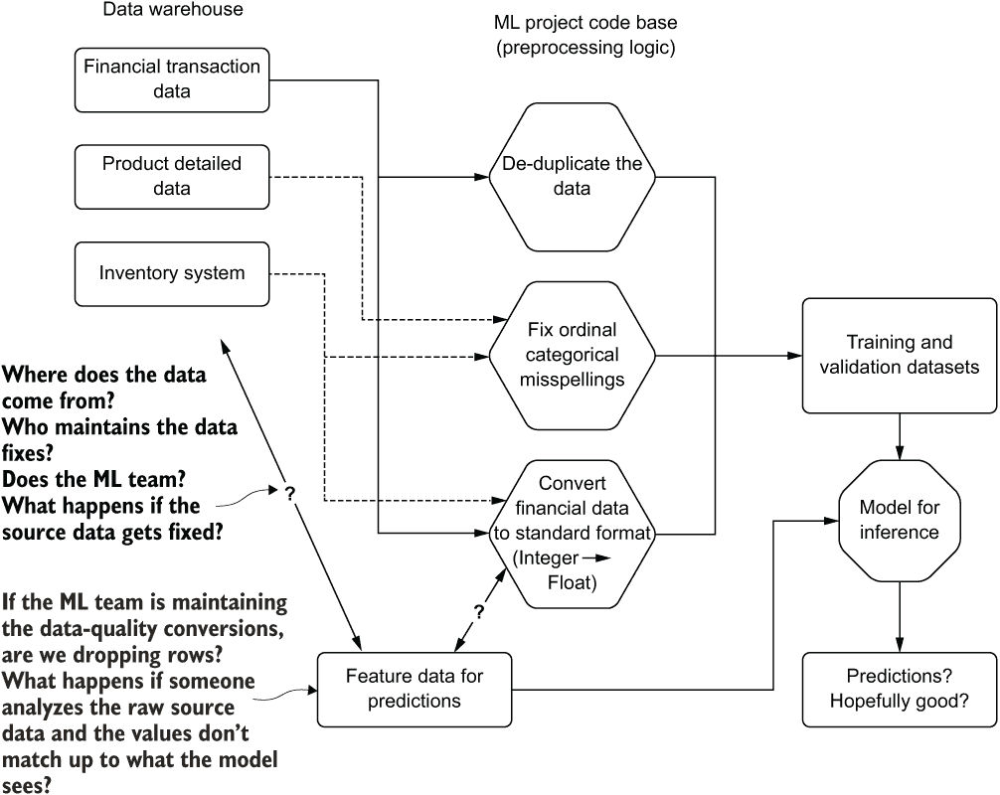

图 14.6 在机器学习代码中修复数据质量问题可以造成大量的混乱。

尽管这种特定场景在某些组织中（例如，小型初创公司，其中数据科学家可能同时担任数据工程师和数据科学家角色）是不可避免的，但推荐的行动方案仍然是相同的：具体来说，数据清洗代码永远不应该与建模解决方案链接在一起。图 14.7 显示了更好的数据质量问题解决方案。

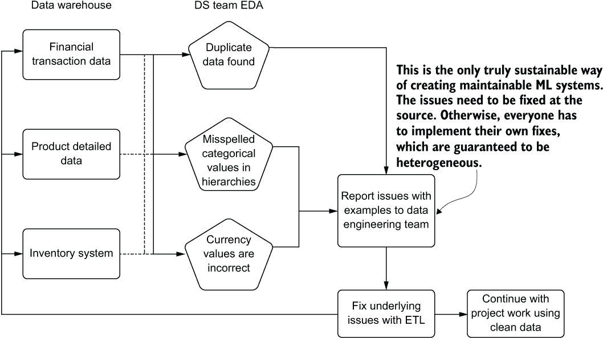

图 14.7 修复数据质量问题更好的前进方式：不在机器学习代码中嵌入数据修复任务

在长期保持数据修复任务功能性的更可持续和更受欢迎的方式是在源头修复数据。这有助于解决几个问题：

+   数据已经清洗以供其他用途。

+   从模型训练和推理代码中移除了昂贵的去重、问题修正、插值和复杂的连接操作（减少了复杂性）。

+   数据在训练和推理之间是可靠的（不存在训练和推理之间逻辑不匹配的风险）。

+   特征监控（漂移检测）得到了极大的简化。

+   分析和归因测量得到了极大的简化。

保持用于建模的数据的干净状态是稳定和高质量机器学习解决方案的基础。虽然机器学习包包括许多用于纠正数据问题的工具，但最可靠的数据正确性强制方式是在数据存储的源头进行。

## 14.2 监控你的特征

在生产级机器学习部署中，一个经常被忽视的部分是密切关注进入模型的特征。作为专业的数据科学家，我们真正地花费了大量的时间和精力分析与我们特征相关的每一个属性。很多时候，解决方案被部署到生产环境中，唯一被监控的是模型的输出。这导致性能下降时出现意外的惊喜，使我们处于匆忙诊断变化、为什么可能发生变化以及如何解决问题的境地。

*有解决办法的。*

假设我们正在附录 A 中的狗粮公司工作。我们已经将模型部署到生产环境中，对预测的狗粮需求进行了监控，产品浪费量大幅减少。我们有一个彻底且自动化的归因分析系统，它跟踪预测性能，显示出比预期更高的项目性能结果。

许多周后，我们的预测开始变得没有意义。它们预测每个配送站点的库存订购量都大大减少。幸运的是，我们有人工智能在循环中验证订单请求，所以并没有全盘皆输。我们在几天的时间里，越来越担心地观察着每种产品类型的订单预测都下降到极低水平。

我们恐慌，重新训练模型，并看到基于我们对先前产品需求的理解，结果变得如此荒谬，以至于我们完全关闭了预测系统。直到一周后我们深入挖掘特征数据，才找到罪魁祸首。图 14.8 显示了模型用于预测的一个关键特征。

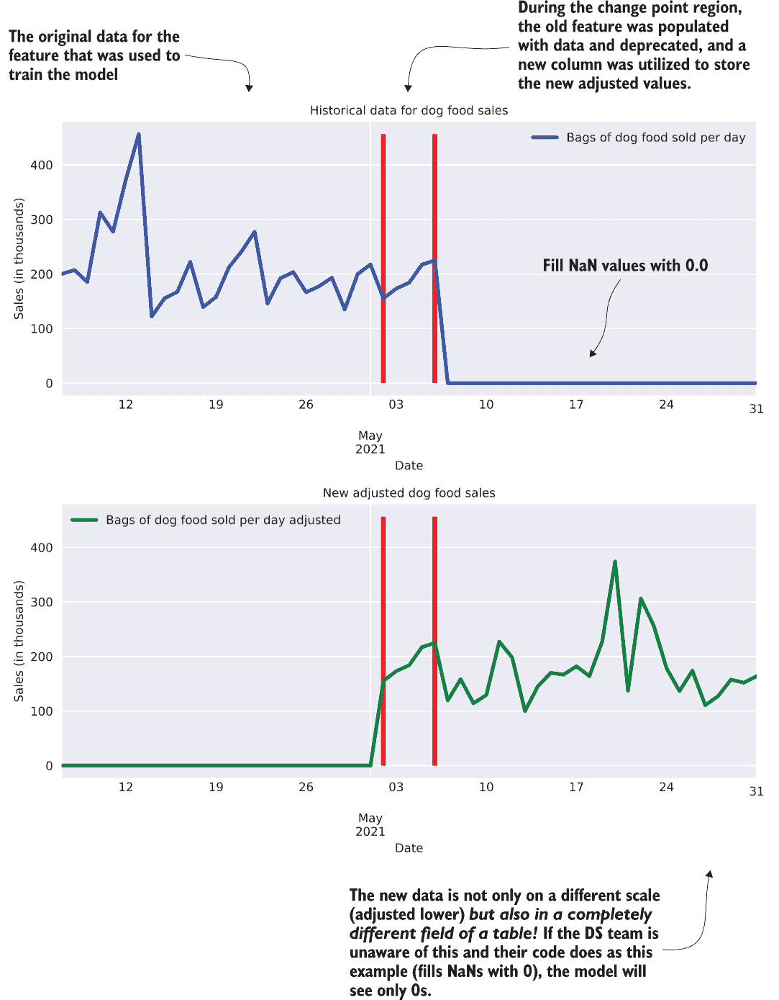

图 14.8 一个关键特征的 ETL 变化对数据科学家团队来说是非常糟糕的一周。

图 14.8 顶部的图表显示了我们某个区域分销中心的销售数据，而底部的图表显示了财务团队要求 DE 团队为公司的“更准确”的报表范式创建的新调整后的销售数据。在重叠期（过渡期）内，这两列销售数据都被填充，但在过渡期结束时，数据停止流入原始列。

那么，我们的模型发生了什么？由于销售数据是模型的一个关键部分，并且因为我们使用基于最近七天的数据的时间窗口的插补方法，缺失数据的插补值开始迅速趋向于零。模型对这一特征赋予了如此大的权重，不仅接收到了它在训练期间没有评估过的数据（毕竟，零销售是一个坏事情，并且在我们没有破产的公司中并不存在），而且这个值如此之低的影响实际上在短时间内将所有产品的需求预测推到了零。

在讨论机器学习中的空值处理（填充 0、在训练集数据值上插补、平滑插补等）的争论之前，我们如何能在问题真正恶化之前捕捉到这个问题？即使我们没有提前警告这个变化，我们如何能在特征值上建立警报，以便当第一个值降到零时，我们知道这个特定的特征有问题？

最简单的解决方案是在训练过程中收集每个特征的基本统计信息（如果你在一个具有大量训练集的分布式系统上，可以近似统计）。这些统计信息可以存储在一个表中，该表使用基本的 SCD 类型 2 方法进行版本控制：为特征数据添加新行，并在每次后续运行中增加版本。然后可以安排一个每日任务，其唯一目的是比较用于预测的最近*n*小时或天的值与上次训练运行期间特征的值。以下列表展示了这个概念的基本示例，针对我们场景中的数据（图 14.8 顶部的图表）运行。

列表 14.1 一个简单的特征监控脚本

```
import numpy as np
prior_to_shift = np.append(ORIGINAL_DATA, 
BOUNDARY_DATA)                                              ❶
prior_stats = {}                                            ❷
prior_stats['prior_stddev'] = np.std(prior_to_shift)        ❸
prior_stats['prior_mean'] = np.mean(prior_to_shift)
prior_stats['prior_median'] = np.median(prior_to_shift)
prior_stats['prior_min'] = np.min(prior_to_shift)
prior_stats['prior_max'] = np.max(prior_to_shift)
post_shift = np.append(BOUNDARY_DATA, 
np.full(ORIGINAL_DATA.size, 0))                             ❹
post_stats = {}                                             ❺
post_stats['post_stddev'] = np.std(post_shift)
post_stats['post_mean'] = np.mean(post_shift)
post_stats['post_median'] = np.median(post_shift)
post_stats['post_min'] = np.min(post_shift)
post_stats['post_max'] = np.max(post_shift)
bad_things = "Bad things are afoot in our sales data!"
if post_stats['post_mean'] <= prior_stats['prior_min']: 
    print(bad_things + 
      " Mean is lower than training min!")                  ❻
if post_stats['post_mean'] >= prior_stats['prior_max']: 
    print(bad_things + 
      " Mean is higher than training max!")                 ❼
if ~(prior_stats['prior_stddev'] * 0.5  
  <= post_stats['post_stddev'] <=  2\. 
  * prior_stats['prior_stddev']): 
    print(bad_things + " stddev is way out of bounds!")     ❽
>> prior_stats
{'prior_stddev': 70.23796409350146,
 'prior_mean': 209.71999999999994,
 'prior_median': 196.5,
 'prior_min': 121.9,
 'prior_max': 456.2}
>> post_stats
{'post_stddev': 71.95139902894329,
 'post_mean': 31.813333333333333,
 'post_median': 0.0,
 'post_min': 0.0,
 'post_max': 224.9}
>> Bad things are afoot in our sales data! Mean is lower than training min!
```

❶ 我们场景中在变化之前的数据（原始的销售数据列）

❷ 一个简单的字典，用于安全存储我们的特征数据统计值

❸ 训练后的特征统计信息（标准差、均值、中位数、最小值和最大值）

❹ 用于与训练统计信息进行比较的后续变化数据

❺ 每次验证运行的一个字典（健康检查作业脚本，用于测量每个特征的这些统计信息）

❸ 基本示例检查特征现在的均值是否低于训练期间的最小值

❷ 对均值是否高于训练值的最大值进行类似检查

❽ 对特征方差是否发生显著变化的广泛检查

这段代码故意简单，目的是提高人们对需要监控相对简单元素以计算的需求的认识。你最终可能开发的特定特征监控工具包的规则可以变得像你的用例所需的那么复杂和功能丰富，或者可以保持相对简单，作为一个轻量级的实用框架来监控模型中使用的任何特征的基本统计数据。

在现实世界的场景中，我们不仅会从所有特征中检索数据，还会查询一个表（或存储这些统计数据的表或服务，例如 MLflow 的跟踪服务器）。显然，警报不会是一个简单的`print`语句，而是一个通过呼叫中心警报、电子邮件或类似机制的通知，让团队知道前方有一个相当大的问题和破坏性的一天。围绕所有这些需求架构是高度特定于你可能在运行的底层基础设施的，所以我们在这里保持简单，使用`print`语句和字典。

在撰写本文时，正在开发中的开源软件包旨在为开源社区解决这个问题。我强烈建议你进行一些研究，以确定哪一个适合你的语言、平台和生态系统。然而，为了简单起见，即使基于列表 14.1 中的逻辑构建一个简单的验证脚本也能完成任务。你唯一不想做的事情是在将解决方案部署到生产后完全忽略特征。

这可能看起来像一个愚蠢的例子，但……

我可以想象你可能正在想什么：“这太荒谬了。谁会做这样的事情？这个例子只是一个夸张的讽刺！”

好吧，亲爱的朋友，我可以向你保证，在我职业生涯中，这种确切的事件总共发生了六次。在那第六次之后，我终于吸取了教训（可能是因为一个严重、业务关键性的模型受到了影响）。

正如我之前讨论的，我并不总是使用复杂的实现来检查特征的健康状况。有时它只是一个基于 SQL 的脚本，在一段时间内对存储表中的基本计算进行基本计算，该表包含与上次训练相同的特征集的基本指标。我不花太多时间微调阈值应该是什么，也不构建复杂的逻辑，利用统计过程控制规则或其他类似的东西。很多时候，它就像前面例子中描述的那样简单：数据的平均值、方差和总体形状是什么？它是否与原始数据在同一水平？平均值现在是否高于之前记录的训练最大值？是否低于最小值？方差是否低一个数量级，或者更高？

在这些过于广泛的检查到位后，您可以监控可能导致模型根本性崩溃的大量特征变化。这通常是朝着识别即将发生的故障迈出的良好一步，即使不是识别故障，至少可以确定当您更紧密监控的预测和归因开始崩溃时应该查看的地方。

监控的最终目标是节省时间和减轻在生产中运行的模型根本性损坏造成的损害。问题诊断、修复并返回到生产中的良好状态越快，您的日子（或周、月、年）就会过得越好。

## 14.3 监控模型生命周期中的其他所有内容

在第十二章中，我们详细讨论了监控特征漂移。这非常重要，但对于生产机器学习解决方案来说，它只是关于适当机器学习监控的整个故事的一部分。

让我们假设我们正在一家公司工作，该公司在生产中有稳定的机器学习项目足迹：14 个主要项目，它们在业务中解决不同的用例。凭借我们 10 个数据科学家和 4 个机器学习工程师的团队，我们发现很难扩展团队以支持额外的工作负载。

对于我们所有人来说，我们一天中的大部分时间都被分配给了仅仅保持灯火通明。在任意一天，某个模型都需要一点关注。无论我们是否忙于处理最终用户向我们报告的预测下降，还是需要进行的常规分析维护以检查特定解决方案的健康状况，我们都没有太多时间去思考接受另一个项目。如果我们分析我们在维护任务上花费的时间，我们可能会看到类似于图 14.9 的情况。


图 14.9 尽管我们在生产中有许多模型，但我们大部分时间都在试图弄清楚为什么它们会漂移，如何修复它们，讨论为什么我们必须修复它们，以及进行修复工作。这是“保持灯火通明”的数据科学工作。

这种日常生活是令人悲伤的。问题不在于模型本身不好，也不在于包含它们的解决方案不好。事实是，模型会漂移，性能会下降。如果我们不积极使用自动化解决方案监控我们的模型，我们最终会耗尽团队在故障排除和修复问题上的资源，以至于唯一可用的接受新项目工作的选择是要么雇佣更多的人（祝您在长时间内获得预算好运！）或者能够看到以下情况：

+   发生了什么变化

+   它是如何变化的

+   漂移（在特征、模型重新训练和预测中）的可能嫌疑对象是什么

通过了解我们模型生命周期的所有方面，我们可以大大减少故障排除的负担（同时，完全消除手动监控的行为！）图 14.10 说明了模型生命周期中应该实施某种形式的监控以减轻图 14.9 中显示的可怕负担的部分。


图 14.10 需要监控的机器学习项目部分

在许多这些阶段中的观察可能看起来有点过度。例如，为什么我们应该监控我们的特征工程数据？预测不应该是足够好的吗？

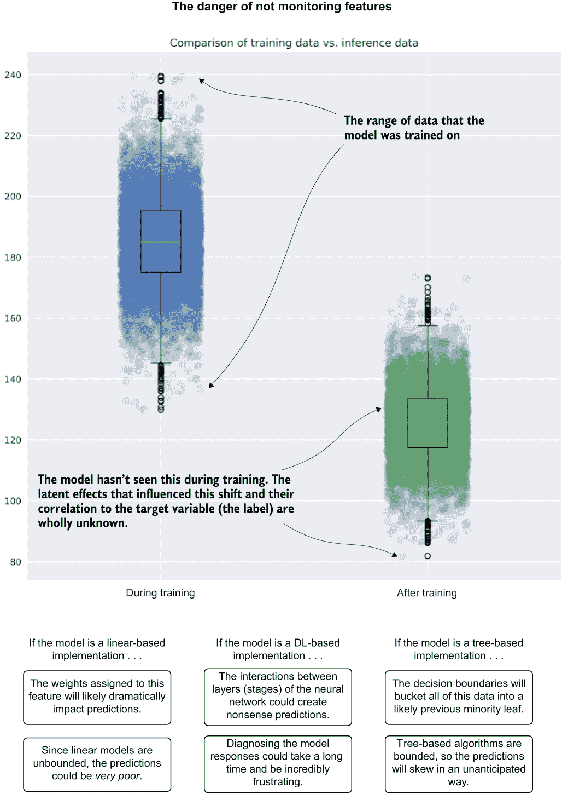

图 14.11 显著的特征漂移及其对不同类型模型的影响

让我们看看为什么我们的团队应该监控特征及其可能进行的任何修改。图 14.11 比较了在训练期间（左侧）和后来在生产推理期间（右侧）看到的相同特征的分布。

模型在显示的数据范围内看到了特征。后来，特征漂移到模型在训练期间接触到的范围之外。根据使用的模型不同，这可能会以各种方式表现出来，所有这些方式都同样糟糕（只要特征对模型至少有一定的重要性）。

如果团队成员没有监控这种分布的变化，他们会经历什么样的过程？让我们保持简单，假设他们的实现一开始就相当精简，只有 30 个特征。当预测开始出现难以理解的混乱结果时，需要对特征的当前状态和训练期间存在的历史值进行数据分析。将执行许多查询，引用训练事件，绘制图表，计算统计数据，并需要进行彻底的根源分析。

用 Kimberly “Sweet Brown” Wilkins 不朽的话说，“没有人有时间做那件事。”这些事后调查是漫长的。它们是复杂的，单调的，并且令人疲惫。在 14 个生产项目运行，14 个团队支持公司的机器学习需求，且没有对流程进行监控的情况下，这个团队将完全被零价值的工作淹没。在最佳情况下，他们可能每周要进行两到三次调查，每次至少需要一个人一整天的时间来完成，还需要一天来启动新的训练运行并评估测试结果。

然而，通过在管道的每个方面设置监控，团队可以确定发生了什么变化，变化了多少，以及偏差开始的时间。这可以节省整个人的工作量，让团队有更多时间自动化调查为什么他们的模型开始崩溃，让他们有更多时间投入到新的项目中。

这个监控系统不仅仅关注模型中进入的特征。它还意味着要查看以下内容：

+   *生成特征*——交互、缩放和基于启发式数据操作

+   *模型（s）*——每次训练运行的度量

+   *预测*——对于`pmf`或`pdf`，回归的均值和方差，混淆矩阵和分类的度量

+   *归因*——衡量解决方案针对其试图解决的问题有效性的业务指标的稳定性

+   *性能考虑*——对于批量，作业运行时间；对于在线，响应 SLA

+   *特征随时间的效果*——定期递归特征消除和随后的不必要特征剔除

通过关注监控 ML 支持解决方案的每个组件在整个生命周期，你可以通过消除繁琐的工作来帮助扩大你的团队规模。当人们不只是保持系统运行时，他们可以更多地关注新的和创新的解决方案，这些解决方案可以在一段时间内证明更大的商业价值。响应监控健康检查的另一个重要部分是，在解决问题的同时，尽可能保持解决方案的简单性。

## 14.4 尽可能保持简单

简单性是 ML 应用中独特的美。许多新进入该领域的人嘲笑它，因为他们最初认为复杂的解决方案很有趣，而最简单的解决方案才是持久的。这不仅仅是因为它们比复杂方案更容易保持运行——主要是因为成本、可靠性和升级的简便性。

让我们假设我们是一个相对较新的、级别较低的团队。每个团队成员都沉浸在 ML 领域的最新技术进步中，在利用这些尖端工具和技术开发解决方案方面能力很强。让我们暂时假设我们的同事认为使用“旧”技术，如贝叶斯方法、线性算法和启发式方法来解决问题的人是拒绝学习未来技术的卢德分子。

团队接到的第一个项目来自运营部门。零售集团的资深副总裁（SVP）在会议上接近团队，请求一个运营部门很难很好地扩展的解决方案。SVP 想知道 DS 团队是否可以使用仅作为解决方案素材的图像，确定图片中的人是否穿着红色衬衫。

DS 团队立即转向他们在最新和最佳解决方案工具箱中经验丰富的部分。图 14.12 说明了展开的事件。

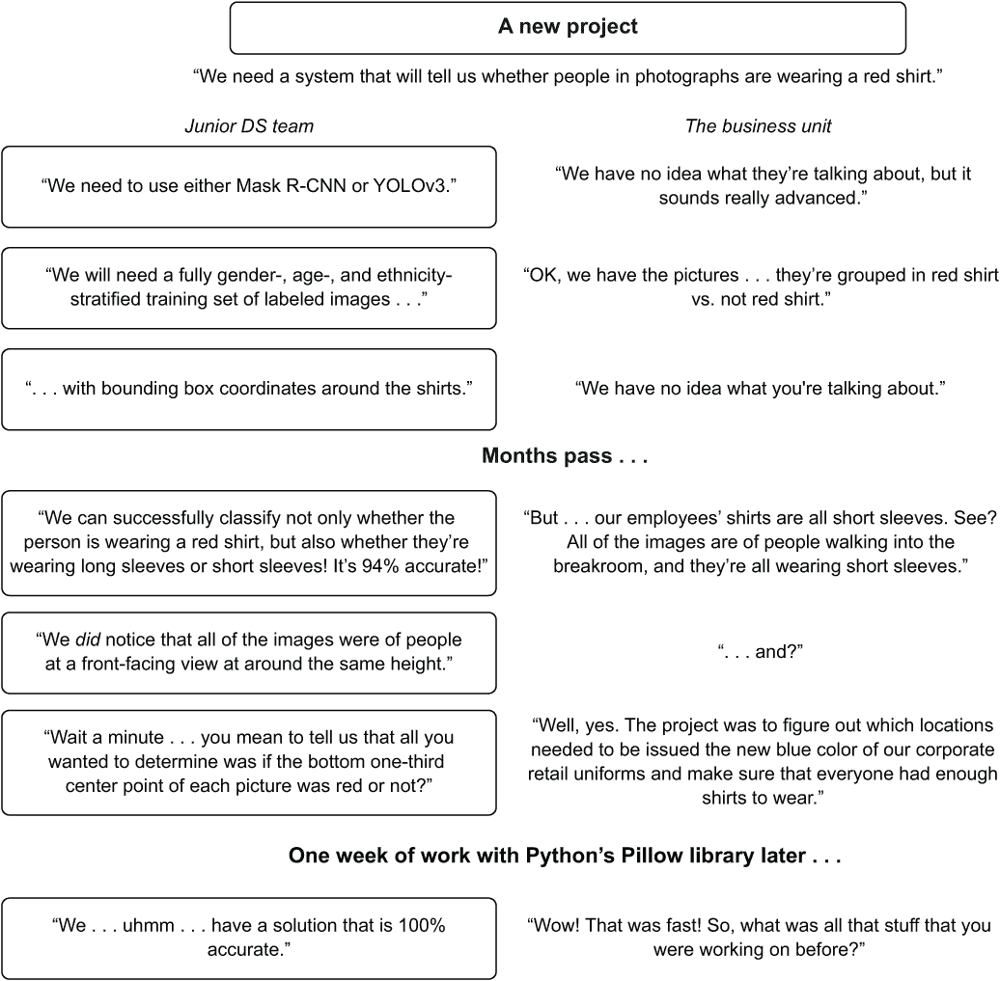

图 14.12 在尝试更简单的方法之前尝试高级方法时的令人沮丧的结果

在这种场景中会发生什么？最大的问题是团队成员在没有验证更简单的方法的情况下采取的复杂方法。他们选择关注技术而不是解决方案。通过专注于一个高度先进的解决方案来解决问题，而不考虑一个远为简单的方法（在每张图片的中心线上方三分之一处抓取像素块，确定这些像素的色调和饱和度，并将它们分类为红色或非红色），他们在解决问题的过程中浪费了数月时间，并可能花费了大量金钱。

这种场景在许多公司中非常频繁地发生——尤其是那些刚开始接触机器学习的公司。这些公司可能觉得有必要快速推进他们的项目，因为围绕人工智能的炒作声势浩大，他们认为如果不以任何代价让 AI 工作，他们的业务将面临风险。最终，我们的示例团队认识到最简单的解决方案可能是什么，并迅速开发出一个大规模运行且成本最低的解决方案。

追求简单性的想法存在于机器学习发展的两个主要方面：定义你试图解决的问题，并构建最简单的解决方案来解决问题。

### 14.4.1 问题定义的简单性

在我们之前的场景中，问题定义对业务和机器学习团队来说都很清晰。“请为我们预测红色衬衫”无法简化为比这更基本的工作任务。然而，在进行的讨论中仍然发生了根本性的崩溃。

在定义问题时追求简单性，围绕着要提供给内部（业务单元）客户的两个重要问题的基本属性：

+   *你希望解决方案做什么？* 这定义了预测类型。

+   *你将如何使用解决方案？* 这定义了决策方面。

如果在早期与业务单元的会议中除了这两个问题之外没有讨论其他任何事情，项目仍然会成功。解决业务问题的核心需求可以比其他任何主题更直接地导致项目成功。业务只是想确定员工是否穿着旧公司品牌的红色衬衫，以便知道发送他们新的品牌蓝色衬衫。通过专注于红色衬衫与蓝色衬衫的问题，可以实现一个远为简单的解决方案。

在接下来的讨论中，我们会了解到照片的性质及其固有的同质性。在这两个基本方面定义之后，团队可以专注于更小的一系列潜在方法，简化解决问题所涉及的范围和工作。然而，如果没有定义并回答这些问题，团队将不得不进行过于宽泛和富有创造性的解决方案探索，这是有风险的。

团队成员一听到*图像分类*，就立刻转向 CNN 实现，并且连续数月将自己锁定在一个高度复杂的架构中。尽管它最终相当好地解决了问题，但它是以一种极其浪费的方式做到的。（在它们上训练的 GPU 和深度学习模型比可以在智能烤箱上运行的像素色调和饱和度分桶算法要贵得多。）

将特定潜在项目的定义保持得如此简单不仅有助于引导与请求解决方案的业务单元的初步讨论，而且还能为在构建过程中实现尽可能少的复杂性提供一条路径。

### 14.4.2 实现的简洁性

如果我们继续分析我们的红衫分类场景，我们可以简单地看看团队提出的最终解决方案，以说明他们本应该首先做什么。

我，以及多年来在这个职业中认识的许多人，都多次学到了这个痛苦的教训。为了追求酷炫而构建一些东西，当我们意识到那个酷炫的实现最终维护起来有多么困难时，我们常常非常后悔。我们忍受着脆弱的代码和高度复杂的过程耦合，这些过程在构建时看起来非常有趣，但最终在代码完全崩溃时，调试、调整或重构却变成了一个完全的噩梦。

不想过多地举例说明，我将展示我思考请求我帮助解决的问题的方式。图 14.13 展示了我的思考过程。

这个流程图根本算不上夸张。我几乎总是首先像尝试用基本的聚合、算术和 case/switch 语句解决问题一样思考问题。如果那不行，我就转向贝叶斯方法、线性模型、决策树等等。我最不想一开始就尝试实现的是需要数百小时训练的对抗网络，当它崩溃时，需要花费数天（或数周）来调试模式崩溃以及如何调整我的 Wasserstein 损失来补偿消失的梯度。非常感谢，但只有在用尽所有其他解决问题的方法后，我才会使用这些方法。

在最纯粹的形式下，图 14.13 展示了我的心理核心：我很懒。真的，非常懒。我不想开发自定义库。我不想构建极其复杂的解决方案（好吧，这部分是真的；我喜欢构建它们，我只是不想*拥有*它们）。

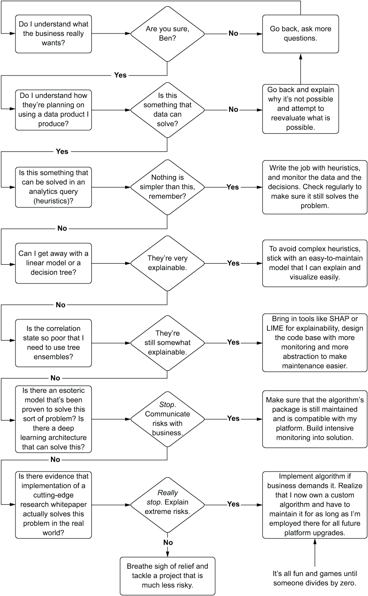

图 14.13 评估问题机器学习方法的作者思考过程

我只是想以代码能够正常工作的方式来解决问题。我希望能够有效地解决问题，以至于人们忘记我的解决方案正在运行，直到有人因为平台服务中断而惊慌失措，我们才集体回忆起实际上运行着业务关键部分的代码。要达到这种近乎懒惰的最高版本，唯一的方法是以最简单的方式构建东西，设置监控在别人之前提醒你事情不正常，并且拥有一个干净的代码库，使得修复只需要几小时而不是几周。

选择简单的设计来解决问题带来的另一个好处是，开发解决方案的过程（软件工程方面的实际操作部分）变得更加容易。设计变得更容易进行架构设计、开发和协作。这一切都始于为代码库构建有效的线框图。

## 14.5 机器学习项目的线框设计

在我们第一次真正的生产级机器学习项目（至少对我来说是普遍的，与我在职业生涯中互动过的同行们）之后，我们都学到了一个真正痛苦的教训。这个真正痛苦的教训在解决方案的开发过程中以轻微的形式出现，但只有在支持解决方案数月之后，这个教训才完全显现。这是关于代码架构的教训，以及缺乏它如何产生真正令人难以承受的技术债务，以至于为了对代码库进行哪怕微小的更改，都需要重构（或重写！）大量代码。

由于对单体脚本造成维护和增强解决方案负担的反感，新觉醒的人通常在代码开发过程中，逐步分离代码的主要功能。

让我们看看当我们观察一个新近明智的机器学习实践者团队时，这一切是如何展开的。他们已经支持了第一个主要（并且可以说是混乱的）代码库几个月，并确定了多种他们组织代码的方式，这些方式并不适合维护。

他们决定，在各个冲刺阶段，随着新功能的开发需求，将代码拆分，以便功能分离。图 14.14 展示了他们的过程。

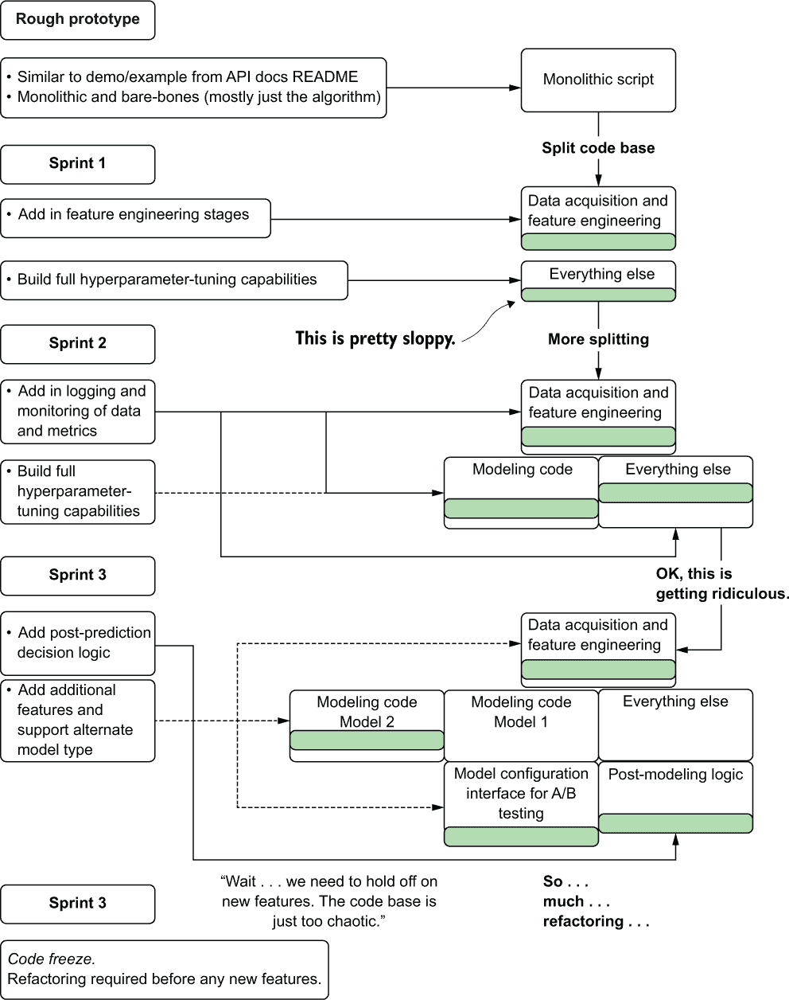

图 14.14 没有一般项目代码架构，你将面临大量的重构。

他们很快就会意识到，尽管他们的方法值得尝试，但这并不是构建项目的最简单方法。为什么机器学习代码会是这种情况呢？

+   脚本中存在紧密的依赖关系，尤其是在黑客马拉松的“只管让它工作”脚本中。

+   实验性原型主要关注算法，而不是数据处理。最终开发的大部分代码库都在数据处理领域。

+   代码在开发过程中（以及生产发布后）会频繁更改。

团队在其第三次冲刺结束时意识到，随着开发进程的推进，将所有代码重构为独立的模块会带来大量额外的工作和混乱的代码，使得新功能的实现变得困难。以这种方式处理代码架构根本不可持续；即使只有一个人贡献代码，管理代码就已经足够困难，如果多个人在持续重构的代码库上工作，几乎是不可能的。

存在着更好的解决方案，它涉及到为项目设置一个基本的线框图。虽然我在涉及代码时对“模板”这个词有所抵触，但本质上它就是这样，尽管是松散且可变的。

大多数机器学习项目的架构在最基本层面上可以归纳为核心功能组：

+   数据获取

+   数据验证

+   特征工程、特征增强和/或特征存储交互

+   模型训练和超参数优化

+   模型验证

+   记录和监控

+   模型注册

+   推理（批量）或服务（在线）

+   单元和集成测试

+   后处理预测消费（如果适用，决策引擎）

并非每个项目都保证拥有所有这些组件，而其他项目可能会有额外的要求。（例如，深度学习 CNN 实现可能需要一个数据序列化层用于批量文件处理和图像增强，而自然语言处理项目可能需要一个用于本体词典更新和接口的模块）。关键是功能的不同分离构成了项目的完整功能部分。如果它们被随意地合并到模块中，代码中的责任边界变得模糊（或者在最坏的情况下，所有内容都在一个文件中），那么修改和维护代码将是一项真正的艰巨任务。

图 14.15 展示了一种替代架构，该架构可以在实验原型（类似于黑客马拉松的快速原型，用于证明模型对公司数据的适用性）完成后立即使用。虽然这个架构中的模块一开始可能包含的内容不多，但它们基于团队在整个项目期间预期的需求作为占位符（占位符）。如果需要新的模块，可以创建它们。如果在发布前的最终冲刺中某个占位符从未被填充，则可以将其删除。

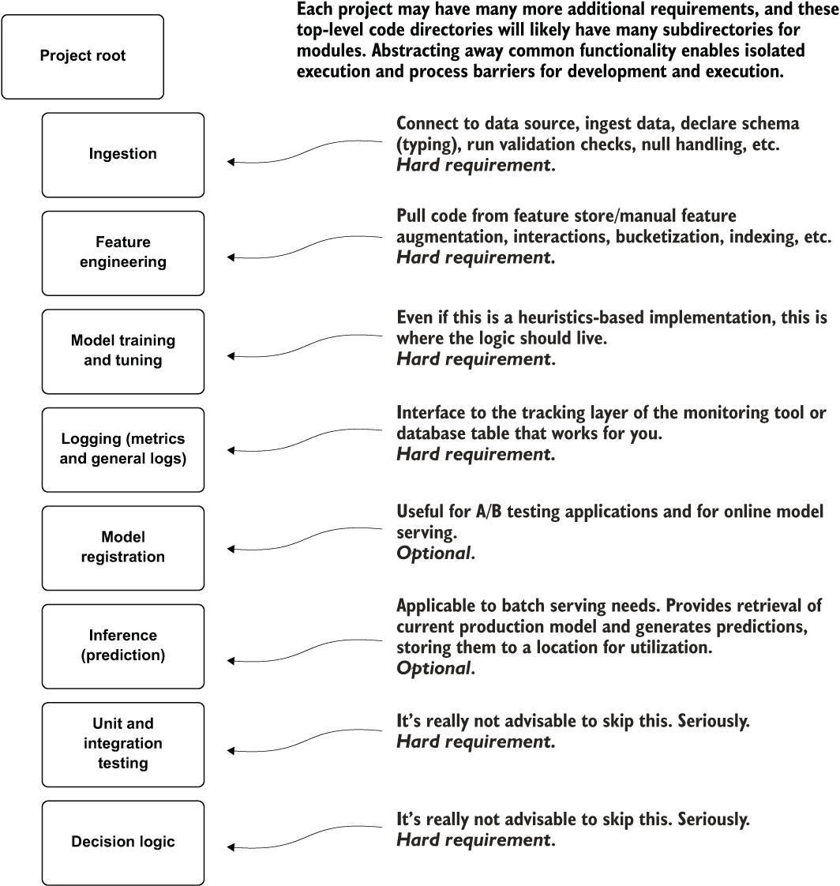

图 14.15 一个通用的机器学习项目代码线框图，以保持代码逻辑上的组织，更容易在内部开发，并更容易维护

这种通用的模板架构强制执行了关注点的封装。它不仅有助于指导冲刺计划，还有助于避免在冲刺结束时代码库中的合并冲突。它从开发初期就保持代码的整洁，使得查找功能更容易，并有助于使单元测试和故障排除变得远更简单。

在组织概要和创建抽象似乎即使是对于简单的项目来说也是过度夸张，但我可以向你保证，从我整个 productive working life 中花费了整整几个月的时间，除了重写和重构基本损坏的代码架构之外，我什么都没做，这绝对不是这样。与将代码库从纯粹的、蒸馏的混乱中翻译成某种逻辑顺序相比，崩溃抽象和删除占位模块要容易得多。

作为不做什么的例子，以及一个设计不良的 ML 代码架构的相互交织的混乱可以有多糟糕，请参见图 14.16。（是的，那是我做的。）

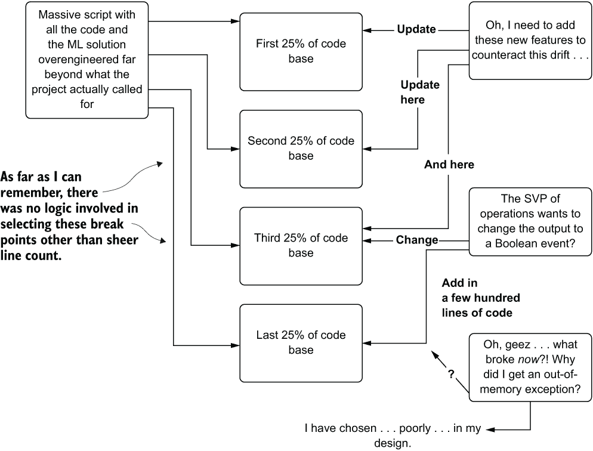

图 14.16：在我了解代码设计以及抽象、封装和继承是如何工作之前，我的早期艺术作品之一。不要这样做。

这个例子代表了我最早的项目之一（使用案例的细节已被删除，以免某个公司的律师打电话给我），这让我能够传达我从中学到的教训的严重性。我们可以这么说，*相当重大*。

对于一个大型代码库几乎没有逻辑设计，不仅会影响初始开发。这当然是一个重要的原因，为什么提供线框图很重要（尤其是当整个团队都在一个项目上工作，需要确保代码合并不会覆盖彼此的更改）。当不可避免的变化需要被做出时，缺乏逻辑设计会变得更加痛苦。即使你使用巧妙的命名约定为变量和函数命名，在庞大的脚本中搜索也是极其耗时和令人沮丧的。

我学会了永远不要低估良好的代码设计带来的时间节省。当适当框架时，它能够实现以下功能：

+   步进模块进行调试或演示

+   编写隔离的子模块单元测试和模块级单元测试，以确保大量代码的功能性

+   在几秒钟内直接到达代码中的某个位置（而不是在代码库中搜索几分钟或几小时）

+   从代码库中轻松提取常用功能并将其放入自己的包中，以便其他项目重用

+   显著降低 ML 代码库中功能重复的可能性，因为它鼓励从开发一开始就进行抽象和封装

即使对于那些更喜欢在笔记本中完全开发的人来说——顺便说一句，这是可以的，尤其是如果你在一个小团队或是一个人的团队中——这种活动的分离可以使你的开发和长期维护项目代码比其他方式简单得多。毕竟，替代方案是我早期职业生涯中做的事情，从实验性脚本开始，不顾一切地添加功能，直到我留下了一个我像村民拿着长柄叉一样高兴看的弗兰肯斯坦怪物。

关于 ML 代码库中频繁重构的注意事项

最近有人问我：“当我的代码库变得过于复杂、混乱或难以维护时，我应该重构多少？”这让我停下来，思考一个合适的答案。作为框架开发者，我想大声疾呼：“早重构，经常重构！”而作为数据科学家，我回想起多年来经历的痛苦的重构经历，那是一种极度令人沮丧的体验。

我最终像任何写过生产级 ML 代码的非承诺型开发者一样，严肃地回答：“只要你觉得舒服，以便让项目再次可维护。”不幸的是，这不是很好的建议。尽管如此，这也有其原因。

在传统软件工程（无论是 FP 还是 OO）中，由于匆忙妥协标准以尽快推出产品而累积的技术债务，可以通过相对直接的方式偿还：你可以重构代码。它可能已经封装和抽象到一定程度，以至于重构不会太具挑战性。在能力和技术水平的限制内，尽情优化代码以提升性能。如果你更喜欢的话，可以从头开始（模块化）重写整个系统。

ML 代码有些不同。从性能、算法复杂度、数据质量、监控和验证的角度来看，你在编写代码时的每一个决定都会对解决方案的有效性以及代码各部分的整体关联性产生深远的影响。与传统软件工程相比，所有这些“哦，我们稍后再解决”这类可以累积的技术债务，其利率要高得多。

重新重构我们的代码并不那么容易。其中一些可以轻松修改（添加功能、删除功能、更改权重应用方式等），但像从基于树的实现转换为广义线性模型、从机器视觉方法转换为 CNN，或从基于 ARIMA 的实现转换为 LSTM 这样的变化，基本上是对我们项目的全面重写。

改变整个解决方案的基本性质（例如，API 返回值可能因不同包的模型输出而改变，需要重写大量代码）风险极高，可能会延迟项目数月。在开源代码中最终弃用和移除功能可能意味着对代码库主要部分的完全重实现，这可能会意味着

转向不同的执行引擎。解决方案中存在的复杂性越大，我们累积的 ML 技术债务就越多，其利率比软件开发者可能为类似决策承担的利率要高得多。

这是我们无法在开发软件时完全敏捷的一个主要原因。我们需要进行一些预先规划和架构研究，在我们的代码库中，需要创建一种模板，以帮助指导我们代码的复杂部分如何相互交互。

## 14.6 避免货船崇拜机器学习行为

在这本书中，我一直在强调避免机器学习中的炒作趋势。在本节中，我将重点讨论我认为炒作周期中最具破坏性的形式：货船崇拜行为。

让我们假设我们是一家拥有相对较新机器学习足迹的公司。一些关键的临界业务问题已经得到解决，通常使用经过验证且可能不太复杂的统计方法。这些解决方案在生产中运行良好，得到了有效的监控，并且由于进行了彻底的归因确定和测试，企业意识到了这些解决方案的价值。然后有人读到了这篇文章。

这是一篇来自著名且成功的科技公司的博客文章，介绍了它如何解决一个以前无法解决的问题，这个问题也影响到了我们的公司。文章的作者提到了他们公司新开源的解决方案，详细解释了该算法的工作原理，并在文章的大部分内容中解释了实现的技术方面。

这是一篇优秀的文章，它很好地作为招聘工具吸引顶尖技术人才加入他们的公司。我们公司的读者没有意识到，撰写这篇文章的原因是为了招聘，而不是让一家小公司拾起他们的开源工具并在几周内神奇地解决这个问题。

尽管如此，对这一解决方案的需求如此之高，以至于每个人都同意使用这一新的软件解决方案。制定了一个项目计划，进行了实验，仔细阅读并理解了 API 文档，并构建了一个基本的原型。

看起来，在项目的早期阶段进展顺利，但大约一个月后，计划中的裂痕开始显现。团队意识到以下几点：

+   算法极其复杂，难以调优得当。

+   发明该算法的公司可能拥有许多内部工具，这些工具有助于使用该算法更加便捷。

+   代码中许多元素所需的数据格式与他们存储数据的方式不同。

+   该工具需要昂贵的云基础设施来运行，以及建立许多他们不熟悉的新服务。

+   收集的数据不足以避免他们看到的一些过拟合问题。

+   可扩展性（与成本）问题将训练时间限制在几天，从而减缓了开发进度。

在这些裂缝出现之后，团队成员决定尝试一种远不如之前复杂的方法，并不需要花费太多额外的时间。他们发现，尽管他们的解决方案无法与工具创造者展示的所谓精度相匹配，但仍然相当成功。另一个主要好处是，他们的解决方案复杂度更低，运行成本低得多，并且需要的基础设施正是他们用于机器学习（ML）的平台已经支持的。

只有当团队足够幸运，能够在项目时间表早期就放弃他们已经选择的路径时，这种结果才可能实现。我真心希望我没有像我看到的那样多次看到这种替代方案：团队花费数月时间努力使某事工作，花费了大量时间和金钱，最终却一无所获。

货物崇拜？

*货物崇拜行为*起源于二战后南太平洋岛屿上。这是某些土著居民的一种倾向，在与使用这些孤立岛屿的战争时期军事人员互动后，他们收到了他们以前从未遇到过的货物和服务（医疗、牙科、技术等）。在随后的几年里，由于这些服务人员的返回，一些岛屿上的团体开始模仿这种行为、服装风格，以及夸张技术，他们相信如果他们模仿来访者，他们有一天会回来。岛民们把外来者（以及他们丰富的供应、商品和技术）看作是他们无法理解但对他们是有益的。

尽管这个术语非常具有偏见和过时，但它由于理查德·费曼在描述一些科学家在实验和验证研究过程中表现出的不充分的科学严谨性时使用这个术语而一直延续到今天。术语*货物崇拜软件工程*，当应用于利用设计原则、直接复制参考中的代码示例，以及盲目遵循成功公司使用的标准而不评估它们是否需要（甚至是否与用例相关）时，被作者 Steve McConnell 普及。

我在这里使用这个术语，是按照 McConnell 的用法，用来描述那些选择抓住每一个由大科技公司开发出来的技术、算法、框架、平台和创新进步的缺乏经验的团队和初级数据科学家（DS）的行为。通常，这种货物崇拜机器学习行为表现为使用为解决高度复杂问题而设计的极其复杂的系统，而对这些工具和过程是否适用于他们自己的问题却毫不关心。他们看到大型科技公司 A 开发了一个用于调整神经网络权重的全新框架，并假设为了成功，他们自己也必须使用这个框架来解决所有的问题解决项目（我看着你，LSTM，用于基本的销售预测！）。

从事这种行为的团队没有意识到这些技术被开发的真实原因（为了解决那些公司的一组特定问题）以及源代码被共享的原因（为了吸引顶尖人才加入他们的公司）。这不是为了让每个人都抓住一个新范式并开始使用这些技术来处理即使是微不足道和日常的 ML 任务。

跟随新技术热潮并假设最新出现的东西是解决所有问题的万能药，这在生产力、成本和时间方面都是灾难性的。这种方法通常会让公司中经验不足的团队努力使技术工作起来。

更重要的是，一些发布这些工具的公司中更有经验的 DSs 和 ML 工程师会毫不犹豫地承认，他们并不使用这些工具做任何除了它们被设计来解决的事情（至少，我所了解并讨论过这个话题的人是这样的；我无法代表所有人）。他们主要关注最简单的问题解决方法，只有在需要时才会转向更高级的方法。

我看到这种载货文化行为多次上演的思维过程在图 14.17 中得到了体现。

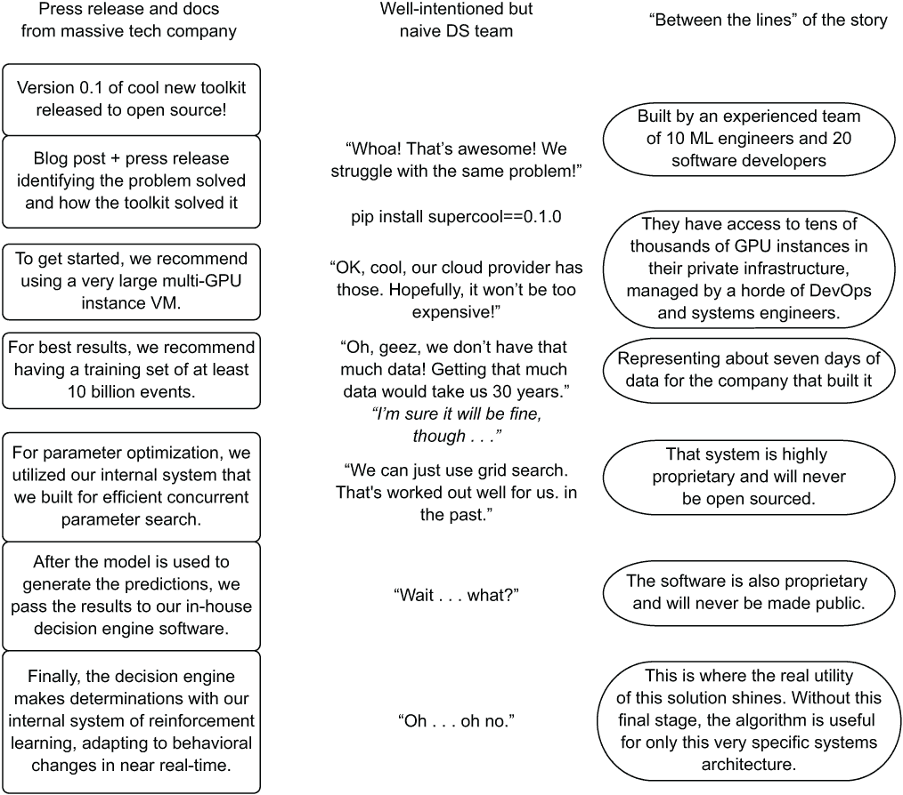

盲目相信新软件包的 README 和博客文章中的承诺可能会浪费大量时间。

在这个例子中，团队错误地认为新软件包将给他们带来与大型科技公司新闻稿中展示的相同成功水平。团队将这家公司的神奇表现等同于该组织门出来的所有东西。

这并不是说这些大公司不成功。事实上，他们通常雇佣了一些世界上最创新和最聪明的软件工程师。问题是，他们并没有发布所有东西，以便其他人可以利用使他们成功的一切。试图复制这些例子并期望获得相同结果的公司几乎总是会失败。这是由于几个关键因素：

+   他们没有相同的数据。

+   他们没有相同的基础设施和工具。

+   他们没有相同数量的高素质工程师来支持这些复杂解决方案。

+   他们可能并不是在处理完全相同的用例（不同的客户、不同的生态系统或不同的行业）。

+   他们没有相同的预算（时间和金钱）来使其工作。

+   他们没有相同的研发预算来花费数月时间以非常先进的方式迭代解决问题。

我在任何方式、形状或形式上都没有说新技术不应该被使用。我经常使用它们——而且大多数时候，我都享受这样做。我的同事也是如此，与我的经验相似，成功程度各异。新技术很棒，尤其是在它解决了以前无法解决的问题时。然而，我警告的是，不要盲目相信这些技术，假设它们将神奇地解决你所有的麻烦，如果你模仿某个大型创新公司的机器学习方式，它就会以同样的方式为你工作。

避免机器学习中的货船崇拜行为的关键可以归结为本书早期部分中涵盖的几个基本步骤。图 14.18 展示了一个视觉指南，它在我评估新可能的技术时始终效果良好。

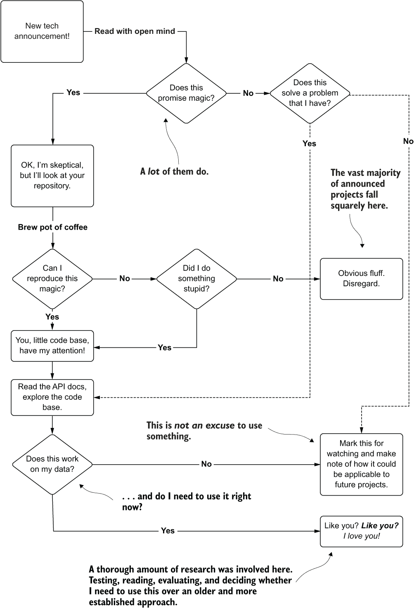

图 14.18 评估新宣布的机器学习技术的流程

我在评估机器学习领域宣布的新事物时尽力做到尽职调查。随着进步的快速步伐和该领域似乎永无止境的炒作，根本没有时间评估所有事物。然而，如果某件事看起来很有希望，来自一个建立良好声誉的来源，并且实际上声称解决了我在努力解决的问题（或过去遇到过的问题），那么它就是这次严格评估的候选人。

令人遗憾的是，绝大多数项目（即使是那些由大型成功科技公司倡导的项目）要么从未获得社区的支持，要么试图解决远远超出团队能力（或当前技术能力）的问题，这些问题不值得花费太多时间。当团队没有在他们的需求范围内评估技术时，这变得很危险。即使这项技术非常酷且令人兴奋，也不意味着它就是你的公司应该使用的东西。记住，使用新技术是一项高风险活动。

坚持最简单的方法并不意味着使用“最新潮的技术”。这意味着只有在它使你的解决方案更容易、更易于维护且更容易持续运行的情况下，才使用最新潮的技术。其他所有东西对你或其他人来说，都只是无足轻重的琐事。

## 摘要

+   在尝试将任何数据用于模型之前，应彻底审查其来源、特性和属性。在项目早期确认其效用所花费的时间将节省许多令人沮丧的调查。

+   任何将要用于机器学习解决方案的数据都需要进行全面监控，异常情况应以可预测的方式进行处理。基于训练和推理数据的变化而产生的意外行为可能会轻易使解决方案失效。

+   监控特征数据是至关重要的，但它只是模型生命周期中应该被关注的几个部分之一。从 ETL 摄入到特征工程、模型训练、模型重新训练、预测和归因，每个阶段都有应该收集、分析和在行为异常时发出警报的指标。

+   专注于设计和实现的简洁性，机器学习项目将更快地进入生产阶段，更容易维护，并且可能成本远低于使用定制设计，从而让任何数据科学团队有更多时间解决为公司带来价值的额外问题。

+   通过为机器学习项目代码库使用标准架构，可以在整个开发过程中将重构保持到最小，团队成员可以轻松理解抽象逻辑所在的位置，并且维护工作将比使用每个项目的定制设计要容易得多。

+   确保你作为技能组合的一部分采用的新技术适用于你的团队、项目和公司，这将有助于使所有机器学习项目工作更加可持续和可靠。评估、研究和怀疑精神都将对你有益。
