# 15 质量和验收测试

本章涵盖

+   建立用于 ML 的数据源的一致性

+   使用回退逻辑优雅地处理预测失败

+   为 ML 预测提供质量保证

+   实施可解释的解决方案

在前一章中，我们关注了成功 ML 项目工作的广泛和基础技术主题。在此基础上，需要建立一个关键的监控和验证基础设施，以确保任何项目的持续健康和相关性。本章重点介绍这些辅助流程和基础设施工具，这些工具不仅使开发更加高效，而且一旦项目投入生产，维护也更加容易。

在模型开发完成和项目发布之间有四个主要活动：

+   数据可用性和一致性验证

+   冷启动（回退或默认）逻辑开发

+   用户验收测试（主观质量保证）

+   解决方案的可解释性（可解释人工智能，或 XAI）

为了展示这些元素在项目开发路径中的位置，图 15.1 展示了本章涵盖的建模阶段后的工作。

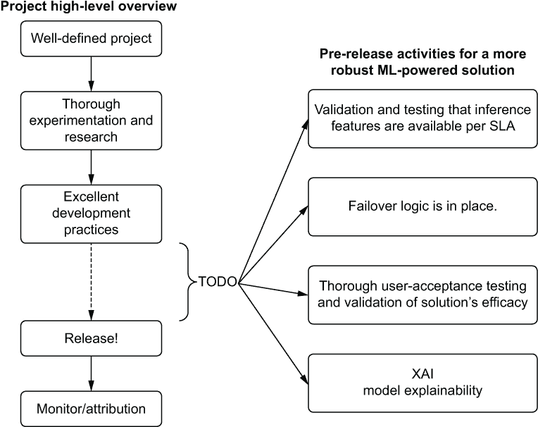

图 15.1 ML 项目的生产级资格和测试阶段

这些突出的行动通常被视为许多我接触过的项目的后知后觉或反应性实施。虽然这些不一定适用于每个 ML 解决方案，但评估这些组件非常推荐。

在发布之前完成他们的行动或实现可以有效地防止内部业务单位客户产生很多困惑和挫败感。直接移除这些障碍可以转化为与业务更好的工作关系，并为你减少许多麻烦。

## 15.1 数据一致性

数据问题可能是模型生产稳定性中最令人沮丧的方面之一。无论是因为数据收集不稳定、项目开发和部署之间的 ETL 更改，还是 ETL 的一般性实施不佳，它们通常会导致项目的生产服务陷入停滞。

在模型生命周期的每个阶段确保数据一致性（并定期验证其质量）对于实现输出的相关性以及解决方案随时间稳定性的重要性不可估量。通过消除训练和推理偏差、利用特征存储以及在组织内公开共享物化特征数据，实现了建模阶段的一致性。

### 15.1.1 训练和推理偏差

让我们假设我们正在一个团队中工作，该团队通过使用特征批处理提取来确保模型开发的一致性，从而开发解决方案。在整个开发过程中，我们小心翼翼地利用我们知道在服务系统的在线数据存储中可用的数据。由于项目的成功，现状并没有被忽视。业务希望我们提供更多。

经过几周的工作，我们发现从未包含在初始项目开发中的新数据集中添加特征对模型的预测能力产生了重大影响。我们整合了这些新特征，重新训练了模型，并处于图 15.2 所示的境地。

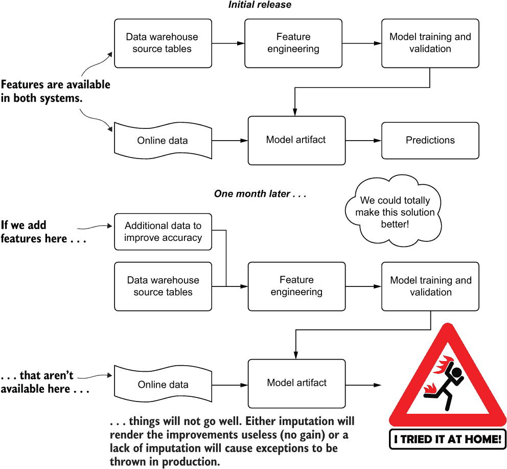

图 15.2 由于特征更新导致的推理偏差

由于在线特征系统无法访问后来包含在模型修订中的数据，我们遇到了训练和推理偏差问题。正如图 15.2 所述，这个问题以两种主要方式表现出来：

+   空值被填充。

    +   如果用特征空间的平均值或中值填充，特征向量的方差和潜在信息将减少，这可能导致重新训练期间模型退化。

    +   如果用占位符值填充，结果可能比原始模型更差。

+   未处理空值。这可能会根据所使用的库抛出异常。这可能会从根本上破坏新模型的部署。所有预测都将使用回退启发式“最后希望”服务。

训练和推理之间的不匹配场景并不仅限于特征数据的缺失或存在。如果数据仓库中的离线数据与在线系统之间创建原始数据的处理逻辑不同，这些问题也可能发生。解决这些问题、诊断它们和修复它们可能非常昂贵且耗时。

作为任何生产 ML 流程的一部分，应进行架构验证和检查离线和在线训练系统的一致性。这些检查可以是手动的（通过计划作业进行的统计验证）或通过使用特征存储完全自动化，以确保一致性。

### 15.1.2 特征存储简介

从项目开发的角度来看，构建 ML 代码库中耗时较多的一个方面是在特征创建。作为数据科学家，我们在模型中使用的数据上投入了大量的创造性努力，以确保现有的相关性得到最佳利用，以解决问题。历史上，这种计算处理嵌入在项目的代码库中，在一个在线执行链中执行，该链在训练和预测期间都会被调用。

特征工程代码与模型训练和预测代码之间这种紧密耦合的关联可能导致大量的令人沮丧的故障排除，正如我们在之前的场景中看到的。这种紧密耦合还可能导致数据依赖关系变化时的复杂重构，以及如果计算出的特征需要在其他项目中实现时，会重复工作。

然而，通过实施特征存储，这些数据一致性问题是可以通过大量解决。一旦定义了单一的真实来源，注册的特征计算就可以开发一次，作为计划作业的一部分进行更新，并且可供组织中的任何人使用（如果他们有足够的访问权限的话）。

一致性并不是这些工程化系统的唯一目标。同步数据流到在线事务处理（OLTP）存储层（用于实时预测）是特征存储带来的另一个生活质量的提升，它有助于最小化开发、维护和同步生产机器学习 ETL 需求的技术负担。能够支持在线预测的特征存储的基本设计包括以下内容：

+   一个符合 ACID 存储层：

    +   *(A) 原子性*—保证事务（写入、读取、更新）作为单元操作处理，要么成功（提交），要么失败（回滚），以确保数据一致性。

    +   *(C) 一致性*—对数据存储的事务必须使数据处于有效状态，以防止数据损坏（来自对系统的无效或非法操作）。

    +   *(I) 隔离*—事务是并发进行的，并且总是使存储系统处于有效状态，就像操作是按顺序执行的一样。

    +   *(D) 持久性*—对系统状态的合法执行将始终持续存在，即使在硬件系统故障或断电的情况下，也会写入持久存储层（写入磁盘，而不是易失性内存）。

+   一个低延迟的服务层，与 ACID 存储层同步（通常是易失性的内存缓存层或内存数据库表示，如 Redis）。

+   一个非规范化的表示数据模型，适用于持久存储层和内存中的键值存储（通过主键访问以检索相关特征）。

+   对最终用户来说，是一个不可变的只读访问模式。拥有生成数据的团队是唯一具有写入权限的团队。

如前所述，特征存储的好处不仅限于一致性。可重用性是特征存储的主要特性之一，如图 15.3 所示。

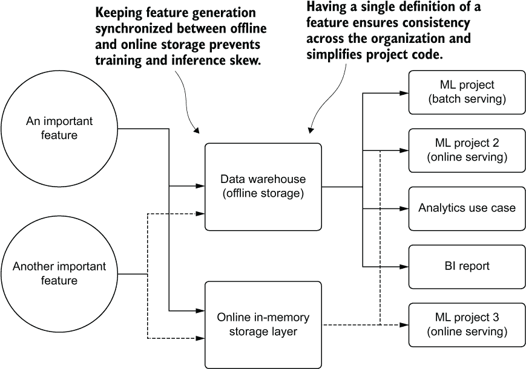

图 15.3 特征存储的基本概念

正如你所见，实施特征存储带来了许多好处。在整个公司拥有一个标准的特征库意味着每个用例，从报告（BI）到分析和 DS 研究，都在使用与其他人相同的*同一套真实数据来源*。使用特征存储消除了混淆，提高了效率（特征不需要为每个用例由每个人重新设计），并确保生成特征的成本只发生一次。

### 15.1.3 过程胜于技术

特征存储实施的成功并不在于实现它的具体技术。其好处在于它使公司能够利用其计算和标准化的特征数据采取行动。

让我们简要考察一个公司需要更新其收入指标定义的理想过程。对于这样一个广泛定义的术语，公司的收入概念可以根据最终用例、关注该数据使用的部门以及应用于这些用例的定义的会计标准水平以多种方式解释。

例如，一个营销团队可能对总收入感兴趣，以衡量广告活动的成功率。DE 团队可能会定义多种收入变体，以满足公司内部不同团队的需求。DS 团队可能会查看数据仓库中任何包含“销售”、“收入”或“成本”等词语的列的窗口聚合，以创建特征数据。BI 团队可能有一套更复杂的定义，这些定义适用于更广泛的分析用例。

如果每个人都对其小组的个人定义负责，那么改变这样一个关键业务指标的定义逻辑可能会对组织产生深远的影响。每个小组在每个查询、代码库、报告和模型中改变其参考的可能性微乎其微。将如此重要的指标的定义碎片化到各个部门本身就存在问题。在每个小组内部创建多个定义特征的版本是导致完全混乱的配方。如果没有建立关键业务指标定义的标准，公司内部的小组在评估彼此的结果和输出时实际上不再处于平等地位。

无论使用哪种技术栈来存储用于消费的数据，围绕关键特征变更管理构建的过程可以保证无缝且具有弹性的数据迁移。图 15.4 展示了这样一个过程。

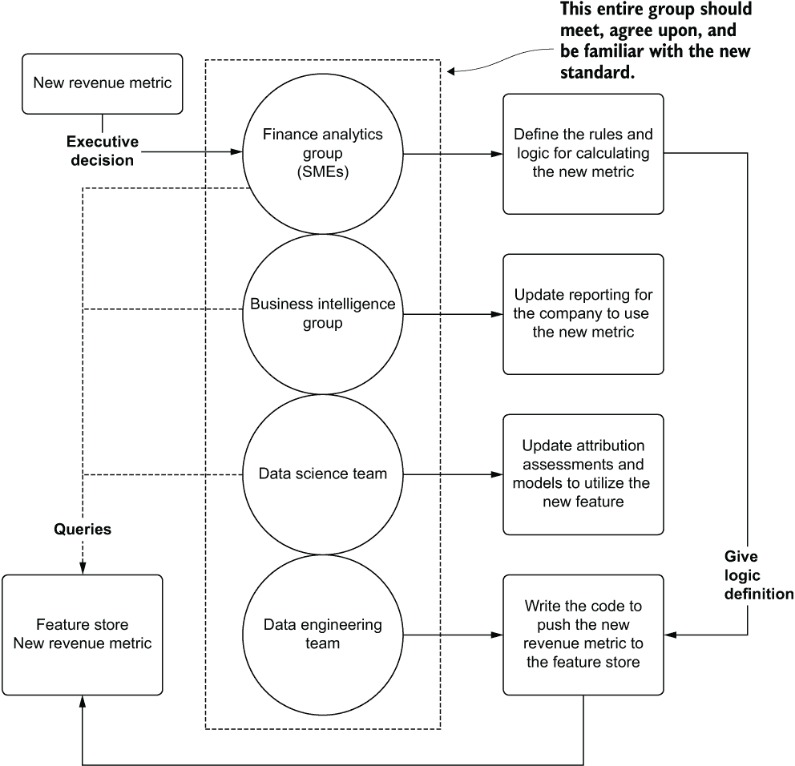

图 15.4 设置更新关键特征存储条目数据变更点过程

正如你所见，公司收入报告的新标准来自执行委员会。从这个定义性的点开始，一个成功的特征存储更新过程可以开始。在处理此类公司范围内数据利用的每个小组的利益相关者都到场的情况下，可以开始对拟议的变更进行彻底评估。数据的生产者和消费者集体同意采取行动，以确保新的标准在公司中成为实际标准。会议结束后，每个小组都知道它需要采取哪些行动才能迁移到这个新指标；该指标通过 ETL 同步到公共特征存储中。

变点过程对于确保依赖数据做出明智决策的组织的一致性至关重要。通过采用这些过程，每个人都使用相同的“数据语言”。关于分析、报告和预测的真实性的讨论都可以基于对数据术语的同一共同定义进行标准化。这也极大地提高了依赖于这些数据的依赖性生产（自动化）工作和报告的稳定性。

### 15.1.4 数据孤岛的危险

数据孤岛看似无害，实则危险。将数据隔离在只有特定小部分人可以访问的封闭、私人位置，会抑制其他团队的生产力，在整个组织中造成大量重复劳动，并且（至少在我观察到的经验中）经常导致一些晦涩难懂的数据定义，这些定义在孤立状态下与公司普遍接受的观点大相径庭。

当一个机器学习团队被授予自己的数据库或整个云对象存储桶以赋予团队自助服务能力时，这似乎是一件非常好的事情。对于数据工程或仓储团队来说，用于加载数据集所需的时间似乎在地质尺度上消失了。团队成员完全掌握自己的领域，能够无拘无束地加载数据、消费数据和生成数据。这确实可能是一件好事，前提是明确且合理定义的过程来管理这项技术。

但无论数据是干净的还是脏的，仅限内部使用的数据存储堆栈都是一种孤岛，其内容被隐藏在世外桃源。这些孤岛可能产生的问题比解决的问题还要多。

为了说明数据孤岛可能带来的不利影响，让我们设想我们工作在一个建造狗公园的公司。我们最新的机器学习项目是一个有点像太空任务的项目，使用反事实模拟（因果建模）来确定在不同拟议的建筑地点，哪些设施对我们客户最有价值。目标是找出如何最大化拟议公园的感知质量和价值，同时最小化我们公司的投资成本。

要构建这样的解决方案，我们必须获取全国所有注册狗公园的数据。我们还需要与这些狗公园所在地相关的人口统计数据。由于公司的数据湖不包含具有这些信息的数据源，我们必须自己获取这些信息。自然地，我们将所有这些信息放在我们自己的环境中，认为这将比等待数据工程团队的工作队列清理完毕后开始工作要快得多。

几个月后，关于公司在某些地区竞标的一些合同开始出现疑问。业务运营团队好奇为什么在许多建筑库存中会订购如此多的定制爪子激活喷泉。随着分析师开始挖掘数据湖中的数据，他们无法理解为什么某些合同的推荐始终建议这些极其昂贵的组件。

在花费数月时间进行分析后，决定从合同投标中移除此功能。没有人能解释为什么它在那里，他们决定继续提供它不值得。他们更愿意提供自动洗狗站（汽车洗车风格）、狗粪机器人（清洁者，而非制造者）、公园范围的冷却风扇和自动抛球装置。因此，订购了大量这些物品，并终止了喷泉采购合同。

几个月后，一个竞争对手开始在合同中提供与我们一直在竞标的完全相同的元素。城市和城镇开始转向竞争对手的投标。当最终被追问原因时，销售团队开始听到相同的答案：狗们真的很喜欢喷泉，尤其是在远离人们住所和市政供水站的地区。这里最终发生的情况如图 15.5 所示。

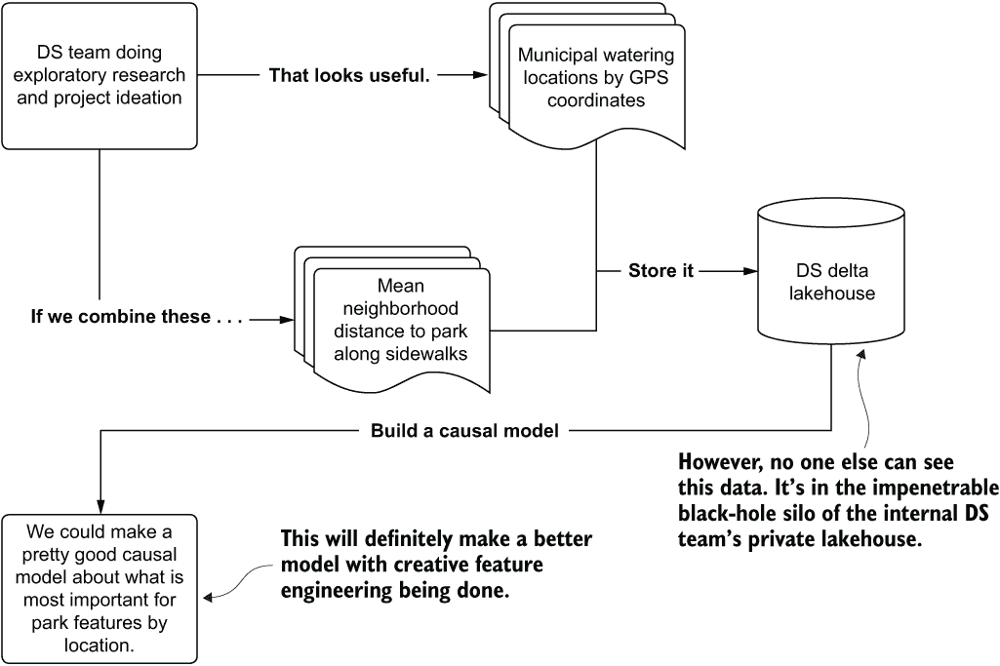

图 15.5 在隔离区存储关键数据

由于无法看到 DS 团队构建的基于便利设施反事实模拟模型所收集和使用的这些特征，业务无法拼凑出模型建议的原因。数据被孤立，没有恶意，但它给业务带来了巨大问题，因为关键数据无法访问。

我们不是农民。*我们永远不应该使用隔离区。*至少不是数据隔离区。如果你对农业感兴趣，那就别让我阻止你。另一方面，我们应该与数据工程和仓储团队紧密合作，确保我们能够将数据写入每个人都可以访问的位置——最好，如我们将在第十七章中讨论的，写入特征存储库。

## 15.2 备用方案和冷启动

让我们想象一下，我们刚刚为一家披萨公司构建了一个用于优化配送路线的机器学习解决方案。不久前，公司向我们寻求一个更便宜、更快、更灵活的解决方案来优化单个司机的配送路线。之前确定某个司机将配送披萨到哪些地址的方法是通过路径算法，该算法基于 ArcGIS 生成最佳路线。虽然功能强大且全面，但公司希望有一种考虑实际配送数据的时空性质和历史的方法来创建更有效的路线。

团队使用了一种基于 LSTM 的方法，该方法在过去的三年配送数据上进行了训练，创建了一个基于强化学习的对抗网络，该网络根据配送的及时性奖励最佳路径。项目迅速从一项科学项目转变为在几个地区证明其价值的实际应用。它在选择配送序列方面比之前生产系统能够实现的暴力路径搜索要熟练得多。

在审查了测试市场几周的路由数据后，公司对在所有配送路线上启用系统感到放心。一切看起来都很顺利。预测正在被提供服务，司机在交通堵塞中花费的时间减少了，而且比以往任何时候都要高得多地将热披萨准时送达。

大约过了一个星期，投诉才开始如潮水般涌来。农村地区的客户以惊人的高比例抱怨配送时间非常长。在查看投诉后，一个模式开始显现，即每个投诉都与配送链的最后一个停靠点有关。DS 团队很快就意识到发生了什么。由于大部分训练数据集中在城市中心，停靠点的数量和停靠点之间的距离较低，因此模型通常针对优化停靠点数量。当这个配送数量应用于农村环境时，巨大的距离意味着几乎所有最终停靠点的配送客户都会收到室温的披萨。

由于没有对路线长度或估计的总配送时间进行回退控制，该模型正在优化总配送运行量的最小时间，而不管这个总估计时间有多长。该解决方案缺乏备用计划。如果没有回退到使用现有的地理位置服务（农村路线的 ArcGIS 解决方案），如果模型的输出违反了业务规则（不要配送冷披萨），则没有备用方案。

任何生产级机器学习解决方案的关键部分是**始终有一个备份计划**。无论准备、预想和规划的程度如何，即使是综合性和抗故障能力最强的解决方案，也难免在某些时候出现问题。无论你构建的解决方案是离线（批量）、近实时（微批流式）、在线还是边缘部署，未来近或远某个条件都可能导致模型无法按照预期的方式运行。

表 15.1 展示了解决方案模型可能出现的故障方式及其影响程度，这取决于模型使用的严重程度。

表 15.1 模型不配合的情况

| 条件 | 好笑的例子 | 严重的业务例子 |
| --- | --- | --- |
| 回归预测超出可能自然范围 | 预测客户今天将花费-8,745 美元。 | 现在将反应堆控制棒拔到最大高度。 |
| 只预测单个类别的分类器 | 一切都是狗。甚至那只猫也是狗。 | 在州际高速公路上自动分类停车标志。 |
| 未满足应用/网页的 SLA | 空白的空 Iframe 元素。 | 由于欺诈活动锁定账户。 |
| 聊天机器人没有内容过滤 | 开始背诵歌曲歌词。 | 开始侮辱用户。 |
| 失败检测系统无响应 | 监控面板变成了圣诞展示。 | 关闭所有发电厂。在东海岸。 |

虽然这些例子相当荒谬（大多数是——一些基于真实情况），但它们都有一个共同点。没有一个有回退计划。如果系统中的单点故障（模型的预测）没有按预期工作，它们就会允许发生不好的事情。虽然故意含糊其辞，但这里的重点是，所有由模型驱动的解决方案都有某种失败模式，如果没有备份，就会发生。

另一方面，**冷启动**是模型失败的一种独特形式。与典型回退系统处理的完全非功能场景不同，遭受冷启动问题的模型是需要历史数据来运行，而这种数据尚未生成。从为新用户设计的推荐系统到新市场的价格优化算法，需要基于不存在的数据进行预测的模型解决方案需要特定的回退系统。

### 15.2.1 过度依赖现有技术

我们可以用表 15.1 中的几乎所有好笑的例子来说明创建回退计划的第一条规则。相反，让我们用一个来自我个人历史的实际例子来说明。

我曾经参与过一个必须处理制造配方项目。这个配方的目标是设置一个旋转速度在一个极其昂贵的设备上，当材料滴到上面时。这个单元的速度需要根据温度和湿度的变化，在一天中定期调整，因为温度和湿度会改变滴到产品上的材料的粘度。保持这台设备运行最佳是我的工作；机器中有许多这样的站点和许多种类的化学品。

就像在我的职业生涯中许多次一样，我厌倦了重复性的工作。我想，一定有办法自动化这些单元的转速，这样我就不必每小时站在控制站调整它们。自认为相当聪明，我连接了一些传感器到微控制器上，编程了可编程逻辑控制器以接收来自我的小控制器的输入，编写了一个简单的程序，它会根据房间内的温度和湿度调整夹具转速，并激活了系统。

我想，前几个小时一切都很顺利。我已经将一个简单的回归公式编程到微控制器中，检查了我的数学计算，甚至在另一件损坏的设备上进行了测试。一切看起来都很稳固。

直到凌晨 3 点左右，我的呼叫器（是的，那是很久以前的事情了）才开始响起。当我 20 分钟后到达工厂时，我意识到我已经在每个旋转夹具系统中造成了超速条件。它们停止了。其余的液体计量系统没有停止。当冷风击打我的后脑勺，我看着敞开的船坞门让 27°F 的夜晚空气进来时，我意识到我的错误。

我没有后备条件。回归线，考虑到环境温度，试图补偿未经测试的数据范围（在该范围内，粘度曲线实际上并不是线性的），并试图让一个通常以约 2,800 RPM 旋转的夹具以 15,000 RPM 的速度旋转。

接下来的四天三夜，我都在清理这台机器内部的清漆。当我完成时，首席工程师把我拉到一边，递给我一个巨大的三环笔记本，并告诉我“在玩任何游戏之前先读一读。”（我在这里进行释义。我不能把他对我说的话写出来。）这本书充满了机器使用的每种化学品的材料科学分析。它有我可以用到的精确的粘度曲线。它有关于沉积的最大转速的信息。

在我到达之前，有人做了很多工作。有人已经确定了材料的安危阈值，以及夹具驱动电机。

我在那一天学到了一个重要的教训。这个教训在图 15.6 中得到了说明。

我一开始就坚定地处于图 15.6 的上半部分。我迅速地意识到，在同事工程师们不小的对抗性强化下，我需要努力达到图 15.6 的下半部分。我学会了思考任何解决方案可能出错的地方，以及当事情出错时，拥有护栏和后备条件是多么重要。

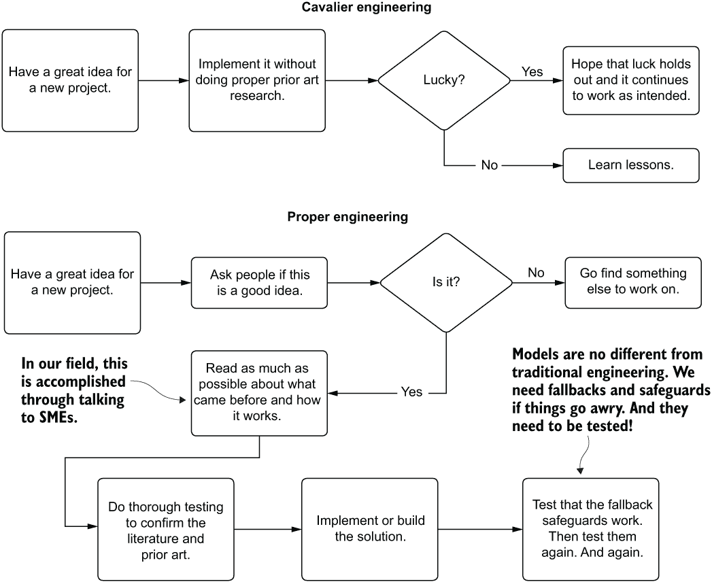

图 15.6 在工程工作中弄清楚安全措施和后备方案的重要性

在构建机器学习解决方案时，许多时候，数据科学家可能会错误地假设他们正在解决的问题是没有先例的。当然有例外（如登月项目），但我在职业生涯中工作的绝大多数解决方案都有人在公司中扮演着项目旨在自动化的角色。

那个人有完成这项任务的方法、实践和标准。在你到来之前，他们就理解了数据。从所有意义上讲，他们是一个活生生的、有呼吸的版本，就像我的老板生气时扔给我的那个三环笔记本。他们知道卡盘能转多快，如果技术人员想在冬天中间偷偷抽根烟，会发生什么。

这些代表现有技术的个人（或代码）将知道在构建后备系统时需要考虑的条件。他们会知道如果模型预测出垃圾数据，默认条件应该是什么。他们会知道回归预测的可接受范围。他们会知道每天应该有多少猫的照片和狗的照片。他们是你的智者向导，可以帮助你构建更稳健的解决方案。询问他们如何解决问题以及他们最有趣的错误故事是值得的。这只会帮助你确保不要重复同样的错误。

### 15.2.2 冷启动问题

对于某些类型的机器学习项目，模型预测失败不仅频繁，而且预期。对于需要现有数据历史背景才能正常工作的解决方案，缺乏历史数据会阻止模型进行预测。数据根本无法通过模型。被称为“冷启动问题”，这是任何处理时间相关数据的项目的解决方案设计和架构的关键方面。

例如，让我们假设我们经营一家宠物美容业务。我们的移动洗澡站车队在美国郊区巡游，为狗狗提供各种上门服务。预约和服务选择通过应用程序界面处理。当预订访问时，客户可以从数百个选项中选择，并在访问前一天通过应用程序预先支付服务费用。

为了提高我们客户的满意度（并增加我们的收入），我们在应用程序上使用服务推荐界面。此模型查询客户的历史访问记录，找到可能对他们相关的产品，并指出狗可能喜欢的额外服务。为了使推荐器正常工作，需要在服务选择期间提供历史服务记录。

这对任何人来说都不是很难想象。没有数据处理数据模型的模型并不特别有用。没有历史记录，模型显然没有数据来推断可能推荐捆绑到预约中的额外服务。

向最终用户提供“某种东西”需要冷启动解决方案。对于此用例的一个简单实现是生成全球最常订购服务的集合。如果模型没有足够的数据来提供预测，可以用基于流行度的服务聚合来代替。到那时，应用程序的 IFrame 元素至少会有一些内容（而不是显示空集合），用户界面不会因为看到空框而受损。

可以进行更复杂的实现，将全局流行度排名升级为具有更多细粒度预生成的冷启动数据的排名。至少，可以使用地理区域作为分组聚合来计算服务的流行度，以创建一个伪个性化的故障转移条件。如果为最终用户提供额外的数据，可以进行更复杂的分组分配，参考用户基础中的聚合数据点来设置分组条件，确保提供更精细和粒度化的推荐。图 15.7 展示了启用了冷启动的架构。


图 15.7 冷启动解决方案的逻辑图

建立基于启发式解决方案，通过与 SMEs 合作利用用例的深度知识，是解决冷启动问题的有效方法。当一个用户没有至少三个预约选择历史记录时开始使用应用程序，模型将完全绕过，并做出简单的基于业务规则的伪预测。这些冷启动解决方案的实施可以采取以下形式：

+   上个月用户地理位置中最受欢迎的项目

+   全球今天最受欢迎的项目

+   SME 管理的项目集合

+   库存高的项目

无论使用何种方法，都要确保有东西可以实施。毕竟，另一种选择是返回没有数据。这对于需要从 API 生成数据以填充界面元素的面向客户的应用程序来说，根本不是一种选择。拥有冷启动替代解决方案的好处是它可以作为一个后备解决方案。通过微调决策逻辑以检查模型预测输出结果的准确性，可以提供冷启动值来替代有问题的数据。

对于这个冷启动默认值服务，可能会诱使人们构建一个复杂的东西，但在这里应该避免复杂性。目标是构建一个特别快（低 SLA）、易于调整和维护，并且足够相关，以至于不会引起最终用户注意某些东西设计不正确。

冷启动解决方案不仅适用于推荐系统。任何时候模型发布预测，尤其是那些具有低 SLA 响应要求的预测，都应该产生至少与当前任务多少有些相关的价值（由业务部门和 SMEs 定义和设计的相关性，而不是由 DS 团队定义）。

对于实时用例，未能生成价值可能会破坏下游系统，这些系统会消费这些数据。对于许多系统，未能有相关性依赖的后备方案可能会导致它们抛出异常、过度重试，或者求助于后端或前端开发者设置的系统保护默认值。这是工程部门和最终用户都不希望看到的情况。

## 15.3 最终用户测试与内部使用测试

一旦确认端到端功能正常，就发布项目到生产环境是非常诱人的。经过如此多的工作、努力和基于指标的定量质量检查，自然而然地认为解决方案已经准备好进入世界使用。抵制这种冲刺最后一英里的冲动是困难的，尽管这是绝对关键的。

如我们在第一部分中所述，以下是一些主要原因，说明仅基于 DS 团队的内部评估发布项目是多么不明智：

+   DS 团队成员存在偏见。这是他们的“孩子”。没有人愿意承认自己创造了一个丑陋的“孩子”。

+   定量指标并不总是保证定性特征。

+   对质量预测最重要的可能是不收集的数据。

这些原因让人联想到相关性不意味着因果关系的概念，以及创造者偏见。虽然模型的验证和定量指标可能表现得非常好，但很少有几个项目能够将所有因果因素都捕捉在特征向量中。

详尽的测试或质量保证（QA）流程可以帮助我们对我们的解决方案进行定性评估。我们可以通过多种方式实现这一点。

让我们设想我们正在一家音乐流媒体服务公司工作。我们有一个通过在排队收听会话后提供高度相关的歌曲选择来增加客户参与度的倡议。

我们不想使用一种协作过滤方法，该方法会找到其他用户听过的类似歌曲，而是想根据人类耳朵如何解释一首歌来找到类似的歌曲。我们使用音频文件的四次变换来获取频率分布，然后将该分布映射到梅尔尺度（音频信号的对数功率谱的线性余弦变换，这接近于人类耳朵对声音的感知）。通过这种数据变换和绘图，我们得到了每首歌曲特性的视觉表示。然后，我们通过使用调整过的三分支 Siamese 网络，以离线方式计算所有歌曲与所有其他歌曲的相似性。从这个系统中出来的特征向量，通过为每首歌曲添加额外的标签特征来增强，用于计算一首歌曲到另一首歌曲的欧几里得距离和余弦距离。我们将所有歌曲之间的关系保存在一个 NoSQL 数据库中，该数据库跟踪了与所有其他歌曲最相似的 1000 首歌曲，用于我们的服务层。

为了说明，图 15.8 基本上是团队输入到 Siamese 网络中的内容，每首歌曲的梅尔可视化。这些距离度量有内部“旋钮”，DS 团队可以使用这些旋钮来调整最终的输出集合。这个特性在测试早期被发现，当时内部 SME 成员表达了希望细化音乐流派中类似音乐的过滤器的愿望，以适应音乐的时代。

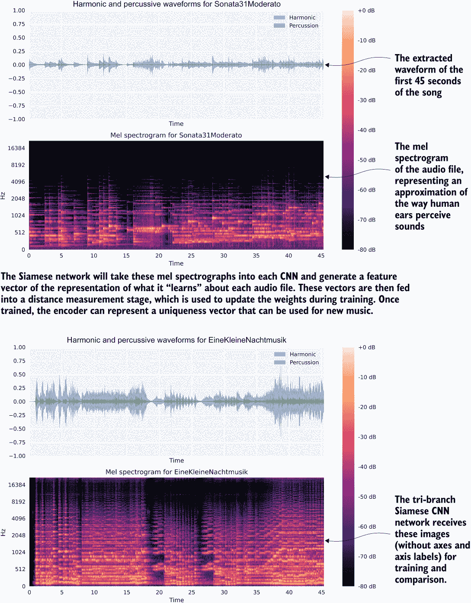

图 15.8 音乐文件转换为用于 Siamese CNN 网络的梅尔频谱图

现在我们已经可以看到这里的情况（以及 CNN 从编码特征中创建的信息类型），我们可以深入探讨如何测试这项服务。图 15.9 展示了测试的概述。

图 15.9 比较了三种可以在我们的服务上进行定性评估的预生产 QA 工作形式。接下来的三个小节涵盖了这些元素——内部偏向性测试、尝鲜（消费我们自己的产品）、详尽的小型专家（SME）审查——以展示整体 SME 评估方法相对于其他方法的优点。

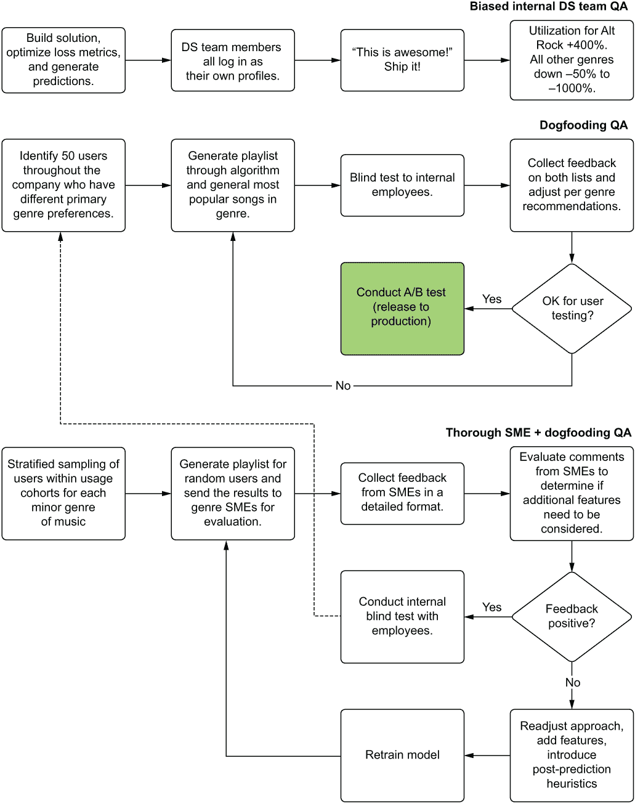

图 15.9 不同的定性测试策略。顶部的策略作为实践来说相当糟糕。

最终，对机器学习项目进行 QA 的目标是评估基于现实世界数据的预测，这些数据不依赖于解决方案创造者的高度短视视角。目标是尽可能消除对解决方案效用定性评估中的偏见。

### 15.3.1 偏向性测试

内部测试很容易——好吧，比替代方案更容易。如果模型工作正常，那么这个过程是无痛的。这是我们通常在认证项目结果时所想到的。这个过程通常涉及以下步骤：

+   在新（对建模过程来说是未知的）数据上生成预测

+   分析新预测的分布和统计特性

+   对预测进行随机抽样并对其做出定性判断

+   将手工制作的样本数据（或适用的个人账户）通过模型运行

列表中的前两个元素适用于模型有效性的资格认证。它们完全无偏见，应该执行。另一方面，后两个则是有害的。其中最后一个更危险。

在我们的音乐播放列表生成系统场景中，假设 DS 团队成员都是古典音乐的粉丝。在整个定性验证过程中，他们一直在检查他们最熟悉的音乐领域——古典音乐的播放列表生成器的相对质量。为了进行这些验证，他们一直在生成他们最喜欢的作品的收听历史，调整实现来微调结果，并在验证过程中迭代。

当他们完全满意解决方案在识别具有高度复杂性的主题和调性相关相似音乐片段方面表现良好时，他们会询问同事的看法。DS 团队（本和朱莉）以及他们的数据仓库工程师朋友康纳的结果如图 15.10 所示。

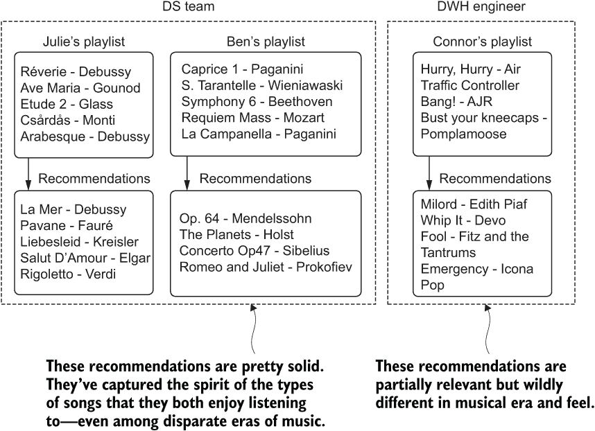

图 15.10 模型效能在定性评估中的偏差反馈

结果是，基于偏差的解决方案优化，以满足 DS 团队自己对该音乐类型的偏好和知识。虽然对于古典音乐爱好者的挑剔品味来说，解决方案调得恰到好处，但对于像康纳这样的现代另类摇滚乐迷来说，解决方案则非常糟糕。他的反馈将与团队对自己解决方案质量的判断大相径庭。为了修复实现，本和朱莉可能需要做出很多调整，引入额外的功能来进一步细化康纳对另类摇滚音乐的品味。那么，其他数百种音乐类型又如何呢？

尽管这个例子特别具有挑战性（音乐品味极为多样且高度个性化），但任何 ML 项目都可能存在这种内部团队偏差的问题。任何 DS 团队都将只能有限地了解数据的细微差别。对数据的复杂潜在关系以及每个如何与业务相关的详细了解通常不是 DS 团队所知的。这就是为什么让那些对公司中解决项目用例最了解的人参与 QA 过程是如此关键。

### 15.3.2 试用

比 Ben 和 Julie 的第一次尝试要更彻底的方法是向公司的人进行调查。而不是将评估限制在团队内部，因为有限的接触类型阻碍了他们从质量上衡量项目有效性的能力，他们可以寻求帮助。他们可以四处询问，看看公司的人是否可能对查看他们自己的账户和受 DS 团队引入的变更影响的用法感兴趣。图 15.11 说明了这种情况是如何工作的。

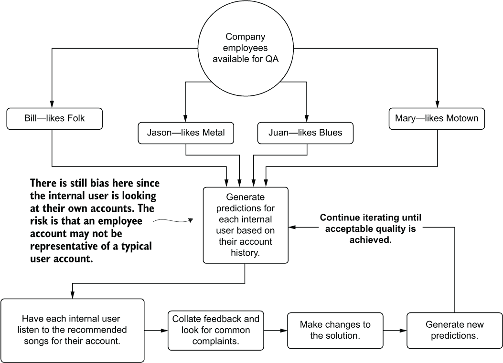

图 15.11 通过利用志愿者提供主观反馈作为用户来尝鲜一个项目

在最广泛的意义上，“尝鲜”是指消费你自己的产品结果。这个术语指的是开放正在开发的功能，以便公司中的每个人都可以使用它，找出如何破坏它，提供关于它如何被破坏的反馈，并共同努力打造更好的产品。所有这些都在广泛的视角中发生，借鉴了来自所有部门的许多员工的经验和知识。

然而，如图 15.11 所示，评估仍然包含偏见。使用公司产品的内部用户可能不是典型用户。根据他们的工作职能，他们可能在使用他们的账户来验证产品中的功能，用它进行演示，或者仅仅因为与员工福利相关的它而更多地与产品互动。

除了员工收听历史中可能包含的虚假信息之外，另一种形式的偏见是人们喜欢他们喜欢的东西。他们也不喜欢他们不喜欢的东西。对像音乐偏好这样情绪化的东西的主观反应，由于人类成员的本质，会添加大量的偏见。知道这些预测是基于他们的收听历史，并且是他们自己公司的产品，内部用户评估自己的个人资料时，如果他们发现不喜欢的东西（这与 DS 团队会遇到的构建者偏见形成鲜明对比），通常会比典型用户更加苛刻。

尽管尝鲜当然比在 DS 团队的限制内评估解决方案的质量要好，但这仍然不是理想的，主要是因为这些固有的偏见存在。

### 15.3.3 主题专家（SME）评估

在保持在公司内部的前提下，你可以进行的最彻底的 QA 测试是利用业务中的主题专家（SMEs）。这是保持业务中的 SMEs 参与项目最重要的原因之一。他们不仅会知道公司中谁对项目的某个方面（在这种情况下，是音乐类型）有最深入的知识和经验，而且他们可以帮助调动这些资源来协助。

对于 SME 评估，我们可以在 QA 阶段之前安排这一阶段，请求那些对我们需要提供关于生成歌单质量公正意见的音乐流派专家资源。通过指定专家，我们可以不仅向他们提供自己的推荐，还可以提供随机抽样用户的推荐。凭借他们对每个流派细微之处的深入了解，他们可以评估他人的推荐，以确定生成的播放列表是否在音调和主题上合理。图 15.12 展示了这一过程。

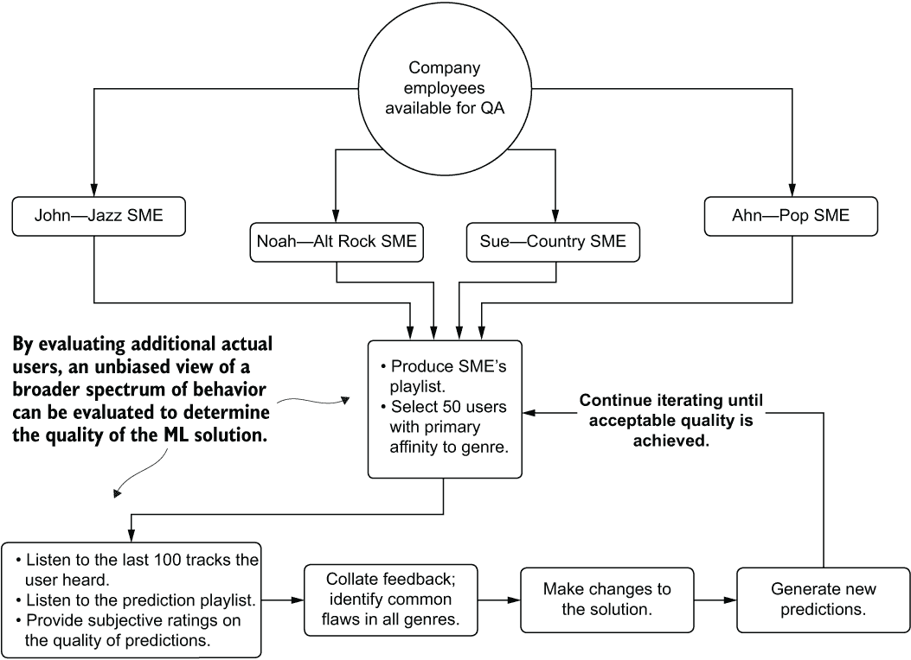

图 15.12 项目实施的公正 SME 评估

在实施更为彻底的裁决后，反馈的有用性显著高于任何其他方法。我们可以在最小化偏见的同时，将专家的深入知识融入可迭代的可操作变化中。

虽然这个场景关注的是音乐推荐，但它几乎可以应用于任何机器学习项目。最好记住，在你开始着手解决你正在工作的任何项目之前，一些人类（或许多人类）已经在以某种方式解决这个问题了。他们将比 DS 团队中的任何人都更深入地了解主题的细节。你不妨利用他们的知识和智慧，尽力提供最佳的解决方案。

## 15.4 模型可解释性

假设我们正在解决一个旨在控制森林火灾的问题。我们工作的组织可以调动设备、人员和资源到大型国家公园系统内的各个位置，以减轻野火失控的可能性。为了使物流效率尽可能高效，我们被要求构建一个可以通过网格坐标识别火灾爆发风险的解决方案。我们拥有多年的数据，每个位置的传感器数据，以及每个网格位置的火灾燃烧历史。

在构建模型并向物流团队提供预测服务之后，关于模型预测的问题开始出现。物流团队成员注意到某些预测与他们对火灾季节的经验性知识不符，他们表达了对使用他们接触到的特征数据应对预测灾难的担忧。

他们开始怀疑这个解决方案。他们提出了问题。他们确信有些奇怪的事情正在发生，并且他们想知道为什么他们的服务和人员被告知要在一个月内覆盖一个网格坐标，而这个坐标，据他们所记，从未发生过火灾。

我们如何应对这种情况？我们如何运行我们的特征向量预测的模拟，并通过我们的模型向他们明确说明模型为什么做出这样的预测？具体来说，我们如何以最少的努力在我们的模型上实施可解释的人工智能（XAI）？

在规划项目时，尤其是对于业务关键用例，一个经常被忽视的方面是考虑模型的可解释性。一些行业和公司是这一规则的例外，这可能是由于法律要求或公司政策，但与我互动的大多数团队来说，可解释性是一个事后考虑的问题。

我理解大多数团队在考虑将 XAI 功能添加到项目中时的犹豫。在 EDA（探索性数据分析）、模型调整和 QA 验证过程中，DS 团队通常对模型的行为有相当的了解。实现 XAI 可能看起来是多余的。

当你需要解释模型如何或为什么做出这样的预测时，你通常已经处于一个紧张的情况，时间已经受限。通过实现 XAI 流程的简单开源包，可以避免这种紧张和混乱的解释解决方案功能。

### 15.4.1 Shapley 加性解释

对于 Python 而言，较为知名且经过充分验证的 XAI（可解释人工智能）实现之一是 Scott Lundberg 编写和维护的 `shap` 包。这个实现详细记录在 2017 年 NeurIPS 论文“一种统一的方法来解释模型预测”中，由 Lundberg 和 Su-In Lee 撰写。

算法的核心是博弈论。本质上，当我们考虑要进入训练数据集的特征时，每个特征对模型预测的影响是什么？就像团队运动中的球员一样，如果比赛是模型本身，而参与训练的特征是球员，那么如果一个球员被另一个球员替换，这对比赛有什么影响？一个球员的影响力如何改变比赛的结果是 `shap` 尝试回答的基本问题。

基础

`shap` 原理背后的思想是估计训练数据集中每个特征对模型贡献的大小。根据原始论文，计算真实贡献（即精确的 Shapley 值）需要评估数据集中每一行的所有排列，包括和排除源行特征的排列，创建不同的特征分组联盟。

例如，如果我们有三个特征（a、b 和 c；原始特征用 [i] 表示），用数据集中的替换特征 [j]（例如，a[j]）表示，那么评估特征 b 的测试联盟如下：

(a[i], b[i], c[j]), (a[i], b[j], c[j]), (a[i], b[j], c[i]), (a[j], b[i], c[j]), (a[j], b[j], c[i])

这些特征联盟通过模型运行以获取预测。然后，将得到的预测与原始行的预测（以及差异的绝对值）进行差分。这个过程对每个特征重复进行，当对每个特征的每个差分组应用加权平均时，结果得到一个特征值贡献分数。

毫不奇怪，这不是一个非常可扩展的解决方案。随着特征数量的增加和训练数据集行数的增加，这种方法计算复杂性的快速增加变得难以承受。幸运的是，另一个解决方案的扩展性要远好：近似 Shapley 估计。

近似 Shapley 值估计

为了在大特征集中缩放特征的加性效应，采用了一种略有不同的方法。Python 包`shap`利用这种近似实现来获取所有行和特征上的合理值，而无需求助于原始论文中的暴力方法。图 15.13 说明了这种近似方法的过程。

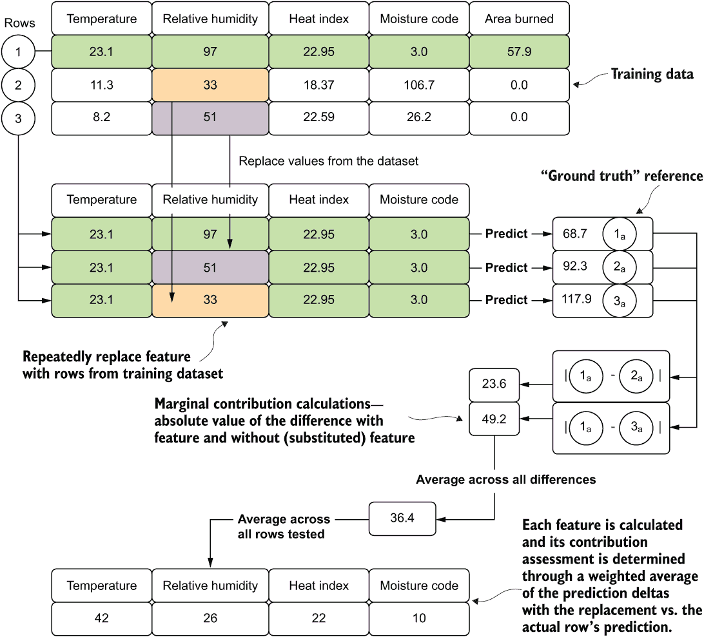

图 15.13 shap 中近似核 Shapley 值实现的实现

与穷举搜索方法相比，这里的主要区别在于测试的数量有限和构建联盟的方法。与原始设计不同，单行特征向量不用于生成基线预测。相反，对行进行随机抽样，并将测试中的特征与其他选定子集的值进行交换。然后，将这些新的合成向量传递给模型，生成预测。对于这些合成预测中的每一个，都计算绝对差异，然后取平均值，给出参考向量在这些联盟中的特征贡献值。应用于这些值平均的加权因子取决于单个合成向量中“修改”（替换）的特征数量。对于特征交换较多的行，与特征交换较少的行相比，这些行的重要性权重更高。

图 15.13 中显示的最后阶段是在整体每个特征的贡献评估中。这些特征重要性估计是通过加权每行的特征贡献边际并按百分比贡献对整个数据集进行缩放来完成的。这两种计算数据伪影都可以通过使用 Python `shap`包（每行的贡献估计和整个数据集的聚合测量）获得，并且可以帮助解释不仅是一行的预测，还可以提供对训练模型中特征影响的整体视图。

我们可以用这些值做什么

简单地计算 Shapley 值对数据科学团队来说帮助不大。基于这个包的 XAI 解决方案的效用在于这些分析能够回答哪些问题。在计算这些值之后，你将能够回答以下一些问题：

+   “为什么模型预测了这个奇怪的结果？”（单事件解释）

+   “这些额外的特征会产生不同的性能吗？”（特征工程验证）

+   “我们的特征范围如何影响模型预测？”（一般模型功能解释）

`shap`包不仅可以作为解决方案开发和维护的辅助工具，还可以帮助向业务单元成员和专家提供基于数据的解释。通过将关于解决方案功能的讨论从 DS 团队通常使用的工具（相关性分析、依赖图、方差分析等）转移到数据上，可以开展更有成效的讨论。这个包以及其中的方法，减轻了 ML 团队解释晦涩的技术和工具的负担，转而专注于讨论解决方案的功能，即公司生成的数据。

### 15.4.2 使用 shap

为了说明我们如何使用这种技术来预测森林火灾的问题，让我们假设我们已经构建了一个模型。

注意：要跟随示例并查看模型构建、使用 Optuna 包（第二部分中提到的 Hyperopt 的现代版本）进行调优以及此示例的完整实现，请参阅本书的配套 GitHub 存储库。代码位于第十五章目录中。

在可用的预构建模型的基础上，让我们利用`shap`包来确定训练数据中各个特征的影响，以帮助回答业务提出的关于模型为何以特定方式表现的问题。以下列表展示了一系列辅助生成解释图的类（请参考存储库中的`import`语句和代码的其余部分，这部分代码太长，无法在此打印）。

列表 15.1 shap 接口

```
class ImageHandling:                                               ❶
    def __init__(self, fig, name):
        self.fig = fig
        self.name = name
    def _resize_plot(self):
        self.fig = plt.gcf()                                       ❷
        self.fig.set_size_inches(12, 12)
    def save_base(self):
        self.fig.savefig(f"{self.name}.png", 
                         format='png', bbox_inches='tight')
        self.fig.savefig(f"{self.name}.svg", 
                         format='svg', bbox_inches='tight')
    def save_plt(self):
        self._resize_plot()
        self.save_base()
    def save_js(self):
        shap.save_html(self.name, self.fig)                        ❸
        return self.fig
class ShapConstructor:                                             ❹
    def __init__(self, base_values, data, values, feature_names, shape):
        self.base_values = base_values 
        self.data = data 
        self.values = values 
        self.feature_names = feature_names 
        self.shape = shape     
class ShapObject:
    def __init__(self, model, data):
        self.model = model
        self.data = data
        self.exp = self.generate_explainer(self.model, self.data)
        shap.initjs()
    @classmethod
    def generate_explainer(self, model, data):                     ❺
        Explain = namedtuple('Explain', 'shap_values explainer max_row')
        explainer = shap.Explainer(model)
        explainer.expected_value = explainer.expected_value[0]
        shap_values = explainer(data)
        max_row = len(shap_values.values)
        return Explain(shap_values, explainer, max_row)
    def build(self, row=0):
        return ShapConstructor(
base_values = self.exp.shap_values[0][0].base_values,
            values = self.exp.shap_values[row].values,
            feature_names = self.data.columns,
            data = self.exp.shap_values[0].data,
            shape = self.exp.shap_values[0].shape)
    def validate_row(self, row):
        assert (row < self.exp.max_row, 
f"The row value: {row} is invalid. " 
f"Data has only {self.exp.max_row} rows.")
    def plot_waterfall(self, row=0):                               ❻
        plt.clf()
        self.validate_row(row)
        fig = shap.waterfall_plot(self.build(row), 
                                  show=False, max_display=15)
        ImageHandling(fig, f"summary_{row}").save_plt()
        return fig
    def plot_summary(self):                                        ❼
        fig = shap.plots.beeswarm(self.exp.shap_values, 
                                  show=False, max_display=15)
        ImageHandling(fig, "summary").save_plt()
    def plot_force_by_row(self, row=0):                            ❽
        plt.clf()
        self.validate_row(row)
        fig = shap.force_plot(self.exp.explainer.expected_value, 
                               self.exp.shap_values.values[row,:], 
                               self.data.iloc[row,:],
                               show=False,
                               matplotlib=True
                              )
        ImageHandling(fig, f"force_plot_{row}").save_base()
    def plot_full_force(self):                                     ❾
        fig = shap.plots.force(self.exp.explainer.expected_value, 
                               self.exp.shap_values.values, 
                               show=False
                              )
        final_fig = ImageHandling(fig, "full_force_plot.htm").save_js()
        return final_fig
    def plot_shap_importances(self):                               ❿
        fig = shap.plots.bar(self.exp.shap_values, 
                             show=False, max_display=15)
        ImageHandling(fig, "shap_importances").save_plt()
    def plot_scatter(self, feature):                               ⓫
        fig = shap.plots.scatter(self.exp.shap_values[:, feature],  
                                 color=self.exp.shap_values, show=False)
        ImageHandling(fig, f"scatter_{feature}").save_plt()
```

❶ 图像处理类，用于处理图表的调整大小和存储不同格式

❷ 获取当前图表图标的引用以调整大小

❸ 由于此图是用 JavaScript 生成的，我们必须将其保存为 HTML。

❹ 统一来自 shap Explainer 的所需属性，以处理所有图表的要求

❺ 在类实例化期间调用的方法，根据传入的模型和提供的数据生成 shap 值，以评估模型的功能

❻ 生成单行的水波图，以解释每个特征对行目标值的影响（组成分析）

❼ 生成整个传入数据集中每个特征的完整 shap 摘要

❽ 生成单行力的图表，以展示每个特征对其目标值的累积影响

❾ 将整个数据集的合并力图生成单个显示的可视化

❿ 创建每个特征的估计 shap 重要性的调试图

⓫ 生成单个特征与其 shap 值之间的散点图，颜色由向量中剩余位置的最高协方差特征决定

定义了我们的类别后，我们可以开始回答商家关于为什么模型预测了这些值的问题。我们可以摆脱通过展示相关性效应来解释的最好努力尝试的猜想领域，而不是浪费时间（和商家的）去进行耗时且可能令人困惑的演示，我们可以专注于回答他们的问题。

作为额外的奖励，在开发过程中拥有这种基于博弈论的方法可以帮助我们了解哪些特征可以改进，哪些可能被删除。从该算法中获得的信息在整个模型的生命周期中都是无价的。

在我们查看列表 15.1 中这些方法执行时会产生什么结果之前，让我们回顾一下业务高管想知道的内容。为了确保模型输出的预测是合理的，他们想知道以下内容：

+   如果我们看到以下条件，应该引起我们恐慌吗？

+   为什么降雨量似乎不影响风险？

为了回答这两个问题，让我们看看可以从 `shap` 包中生成的两个图表。基于这些图表，我们应该能够看到问题预测的来源。

shap 概要图

为了回答关于降雨的问题，以及提供了解哪些特征驱动预测最多的机会——概要图是为此目的最全面和实用的。因为它结合了所有训练数据的行，它将通过算法执行的替换策略对每个特征的冲击进行逐行估计。这种对整个训练数据集的整体视角可以显示特征在问题范围内的整体影响程度。图 15.14 显示了概要图。

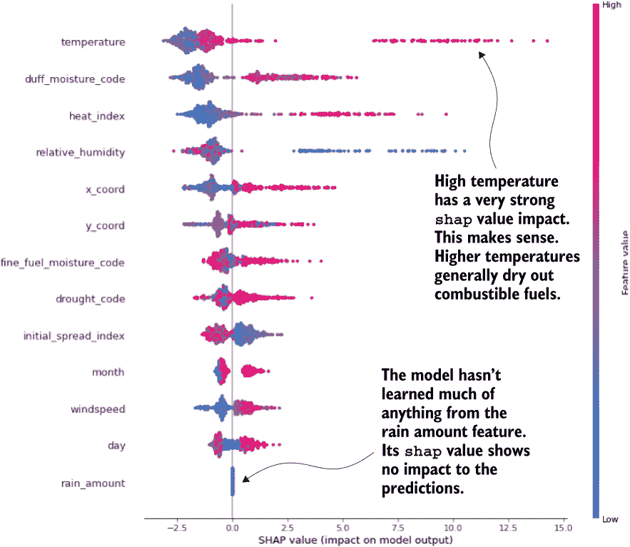

图 15.14 shap 概要图，显示每行的每个特征的替换和预测增量

拥有这个图表，可以与商家进行大量的讨论。不仅能够共同探讨为什么降雨量值在模型输出中明显没有产生影响（图表显示该特征甚至没有被随机森林模型考虑），还可以了解模型如何解释数据的其他方面。

注意：确保你向商家非常清楚地解释什么是 `shap`。它与现实无关；它只是简单地表明模型如何解释其预测中向量的特征变化。这是一个关于*模型*的度量，而不是你试图模拟的现实。

概述图可以开始讨论为什么模型会以这种方式表现，在识别了 SMEs（行业专家）指出的不足之后，可能进行哪些改进，以及如何用大家都能理解的方式与业务讨论模型。一旦解释了这个工具的初始困惑，业务完全理解所显示的值只是模型理解特征的估计（并且它们不是你预测的问题空间现实情况的反映），对话就可以变得更加富有成效。

清楚地说，在展示工具能够生成的任何可视化之前，**绝对必要**的是解释这些值的确切含义。我们不是在解释世界；我们是在解释基于我们实际收集的数据，模型对相关效应的有限理解。其中并没有更多或更少的内容。

在与业务和降雨问题的一般讨论完成后，我们可以继续回答下一个问题。

水位图

我们可以通过一系列的可视化来回答第二个问题，这可能是企业最关心的问题。当业务领导问他们何时应该恐慌时，他们真正想了解的是模型何时会预测紧急情况。他们想知道他们应该关注哪些特征的属性，以便警告地面人员可能发生不好的事情。

这是对机器学习的一种可嘉的使用，我在我的职业生涯中见过很多次。一旦公司的业务单元走过了不信任的低谷，进入了依赖预测的领域，不可避免的结果就是企业想要了解他们的问题的哪些方面可以监控和控制，以帮助最小化灾难或最大化有利的结果。

为了实现这一发现，我们可以查看我们之前的数据，从历史中选择最坏的情况（或情况），并绘制每个特征对预测结果的影响。这个数据集中历史上最严重的火灾的贡献分析如图 15.15 所示。

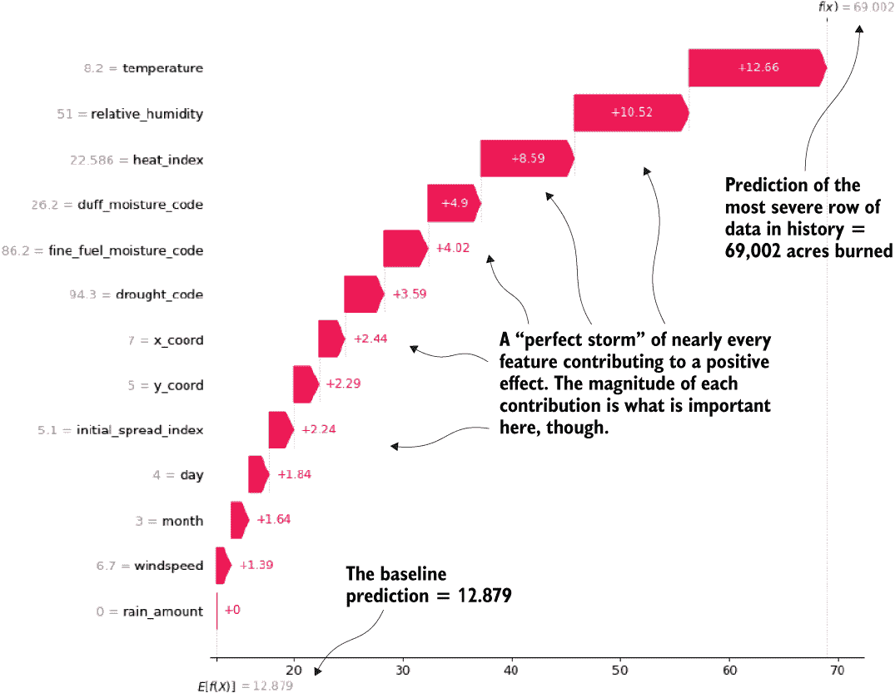

图 15.15 历史上最严重的野火的水位图。每个特征的贡献边际可以告知企业模型与哪些因素相关联，以预测高风险的火灾。

虽然这个图表只是一个单一的数据点，但通过分析目标的历史数据的前* n*行，我们可以得到一个更完整的图景。接下来的列表展示了如何使用围绕`shap`构建的界面来简单地生成这些图表。

列表 15.2 生成历史上最极端事件的特征贡献图

```
shap_obj = ShapObject(final_rf_model.model, final_rf_model.X)         ❶
interesting_rows = fire_data.nlargest(5, 'area').reset_index()['index'].values                            ❷
waterfalls = [shap_obj.plot_waterfall(x) for x in interesting_rows]   ❸
```

❶ 通过传递训练好的模型和用于训练它的训练数据，实例化 shap 包的处理程序以生成 shap 值

❷ 从训练数据中提取五个最严重的区域烧伤事件，以检索它们的行索引值

❸ 为五个最严重的五个事件生成瀑布图（如图 15.15 所示）

拥有这些顶级事件图和每个特征对这些事件的贡献，企业现在可以识别他们希望向分析师和现场观察者解释的行为模式。有了这些知识，人们可以在模型预测之前就做好准备并主动采取行动。

使用`shap`帮助团队根据模型对数据的推断采取一系列有益的行动，这是该工具最强大的功能之一。它可以帮助以其他方式难以利用的方式利用模型。它有助于从模型中获得比单独的预测更大的深远利益（对商业（或社会和自然界）而言）。

关于 XAI 的个人笔记

解释基于输入特征的监督（和未监督！）模型如何得出结论，这帮助我制定了对问题的更全面解决方案。然而，XAI 还使我能够执行 DS 将参与的最重要任务之一：赢得企业的信任。

建立对数据解释和赋予企业能力的信任和内在信念，使组织能够更全面地向目标迈进，实现真正以数据驱动的决策过程。当基于证据的逻辑被用来引导企业时，效率、收入和员工的总体福祉都会提高。最重要的是，这为使您的业务同行参与理解您帮助他们前进的算法提供了理由。

与此包相关联的还有许多图表和功能，其中大部分在存储库中该章节的配套笔记本中得到了彻底的介绍。我鼓励您阅读它并考虑在您的项目中采用这种方法。

## 摘要

+   通过使用基于规则的验证功能存储库，可以实现特征和推断数据的一致性。拥有单一的真实来源可以显著减少对结果解释的混淆，并确保对发送给模型的任何数据进行质量控制检查。

+   建立因数据不足或数据集损坏导致的预测失败的后备条件，可以确保解决方案的消费者不会看到错误或服务中断。

+   仅使用预测质量指标不足以确定解决方案的有效性。由领域专家、测试用户和跨职能团队成员对预测结果进行验证，可以为任何 ML 解决方案提供主观质量测量。

+   利用如`shap`等技术可以帮助以简单的方式解释模型为何做出特定的决策，以及特定特征值对模型预测的影响。这些工具对于解决方案的生产健康至关重要，尤其是在定期重新训练期间。
