# 16 生产基础设施

本章涵盖

+   使用模型注册表实现被动再训练

+   利用特征存储进行模型训练和推理

+   为机器学习解决方案选择合适的托管架构

在实际用例中利用机器学习解决复杂问题具有挑战性。需要掌握的技能数量巨大，以从公司的数据（通常是杂乱无章、部分完整且充满质量问题）中提取数据，选择合适的算法，调整管道，并验证模型（或模型集合）的预测输出是否满足业务需求，这令人望而生畏。尽管创建了一个可接受性能的模型，但机器学习支持的项目复杂性并未结束。如果做得不正确，架构考虑和实现细节可能会给项目带来重大挑战。

每天似乎都有新的开源技术栈承诺更简单的部署策略或神奇的自动化解决方案，以满足所有需求。随着这些工具和平台的不断涌入，决定如何满足特定项目的需求可能会令人感到畏惧。

初看可用的产品，可能会让人觉得最合理的计划是坚持单一范式（例如，将每个模型作为 REST API 服务部署）。确保每个机器学习项目都遵循共同的架构和实现确实简化了发布部署。然而，事实并非如此。正如在选择算法时，没有“一刀切”的生产基础设施。

本章的目标是介绍可以应用于模型预测架构的通用通用主题和解决方案。在介绍掩盖生产机器学习服务复杂性和细节的基本工具之后，我们将深入研究可以满足不同项目需求的通用架构。

任何托管架构的目标是构建具有最少功能、最简单和最经济的解决方案，同时仍能满足消费模型输出的需求。以服务的一致性和效率（SLA 和预测量考虑）作为生产工作的主要焦点，有几个关键概念和方法需要了解，以使机器学习项目工作的最后一公里尽可能无痛。

## 16.1 艺术品管理

让我们想象我们仍在第十五章中介绍的森林服务火灾风险部门的火险部门工作。在我们努力有效地派遣人员和设备到公园系统中的高风险区域的过程中，我们找到了一个效果显著的方法。我们的特征已经锁定，并且随着时间的推移保持稳定。我们已经评估了预测的性能，并从模型中看到了真正的价值。

在将特征状态调整得好的整个过程中，我们一直在迭代改进周期，如图 16.1 所示。

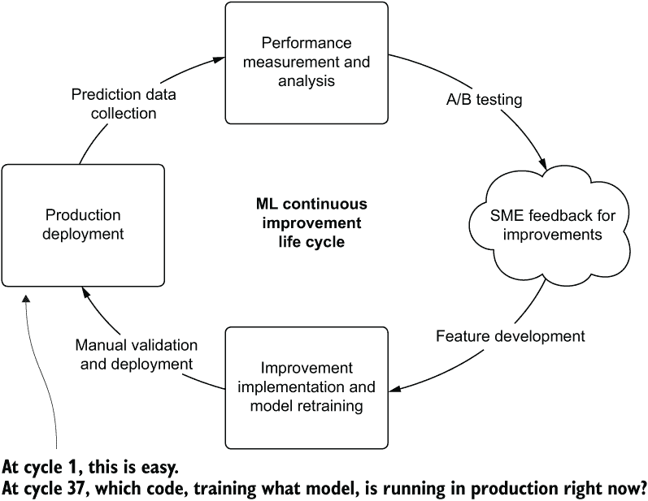

图 16.1 部署模型在生产稳态操作过程中的改进

如此循环所示，我们一直在迭代发布模型的新版本，与基线部署进行测试，收集反馈，并努力改进预测。然而，在某个时候，我们将进入模型维持模式。

我们已经尽最大努力改进进入模型的特征，并发现继续向项目中添加新数据元素的投资回报率（ROI）根本不值得。我们现在处于根据随时间到来的新数据进行模型计划被动重新训练的位置。

当我们达到这个稳态点时，我们最不想做的就是让 DS 团队的一员花一个下午的时间手动重新训练一个模型，手动比较其结果与当前生产部署的模型，并通过临时分析来决定是否更新模型。

哦，拜托。没有人会手动做这件事。

从我作为一个数据科学家（DS）的历史来看，我在解决问题的前六年没有开始使用被动重新训练。这并不是因为缺乏需求，也不是因为缺乏工具。纯粹是因为无知。我不知道问题漂移可能造成多大的问题（我多次通过解决方案变得无关紧要来艰难地了解到这一点，因为我忽视了它）。我也不理解或欣赏归因计算的重要性。

经过多年的反复犯错，我发现了一些通过研究解决我自设的项目工程不足的难题而写下的技术。我接受了最初让我进入 DS 工作的想法：自动化令人讨厌和重复的任务。通过移除手动监控项目健康状况的活动（通过临时漂移跟踪），我发现我解决了困扰我的两个主要问题。

首先，我释放了自己的时间。对预测结果和特征稳定性进行临时分析花费了很多时间。此外，这项工作极其无聊。

第二个大问题是准确性。手动评估模型性能是重复且易出错的。通过手动分析遗漏的细节可能导致部署的模型版本比当前部署的版本更差，引入的问题比略微较差的预测性能要严重得多。

我已经从自动化重新训练中吸取了教训（通常在可能的情况下选择被动重新训练系统而不是更复杂的主动系统）。就像我在职业生涯中学到的其他所有东西一样，我是通过犯错误来学习的。希望你们能避免同样的命运。

使用被动重新训练系统自动测量、裁决以及决定是否用新重新训练的模型替换现有模型是可能的。图 16.2 展示了计划重新训练事件的概念。

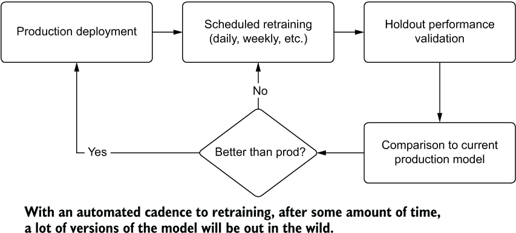

图 16.2 被动重新训练系统的逻辑图

在此安排的重新训练自动化实施后，这个系统的主要关注点是了解生产中正在运行的内容。例如，如果在新版本发布后生产中发现了问题，会发生什么？我们如何从对重新训练事件产生重大影响的漂移概念中恢复过来？我们如何在不重建模型的情况下将模型回滚到上一个版本？我们可以通过使用模型注册表来缓解这些担忧。

### 16.1.1 MLflow 的模型注册表

在我们目前所处的这种情况下，模型自动进行计划更新，了解生产部署的状态对我们来说非常重要。我们不仅需要了解当前状态，而且如果关于被动重新训练系统过去的表现出现疑问，我们需要有一种方法来调查模型的历史来源。图 16.3 比较了使用和不使用注册表来跟踪来源，以解释历史问题。

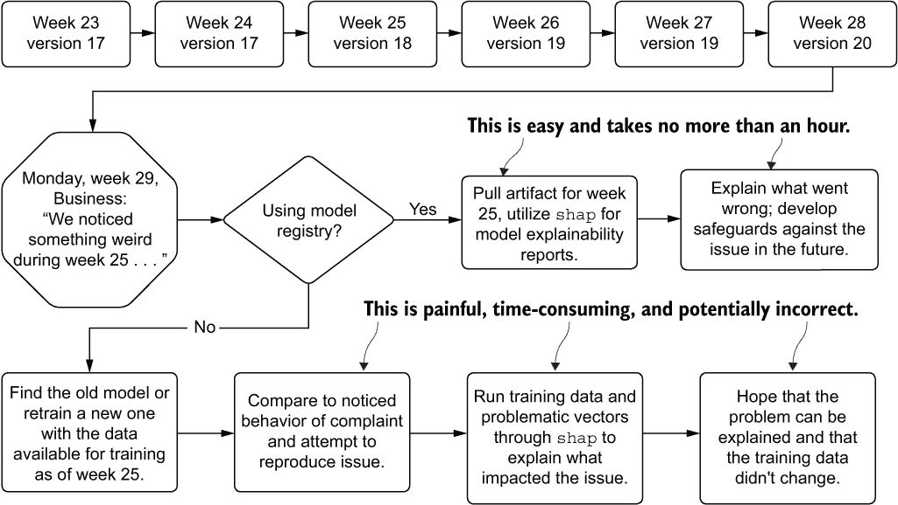

图 16.3 被动重新训练计划中发现的远期历史问题

正如您所看到的，尝试重新创建过去运行的流程充满了危险；我们面临很高的风险，无法重现业务在历史预测中发现的那个问题。由于没有注册表来记录生产中使用的工件，必须手动工作来重新创建模型的原始条件。这在大多数公司中可能非常具有挑战性（如果不是不可能的话），因为用于训练模型的基本数据可能已经发生变化，使得无法重新创建那种状态。

如图 16.3 所示，首选的方法是利用模型注册表服务。例如，MLflow 在其 API 中提供了这一功能，允许我们将每次重新训练运行的详细信息记录到跟踪服务器，如果计划中的重新训练作业在保留数据上表现更好，则处理生产推广，并将旧模型存档以供将来参考。如果我们使用了这个框架，测试曾经在生产中运行过的模型的条件过程将简单到只需从注册条目中召回工件，将其加载到笔记本环境中，并使用`shap`等工具生成可解释的相关报告。

注册表真的那么重要吗？

好吧，用两个字来说，“视情况而定。”

我记得我第一次真正的大规模、严肃的、认真的机器学习实现，有一种令人毛骨悚然的恐惧。这绝对不是我的第一个解决方案的生产发布，但这是第一个受到严重关注的。它帮助运行了业务的一个重要部分，因此受到了许多人的密切审查。如果我可以补充的话，这是理所当然的。

我的部署（如果可以这么称呼的话）涉及一个类似被动式再训练的系统，该系统存储了前一天调优运行中最后已知的良好超参数，使用这些值作为起点开始自动化调优。在优化了所有新的特征训练数据后，它选择了表现最佳的模型，对新数据进行预测，并用预测结果覆盖了服务表。

直到项目生产运行满三个月后，才出现了关于为什么模型以某种意想不到的方式预测某些客户的第一个严重问题。业务领导无法弄清楚为什么它会这样做，所以他们来找我，让我调查。

由于没有模型的记录（甚至没有保存任何地方），并且意识到训练数据随着时间的推移而持续变化，因为特征在更新，这使得我完全无法解释模型的历史性能。

业务对这种回答不太满意。尽管模型没有被关闭（它可能应该被关闭），但它让我意识到存储和编目模型的重要性，以便能够解释为什么解决方案以这种方式表现，即使这种解释是在它被使用后的几个月。

### 16.1.2 与模型注册接口

为了了解这段代码如何支持与 MLflow 模型注册服务的集成，让我们将我们的用例调整为支持这种被动式再训练功能。首先，我们需要创建一个裁决系统，该系统检查当前生产模型的性能与计划再训练结果之间的比较。在构建了这种比较之后，我们可以与注册服务接口，用较新的模型（如果它更好）替换当前的生产模型，或者根据与新的模型测试的相同保留数据，保持当前的生产模型。

让我们看看如何与 MLflow 模型注册接口支持自动化的被动式再训练，并保留模型状态随时间变化的来源。列表 16.1 建立了构建每个计划再训练事件的历史状态表所需的第一部分。

注意：要查看所有 `import` 语句和与这些片段集成的完整示例，请参阅 GitHub 仓库中本书此章节的配套笔记本，网址为 [`github.com/BenWilson2/ML-Engineering`](https://github.com/BenWilson2/ML-Engineering)。

列表 16.1 注册状态行生成和记录

```
@dataclass
class Registry:                                             ❶
  model_name: str
  production_version: int
  updated: bool
  training_time: str
class RegistryStructure:                                    ❷
  def __init__(self, data):
    self.data = data
  def generate_row(self):
    spark_df = spark.createDataFrame(pd.DataFrame(
      [vars(self.data)]))                                   ❸
    return (spark_df.withColumn("training_time", 
F.to_timestamp(F.col("training_time")))
            .withColumn("production_version", 
F.col("production_version").cast("long")))
class RegistryLogging:
  def __init__(self, 
               database, 
               table, 
               delta_location, 
               model_name, 
               production_version, 
               updated):
    self.database = database
    self.table = table
    self.delta_location = delta_location
    self.entry_data = Registry(model_name, 
                               production_version, 
                               updated, 
                               self._get_time())           ❹
  @classmethod
  def _get_time(self):
    return datetime.today().strftime('%Y-%m-%d %H:%M:%S')
  def _check_exists(self):                                 ❺
    return spark._jsparkSession.catalog().tableExists(
      self.database, self.table)
  def write_entry(self):                                   ❻
    log_row = RegistryStructure(self.entry_data).generate_row()
    log_row.write.format("delta").mode("append").save(self.delta_location)
    if not self._check_exists():
      spark.sql(f"""CREATE TABLE IF NOT EXISTS 
         {self.database}.{self.table} 
         USING DELTA LOCATION 
         '{self.delta_location}';""")
```

❶ 用于包装我们将要记录的数据的数据类

❷ 用于将注册数据转换为 Spark DataFrame 以将行写入用于溯源的 delta 表的类

❸ 以简写方式访问数据类的成员，以将其转换为 pandas DataFrame，然后转换为 Spark DataFrame（利用隐式类型推断）

❹ 在类初始化时构建 Spark DataFrame 行

❺ 确定 delta 表是否已经创建的方法

❻ 以追加模式将日志数据写入 Delta，并在 Hive Metastore 中创建表引用（如果尚未存在）

这段代码有助于为模型训练历史的溯源做好准备。由于我们希望按计划自动化重新训练，因此拥有一个引用集中位置中更改历史的跟踪表要容易得多。如果我们有多个此模型的构建，以及其他已注册的项目，我们可以有一个单个快照视图来查看生产被动重新训练的状态，而无需做任何更多的事情，只需编写一个简单的查询。

列表 16.2 展示了查询此表将看起来是什么样子。将多个模型记录到这种事务历史表中，添加 `df.filter(F.col("model_name") == "<project title>")` 可以快速访问单个模型的日志历史。

列表 16.2 查询注册状态表

```
from pyspark.sql import functions as F
REGISTRY_TABLE = "mleng_demo.registry_status"
display(spark.table(REGISTRY_TABLE).orderBy(F.col("training_time"))    ❶
```

❶ 由于我们之前在行输入阶段已注册了该表，我们可以通过 <database>.<table_name> 引用直接引用它。然后我们可以按时间顺序对提交进行排序。

执行此代码将产生图 16.4。除了这个日志之外，MLflow 中的模型注册也提供了一个 GUI。图 16.5 展示了与列表 16.2 中的注册表相匹配的 GUI 屏幕截图。

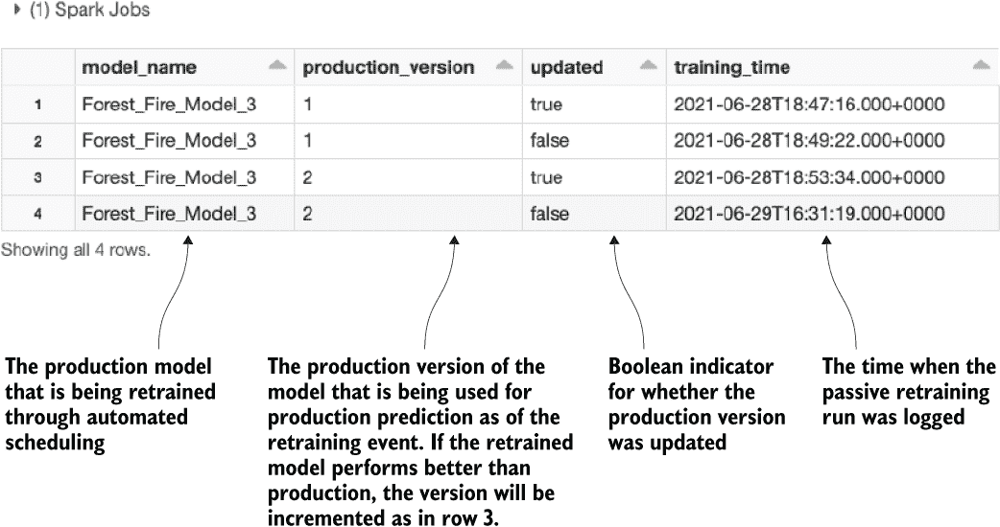

图 16.4 查询注册状态事务表

现在我们已经设置了历史跟踪功能，我们可以编写与 MLflow 注册服务器的接口以支持被动重新训练。列表 16.3 展示了利用跟踪服务器条目、查询当前生产元数据的注册服务以及自动状态转换重新训练模型以取代当前生产模型的实现。

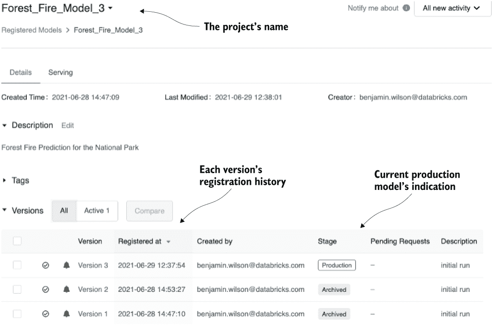

图 16.5 我们实验的 MLflow 模型注册 GUI

列表 16.3 被动重新训练模型注册逻辑

```
class ModelRegistration:
  def __init__(self, experiment_name, experiment_title, model_name, metric,
               direction):
    self.experiment_name = experiment_name
    self.experiment_title = experiment_title
    self.model_name = model_name
    self.metric = metric
    self.direction = direction
    self.client = MlflowClient()
    self.experiment_id = mlflow.get_experiment_by_name(experiment_name).experiment_id
  def _get_best_run_info(self, key):                                        ❶
    run_data = mlflow.search_runs(
      self.experiment_id, 
      order_by=[f"metrics.{self.metric} {self.direction}"])
    return run_data.head(1)[key].values[0]
  def _get_registered_status(self):
    return self.client.get_registered_model(name=self.experiment_title)
  def _get_current_prod(self):                                              ❷
    return ([x.run_id for x in self._get_registered_status().latest_versions
     if x.current_stage == "Production"][0])
  def _get_prod_version(self):
    return int([x.version for x in 
     self._get_registered_status().latest_versions
             if x.current_stage == "Production"][0])
  def _get_metric(self, run_id):
    return mlflow.get_run(run_id).data.metrics.get(self.metric)
  def _find_best(self):                                                     ❸
    try: 
      current_prod_id = self._get_current_prod()
      prod_metric = self._get_metric(current_prod_id)
    except mlflow.exceptions.RestException:
      current_prod_id = -1
      prod_metric = 1e7
    best_id = self._get_best_run_info('run_id')
    best_metric = self._get_metric(best_id)
    if self.direction == "ASC":
      if prod_metric < best_metric:
        return current_prod_id
      else:
        return best_id
    else:
      if prod_metric > best_metric:
        return current_prod_id
      else:
        return best_id
  def _generate_artifact_path(self, run_id):
    return f"runs:/{run_id}/{self.model_name}"
  def register_best(self, registration_message, logging_location, log_db,
                    log_table):                                             ❹
    best_id = self._find_best()
    try:
      current_prod = self._get_current_prod()
      current_prod_version = self._get_prod_version()
    except mlflow.exceptions.RestException:
      current_prod = -1
      current_prod_version = -1
    updated = current_prod != best_id
    if updated:
      register_new = mlflow.register_model(self._generate_artifact_path(best_id),
                                   self.experiment_title)
      self.client.update_registered_model(name=register_new.name, 
                                          description="Forest Fire 
                                          Prediction for the National Park")
      self.client.update_model_version(name=register_new.name, 
                                       version=register_new.version, 
                                       description=registration_message)
      self.client.transition_model_version_stage(name=register_new.name, 
                                                 version=register_new.version,
                                                 stage="Production")
      if current_prod_version > 0:
        self.client.transition_model_version_stage(
          name=register_new.name, 
          version=current_prod_version,
         stage="Archived")
      RegistryLogging(log_db, 
            log_table, 
            logging_location, 
            self.experiment_title,  
            int(register_new.version), 
            updated).write_entry()
      return "upgraded prod"
    else:
      RegistryLogging(log_db, 
            log_table, 
            logging_location, 
            self.experiment_title, 
            int(current_prod_version), 
            updated).write_entry()
      return "no change"
  def get_model_as_udf(self):                                               ❺
    prod_id = self._get_current_prod()
    artifact_uri = self._generate_artifact_path(prod_id)
    return mlflow.pyfunc.spark_udf(spark, model_uri=artifact_uri)
```

❶ 从生产部署的历史中提取所有之前的运行数据，并返回针对验证数据的最佳性能的运行 ID

❷ 查询当前在注册表中注册为“生产部署”的模型

❸ 确定当前计划中的被动重新训练运行是否在其保留数据上优于生产的查询方法。它将返回最佳记录运行的 run_id。

❹ 如果新模型表现更好，则利用 MLflow 模型注册表 API 进行注册，如果正在替换，则注销当前生产模型

❺ 使用 Python UDF 在 Spark DataFrame 上获取当前生产模型以进行批量推理

此代码允许我们完全管理此模型实现的被动重新训练（有关完整代码，请参阅本书的配套 GitHub 仓库）。通过利用 MLflow 模型注册表 API，我们可以通过一行代码访问模型工件来满足生产调度预测的需求。

这极大地简化了预测批量调度作业，同时也满足了我们在本节开始讨论的调查需求。有了如此轻松检索模型的能力，我们可以手动将特征数据与该模型进行测试，使用 `shap` 等工具进行模拟，并快速回答业务问题，而无需努力重新创建可能无法实现的状态。

在使用模型注册表跟踪模型工件的同一路线上，用于训练模型和用模型进行预测的特征也可以为了效率而编目。这一概念通过特征存储来实现。

这很酷，但关于主动重新训练呢？

被动重新训练和主动重新训练之间的主要区别在于触发重新训练的机制。

被动式，由 CRON 调度，是一种“最佳希望”策略，试图通过结合新的训练数据来寻找改进的模型拟合度，以对抗漂移。另一方面，主动式则监控预测状态和特征，以算法方式确定何时触发重新训练。

由于它旨在应对不可预测的性能下降，如果漂移以不可预测的速度发生，则主动系统可能有益——例如，一个模型已经表现良好几周，但在几天内崩溃，重新训练后仅表现良好几天，然后又需要重新训练。为了创建这种响应式反馈循环以触发重新训练事件，需要监控预测质量。需要构建一个系统来生成重新训练信号；该系统消耗预测，合并后来到达的（在某些情况下，几秒后，在其他情况下，几周后）高度可变的地标结果，并在时间上对聚合结果状态设置统计上显著的阈值。

这些系统高度依赖于 ML 解决的问题的本质，因此它们的设计和实现差异很大，以至于即使是通用的示例架构在这里也不相关。

例如，如果你试图确定某个地点在下一个小时内预测天气模型成功性的成功，你可以在一个小时内获得反馈。你可以构建一个系统，将滞后一个小时的实时天气与预测合并，将实际模型准确性输入到过去 48 小时内准确性率的窗口聚合中。如果天气预测的成功率聚合低于定义的 70%阈值，可以自动启动模型的再训练。这个新训练的模型可以通过通过验证两个模型的标准（新）保留验证数据集来与当前生产模型进行比较。然后，可以通过蓝/绿部署策略立即使用新模型，或者通过具有多臂老虎机算法的动态流量分配来逐渐使用它，该算法根据与当前生产模型的相对性能改进来路由流量。

概括来说，主动再训练是复杂的。我建议人们在发现被动再训练已经不再奏效时才去研究它，而不是仅仅因为它看起来很重要。在自主处理再训练时，有更多的部分、服务和基础设施需要处理。使用主动再训练时，你收到的云服务账单也会反映出复杂性的增加（它很昂贵）。

## 16.2 特征存储

我们在上一章简要提到了使用特征存储。虽然理解实施特征存储的合理性和好处（即一致性、可重用性和可测试性）很重要，但看到相对较新的技术的应用比讨论理论更为相关。在这里，我们将探讨一个我努力克服的场景，涉及利用特征存储在利用机器学习和高级分析的组织中强制执行一致性的重要性。

让我们设想我们在一个拥有多个数据科学（DS）团队的公司工作。在工程组内，主要的 DS 团队专注于公司范围内的项目。这个团队主要处理涉及关键服务的大型项目，这些服务可以被公司内的任何团队使用，以及面向客户的服务。在各个部门中散布着一些独立的贡献型 DS 员工，他们由各自的部门负责人雇佣并汇报。虽然存在协作，但核心 DS 团队使用的主要数据集并不对独立的 DS 员工开放。

在新年的开始，部门主管雇佣了一位刚从大学项目中毕业的新 DS。这位新员工有良好的意图，有动力，充满热情，立即开始着手进行这位部门主管希望调查的倡议。在分析公司客户特征的过程中，这位新员工遇到了一个包含客户拨打客服中心投诉概率的生产表。出于好奇，这位新的 DS 开始分析预测与他们在部门数据仓库中的数据之间的对比。

无法将任何特征数据与预测结果相匹配，数据科学家（DS）开始着手构建一个新的模型原型，试图改进投诉预测解决方案。经过几周的努力，DS 向他们的部门主管展示了他们的发现。在获得继续进行这个项目的批准后，DS 开始在他们的分析部门工作空间中构建项目。几个月后，DS 在公司全体员工会议上展示了他们的发现。

感到困惑，核心 DS 团队询问为什么这个项目正在进行，并要求进一步了解实施细节。不到一个小时，核心 DS 团队就能解释为什么独立 DS 的解决方案如此有效：他们泄露了标签。图 16.6 展示了核心 DS 团队的解释：构建任何新模型或对从用户收集的数据进行广泛分析所需的数据被核心 DS 团队工程部门周围的隔阂所隔离。

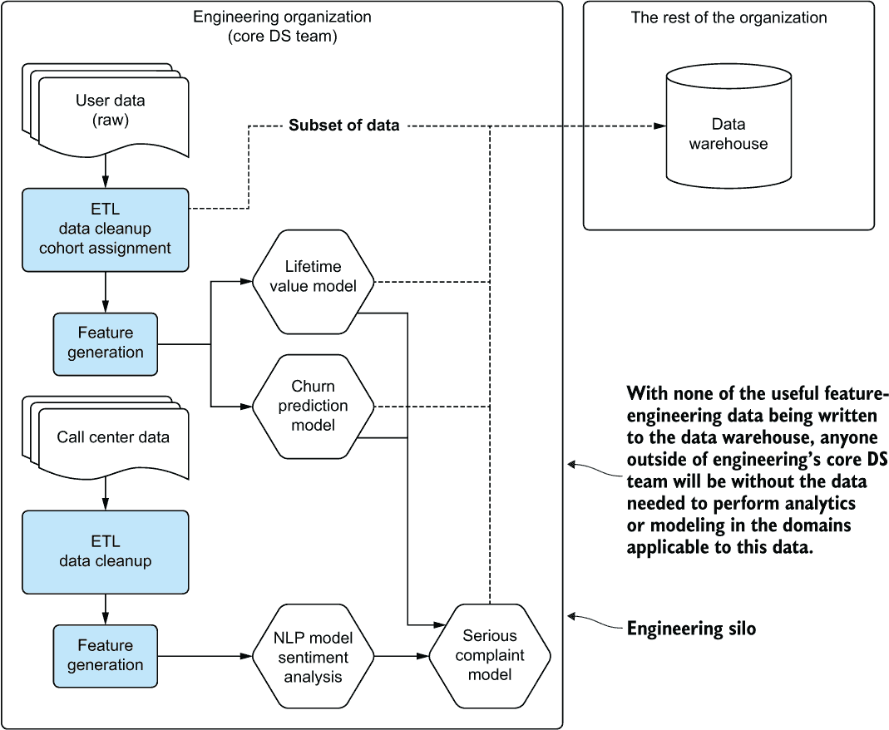

图 16.6 隔离工程部门，将原始数据和计算特征与其他组织部分隔离开

用于训练的数据，存在于部门的数据仓库中，是由核心 DS 团队的生产解决方案提供的。用于训练核心模型的每个源特征对工程和生产流程之外的人不可访问。

虽然这个场景是极端的，但它确实发生了。核心团队本可以通过提供一个可访问的生成特征数据源，开放访问权限，允许其他团队利用这些高度精选的数据点进行额外项目，从而帮助避免这种情况。通过将他们的数据与适当的标签和文档注册，他们可以节省这位可怜的 DS 大量的努力。

### 16.2.1 特征存储的用途

解决我们场景中的数据孤岛问题是使用特征存储的最有说服力的理由之一。当在一个组织内处理分布式 DS 能力时，通过减少重复工作、不一致的分析和围绕解决方案真实性的普遍困惑，可以看到标准化和可访问性的好处。

然而，拥有特征存储使组织能够利用其数据进行比仅仅进行质量控制更多的操作。为了说明这些好处，图 16.7 展示了带有和不带有特征存储的模型构建和服务的代码架构。

图 16.7 的上半部分显示了 ML 开发项目的历史现实。紧密耦合的特征工程代码直接与模型调优和训练代码一起开发，以生成比仅用原始数据进行训练更有效的模型。虽然从开发角度来看，这种架构对于生成一个好的模型是有意义的，但它会在开发预测代码库时产生问题（如图 16.7 右上角所示）。

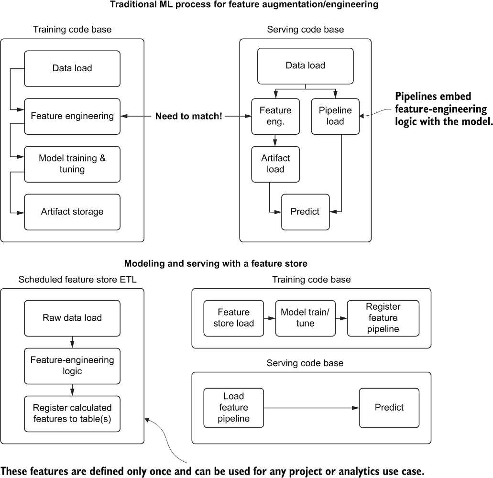

图 16.7 使用特征存储与不使用特征存储进行机器学习开发的比较

现在需要对原始数据进行的所有操作都需要迁移到这个服务代码中，这为模型向量中的错误和不一致性提供了机会。然而，这种方法的替代方案可以帮助消除数据不一致的可能性：

+   使用管道（大多数主要机器学习框架都有）。

+   将特征工程代码抽象成一个包，训练和提供都可以调用。

+   编写传统的 ETL 来生成特征并将它们存储起来。

每种方法都有其自身的缺点。管道很棒，应该使用，但它们将有用的特征工程逻辑与特定模型的实现纠缠在一起，使其无法在其他地方被利用。简单地没有容易的方法来重用这些特征用于其他项目（更不用说分析师在没有帮助的情况下几乎不可能将特征工程阶段从机器学习管道中分离出来）。

抽象特征工程代码确实有助于代码重用，并解决了需要使用这些特征的项目的一致性问题。但访问这些特征在 DS 团队之外仍然受到限制。另一个缺点是，它又是一个需要维护、测试和频繁更新的代码库。

让我们看看与特征存储交互的例子，使用 Databricks 实现来看到实际的好处。

**注意**：公司构建的此类特征实现可能会发生变化。API、特征细节和相关功能可能会随着时间的推移而改变，有时变化相当显著。此示例展示了一个特征存储的实现，用于演示目的。

### 16.2.2 使用特征存储

利用特征存储的第一步是定义一个 DataFrame 表示，用于创建我们希望用于建模和分析的特征的涉及的处理过程。以下列表显示了一组函数，这些函数正在对原始数据集进行操作以生成新特征。

列表 16.4 特征工程逻辑

```
from dataclasses import dataclass
from typing import List
from pyspark.sql.types import *
from pyspark.sql import functions as F
from pyspark.sql.functions import when
@dataclass
class SchemaTypes:
  string_cols: List[str]
  non_string_cols: List[str]
def get_col_types(df):
  schema = df.schema
  strings = [x.name for x in schema if x.dataType == StringType()]
  non_strings = [x for x in schema.names if x not in strings]
  return SchemaTypes(strings, non_strings)
def clean_messy_strings(df):                                 ❶
  cols = get_col_types(df)
  return df.select(*cols.non_string_cols, *[F.regexp_replace(F.col(x), " ", 
    "").alias(x) for x in cols.string_cols])
def fill_missing(df):                                        ❷
  cols = get_col_types(df)
  return df.select(
*cols.non_string_cols, *[when(F.col(x) == "?", 
"Unknown").otherwise(F.col(x)).alias(x) for x in cols.string_cols])
def convert_label(df, label, true_condition_string):         ❸
  return df.withColumn(label, when(F.col(label) == 
true_condition_string,1).otherwise(0))
def generate_features(df, id_augment):                       ❹
  overtime = df.withColumn("overtime", 
when(F.col("hours_worked_per_week") > 40, 1).otherwise(0))
  net_pos = overtime.withColumn("gains", 
when(F.col("capital_gain") > F.col("capital_loss"), 1).otherwise(0))
  high_edu = net_pos.withColumn("highly_educated", 
when(F.col("education_years") >= 16, 2)
.when(F.col("education_years") > 12, 1).otherwise(0))
        gender = high_edu.withColumn("gender_key", 
when(F.col("gender") == "Female", 1).otherwise(0))
  keys = gender.withColumn("id", 
F.monotonically_increasing_id() + F.lit(id_augment))
  return keys
def data_augmentation(df, 
                      label, 
                      label_true_condition, 
                      id_augment=0):                         ❺
  clean_strings = clean_messy_strings(df)
  missing_filled = fill_missing(clean_strings)
  corrected_label = convert_label(missing_filled, 
                                  label, 
                                  label_true_condition)
  additional_features = generate_features(corrected_label, 
                                           id_augment)
  return additional_features
```

❶ 对数据集的字符串列进行一般清理，去除前导空白

❷ 将未知占位符转换为更有用的字符串

❸ 将目标从字符串转换为布尔二进制值

❹ 为模型创建新的编码特征

❺ 执行所有特征工程阶段，返回一个 Spark DataFrame

一旦我们执行此代码，我们将得到一个 `DataFrame` 和创建那些附加列所需的嵌入式逻辑。有了这个，我们可以初始化特征存储客户端并注册表，如下一个列表所示。

列表 16.5 将特征工程注册到特征存储

```
from databricks import feature_store               ❶
fs = feature_store.FeatureStoreClient()            ❷
FEATURE_TABLE = "ds_database.salary_features"      ❸
FEATURE_KEYS = ["id"]                              ❹
FEATURE_PARTITION = "gender"                       ❺
fs.create_feature_table(
  name=FEATURE_TABLE,
  keys=["id"],
  features_df=data_augmentation(raw_data, 
                                "income", 
                                ">50K"),           ❻
  partition_columns=FEATURE_PARTITION,
  description="Adult Salary Data. Raw Features."   ❼
)
```

❶ 包含与特征存储接口 API 的库

❷ 初始化特征存储客户端以与特征存储 API 交互

❸ 将此功能表注册到的数据库和表名

❹ 一个主键以影响连接

❺ 设置分区键以使查询在利用该键的操作中表现更好

❻ 指定用于定义特征存储表 DataFrame 的处理历史（来自列表 16.4）

❼ 添加描述以让其他人了解此表的内容

在执行功能表注册后，我们可以通过轻量级的计划 ETL 确保它随着新数据的到来而填充。以下列表显示了这有多么简单。

列表 16.6 特征存储 ETL 更新

```
new_data = spark.table(“prod_db.salary_raw”)             ❶
processed_new_data = data_augmentation(new_data, 
                                        "income", 
                                        ">50K", 
                                        table_counts)    ❷
fs = feature_store.FeatureStoreClient()
fs.write_table(                                          ❸
  name=FEATURE_TABLE,
  df=processed_new_data,
  mode='merge'
)
```

❶ 读取需要通过特征生成逻辑处理的新原始数据

❷ 通过特征逻辑处理数据

❸ 以合并模式通过先前注册的功能表写入新特征数据以追加新行

现在我们已经注册了表，其实用性的真正关键是注册一个使用它的模型。为了开始访问特征表中定义的特征，我们需要为每个字段定义查找访问器。下一个列表显示了如何进行我们想要用于我们的收入预测模型的数据获取。

列表 16.7 用于建模的特征获取

```
from databricks.feature_store import FeatureLookup          ❶
def generate_lookup(table, feature, key):
  return FeatureLookup(
    table_name=table,
    feature_name=feature,
    lookup_key=key
  )
features = ["overtime", "gains", "highly_educated", "age",
            "education_years", "hours_worked_per_week", 
            "gender_key"]                                   ❷
lookups = [generate_lookup(FEATURE_TABLE, x, "id") 
            for x in features]                              ❸
```

❶ 用于建模目的与特征存储接口的 API

❷ 我们模型将使用的字段名称列表

❸ 每个特征的查找对象

现在我们已经定义了查找引用，我们可以在训练简单模型时使用它们，如列表 16.8 所示。

NOTE 这只是完整代码的简略片段。请参阅书中存储库中的配套代码 [`github.com/BenWilson2/ML-Engineering`](https://github.com/BenWilson2/ML-Engineering) 以获取完整示例。

列表 16.8 注册与特征存储集成的模型

```
import mlflow
from catboost import CatBoostClassifier, metrics as cb_metrics
from sklearn.model_selection import train_test_split
EXPERIMENT_TITLE = "Adult_Catboost"
MODEL_TYPE = "adult_catboost_classifier"
EXPERIMENT_NAME = f"/Users/me/Book/{EXPERIMENT_TITLE}"
mlflow.set_experiment(EXPERIMENT_NAME)
with mlflow.start_run():
  TEST_SIZE = 0.15
  training_df = spark.table(FEATURE_TABLE).select("id", "income")
  training_data = fs.create_training_set(
    df=training_df,
    feature_lookups=lookups,
    label="income",
    exclude_columns=['id', 'final_weight', 'capital_gain', 'capital_loss']) ❶
  train_df = training_data.load_df().toPandas()                             ❷
  X = train_df.drop(['income'], axis=1)
  y = train_df.income
  X_train, X_test, y_train, y_test = train_test_split(X, y, test_size=TEST_SIZE,
                                                      random_state=42,
                                                      stratify=y)
  model = CatBoostClassifier(iterations=10000, learning_rate=0.00001, 
    custom_loss=[cb_metrics.AUC()]).fit(X_train, y_train, 
      eval_set=(X_test, y_test), logging_level="Verbose")
  fs.log_model(model, MODEL_TYPE, flavor=mlflow.catboost,
    training_set=training_data, registered_model_name=MODEL_TYPE)           ❸
```

❶ 通过使用前一个列表中定义的查找来指定用于训练模型的字段

❷ 将 Spark DataFrame 转换为 pandas DataFrame 以利用 catboost

❸ 将模型注册到特征存储 API，以便特征工程任务将合并到模型工件中

通过此代码，我们定义了一个数据源，作为对特征存储表的链接，一个利用这些特征进行训练的模型，以及将工件依赖链注册到特征存储与 MLflow 的集成。

从一致性和实用性角度来看，特征存储的吸引力最终体现在模型的提供服务上。假设我们想使用此模型进行每日批处理预测。如果我们不使用特征存储方法，我们就必须重新生成特征生成逻辑或调用外部包，对原始数据进行处理，以获取我们的特征。相反，我们只需编写几行代码即可获得批处理预测的输出。

列表 16.9 使用已注册的特征存储模型运行批处理预测

```
from mlflow.tracking.client import MlflowClient
client = MlflowClient()
experiment_id = mlflow.get_experiment_by_name(EXPERIMENT_NAME).experiment_id ❶
run_id = mlflow.search_runs(experiment_id, 
    order_by=["start_time DESC"]
   ).head(1)["run_id"].values[0]                                             ❷
feature_store_predictions = fs.score_batch(
                            f"runs:/{run_id}/{MODEL_TYPE}", 
                            spark.table(FEATURE_TABLE))                      ❸
```

❶ 通过特征存储 API 检索注册到 MLflow 的实验

❷ 从实验中获取我们感兴趣的个别运行 ID（在此处，最新的运行）

❸ 在不编写摄入逻辑和执行批处理预测的情况下，将模型应用于定义的特征表

虽然像这样的批处理预测占历史机器学习用例的大比例，但 API 支持注册外部 OLTP 数据库或内存数据库作为接收器。通过将特征存储的发布副本填充到支持低延迟和弹性服务需求的服务中，可以轻松满足所有服务器端（非边缘部署）的建模需求。

### 16.2.3 评估特征存储

选择特征存储（或自己构建）时需要考虑的要素，就像不同公司对数据存储模式的需求一样多样化。在考虑此类服务的当前和潜在未来增长需求时，应仔细评估特定特征存储的功能，同时牢记这些重要需求：

+   将特征存储与外部数据服务平台同步，以支持实时服务（OLTP 或内存数据库）

+   可供其他团队用于分析、建模和 BI 用例的访问权限

+   通过批处理和流式源轻松将数据摄入到特征存储中

+   遵守围绕数据（访问控制）的法律限制的安全考虑

+   将即时（JIT）数据合并到特征存储数据（用户生成数据）中进行预测的能力

+   数据血缘和依赖关系跟踪，以查看哪些项目正在创建和消耗存储在特征存储中的数据

通过有效的研发和评估，特征存储解决方案可以极大地简化生产服务架构，消除训练和提供服务之间的不一致性错误，并减少其他人跨组织重复工作的可能性。它们是非常有用的框架，我确实看到它们将成为行业内所有未来机器学习努力的组成部分。

好吧，特征存储很酷，但我真的需要它吗？

“我们多年来没有它也能过得很好。”

我通常对新技术的炒作持怀疑态度。我倾向于用高度怀疑的眼光看待任何新事物，尤其是那些声称能解决许多挑战性问题或听起来好得令人难以置信的事物。说实话，机器学习领域的许多公告正是如此：它们忽略了为什么他们声称要解决的问题在过去对其他人来说如此困难的原因。只有当我开始对“新潮技术”进行实地测试时，问题才开始显现。

我还没有在特征存储库上有过这样的体验。恰恰相反。我最初确实对他们持怀疑态度。但测试其功能，看到集中跟踪特征、复用复杂特征工程逻辑的结果以及能够解耦和监控外部计划作业中的特征的好处，让我成为了信徒。能够监控特征的健康状况，无需为额外项目维护单独的计算特征逻辑，以及能够创建可用于 BI 用例的特征是无价的。

这些系统在项目开发期间也很有用。有了特征存储库，你不会修改通过 ETL 创建的生产表。由于特征工程工作的速度和动态性，可以在这些特征表上执行轻量级的 ETL，而不需要与数据湖或数据仓库中生产数据变更相关的大规模变更管理。数据完全处于数据科学团队的监管之下（当然，仍然遵守生产代码质量标准！），与 DE 作业的变更相比，对整个组织的更大规模变更得到了缓解。

你绝对需要一个特征存储库吗？不，你不需要。但拥有一个用于开发、生产部署和数据重用的好处如此之大，以至于不使用一个是不合逻辑的。

## 16.3 预测服务架构

让我们假设一下，我们的公司正在努力将第一个模型投入生产。在过去四个月里，数据科学团队一直在努力微调酒店房间价格优化器。这个项目的最终目标是生成一个精选的个性化交易列表，比现在现有的通用集合更相关于个别用户。

对于每个用户，团队的计划是每天生成预测，预测可能的访问地点（或用户过去访问过的地点），生成在区域搜索期间要显示的交易列表。团队很早就意识到需要将预测结果适应用户当前会话的浏览活动。

为了解决这种动态需求，团队为每位成员根据过去旅行过的类似地区的可用交易生成过大的预计算列表。该项目备选和冷启动逻辑简单地使用了项目开始前就存在的现有全局启发式方法。图 16.8 显示了团队为提供预测而构思的计划总体架构。

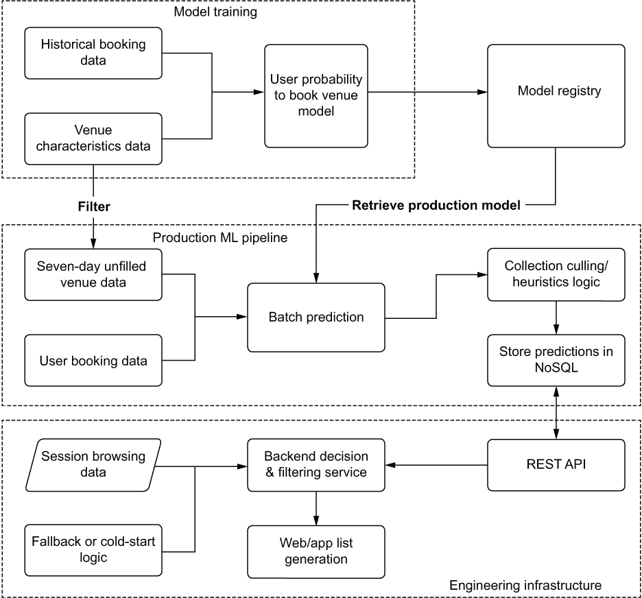

图 16.8 初始服务架构设计

初始阶段，在构建这个基础设施之后，QA 测试看起来很稳固。基于 NoSQL 的 REST API 的响应 SLA 表现良好，模型输出的批量预测和启发式逻辑在成本上进行了优化，备选逻辑故障转移工作得非常完美。团队准备开始通过 A/B 测试来测试这个解决方案。

不幸的是，测试组的预订率与控制组的预订率没有不同。在分析结果后，团队发现不到 5%的会话使用了预测，迫使剩余的 95%的页面显示使用备选逻辑（这与向控制组展示的数据相同）。哎呀。为了修复这种糟糕的性能，DS 团队决定专注于两个领域：

+   增加每个用户在每个地理区域内的预测数量

+   增加每个用户预测的区域数量以覆盖

这个解决方案极大地影响了他们的存储成本。他们本可以如何不同地做？图 16.9 显示了显著不同的架构，该架构可以解决这个问题，而无需在处理和存储上产生如此巨大的成本。

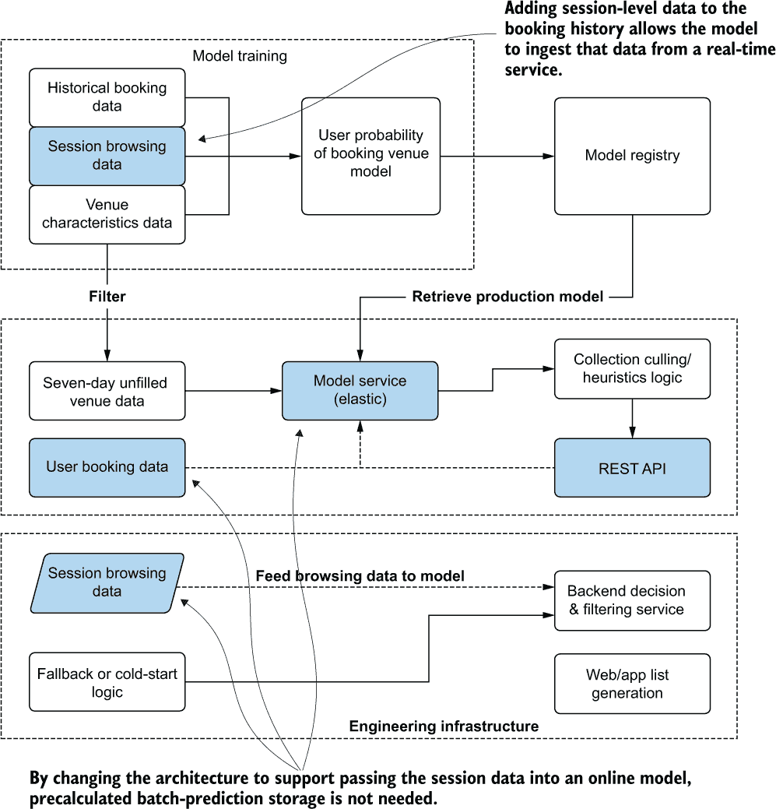

图 16.9 此用例的更具成本效益的架构

虽然这些变化既不微不足道，也不太可能受到 DS 团队或网站工程团队的热烈欢迎，但它们清楚地说明了为什么服务预测永远不应该是一个项目的后续考虑。为了有效地提供价值，应在项目初期评估服务架构开发的几个考虑因素。接下来的小节将涵盖这些考虑因素以及满足这些场景所需的架构类型。

### 16.3.1 确定服务需求

在我们的性能场景中，团队最初未能设计出一个完全支持项目需求的服务架构。进行这一选择并非易事，但通过对项目几个关键特征的彻底评估，可以采用适当的服务范式，以实现预测的理想交付方法。

当评估项目需求时，考虑以下正在解决的问题的特征非常重要，以确保服务设计既不过度设计也不过度简化。

这听起来像是一个开发者问题，而不是“我的问题”

可能看起来最好是让软件工程团队来担心如何利用模型工件。毕竟（在大多数情况下），他们在软件开发方面比数据科学团队更擅长，并且接触到了更多适用于机器学习领域的工具和实现技术。

在我的经验中，我从未在将模型“踢过墙”给另一个团队方面取得过太多成功。根据用例，数据操作需求（那些需要特定包或其他对数据科学领域高度专业的算法）、预测后的启发式需求以及工件更新速度可能对开发者来说具有挑战性，难以整合。没有与生产基础设施开发团队的紧密协作，部署一个与现有系统集成服务的尝试可能是一次令人沮丧的练习，并且会产生大量的技术债务。

大多数时候，在与开发团队讨论项目的集成需求后，我们发现了一些巧妙的方法来存储预测，在大量规模上操作数据，并在最低成本下满足项目 SLA 需求的设计上进行协作。如果没有数据科学团队对模型所做之事的反馈，开发团队将无法为优化架构决策做好准备。同样，如果没有开发团队的指导和协作，数据科学团队可能创建的解决方案不符合 SLA 需求，或者成本过高，无法长期运行。

在评估服务架构时，协作至关重要；很多时候，这种协作有助于告知机器学习解决方案输出结构的设计。最好在项目设计阶段早期就涉及模型的“工程消费者”。他们越早参与项目（数据工程师对于批量批量预测解决方案，软件工程师对于实时服务解决方案），他们就能对如何构建解决方案的决策产生越多的积极影响。

SLA

在我们场景的早期，团队的原意是确保他们的预测不会打断最终用户的 APP 体验。他们的设计包括一组预先计算的推荐，存储在一个超低延迟的存储系统中，以消除他们假设运行基于虚拟机的模型服务所涉及的时间负担。

SLA 考虑因素是机器学习架构设计中服务于用户的最重要方面之一。一般来说，构建的解决方案必须考虑服务延迟的预算，并确保在大多数时间里，这个预算不会被延长或违反。无论模型在预测准确度或效能方面表现得多么出色，如果它不能在分配的时间内被使用或消费，那么它就是无价值的。

需要与 SLA 要求平衡的其他考虑因素是实际的货币预算。作为基础设施复杂性的函数，一般规则是，预测可以以更大的请求规模更快地提供服务，解决方案托管和开发的成本就会更高。

成本

图 16.10 显示了预测新鲜度（预测做出后多长时间打算使用或采取行动）与需要做出的预测量之间的关系，这作为成本和复杂性的因素。

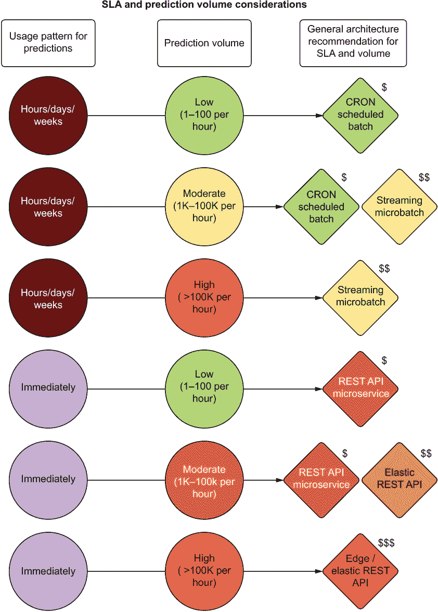

图 16.10 满足 SLA 和预测量需求时的架构影响

图 16.10 的上半部分展示了一个传统的批处理服务范式。对于极大规模的生产推理量，使用 Apache Spark Structured Streaming 在“触发一次”操作中进行的批预测作业可能是最经济的选项。

图 16.10 的下半部分涉及即时使用的 ML 解决方案。当预测打算用于实时界面时，架构开始从受批处理启发的用例发生重大变化。随着预测量的增加，需要 REST API 接口、服务容器的弹性可伸缩性和对这些服务的流量分配。

近期性

*近期性*，即特征数据生成与预测可以采取行动之间的延迟，是设计项目模型服务范式最重要的方面之一。SLA（服务等级协议）的考虑因素在很大程度上是选择特定服务层架构的 ML 项目的定义特征。然而，与可用于预测的数据的近期性相关的边缘情况可能会修改项目最终采用的最终可扩展和成本效益的设计。

根据具体情况，数据的近期性和项目的最终用例可能会覆盖基于 SLA 的一般设计标准。图 16.11 展示了一系列数据近期性和消费层模式示例，以说明架构如何从图 16.10 中纯粹基于 SLA 的设计转变为。

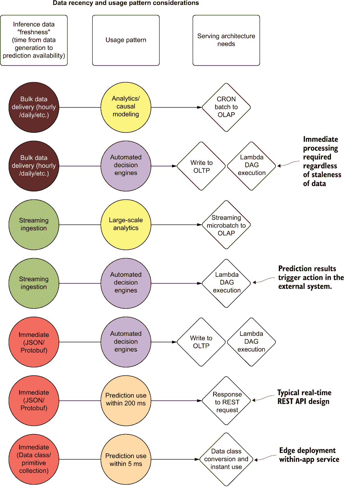

图 16.11 数据近期性和常见使用模式对服务架构的影响

这些例子绝对不是详尽的。在为模型预测提供服务时，边缘情况考虑的多样性不亚于用机器学习解决问题的细微方法。目的是通过评估传入数据的特点、确定项目的需求，并寻求尽可能简单的解决方案来满足项目的限制，从而开启关于哪种服务解决方案是合适的讨论。通过考虑项目服务需求的各个方面（数据的新鲜度、服务级别协议需求、预测量以及预测消费模式），可以利用适当的架构来满足使用模式需求，同时遵守一个既不复杂也不昂贵的原则。

但我们为什么不为所有东西都构建实时服务呢？

围绕一种适合所有情况的模式简化机器学习部署可能很有吸引力。对于一些组织来说，以这种方式减少机器学习工程复杂性可能是有意义的（例如，在 Kubernetes 中提供一切服务）。当然，如果每个项目只需要使用某种形式的框架，该框架支持单一的部署策略，这似乎会更容易。

如果您的公司只有一种机器学习用例，这确实是有道理的。如果您的公司所做的只是代表小型公司进行欺诈预测，那么坚持使用 Seldon 和 Kubernetes 来为所有模型提供 REST API 端点可能是有意义的。如果您专注于基于异步但低流量量的模型进行市场定价优化，那么一个运行简单 Flask 服务器的 Docker 容器将非常适合。

尽管大多数公司并没有只关注单一机器学习用例，但许多公司的内部用例将受益于简单的批量预测，这些预测被写入数据库中的表。大多数团队都有需求，可以通过一些用例的简单（且更便宜！）基础设施来解决，这些用例不需要启动一个每秒可以支持数十万请求的虚拟机集群。对于每天最多查询几十次的情况使用如此先进的基础设施是浪费的（在开发时间、维护和金钱上），并且是疏忽的。

对于机器学习解决方案的长期成功来说，选择一个适合消费模式、数据量大小和交付时间保证的架构至关重要。这并不意味着为了以防万一而过度设计，而是选择满足您项目需求的适当解决方案。不多也不少，当然，更不能更多。

当机器学习项目的输出旨在公司内部使用时，架构负担通常远低于其他任何场景。然而，这并不意味着可以走捷径。使用 MLOps 工具、遵循稳健的数据管理流程和编写可维护的代码在这里与其他任何服务范式一样至关重要。内部用例建模工作可以划分为两大类：批量预计算和轻量级临时微服务。

从数据库或数据仓库中提供服务

旨在工作日内使用的预测通常利用批量预测范式。模型应用于工作日开始前到达的新数据，预测写入表格（通常以覆盖模式），公司内部最终用户可以临时使用这些预测。

无论接口方法（BI 工具、SQL、内部 GUI 等）如何，预测都安排在固定时间（每小时、每天、每周等）进行，DS 团队唯一的基础设施负担是确保预测得以生成并到达表格。图 16.12 展示了支持这种实现的示例架构。

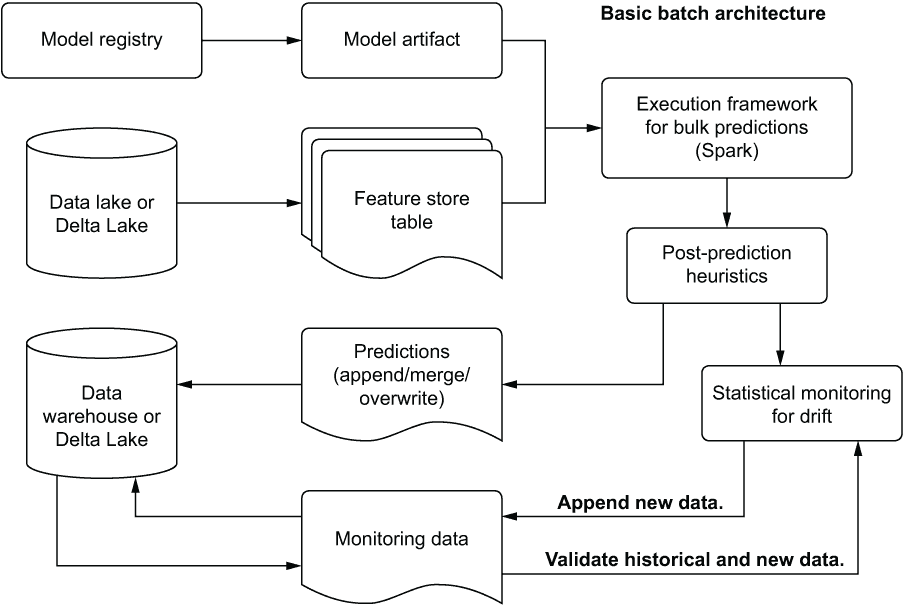

图 16.12 批量服务通用架构

这种架构是机器学习可以得到的最为简化的解决方案。从注册表中检索训练好的模型，从源系统（最好是特征存储表）查询数据，进行预测，执行漂移监控验证，最后将预测数据写入可访问的位置。对于需要大量预测数据的内部用例，从基础设施角度来看，不需要更多要求。

从微服务框架中提供服务

对于那些基于临时需求依赖更及时预测的内部用例，或者允许用户指定特征向量以接收按需预测（例如优化模拟）的用例，预计算不是一种选择。这种范式专注于拥有一个轻量级的服务层来托管模型，提供一个简单的 REST API 接口以接收数据、生成预测并将预测返回给最终用户。

大多数满足这些要求的实现都是通过 BI 工具和内部 GUI 完成的。图 16.13 展示了支持这种架构设置的示例，以支持临时预测。

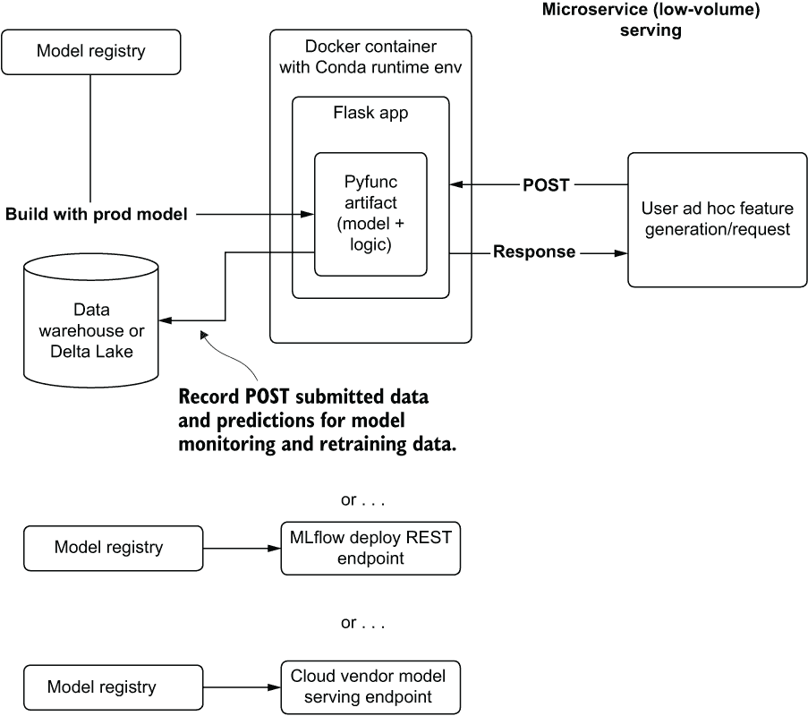

图 16.13 轻量级低容量 REST 微服务架构

这种部署风格的简单性对许多用于内部应用场景的模型服务的用例具有吸引力。能够支持每秒数十个请求，轻量级的 Flask 模型部署可以是一个吸引人的替代方案，用于可能的最终用户预测排列的大规模暴力计算。

没错，我们知道团队

对于内部使用项目来说，走捷径可能相当诱人。也许记录被动的再训练历史对于内部项目来说似乎是过度杀鸡用牛刀。可能有人会诱人地将代码库发送给一个设计糟糕、缺乏适当重构（如果用于面向客户的模型则会进行重构）的计划任务。花费额外的时间优化数据存储设计以支持最终用户查询性能可能看起来是浪费时间。

最后，他们都是同事。如果它不能完美工作，他们会理解的，对吧？

没有什么比这更远离真相了。根据我的经验，公司对数据科学团队的集体认知是基于这些内部用例项目。数据科学团队感知的能力、容量和竞争力直接受到这些内部工具在公司内部用户中工作效果的影响。以与客户使用解决方案相同的工程严谨性和纪律性构建这些解决方案至关重要。你的声誉就悬于一线，而你可能没有意识到这一点。

在内部项目中，感知能力变得重要，原因无他，这些内部团队将需要你的团队参与未来的项目。如果这些团队认为数据科学团队为他们提供的解决方案是破损的、不稳定的和有缺陷的，那么他们希望你的团队参与面向客户的项目的可能性几乎为零。

毕竟，你们都是公司内部的同事。确保你的主要客户——业务部门——对你交付稳定和有用解决方案的能力有信心，你会做得很好。

### 16.3.2 批量外部交付

批量外部交付的考虑因素与内部使用数据库或数据仓库的服务没有实质性区别。这些服务案例之间的唯一实质性差异在于交付时间和预测的监控。

交付一致性

将结果批量交付给外部方的相关要求与其他任何机器学习解决方案相同。无论你是为内部团队构建东西还是生成面向最终用户客户的预测，创建有用预测的目标不会改变。

与其他服务范例相比，向外部组织（通常适用于 B2B 公司）提供大量预测时发生变化的唯一一件事是交付的及时性。虽然显然未能完全交付大量预测的摘要是坏事，但不一致的交付同样有害。然而，有一个简单的解决方案，如图 16.14 的底部部分所示。

图 16.14 显示了对外部用户组进行门控和非门控服务的比较。通过控制计划批量预测作业中存储预测的最终阶段出口，以及将特征生成逻辑与受特征存储管理的 ETL 过程耦合，可以从时间角度保证交付的一致性。虽然从生成预测的团队的 DS 角度来看，这可能不是一个重要的考虑因素，但具有可预测的数据可用性计划可以显著提高服务公司的专业形象。

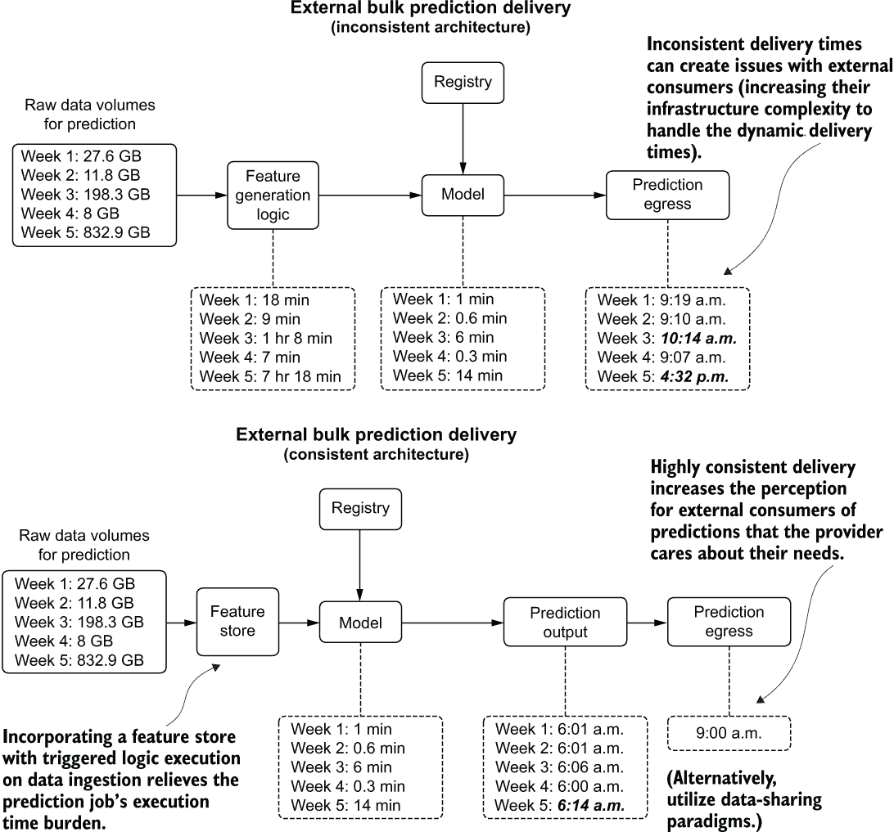

图 16.14 未加门控与加门控批量服务的比较

质量保证

在公司数据科学和数据分析团队外部（即公司 DS 和数据分析团队外部）提供大量预测服务时，一个有时被忽视的方面是确保对这些预测进行彻底的质量检查。

一个内部项目可能依赖于对明显的预测失败的简单检查（例如，忽略导致空值的静默失败，或线性模型预测无穷大）。当将数据产品发送到外部时，应采取额外步骤以最大限度地减少预测的最终用户对其提出异议的机会。由于我们人类在寻找模式中的异常方面非常擅长，因此批量交付的预测数据集中的一些少量问题很容易引起数据消费者的关注，从而降低他们对解决方案有效性的信心，甚至导致其不再使用。

在我的经验中，当向数据专家团队外部交付大量预测时，我在发布数据之前进行了一些检查是值得的：

+   将预测与训练数据进行验证：

    +   *分类问题*—比较聚合的类别计数

    +   *回归问题*—比较预测分布

    +   *无监督问题*—评估组成员计数

+   检查预测异常值（适用于回归问题）。

+   基于知识渊博的领域专家的知识（如果适用）建立启发式规则，以确保预测不会超出主题的可能性范围。

+   验证传入的特征（尤其是可能使用通用捕获所有编码的编码特征，如果编码键之前未见）以确保数据与训练时的模型完全兼容。

通过在批量预测的输出上运行一些额外的验证步骤，可以在最终产品面前避免大量的困惑和信任度降低的可能性。

### 16.3.3 微批量流式处理

流式预测范式的应用相当有限。无法满足严格的 SLA 要求，这会迫使决策者利用 REST API 服务，以及对于小规模批量预测需求来说过于冗余，流式预测在机器学习服务基础设施中占据一个独特的空间。这个细分市场位置牢牢地集中在项目对相对较高的 SLA（以秒到周的范围衡量）和大型推理数据集大小的需求上。

流式处理对高 SLA 需求的吸引力在于成本和复杂性的降低。而不是构建一个可扩展的基础设施来支持发送到 REST API 服务（或类似微服务，能够执行分页批量预测大数据）的大批量预测，可以配置一个简单的 Apache Spark 结构化流式处理作业，允许从流式源（如 Kafka 或云对象存储队列索引）中提取基于行的数据，并使用序列化模型工件在流上本地运行预测。这有助于显著降低复杂性，可以支持流式批处理状态计算，并防止在不需要进行预测时运行昂贵的硬件。

从大数据量的角度来看，流式处理可以减少在传统批量预测范式下进行大数据集预测所需的底层基础设施规模。通过将数据流经一个比在内存中保留整个数据集所需的机器集群规模更小的集群，基础设施负担大大减轻。

这直接转化为具有相对较高服务级别协议（SLA）的机器学习解决方案的总拥有成本降低。图 16.15 展示了简单结构化流式处理方法，以比传统批量或 REST API 解决方案更低的复杂性和成本提供预测。

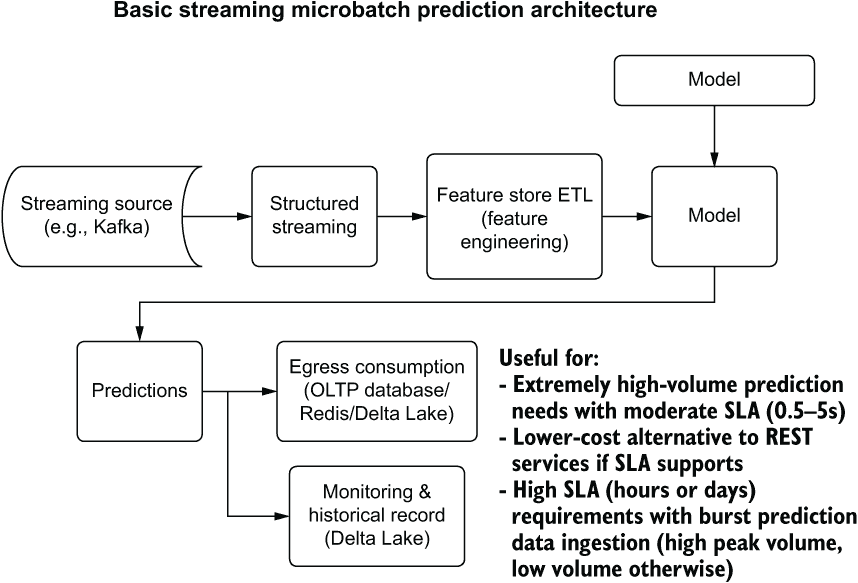

图 16.15 简单结构化流式处理预测管道架构

虽然不能解决机器学习服务的大部分需求，但这种架构在处理极大数据集和当 SLA 不是特别严格时，作为批量预测的吸引人替代品仍有其位置。如果适合这个细分市场，实施这种服务方法还是值得的，仅仅是因为成本的降低。

### 16.3.4 实时服务器端

实时服务的主要特征是低 SLA。这直接影响了服务预测的基本架构设计。支持此范式的任何系统都需要托管模型工件作为服务，并配有一个接口用于接受传入的数据，一个计算引擎用于执行预测，以及一个方法将预测返回给原始请求者。

实时服务架构实现的细节可以通过对流量级别的分类来定义，分为三个主要分组：低流量、低流量带突发容量和高流量。每个都需要不同的基础设施设计和工具实现，以实现高可用性和最小成本解决方案。

低流量

低流量（低速率请求）的一般架构与 REST 微服务容器架构没有不同。无论使用什么 REST 服务器，使用什么容器服务运行应用程序，还是使用什么虚拟机管理套件，对外部端点的主要补充只是确保 REST 服务运行在管理硬件上。这并不一定意味着需要使用完全管理的云服务，但对于即使是低流量的生产服务，系统也需要保持运行。

运行你构建的容器的这个基础设施不仅应该从机器学习的角度进行监控，还应该从性能考虑进行监控。托管虚拟机上的容器内存利用率、CPU 利用率、网络延迟以及请求失败和重试都应该实时监控，并且要有冗余备份，以便在满足服务请求时出现问题时进行故障转移。

在低流量解决方案（每分钟数到数千个请求）中，流量路由的可扩展性和复杂性不会成为问题，只要项目的 SLA 要求得到满足，因此对于低流量用例，需要更简单的部署和监控架构。

突发流量和高流量

当迁移到支持突发流量的规模时，将弹性集成到服务层是架构中的一个关键补充。由于单个虚拟机只有有限的线程来处理预测，因此对于预测的请求洪水，如果超过了单个虚拟机的执行能力，可能会使该虚拟机过载。无响应、REST 超时和虚拟机不稳定（可能崩溃）可能会使单个虚拟机模型部署不可用。处理突发流量和高容量服务的方法是在弹性负载均衡中结合进程隔离和路由。

负载均衡，正如其名所示，是一种在分片虚拟机群（模型服务应用的重复容器）中路由请求的方法。由于许多容器并行运行，请求负载可以水平扩展以支持真正惊人的请求量。这些服务（每个云都有自己的风味，本质上做的是同样的事情）对部署容器的机器学习团队和最终用户都是透明的。由于有一个请求进入的单一点端和一个构建和部署的单个容器镜像，负载均衡系统将确保负载分布是自动发生的，以防止服务中断和不稳定。

图 16.16 展示了利用云无关服务的一个常见设计模式。通过使用一个简单的 Python REST 框架（Flask），该框架与容器内的模型工件接口，可以实现可扩展的预测，从而支持高流量和突发流量需求。

这个相对简单的架构是一个弹性扩展的基于 REST 的实时服务的基本模板，用于提供预测。图中缺少的是我们在前几章中讨论的其他关键组件（特征监控、重新训练触发器、A/B 测试和模型版本控制），但它具有区分较小规模的实时系统与能够处理大量流量的服务的基本组件。

在核心上，图 16.16 中所示的负载均衡器使得系统可以从单个虚拟机的可用核心限制（在 Flask 前面放置 Gunicorn 将允许虚拟机的所有核心同时处理请求）扩展到水平扩展以处理数百个并发预测（或更多）。然而，这种可扩展性也伴随着一个警告。添加此功能意味着服务解决方案的复杂性和成本都会增加。

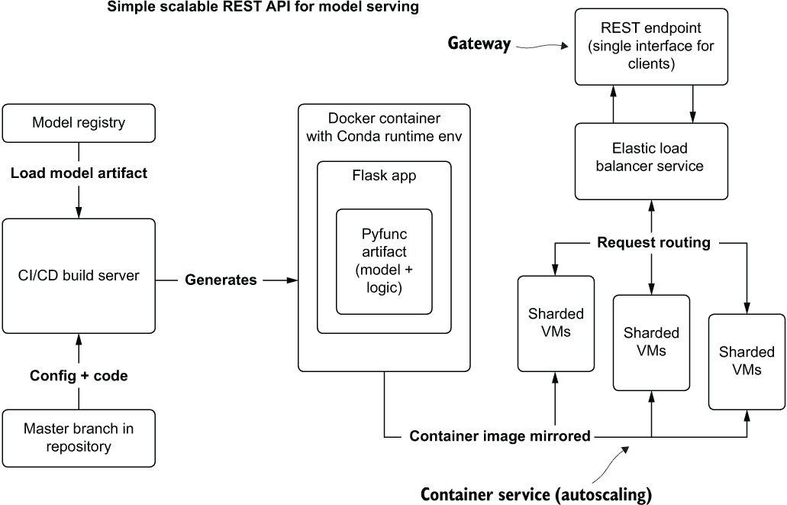

图 16.16 云原生 REST API 模型服务架构

图 16.17 展示了大规模 REST API 解决方案的更详细设计。这种架构可以支持极高的预测流量速率，以及所有需要编排以实现生产部署的流量、服务级别协议（SLA）和数据分析用例。

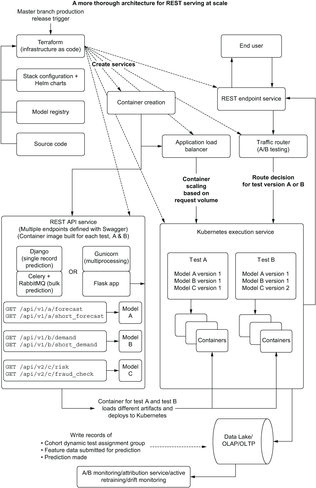

图 16.17 大规模 REST API 模型服务自动化的基础设施和服务

这些系统有很多组件。复杂性很容易增长到几十个不同的系统被粘合在一起形成一个应用堆栈，以满足项目用例的需求。因此，向对构建需要这种架构的解决方案感兴趣的业务部门解释支持这些系统的复杂性以及成本至关重要。

通常，由于这种复杂性的程度，这不是一个数据科学团队可以独立维护的设置。DevOps、核心工程、后端开发人员和软件架构师都参与此类服务的架构、部署和维护。云服务账单是考虑总拥有成本的一个因素，但另一个突出的因素是保持此类服务持续运行所需的人力资本投资。

如果您的 SLA 要求和规模如此复杂，那么在项目早期就识别这些需求是明智的，诚实地评估投资，并确保业务理解这项工作的规模。如果他们认为投资是值得的，那么就继续构建。然而，如果设计并构建这些庞然大物对业务领导来说是令人畏惧的，那么最好不要在项目开发后期强迫他们允许这样做，那时已经投入了大量的时间和精力。

### 16.3.5 集成模型（边缘部署）

*边缘* *部署* 是某些用例中低延迟服务的高级阶段。因为它将模型工件和所有依赖库作为容器镜像的一部分进行部署，它具有超过任何其他方法的可扩展性级别。然而，这种部署范式给应用程序开发者带来了很大的负担：

+   新模型或重新训练的模型的部署需要与应用程序部署和升级一起安排。

+   监控预测和生成的特征依赖于互联网连接。

+   预测的启发式或最后一英里校正不能在服务器端完成。

+   在服务容器内的模型和基础设施需要更深入和更复杂的集成测试，以确保其正常功能。

+   设备能力可以限制模型复杂性，迫使采用更简单、更轻量级的建模解决方案。

由于这些原因，边缘部署对于许多用例可能并不很有吸引力。模型变化的速率非常低，模型漂移的影响可以使边缘部署的模型比新构建的模型更快地变得不相关，而且某些最终用户缺乏监控可能导致这种范式在大多数项目中无法应用。对于那些不受边缘部署的负面影响的人，这种服务风格的典型架构如图 16.18 所示。

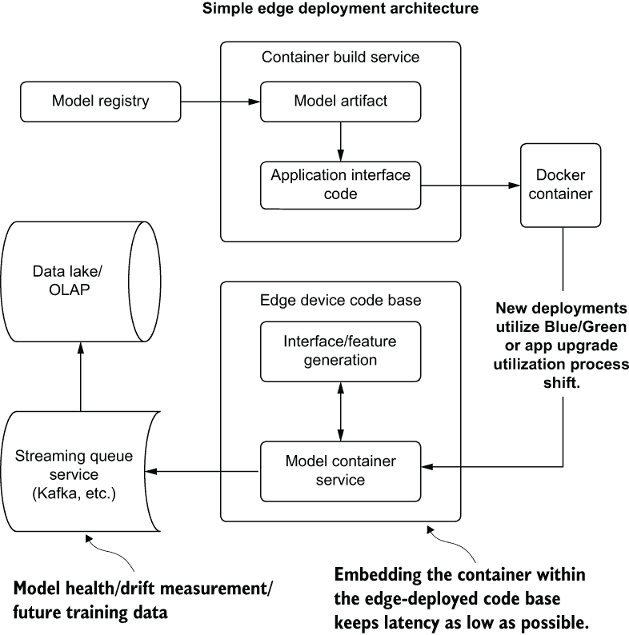

图 16.18 边缘部署模型工件容器的简化架构

如您所见，边缘部署与应用程序代码库紧密耦合。由于运行时需要大量打包的库来支持包含模型所做的预测，容器化工件阻止了应用程序开发团队维护与 DS 团队环境相匹配的环境。这可以减轻许多可能困扰基于容器模型边缘部署的问题（即环境依赖管理、语言选择标准化和共享代码库中功能库的同步）。

可以利用边缘部署的项目，尤其是那些专注于图像分类等任务的，可以显著降低基础设施成本。能够符合边缘部署的条件是模型所利用的特征的稳定性状态。如果模型输入数据的函数性质不会特别频繁地变化（例如，在成像用例中），边缘部署可以极大地简化基础设施，并将机器学习解决方案的总拥有成本保持在极低水平。

## 摘要

+   模型注册服务将有助于确保已部署和存档模型的有效状态管理，从而实现无需人工干预的有效被动重新训练和主动重新训练解决方案。

+   特征存储将特征生成逻辑与建模代码分离，从而允许更快地重新训练过程，跨项目复用特征，以及一种远更简单的监控特征漂移的方法。

+   为了选择一个合适的架构用于服务，我们必须权衡项目的许多特性：采用适当的服务和基础设施水平以支持所需的 SLA、预测量和数据的时效性，以确保预测服务具有成本效益且稳定。
