# 附录 A. 大 O(no)以及如何考虑运行性能

对于机器学习用例，运行时间复杂度与其他任何软件没有区别。不高效和优化不良的代码对机器学习任务中的处理任务的影响与对任何其他工程项目的影响相同。唯一将机器学习任务与传统软件区分开来的实质性差异在于解决问题的算法。这些算法的计算和空间复杂度通常被封装递归迭代的通用 API 所掩盖，这可能会显著增加运行时间。

本附录的目的是专注于理解*控制代码*（项目中所有不涉及训练模型的代码）的运行特性以及正在训练的机器学习算法本身。

## A.1 什么是大 O？

假设我们正在开发一个即将投入生产的项目的项目。结果是令人瞩目的，为该项目构建的业务单元对归因结果感到满意。然而，并非所有人都满意。运行解决方案的成本非常高。

在我们逐步通过代码的过程中，我们发现大部分执行时间都集中在我们的特征工程预处理阶段。代码的某个特定部分似乎比我们最初预期的要花费更长的时间。根据以下列表中的初始测试，我们原本认为这个函数不会造成太大问题。

列表 A.1 嵌套循环名称协调示例

```
import nltk
import pandas as pd
import numpy as np
client_names = ['Rover', 'ArtooDogTwo', 'Willy', 'Hodor', 
  'MrWiggleBottoms', ‘SallyMcBarksALot', 'HungryGames', 
  'MegaBite', 'HamletAndCheese', 'HoundJamesHound', 
  'Treatzilla', 'SlipperAssassin', 'Chewbarka', 
  'SirShedsALot', 'Spot', 'BillyGoat', 'Thunder', 
  'Doggo', 'TreatHunter']                                      ❶
extracted_names = ['Slipr Assassin', 'Are two dog two', 
  'willy', 'willie', 'hodr', 'hodor', 'treat zilla', 
  'roover', 'megbyte', 'sport', 'spotty', 'billygaot', 
  'billy goat', 'thunder', 'thunda', 'sirshedlot', 
  'chew bark', 'hungry games', 'ham and cheese', 
  'mr wiggle bottom', 'sally barks a lot']                     ❷
def lower_strip(string): return string.lower().replace(" ", "")
def get_closest_match(registered_names, extracted_names):
    scores = {}
    for i in registered_names:                                 ❸
        for j in extracted_names:                              ❹
            scores['{}_{}'.format(i, j)] = nltk.edit_distance(lower_strip(i), 
       lower_strip(j))                                         ❺
    parsed = {}
    for k, v in scores.items():                                ❻
        k1, k2 = k.split('_')
        low_value = parsed.get(k2)
        if low_value is not None and (v < low_value[1]):
            parsed[k2] = (k1, v)
        elif low_value is None:
            parsed[k2] = (k1, v)
    return parsed
get_closest_match(client_names, extracted_names)               ❼
>> {'Slipr Assassin': ('SlipperAssassin', 2), 
    'Are two dog two': ('ArtooDogTwo', 2),
    'willy': ('Willy', 0), 
    'willie': ('Willy', 2), 
    'hodr': ('Hodor', 1),
    'hodor': ('Hodor', 0), 
    'treat zilla': ('Treatzilla', 0), 
    'roover': ('Rover', 1),
    'megbyte': ('MegaBite', 2), 
    'sport': ('Spot', 1), 
    'spotty': ('Spot', 2),
    'billygaot': ('BillyGoat', 2), 
    'billy goat': ('BillyGoat', 0),
    'thunder': ('Thunder', 0), 
    'thunda': ('Thunder', 2), 
    'sirshedlot': ('SirShedsALot', 2),
    'chew bark': ('Chewbarka', 1), 
    'hungry games': ('HungryGames', 0),
    'ham and cheese': ('HamletAndCheese', 3), 
    'mr wiggle bottom': ('MrWiggleBottoms', 1),
    'sally barks a lot': ('SallyMcBarksALot', 2)}              ❽
```

❶ 我们数据库中狗的注册名称列表（小样本）

❷ 来自我们客户的人类从自由文本字段评分中解析的名称

❸ 遍历我们所有的注册名称

❹ O(n²)嵌套循环，遍历每个解析名称

❺ 计算去除空格并在两个字符串上强制转换为小写后的名称之间的 Levenshtein 距离

❻ 遍历成对距离测量以返回每个解析名称的最可能匹配项。这是 O(n)。

❼ 对注册名称列表和解析名称列表运行算法

❽ 通过 Levenshtein 距离找到的最近匹配结果

在用于验证和开发的较小数据集上，执行时间以毫秒计。然而，当针对我们包含 500 万注册狗和 1000 亿名称参考提取的完整数据集运行时，我们数据中的狗太多，无法运行此算法。（是的，可能会有太多狗的情况，信不信由你。）

原因是此算法的计算复杂度为 O(*n*²)。对于每个注册名称，我们正在测试其与每个名称提取的距离，如图 A.1 所示。

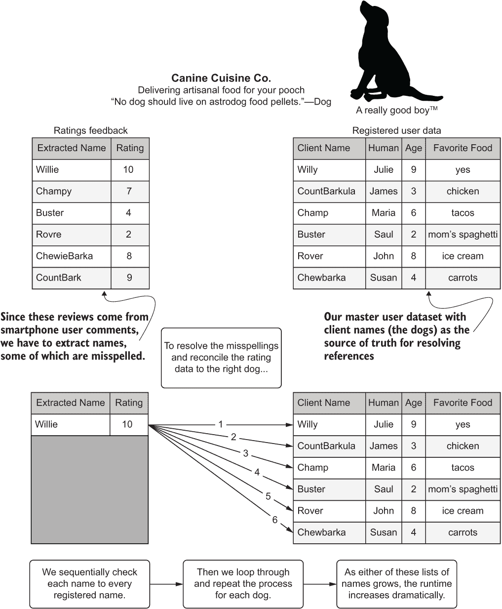

图 A.1 我们特征工程的计算复杂度

以下列表展示了减少循环搜索的另一种方法。

列表 A.2 一种稍微好一点的方法（但仍不完美）

```
JOIN_KEY = 'joinkey'
CLIENT_NM = 'client_names'
EXTRACT_NM = 'extracted_names'
DISTANCE_NM = 'levenshtein'

def dataframe_reconciliation(registered_names, extracted_names, threshold=10):
    C_NAME_RAW = CLIENT_NM + '_raw'
    E_NAME_RAW = EXTRACT_NM + '_raw'
    registered_df = pd.DataFrame(registered_names, columns=[CLIENT_NM])     ❶
    registered_df[JOIN_KEY] = 0                                             ❷
    registered_df[C_NAME_RAW] = registered_df[CLIENT_NM].map(lambda x: lower_strip(x))                                                        ❸
    extracted_df = pd.DataFrame(extracted_names, columns=[EXTRACT_NM])
    extracted_df[JOIN_KEY] = 0                                              ❹
    extracted_df[E_NAME_RAW] = extracted_df[EXTRACT_NM].map(lambda x: lower_strip(x))
    joined_df = registered_df.merge(extracted_df, on=JOIN_KEY, how='outer') ❺
    joined_df[DISTANCE_NM] = joined_df.loc[:, [C_NAME_RAW, E_NAME_RAW]].apply(
        lambda x: nltk.edit_distance(*x), axis=1)                           ❻
    joined_df = joined_df.drop(JOIN_KEY, axis=1)
    filtered = joined_df[joined_df[DISTANCE_NM] < threshold]                ❼
    filtered = filtered.sort_values(DISTANCE_NM).groupby(EXTRACT_NM, as_index=False).first()                                                ❽
    return filtered.drop([C_NAME_RAW, E_NAME_RAW], axis=1)
```

❶ 从客户端名称列表创建 pandas DataFrame

❷ 生成静态连接键以支持我们将要执行的笛卡尔连接

❸ 清理名称，以便我们的 Levenshtein 计算尽可能准确（在列表 A.1 中定义的函数）

❹ 在右侧表中生成相同的静态连接键以实现笛卡尔连接

❺ 执行笛卡尔连接（空间复杂度为 O(n²)）

❻ 通过使用非常有用的 NLTK 包计算 Levenshtein 距离

❽ 从 DataFrame 中移除任何潜在的非匹配项

❽ 返回具有最低 Levenshtein 距离得分的每个潜在匹配键的行

注意：如果您对 NLTK 包及其在 Python 中为自然语言处理所能做的所有奇妙事情感兴趣，我强烈建议您阅读 Steven Bird、Ewan Klein 和 Edward Loper 所著的《Python 自然语言处理》（O’Reilly，2009 年），他们是开源项目的原始作者。

利用这种 DataFrame 方法可以显著加快运行时间。列表 A.2 不是一个完美的解决方案，因为空间复杂度会增加，但以这种方式重构可以显著减少项目的运行时间并降低成本。图 A.2 显示了调用列表 A.2 中定义的函数的结果。

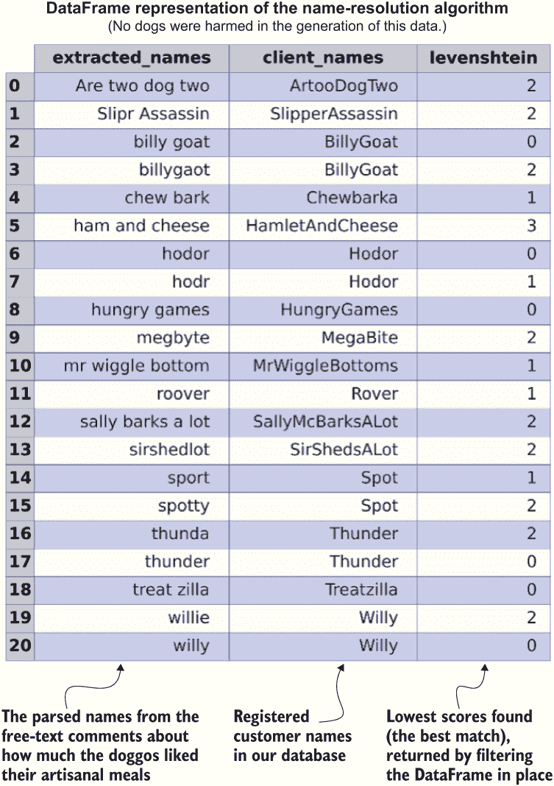

图 A.2 以空间复杂性的代价降低计算复杂度

关于这个示例的重要事情是要记住可扩展性是相对的。在这里，我们是在计算复杂性和空间复杂性之间进行权衡：我们最初是顺序遍历两个数组，这需要很长时间，但内存占用非常低；然后，使用 pandas 的矩阵结构要快得多，但需要大量的 RAM。在实际操作中，考虑到这里涉及的数据量，最佳解决方案是在循环处理（最好在 Spark `DataFrame`中）的同时，分块利用笛卡尔连接来找到计算和空间压力之间的良好平衡。

优化性能和成本

大多数代码库重构是为了提高其可测试性和可扩展性。但在机器学习代码库中，一个常见的活动是提高运行时效率。这通常更多地关注模型的训练和再训练，而不是机器学习的预测方面，但涉及的工作中包含着极其复杂的特征工程。很多时候，机器学习项目中代码性能不佳的根本原因在于特征处理和控制逻辑，而不是模型（s）的训练（除非是广泛的超参数调整，这可能会主导总运行时间）。

主要由于这些工作的长时间运行特性，识别和优化运行时性能可以对机器学习解决方案的总拥有成本产生重大影响。然而，为了有效地优化，分析计算复杂度（影响总运行时间）和空间复杂度（影响运行代码所需的机器大小或数量）是至关重要的。

从实用和理论的角度来看，运行时问题的分析是通过评估计算复杂度和空间复杂度来处理的，简称为*大 O*。

### A.1.1 复杂度的温和介绍

*计算复杂度*本质上是对计算机执行算法所需时间的最坏情况估计。另一方面，*空间复杂度*是指算法可能对系统内存造成的最坏情况负担。

虽然计算复杂度通常影响 CPU，但空间复杂度涉及系统（RAM）中您需要处理的内存，以避免磁盘溢出（将分页到硬盘或固态硬盘）。图 A.3 显示了操作数据点集合时，根据所使用的算法，可以具有不同的空间和计算复杂度。

对数据集合执行的不同操作会影响所需的时间和空间复杂度。如图 A.3 从上到下移动时，不同操作的空间和计算复杂度都会增加。

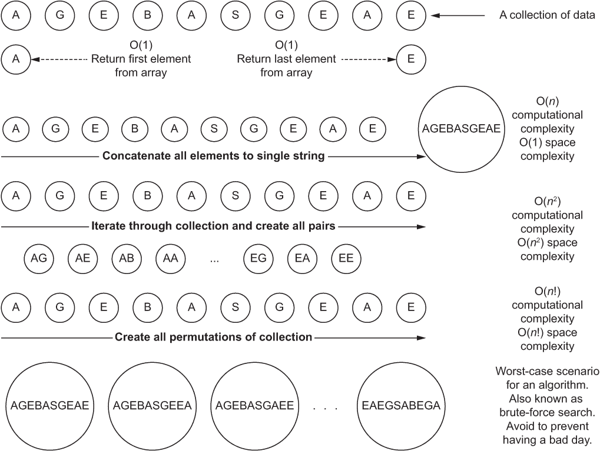

图 A.3 对操作数据集合的计算复杂性和空间复杂性的比较

在评估算法的复杂度时，考虑了许多其他复杂度作为标准。图 A.4 显示了这些标准评估在线性尺度上的情况，而图 A.5 则显示它们在对数 y 尺度上的情况，以说明其中一些应该避免到何种程度。

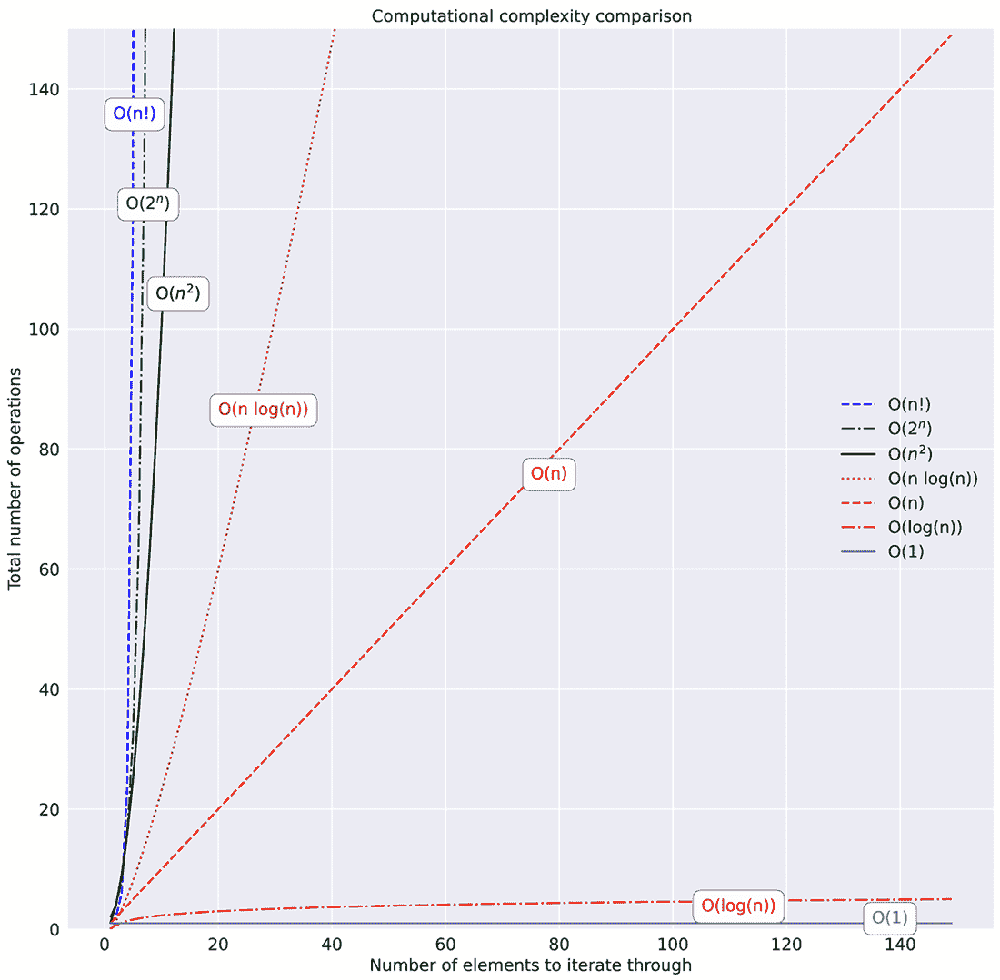

图 A.4 不同计算复杂度的线性 y 轴尺度，过滤到 150 次迭代

如图 A.4 和 A.5 所示，集合大小与算法类型之间的关系可以显著影响代码的运行时间。理解这些关系（包括空间和计算复杂度）在代码的非机器学习方面，即在模型训练和推理之外，是绝对必要的。

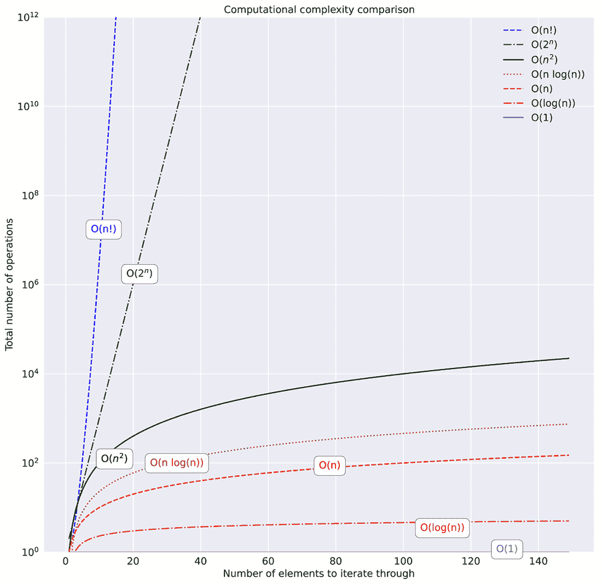

图 A.5 计算复杂度的对数 y 轴尺度。请注意图表顶部 y 轴的大小。指数和阶乘复杂度确实会带来痛苦。

让我们想象一下，在项目编排代码中实现如此简单的东西，如集合遍历的成本。如果我们试图以暴力方式评估两个数字数组之间的关系（以嵌套方式遍历每个数组），我们将面临 O(*n*²)的复杂度。如果我们通过优化的连接合并列表，我们可以显著降低复杂度。从 O(*n*²)这样的复杂度转移到接近 O(*n*)，如图 A.4 和 A.5 所示，在处理大型集合时，可以转化为显著的成本和时间节省。

## A.2 通过示例分析复杂度

分析代码以查找性能问题可能会令人畏惧。很多时候，我们如此专注于解决围绕特征工程、模型调整、指标评估和统计评估的所有细节，以至于评估我们如何迭代集合的概念并没有进入我们的脑海。

如果我们审视控制代码，这些代码指导着项目元素的执行，将它们的执行视为复杂性的一个因素，我们就能估计出将发生的相对运行时间效应。有了这些知识，我们可以解耦低效的操作（例如，可以折叠成单个索引遍历的过度嵌套循环语句），并帮助减轻运行我们代码的系统的 CPU 和内存负担。

现在你已经看到了大 O 理论，让我们看看一些使用这些算法的代码示例。能够看到集合中元素数量的差异如何影响操作的时间，对于完全理解这些概念非常重要。

我将以一种不太传统的方式介绍这些主题，以狗为例，然后展示代码示例来展示这些关系。为什么？因为狗很有趣。

### A.2.1 O(1)：不关心数据大小的“它的大小无关紧要”算法

让我们想象一下，我们身处一个房间。一个非常非常大的房间。房间的中心是一个食物碗的环形。为狗准备的。我们已经在这些碗里装了一些博洛尼亚面食。对于狗来说，这是一天痛苦的等待（整个过程中都在闻味），但我们已经把食物分装进了五个单独的碗里，并准备好了我们的笔记本来记录这个事件的数据。一切结束后（碗比倒面食之前干净），我们有了代表我们的狗小组采取的不同行动的有序列表集合。

当我们希望回答关于我们观察到的事实的问题时，我们正在操作这些列表，但检索与这些事件发生的顺序相关的单个索引值。无论这些列表的大小如何，O(1)类型的问题只是基于位置参考获取数据，因此，所有操作所需的时间相同。让我们看看图 A.6 中的这个场景。

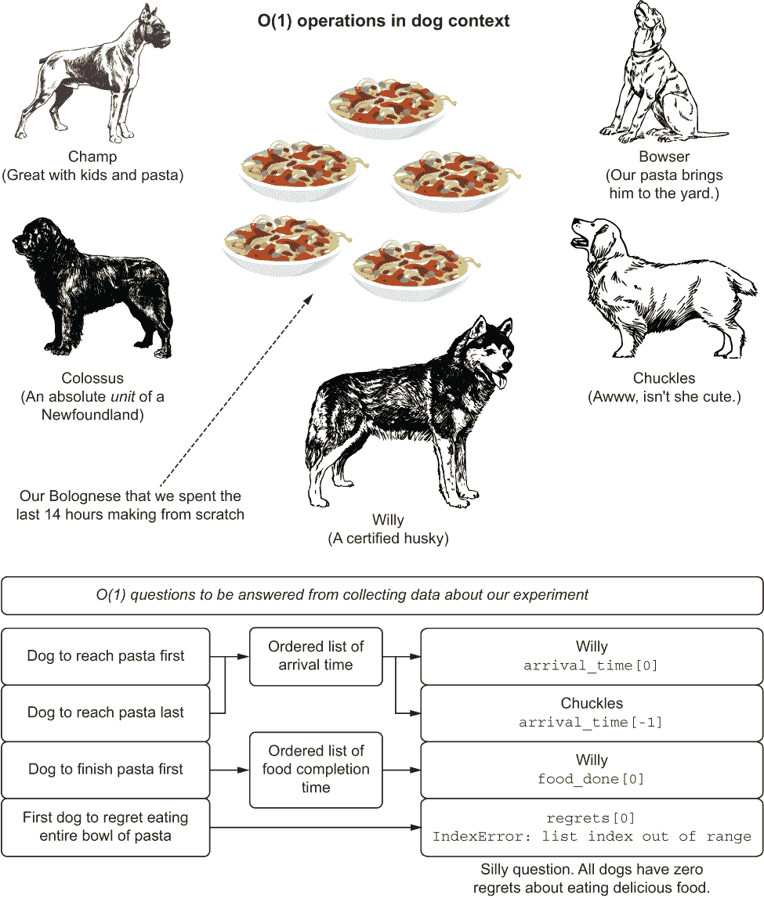

图 A.6 通过饥饿的狗实现 O(1)搜索

O(1)不关心数据有多大，如图 A.6 所示。这些算法以不遍历集合，而是访问集合中数据的位置的方式进行操作。

为了在计算意义上展示这种关系，列表 A.3 展示了在两个不同大小的数据集上执行 O(1)任务的比较——具有相似的运行时性能。

列表 A.3 O(1)复杂性的演示

```
import numpy as np
sequential_array = np.arange(-100, 100, 1)                     ❶
%timeit -n 1000 -r 100 sequential_array[-1]                    ❷
>> 269 ns ± 52.1 ns per loop (mean ± std. dev. of 
100 runs, 10000 loops each)                                    ❸
massive_array = np.arange(-1e7, 1e7, 1)                        ❹
%timeit -n 10000 -r 100 massive_array[-1] 
>> 261 ns ± 49.7 ns per loop (mean ± std. dev. of 
100 runs, 10000 loops each)                                    ❺
def quadratic(x):                                              ❻
    return (0.00733 * math.pow(x, 3) -0.001166 * 
math.pow(x, 2) + 0.32 * x - 1.7334)
%timeit -n 10000 -r 100 quadratic(sequential_array[-1])        ❼
>> 5.31 µs ± 259 ns per loop (mean ± std. dev. of 100 runs, 10000 loops each)
%timeit -n 10000 -r 100 quadratic(massive_array[-1])           ❽
>> 1.55 µs ± 63.3 ns per loop (mean ± std. dev. of 100 runs, 10000 loops each)
```

❶ 生成介于-100 和 100 之间的整数数组

❷ 运行 100,000 次操作的迭代，以最小化每次运行的方差，从而查看访问速度

❸ 每次迭代的平均速度的绝对值高度依赖于代码运行的硬件。尽管如此，对于使用 8 核心笔记本电脑 CPU 的单个核心来说，269 纳秒已经非常快了。

❹ 生成一个比第一个稍大的数组

❺ 261 纳秒。即使有 100,000 倍的数据，执行时间也是相同的。

❻ 二次方程用于说明对单个值进行的数学运算

❼ 在数组中的单个值上执行 5.31 微秒

❽ 在数组中的单个值上执行 1.55 微秒（由于 NumPy 访问较大数组中的索引操作，比之前少）

第一个数组（`sequential_array`）长度仅为 200 个元素，从其索引的 c-based-struct 类型中检索元素的访问时间非常快。随着我们增加数组的大小（包含 200 万个元素的`massive_array`），位置检索的运行时间不会改变。这是由于数组的优化存储模式；我们可以通过索引注册表直接在常数 O(1)时间内查找元素的内存地址位置。

机器学习项目的控制代码有许多 O(1)复杂性的例子：

+   *获取排序、排名的聚合数据点的最后一个条目*——例如，从按发生时间排序的事件窗口函数中。然而，由于涉及排序，构建窗口聚合的过程通常是 O(*n* log *n*)。

+   *取模函数*——这表示除以另一个数后的余数，在收集遍历中的模式生成中很有用。（遍历将是 O(*n*）。）

+   *等价测试*——等于、大于、小于等等。

### A.2.2 O(n)：线性关系算法

如果我们想在特定时间点了解我们的犬类测试对象的状态怎么办？比如说，我们真的想找出他们狼吞虎咽食物的速度。假设我们决定在盛宴开始后的 30 秒收集数据，以查看每只狗的食物碗状态。

我们为每只狗收集的数据将涉及键值对。在 Python 中，我们将收集一个包含狗的名字和它们碗中剩余食物量的字典：

```
thirty_second_check = {'champ': 0.35, 'colossus': 0.65, 
    'willy': 0.0, 'bowser': 0.75, 'chuckles': 0.9}
```

这个操作，绕着走并估计碗中的剩余食物量，将其记录在这个（键，值）对中，将是 O(*n*)，如图 A.7 所示。

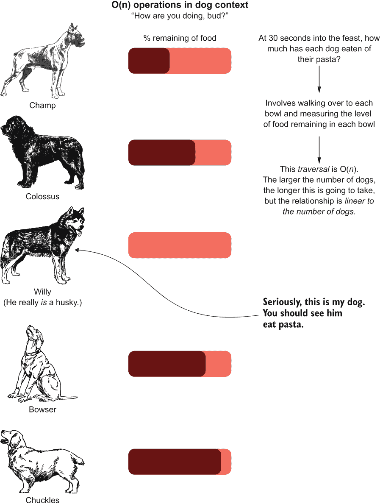

图 A.7 O(*n*)搜索所有狗的消耗率

如您所见，为了测量剩余量，我们需要绕到每只狗那里检查它们的碗的状态。对于我们展示的五只狗，这可能需要几秒钟。但如果我们有 500 只狗呢？那可能需要几分钟的时间来测量。O(*n*)表示算法（检查吃掉的博洛尼亚肉的数量）与数据大小（狗的数量）之间的线性关系，这是计算复杂度的反映。

从软件的角度来看，同样的关系也成立。列表 A.4 显示了列表 A.3 中定义的`quadratic()`方法的迭代使用，在该列表中操作每个元素。随着数组大小的增加，运行时间以线性方式增加。

列表 A.4 O(*n*)复杂度演示

```
%timeit -n 10 -r 10 [quadratic(x) for x in sequential_array]
>> 1.37 ms ± 508 µs per loop (mean ± std. dev. of 10 runs, 10 loops each)  ❶
%timeit -n 10 -r 10 [quadratic(x) for x in np.arange(-1000, 1000, 1)]
>> 10.3 ms ± 426 µs per loop (mean ± std. dev. of 10 runs, 10 loops each)  ❷
%timeit -n 10 -r 10 [quadratic(x) for x in np.arange(-10000, 10000, 1)]
>> 104 ms ± 1.87 ms per loop (mean ± std. dev. of 10 runs, 10 loops each)  ❸
%timeit -n 10 -r 10 [quadratic(x) for x in np.arange(-100000, 100000, 1)]
>> 1.04 s ± 3.77 ms per loop (mean ± std. dev. of 10 runs, 10 loops each)
%timeit -n 2 -r 3 [quadratic(x) for x in massive_array]
>> 30 s ± 168 ms per loop (mean ± std. dev. of 3 runs, 2 loops each)       ❹
```

❶ 在小数组（-100，100）上映射并应用每个值比检索单个值花费的时间要长。

❷ 将数组的大小增加一个 10 倍，运行时间也增加一个 10 倍

❸ 再次增加一个 10 倍的因素，运行时间也相应增加。这是 O(*n*)。

❹ 增加一个 10 倍的因素，运行时间增加一个 30 倍的因素？！这归因于被计算值的尺寸以及 Cython（优化计算使用的底层编译 C*代码）中乘法替代形式的转变。

如结果所示，集合大小与计算复杂度之间的关系在大多数情况下是相对均匀的（见以下说明，了解为什么这里不是完全均匀的）。

当计算复杂度在巨大规模上打破模式时

在列表 A.4 中，最终的集合不遵循前面集合的相同模式。这种行为（在处理大量数据时，假设的预期性能崩溃）在任何系统中都存在，尤其是在分布式系统中。

当一些算法开始处理足够大的数据时，内存重新分配可能成为这些算法性能的限制因素。同样，在以机器学习为重点的语言（Python 或任何在 JVM 上运行的东西）中的垃圾回收操作可能会对运行时性能造成重大干扰，因为系统必须释放内存空间以继续执行您指示它执行的操作。

O(*n*)是我们 DS 工作世界中的一种生活事实。然而，如果我们正在构建使用我们列表中下一个关系的软件：O(*n*²)，我们应该都停下来重新考虑我们的实现。这是事情可能变得有点疯狂的地方。

### A.2.3 O(n²)：与集合大小的多项式关系

现在我们喂饱了狗，它们对食物感到满意，它们需要一点锻炼。我们带它们去狗公园，让它们同时进入。

就像任何涉及狗的社会时刻一样，首要任务是正式介绍，通过背后嗅探。图 A.8 展示了我们五只狗之间的招呼组合。

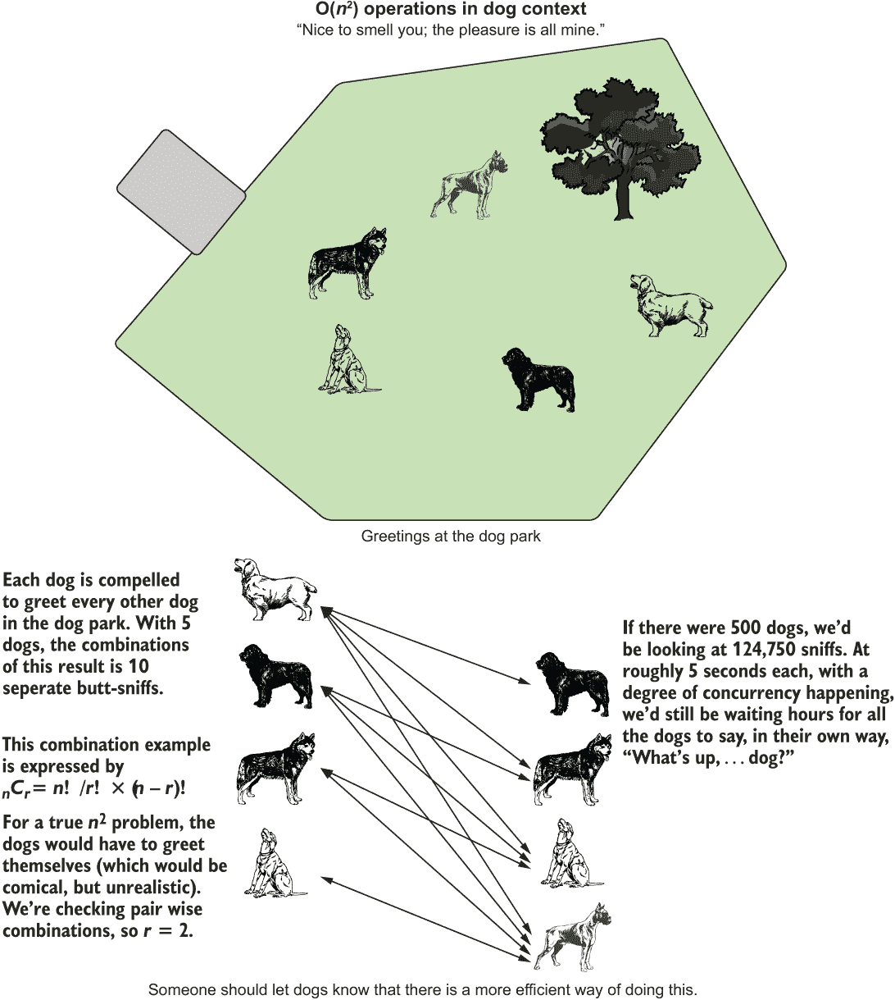

图 A.8 狗公园的相遇和问候。虽然不是精确的 O(*n*²)，但它有相似的关系。

注意：组合计算在严格意义上是 O(*n* choose *k*)的复杂度。为了简单起见，让我们想象通过交互所有可能的排列并过滤来暴力破解解决方案，这将具有 O(*n*²)的复杂度。

这种基于组合的配对关系遍历不是严格的 O(*n*²)；实际上它是 O(*n* choose *k*)。但我们可以应用这个概念，并通过组合运算来展示操作的数量。同样，我们可以通过操作排列来展示运行时间与集合大小之间的关系

表 A.1 显示了在这个狗公园中，根据通过大门进入的狗的数量（组合）以及可能的招呼，将发生的总屁股嗅探交互次数。我们假设狗感到需要正式介绍，其中每只狗都作为发起者（这是我多次目睹我的狗的行为）。

表 A.1 狗的问候次数

| 狗的数量 | 招呼的数量（组合） | 可能的招呼（排列） |
| --- | --- | --- |
| 2 | 1 | 2 |
| 5 | 10 | 20 |
| 10 | 90 | 45 |
| 100 | 4,950 | 9,900 |
| 500 | 124,750 | 249,500 |
| 1,000 | 499,500 | 999,000 |
| 2,000 | 1,999,000 | 3,998,000 |

为了说明友好狗的招呼关系在组合和排列中的样子，图 A.9 展示了随着狗数量的增加，复杂性的惊人增长。

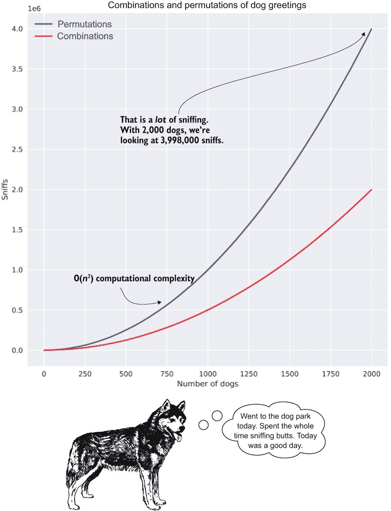

图 A.9 随着我们狗公园中狗数量的增加，嗅探的爆炸性增长。在代码中，复杂度的指数关系和狗在谈论效率时一样糟糕。

对于大多数机器学习算法（通过训练过程构建的模型），这种计算复杂度只是开始。大多数比 O(*n*²)复杂得多。

列表 A.5 展示了**n**²复杂度的实现。对于源数组的每个元素，我们将生成一个偏移曲线，该曲线将元素旋转到迭代索引值。接下来的每个部分的可视化将展示代码中的操作，以便更清晰。

列表 A.5 O(*n*²)复杂度的示例

```
import seaborn as sns
def quadratic_div(x, y):                                                   ❶
    return quadratic(x) / y
def n_squared_sim(size):                                                   ❷
    max_value = np.ceil(size / 2)
    min_value = max_value * -1
    x_values = np.arange(min_value, max_value + 1, 1)                      ❸
    with warnings.catch_warnings():
        warnings.simplefilter("ignore")                                    ❹
        curve_matrix = [[quadratic_div(x, y) for x in x_values] for 
                         y in x_values]                                    ❺
    curve_df = pd.DataFrame(curve_matrix).T
    curve_df.insert(loc=0, column='X', value=x_values)
    curve_melt = curve_df.melt('X', var_name='iteration', value_name='Y')  ❻
    fig = plt.figure(figsize=(10,10))
    ax = fig.add_subplot(111)
    sns.lineplot(x='X', y='Y', hue='iteration', data=curve_melt, ax=ax)    ❼
    plt.ylim(-100,100)
    for i in [ax.title, ax.xaxis.label, ax.yaxis.label] + ax.get_xticklabels() + ax.get_yticklabels():
        i.set_fontsize(14)
    plt.tight_layout
    plt.savefig('n_squared_{}.svg'.format(size), format='svg')
    plt.close()
    return curve_melt
```

❶ 通过数组中的一个值修改数组的二次解函数

❷ 生成二次评估系列值的集合函数

❸ 获取数组生成周围的 0 范围（为了对称性，大小加 1）

❹ 捕获与除以零相关的警告（因为我们正在跨越数组中整数的边界）

❺ 通过映射集合两次生成数组数组的 n² 遍历

❻ 将生成的数据矩阵转换为归一化形式，以便进行绘图

❼ 用不同的颜色绘制每条曲线，以说明算法中的复杂度差异

对于列表 A.5 中定义的算法，如果我们用不同的有效集合大小值调用它，我们将在下一个列表中看到计时结果。

列表 A.6 评估 O(*n*²) 复杂度算法的结果

```
%timeit -n 2 -r 2 ten_iterations = n_squared_sim(10)
>> 433 ms ± 50.5 ms per loop (mean ± std. dev. of 2 runs, 2 loops each)   ❶
%timeit -n 2 -r 2 one_hundred_iterations = n_squared_sim(100)
>> 3.08 s ± 114 ms per loop (mean ± std. dev. of 2 runs, 2 loops each)    ❷
%timeit -n 2 -r 2 one_thousand_iterations = n_squared_sim(1000)
>> 3min 56s ± 3.11 s per loop (mean ± std. dev. of 2 runs, 2 loops each)  ❸
```

❶ 仅需 121 次操作，这个执行速度相当快。

❷ 在数组大小增加 10 倍时，10,201 次操作需要显著更长的时间。

❸ 在 1,002,001 次操作时，指数关系变得明显。

从列表 A.5 中的输入数组大小和列表 A.6 中显示的结果可以看出，图 A.10 中可以更清楚地看到它们之间的关系。如果我们继续增加数组生成参数值的规模到 100,000，我们将看到 10,000,200,001 次操作（而我们的第一次迭代大小为 10 生成 121 次操作）。然而，更重要的是，生成如此多的数据数组所带来的内存压力。大小复杂度将迅速成为这里的限制因素，导致在我们对计算所需时间感到厌烦之前，就可能出现内存不足（OOM）异常。

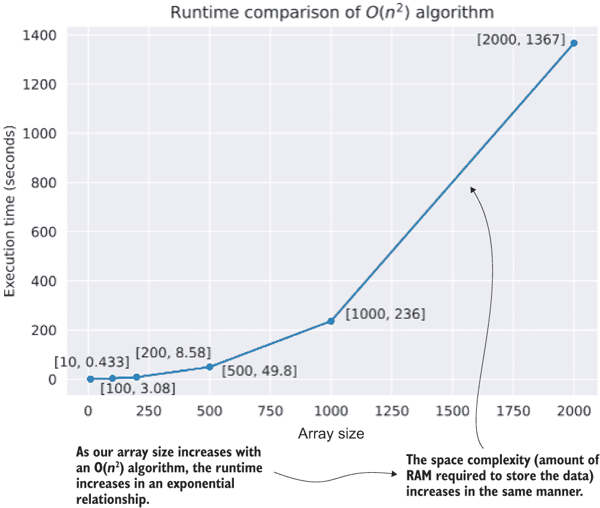

图 A.10 列表 A.5 中算法对不同集合大小的计算复杂度

为了说明此代码正在做什么，我们可以查看第一次迭代的结果（使用 `10` 作为函数参数），如图 A.11 所示。

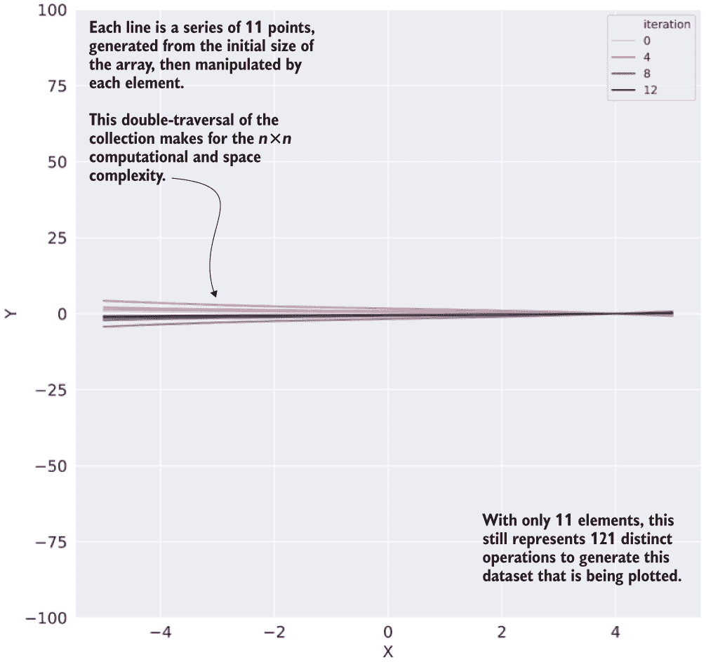

图 A.11 在大小为 11 的数组上运行的 O(*n*²) 算法生成数据（执行时间：433 毫秒，约需 26 KB 空间）

图 A.12 显示了通过此算法运行时，从数组大小 201（顶部）到更极端的大小（底部 2,001）的复杂度进展。


图 A.12 比较数组大小 201（时间：8.58 秒，空间：约 5.82 MB）和 2,001（时间：1,367 秒，空间：约 576.57 MB）。

如您所见（请记住，这些图表是为输入数组的每个索引位置生成的一系列），当通过这样的算法运行时，看似无害的集合大小可以迅速变得非常大。如果代码以这种复杂度级别编写，想象这将对项目的运行时性能产生多大的影响并不困难。

代码中的复杂度问题

在代码恶臭的大背景下，计算复杂性通常是更容易识别的一个。这种复杂性通常表现为嵌套循环。无论是具有内部额外`for`循环的声明式`for`循环，还是包含嵌套迭代或映射的`while`循环，或者是嵌套列表推导式，这些代码结构都显得可能存在危险。

这并不是说嵌套循环和复杂的`while`语句中的逻辑一定是 O(*n*²)、O(2*n*)或 O(*n*!)的最坏情况，但在评估代码时，这些地方需要花费更多的时间。它们就像是烟雾，需要调查以确保在运行代码时不会突然爆发潜在的火灾。

在代码库中看到这些意味着你应该花额外的时间检查逻辑并运行各种场景。最好的方法是想象如果正在迭代的集合大小加倍会发生什么。如果它增加一个数量级会怎样？

代码是否会扩展？运行时间是否会过长以至于错过 SLA？运行的系统是否会 OOM？思考如何识别、重构和更改代码的逻辑可以帮助预防后续的稳定性问题和成本考虑。

## A.3 分析决策树复杂性

让我们假设我们正在构建一个解决方案来解决问题，其核心需求需要一个高度可解释的模型结构作为输出。由于这个要求，我们选择使用决策树回归器来构建预测解决方案。

由于我们是一家致力于客户（狗）及其宠物（人）的公司，我们需要一种方法将我们的模型结果转化为直接且可操作的结果，这些结果可以快速理解和应用。我们不是在寻找黑盒预测；相反，我们希望理解数据中相关性的本质，并了解预测如何受到特征复杂系统的影响。

在特征工程完成并构建了原型之后，我们正在探索超参数空间，以优化 MVP 的自动化调整空间。在启动运行（成千上万的调整实验）后，我们注意到不同超参数的训练结果导致不同的完成时间。事实上，根据测试的超参数，每个测试的运行时间可能比另一个高一个数量级。为什么？

为了探索这个概念，让我们逐步了解决策树回归器（在复杂性的意义上）是如何工作的，并评估更改一些超参数设置如何影响运行时间。图 A.13 展示了算法在训练数据上拟合时发生的情况的高级视图。

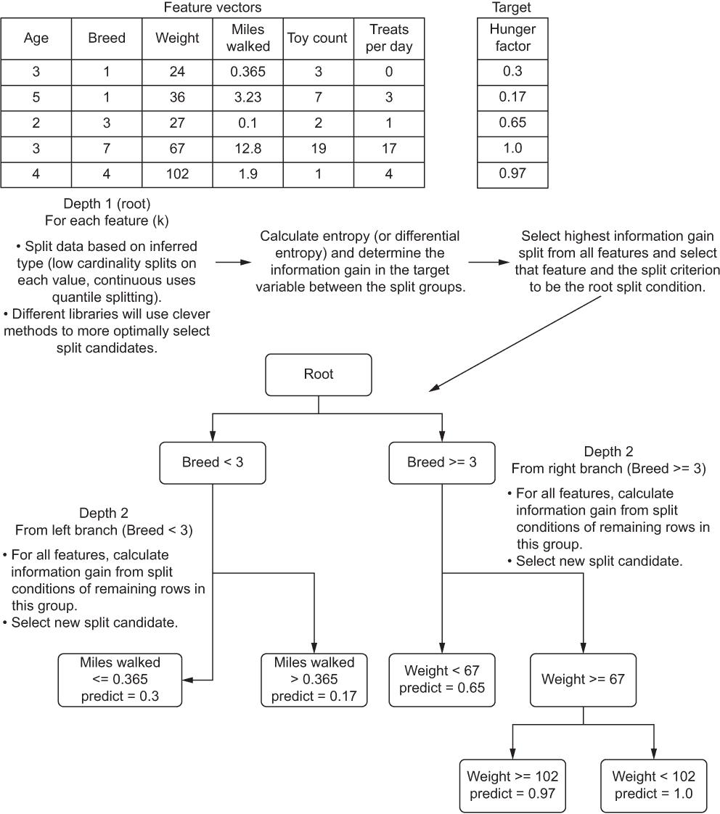

图 A.13 决策树算法的高级解释

这个图表可能对你来说很熟悉。算法的基本结构、功能和行为在博客文章、其他书籍中都有详细的介绍，并且是学习机器学习基础的一个基本概念。对我们讨论感兴趣的是，在训练模型时，哪些因素会影响计算和空间复杂度。

注意：图 A.13 仅作为示例。这个模型过度拟合，可能在对验证分割的测试中表现非常糟糕。在有更现实的数据分割体积和深度限制的情况下，预测将是分割分支成员的平均值。

首先，我们可以看到，在树的根节点上的初始分割需要确定首先选择哪个特征进行分割。这个算法一开始就存在一个可扩展性因素。为了确定分割的位置，我们需要测量每个特征，根据库的实现选择的准则进行分割，并计算这些分割之间的信息增益。

为了计算复杂度的目的，我们将特征的数量称为 *k*。信息增益的计算还包括基于训练数据集大小的熵的估计。这是传统非机器学习复杂度中的 *n*。为了增加这种复杂性，我们必须遍历树的每一层。一旦实现了最佳分割路径，我们必须继续在数据子集中的现有特征上迭代，反复进行，直到达到超参数中设定的标准，即填充叶（预测）节点所需的最小元素数量。

遍历这些节点代表了一个计算复杂度为 O(*n*log(*n*))，因为当我们接近叶节点时，分割的大小受到限制。然而，由于我们必须在每个裁决节点上迭代所有特征，我们的最终计算复杂度更接近于 O(*k* × *n*× log(*n*))。

我们可以通过调整超参数直接影响这种最坏情况运行时性能的真实世界行为（记住，O()表示法是*最坏情况*）。特别值得注意的是，一些超参数可能对计算复杂度和模型有效性有益（例如创建叶节点的最小计数，树的深度限制），而其他则可能呈负相关（例如，在其他使用随机梯度下降（SGD）的算法中的学习率）。

为了说明超参数与模型运行时性能之间的关系，让我们看看修改列表 A.7 中树的最大深度。在这个例子中，我们将使用一个免费可用的开源数据集来展示直接影响模型计算和空间复杂性的超参数值的影响。（对于没有收集关于狗的特征和一般饥饿水平的数据集，我表示歉意。如果有人想创建这个数据集并公开发布，请告诉我。）

注意：在列表 A.7 中，为了展示过深的深度，我通过独热编码分类值来违反基于树的模型规则。以这种方式编码分类值存在高度风险，可能会优先在布尔字段上分割，如果深度不足以利用其他字段，将导致模型显著欠拟合。在编码值时，应始终彻底验证特征集，以确定它们是否会创建一个糟糕的模型（或难以解释的模型）。考虑使用分桶、k 级划分、二进制编码或强制顺序索引来解决你的有序或名义分类问题。

列表 A.7 展示树深度对运行时性能的影响

```
from sklearn.model_selection import train_test_split
from sklearn.tree import DecisionTreeRegressor
from sklearn.metrics import mean_squared_error
import requests
URL = 'https://raw.githubusercontent.com/databrickslabs
/automl-toolkit/master/src/test/resources/fire_data.csv'
file_reader = pd.read_csv(URL)                              ❶
encoded = pd.get_dummies(file_reader, 
columns=['month', 'day'])                                   ❷
target_encoded = encoded['burnArea'] 
features_encoded = encoded.drop('burnArea', axis=1)
x_encoded, X_encoded, y_encoded, Y_encoded = train_test_split(features_encoded, 
target_encoded, test_size=0.25)                             ❸
shallow_encoded = DecisionTreeRegressor(max_depth=3, 
  min_samples_leaf=3, 
  max_features='auto', 
  random_state=42)
%timeit -n 500 -r 5 shallow_encoded.fit(x_encoded, y_encoded)
>> 3.22 ms ± 73.7 µs per loop (mean ± std. dev. of 5 
runs, 500 loops each)                                       ❹
mid_encoded = DecisionTreeRegressor(max_depth=5, 
  min_samples_leaf=3, max_features='auto', 
  random_state=42)
%timeit -n 500 -r 5 mid_encoded.fit(x_encoded, y_encoded)
>> 3.79 ms ± 72.8 µs per loop (mean ± std. dev. of 5 
runs, 500 loops each)                                       ❺
deep_encoded = DecisionTreeRegressor(max_depth=30, 
  min_samples_leaf=1, 
  max_features='auto', 
  random_state=42)
%timeit -n 500 -r 5 deep_encoded.fit(x_encoded, y_encoded)
>> 5.42 ms ± 143 µs per loop (mean ± std. dev. of 5 
runs, 500 loops each)                                       ❻
```

❶ 引入一个开源数据集进行测试

❷ 将月份和日期列进行独热编码，以确保我们有足够多的特征来实现本练习所需的深度。（参见本列表之前的说明。）

❸ 获取训练集和测试集数据

❹ 浅深度 3（可能欠拟合）将运行时间降低到最小基线。

❺ 从深度 3 增加到 5，运行时间增加了 17%（一些分支将已终止，限制了额外的时间）。

❻ 将深度移动到 30（根据此数据集实际实现的深度为 21）并将最小叶子大小减少到 1，可以捕捉到最糟糕的运行时复杂度。

正如你在调整超参数的计时结果中所看到的，树深度和运行时间之间存在一种看似微不足道的关系。然而，当我们将其视为百分比变化时，我们就可以开始理解这可能会造成的问题。

为了说明这种基于树的方法的复杂性，图 A.14 显示了在生成树的过程中，在每个候选分割步骤所采取的步骤。

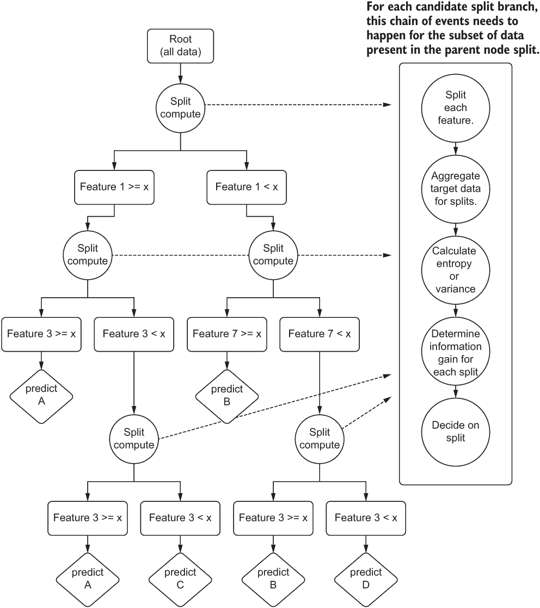

图 A.14 决策树的计算复杂性

不仅需要完成多个任务来决定在哪里分割以及分割什么，而且还需要完成图 A.14 右侧显示的整个任务块，以针对每个在候选节点满足先前分割条件的子数据集的特征进行操作。当树深度为 30、40 或 50 时，我们可以想象这棵树会很快变得相当大。运行时间也会相应增加。

当数据集不是像这个玩具示例中的 517 行时会发生什么？当我们训练 5000 万行数据时会发生什么？抛开模型性能影响（泛化能力）的模型运行到过深树的含义，当我们考虑单个超参数导致的 68%的运行时间增加时，如果我们不仔细控制模型的超参数，训练时间的差异可能会非常显著（并且代价高昂）。

现在你已经看到了超参数调整的计算成本，在下一节中，我们将探讨不同模型家族的计算和空间复杂度。

## A.4 机器学习的一般算法复杂度

尽管我们不会讨论任何其他机器学习算法的实现细节（正如我之前提到的，有专门的书籍介绍这个主题），但我们可以看看另一个更进一步的例子。假设我们正在处理一个非常大的数据集。它包含 1000 万行训练数据，100 万行测试数据，以及 15 个特征元素。

对于如此大的数据集，我们显然会使用分布式机器学习与 SparkML 包。在测试向量中的 15 个特征之后，我们决定开始提高性能，以尝试获得更好的错误度量性能。由于我们在这个项目中使用的是广义线性模型，我们对所有特征进行共线性检查，并适当地缩放特征。

对于这项工作，我们将团队分成两组。第 1 组一次添加一个经过验证的特征，并在每次迭代中检查预测性能的改进或下降。虽然这个过程很慢，但第 1 组能够一次淘汰或添加一个潜在候选者，并且从一次运行到下一次运行的运行时间相对可预测。

与此同时，第 2 组的成员添加了他们认为会使模型更好的 100 个潜在特征。他们执行训练运行并等待。他们去吃午饭，进行愉快的交谈，然后回到办公室。六小时后，Spark 集群仍在运行，所有执行器都达到了>90%的 CPU 使用率。它还继续运行了一整夜。

这里的主要问题是**计算复杂度的增加**。尽管模型的**n**值完全没有改变（训练数据的大小仍然是完全相同的），运行时间变长的原因仅仅是特征大小的增加。对于大数据集来说，这会由于优化器的工作方式而成为一个问题。

虽然传统的线性求解器（例如普通最小二乘法）可以依赖于通过涉及矩阵逆的闭式解来求解最佳拟合，但在需要分布的大型数据集中，这不是一个选项。其他求解器必须用于在分布式系统中进行优化。由于我们正在使用分布式系统，我们正在考虑 SGD。作为一个迭代过程，SGD 将通过沿着调整历史的局部梯度进行步骤来执行优化。

要获得 SGD 工作原理的简化理解，请参阅图 A.15。这个 3D 图表示求解器沿着一系列梯度进行搜索，以找到生成线性方程特定系数集的全局最小误差。

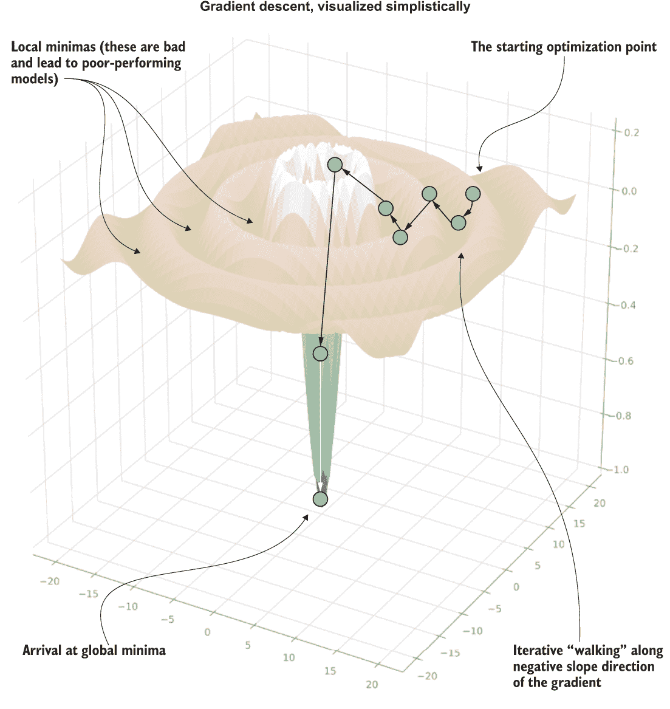

图 A.15 优化过程中搜索最小化的 SGD 过程的视觉表示（带有艺术自由度）

注意随机梯度下降将沿着固定距离的调整进行，试图达到测试数据（误差最小化）的最佳拟合。它将在下降变得平坦到斜率为 0，并且在阈值内后续迭代没有改进或达到最大迭代次数时停止。

注意正在发生的迭代搜索。这一系列尝试将方程的最佳拟合与目标变量相匹配，包括调整特征向量每个元素的所有系数。自然地，随着向量大小的增加，系数评估的数量也会增加。这个过程需要为每个正在进行的迭代遍历发生。

然而，这个情况中出现了一些问题。SGD 及其类似迭代方法（如遗传算法）没有简单的解决方案来确定计算复杂性。

这（对于其他类似的迭代求解器，如有限内存 Broyden-Fletcher-Goldfarb-Shanno，或 L-BFGS 也是正确的）的原因是，在局部和全局意义上，优化最小值的性质高度依赖于特征数据的组成（分布和推断的结构类型）、目标性质以及特征空间的复杂性。

这些算法都有最大迭代次数的设置，以实现最佳努力的全局最小化状态优化，但无法保证优化会在达到迭代器最大计数之前发生。相反，确定训练将花费多长时间时可能出现的挑战之一是优化的复杂性。如果 SGD（或其他迭代优化器）可以在相对较少的迭代次数内达到（希望是全局的）最小值，则训练将在达到最大迭代计数之前很久就终止。

由于这些考虑，表 A.2 是对常见传统机器学习算法理论最坏情况计算复杂度的一个粗略估计。

表 A.2 不同模型家族的计算复杂度估计

| 模型家族 | 训练复杂度 | 预测复杂度 |
| --- | --- | --- |
| 决策树 | O(*kn*log(*n*)) | O(*k*) |
| 随机森林 | O(*kn*log(*n*)*m*) | O(*km*) |
| 梯度提升树 | O(*knm*) | O(*km*) |
| 线性模型（OLS） | O(*k2n*) | O(*k*) |
| 线性模型（非 OLS） | O(*k*²*n*+ *k*³) | O(*k*) |
| 支持向量机 | O(*kn*²+ *n*³) | O(*km*) |
| K-最近邻算法 | O(*kmn*)* | O(*kn*) |
| K-均值算法 | O(*mni*)** | O(*m*) |
| 交替最小二乘法 | O(*mni*)** | O(*ni*) |
| *n* = 训练集行数*k* = 向量中的特征数*m* = 集成成员数*i* = 收敛所需的迭代次数* m 在此情况下是指考虑边界定义时邻居数量的限制。** m 在此处指的是考虑的 k-质心数量。 |

所有这些复杂性的最常见方面都涉及单独的因素：用于训练的向量数量（DataFrame 中的行数）和向量中的特征数。这两种数量的增加都会直接影响到运行时的性能。许多机器学习算法在计算时间和输入特征向量大小之间有指数关系。在忽略不同优化方法复杂性的情况下，给定算法的求解器可能会因为特征集大小的增加而受到不利影响。虽然每个算法家族都与特征大小和训练样本大小有自己独特的细微关系，但在项目开发初期，了解特征计数的一般影响是一个重要的概念。

如前节所述，决策树的深度可以影响运行时的性能，因为它需要搜索更多的分割，因此需要更多的时间。几乎所有模型都有参数，这些参数可以给应用实践者提供灵活性，这将直接影响到模型的预测能力（通常是以运行时间和内存压力为代价）。 

通常，熟悉机器学习模型的计算和空间复杂度是个好主意。了解选择一种模型而不是另一种模型对业务的影响（假设它们能够以类似的方式解决问题）可以在生产完成后在成本上产生数量级的差异。我个人已经多次决定使用预测能力略差的方法，因为它可以以比替代方案执行成本低得多的时间运行。

记住，最终，我们在这里是为了解决业务问题。以 50 倍的成本为代价，在预测精度上提高 1%，在解决你最初想要解决的问题的同时，为业务创造了一个新的问题。
