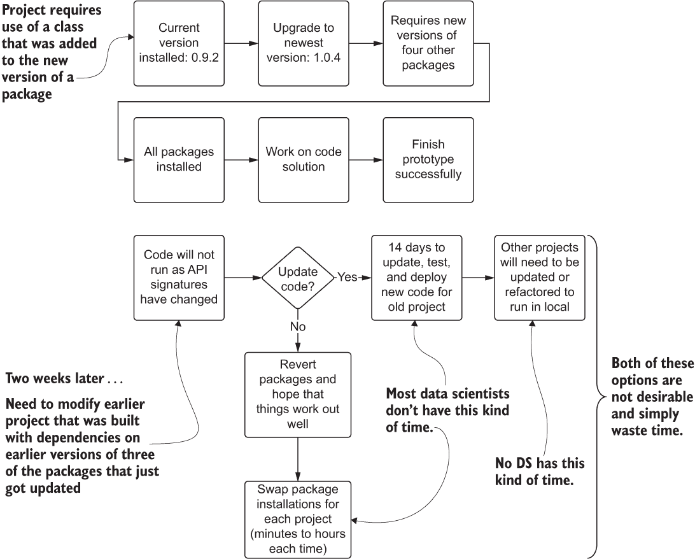

# 附录 B. 设置开发环境

在处理新项目时，从一张白纸开始有许多原因。以下列表展示了与 ML 项目工作更相关的几个原因：

+   在干净的环境中管理依赖关系更为容易。

+   临时文件、日志和文件的隔离更为简单。

+   脚本化环境创建使得迁移到生产环境更为简单。

+   在依赖冲突较少的情况下，库的安装更为简单。

虽然存在许多创建可隔离环境以开发新项目的方法，但本附录提供了使用 Docker 以及 Conda 的包管理工具套件的指导，正如本书的配套仓库所做的那样。

## B.1 清洁实验环境的案例

数据科学家在长时间在本地计算机上构建原型后面临的一个主要挑战是，旧项目无法在后续项目所需的更新环境中运行。随着库的发展，数据科学家升级库版本，并添加新的包，这些包依赖于其他包的新依赖项；在这个真正庞大的生态系统中，库的依赖关系发生了变化，这个生态系统由大量的相互连接的 API 网络组成。

维护库之间兼容性的这个极其复杂且令人沮丧的概念被称为*依赖地狱*，这是一个当之无愧的称号。图 B.1 展示了依赖冲突的典型场景。



图 B.1 常见 Python 开发环境中的依赖地狱。包管理冲突可能会浪费大量时间。

正如你所见，在单个本地环境中解决库冲突的选项相当严峻。一方面，你可能被迫重构代码库和训练运行时环境，随着公司项目数量的增长，这两项行动都是不可行的。另一方面，数据科学团队成员每次想要开始一个新项目时，都必须浪费无数小时修改他们安装的包（回滚或升级）。这显然不是一个可扩展的解决方案。

无论你运行的是哪种操作系统，如果你已经在你的机器上安装了 Python，你将会有一些深层次的依赖关系，这些依赖关系也存在于已安装的包中。一些实验和测试可能需要安装库，这可能会破坏之前开发的项目或命令行上可用的实用应用程序。更不用说，每个团队成员的电脑可能都有这些关键包的不同版本，如果这些团队成员运行彼此的代码，就会导致可重复性问题。

## B.2 解决依赖地狱的容器

这种令人沮丧且浪费时间的工作，即始终确保所有东西都能协同工作，有多种解决方案。其中最受欢迎的是由 Anaconda 公司慷慨地作为开源发行版（在新的 BSD 许可证下）提供给机器学习社区的预包装构建。这些经过测试和验证的软件包集合保证能够很好地协同工作，让您免于自行确保这些软件包的行为。创建一个全新的、纯净的 Python 环境的 Anaconda 构建，主要有以下三种主要方式：

+   *Conda 环境管理器*——命令行工具，可以从不会干扰系统 Python 安装的镜像中在本地创建隔离的 Python 环境

+   *Anaconda Navigator*——图形用户界面，允许在本地机器上使用隔离的 Conda 环境一键设置许多流行的开发工具

+   *Docker 容器部署 Conda 环境，用于在虚拟机（VM）中使用*——可移植的容器定义，将创建一个隔离的 Python 环境，该环境包含 Conda 包构建，可以在本地虚拟机或基于云的虚拟机中运行

图 B.2 展示了前两种方法，这些方法适用于 Python 中的机器学习实验，并使用纯开源（免费）解决方案来隔离运行时环境。顶部部分可以通过命令行界面（CLI）或通过 Anaconda Navigator 图形用户界面（GUI）完成。


图 B.2 Conda 环境管理对比容器服务环境管理。两者都是简化实验、开发和生产的良好选择。

这些方法解决了不同项目需求中存在版本冲突的问题，大大节省了时间和精力，否则您将不得不进行令人沮丧的工作来管理所有机器学习软件包。有关 Docker 是什么以及为什么它很重要的进一步解释，请参阅以下侧边栏。

什么是 Docker？

*Docker* 是一种容器化服务。它是一个平台，允许操作系统级别的虚拟化（想想：计算机中的计算机），可以配置为使用运行在其上的机器的资源，并且可以从主机机器上的其他应用程序和操作系统实体中实现完全的过程级隔离。

这允许您打包您的软件、运行软件所需的库以及配置文件，以便在不同的环境中运行。您甚至可以打开端口，就像容器是其自己的计算机一样进行通信。

机器学习的容器化使你能够处理依赖地狱问题：每个项目都可以拥有自己的库集合，这些库保证与你的代码以可重复和一致的方式协同工作。容器化还使你能够在任何环境中运行容器——本地服务器、基于云的服务器或任何能够运行容器的虚拟机环境。这为机器学习项目工作引入了可移植性，这在实验阶段越来越普遍，对于生产规模的机器学习来说也绝对至关重要。

## B.3 为实验创建基于容器的原始环境

在本节中，我们将通过使用 Docker 定义并初始化一个基本的隔离运行时环境。我相当偏爱 Anaconda，因为它不需要付费服务就可以进行实验，所以我们将使用其预配置的 Docker 容器之一，该容器已经为 Python 3 和大多数核心机器学习库搭建了启动环境（至少对于本书中我们需要的功能来说是这样）。

为了确保我们的系统上有这个镜像，我们将通过命令行运行`docker pull continuumio/anaconda3`。这个命令将从 Docker Hub 获取预构建的 Docker 容器，Docker Hub 是一个包含免费和受限镜像的 Docker 镜像仓库。该容器包括 Linux 操作系统、Anaconda Python 的最新版本，以及为大多数数据科学工作任务提供完全可操作的开发环境所需的所有配置，用户几乎不需要进行任何额外操作。

注意：尤其是在实验阶段，始终建议有一个隔离的环境，我们可以像孩子们说的那样，“尽情地疯狂”使用各种包、这些包的版本以及我们可能不想污染计算机一般环境的配置。没有比意识到你一直在工作的其他项目现在因为更新到 NumPy 的新版本而抛出成百上千个异常更痛苦的了。

为了获得一个基本的机器学习环境（可运行的虚拟机镜像），用于执行项目的测试和研究的初期阶段，我们可以在安装 Docker 之后运行以下命令。

列表 B.1 创建基本机器学习环境的 Docker run 命令

```
docker run -i --name=airlineForecastExperiments           ❶
-v Users/benwilson/Book/notebooks:/opt/notebooks          ❷
-t -p 8888:8888                                           ❸
continuumio/anaconda3                                     ❹
/bin/bash  -c "/opt/conda/bin/conda install jupyter 
-y --quiet && mkdir -p  /opt/notebooks && 
/opt/conda/bin/jupyter notebook --notebook-dir=/opt/notebooks 
--ip='*' --port=8888 --no-browser --allow-root" 
```

❶ 你可以随意命名容器。如果你省略这个配置，Docker 会为你选择一个有趣的名字，让你很难记住容器中有什么。

❷ 本地文件系统的绝对路径（你希望没有 benwilson 的 root 用户目录）——需要更改。

❸ 这是我们使用“docker pull continuumio/anaconda3”命令从 Docker Hub 拉取的镜像。

❹ Bash 命令，允许我们安装 Jupyter 并将其配置为使用端口转发，这样我们就可以打开本地浏览器窗口并与容器的环境交互

对这个脚本进行一些轻微的修改——特别是覆盖挂载位置（冒号之前带有`-v`选项的第一个部分）——然后将其粘贴到命令行中，容器就会启动并运行。在收集完软件包并构建了镜像之后，命令行会给你一个提示（一个本地主机引用`http://127.0.0.7:8888/?token=...`），你可以将其粘贴到你的网页浏览器中，以便打开 Jupyter，这样你就可以开始在笔记本中编写代码了。

注意：如果你在云上托管了一个开发环境，这使得其他人可以非常容易地为你创建这样一个原始环境，只需象征性的费用，那么你可以忽略这一点。这是给所有在笔记本电脑上挣扎学习机器学习的数学姐妹和兄弟们。
