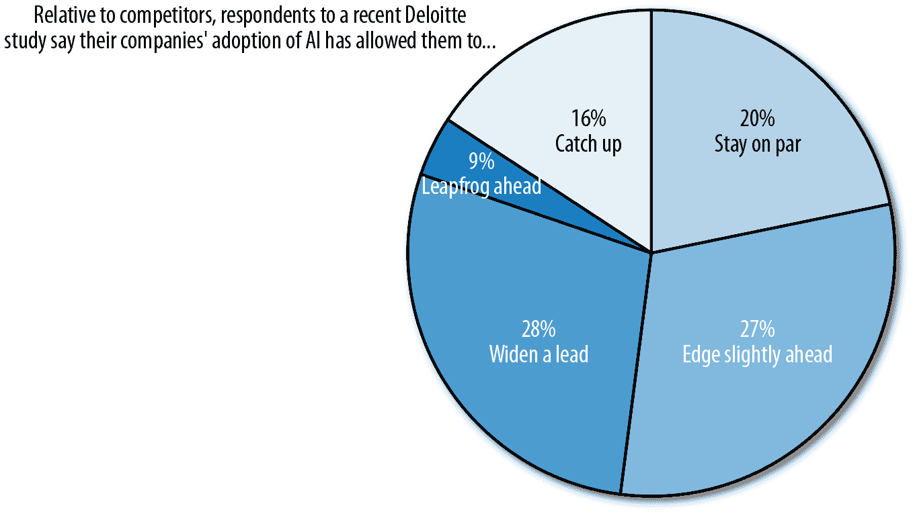

# 第一章：企业规模的机器学习

# 引言

似乎每个人都在做机器学习。而如果你的公司不投资于培养和部署机器学习模型所需的专业人员和专门工具，你可能已经落后于竞争对手。根据德勤对大型企业的调查，2017 年机器学习采纳率已经达到 58%，并且在 2018 年增长了 5 个百分点，达到了 63%的所有受访者。

为了了解企业采用机器学习的速度，[IDC 预测](http://bit.ly/2qKe6ZP)，到 2021 年，人工智能（包括机器学习）的支出将增长到 522 亿美元。这代表了在 2016 年至 2021 年预测期内 46.2%的惊人复合年增长率（CAGR）。这意味着支出每年将增加近一半。

另一个表明企业普遍采用人工智能，特别是机器学习的迹象是，那些在数据科学方面有丰富经验的组织已经广泛使用与机器学习相关的职位头衔。根据 O’Reilly 2018 年的调查，《企业中机器学习采纳状况》（https://oreil.ly/2XCQSDF），81%的这类企业雇用“数据科学家”，39%的企业雇用“机器学习工程师”，20%的企业雇用“深度学习工程师”。

这些活动似乎正在取得成效。最近的一项德勤研究（http://bit.ly/2VotAEb）发现，机器学习成功应用与竞争优势之间的联系正在增强（见图 1-1）。虽然只有 11%的高管认为采用 AI“具有重要的战略意义”，但 56%的人认为在三年后将会如此。德勤指出，这给公司留下了“非常短暂的时间窗口”，以完善他们的 AI 战略和技能。

###### 图 1-1\. 许多调查对象表示，AI 帮助他们的组织跟上甚至领先于竞争对手。

但尤其是在机器学习领域，挑战重重。另一份 2018 年的报告，《企业机器学习现状》（http://bit.ly/2PttSEn），调查了 500 多名数据科学和机器学习专业人士，发现如下情况：

+   公司中有 38% 遇到了将其模型扩展到他们想要的规模的问题。当要求提供个案答案时，数据科学专家表示，这是由于多种因素造成的，包括未向 DevOps 和 IT 团队分配足够的资源。其他原因是数据科学家被要求建立基础设施来将他们的模型投入生产，以及缺乏支持以必要规模运行机器学习模型的现有基础设施。

+   30% 的受访者报告了支持不同编程语言和训练框架的挑战。因为数据科学家和机器学习工程师各自喜欢使用自己的编程语言和训练框架，这增加了复杂性，因为所有这些不同的工具必须以某种方式协调在一个可以产品化的模型中。

+   30% 报告了管理模型的挑战，如保持版本清晰和确保可解释性。

此外，数据整理仍然是一个巨大的瓶颈。行业中普遍认为，数据科学家花费 80% 的时间寻找和管理数据，只有 20% 的时间用于构建模型。这一普遍共识最终得到了一些量化支持。根据[“企业机器学习现状”](http://bit.ly/2PttSEn)研究，尽管在机器学习方面投入了大量时间、资金和人力资源，数据科学家和机器学习专业人员在基础设施、部署和数据工程方面花费了太多时间（超过 75%），而在训练和迭代模型方面则远远不足（少于 25%）。

在我们与许多企业合作，帮助他们将数据科学工作负载转移到云端的经验中，我们确定了数据科学团队在扩展其机器学习操作时需要解决的六个常见挑战：

+   问题 1：调和不同的接口

+   问题 2：解决环境依赖关系

+   问题 3：确保所有机器学习利益相关者之间的密切合作

+   问题 4：构建（或租用）足够的机器学习基础设施

+   问题 5：扩展以满足机器学习需求

+   问题 6：实现机器学习项目的顺畅部署

本报告深入探讨了这些问题，并为数据科学家和机器学习工程师提供了经过验证的实用建议——这些建议涵盖了编程接口、工作空间和数据处理引擎。特别是，我们探讨了托管云服务平台如何为这些问题提供成本效益高、可复制的解决方案。

我们相信从已经走过这段路并建立成功的企业规模机器学习项目的专家那里可以学到宝贵的经验教训。为了本报告，我们采访了以下从业者，以呈现他们在处理这些常见挑战时的独特视角和辛苦得来的建议。

## Nakul Arora，Infosys

Nakul Arora 是 Infosys 的副总裁，产品管理和产品营销负责人，Infosys 是全球技术服务和咨询领域的领导者。Nakul 负责 AI 平台和业务解决方案团队，在 Infosys 的 AI 平台中包括自动化机器学习工作台、数据平台和自动化骨干。该平台已在各行各业展开了 200 多个项目，允许企业构建强大的水平和垂直特定的定制体验，例如聊天机器人、认知搜索、合同分析和资产效率解决方案等等。

## Patrick Hall，H2O

Patrick Hall 目前担任 H2O 数据科学产品的高级总监，在该公司担任弱人工智能预测引擎 H2O Driverless AI 的可解释性、透明性和可信度项目的设计师和数据科学主管。他为美国一些顶级商业数据科学团队提供建议，涉及高级机器学习项目，并且是华盛顿特区人工智能和深度学习 meetup 群组的共同组织者。Patrick 同时也是乔治·华盛顿大学的兼职教授，负责研究生数据挖掘和机器学习课程的讲座、作业和评估。

## Matt Harrison，MetaSnake

Matt Harrison 是 MetaSnake 的顾问和企业培训师，这是一家专注于数据科学特别是 Python 及其相关工具应用于机器学习的咨询公司。他自 2000 年以来一直在多个领域使用 Python，包括搜索、构建管理和测试、商业智能以及存储。Matt 还运营 pycast.io，这是一个提供有关 Python 和数据科学指导的屏幕录制服务。

## Hussein Mehanna，前谷歌云任职

Hussein Mehanna 曾担任谷歌云的工程总监。在加入谷歌之前，他曾是 Snap 的工程总监，并在 Facebook 领导了多个团队，其中包括共同创立的应用机器学习组。在 Facebook 任职期间，他还创立了包括 AI 平台在内的一些应用研究团队，如 FBLearner；Flow；和 Caffe 2，DeepText 自然语言理解，这是 Messenger、News Feed 和其他 Facebook 应用程序中使用的多语言理解平台。

## Joao Natali，Neustar

Joao Natali 是 Neustar 的数据科学总监，该公司为大型广告客户提供名为 One ID 的身份解决方案，包括消费者的在线身份、离线身份、确定性身份和精选身份。Neustar 在自己的系统中生成数据，还从合作伙伴那里收集数据，以创建一种工具，使其客户能够进行交互、报告和进行模拟。

## Jerry Overton，DXC 技术公司

Jerry Overton 是 DXC Technology 的数据科学家和技术专家，这是一家全球系统集成商。他专注于为各行业的企业客户工业化分析和人工智能。Jerry 是 O'Reilly 报告《“在数据科学中取得专业成功需要什么”》的作者。

## Sean Downes

Sean Downes 在德克萨斯 A&M 大学学习数学物理，重点是超引力和弦现象学。他通过在 2015 年加入领先的旅行集团来转向行业，在那里他现在是一名高级数据科学家。他目前致力于各种问题，特别是平台和市场设计以及学习排序倡议。

# 第一个问题：协调不同的接口

我们确定的第一个机器学习问题是：数据科学家有他们偏爱使用的某些前端编程接口。然而，这些接口经常与组织的其他部分脱节，特别是如果它们部署在笔记本电脑上。手动设置接口以便与同行协作、连接执行引擎或数据存储的过程，对于数据科学家来说可能非常耗时和痛苦。

“在大多数公司，接口导致非常分散的管道，每个参与者都有自己的偏好、忠诚度和目标，” Infosys 产品管理和产品营销副总裁 Nakul Arora 说。

数据科学家更倾向于使用特定工具，如 RStudio 用于 R 编程或 Jupyter Notebooks 用于 Python 编程。然而，对他们来说，要转换到不同的工具或技术并不总是容易的。数据科学家偏爱的工具和界面与机器学习工程师的喜好大不相同，后者通常偏爱用于 Scala、Java 或 C++的 IntelliJ IDEA。当数据科学工作在桌面或笔记本电脑等独立系统上进行时，这个问题变得更加复杂。

为了让每个数据科学专业人士尽可能高效地工作，允许他们使用他们喜欢的接口是非常重要的，同时还要提供一个可以让数据团队所有成员协作的共同工作空间。

面对这一挑战，解决方案是什么？越来越多的数据科学专业人士表示，云优先的方法对于企业规模的数据科学和机器学习至关重要。具体来说，需要开发支持整个机器学习工作流程的云数据平台。这些云数据平台允许数据工程师和数据科学家使用他们熟悉的工具、语言和数据处理引擎进行工作和协作。

[根据最近的德勤研究](http://bit.ly/2VotAEb)，39%的公司表示在部署人工智能时更倾向于使用基于云的服务和平台。相比之下，只有 15%的公司表示他们更喜欢使用本地解决方案。德勤估计，基于云的人工智能平台的全球年增长率为“显著”的 48.2%，这进一步证实了它们的流行程度。

## 数据科学家与机器学习工程师：不同的角色，不同的工具

在我们详细讨论第一个挑战之前，让我们稍微回顾一下并定义数据科学生命周期中的两个主要角色：数据科学家和机器学习工程师。

### 数据科学家

数据科学家应用科学方法对数据进行分析，构建生成见解或预测的数学软件模型，从而支持数据驱动的业务决策。通常，数据科学家是统计分析和数学建模的专家，并精通诸如 R 或 Python 等编程语言。

在他们甚至可以决定构建什么模型之前，数据科学家需要探索数据，可视化它，运行统计分析，并进行特征工程。这在很大程度上是一个试错过程，笔记本在其中发挥着重要作用。笔记本是交互式工具，允许数据科学家快速检查代码的结果或可视化数据。它们使模型构建的迭代性质变得更加容易。

### 机器学习工程师

机器学习工程师接管数据科学家创建的模型——即代码，并将其集成到产品中。这个产品可以是从 Web 应用程序到报告仪表板，再到物联网（IoT）设备的任何东西。机器学习工程师通常具有软件工程背景，喜欢使用 Scala、Java 或 C++等编程语言。有时，他们可能会使用 Python，但与 Scala、Java 或 C++相比，Python 在软件应用程序中的表现通常较差。

当产品化数据科学家的模型时，机器学习工程师所需的技能集与数据科学家本身有些不同。尽管机器学习工程师也被期望具有良好的统计理解能力，但他们在软件工程方面具有坚实的背景。机器学习工程师是一个尚未在整个行业完全确立的新兴角色。无论他们是否被称为机器学习工程师，这些人都是数据团队中不可或缺的一部分。

与倾向于使用笔记本的数据科学家相比，机器学习工程师更喜欢使用专为构建可用于生产的软件应用程序而设计的集成开发环境（IDE），如 Eclipse 和 IntelliJ。

## 面对数据专业人士的三个界面挑战

考虑到这些不同的角色使用不同的工具，存在三个挑战：

+   有效与同行协作

+   连接到数据库或数据存储

+   连接到大规模执行引擎如 Presto、Hive 或 Spark

在本节的其余部分，我们为您提供数据科学家和其他数据专业人员如何克服这些挑战的真实案例。

### 与同行协作

当您的数据科学家偏好一种工具，而您的机器学习工程师又偏好另一种工具时，您如何确保无缝协作呢？毕竟，跨数据角色的点对点协作对于构建成功的机器学习产品至关重要。您有数据工程师负责准备数据管道，数据科学家构建模型，然后将其移交给机器学习工程师将这些模型部署到生产环境中。在某些情况下，机器学习模型的预测可能会被数据分析师用于做出业务关键决策。因此，分析师也参与其中。因此，设置正确的界面以实现无缝协作至关重要。除非您仔细计划，否则这可能是一个难以实现的目标。

信塔信息系统的阿罗拉认为，解决这个问题的方法很简单：使用提供大量接口的云平台。例如，一个云平台可能提供一个接口，比如 RStudio（数据科学家通常在这里进行开发或原型设计）和 IntelliJ IDEA（机器学习工程师更喜欢使用）。

这样的平台在接口的数量、接口的类型以及支持的接口的流行程度方面必须具有*最低公共分母能力*。换句话说，接口不应成为限制因素。阿罗拉说：“您的云框架越开放和可扩展，您就会越好。”因此，任何平台的可扩展性都是至关重要的。还要记住，接口会演变，人们的偏好也会变化。支持多种接口的平台能够跟上这些变化的客户和市场动态。

云数据平台的这些最低公共分母（最小可行的能力集）是什么？正如您可能期望的那样——RStudio、Jupyter Notebooks 和 Anaconda。

当涉及软件编程技能时，数据科学家往往不如机器学习工程师熟练。因此，为了与他们的机器学习工程师同行有效协作，他们可能考虑发展他们的编程技能——有效地成为机器学习工程师。否则，协作就会变得困难，因为他们需要向机器学习工程师解释他们的代码，以便将其重构为适合生产环境的代码。这就是肖恩·唐斯意识到的问题。

Downes 说：“不幸的是，我认为数据科学家中严重缺乏的一件事是编程技能的技术成熟度。” 他喜欢在编写批处理作业、JAR 文件、工具和函数时尽可能使用 IntelliJ，尤其是在编写建模代码时，因为这样更容易与机器学习和数据工程师合作。“这是我不得不与自己搏斗的事情，但学习机器学习技能不仅极大地加快了我的工作流程，也使团队中的其他人更容易看到和理解我在做什么，”他说。

### 连接到现有数据库或数据存储

无论您使用哪种前端界面都无所谓。在后端，您需要一个执行引擎来连接数据库和数据湖，并处理数据。根据数据大小，您可能需要使用 Apache Spark 或 Presto 等分布式处理引擎。

DXC Technology 的 Jerry Overton 表示，尽管与现有数据库进行接口很重要，但更大的问题是如何让您的模型连接到数字生态系统的其余部分。

Overton 问道：“您如何使其与其他供应商的应用程序、业务线应用程序、遗留系统和现有企业数据接口？” “这确实是问题的难点所在。”

最佳实践规定，数据工程团队从所有应用程序（Salesforce，Marketo，数据仓库系统等）中获取所有数据并将其存入数据湖中。然后，接口连接到这些数据并通过 Apache Spark、Hive 或 Presto 等大数据引擎进行查询、训练或处理。

尽管 Overton 识别出一个略有不同的接口*问题*，与他的同行们相比，他推荐相同类型的解决方案。

“您需要一个云驱动的平台来完成这项工作——即平台即服务（PaaS），”他说，并补充说，许多现有解决方案不仅为您提供环境，还使工作站和笔记本电脑能够轻松连接到它。“而且，您甚至可以与其他开发人员进行实时协作，”他说。

我们还可以将仪表板视为一种接口类型，数据团队需要配置和连接它们到数据处理引擎。在谈到仪表板和显示模型结果时，Infosys 的 Arora 强调世界已经超越了 Tableau。Arora 说：“有 Qlik，有 Microsoft Power BI，而且坦率地说，有三个不同的云，或者我们应该称之为‘围墙花园’：Microsoft Azure，AWS 和 Google Cloud。” “它们每个生态系统内都有 AI 工具用于可视化。因此，能够与它们接口也是一项关键的基础能力。”

Neustar 的 Joao Natali 表示，他几乎从不使用预打包的可视化工具。“我们几乎从不使用 Tableau 或类似工具，Excel 使用非常有限。我们专注于笔记本和为所有必须做的事情编写代码，”他说。

### 连接到大规模执行引擎

当连接到大规模执行引擎时，不同的人喜欢使用不同的语言，比如 Scala、R 或 Python。

在 Neustar，数据科学家更倾向于使用典型的 Python 数据科学堆栈。"有时我们使用 R，有时使用 Scala，" Natali 说道。如果工程部门对接需要依赖，总是可以使用 Java 虚拟机（JVM），他说道。"但如果没有限制，我们基本上是一个基于 Python 的团队。"

另一方面，Neustar 的机器学习工程师在连接到大规模执行引擎时更喜欢 Java 而不是 Scala 或其他工具。你选择的语言将决定你使用的接口。例如，Scala 用户通常更喜欢 IntelliJ 或 Eclipse。

"Scala 有很多好东西，但它也是一种非常自由的语言，意味着两个人可以解决一个问题，他们的代码不会相似，" Natali 说道。因此，使用 Scala 的团队花费了大量时间创建代码标准。

"我们没有时间搞这些," Natali 说道。"这就是为什么 Python 对我们来说是一个好的解决方案。"

实际上，大多数数据科学从业者都认为 Python 是理想的，因为它比 R 更适合生产环境。它在数据科学以外的其他领域也有更多的通用库。而且，其结构更加健壮，具有不同的类和类型。

总结一下，当涉及接口时，有两件事情很重要：

+   首先，根据他们的角色和技术专长，数据团队的成员可能更喜欢不同的接口。机器学习工程师可能更喜欢编程 IDE，如 Eclipse 或 IntelliJ，而数据科学家可能更喜欢 RStudio 或 Jupyter Notebooks。

+   第二，接口是连接和处理数据的一种方式。将接口连接到引擎是一个耗时的过程。一个预配置引擎和接口的云数据平台可以在整个组织中提供一致性，并允许数据科学家专注于他们构建模型的核心任务。

# 问题 2：解决环境依赖关系

当数据或代码在不同环境之间移动时，许多数据科学挑战就会出现。在计算机科学中，环境指的是操作系统版本、编程语言以及用于构建模型的库之间的特定依赖关系。

我们的专家特别指出了两个挑战：DevOps 瓶颈和代码可移植性问题。

## 设置机器学习环境并避免 DevOps 瓶颈

太多时候，数据科学家被期望自己搭建环境，或者等待 DevOps 专业人员有时间为他们创建环境。无论哪种方式，都会面临挑战——要么数据科学家不够了解生产环境以避免迁移问题，要么 DevOps 团队太忙，成为了整个过程中的瓶颈。

根据 Infosys 的 Arora 所说，挑战的一部分在于数据科学家不负责将模型投入生产。因此，当他们设置环境时，他们可能不知道接下来会发生什么。

“实际上，你减少痛苦或减少重复工作的唯一方法，就是提供一个他们可以从开发模型、测试到生产使用的环境。” Arora 说道。然而，虽然这是理想的，但找到精通数学、统计学、计算机科学和云 DevOps 的人才是非常困难的，也许是不可能的。

这就是为什么在大多数公司中，IT 部门通常为数据科学家设置开发环境。在模型构建完成后，他们能进行一定程度的测试。

“但是，当涉及到生产环境时，完全由另一组人员处理。” Arora 表示，他认为在开发和生产阶段之间需要有一个桥梁。

理想的解决方案是让数据科学家在更加适合生产的环境中工作，以便能够更流畅地将他们的代码部署到生产环境中。与传统的分离环境相比，在那种环境中，你需要将代码交给其他人员，他们有权限访问生产环境，数据科学家应能够自行实验、测试并将代码移至生产环境。这就是云原生数据平台的作用。

Neustar 的 Natali 表示，他的公司在环境问题上通常采取“简单”的解决方案。“如果我们知道特定的代码片段将在一个集群中运行，或者我们可以定义集群作为我们需要的配置，那么我们可以专门为该集群构建代码，然后轻松地设置、运行、测试并将其移至生产环境，不会有任何麻烦。”

他的组织有一个名为 *CloudOps* 的团队负责设置所有这些。类似于其他组织称为 DevOps 的方式，CloudOps 负责在多个平台上（本地、私有云和公有云）处理基础设施的供应。

## 解决代码可移植性问题

正如前面提到的，我们发现许多数据科学团队仍然在笔记本电脑或本地系统上工作。在笔记本电脑上构建机器学习模型的挑战在于代码在不同环境之间的可移植性。当你将代码从原型移至生产环境时，所有的依赖关系都需要在生产环境中进行转移或复制。这可能需要多次迭代，是一项主要的工作。

假设你在笔记本电脑上开发了一个模型，然后尝试将其部署到服务器或云虚拟机（VM）。代码可能会因为你可能使用了不同的库版本，甚至是相同版本号但是为了 Mac 或 Windows 而不是 Linux 而导致出现问题。复制所有的包依赖项并继续在本地开发和生产环境中维护它们可能需要很大的努力。这也可能在 QA 过程中出现差异和复杂性，从而不必要地延长生产时间。

这是数据科学家和机器学习工程师都必须处理的一个巨大问题。

在理想的世界中，开发平台应该能够支持所有可用的框架。你应该能够导入在 Facebook 世界、Google 世界或 Microsoft 世界等地构建的库或模型。但现实很少这样。

代码可移植性是一个足够大的痛点，以至于 Natali 的公司 Neustar 简单地避免了它。“我们不再在笔记本电脑上执行计算或分析工作，” Natali 说。“我们在云中做所有事情。我们甚至可以只依赖 Chromebook，因为我们的笔记本电脑只是连接到远程机器的一种方式，所有的数据处理都在远程机器上进行。”

这些远程机器被设置成可以访问集群系统中的主节点，并且很容易复制。实际上，Neustar 将开发尽可能地靠近运行的地方。“这并不总是完美运行，但这是我们找到的最佳解决方案，” Natali 说。

能够复制生产环境并定义和控制它，在大多数情况下是足够好的，“通常比处理容器更简单”，Natali 表示。

许多企业面临的另一个挑战是，它们拥有混合环境，一些数据因法律原因存在于本地，但也有很多数据存储在云中。在这种情况下，他们不希望为本地解决方案编写代码，然后再为云环境浪费时间编写相同的代码。使用容器部署可以帮助减轻在不同环境中重新编写代码的需要。然而，对于较大的数据集，容器可能变得难以管理。你需要熟练的 DevOps 工程师，他们知道如何将容器高效地部署到基础设施中；在决定是否使用容器时，这是一个重要的考虑因素。

谷歌云的前员工 Hussein Mehanna 指出，谷歌的 Kubeflow 解决方案是其中之一。基于 Kubernetes，它允许数据科学家创建一个统一的抽象层，在这个抽象层上编写一次代码，然后可以在任何地方运行。

类似地，H2O 公司的 Patrick Hall 表示，Docker 在部署领域大有帮助。四五年前，在 Docker 流行之前，将 R 和 Python 的事物部署起来非常困难。Hall 说：“在我看来，R 和 Python 并不是生产级工具。”

他指出，当您启动项目时，您需要考虑如何将成千上万行的 Python 代码移至一个公共、安全且高可用性的环境中，而这实际上将为公司节省或赚取资金。

Docker 帮助了 H2O 公司。它允许 Hall 封装他的开发环境，并将其移至生产环境中。

然而，有一些特殊情况，如实时、任务关键的工作负载，这种策略可能不适用，Hall 警告道。为了解决这个问题，他使用了一个机器学习库，在训练结束时能够生成一段能够直接转移到他的生产环境中的部署友好的代码或格式。

H2O 的工作方式是这样的：当您使用 H2O 训练完模型后，您会得到一段 Java 代码。然后，您将这段 Java 代码——无需人工翻译——移至您的生产环境中。无论是能运行 Java 的更传统的数据库，还是能运行 Java 的 Hadoop 或 Spark 环境，或者是定制的 Java 应用程序，都可以顺利运行。

调和不同环境之间的差异是一项挑战，但还有一个问题更为突出。也就是说，您正在创建的模型很少有足够大或足够复杂，能够提供足够深刻的洞察力，从而对您的业务产生真正的影响。

模型通常是模型生态系统的一部分。根据 Overton 的说法，一个模型的输出会作为另一个模型的输入。“您需要某种标准化方法来发现您环境中的新模型，将它们连接在一起，并确保它们之间共享信息，并且这是以一种标准化的方式进行的。”

Overton 称之为*实用性方法*。他说：“你想要做的就是建立一个实用基础设施，以便能够插拔，并保证其互操作性。”

在本节中，我们的专家们确定了与调和不同环境相关的两个挑战：DevOps 瓶颈和代码可移植性问题。DevOps 瓶颈发生在尚未部署自助模型的组织中。

即使是最复杂的组织，代码可移植性仍然是一个挑战。数据科学家和机器学习工程师继续在这方面挣扎。采用支持所有可用框架的云原生数据科学平台可以解决这个问题。您应该能够导入内置到任何框架的模型和库，以便代码在不同环境之间平稳转移而不会出现问题。像 Qubole 这样灵活适应用户变化需求的数据平台，可以帮助企业跟上最新的开源数据引擎。

# 问题 3：确保所有机器学习利益相关者之间的密切合作

接口、环境和机器学习模型只是企业机器学习拼图的一部分。数据科学家、数据工程师、机器学习工程师、数据分析师和公民数据科学家都需要合作，为制定明智的业务决策提供基于机器学习的见解。

这是一项团队运动。

正如我们所讨论的，数据科学家必须与工程师紧密合作，共同创建机器学习产品。数据工程师帮助数据科学家构建生产的抽取、转换和加载（ETL）流水线。而机器学习工程师则部署数据科学家的代码。他们都必须无缝地协作。

通常，这些协作努力通过电子邮件和 GitHub 进行。然而，这是低效的，因为数据科学家直到提交到存储库之前都看不到其他人正在做的工作。

拥有更好的工具，允许持续协作和对同行的代码、数据和元数据进行管理搜索，可以带来更加优化的结果。

态度也很重要。

“你基本上不能容忍数据科学家表现出王霸之气，认为他们所做的一切仅仅是编写算法，至于模型如何运行和在哪里运行并不是他们真正关心的问题，” Overton 说道。“或者一个数据工程师说，‘我处理基础设施，我不太了解这些算法的用途，也不想弄清楚。’”

解决协作问题的第一步是确保你有这种不容忍这种行为的文化。

简而言之，在将机器学习模型产品化时，数据科学家只是拼图的一部分，合作至关重要。合作意味着分享信息。数据科学家之间共享代码。数据工程师、数据科学家和机器学习工程师分享关于数据源的元数据。并且意味着支持模型的审计能力和可解释性，以便数据科学家能够与公民科学家和高管等业务利益相关者合作。

云原生数据平台可以帮助实现所有这些不同类型的协作。通过允许用户在提交到代码库之前查看代码的结果并对其进行迭代，可以防止代码和数据变得陈旧。此外，云数据平台还提供了一个元数据存储和数据目录，可在所有用例之间共享。

## 数据科学家之间的协作

首先，数据科学家需要相互之间进行协作。如果你的数据科学家们*没有*这样做，那么如果知识被锁定在一两个人的头脑中，宝贵的机构知识可能会丢失。

“我们的客户报告称，在他们的团队中，数据科学家并不总是了解彼此的工作，并且有时会重新发明轮子，” Mehanna 说，并补充说通过电子邮件和 GitHub 来协作代码并不真正起作用。在 Natali's Neustar，数据科学团队成员以两种方式进行协作。一种是通过 Git 共享存储库。“我们启动一个存储库，每个人都可以看到它，” Natali 说。“这样，每个人都知道我们在做什么。”

第二种方式，一些供应商试图通过创建概念数据盒（也称为模型或架构盒），来解决代码共享问题，这些盒子是一组预建的架构或模型，你可以将其应用于新数据集，或者用于构建新模型的起点。

使用这些工具，如果你尝试构建一个推荐模型或引擎，“你可以提取出其他可能适用于手头任务的模型或架构，” Arora 说。

尽管 MetaSnake 的 Harrison 支持使用 Jupyter 笔记本，但他承认在协作方面存在一些缺点。他的经验强调了这些工具实际上并不是为协作而设计的事实。

作为这类工具不太完美的一个例子，就拿最受欢迎的数据科学家笔记本——Jupyter 来说，它在“幕后”使用 JSON 作为存储格式。如果你的图片嵌入在 JSON 文件中，你的文件可能会变得非常大，而标准的差异和增量工具在做差异和增量时会遇到问题。“所以这使得协作变得更加困难，” Harrison 说。

Overton 指出，因为目前使用的许多工具实际上并不是协作平台，因此让你的数据科学家们协作的最佳方法就是简单地让他们坐在一起交流，Overton 说。你会看到这种做法内建在像站立会议和集体编程等实践中。“有各种标准做法旨在解决数据专家之间的协作问题，”他说。

## 与数据、机器学习和软件工程师的协作

数据科学家还需要与数据工程师、机器学习工程师和软件工程师进行协作。这种协作大部分围绕数据展开。

这些天每个人都在谈论为他们的机器学习项目构建数据湖。但是你不能简单地把所有数据保存到湖里然后就忘记它了。就像在分享代码和模型时一样，你的数据团队必须密切合作，共同准备、使用和管理用于机器学习建模的数据。

数据湖已经存在一段时间了。但是，“几年前，谷歌和随后是 Facebook 说，‘数据中有价值，所以我们要保存一切’，” Harrison 说道。“许多公司此后采纳了同样的做法。” 然而，随着时间的推移，一些数据湖变成了数据沼泽，没有人在管理数据、清理数据或者跟踪数据的变化。这使得数据科学家很难提取有用的数据。

###### 注意

要了解如何在云中构建和从数据湖中提取价值，并利用云原生数据平台的计算能力和可扩展性，请查阅 O’Reilly 报告 [“运营数据湖”](http://bit.ly/2DVLiVx)。

数据的另一个潜在问题是访问权限，或者更准确地说是当数据科学家缺乏访问权限时会发生什么。最常见的情况是，他们必须提交工单，让数据工程师创建并提供对新数据集的访问权限。根据原始数据的大小、涉及的数据源数量（因此需要的数据）而言，这可能会导致模型开发的显著延迟。

解决这个问题的一种方法是实现数据的自助访问。它允许数据科学家自己访问数据，而不必等待其他人授予访问权限或者检索数据。例如，在 [Qubole](https://www.qubole.com/)，我们提供数据的自助访问，并将元数据存储在云中，以便任何具有适当权限和访问权限的人能够查看最新的模式以及所有不同数据源的元数据。这避免了瓶颈，我们认为这可以加快公司的创新速度。

当目标是在不引起显著瓶颈的情况下高效地构建和产品化机器学习模型时，实现数据的自助访问至关重要。

例如，Natali 在 Neustar 的数据科学团队试图避免依赖他人为他们准备数据。“我们喜欢从最开始、从原始数据开始，进行分析、数据清理和转换。”

当他的团队正在开发机器学习模型时，很难理解数据是如何被转换的。他不喜欢去猜测或者询问别人回忆，“你在这里做了什么？在你聚合或者更改之前它是什么样子的？”

有其他跟踪数据转换方式的方法。例如，不仅仅编写 ETL 脚本来拉取和推出数据湖中的数据，更进步的数据共享实践是构建企业级数据管道。这些管道将自动化连接数据、拉取数据、进行所需的转换，并将其交付到选择的环境中，所有这些都在必要的数据治理政策下完成。

事实上，数据治理的考虑无处不在。对于数据科学家来说，要构建良好的模型，他们需要深入了解他们的数据，了解数据的含义和数据的来源。有时，这只能通过与数据工程师密切合作并自己探索数据来实现。

## 与业务决策者和高管的合作

随着技术进入商业主流，机器学习预测的可解释性和可审计性日益重要。因此，数据科学家必须考虑如何向非技术或半技术同事或业务高管解释他们模型的结果。规划如何审计他们的模型对于合规性原因也至关重要。

这是具有挑战性的。数据科学家可能已经多次迭代模型，每次更改参数、交易数据，并调整不同的线性和跨部门流程。在考虑可审计性时，如何解释所有这些迭代？如何知道何时已经开发出最佳模型？

在商业世界中，解释性通常比准确性更重要。“因为在商业景观中，你必须从客户那里获得支持，” H2O 的 Hall 说。

Hall 说他见过许多机器学习项目失败。“我会说它们失败的两个原因是，1）因为它们过于复杂或晦涩难懂，无法部署；2）因为它们过于复杂或晦涩难懂，无法向客户、监管机构或商业伙伴解释，”他说。

许多人说机器学习的价值取决于它是否能够解释。例如，如果你是一家投资公司，你正在使用机器学习来预测买入或卖出哪些股票，那么能够解释为什么你的模型建议买入价值 5000 万美元的股票是至关重要的。

“我相当确定交易员们要问的第一个问题是‘为什么？’”，前 Google Cloud 的 Mehanna 说。“这是我们作为人类的运作方式。我们需要相信系统是可靠的。”

在过去的两年中，帮助人们解释模型的工具不胜枚举。但这都是非常新的领域，没有一个解决方案可以一口气指出。

日益流行的一种观点是事后可解释性。“这就是你按照典型的数据科学工作流程进行操作，最后在模型上增加解释的地方，” Hall 说。“如果你愿意努力，你可以做得相当不错。”

复杂性对部署和可解释性都是不利的。因此，只有在需要时才使事物变得复杂是成功协作的关键。

“我们都是技术专家，我们希望使用最新的创新，”霍尔说。但是，不幸的是，很多时候这演变成了解决方案主义——只是因为你想使用锤子就使用锤子。因此，首要问题是：您正在制造的这个过度复杂的模型如何用来赚钱、节省钱或以其他方式为业务提供价值？

关于可解释性的另一个挑战是，通常过多强调模型在静态测试数据上的表现。即使是过时的测试数据——希望如此——那仍然是模型实际业务价值和模型在新的实时数据流上表现的一个贫乏代理。

因此，如果您只能使用静态测试数据，调整非常复杂的模型的时间有多长，这是需要质疑的。“如果你在一个竞争者不断进入和退出、新产品不断推出和撤回的市场上工作，你的数据是不断变化的。如果你在静态市场快照上花费了很长时间来微调模型，它很快就会过时。”霍尔说。

在健康保健和金融领域，Infosys 正在尝试可解释性，Arora 说。事实上，将可解释性纳入其产品对 Infosys 的客户来说是一个关键点。

总结一下，企业首先需要组织数据科学家、数据工程师、机器学习工程师和数据分析师的团队，以促进协作。您需要建立一种鼓励和奖励分享的文化。此外，模型的复杂性需要根据所需的可解释性水平确定，而这又取决于错误预测对业务影响的程度。

# 问题四：构建（或租用）足够的机器学习基础设施

企业中的机器学习需要大量资源——人力和非人力资源。在构建能够大规模进行机器学习的基础设施时，资源配置必须考虑三个因素：中央处理单元（CPU）、图形处理单元（GPU）和存储。

特别是使用 GPU 已经显著加速了模型训练——以至于一些公司甚至正在构建超越传统 GPU 的机器学习硬件。Google 设计了一种特殊类型的硬件，称为张量处理单元（TPU），专门为 TensorFlow 设计，据说比 NVIDIA GPU 更快。但是绝大多数从事机器学习的公司仍然购买或租用传统的 GPU。

尽管其价值重大，管理带有 GPU 的基础设施比管理带有 CPU 的基础设施复杂一个数量级。此外，随着在场 GPU 硬件的管理成本不断增加，在某些情况下，GPU 卡的价格已达到数十万甚至数百万美元。

如何配置 GPU 至关重要。在您的机器学习库能够与 GPU 通信之前，需要安装驱动程序。这实际上是相当困难的，因为大多数机器学习框架并未考虑到 GPU。您还需要确保 GPU 能够与您选择的特定机器学习库正常工作。

几个机器学习框架，如 Keras、TensorFlow、Theano 和 PyTorch，支持 GPU。但也有很多不支持。根据可用数据和需要支持的用例，数据科学家需要决定使用哪些库或框架来在 GPU 上训练他们的模型。

因此，我们的第四个机器学习问题主要集中在 GPU 上，这已经成为训练机器学习模型的流行选择：如何配置它们、构建适当的架构、选择合适的框架，并在不破产的情况下进行管理？

## 使用 GPU 还是不使用 GPU？

几乎所有数据科学家在被问及是否利用 GPU 时都指向云。所有主要的云供应商都会向您出租 GPU 空间。尽管供应商负责基础设施和资源的管理，但配置和使用 GPU 仍然非常困难。此外，并没有太多利用 GPU 进行训练的机器学习库。

Infosys 在云中租用 GPU 加速模型训练。阿罗拉表示，新兴架构与 GPU 指令集相比仅使用 CPU 更为适合。“这取决于用例、数据量以及您所寻求的性能”，阿罗拉说。

特别是，深度学习模型有许多需要训练的参数，涉及多个并行计算。这正是 GPU 擅长的地方。随着深度学习的普及和采用增加，GPU 也变得越来越受欢迎。

但并非所有机器学习问题都从使用 GPU 中受益。Harrison 建议问自己以下几个问题：您确实需要在场 GPU 吗？您是否正在对非结构化数据进行深度学习？您是否可以租用 GPU，或者需要拥有本地的 GPU 农场？您考虑的云提供商是否支持您想要使用的库？

Harrison 了解到有几家企业正在进行深度学习的实验。它们拥有大量的非结构化数据，并且有自己的 GPU 农场，因为对它们来说，这比租用更有意义。但如果你规模较小，没有足够的 IT 预算或工程人员来处理这样的部署，你可能会选择去使用软件即服务（SaaS）的机器学习提供商或能够承担这一任务的托管提供商。

“这取决于您的工程位置、您拥有的库以及您拥有的数据类型，” 哈里森说。这些问题将决定您需要哪种基础设施。

但即使拥有自己的本地 GPU 群，当您的机器学习工作负载具有高度变化时，这可能还不足够。这就是云的可扩展性成为真正差异化因素的地方。

“云的美妙之处在于这种突发性概念，公司在资源紧张时可以利用它，” 梅哈纳说道。“我听说一些公司在本地拥有大量的 GPU，但无论如何，他们的机器学习需求在一年中的某些时段超过了他们的容量。他们喜欢这个想法，即他们可以突然利用云并在大量的加速器和机器上部署这些工作负载。”

## 成本问题

对于那些对购买 GPU 成本敏感的公司来说，云服务可能是一个解决方案。霍尔说：“使用 AWS Lambda，您只需编写代码，并且通过基础设施即服务，甚至平台即服务，服务将接管该代码并为您决定需要分配多少节点，需要哪种类型的 CPU 或 GPU，并确保它只分配这些节点，只分配给您所需的时间段。” 它完成后立即取消分配。“您还确保只支付您使用的服务，” 霍尔说。

阿罗拉在配置 GPU 或安装 GPU 驱动程序时没有遇到任何问题，成本也不是问题，因为 Infosys 的成本结构方式。“考虑到我们是在托管服务框架下工作，GPU 成本对我们来说只是一个‘传递’费用，” 阿罗拉说。“我们正在构建一些解决方案，这些解决方案对于在 GPU 群上调整模型的成本更为敏感，但如果基础设施在平台安装时提供给团队，或者正在建立一个特定的用例，那么这就是客户需要承担的成本，” 他说。

## 围绕数据位置的监管约束

在某些情况下，例如医疗保健、通用数据保护条例（GDPR）相关或物联网用例，不希望将数据传输到云端或本地数据中心以训练模型。这些用例可能需要特殊的基础设施规划。

因为基础设施不是一刀切的，所以在需要什么样的基础设施时，您怎么知道？您需要与您的工程人员交谈，并找出您将如何部署您的模型。“再次强调，这正是协作非常重要的地方。您特别希望从工程部门获得支持，因为他们很可能是维护您的系统并保持其运行的人员，” 阿罗拉说。

# 问题 5：扩展以满足机器学习需求

我们的第五个问题是可伸缩性。机器学习框架执行数学计算，这可能变得非常复杂。此外，在每个组织中，您都会围绕框架编写脚本，自动化数据流动。随着数据增长，这种自动化变得更加具有挑战性。

事实上，如果您看任何软件项目，实际上是关于管理数据从一个点到另一个点的流动，自动化它，并确定如何最优化每个阶段。在数据科学项目中，您需要找到一种方法，最大限度地利用数据科学专业人员的时间，以确保任何模型部署都尽量减少错误。但与此同时，在生产中发生错误时，设置标准流程以管理错误和减轻风险也同样重要。

例如，您需要找到一种方法来设置 ETL 作业以清理、连接或准备不能放入单台机器的数据。即使对数据进行采样，您可能也希望并行测试数十甚至数百个模型以节省时间。此外，您可能希望以分布式方式对整个数据集进行模型训练。所有这些都需要专注于使基础设施可扩展的努力。

机器学习的可伸缩性需要规划。它需要能够快速移动和快速处理大量数据，以构建机器学习模型或根据机器学习模型对新数据进行评分，以进行预测、推荐或提供基于机器学习的见解。我们认为云原生平台提供的弹性伸缩是处理这些大数据工作负载的最具成本效益的解决方案。

另一个考虑因素是您需要为您的需求选择最适合的框架。请注意，框架的情况不断变化。有许多不同的框架和许多不同的方法来训练您的机器学习模型。因此，没有一种特定的方法会永远成为最佳解决方案。

从数据科学的角度来看，可伸缩性问题可以采取各种形式。其中主要有以下四种：

能够支持规模化数据处理

机器学习要求您处理大量数据——事实上，太多以至于无法放入单台机器。您如何以高效和成本效益的方式做到这一点？

执行超参数优化

这涉及通过调整训练算法中的参数并行运行多个实验。最适合支持这一点的基础设施是什么？

执行分布式训练

这是您可以在分布式网络上的多台机器上训练模型的地方。我们认为这最好在云端完成。

支持不断增长的用户和应用程序数量

可伸缩性意味着能够支持增加数量的用户（数据科学家、公民数据科学家和分析师），同时还支持利用数据科学的应用程序的增加数量。

这些挑战没有简单的解决方案。您需要在使用的工具和设置的流程中提前规划可扩展性。

此外，您需要记住数据科学家是昂贵的资源；他们（及其团队负责人）需要确保他们的时间被充分利用。并非所有事情都可以自动化，但许多手动任务可以，这将使您的人力资源能够扩展其努力。

## 大规模数据处理

正如前面提到的，机器学习生成大量数据，这些数据不可能全部放在一台机器上。因此，您无法对您的表格执行联接或选择语句。这就是大数据引擎和云端都必不可少的原因，因为如果您仍然在本地使用 Hadoop 或其他大数据技术，通常无法达到您需要的高度扩展性。

特别关注的是获取大量数据的访问权限，以便您可以为您的机器学习项目或实验选择最相关的数据。因此，能够扩展进行大数据的实验或探索是至关重要的，即使您只是为了预处理目的而这样做。

“大多数公司拥有大量数据，这些数据可能是干净的，也可能不是，或者可能与您的特定用例无关，” Arora 说道。“有些情况下，初始数据集可能达到几 TB，但实际上，在可用数据集方面，基本上只有几 GB。”

通常，Arora 的团队通过进行价值验证或概念验证实验阶段开始参与。这是一个快速的四到六周期，其中共享了一小部分样本数据以展示其价值或验证的承诺。虽然他通常可以在笔记本电脑上完成这一阶段，但当该阶段完成并且他毕业于整个数据集时，能够扩展的能力就变得至关重要。

当涉及到 Neustar 服务的数字市场时，数据集非常庞大，为了满足公司的需求，云是必不可少的。通常，这些数据集包括数百亿行和数百列。“我们知道每个查询将花费几个小时，并且我们可能会遇到困难，” Natali 说。“我们需要足够的计算资源来处理它。”

他的团队经常同时处理多个查询，这样他们就不会只是坐在计算机屏幕前等待查询结果。因此，即使在云端，他的团队也总是在协调资源。注意成本非常重要。“对于特定的计算，您可以使用 10 个节点并花费 100 分钟，或者使用另一个节点，花费大约 10 分钟。您会发现成本大致相同，”他说。

## 超参数优化

在优化他们的模型时，数据科学家经常需要运行多个实验，有时数十个，通过调整训练算法中的参数并重新运行模型。如果实验并行进行，这个过程将更加高效。这称为*超参数优化*，因为这些参数是模型的系数。但是，一个模型本身当然也有参数。您使用一种称为*弹性网*的回归类型，可以调整参数以在系数上进行收缩。

例如，您可能有 10 个或更多不同的参数，希望在五种不同的算法上进行测试。这将产生 50 个不同的模型需要测试。您可以在笔记本电脑上依次运行它们——这将花费几天时间——或者通过开源工具如 Spark 进行并行训练，或者通过 AWS SageMaker 等自动化云服务进行训练。

使用超参数优化，您可以同时运行所有 50 个模型，使用机器学习引擎在一个小时内获得结果。然后您可以选择最佳模型。一个组织可以自建并维护框架以支持超参数优化，或者可以使用云原生平台。

## 分布式训练

假设您想训练您的模型，但不想仅仅在数据样本上进行训练：您希望在整个数据集上训练您的模型。但是只有少数库支持分布式训练。这是数据科学家被迫对数据进行抽样的主要原因之一。如果他们有一个他们想使用的前沿算法，很可能在 Spark 和 Hadoop 中不可用。

然而，一些分布式计算框架，如 Spark MLib，允许进行分布式训练，在这种情况下，您可以在机器之间的分布式网络上训练模型。尽管您可以在本地进行此操作，但如果在云端执行，则效果更佳且成本更低。

Arora 经常使用分布式训练框架，如 Spark ML、H2O Sparkling Water 或 XGBoost 来建模数据。他的平台是基于云的，并且他使用多种受控来源。他使用 Spark 引擎进行分布式训练。

Neustar 的 Natali 说，他的数据团队经常使用采样策略来增加成功与失败的比例。但出于大小原因，他不会仅仅在一台机器上进行训练，例如，以便能够在单台机器上进行训练。这对他的业务来说行不通。“我们更喜欢在分布式系统或足够强大以处理大量数据的系统上进行训练，”他说。这意味着使用云端。

正因为可伸缩性，对 Neustar 来说选择开源解决方案非常重要。Natali 认为这是选择工具中最重要的方面之一。“数据科学家过去依赖于 MATLAB，在工程领域仍然被广泛使用，”他说。“它确实有一些不错的功能和一些好的包可以使用，而且所有东西都经过策划。所以有一些优势。”但是，当你从自己电脑上类似 MATLAB 的东西转移到云中的分布式系统，如集群时，许可证成为了一个禁忌。而开源产品则不必担心使用 100 个节点还是扩展到 1000 个节点。

## 支持不断增长的用户和应用

与其说是数据量，更难处理的实际数据维度是速度——衡量数据变化频率和速度的属性。您可能正在进行人力资源分析，其中您的个人信息相当静态，数周也不会改变。或者您可能在进行遥感技术分析，其中信息每秒甚至是亚秒级别变化。“速度确实是您必须关注的维度，”Overton 说。

可伸缩性还涉及到多样性的因素。有些情况下，您可能会将位置信息与天气信息和患者历史信息结合起来，将本来不相关的数据源结合在一起。

## 为什么自动化对可伸缩性至关重要

许多可伸缩性挑战归结为寻找效率，这不可避免地引发了如何自动化流程的问题。数据科学家在工作中做许多可重复、乏味的事情，这些事情可以产品化，并允许他们扩展他们的时间。但显然有些事情是无法自动化的。这是数据科学的“艺术”方面。

Overton 建议购买而不是建造自动化工具。“一开始建造听起来很不错，但很快就会发现您在维护这些自动化工具上花费的时间和资源比您购买它们要多，”他说。

例如，Qubole 的云原生数据平台使组织能够自动化复杂的数据处理任务，从而实现更快的价值实现时间和更低的基础设施成本。与传统的本地平台不同，Qubole 提供工作负载感知的自动扩展、自动集群启动/停止以及异构集群配置，以优化和降低基础设施成本。

# 问题 6：实现机器学习项目的平稳部署

问题六是前面五个问题的结晶，即如何大规模部署机器学习产品。您将遇到的具体问题归结为您将支持哪些用例以及您将使用哪些框架。令人悲哀的事实是相当多的机器学习项目并不成功。以下是一些主要的障碍以及企业对此采取的措施。

## 批处理与实时以及部署到边缘

要理解这些问题，您必须首先区分定期运行流程（批处理）还是在客户面向应用程序中持续运行（实时）。批处理部署按计划运行——每周、每夜、每小时——而连续部署则需要即时响应预测。

另一个考虑因素是将模型部署到*边缘*。在这种部署场景中，边缘可以是任何东西。边缘可以是位于偏远工业场所的数据中心，或者边缘可以是位于汽车中的小设备。它可能并不总是具有完整的连接性。那么，当您的模型遇到数据变化时，如何确保它能够自我校正？它如何传达这些变化？如何优化模型以在较小设备上部署？在边缘进行机器学习的挑战在于能够快速获取见解以提供有用性。例如，消费者可能从火车上下来并经过他们喜欢的商店。如果供应商能及时检测到这一点，它可以利用部署在消费者手机上的机器学习模型（一种边缘设备）基于消费者的偏好和购买倾向提供促销优惠。

“将模型部署到边缘相当简单，” Overton 说道。“但要在边缘部署足够智能且快速以提供价值的东西——那就是另一回事了。”

## 实验与生产

当您构建笔记本模型而不需要自行部署时，问题一至五并不那么繁重。当您尝试在生产环境中部署模型时——意味着在批处理作业中训练或评分模型，或在应用程序内设置机器学习产品——事情就变得棘手了。

在这一点上，许多机器学习项目失败。原因是模型过于复杂或使用在生产中会出问题的工具或库。“如果您的模型过于复杂，那么可能永远无法部署它，” Hall 说道。

好消息是，越来越多的工具——包括 H2O 的工具——开始在诸如 C++和 Java 之类的语言中呈现它们训练的模型。“因此，我可以在 R 或 Python 中训练 H2O 模型，使用来自 Jupyter Notebook 或 RStudio 的 R 或 Python 代码，” Hall 说。“然后，当该过程结束时，我会得到一段 Java 代码。”

公平地说，霍尔说，H2O 并不是唯一这样做的公司。在选择工具时，将模型分为两类非常重要。首先是内部自助类型应用。“所以我是一名数据科学家，我正在为公司内部的业务分析师做一些工作，”他说。“在这里，Docker、R、Python、Jupyter Notebooks 以及其他工具都很好用。”

但是另一个桶（在这种方法失效的情况下）是面向公众、关键任务和实时任务的，霍尔说。例如，当您决定一个人是否被批准办理信用卡，或者您实时决定发送什么优惠券给这个人。“或者你决定保险单的保额大小，”他说。

通常，关键任务应用程序仍然需要将 R 和 Python 工具栈翻译成 C++或 Java。“如果没有工具能够自动完成这项工作，这真的很难，”他说。

如果环境与快照不同，模型将表现不佳。“这意味着你在赔钱，或以其他方式失去价值，”霍尔说。而模型管理、模型监控和复杂的部署策略的概念非常重要。

“我看到市场这一侧的更多供应商开始活跃起来，客户也越来越意识到这一点，”他说。但是很长一段时间以来，人们部署模型后就将其放置多年，根本不知道模型是否盈利、亏损或表现糟糕。“因此，一旦部署了模型，监控就变得非常重要，”他说。“特别是当你远离线性模型时。”

设置机器学习项目的预期也很重要。

在 Infosys 将模型投入生产之前，必须满足某些标准，这些标准由公司的数据团队事先商定。例如，生产模型必须具有一定的可解释性、可见性和可追溯性。这些是作为概念验证的一部分讨论和商定的要点。

“很难说，‘这里有一个检查清单，’但是当你从实验阶段转向生产阶段时，你需要记住，这其中是有一定方法的，”阿罗拉说。

## 继续进行审计至关重要。

模型投入生产后，您必须继续对其进行审计。

“我们遇到的情况是，交易的基础是我们将继续提供一定水平的准确性，或者由于特定模型的存在而实现一定水平的节省，”阿罗拉说。“因此，模型漂移始终在被测量，因为你需要保持 SLA 的效果。”

根据奥弗顿的说法，企业规模系统的部署真正的问题在于，能否理解您从模型学到的那些您未曾预料的风险水平。“这涉及到伦理、合规性和 AI 与数据科学的安全性，”他说。

Overton 将机器学习与直接的计算机编程进行比较。“我开始我的职业生涯是程序员，”他说。“当你是一名程序员时，你想让这个东西完全——我是说完全——按照你指定的方式运行，如果它偏离了一点，那就是一个 bug，你需要修复它。”

另一方面，作为一名数据科学家，你正在创建通用算法，你希望它们能够学习并产生你未曾预料到的行为。“所以，当你把一些东西投入生产后，你实际上拥有一个可以自行获取新功能的产品，”他说。一个能够学习的系统面临的关键挑战之一是：在部署时它在学习什么？

“你要在某一组数据语料库上对它进行训练，观察它的行为，然后你会想，‘好的，这很棒，我要把它投入生产了。’但当你把它投入生产时，它可能会接触到一组完全不同的信息，这时候你的部署就会面临风险，”Overton 说。

因此，在他看来，部署中最大的挑战是能够检测到在部署时你的模型所接触到的数据与测试时的数据之间的差异。

如何做到这一点？“为你的 AI 建立个人档案，”Overton 说。“明确你对它的行为方式以及可能导致其行为失控的边界条件。然后监控它，确保它不会变得疯狂。”

有趣的是，用于建立 AI 模型个人档案的工具本身就是 AI。因此，你最终会使用机器学习算法来确定你的算法正在使用哪些因素来驱动决策。

在这家旅游企业，Downes 说，他们非常担心偏见渗入机器学习模型，因此数据团队与业务分析师合作执行所谓的“端到端搭建测试”。在这种情况下，数据科学家构建模型，演示它，并将其放到实时网站上，但不会向模型发送任何流量。“在那时，我们的内容专家会查看它，调整它，探索它，看看他们是否喜欢。”

这种实验至关重要，因为你需要确保你不会注入不负社会责任的偏见，甚至可能构成刑事责任。“对于那些使用机器学习的大型高频应用来说，这是必不可少的，”Downes 说，他也是“地面真实数据”的坚定支持者。这涉及向系统注入合成数据，并在各个阶段查看输出，以确定它是否符合预期。“你可以通过设置自动化测试来大规模进行这种操作，这将非常有用，”Downes 说。

# 结论

您可以使用自助方法解决每一个这六个问题中的问题。然而，最好使用为企业数据科学而构建的平台。云数据平台通过解决所有这些挑战提供了成功的最佳可能性。

您可以通过使用预配置引擎和界面与数据科学家选择的任何工具平稳交互的云原生数据平台解决我们确定的第一个机器学习问题，即不同接口的问题。

第二个挑战是调和不同的环境，最好的解决方案是使用一个能够支持所有可用框架的数据科学平台。同样，这直接指向云原生数据平台。

但是界面、环境和机器学习模型本身无法工作。在第三个挑战中，我们讨论了数据科学是一项团队运动。拥有允许持续协作和管理同行代码、数据和元数据的云原生工具可以带来更优化的结果。

我们的第四个机器学习问题集中在机器学习基础设施上；具体来说是 GPU。我们讨论了为其提供的困难，构建合适的架构，选择最合适的框架，并在不破坏预算或您的背负压力下进行管理。

我们的第五个问题是可伸缩性。部署企业级机器学习解决方案需要应用程序能够快速扩展以适应使用或数据变化。云原生数据平台提供了增加计算能力以满足需求和在使用量下降时缩减的灵活性。此外，大多数云平台的按使用量计费确保您只为所使用的付费。因此，我们认为云平台是解决可伸缩性挑战的最佳方案。

第六个问题是前五个问题的集大成，即如何在规模化部署机器学习产品。像 Qubole 这样的云原生数据平台提供了这种可扩展性。如果特定的工作负载需要额外的计算能力，云基础设施可以轻松扩展以满足这些需求。

# 关于作者

**皮耶罗·钦克格拉纳** 是一位有成就的数据科学家。他曾担任 Qubole 的高级产品经理，负责 Qubole 的数据科学产品。

在加入 Qubole 之前，皮耶罗在洛杉矶的领先营销分析公司 Marketshare 担任高级数据科学家超过五年。在那个角色中，皮耶罗是 Marketshare 的几款产品的重要贡献者，这些产品旨在跨多个行业度量和最优化分配营销资金。（Marketshare 后来于 2015 年被 Neustar 收购。）

**Matheen Raza** 是一位机器学习爱好者。他曾在 Qubole 担任产品营销经理，负责数据科学和机器学习。在加入 Qubole 之前，Matheen 曾在 Infosys 工作，担任 Infosys Nia（Infosys 的人工智能/机器学习和大数据平台）的产品营销经理。在此之前，他在英特尔担任过多个工程和产品营销职位。

Matheen 拥有马德拉斯大学电气与电子工程学士学位，科罗拉多州立大学电气与计算机工程硕士学位，以及加州大学伯克利分校的工商管理硕士学位。工作之外，Matheen 热爱篮球、滑雪、徒步旅行，并喜欢与妻子和两个年幼的儿子共度时光。
