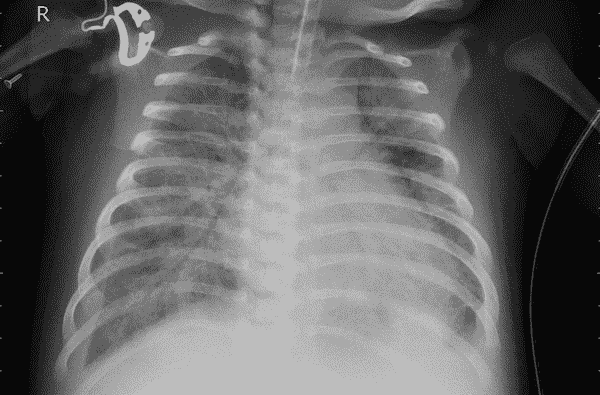

# 前言

今天，机器学习（ML）是人工智能（AI）中最具商业价值的子学科。ML 系统被用于在全球经济和政府中作出高风险决策，如就业、保释、假释、贷款、安全等高影响应用。在企业环境中，ML 系统被用于组织的各个部门——从面向消费者的产品到员工评估，再到后台自动化等等。事实上，过去的十年见证了 ML 技术的更广泛应用。但同时也证明，ML 对其运营者、消费者甚至普通公众都带来了风险。

和所有技术一样，ML 可能会失败——无论是无意的误用还是有意的滥用。截至 2023 年，已有数千份关于算法歧视、数据隐私侵犯、训练数据安全漏洞及其他有害事件的公开报告。在组织和公众能够实现这一令人兴奋的技术的真正好处之前，必须减轻这些风险。应对 ML 的风险需要从业者采取行动。虽然本书旨在遵循初步形成的标准，但 ML 实践仍缺乏广泛接受的专业许可或最佳实践。这意味着在部署到现实世界中时，个体从业者主要要对其技术的好坏后果负责。*高风险应用的机器学习*将为从业者提供模型风险管理过程的深入理解，并介绍如何使用常见的 Python 工具来训练可解释模型，并通过调试确保其可靠性、安全性、偏见管理、安全性和隐私问题。

###### 注意

我们采用了 Stuart Russell 和 Peter Norvig 的书籍[*人工智能：一种现代方法*](https://oreil.ly/oosZs)中对 AI 的定义：设计和构建智能系统，这些系统接收来自环境的信号，并采取影响该环境的行动（2020 年）。对于机器学习（ML），我们使用通常被归因于阿瑟·塞缪尔的普遍定义：[一种]研究领域，使计算机能够在没有显式编程的情况下学习（大约 1960 年）。

# 谁应该阅读这本书

这是一本主要面向早期至中期职业生涯的机器学习工程师和数据科学家的技术书籍，他们希望了解机器学习的责任使用或机器学习风险管理。代码示例使用 Python 编写。也就是说，这本书可能并非适合每一个在 Python 编码的数据科学家和工程师。如果你希望学习一些模型治理基础知识，并更新你的工作流程以适应基本的风险控制，那么这本书适合你。如果你的工作需要遵守某些不歧视、透明、隐私或安全标准，这本书也适合你。（尽管我们不能保证合规性或提供法律建议！）如果你想训练可解释的模型，并学会编辑和调试它们，那么这本书也适合你。最后，如果你担心你在机器学习中的工作可能导致与社会学偏见、数据隐私违规、安全漏洞或其他自动决策造成的已知问题相关的意外后果，并且你希望采取行动，那么这本书也适合你。

当然，这本书可能也会吸引其他人的兴趣。如果你从物理学、计量经济学或心理测量学等领域转入机器学习，这本书可以帮助你学习如何将新的机器学习技术与建立的领域专业知识和有效性或因果关系的概念相结合。本书可能为监管者或政策专业人士提供一些关于当前可用于遵守法律、法规或标准的机器学习技术状态的见解。技术风险执行官或风险经理可能会发现本书对提供适用于高风险应用的更新 ML 方法的概述很有帮助。专业的数据科学家或机器学习工程师也可能会觉得本书具有教育意义，但他们可能也会发现它挑战了许多已建立的数据科学实践。

# 读者将学到什么

阅读这本书的读者将接触传统的模型风险管理以及如何将其与计算机安全最佳实践（如事件响应、漏洞赏金和红队演练）融合，以将经过实战验证的风险控制应用于机器学习工作流程和系统中。本书将介绍一些较旧和较新的可解释模型，以及使机器学习系统更加透明的解释技术。一旦我们建立了高度透明模型的坚实基础，我们将深入探讨如何测试模型的安全性和可靠性。当我们能看到我们的模型如何工作时，这项工作就变得更加容易！我们将远远超出留置数据的质量测量，探索如何应用诸如残差分析、敏感性分析和基准测试等众所周知的诊断技术到新类型的机器学习模型上。然后，我们将进一步结构化模型以进行偏差管理、测试偏差，并从组织和技术角度进行偏差纠正。最后，我们将讨论机器学习管道和 API 的安全性。

###### 注意

欧盟 AI 法案草案将以下机器学习应用归类为高风险：生物识别身份验证；关键基础设施管理；教育；就业；公共（如公共援助）和私人（如信贷放款）的基本服务；执法；移民和边境管控；刑事司法；以及民主进程。这些是我们在提到高风险应用时考虑的 ML 使用案例类型，这也是为什么我们选择在本书中的代码示例中专注于计算机视觉和基于树的表格数据模型的原因。

读者还应该注意，在本书的第一版中，我们专注于更为成熟的机器学习方法来进行估算和决策。我们没有深入探讨无监督学习、搜索、推荐系统、强化学习和生成型人工智能。这样做有几个原因：

+   这些系统还不是最常见的商业生产系统。

+   在继续进行更复杂的无监督、推荐和强化学习或生成方法之前，我们掌握基础知识至关重要。本书的第一版专注于基础知识，这将使读者能够稍后进行更复杂的项目。

+   对于这些系统的风险管理尚不如我们在本书中专注的监督模型类型那样理解透彻。直截了当地说——正如我们在本书的其余部分经常做的那样——使用失败模式、缓解措施和控制措施未知的模型可能会增加风险。

我们希望将来能够重返这些话题，并承认它们今天对数十亿人产生了积极和消极的影响。我们还注意到，通过一点创造力和努力，本书中的许多技术、风险缓解措施和风险管理框架可以和应该应用于无监督模型、搜索、推荐和生成型人工智能。

###### 注意

像 ChatGPT 和 GitHub Copilot 这样的前沿生成型人工智能系统，是影响我们生活的一种激动人心的方式。这些系统似乎已经解决了早期类似系统困扰的偏见问题。然而，在高风险应用中使用它们仍然存在风险。如果我们在使用它们时有顾虑，我们应考虑以下简单的防护措施：

不要从用户界面复制粘贴。

不直接使用生成的内容，也不将我们自己的内容直接粘贴到界面中，可以限制知识产权和数据隐私风险。

检查所有生成的内容。

这些系统继续生成错误、冒犯性或其他问题内容。

避免自动化的自满。

一般来说，这些系统更适合于内容生成，而不是决策支持。我们应该小心，不要让它们无意中为我们做出决定。

# 与 NIST AI 风险管理框架的一致性

为了遵循我们自己的建议，并使本书对于那些在高风险应用上工作的人更加实用，我们将突出本书中提出的方法与新生的国家标准与技术研究所（NIST）AI 风险管理框架（RMF）的一致性。应用外部标准是一种众所周知的风险管理策略，而 NIST 在权威技术指导方面拥有令人难以置信的记录。AI RMF 具有许多组成部分，但最核心的两个部分是 AI 信任度特征和核心 RMF 指南。信任度特征确立了 AI 风险管理的基本原则，而核心 RMF 指南则提供了风险控制实施的建议。我们将在第 I 部分的每一章的开头，使用一个引用框来详细说明内容如何以及在哪些方面与核心 NIST AI RMF 的地图、测量、管理和治理功能相关联。我们希望与 NIST AI RMF 的对齐可以提高本书的可用性，使其成为更有效的 AI 风险管理工具。

###### 警告

NIST 不会审查、批准、认可或以其他方式处理本书中的任何内容，包括与 AI RMF 相关的任何声明。所有 AI RMF 内容仅仅是作者的观点，并且绝不反映 NIST 的官方立场或 NIST 与本书或作者之间的任何官方或非官方关系。

# 书籍大纲

本书分为三个部分。第 I 部分从实际应用的角度讨论问题，必要时混入理论。第 II 部分包含长篇 Python 编程示例，从结构化和非结构化数据的角度讨论第 I 部分中的主题。第 III 部分提供了如何在真实世界的高风险用例中取得成功的宝贵建议。

## 第 I 部分

第一章深入探讨了待定法规、产品责任的讨论，并对传统模型风险管理进行了彻底的处理。由于许多这些实践假设对建模采用了相对稳定和专业的方法，与今天普遍的“快速迭代、破坏式革新”精神截然不同，我们还将讨论如何将假定失败的计算机安全最佳实践纳入模型治理中。

第二章介绍了可解释模型的新兴生态系统。我们深入讨论了广义可加模型（GAM）家族，但也讨论了许多其他类型的高质量和高透明度估计器。 第二章还概述了许多不同的后评解释技术，但着重于严谨性和这个有些被过度宣传的负责任机器学习技术子领域的已知问题。

第三章以测试模型的假设和真实世界可靠性的方式进行模型验证。我们将讨论软件测试基础，并触及模型调试领域的亮点。

第四章概述了机器学习中公平性和偏见的*社会技术*方面，然后过渡到技术性偏见测量和修复方法。 第四章然后详细讨论了偏见测试，包括对差异冲击和差异有效性的测试。 第四章还涵盖了已建立的和保守的偏见修复方法，以及更先进的双目标、对抗性以及前处理、处理中和后处理的修复技术。

第五章通过讲述如何对抗 ML 系统来结束第一部分，从计算机安全的基础开始，深入讨论常见的 ML 攻击、对抗性 ML 和鲁棒 ML。

第一部分中的每一章结束时都会进行案例讨论，涉及 Zillow 的 iBuying 崩溃、英国的 A 级考试丑闻、自动驾驶 Uber 的致命事故、Twitter 的首次偏见漏洞赏金以及真实世界的机器学习逃避攻击等主题。每一章还将概述内容与 NIST AI RMF 的一致性。

## 第二部分

第二部分通过一系列详细的代码示例章节扩展了第一部分中的想法。 第六章在一个基本的消费金融案例中详细介绍了可解释增强机器（EBMs）、XGBoost 和可解释人工智能技术。

第七章将后评解释技术应用到 PyTorch 图像分类器中。

在第八章，我们将调试我们的消费金融模型以解决性能问题，并在第九章中为我们的图像分类器做同样的处理。

第十章包含与偏见测试和偏见修复相关的详细示例，而第十一章则提供了针对基于树的模型的机器学习攻击和对策的示例。

## 第三部分

我们在第十二章中以更一般的建议结束本书，介绍如何在高风险的机器学习应用中取得成功。这并不是通过快速推进和破坏来实现的。对于一些低风险的用例，快速而不拘一格的方法可能没问题。但随着机器学习在更多高风险应用中的规范化使用，破坏事物的后果变得更加严重。第十二章通过实践经验为在高风险场景中应用机器学习提供了宝贵的实用建议。

本书第一版的希望是提供一个合法的选择，以取代目前机器学习中常见的不透明和紧迫时间框架的工作流。本书应该为从业者提供一组词汇、思想、工具和技术，使他们在非常重要的工作中更加审慎。

# 示例数据集

本书依赖于两个主要数据集，用于解释技术或演示方法，并讨论它们的结果。这些是示例数据集，不适合在高风险应用中训练模型，但它们广为人知且易于获取。它们的缺点也使我们能够指出各种数据、建模和解释的陷阱。在接下来的章节中，我们会多次提到这些数据集，因此在深入阅读本书其他部分之前，请务必熟悉它们。

## 台湾信用数据

在结构化数据章节——第六章、8 章、10 章和 11 章——我们使用了来自加州大学尔湾分校[机器学习库](https://oreil.ly/xJ5u2)或[Kaggle](https://oreil.ly/DmAWe)中稍作修改的台湾信用数据版本。该信用卡违约数据包含 2005 年台湾信用卡客户的人口统计和支付信息。通常情况下，该数据集的目标是使用过去的支付状态（`PAY_*`）、过去的支付金额（`PAY_AMT*`）和账单金额（`BILL_AMT*`）作为输入，预测客户是否能够满足下一笔付款（`DELINQ_NEXT` = 0）。货币金额以新台币报告。我们在该数据集中添加了模拟的`SEX`和`RACE`标记，以说明偏见测试和补救方法。我们将支付信息作为输入特征，并遵循管理 ML 系统中偏见的最佳实践，不使用人口统计信息作为模型输入。完整的数据字典可在表 P-1 中找到。

表 P-1\. 信用卡违约数据字典

| Name | 建模角色 | 测量级别 | 描述 |
| --- | --- | --- | --- |
| `ID` | ID | Int | 唯一行标识符 |
| `LIMIT_BAL` | 输入 | 浮点数 | 先前授信额度 |
| `SEX` | 人口统计信息 | Int | 1 = 男性；2 = 女性 |
| `RACE` | 人口统计信息 | Int | 1 = 西班牙裔；2 = 黑人；3 = 白人；^(a) 4 = 亚洲人 |
| `EDUCATION` | 人口统计信息 | 整数 | 1 = 研究生院；2 = 大学；3 = 高中；4 = 其他 |
| `MARRIAGE` | 人口统计信息 | 整数 | 1 = 已婚；2 = 单身；3 = 其他 |
| `AGE` | 人口统计信息 | 整数 | 年龄（岁） |
| `PAY_0`, `PAY_2`–`PAY_6` | 输入 | 整数 | 过去付款记录；`PAY_0` = 2005 年 9 月偿还状况；`PAY_2` = 2005 年 8 月偿还状况；…；`PAY_6` = 2005 年 4 月偿还状况。偿还状况的测量尺度为：-1 = 按时支付；1 = 一个月延迟支付；2 = 两个月延迟支付；…；8 = 八个月延迟支付；9 = 九个月及以上延迟支付 |
| `BILL_AMT1`–`BILL_AMT6` | 输入 | 浮点数 | 账单金额；`BILL_AMT1` = 2005 年 9 月账单金额；`BILL_AMT2` = 2005 年 8 月账单金额；…；`BILL_AMT6` = 2005 年 4 月账单金额 |
| `PAY_AMT1`–`PAY_AMT6` | 输入 | 浮点数 | 先前付款金额；`PAY_AMT1` = 2005 年 9 月付款金额；`PAY_AMT2` = 2005 年 8 月付款金额；…；`PAY_AMT6` = 2005 年 4 月付款金额 |
| `DELINQ_NEXT` | 目标 | 整数 | 下一个客户的付款是否拖欠（迟到），1 = 迟到；0 = 按时 |
| ^(a) 有关“白人”是否应该与“黑人”一样在提到种族人口统计群体时大写的持续辩论。在本书中，我们通常遵循许多[权威声音](https://oreil.ly/3iKFj)在出版界和学术界的做法，将“黑人”大写，以认可其共同的历史和文化身份。 |

正如读者在接下来的章节中将看到的，该数据集编码了一些病理缺陷。它太小，无法训练可用的高容量机器学习估算器，而 `DELINQ_NEXT` 的几乎所有信号都编码在 `PAY_0` 中。随着本书的进展，我们将努力解决这些问题并揭示其他问题。

## Kaggle 胸部 X 光数据

对于深度学习章节——第六章和第九章——我们将使用 Kaggle 的[胸部 X 光图像数据集](https://oreil.ly/TsoGB)。该数据集由大约 5800 张图像组成，包括肺炎和正常两类。这些标签由人类领域专家确定。这些图像是去标识化的胸部 X 光片，拍摄于广州妇女儿童医疗中心的例行护理访问期间。参见图 P-1 以查看肺炎图像示例。

###### 图 P-1\. Kaggle 胸部 X 光数据集中的肺炎图像示例

我们将在这本书的后续章节中面临的主要问题是数据集规模较小——即使用于迁移学习任务，数据集中图像之间存在的错位，可能导致快捷学习的视觉伪影，以及需要领域专业知识来验证建模结果。与台湾信用数据类似，我们将在本书的后续章节中解决这些问题并发现更多问题。

# 本书中使用的惯例

本书使用以下排版约定：

*Italic*

表示新术语或重要想法。

`Constant width`

用于程序清单，以及段落内部用于引用程序元素，如变量或函数名、数据库、数据类型、环境变量、语句和关键字。

###### 注意

此元素表示一般性的注意事项或建议。

###### 警告

此元素表示警告或注意事项。

# 在线图表

您可以在[*https://oreil.ly/MLHA-figures*](https://oreil.ly/MLHA-figures)找到一些图表的更大、彩色版本。每个图表的链接也会出现在它们的标题中。

# 使用代码示例

补充材料（代码示例、练习等）可在[*https://oreil.ly/machine-learning-high-risk-apps-code*](https://oreil.ly/machine-learning-high-risk-apps-code)下载。

###### 注意

随着时间的推移，代码示例可能会与书中打印的示例有所不同。

如果您有技术问题或使用代码示例遇到问题，请发送电子邮件至*bookquestions@oreilly.com*。

本书旨在帮助您完成工作。一般而言，如果本书提供了示例代码，您可以在您的程序和文档中使用它。除非您要复制大量代码，否则无需联系我们请求许可。例如，编写一个使用本书中多个代码片段的程序不需要许可。销售或分发 O’Reilly 图书的示例需要许可。通过引用本书回答问题并引用示例代码不需要许可。将本书中大量示例代码整合到您产品的文档中需要许可。

我们感谢您，但通常不需要署名。署名通常包括标题、作者、出版商和 ISBN。例如：“*Machine Learning for High-Risk Applications* by Patrick Hall, James Curtis, and Parul Pandey (O’Reilly)。2023 年版权 Patrick Hall, James Curtis, and Parul Pandey, 978-1-098-10243-2。”

如果您觉得您使用的代码示例超出了合理使用范围或以上授权，请随时联系我们*permissions@oreilly.com*。

# 致谢

感谢我们在 O’Reilly 的编辑和制作团队，特别是 Michele Cronin 和 Gregory Hyman；我们的副校对，Liz Wheeler；以及我们的项目编辑，Rebecca Novack 和 Nicole Butterfield。也特别感谢我们的技术评审员 Navdeep Gill，Collin Starkweather，Hariom Tatstat 和 Laura Uzcátegui。

## Patrick Hall

感谢 Lisa 和 Dylan 在漫长的起草和编辑过程中的爱和支持。也感谢我过去十年在高级分析研究所，SAS 研究所，乔治·华盛顿商学院，H2O.ai，SolasAI，AI 事故数据库，NIST 和 BNH.AI 的同事们。

## James Curtis

感谢我的妻子 Lindsey，她坚定的爱构成了我生活的基石。我的孩子 Isaac 和 Micah 在编写本书时没有提供太多帮助，但我仍然感激他们。最后，我必须感谢我在 SolasAI 的前同事，特别是 Nick 和 Chris，为他们提供的许多富有洞察力的讨论。

## Parul Pandey

写这本书时，我非常感激丈夫 Manoj 和儿子 Agrim 的爱和支持。他们不仅鼓励我承担这项巨大任务，而且在我花数小时在书房工作时深表理解。
