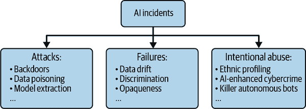

# 第一章：当代机器学习风险管理

构建最佳的机器学习系统始于文化能力和业务流程。本章介绍了许多文化和程序方法，可以用来改进 ML 性能并保护我们组织的 ML 免受现实世界的安全性和性能问题。它还包括一个案例研究，说明了当 ML 系统在没有适当人类监督的情况下使用时会发生什么。本章讨论的方法的主要目标是创建更好的 ML 系统。这可能意味着改进体外测试数据的性能。但实际上意味着构建一旦部署在体内就能按预期运行的模型，以便我们不会损失金钱、伤害人员或造成其他伤害。

###### 注意

*In vivo*是拉丁文，意为“在生活中”。我们有时会使用这个术语来表示与人类用户交互时 ML 模型在真实世界中的表现方式。*In silico*意思是“通过计算建模或计算机模拟”，我们将使用这个术语来描述数据科学家在开发环境中部署 ML 模型之前经常进行的测试数据。

本章以讨论当前机器学习法律和监管环境以及一些新兴的最佳实践指导开始，以帮助系统开发人员了解在安全性和性能方面的基本义务。我们还会介绍本书如何与国家标准与技术研究所（NIST）[AI 风险管理框架](https://oreil.ly/Or940)（RMF）保持一致。因为不学习历史的人注定会重蹈覆辙，该章节还突出了 AI 事故，并讨论了为何了解 AI 事故对于 ML 系统的安全性和性能至关重要。由于许多 ML 安全问题需要超越技术规范的思考，该章节还融合了模型风险管理（MRM）、信息技术（IT）安全指导以及其他领域的实践，提出了许多改进组织内 ML 安全文化和流程的想法。该章节将以一个关于安全文化、法律后果和 AI 事故的案例研究作为结尾。

本章讨论的风险管理方法没有一种是万全之策。如果我们希望成功地管理风险，我们需要从众多可用的控制措施中选择最适合我们组织的措施。较大的组织通常能够进行比较全面的风险管理。大型组织的读者可能能够在各个部门、分部或内部职能中实施许多控制措施。较小的组织的读者将不得不审慎选择其风险管理策略。最终，技术风险管理很大程度上取决于人的行为。无论组织实施哪些风险控制措施，都需要与建立和维护 ML 系统的*人员*的强有力治理和政策相结合。

# 法律和监管环境的快照

ML 没有监管是个谬论。ML 系统可能会违法。忘记或忽视法律背景是组织对 ML 系统做的最危险的事情之一。尽管如此，ML 的法律和监管环境又复杂且快速变化。本节旨在提供重要的法律和监管法规的概览和认识。我们将首先介绍即将推出的欧盟 AI 法案。然后我们将讨论许多美国联邦法律和法规与 ML 相关，美国州和市政法律与 AI 相关，以及产品责任的基本情况，最后以对最近联邦贸易委员会（FTC）的执法行动的概述结束本节。

###### 警告

作者不是律师，本书中没有任何法律建议。法律与 AI 的交集是一个极其复杂的主题，数据科学家和 ML 工程师无法单独处理。您可能对您所工作的 ML 系统有法律上的顾虑。如果是这样，请寻求真正的法律建议。

## 欧盟 AI 法案建议

欧盟已提议针对人工智能的全面法规，预计将于 2023 年通过。被称为[欧盟 AI 法案](https://oreil.ly/x5dLT)（AIA），它们将禁止某些使用 AI 的方式，如扭曲人类行为、社会信用评分和实时生物识别监视。AIA 将其他使用情形视为高风险，包括在刑事司法、生物识别识别、就业筛选、关键基础设施管理、执法、基本服务、移民等领域的应用，对这些领域施加了高度的文档化、治理和风险管理责任。其他应用将被视为有限或低风险，对其制造商和运营商的合规义务较少。就像欧盟的《通用数据保护条例》（GDPR）已经改变了美国及全球公司处理数据的方式一样，欧盟的 AI 法规旨在对美国及其他国际 AI 部署产生巨大影响。无论我们是在欧盟工作与否，可能都需要开始熟悉 AIA。阅读[附件](https://oreil.ly/0k_TQ)，特别是定义术语和布局文件和符合性要求的附件 1 和 3-8，是了解 AIA 的最佳方式之一。

## 美国联邦法律和法规

由于几十年来我们在政府和经济中以各种形式使用算法，许多美国联邦法律和法规已经涉及人工智能（AI）和机器学习（ML）。这些法规通常关注算法引发的社会歧视问题，同时也涉及透明度、隐私等主题。1964 年和 1991 年的《民权法案》、《美国残疾人法案》（ADA）、《平等信贷机会法》（ECOA）、《公平信用报告法》（FCRA）和《公平住房法》（FHA）等是一些旨在防止就业、信贷借贷和住房等领域的算法歧视的联邦法律。ECOA 和 FCRA 以及它们在《B 条例》中更为详细的实施尝试增加 ML 基础信贷借贷的透明度，并保障信贷消费者的申诉权利。对于被拒绝的信贷申请，贷方应当说明拒绝的原因，即*不利行动*，并描述驱动决策的 ML 模型的特征。如果提供的推理或数据有误，消费者应能够申诉决策。

MRM 实践的定义部分包含在联邦储备委员会的[SR 11-7 指南](https://oreil.ly/xpr5P)中，这形成了对大型美国银行进行监管审查的一部分，并为在关键金融应用中使用的机器学习的良好和可靠性表现设置了组织、文化和技术流程。本章的很大部分受到 MRM 指导的启发，因为它是经过最多次检验的机器学习风险管理框架。类似于 1996 年的《健康保险移植和责任法案》（HIPAA）和《家庭教育权利与隐私法案》（FERPA）等法律在医疗保健和学生数据隐私方面设定了严格的期望。与 GDPR 类似，HIPAA 和 FERPA 与机器学习的互动具有实质性、复杂且仍在辩论中的影响。这些甚至不是所有可能影响我们机器学习使用的美国法律，但希望这个简要列举提供了美国联邦政府认为重要而需要监管的概念。

## 州和市政法律

美国各州和城市也已经开始制定 AI 和 ML 的法律和法规。纽约市（NYC）的地方法规 144 号要求对自动化就业决策工具进行偏见审计，最初预计将于 2023 年 1 月生效。根据这项法律，纽约市的每家主要雇主都必须对自动化就业软件进行偏见测试，并在其网站上发布结果。华盛顿特区提议的《通过算法停止歧视法案》试图复制联邦对非歧视和透明度的期望，但适用范围更广，适用于在 DC 运营或使用许多 DC 市民数据的公司。

许多州还通过了自己的数据隐私法律。与老式的 HIPAA 和 FERPA 联邦法不同，这些州数据隐私法律通常是有意设计为部分监管 AI 和 ML 的使用。像加利福尼亚州、科罗拉多州、弗吉尼亚州等州通过的数据隐私法律提到增加透明度、减少偏见或两者兼顾，适用于自动决策系统。一些州还将生物特征数据或社交媒体纳入其监管范围。例如，伊利诺伊州的《生物信息隐私法》（BIPA）禁止许多生物特征数据的使用，并且伊州监管机构已经开始了执行行动。联邦数据隐私或 AI 法律的缺失，加上这些新的州和地方法律，使得 AI 和 ML 的合规性格局非常复杂。我们对 ML 的使用可能或可能不受到监管，或者根据系统的具体应用、行业和地理位置在不同程度上受到监管。

## 基本产品责任

作为消费品制造商，数据科学家和机器学习工程师有责任创建安全系统。引用最近的布鲁金斯研究所报告，[“产品责任法作为解决人工智能伤害的途径”](https://oreil.ly/2K_R6)，“制造商有责任制造在合理预见的使用方式下安全的产品。如果人工智能系统在可预见的使用方式下造成伤害，原告可以主张制造商因未能认识到可能性而存在过失。” 就像汽车或电动工具制造商一样，机器学习系统的制造商也要遵守广泛的过失和安全法律标准。产品安全已经成为大量法律和经济分析的主题，但本小节将专注于最早和最简单的过失标准之一：汉德法则。以法官勒纳德·汉德命名，并在 1947 年首次提出，它为机器学习产品制造商提供了一个可行的过失和尽职调查框架。汉德法则指出，产品制造商承担了一种关怀的负担，并且在这种关怀上投入的资源应始终大于可能涉及产品的事故的成本。用代数方式表述：

<math alttext="dollar-sign upper B u r d e n greater-than-or-equal-to upper R i s k equals left-parenthesis upper P r o b a b i l i t y o f l o s s right-parenthesis left-parenthesis upper L o s s s i z e right-parenthesis dollar-sign"><mrow><mi>B</mi> <mi>u</mi> <mi>r</mi> <mi>d</mi> <mi>e</mi> <mi>n</mi> <mo>≥</mo> <mi>R</mi> <mi>i</mi> <mi>s</mi> <mi>k</mi> <mo>=</mo> <mo>(</mo> <mi>P</mi> <mi>r</mi> <mi>o</mi> <mi>b</mi> <mi>a</mi> <mi>b</mi> <mi>i</mi> <mi>l</mi> <mi>i</mi> <mi>t</mi> <mi>y</mi> <mi>o</mi> <mi>f</mi> <mi>l</mi> <mi>o</mi> <mi>s</mi> <mi>s</mi> <mo>)</mo> <mo>(</mo> <mi>L</mi> <mi>o</mi> <mi>s</mi> <mi>s</mi> <mi>s</mi> <mi>i</mi> <mi>z</mi> <mi>e</mi> <mo>)</mo></mrow></math>

更通俗地说，组织被期望按照与可预见风险相关的成本水平来应用关怀，即时间、资源或金钱。否则将可能导致法律责任。在图 1-1 中，负担是抛物线增长线，而风险或概率乘以损失是抛物线下降线。尽管这些线条与具体测量无关，但它们的抛物线形状旨在反映消除所有机器学习系统风险的最后一公里问题，并显示超过合理阈值的额外关怀会导致递减的风险回报率。

###### 图 1-1\. 汉德法则（改编自[“事故法中责任替代标准的经济分析”](https://oreil.ly/9_u8H)）

###### 注：

对技术事故的风险的相当标准定义是估计的事故发生的可能性乘以其估计的成本。更广泛地说，国际标准化组织（ISO）在企业风险管理背景下定义风险为“不确定性对目标的影响”。

尽管按照 Hand 法则准确计算数量可能太耗资源，但在设计机器学习系统时考虑到过失和责任的概念非常重要。对于给定的机器学习系统，如果事故发生的概率高，如果与系统事故相关的金钱或其他损失很大，或者两者都很大，组织需要额外投入资源来确保该系统的安全性。此外，组织应尽最大努力记录尽职调查超过估计的故障概率乘以估计的损失。

## 联邦贸易委员会执法

我们可能会陷入麻烦的情况是怎样的？如果你在受监管的行业工作，你可能知道你的监管者。但如果我们不知道我们的工作是否受到监管，或者如果我们越过了法律或监管的红线会有什么后果，那么我们可能需要最关注的是美国联邦贸易委员会（FTC）。FTC 广泛关注不公平、欺骗或掠夺性贸易行为，并且他们已经找到理由在三年内摧毁了至少三个知名的机器学习算法。凭借他们的新执法工具*算法返还*，FTC 有能力删除算法和数据，并且通常会禁止未来通过有问题的算法进行收入的生成。[剑桥分析公司](https://oreil.ly/cM3V8)是第一家面临这种惩罚的公司，因为他们在 2016 年选举期间围绕欺骗性数据收集实践。[Everalbum](https://oreil.ly/05SO5)和[WW](https://oreil.ly/PMOq0)，即重量观察者，也曾面临返还。

FTC 对于执行 AI 和 ML 的联邦法律一直持续关注，毫不掩饰其意图。 FTC 委员会在[算法和经济正义](https://oreil.ly/v8Z4y)方面撰写了漫长的论文。 他们还发布了至少两篇博客，为希望避免执行行动的公司提供了高层次的指导。 这些博客突出了组织应该采取的若干具体步骤。 例如，在[“使用人工智能和算法”](https://oreil.ly/066Y-)中，FTC 明确表示，不应误导消费者与伪装成人类的 ML 系统互动。 "责任"是“在公司使用 AI 中追求真相，公平和公平性”的另一个主题，“对自己负责，否则 FTC 将代您负责”（原作者强调）。 这种非常直接的语言对于监管者来说是不寻常的。 在“使用人工智能和算法”中，FTC 提出：“考虑如何对自己负责，以及使用独立标准或独立专业知识是否有意义，以退后一步并审视您的 AI。” 下一节介绍了我们可以使用的一些新兴独立标准，以增加责任感，制造更好的产品并减少任何潜在的法律责任。

# 权威最佳实践

当今数据科学大多数缺乏专业标准和许可，但一些权威指导正在逐渐出现。 ISO 正在开始概述[AI 的技术标准](https://oreil.ly/8ZeJQ)。 确保我们的模型符合 ISO 标准将是将独立标准应用于我们的 ML 工作的一种方法。 特别是对于美国的数据科学家来说，NIST AI RMF 是一个非常重要的项目要关注。

AI RMF 的第 1 版于 2023 年 1 月发布。 框架提出了 AI 系统信任度的特征：有效性，可靠性，安全性，韧性，透明度，责任，可解释性，解释性，偏见管理和增强隐私。 然后，它在四个组织功能（映射，测量，管理和治理）中提供了可操作的指导。 映射，测量，管理和治理功能中的指导被细分为更详细的类别和子类别。 要查看这些指导类别，请查看[RMF](https://oreil.ly/kxq-G)或[AI RMF playbook](https://oreil.ly/dn4xs)，该书提供了更详细的建议。

###### 注意

NIST AI 风险管理框架是改进 AI 和 ML 系统信任度的*自愿*工具。 AI RMF 不是法规，NIST 也不是监管机构。

为了遵循我们自己的建议，以及监管机构和权威指南的建议，并使本书更加实用，我们将指出每个章节在 第一部分 中与 AI RMF 的内容如何对应。在这段文字之后，读者将找到一个专门匹配 AI RMF 子类别的信息框。这样做的目的是让读者能够使用表格了解每个章节讨论的方法如何帮助他们遵循 AI RMF。由于在某些情况下，子类别的建议可能对机器学习从业者而言显得抽象，我们提供更加实践导向的语言，与 RMF 类别相匹配；这将有助于将 RMF 转化为实际的机器学习部署。查看信息框，看看我们如何认为 第一章 与 AI RMF 相符，并在 第一部分 的每个章节开头寻找类似的表格。

# AI 事件

在很多方面，机器学习安全流程和相关模型调试的基本目标，也在 第三章 中讨论，是预防和减轻 AI 事件。在这里，我们宽泛地定义 AI 事件为系统可能造成危害的任何结果。当使用 Hand 法则作为指导时，一个 AI 事件造成的损失会增加，而操作人员采取的措施来减少这些损失会减少。

因为复杂系统趋向于失败，所以没有缺乏可以作为例子讨论的 AI 事件。AI 事件可以从令人讨厌的事情到致命的事情不等——从 [购物中心安保机器人摔倒楼梯](https://oreil.ly/fLHU1)，到 [自动驾驶汽车撞到行人](https://oreil.ly/vFW_-)，再到 [大规模转移医疗资源](https://oreil.ly/2e8WQ) 远离最需要它们的人群。如 图 1-2 所示，AI 事件大致可以分为三大类：

滥用

AI 可以被用于恶意目的，与其他 AI 系统的特定攻击和攻击无关。也许现在已经有黑客利用 AI 来增加其更一般攻击的效率和强度。未来可能会更加可怕，像自主无人机攻击和威权政权的族群分类已经在地平线上了。

攻击

研究人员已经发布了各种主要类型的攻击示例 —— 保密性、完整性和可用性攻击（有关更多信息，请参见第五章）。保密性攻击涉及从 AI 系统端点窃取训练数据或模型逻辑。完整性攻击包括通过敌对示例、逃避、冒充或毒化来对训练数据或模型结果进行敌对操作。可用性攻击可以通过更标准的拒绝服务方法、过度使用系统资源的海绵示例，或通过某些对手引起的算法歧视来拒绝向某些用户群体提供系统服务。

失败

AI 系统的故障往往涉及算法歧视、安全和性能失误、数据隐私侵犯、透明度不足或第三方系统组件问题。

AI 事件是现实存在的。就像它们产生的系统一样，AI 事件可能非常复杂。AI 事件有多种原因：故障、攻击和滥用。它们还倾向于将传统的计算机安全概念与数据隐私和算法歧视等问题融合在一起。

###### 图 1-2\. AI 事件的基本分类（改编自[“当 AI 失败时该怎么办”](https://oreil.ly/AHfmK)）

2016 年的[Tay 聊天机器人事件](https://oreil.ly/a-DhB)是一个富有启发性的例子。 Tay 是由微软研究部门的一些全球领先专家为增强人们对 AI 的认识而设计的最新型聊天机器人。发布仅 16 小时后——在发布 96,000 条推文后——Tay 已经演变成了一个新纳粹色情作家，并被迫关闭。 发生了什么？ Twitter 用户很快就发现，Tay 的自适应学习系统很容易被毒化。 被发表在机器人上的种族主义和性内容被整合到了其训练数据中，并迅速导致了令人反感的输出。 数据毒化是一种完整性攻击，但由于其进行的背景，此攻击导致了算法歧视。 还值得注意的是，Tay 的设计者们，作为一家拥有极其充足研究资金的顶尖研究中心的世界级专家，似乎已经设置了一些防范措施。 Tay 会对某些热门问题做出预先制定的回应。 但这还远远不够，Tay 最终演变成了微软研究部门的公共安全和算法歧视事件。

以为这是个别事件？错了。最近，再次由于炒作和未能系统地考虑性能、安全性、隐私和安全风险，Tay 的许多明显失败在 Scatter Lab 发布的其李露达聊天机器人中[再次重演](https://oreil.ly/5OLXV)。设计 ML 系统时，计划应与过去已知的事件进行比较，以期预防未来类似事件。这正是最近[AI 事件数据库工作](https://oreil.ly/vvLbp)及相关[出版物](https://oreil.ly/59yaY)的目的所在。

AI 事件也可以成为负责任技术开发的非政治激励因素。无论好坏，有关算法歧视和数据隐私等话题的文化和政治观点可能存在广泛差异。让一个团队就伦理考虑达成一致可能非常困难。让他们致力于防止尴尬且潜在成本高昂或危险的事件可能会更容易，这应该是任何认真的数据科学团队的基本目标。AI 事件的概念是理解 ML 安全的核心；本章内容的中心主题是可以用来预防和减轻 AI 事件的文化能力和业务流程。我们将在接下来的章节深入探讨这些减轻措施，并深入研究一个真实事件以结束本章。

# 机器学习风险管理的文化能力

组织文化是负责任 AI 的重要方面。本节将讨论文化能力，如责任制，自己的香槟，领域专业知识以及陈旧的“快速前进，打破障碍”的格言。

## 组织责任制

成功缓解 ML 风险的关键是组织内对 AI 事件的真正责任制。如果当 ML 系统失败、遭到攻击或被滥用以不正当目的时，没有人的工作岗位受到影响，那么很可能这个组织中没有人真正关心 ML 的安全性和性能。除了考虑风险、应用软件质量保证（QA）技术和模型调试方法的开发人员外，组织还需要有人员或团队验证 ML 系统技术并审计相关流程。组织还需要有人负责 AI 事件响应计划。这就是为什么领先的金融机构，在其长期受监管的预测建模使用中，采用一种被称为模型风险管理的实践。MRM 模仿了联邦储备的[SR 11-7 模型风险管理指南](https://oreil.ly/xpr5P)，这是在 2008 年金融危机中出现的。值得注意的是，MRM 的实施通常涉及负责任的高级管理人员和数个团队，这些团队负责模型和 ML 系统的安全性和性能。

MRM 标准的实施通常需要几个不同的团队和高层领导。以下是构成 MRM 文化支柱的关键原则之一：

书面政策和流程

制定和使用机器学习的组织规则应该明确并对所有组织利益相关者可获得。接近机器学习系统的人员应接受有关政策和流程的培训。这些规则也应进行审计，以了解何时需要更新。没有人应该声称对规则一无所知，规则应该是透明的，并且不得未经批准更改。政策和流程应包括明确的机制，用于将严重风险或问题上报给高级管理层，并可能应提出举报者流程和保护措施。

有效挑战

有效挑战要求具有改变系统能力的专家，这些专家并未构建被挑战的机器学习系统，进行验证和审计。MRM 实践通常将有效挑战分布在三个“防线”上，有良心的系统开发者构成第一防线，独立、技术娴熟且授权的技术验证人员和流程审计员分别构成第二和第三防线。

负责任的领导

组织内特定的高管应负责确保 AI 事件不会发生。这个职位通常被称为*首席模型风险官*（CMRO）。CMRO 的任职条件和薪酬往往与机器学习系统的表现挂钩。CMRO 角色为机器学习的安全性和性能提供了非常直接的文化检查。如果我们的老板真的关心机器学习系统的安全性和表现，那么我们也会开始关注。

激励措施

数据科学人员和管理人员必须被激励以负责任的方式实施机器学习。通常，压缩的产品时间表可能会激励先创建一个最小可行产品，而将严格的测试和修复工作放在模型生命周期的最后阶段，即部署到生产前。此外，机器学习的测试和验证团队通常会根据与机器学习开发团队相同的标准进行评估，导致了测试人员和验证人员被鼓励快速行动而非确保质量的基本不匹配。通过将时间表、绩效评估和支付激励与团队功能对齐，有助于巩固负责任的机器学习文化和风险缓解。

当然，小型或年轻组织可能无法分配一个全职员工来监控机器学习系统风险。但是，如果机器学习系统导致事件发生，有一个个人或团队应该负责，并且如果系统运行良好，则应该获得奖励。如果一个组织假设每个人都对机器学习风险和 AI 事件负责，那么实际上没有人会负责。

## 有效挑战文化

无论我们的组织是否准备采用成熟的 MRM 实践，我们仍然可以从 MRM 的某些方面中受益。特别是，有效挑战的文化能力可以应用于 MRM 背景之外的环境。在其核心，有效挑战意味着在整个 ML 系统开发过程中积极质疑和追问所采取的步骤。一个鼓励严肃质疑 ML 系统设计的组织文化，将更有可能开发出有效的 ML 系统或产品，并在问题爆发成有害事件之前抓住问题。需要注意的是，有效挑战不能是恶意的，必须对所有开发 ML 系统的人员平等适用，特别是所谓的“摇滚明星”工程师和数据科学家。有效挑战还应该是有结构的，例如每周会议，在这些会议中当前的设计思路会受到质疑，并且会认真考虑替代的设计选择。

## 多样化和经验丰富的团队

多样化的团队可以为 ML 系统的设计、开发和测试带来更广泛和以前未关联的视角。而非多样化的团队则经常不能做到这一点。许多人已经记录了数据科学家在培训或 ML 系统的结果中未考虑人口统计多样性可能导致的不幸后果。解决这类疏忽的一个潜在方案是增加 ML 团队中的人口统计多样性，从其[当前令人遗憾的水平](https://oreil.ly/7M9uB)。在构建团队时，业务或其他领域的经验也很重要。领域专家在特征选择和工程以及系统输出的测试中起着关键作用。在开发 ML 系统的疯狂竞争中，领域专家的参与也可以作为安全检查。广义的数据科学家通常缺乏处理特定领域数据和结果所需的经验。误解输入数据或输出结果的含义是一个灾难的配方，可能导致在系统部署时发生 AI 事故。不幸的是，当涉及到数据科学家忽视或忽略领域专业知识重要性时，社会科学就应该特别强调。在被称为[“科技对社会科学的悄然殖民”](https://oreil.ly/IcIBi)的趋势中，一些组织已经进行了令人遗憾的 ML 项目，试图[取代应由训练有素的社会科学家做出的决策](https://oreil.ly/xI9Jv)，或者简单地[完全忽视社会科学领域专业知识的集体智慧](https://oreil.ly/KvVSv)。

## 亲自体验

也被称为“吃自己的狗食”，喝我们自己的香槟的做法指的是在我们自己的组织内使用我们自己的软件或产品。通常是一种预阿尔法或预贝塔测试的形式，喝我们自己的香槟可以在实际部署环境的复杂性中发现问题，这些问题在影响客户、用户或公众之前可以识别出来。由于像概念漂移、算法歧视、快捷学习和未充分规范化等严重问题在标准机器学习开发过程中很难识别，喝我们自己的香槟为机器学习系统提供了一个有限而受控的，但也是现实的测试平台。当组织雇佣了在机器学习系统部署领域具有不同人口统计和专业背景的团队，并且包括领域专家时，喝我们自己的香槟更有可能发现各种问题。喝我们自己的香槟还将经典的黄金法则引入到人工智能中。如果我们不愿意在自己身上或我们自己的组织中使用某个系统，那么我们可能不应该部署该系统。

###### 注意

在考虑部署环境的一个重要方面是我们的机器学习系统对生态系统和地球的影响，例如：

+   机器学习模型的碳足迹

+   机器学习系统可能通过引发 AI 事件对环境造成损害的可能性

如果我们担心我们模型的环境影响，我们应该将机器学习治理与我们组织的更广泛的环境、社会和治理工作联系起来。

## 快速前进与破坏事物

“快速前进与破坏事物”这句口号对许多“摇滚明星”工程师和数据科学家几乎是一种宗教信仰。不幸的是，这些顶尖从业者似乎也忘记了，当他们快速前进并破坏事物时，事物就真的会被破坏。随着机器学习系统做出更多涉及自动驾驶车辆、信用、就业、大学成绩和考勤、医疗诊断和资源分配、抵押贷款、预审保释、等等高影响决策，破坏事物意味着不仅仅是有 bug 的应用程序。它可能意味着一个小组数据科学家和工程师在规模上对许多人造成了实际的伤害。参与高影响机器学习系统的设计和实施需要改变思维方式，以防止严重的性能和安全问题。从优先考虑能够推动的软件功能数量或 ML 模型的测试数据准确性，转向认识到他们工作的影响和下游风险，这是从业者必须进行的转变。

# 机器学习风险管理的组织流程

组织流程在确保机器学习系统安全和性能方面起着关键作用。与前一节讨论的文化能力一样，组织流程是机器学习系统可靠性的关键非技术决定因素。本节关于流程的内容首先督促从业者考虑、记录并尝试减轻其机器学习系统中已知或可预见的故障模式。然后我们进一步讨论关于 MRM 的更多内容。虽然“机器学习风险管理的文化能力”侧重于使 MRM 取得成功所必需的人和思维方式，本节将概述 MRM 在高级预测建模和机器学习系统中用于减轻风险的不同流程。虽然 MRM 是我们可以共同努力追求的一个值得的流程标准，但还有一些重要的流程控制不典型地包含在 MRM 中。我们将在本节超越传统的 MRM，并突出像对编程或双人编程以及代码部署安全权限要求等关键风险控制流程。本节将以讨论 AI 事故响应结束。无论我们在设计和实施机器学习系统时多么努力地减少伤害，我们仍然必须准备应对失败和攻击。

## 预测故障模式

机器学习安全和伦理专家大致同意需要思考、记录并尝试减轻机器学习系统可预见故障模式的重要性。不幸的是，他们也大多同意这是一项非平凡的任务。值得庆幸的是，近年来在这一主题上出现了新的资源和学术研究，可以帮助机器学习系统设计者以更系统化的方式预测事件。如果可以确定潜在故障的整体类别，那么加强机器学习系统以获得更好的现实世界表现和安全性将成为一项更为积极和高效的任务。在本小节中，我们将讨论一种这样的策略，以及几种用于思考未来机器学习系统中事件的额外流程。

### 已知的过去失败

正如在[“通过分类事件预防重复的现实世界 AI 故障：AI 事故数据库”](https://oreil.ly/BfMJC)中所讨论的，我们在机器学习系统中减轻潜在 AI 事故的最有效方法之一是将我们的系统设计与过去的失败设计进行比较。就像交通专业人员调查和分类事件一样，然后利用所得结论预防相关事件并测试新技术，几位机器学习研究人员、评论员和行业组织已开始收集和分析 AI 事故，以期防止重复和相关的失败。最显著和成熟的 AI 事故库可能是[AI 事故数据库](https://oreil.ly/H8nmd)。这一可搜索和互动资源允许注册用户使用关键字搜索视觉数据库，并查找有关公开记录事件的不同类型信息。

在开发 ML 系统时请参考此资源。如果类似于我们当前设计、实施或部署的系统在过去曾经引发过事件，这是我们新系统可能会引发事件的最强指标之一。如果在数据库中看到熟悉的东西，我们应该停下来，仔细思考我们正在做的事情。

### 想象力的失败

在没有详细背景和细节的情况下想象未来从来不容易。通常是机器学习系统运行的背景，加上意想不到或无法预知的细节，导致 AI 事件的发生。在最近的一篇研讨会论文中，《“克服 AI 注入系统开发和部署中的想象失败”》的作者提出了一些结构化方法来假设这些难以想象的未来风险。除了深思熟虑 AI 事件的“谁”（例如投资者、客户、脆弱的非用户）、“什么”（例如福祉、机会、尊严）、“何时”（例如立即、频繁地、长时间内）、“如何”（例如采取行动、改变信念）之外，他们还敦促系统设计者考虑以下内容：

+   假设系统的影响只会是有益的（并承认系统影响存在不确定性的时候）

+   系统的问题域和应用用例，而不仅仅是数学和技术

+   任何意外或令人惊讶的结果，用户互动以及对系统的响应

引起 AI 事件对组织来说是令人尴尬的，如果不是成本高昂或违法的话。AI 事件还可能伤害消费者和公众利益。然而，通过一些远见，目前已知的许多 AI 事件本可以得到缓解，甚至完全避免。在进行研究和概念化 ML 失败的尽职调查时，我们还可能发现我们的设计或系统必须完全重做。如果情况如此，可以安慰自己，系统实施或部署的延迟可能比我们的组织或公众由于发布有缺陷的系统可能遭受的损害要少。

## 模型风险管理流程

MRM 流程的过程方面要求对建模系统进行彻底的文档记录，对系统进行人工审核，并对系统进行持续监控。这些流程代表了美联储 SR 11-7 MRM 指导方针的大部分治理负担，由美联储和美国货币监理署监督，用于在重要消费金融应用中部署的预测模型。虽然只有大型组织才能完全接受 MRM 所提供的所有内容，但任何认真的机器学习从业者都可以从这一学科中学到一些东西。以下部分将 MRM 流程细分为更小的组成部分，以便读者可以开始考虑在其组织中使用 MRM 的方面。

### 风险分级

正如本章开头所述，某个 ML 系统部署的风险是可能发生的危害的概率和由此导致的可能损失的乘积的结果。在 MRM 的背景下，风险和损失的乘积有一个更正式的名字，*物质性*。物质性是一个强大的概念，使组织能够为 ML 系统分配现实的风险级别。更重要的是，这种风险分层允许有效分配有限的开发、验证和审计资源。当然，最高物质性应用程序应该得到最大的人工关注和审查，而最低物质性应用程序则有可能由自动机器学习（AutoML）系统处理，并进行最少的验证。因为 ML 系统的风险缓解是一个持续且昂贵的任务，所以在高、中、低风险系统之间进行适当的资源分配是有效治理的必需。

### 模型文档

MRM 标准还要求系统进行彻底的文档化。首先，文档化应该能够为系统利益相关者、持续的系统维护以及一定程度的事件响应负责。其次，文档化必须在各系统之间标准化，以实现最高效的审计和评审流程。文档化是确保合规性的关键所在。文档模板，如下一节列表所示，是数据科学家和工程师在标准化工作流程的后期阶段填写的文档，也是大多数文档模板和框架要求在最终模型文档中添加姓名和联系信息的地方，这样就清楚知道谁没有尽力。作为参考，以下章节列表粗略结合了 MRM 文档和欧盟《人工智能法案附件》推荐的典型部分：

+   基本信息

    +   开发人员和利益相关者的名称

    +   当前日期和修订表

    +   模型系统概要

    +   业务或价值论证

    +   预期用途及用户

    +   潜在危害和伦理考虑

+   开发数据信息

    +   开发数据来源

    +   数据字典

    +   隐私影响评估

    +   假设与限制

    +   数据预处理软件实施

+   模型信息

    +   描述经过同行评审的训练算法

    +   模型规范

    +   性能质量

    +   假设与限制

    +   用于训练算法的软件实施

+   测试信息

    +   质量测试与整改

    +   歧视测试与整改

    +   安全测试与整改

    +   假设与限制

    +   用于测试的软件实施

+   部署信息

    +   监控计划和机制

    +   上游和下游依赖关系

    +   申诉和覆盖计划和机制

    +   审计计划和机制

    +   变更管理计划

    +   事件响应计划

+   参考文献（如果我们正在进行科学研究，那么我们将在格式化的参考文献中建立在巨人的肩膀上！）

当然，这些文件可能会有数百页之长，特别是对于重要性高的系统。对于较小或较年轻的组织，提议的[数据表](https://oreil.ly/mjKjy)和[模型卡](https://oreil.ly/DmMp4)标准也可能有所帮助，以实现这些目标。如果读者觉得为其组织撰写冗长的模型文档目前看起来不可行，那么也许这两种更简单的框架可能会起到作用。

### 模型监控

机器学习安全的一个主要租户是，机器学习系统在现实世界中的表现很难预测，因此必须进行监控。因此，部署系统的性能应经常进行监控，直到系统被废弃为止。系统可以监控任何数量的问题条件，最常见的是输入漂移。虽然机器学习系统的训练数据在静态快照中编码了有关系统操作环境的信息，但世界绝非静态。竞争对手可以进入市场，可以颁布新的法规，消费者口味可能会改变，以及可能会发生流行病或其他灾难。这些因素中的任何一个都可能使输入到我们的机器学习系统的实时数据偏离其训练数据的特征，从而导致性能下降甚至危险。为了避免这种不愉快的惊喜，最好的机器学习系统都会监控输入和输出分布的漂移以及质量下降，通常被称为*模型衰减*。虽然性能质量是最常见的监控指标，但机器学习系统也可以监控异常输入或预测、特定攻击和黑客，以及公平性特征的漂移。

### 模型清单

任何部署机器学习的组织都应该能够回答简单的问题，比如：

+   当前部署了多少个机器学习系统？

+   这些系统影响了多少客户或用户？

+   每个系统的负责利益相关者是谁？

MRM 通过使用模型清单实现了这一目标。模型清单是组织所有机器学习系统的精心策划和最新数据库。模型清单可以作为关键信息文档的存储库，但也应链接到监控计划和结果、审计计划和结果、重要的过去和即将进行的系统维护和变更，以及事件响应计划。

### 系统验证和流程审核

在传统的 MRM 实践下，机器学习系统在发布之前会经历两次主要审查。第一次审查是对系统进行技术验证，由熟练的验证人员（通常是博士级别的数据科学家）尝试揭示系统设计和实施中的问题，并与系统开发人员合作解决发现的问题。第二次审查涉及流程。审计和合规人员仔细分析系统设计、开发和部署情况，以及文档和未来计划，确保满足所有法规和内部流程要求。此外，由于机器学习系统会随时间变化和漂移，审查必须在系统经历重大更新或在约定的未来周期时进行。

读者可能又在想，他们的组织没有足够的资源进行如此广泛的审查。当然，对许多小型或年轻的组织来说，这是现实。对于几乎任何组织来说，验证和审计的关键在于拥有未开发系统的技术人员进行测试，有一个审查非技术内部和外部义务的功能，以及对重要的机器学习系统部署进行签字监督。

### 变更管理

像所有复杂的软件应用程序一样，机器学习系统往往包含大量不同的组件。从后端机器学习代码，到应用程序编程接口（API），再到图形用户界面（GUI），系统中任何组件的更改都可能引起其他组件的副作用。加入数据漂移、新兴数据隐私和反歧视法规等问题，以及对第三方软件的复杂依赖，使得机器学习系统的变更管理成为一个严重问题。如果我们处于任务关键的机器学习系统的规划或设计阶段，我们可能需要将变更管理作为一流的流程控制。如果没有明确的变更管理计划和资源，系统演变过程中可能出现的流程或技术错误，例如未经同意使用数据或 API 不匹配，将非常难以防止。此外，没有变更管理，这样的问题甚至可能在引发事件之前都不被察觉。

在整本书中我们将围绕 MRM 进行讨论。它是治理和管理机器学习系统中最经受考验的框架之一。当然，MRM 并非唯一可以从中获取启发来改进机器学习安全性和性能流程的地方，接下来的小节将从其他实践领域中提取经验教训。

###### 注意

阅读 21 页的[SR 11-7 模型风险管理指南](https://oreil.ly/0By87)是提升自己在机器学习风险管理方面技能的快速途径。阅读时特别注意文化和组织结构的重点。管理技术风险往往更多关乎人而非其他任何事物。

## 超越模型风险管理

从财务审计、数据隐私和软件开发的最佳实践以及 IT 安全中，可以从许多 ML 风险管理教训中汲取经验。本小节将重点介绍传统 MRM 范围之外的想法：模型审计、影响评估、申诉、覆盖、选择退出、配对或双人编程、最小权限、漏洞赏金以及事件响应，所有这些都从 ML 安全性和性能角度来看。

### 模型审计和评估

审计是 MRM 中常见的术语，但它的含义远不止它通常被认为的在更传统的 MRM 场景中的第三道防线。短语*模型审计*近年来变得日益突出。模型审计是一种官方的测试和透明度行使，重点关注跟踪某些政策、法规或法律的 ML 系统的遵从情况。模型审计通常由独立的第三方进行，审计人员与被审计组织的互动有限。关于模型审计的详细介绍，请查阅最近的论文[“算法偏见和风险评估：实践经验教训”](https://oreil.ly/eHxBb)。论文[“弥合 AI 责任空白：定义内部算法审计的端到端框架”](https://oreil.ly/vO9cH)提出了一个坚实的审计和评估框架，甚至包括了工作文档示例。相关术语*模型评估*似乎指的是一种更为非正式和合作的测试和透明度行使，可以由外部或内部团体进行。

ML 审计和评估可能侧重于偏见问题或其他严重风险，包括安全性、数据隐私危害和安全漏洞。无论它们的关注点在哪里，审计和审计人员都必须公正和透明。进行审计的人应当遵守明确的伦理或专业标准，截至 2023 年几乎不存在这样的标准。如果没有这些问责机制或约束性指南，审计可能会成为一种无效的风险管理实践，甚至是技术洗白的行为，用以认证有害的 ML 系统。尽管存在缺陷，审计是政策制定者和研究人员最受欢迎的风险控制策略之一，并被写入法律中——例如前述的纽约市地方法 144 号。

### 影响评估

影响评估是许多领域中用于预测和记录系统一旦实施可能引起的潜在问题的正式文档方法。由于它们在数据隐私方面的使用，影响评估开始出现在组织的机器学习政策和[提议的法律](https://oreil.ly/waTek)中。影响评估是一种有效的方式来思考和记录机器学习系统可能造成的危害，增加了 AI 系统设计者和运营者的责任感。但影响评估单靠自身是不够的。在记住之前提出的风险和重要性定义的基础上，影响只是风险的一个因素。必须将影响与可能性结合起来形成风险度量，然后必须积极地减轻风险，其中风险最高的应用程序需要最多的监督。影响评估只是更广泛的风险管理过程的开始。像其他风险管理过程一样，它们必须以适应系统评估的节奏进行。如果一个系统变化迅速，那么它将需要更频繁的影响评估。影响评估的另一个潜在问题是当它们由也正在被评估的机器学习团队设计和实施时。在这种情况下，会有诱惑力减少评估的范围并淡化任何潜在的负面影响。影响评估是更广泛的风险管理和治理战略的重要组成部分，但必须根据特定系统的需求进行频繁进行，并可能由独立的监督专业人员进行。

### 申诉、覆盖和选择退出

用户或运营商申诉和覆盖大多数机器学习系统中不可避免的错误决策的方式应该内建进去。在不同学科中它有许多名称：可行的追索权、干预性、救济或不良行为通知。这可以简单到谷歌搜索栏的“举报不当预测”功能，或者复杂到向用户呈现数据和解释，并允许对明显错误的数据点或决策机制提出申诉。另一种类似的方法是选择退出，让用户与组织以传统方式进行业务，无需经过任何自动化处理。许多数据隐私法律和主要的美国消费者金融法律涉及追索权、选择退出或两者兼而有之。自动强加错误决策于许多用户是机器学习中最明显的伦理错误之一。我们不应该陷入一个如此明显且众所周知的伦理、法律和声誉陷阱中，但许多系统确实如此。这很可能是因为要使申诉、覆盖和选择退出得当，需要从设计机器学习系统的一开始就进行规划和资源投入。

### -   配对和双重编程

由于它们倾向于复杂且随机，很难确定任何给定的机器学习算法实现是否正确！这就是为什么一些领先的机器学习组织将机器学习算法实现两次作为质量保证机制的原因。这种双重实现通常通过以下两种方法之一来实现：配对编程或双重编程。在配对编程方法中，两位技术专家独立编写算法。然后他们联合起来解决他们实现之间的任何差异。在双重编程中，同一实践者在非常不同的编程语言中两次实现相同的算法，例如 Python（面向对象）和 SAS（过程化）。然后他们必须调和他们两个实现之间的任何差异。任何一种方法都倾向于捕捉到许多在系统部署之前否则会被忽视的错误。配对和双重编程也可以与数据科学家原型算法的更标准的工作流程保持一致，同时专业工程师为其进行部署。但是，为了使这一切发挥作用，工程师必须自由地挑战和测试数据科学原型，而不应仅仅重新编码原型。

### 模型部署的安全权限

IT 安全中[*最小权限*](https://oreil.ly/0qP9-)的概念指出，没有系统用户应该比他们需要的权限更多。最小权限是一个基本的过程控制，因为机器学习系统涉及到许多其他 IT 系统，所以往往会被机器学习的构建和所谓的“摇滚明星”数据科学家所抛弃。不幸的是，这是机器学习安全性和性能的反模式。在过度宣传的机器学习和摇滚明星数据科学的世界之外，人们早就意识到工程师无法充分测试自己的代码，并且产品组织中的其他人员——产品经理、律师或高管——应该决定何时发布软件的最终决定。

由于这些原因，部署机器学习系统所需的 IT 权限应该在 IT 组织的多个团队之间分配。在开发阶段，数据科学家和工程师确实必须保持对其开发环境的完全控制。但是，在重要的发布或审查即将到来时，将推动修复、增强或新功能推送到面向用户的产品的 IT 权限从数据科学家和工程师转移到产品经理、测试人员、律师、高管或其他人员。这样的过程控制提供了一个门槛，防止未经批准的代码被部署。

### 漏洞赏金

漏洞赏金是我们可以从计算机安全中借鉴的另一个概念。传统上，漏洞赏金是指组织为发现其软件问题（特别是安全漏洞）而提供奖励。由于机器学习主要是软件，我们可以为机器学习系统设立漏洞赏金。虽然我们可以利用漏洞赏金在机器学习系统中发现安全问题，但我们也可以利用它们来发现与可靠性、安全性、透明度、可解释性、可解释性或隐私相关的其他类型问题。通过漏洞赏金，我们使用货币奖励来激励社区在标准化流程中提供反馈。正如我们在本章的其他地方所强调的那样，激励在风险管理中至关重要。一般而言，风险管理工作是繁琐且资源消耗大的。如果我们希望用户为我们找出机器学习系统中的重大问题，我们需要支付他们或以其他有意义的方式奖励他们。漏洞赏金通常是公开的努力。如果这让一些组织感到不安，内部黑客马拉松活动——不同团队在机器学习系统中寻找漏洞——可能会产生一些相同的积极影响。当然，参与者越多，激励参与的效果可能越好。

### AI 事故响应

根据备受尊敬的[SR 11-7 指南](https://oreil.ly/E7G2R)，“即使具备熟练的建模和健壮的验证，模型风险也无法消除。”如果来自机器学习系统和模型的风险无法消除，那么这些风险最终将导致事故。事故响应在计算机安全领域已经是一个成熟的实践。类似于[NIST](https://oreil.ly/glkOX)和[SANS](https://oreil.ly/gU-Vo)这样的古老机构多年来一直发布计算机安全事故响应指南。考虑到机器学习技术相比于通用企业计算技术来说是一种较不成熟且风险较高的技术，高影响或任务关键的人工智能系统必须有正式的 AI 事故响应计划和实践。

正式的人工智能事故响应计划使组织能够更快速、更有效地响应不可避免的事故。事故响应也涉及到本章开头讨论的“手”规则。通过事先准备的事故响应计划，组织可能能够在 AI 事故演变为昂贵或危险的公开场面之前识别、控制和消除 AI 事故。AI 事故响应计划是减轻与 AI 相关风险的最基本和普遍的方式之一。在系统部署之前，应起草并测试事故响应计划。对于年轻或小型组织而言，无法完全实施模型风险管理，人工智能事故响应是一种经济高效且强大的 AI 风险控制方法。借鉴计算机事故响应，AI 事故响应可以分为六个阶段：

第一阶段：准备

除了为我们的组织明确定义 AI 事故外，为 AI 事故做准备还包括人员、后勤和技术计划，以应对事故发生时的情况。必须预留预算进行响应，必须制定沟通策略，并必须实施用于标准化和保留模型文档、越带频外沟通和关闭 AI 系统的技术保障。为 AI 事故做准备并排练的最佳方法之一是通过桌面讨论练习，组织关键人员通过真实的事件来进行工作。用于 AI 事故桌面讨论的好的起始问题包括以下内容：

+   谁有组织预算和权力来应对 AI 事故？

+   所涉及的 AI 系统是否可以被下线？由谁操作？成本如何？会影响到哪些上游流程？

+   需要联系哪些监管机构或执法机构？谁来联系他们？

+   需要联系哪些外部律师事务所、保险机构或公共关系公司？谁来联系他们？

+   谁将负责管理沟通？在响应者之间内部沟通？在与客户或用户之间外部沟通？

第二阶段：识别

识别是指组织发现 AI 失败、攻击或滥用的情况。识别还意味着保持对与 AI 相关的滥用保持警惕。在实践中，这往往涉及更一般的攻击识别方法，如网络入侵监控，以及更专门用于 AI 系统故障的监控，如概念漂移或算法歧视。识别阶段的最后一步通常是通知管理层、事件响应人员和其他在事件响应计划中指定的人员。

第三阶段：封锁

封锁指的是减轻事件的直接伤害。请记住，伤害很少限于事件开始的系统。与更一般的计算机事件类似，AI 事件可能会产生影响整个组织及其客户技术的网络效应。实际的封锁策略将取决于事件是由外部对手、内部失误还是 AI 系统的非标签使用或滥用引起的。必要时，封锁也是与公众进行沟通的好的起点。

第四阶段：消灭

消灭涉及纠正任何受影响的系统。例如，封锁任何受攻击系统的入侵或外泄渠道，或关闭歧视性 AI 系统，并临时替换为可信赖的基于规则的系统。消灭后，不应该再由此事件引起新的伤害。

第五阶段：恢复

恢复意味着确保所有受影响的系统恢复正常，并采取控制措施以防止将来类似事件的发生。恢复通常意味着重新培训或重新实施 AI 系统，并测试它们是否在事前文档化的水平上运行。恢复也可能需要对人员的技术或安全协议进行仔细分析，尤其是在意外故障或内部攻击的情况下。

第 6 阶段：吸取教训

*吸取的教训*指的是根据当前事件响应中遇到的成功和挑战，对 AI 事件响应计划进行的修正或改进。响应计划的改进可以是过程或技术导向的。

在阅读以下案例时，考虑事件响应的各个阶段，以及 AI 事件响应计划是否对 Zillow 有效地控制风险。

# 案例研究：Zillow iBuying 的兴起与衰落

2018 年，房地产科技公司 Zillow 进入购买房屋并翻新以获取利润的业务，即*iBuying*。公司相信其专有的、由机器学习驱动的*Zestimate*算法不仅能够吸引大量用户到其极其受欢迎的网络产品上。据彭博报道，Zillow 雇用领域专家验证他们算法生成的数字，当他们开始购买房屋时。首先，当地的房地产经纪人会为房产定价。这些数字与 Zestimate 相结合，然后由最终的专家团队审核每一份报价之前。

根据[Bloomberg](https://oreil.ly/LQQg3)，Zillow 很快淘汰了这些领域专家团队，以便“更快地出价”，更倾向于更纯粹的算法方法的速度和规模。当 Zestimate 在 2021 年初未能适应迅速升温的房地产市场时，据报道，Zillow 介入增加其报价的吸引力。由于这些变化，公司开始以每季度近 1 万套房屋的速度收购房产。翻新越多意味着需要更多的员工和更多的翻新承包商，但正如彭博所述，“Zillow 的人员跟不上”。尽管人员增加了 45%并引进了“大批”承包商，但 iBuying 系统未能实现盈利。由于疫情期间的人员和供应挑战、过热的住房市场以及处理大量抵押贷款的复杂性，iBuying 项目难以管理。

2021 年 10 月，Zillow 宣布将在年底前停止出价。由于 Zillow 对快速增长的渴望以及劳动力和供应短缺，公司拥有大量待清理的房屋库存。为解决库存问题，Zillow 大多数房屋都是以亏损的价格重新上市。最终，11 月 2 日，Zillow 宣布将其库存减记超过 5 亿美元。Zillow 进入自动翻新房屋业务的尝试告终。

## 副作用

除了其失败的冒险带来的巨额经济损失外，Zillow 宣布将裁员约 2,000 名员工，占公司总数的四分之一。2021 年 6 月，Zillow 的股价约为每股 120 美元。截至本文撰写时，将近一年后，股价约为 40 美元，抹去了超过 300 亿美元的股票价值。（当然，整个价格下跌不能完全归咎于 iBuying 事件，但它确实影响了损失的程度。）Zillow 的 iBuying 失败根源于许多交织在一起的原因，不能脱离 2020 年爆发的疫情和颠覆房地产市场的影响。在接下来的章节中，我们将探讨如何将本章关于治理和风险管理的学习应用于 Zillow 的不幸经历。

## Lessons Learned

这一章给我们关于 Zillow iBuying 传奇故事教会了什么？根据公开报道，Zillow 决定排除高重要性算法的人工审查可能是整个事件中的一个因素。我们还质疑 Zillow 是否充分考虑了其承担的财务风险，是否建立了适当的治理结构，以及 iBuying 的损失是否可能作为 AI 事件更好地处理。关于 Zillow 的这些问题我们并不了解答案，所以我们将集中讨论读者可以应用于他们自己组织的见解。

Lesson 1: 与领域专家进行验证。

在本章中，我们强调了多样化和经验丰富的团队作为负责任的 ML 开发的核心组织能力的重要性。毫无疑问，Zillow 在房地产市场拥有全球一流的内外部专业知识。然而，出于速度和自动化的考虑——有时被称为“快速推进并打破事物”或“产品速度”——Zillow 将专家排除在收购房屋过程之外，选择依赖其 Zestimate 算法。根据彭博社 2022 年 5 月的跟进报道，“据熟悉这一过程的人士称，Zillow 告诉其定价专家停止质疑算法。”这种选择可能对该冒险业务产生致命影响，特别是在快速变化、受疫情驱动的房地产市场中。无论炒作多大，AI 目前还不如人类聪明。如果我们在 ML 中做出高风险决策，请保持人类的参与。

Lesson 2: 预测故障模式。

2020 年的新冠疫情在许多领域和市场上引起了范式转变。通常假设未来会像过去的机器学习模型在许多行业可能普遍受到影响。我们不应该期望像 Zillow 这样的公司能预见到一场大流行。但正如我们所讨论的那样，严格审视我们的机器学习系统失败模式是高风险环境中机器学习的关键能力。我们不清楚 Zillow 的模型治理框架的具体细节，但 Zillow iBuying 的失败强调了有效挑战和提出难题的重要性，比如“如果未来两年进行装修的成本翻倍会怎样？”和“在六个月内为房屋支付超过两个百分点的成本会带来怎样的商业风险？”对于这样一个高风险系统，可能的失败模式应该被详细列举和记录，可能需要董事会的监督，实际的财务风险应该清楚地告知所有高级决策者。在我们的组织中，我们需要知道 ML 错误的成本，并且高级领导层愿意承担这些成本。也许 Zillow 的高级领导确实被告知了 iBuying 的财务风险，也许没有。现在我们知道的是，Zillow 冒了很大的风险，但并没有得到回报。

Lesson 3: 治理至关重要。

Zillow 的首席执行官以冒险精神而闻名，并拥有赢得重大赌注的经验。但我们并非每一次都能赢得这些赌注。因此，在进行自动决策时，尤其是在高风险场景下，我们需要管理和控制风险。SR 11-7 规定：“验证的严谨性和复杂性应与银行整体模型使用相符。” Zillow 并非银行，但彭博社 2022 年 5 月的事后分析这样表述：Zillow 试图从在线广告销售转型为经营一家规模庞大的对冲基金和建筑业务。Zillow 极大地增加了其算法的重要性，但似乎没有大幅增加对这些算法的治理。正如指出的那样，在其 iBuying 项目期间，大多数公开报道都指出 Zillow 减少了对其算法的人工监督，而非增加了监督。独立的风险功能应有权力，具有组织地位以阻止模型投入生产，并拥有适当的预算和员工水平，直接向董事会汇报，并独立于由首席执行官和首席技术官领导的业务和技术功能运作。这种组织结构在运行如期时，能够更客观地基于风险做出关于机器学习模型性能的决策，并避免业务和技术领导人评估自身系统风险时常见的利益冲突和确认偏差。我们不知道 Zillow 是否有独立的模型治理功能——在如今的消费金融之外，这种情况相当罕见。但我们知道，在损失变得惊人之前，没有任何风险或监督功能能够阻止 iBuying 项目。作为单一技术人员，协助我们的组织对其机器学习系统进行独立审计是一种可行的风险缓解实践。

第四课：AI 事件大规模发生。

Zillow 的 iBuying 行为并不好笑。金钱损失了。职业生涯也受到了影响——成千上万的员工被裁员或辞职。这看起来像是一个价值 300 亿美元的人工智能事故。从事故响应的角度来看，我们需要做好系统可能失败的准备，需要监控系统可能失败的情况，并且需要有记录和演练的计划，以进行遏制、清除和恢复。根据公开报道，Zillow 似乎意识到了它的 iBuying 问题，但其文化更注重大获成功，而不是为失败做好准备。考虑到财务损失的规模，Zillow 的遏制努力可能本可以更加有效。Zillow 通过在 2021 年 11 月宣布近 50 亿美元的减记来根除其最严重的问题。至于恢复，Zillow 的领导层已经制定了一个新的房地产超级应用计划，但考虑到本文写作时的股价，恢复还有很长的路要走，而投资者们则感到疲惫。复杂系统向失败漂移。也许在我们与机器学习大赌一把时，采用更加严谨的事故处理方法能够拯救我们的组织。

从 Zillow Offers 事件中我们可以得到的最后而且最重要的教训是这本书的核心。新兴技术总是伴随着风险出现的。早期的汽车是危险的。飞机过去经常撞山。机器学习系统可能会持续性地推动歧视性实践，存在安全和隐私风险，并且表现出乎意料。机器学习和其他新兴技术的根本区别在于，这些系统可以快速做出决策并且在巨大的规模上操作。当 Zillow 依赖其 Zestimate 算法时，它可以将购买规模扩展到每天数百套房屋。在这种情况下，结果是损失了数亿美元，股票损失更大，成千上万的工作岗位消失。当目标是资本获取、社会福利计划或者决定谁可以得到新肾时，这种大规模快速失败的现象可能会更加直接地产生破坏性影响。

# 资源

进一步阅读

+   [ISO 人工智能标准](https://oreil.ly/N3WTp)

+   [NIST 人工智能风险管理框架](https://oreil.ly/mQ8aW)

+   [SR 11-7 模型风险管理指南](https://oreil.ly/AANIg)
