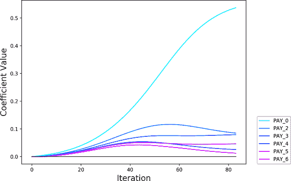
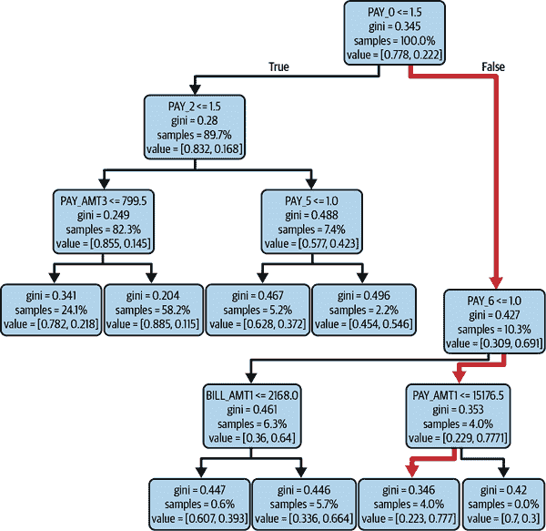
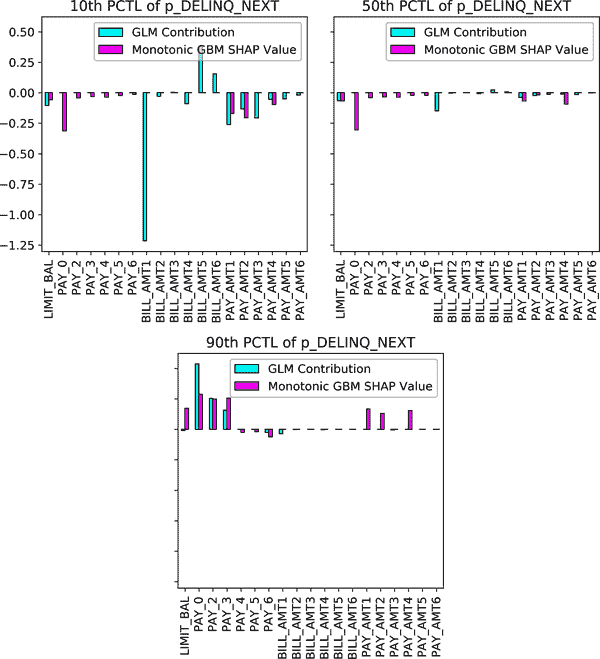
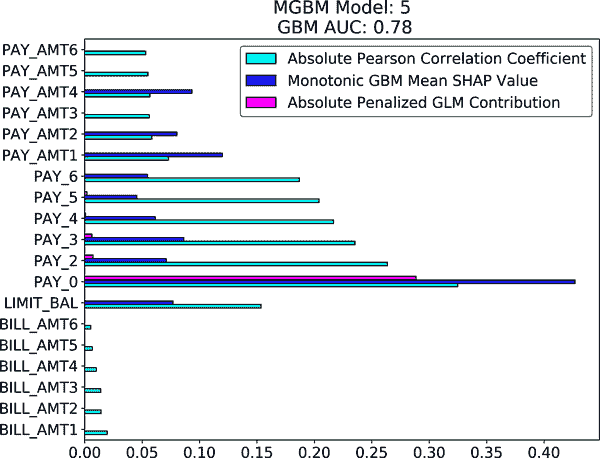
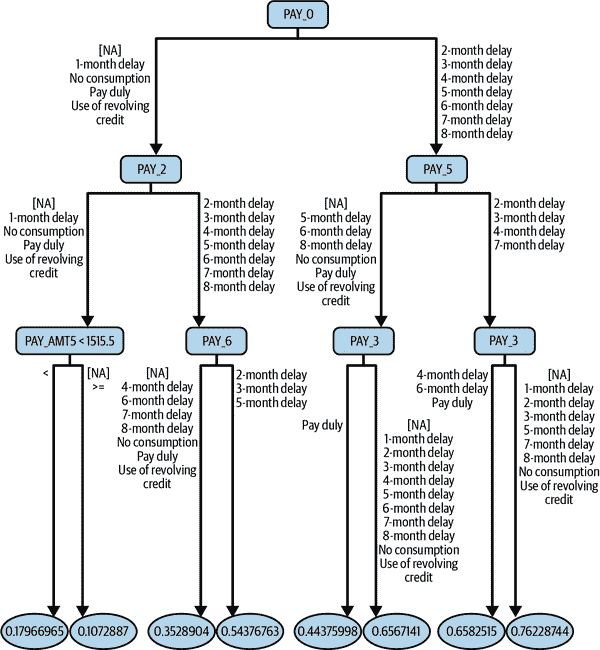
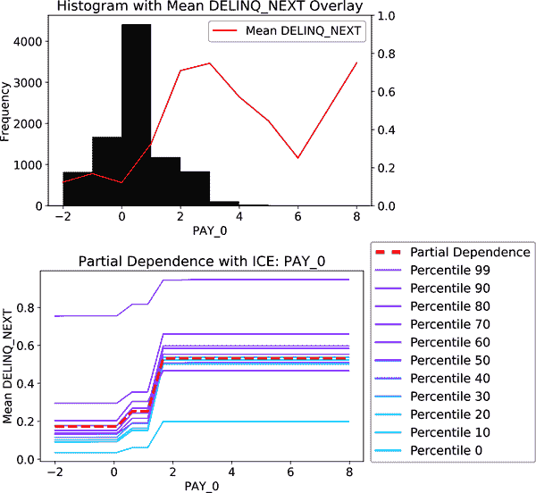
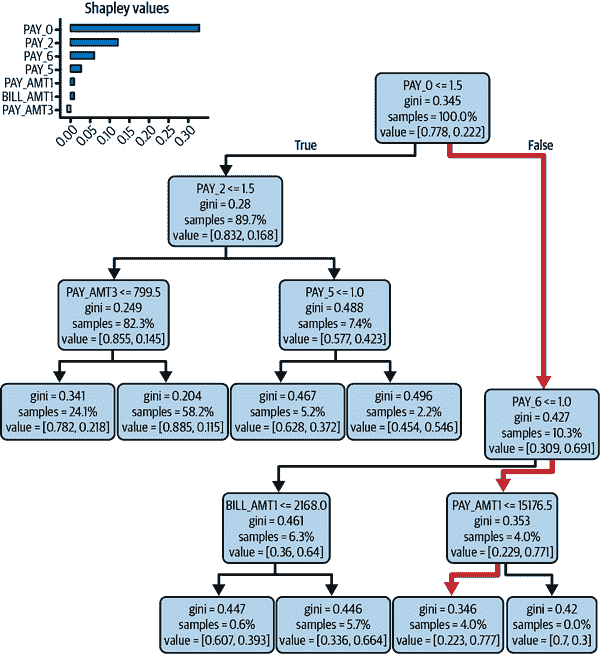

# 第二章：可解释和可解释的机器学习

科学家们几个世纪以来一直在将模型拟合到数据中，以更多地了解观察到的模式。可解释的机器学习模型和 ML 模型的事后解释呈现了这种长期实践中的渐进但重要的进展。因为 ML 模型更容易学习非线性、微弱和交互信号，所以使用可解释的 ML 模型和事后解释技术的人现在也能更轻松地学习他们数据中的非线性、微弱和交互信号。

在这一章中，我们将深入探讨在进行主要可解释建模和事后解释技术之前，关于解释和说明的重要思想。我们还将涵盖事后解释的主要陷阱——其中许多可以通过同时使用可解释模型和事后解释来克服。接下来，我们将讨论可解释模型和事后解释的应用，如模型文档和对错误决策的可行回溯，这些增加了对 AI 系统的问责。本章将以讨论英国的所谓“A 级考试丑闻”作为结尾，这是一个全国性的 AI 事件，其中一个可解释性强、高度文档化的模型做出了不负责任的决策。关于可解释模型和事后解释的讨论将在第六章和第七章继续进行，我们将探讨与这些主题相关的两个深入的代码示例。

# 重要的解释性和可解释性思想

在深入讨论训练可解释模型和生成事后解释技术之前，我们需要讨论数学和代码背后的重要思想。我们将从确认透明性不等同于信任开始。我们可以信任我们不理解的事物，并理解我们不信任的事物。更简单地说：透明性促进理解，而理解与信任是不同的。事实上，对于建立不良 ML 系统的更深入理解实际上可能会降低信任。

人工智能的可信度由国家标准技术研究所（NIST）定义，使用各种特征：有效性、可靠性、安全性、管理偏差、安全性、弹性、透明度、责任制、可解释性、可解释性和增强隐私。透明度使得实现其他理想的可信度特征更加容易，并且使调试变得更加简单。然而，人类操作员必须采取这些额外的治理步骤。可信度通常通过测试、监控和上诉流程实现（参见第一章和第三章）。由可解释的 ML 模型和事后解释增强的透明度应该促进那些有助于使传统线性模型可信的诊断和调试。这也意味着几十年来依赖于线性模型的受监管应用，由于每个消费者的解释和一般文档要求，现在很可能对准确和透明的 ML 模型充满了机遇。

###### 警告

是否可解释、可解释或其他透明并不意味着模型是好的或可信的。是否可解释、可解释或其他透明使人类能够对模型是否良好或可信做出高度的知情决策。

通过指定的上诉和覆盖流程对错用基于 ML 的决策的对象进行补偿，可能是提高信任的最重要的使用可解释模型和事后解释。合理上诉自动化决策的能力有时被称为*可操作的追索权*。对于消费者——或求职者、患者、囚犯或学生来说，要对自动化和不可解释的决策提出上诉是非常困难的。可解释的 ML 模型和事后解释技术应允许决策对象理解基于 ML 的自动化决策，这是逻辑上诉流程的第一步。一旦用户能够证明他们的输入数据或决策逻辑是错误的，ML 系统的操作者应该能够覆盖最初的错误决策。

###### 注意

使得申诉和覆盖自动决策的机制应始终与高风险的 ML 系统一起部署。

区分解释性和解释之间的差异也很重要。在开创性研究中[“解释性与人工智能中的解释能力的心理基础”](https://oreil.ly/yz6GF)，NIST 的研究人员能够使用广泛接受的人类认知概念来区分解释性和解释能力。根据 NIST 的研究人员，解释性和解释能力的类似但不完全相同的概念被定义如下：

解释

一种高层次、有意义的心理表征，将刺激置于上下文中并利用人类背景知识。一个可解释的模型应该为用户提供数据点或模型输出在*上下文中*的描述。

说明

一种低层次、详细的心理表征，试图描述一个复杂过程。机器学习解释是描述特定模型机制或输出*形成过程*的说明。

###### 注释

解释性远比可解释性更高的门槛。实现解释性意味着将机器学习机制或结果置于背景中，这通常无法通过模型或事后解释来实现。解释性通常通过简明的文字说明、引人入胜的可视化或交互式图形用户界面来实现。解释性通常需要与适用领域内和用户互动经验中的专家以及其他跨学科专业人士合作。

现在让我们更加详细地探讨一些使机器学习模型可解释或可解释的因素。如果输入数据混乱，模型要想实现透明度就非常困难。我们从这里开始讨论。在考虑输入数据和透明度时，请考虑以下内容：

可解释的特征工程

如果我们的目标是透明度，我们应避免过于复杂的特征工程。尽管来自自编码器、主成分或高阶交互的深度特征可能使我们的模型在测试数据中表现更好，但即使我们将它们输入到一个本质上可解释的模型中，解释这些特征也将是困难的。

有意义的特征

使用特征作为某些模型函数的输入假设它与函数输出，即模型的预测相关。因为它们提高了测试数据性能，使用无意义或松散相关的特征违反了解释模型运作方式的基本假设。例如，如果除了其他特征外，我们使用眼睛颜色来预测信用违约，模型可能会收敛到某个收敛标准，我们可以计算 Shapley 增加解释（SHAP）值来评估眼睛颜色。但在这种情况下，眼睛颜色在此语境中没有真正的有效性，与信用违约也没有因果关系。虽然眼睛颜色可能作为潜在系统偏见的代理，但声称眼睛颜色解释信用违约是无效的。应用常识或更好的因果发现方法来增加模型及相关解释的有效性。

单调特征

单调性有助于解释性。在可能的情况下，使用与目标变量呈单调关系的特征。如果需要，应用像分箱这样的特征工程技术来诱导单调性。

如果我们可以依赖我们的数据用于解释和可解释性目的，那么我们可以使用添加性输入的概念、约束、线性和平滑性、原型、稀疏性和总结，以确保我们的模型尽可能透明：

添加性输入

将输入保持在 ML 模型中分离，或将它们的互动限制在一个小组内，对于透明度至关重要。传统的 ML 模型因将输入特征组合和重新组合成难以解开的高次交互而臭名昭著。与此形成鲜明对比的是，传统的线性模型以独立和添加的方式处理输入。从线性模型中得出的输出决策通常是学习模型参数和输入特征值的简单线性组合。当然，与传统的不透明 ML 模型相比，传统的线性模型的性能质量通常显著较差。

进入广义可加模型（GAM）。 GAM 保持输入特征独立，实现透明度，但也允许对每个特征行为进行任意复杂建模，极大提高性能质量。我们还将在下一节讨论 GAM 的近亲 GA2Ms 和可解释增强机器（EBMs）。它们都通过保持输入独立并允许可视化处理这些单独输入的复杂方式来工作。最终，它们保持高透明度，因为用户不必解开输入及其相互影响的复杂性，输出决策仍然是学习模型参数的简单线性组合和应用于数据输入值的某些函数。

约束

传统的不可解释 ML 模型因其灵活性而受到推崇。它们可以在训练数据中建模几乎任何信号生成函数。然而，当涉及透明度时，通常不是一个好主意去模拟观察到的响应函数的每一个细微之处。由于过拟合，结果表明，对未见数据的性能也不是一个好主意。有时，我们在训练数据中观察到的只是噪声，甚至是老式错误。因此，与其过度拟合错误数据，往往更明智的做法是应用约束，通过迫使模型遵守因果概念而增加透明度，并帮助处理未见数据的性能。

在训练 ML 模型时可以应用任意数量的约束，但其中一些最有帮助和广泛可用的包括稀疏性、单调性和交互约束。稀疏性约束通常通过 L1 正则化实现（通常减少模型中的参数或规则数量），增强对更可管理的输入参数和内部学习机制的重视。正单调性约束意味着随着模型的输入增加，其输出绝不能减少。负单调性约束确保随着模型的输入增加，其输出永远不会增加。交互约束防止 ML 模型的内部机制过度组合和重新组合过多不同特征。这些约束可以用来鼓励模型学习可解释的因果现象，而不是关注不稳健的输入、任意的非线性和可能是模型结果错误和偏差驱动因素的高度交互。

线性和平滑性

线性函数默认是单调的，可以用单一数值系数描述。平滑函数是可微的，意味着可以通过导数函数或值在任何位置进行概述。基本上，线性和平滑函数行为更良好，通常更容易概述。相比之下，无约束和任意的 ML 函数可能以不符合人类理解的方式跳跃或打结，使得需要进行的内在概述几乎不可能。

原型

原型指的是可以用于解释先前未见数据的模型输出的良好理解数据点（行）或典型特征（列）。几十年来，原型已经出现在许多 ML 中，并且已被用来解释和解读模型决策。比如使用最近邻居来解释 *k*-最近邻预测，或者基于质心位置对聚类进行描述—这些都是原型。原型在计算机视觉的典型复杂和不透明世界中也变得重要，比如[这个看起来像那个的深度学习](https://oreil.ly/zO1kx)。

稀疏性

ML 模型，不管好坏，现在可以通过[数万亿个参数](https://oreil.ly/mDwV5)来训练。然而，它们的人类操作者能否根据超过几十个参数进行推理尚存在争议。当代 ML 模型中的信息量必须被概述以保持透明。一般来说，ML 模型中的系数或规则越少，它就越稀疏和可解释。

摘要

总结可以采用多种形式，包括变量重要性度量、代理模型和其他事后机器学习方法。可视化可能是传达关于机器学习模型概述信息的最常见方式，而压缩信息的近似方法是总结的[致命弱点](https://oreil.ly/Dzfit)。加性、线性、平滑和稀疏模型通常更容易总结，而事后解释过程在这些情况下更有可能有效。

达到机器学习的透明度与流行和商品化的不可解释方法相比需要额外的努力。不要担心。最近的论文[“设计天然可解释的机器学习模型”](https://oreil.ly/Zv6YO)以及像[InterpretML](https://oreil.ly/rML2n)、[H2O](https://oreil.ly/ysEHE)和[PiML](https://oreil.ly/Y2EFl)等软件包提供了一个很好的框架，用于训练和解释透明模型。本章的其余部分将重点介绍最有效的技术方法和常见的陷阱，以便我们在下次设计 AI 系统时考虑。

# 可解释模型

几十年来，许多机器学习研究人员和从业者都努力工作在一个看似合乎逻辑的假设下，即更复杂的模型更准确。然而，正如杰出教授辛西娅·鲁丁在她影响深远的[“停止解释黑盒机器学习模型进行重大决策，改用可解释模型”](https://oreil.ly/i4syT)中指出的，“认为准确性和可解释性之间必然存在权衡是一种错误”。我们稍后将探讨关于可解释模型与事后解释之间的紧张关系。现在，让我们集中关注准确且可解释模型的强大理念。它们为高度准确的决策提供了潜力，同时改善了从机器学习中学习的人类、可操作的追索过程和监管合规性、改善安全性，以及更好地解决包括不准确性和偏见在内的各种问题。这些吸引人的特征使得可解释的机器学习模型对从业者和消费者来说都是一种普遍的双赢局面。

接下来，我们将介绍一些最流行的可解释机器学习模型类型。我们将从大类加性模型开始，包括惩罚回归、广义加性模型、广义可加性模型和解释性基础模型。我们还将涵盖决策树、约束树集成和其他选项，然后再讨论事后解释技术。

## 加性模型

最广泛使用的可解释机器学习模型之一是基于传统线性模型的模型：惩罚回归模型、广义加性模型（GAMs）、以及 GA2Ms（或 EBMs）。这些技术通过现代方法增强了传统建模方法，通常显著提升了性能。但它们也通过单独和累加的方式处理输入特征，或仅允许少量交互项来保持解释性高。它们还依赖直观的可视化技术来增强可解释性。

### 惩罚回归

我们将从惩罚回归开始讨论可解释模型。惩罚回归更新了 19 世纪的典型回归方法，使之适应 21 世纪。这类模型通常生成线性、单调响应函数，并产生类似传统线性模型的全局可解释结果，但通常具有预测性能的提升。惩罚回归模型避免了依赖假设的[正规方程](https://oreil.ly/uXdeH)方法来找到模型参数，而是采用更复杂的约束和迭代优化过程，允许在使用验证数据自动选择更好模型的同时处理相关性、特征选择和异常值处理。

在图 2-1 中，我们可以看到惩罚回归模型在 80 多个训练迭代中学习了六个输入特征的最优系数。我们可以看到在优化过程开始时，所有参数值都非常小，并且随着过程的收敛而增长。这是因为通常在训练过程中会在输入特征上设置大的惩罚。这些惩罚通常会随着训练的进行而减少，以允许少量输入进入模型，或者保持模型参数人为地小，或两者兼而有之。（读者在某些情况下也可能听到惩罚回归系数被称为“缩小”的说法。）在每次迭代中，当更多特征进入模型，或系数值增长或变化时，当前模型将应用于验证数据。训练将继续进行预定义数量的迭代，或者直到验证数据的性能停止改进为止。

###### 图 2-1\. 弹性网络回归模型中选择特征的正则化路径（[数字，彩色版本](https://oreil.ly/dR7Ty)）

除了基于验证的早停止程序外，惩罚回归还通过迭代重新加权最小二乘（IRLS）技术、L1 和 L2 参数范数的两种类型的惩罚，以及链接函数，来处理异常值、特征选择、相关输入和非线性。

IRLS

IRLS 是一种旨在最小化异常值影响的成熟过程。它开始像传统的回归，但在第一次迭代后，IRLS 过程检查哪些输入数据行导致较大的误差。然后在拟合模型系数的后续迭代中减少这些行的权重。IRLS 持续执行这种拟合和降低权重的过程，直到模型参数收敛到稳定值。

L1 范数惩罚

也称为最小绝对收缩和选择算子（LASSO），L1 惩罚将绝对模型参数的总和最小化。这种惩罚效果使得不必要的回归参数趋向于零，并为回归模型选择一个小而代表性的特征子集，同时避免在旧的逐步特征选择中出现的潜在多重比较问题。当单独使用时，L1 惩罚已知可以提高性能质量，特别是在大量潜在相关的输入特征导致逐步特征选择失败的情况下。

L2 范数惩罚

也称为岭回归或 Tikhonov 回归，L2 惩罚最小化模型参数的平方和。L2 范数惩罚稳定模型参数，尤其是在存在相关性时。与 L1 范数惩罚不同，L2 范数惩罚不选择特征。相反，它们通过保持所有模型参数小于传统解决方案中的参数来限制每个特征对整体模型的影响。较小的参数使得任何一个特征难以主导模型，并且在模型训练过程中，相关性不会引起奇怪的行为。

链接函数

链接函数使线性模型能够处理训练数据的常见分布，例如使用 logit 链接函数将逻辑回归拟合到具有两个离散结果的输入数据中。其他常见且有用的链接函数包括 Poisson 链接函数用于计数数据或伽马分布输出的反向链接函数。将结果与其分布族和链接函数匹配，例如二项分布和逻辑回归的 logit 链接函数，对于训练可部署的模型是绝对必要的。许多机器学习模型和库在惩罚回归软件包之外不支持必要的链接函数和分布族，以解决训练数据中的基本假设。

当代惩罚回归技术通常结合以下内容：

+   基于验证的早期停止以提高泛化能力

+   处理异常值的 IRLS

+   特征选择目的的 L1 惩罚

+   用于稳健性的 L2 惩罚

+   各种目标或误差分布的链接函数

读者可以在[*统计学习的要素*](https://oreil.ly/FQjuv)（Springer）中了解更多关于惩罚回归的内容，但对于我们的目的来说，更重要的是知道何时可以尝试惩罚回归。 惩罚回归已经广泛应用于许多研究领域，但对于具有许多特征的商业数据来说尤为适用，即使是拥有更多特征而不是行的数据集，以及具有大量相关变量的数据集。 惩罚回归模型还保留了传统线性模型的基本可解释性，所以我们在有许多相关特征或需要最大透明度时会考虑它们。 此外，了解到惩罚回归技术并不总是为回归参数创建置信区间、*t*统计量或*p*值。 这些类型的测量通常只能通过自举法获得，这可能需要额外的计算时间。 R 软件包[elasticnet](https://oreil.ly/aooJV)和[glmnet](https://oreil.ly/lFcpJ)由 LASSO 和弹性网回归技术的发明者维护，而[H2O 广义线性模型](https://oreil.ly/Oeywm)紧密遵循原始软件的实现，同时允许大大改进的可扩展性。

对于惩罚回归模型的一个新而极其有趣的转折是超稀疏线性整数模型，或者[SLIM](https://oreil.ly/2YPmFX1)。 SLIMs 还依赖于复杂的优化程序，其目标是创建只需要简单算术即可评估的准确模型。 SLIMs 旨在训练线性模型，这些模型可以由在高风险环境中工作的人类进行心算评估，比如医疗保健。 如果我们面临需要最高可解释性和需要现场工作人员快速评估结果的应用程序，我们就会想到 SLIMs。 另一方面，如果我们正在寻找更好的预测性能，以匹配许多不可解释的机器学习技术，但同时保持高度解释性，那么就考虑 GAMs——我们将在接下来介绍。

### 广义可加模型

GAM 是线性模型的一种泛化，允许为每个模型输入拟合系数和函数，而不仅仅是每个输入的系数。以这种方式训练模型允许每个输入变量以独立但非线性的方式处理。单独处理每个输入有助于保持解释性高。允许非线性改进了性能质量。传统上，GAM 依赖样条来拟合每个输入的非线性形状函数，并且大多数 GAM 实现生成了拟合的形状函数的便利图表。根据我们的监管或内部文档要求，我们可以直接在预测模型中使用形状函数以提高性能。如果不能，我们可以直接查看一些拟合的形状函数，并将其替换为更可解释的多项式、对数、三角或其他简单的输入特征函数，这也可能提高预测质量。最近，通过 [神经加法模型 (NAMs)](https://oreil.ly/nnCz5) 和 [GAMI-Nets](https://oreil.ly/G_wCc) 引入了 GAM 的一个有趣变化。在这些模型中，人工神经网络用于拟合形状函数。在下一节讨论可解释性增强机器时，我们将继续主题估计形状函数的 ML。Rudin Group 最近还提出了 GAM 的一个变体，其中使用单调阶跃函数作为形状函数以实现最大解释性。查看 [“快速稀疏分类广义线性和加法模型”](https://oreil.ly/tCnld) 以查看它们的实际效果。

###### 注意

我们将使用术语 *形状函数* 来描述 GAM 类似模型对每个输入和交互特征应用的学习非线性关系。这些形状函数可能是传统的样条，也可以是由机器学习估算器如增强树或神经网络拟合的。

能够更改模型部分以更好地符合现实或人类直觉的能力的半官方名称是 *模型编辑*。可编辑性是许多可解释模型的另一个重要方面。模型经常从错误或偏见的训练数据中学习错误或偏见的概念。可解释模型使人类用户能够发现错误并予以修正。GAM 模型家族特别适合模型编辑，这是这些强大建模方法的另一个优势。读者可以在 [*统计学习元素*](https://oreil.ly/5S49T) 中了解更多关于 GAM 的信息。要尝试 GAM，请查看 R 的 [gam](https://oreil.ly/aSAJK) 包或更实验性的 [H2O](https://oreil.ly/5yoAd) 或 [pyGAM](https://oreil.ly/1h-Y7) 实现。

### GA2M 和可解释性增强机器

GA2M 和 EBM 代表了 GAM 的直接和实质性改进。首先让我们来讨论 GA2M。GA2M 中的“2”指的是将少量成对交互作用作为模型输入的考虑。选择在 GAM 中包含少量交互项可以提升性能，而不会牺牲可解释性。交互项可以作为等高线图与通常伴随 GAM 的二维输入特征图一起绘制。一些敏锐的读者可能已经熟悉 EBM，这是 GA2M 的重要变体。在 EBM 中，每个输入特征的形状函数通过增强学习迭代地进行训练。这些响应函数可以是样条函数、决策树，甚至是决策树的增强集成。通过使用增强学习训练加法模型，通常可以获得比使用典型的 GAM 反向适配方法更准确的最终模型。

由于这些进展，GA2Ms 和 EBMs 现在在表格数据的性能质量上与不可解释的机器学习模型相媲美，甚至有所超越，同时还具备可解释性和模型编辑的明显优势。如果您的下一个项目是结构化数据，请尝试使用微软研究的[InterpretML](https://oreil.ly/GMsbK)包来尝试 EBMs。EBMs 为我们讨论加性模型画上了句号。接下来我们将转向决策树，这是另一种高质量、高可解释性模型，在统计学、数据挖掘和机器学习领域都取得了成功记录。

## 决策树

决策树是另一种流行的预测模型。当作为单棵树使用时，它们从训练数据中学习高度可解释的流程图，并且往往比线性模型表现出更好的预测性能。当作为集成模型，例如随机森林和 GBMs 时，它们失去了可解释性，但往往成为更好的预测器。在接下来的几节中，我们将讨论单棵树模型和能保留一定可解释性的约束决策树集成。

### 单决策树

从技术上讲，决策树是有向图，其中每个内部节点对应一个输入特征。对于创建最高目标纯度或增强预测质量的输入特征值，有图边指向子节点。每个终端节点或叶节点代表目标特征的一个值，给定由根到叶的路径表示的输入特征的值。这些路径可以用简单的 if-then 规则进行可视化或解释。

更直观地说，决策树就是数据导出的流程图，就像我们在图 2-2 中看到的那样。决策树非常适合在结构化数据上训练可解释模型。当目标是理解输入和目标变量之间的关系，并使用布尔逻辑“if-then”时，它们非常有益。它们也非常擅长在训练数据中找到交互作用。特别是在树的顶部附近，父子关系往往指向可以用来更好理解建模目标驱动因素的特征交互，或者它们可以用作交互项以提高加法模型的预测准确性。也许它们相对于更直接的加法模型的主要优势在于，它们能够直接在字符值、缺失数据、非标准化数据和非归一化数据上进行训练。在这个大数据时代，决策树能够构建具有最小数据预处理的模型，这有助于消除机器学习模型中的额外人为误差来源。

###### 图 2-2\. 一个简单的决策树模型形成的数据导出流程图

这些优点都是决策树的利大于弊，为什么不应该使用决策树呢？首先，只有在决策树较浅时才能解释。一旦决策树的 if-then 分支超过五层，解释就变得困难。此外，它们在处理声音、图像、视频和文本等非结构化数据时性能通常较差。非结构化数据已经成为深度学习和神经网络的领域。与许多模型一样，决策树需要进行高度调整。决策树具有许多超参数或设置，必须使用人类领域知识、网格搜索或其他超参数调整方法来指定。这些方法至少是耗时的，最坏的情况下，可能会导致偏见和过拟合。单个决策树也不稳定，添加几行数据到训练或验证数据并重新训练可能会导致完全重新排列的流程图。这种不稳定性是许多机器学习模型的致命弱点。

决策树在每次创建新分支或者 if-then 规则时都会做出局部最优（或*贪婪*）决策。其他机器学习模型采用不同的优化策略，但最终结果都是一样的：一个不是数据集最佳模型，而是在众多可能选项中的一个良好候选模型。对于任何给定数据集来说，可能存在多个良好模型的问题至少有两个名称，[*良好模型的多样性*和*拉瑟蒙效应*](https://oreil.ly/nNwFY)。（[*拉瑟蒙*](https://oreil.ly/wW-k5)这个名字来源于一部著名电影，其中证人们对同一起谋杀案描述不同。）拉瑟蒙效应与另一个令人头痛的问题相关，即[欠指定性](https://oreil.ly/V_DaF)，在这种情况下，超参数调整和基于验证数据的模型选择导致模型在测试场景中看起来很好，但在实际世界中却失败。我们如何避免决策树的这些问题呢？主要是通过训练可以看到和检查的单棵树，并确保它们的逻辑在部署时能够保持稳定。

决策树的更广泛主题有许多变体。例如，线性树模型在决策树的每个叶节点拟合线性模型，增加了标准决策树的预测能力，同时保持所有解释性。Rudin 教授的研究小组引入了[最优稀疏决策树](https://oreil.ly/4kGpW)作为对不稳定性和欠指定性问题的一种响应。另一个解决这些问题的方法是基于人类领域知识的手动约束。接下来我们将讨论约束决策树集成，但如果读者准备尝试标准决策树，有许多可以尝试的包，其中 R 包[rpart](https://oreil.ly/XLE1H)是最好的之一。

### 有约束的 XGBoost 模型

现在流行的梯度提升包 XGBoost 支持[单调约束](https://oreil.ly/39PhO)和[交互约束](https://oreil.ly/yVAtK)。如前所述，用户提供的单调约束强制 XGBoost 模型保持更可解释的输入与预测之间的单调关系。交互约束可以防止 XGBoost 无限重组特征。这些软件功能将通常是一个充满不充分问题的不透明树集成模型转变为一个高度健壮的模型，能够从数据中学习，并接受专家用户提供的因果驱动约束。这些新的训练选项使人类领域专家能够使用因果知识来设置模型关系的方向，并指定哪些输入特征不应该互动，结合 XGBoost 在可扩展性和性能上的成熟记录，使其在可解释机器学习领域成为一个不容忽视的强力选择。虽然不像 EBMs 那样直接可解释，因为梯度提升机（GBMs）将特征组合和重组成一系列嵌套的 if-then 规则，但受限的 XGBoost 模型适合各种事后可解释和可视化技术。解释技术通常使从业者能够确认他们注入模型的因果知识，并理解复杂集成的内部工作方式。

## 可解释机器学习模型的生态系统

除了加法模型和基于树的模型之外，还有一个完整的可解释机器学习模型生态系统。其中一些模型已经为人熟知几十年，一些代表对旧方法的调整，还有一些是全新的。无论是新的还是旧的，它们都挑战了不可解释机器学习的现状——这是件好事。如果读者对可解释模型的各种选择感到惊讶，那么想象一下客户在我们能够解释 AI 系统决策驱动因素、帮助他们确认或否定关于他们业务的假设，并向用户提供解释的时候会有多么惊讶，并且还能保持高水平的预测质量。确实，有很多可解释模型的选择，肯定会有一个适合我们下一个项目的。与其要求我们的同事、客户或商业伙伴盲目信任不透明的机器学习管道，不如考虑下次使用可解释的神经网络；*k*-最近邻；基于规则、因果或图形的模型；甚至是稀疏矩阵分解：

因果模型

因果模型，其中因果现象以可证明的方式与某些感兴趣的预测结果相关联，通常被视为可解释性的黄金标准。鉴于我们经常可以查看定义模型工作方式的图表，并且它们是使用人类领域或因果推断技术组成的，它们几乎可以自动解释。它们也不像传统的不可解释的机器学习模型那样在训练数据中适应噪声。因果模型唯一困难的部分是找到训练它们所需的数据，或者训练过程本身。然而，因果模型的训练能力继续改善，像[pyMC3](https://oreil.ly/XY448)这样的贝叶斯模型和[dowhy](https://oreil.ly/yacTr)这样的因果推断软件包多年来一直使从业者能够构建和训练因果模型。更近期，微软和优步公司分别发布了使用它们公司的建模库[EconML](https://oreil.ly/Q448j)和[causalml](https://oreil.ly/Tx12a)进行因果推断的真实用例的[因果推断教程](https://oreil.ly/wQu72)。如果我们关心稳定的、可解释的模型，请认真关注这个领域。曾经被认为几乎不可能训练的因果模型正在逐渐进入主流。

可解释神经网络

由富国银行风险管理部门[发布](https://oreil.ly/xiKH_)并[完善](https://oreil.ly/jgu71)的可解释神经网络（XNNs）证明，即使对于最不可解释的模型，稍加独创和努力也能使其变得可解释并保持高度的性能质量。可解释神经网络使用与 GAMs、GA2Ms 和 EBMs 相同的原理来实现高解释性和高预测性能，但是有所不同。像 GAMs 一样，XNNs 只是形状函数的加法组合。然而，它们在 GAMs 基础上添加了额外的索引结构。XNNs 是广义可加性*索引*模型（GAIMs）的一个例子，其中类似于 GAM 的形状函数由能够学习有趣的高阶交互的低投影层输入。

在 XNN 中，使用反向传播来学习变量的最佳组合（见[c 在线 XNN 图](https://oreil.ly/kBy92)）作为输入，这些变量通过子网络学习的形状函数（见在线图中的 b）以加法方式与最优权重结合，形成网络输出（见在线图中的 a）。虽然可能不是最简单的可解释模型，但 XNN 已经被改进以提高可扩展性，它们可以自动识别训练数据中的重要交互作用，并且事后解释可以用来将其预测分解为局部准确的特征贡献。最近提出的另一种有趣的透明神经网络类型在[“神经添加模型：用神经网络进行可解释机器学习”](https://oreil.ly/ge-fk)中提出。NAMs 看起来与 XNN 类似，但它们放弃了试图定位交互项的底层。

*k*最近邻 (*k*-NN)

*k*-NN 方法使用原型或类似的数据点来进行预测。以这种方式推理不需要训练，其简单性通常吸引人类用户。如果将*k*设为三，对新点的推断涉及查找最接近的三个点，并从这三个点中取平均标签或模态标签作为新点的预测结果。这种逻辑在我们日常生活中很常见。以住宅房地产评估为例。通常会将一个家庭每平方英尺的价格评估为三个可比房屋每平方英尺的平均价格。当我们说“听起来像”，“感觉像”或“看起来像”时，我们可能正在使用原型数据点来推断我们生活中的事物。通过与原型的比较进行解释的概念，促使鲁丁集团采用了[this-looks-like-that](https://oreil.ly/qG7yT)，这是一种新型深度学习，利用与原型的比较来解释图像分类预测。

基于规则的模型

从数据集中提取预测性的 if-then 规则是另一种长期存在的 ML 建模类型。if-then 规则的简单布尔逻辑是可解释的，只要规则的数量、规则中分支的数量和规则中的实体数量受到限制。[RuleFit](https://oreil.ly/xc3-B)和[skope-rules](https://oreil.ly/3w2BK)是两种流行的技术，旨在从训练数据中找到预测性和可解释性规则。基于规则的模型也是鲁丁集团的领域。在可解释和高质量的基于规则的预测器中，他们的杰出作品包括[可证明最优规则列表（CORELS）](https://oreil.ly/BgWCt)和[可扩展贝叶斯规则列表](https://oreil.ly/RCu74)。鲁丁集团的这些及其他宝贵贡献的代码都可以在他们的公共[代码页面](https://oreil.ly/aYDTE)上找到。

稀疏矩阵分解

将大数据矩阵分解为两个较小的矩阵是一种常见的降维和无监督学习技术。大多数较旧的矩阵分解技术将数据的原始列重新分配到数十个派生特征中，使得这些技术的结果难以解释。然而，随着在矩阵分解中引入 L1 惩罚，现在可以从大量数据的矩阵中提取新特征，其中只有少数原始列在任何新特征上具有较大的权重。通过使用[sparse principal components analysis (SPCA)](https://oreil.ly/xqWFw)，例如，我们可能会发现，从客户财务数据中提取新特征时，这个新特征仅由原始数据集中的债务收入比和循环账户余额特征组成。我们可以因此推断出，这个特征与消费者债务相关。或者，如果我们发现另一个新特征在收入、支付和支出方面具有较高的权重，那么我们可以将这个特征解释为与现金流相关。[Nonnegative matrix factorization (NMF)](https://oreil.ly/CKydA)给出了类似的结果，但假设训练数据只取正值。对于像术语计数和像素强度这样的非结构化数据，这种假设始终成立。因此，NMF 可用于找到文档中主题的可解释摘要，或将图像分解为可解释的子组件字典。无论我们使用 SPCA 还是 NMF，所得的提取特征可以用作可解释的摘要、可解释比较的原型、可视化的轴或模型中的特征。事实证明，就像许多可解释的监督学习模型是广义加性模型的特殊实例一样，许多无监督学习技术都是[generalized low-rank models](https://oreil.ly/YKUDa)的实例，我们可以在 H2O 中尝试这些技术。

现在我们已经介绍了可解释模型的基础知识，接下来我们将讨论后事因果解释技术。在此之前，请记住，同时使用可解释模型和后事因果解释是完全可以的。可解释模型通常用于将领域知识整合到学习机制中，以解决训练数据中固有的假设或限制，或构建人类能够理解的功能形式。后事因果解释通常用于可视化和总结。虽然后事因果解释通常被讨论为提高传统不透明机器学习模型透明度的手段，但我们将在接下来的部分介绍其应用存在的许多理由。同时使用可解释模型和后事因果解释，以改进和验证彼此，可能是这两种技术的最佳普遍应用。

# 后事因果解释

我们将首先讨论全局和局部特征归因措施，然后转向替代模型和描述模型行为的流行类型绘图，还将触及几种无监督学习的事后解释技术。我们还将讨论事后解释的缺陷，读者在形成对解释的印象和实践时应牢记以下三点的广泛总结：

+   如果一个模型没有意义，它的解释也不会有意义。（我们无法解释无意义的东西。）

+   机器学习模型很容易变得如此复杂，以至于无法准确总结。

+   向广大用户和利益相关者传达关于机器学习系统的解释信息是困难的。

尽管存在这些困难，事后解释几乎总是必要的，以确保可解释性和透明性。即使像逻辑回归这样被认为高度透明的模型，也必须被总结，以满足透明度的监管义务。不管好坏，我们可能都无法摆脱事后解释和总结。因此，让我们尽可能使其运作良好。

###### 警告

许多模型必须以事后方式总结才能被解释。然而，机器学习解释通常是不正确的，检查它们需要严格的测试和与基础可解释模型的比较。

## 特征归因和重要性

特征归因是解释机器学习模型中最核心的方面之一。特征归因方法告诉我们输入特征对模型预测的贡献有多大，无论是全局（整个数据集）还是局部（一行或几行数据）。特征归因值通常可以是正数或负数。

当我们讨论特征重要性时，我们指的是每个特征对模型预测贡献的全局度量。与特征归因不同，特征重要性值通常始终为正数。也就是说，特征重要性值衡量了一个特征对模型在数据集上整体行为的显著性贡献。另一方面，特征归因为我们提供了关于特征贡献的更详细信息。

尽管一些更成熟的全局特征重要性指标不是由局部测量的聚合产生的，但是今天通常会将局部特征归因平均（或以其他方式聚合）为全局特征重要性。我们将首先讨论新的局部特征归因方法，然后转向全局方法。

###### 注意

*全局*解释总结了整个数据集或大量数据样本上的模型机制或预测。*局部*解释执行相同类型的总结，但适用于数据的较小段落，甚至是单行或单元数据。

“特征重要性”这个名字可能会误导。我们只是在近似地描述一个模型认为重要的内容。例如，考虑一个依赖基于梯度的方法来检测视频帧中“重要”方面的计算机视觉安全系统。如果没有适当的培训和部署规范，这样的系统将很难检测到穿着数字伪装服装的个体，因为新款数字伪装服装专门设计成能够融入各种背景，并且保持布料与不同背景之间的视觉梯度平滑和不可检测。但是，在安全应用中，检测穿着伪装服装的人难道不是最重要的事情之一吗？在本节的其余部分，请记住，“特征重要性”高度依赖于模型的理解和训练。

### 本地解释和特征归因

在某些应用中，确定哪些输入特征影响了特定预测是至关重要的，即测量本地特征归因。看看图 2-3 ，看看本地特征归因是如何发挥作用的。

###### 图 2-3\. 两个可解释模型的本地特征归因，适用于预测概率的第 10、50 和 90 百分位数的三个个体（[数字，彩色版本](https://oreil.ly/4Y__H)）

图 2-3 展示了两种类型的本地特征归因值，分别对应两种不同模型，在信用贷款示例中针对三个不同客户的应用。第一个客户处于违约概率的第 10 百分位数，他们可能会接受提供的信贷产品。第二个客户处于第 50 百分位数，不太可能接受提供的产品。第三个客户处于违约概率的第 90 百分位数，并且是一个极高风险申请人的例子。总结的两个模型分别是惩罚的广义线性模型（GLM）和单调约束的 GBM。由于这两个模型都具有相对简单的结构，对于手头的问题是有意义的，我们在处理关于事后解释的开场白中提出的警告时做得不错。这些解释应该是可信的，并且足够简单，能够准确地总结。

###### 注意

使解释更具可解释性的一个实际方法是将它们与某些有意义的基准进行比较。这就是为什么我们将我们的特征归因值与 Pearson 相关性进行比较，并将我们的部分依赖和个体条件期望（ICE）值与平均模型预测进行比较。这应该使图表的观看者能够将更抽象的解释值与更容易理解的基准值进行比较。

我们如何总结模型的本地行为？对于惩罚 GLM 模型，我们将模型系数乘以每个申请人输入特征的值。对于 GBM，我们应用 SHAP。这两种本地特征归因技术都是加法的并且在本地精确——意味着它们总结到模型预测值。它们都是从一个偏移值计算得出，GLM 截距或 SHAP 截距，这些值在数值上相似但并不相等（这在图 2-3 中未考虑）。并且这两个值可以在相同的空间中生成：无论是对数几率还是预测概率，取决于计算的方式。

绘制的值告诉我们什么？对于概率违约率排名为第 10 百分位的低风险申请人，我们可以看到他们的最新账单金额`BILL_AMT1`非常有利，并且推动了他们的预测向下。同一客户的 SHAP 值讲述了稍微不同的故事，但 GBM 是在不同的特征集上训练的。SHAP 值描述了申请人在所有考虑的属性上都是较低风险的。对于第 50 百分位的申请人，我们看到大多数本地特征归因值都保持接近它们各自的截距，并且对于高风险申请人，几乎所有的本地特征归因值都是正值，推动了预测值的增加。两个模型似乎都认为是申请人最近的付款状况（`PAY_0`，`PAY_2`和`PAY_3`）在推动风险方面起到了作用，而 GBM 和 SHAP 也专注于付款金额信息。

这些仅是本地特征归因的两种类型，我们将讨论许多其他类型。但这个小例子可能会引起一些问题，如果我们在继续之前不加以解释的话，这些问题可能会困扰读者。首先，生成解释并不意味着这些模型就是好模型；这只是意味着我们可以更明智地决定这些模型是否良好。其次，不同的模型对相同数据行给出不同的解释并不罕见。但仅仅因为它常见，并不意味着它就是正确的。这不是我们应该接受并跳过的事情。虽然在图 2-3 中的模型在操作相同特征时似乎表现出了足够的一致性，但这很遗憾，这只是后续解释的最佳案例，因为我们选择了相对简单的模型，并确保了 GLM 系数的符号和 GBM 的单调约束方向与领域专业知识一致。对于训练在数百个或更多相关特征上的复杂、无法解释的模型，我们可能会看到模型解释之间的一致性大大降低，这应该引起警觉。

不同模型在相同数据行上产生相似解释的概念被称为*一致性*。在高风险应用中，一致性是一个合理的目标，以增强对结果的信任和多个重要决策系统之间的一致性。

正如读者可能已经开始注意到的那样，事后解释是复杂而充满风险的，这就是为什么我们建议将这些技术与可解释模型配对使用，这样模型可以用来检查解释，反之亦然。尽管如此，我们仍然推进到主要的局部解释技术概述——反事实、基于梯度的、遮挡、原型、SHAP 值等等：

反事实

反事实解释告诉我们，改变输入特征的值以改变模型预测结果所需的值。当通过某个标准量改变输入变量时，预测的摆动越大，从反事实的角度来衡量，该特征就越重要。更多详情，请查看克里斯托夫·莫尔纳尔的*可解释机器学习*中的[“反事实解释”](https://oreil.ly/9SNML)第 9.3 节。要尝试反事实解释，请查看微软研究的[“DiCE: 机器学习分类器的多样反事实解释”](https://oreil.ly/s_QaL)。

基于梯度的特征归因

将梯度视为复杂机器学习函数每个小部分的回归系数。在深度学习中，基于梯度的局部解释方法很常见。当用于图像或文本数据时，梯度通常可以叠加在输入图像和文本上，创建高度视觉化的解释，描绘如果改变输入的哪些部分会对模型输出产生最大变化。据说对这一想法的各种调整会导致改进的解释，例如[integrated gradients](https://oreil.ly/is_C-)、[layer-wise relevance propagation](https://oreil.ly/XKJ4B)、[deeplift](https://oreil.ly/6rhO0)和[Grad-CAM](https://oreil.ly/Zkfeh)。关于基于梯度的归因方法的优秀且高度技术性的审查，请参见安科纳等人的[“Towards Better Understanding of Gradient-based Attribution Methods for Deep Neural Networks”](https://oreil.ly/h7Lde)。要查看这些技术可能出现的问题，请参见[“Sanity Checks for Saliency Maps”](https://oreil.ly/a9fQA)。在我们训练深度学习模型并比较各种归因技术的第九章中，我们将回到这些想法。

遮挡

遮蔽（occlusion）是一种简单而强大的概念，即从模型预测中移除特征并跟踪结果的变化。大的变化可能意味着该特征很重要，小的变化可能意味着它不那么重要。遮蔽是 SHAP、leave-one-feature-out（LOFO）等许多解释方法的基础，包括计算机视觉和自然语言处理中的许多方法。当梯度不可用时，遮蔽可以用于生成复杂模型的解释。当然，从数学上讲，从模型中移除输入并生成相关解释需要非常谨慎。要了解遮蔽和特征移除技术的权威评估，请参阅 Covert、Lundberg 和 Lee 的[《通过移除来解释：模型解释的统一框架》](https://oreil.ly/662aS)，其中介绍了可以追溯到遮蔽和特征移除的 25 种解释方法。

原型

原型是数据的实例，极其代表大量数据。原型用于通过总结和比较来解释。一种常见的原型是*k*-means（或其他）聚类中心。这些原型是类似数据群体的平均表示。它们可以根据距离和实际相似性与其所在群体内部和其他群体中的其他点进行比较。现实世界的数据通常非常异质化，很难找到能够良好代表整个数据集的原型。*批评*是那些不能很好地被原型表示的数据点。原型和批评共同构成了一组点，可以用于总结和比较，从而更好地理解数据集和机器学习模型。此外，几种 ML 模型，如*k*-NN 和 this-looks-like-that 深度学习，都基于原型的概念，从而增强了它们的整体可解释性。要了解更多关于原型的信息，请查阅 Molnar 的[原型和批评](https://oreil.ly/2IQYd)章节。

还有各种其他的局部解释技术。读者可能听说过[treeinterpreter](https://oreil.ly/VECj5)或[eli5](https://oreil.ly/xOkSX)，它们为决策树集成生成局部准确的加法归因值。[Alethia](https://oreil.ly/ZauV8)为修正线性单元（ReLU）神经网络提供模型摘要和局部推理。

接下来，我们将专门讨论沙普利值，这是数据科学家可用的最受欢迎和严谨的本地解释类型之一。在继续之前，我们再次提醒读者，这些事后解释技术，包括 SHAP，并非魔法。虽然理解哪些特征影响 ML 模型决策的能力是一项令人难以置信的突破，但有大量文献指出这些技术存在问题。要充分利用它们，要以冷静和科学的态度对待它们。做实验。使用可解释的模型和模拟数据来评估解释质量和有效性。我们选择的解释技术在随机数据上是否提供令人信服的解释？（如果是，那就不好了。）在数据轻微扰动时，该技术是否提供稳定的解释？（通常是好事。）生活中没有完美的东西，包括本地事后解释在内。

#### 沙普利值

沙普利值是由诺贝尔经济学奖得主和数学家劳埃德·沙普利创建的。沙普利添加解释（SHAP）[统一](https://oreil.ly/ilEXW)了像 LIME、LOFO、treeinterpreter、deeplift 等方法，以生成准确的本地特征重要性值，并且可以聚合或可视化以创建一致的全局解释。除了他们自己的 Python 包[SHAP](https://oreil.ly/LP4zm)，以及各种 R 包，SHAP 在像 H2O、LightGBM 和 XGBoost 这样的流行机器学习软件框架中得到支持。

SHAP 的起始方式与许多其他解释技术相同，提出了直观的问题：如果没有这个特征，这一行的模型预测会是什么？那么 SHAP 与其他类型的本地解释有何不同？确切地说，在典型的 ML 模型有如此多复杂交互的系统中，必须使用不包括感兴趣特征的所有可能输入集的平均值来回答这个简单问题。这些不同的输入组称为*联盟*。对于一个简单的包含 20 列的数据集来说，这意味着平均需要考虑大约五十万个不同的联盟上的模型预测。现在，对我们数据集中的每个预测重复这个删除和平均的过程，我们可以看到为什么 SHAP 比大多数其他本地特征归因方法考虑了更多信息。

SHAP 有很多不同的变种，但最流行的是 Kernel SHAP、Deep SHAP 和 Tree SHAP。其中，Tree SHAP 较少使用近似，而 Kernel 和 Deep SHAP 更多使用近似。Kernel SHAP 的优势在于可以用于任何类型的模型，即 *模型无关*。它就像本地可解释模型无关解释（LIME）结合联盟博弈理论方法。然而，对于超过少数输入，Kernel SHAP 经常需要不可持续的近似来达到可接受的运行时间。Kernel SHAP 还需要指定 *背景数据*，或者在计算解释过程中使用的数据，这对最终的解释值有很大影响。Deep SHAP 也依赖于近似，并且可能不如更容易计算的基于梯度的解释适用于手头的模型和数据集。另一方面，Tree SHAP 更快且更精确。但正如其名称所示，它只适用于基于树的模型。

###### 注意

许多解释技术依赖于“背景数据”，这是与被解释的观测数据分开的数据，用于支持解释的计算。例如，当我们计算 SHAP 值时，我们通过从数据中移除特征来形成联盟。当我们在这个联盟上评估模型时，我们通过从背景数据中抽样来替换缺失值。背景数据可以对解释产生很大影响，必须谨慎选择，以避免与解释技术的统计假设冲突，并为解释提供正确的上下文。

数据科学家在 Tree SHAP 中通常容易犯错误的两个主要领域是解释 SHAP 本身和未能理解技术不同参数化中固有的假设。对于解释，让我们从认识 SHAP 作为平均模型预测的偏移开始。SHAP 值是相对于该偏移计算的，较大的 SHAP 值意味着该特征导致模型预测与平均预测有显著偏离。较小的 SHAP 值意味着该特征不会使模型预测太远离平均预测。我们经常倾向于从 SHAP 值中读取比实际存在的更多信息。我们倾向于从 SHAP 值中寻找因果或反事实逻辑，但这是不可能的。SHAP 值是特征对模型预测贡献的加权平均，跨大量联盟。它们不提供因果或反事实解释，如果我们希望它们有任何意义，底层模型也必须有意义。

###### 注意

SHAP 值可以解释为与某个输入特征值相关的模型结果偏离平均预测的差异。

Tree SHAP 还要求用户进行权衡。根据每个联合中缺失特征的填充方式（*扰动方法*），我们在解释的哲学和不同的缺陷之间进行选择。

如果没有显式传递背景数据，Tree SHAP 的默认设置将使用`树路径依赖`扰动，该扰动使用了树的每条路径上经过的训练示例数来近似背景数据分布。如果向 Tree SHAP 提供了背景数据，则从该数据中采样以填充缺失的特征值，这称为`干预性`特征扰动。选择背景数据集的额外灵活性使得解释更加精确，但即使对于经验丰富的实践者而言，选择合适的背景数据集也可能是一个复杂的任务。我们将在第六章详细讨论选择适当的背景数据集及其可能产生的影响。

除了增加的复杂性外，`干预性`特征扰动的主要缺点是它们会产生不现实的数据实例。这意味着当我们评估某个特征的归因时，我们可能是在一堆永远不会在真实世界中观察到的假观察中进行评估。另一方面，干预允许我们避开对相关特征的担忧。相比之下，`树路径依赖`特征扰动对相关特征更为敏感，但它们试图只考虑现实中可能存在的数据点。

###### 警告

由于相关性和信息过载的一般问题，良好的解释通常要求基础模型在较少数量的与建模目标直接相关且不相关的特征上进行训练。正如优秀论文[“真实于模型还是真实于数据？”](https://oreil.ly/ze8_z)的作者所说，包括 SHAP 的创始人 Scott Lundberg：“目前，特征归因的最佳情况是在特征起初是独立的情况下进行扰动。”

这些假设和限制的网状结构意味着即使在使用 Tree SHAP 时，我们仍然必须谨慎和深思熟虑。不过我们可以简化工作。相关性是许多可解释模型和事后解释技术的敌人，SHAP 也不例外。作者喜欢从不具有严重多重共线性问题的合理数量的输入特征开始。在好的情况下，我们可以使用因果发现方法找到这些特征。然后，我们会使用领域知识在 XGBoost 中应用单调约束到输入特征上。对于一般的特征重要性目的，我们会使用带有`tree_path_dependent`特征扰动的 Tree SHAP。对于像信用评分这样的应用，其适当的背景是由背景数据和`interventional` SHAP 值定义的。例如，美国有关信用拒绝解释生成的某些监管评论[建议](https://oreil.ly/W0VxD)我们“确定申请人的分数远低于每个因素的平均分数的因素”，这意味着我们的背景数据集应该由刚刚超过最低及格分数的申请人组成。

#### 本地解释和特征重要性的关键应用

本地特征归因值的最关键应用可能是满足监管要求。目前美国的主要要求是使用*不良行动通知*来解释信用拒绝。不良行动报告流程的关键技术组成部分是*原因代码*。原因代码是模型预测的纯文本解释，用模型的输入特征描述。它们是本地特征归因的进一步步骤，其中原始的本地特征归因值与产品可能被拒绝的原因匹配。消费者应该能够查看其负面预测的原因代码，并在数据输入或决策因素明显错误时按规定的申诉流程进行申诉。

不良行为报告是更高层次概念的一个具体实例，该概念被称为可操作的救济，其中透明的模型决策基于用户可以控制的因素，并且可以由模型用户上诉或被模型操作者覆盖。许多即将出台和提议的法规，如[加利福尼亚州](https://oreil.ly/Wc25G)、[华盛顿特区](https://oreil.ly/jh5xG)和[欧盟](https://oreil.ly/kuoEI)的法规，可能会引入类似的解释或救济要求。在面对监管审查时，或者只是在为其他人类做重要决策时，我们希望我们的解释尽可能准确、一致和可解释。虽然我们期望局部特征归因将成为生成所需原始数据的最方便技术工具之一，但当我们将局部特征归因与可解释模型和其他类型的解释结合使用时，我们会得到最佳的解释，正如本章后续部分所述。

### 全局特征重要性

全局特征重要性方法量化了复杂机器学习模型在整个数据集上每个输入特征对预测的全局贡献，而不仅仅是单个数据点或行的贡献。全局特征重要性测量有时能够揭示训练好的机器学习函数中变量推动方向的平均情况，但有时则不然。在最基本的情况下，它们仅仅陈述了某个特征与响应的关系幅度相对于其他输入特征的大小。了解这些信息几乎从未有坏处，而且由于大多数全局特征重要性测量方法都是较旧的方法，因此模型验证团队通常会预期这些信息。图 2-4 提供了特征重要性图的示例，其中我们比较了两个模型的全局特征重要性。

###### 图 2-4\. 两个可解释模型的全局特征重要性与皮尔逊相关性的比较（[数字版，彩色版](https://oreil.ly/C2dF0)）

像这样的图表帮助我们回答以下问题：

+   某一特征重要性排序是否比另一种更合理？

+   这个图反映了我们从训练数据中应该学到的模式吗？

+   模型是否过于强调某一个或两个特征？

全局特征重要性是进行基本检查的一种直接方法。在图 2-4 中，我们将特征重要性与皮尔逊相关性进行比较，以基本了解哪些特征应该是重要的。在皮尔逊相关性和两个模型之间，我们可以看到大家都认为`PAY_0`是最重要的特征。然而，GLM 几乎将其决策重要性全部放在了`PAY_0`上，而 GBM 则在更大的输入集合上分散了重要性。当模型过分强调一个特征时，就像图 2-4 中的 GLM 那样，如果最重要特征的分布漂移，这可能使它们在新数据中不稳定，并且容易进行对抗性模型操纵。对于图 2-4 中的 GLM，恶意行为者只需改变单个特征`PAY_0`的值，就能极大地改变模型的预测结果。

全局特征重要性度量可以通过多种方式计算。许多数据科学家在学习决策树时首次接触特征重要性。决策树的一种常见特征重要性方法是根据某个特定特征在每个分裂中变化的分裂标准总和。例如，如果决策树（或树集合）被训练为最大化每个分裂的信息增益，那么分配给某个输入特征的特征重要性就是该特征在树（们）中每次使用时相关的总信息增益。基于扰动的特征重要性是另一种常见的特征重要性测量方法，它是一种与模型无关的技术，这意味着几乎可以用于所有类型的 ML 模型。在基于扰动的特征重要性中，会对感兴趣的输入特征进行洗牌（随机排序），并进行预测。通常是在洗牌感兴趣特征之前和之后的某些原始分数（通常是模型预测或类似均方误差（MSE）的东西）的差异即为特征重要性。另一种类似的方法被称为留一特征法（LOFO，或留一协变量法，LOCO）。在 LOFO 方法中，某个特征从模型的训练或预测中被某种方式移除——例如通过重新训练时不包含该特征并进行预测，或通过将特征设置为缺失并进行预测。在具有感兴趣特征和不具有感兴趣特征的模型之间相关得分的差异被视为 LOFO 重要性。

虽然排列和 LOFO 通常用于衡量预测差异或准确性或误差分数的差异，但它们的优势在于能够估计特征对模型相关任何事物的影响。例如，可以很容易地计算基于排列或 LOFO 的对公平度量的贡献，从而帮助我们洞察到哪些具体特征正在导致任何检测到的社会偏见。这一模式同样适用于关于模型的任何数量的感兴趣的测量标准——如误差函数、安全性、隐私等等。

###### 注意

类似扰动特征重要性和 LOFO 的技术可以用于估计除了模型预测之外的许多数量的贡献。

由于这些技术已经得到很好的确认，我们可以找到大量相关的信息和软件包。关于基于分割的特征重要性的深入讨论，请查看《数据挖掘导论》（Pearson）的[第三章](https://oreil.ly/P2gEb)。《统计学习的要素》（Elements of Statistical Learning）的第 10.13.1 节介绍了基于分割的特征重要性，而第 15.3.2 节则简要介绍了随机森林背景下基于排列的特征重要性。R 包[vip](https://oreil.ly/7Jo9s)提供了大量*变量重要性图*，我们也可以尝试 Python 包[lofo-importance](https://oreil.ly/jP5jV)进行 LOFO 分析。当然，大多数全局特征重要性技术都有其缺点和弱点。基于分割的特征重要性存在严重的一致性问题，而像大多数事后可解释 AI（XAI）一样，基于排列和 LOFO 的方法也会因为相关性而导致我们偏离正确方向。文章[“没有免费的变量重要性”](https://oreil.ly/bx6QA)详细讨论了与全局特征重要性有关的有时排除问题。但是，正如本章中多次重复的那样，具有合理数量的非相关和逻辑输入的受限模型将帮助我们避免全局特征重要性的最严重问题。

SHAP 在全局特征重要性中也发挥了作用。SHAP 本质上是一种局部特征归因方法，但可以进行聚合和可视化，以创建全局特征重要性信息。与传统特征重要性措施相比，SHAP 提供的许多优势中，其解释可能是最重要的。使用基于分割、置换和 LOFO 的特征重要性时，我们通常只看到输入特征重要性的相对顺序，也许会对特征如何实际贡献于模型预测有一些定性概念。通过 SHAP 值，我们可以计算整个数据集中特征归因的平均绝对值，这种特征重要性测量与单个观察结果上的模型预测有着清晰和定量的关系。SHAP 还为特征重要性提供了许多粒度级别。虽然 SHAP 可以直接聚合成特征重要性值，但这一过程可能会平均掉重要的局部信息。SHAP 提供了从最局部级别（单个行）到全局级别的特征重要性值的选项。例如，聚合 SHAP 跨重要部分（如美国各州或不同性别），或使用 SHAP 软件包中的众多可视化工具，可以提供比单一平均绝对值更具信息性和代表性的特征重要性视图。与置换和 LOFO 特征重要性一样，SHAP 还可用于估计除了模型预测之外的重要性量。它能够估计对模型错误和公平性度量（如人口统计平等）的贡献。

这就结束了我们关于特征重要性的讨论。无论是全局还是局部，特征重要性可能是我们在构建模型时首先遇到的后验 XAI 技术。正如本节所示，特征重要性远不止于条形图或运行 SHAP。要在特征重要性方面取得最佳结果，我们必须熟悉许多方法的优缺点。接下来，我们将介绍替代模型——另一种引人注目的解释方法，但也需要深思熟虑。

## 替代模型

替代模型是复杂模型的简单模型。如果我们能构建一个简单且可解释的模型来代替更复杂的模型，我们可以利用替代模型的可解释特性来解释、总结、描述或调试更复杂的模型。替代模型通常是模型无关的。我们几乎可以将它们用于任何机器学习模型。替代模型的问题在于，它们大多是一种行业技巧，几乎没有数学上的保证能够真正代表它们试图总结的更复杂模型。这意味着在使用替代模型时，我们必须小心，并至少要检查它们是否是准确且稳定地代表了它们试图总结的更复杂模型。在实践中，这通常意味着在许多不同的数据分区上查看不同类型的准确性和误差测量，以确保对更复杂模型预测的忠实度高，并且在新数据中保持高并在交叉验证期间保持稳定。替代模型还有许多名称。读者可能听说过*模型压缩*、*模型蒸馏*或*模型提取*。所有这些要么是替代建模技术，要么与之密切相关。与特征重要性类似，还有许多不同类型的替代模型。在接下来的部分中，我们将首先介绍决策树替代模型，这些模型通常用于构建全局解释，然后过渡到 LIME 和 anchors，这些模型通常用于生成局部解释。

### 决策树替代

决策树替代模型通常是通过训练决策树使用复杂模型的原始输入和预测结果来创建的。在替代模型中显示的特征重要性、趋势和交互作用被认为是复杂模型内部机制的指示。没有理论保证简单的替代模型高度代表更复杂的模型。但是，由于决策树的结构，这些替代模型创建了非常可解释的流程图，显示了更复杂模型的决策过程，正如在图 2-5 中可见。有关训练决策树替代模型的规定方法，例如在[“从训练网络中提取树结构表示”](https://oreil.ly/ewW3O)和[“通过模型提取实现可解释性”](https://oreil.ly/RnFep)中探讨的方法。

###### 图 2-5\. 决策树替代模型为单调梯度提升机创建了一个流程图

###### 注

当它们创建更复杂模型的流程图时，决策树替代模型可以是非常可解释的。

在实践中，通常可以通过像对数损失、均方根误差（RMSE）或 R²这样的度量指标来衡量代理树预测与数据分区中更复杂模型预测的保真度，并通过交叉验证来衡量这些预测的稳定性。如果代理决策树未能提供与更复杂模型相比的高保真度，可以考虑更复杂的可解释模型，如 EBMs 或 XNNs，作为代理。

图 2-5 中的代理模型是在与其要总结的更复杂的 GBM 相同的输入上训练的，但是与训练原始指示支付违约的目标不同，它是在 GBM 的预测上进行训练的。在解释这棵树时，被使用得更多或更频繁的特征被认为在解释 GBM 时更重要。在 GBM 中，相互位于上下的特征可能有强烈的相互作用，而本章还讨论了其他技术，如可解释性增强机器和偏依赖与 ICE 的比较，可以用来确认训练数据或 GBM 模型中存在这些相互作用。

###### 注意

决策树代理可以用来寻找与线性模型或 LIMEs 中使用的交互作用。EBMs 和偏依赖与 ICE 之间的差异也可以用来在数据和模型中找到交互作用。

树中的决策路径也可以用来理解更复杂的 GBM 如何做出决策。从树的根节点到树底部的平均预测的决策路径追踪，我们可以看到，那些最近（`PAY_0`）和次近（`PAY_2`）还款状态良好，并且第五次最近的支付金额（`PAY_AMT5`）较大的客户，根据原始模型，最有可能不会有未来的违约问题。那些最近和第五最近还款状态不利的客户，似乎最可能有未来的支付问题。（`PAY_3`的分割显示了大量的噪音，这里不进行解释。）在这两种情况下，GBM 似乎在考虑最近和过去的还款行为来做出关于未来支付的决策。这种预测行为是合乎逻辑的，但在可能的情况下应通过其他手段确认。与大多数代理模型一样，决策树代理是有用且高度可解释的，但不能单独用于重要的解释或解释任务。

### 线性模型和局部可解释的模型无关解释

LIME 是最早、最著名且最受批评的事后解释技术之一。正如其名字所示，它通常用于生成局部解释，方法是将线性模型拟合到更复杂模型预测的某个小区域。虽然这是其最常见的用法，但这是该技术的简化视角。

当首次在 2016 年的文章[“‘为什么要相信你？’解释任何分类器的预测”](https://oreil.ly/e9WL2)中介绍时，LIME 被提出作为一个具有几个令人钦佩特质的框架。其中最吸引人的特性之一是对局部解释的稀疏性要求。如果我们的模型有一千个特征，我们应用 SHAP，我们将得到每个预测的一千个 SHAP 值。即使 SHAP 对我们的数据和模型完美，我们每次想解释一个预测时仍需整理一千个值。LIME 框架通过要求生成的解释是稀疏的来规避了这个问题，这意味着它们重点关注少数几个局部重要特征，而不是模型中包含的所有特征。

###### 注意

LIME 值可以解释为 LIME 预测与相关输入特征值所归因的 LIME 截距之间的差异。

LIME 框架的其余部分指定了将可解释的替代模型拟合到另一个模型预测的加权局部区域。这是对 LIME 框架的更忠实的描述——一个带有罚项以诱导稀疏性的局部加权可解释替代模型，适用于某个任意的更复杂模型的预测。这些思想是有用且相当合理的。

###### 警告

始终确保 LIME 通过适当的拟合统计和可视化来很好地拟合基础响应函数，并且局部模型截距未解释某个给定预测中驱动最显著现象。

正是 LIME 的流行实现让经验不足的用户陷入麻烦，并且带来安全问题。对于表格数据，软件包[lime](https://oreil.ly/dKYHV)要求用户选择要解释的行，基于指定的输入数据集生成相对简单的数据样本，通过用户选择的行对样本进行加权，将加权样本与更复杂模型在样本上的预测进行 LASSO 回归拟合，最后使用 LASSO 回归系数为用户指定的行生成解释。在这个实现中存在许多潜在问题：

+   对于实时解释而言，采样是一个问题，因为它需要数据生成并在评分管道中拟合模型，并且还会使用户遭受可能改变解释的数据毒化攻击的风险。

+   生成的 LIME 样本可能包含大量超出范围数据，可能导致不现实的局部特征重要性值。

+   局部特征重要性值是从局部 GLM 截距偏移而来的，有时这个截距可以解释最重要的局部现象。

+   选定预测局部区域内的极端非线性和高度交互可能会导致 LIME 完全失败。

因为 LIME 可以用于几乎任何类型的机器学习模型来生成稀疏解释，所以如果我们愿意耐心地思考 LIME 的过程，它仍然可以是我们工具箱中的好工具。如果我们需要使用 LIME，我们应该绘制 LIME 预测与我们更复杂的模型预测之间的图，并用 RMSE、R²或类似方法分析它们。我们应该注意 LIME 截距，并确保它不是单独解释我们的预测，从而使实际的 LIME 值变得无用。为了增加 LIME 的准确性，尝试在离散化的输入特征和手动构建的交互上应用 LIME（我们可以使用决策树替代模型来猜测这些交互）。使用交叉验证来估计局部特征贡献值的标准偏差甚至置信区间。请记住，局部线性模型的拟合不佳或不准确本身就具有信息性，通常表明预测区域内的极端非线性或高度交互。

### Anchors 和规则

在 LIME 之后，可能有一些教训在心中，同一组研究人员发布了另一种模型无关的局部后处理解释技术，名为 anchors。Anchors 生成高保真度的简明语言规则集，用于描述机器学习模型预测，特别关注于找到该预测最重要的特征。读者可以在[“Anchors: High-Precision Model-Agnostic Explanations”](https://oreil.ly/V1rFJ)和软件包[anchor](https://oreil.ly/KNGF3)中了解更多关于 anchors 的信息。虽然 anchors 是一种有文档记录的技术，具有其优点和缺点，但它只是使用基于规则的模型作为替代模型的一个特殊实例。正如本章的第一部分讨论的那样，基于规则的模型对非线性和交互有良好的学习能力，同时仍然普遍可解释。以前突出显示的许多基于规则的模型可以作为替代模型进行评估。

## 模型性能图

除了特征重要性和替代模型之外，部分依赖（partial dependence）、个体条件期望（individual conditional expectation）以及累积局部效应（ALE）图已经流行起来，用于描述训练模型关于输入特征的行为。在本节中，我们将讨论部分依赖和 ICE，以及部分依赖真正应该只与 ICE 一起使用，并讨论 ALE 作为部分依赖的更现代替代品。

### 部分依赖和个体条件期望

部分依赖图显示了我们基于感兴趣的一个或两个输入特征的值的机器学习响应函数的估计平均方式，同时平均其他所有输入特征的效果。记住平均化部分。我们将回到这一点。部分依赖图可以展示复杂机器学习模型中的非线性、非单调性和双向交互，并且可以用来验证在单调约束下训练的响应函数的单调性。部分依赖与树集成一起在[*统计学习要素*](https://oreil.ly/35vig)第 10.13 节中引入。ICE 图是部分依赖图的一个更新、局部且较少为人知的适应。它们描述了当改变一个特征时模型如何为数据的单个行为。ICE 与部分依赖很好地配对在同一图中，以提供更多局部信息，以增补部分依赖提供的更全局信息。ICE 图首次在论文[“窥探黑匣子内部：通过个体条件期望图可视化统计学习”](https://oreil.ly/Vuraz)中引入。有许多软件包供我们尝试部分依赖和 ICE。对于 Python 用户，请查看[PDPbox](https://oreil.ly/RbzII)和[PyCEbox](https://oreil.ly/KcdET)。对于 R 用户，有[pdp](https://oreil.ly/pE0Ue)和[ICEbox](https://oreil.ly/QbsDA)软件包。此外，许多建模库支持部分依赖，无需使用外部软件包。

应将部分依赖与 ICE 图配对使用，因为 ICE 图可以显示由于强交互或相关性导致部分依赖的平均化而产生的不准确性。当 ICE 曲线与部分依赖曲线分歧时，这可能表明输入特征之间存在强交互，这是一起使用它们的另一个优势。然后，我们可以使用 EBMs 或替代决策树来确认训练数据或被解释模型中的交互存在。另一个技巧是将部分依赖和 ICE 与感兴趣特征的直方图一起绘制。这可以深入了解任何绘制的预测是否可信，并得到训练数据的支持。在图 2-6 中，部分依赖、ICE 和`PAY_0`的直方图用于总结单调 GBM 的行为。

###### 图 2-6\. 对于一个重要的输入变量，部分依赖和 ICE，附带直方图和均值目标值叠加，用于单调梯度增强机器 ([数字，彩色版本](https://oreil.ly/zFr70))

###### 警告

由于已知的多个弱点，不应在没有 ICE 的情况下使用部分依赖，或者应该使用 ALE 代替部分依赖。

在顶部，我们可以看到`PAY_0`的直方图，并且只有很少的数据是针对那些最近两个月内付款超过两个月的客户。在底部，我们看到了在预测违约概率十分位点上的部分依赖和 ICE 曲线。部分依赖和 ICE 帮助我们确认了`PAY_0`的受限 GBM 响应函数的单调性。即使在`PAY_0`较高值的数据较少时，模型似乎表现合理。随着客户最近付款越来越晚，违约概率呈单调增加，而在较高的`PAY_0`值时，违约概率稳定，尽管几乎没有数据支持该分类器在该区域内的行为。也许我们会认为每次使用单调约束时，我们都能保护我们的 ML 模型免受在没有足够训练数据的情况下学习愚蠢行为的影响，但事实并非如此。是的，单调约束有助于稳定性和欠确定性问题，部分依赖和 ICE 帮助我们发现这些问题（如果发生的话），但我们在这里算是幸运的。事实是，我们需要检查所有模型在训练数据稀疏区域内的不稳定行为，并准备好专门的模型，甚至是人工案例工作者，以便为这些困难的数据行做出良好的预测。

###### 注意

通过比较可解释模型的形状函数、部分依赖、ICE 或 ALE 图与直方图，可以通过视觉发现仅基于少量训练数据的预测，从而提供模型结果不确定性的基本定性度量。

在移动到 ALE 图之前，再给一个建议：就像特征重要性、SHAP、LIME 以及所有操作于背景数据集上的解释技术一样，我们必须思考部分依赖和 ICE 的上下文问题。它们都使用了一些隐含的背景数据。对于部分依赖来说，这是我们感兴趣的任何数据集，其所有要绘制特征的值均设置为某个特定值。这改变了交互和相关性的模式，尽管这是一个异国情调的问题，但它使我们容易受到数据毒化攻击的影响，正如[“通过数据毒化愚弄部分依赖”](https://oreil.ly/SVFmU)中所述。对于 ICE 来说，隐含的背景数据集是单行数据，其感兴趣特征设置为某个特定值。请注意 ICE 值的绘制是否与该行中观察到的其余数据组合得太不现实。

### 累积局部效应

ALE 是一种较新且高度严格的方法，用于表示 ML 模型在输入特征值的各个值上的行为，引入自["可视化黑盒监督学习模型中预测变量效应"](https://oreil.ly/TFFTK)。与部分依赖图类似，ALE 图展示了预测与输入特征值之间的关系形状，即非线性或非单调性。当训练数据中存在强相关性时，ALE 图尤为重要，而这种情况下部分依赖通常无法胜任。与部分依赖相比，ALE 计算速度更快。在 R 中试试[ALEPlot](https://oreil.ly/4o0wH)，以及 Python 版的[ALEPython](https://oreil.ly/_qKs8)。

## [聚类分析](https://oreil.ly/_qKs8)

尽管我们已经花了大量精力解释监督学习模型，但有时我们需要使用无监督技术。特征提取和聚类是两种最常见的无监督学习任务。我们在讨论可解释模型时探讨了如何通过稀疏方法如 SPCA 和 NMF 使特征提取更易于理解。并且通过应用非常成熟的事后方法来进行特征提取，聚类也常常能更加透明。最简单的方法是使用均值和中位数描述聚类中心，或者根据聚类创建数据集的原型成员。从这里开始，我们可以利用原型相关的概念如总结、比较和批评来更好地理解我们的聚类解决方案。另一种技术是应用特征提取，特别是稀疏方法，将高维聚类解决方案投影到二维或三维用于绘图。一旦在稀疏可解释的轴上绘制，使用领域知识来理解和检查一组聚类就更容易了。还可以使用特征分布来理解和描述聚类。可以将特征在聚类内的密度与其在其他聚类或整体分布中的密度进行比较。与其他聚类或整个训练数据具有最不相似分布的特征可以视为聚类解决方案中更重要的特征。最后，可以应用替代模型来解释聚类。使用与聚类算法相同的输入和聚类标签作为目标，我们适配一个可解释的分类器如决策树到我们的聚类，并利用替代模型的可解释特性来深入了解我们的聚类解决方案。

# [实践中的事后解释的顽固困难](https://oreil.ly/TFFTK)

除非我们小心，否则后事后解释可能会陷入非常模糊的领域。我们已经注意到了讨论技术方法的缺陷，但在处理这些技术在现实世界高风险应用时，还有更多需要考虑的因素。作为一个提醒，鲁丁教授的 [“停止解释黑盒机器学习模型用于高风险决策，而改用可解释模型”](https://oreil.ly/vR4Xl) 概述了后事后解释在不透明机器学习模型和高风险用途中的主要批评。根据鲁丁的观点，传统机器学习模型的解释：

+   建立在错误的信念上，即不可解释的模型比可解释的模型更准确

+   不够忠实于复杂模型的实际内部工作

+   经常是荒谬的

+   难以校准对外部数据

+   过于复杂

因此，在本章中，我们主张使用后事后解释与可解释模型结合使用，其中模型和解释可以相互作为过程控制。即使以这种更加风险感知的方式使用解释，仍然存在严重的问题需要解决。本节将重点介绍我们在实践中最常见的关注点。我们将通过强调在组合使用可解释模型和后事后解释的优势时，结束本节。但是，正如透明度案例将展示的那样，即使在技术透明度的技术方面大部分正确，人为因素对于最终的成功或失败仍然至关重要，尤其是在高风险的机器学习应用中。

Christoph Molnar 不仅在教我们如何使用解释方面很多产出；他和合著者们也很忙于研究它们的缺陷。如果读者希望深入了解常见解释方法的问题细节，我们建议阅读 [“机器学习模型中模型无关解释方法的一般缺陷”](https://oreil.ly/DeZ0J) 和早期的 [*可解释机器学习方法的局限性*](https://oreil.ly/HYgJ6)。接下来，我们将概述我们在实践中最常见的问题：确认偏见、背景、相关性和局部依赖、黑客行为、人类解释、不一致以及解释的忠实度：

确认偏见

在本章的大部分内容中，我们讨论了增加透明度作为一件好事。虽然这当然是，增加人类对机器学习模型的理解能力以及能够干预这些模型的能力确实为我们的机器学习工作流程开了一些存在确认偏差的裂缝。例如，假设我们坚信某种互动应该在模型中得到表现，基于类似项目的过去经验。然而，这种互动却没有出现在我们的可解释模型或事后解释的结果中。我们很难知道我们的训练数据是否存在偏见，是否遗漏了已知的重要互动，或者我们是否有偏见。如果我们干预我们模型的机制以某种方式注入这种互动，我们可能只是屈从于自己的确认偏差。

当然，完全缺乏透明度也会允许确认偏差肆意妄为，因为我们可以随意解释模型的行为。避免确认偏差的唯一真正方法是坚持科学方法和经过实践检验的科学原则，如透明度、验证性和可重复性。

背景

[“不要缺乏背景的解释”](https://oreil.ly/A-GxX)，Przemysław Biecek 博士及其团队说道。在实践中，这意味着使用逻辑和现实的背景数据生成解释，并确保背景数据不能被对手操纵。即使对解释有坚实的背景数据，我们仍然需要确保我们的基础机器学习模型也在一个逻辑上下文中运行。对我们来说，这意味着有合理数量的不相关输入特征，所有这些特征都与建模目标有直接关系。

相关性和依赖关系

虽然在许多情况下，相关性可能不会阻止机器学习算法进行训练并生成准确的计算机预测，但它确实使解释和解释非常困难。在大型数据集中，通常存在许多相关特征。相关性违反了独立性原则，这意味着我们不能真实地单独解释特征。当我们试图移除一个特征时，就像许多解释技术所做的那样，另一个相关的特征将会进入并取代它在模型中的位置，从而使尝试移除的效果和移除本意的解释工具无效。我们还依赖于扰动特征来解释，但如果特征之间存在相关性，仅仅扰动其中一个特征来导出解释是毫无意义的。更糟糕的是，在处理机器学习模型时，它们可以学习局部依赖关系，这意味着在逐行基础上存在不同的类似相关的关系。理解相关性如何破坏解释的复杂性几乎是不可能的，更不用说复杂的局部依赖可能会产生相同的影响了。

Hacks

利用背景数据的解释技术可能会受到对手的修改。这些技术包括 LIME 和 SHAP，如在[“Fooling LIME and SHAP: Adversarial Attacks on Post hoc Explanation Methods”](https://oreil.ly/ljDkp)中所探讨的，以及局部依赖，如在[“Fooling Partial Dependence via Data Poisoning”](https://oreil.ly/MJUz7)中所述。虽然这些黑客攻击目前可能是个奇特的担忧，但我们不希望成为 ML 解释领域的首次重大黑客攻击的一部分。确保用于生成背景数据的代码是安全的，并且在解释计算过程中背景数据不能被不当操纵。无论是针对训练数据还是背景数据，数据污染对内部攻击者来说都是容易的。即使背景数据是安全的，解释仍可能以恶意方式被误解释为所谓的“公平洗白”，即滥用解释来洗白偏见，同时仍然将模型用户暴露于真实危害之中。

人类解释

对于经验丰富的从业者和研究人员来说，机器学习有时候也很难理解。然而，ML 解释的受众远不止行业专家。ML 的高风险应用通常涉及对其他人类重要的决策。即使这些人高度受过教育，我们也不能指望他们理解局部依赖和 ICE 图或一系列 SHAP 值。为了在高风险情况下正确进行透明度的展示，我们需要与心理学家、领域专家、设计师、用户交互专家等人员合作。这将需要额外的时间和产品迭代，以及技术人员、领域专家和用户之间的广泛沟通。如果不进行这项额外工作，即使实现了技术透明度的目标，也可能导致彻底的失败，正如“Case Study: Graded by Algorithm”所讨论的那样。

不一致

一致性指的是在不同模型或数据样本中稳定的解释。一致性难以实现，并且对于高风险的机器学习应用非常重要。在像信用或预审判释放决定等情况下，人们可能会受到多个自动化决策及其相关解释的影响，尤其在未来更加自动化的情况下如此。如果解释为同一结果决策提供了不同的原因，将会使本已困难的情况变得更加复杂。为了增强一致性，解释需要针对训练数据和应用领域中的真实、可泛化的现象进行关键性调整。为了实现一致性，我们需要在相当数量的独立特征上训练我们的模型。模型本身也需要是简约的，即受限于遵守现实世界的关系。相反，对于复杂、未明确规范、难以解释的具有大量相关输入的模型来说，一致的解释是不可能的。

衡量解释质量

想象一下训练模型，审视结果，然后假设它正常工作并部署它。这很可能是一个糟糕的主意。但这就是我们所有人如何处理事后解释的方式。鉴于前面章节中提出的所有技术问题，我们显然需要测试解释，并查看它们在给定数据源和应用程序中的工作情况，就像我们对任何其他机器学习技术一样。像在部署之前测量模型质量一样，我们应该也在努力测量解释质量。已经有提出这种测量和常识测试技术的公开建议。["Towards Robust Interpretability with Self-Explaining Neural Networks"](https://oreil.ly/t4322)提出了显式性，即解释是否立即可理解；忠实性，即解释是否符合已知重要因素；以及稳定性，即解释是否与相邻数据点一致。["On the (In)fidelity and Sensitivity of Explanations"](https://oreil.ly/kSiSS)介绍了相关的同名测试。除了这些正式测量提议之外，如果我们同时使用可解释模型和解释，我们可以检查可解释模型机制和事后解释是否相互确认。如果存在较老的可信解释，我们可以将其用作测试新解释忠实度的基准。此外，稳定性测试通常不应导致事后解释发生重大变化，这种测试中，数据或模型以微小方式扰动。

###### 警告

在高风险用例中部署之前，请测试解释。尽管解释缺乏地面真实性是一个困难的障碍，但应将解释与可解释的模型机制进行比较。可以使用与基准解释的比较、显式性和保真度测量、扰动、与最近邻的比较以及模拟数据来测试解释质量。

毫无疑问，通过应用一些后处理方法来解释任何模型的吸引力是不可否认的。但考虑到我们刚刚讨论过的所有技术和世俗问题，希望我们已经说服读者传统的机器学习模型解释有点空想。解释不可解释的可能并非不可能，但在今天技术上很困难，一旦我们考虑到实现现实世界透明度所需的所有人为因素，它变得更加困难。

# 结合可解释模型和事后解释

随着我们结束本章更多的技术讨论，我们想要强调新的研究成果，帮助阐明为何解释传统 ML 模型如此困难，并给读者留下一个结合可解释模型和事后解释的示例。两篇最新论文将传统 ML 模型的固有复杂性与透明度困难联系起来。首先，《评估机器学习模型的局部可解释性》（[链接](https://oreil.ly/FQQd_)）用 ML 模型决策关联的运行时操作数量作为复杂性的代理，并显示随着操作数量的增加，解释性降低。其次，《通过功能分解量化模型复杂性以获得更好的事后解释性》（[链接](https://oreil.ly/DWTRF)）利用特征数量、交互强度和主效应复杂性来衡量 ML 模型的总体复杂性，并显示最小化这些标准的模型更容易解释。总结一下，复杂模型难以解释，简单模型更易解释，但绝对不容易。图 2-7 提供了一个增加解释的简单模型的示例，以及为什么即使这样做也很困难。

图 2-7 包含一个经过训练的三级决策树，显示了一个突出显示的决策路径，以及沿着该决策路径进行数据单行的树 SHAP 值。尽管图 2-7 看起来简单，实际上它揭示了机器学习和机器学习解释中的几个基本问题。在我们深入讨论图 2-7 所呈现的困难之前，让我们沉浸在一个具有完整全局决策机制预测模型的荣耀中，并且我们可以生成输入特征对任何模型预测的数值贡献。这种透明度曾经仅限于线性模型，但我们在本章涵盖的所有新方法使得这种透明度对于更广泛的高容量模型成为现实。这意味着，如果我们小心的话，我们可以训练更复杂的模型，从数据中学习更多，并且仍然能够解释和从结果中学习。我们可以从数据中更多地学习，可靠地这样做，并且从结果中作为人类学到更多。这是一个巨大的突破。

###### 图 2-7\. 简单的可解释模型与事后解释信息配对

###### 注

使用可解释模型和事后解释相结合，相互验证，并最大化 ML 模型的透明度。

现在让我们深入探讨图 2-7 中的困难，同时要记住，在使用机器学习模型和事后 XAI 时，这些问题总是存在的（我们可以在这种简单情况下看到它们并思考它们）。注意所选个体的决策路径考虑了`PAY_0`、`PAY_6`和`PAY_AMT1`。现在看看 Tree SHAP 值。它们给`PAY_2`比`PAY_6`更高的权重，并且比`PAY_AMT1`更重要，但`PAY_2`和`PAY_5`不在决策路径上。这是因为 SHAP 计算考虑了具有不同`PAY_0`、`PAY_AMT1`和`PAY_6`值的人工观测，而这些观测走不同的决策路径。无论我们使用`tree_path_dependent`还是`interventional`特征扰动，我们都会看到这种行为。

这种现象很不直观，但是它是正确的，不是近似误差的结果。我们本可以使用不同的软件包或方法，并可能生成与图 2-7 中突出显示的单一决策路径一致的本地解释，但那样我们就无法获得伴随 Shapley 值和 SHAP 的深刻理论支持。至少通过 SHAP，我们知道我们的解释显示了这种效果的原因。总体而言，解释机器学习模型非常困难，而且原因很多。在将解释部署到高风险环境之前，始终测试解释，并确保理解你所应用的事后技术。

第六章将更详细地讨论 SHAP 如何使用背景数据，并根据不同设置计算特征归因。在将像 SHAP 这样的特征归因方法用于高风险应用之前，我们都需要理解这些微妙之处。在解释的技术方面，有很多需要考虑的事情。接下来的案例将深入探讨一些解释中的人为因素，这可能更难以把握正确。

# 案例研究：通过算法评分

向机器学习模型中增加透明度并非易事。即使我们在可解释模型的技术细节和事后解释方面做得很好，仍然有许多人为因素需要小心处理。在英国发生的所谓[*A 级丑闻*](https://oreil.ly/s54hO) 是一个未能理解高风险基于机器学习的决策中人为因素的典型案例。2020 年春季，随着 COVID 封锁在英国全境蔓延，学生、教师和政府官员意识到无法像往常那样进行标准化测试。作为解决国家标准化测试问题的首次尝试，教师被要求估算对确定大学入学和影响其他重要生活结果的 A 级考试的学生表现。不幸的是，教师的估算被视为不可信，以至于使用估算的学生表现将对过去和未来的学生都不公平。

为了解决教师的正面偏见，英国资格和考试监管办公室（Ofqual）决定实施算法来调整教师的预测。 调整算法的统计方法由专家实施，并在学生收到成绩后发布了一个[模型文档](https://oreil.ly/0gM6i)。 该算法旨在生成一个最终成绩分布，类似于以往几年的结果。 它保留了教师的排名，但使用过去的学校表现来调整成绩向下。 苏格兰的学生首先看到了结果。 根据[ZDNet](https://oreil.ly/h47XJ)，“35.6％的成绩降低了一个等级，而 3.3％降低了两个等级，0.2％降低了三个等级。”

在接下来的几个月里，学生对可能存在的对贫困学校和全国各地区的偏见发出了强烈抗议，引发了一场规模庞大、缓慢蔓延的 AI 事件。 尽管官员们已经看到了苏格兰的问题，他们在英格兰也应用了相同的流程，但同时设立了免费申诉流程以及学生有权在稍后的日期重新考试。 最终，对公众信任造成的不可修复的损害，以及透明但带有偏见的根据过去学校表现调整个人分数的概念，让许多人无法接受。 最终，英国政府决定使用原始的教师估计值。 根据[Wired](https://oreil.ly/DoV4O)，“政府实际上已将行政责任转移到了大学，他们现在必须考虑是否接受更多的申请——尽管进行了政策调整，但不可能兑现所有原始的录取要约。” 同一篇文章还指出，过去教师对学生表现的估计显示了种族偏见。 这真是一团糟。

令人震惊的是，其他机构也采纳了算法评分的想法来改变人生的大学入学考试。国际文凭（IB）是一个精英教育项目，为全球中学生提供先进的统一课程。2020 年春季，IB 因 COVID-19 取消了春季考试后，匆忙部署了一个算法用于学生的评分，被[报道为](https://oreil.ly/OT05d)“急忙部署的”。该系统使用的信号包括学生的作业成绩以及他们学校过去的成绩。“由于时间问题，未预料到的负面评分对申请美国大学和大学的 IB 学生非常有害，这些大学根据过去的表现保留了空间，但可以根据最终表现取消，‘打碎了他们秋季及以后的计划。’”一些学生的算法分数如此之低，以至于他们可能失去了在美国著名大学及其本国的安全学校的位置。更糟糕的是，与 Ofqual 算法不同，IB 没有公开他们的算法工作原理，而申诉费用则高达将近 800 美元。

撇开 IB 缺乏透明度不谈，这些事件中似乎存在三个主要问题。规模是 ML 的固有风险，这些算法被用于全球许多学生。大规模转化为高物质性，但单靠透明度并不足以抵消信任和偏见问题。理解并非信任。Ofqual 的技术报告和其他[公共分析](https://oreil.ly/QAB8R)超出了许多学生和家长的理解能力。但对他们来说不难理解的是，贫困地区有更差的公立学校，这在 2020 年两次影响了受影响学生——一次是像往常一样的整体方式，然后是当他们的分数被调整向下时。第二个因素是决策的严重性。大学录取在许多人的生活中起着重要作用。决策的严重性将物质性提升到更高的程度——可能是不可能的程度，失败变得肯定。ML 固有地是概率性的。它会出错。而当赌注这么高时，公众可能根本不会接受它。

这里存在的第三个主要问题是明显的不平等影响性质。例如，很小的班级没有通过算法进行评分。哪里有最小的班级？私立学校。一篇[Verge 文章](https://oreil.ly/eySQu)声称，“付费私立学校（也称为*独立学校*）从使用的算法中不成比例地受益。与去年相比，这些学校的 A 级及以上成绩增加了 4.7%。”[ZDNet](https://oreil.ly/7mnEd)报告称，“在苏格兰贫困地区进行更高课程的学生通过率减少了 15.2%，而在更富裕地区为 6.9%。”通过邮政编码或过去的学校表现调整，内含系统性偏见，学生和家长在情感上理解这一点。正如[BBC](https://oreil.ly/vPQq1)引述的那样，苏格兰的教育部长最终意识到，这场丑闻使“年轻人感觉他们的未来是由统计建模而不是他们自己的能力决定的。”我们应该想象如果这件事影响了我们或我们的孩子，我们会有什么感受。尽管围绕自动决策制定了如此多的宣传，几乎没有人希望感觉到他们的未来是由算法决定的。

尽管这可能从一开始就是一个注定失败的、不可能达到高材料应用的 ML，但可以做更多事情来增加公众的信任。例如，Ofqual 可以在应用于学生之前发布算法。他们还可以在使用算法之前征求公众意见。英国开放数据倡导者 Jeni Tennison 在这里[指出](https://oreil.ly/4Unct)，“这里的问题的一部分是，这些问题只有在学生得到成绩之后才出现，当我们本可以在此之前进行这些讨论并检查算法并了解其影响的时候。”这里的主要教训是，技术透明并不等同于广泛社会的理解，即使可以实现理解，也不能保证信任。即使我们在技术透明方面做得很好，如本章提出的那样，仍然有很多工作需要做，以确保 ML 系统对用户或主体正常工作。最后，这只是一个 AI 事件，虽然这是一个大事件，但不应忽视那些正在伤害人们的更小的事件，并且我们必须记住，未来更多的人将受到 AI 系统的伤害。正如 Tennison 所说，“这件事成为头条新闻，因为它影响了全国如此多的人，影响了有声音的人。还有其他的自动决策制定一直在进行，比如围绕福利的，这些都影响到很多没有这么强大声音的人。”

# 资源

更多阅读

+   [*机器学习可解释性介绍*（O'Reilly）](https://oreil.ly/iyz08)

+   [“设计固有可解释机器学习模型”](https://oreil.ly/jbGNt)

+   [*解释性模型分析* (CRC Press)](https://oreil.ly/Yt_Xm)

+   [“面向机器学习模型的通用解释方法的缺陷”](https://oreil.ly/On9uS)

+   [*可解释机器学习*](https://oreil.ly/BHy1L)

+   [*可解释机器学习方法的局限性*](https://oreil.ly/VHMWh)

+   [“可解释机器学习的艺术与科学”](https://oreil.ly/myVr8)

+   [“人工智能中的可解释性和解释性心理基础”](https://oreil.ly/HUomp)

+   [“何时不应信任你的解释”](https://oreil.ly/9Oxa6)
