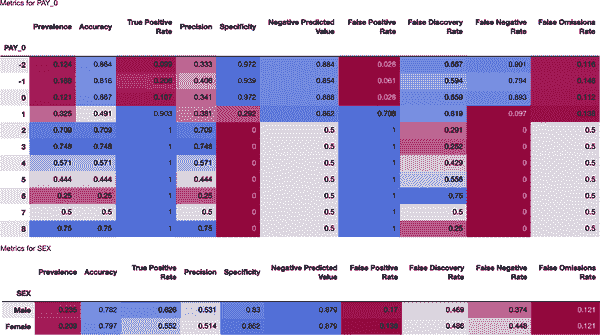
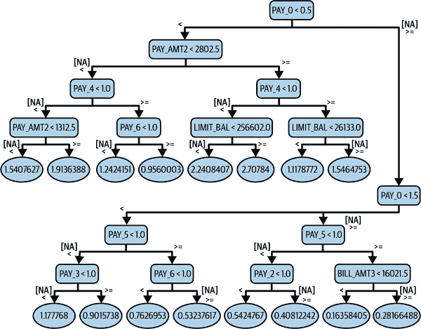
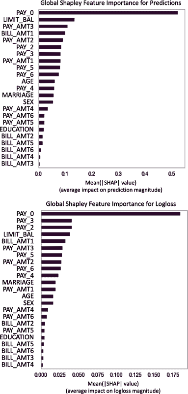
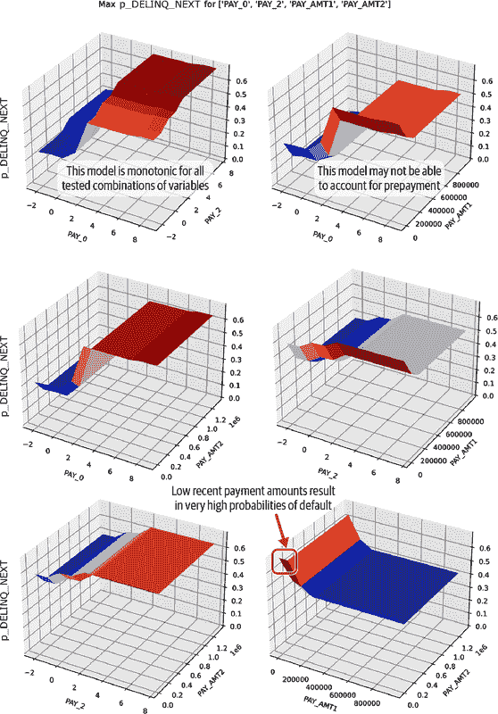

# 第三章：调试机器学习系统以实现安全性和性能

数十年来，错误或者在保留测试数据上的准确性一直是评判机器学习模型的标准。不幸的是，随着机器学习模型被嵌入到部署更广泛和更敏感的应用程序的人工智能系统中，传统的模型评估方法已经被证明是不足够的。例如，整体测试数据的曲线下面积（AUC）几乎无法告诉我们有关偏见和算法歧视、透明度不足、隐私伤害或安全漏洞的任何信息。然而，这些问题往往是人工智能系统部署后失败的原因。为了获得可接受的实时性能，我们必须超越为研究原型设计的传统模拟评估方法。此外，安全性和性能的最佳结果出现在组织能够混合和匹配在第一章中描述的适当的文化能力和流程控制与促进信任的机器学习技术时。本章介绍了关于培训、调试和部署机器学习系统的部分，深入探讨了测试和提高实时安全性、性能和 AI 信任的众多技术方法。请注意，第 8 和 9 章提供了用于模型调试的详细代码示例。

# 培训

关于训练 ML 算法的讨论从可重复性开始，因为没有这一点，我们无法知道 ML 系统的任何一个版本是否真的比另一个好。数据和特征工程将简要讨论，并且培训部分结束时概述了模型规范的关键点。

## 可重复性

没有可重复性，我们就像在沙上建房子。可重复性是所有科学工作的基础，包括人工智能。没有可重复的结果，很难知道每天的努力是否改进了 ML 系统，甚至是否改变了它。可重复性有助于确保正确的实施和测试，一些客户可能只是要求它。以下技术是数据科学家和 ML 工程师用来为他们的 ML 系统建立坚实可重复基础的一些最常见的技术之一：

基准模型

基准模型是培训、调试和部署机器学习系统的重要安全性和性能工具。本章将多次讨论它们。在模型培训和可重复性的背景下，我们应始终从可重复的基准模型构建。这允许在可重复性丢失时进行回滚的检查点，同时也促进了实际进展。如果昨天的基准模型是可重复的，并且今天的进展超出了那个基准模型，那就是真正可衡量的进展。如果在进行更改之前系统性能指标反弹，而在进行更改后它们仍然反弹，我们就无法知道我们的更改是有帮助还是有害的。

硬件

由于机器学习系统通常通过图形处理单元（GPU）和其他专用系统组件实现硬件加速，硬件仍然是保持可重现性的特别关注点。如果可能，尽量在开发、测试和部署系统中保持硬件尽可能相似。

环境

机器学习系统始终在某种计算环境中运行，由系统硬件、系统软件以及我们的数据和机器学习软件堆栈指定。这些任何方面的变化都可能影响机器学习结果的可重现性。幸运的是，像 Python 虚拟环境和 Docker 容器这样的工具已经成为数据科学实践中的常见工具，用于保存软件环境。来自 [Domino](https://oreil.ly/USwuG)、[gigantum](https://oreil.ly/1cE7-)、[TensorFlow TFX](https://oreil.ly/kHKvx) 和 [Kubeflow](https://oreil.ly/F9ZaL) 的其他专业环境管理软件可以提供更广泛的计算环境控制。

元数据

有关数据的数据对于可重现性至关重要。跟踪与模型相关的所有工件，例如数据集、预处理步骤、数据和模型验证结果、人工签名和部署详细信息。这不仅允许回滚到数据集或模型的特定版本，还允许详细调试和 AI 事件的法证调查。关于跟踪元数据的开源示例工具，可以查看 [TensorFlow ML Metadata](https://oreil.ly/gmHkg)。

随机种子

数据科学家和工程师在特定代码块中设置的随机种子是机器学习可重现性的耕牛。不幸的是，它们通常伴随语言或包特定的说明。在不同的软件中学习种子可能需要一些时间，但结合仔细的测试，随机种子使得复杂的机器学习系统的构建模块能够保持可重现性。这是整体可重现性的先决条件。

版本控制

小的代码更改可能会导致机器学习结果的 drasti**c** 改变。我们自己的代码及其依赖项的更改必须在专业的版本控制工具中跟踪，以便希望能够重现结果。Git 和 GitHub 是软件版本控制的免费且无处不在的资源，但还有很多其他探索的选择。关键是，数据也可以通过诸如 [Pachyderm](https://oreil.ly/DvMCo) 和 [DVC](https://oreil.ly/S59Qv) 等工具进行版本控制，从而追踪数据资源的变化。

虽然可能需要一些试验，但这些方法和技术的某种组合应该能够保证我们机器学习系统的可重现性水平。一旦确保了这种基本的安全性和性能控制，就可以考虑数据质量和特征工程等其他基线因素了。

###### 注意

在模型调试和机器学习安全中，诸如基准测试、异常检测和监控等几个主题无处不在，并且它们出现在本章的几个不同部分和上下文中。

## 数据质量

关于机器学习和机器学习系统的数据质量和特征工程已经有许多书籍写成。这个简短的小节重点介绍了从安全性和性能角度来看这个广阔实践领域中一些最关键的方面。首先和最重要的是，偏见、混杂特征、不完整性和开发数据中的噪声形成了重要的假设并定义了我们模型的限制。像数据集的大小和形状这样的基础知识也是重要的考虑因素。机器学习算法对数据有很高的需求。小数据和宽松散的数据都可能导致现实世界中的灾难性性能故障，因为两者都会导致系统在测试数据上表现正常，但实际上与现实世界现象没有实质联系。小数据可能使得难以检测到拟合不足、规范不足、过拟合或其他基本性能问题。散乱的数据可能导致对某些输入值的过度自信的预测。如果由于稀疏问题在训练中未能看到某些数据范围，大多数机器学习算法将在这些范围内发布预测，而不会发出基于几乎没有信息的警告。快进到我们章节的案例讨论，世界上根本没有足够的培训视频来填补自动驾驶汽车需要学习以安全驾驶的所有示例情况的整个空间。例如，夜间骑自行车过马路的人是大多数人都会意识到的危险，但如果没有许多带标签的这种相对罕见事件的视频帧，深度学习系统处理这种情况的能力可能会因训练数据的稀缺而受到损害。

还有一些其他数据问题可能会引起安全担忧，例如数据质量不佳导致纠缠或重要信息的误代表和过拟合，或者机器学习数据和模型管道问题。在本章的背景下，*纠缠* 意味着训练数据中的特征、实体或现象代理其他与目标更直接关系的信息（例如，在物体识别中，雪代理了哈士奇）。过拟合指的是在训练数据中记忆噪声和由此产生的乐观错误估计，而管道问题是由将数据准备和建模组件的不同阶段结合成一个生成预测的可执行文件而引起的问题。表 3-1 可应用于大多数标准的机器学习数据，以帮助识别具有安全性和性能影响的常见数据质量问题。

表 3-1。常见的数据质量问题，带有症状和建议的解决方案。根据乔治·华盛顿大学 DNSC 6314（机器学习 I）课堂笔记进行适应并获得许可。

| 问题 | 常见症状 | 可能的解决方案 |
| --- | --- | --- |
| *偏倚数据*：当数据集包含感兴趣现象的信息，但这些信息始终且系统性地错误时。（详见第四章获取更多信息。） | 偏倚模型和偏倚、危险或不准确的结果。延续过去的社会偏见和歧视。 | 与领域专家和利益相关者协商。应用科学方法和[实验设计（DOE）](https://oreil.ly/0kDC9)方法。（获取更多数据。获取更好的数据。） |
| *字符数据*：当某些列、特征或实例使用字符串代替数值表示时。 | 信息丢失。偏倚模型和偏倚、危险或不准确的结果。漫长且无法忍受的训练时间。 | 各种数值编码方法（例如标签编码、目标或特征编码）。适当的算法选择，例如基于树的模型、朴素贝叶斯分类。 |
| *数据泄漏*：当验证或测试分区的信息泄漏到训练数据中。 | 不可靠或危险的域外预测。过拟合模型和不准确的结果。在硅中过于乐观的性能估计。 | 数据治理。确保所有训练中的日期早于验证和测试中的日期。确保跨分区不出现相同的标识符。在特征工程中谨慎应用——在分区后工程化，而不是之前。 |
| *脏数据*：这个表中所有问题的结合，在现实世界的数据集中非常普遍。 | 信息丢失。偏倚模型和偏倚、不准确的结果。漫长且无法忍受的训练时间。不稳定和不可靠的参数估计和规则生成。不可靠或危险的域外预测。 | 组合此处的解决策略。 |
| *不同特征尺度*：当诸如年龄和收入等特征记录在不同的尺度上时。 | 不可靠的参数估计、偏倚模型和偏倚、不准确的结果。 | 标准化。适当的算法选择，例如基于树的模型。 |
| *重复数据*：出现超过预期的行、实例或实体。 | 因意外权重过高相同实体在训练期间导致的偏倚结果。偏倚模型和偏倚、不准确的结果。 | 与领域专家谨慎进行数据清理。 |
| *纠缠*：当训练数据中的特征、实体或现象代表与目标直接关系更密切的其他信息时（例如，在对象识别中雪代表哈士奇）。 | 不可靠或危险的域外预测。快捷学习。 | 应用科学方法和 DOE 方法。应用可解释的模型和事后解释。在域内进行测试。 |
| *伪造或毒害数据*：在训练数据中注入或操纵的数据、特征、属性、现象或实体，以引发人工模型结果。 | 不可靠或危险的域外预测。偏倚模型和偏倚、不准确的结果。 | 数据治理。数据安全。应用稳健的机器学习方法。 |
| *高基数分类特征*：例如邮政编码或产品标识符等代表同一属性的许多分类级别的特征。 | 过拟合模型和不准确的结果。漫长且无法容忍的计算时间。不可靠或危险的域外预测。 | 目标或特征编码变体，按级别平均（或类似，例如中位数，BLUP）。离散化。嵌入方法，例如实体嵌入神经网络，因子分解机。 |
| *不平衡的目标*：当一个目标类别或值比其他类别或值更常见时。 | 单一类别模型预测。偏倚的模型预测。 | 比例过采样或欠采样。逆先验概率加权。混合模型，例如零膨胀回归方法。后验调整预测或决策阈值。 |
| *不完整数据*：当数据集不编码感兴趣现象的信息时。未收集到的信息干扰模型结果。 | 无用的模型，毫无意义或危险的结果。 | 与领域专家和利益相关者咨询。应用科学方法和 DOE 方法。（获取更多数据。获取更好的数据。） |
| *缺失值*：特定行或实例缺少信息时。 | 信息丢失。偏倚模型和偏倚、不准确的结果。 | 插补。离散化（即分箱）。适当的算法选择，例如基于树的模型，朴素贝叶斯分类。 |
| *噪声*：未能为建模提供清晰信号的数据。具有相同输入值但不同目标值的数据。 | 不可靠或危险的域外预测。训练过程中性能不佳。 | 与领域专家和利益相关者咨询。应用科学方法和 DOE 方法。（获取更多数据。获取更好的数据。） |
| *非标准化数据*：同一实体的值以不同方式表示的数据。 | 不可靠的域外预测。漫长且无法容忍的训练时间。不可靠的参数估计和规则生成。 | 与领域专家仔细进行数据清洗。 |
| *异常值*：与其他数据行或实例不同或奇怪的数据。 | 偏倚模型和偏倚、不准确的结果。不可靠的参数估计和规则生成。不可靠的域外预测。 | 离散化（即分箱）。Winsorizing。稳健损失函数，如 Huber 损失函数。 |
| *稀疏数据*: 数据中有很多零值或缺失值；数据未能编码足够关于感兴趣现象的信息。 | 长时间的、无法忍受的训练时间。由于信息不足、维度诅咒或模型规范错误导致的无意义或危险的结果。 | 特征提取或矩阵因子分解方法。适当的数据表示（如 COO、CSR）。应用业务规则、模型断言和约束，弥补训练数据稀疏区域中学习到的不合逻辑的模型行为。 |
| *强多重共线性（相关性）*: 特征之间存在强线性依赖关系。 | 不稳定的参数估计、不稳定的规则生成和危险或不稳定的预测。 | 特征选择。特征提取。L2 正则化。 |
| *未识别的时间和日期格式*: 时间和日期格式，由数据处理或建模软件不正确编码。 | 不可靠或危险的领域外预测。不可靠的参数估计和规则生成。过拟合模型和不准确的结果。在硅内性能估计过于乐观。 | 与领域专家协商进行仔细的数据清洗。 |
| *宽数据*: 列数、特征数、像素数或标记数远远多于行数、实例数、图像数或文档数。 *P* >> *N*。 | 长时间的、无法忍受的训练时间。由于维度诅咒或模型规范错误导致的无意义或危险的结果。 | 特征选择、特征提取、L1 正则化、不假设 *N* >> *P* 的模型。 |

在高风险应用中，数据可能出现许多问题，导致模型性能不可靠或危险。或许我们会认为可以通过特征工程解决数据质量问题。但特征工程的好坏取决于执行它的思维和代码质量。如果我们在特征工程中不十分小心，很可能只会给自己带来更多的错误和复杂性。机器学习流水线中常见的特征工程问题包括以下几点：

+   API 或版本不匹配数据清洗、预处理和推理包之间

+   推理期间未应用所有数据清洗和转换步骤

+   推理期间未重新调整过采样或欠采样

+   无法在推理期间优雅或安全地处理训练时未见过的值

当然，在数据准备、特征工程和相关流水线中可能会出现许多其他问题，尤其是机器学习算法能接受的数据类型变得更加多样化时。检测和解决这类问题的工具也是数据科学工具包中的重要组成部分。对于 Python Pandas 用户来说，[ydata-profiling 工具](https://oreil.ly/EDNSC)（以前称为 pandas-profiler）是一种可视化辅助工具，帮助检测许多基本的数据质量问题。R 用户也有选择的余地，正如 Mateusz Staniak 和 Przemysław Biecek 在 [“R 自动探索性数据分析包的景观”](https://oreil.ly/1cBlv) 中讨论的那样。

## 实现真实世界结果的模型规范

一旦我们的数据准备和特征工程流水线成熟，就该考虑机器学习模型的规范。对于真实世界性能和安全性的考虑与发表论文或在机器学习竞赛排行榜上最大化性能的考虑大不相同。尽管验证和测试错误的测量仍然重要，但更大的问题是准确表示数据和常识真实世界现象具有最高优先级。本小节通过突出基准和替代模型的重要性，校准、结构有效性、假设和限制、适当的损失函数、避免多重比较，并预览强大机器学习和机器学习安全性与可靠性的新兴学科来讨论安全性和性能的模型规范。

### 基准和替代方案

在开始机器学习建模任务时，最好从经过同行评审的训练算法开始，并在可能的情况下复制与该算法相关联的任何基准。虽然学术算法很少能满足复杂业务问题的所有需求，但从一个知名算法和基准开始可以确保训练算法的实施正确。一旦完成这个检查，再考虑调整复杂算法以解决特定问题的特殊怪癖。

除了与基准的比较之外，评估多种替代算法方法是另一个可以提高安全性和性能结果的最佳实践。训练许多不同的算法并谨慎选择最终部署的最佳选项的实践通常会产生更高质量的模型，因为它增加了评估的模型数量，并迫使用户理解它们之间的差异。此外，评估替代方法在符合广泛的美国非歧视和疏忽标准方面非常重要。一般来说，这些标准要求证明评估了不同的技术选项，并在部署之前在消费者保护和业务需求之间做出适当的权衡。

### 校准

仅仅因为复杂的机器学习流程的末端弹出一个介于 0 和 1 之间的数字，并不意味着它是一个概率。大多数机器学习分类器生成的未校准概率通常需要进行后处理，以赋予其真正的概率意义。我们通常使用一个缩放过程，甚至是另一个模型，来确保当流程输出 0.5 时，所讨论的事件实际上发生在过去记录数据中大约 50%的类似实体中。[scikit-learn](https://oreil.ly/LxJbX)提供了一些用于机器学习分类器校准的基本诊断和函数。当模型输出的分布与已知结果的分布不匹配时，校准问题也会影响回归模型。例如，保险中的许多数值量并不服从正态分布。使用默认的平方损失函数，而不是来自伽马或 Tweedie 家族的损失函数，可能导致预测不像已知的数据生成过程中的值那样分布。无论我们如何考虑校准，根本问题是受影响的机器学习模型预测与现实不符。我们永远无法做出好的预测和决策。我们需要我们的概率与过去的结果率保持一致，我们需要我们的回归模型生成与建模数据生成过程相同分布的预测值。

### 构建效度

构建效度是社会科学（尤其是心理测量学和测试）的一个概念。构建效度意味着有合理的科学依据认为测试表现反映了预期的构建。换句话说，是否有科学证据表明标准化测试的问题和分数能预测大学或工作表现？为什么我们在机器学习书中提到这个？因为这些天机器学习模型经常用于与心理测量测试相同的目的，并且在我们看来，机器学习模型通常缺乏构建效度。更糟糕的是，不与训练数据或其现实世界领域的基本结构相符的机器学习算法可能会引发严重事件。

在选择机器学习模型和线性模型之间时，许多人往往默认使用机器学习模型。选择机器学习算法来解决建模问题基本上是建立在一些基本假设上——即输入特征的高阶交互和非线性是预测现象的重要驱动因素。相反，选择使用线性模型则隐含地减少了交互作用和非线性的影响。如果这些特质对于良好的预测很重要，它们就必须对线性模型进行明确指定。无论哪种情况，重要的是要考虑如何通过建模算法处理训练数据中的主效应、相关性和局部依赖性、交互作用、非线性、簇、异常值以及层次结构，并测试这些机制。一旦部署，为了实现最佳的安全性和性能，必须在机器学习模型中表示与时间、地理位置或不同类型网络实体之间的依赖关系。如果没有这些与现实的明确联系，机器学习模型就会缺乏结构有效性，很可能无法表现出良好的实际性能。特征工程、约束、损失函数、模型架构和其他机制都可以用来使模型适应其任务。

### 假设和限制

偏差、纠缠、不完整、噪音、范围、稀疏性和训练数据的其他基本特征开始定义我们模型的假设和限制。正如讨论的那样，建模算法和架构也具有假设和限制。例如，基于树的模型通常无法在训练数据范围之外进行外推。机器学习算法的超参数是另一个隐藏假设可能引起安全性和性能问题的地方。可以根据领域知识或通过像网格搜索和贝叶斯优化这样的技术方法选择超参数。关键在于不要满足于默认设置，系统地选择设置，并且不要因为多重比较问题而自欺欺人。在训练数据中测试错误之间的独立性或绘制模型残差并寻找强烈模式是确保一些基本假设得到处理的一般和经过时间考验的方法。我们不太可能绕过所有数据和模型的假设和限制。因此，我们需要在模型文档中记录任何未解决或怀疑的假设和限制，并确保用户了解使用模型可能违反其假设和限制的情况。这些将被视为超出范围或*非标签*使用，就像在不恰当的方式使用处方药一样。顺便说一句，建构有效性与模型文档和专注于模型限制和假设的风险管理框架密切相关。监管专业人员希望从业者通过书面方式详细讨论其模型背后的假设，并确保其建立在有效的结构下，而不是假设之上。

### 默认损失函数

许多学习算法伴随的另一个常常未明示的假设涉及平方损失函数。许多机器学习算法默认使用平方损失函数。在大多数情况下，平方损失函数因其在观测值之间的可加性和线性导数而更多是数学上的便利性问题。随着现代工具如[autograd](https://oreil.ly/8icjS)的出现，这种便利性越来越不必要。我们应该根据问题域匹配我们选择的损失函数。

### 多重比较

在机器学习中，模型选择通常意味着尝试许多不同的输入特征集、模型超参数和其他模型设置，如概率截断阈值。我们经常使用逐步特征选择、网格搜索或其他方法，在同一组验证或留存数据上尝试许多不同的设置。统计学家可能会称之为*多重比较*问题，并可能指出，我们进行的比较越多，我们碰巧找到的那些看起来很好的设置就越有可能。这是一种隐蔽的过拟合类型，我们在后续的实际性能中重新使用同一留存数据太多次，选择在那里效果良好的特征、超参数或其他设置，然后经历后期性能不佳。因此，[可重复使用的留存方法](https://oreil.ly/QJlUV)，通过改变或重新采样验证或留存数据，使我们的特征、超参数或其他设置更具普适性，是非常有用的。

### 机器学习的安全和稳健的未来

新兴的[稳健机器学习](https://oreil.ly/1G1Wp)领域正在涌现出具有改进稳定性和安全特性的新算法。各种研究人员正在创建具有最优性保证的新学习算法，例如[最优稀疏决策树](https://oreil.ly/gOmtg)。研究人员还整理了关于机器学习安全性和可靠性的优秀[教程材料](https://oreil.ly/wC5M1)。今天，这些方法需要定制实现和额外工作，但希望这些安全性和性能进步很快将更普遍地可用。

# 模型调试

一旦模型被正确规范和训练，技术安全和性能保障流程的下一步就是测试和调试。多年来，这类评估集中在留存数据的整体质量和错误率上。随着机器学习模型被纳入面向公众的机器学习系统，并且公开报道的 AI 事件数量急剧增加，更加严格的验证显然是必要的。新兴的[模型调试](https://oreil.ly/IY0gU)领域应运而生，以满足这一需求。模型调试将机器学习模型更多地视为代码，而不是抽象数学。它应用一系列测试方法来发现机器学习模型和机器学习系统管道中的软件缺陷、逻辑错误、不准确性和安全漏洞。当然，在发现这些缺陷时，也必须加以修复。本节详细探讨了模型调试，从基本和传统方法开始，然后概述了我们试图发现的常见缺陷，进而介绍了专业的测试技术，并最终讨论了缺陷修复方法。

###### 注意

除了许多可解释的 ML 模型外，开源软件包[PiML](https://oreil.ly/1O3hi)包含了一套详尽的面向结构化数据训练的 ML 模型调试工具。即使它不完全适用于特定用例，它也是一个学习更多和获得模型调试灵感的好去处。

## 软件测试

当我们停止把漂亮的图表和令人印象深刻的结果表视为 ML 模型训练任务的最终目标时，基本的软件测试变得更加重要。当 ML 系统部署时，它们需要在各种情况下正常工作。在与 ML 系统相关的几乎所有其他方面中，使软件正常工作是一门精确的科学。软件测试的最佳实践是众所周知的，并且在许多情况下甚至可以自动化。至少，关键任务的 ML 系统应该进行以下测试：

单元测试

所有函数、方法、子程序或其他代码块都应该有关联的测试，以确保它们按预期行为，并且是可重复的。这确保了 ML 系统的构建模块是坚固的。

集成测试

应该对所有 API 和模块、层或其他子系统之间的接口进行测试，以确保正确的通信。后端代码更改后的 API 不匹配是 ML 系统的经典失败模式。使用集成测试来捕获此类及其他集成故障。

功能测试

功能测试应该应用于 ML 系统用户界面和端点，以确保它们在部署后的行为符合预期。

混沌测试

在混乱和对抗条件下进行测试可以在我们的 ML 系统面对复杂和令人意外的实际场景时取得更好的结果。由于很难预测 ML 系统可能失败的所有方式，混沌测试可以帮助探索更广泛的故障模式，并在所谓的“未知未知”面前提供一些保障。

还应该将两种额外的 ML 特定测试加入到组合中，以进一步提高质量：

随机攻击

随机攻击是在 ML 中进行混沌测试的一种方式。随机攻击将 ML 模型暴露于大量随机数据中，以捕捉软件和数学问题。现实世界是一个混乱的地方。我们的 ML 系统将会遇到它未准备好的数据。随机攻击可以减少这些事件及相关的故障或事件。

基准测试

使用基准来跟踪系统随时间的改进。ML 系统可能非常复杂。我们怎么知道工程师今天改变的三行代码对整个系统性能会有影响呢？如果在变更前后对系统性能进行可重复性的基准测试，回答这类问题就容易多了。

ML 是软件。因此，所有传统企业软件资产上进行的测试也应该在重要的 ML 系统上进行。如果我们不知道从哪里开始进行模型调试，我们就从随机攻击开始。读者可能会对随机数据在 ML 系统中暴露出的数学或软件错误感到震惊。当我们能够将基准添加到组织的持续集成/持续开发（CI/CD）流水线中时，这是向保证 ML 系统的安全性和性能迈出的另一大步。

###### 注意

随机攻击可能是开始模型调试最简单和最有效的方式。如果调试感觉压倒性，或者不知道从哪里开始，可以从随机攻击开始。

## 传统模型评估

一旦我们对我们的 ML 系统中的代码有信心，集中精力测试我们的 ML 算法的数学就变得更容易。查看标准性能指标非常重要。但这并不是验证和调试过程的终点，而是开始。在考虑域内性能时，与评估统计数字的精确值相关性较小，更多的是将体外表现映射到体内表现。

如果可能的话，尽量选择具有逻辑解释和实际或统计阈值的评估统计数字。例如，对于许多类型的预测问题可以计算 RMSE，并且关键是它可以用目标的单位进行解释。对于分类任务的曲线下面积，其范围在低端为 0.5，在高端为 1.0。这些评估措施允许对 ML 模型性能进行常识解释，并与确定质量的广泛接受的阈值进行比较。使用多个指标进行分析同样重要，并且要跨数据的重要部分以及跨训练、验证和测试数据分区分析性能指标。在比较训练数据内部段的性能时，重要的是所有这些段展示出大致相等和高质量的性能。在一个大客户段上表现出色，但在其他所有人身上表现不佳，在像 RMSE 这样的平均评估统计值中看起来还可以。然而，如果由于许多不满意的客户导致公共品牌损害，这看起来并不好。在段间性能变化也可能是不充分规范的迹象，这是我们在本章中将深入探讨的严重 ML 缺陷。对训练、验证和测试数据集的性能分析通常也是为了分析欠拟合和过拟合。像模型性能一样，我们可以查找整个数据分区或段的过拟合和欠拟合。

传统模型评估中另一个实际考虑因素是选择概率截断阈值。大多数分类的 ML 模型生成数值概率，而不是离散决策。选择与实际决策相关联的数值概率截断可以通过多种方式完成。虽然总是诱人地最大化某些复杂的评估指标，但考虑现实世界的影响也是一个好主意。让我们考虑一个经典的贷款例子。假设违约概率模型的阈值最初设置为 0.15，这意味着得分低于 0.15 的每个人都可以批准贷款，而得分达到或超过阈值的人则被拒绝。思考以下问题：

+   对于这个阈值，预期的货币回报是什么？财务风险是多少？

+   在这个阈值下，会有多少人能获得贷款？

+   多少女性？多少少数族裔成员？

在概率截断阈值之外，估计领域内表现总是个好主意，因为这是我们真正关心的。评估指标很好，但重要的是赚钱与亏钱，甚至是挽救生命与失去生命。我们可以首先尝试通过为分类问题的混淆矩阵的每个单元或回归问题的每个残差单元分配货币或其他价值来理解现实世界的价值。做一次草稿计算。我们的模型看起来会赚钱还是赔钱？一旦我们掌握了这种估值的要领，我们甚至可以直接将不同模型结果的价值水平纳入 ML 损失函数中，并优化以适应最适合的实际部署模型。

对于 ML 来说，错误和准确度指标始终很重要。但是一旦 ML 算法在部署的 ML 系统中使用，数值值和比较的重要性就不如在发表论文和数据科学竞赛中那么重要了。因此，继续使用传统的评估措施，但尝试将它们映射到领域内的安全性和性能。

## 常见的机器学习 bug

我们已经讨论了无法再现性、数据质量问题、适当的模型规范、软件错误和传统评估。但是复杂 ML 系统可能出现更多问题。当涉及到 ML 的数学时，有一些新出现的陷阱和许多众所周知的陷阱。本小节将讨论包括分布偏移、认识不确定性、弱点、不稳定性、泄漏、循环输入、过拟合、快捷学习、欠拟合和规范不足在内的 bug。

### 分布偏移

在不同训练数据分区之间以及模型部署后，底层数据的变化是机器学习系统的常见故障模式。无论是新竞争对手进入市场还是全球性灾害爆发，世界都是一个动态变化的地方。不幸的是，今天大多数的机器学习系统从静态的训练数据快照中学习模式，并尝试在新数据中应用这些模式。有时候这些数据是保留的验证或测试分区数据，有时候是生产评分队列中的实时数据。然而，输入特征分布的漂移是一个严重的错误，必须被捕捉并解决。

###### 警告

基于自适应、在线或强化学习的系统，或者只需最少人为干预即可更新自身的系统，面临严重的对抗性操纵、误差传播、反馈环路、可靠性和稳健性风险。虽然这些系统可能代表了当前技术水平，但它们需要高水平的风险管理。

在训练机器学习模型时，要注意训练、交叉验证、验证或测试集之间的分布变化，可以使用人口稳定性指数（PSI）、Kolmogorov-Smirnov（KS）检验、t 检验或其他适当的措施。如果一个特征在一个训练分区与另一个训练分区有不同的分布，可以删除它或者进行严格的正则化。在调试期间进行的另一个智能分布变化测试是模拟可能部署条件下的分布变化，并重新测量模型质量，特别关注表现不佳的行。如果我们担心我们的模型在经济衰退期间的表现，我们可以模拟分布变化来模拟更多的延迟付款、较低的现金流和更高的信用余额，然后看看我们的模型的表现如何。在训练数据中记录分布信息非常关键，这样可以轻松检测部署后的漂移。

### 认识不确定性和数据稀疏性

*认识论不确定性* 是指由于缺乏知识而产生的不稳定性和错误的一种花哨的说法。在机器学习中，模型传统上通过训练数据获取知识。如果我们庞大的多维训练数据中有稀疏部分，那么在该区域内我们的模型很可能存在高度的不确定性。听起来理论上有道理，却不是空穴来风。考虑一个基本的信贷放款模型。我们倾向于有大量关于已持有信用卡并支付账单的人的数据，但往往缺乏关于没有信用卡的人（因为他们的过去信用卡数据不存在）或者不支付账单的人（因为绝大多数客户都会支付）的数据。轻松知道要向信用评分高且按时支付账单的人发放信用卡。艰难的决策是针对信用历史较短或波动较大的人。对于我们确实需要了解的人群缺乏数据可能会导致严重的认识论不确定性问题。如果数百万客户中只有少数几个客户最近账单拖欠了四五个月，那么机器学习模型对于如何最好地处理这些人几乎没有学习到什么。

这种现象在 “规约性不足” 部分有所体现（该部分始于 ​），在这里举例说明了模型对于最近账单拖欠超过两个月的人是毫无意义的。这种表现较差且可能不稳定的区域有时被称为 *弱点*。通过观察总体误差或性能指标很难找到这些弱点。这只是仔细在训练或留置数据段测试模型的众多原因之一。这也是为什么我们在 第二章 中将部分依赖和个别条件期望图与直方图配对使用。在这些图表中，我们可以看到模型行为是否受到训练数据的支持。一旦我们确定了导致认识论不确定性和弱点的数据稀疏区域，通常需要依靠人类知识——通过约束模型形式以根据领域经验逻辑行事，通过增加业务规则来扩展模型，或者将落入稀疏区域的案例交给人工工作者做出艰难决策。

### 不稳定性

机器学习模型在训练过程中或在对实时数据进行预测时可能表现出不稳定性或缺乏鲁棒性和可靠性。训练过程中的不稳定性通常与训练数据量小、训练数据的稀疏区域、训练数据中高度相关的特征或高方差的模型形式（如深度单一决策树）有关。交叉验证是检测训练过程中不稳定性的典型工具。如果模型在交叉验证折叠中显示出显著不同的错误或准确性特性，则存在不稳定性问题。通过更好的数据和低方差的模型形式（如决策树集成）通常可以修复训练不稳定性。ALE 或 ICE 的绘图也倾向于揭示训练数据稀疏区域中的预测不稳定性，可以使用敏感性分析（扰动、模拟、压力测试和对抗性示例搜索）来分析预测的不稳定性。

###### 注意

机器学习中有两种简单的方式来思考不稳定性：

+   当输入数据的微小变化导致输出数据的巨大变化

+   当增加少量训练数据导致重新训练时得到一个截然不同的模型时

如果通过这些技术来探索我们的响应曲面或决策边界揭示出预测出现的剧烈波动，或者我们的 ALE 或 ICE 曲线在特征值的高低范围内反复跳动，尤其是在极端值附近，这说明我们也存在不稳定性问题。这种类型的不稳定性通常可以通过约束和正则化来修复。请查看第八章中的代码示例，看看这些修复方法是如何实施的。

### 泄漏

在训练、验证和测试数据分区之间的信息泄漏发生在验证和测试分区的信息泄漏到训练分区，导致过度乐观的错误和准确性测量。泄漏可能由于多种原因而发生，包括以下几点：

特征工程

如果使用不正确，某些特征工程技术，如插补或主成分分析，可能会将验证和测试数据的信息污染到训练数据中。为了避免这种泄漏，需对训练数据分区统一进行特征工程，但是分开操作。或确保在训练数据中计算并应用于验证和测试数据的信息，如插补所需的均值和模式，而不是反过来。

对时间数据的错误处理

不要用未来来预测过去。大多数数据都与时间有些关联，无论是显性的，如时间序列数据，还是其他隐含的关系。误用或打破这种关系会导致常见的信息泄漏问题。如果我们处理的是时间相关的数据，模型验证方案中必须使用时间。最基本的规则是，最早的数据应该用于训练分区，而较晚的数据应该根据时间分成验证和测试分区。关于时间序列预测最佳实践的一个可靠（并且免费）资源是[*Forecasting: Principles and Practice* (OTexts)](https://oreil.ly/R2y6N)。

多个相同的实体

有时相同的个人、财务或计算交易，或其他建模实体会出现在多个训练数据分区中。当这种情况发生时，必须小心确保机器学习模型不会记住这些个体的特征，然后将这些个体特定的模式应用于新数据中的不同实体。

保留一个未触及的、具有时间意识的留出集，可以帮助诚实估计真实世界性能中的许多信息泄漏问题。如果这样的留出集上的误差或准确性看起来比在模型开发中使用的分区上要不那么乐观，我们可能会有信息泄漏问题。更复杂的建模方案，包括堆叠、门控或赌博，可以使信息泄漏变得更难以预防和检测。然而，一个基本的经验法则仍然适用：不要使用在学习或模型选择中涉及的数据来进行真实性能评估。使用堆叠、门控或赌博意味着我们需要更多的留出数据来为这些复杂模型的不同阶段做出准确的实时质量猜测。对数据验证方案的仔细记录和部署中的模型监控等更一般的控制也对任何机器学习系统都是必要的。

### 循环输入

随着机器学习系统被纳入更广泛的数字化努力中，或者作为更大决策支持努力的一部分实施，多个数据驱动系统通常会互相交互。在这些情况下，误差传播和反馈循环错误可能会发生。误差传播发生在一个系统中的小错误导致或放大另一个系统中的错误时。反馈循环是一种机器学习系统可能因正确而失败的方式。反馈循环发生在机器学习系统影响其环境，然后这些影响重新纳入系统训练数据时。反馈循环的例子包括预测性警务导致对某些社区的过度警务，或者就业算法通过不断推荐正确但非多样化的候选人而加剧了招聘中的多样性问题。系统之间的依赖关系必须记录，部署的模型必须监控，以便调试工作可以检测到误差传播或反馈循环错误。

### 过拟合

当复杂的机器学习算法从训练数据中过多地记忆特定信息，却未学习到足够通用概念以便部署后发挥作用时，就会出现过拟合问题。过拟合通常由高方差模型或对于手头数据来说过于复杂的模型引起。过拟合通常表现为在训练数据上的性能明显优于验证、交叉验证和测试数据分区上的性能。由于过拟合是一个普遍存在的问题，有许多可能的解决方案，但大多数都涉及减少所选模型的方差。这些解决方案的示例包括：

集成模型

集成技术，特别是自举聚合（即装袋）和梯度提升已知可以减少单个高方差模型的错误。因此，如果遇到过拟合问题，我们可以尝试其中一种集成方法。请记住，当从单一模型切换到多模型时，虽然可以减少过拟合和不稳定性，但也可能会失去解释性。

减少架构复杂性

神经网络可能有太多的隐藏层或隐藏单元。集成模型可能有太多的基学习器。树可能太深。如果我们认为观察到了过拟合现象，我们会使我们的模型架构更简单。

正则化

正则化指的是许多复杂的数学方法，用于减少机器学习模型中学习规则或参数的强度、复杂性或数量。事实上，现在许多类型的机器学习模型都包含多种正则化选项，因此我们确保使用这些选项来减少过拟合的可能性。

更简单的假设模型家族

一些机器学习模型在初始状态下可能比其他模型更复杂。如果我们的神经网络或梯度提升机（GBM）看起来出现了过拟合现象，我们可以尝试使用更简单的决策树或线性模型。

过拟合传统上被视为机器学习的致命弱点。虽然这是最常见的错误之一，但从安全性和性能角度考虑，它只是许多可能的技术风险之一。与信息泄漏一样，随着机器学习系统变得更加复杂，过拟合变得更难检测。在部署之前，始终保留一组未触及的留存数据集，以评估真实世界的性能。还需要应用更通用的控制措施，如验证方案的文档化、模型监控和在实时数据上进行模型的 A/B 测试，以防止过拟合。

### 快速学习

快捷学习发生在复杂的机器学习系统被认为是在学习和决策某一主题，比如肺部扫描异常或工作面试表现，但实际上它学习了一些更简单相关的概念，比如机器识别号或 Zoom 视频通话背景。快捷学习往往源于训练数据中纠缠的概念、缺乏构造效度以及未能充分考虑和记录假设和限制。我们使用可解释模型和可解释人工智能技术来理解驱动模型决策的学习机制，并确保我们理解我们的机器学习系统如何做出科学上有效的决策。

### **欠拟合**

如果有人告诉我们关于一组数据的统计信息，我们可能会想知道这些统计数据基于多少数据，以及这些数据的质量是否足够高，可以信任。如果有人告诉我们，他们有数百万、数十亿甚至数万亿的统计数据供我们考虑，他们需要大量数据来证明所有这些统计数据是有意义的。就像平均数和其他统计数据一样，机器学习模型中的每个参数或规则都是从数据中学习的。大型机器学习模型需要大量数据才能学习到足够多的内容，使其数百万、数十亿或数万亿学习机制具有意义。当复杂的机器学习算法缺乏足够的训练数据、约束或其他输入信息时，就会发生欠拟合，它只从训练数据中学习到了一些可泛化的概念，但没有足够的具体内容在部署时发挥作用。欠拟合可以通过在训练和验证数据上表现不佳来诊断。另一个欠拟合的证据是如果我们的模型残差比随机噪声具有显著更多的结构。这表明数据中存在着我们的模型未能检测到的有意义模式，这也是我们检查模型调试的残差的另一个原因。我们可以通过增加模型复杂性或更好地提供训练数据来减轻欠拟合问题。我们还可以通过其他方式提供更多的输入信息，例如新特征、应用于模型参数分布的贝叶斯先验，或各种类型的架构或优化约束。

### **不充分规范**

四十位研究人员最近发表了[《“欠规范性对现代机器学习的可信度构成挑战”》](https://oreil.ly/Da9g0)。这篇论文为几十年来存在的问题命名，即*欠规范性*。欠规范性源于核心的机器学习概念——多个优良模型的存在，有时也被称为拉肖蒙效应。对于任何给定的数据集，存在许多准确的机器学习模型。有多少呢？通常远远超过人类技术人员能够理解的范围。虽然我们使用验证数据从训练期间尝试的多个模型中选择一个好的模型，但基于验证数据的模型选择并不足以确保我们选择了最佳模型——甚至是一个可用的模型用于部署。假设某个数据集有一百万个基于训练数据的好的机器学习模型以及大量的潜在假设模型。通过验证数据选择可能会将这些模型减少到一百个模型的池子中。即使在这种简单的情况下，我们仍然只有百分之一的机会选择正确的模型用于部署。我们如何增加这些机会？通过将领域知识注入机器学习模型中。通过将基于验证的模型选择与领域信息约束相结合，我们有更大的机会选择一个适合当前任务的可行模型。

幸运的是，测试欠规范性可能相对简单。欠规范性的一个主要症状是模型性能依赖于与领域结构、数据或模型无关的计算超参数。如果我们的模型性能因随机种子、线程或 GPU 数量或其他计算设置而变化，那么我们的模型可能是欠规范的。另一个测试欠规范性的方法在图 3-1 中有所说明。

图 3-1 展示了在示例训练数据和模型的重要部分中的多个错误和准确度测量。在这里，对于由重要特征`PAY_0`的高值定义的段落，性能的显著变化指向潜在的欠规范问题，这很可能是由于该区域训练数据的数据稀疏性所致。（在由`SEX`定义的段落中，性能更加平衡，这是从偏见测试的角度来看一个好迹象，但这当然不是检测偏见问题的唯一测试。）修复欠规范性通常涉及将现实世界的知识应用于机器学习算法中。这样的领域知识机制包括图连接、单调约束、交互约束、beta 约束或其他架构约束。

###### 图 3-1\. 分析关键部分的准确度和错误是检测偏见、欠规范性和其他严重机器学习错误的重要调试方法（[数字，彩色版本](https://oreil.ly/URzZG)）。

###### 注意

本节、本章以及本书中讨论的几乎所有错误都可能会对某些数据段产生更大影响。为了获得最佳性能，重要的是在训练、验证和测试或留存数据的不同类型段落中测试弱点（性能质量）、过度拟合和欠拟合、不稳定性、分布变化以及其他问题。

在本小节讨论的每个机器学习错误都具有现实世界的安全性和性能影响。这些错误的一个统一主题是，它们导致系统在实际部署和长期使用中表现与预期不同。不可预测的性能会导致意外故障和人工智能事件。利用本文讨论的潜在错误和错误检测方法的知识，确保验证和测试性能的估计与部署性能相关，将有助于预防现实世界中的事件。现在我们知道要找什么错误，从软件、传统评估和机器学习数学的角度出发，接下来我们将讨论如何通过残差分析、敏感性分析、基准模型以及其他测试和监控方法来发现这些错误。

## 残差分析

残差分析是另一种传统模型评估的类型，对于机器学习模型和系统非常有效。在其最基本的层面上，残差分析意味着从错误中学习。这不仅在生活中非常重要，也在组织的机器学习系统中同样重要。此外，残差分析是一种经过时间考验的模型诊断技术。本小节将使用一个例子和三种通用的残差分析技术来将这一成熟的学科应用于机器学习。

###### 注意

我们使用术语*残差*来表示适当的误差测量，与模型损失测量有些同义。我们明白这里并非严格按照定义的 ŷ[i]–y[i] 的意义来使用它。我们使用这个术语来强调残差分析在回归诊断中的重要性和悠久历史，并突显其在常见的机器学习工作流中的基本缺失。

请注意，在接下来的章节中，读者可能会看到数据集中的人口特征，比如`SEX`，用于偏见测试。在很大程度上，本章将把例子信贷放贷问题视为一般的预测建模练习，并不考虑适用的公平放贷法规。关于机器学习中偏见管理以及一些法律和监管问题的深入讨论，请参阅第四章和第十章。

### 残差分析和可视化

对整体和分段残差进行绘图，并检查它们是否显示出不同问题类型的典型模式，是长期以来的模型诊断技术。残差分析可应用于机器学习算法，通过一些创造性工作和努力，能带来很大的益处。简单地绘制整个数据集的残差可以很有帮助，特别是用于发现导致极大数值误差的异常行或分析误差的整体趋势。然而，按特征和级别分解残差值和图形可能更具信息性。即使我们有很多特征或特征具有多个分类水平，我们也不能掉以轻心。从最重要的特征及其最常见的级别开始。寻找违反模型假设的残差中的强烈模式。许多类型的残差应随机分布，表明模型已从数据中学习到所有重要信息，除了不可避免的噪音。如果我们在按特征和级别分解的残差中发现强烈模式或其他异常情况，我们首先确定这些错误是否来自数据，如果不是，则可以使用 XAI 技术追踪模型中的问题。残差分析被认为是重要的线性回归模型的标准做法。机器学习模型可能面临更高的风险和更多的故障，因此它们需要更多的残差分析。

### 残差建模

使用可解释模型对残差建模是了解我们的机器学习系统可能出错方式的另一种好方法。在图 3-2 中，我们对从与错过信用卡付款相关的更复杂模型的残差进行了单一且浅层的决策树训练。

该决策树编码了描述更复杂模型错误的规则。例如，我们可以看到当某人错过信用卡付款时，但看起来是一个很好的客户时，模型生成的最大数值残差。当某人的最近的还款状态（`PAY_0`）小于 0.5，他们第二最近的还款金额（`PAY_AMT2`）大于或等于 2,802.50，他们第四最近的还款状态（`PAY_4`）小于 1，并且他们的信用额度大于或等于 256,602 时，我们看到平均对数损失残差为 2.71。这是一个大的错误率，会拉低我们的整体性能，并且如果我们对已受青睐的人口群体做出太多的误判，可能会产生偏见后果。

另一个有趣的用途是使用决策树创建模型断言，即关于模型预测的实时业务规则，可以在发生错误时进行标记。在某些情况下，这些断言可能仅仅是警示模型监控器可能正在发布错误决策，或者模型断言可能涉及纠正措施，例如将这行数据路由到更专业的模型或人工案件工作者。

###### 图 3-2\. 一个可解释的决策树模型，用于错过信用卡支付的客户

### 对残差的本地贡献

绘制和建模残差是精通者熟悉的更古老的技术。最近的一个突破使得可以计算出对模型错误的 Shapley 值贡献。这意味着对于任何数据集的任何特征或行，我们现在可以知道哪些特征驱动了模型的预测，哪些特征驱动了模型的错误。这个进步对于 ML 究竟意味着什么，尚有待确定，但可能性确实令人着迷。这种新的 Shapley 值技术的一个明显应用是比较预测的特征重要性和残差的特征重要性，如 图 3-3 中所示。

###### 图 3-3\. 对预测和模型错误的 Shapley 特征重要性进行比较（[数字化、彩色版本](https://oreil.ly/k6nDo)）

在 图 3-3 中，预测的特征重要性显示在上方，以 logloss 计算的模型错误的特征重要性显示在下方。我们可以看到，`PAY_0` 在预测和错误中都占主导地位，从而证实了该模型在一般情况下过于依赖`PAY_0`。我们还可以看到，相较于对预测的贡献，`PAY_2` 和 `PAY_3` 在对错误的贡献上排名更高。鉴于此，尝试删除、替换或损坏这些特征可能是有意义的。请注意，图 3-3 是通过在整个验证数据集上汇总对 logloss 的 Shapley 贡献而制作的。然而，这些数量是逐个特征和逐行计算的。我们还可以将这种分析应用于数据中的段或人口群体，这为检测和纠正模型下不稳定特征的有趣可能性打开了新的可能性。

###### 警告

类似 图 3-3 的特征重要性图，一个特征远远超过其他所有特征，这对 vivo 的可靠性和安全性非常不利。如果该单一重要特征的分布发生变化，我们的模型性能就会受到影响。如果黑客找到一种修改该特征值的方法，他们就可以轻易操纵我们的预测。当一个特征主导了模型，我们很可能需要一个与该特征相关的业务规则，而不是一个 ML 模型。

这结束了我们对 ML 的残差分析的简要介绍。当然，还有其他研究 ML 模型错误的方法。如果读者喜欢其他方法，那就去试试吧！重要的是对所有高风险的 ML 系统进行某种残差分析。除了接下来要讨论的敏感性分析，残差分析是 ML 模型调试工具箱中的一个必不可少的工具。

## 敏感性分析

与线性模型不同，很难理解机器学习模型在新数据上的外推或性能，除非明确对其进行测试。这就是敏感性分析的简单而强大的理念。找到或模拟有趣的场景数据，然后查看我们的模型在该数据上的表现。除非进行基本的敏感性分析，否则我们真的不会知道我们的机器学习系统在这些情景中的表现如何。当然，还有结构化和更有效的敏感性分析变体，比如微软研究院的[InterpretML](https://oreil.ly/zdzxX)库。进行敏感性分析的另一个好选择，也是更高级模型调试技术的良好起点，是随机攻击，如“软件测试”中讨论的。像压力测试、可视化和对抗示例搜索等其他方法也提供了标准化的敏感性分析方式：

压力测试

压力测试涉及模拟代表现实逆境场景的数据，如经济衰退或大流行，并确保我们的机器学习模型和任何下游业务流程能够抵御逆境情况的压力。

可视化

可视化，如累积局部效应的绘图、个体条件期望和部分依赖曲线，是观察机器学习算法在各种真实或模拟输入特征值下性能的已知高度结构化方法。这些图表还可以揭示可能导致模型性能弱点的数据稀疏区域。

对抗示例搜索

对抗示例是能够引起机器学习模型意外反应的数据行。深度学习方法可用于生成非结构化数据的对抗示例，而 ICE 和遗传算法可用于生成结构化数据的对抗示例。对抗示例（及其寻找过程）是发现我们机器学习响应函数或决策边界局部不稳定性的一种好方法，一旦部署可能引发事故。正如读者可以在图 3-4 中看到的那样，对抗示例搜索是评估模型性能的一种极佳方式。

符合性方法

[符合性方法](https://oreil.ly/f_Vrf)尝试计算模型预测的经验界限，可以通过建立模型输出的上限和下限来帮助我们理解模型的可靠性。

扰动测试

随机扰动验证、测试或保留数据以模拟不同类型的噪声和漂移，然后重新测量 ML 模型的性能，也可以帮助确定模型鲁棒性的一般界限。通过这种扰动测试，我们可以理解和记录会破坏我们模型的噪声或漂移量。需要记住的一件事是，表现不佳的行通常在扰动测试下的表现下降速度比平均行更快。要仔细观察表现不佳的行，以了解它们何时会拖累整个模型的性能。

###### 图 3-4。展示有趣模型行为的对抗性示例搜索结果（[数字，彩色版本](https://oreil.ly/_vTJW)）

图 3-4 首先通过找到展示预测大幅波动的 ICE 曲线来创建。使用负责该 ICE 曲线的数据行作为种子，对该行中的四个最重要特征的值进行数千次扰动并生成相关预测，从而导致图 3-4 中的多个图表。对敌对示例搜索的第一个发现是，基于 ICE 曲线的这种启发式技术使我们能够生成几乎可以从模型中获得任何响应的对抗性示例。我们发现，某些行可可靠地产生非常低和非常高的预测以及两者之间的一切。如果此模型可通过预测 API 使用，我们可以轻松操纵它。

在寻找所有这些对抗性示例的过程中，我们还了解了有关我们的模型的一些信息。首先，总体上它可能是单调的，并且在我们模拟的所有行中绝对是单调的。其次，该模型针对那些进行了极高支付的人会发出默认预测。即使某人最近的支付金额是一百万美元，并且超过了他们的信用额度，一旦此人的最近付款逾期两个月，该模型将会发出默认预测。这可能对提前还款构成问题。我们真的想为那些预付了数百万美元但现在最近付款逾期两个月的人发出默认或违约决定吗？也许是，但这不是应该迅速或自动做出的决定，就像这个模型会做的那样。第三，看起来我们可能已经找到了真正的对抗性示例攻击路径。最近低还款金额导致违约概率显著增加。如果黑客想从这个模型中引发高违约预测，设置`PAY_AMT1`和`PAY_AMT2`为低值可能是他们的方法。

就像我们在残差分析中提到的那样，读者可能会想到其他的敏感性分析技术，这是很好的。只是确保在你的机器学习模型上应用某种形式的现实模拟测试。本章的案例研究就是一个在部署机器学习系统前未进行现实模拟测试导致的最糟糕结果的例子。这就结束了我们对敏感性分析的简要讨论。对于那些希望更深入了解的人，我们推荐凯文·墨菲的免费开放书籍[*Probabilistic Machine Learning: Advanced Topics*](https://oreil.ly/mHWno)（MIT 出版社）第十九章。接下来，我们将讨论不同背景下的基准模型，这是一种经过时间考验和常识化的模型调试方法。

## 基准模型

本章的多个部分都讨论了基准模型。它们是非常重要的安全和性能工具，在整个机器学习生命周期中都有用。本小节将讨论在模型调试的背景下使用基准模型，并总结其他关键用途。

###### 注意

在可能的情况下，比较机器学习模型的性能与线性模型或广义线性模型的性能基准。如果线性模型胜过机器学习模型，则使用线性模型。

使用基准模型进行调试的第一种方法是比较基准和问题机器学习系统的性能。如果机器学习系统无法胜过简单的基准模型——很多情况下可能是如此——那么就得重新来过。假设一个系统通过了这个初始基线测试，基准模型可以用作比较工具，用于审查机制并找出机器学习系统中的 bug。例如，数据科学家可以提出这样的问题：“我的基准模型预测正确而我的机器学习系统预测错误的是哪些？”鉴于基准模型应该是被充分理解的，应该清楚它为什么是正确的，这种理解也应该提供一些线索，表明机器学习系统出了什么问题。基准还可以用于可复现性和模型监控，如下所述：

可复现性基准

在对复杂的机器学习系统进行更改之前，有必要有一个可复现的基准模型，用于衡量性能的增减。一个可复现的基准模型是这种测量任务的理想工具。如果这个模型可以被集成到允许自动化测试可复现性和将新系统更改与已建立基准进行比较的 CI/CD 流程中，那就更好了。

调试基准

将复杂的机器学习模型机制和预测与一个信任的、深入理解的基准模型的机制和预测进行比较，是发现机器学习 bug 的有效方法。

监控基准

在一个受信任的基准模型和复杂的机器学习系统之间比较实时预测是捕捉严重机器学习错误的一种方式。如果一个受信任的基准模型和复杂的机器学习系统对相同的新数据实例给出明显不同的预测，这可能是机器学习黑客、数据漂移，甚至偏见和算法歧视的迹象。在这种情况下，可以使用基准预测代替机器学习系统的预测，或者在人类分析员确定机器学习系统预测有效之前暂停预测。

###### 注意

请记住，调试技术通常是靠不住的统计或机器学习方法，有时甚至需要对它们进行调试。

如果我们有效地设置基准，甚至可能可以使用同一个模型执行所有三项任务。可以在开始工作之前运行基准来建立基线，然后将同一个模型用于调试和模型监控的比较。当一个新版本的系统以可重复的方式优于旧版本时，系统核心的机器学习模型可以成为新的基准。如果我们的组织能够建立这种工作流程，我们将通过基准和迭代的方式提高机器学习的安全性和性能。

## 修复：修复错误

调试的最后一步是修复错误。前面的小节已经概述了测试策略、需要注意的错误以及一些具体的修复方法。本小节概述了一般的机器学习错误修复方法，并讨论了如何在示例调试场景中应用这些方法。在机器学习模型调试期间需要考虑的一般策略包括以下几点：

异常检测

奇怪的输入和输出通常对机器学习系统不利。这些可能是实时安全性、偏见或安全性与性能问题的证据。监视机器学习系统的数据队列和预测结果，记录异常事件的发生，并在必要时提醒利益相关者。

###### 注意

可以使用一些基于规则、统计和机器学习技术来检测未见数据队列中的异常。这些技术包括数据完整性约束、置信限、控制限、自编码器和孤立森林。

实验设计和数据增强

收集更好的数据通常可以解决机器学习错误。此外，数据收集不必通过反复试验，数据科学家也不必依赖其他组织流程的数据副产品来选择训练数据。设计实验的成熟科学已经被数据从业者使用了几十年，以确保他们收集适当类型和数量的数据进行模型训练。关于“大”数据的普遍权威和过度压缩的部署时间表是数据科学家不实践设计实验的最常见原因。不幸的是，这些不是忽视设计实验的科学理由。

模型断言

模型断言是应用于 ML 模型预测的业务规则，用于修正学习的 ML 模型逻辑中的缺陷。使用业务规则来改进预测模型是一种历史悠久的补救技术，可能会伴随我们数十年。如果存在简单的逻辑规则可以应用于纠正可预见的 ML 模型失败，请勇敢地实施。在预测分析领域，最优秀的从业者和组织已经使用这个技巧几十年了。

模型编辑

鉴于 ML 模型是软件，这些软件构件可以被编辑以纠正发现的任何错误。某些模型，如 GA2Ms 或可解释增强机（EBMs），旨在被编辑用于模型调试。其他类型的模型可能需要更多的创造力来编辑。无论如何，编辑必须由领域考虑来证明，因为这可能使训练数据上的表现看起来更差。ML 模型优化以降低误差。如果我们编辑这个高度优化的结构以使领域内性能更好，我们很可能会恶化传统的评估统计数据。没关系。我们更关心体内的安全性、鲁棒性和可靠性，而不是硅内测试错误。

模型管理和监控

ML 模型及其容纳它们的 ML 系统是动态实体，必须根据资源允许的程度进行监视。所有关键任务的 ML 系统应该有良好的文档记录、清单和实时监控安全、偏倚、安全性和性能问题。当某些事情开始出错时，利益相关者需要快速得到警报。"部署"给出了有关模型监控的更详细处理。

单调性和交互约束

许多 ML 错误发生是因为 ML 模型具有过多的灵活性，并且由于学习自偏倚和不准确的训练数据而脱离现实。用现实世界的知识约束模型是解决几种 ML 错误的一般方法。在像 XGBoost 这样的流行工具中，单调性和交互约束可以帮助 ML 从业者在复杂的 ML 模型中执行逻辑领域假设。

噪声注入和强正则化

许多 ML 算法都有正则化的选项。然而，如果 ML 模型过分强调某个特征，可能需要应用更强或外部的正则化。L0 正则化可以直接用于限制模型中的规则或参数数量，当必要时，可以使用手动噪声注入来破坏某些特征的信号，以减少那些在 ML 模型中不当重要的特征。

科学方法

数据科学家、ML 工程师、他们的经理和业务合作伙伴之间的确认偏见经常共谋，将半成品演示推向市场产品，基于体外测试数据评估的假设和局限性。如果我们能够遵循科学方法，记录关于实际结果的假设，并通过设计的实验客观地测试该假设，我们在实际应用中取得成功的机会就会大大提高。有关在 ML 中使用科学方法的更多想法，请参阅第十二章。

###### 警告

通常来说，机器学习（ML）仍然更像是经验科学而不是工程学科。我们尚未完全理解 ML 在何种情况下表现良好以及可能的所有失败方式，特别是在实际应用中。这意味着我们必须应用科学方法，避免问题，如确认偏见，以达到良好的实际应用效果。仅仅使用正确的软件和平台，并遵循工程最佳实践，并不意味着我们的模型会表现良好。

有关模型调试和示例数据及模型的详细信息，请参见“资源”。目前，我们已经学到了关于模型调试的很多知识，现在是时候转向部署的 ML 系统的安全性和性能。

# 部署

一旦发现并修复了 bug，就是时候部署我们的 ML 系统以进行实际决策了。ML 系统比大多数传统软件系统更加动态。即使系统操作员不更改任何代码或系统设置，结果仍可能发生变化。一旦部署，必须检查 ML 系统的领域安全性和性能，必须对其进行监控，并确保操作员能够迅速关闭它们。本节将介绍如何增强 ML 系统部署后的安全性和性能：领域安全性、模型监控和紧急关闭开关。

## 领域安全性

领域安全性意味着在实际世界中的安全性。这与标准的模型评估甚至改进后的模型调试非常不同。从业者如何朝着实现实际世界安全目标的方向努力？A/B 测试和冠军挑战方法允许在实时操作环境中进行一定量的测试。流程控制，如列举可预见的事件、实施用于应对潜在事件的控制措施，并在真实或有压力的条件下测试这些控制措施，对于实现实际应用的稳定性非常重要。为了弥补无法预测的事件，我们对 ML 系统输出应用混沌测试、随机攻击和手动预测限制。让我们将事件分为可以预见的和无法预见的，并考虑这两种情况的一些细节：

可预见的实际世界事件

A/B 测试和冠军挑战者方法是通过在实时数据流或其他现实条件下相互测试模型的第一步，以实现领域内健壮测试。除了这些较为标准的做法之外，资源应该投入到领域专家和思考可能发生的事件上。例如，在信贷借款中常见的故障模式包括偏见和算法歧视、缺乏透明度以及在经济衰退期间表现不佳。对于其他应用，比如自动驾驶车辆，它们可能会以多种方式意外或有意造成伤害。一旦记录了潜在的事件，那么安全控制措施就可以被采用来针对最可能或最严重的潜在事件。在信贷借款中，模型被测试是否存在偏见，通过不利行动通知向消费者提供解释，并且对模型进行监控以便及时捕捉性能下降。在自动驾驶车辆领域，我们仍需学习很多，正如"案例研究：自动驾驶车辆致死"将展示的那样。无论是哪种应用，安全控制措施必须进行测试，并且这些测试应该是现实的，并与领域专家合作进行。当涉及到人类安全时，由数据科学家运行的模拟不足够。安全控制措施需要在活体中进行测试和加固，并与深刻理解应用领域安全的人员协调一致。

不可预见的现实世界事件

机器学习系统与其环境之间的互动可能是复杂且令人惊讶的。对于高风险的机器学习系统，最好承认可能会发生不可预见的事件。我们可以尝试在这些潜在的惊喜发生之前，通过混乱测试和随机攻击来捕获一些问题。重要的机器学习系统应该在奇怪和混乱的使用案例中进行测试，并暴露于大量随机输入数据。尽管这些测试需要耗费时间和资源，但它们是少数几个可用来测试所谓的“未知未知”的工具之一。鉴于没有测试制度能够捕捉到每一个问题，将常识性的预测限制应用于系统也是理想的。例如，在没有人工监督的情况下，不应该发放大额贷款或高利率。也不应该让自动驾驶车辆以非常高的速度行驶，而缺乏人类干预。今天，有些行动仍然不应完全自动执行，预测限制是实施这种控制的一种方式。

领域安全的另一个关键方面是知晓是否发生问题。有时候，故障可能在变成有害事件之前被捕获到。为了迅速发现问题，机器学习系统必须进行监控。如果检测到事件，可能需要启动事件响应计划或者关闭开关。

## 模型监控

在本章中已经多次提到，重要的机器学习系统一旦部署，必须进行监控。本小节重点讨论模型监控的技术方面。它概述了模型衰减、稳健性和概念漂移漏洞的基础知识，如何检测和解决漂移问题，以及在监控中测量多个关键绩效指标（KPIs）的重要性，并简要突出了一些其他值得注意的模型监控概念。

### 模型衰减和概念漂移

无论我们如何称呼它，输入到机器学习系统中的数据很可能会偏离系统训练时的数据。随着时间推移，输入值分布的变化有时被称为*数据漂移*。我们试图预测的统计特性也可能会漂移，有时这特指为*概念漂移*。COVID-19 危机很可能是历史上这些现象的最佳例证之一。在疫情高峰期间，消费者行为很可能向更加谨慎的方向漂移，伴随着迟付和信用违约分布的整体变化。这些变化是痛苦的，它们可能会严重影响机器学习系统的准确性。需要注意的是，我们有时会因为*离标使用*机器学习模型而导致自己的概念漂移问题。

###### 注意

输入数据和预测结果都可能会漂移。这两种漂移都可以被监测到，而且这两种漂移可能直接相关也可能不相关。当性能下降时，如果没有显著的输入漂移，这可能是由于现实世界中的概念漂移。

### 检测和解决漂移

检测漂移的最佳方法是监控实时数据的统计属性——包括输入变量和预测。一旦建立了监控统计属性的机制，我们可以设置警报或告警，以在发生重大漂移时通知利益相关者。测试输入通常是开始检测漂移的最简单方法。这是因为有时候长时间内不可能知道真实的数据标签，即与 ML 系统预测相关联的真实结果值。相反，输入数据值在 ML 系统必须生成预测或输出时立即可用。因此，如果当前输入数据属性与训练数据属性不同，我们可能面临问题。由于比较当前和训练质量所需的信息不能立即获得，监视 ML 系统输出的漂移可能更加困难。 （考虑抵押贷款违约与在线广告点击不同时发生的情况。）监控预测的基本思想是实时观察预测并寻找漂移和异常，可能使用统计测试、控制限和规则或 ML 算法来捕捉异常值。而当已知的结果变得可用时，测试模型性能的下降并快速和频繁地进行持续偏差管理。

有已知的策略来解决不可避免的漂移和模型衰减。这些包括以下内容：

+   使用包含一定量新数据的扩展训练数据刷新 ML 系统

+   频繁刷新或重新训练 ML 系统

+   当检测到漂移时，刷新或重新训练 ML 系统

值得注意的是，任何生产中的 ML 模型重新训练都应遵循本章和书中其他地方讨论的风险缓解技术，就像它们应用于 ML 系统的初始训练一样。

### 监控多个关键绩效指标

大多数关于模型监控的讨论侧重于模型准确性作为主要的关键绩效指标（KPI）。然而，偏差、安全漏洞和隐私损害也应该被监控，可能也应该被监控。在新的已知结果可用时，可以应用与训练时相同的偏差测试。在第五章和第十一章讨论的众多其他策略中，可以用来检测可能危及系统安全或隐私的恶意活动。如果可能的话，可能是最关键的 KPI 是 ML 系统的实际影响。无论是节省或创造金钱，还是挽救生命，衡量 ML 系统的预期结果和实际价值可以带来关键的组织见解。在分类问题中，为混淆矩阵单元分配货币或其他值，并为回归问题中的残余单元分配货币或其他值，是估计实际业务价值的第一步。请参见第八章，以获取估计业务价值的基本示例。

### 超出范围的值

训练数据永远无法覆盖 ML 系统在部署后可能遇到的所有数据。大多数 ML 算法和预测功能无法很好地处理超出范围的数据，可能会简单地发出平均预测或崩溃，而不会通知应用软件或系统操作员。ML 系统操作员应该做出具体安排来处理数据，如大量数值、罕见分类值或在训练期间未遇到的缺失值，以确保 ML 系统在遇到超出范围的数据时能正常运行并警告用户。

### 异常检测和基准模型

异常检测和基准模型在本小节中补充了关于模型监控的技术讨论。这些主题在本章的其他地方已经讨论过，并在此处简要涉及了监控的背景下：

异常检测

ML 系统中的奇怪输入或输出值可能表明稳定性问题或安全和隐私漏洞。可以使用统计数据、ML 和业务规则来监控输入和输出的异常行为，以及整个 ML 系统。记录任何检测到的异常行为，向利益相关者报告，并在必要时准备采取更严厉的行动。

基准模型

将简单基准模型与 ML 系统预测进行比较作为模型监控的一部分，可以帮助及时发现稳定性、公平性或安全性异常。基准模型应更稳定，更易确认为最少歧视性，且更难以被攻击。我们在评分新数据时同时使用高度透明的基准模型和更复杂的 ML 系统，然后实时比较 ML 系统的预测与信任的基准预测。如果 ML 系统与基准模型之间的差异超过某个合理的阈值，那么退回到发出基准模型的预测或者将数据行发送进行更多审查。

无论是新数据中的超出范围值、令人失望的关键绩效指标、漂移或异常—这些实时问题是 AI 事件发生的关键节点。如果我们的监控检测到这些问题，自然而然的反应可能是关闭系统。下一小节将专门讨论这个问题：ML 系统的紧急停止开关。

### 紧急停止开关

紧急停止开关很少是单独的开关或脚本，而是一套捆绑在一起的业务和技术流程，用于尽可能地关闭 ML 系统。在触发类比的紧急停止开关之前，需要考虑很多因素。ML 系统的输出通常会进入下游的业务流程，有时包括其他 ML 系统。这些系统和业务流程可能是使命关键的，例如用于信贷核准或电子零售支付验证的 ML 系统。要关闭 ML 系统，不仅需要正确的技术知识和可用的人员，还需要理解该系统在更广泛组织流程中的位置。在进行中的 AI 事件中开始考虑关闭严重缺陷的 ML 系统是一个糟糕的时机。因此，紧急停止流程和紧急停止开关是我们 ML 系统文档和 AI 事件响应计划的重要补充（见第一章）。这样，当需要关闭 ML 系统时，我们的组织可以做出迅速而明智的决定。希望我们永远不会处于必须触发 ML 系统紧急停止开关的境地，但不幸的是，近年来 AI 事件变得越来越常见。当在技术补救方法与文化能力和业务流程相结合时，可以增强 ML 系统的安全性和性能。如果不应用这些控制措施，可能会发生糟糕的事情。

# 案例研究：自动驾驶车辆致命事件

2018 年 3 月 18 日晚，伊莱恩·赫兹伯格在亚利桑那州凤凰城的一个宽广的十字路口推着自行车过马路。在成为最引人注目的 AI 事故之一的事件中，她被一辆自动驾驶的 Uber 测试车辆撞击，该车以大约 40 英里每小时的速度行驶。根据国家运输安全委员会（NTSB）的说法，测试车辆的驾驶员在紧急情况下有义务控制车辆，但却因手机分心。自动驾驶的机器学习系统也未能拯救赫兹伯格女士。直到撞击前 1.2 秒系统才识别出她，已经太晚避免了严重的碰撞。

## 后果

自动驾驶车辆被认为比今天由人操作的车辆提供更多安全保障。虽然涉及自动驾驶汽车的致命事故很少见，但机器学习自动驾驶尚未兑现更安全道路的最初承诺。NTSB 的报告[指出](https://oreil.ly/2nEOv)Uber 的“系统设计未考虑行人乱穿马路的情况”。报告还批评公司松散的风险评估和不成熟的安全文化。此外，Uber 员工在凤凰城事故前几天就严重关注了前 18 个月内的 37 起事故以及测试车辆驾驶员的常见问题。由于凤凰城的事故，Uber 在其他四个城市停止了自动驾驶车辆的测试，美国和加拿大各地的地方政府开始重新审视自动驾驶车辆测试的安全协议。驾驶员被控过失杀人罪。Uber 被免除刑事责任，但与遇难者家属达成了经济赔偿协议。Tempe 市和亚利桑那州还因赫兹伯格女士家属对他们分别索赔 1000 万美元而被起诉。

## 一个不做准备的法律体系

必须指出，美国的法律体系在处理人工智能事故的现实中显得有些措手不及，这可能会使员工、消费者和一般公众在面对我们中间运行的机器学习系统带来的独特危险时，基本上毫无保护。欧洲议会已提出了针对机器学习系统的责任制度，这将大部分防止大型技术公司逃避未来事件中的责任。在美国，任何关于联邦人工智能产品安全法规的计划仍处于初步阶段。在此期间，AI 安全事故的个别案例可能会由缺乏处理 AI 事故教育和经验的下级法院决定，使大科技公司和其他机器学习系统运营商能够利用极不对称的法律资源来对付卷入复杂机器学习系统事故的个人。即使对于公司和机器学习系统运营商来说，这种法律空白也并非理想。虽然缺乏法规似乎有利于那些拥有最多资源和专业知识的人，但这也使得风险管理和预测 AI 事故结果变得更加困难。无论如何，未来的世代可能会因我们允许将第一起 AI 事故的刑事责任，牵涉到许多数据科学家和其他高薪专业人士及高管，全部归咎于一名据称是自动驾驶车辆的安全驾驶员而对我们进行严厉的评判。

## 学到的教训

从这一章节和之前的章节中学到了什么教训可以应用到这个案例中？

第一课：文化至关重要。

成熟的安全文化是一种广泛的风险控制措施，将安全置于设计和实施工作的前沿，并在流程和技术遗漏的特殊情况下弥补不足。从上一代改变生活的商业技术（如航空航天和核能）中汲取的经验表明，优步如果有更成熟的安全文化，可能已经可以预防这起事件，尤其是因为事故发生前几天有员工提出了严重的担忧。

第二课：减轻可以预见的故障模式。

国家运输安全委员会（NTSB）得出结论称，优步的软件并未将乱穿马路的行人视为故障模式。对于任何开过有行人的车的人来说，这应该是一个很容易预见的问题，任何自动驾驶汽车都应该做好准备。通常情况下，除非人类工程师为此做好准备，机器学习系统并不会为这类事件做好准备。这一事件向我们展示了当这些准备工作未提前做好时会发生什么。

第三课：在其运行领域测试机器学习系统。

碰撞后，Uber 停止并重置其自动驾驶汽车程序。改进后，它能够通过模拟展示，新软件在撞击前四秒就开始失效。为什么在 2018 年 3 月的撞车事件之前，没有将步行的行人这种易预见的现实用相同的领域模拟测试呢？公众可能永远不会知道。但是列举失败模式并在现实场景中测试它们可以防止我们的组织不得不回答这类令人不快的问题。

一个潜在的额外教训是考虑不仅是意外故障，比如 Uber 的事故，还有针对 ML 系统的恶意黑客攻击以及利用 ML 系统进行暴力行为。恐怖分子以前曾将机动车辆变成致命武器，所以这是一个已知的失败模式。必须在自动驾驶汽车和驾驶辅助功能中采取预防措施，以防止黑客攻击和暴力事件。无论是意外还是恶意攻击，AI 事故肯定会造成更多人员伤亡。我们希望政府和其他组织能认真对待 ML 安全问题，并在未来尽量减少这类严峻事件的发生。

# 资源

进一步阅读

+   [“深度学习错误特征的综合研究”](https://oreil.ly/89R6O)

+   [“调试机器学习模型”](https://oreil.ly/685C3)

+   [“模型调试的现实世界策略”](https://oreil.ly/LvrLk)

+   [“安全可靠的机器学习”](https://oreil.ly/mLU8l)

+   [“机器学习模型调试概述”](https://oreil.ly/xZGoN)

+   [“在 NLP 中测量数据质量的 DQI”](https://oreil.ly/aa7rv)

+   [“识别和克服常见数据挖掘错误”](https://oreil.ly/w19Qm)

代码示例

+   [基本敏感性和残差分析示例](https://oreil.ly/Tcu65)

+   [高级敏感性分析示例](https://oreil.ly/QPFFx)

+   [高级残差分析示例](https://oreil.ly/Poe20)
