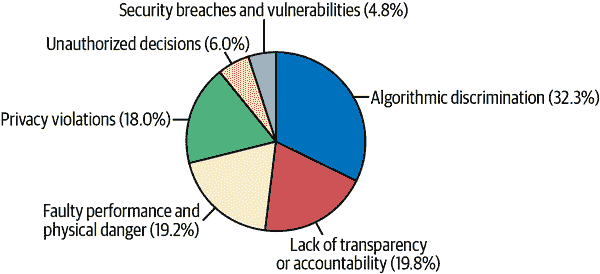

# 第四章：机器学习中的偏见管理

在机器学习系统中管理偏见的有害影响远不止于数据、代码和模型。我们数据科学家被教导用来评估模型优良性的主要方法——模型的平均性能质量——与其是否导致现实世界中的偏见有害几乎无关。即使是完全准确的模型也可能造成偏见危害。更糟糕的是，所有的机器学习系统都表现出一定程度的偏见，偏见事件似乎是最常见的 AI 事件之一（参见图 4-1）。业务流程中的偏见通常会带来法律责任，并且 ML 模型中的偏见会实实在在地伤害到人们。

###### 图 4-1\. 根据对 1988 年至 2021 年 2 月 1 日之间 169 起公开报道事件的定性分析，展示了不同类型 AI 事件的频率（图片由 BNH.AI 提供）。

本章将提出一些在社会技术方面检测和减轻偏见的方法，至少作为我们作为实践技术人员的最佳努力。这意味着我们将努力理解 ML 系统偏见在更广泛社会背景下的存在。为什么呢？*所有* 的 ML 系统都是社会技术系统。一开始我们可能很难相信这一点，所以让我们通过一个例子来深入思考。让我们考虑一个用于预测物联网应用中传感器故障的模型，该模型只使用其他自动化传感器的信息。该模型很可能是由人类训练的，或者是某个人决定需要这样一个模型。此外，该模型的结果可能被用来指导订购新传感器，这可能会影响制造工厂的就业或者那些负责修理或更换故障传感器的人员。最后，如果我们的预防性维护模型失败，那些与系统互动的人可能会受到伤害。对于我们能够想到的每一个看似纯技术的例子，决策技术如 ML 不能不与某种形式的人类互动。

这意味着在 ML 系统中解决偏见问题没有纯技术的解决方案。如果读者希望直接跳到偏见测试和偏见修正的代码中，请参阅第十章。但我们不建议这样做。读者会错过关于偏见是什么以及如何以积极方式思考它的重要信息。本章首先通过几个权威来源定义偏见，以及如何识别可能影响我们建立 ML 系统或我们用户解释结果的认知偏见。然后，本章将广泛概述谁倾向于在 AI 偏见事件中受到伤害以及他们经历的伤害类型。接下来，我们将介绍测试 ML 系统中偏见的方法，并讨论使用技术和社会技术方法减轻偏见。最后，本章将通过 Twitter 图像裁剪算法的案例讨论来结束。

###### 注意

有些偏差管理的方面必须根据模型的具体架构进行调整，但很多偏差管理并不是特定于模型的。本章中的许多理念，特别是从 NIST SP1270 偏差指南和 Twitter 偏差悬赏中得出的理念，可以应用于像 ChatGPT 或 RoBERTa 语言模型这样的各种复杂 AI 系统。如果读者想要看到实践情况，请查看 IQT Labs 的[RoBERTa 审计](https://oreil.ly/3hs_6)。

# ISO 和 NIST 对偏差的定义

国际标准化组织（ISO）在《“Statistics—Vocabulary and Symbols—Part 1”》中将偏差定义为“参考值偏离真实值的程度”。这是偏差的一个非常一般的概念，但偏差是一个复杂且异质的现象。然而，在所有情况下，它都是关于从真实值出现的某种系统偏离。在决策任务中，偏差表现出多种形式。基于人们皮肤中黑色素水平而拒绝人们就业是实质性和伦理上的错误。仅仅因为某个想法是第一个浮现的并不代表它是正确的是事实上的错误。而仅仅基于不完整和不具代表性的数据训练 ML 模型也是实质性和伦理上的错误。在最近的 NIST 工作中，《“Towards a Standard for Identifying and Managing Bias in Artificial Intelligence”（SP1270）》将偏差主题分为三大类别，与这些偏差示例相一致：系统性、统计性和人为偏差。

## 系统性偏差

在 ML 中，我们常说的偏差通常指的是系统性偏差。这些是历史性的、社会的和制度性的偏差，遗憾的是，它们已经深深融入我们的生活中，并且在 ML 训练数据和设计选择中默认出现。系统性偏差在 ML 模型中的常见后果是将人口统计信息纳入系统机制中。这种纳入可能是明显和明确的，例如当语言模型（LMs）被[重新用于生成针对特定人口群体的有害和冒犯性内容](https://oreil.ly/bWf4E)时。然而，在实践中，将人口统计信息纳入决策过程往往是无意和隐性的，导致跨人口群体之间出现不同的结果率或结果普遍性，例如将更多男性简历与更高薪职位描述匹配，或设计问题排斥某些用户群体（例如身体残疾者）与系统进行交互。

## 统计性偏差

统计偏见可以被视为人类在规范机器学习系统时所犯的错误，或者像概念漂移这样的影响机器学习模型的新兴现象，这些现象对人类来说很难消除。统计偏见的其他常见类型包括基于不具代表性的训练数据进行预测，或者误差传播和反馈循环。机器学习模型中统计偏见的一个潜在指标是在不同数据交叉部分（例如人口统计群体）中的性能质量差异。机器学习模型的差异有效性是一种特定类型的偏见，与人类偏见描述的不同结果率或结果普遍性略有不同。实际上，维护人口统计群体内模型性能的最大化与维护正面结果率的平等之间存在[文件化的紧张关系](https://oreil.ly/cJy7F)。统计偏见还可能导致严重的人工智能事件，例如当新数据中的概念漂移使系统的决策比正确决策更多，或者当反馈循环或误差传播导致短时间内大量错误预测的产生时。

## 人类偏见与数据科学文化

在设计、实施和维护机器学习系统的个人和团队中，可能会出现多种人类或认知偏见。有关更完整的人类偏见列表，请阅读 NIST SP1270 指导文件。以下是我们经常看到的最频繁影响数据科学家和机器学习系统用户的人类偏见：

锚定

当一个特定的参考点或*锚点*对人们的决策产生不当影响时。就像当一个最先进的深度学习模型的基准值长期停留在 0.4 AUC，然后有人得到了 0.403 AUC。我们不应该认为这很重要，但我们却被固守在 0.4 上。

可用性启发法

在决策过程中，人们往往会过分重视易于或迅速浮现在脑海中的事物。换句话说，我们经常将*易记住*与*正确*混淆。

确认偏见

人们倾向于偏爱与自己现有信念一致或确认的信息。当我们自欺欺人地认为我们的机器学习模型比实际效果更好时，确认偏见在机器学习系统中就成了一个大问题。

邓宁-克鲁格效应

在某一领域或任务中能力较低的人倾向于高估他们的自我评估能力。当我们允许自己认为我们是某件事的专家，只因为我们能`import sklearn`并运行`model.fit()`时，这种情况就会发生。

资金偏见

偏向于突出或促进支持或满足项目资助机构或财务支持者结果的偏见。我们做让老板开心的事情，让投资者开心的事情，以及增加我们自己薪水的事情。真正的科学需要防止其进展被有偏见的财务利益改变的保障措施。

群体思维

当一个群体中的人们倾向于根据他们希望符合群体或害怕与群体唱反调的愿望而做出非最优决策时。即使我们有信心自己是对的，也很难不同意我们的团队。

麦克纳马拉谬误

认为决策应该仅基于定量信息，而忽视难以衡量的定性信息或数据点的信念。

技术至上主义

认为技术总是解决方案的信念。

所有这些偏见都可能导致不恰当和过于乐观的设计选择，进而导致系统部署时的性能不佳，最终给系统用户或操作者带来伤害。我们将进一步探讨可能出现的伤害及如何解决这些问题。目前，我们想强调一个常识性的缓解措施，这也是本章的主题之一。我们不能不从多个不同的视角来看待问题就妥善处理偏见。在机器学习中，抵抗偏见的第一步是在做出系统重要决策时，确保有一个多元化的利益相关者团队在场（或视频会议中）。为了避免那些使偏见的机器学习模型造成伤害的盲点，我们需要多种不同类型的视角来指导系统的设计、实施和维护决策。是的，我们在讨论从不同的人口统计学视角收集意见，包括那些有残疾的人。我们也在谈论教育背景，比如社会科学家、律师和领域专家。

此外，考虑*数字鸿沟*。令人震惊的是，仍然有相当大比例的人口无法接入良好的互联网连接、新计算机和像本书这样的信息。如果我们对用户作出结论，我们需要记住有一大部分人口无法包含在用户统计中。忽略潜在用户是系统设计、偏见测试和机器学习生命周期中其他关键时刻的重大偏见和伤害源。如今，机器学习的成功仍然需要那些深刻理解我们试图解决的现实世界问题，并且了解我们的设计、数据和测试可能会排除哪些潜在用户的人参与。

# 美国的机器学习偏见法律概念

我们应该注意许多重要的法律偏见概念。然而，理解法律体系是极其复杂和依赖背景的也很重要。仅仅知道一些定义还远远不足以使我们在这些问题上具备真正的专业知识。作为数据科学家，法律事务是我们不应该让邓宁-克鲁格效应占据上风的领域。有了这些警示，让我们来简单概述一下。

###### 警告

如果您对 ML 模型中的偏见有任何疑问或担忧，请立即联系您的法律团队。处理 ML 模型中的偏见是信息经济中最困难和严重的问题之一。数据科学家需要律师的帮助来妥善解决偏见风险。

在美国，影响公众的决策过程中的偏见问题已被监管数十年。美国早期法律和法规的一个主要焦点是就业事务。像受保护组、不公平待遇和不公平影响这样的概念现在已扩展到更广泛的消费金融和住房法律，并且甚至被引用到像纽约市雇用中使用的 AI 审计要求等全新的地方法律中。欧盟中的非歧视问题在《基本权利宪章》、《欧洲人权公约》以及《欧盟职能条约》中得到了解决，对我们来说尤为重要的是在拟议的欧盟 AI 法中的某些方面。虽然要总结这些法律和法规是不可能的，甚至在美国这边，以下定义我们认为最直接适用于数据科学家日常工作。它们很粗略地取自《民权法案》、《公平住房法案》（FHA）、《平等就业机会委员会》（EEOC）法规、《平等信贷机会法案》（ECOA）以及《美国残疾人法案》（ADA）。以下定义涵盖了法律上受保护的特征以及这些法律试图保护我们免受的法律观念：

受保护组

在美国，许多法律和法规禁止基于种族、性别（或性别，在某些情况下）、年龄、宗教信仰、国籍和残疾状况等类别进行歧视。在住房公平法（FHA）下被禁止的决策依据包括种族、肤色、宗教、国籍、性别、家庭状况和残疾。作为非美国法规的一个例子，欧盟的 GDPR 禁止使用关于种族或民族、政治观点等类别的个人数据。这也是为什么传统的偏见测试比较受保护组和所谓的*控制*（或*参考*）组的结果之一。

不公平待遇

不公平待遇是许多行业中非法的特定类型歧视。这是一种因为种族、性别或其他特征等受保护特征而对一个人采取不利待遇的决策。对于从事就业、住房或信用申请的数据科学家来说，这意味着在使用人口统计数据进行机器学习模型时我们应该非常小心，甚至在我们的偏见修复技术中也是如此。一旦人口统计数据被用作模型的输入，这可能意味着某人的决策可能因其人口统计特征而有所不同，而这种不公平待遇在某些情况下可能会产生结果。

###### 警告

对于不同待遇的担忧，以及更一般的系统性偏见，通常是为什么我们尽量避免直接将人口统计标记作为机器学习模型的输入。为了谨慎起见，在大多数常见情景下，人口统计标记*不应*作为模型输入，但应用于偏差测试或监测目的。

不同的影响

不同的影响是另一种法律上引起关注的歧视形式。它基本上是指跨人群之间不同的*结果*率或者存在率。不同的影响更正式地定义为一种看似中立的政策或做法的结果，它会不成比例地损害到受保护的群体。对于数据科学家来说，不同的影响往往会发生在我们不使用人口统计数据作为输入，而使用某些与人口统计数据相关的内容作为输入的情况。以信用评分为例：它们相当准确地预测违约，因此在消费信贷预测模型中经常被视为有效使用。然而，它们与种族存在相关性，使得某些少数群体的平均信用评分较低。如果我们在模型中使用信用评分，这往往会导致某些少数群体的正面结果比例较低，这是不同的影响的常见例子。（这也是为什么几个州已经开始限制在某些与保险相关的决策中使用信用评分的原因。）

差异效度

差异效度有时在就业领域中会出现。而不同的影响通常是指跨人群之间的不同结果率，差异效度则更多地涉及跨群体之间的*表现质量*不同。这种情况发生在某些群体的就业测试更能有效预测工作表现，而对其他群体则效果不佳。差异效度之所以重要，是因为其数学基础，而非法律构建，几乎适用于所有机器学习模型。常见情况是使用不具代表性的训练数据，并构建出对某些群体效果更好的模型，而许多较新的偏差测试方法专注于这种类型的偏差。

屏蔽

筛除是一种非常重要的歧视类型，突显了 ML 系统的社会技术性质，并证明了仅通过测试和平衡模型分数是不足以保护免受偏见的。当残疾人士，如视力有限或细微运动技能困难者，无法与就业评估交互，并因此被默认筛除出工作或晋升时，就发生了筛除。筛除是一个严重的问题，EEOC 和劳工部正在关注 ML 在这一领域的应用。需要注意的是，筛除通常不能通过数学偏见测试或偏见修复来修复；它通常必须在系统设计阶段解决，在这个阶段，设计师确保残疾人士能够使用最终产品的界面。筛除也突显了为何在构建 ML 系统时需要律师和残疾人士的视角。如果没有这些视角，我们很容易在构建 ML 系统时忽视残疾人士，这有时可能会导致法律责任的产生。

这结束了我们对偏见一般定义的讨论。读者可以看到，这是一个复杂且多方面的主题，涉及各种人文、科学和法律问题。在本章后面讨论偏见测试时，我们将通过更具体但可能更复杂的数学定义来补充这些定义。接下来，我们将概述谁更容易在 ML 系统中经历偏见和相关伤害。

# ML 系统中谁更容易经历偏见

任何人群在与 ML 系统互动时可能会遇到偏见和相关伤害，但历史告诉我们，某些群体更容易更频繁地遭受偏见和伤害。事实上，这是受监督学习的本质所致——它只从过去记录的数据中学习和重复模式——导致年长者、残障人士、移民、有色人种、女性和性别非符合个体更容易面对 ML 系统的偏见。换句话说，那些在现实世界或数字世界中经历歧视的人，在与 ML 系统打交道时也很可能会经历它，因为所有这些歧视都已记录在数据中，并用于训练 ML 模型。本节列出的这些群体通常受到各种法律的保护，但并非总是如此。他们通常会成为偏见测试的比较群体，以评估两个人口统计学群体之间得分或结果的统计平等性。

许多人属于多个受保护或边缘化群体。交集性的重要概念告诉我们，社会伤害集中在那些属于多个受保护群体的人身上，偏见[不应仅分析作用于边缘化群体单一维度](https://oreil.ly/3ZaPy)。例如，AI 伦理研究人员[最近表明](https://oreil.ly/DMu8o)，一些商业可用的面部识别系统在性别分类准确性上存在显著差异，较深肤色的女性是最容易被误分类的群体。最后，在定义这些群体之前，还重要考虑麦克纳马拉谬误。把这种复杂的人类归类为这种钝化的分类法是正确的吗？可能不是，而且很可能这种简化的群体分配方式，通常是因为这些类别在数据库中作为二进制标记列很容易表示，也是偏见和潜在伤害的源头。在管理机器学习系统中的偏见时，总是有很多注意事项，因此在这些方面谨慎行事，我们走入定义更容易受到歧视的简化人口群体的领域：

年龄

通常，40 岁及以上的老年人在在线内容中更容易遭受歧视。在更传统的应用场景如就业、住房或消费金融中，年龄的分界线可能更高。然而，参加医疗保险或一生积累财富可能使老年人成为其他场景中受青睐的群体。

残疾

那些身体、心理或情感残疾的人可能是最有可能受到机器学习系统偏见影响的人群之一。虽然法律框架可能不适用，但排除的概念普遍适用于就业以外的情况。在设计机器学习系统时，经常忽视残疾人群，无论进行多少数学偏见测试或补救，都无法弥补这一点。

移民身份或国籍

居住在非本国出生地的国家，并具有任何移民身份的人，包括入籍公民，在面对重大偏见挑战时众所周知。

语言

尤其是在在线内容中，这是机器学习系统的一个重要领域，使用非英语语言或以非拉丁文字书写的人可能更容易遭受偏见影响。

种族和民族

除白人以外的种族和民族，包括那些认同为多种族的人，通常在与机器学习系统互动时会遭受偏见和伤害。一些人在计算机视觉任务中更喜欢肤色标度而不是传统的种族或民族标签。[菲茨帕特里克标度](https://oreil.ly/NJfBP)就是一个肤色标度的例子。

性别与性别

非男性异性恋男性更有可能在 ML 系统的作用下经历偏见和伤害。在在线内容中，女性通常会被偏爱，但是以有害的方式。作为*男性凝视*现象，关于女性的媒体可能因其取向于对女性的客体化、压制或性别化而吸引人并受到积极的对待（例如在社交媒体中推广）。

交叉群体

属于前述两个更广泛群体的两个或更多群体的人可能经历的偏见或伤害可能比他们所属的两个更广泛群体的简单总和更大。本章描述的所有偏见测试和缓解步骤都应考虑交叉群体。

当然，这些并不是唯一可能从 ML 模型中经历偏见的人群，而无论动机如何，对人群进行分组都可能存在问题。然而，了解从哪里开始寻找偏见很重要，我们希望我们的列表足以达到这一目的。现在我们知道在哪里寻找 ML 偏见，让我们讨论我们应该注意的最常见的伤害。

# 人们经历的伤害

在线或数字内容中存在许多常见的伤害类型。这些伤害经常发生，或许频繁到我们可能对它们视而不见。以下列表突出了常见的伤害，并提供了例子，以便我们下次看到它们时能更好地识别。这些伤害与阿巴盖尔·李·布兰克在《计算机视觉机器学习与未来导向伦理》中提出的情况密切相关，该书描述了计算机视觉中这些伤害发生的案例：

贬低

包含积极侮辱或冒犯性内容——例如，聊天机器人如[Tay](https://oreil.ly/2938n)或[Lee Luda](https://oreil.ly/nRzs1)生成的冒犯性内容。

抹消

抹去挑战主流社会范式或被边缘化群体遭受的过去伤害的内容——例如，[压制讨论种族主义或指责白人至上主义的内容](https://oreil.ly/FZdDB)。

Exnomination

将白人、男性或异性恋等概念视为中心人类规范——例如，[在线搜索](https://oreil.ly/m-zR-)将芭比娃娃作为“CEO”的第一个女性结果返回。

误识别

错误地认定一个人的身份或未能认识到某人的人性——例如，[误识别黑人](https://oreil.ly/GjyTI)在自动图像标记中。

刻板印象

倾向于将所有群体成员赋予特征——例如，LM 自动将[Muslims 与暴力](https://oreil.ly/eqAgw)联系起来。

Underrepresentation

在模型输出中缺乏公平或充分的对人群群体的代表性——例如，生成模型认为[所有医生都是白人男性，所有护士都是白人女性](https://oreil.ly/V64lj)。

有时这些伤害可能仅在在线或数字空间中产生影响，但随着我们的数字生活越来越多地与生活的其他部分重叠，伤害也会溢出到现实世界。在医疗保健、就业、教育或其他高风险领域中，机器学习系统可能通过错误地拒绝人们获取所需资源而直接造成伤害。由机器学习系统造成的最明显的现实世界伤害类型包括以下几种：

经济伤害

当机器学习系统降低某些活动的经济机会或价值时——例如，男性看到更多比女性更好的工作广告时[（链接）](https://oreil.ly/BT-cI)。

身体伤害

当机器学习系统伤害或导致某人死亡时——例如，人们过度依赖[自动驾驶技术](https://oreil.ly/BxH5Y)时。

心理伤害

当机器学习系统引发心理或情感困扰时——例如，当推荐[令人不安的内容](https://oreil.ly/pQRYE)给儿童时。

声誉伤害

当机器学习系统损害个人或组织的声誉时——例如，消费信用产品的推出因[歧视指控](https://oreil.ly/Wbvq5)而受损。

不幸的是，机器学习系统的用户或主体可能会以奇怪的方式遭受额外的伤害或伤害的组合。在我们深入讨论下一节中各种偏见测试之前，请记住，与用户确认他们是否遭受到这里讨论的伤害或其他类型的伤害，可能是追踪机器学习系统偏见最直接的方法之一。实际上，从最基本的角度来看，重要的是人们是否经历伤害，而不是某些分数是否通过了一个必然存在缺陷的数学测试。在设计我们的系统时，我们必须考虑这些伤害，与我们的用户沟通以确保他们不会遭受伤害，并努力减少伤害。

# 检测偏见

如果有可能，ML 系统可能会对人们造成伤害，应该对其进行偏见测试。本节的目标是介绍测试 ML 模型偏见的最常见方法，以便读者可以开始这一重要的风险管理任务。测试既不简单也不确定。就像在性能测试中一样，系统在测试数据上看起来可能很好，但在部署后可能会失败或造成伤害。或者系统在测试和部署时可能表现出最小的偏见，但随着时间的推移可能会演变成做出有偏见或有害预测。此外，已知存在许多测试和效果大小测量存在缺陷并相互冲突。要了解这些问题的概述，请参阅普林斯顿大学教授阿尔温德·纳拉亚南在 ML 公平性、问责性和透明度会议上的演讲视频[“21 个公平定义及其政治”](https://oreil.ly/4QnqM)。要深入了解为什么我们不能简单地同时最小化所有偏见度量的数学分析，请参阅[“在公平确定风险评分中的固有权衡”](https://oreil.ly/WvBOg)。牢记这些警告，让我们开始探索当代偏见测试方法。

## 测试数据

本节涵盖了测试偏见所需的训练数据以及如何在模型训练之前对该数据进行偏见测试。ML 模型从数据中学习。但没有一种数据是完美的或没有偏见的。如果训练数据中存在系统性偏见，该偏见可能会表现在模型的输出中。从训练数据开始测试偏见是合乎逻辑的。但要做到这一点，我们必须假设某些数据列是可用的。至少，对于每一行数据，我们需要人口统计标记、已知结果（`y`，依赖变量，目标特征等），稍后，我们将需要模型结果——回归模型的预测以及分类模型的决策和置信分数或后验概率。虽然有少数不需要人口统计标记的测试方法，但大多数被接受的方法都需要这些数据。没有这些数据？测试将会更加困难，但我们将提供一些关于推断人口统计标记标签的指导。

###### 注意

我们的模型和数据远非完美，所以在偏见测试中，不要让完美成为良好结果的敌人。我们的数据永远不会完美，我们也永远找不到完美的测试。测试非常重要，但要在现实世界中成功进行偏见缓解，它只是更广泛的 ML 管理和治理流程的一部分。

需要了解或推断人口统计学标记的需求是解决机器学习中偏见问题的一个很好的例子，这需要全面的设计思维，而不仅仅是在我们的管道末端添加另一个 Python 包。人口统计标记和个体级数据在隐私角度上也更为敏感，有时组织出于数据隐私原因不收集这些信息。虽然数据隐私与非歧视法律的相互作用非常复杂，但很可能并非数据隐私义务能够取代非歧视义务。但作为数据科学家，我们不能单独回答这类问题。任何数据隐私与非歧视要求之间的潜在冲突必须由律师和合规专家处理。这类复杂的法律考量是解决机器学习中偏见问题时必须引入广泛利益相关者的一个例子。

###### 警告

在就业、消费者金融或其他禁止差异对待的领域，我们需要在直接基于受保护类成员信息改变我们的数据之前与法律同事核实，即使我们的意图是为了减少偏见。

现在，读者们可能开始意识到进行偏见测试有多么具有挑战性和复杂性。作为技术人员，处理这种复杂性不是我们唯一的责任，但我们需要意识到它并在更广泛的团队中共同努力解决机器学习系统中的偏见问题。现在，让我们进入负责准备数据并测试偏见的技术人员角色。如果我们有所需的数据，我们倾向于寻找三个主要问题——代表性、结果分布和代理：

代表性

这里的基本检查是计算训练数据中每个人口统计群体的行比例，理念是一个模型将难以学习只有少量训练数据行的群体。一般来说，训练数据中不同人口统计群体的比例应反映模型将被部署的人口。如果不是这样，我们可能需要收集更具代表性的数据。也可以对数据集进行重抽样或重新加权以实现更好的代表性。然而，如果我们在就业、消费者金融或其他禁止差异对待的领域工作，我们确实需要在直接基于受保护类成员信息改变我们的数据之前与法律同事核实。如果我们遇到差异有效性问题（本章后面描述），那么重新平衡我们的训练数据以在群体之间具有更大或相等的代表性可能是有必要的。在不同类别之间实现平衡可能会提高跨群体的预测质量，但可能不会有助于或甚至会恶化正面结果的不平衡分布。

结果分布

我们需要了解结果（`y`变量值）如何在不同人群之间分布，因为如果模型学习到某些群体比其他群体获得更多积极结果，这可能导致不均衡影响。我们需要计算`y`在每个人群中的双变量分布。如果我们发现不同人群之间的结果不平衡，那么我们可以尝试重新抽样或重新加权我们的训练数据，但有一些法律上的注意事项。更可能的情况是，我们将简单地意识到这个模型存在严重的偏差风险，当我们测试其结果时，我们需要特别注意，并可能计划某种补救措施。

代理

在大多数商业应用的机器学习中，我们不应该根据人口统计标记来训练模型。但即使我们不直接使用人口统计标记，像姓名、地址、教育细节或面部图像这样的信息可能编码了大量的人口统计信息。其他类型的信息也可能作为人口统计标记的代理。发现代理的一种方法是基于每个输入列构建对抗模型，看这些模型是否能预测任何人口统计标记。如果它们能够预测人口统计标记，那么这些列编码了人口统计信息，并且很可能是人口统计的代理。如果可能的话，应该从训练数据中移除这些代理。代理在训练数据中可能也更隐蔽。没有标准技术来测试这些潜在的代理，但我们可以应用与直接代理相同的对抗建模技术，不过不使用特征本身，而是使用我们怀疑可能充当代理的特征之间的工程化交互。我们还建议，拥有专门的法律或合规利益相关者，审查我们模型中的每一个输入特征，以便关注代理歧视风险。如果无法移除代理，或者我们怀疑存在潜在的代理，我们应该特别注意系统结果的偏差测试结果，并准备在偏差缓解过程中采取补救措施。

描述的测试和代表性、结果分布以及训练数据中的代理检查，所有这些都依赖于人口统计标签的存在，就像大多数模型结果测试一样。如果我们没有这些人口统计标签，那么一个被接受的方法是推断它们。[贝叶斯改进的姓氏地理编码（BISG）](https://oreil.ly/cJn-M)方法从姓名和邮政编码数据中推断种族和族裔。令人悲哀但事实如此，美国社会仍然如此分离，以至于邮政编码和姓名往往能够准确预测种族和族裔，准确率通常超过 90%。这种方法是由兰德公司和消费者金融保护局（CFPB）开发的，并且在消费金融领域的偏见测试中具有很高的可信度。CFPB 甚至在其[GitHub](https://oreil.ly/hkvMD)上提供了 BISG 的代码！如有必要，类似的方法也可以用于从姓名、社会安全号码或出生年推断[性别](https://oreil.ly/eLTqM)。

## 传统方法：测试等效结果

一旦我们评估了数据的偏见，确保我们有执行偏见测试所需的信息，并训练了一个模型，那么现在就是测试其结果是否存在偏见的时候了。我们将从讨论偏见测试的角度开始，首先解决一些已建立的测试。这些测试通常在法律、法规或法律评论中具有先例，并且它们倾向于关注不同人群之间结果的平均差异。关于传统偏见测试指导的很好概述，请参阅[简明指南](https://oreil.ly/_bcVD)，由联邦承包合规办公室提供，用于测试就业选择程序的公平性。对于这类测试，无论是分析多项选择就业测试的分数还是来自先进人工智能推荐系统的数值分数，都无关紧要。

###### 注意

本节中的测试与 *统计平等* 的概念对齐，即模型为所有人群生成大致相等的概率或有利的预测。

表 4-1 强调这些测试通常被分为统计和实用测试的类别，并且适用于连续和二元结果。这些测试在很大程度上依赖于保护组的概念，其中受保护组的平均结果（例如女性或黑人）与某个控制组（例如男性或白人）的平均结果进行简单直接的配对比较。这意味着我们至少需要为数据中的每个保护组进行一个测试。如果这听起来有些老派，确实是这样。但由于这些测试在法规和诉讼设置中使用最多几十年，因此在开始尝试新的方法之前，最好从这些测试开始。更为成熟的测试还倾向于具有已知的阈值，指示何时的值存在问题。这些阈值列在表 4-1 中，并在接下来的章节中进行了更详细的讨论。

表 4-1. 一些用于衡量机器学习模型偏差的常见指标，适用的阈值如有^(a)所示

| 测试类型 | 离散结果/分类测试 | 连续结果/回归测试 |
| --- | --- | --- |
| 统计显著性 | 逻辑回归系数 | 线性回归系数 |
| 统计显著性 | χ² 检验 | *t*-检验 |
| 统计显著性 | Fisher’s 精确检验 |  |
| 统计显著性 | 二项 *z* |  |
| 实际显著性 | 组间均值比较 | 组间均值比较 |
| 实际显著性 | 组间均值差异的百分点/marginal effect | 组间均值差异的百分点 |
| 实际显著性 | Adverse impact ratio (AIR)（可接受范围：`0.8`–`1.25`） | Standardized mean difference (SMD, Cohen’s *d*)（小差异：`0.2`，中等差异：`0.5`，大差异：`0.8`） |
| 实际显著性 | 概率比 |  |
| 实际显著性 | 落后到平等 |  |
| 差异效度 | 准确度或 AUC 比率（可接受范围：`0.8`–`1.25`） | R² 比率（可接受范围：`0.8`–`1.25`） |
| 差异效度 | TPR、TNR、FPR、FNR 比率（可接受范围：`0.8`–`1.25`） | MSE、RMSE 比率（可接受范围：`0.8`–`1.25`） |
| 差异效度 | 赔率平等（[控制 TPR ≈ 保护 TPR ∣ `y = 1`] 和 [控制 FPR ≈ 保护 FPR ∣ `y = 0`]） |  |
| 差异效度 | 机会平等（[控制 TPR ≈ 保护 TPR ∣ `y = 1`]） |  |
| ^(a) TPR = 真正例率；TNR = 真负例率；FPR = 假正例率；FNR = 假负例率 |

### 统计显著性测试

统计显著性测试可能是跨学科和法律管辖区最广泛接受的，因此让我们首先关注它。统计显著性测试用于确定在新数据中是否可能看到跨受保护群体的模型结果的平均或比例差异，或者结果差异是否是当前测试数据集的随机属性。对于连续结果，我们经常依赖于两个人口统计学组之间平均模型输出的 *t* 检验。对于二元结果，我们经常使用二项 *z* 检验来检验两个不同人口统计学组的正面结果比例，卡方检验来检验模型输出的列联表，以及当列联表中的单元格中的个体少于 30 个时，使用 Fisher 精确检验。

如果你认为这是一大堆成对测试，忽略了重要信息，干得好！我们可以使用传统的线性或逻辑回归模型，拟合我们机器学习模型的分数、已知结果或预测结果，以了解某些人口统计标记变量在其他重要因素存在的情况下是否具有统计显著的系数。当然，评估统计显著性也是困难的。因为这些测试几十年前就被规定了，大多数法律评论都指出，在 5%的水平上的显著性是证明模型结果中存在不可接受的偏倚的证据。但在当代数据集中，行数达到数十万、数百万或更多时，任何小的结果差异都将在 5%的水平上显著。我们建议在 5%显著性水平上分析传统的统计偏倚测试结果，并根据我们数据集大小适当调整显著性水平。我们会把大部分精力放在调整后的结果上，但要记住，在最坏的情况下，我们的组织可能会面临法律审查和外部专家的偏倚测试，这些测试将把我们约束在 5%的显著性阈值上。这将是与我们法律部门同事交流的又一个好时机。

### 实际意义测试

美国最为人熟知且最常被滥用的偏倚测试工具是不利影响比率（AIR）及其相关的四分之五法则阈值。让我们首先了解它是什么，然后再看它是如何被从业者滥用的。AIR 是用于二元结果的测试，是某些结果的比例，通常是积极结果，比如得到工作或贷款的比例，针对某些受保护的群体，除以关联控制组的该结果比例。这个比例与四分之五或 0.8 的阈值相关联。这个四分之五法则在 1970 年代末由 EEOC（美国就业机会平等委员会）提出，作为一条实用的分界线，四分之五以上的结果非常受欢迎。在就业事务中，AIR 和四分之五法则仍被一些联邦法院认为是非常重要的数据，而其他联邦法院则认为这种测量过于缺陷或简化，不重要。在大多数情况下，AIR 和四分之五法则在就业之外没有正式的法律地位，但在消费金融等受管制行业仍偶尔用作内部偏倚测试工具。此外，AIR 可能会出现在专家在诉讼中的证词中，涉及任何与偏倚相关的事项。

AIR 是一种简单而流行的偏见测试。那么，我们对 AIR 的误解有哪些呢？很多。技术人员往往会错误地解释它。AIR 超过 0.8 不一定是好迹象。如果我们的 AIR 测试结果低于 0.8，那可能是个坏迹象。但如果超过五分之四，这并不意味着一切都没问题。另一个问题是混淆 AIR 指标和 0.8 阈值与法律概念的差异冲击。我们无法解释为什么，但有些供应商字面上称 AIR 为“差异冲击”。它们并不相同。数据科学家不能确定某些结果的差异是否真正属于差异冲击。差异冲击是由律师、法官或陪审团做出的复杂法律决定。对四分之五规则的关注也使处理偏见的社会技术性质变得模糊。在某些就业案件中，四分之五只有在法律上有意义。像任何数值结果一样，单靠 AIR 测试结果是不足以在复杂的机器学习系统中识别偏见的。

尽管如此，查看 AIR 结果和其他实际意义结果仍然可能是个好主意。另一个常见的度量标准是标准化平均差异（SMD，或科恩的*d*）。SMD 可以用于回归或分类输出——因此比 AIR 更加模型无关。SMD 是某个受保护群体的平均结果或得分减去控制组的平均结果或得分，再除以结果的标准差的一种度量。在权威社会科学文献中，SMD 的大小为 0.2、0.5 和 0.8 与群体结果的小、中和大差异相关。其他常见的实际意义度量包括百分点差异（PPD），或者两个群体的平均结果之间的差异，以百分比表示，以及缺额，使受保护群体和控制群体的结果等同所需的人数或货币金额。

在传统的结果测试中，最坏的情况是，统计和实际测试结果显示在一个或多个受保护和对照组之间的结果有意义的差异。例如，当比较黑人和白人的就业推荐时，看到显著的二项式-*z*检验和低于 0.8 的 AIR 将是非常不好的，如果这种情况出现在多个受保护和对照组上则更糟。在传统偏差测试中，最理想的情况是我们在统计上看不到显著性差异或大的实际显著性测试差异。但即使在这种情况下，我们仍然无法保证系统在部署后不会存在偏差，或者在这些测试无法检测到的方式（如通过屏幕排除）中没有偏差。当然，在传统测试中最可能的情况是我们会看到一些混合的结果，并且需要帮助来解释这些结果，并从我们直接数据科学团队之外的利益相关者那里修复检测到的问题。即使在进行了所有这些工作和沟通之后，传统偏差测试也只能算是彻底偏差测试的第一步。接下来我们将讨论一些关于偏差测试的新想法。

## 一种新的思维方式：测试等效性能质量

在最近的几年里，许多研究人员提出了侧重于不同人群之间的差异性能质量的测试方法。尽管这些测试在实际和统计显著性方面的法律先例较少，但它们与差异有效性的概念有些相关。这些新技术旨在了解常见的机器学习预测错误如何影响少数族裔群体，并确保与机器学习系统交互的人类在获得积极结果时具有平等的机会。

重要的论文[《超越不同对待和不同影响的公平性：在没有不同对待的情况下学习分类》](https://oreil.ly/NkTBF)阐述了在公平性背景下思考机器学习模型误差的重要性。如果少数族裔群体比其他群体接受更多的误报或误拒决策，那么根据应用的不同可能会带来多种伤害。在他们的开创性[《机器学习中的机会平等》](https://oreil.ly/_w-c3)中，Hardt、Price 和 Srebro 定义了一个修改了广为认可的平等机会思想的公平性概念。在旧的平等机会场景中，当已知结果发生时（即`y = 1`），两个感兴趣的人群大致具有相等的真正阳性率。当未发生已知结果时（即`y = 0`），平等机会意味着两个人群的假阳性率大致相等。机会平等放宽了平等机会对`y = 0`的约束，并认为在`y = 1`等于正面结果时（例如获得贷款或找到工作），寻求平等的真正阳性率是一种更简单和更实用的方法。

如果读者花费了时间研究混淆矩阵，他们将知道有许多其他方法来分析二元分类器的错误。我们可以考虑不同的真正例率、真负例率、假正例率、假负例率以及许多其他跨人群的分类性能测量。我们还可以将这些测量提升到更正式的构建中，如平等机会或平等几率。表 4-2 提供了一个示例，说明了跨人群的性能质量和错误度量如何在测试偏见方面有所帮助。

表 4-2\. 在两个人群之间计算的分类质量和错误率^(a)

| 指标类型 | …​ | 准确度 | 灵敏度（TPR） | …​ | 特异性（TNR） | …​ | FPR | FNR | …​ |
| --- | --- | --- | --- | --- | --- | --- | --- | --- | --- |
| 女性数值 | …​ | 0.808 | 0.528 | …​ | 0.881 | …​ | 0.119 | 0.472 | …​ |
| 男性数值 | …​ | 0.781 | 0.520 | …​ | 0.868 | …​ | 0.132 | 0.480 | …​ |
| 女性对男性比率 | …​ | 1.035 | 1.016 | …​ | 1.016 | …​ | 1.069 | 0.983 | …​ |
| ^(a) 比较组（女性）的值除以对照组（男性）的值。 |

第一步，如 表 4-2 所示，是计算两个或更多感兴趣人群组之间的一组性能和误差测量。然后，使用 AIR 和四分之五规则作为指导，我们形成比较组值与对照组值的比率，并应用四分之五（0.8）和五分之四（1.25）的阈值来突出任何潜在的偏见问题。重要的是指出，这里的 0.8 和 1.25 阈值仅是指导性的，它们没有法律意义，更多的是常识性的标志。理想情况下，这些值应接近 1，显示模型下两个人群大致具有相同的性能质量或误差率。我们可以根据自己的情况标记这些阈值，但我们会认为 0.8 至 1.25 是可接受值的最大范围。

根据我们的应用程序，某些指标可能比其他指标更重要。例如，在医学测试应用中，假阴性可能非常有害。如果某个人群在医学诊断中经历的假阴性比其他人群多，很容易看出这会导致偏见的危害。在 [“处理 AI/ML/数据科学系统中的偏见和公平性”](https://oreil.ly/Es2d1) 的第 40 页有一个公平度量决策树，可以帮助决定哪些公平度量可能最适合我们的应用。

您是否在想：“回归模型呢？机器学习二元分类以外的一切呢？”确实，偏见测试在二元分类器上最为发达，这可能令人沮丧。但是我们可以将*t*-tests 和 SMD 应用于回归模型，也可以应用本节关于性能质量和误差率的思想。就像我们形成分类指标的比率一样，我们也可以形成 R²、平均百分比误差（MAPE）或归一化均方根误差（RMSE）在比较和控制组之间的比率，并再次使用四分之五法则作为指南，以突显这些比率可能告诉我们在预测中存在偏见问题的情况。至于机器学习的其余部分，超出了二元分类和回归，那就是我们接下来要讨论的。准备好运用一些创造力和努力。

## 看未来：更广泛的机器学习生态系统测试

许多研究和法律评论都假设使用二元分类器。这有其原因。无论机器学习系统多么复杂，最终往往都可以归结为做出或支持某种最终的是或非二元决策。如果该决策影响到人们并且我们有数据可以进行测试，我们应该使用我们已经讨论过的完整工具套件来测试这些结果。在某些情况下，机器学习系统的输出并不会影响最终的二元决策，或者也许我们想要深入挖掘并了解系统中偏见的驱动因素或者哪些亚群体可能遭受了最多的偏见。或者我们可能正在使用生成模型，例如语言模型或图像生成系统。在这些情况下，AIR、*t*-tests 和真阳性率比例是不够的。本节探讨了我们可以采取的方法来测试机器学习生态系统的其余部分，以及深入挖掘我们数据中偏见驱动因素的方法。我们将首先介绍一些通用策略，适用于大多数类型的机器学习系统，然后简要概述针对个体或小团体、语言模型、多项式分类器、推荐系统和无监督模型的偏见技术：

通用策略

检测偏见的最常见方法之一是对抗建模。鉴于我们系统的数值结果，无论是排名、聚类标签、提取的特征、词项嵌入还是其他类型的分数，我们可以将这些分数作为输入传递给另一个机器学习模型，该模型预测人口统计学类别标记。如果对抗模型能够从我们模型的预测中预测出人口统计学标记，那就意味着我们模型的预测正在编码人口统计信息。这通常是一个不好的迹象。另一个一般的技术方法是应用可解释的人工智能技术来揭示我们模型预测的主要驱动因素。如果这些特征、像素、术语或其他输入数据看起来可能存在偏见，或者与人口统计信息相关，那就是另一个不好的迹象。现在甚至有[特定方法](https://oreil.ly/CcS_9)来理解哪些特征在模型结果中驱动偏见。利用可解释人工智能来检测偏见的驱动因素令人振奋，因为它可以直接告诉我们如何解决偏见问题。简而言之，驱动偏见的特征很可能应该从系统中移除。

在一个全面的测试计划中，并非所有检测偏见的策略都应该是技术性的。使用像[AI 事故数据库](https://oreil.ly/Jc2vm)这样的资源来了解过去发生的偏见事件，并设计测试或用户反馈机制，以确定我们是否重复了过去的错误。如果我们的团队或组织没有与用户沟通他们正在经历的偏见，那就是一个重大的盲点。我们必须*与我们的用户交流*。我们应该在系统或产品生命周期中设计用户反馈机制，以便了解我们的用户正在经历什么，追踪任何伤害，并在可能的情况下减轻伤害。还要考虑激励用户提供关于偏见伤害的反馈。[Twitter 算法偏见事件](https://oreil.ly/RnPHy)是结构化和激励众包偏见相关信息的一个了不起的例子。本章末讨论案例将突出这一独特事件的过程和经验。

语言模型

生成模型存在许多偏见问题。尽管缺乏成熟的语言模型偏见测试方法，但这是一个积极的研究领域，大多数重要论文都在某种程度上关注了这个问题。[“语言模型是少样本学习者”](https://oreil.ly/ZvBRL)的第 6.2 节是思考偏见伤害并进行一些基本测试的较好示例之一。广义上说，对语言模型偏见的测试包括对抗性提示工程——允许语言模型完成像“穆斯林男子……”或“女医生……”这样的提示，并检查生成的可能会冒犯人的文本（有时非常冒犯！）。为了注入随机因素，还可以由其他语言模型生成提示。通过手动人工分析或使用更自动化的情感分析方法可以检查冒犯性内容。例如，通过交换被认为是男性的姓名来进行热点翻转，以及测试像命名实体识别这样的任务的性能质量，是另一种常见的方法。可解释人工智能（XAI）也可以使用。它可以帮助指出哪些术语或实体驱动了预测或其他结果，并且人们可以决定这些驱动因素是否从偏见的角度引起关注。

个体公平性

我们提出的许多技术都集中在针对大群体的偏见上。但是小群体或特定个人的情况如何呢？机器学习模型可以基于人口统计信息或代理信息轻松地孤立少数群体，并对其进行不同对待。非常相似的个体也很容易被划分到复杂决策边界的不同侧。对抗模型可以再次发挥作用。对抗模型的预测可以是一种逐行本地的偏见度量。那些从对抗模型得到高置信度预测的人可能会因人口统计或代理信息而受到不公平对待。我们可以使用反事实测试或更改某个人的数据属性来穿越决策边界，以了解人们是否真正属于决策边界的一侧，或者某种偏见是否驱动了他们的预测结果。关于这些技术在实践中的示例，请参见第十章。

多项分类

在多项分类器中进行偏见测试有几种方法。例如，我们可以使用降维技术将各种概率输出列合并为单列，然后像回归模型一样对这一列进行测试，使用*t*-测试和 SMD，其中我们计算不同人口群体中提取特征的平均值和方差，并应用之前描述的统计和实际显著性的阈值。同时，采用更为公认的同时也适用于多项结果的措施也是明智的，如卡方检验或机会平等。也许最保守的方法是以一对全部的方式将每个输出类别视为其自身的二元结果。如果要测试许多类别，可以从最常见的类别开始，并按照标准如 AIR、二项*z*和误差度量比例依次进行测试。

无监督模型

聚类标签可以被视为多项式分类输出或者用对抗模型进行测试。提取的特征也可以像回归结果一样进行测试，并且可以用对抗模型进行测试。

推荐系统

推荐系统是商业机器学习技术中最重要的类型之一。它们经常充当我们每天需要访问信息或产品的门卫。当然，它们也因各种严重的偏见问题而受到指责。许多通用方法，如对抗模型、用户反馈和 XAI，都可以帮助发现推荐中的偏见。然而，现在也有专门用于测试推荐系统偏见的方法。查阅像[“比较公平排名指标”](https://oreil.ly/gTFQq)这样的出版物或关注像[“推荐和检索中的公平性和歧视”](https://oreil.ly/fz8Ya)这样的会议议程，以了解更多信息。

机器学习的世界广阔而深远。你可能有一种我们这里尚未涵盖的模型类型。我们提出了许多偏见测试的选项，但肯定没有覆盖所有的选项！我们可能需要运用常识、创造力和聪明才智来测试我们的系统。只记住，数字并不是一切。在构思一些新的偏见测试技术之前，查阅同行评议的文献。某处肯定有人已经处理过类似我们的问题。此外，寻找过去的失败作为测试的灵感，并最重要的是与用户和利益相关者进行沟通。他们的知识和经验可能比任何数值测试结果都更重要。

## 摘要测试计划

在进入偏见缓解方法之前，让我们尝试总结我们关于偏见测试的学习成果，制定一个适用于大多数常见情况的计划。我们的计划将侧重于数值测试和人类反馈，并将持续整个机器学习系统的生命周期。我们所提出的计划非常详尽。我们可能无法完成所有步骤，特别是如果我们的组织以前没有尝试过机器学习系统的偏见测试。只要记住，任何良好的计划都将包括技术和社会技术方法，并且是持续进行的。

1.  在系统的构思阶段，我们应该与潜在用户、领域专家和业务执行人员等利益相关者进行互动，共同思考系统带来的风险和机遇。根据系统的性质，我们可能还需要从律师、社会科学家、心理学家或其他人那里获取意见。利益相关者应该代表多样化的人群，包括教育背景、生活和职业经验。我们将警惕人类偏见，如群体思维、资金偏见、达宁-克鲁格效应和确认偏见，这些偏见可能会影响我们的技术成功。

1.  在系统设计阶段，我们应该开始规划监控和可操作的救济机制，并确保我们拥有或能够收集需要进行偏见测试的数据。这种能力涉及技术、法律和伦理层面。我们必须具备收集和处理数据的技术能力，必须获得用户同意或其他合法的数据收集和使用基础，且在某些情况下不能参与不公平对待，并且我们不应依赖欺骗人们获取他们的数据。我们还应开始咨询用户交互和体验（UI/UX）专家，共同思考如何实施针对错误决策的可操作救济机制，并减少人类偏见（如锚定效应）在系统结果解释中的作用。其他重要考虑因素包括残障人士或互联网接入有限人群如何与系统互动，以及检查过去失败设计，以避免重复错误。

1.  一旦我们有了训练数据，我们应该考虑删除任何直接的人口统计标记，并仅在测试时保存这些信息。（当然，在某些应用中，比如某些医疗治疗中，保留这些信息可能是至关重要的。）我们应该测试训练数据的代表性、结果的公平分布以及人口统计代理，以便了解我们所面对的情况。考虑从训练数据中去除代理，考虑重新平衡或重新加权数据，以平衡各人口统计组的代表性或正面结果。然而，如果我们处于消费金融、人力资源、健康保险或其他高度管制的行业，我们将需要与法律部门核实关于重新平衡数据引发的任何不公平对待的顾虑。

1.  在我们的模型训练完成后，现在是时候开始测试了。如果我们的模型是传统的回归或分类估计器，我们将希望应用适当的传统测试来理解跨组别结果中的任何不利差异，并且我们将希望应用性能质量测试来检查所有用户的性能大致相等。如果我们的模型不是传统的回归或分类估计器，我们仍然希望想出一种逻辑方法，将输出转换为单个数值列或二进制 1/0 列，以便我们可以应用一整套测试。如果我们无法合理地转换我们的输出，或者我们只是想了解模型中的偏差，我们应该尝试对抗性模型和 XAI，以发现结果中的任何歧视现象或理解模型中的偏差驱动因素。如果我们的系统是 LM、推荐系统或其他更专业类型的 ML，我们还应该应用为这些系统设计的测试策略。

1.  当模型部署时，必须监控问题，如性能故障、黑客攻击和偏差。但监控不仅仅是技术性的练习。我们需要激励、接收和整合用户反馈。我们需要确保我们的可操作的追索机制在实际条件下正常工作，并且我们需要追踪我们的系统造成的任何伤害。所有这些都是包括标准统计偏差测试的性能监控的一部分。监控和反馈收集必须在系统的整个生命周期内持续进行。

如果在测试或监控过程中发现了什么不好的情况怎么办？这是相当常见的，也是下一节内容的重点。有技术手段可以减少偏差，但是偏差测试结果必须纳入组织整体的 ML 治理程序中，以发挥其预期的透明度和问责制效益。在接下来的章节中，我们还将讨论治理和偏差缓解中的人为因素。

# 缓解偏差

如果我们在机器学习模型的结果中测试偏见，我们很可能会在许多情况下发现它。当它显现时，我们也需要处理它（如果我们没有发现偏见，则需要仔细检查我们的方法论和结果，并计划在系统部署时监控出现的偏见问题）。本章节从偏见缓解方法的技术讨论开始。接着我们将转向更可能在现实世界设置中长期有效的人类因素来缓解偏见。像人本设计（HCD）和机器学习从业者的治理比单点时间技术缓解方法更有可能在机器学习系统的整个生命周期内减少伤害。我们需要让各方利益相关者参与到关于使用机器学习的任何重大决策中，包括治理的初期设置和多样化倡议。虽然我们将提出的技术方法很可能在使我们的组织机器学习更加公平方面发挥一定作用，但如果没有与用户的持续互动和对机器学习从业者的适当监督，这些方法在实践中是行不通的。

## 缓解偏见的技术因素

让我们从[NIST SP1270 AI 偏见指南](https://oreil.ly/pkm4f)中的一句话开始讨论技术偏见缓解。当我们把我们选择使用的观察数据倒入一个无法解释的模型中，并调整超参数直到最大化某些性能指标时，我们可能正在做互联网称之为数据科学的事情，但我们并不是在做*科学*。¹

> 物理学家理查德·费曼将表面上类似于科学但不遵循科学方法的做法称为货运邦科学。科学方法的核心原则是假设应可测试，实验应可解释，模型应可证伪或至少可验证。评论员指出人工智能与货运邦科学之间存在相似之处，包括其黑盒解释性、再现性问题和试错过程。

## 科学方法与实验设计

避免 ML 系统中偏见的最佳技术解决方案之一是坚持科学方法。我们应该形成关于我们模型真实世界影响的假设。把它写下来并且不要改变它。收集与我们假设相关的数据。选择在我们假设背景下有一些结构意义和可解释性的模型架构；在许多情况下，这些可能根本不是 ML 模型。我们应该用准确度、MAPE 或者适当的传统评估指标来评估我们的模型，然后找到一种方式来测试我们的模型在其真实操作环境中是否在按照预期工作，例如使用[A/B 测试](https://oreil.ly/d_5jB)。这一经过时间考验的过程可以减少模型设计、开发和实施中的人类偏见，特别是确认偏见，并有助于检测和缓解 ML 系统输出中的系统性偏见，因为这些偏见可能会表现为系统未按预期运行。我们将在第十二章深入探讨科学方法及其在数据科学中的应用。

另一个基本的偏见缓解方法是[实验设计](https://oreil.ly/A4Dzf)。我们不必使用随便找到的垃圾数据来训练 ML 模型。我们可以借鉴实验设计的实践，收集专门设计用于解决我们假设的数据。使用组织中现有的任何数据的常见问题包括这些数据可能不准确、维护不当、冗余，并且带有系统性偏见。从实验设计中借鉴让我们可以收集并选择一组更小、更精心筛选的培训数据，实际上与实验假设相关联。

更不正式地说，通过实验设计进行思考有助于我们避免一些非常愚蠢但有害的错误。有人说没有愚蠢的问题。不幸的是，对于 ML 偏见来说并非如此。例如，询问一个面孔能否预测其信任度或犯罪性。这些有缺陷的实验前提基于已被揭穿的种族主义理论，如[骨相学](https://oreil.ly/dEmE9)。检查我们实验方法的一个基本方式是检查我们目标特征的名称是否以“iness”或“ality”结尾，因为这可以突显出我们是否在对某种高阶构建进行建模，而不是某种具体可测量的东西。像信任度或犯罪性这样的高阶构建往往充斥着人类和系统偏见，我们的系统会学习到这些。我们还应该检查[A/B 测试](https://oreil.ly/d_5jB)以确保我们不仅仅是在重复过去失败的设计，可以通过[AI 事故数据库](https://oreil.ly/s88Bt)来检查。

重复过去是机器学习中另一个容易犯的大错误，如果我们不仔细思考模型所暗示的实验的话。这种基本实验设计错误的最糟糕例子之一发生在健康保险领域，并且已经在[*Science*](https://oreil.ly/D-wXE)和[*Nature*](https://oreil.ly/sKVYC)上有所记录。*Science*文章中研究的算法的目标是干预健康保险公司最病重的患者的护理。这本应该是保险公司和患者双赢的事情——通过早期识别病情严重的患者来降低保险公司的成本，并为这些患者提供更好的护理。但是，一个非常基本且非常严重的设计错误导致算法使医疗资源偏离了最需要帮助的人群！出了什么问题？模型师们不是试图预测哪些患者未来会最病重，而是决定预测谁会是最昂贵的患者。他们假设最昂贵的人就是最病重的。实际上，最昂贵的患者是年龄较大、医疗计划昂贵且有良好医疗保障的人。这个算法简单地将更多的护理资源分配给已经拥有良好医疗保障的人，削减了那些最需要的人的资源。正如读者们可能想象的那样，这两个群体在种族上也高度分隔。在模型师选择将医疗成本作为目标而不是健康或疾病指标时，这个模型注定会存在极大的偏见风险。如果我们想要减少机器学习中的偏见，我们需要在编码之前进行深思熟虑。尝试在我们的机器学习建模项目中使用科学方法和实验设计应该有助于我们更清晰地思考我们正在做的事情，并且也会导致更多的技术成功。

## 偏见减少方法

即使我们应用科学方法和实验设计，我们的 ML 系统仍然可能存在偏见。测试将帮助我们检测到这种偏见，而且我们可能还希望有一些技术手段来处理它。一旦检测到偏见，或者尝试学习更少偏见的 ML 模型，有许多处理偏见的方法。最近的一篇论文 [“在高风险政策设置中真实世界问题上偏见减少方法的经验比较”](https://oreil.ly/TSAvx) 对最广泛可用的偏见缓解技术进行了很好的比较，另一篇同一组研究人员的论文 [“机器学习在公共政策中的偏差-准确性权衡的经验观察”](https://oreil.ly/gitq4) 解决了一个错误的观念，即在处理偏见时我们必须牺牲准确性。事实上，通过减少偏见并不会使我们的模型表现更差——这是一个常见的数据科学误解。技术偏见治理的另一个好资源是 IBM 的 [AIF360 包](https://oreil.ly/G8kCw)，其中包含大多数主要的治理技术。除了模型选择、LM 解毒和其他偏见缓解技术，我们还将重点介绍所谓的预处理、处理和后处理方法。

预处理偏见缓解技术作用于模型的训练数据，而不是模型本身。预处理倾向于重新采样或重新加权训练数据，以平衡或转移每个人口群体的行数，或更平均地重新分配人口群体的结果。如果我们面对不同人口群体之间的不均匀表现质量，那么增加表现较差群体的代表性可能有所帮助。如果我们面对正面或负面结果的不公平分布，通常通过统计和实际显著性测试检测，那么重新平衡训练数据中的结果可能有助于平衡模型结果。

In-processing 指的是任何改变模型训练算法的技术，旨在使其输出更少偏见。有许多处理技术，但一些较受欢迎的方法包括约束、双目标函数和对抗模型：

约束

机器学习模型的一个主要问题是它们的不稳定性。输入的微小变化可能导致结果的显著变化。从偏见的角度来看，这尤为令人担忧，如果相似的输入是来自不同人群的人，而不同的结果是这些人的薪水或工作推荐。在开创性的["通过意识实现公平"](https://oreil.ly/iYLS9)中，辛西娅·德沃克等人将减少偏见视为训练过程中的一种约束类型，帮助模型以相似的方式处理相似的人。机器学习模型还会自动发现交互作用。从偏见的角度来看，如果模型学习多种不同的人群成员的代理，跨不同的行和不同人的输入特征，这就令人担忧。我们永远无法找到所有这些代理。为防止模型制定自己的代理，尝试在 XGBoost 中使用[交互约束](https://oreil.ly/4uIGl)。

双重目标

双重优化是模型损失函数的一部分，其中一部分衡量建模误差，另一部分衡量偏差，最小化损失函数可以找到一个性能良好且偏差较小的模型。["公平 XGBoost：XGBoost 中的公平感知分类"](https://oreil.ly/fq9Jw)介绍了一种方法，该方法在 XGBoost 的目标函数中包含偏差正则化项，从而得到具有良好性能和公平性权衡的模型。²

对抗模型

对抗模型也可以帮助使训练过程更少偏见。在一种对抗建模设置中，首先训练将要部署的主模型，然后对抗模型试图从主模型的预测中预测人口统计成员资格。如果可以的话，接着进行对抗训练——训练主模型，然后训练对抗模型——直到对抗模型不能再从主模型的预测中预测人口统计组成员资格，并且对抗模型在每次重新训练迭代之间与主模型分享某些信息，如梯度。

在研究中，预处理和中间处理往往会降低测量结果中的偏差，但后处理方法被证明是一些最有效的技术偏差缓解方法之一。后处理是指我们直接改变模型预测，使其偏差较小。在重新平衡预测时，均等几率或均等机会是一些常见的阈值，即在改变分类决策直至结果大致符合均等几率或机会的标准。当然，连续或其他类型的结果也可以改变以减少偏差。不幸的是，后处理可能是技术偏差缓解中法律风险最大的类型。后处理通常归结为将对照组成员的正面预测切换为负面预测，以便受保护或边缘化群体得到更多的正面预测。虽然在许多不同类型的场景中可能需要这些修改，但在消费金融或就业设置中使用后处理时要格外小心。如果有任何疑虑，我们应该与法律同事讨论不同对待或反向歧视问题。

###### 警告

由于预处理、中间处理和后处理技术往往会基于人口统计群体成员身份特定地改变建模结果，因此可能会引发与不同待遇、反向歧视或积极行动相关的担忧。在高风险场景中，特别是在就业、教育、住房或消费金融应用中使用这些方法之前，请咨询法律专家。

最保守的偏差缓解方法之一是基于性能和公平选择模型，模型训练基本上是通过对许多不同的超参数设置和输入特征集进行网格搜索，而仅将人口统计信息用于测试候选模型是否存在偏差。考虑图 4-2。它展示了对两百个候选神经网络进行随机网格搜索的结果。在 y 轴上，我们看到准确度。在这个轴上最高的模型通常是我们选择的最佳模型。然而，当我们在 x 轴上为这些模型添加偏差测试时，现在我们可以看到有几个几乎具有相同准确性但偏差测试结果明显改善的模型。在超参数搜索中添加偏差测试只会增加整体训练时间的几分之一秒，并为帮助选择模型开辟了一个全新的维度。

###### 图 4-2\. 一个简单的随机网格搜索产生了几个有趣的模型选择，这些模型在准确性和 AIR 之间提供了良好的平衡

还有许多其他技术偏见缓解措施。本书中多次讨论过的最重要之一是为可行救济机制提供机制，使人们能够申诉和覆盖错误和重要的基于机器学习的决策。每当我们构建一个影响人们的模型时，我们都应该确保同时构建和测试一个机制，让用户能够理解数据输入和预测，并允许他们要求更改预测。

解毒，或者防止语言模型生成有害语言，包括仇恨言论、侮辱、亵渎和威胁的过程，是偏见缓解研究中另一个重要领域。查看[《解毒语言模型中的挑战》](https://oreil.ly/gfVaZ)，了解当前解毒方法及其固有挑战的良好概述。因为偏见被认为是由模型系统性地误代现实引起的，因果推断和发现技术被视为偏见缓解措施，它们旨在确保模型表达因果真实世界现象。尽管从观察数据进行因果推断仍然具有挑战性，像[LiNGAM](https://oreil.ly/985wC)这样的因果发现方法，寻找与预测目标存在某种因果关系的输入特征，无疑是我们下一个机器学习项目中需要考虑的内容。

###### 警告

偏见缓解工作必须进行监控。偏见缓解可能失败或导致结果恶化。

我们将本节结束时加以警告。技术上的偏见缓解可能无法独自完成，需要我们接下来要讨论的人类因素。事实上，[已经显示](https://oreil.ly/RnES9)，偏见测试和偏见缓解可能不会改善情况，甚至导致偏见结果恶化。像机器学习模型本身一样，偏见缓解必须随着时间的推移进行监控和调整，以确保其帮助而不是伤害。最后，如果偏见测试显示问题，而偏见缓解无法解决这些问题，涉及的系统就不应该部署。由于许多机器学习系统被视为预定成功部署的工程解决方案，我们如何阻止系统的部署？通过促进风险意识文化的良好治理，让正确的人群做出最终决定！

## 缓解偏见的人类因素

在模型部署之前确保最低程度的偏见需要大量人力工作。首先，我们需要一个在人口统计和职业上多样化的从业者和利益相关者团体来构建、审查和监控系统。其次，我们需要将用户纳入到系统的构建、审查和监控中。第三，我们需要治理机制来确保我们能够对偏见问题负责。

我们并不打算假装我们对科技领域中持续困扰的多样性问题有答案。但是这是我们所知道的：有太多的模型和机器学习系统是由经验不足、人口统计上同质化的开发团队训练的，这些团队在应用领域缺乏领域专业知识。这使得系统及其操作者容易出现重大盲点。通常这些盲点意味着时间和金钱的浪费，但它们也可能导致医疗资源的巨大偏离、错误逮捕、媒体和监管审查、法律问题等更为严重的后果。如果在关于人工智能系统的首次设计讨论中，我们看到的只是相似的面孔，我们将不得不极其努力确保系统性和人为偏见不会让项目偏离轨道。这有点元认知，但重要的是要指出，让同样老掉牙的技术人员团队制定参与系统的规则也是有问题的。那些最初的讨论是尝试引入不同类型的人、不同职业背景的人、具有领域专业知识的人和利益相关者代表的时机。而且我们需要让他们继续参与进来。这会减慢我们产品的速度吗？肯定会。这会使我们更难以“快速迭代、快速失败”吗？绝对会。尝试让所有这些人参与会让技术高管和高级工程师感到愤怒吗？肯定会。那么，我们该如何做呢？我们需要赋予我们用户的声音权力，这些用户通常是一个多样化的群体，拥有多样化的需求。我们还需要为我们的机器学习系统建立治理程序。不幸的是，让特权的技术高管和高级工程师关心机器学习中的偏见可能对一个脾气暴躁的人，甚至是一群有良知的从业者来说都很困难，如果没有更广泛的组织支持的话。

我们在围绕机器学习偏见展开组织变革的其中一种方式是与用户互动。用户不喜欢损坏的模型。用户不喜欢掠夺性系统，也不喜欢自动和大规模地受到歧视。从用户那里获取反馈不仅是好的业务做法，而且有助于发现设计中的问题，并跟踪统计偏见测试可能忽视的伤害。我们再次强调，统计偏见测试极少能揭示残疾人士或生活在数字鸿沟另一端的人如何经历伤害，因为他们无法使用系统或系统对他们工作方式不同寻常。我们如何跟踪这些伤害？通过与用户交流。我们并不建议一线工程师奔赴用户家中，但我们建议在构建和部署机器学习系统时，组织采用标准机制，如用户故事、UI/UX 研究、以人为本设计和漏洞赏金计划等结构化方式与用户互动，并将用户反馈纳入系统改进中。章节末尾的案例将突显结构化和激励性的用户反馈，如漏洞赏金计划，揭示了大型复杂机器学习系统中的问题。

另一个转变组织文化的重要方式是治理。这就是为什么我们在第一章中以治理为开篇。在这里，我们将简要解释为什么治理对减少偏见很重要。在许多情况下，机器学习中的偏见是关于粗心大意，有时是有意的坏意图。治理可以在这两方面发挥作用。如果一个组织的书面政策和程序要求所有机器学习模型在部署之前都必须进行充分的偏见或其他问题测试，那么可能会测试更多的模型，提高业务中机器学习模型的性能，并希望减少无意的偏见伤害的几率。文档，特别是能够引导从业者按照政策规定的工作流程步骤进行的模型文档模板，是治理的另一个关键部分。作为从业者，我们要么充分填写模型文档，记录我们沿途采取的正确步骤以符合组织定义的最佳实践，要么不填写。有了文档就有了一份记录，有了记录就有了一些责任的希望。管理者应该能够在模型文档中看到好的工作，也应该能够看到不太好的工作。在后者的情况下，管理层可以介入并对那些从业者进行培训，如果问题继续存在，则可以采取纪律行动。关于所有那些可以成为使用机器学习的组织的真正难题的公平法律定义——政策可以帮助每个人保持与法律的一致性，管理层审查模型文档可以帮助发现从业者的偏离。关于所有那些可能破坏机器学习模型的人类偏见——政策可以定义最佳实践来帮助避免它们，管理层审查模型文档可以帮助在部署模型之前发现它们。

虽然书面政策、程序和强制模型文档在塑造组织围绕模型构建的文化方面发挥了重要作用，但治理也涉及到组织结构。一个不合作的数据科学家对于大型组织对机器学习模型的误用或滥用几乎无能为力。我们需要组织的支持来实现变革。机器学习治理还应确保模型验证和其他监督人员的独立性。如果测试人员向开发者或机器学习经理汇报，并根据部署的模型数量进行评估，那么测试人员可能只是在橡皮图章般地批准有问题的模型。这就是为什么美国政府监管机构所定义的模型风险管理（MRM）坚持要求模型测试人员与模型开发者完全独立，具备与模型开发者相同的教育和技能，并且薪酬也应相同。如果负责机器学习的主管向数据科学副总裁和首席技术官（CTO）汇报，他们无法告诉自己的老板“不行”。他们很可能只是一个代表，花时间在论坛上让组织对其有问题的模型感觉更好。这就是为什么 MRM 定义了一个专注于机器学习风险的高级执行角色，并规定该高级执行人员不应向 CTO 或 CEO 报告，而应直接向董事会报告（或向也向董事会报告的首席风险官）。

很多治理工作归结为一个关键短语，更多的数据科学家应该了解：*有效挑战*。有效挑战本质上是一组组织结构、业务流程和文化能力，使得有能力的、客观的监督和治理机器学习系统成为可能。在许多方面，有效挑战意味着在组织中有人能够阻止机器学习系统被部署，而不会面临报复或其他负面的职业或个人后果的可能性。太多时候，高级工程师、科学家和技术高管在机器学习系统的所有方面，包括验证、所谓的治理以及关键的部署或废除决策中具有不适当的影响力。这与有效挑战的概念相抵触，也与客观专家审查的基本科学原则相抵触。正如我们在本章前面提到的，这些类型的确认偏见、资金偏见和技术沙文主义可能导致发展出持续系统偏见的伪科学机器学习模型。

尽管没有针对 ML 系统偏见的通用解决方案，但本章突出了两个主题。首先，在任何偏见缓解过程的初步步骤中，都需要涉及一个在人口和专业上多样化的利益相关者群体。对于 ML 项目来说，第 0 步是在做出重要决策时让多样化的利益相关者参与（无论是在现场还是通过视频会议）！其次，以人为中心的设计、漏洞赏金以及其他确保技术满足其人类利益相关者需求的标准化流程，是当前一些最有效的偏见缓解方法。现在，我们将以讨论 Twitter 图像裁剪算法中的偏见案例结束本章，并探讨如何利用漏洞赏金从用户那里了解更多信息。

# 案例研究：偏见漏洞赏金

这是一个关于一个值得质疑的模型和对此的非常体面的回应的故事。在 2020 年 10 月，Twitter 收到反馈称其图像裁剪算法可能以偏见方式运行。图像裁剪算法使用 XAI 技术，即显著性图，来决定用户上传的图像中哪一部分最有趣，并且不允许用户覆盖其选择。在上传照片以包含在推文中时，一些用户认为基于 ML 的图像裁剪器偏向于白人图像，并集中在女性的胸部和腿部（男性凝视偏见），而在这些问题出现时，用户没有提供任何补救机制来更改自动裁剪。由 Rumman Chowdhury 领导的 ML 伦理、透明度和问责（META）团队发布了一篇[博客文章](https://oreil.ly/6Qx_H)，[代码](https://oreil.ly/S8E-L)和一篇[论文](https://oreil.ly/rwr5h)描述了问题及其所进行的测试，这种透明度值得称赞，但随后 Twitter 采取了更独特的步骤。它关闭了算法，并简单地允许用户在许多情况下发布未裁剪的自己的照片。在后来进行的漏洞赏金之前，突出 Twitter 选择关闭该算法是很重要的。炒作、商业压力、资金偏见、群体思维、沉没成本谬误以及对自己职业的关注，所有这些因素都会导致在停用高调 ML 系统时变得非常困难。但这就是 Twitter 所做的，它为我们其余人树立了一个很好的榜样。*我们不必部署有问题或不必要的模型，并且如果发现问题，我们可以取下这些模型。*

Twitter 在公开其问题并停用该算法后，决定举办[偏见漏洞悬赏活动](https://oreil.ly/eBT18)，以获取对算法的结构化用户反馈。通常情况下，参与者因发现最严重的漏洞而有机会获得金钱奖励。这种结构和激励机制是理解漏洞悬赏作为用户反馈机制独特价值的关键。结构至关重要，因为大型组织很难处理无结构、临时的反馈。当反馈以电子邮件、推文或偶尔的不切实际技术媒体文章形式出现时，很难为变革构建案例。META 团队付出了艰苦的努力，建立了一个[结构化评分标准](https://oreil.ly/N3-gc)，供用户提供反馈。这意味着当反馈收到时，更容易进行审核，可以跨更广泛的利益相关者进行审查，甚至包含数值分数，帮助不同利益相关者理解问题的严重程度。这个评分标准适用于任何希望跟踪计算机视觉或自然语言处理系统中伤害的人，这些系统的实际和统计显著性以及差异性能往往不能完全说明偏见的全部故事。激励措施同样关键。虽然我们可能非常关心机器学习的负责任使用，但大多数人，甚至机器学习系统的用户，有更重要的事情需要担心，或者不了解机器学习系统如何造成严重伤害。如果我们希望用户停下日常生活告诉我们有关我们的机器学习系统，我们需要支付他们或提供其他有意义的激励措施。

根据[AlgorithmWatch](https://oreil.ly/8B3dr)，一个专注于自动决策社会影响的欧盟智库，赏金计划是“一次前所未有的开放性实验”。公开图像裁剪代码以获得偏见赏金参与者的参与，用户发现了许多新问题。根据[Wired](https://oreil.ly/UvNMh)，赏金计划的参与者还发现了针对白发者以及非拉丁文本脚本（即如果我们想发布中文、西里尔文、希伯来文或任何不使用拉丁字母表的语言编写的模因），算法会反对我们的倾向。AlgorithmWatch 还强调了比赛中的一项最奇怪的发现。图像裁剪器经常选择漫画条的最后一个单元格，从而使试图分享使用漫画条格式的媒体的用户感到失望。最终，3500 美元和头奖被瑞士的一名研究生 Bogdan Kulynych 赢得。Kulynych 的[解决方案](https://oreil.ly/xOkz6)使用深度伪造技术在各种形状、色调和年龄段之间创建面部。凭借这些面部和对裁剪算法的访问，他能够经验证明算法内的显著性功能，用于选择上传图像中最有趣的区域，反复显示出对年轻、瘦、白皮肤和更女性化面孔的偏好。

偏见赏金并非没有批评。一些公民社会活动家表示担忧，科技公司和科技会议的高调性质使人们注意力从算法偏见的根本社会原因上转移开来。AlgorithmWatch 精辟地指出，提供的 7000 美元奖金远远少于安全漏洞的悬赏，后者平均每个漏洞约为 10000 美元。它还强调，7000 美元是硅谷工程师 1-2 周的工资支付，Twitter 自己的道德团队称，为期一周的赏金计划相当于大约一年的测试工作。毫无疑问，Twitter 从偏见赏金中受益，并为用户提供的信息支付了低廉的代价。使用赏金计划作为偏见风险缓解措施还存在其他问题吗？当然存在，Kulynych 在在线技术方面总结了这些及其他紧迫问题。根据[*Guardian*](https://oreil.ly/5FdnH)，Kulynych 对偏见赏金有着复杂的感受，并评论道：“算法伤害不仅仅是*漏洞*。关键在于，许多有害技术不是由于意外、无意的错误，而是出于设计。这源自于增强参与度，并且通常是通过将成本外部化来获取利润。例如，加剧了新兴社区、压低了工资、传播点击诱饵和错误信息，并不一定是由于*有偏见*的算法。”简言之，机器学习偏见及其相关的伤害更多关乎人和金钱，而非技术本身。

# 资源

进一步阅读

+   [“50 Years of Test (Un)fairness: Lessons for Machine Learning”](https://oreil.ly/fTlda)

+   [“An Empirical Comparison of Bias Reduction Methods on Real-World Problems in High-Stakes Policy Settings”](https://oreil.ly/vmxPz)

+   [“在线广告投放中的歧视”](https://oreil.ly/kuo9h)

+   [“信息访问系统中的公平性”](https://oreil.ly/1RAPJ)

+   [NIST SP1270：“朝向识别和管理人工智能中的偏见的标准”](https://oreil.ly/3_Qrd)

+   [*公平性与机器学习*](https://oreil.ly/D07t-)

¹ 作者承认引用语言中的几个术语可能具有潜在的冒犯性。NIST SP1270 AI 材料经过审查，并且在忽视 AI 科学严谨性可能导致极端伤害时被证明是合理的。

² 注意，为 XGBoost 更新损失函数是相当简单的。
