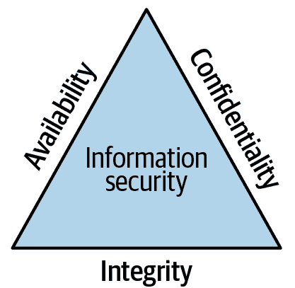
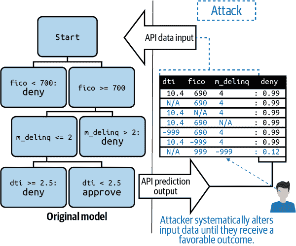
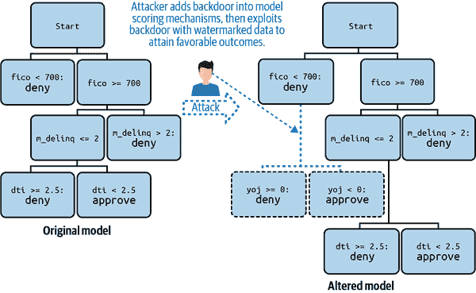
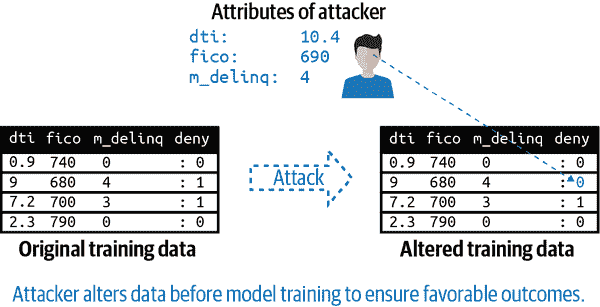
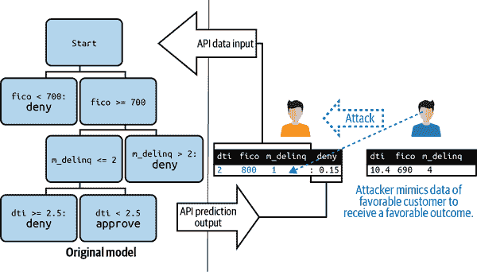
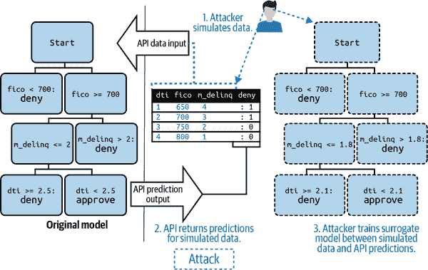
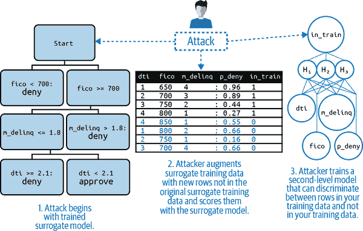

# 第五章：机器学习的安全性

如果“安全的最大敌人是复杂性”，正如 Bruce Schneier 所[声称的](https://oreil.ly/jfFU3)，过于复杂的机器学习系统本质上是不安全的。其他研究人员还发布了许多关于 ML 系统特定安全漏洞的研究，并确认了这些漏洞。我们现在开始看到现实世界中的攻击如何发生，比如 [伊斯兰国运营商在在线内容中模糊其标志](https://oreil.ly/8mSPC) 以逃避社交媒体过滤器。由于组织通常采取措施保护宝贵的软件和数据资产，ML 系统也应不例外。除了特定的事件响应计划外，还应将几种额外的信息安全流程应用于 ML 系统。这些包括专门的模型调试、安全审计、漏洞赏金和红队测试。

当今 ML 系统的一些主要安全威胁包括以下内容：

+   内部人员操作 ML 系统训练数据或软件，以改变系统结果

+   外部对手通过操作 ML 系统功能和结果

+   外部对手窃取专有 ML 系统逻辑或训练数据

+   木马或恶意软件隐藏在第三方 ML 软件、模型、数据或其他工件中

对于 AI 的关键或其他高风险的部署，系统应至少测试和审计这些已知的漏洞。传统的 ML 模型评估无法检测到它们，但是较新的模型调试技术可以帮助，特别是在针对特定安全漏洞进行调优时。审计可以由内部或由专业团队进行，这就是所谓的“红队测试”，就像 [Meta](https://oreil.ly/nCqSa) 所做的那样。[漏洞赏金](https://oreil.ly/rnZ9o)，或者组织向公众提供货币奖励以发现漏洞，是通用信息安全实践的另一种做法，可能也应用于 ML 系统。此外，测试、审计、红队测试和漏洞赏金不应仅限于安全问题。这些类型的流程也可以用于发现其他与 ML 系统相关的问题，例如偏见、不稳定性或缺乏鲁棒性、可靠性或弹性，并在它们演变为 AI 事件之前发现它们。

###### 注意

审计、红队测试和漏洞赏金不应仅限于安全问题。漏洞赏金可用于发现公共 ML 系统中的各种问题，包括偏见、未经授权的决策以及产品安全或疏忽问题，除了安全和隐私问题。

这一章节探讨了安全基础知识，如 CIA 三要素和数据科学家的最佳实践，然后深入讨论了机器学习安全问题。详细讨论了机器学习攻击，包括专门针对机器学习的攻击和可能影响机器学习系统的一般性攻击。接着提出了一些对策，例如专门的强大机器学习防御和隐私增强技术（PETs），安全感知的模型调试和监控方法，以及一些更一般的解决方案。本章以社交媒体逃避攻击及其现实后果案例讨论结束。读者在阅读完本章后，应能够对其机器学习系统进行基本的安全审计（或“红队测试”），发现问题，并在必要时采取简单的对策。参见第十一章获取机器学习安全代码示例。

# 安全基础知识

我们可以从计算机安全的广泛领域中学到许多基本的教训，这些教训将有助于加强我们的机器学习系统。在深入讨论机器学习的黑客攻击和对策之前，我们需要重点介绍敌对思维的重要性，讨论用于识别安全事件的 CIA 三要素，并强调适用于任何 IT 团队或计算机系统的几项简单的最佳安全实践，包括数据科学家和机器学习系统。

## 敌对思维

与许多炒作技术领域的从业者一样，机器学习系统的制造者和用户往往关注积极的方面：自动化、增加的收入以及新技术的时髦性。然而，另一群从业者则通过不同的敌对视角看待计算机系统。其中一些从业者可能与我们并肩工作，帮助保护我们组织的 IT 系统，以防止那些故意滥用、攻击、入侵和误用机器学习系统以谋取私利并对他人造成伤害的人士。学习机器学习安全的一个良好的第一步是采纳这种敌对思维，或者至少阻止过度乐观的机器学习炒作，思考机器学习系统被故意滥用和误用的情况，包括我们正在开发的系统。

###### 警告

不要对高风险的机器学习系统天真。它们可能会伤害人们。人们会攻击它们，并会滥用它们来伤害他人。

也许一个不满的同事毒害了我们的训练数据，也许某些第三方 ML 软件关联的二进制文件中隐藏了恶意软件，也许我们的模型或训练数据可以通过未受保护的端点提取，或者可能是一个僵尸网络可以通过分布式拒绝服务（DDOS）攻击我们组织的公共面向 IT 服务，导致我们的 ML 系统成为附带损害。虽然这样的攻击不会每天发生在我们身上，但它们会经常发生在某个地方的某人身上。当然，了解特定安全威胁的细节很重要，但总是考虑安全漏洞和事件多方面现实的对抗思维也许更为重要，因为攻击和攻击者往往是出人意料且巧妙的。

## CIA 三要素

从数据安全的角度来看，通常将目标和失败定义为机密性、完整性和可用性（CIA）三要素（图 5-1）。简要总结三要素，数据应仅对授权用户可用（机密性），数据应正确和及时更新（完整性），数据在需要时应及时可用（可用性）。如果这些原则中的任何一个被违反，通常会发生安全事件。CIA 三要素直接适用于恶意访问、更改或销毁 ML 系统的训练数据。但可能更难看到 CIA 三要素如何适用于 ML 系统发出决策或预测，而 ML 攻击往往以混淆的方式融合传统数据隐私和计算机安全问题。因此，让我们逐个例子来看一下。

###### 图 5-1\. 信息安全的 CIA 三要素

ML 系统的机密性可以通过逆推攻击（见“模型提取和逆推攻击”）来突破，恶意行为者通过适当方式与 API 交互，但使用可解释的人工智能技术从其提交的输入数据和我们系统的预测中提取有关我们模型和训练数据的信息。在更危险和复杂的成员推断攻击中（见“成员推断攻击”），可以从 ML 系统的 API 或其他端点提取单个训练数据行，直至整个训练数据集。请注意，这些攻击可能发生在未经授权访问训练文件或数据库的情况下，但对我们的用户或组织可能造成相同的安全和隐私危害，甚至可能涉及严重的法律责任。

ML 系统的完整性可能会受到多种方式的损害，例如数据污染攻击或对抗性示例攻击。在数据污染攻击中（参见“数据污染攻击”），组织内部人员会微妙地更改系统训练数据，以改变系统预测以符合他们的利益。只需操纵少量训练数据即可改变系统结果，而来自主动学习和其他领域的专业技术可以帮助攻击者更有效地这样做。当 ML 系统将数百万规则或参数应用于数千个交互输入特征时，几乎不可能理解 ML 系统可能做出的所有不同预测。在对抗性示例攻击中（参见“对抗性示例攻击”），外部攻击者通过找到奇怪的数据行——对抗性示例——来利用这些过度复杂的机制，从 ML 系统中引发意外和不当的结果，通常是为了自己的利益而损害我们。

ML 系统的可用性受到侵犯时，用户无法获得他们期望的服务。这可能是前述攻击将系统拖垮的结果，也可能是更标准的拒绝服务攻击、*海绵示例*攻击或偏见造成的后果。人们在日常生活中越来越依赖 ML 系统，当这些模型涉及到政府、金融或就业等高影响决策时，ML 系统的崩溃会使用户无法访问重要服务。最近的[研究](https://oreil.ly/D8KWt)揭示了海绵示例的威胁，即一种特殊设计的输入数据类型，迫使神经网络减慢预测速度并消耗大量能源。可悲的是，许多 ML 系统还在成果和准确性方面延续了历史上边缘化人群的系统偏见。少数群体可能不太可能从自动信用提供或简历扫描等服务中获得相同水平的可用性。更直接令人担忧的是，他们可能更有可能因面部识别系统（包括在安全或执法背景下使用的系统）的错误预测而遭受影响。 （第四章和 10 章详细讨论了 ML 系统中的偏见和偏见测试。）

这些只是 ML 系统可能遇到安全问题的几种方式。还有很多其他方式。如果读者开始感到担忧，继续阅读！接下来我们将讨论简单直接的安全概念和最佳实践。这些提示可以在保护任何计算机系统方面发挥重要作用。

## 数据科学家的最佳实践

从基础开始对于确保更复杂的 ML 系统非常重要。以下列表总结了在数据科学工作流程中这些基础知识的内容：

访问控制

能够访问敏感资源的人员越少越好。机器学习系统中有许多敏感组件，但只允许那些需要访问的人访问训练数据、训练代码和部署代码将有助于减少与数据外泄、数据毒化、后门攻击及其他攻击相关的安全风险。

Bug 悬赏

Bug 悬赏，即组织向公众提供找到漏洞的经济奖励，是信息安全领域的另一种实践，可能也应用于机器学习系统。关键的洞察力在于它们激励用户参与。用户很忙。有时我们需要奖励他们提供反馈。

事件响应计划

为关键的 IT 基础设施制定事件响应计划是一种常见做法，以快速应对任何故障或攻击。确保这些计划覆盖了机器学习系统，并具备在机器学习系统发生故障或遭受攻击时有所帮助的必要细节。我们需要明确在 AI 事件发生时谁负责什么，特别是在业务权限、技术知识、预算以及内部和外部沟通方面。像[NIST](https://oreil.ly/u967-)和[SANS Institute](https://oreil.ly/dS6oW)这样的组织有出色的资源可以帮助我们开始事件响应。如果读者想查看一个机器学习系统的示例事件响应计划，请访问 BNH.AI 的[GitHub](https://oreil.ly/xN4Cs)。

常规备份

勒索软件攻击，即恶意黑客冻结组织的 IT 系统访问，并在不支付赎金时删除宝贵资源，这种情况并不少见。确保定期和常规地备份重要文件，以防意外和恶意数据丢失。此外，最佳实践是将物理备份与任何联网机器分离（或“空气隔离”）。

最小特权

严格应用最小特权的概念，即确保所有人员——甚至是“摇滚明星”数据科学家和机器学习工程师——只获得绝对必要的 IT 系统权限，是防范内部机器学习攻击的最佳途径之一。特别注意限制 root、管理员或超级用户的数量。

密码与认证

使用随机和唯一的密码、多因素认证和其他认证方法，以确保保留访问控制和权限。对于分配给敏感项目的任何人员，实施更高水平的密码卫生（如使用密码管理器）也不失为一个好主意。物理钥匙，例如[Yubikeys](https://oreil.ly/oGT49)，是目前最强的认证措施之一。考虑到密码钓鱼的普遍性，以及像 SIM 换卡这样绕过基于电话的认证的黑客攻击，应该考虑在高风险应用中使用物理钥匙。

物理媒体

如果可能的话，避免对敏感项目使用物理存储介质，除非需要进行备份。印刷文件、闪存驱动器、备份媒体和其他便携数据源经常会被忙碌的数据科学家和工程师遗失或误放。更糟糕的是，它们可能会被积极进取的对手盗取。对于不那么敏感的工作，考虑制定围绕物理介质使用的政策和教育。

产品安全

如果我们的组织制作软件，很可能会对这些产品应用任意数量的安全功能和测试。同样，没有逻辑理由不将这些标准应用于面向公众或客户的机器学习系统。我们应该联系我们组织中的安全专家，讨论将标准产品安全措施应用于我们的机器学习系统。

红队

对于机器学习的任务关键或其他高风险部署，系统应在敌对条件下进行测试。在所谓的红队测试中，技术娴熟的团队试图攻击机器学习系统，并向产品所有者报告他们的发现。

第三方

构建机器学习系统通常需要来自我们组织以外的代码、数据和人员。遗憾的是，每一个新的参与者都会增加我们的风险。注意第三方数据中的数据污染或由第三方人员进行的数据污染。扫描所有第三方包和模型以检测恶意软件，并控制所有部署代码以防止插入后门或其他恶意有效载荷。

版本和环境控制

为了确保基本安全性，我们需要知道对哪些文件进行了什么样的更改，何时进行的更改，以及由谁进行的更改。除了源代码的版本控制外，任何商业或开源环境管理器都可以自动跟踪大数据科学项目。查看一些这些开放资源，开始进行机器学习环境管理：[DVC](https://oreil.ly/O6_6l)，[gigantum](https://oreil.ly/80VT7)，[mlflow](https://oreil.ly/pDjDF)，[ml-metadata](https://oreil.ly/p6EUA)，和[modeldb](https://oreil.ly/KhM3o)。

机器学习安全，将在接下来的章节中讨论，对于数据科学家可能比这里描述的更一般的战术更感兴趣。然而，由于这里考虑的安全措施如此简单，不遵守它们可能会导致我们组织的法律责任，以及令人尴尬或昂贵的违规和黑客攻击。虽然仍在辩论中且有些模糊，但违反由[美国联邦贸易委员会(FTC)](https://oreil.ly/XfCYP)和其他监管机构执行的安全标准，可能会带来令人不愉快的审查和执法行动。加固我们机器学习系统的安全性是一项艰巨的工作，但是在构建具有许多子系统和依赖关系的更复杂的机器学习系统时，如果基础工作没有做好，可能会带来大麻烦。

# 机器学习攻击

各种 ML 软件工件，ML 预测 API 以及其他 AI 系统端点现在成为网络和内部人员攻击的向量。这些 ML 攻击可以抵消数据科学团队为缓解其他风险所做的所有努力，因为一旦我们的 ML 系统受到攻击，它就不再是我们的系统。攻击者通常对准确性，偏见，隐私，可靠性，鲁棒性，弹性和未经授权的决策有他们自己的议程。防御这些攻击的第一步是了解它们。我们将在接下来的章节中概述最为人熟知的 ML 攻击。

###### 注意

大多数针对 ML 系统的攻击和漏洞都基于经典 ML 算法的不透明和过度复杂的特性。如果一个系统过于复杂以至于其操作员无法理解它，那么攻击者可以在操作员不知情的情况下操纵它。

## 完整性攻击：操纵机器学习输出

我们的 ML 攻击之旅将从攻击 ML 模型的完整性开始，即修改系统输出的攻击。可能是最为人熟知的攻击类型之一，对抗性示例攻击将首先讨论，随后是后门攻击，数据污染以及冒充和逃避攻击。在考虑这些攻击时，请记住它们通常可以用两种主要方式之一使用：（1）授予攻击者他们期望的 ML 结果，或（2）拒绝第三方其正当的结果。

### 对抗性示例攻击

一个积极进攻者可以通过与预测 API 的试错（即“探索”或“敏感性分析”），通过反演攻击（见“模型提取和反演攻击”），或通过社会工程学，学会如何操纵我们的 ML 模型以获得他们期望的预测结果，或如何改变他人的结果。专门设计数据行以进行这种目的的攻击被称为对抗性示例攻击。攻击者可以使用对抗性示例攻击来授予自己贷款，低于适当的保险费率，或根据犯罪风险评分避免预审拘留。查看图 5-2 以查看虚构攻击者利用奇怪的数据行对信用放贷模型执行对抗性示例攻击的插图。

###### 图 5-2\. 一种对信用放贷模型执行对抗性示例攻击的虚构攻击者的插图（[数字，彩色版本](https://oreil.ly/04ycs)）

### 后门攻击

想象一个场景，一个员工、顾问、承包商或恶意的外部行为者有权访问我们模型的生产代码——用于实时预测的代码。这个人可以更改代码，以识别奇怪或不太可能的输入变量值组合，以触发期望的预测结果。与其他结果操纵黑客攻击一样，后门攻击可以用于触发攻击者想要的模型输出，或者第三方不希望的结果。如在图 5-3 所示，攻击者可以将恶意代码插入我们模型的生产评分引擎，以识别一个真实年龄但工作年限（`yoj`）为负数的组合，以触发他们自己或他们的同伴的不恰当的正面预测结果。为了改变第三方的结果，攻击者可以向我们模型的评分代码中插入一个人工规则，阻止我们模型为某一群体产生正面的结果。

###### 图 5-3\. 后门攻击（[数字版，彩色](https://oreil.ly/04ycs)）

### 数据污染攻击

数据污染是指有人系统性地改变我们的训练数据，以操纵我们模型的预测。为了进行数据污染，攻击者必须能够访问部分或全部我们的训练数据。在许多公司，许多不同的员工、顾问和承包商都有这样的访问权限，而监督却很少。也有可能，恶意的外部行为者可能未经授权地获取部分或全部我们的训练数据并进行污染。一个非常直接的数据污染攻击可能涉及改变训练数据集的标签。在图 5-4 中，攻击者改变了少量训练数据的标签，以便那些具有他们信用历史的人会错误地接收到一个信用产品。也有可能，恶意行为者可能利用数据污染来训练我们的模型有意歧视某个群体，剥夺他们应有的大额贷款、大折扣或低保险费率。

###### 图 5-4\. 数据污染攻击（[数字版，彩色](https://oreil.ly/04ycs)）

虽然最简单地将数据污染看作是改变数据集现有行的值，但数据污染也可以通过向数据集和 ML 模型添加看似无害或多余的列来进行。这些列中的修改值可能会触发修改后的模型预测。这是避免向无法解释的 ML 模型倾倒大量列的许多原因之一。

### 冒名顶替和逃避攻击

使用试错法、模型逆推攻击（参见“模型提取和逆推攻击”）或社会工程学，攻击者可以了解到我们的机器学习系统从中得到预测结果的个体类型。攻击者随后可以冒充这种类型的输入或个体，以获取所需的预测结果，或逃避不希望的结果。这些冒充和逃避攻击类似于从机器学习模型角度看的身份盗窃。它们也类似于对抗性示例攻击（参见“对抗性示例攻击”）。

与对抗性示例攻击类似，冒充攻击涉及人为更改我们模型的输入数据值。与对抗性示例攻击不同的是，后者可能使用看似随机的输入数据值组合来欺骗我们的模型，而冒充意味着使用与另一个建模实体相关联的信息（即客户、员工、财务交易、患者、产品等），以获取我们的模型与该类型实体相关联的预测。而逃避则意味着相反的行为—更改我们自己的数据以避免不良预测。

在 图 5-5 中，攻击者了解了我们的模型与授信产品关联的特征，然后伪造他们自己的信息来获取该授信产品。他们可以与他人分享他们的策略，这可能导致我们公司遭受巨大损失。听起来像科幻小说？不是。与此密切相关的逃避攻击已经在[面部识别支付和安全系统](https://oreil.ly/69u8J)中奏效，并且“案例研究：真实世界的逃避攻击”将讨论几个文档记录的逃避机器学习安全系统实例。

###### 图 5-5\. 一种冒充攻击（[数字版，彩色版本](https://oreil.ly/04ycs)）

### 对机器学习解释的攻击

在所谓的“脚手架”攻击中—参见[“愚弄 LIME 和 SHAP：对后续解释方法的对抗攻击”](https://oreil.ly/xx9dH)—对手可以操纵后续解释方法，如局部可解释模型无关解释和 Shapley 加性解释。对部分依赖的攻击，另一种常见的后续解释技术，最近也已发布—参见[“通过数据毒化愚弄部分依赖”](https://oreil.ly/KMNmt)。对解释的攻击可以用来改变操作员和消费者对机器学习系统的认知—例如，使管道中的另一个黑客攻击更难发现，或使一个有偏见的模型看起来公平—被称为[美化]。这些攻击清楚地表明，随着机器学习管道和 AI 系统变得更加复杂，不良行为者可能会瞄准系统的许多不同部分，从训练数据一直到后续解释，以改变系统输出。

## 保密性攻击：提取的信息

如果没有适当的对策，恶意行为者可以访问关于我们模型和数据的敏感信息。模型提取和反转攻击是指黑客重建我们的模型，并从其模型副本中提取信息。成员推断攻击允许恶意行为者知道我们训练数据中的哪些行，并甚至重构训练数据。这些攻击只需访问一个无防护的机器学习系统预测 API 或其他系统端点即可。

###### 注

模型提取、模型反转、成员推断以及其他一些机器学习攻击，都可以看作是对一个较旧和更常见的知识产权和安全问题——逆向工程的一种新的处理方式。保密性攻击以及其他机器学习攻击，可以被用来*逆向工程*和重构我们潜在敏感的模型和数据。

### 模型提取和反转攻击

反转（参见 图 5-6）基本上是指从我们的模型中获取未授权的信息——与正常的使用模式相反，即将信息输入到我们的模型中。如果攻击者可以从我们的模型 API 或其他端点（网站、应用等）接收许多预测，他们可以在他们的输入和我们系统预测之间训练一个替代模型。那个提取出的替代模型是在攻击者用来生成接收到的预测的输入和接收到的预测之间训练的。根据攻击者可以接收到的预测数量，替代模型可以成为我们模型的相当准确的模拟。不幸的是，一旦替代模型训练完成，我们就会遇到几个重大问题：

+   模型实际上只是训练数据的压缩版本。有了替代模型，攻击者可以开始了解我们潜在敏感的训练数据。

+   模型是有价值的知识产权。攻击者现在可以出售他们复制的我们模型的访问权限，并削减我们的投资回报。

+   攻击者现在拥有一个沙盒，可以在其中策划模仿、对抗性示例、成员推断或其他攻击来针对我们的模型。

这样的替代模型也可以使用外部数据源进行训练，这些数据源可以与我们的预测相匹配，就像 ProPublica 与专有的 COMPAS 犯罪风险评估工具 [（引用自此处）](https://oreil.ly/FvMDm) 一样。

###### 图 5-6\. 一种反转攻击（[数字版，彩色](https://oreil.ly/04ycs)）

### 成员推断攻击

在以模型提取开始并且也由替代模型执行的攻击中，恶意行为者可以确定我们的模型训练数据中是否存在特定的人或产品。称为成员推理攻击（见图 5-7），这种黑客攻击是由两层模型执行的。首先，攻击者将数据传入公共预测 API 或其他端点，接收预测结果，并训练替代模型或模型，以在传入数据和预测结果之间建立联系。一旦训练出替代模型（或多个模型）来复制我们的模型，攻击者接着训练第二层分类器，可以区分用于训练第一个替代模型和未用于训练该替代模型的数据。当这第二个模型用于攻击我们的模型时，它可以明确指出任何给定的数据行（或多行）是否存在于我们的训练数据中。

当模型和数据与破产或疾病等不良结果，或高收入或净值等良好结果相关时，训练数据集中的成员身份可能非常敏感。此外，如果攻击者可以轻易地通过单一行数据与我们模型的目标之间的关系进行泛化，比如种族、性别或年龄与某些不良结果之间的明显关系，这种攻击可能会侵犯整个人群的隐私。令人恐惧的是，如果达到最极端，成员推理攻击甚至可以让一个恶意行为者仅通过未受保护的公共预测 API 或其他模型端点的访问，逆向工程敏感或有价值的大部分训练数据集。

###### 图 5-7\. 一个成员推理攻击（[数字，彩色版本](https://oreil.ly/04ycs)）

尽管所讨论的攻击是一些最为知名的种类，但请记住这并不是机器学习黑客攻击的唯一类型，新的攻击可能非常快速地出现。因此，在进入到我们可以用来保护我们的机器学习系统的对策之前，我们还将讨论一些一般性的关注点，以帮助我们构建更广泛的威胁环境框架。

# 机器学习安全的一般关注点

这本书的一个普遍主题是，机器学习系统基本上是软件系统，将常识性的软件最佳实践应用于机器学习系统通常是一个好主意。安全方面也是如此。作为软件系统和服务，机器学习系统表现出类似于通用软件系统的失败模式，并经历与一般软件系统相同的攻击。还有哪些一般性的关注点？像是意图滥用 AI 技术、可用性攻击、木马和恶意软件、中间人攻击、不必要复杂的无法解释系统以及分布式计算的困难：

滥用机器学习

几乎所有工具也可以被用作武器，机器学习模型和人工智能系统可以被滥用多种方式。让我们从深度伪造开始考虑。深度伪造是深度学习的一种应用，当仔细进行时，可以将音频和视频片段无缝地融合成令人信服的新媒体。虽然深度伪造可以用于使电影演员重生，就像一些最近的*星球大战*电影中所做的那样，但深度伪造也可以用于伤害和敲诈勒索人们。当然，非自愿色情，即将受害者的面孔混合到成人视频中，是深度伪造的最流行用途之一，正如[BBC](https://oreil.ly/05QCB)和其他新闻媒体所报道的那样。深度伪造也被牵涉到金融犯罪中，例如当攻击者使用 CEO 的声音来命令将钱转入他们自己的账户时。算法歧视是滥用人工智能的另一个常见应用。在“公平洗白”攻击中，事后解释可以被修改以隐藏偏向模型中的歧视。面部识别也可以直接用于[种族识别](https://oreil.ly/KBvXa)。我们只是触及了机器学习系统可以被滥用的一些方式；有关这一重要主题的更广泛处理，请参阅[“AI-Enabled Future Crime”](https://oreil.ly/8L3ax)。

一般可用性攻击

机器学习系统可能会成为像其他面向公众服务一样受到拒绝服务（DOS）攻击的受害者。如果面向公众的机器学习系统对我们的组织至关重要，我们会确保其通过防火墙和过滤器、反向域名服务器系统（DNS）查找以及其他增加在 DOS 攻击期间可用性的对策来加固。不幸的是，我们还必须考虑通过算法歧视引起的另一种可用性失败。如果算法歧视足够严重，无论是由内部故障还是敌对攻击驱动，我们的机器学习系统可能不会被其大部分用户使用。确保在训练期间和系统部署生命周期中进行偏见测试。

木马和恶意软件

在研发环境中，机器学习依赖于一个多样化的开源软件包生态系统。其中一些软件包拥有许多贡献者和用户。有些则非常特定，只对少数研究人员或从业者有意义。众所周知，许多软件包由杰出的统计学家和机器学习研究人员维护，他们的主要关注点是数学或算法，而不是软件工程或安全性。一个机器学习流水线可能依赖于几十甚至上百个外部软件包，其中任何一个都可能被黑客利用来隐藏攻击载荷。具有大型二进制数据存储和预训练机器学习模型的第三方软件包似乎尤为容易受到这类问题的影响。如果可能，扫描与机器学习系统相关的所有软件工件，查找木马和恶意软件。

中间人攻击

因为许多机器学习系统的预测和决策都是通过互联网或组织的网络传输的，它们在传输过程中可以被恶意行为者操控。在可能的情况下，使用加密、证书、双向认证或其他对策来确保通过网络传输的机器学习系统结果的完整性。

不可解释的机器学习

尽管最近对可解释模型和模型解释的发展提供了使用准确且透明模型的机会，但许多机器学习工作流程仍围绕不可解释模型展开。这种模型在商业机器学习工作流中是常见的不必要复杂性的一种类型。一个专注且有动力的攻击者可以随着时间的推移，比我们自己的团队更深入地了解我们过于复杂且不可解释的机器学习模型。 （特别是在今天的频繁人员流动的数据科学职场。）这种知识不平衡可能被利用来进行我们已经描述的攻击，或者其他尚未知晓的攻击类型。

分布式计算

不管是好是坏，我们生活在大数据时代。许多组织现在正在使用分布式数据处理和机器学习系统。分布式计算可以为恶意的内部或外部行为者提供广泛的攻击面。数据可能只在一个或几个大型分布式数据存储或处理系统的工作节点上被污染。一个后门可能只编码在大型集成模型的一个模型中。现在从一个简单的数据集或模型调试转向，从业者有时必须检查分布在大型计算集群中的数据或模型。

又开始感到担忧了吗？挺住——接下来我们将讨论关于机器学习系统的保密性、完整性和可用性攻击的对策。

# 对策

我们可以使用许多对策，并结合在第一章中提议的治理过程、漏洞赏金、安全审计和红队行动，这些措施更有可能是有效的。此外，还有对抗性机器学习和强化机器学习等较新的子学科，这些学科正在对这些主题进行全面的学术处理。本节将概述我们可以使用的一些防御措施，以帮助使我们的机器学习系统更安全，包括安全的模型调试、安全的模型监控、增强隐私技术、强化机器学习以及一些一般方法。

## 安全的模型调试

在发布之前，机器学习模型可以并且应该进行安全漏洞测试。在这些测试中，目标基本上是攻击我们自己的机器学习系统，了解我们的安全水平，并修补任何发现的漏洞。适用于安全调试的跨不同类型机器学习模型的一些通用技术包括对抗示例搜索、敏感性分析、针对内部攻击和模型提取攻击的审计，以及歧视性测试。

### 对抗示例搜索和敏感性分析

以对抗态度进行敏感性分析，或者更好地说，进行我们自己的对抗性示例攻击，是确定我们的系统是否容易受到可能是最简单和最常见的 ML 完整性攻击类型之一的好方法。这些道德黑客的想法是了解什么特征值（或其组合）可以导致我们系统输出预测大幅波动。如果我们在深度学习领域工作，像[cleverhans](https://oreil.ly/6LuBF)和[foolbox](https://oreil.ly/M4ayU)这样的软件包可以帮助我们开始测试我们的 ML 系统。对于那些处理结构化数据的人来说，老牌的敏感性分析可以在指出系统不稳定性方面发挥很大作用。我们还可以使用遗传学习来演化我们自己的对抗性示例，或者使用[基于个体条件期望的启发式方法](https://oreil.ly/_qQdn)来找到对抗性示例。一旦我们发现由这些对抗性示例触发的 ML 系统的不稳定性，我们将希望使用交叉验证或正则化来训练一个更稳定的模型，应用来自健壮机器学习的技术（见“健壮机器学习”），或者在实时中明确监控发现的对抗性示例。我们还应将此信息链接到系统的事件响应计划中，以防以后有用。

### 对内部数据污染进行审计

如果发生数据污染攻击，系统内部人员—员工、承包商和顾问—可能是嫌疑人。我们如何追踪内部数据污染者？首先，对这些个人使用我们的系统进行评分。任何接收到积极结果的内部人员可能是攻击者或知道攻击者的人。因为聪明的攻击者可能会对训练数据进行最小的更改，以产生积极的结果，所以我们还可以使用残差分析来寻找具有大于预期残差的有益结果，这表明 ML 模型可能倾向于为这些个体发出负面结果，如果训练数据没有被改变的话。数据和环境管理是内部数据污染的强有力对策，因为所有数据变更都有充分的元数据记录（谁、什么时候等等）。我们还可以尝试拒绝对负面影响（RONI）技术，该技术在开创性的[“机器学习安全性”](https://oreil.ly/exh6g)中提出，以从系统训练数据中删除潜在已改变的行。

### 偏倚测试

源于某种偏见（无论是有意还是无意）的 DOS 攻击，是一种可信的可用性攻击类型。事实上，这种情况已经发生过。2016 年，Twitter 用户毒害了[Tay 聊天机器人](https://oreil.ly/uPqNx)，导致只有对新纳粹色情内容感兴趣的用户才会觉得系统服务有吸引力。这种攻击也可能发生在更严重的背景下，比如就业、借贷或医疗领域，攻击者利用数据毒化、模型后门或其他类型的攻击，来拒绝某个群体的服务。这是进行偏见测试并在训练时以及作为常规模型监控的一部分进行补救的许多原因之一。有几个优秀的开源工具可用于检测歧视并尝试修复它，比如[aequitas](https://oreil.ly/e412j)、[Themis](https://oreil.ly/yJiT6)和[AIF360](https://oreil.ly/HsKEg)。

### 道德黑客：模型提取攻击

模型提取攻击本身是有害的，但它们也是成员推断攻击的第一阶段。我们应该进行自己的模型提取攻击，以确定我们的系统是否容易受到这些保密攻击的影响。如果我们发现某个 API 或模型端点允许我们在输入数据和系统输出之间训练一个替代模型，我们将通过坚实的认证措施来锁定它，并限制在这个端点的任何异常请求。由于可能已经通过这个端点发生了模型提取攻击，我们需要按以下方式分析我们提取的替代模型：

+   不同类型替代模型的准确性界限是什么？我们必须尽力理解替代模型在多大程度上真正可用于获取关于我们 ML 系统的知识。

+   我们的替代模型可以学到哪些数据趋势？线性模型系数表示的线性趋势又如何？或者说人口子群的课程总结在替代决策树中是如何表示的？

+   从替代决策树中可以学到哪些规则？例如，如何可靠地模仿一个会得到有利预测的个体？或者如何构建有效的对抗性示例？

如果我们看到可以从系统的一个端点训练一个准确的替代模型，并回答这些问题的可能性，那么我们将需要采取一些下一步措施。首先，我们将对自己进行成员推断攻击，以查看是否也可能发生这种两阶段攻击。我们还需要记录与这次道德黑客分析相关的所有信息，并将其与系统的事件响应计划联系起来。事后响应者可能会在以后的某个日期发现这些信息很有帮助，如果有强有力的证据表明发生了攻击，可能不幸需要报告为一次违规事件。

调试我们 ML 系统中的安全漏洞是重要的工作，可以为我们节省未来的金钱、时间和痛苦，但监视我们的系统以确保其保持安全同样重要。接下来，我们将讨论安全模型监控。

## 安全模型监控

一旦黑客能够操纵或提取我们的 ML 模型，它实际上就不再是我们的模型了。为了防范对模型的攻击，我们不仅需要在训练和调试时考虑安全性；一旦模型投入使用，我们还需要密切监控它。安全监控应重点关注算法歧视、输入数据队列中的异常、预测中的异常以及高使用率。以下是一些关于什么和如何监控的提示：

偏见监测

如其他章节所述，偏见测试必须在模型训练期间应用。但由于许多原因，包括意外后果和恶意黑客攻击，部署期间也必须进行歧视测试。如果在部署期间发现偏见，应进行调查和补救。这有助于确保在训练期间公平的模型在生产中仍然是公平的。

输入异常

不允许将不现实的数据组合进入模型评分队列，因为这可能会触发模型机制中的后门。异常检测 ML 技术，如自编码器和孤立森林，通常有助于跟踪问题输入数据。然而，在数据到达模型之前，我们也可以使用常识数据完整性约束来捕捉问题数据。这种不现实的数据的一个例子是 40 岁的年龄和 50 年的工作年限。如果可能的话，我们还应考虑监控随机数据、训练数据或重复数据。因为随机数据经常被用于模型提取和反演攻击，所以我们建立警报或控制措施，帮助团队了解我们的模型何时可能遇到随机数据批次。应记录并调查实时评分中与训练、验证或测试数据极为相似或相同的行，因为这可能表明成员推理攻击。最后，在实时评分队列中查找重复数据，因为这可能表明逃避或冒名顶替攻击。

输出异常

输出异常可能表明敌对样本攻击。在评分新数据时，我们将我们的 ML 模型预测与可信、透明的基准模型或基于可信数据源和流水线训练的基准模型进行比较。如果我们更复杂和不透明的 ML 模型与我们可解释或可信任的模型之间的差异太大，我们会退回到保守模型的预测，或者将数据行发送进行手动处理。统计控制限，类似于移动置信区间，也可以用于监控异常输出。

元监控

我们监控基本的操作统计数据——特定时间段内的预测次数、延迟、CPU、内存和磁盘负载，或者并发用户数量——以确保我们的系统正常运行。我们甚至可以对我们整个 ML 系统的操作统计数据进行基于自编码器的异常检测元模型训练，然后监控这个元模型以检测异常。系统操作中的异常可能会提示我们在 ML 系统中普遍存在问题。

监控攻击是我们可以采取的最积极的措施之一来对抗 ML 黑客。然而，还有几个反制措施需要讨论。接下来我们将研究隐私增强技术。

## 隐私增强技术（Privacy-Enhancing Technologies）

隐私保护机器学习（Privacy-preserving ML）是一个研究子领域，直接影响到我们机器学习训练数据的保密性。尽管在机器学习（ML）和机器学习运营（MLOps）社区刚刚开始受到关注，PETs 在保护我们的数据和模型方面可以给我们带来优势。这个新兴领域中一些最有前景和实用的技术包括联邦学习和差分隐私。

### 联邦学习

联邦学习是一种跨多个分散设备或服务器进行 ML 模型训练的方法，这些设备或服务器持有本地数据样本，它们之间不交换原始数据。这种方法不同于传统的集中式 ML 技术，后者要求将所有数据集上传到单个服务器。联邦学习的主要优势在于它能够在不同参与方之间构建 ML 模型而无需共享数据。联邦学习通过在本地数据样本上训练本地模型，并在服务器或边缘设备之间交换参数来生成全局模型，然后由所有服务器或边缘设备共享。假设使用了安全聚合过程，联邦学习有助于解决基本的数据隐私和数据安全问题。在其他开源资源中，我们应该了解一下[PySyft](https://oreil.ly/8HpeR)或[FATE](https://oreil.ly/W3uYP)，以便开始学习如何在我们的组织（或与合作伙伴组织）实施联邦学习。

### 差分隐私

差分隐私是一种通过描述数据集中组的模式来共享数据集信息的系统，而不透露具体个体的信息。在 ML 工具中，通常使用特殊类型的差分隐私学习算法来实现这一点。这使得从训练数据或训练后的 ML 模型中提取敏感信息变得更加困难，例如模型提取、模型反演或成员推断攻击。实际上，如果外部观察者无法判断个体信息是否被用于训练模型，则称 ML 模型具有差分隐私性质。有许多高质量的开源存储库可供查阅和尝试，包括以下内容：

+   谷歌的[differential-privacy](https://oreil.ly/rjwKK)

+   IBM 的[diffprivlib](https://oreil.ly/QOFm-)

+   TensorFlow 的[隐私](https://oreil.ly/WyPD6)

许多调用差分隐私的 ML 方法基于[差分私有随机梯度下降（DP-SGD）](https://oreil.ly/raWeC)。DP-SGD 在每个训练迭代中向由 SGD 确定的梯度注入结构化噪声。总体而言，DP-SGD 及其相关技术确保 ML 模型不会对训练数据的具体信息进行过多记忆。因为它们防止 ML 算法集中于特定个体，它们也可能导致增加的泛化性能和公平性好处。

读者们可能在 PET 主题下听说过保密计算或同态加密。这些也是有前途的研究和技术方向。另一个值得关注的 ML 研究子领域是鲁棒 ML，它可以帮助我们对抗对抗性示例攻击、数据毒化以及其他对 ML 系统的对抗性操纵。

## 鲁棒机器学习

鲁棒 ML 包括许多先进的 ML 算法，用于对抗对抗性示例攻击，以及在一定程度上对抗数据毒化。在几位研究人员展示出输入数据的微小甚至不可见的变化可能导致计算机视觉系统输出预测的巨大波动之后，对鲁棒 ML 的研究获得了动力。这种模型结果的波动在任何领域都是一个令人不安的迹象，但在考虑医学成像或半自主车辆时，它们简直是危险的。鲁棒 ML 模型有助于保持模型结果的稳定性，并且重要的是公平性——即类似的个体应被类似地对待。在 ML 训练数据或实时数据中，类似的个体是在数据的欧几里得空间中彼此接近的个体。鲁棒 ML 技术经常尝试在个体数据示例周围建立一个超球体，并确保超球体内的其他相似数据获得类似的预测。无论是由于恶意行为者、过度拟合、规范不足还是其他因素，鲁棒 ML 方法帮助我们的组织保护免受意外预测带来的风险。有趣的论文和代码托管在[鲁棒 ML 网站](https://oreil.ly/H36uh)，马萨诸塞理工学院的 Madry 实验室甚至发布了一个完整的[Python 鲁棒 ML 包](https://oreil.ly/k-qDZ)。

## 一般对策

有许多综合性对策可以防御多种类型的 ML 攻击，包括认证、限流和水印。许多这类对策也是 ML 系统的一般最佳实践，例如可解释的模型、模型管理和模型监控。在本章案例研究之前，我们将讨论一个重要且通用的反对 ML 系统攻击的简要描述主题：

认证

在可能的情况下，对于高风险的机器学习系统，应禁止匿名使用。登录凭据、多因素认证或其他需要用户证明其身份、授权和使用权限的认证方式，可以在我们的模型 API 与匿名的恶意行为者之间设置屏障。

可解释、公平或隐私模型

现在存在多种建模技术，例如单调 GBM（M-GBM）、[可扩展贝叶斯规则列表（SBRL）](https://oreil.ly/Md375)、[可解释神经网络（XNN）](https://oreil.ly/sd4XX)，这些技术能在机器学习模型中实现精度和可解释性的兼顾。这些准确且可解释的模型比经典的不可解释模型更易于文档化和调试。新型的公平和隐私建模技术，例如[LFR](https://oreil.ly/7ZHmw)、[DP-SGD](https://oreil.ly/yuddM)，还可以被训练用于减弱外观可见的人口特征，这些特征可能被观察到、社会工程化为对抗性示例攻击或被冒用。这些增强了可解释性、公平性或隐私性的模型应该比过度使用的不可解释模型更容易调试，更能应对个体特征变化的挑战，并且更安全。

模型文档

模型文档是一种减少风险的策略，在银行业已经使用了几十年。它允许关于复杂建模系统的知识在模型所有者团队变更时得以保留和传递，并且使知识能够标准化，以便模型验证者和审计人员进行高效分析。模型文档应覆盖 ML 系统的“谁、何时、何地、什么以及如何”，包括从利益相关者的联系信息到算法规范的许多细节。模型文档还是记录 ML 系统已知漏洞或安全问题的自然位置，使未来的维护人员或与系统交互的其他操作者能够有效分配监督和安全资源。事故响应计划也应与模型文档相关联。(第二章 包含一个样本文档模板。)

模型管理

模型管理通常指一组过程控制，如文档化，与技术控制，如模型监控和模型清单的结合。组织应准确计算部署的 ML 系统数量，并结构化地列出相关的代码、数据、文档和事故响应计划，并监控所有部署的模型。这些实践使得当出现问题时更容易理解发生了什么，并能够迅速处理问题。(第一章 更详细地讨论了 ML 模型风险管理。)

节流

当模型监控系统识别出高频使用或其他异常情况，如对抗性示例，重复、随机或训练数据时，请考虑限制预测 API 或其他系统端点的流量。限流可以指限制单个用户的大量快速预测，人为增加所有用户的预测延迟，或其他能够减缓攻击者进行模型或数据提取攻击和对抗性示例攻击的方法。

水印技术

水印技术指的是向数据或预测中添加微小标记，以防止数据或模型被盗。如果数据或预测带有可识别的特征，例如图像上的实际水印或结构化数据中的哨兵标记，一旦发生盗窃，这些特征可以使被盗资产更难以使用，并且更容易被执法部门或其他调查人员识别。

应用这些通用防御和最佳实践，以及前面讨论过的一些具体对策，是实现 ML 系统高安全性的一个好方法。现在我们已经介绍了安全基础知识、ML 攻击以及许多对应的对策，读者们已经掌握了开始进行红队测试组织 AI 所需的知识——尤其是如果能与组织的 IT 安全专业人员合作。接下来，我们将研究一些真实世界的 AI 安全事件，以提供额外动力来进行 AI 红队测试的艰苦工作，并深入了解当今最常见的 ML 安全问题。

# 案例研究：真实世界的规避攻击

近年来，既用于物理安全又用于在线安全的 ML 系统遭受了规避攻击。本案例讨论了用于规避 Facebook 过滤器以及传播虚假信息和恐怖主义宣传的规避攻击，以及针对真实世界支付和物理安全系统的规避攻击。

## 规避攻击

随着 COVID 大流行的持续和 2020 年美国总统竞选的高潮，那些与这两个主题相关的虚假信息滋生并利用了 Facebook 手动和自动内容过滤的弱点。根据 NPR 报道，[“微小的改变使关于 COVID-19 和选举的虚假声明逃避了 Facebook 的事实检查”](https://oreil.ly/aYSTr)。尽管 Facebook 使用路透社和美联社等新闻机构来对其数十亿用户所作声明进行事实检查，但它也使用基于 AI 的内容过滤器，特别是用于捕捉被人类识别的误导性帖子的副本。不幸的是，一些小改动，如不同的背景或字体，图像裁剪，或者仅仅是用文字描述表情包而不是图片，让恶意行为者能够绕过 Facebook 基于 ML 的内容过滤器。为了自卫，Facebook 对许多违规者进行了执行行动，包括限制帖子的传播、不推荐帖子或群组以及取消广告收益。然而，根据一家倡导组织的说法，Facebook 未能捕捉到大约[42%的被人类事实检查员标记的虚假信息帖子](https://oreil.ly/fzCrb)。同一倡导组织 Avaaz 估计，仅 738 个未标记的虚假信息帖子样本导致了大约 1.42 亿次浏览和 560 万次用户互动。

最近的事件表明，网络虚假信息和安全威胁可能会波及现实世界。有关 2020 年美国大选和 COVID 大流行的虚假信息被认为是引发 2021 年 1 月 6 日令人震惊的美国国会骚乱的主要驱动力。在更为令人不安的逃避攻击中，BBC 报道称[ISIS 成员继续逃避 Facebook 内容过滤器](https://oreil.ly/qV25u)。通过模糊标志、将他们的视频与主流新闻内容拼接，或者仅仅使用奇怪的标点符号，ISIS 成员或附属机构能够发布宣传、制造爆炸物的教程，甚至逃避攻击的教程到 Facebook 上，为他们的暴力、令人不安和恶毒内容赢得数以万计的观看。虽然针对基于 AI 的过滤器的逃避攻击显然是主要罪魁祸首，但 Facebook 上阿拉伯语内容的人类审核员较少。无论是人类还是机器在工作中失败，这类内容都可能真正危险，既促进激进化，又导致现实世界的暴力。物理逃避攻击也是不久的将来的一个担忧。研究人员最近表明，一些基于 AI 的物理安全系统易受逃避攻击的攻击目标，[特别是使用逼真的三维面具绕过支付宝和微信支付系统的面部识别安全检查](https://oreil.ly/xVmDj)。在一个严重的案例中，研究人员甚至能够在阿姆斯特丹斯希普霍尔机场使用另一个人的图片在 iPhone 屏幕上登机。

## 学到的教训

将在线保护措施逃避的不良行为者与逃避物理安全系统以进行货币支付和飞行联系起来，描绘了一个世界的可怕画面，即机器学习安全问题未被认真对待的世界。从本章中学到的教训如何应用以防止这些逃避攻击？第一课程与强大的机器学习相关。用于高风险安全应用的机器学习系统，无论是在线还是现实世界，都不能被对正常系统输入的微小更改所欺骗。强大的机器学习及相关技术必须进步到这样一个程度，即简单的逃避技术，如模糊化标志或更改标点符号，不再是有效的逃避手段。另一个教训来自本章开头：对抗性思维。任何认真思考过这些基于 AI 安全系统安全风险的人都应该意识到，面具或其他图像是一种明显的逃避技术。值得庆幸的是，一些组织确实对对抗场景采取了应对措施。更好的面部识别安全系统采用旨在确保所识别对象活跃性的技术。更好的面部识别系统还采用歧视性测试，以确保所有用户的可用性尽可能高，错误率尽可能低。

从现实世界的逃避攻击中可以学到的另一个重要课程与技术的负责使用有关，尤其是机器学习。社交媒体已经蔓延到超越物理边界，其复杂性已经超过了许多国家目前有效监管的能力。在缺乏政府监管的情况下，用户寄望于社交媒体公司自我监管。作为技术公司，社交网络通常依赖更多技术，如基于 AI 的内容过滤器，来保持对其系统的控制。但如果这些控制实际上并不起作用呢？随着技术和机器学习在人类生活中扮演更大角色，设计、实施和部署中缺乏严谨和责任将会带来日益严重的后果。那些为安全或其他高风险应用设计技术的人有着特别严肃的责任，要对今天的机器学习能力保持现实，并应用过程和技术控制来确保足够的现实世界性能。

# 资源

进一步阅读

+   [“安全和隐私的机器学习掠夺者地图”](https://oreil.ly/0k7D3)

+   [“BIML 交互式机器学习风险框架”](https://oreil.ly/csQ22)

+   [FTC 的“从安全开始”指南](https://oreil.ly/jmeja)

+   [人工智能系统的对抗性威胁景观](https://oreil.ly/KxEbC)

+   [NIST 计算机安全资源中心](https://oreil.ly/pncXb)

+   [NIST 数据去标识化工具](https://oreil.ly/M8xhr)
