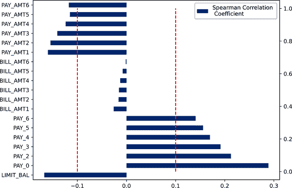

# 第六章：可解释提升机和解释 XGBoost

本章探讨了可解释模型和事后解释，涉及与消费金融相关的互动[示例](https://oreil.ly/machine-learning-high-risk-apps-code)。它还应用了第二章讨论的方法，使用可解释提升机（EBMs）、单调约束 XGBoost 模型和事后解释技术。我们将从可加性、约束、偏依赖和个体条件期望（ICE）、Shapley 可加解释（SHAP）和模型文档开始进行概念复习。

然后，我们将通过从惩罚回归到广义可加模型（GAM）再到 EBM 的方式来探讨一个信用承保问题示例。在从简单到复杂的模型中工作时，我们将记录关于将非线性和交互引入示例违约概率分类器的明确和慎重的权衡，同时保持几乎完全可解释性。

###### 注意

回顾自第二章，*解释*是指对刺激进行上下文化和利用人类背景知识的高层次有意义的心理表征，而*说明*则是试图描述复杂过程的低层次详细心理表征。解释远比说明要高得多，很少通过单纯技术手段实现。

之后，我们将考虑第二种预测违约的方法，允许复杂的特征交互，但通过基于因果知识的单调约束控制复杂性。由于单调约束梯度增强机（GBM）本身无法解释，我们将与强大的事后解释技术配对，以极大增强可解释性。最后，本章将讨论流行的 Shapley 值方法的优缺点。

# 概念复习：机器学习透明度

在深入技术示例之前，让我们回顾一下第二章中的一些关键概念。因为我们的第一个例子将突显 GAM 系列模型的优势，所以下一步我们将特别讨论可加性，特别是与允许高阶交互的模型进行比较。我们的第二个例子将使用单调约束来实现与 XGBoost 的非正式因果关系方法，因此我们将简要介绍因果与约束之间的联系。我们还将使用偏依赖和 ICE 来比较和评估我们不同方法对输入特征处理的方式，因此我们需要快速复习这些事后解释器的优缺点，并再次强调模型文档的重要性——因为模型文档非常重要。

## 可加性与交互作用

无法解释的机器学习的一个主要特征是其倾向于在输入特征之间创建极高程度的相互作用。人们认为，这种能力同时考虑许多特征值的组合，增加了 ML 模型相对于更传统的线性或加法模型的预测能力，后者倾向于独立考虑输入特征。但已经显示，无法解释的模型在类似信用核准数据的结构化数据上并不更准确，并且这些模型中的所有相互作用对人类来说非常难以理解。此外，高度相互作用还导致不稳定性，因为一两个特征的微小变化可以与其他特征相互作用，从而显著改变模型结果。高度相互作用还导致过拟合，因为今天相关的 17 路相互作用可能明天就不再相关了。

ML 的另一个重要特征是能够自动学习训练数据中的非线性现象。事实证明，如果我们能够将非线性与相互作用分离开来，我们可以实现显著的预测质量提升，同时保持相当多的可解释性，即使不是完全的可解释性。这是 GAM 的魔力所在。而 EBM 则是下一步，允许我们以加法的方式引入适度数量的二路相互作用，可能会导致更好的性能。本章后面，GAM 系列示例（见“可解释模型的 GAM 系列”）旨在提供这些权衡的教训，从基线开始的简单、加法线性模型，然后通过 GAM 引入非线性，最后通过 EBM 引入可理解的二路相互作用。当我们谨慎引入非线性和相互作用，而不是认为更复杂总是更好时，它使我们能够证明我们的建模方法，将其捆绑到现实世界的性能关注点，并生成许多有趣的特征行为图。这些理由和图也是后续模型文档的重要材料，不久将更详细地讨论。

###### 注意

多年来，在统计文献中讨论的模型系列通常包括 GLM 的变体、GAM、GA2M、EBM 和加法指数模型（AIMs）。这种建模类型有时被称为方差的功能分析（fANOVA）框架。

## 采取有约束的因果步骤

因果发现和推断是预测建模未来重要的方向。为什么呢？因为当我们基于机器学习中的相关性构建模型时，我们常常是在搭建在流沙之上。现实世界中的相关性不断变化，可能是虚假的或错误的。如果我们能够基于因果关系而不仅仅是在复杂相关性的某个快照上建模，我们可以大大减少过拟合、数据漂移和社会偏见的风险。目前来看，因果方法对大多数组织来说实施起来可能有些困难，因此我们的单调约束示例（见“约束与非约束的 XGBoost”）突出了我们可以采取的一个简单而易行的步骤，将因果性注入到机器学习模型中。例如，如果我们*知道*迟付款的增加是未来违约的一个指标，我们可以使用单调约束来要求 XGBoost 分类器对更多的迟付款生成更高的违约概率。虽然我们可能在虚拟测试数据的性能中看不到约束的增益，但约束确实可以减少现实世界中的不稳定性、过拟合和社会偏见风险，而且很可能提高实际应用的性能。

## 偏依赖和个体条件期望

偏依赖是一种成熟且高度直观的事后解释方法，描述模型在某些输入特征的值范围内的估计平均行为。不幸的是，它是有缺陷的。在输入特征之间存在相关性或相互作用时，它无法准确表示模型的行为，甚至可能被[恶意篡改](https://oreil.ly/z2xAW)。但由于理解模型中特征的平均行为如此重要，因此已开发了许多技术来解决偏依赖的缺陷。特别是，[累积局部效应](https://oreil.ly/kEIPp)是偏依赖的直接替代品，专门设计用于解决其缺点。读者可以使用像[ALEPlot](https://oreil.ly/7vv4h)或[ALEPython](https://oreil.ly/To7PF)这样的软件包尝试 ALE。

在接下来的示例中，我们将大量使用另一个偏依赖导数来深入理解模型中特征行为的表现。 首次引入于[“窥视黑匣子：用个体条件期望的图形可视化统计学习”](https://oreil.ly/MruUv)，ICE 图将模型对单个个体的局部行为与偏依赖相配对。 这使我们能够比较估计的平均行为与局部行为的描述，当偏依赖和 ICE 曲线分歧时，我们可以自行决定偏依赖看起来是否可信，或者它是否受到输入变量之间的相关性或交互影响。 当然，ICE 也不是没有问题的。 ICE 的最常见问题是考虑到了不现实的数据值，当解释 ICE 时，重要的是将最大的精神压力放在与正在考虑的原始数据行中最相似的输入特征值上。

让我们通过一个例子来解释所有这些。 在图 6-1 的底部面板中，我们可以看到一个经过惩罚的逻辑回归模型和输入特征`PAY_0`（客户最近账单的还款状态）的偏依赖和 ICE。 `PAY_0`的较高值表示还款的延迟较大。 ICE 曲线是为预测概率分位数处的个体生成的。

注意在客户最近一次支付没有迟到时，默认概率从较低的值平稳增加到客户迟到时的高概率。 在此情境中这是合理的期望，并与领域知识一致。 还请注意，ICE 和偏依赖并不发散——它们高度一致。 这在线性模型中始终如此，但这也表明偏依赖对于这个模型和数据集可能是可信的。

那么，在本图的顶部面板中发生了什么？ 这是我们试图确定模型是否从训练数据中学习到了稳健的信号。 你可能注意到的第一件事是一个直方图。 我们使用该直方图来寻找模型预测中的稳定性问题。 机器学习模型通常只能从数据中学习，因此如果在我们的训练数据中存在`PAY_0 > 1`的情况下数据量不足，机器学习模型就无法学到太多，它们在这些数据域中的预测将是不稳定的，甚至是荒谬的。 一些其他软件包使用误差条来绘制偏依赖或形状函数图的相同目的。 这也是可以接受的。 这两种可视化技术都试图将您的注意力引向模型预测不稳定且可能做出愚蠢决策的数据区域。


###### 图 6-1\. 本章后期训练的包含 ICE、直方图和条件均值的偏依赖绘图，以增加其可信度和效果（[数字，彩色版本](https://oreil.ly/7vLOU)）

这就是我们尝试确定模型是否很好地代表我们的训练数据，并且顶部面板也可以提示我们数据稀疏性和预测可靠性的问题。在顶部面板中，我们首先注意到的是一个直方图。我们使用该直方图来查找模型预测中的可靠性问题。读者将看到直方图上还叠加了一条线。该线是相应直方图箱的目标条件均值。如果模型正确地从数据中学习，底部面板中的部分依赖和 ICE 应该大致反映顶部面板中的条件均值线。当评估模型行为是否与目标的条件均值一致时，数据稀疏性也是一个重要的注意事项。在图 6-1 中，我们看到在`PAY_0 = 6`时，最近账单逾期六个月的条件均值急剧下降。然而，没有数据支持这种下降。直方图箱基本上是空的，这种下降可能只是无关紧要的噪声。幸运的是，我们表现良好的逻辑回归模型别无选择，只能忽略这种噪声，将违约概率单调地随着`PAY_0`的增加而推高。对于相同数据的更复杂模型，我们需要应用单调约束，以确保模型遵循因果关系而不是记忆无数据支持的无关噪声。

引用重要的可解释性研究者普热日姆沃夫·比切克的话：“不要脱离上下文来解释！”这意味着我们需要考虑我们用来生成部分依赖和 ICE 的数据集的相关性、交互作用和安全性 —— 通常是验证、测试或其他有趣的留存样本。如果这些数据集与训练数据中的相关性和交互作用不一致，或者样本可能被故意改变，那么我们得到的结果就会与训练中看到的不同。这可能会引发一系列问题。训练时的部分依赖是正确的吗？我们的模型在新数据上实际上表现不同吗，还是这个样本中的新相关性和交互作用使部分依赖的可信度降低？

这些都是我们将部分依赖与 ICE 结合的原因。作为一种局部解释技术，ICE 对于全局相关性和交互作用的变化不太敏感。如果部分依赖看起来有些不对劲，首先检查一下部分依赖是否遵循 ICE 曲线的局部行为，或者是否与 ICE 曲线有所不同。如果有不同，从 ICE 中获取解释信息可能更为安全，如果可能的话，还要调查分布、相关性、交互或安全问题是否改变了部分依赖。

## 夏普利值

SHAP 是一种生成本地特征归因值的方法，具有相当多的理论支持（至少按照机器学习的标准来看）。一个 SHAP 值告诉我们，某行的某个特征值如何将模型预测从平均预测中移开。但是，SHAP 是如何做到的呢？它通过反复“移除”该行预测中的特征，并与其他移除的特征协同作用来实现。通过移除特征并测量模型预测的差异，我们开始得到每个特征如何影响每个预测的清晰图像。

###### 注意

请回忆第二章，Shapley 值是一种事后解释技术，借鉴于经济学和博弈论，将模型预测分解为每个输入特征的贡献。

由于 SHAP 可以使用*背景*数据集，或者从中抽取随机样本作为替代移除特征的数据集，我们必须考虑[上下文](https://oreil.ly/HNpls) ，无论是在要解释的数据集还是背景数据集中。由于部分依赖和 ICE 的定义，我们通常对这些技术使用非常简单的背景数据集，甚至可能根本不将它们视为背景数据集。我们基本上只是用整个特征的某个已知值（部分依赖）或一行的某个已知值（ICE）替换值，以生成曲线。关于 Shapley 值，我们可以选择(1)解释哪些观测（从单行到完全新的数据样本）和(2)生成 Shapley 值时使用哪个背景数据集（从不使用背景集，到使用随机数据，到使用高度修饰的背景数据，旨在解决上下文或因果关系问题）。

除了考虑我们正在解释的数据集的相关性、交互作用和安全性之外，我们还必须询问我们选择的背景是否合适，解释是否在其将被评判的环境中有意义。我们将在本章后面详细介绍如何为我们的 Shapley 值解释选择合适的背景数据集，这取决于我们的解释试图回答的问题。实际上，这种复杂的分析通常归结为在几个不同的数据集上计算解释，并确保结果显著和稳定。计算基于 Shapley 的解释还意味着记录所使用的背景数据集及选择该数据集的原因。

## 模型文档

模型文档是大型组织中责任追溯的实体表现。当我们必须撰写关于我们构建的模型的文档时，知道我们的名字将与同一份文档相关联，我们希望这能促使更多慎重的设计和实施选择。如果我们没有做出明智的选择或者记录了不良选择，或者文档显然缺失或不诚实，我们的模型构建可能会受到影响。模型文档对于维护和事件响应也非常重要。当我们转向下一个重要的数据科学工作时，我们的旧模型开始变得陈旧并引发问题时，文档能让新一代从业者理解模型的预期工作方式，如何在将来迭代中维护它，以及如何修复它。

现在有几个模型文档的标准，包括以下内容：

+   [模型卡片](https://oreil.ly/h7eJC)，带有由 Google 提供的[示例模型卡片](https://oreil.ly/OJkfE)。

+   模型风险管理深入文档；请参阅来自美国国家银行监察官办公室的[2021 模型风险管理指南](https://oreil.ly/XDF9u)

+   欧盟人工智能法案的[文档模板](https://oreil.ly/tyS-i)；请参见文档 2，附录 IV

请注意，所有这些模板都来自于领先的商业用户和机器学习开发者，或者非常严肃的政府机构。如果读者直到现在都避免模型文档，预计随着法规的颁布而会改变，特别是对于机器学习的重要应用。所有这些模板还极大地受益于可解释模型和事后解释，因为增加的透明度是模型文档的另一个目标和好处。机器学习模型的透明度使我们能够理解，并且能够证明设计和实施的权衡。如果我们在可解释模型或事后解释的结果中看到的结果似乎合理，并且我们可以写几句常识性的句子来证明观察到的结果，那就是我们在本章中追求的。如果相反，我们使用的是不可解释的模型，并且不理解设计和实施权衡如何影响模型行为，我们的文档化理由可能会弱化，从而使我们和我们的模型面临潜在的不愉快的外部审查。

# 可解释模型的 GAM 家族

在本节中，我们将形成一个基准线性累加惩罚回归模型，然后将该基准与允许复杂非线性但以独立、累加和高度可解释方式进行的 GAM 进行比较。然后我们将 GLM 和 GAM 与具有少量二路交互的 EBM 进行比较。因为我们所有的模型都是以累加独立的函数形式构建的，并且因为我们将只使用少量有意义的交互作用，所以我们所有的模型都将是非常可解释的。累加性将使我们能够对引入非线性和交互作用做出清晰和有理的选择。

###### 注意

从 GLM 到 GAM 再到 EBM 是一个通用的工作流程，允许我们对引入非线性（通过 GAM）和交互作用（通过 EBM）到我们的模型中做出可解释、经验和有意识的决策，同时将结果与基线（GLM）进行比较。

## 弹性网-惩罚 GLM 与 Alpha 和 Lambda 搜索

如其名所示，广义线性模型（GLMs）扩展了普通线性回归的思想，并且泛化到属于指数族的误差分布，除了标准线性回归中使用的高斯分布误差之外。GLM 的另一个重要组成部分是连接响应期望值与线性分量的链接函数。由于此链接函数可以是任何单调可微的函数，GLMs 可以处理各种训练数据结果值的分布：线性的、二项式的（就像我们当前的例子中），泊松分布，以及其他几种。对 GLM 进行惩罚是指使用复杂的约束和迭代优化方法来处理相关性、特征选择和异常值。所有这些综合起来形成了一种具有良好预测能力和非常高可解释性的稳健建模技术。

[弹性网](https://oreil.ly/K7_R0)是一种流行的正则化技术，将[L1（LASSO）](https://oreil.ly/BqHjO)和[L2（岭）](https://oreil.ly/ORzCT)回归的优点结合到一个模型中。L1 正则化实现了特征选择，从而引入稀疏性并提高了训练模型的可解释性，而 L2 正则化有效地处理了预测变量之间的相关性。通常将迭代重新加权最小二乘法（IRLS）方法与弹性网结合起来，以处理异常值。

训练惩罚 GLM 将有两个有用的基准作用：

+   由于我们的 GLM 不包含任何非线性或特征交互，它可以作为一个完美的基准来测试某些假设，即非线性和交互是否实际上会导致更好的模型，我们将在接下来的章节中讨论这些内容。

+   GLM 也作为根据 L1 正则化选择的特征的初始特征选择的起点。

我们将通过使用[H2O 的 GLM 算法](https://oreil.ly/bI_dI)来训练一个弹性网络惩罚逻辑回归的第一个示例，该算法可以在分布式环境中工作，并且对大型数据集具有良好的扩展性。 在 H2O GLM 中，正则化参数用`alpha`和`lambda`表示。 虽然`alpha`指定了 L1 和 L2 惩罚之间的正则化分布，`lambda`表示正则化强度。 在 H2O GLM 中查找最佳正则化设置的推荐方法是通过网格搜索。 H2O 提供两种类型的网格搜索——笛卡尔和随机搜索。 笛卡尔搜索是一种穷举搜索，尝试用户提供的可能值网格中指定的所有模型超参数组合。 另一方面，随机网格搜索会从给定可能值集中随机抽样模型参数集合，基于停止条件。 默认情况下，H2O 将使用笛卡尔搜索，我们将在我们的用例中使用它，因为在少量`alpha`值上搜索不会花费太长时间。

###### 警告

每当进行网格搜索时，我们都会暗含地引发与过拟合和多重比较相关的问题。 如果可能的话，尝试使用自举法或可重用的留置方法进行网格搜索。

在下面的代码中，我们首先定义了一个`alpha`值的模型超参数网格。 这里需要注意的是，为了保持 L2 惩罚的稳定功能和 L1 惩罚的特征选择功能，`alpha`永远不应该是 0 或 1。 这是因为当`alpha`为 0 时，表示仅使用 L2 惩罚，而当`alpha`为 1 时，表示仅使用 L1。 H2O GLM 的实现带有一个方便的`lambda_search`选项。 当设置为`True`时，该选项会从`lambda_max`（模型中没有特征）到`lambda_min`（模型中有许多特征）搜索各种`lambda`值。 `alpha`和`lambda`都是通过基于验证的早停法来选择的。 这意味着当在验证集上没有显著的改善时，GLM 将自动停止拟合模型，以限制过拟合。

```
def glm_grid(x, y, training_frame, validation_frame, seed_, weight=None):

    # setting GLM grid parameters
    alpha_opts = [0.01, 0.25, 0.5, 0.99]  # always keep some alpha
    hyper_parameters = {'alpha': alpha_opts}

    # initialize grid search
    glm_grid = H2OGridSearch(
        H2OGeneralizedLinearEstimator(family="binomial",
                                      lambda_search=True,
                                      seed=seed_),
        hyper_params=hyper_parameters)

    # training with grid search
    glm_grid.train(y=y,
                   x=x,
                   training_frame=training_frame,
                   validation_frame=validation_frame,
                   weights_column=weight,
                   seed=seed_)

    # select best model from grid search
    best_model = glm_grid.get_grid()[0]
    del glm_grid

    return best_model
```

使用此函数在`alpha`上运行笛卡尔搜索，让 H2O 搜索最佳`lambda`值，我们最好的 GLM 在验证数据集上获得 0.73 的 AUC 分数。 网格搜索后，被选中模型中的六个`PAY_*`还款状态特征具有最大的系数。

###### 注意

AUC 分数为 0.73 表示我们的模型正确排名随机抽取的正样本行的概率比随机抽取的负样本行的输出概率高的概率为 73%。

要了解模型如何处理各种特征，我们将部分依赖图与 ICE 图结合起来，以研究感兴趣的特征。此外，还显示了感兴趣特征的直方图，包括目标列的均值值覆盖，即`DELINQ_NEXT`。这应该能很好地告诉我们模型的行为是否合理，以及是否存在任何数据稀疏问题可能导致预测无意义。

让我们重新审视图 6-1。`PAY_0`特征具有最陡的部分依赖和 ICE 曲线，因此表明它是最重要的输入特征。部分依赖和 ICE 图是协调的，即它们不会发散，这意味着可以依赖部分依赖。此外，预测的违约概率与`PAY_0`付款延迟之间存在单调增加的关系。这意味着随着付款延迟的增加，客户违约的概率也会变大。这符合我们对信用卡付款运作方式的直觉。

现在让我们来看一下顶部的直方图。对于有逾期付款的客户，存在一些明显的数据稀疏问题。例如，在`PAY_0 > 1`的地区，几乎没有或没有训练数据。此外，在这个区域内，均值`DELINQ_NEXT`值展示了一些非线性模式。显然，在这些区域进行的预测将不太可信。毕竟，像这样的标准 ML 模型只能从数据中学习，除非我们提供额外的领域知识。然而，好消息是我们的惩罚 GLM 的逻辑形式不仅可以防止它被`PAY_* = 6`周围的条件均值低置信度干扰，而且可以防止过度拟合这些稀疏训练数据区域中的噪声。模型类似地处理其他`PAY_*`特征，但分配给它们更平坦的逻辑曲线。在所有情况下，违约的概率都随着付款延迟的增加而单调增加，符合预期。要查看其他部分依赖和 ICE 图，请查看本章的代码资源。

现在我们有了一个强大且可解释的基线模型。由于其行为非常合乎逻辑且易于解释，可能很难超越。验证的 AUC 值为 0.73 并不引人注目，但是在部署后，行为符合经过时间测试的因果关系的可解释模型是无价的风险缓解工具。我们还必须记住，在更复杂的 ML 模型中，验证和测试数据评估分数可能会误导我们。我们可以在静态验证或测试数据中获得高 AUC，但后来发现高 AUC 是由于过拟合某些特定现象，而这些现象在我们的操作领域中已不复存在。在下一节中，我们将首先通过 GAM 引入一些非线性，然后通过特征交互和 EBMs 引入非线性。然后，我们将评估我们的模型以获得可解释性和性能质量，关注实际性能。我们将尝试进行诚实的实验，并慎重选择是否有必要增加更多复杂性。

## 广义可加模型

尽管线性模型具有高度的可解释性，但它们无法准确捕捉通常存在于现实世界数据集中的非线性关系。这就是 GAM 的作用所在。GAM 最初由斯坦福的杰出统计学家 Trevor Hastie 和 Rob Tibshirani 在上世纪 80 年代末开发，通过个体样条形状函数模型化每个输入特征的非线性关系，并将它们全部加在一起形成最终模型。GAM 可以被看作是样条形状函数的加法组合。对于 GAM 的一个重要思想是，尽管我们以非常复杂的方式处理每个特征，但是这是以一种加法和独立的方式进行的。这不仅保留了可解释性，还使得相对容易进行编辑和调试。

当涉及到实现 GAM 时，像 [gam](https://oreil.ly/mt1ty) 和 [mgcv](https://oreil.ly/SW3rz) 这样的包是 R 中的一些很好的选择。至于 Python，选择有限，因为大多数包都处于实验阶段，比如 [H2O 的 GAM 实现](https://oreil.ly/_ak0k)。另一个选择是 [pyGAM](https://oreil.ly/dZ9tU)，它从 R 的 mgcv 包中汲取灵感；已被证明在准确性、稳健性和速度方面提供了良好的结合；并且具有类似 scikit 的 API。

我们将使用 pyGAM 在与上一节相同的信用卡数据集上训练 GAM。具体来说，通过以下代码，我们将使用 pyGAM 的 `LogisticGAM` 类实现一个逻辑回归模型。有三个重要的参数可以调节以获得最佳模型：样条的数量；`lam`，或正则化惩罚的强度；以及注入模型先验知识的约束。pyGAM 提供了内置的网格搜索方法，可以自动搜索平滑参数。

```
from pygam import LogisticGAM
gam = LogisticGAM(max_iter=100, n_splines=30)
gam.gridsearch(train[features].values, train[target], lam=np.logspace(-3, 3, 15))
```

这段代码实例化了一个`LogisticGAM`模型，最多将训练 100 次迭代。`n_splines`参数指定了样条项的数量，或者用于拟合每个输入特征的函数的复杂度。更多的样条项通常会导致更复杂的样条形状函数。`lam`在某种程度上对应于惩罚回归中的`lambda`，前面的代码搜索了几个值，以找到最佳的正则化强度，即由`lam`定义的。我们没有利用的一个参数是`constraints`。`constraints`允许用户指定一个编码先验知识的约束列表。可用的约束条件包括单调递增或递减平滑以及凸或凹平滑。我们将在本章后面使用类似的约束条件；对于我们的 GAM 来说，看看不使用约束条件意味着什么是非常有教育意义的。

在这个示例中，我们有意要回答的一个问题是：非线性真的有助于我们的模型，还是只是过拟合的噪音？今天许多数据科学实践者认为更复杂的模型会导致更好的模型，但我们将使用广义加性模型（GAMs）来进行实验，以决定引入非线性是否实际上能够从性能质量和可解释性的角度改善我们的模型。

在训练完模型后，我们计算了其验证 AUC，结果为 0.75——与我们的惩罚 GLM 相比略有提高。GAM 的 AUC 增加很可能归因于引入了非线性，而我们的 GLM 未能捕捉到这一点。然而，重要的是要注意这里高 AUC 并不总是保证更好的模型，这个例子是一个经典案例来证明这一点。在前面的章节中，我们花了一点时间分析 GLM 如何处理`PAY_0`特征，即客户的最近偿还状态，它做得相当不错。现在让我们来看看 GAM 如何处理同样的`PAY_0`特征（图 6-2）。


###### 图 6-2。在示例 GAM 中，这是一个部分依赖图，结合了 ICE、直方图和条件均值，以增加`PAY_0`的可信度和有效性（[数字，彩色版本](https://oreil.ly/KT-fl)）

图 6-2 显示出通过 GAM 生成的部分依赖和 ICE 图表存在明显的一些异常。我们观察到随着支付延迟的增加，客户违约的可能性减少。这显然是不正确的。大多数人在几个月拖欠账单后并不会神奇地变得更愿意支付账单。同样的奇怪行为也可以在图 6-3 中观察到，对于`PAY_4`和`PAY_6`同样存在。`PAY_4`违约概率似乎随着支付延迟的增加而减少，而`PAY_6`则表现出在均值预测周围嘈杂地反弹。这两种建模行为都是违反直线模型(GLM)基线模型的直觉，也都未能对图 6-3 右侧显示的条件均值行为进行建模。


###### 图 6-3\. 包含 ICE、直方图和`PAY_4`以及`PAY_6`条件均值的部分依赖图表（[数字，彩色版本](https://oreil.ly/m4yK6))

底线是，尽管我们的验证 AUC 更高，但这绝对不是我们想要部署的模型。正如从图 6-2 显而易见的，GAM 可能在训练数据中过度拟合噪音，被低置信度的`DELINQ_NEXT`条件均值在`PAY_* = 6`周围的低谷所欺骗，或者由于`PAY_0 > 1`的数据稀疏性而恢复到均值预测。

那么，有什么解决方法，我们如何使用这样的模型呢？这正是 GAMs 发挥作用的地方。在这种情况下，GAM 展示的行为是高容量非线性模型普遍存在的问题。然而，与许多其他类型的 ML 模型不同的是，GAMs 不仅突出显示这些不一致之处，而且通过常识性的模型编辑提供了调试的方法。更明确地说，我们可以与领域专家讨论 GAM 的结果，如果他们同意`PAY_2`、`PAY_3`和`PAY_5`更合理的 GAM 样条，我们可以将其保留在模型中，也许能提升模型的性能。至于显然存在问题的`PAY_0`、`PAY_4`和`PAY_6`的样条，可以用更合理的东西来替换。一个选择是它们从逻辑回归模型中学习的行为，如下表达式所示：

<math><mrow><mover accent="true"><mi>p</mi> <mo>^</mo></mover> <mo>=</mo> <msub><mi>β</mi> <mn>0</mn></msub> <mo>+</mo> <mfrac><mn>1</mn> <mrow><mn>1</mn><mo>+</mo><mo form="prefix">exp</mo><mo>(</mo><mo>-</mo><mrow><msub><mi>β</mi> <mrow><mi>P</mi><mi>A</mi><msub><mi>Y</mi> <mn>0</mn></msub> <mo>,</mo><mi>G</mi><mi>L</mi><mi>M</mi></mrow></msub> <mi>P</mi><mi>A</mi><msub><mi>Y</mi> <mn>0</mn></msub></mrow> <mo>)</mo></mrow></mfrac> <mo>+</mo> <msub><mi>β</mi> <mrow><mi>P</mi><mi>A</mi><msub><mi>Y</mi> <mn>2</mn></msub> <mo>,</mo><mi>G</mi><mi>A</mi><mi>M</mi></mrow></msub> <mi>g</mi> <mrow><mo>(</mo> <mi>P</mi> <mi>A</mi> <msub><mi>Y</mi> <mn>2</mn></msub> <mo>)</mo></mrow> <mo>+</mo> <msub><mi>β</mi> <mrow><mi>P</mi><mi>A</mi><msub><mi>Y</mi> <mn>3</mn></msub> <mo>,</mo><mi>G</mi><mi>A</mi><mi>M</mi></mrow></msub> <mi>g</mi> <mrow><mo>(</mo> <mi>P</mi> <mi>A</mi> <msub><mi>Y</mi> <mn>3</mn></msub> <mo>)</mo></mrow> <mo>+</mo> <mfrac><mn>1</mn> <mrow><mn>1</mn><mo>+</mo><mo form="prefix">exp</mo><mo>(</mo><mo>-</mo><mrow><msub><mi>β</mi> <mrow><mi>P</mi><mi>A</mi><msub><mi>Y</mi> <mn>4</mn></msub> <mo>,</mo><mi>G</mi><mi>L</mi><mi>M</mi></mrow></msub> <mi>P</mi><mi>A</mi><msub><mi>Y</mi> <mn>4</mn></msub></mrow> <mo>)</mo></mrow></mfrac> <mo>+</mo> <msub><mi>β</mi> <mrow><mi>P</mi><mi>A</mi><msub><mi>Y</mi> <mn>5</mn></msub> <mo>,</mo><mi>G</mi><mi>A</mi><mi>M</mi></mrow></msub> <mi>g</mi> <mrow><mo>(</mo> <mi>P</mi> <mi>A</mi> <msub><mi>Y</mi> <mn>5</mn></msub> <mo>)</mo></mrow> <mo>+</mo> <mfrac><mn>1</mn> <mrow><mn>1</mn><mo>+</mo><mo form="prefix">exp</mo><mo>(</mo><mo>-</mo><mrow><msub><mi>β</mi> <mrow><mi>P</mi><mi>A</mi><msub><mi>Y</mi> <mn>6</mn></msub> <mo>,</mo><mi>G</mi><mi>L</mi><mi>M</mi></mrow></msub> <mi>P</mi><mi>A</mi><msub><mi>Y</mi> <mn>6</mn></msub></mrow> <mo>)</mo></mrow></mfrac> <mo>+</mo> <mo>⋯</mo></mrow></math>

其中 β[0] 是截距项，每个 *g* 代表一个 GAM 样条函数。模型编辑具有无限的灵活性；我们可以仅在其定义域的某个区域替换学习的样条，或者根据领域专家的喜好编辑形状函数。

可编辑性是预测模型的一个重要特性，但我们也需要小心使用它。如果按照前述方程建议编辑自定义模型，它确实需要比通常更多地进行压力测试。不要忘记，系数并非一起学习，可能无法很好地相互解释。还可能存在边界问题——编辑后的模型很容易导致预测值超过 1 或低于 0。另一种更可接受的调试策略是利用 pyGAM 提供的约束功能。正单调约束很可能能够修复`PAY_0`、`PAY_4`和`PAY_6`样条中的问题。

无论是选择编辑示例 GAM 还是在约束条件下重新训练它，我们很可能会看到较低的验证和测试数据性能质量。然而，当我们最关心可靠的现实世界性能时，有时不得不放弃对保留数据集性能的崇拜。虽然模型编辑听起来可能很奇怪，但前述模型是有道理的。对我们来说更奇怪的是，部署的模型行为仅由少数高噪声训练数据行来合理化，明显违反数十年的因果规范。我们认为前述模型不太可能导致灾难性失败，而不受约束的 GAM 学习的荒谬样条则可能会。

在选择最佳现实世界模型时，传统模型评估往往会产生误导性，这只是其中一个场景。正如 GAM 示例所示，我们不能假设非线性能够使模型更好。此外，GAM 允许我们测试隐含的假设，即非线性更优。利用 GAM，我们可以创建模型，解释和分析结果，然后编辑或调试任何检测到的问题。GAM 帮助我们揭示模型学到了什么，保持正确结果，并编辑和纠正错误结果，从而避免部署风险模型。

## GA2M 与可解释增强机器（Explainable Boosting Machines）

当将一小组相互作用的特征对添加到标准 GAM 中时，生成的模型称为 GA2M——带有双向交互作用的广义加性模型。如同讨论中所述，在传统 GAM 中添加这些成对交互作用已被证明显著提高了模型性能，同时保持了可解释性。此外，与 GAM 一样，GA2M 也易于编辑。

[EBM](https://oreil.ly/_tS2Q)是微软研究通过 GA2M 算法快速实现的。EBM 中的形状函数通过 Boosting 算法进行迭代训练，使 EBM 训练更加健壮，同时保持了与难以解释的基于树的模型（如随机森林和 XGBoost）相媲美的准确性。EBM 作为更广泛的 ML 工具包 InterpretML 的一部分提供，后者是一个用于训练可解释模型和解释其他系统的开源软件包。

我们将继续使用我们的信用卡示例，并训练一个 EBM 来预测哪些客户在下次付款中有高违约概率。EBM 实现了验证 AUC 为 0.78，与传统的 GAM 和 GLM 相比是最高的。准确性的提升可能是由于引入了非线性 *和* 交互作用。解释 EBM 和 GA2Ms 也很容易。与传统的 GAM 一样，我们可以绘制单个特征的形状函数及其伴随的直方图，描述该特征的模型行为和数据分布。交互项可以呈现为等高线图——依然容易理解。让我们更深入地看一下 EBM 如何处理 `LIMIT_BAL`、`PAY_0`和`PAY_2`特征，如 图 6-4 所示。


###### 图 6-4\. EBM 的三个重要输入特征和一个交互特征，伴随直方图（[数字，彩色版本](https://oreil.ly/l9lTU))

在 图 6-4 中，我们可以看到 `LIMIT_BAL`、`PAY_0`和`PAY_2`的三个标准形状函数图，但我们还可以看到 `PAY_0 x PAY_2` 交互作用的等高线图。这些图表，即使是稍微复杂的等高线图，都允许人们检查模型的行为，并在需要时进行编辑。 `LIMIT_BAL` 的行为看起来很合理，因为提高信用额度预计与违约概率下降相关。至少在训练数据的高范围内，我们观察到了这一点。超过 70 万美元，我们看到形状函数再次向上转向——这可能与该区域训练数据的稀疏性有关。EBM 比我们的 GAM 更符合逻辑地处理 `PAY_0`。在 EBM 下，`PAY_0`的违约概率在 `PAY_0 > 1` 时增加，并且不会回落到不现实的值，但会减少。同样，这可能与某些区域的训练数据稀疏性有关。 `PAY_2` 看起来有些嘈杂。此外，交互项表现出与某些单独 `PAY_*` 特征在 GAM 中观察到的相同不现实行为；延迟增加导致违约概率降低，除了`PAY_0`的低值和`PAY_2`的高值，模型输出急剧上升。与 GAM 一样，EBM 似乎在特定情况下基于噪声和训练数据稀疏性具有一些奇怪的行为。这可能是其 AUC 更高的另一个原因——它在某些情况下对此数据集的噪声建模。至少奇怪的行为显而易见，并且该模型可能是模型编辑的良好候选。在下一节讨论的单调约束可能也有所帮助，但目前尚未对 EBM 进行解释。  

还有 Figure 6-4 的两个其他非常重要的方面（#ebm）不一定是 EBMs 的特征，但也需要仔细查看——形状函数周围的阴影区域和形状函数下方的直方图。这两个功能都帮助用户决定模型的可信度水平。如果直方图表明某个区域的训练数据很少，或者阴影误差条显示函数在某个训练数据域中具有高方差，则该函数的那部分可能不太可信，并且可以考虑对模型进行编辑。`LIMIT_BAL`超过$700,000 的形状函数就是训练数据稀疏和预测高方差的例子。这两个问题在训练、解释和调试 ML 模型时经常同时出现。

与 EBMs 一起工作的另一个稍微棘手的方面是访问我们自己绘图需求的信息。虽然 EBM 提供了令人惊叹的即时绘图功能，但我们经常喜欢创建自己的图形或数据结构，特别是与其他模型进行比较。我们发现有必要在多个场合与 EBM 的`_internal_obj` JSON 结构交互以实现这一点。例如，访问特征重要性值如下所示：

```
ebm_global = ebm.explain_global(name='EBM')
feature_names = ebm_global._internal_obj['overall']['names']
feature_importances = ebm_global._internal_obj['overall']['scores']
ebm_variable_importance = pd.DataFrame(zip(feature_names, feature_importances),
                                       columns=['feature_names',
                                                'feature_importance'])
```

要在我们可以访问的解释版本中提取特征重要性以操作自身，而不依赖于 EBM 的默认绘图，我们必须使用`explain_global()`计算全局解释，然后从返回对象的 JSON 中提取特征名称和重要性分数。然后，我们使用这些信息创建一个 Pandas `DataFrame`，然后大多数标准操作如绘图、选择或操作，都很容易。¹

通过这样，我们将结束我们的第一个示例集。在本节中，我们介绍了一个基准 GLM，然后通过 GAM 和 GA2Ms 引入了非线性和互动，以及通过 EBMs 使我们的模型更复杂。然而，由于 GLM、GAM 和 EBM 的加法特性，我们不仅保留了可解释性和硅上性能质量，而且还创建了一组可编辑的模型，我们可以相互比较，甚至结合，以构建最佳的真实部署模型。接下来的部分将继续探讨这些主题，并深入讨论 XGBoost 的约束和事后解释。

# XGBoost 与约束和事后解释

在这个例子中，我们将训练和比较两个 XGBoost 分类器模型——一个带有单调约束，一个没有。我们将看到，受限模型比非受限模型更为稳健，且准确性不减。接着，我们将研究三种强大的事后解释方法——决策树替代品、部分依赖和 ICE、以及 SHAP 值。最后，我们将进行关于 SHAP 值计算和背景数据集的技术讨论，并为读者提供指导，以便选择适合当前应用的规范。

## 受限和非受限 XGBoost

[XGBoost](https://oreil.ly/n98WV) 是一种在大型结构化数据集上进行预测任务的极为流行的模型架构。那么，XGBoost 模型是什么呢？XGBoost 生成的模型是*弱学习器*的集成。也就是说，XGBoost 生成了许多小模型并将它们的预测结果求和以进行最终预测。通常情况下，序列中的第一个模型适配数据，随后的每个模型预测之前模型的残差以校正其错误。² 在本节中，我们将使用 XGBoost 训练一组浅层决策树的集成。我们将处理一个二分类问题，但 XGBoost 还可用于建模其他问题类型，如回归、多类分类、生存时间等等。

XGBoost 之所以如此受欢迎，部分原因是它倾向于产生在未见数据上泛化良好的强大模型。这并不意味着作为模型开发者的我们可以在开发中掉以轻心。我们必须使用合理的超参数和技术，比如早停法，以确保实现 XGBoost 的优势。XGBoost 允许我们应用的另一项重要技术是对模型施加单调约束。这些约束锁定了某些特征与模型输出之间的关系方向。它们允许我们说：“如果特征 `X_1` 增加，则模型输出不会减少。”简而言之，这些约束允许我们应用自己的领域知识来创建更加强大的模型。让我们看一下训练 XGBoost 模型的一些代码：

```
params = {
    'objective': 'binary:logistic',
    'eval_metric': 'auc',
    'eta': 0.05,
    'subsample': 0.75,
    'colsample_bytree': 0.8,
    'max_depth': 5,
    'base_score': base_score,
    'seed': seed
}

watchlist = [(dtrain, 'train'), (dvalid, 'eval')]

model_unconstrained = xgb.train(params,
                                dtrain,
                                num_boost_round=200,
                                evals=watchlist,
                                early_stopping_rounds=10,
                                verbose_eval=True)
```

首先，让我们看看`params`字典中的值。参数`eta`是我们模型的*学习率*。在梯度提升中，我们添加到集成中的每棵树都类似于梯度下降的一步。`eta`值越大，每棵额外树对模型的影响越大。`eta`值越小，对提升序列中的个别决策树的权重越小。如果我们使用`eta = 1.0`，我们模型的最终预测将是各个决策树输出的无加权和，几乎肯定会过拟合训练数据。在训练 XGBoost 或其他梯度提升模型时，请务必设置合理的学习率（比如在 0.001 到 0.3 之间）。

###### 注

XGBoost 还提供[交互约束](https://oreil.ly/NR9bo)来控制模型中输入特征如何相互影响。这是将领域专业知识注入 ML 模型的另一种简单方法。交互约束可能特别有助于通过消除已知的性别或种族的代理交互（如姓名、年龄或邮政编码的组合）来减轻偏见。

参数`subsample`和`colsample_bytree`也可以防止过拟合。两者确保每棵决策树不会看到整个训练数据集。在这种情况下，每棵树看到的训练数据的行数是随机选择的 75%（`subsample = 0.75`），列数是随机选择的 80%（`colsample_bytree = 0.8`）。然后，我们有一些参数来决定最终模型的大小。`max_depth`是模型中树的深度。更深的树包括更多的特征交互，并创建比较浅的树更复杂的响应函数。通常情况下，在训练 XGBoost 和其他 GBM 模型时，我们希望保持树的深度较浅——毕竟，这些模型的强大之处在于它们是弱学习器的集成。当然，网格搜索和其他结构化方法用于选择超参数值是更好的实践，但这不是本章的重点。

最后，在前面的代码片段中，我们正在使用基于验证的模型训练[提前停止](https://oreil.ly/zacj5)。我们通过将数据集（或在本例中，两个数据集）传递到`evals`参数中，并指定`early_stopping_rounds`来实现这一点。那么这里发生了什么？在训练序列的每一轮中，到目前为止训练的决策树集合将在`evals`监视列表中的数据集上进行评估。如果评估指标（在本例中是 AUC）在`early_stopping_rounds`轮中没有改善，那么训练将停止。如果我们没有指定提前停止，那么训练将继续直到构建`num_boost_round`棵树——通常是一个任意的停止点。在训练 GBM 模型时，我们几乎总是应该使用提前停止。

###### 警告

如果我们将多个数据集传入`evals`，则列表中的*最后一个*数据集将用于确定是否满足提前停止的条件。此外，最终模型将拥有太多的树。每当我们使用模型进行预测时，应该使用`iteration_range`参数指定要使用多少棵树，请参阅[文档](https://oreil.ly/OZ5FF)获取更多信息。

正如我们将会看到的那样，*非约束*的 XGBoost 可以基于训练数据中有时是虚假的模式为个别观测分配概率。我们通常可以通过利用我们自己大脑中的知识和领域专家的帮助来更好地处理这些问题，除了仅仅从训练数据中学到的内容。

例如，我们知道，如果某人的信用卡支付越来越逾期，那么他们下次支付迟到的可能性几乎肯定更高。这意味着在我们的数据集中的所有 `PAY_*` 特征上，我们希望模型输出随着特征值的增加而增加，反之亦然。XGBoost 的单调约束正好可以做到这一点。对于数据集中的每个特征，我们可以指定我们希望该特征与模型输出具有正向、负向或无单调关系。

我们的数据集只包含 19 个特征，我们可以推理出每个特征与违约风险之间的基础因果关系。如果我们的数据集包含数百个特征怎么办？我们希望训练一个稳健的、有约束的模型，但可能对某些特征与目标之间的单调因果链接不确定。推导单调约束的另一种（或补充）方法使用斯皮尔曼相关系数。在下面的代码中，我们实现了一个函数，检查每个特征与目标之间的成对斯皮尔曼相关系数。如果斯皮尔曼系数的大小超过用户指定的阈值，那么假设该特征与目标具有单调关系。该函数返回一个包含值 -1、0 和 1 的元组——这正是 XGBoost 在指定单调约束时期望的输入形式。

```
def get_monotone_constraints(data, target, corr_threshold):
    corr = pd.Series(data.corr(method='spearman')[target]).drop(target)
    monotone_constraints = tuple(np.where(corr < -corr_threshold, -1,
                                          np.where(corr > corr_threshold, 1, 0)))
    return monotone_constraints
```

###### 注意

我们使用斯皮尔曼相关系数而不是默认的皮尔逊相关系数，因为 GBM 是非线性模型，即使在约束条件下也是如此。XGBoost 的单调约束施加*单调性*而不是*线性性*——斯皮尔曼相关系数恰好测量单调关系的强度，而皮尔逊相关系数测量线性关系的强度。

在 图 6-5 中，我们绘制了每个特征与目标变量的斯皮尔曼相关系数。垂直线表示阈值为 0.1\. 我们可以看到，这种数据驱动的方法建议对 `PAY_*` 特征施加单调约束。我们使用 0.1 作为实际显著性的非正式标记。对于那些斯皮尔曼相关系数小于 0.1 的输入特征，我们可能不想应用任何约束。随着支付和信用额度的增加，违约的概率应该降低。随着逾期支付的增加，违约的概率应该增加。这种数据驱动方法的结果也反映了常识。这是在生成约束时最重要的考虑因素，因为我们试图将因果领域知识注入到我们的模型中。



###### 图 6-5\. 目标 `DELINQ_NEXT` 与每个特征之间的斯皮尔曼相关系数，垂直条表示截断值为 0.1（[数字，彩色版本](https://oreil.ly/qolIs)）

接下来，我们使用分析中显示的图 6-5 中建议的约束条件来训练受限模型。让我们对生成的受限和非受限模型做几点观察。通过在代码示例中使用`xgb.train()`并设置`verbose_eval=True`，我们可以看到，在训练集上，非受限模型具有更高的 AUC（0.829 vs. 0.814），但在验证集上与受限模型表现相同（0.785 vs. 0.784）。这表明，相同的超参数集下，受限模型比非受限模型过拟合较少——受限模型能更好地捕捉数据中的真实信号比例。正如我们的分析将展示的那样，我们预计受限模型在实际应用中将表现更好（且更稳定）的原因还有其他方面。

最后，让我们看一下图 6-6 中两个模型的特征重要性。我们可以通过多种方式计算 XGBoost 模型的特征重要性值。在这里，我们将查看集成中分裂的平均覆盖度。分裂的覆盖度就是流经分裂的训练样本数。这是特征重要性的传统计算方法。与例如 SHAP 技术相比，它没有同样的理论保证。


###### 图 6-6\. 受限和非受限模型的特征重要性值，通过平均覆盖度测量（[数字，彩色版本](https://oreil.ly/MAs3a)）

我们可以看到，受限模型将特征重要性更均匀地分布在整个输入特征集中。而非受限模型则将大部分特征重要性分配给`PAY_0`特征。这进一步证明，当部署时，受限模型将更加健壮。如果一个模型将所有决策能力集中在一个特征上，那么当该特征的分布随着新数据而漂移时，该模型将失败。过度依赖单一特征也存在安全风险。坏人更容易理解模型的工作原理并利用它。

###### 警告

当我们看到特征重要性值集中在一个或几个特征上时，我们的模型更可能在部署后不稳定且不安全。我们的模型可能过于依赖数据分布沿单一维度的漂移，而恶意行为者只需操纵一个特征的值即可改变模型结果。如果一个机器学习模型只关注一个或两个特征，考虑用更简单的模型或业务规则替换它。

## 使用部分依赖和 ICE 解释模型行为

让我们继续比较约束和无约束的 XGBoost 模型，通过观察 `PAY_0` 的部分依赖和 ICE 图表的并排展示。在前面的部分中，我们已经讨论了目标变量的条件均值在 `PAY_0 = 6` 处显示出虚假下降的情况，而我们的训练数据在这里稀疏。让我们看看我们的两个 XGBoost 模型如何处理这些数据缺乏的情况。

在 Figure 6-7 中，我们可以看到无约束模型对 `PAY_0` 和 `DELINQ_NEXT` 之间的虚假关系过度拟合，尽管程度较小。另一方面，约束模型被迫遵守更加符合常识的关系，即延迟支付次数增加不应导致拖欠风险降低。这反映在我们约束模型下 `PAY_0` 的部分依赖和 ICE 图表中表现为单调递增。

###### 注意

ICE 的一个困难在于选择哪些个体首先绘制。开始绘制 ICE 图的一个好方法是选择在预测结果的十分位数上的个体或行。这给出了局部行为的粗略图像，从而我们可以根据需要进行更深入的探索。

我们还可以看到，对于两种模型，`PAY_0` 值的范围内输出变化很大。换句话说，部分依赖和 ICE 图表显示，随着我们将 `PAY_0` 从 –2 到 8 进行扫描，模型输出对该特征值非常敏感。这正是为什么我们在 Figure 6-6 中看到 `PAY_0` 的特征重要性值如此之高的原因。如果我们对于模型认为非常重要的特征未观察到这类数值变化，那就意味着可能需要进行更多的调试工作。


###### Figure 6-7\. `PAY_0` 特征在约束（顶部）和无约束（底部）模型的部分依赖和 ICE 图表（[数字，彩色版本](https://oreil.ly/ulxRP)）

部分依赖和 ICE 图表还可以揭示模型中的特征交互情况。看一看我们无约束模型下 `LIMIT_BAL` 的部分依赖和 ICE 图表在 Figure 6-8 中的表现。


###### Figure 6-8\. `LIMIT_BAL` 特征在无约束模型下的部分依赖和 ICE 图表（[数字，彩色版本](https://oreil.ly/D-CeU)）

如“部分依赖和个体条件期望”所讨论的，当部分依赖和 ICE 曲线分歧时，正如在这里所做的那样，这表明我们的数据和模型中存在相关性或交互作用。 此外，我们可以回顾一下[EBM 训练](https://oreil.ly/lW3kV)，看到 EBM 识别的两个重要交互作用是`LIMIT_BAL x BILL_AMT2`和`LIMIT_BAL x BILL_AMT1`。 我们的无约束 XGBoost 模型很可能也捕捉到了这些交互作用。 与 EBM 相比，我们的 XGBoost 模型充满了各种高度特征交互作用。 但是部分依赖和 ICE 结合 EBM 学习两路交互作用的能力，也可以帮助我们理解 XGBoost 模型中的一些交互作用。 在理解 ML 模型中复杂特征交互作用的工具中，另一个好工具是替代决策树，我们将在下文中讨论。

## 决策树替代模型作为一种解释技术

到目前为止，我们进行的分析表明，我们的无约束 XGBoost 模型表现并不比约束版本更好。 我们查看的部分依赖和 ICE 图表显示，通过将约束模型绑定到合理的现实世界关系，我们成功地防止了模型在训练数据中捕捉到虚假关系。 由于我们的约束模型显然优于替代方案，接下来的部分将专注于该模型。

首先，我们将通过一种事后解释技术——决策树替代模型，继续探索模型的行为。 *替代模型*只是一个简单的模型，旨在模仿更复杂的模型的行为。 在我们的案例中，我们试图用一个单一的、浅显的决策树来模拟约 100 棵树的受限 XGBoost 模型。 决策树是一个数据导出的流程图，因此我们可以把决策树替代看作一个流程图，并用更简单的术语解释更复杂的 GBM 是如何运作的。 这就是决策树替代成为强大解释技术的原因。 我们使用`sklearn`中的`DecisionTreeRegressor`实现来训练我们的替代模型：

```
surrogate_model_params = {'max_depth': 4,
                          'random_state': seed}
surrogate_model = DecisionTreeRegressor(**surrogate_model_params)
                    .fit(train[features], model_constrained.predict(dtrain))
```

###### 注意

替代建模也被称为*模型压缩*或*模型提取*。

请注意，我们正在训练一个针对我们试图解释的模型输出的回归模型。 也就是说，替代模型完全专注于模仿更大模型的行为，而不仅仅是制作一个更简单的分类模型。 我们还选择训练一个深度为四的决策树。 如果再深入一些，我们可能会很难解释替代模型本身发生了什么。

###### 警告

替代模型并非总是表现良好。始终检查替代模型的性能质量和稳定特性。我们在这里提出了一种简单的替代建模方法。有关替代方法及其忠实性的更多信息，请参阅[“通过模型提取解释黑盒模型”](https://oreil.ly/O4Kia)，[“提取训练网络的树结构表示”](https://oreil.ly/BQnI7)和[“可解释性的代价”](https://oreil.ly/CNgUA)。

在检查我们的替代模型之前，我们必须问自己是否能够信任它。决策树替代模型是一种强大的技术，但它们并不附带许多数学保证。评估我们的替代品质量的一个简单方法是计算交叉验证折叠上的准确度指标。为什么使用交叉验证而不只是一个验证数据集？单一决策树模型的一个缺点是它们对训练数据集变化的敏感性，因此通过计算多个留出折叠上的准确度，我们可以检查我们的替代模型是否足够准确和稳定，可以信任：

```
from sklearn.model_selection import KFold
from sklearn.metrics import r2_score

cross_validator = KFold(n_splits=5)
cv_error = []
for train_index, test_index in cross_validator.split(train):
    train_k = train.iloc[train_index]
    test_k = train.iloc[test_index]

    dtrain_k = xgb.DMatrix(train_k[features],
                           label=train_k[target])
    dtest_k = xgb.DMatrix(test_k[features],
                          label=test_k[target])

    surrogate_model = DecisionTreeRegressor(**surrogate_model_params)
    surrogate_model = surrogate_model.fit(train_k[features],
                                          model_constrained.predict(dtrain_k))
    r2 = r2_score(y_true=model_constrained.predict(dtest_k),
                  y_pred=surrogate_model.predict(test_k[features]))
    cv_error += [r2]

for i, r2 in enumerate(cv_error):
    print(f"R2 value for fold {i}: {np.round(r2, 3)}")
print(f"\nStandard deviation of errors: {np.round(np.std(cv_error), 5)}")
```

```
R2 value for fold 0: 0.895
R2 value for fold 1: 0.899
R2 value for fold 2: 0.914
R2 value for fold 3: 0.891
R2 value for fold 4: 0.896

Standard deviation of errors: 0.00796
```

这些结果看起来很棒。我们可以看到，在每个交叉验证折叠中，替代模型的准确率都很高，变化非常小。有了一些对我们的决策树是一个合理替代的信心，让我们来绘制替代模型（图 6-9）。


###### 图 6-9\. 受限 XGBoost 模型的决策树替代品

请注意 图 6-9 中的替代模型首先基于`PAY_0`特征进行分割。也就是说，为了最优地模仿受约束的 XGBoost 模型的行为，替代模型首先将观察结果分为两组——那些`PAY_0` ≤ `1.5`和那些具有更高`PAY_0`值的观察结果。我们可以通过查看每个特征在替代模型中的分割深度粗略地近似特征重要性，因此这个结果与我们的特征重要性分析一致。一个好的迹象。

由于我们的替代模型如此简单，我们还可以对其进行大量简单语言观察。例如，我们可以追踪最高风险和最低风险观察结果的路径，并解释我们的替代模型如何处理它们：

+   最低风险的观察结果遵循以下决策路径：2005 年 9 月还款状态准时或晚一个月 (`PAY_0` ≤ `1.5`) 和 2005 年 8 月还款状态准时或晚一个月 (`PAY_2` ≤ `1.5`) 和 2005 年 8 月还款金额超过 $1,603.5 (`PAY_AMT2` > $1,603.5)。这些规则侧重于近期按时还款且进行大额还款的客户。很合理。

+   风险最高的观察结果遵循以下决策路径：2005 年 9 月还款状态超过一个月迟缴（`PAY_0` > `1.5`）和 2005 年 8 月还款状态超过一个月迟缴（`PAY_2` > `1`）以及 2005 年 4 月还款状态超过一个月迟缴（`PAY_6` > `1`）。这些规则考虑了随时间不利的还款状态—同样是合乎逻辑的。

这些解释考虑了还款状态和还款金额。对于接受决策，更复杂的 GBM 似乎侧重于更近期的状态和金额信息；而对于拒绝决策，我们的 GBM 可能正在寻找随时间变化的付款状态模式。

最后我们会注意到，每当一个特征跟随另一个特征在决策树路径中时，这些特征很可能在我们的 GBM 模型中发生交互作用。通过检查替代模型，我们可以轻松地识别出我们的 XGBoost 模型学到的主要特征交互作用。有趣的是，我们也可以回顾一下看到，[EBM](https://oreil.ly/1R_hN) 也捕捉到了一些相同的交互作用，比如 `PAY_0 x PAY_2` 和 `PAY_0 x PAY_AMT2`。通过这些工具— EBM、部分依赖和 ICE，以及替代决策树—我们可以真正了解我们的数据中包含了哪些信息，以及从模型行为中合理期待什么。这与训练单一无法解释模型并检查几个测试数据评估指标截然不同。我们开始了解这些模型的工作方式，因此可以就它们的实际表现做出人类判断。

更重要的是，我们可以利用这些关于交互作用的信息来提升线性模型的性能，比如惩罚逻辑回归，通过将这些学到的交互作为输入特征。如果我们希望在最高风险应用中坚持最保守的模型形式，我们可以使用 GLM，并且很可能通过这些重要交互作用信息提升性能质量。正如读者所见，通过决策树替代，我们可以对我们的 XGBoost 模型进行各种简单、可解释的观察。在这个过程中，我们还收集了大量用于模型文档和其他风险管理目的的有用信息。

## Shapley 值解释

关于在我们结束这一章之前讨论的最后一种事后解释工具是 Shapley 值。在“局部解释和特征归因”中，我们提到 Shapley 值可以作为局部特征归因技术使用。事实上，Shapley 值具有一系列数学保证，表明它们通常是特征归因和重要性计算的最佳选择。由华盛顿大学和微软研究机构的 Scott Lundberg 领导的研究和开源社区开发了大量用于生成和可视化 SHAP 值的工具。这些工具存在于 SHAP Python 包中，这也是我们将在本节中使用的工具。

记住，*局部*特征归因方法为每个观测分配一个值，量化该特征对该观测接收到的预测值贡献了多少。在本节中，我们将看到如何使用 SHAP 值和 SHAP 包来解释我们模型的行为。在本章的最后一节中，我们将检查基于 Shapley 值的解释的一些细微差别，以及它们对从业者造成的困扰。

让我们看一些代码来生成我们的单调 XGBoost 模型的 SHAP 值：

```
explainer = shap.TreeExplainer(model=model_constrained,
                               data=None,
                               model_output='raw',
                               feature_perturbation='tree_path_dependent')
shap_values = explainer(train[features])
```

我们使用 SHAP 包的`TreeExplainer`类。该类可以为 XGBoost、LightGBM、CatBoost 和大多数基于树的 scikit-learn 模型生成 SHAP 值。`TreeExplainer`在 Scott Lundberg 的论文[“Consistent Individualized Feature Attribution for Tree Ensembles”](https://oreil.ly/VZz75)和[“From Local Explanations to Global Understanding with Explainable AI for Trees”](https://oreil.ly/7fdWE)中有讨论。它们是使 SHAP 包如此成功的计算突破的一个很好的例子。如果您需要为非基于树的模型生成 SHAP 值，请查看[SHAP 包文档](https://oreil.ly/5h0zu)中的示例——其中包含用于表格、文本和图像数据的多个示例。

###### 注意

如果你需要解释一个不基于树或神经网络的模型，请不要忘记与原型和反事实解释进行比较。这些强大的解释概念可能比通用的模型无关方法（如局部模型无关可解释性解释（LIME）或核 SHAP）更有效。

首先，让我们看看图 6-10 中`PAY_0`特征的 SHAP 值。


###### 图 6-10\. `PAY_0`特征的依赖图，显示每个特征值桶中 SHAP 值的分布（[数字，彩色版本](https://oreil.ly/hF4eJ))

图 6-10 中的每个点都是`PAY_0`特征的一个观测的 SHAP 值，即对模型预测的贡献，x 坐标由`PAY_0`的值给出。这个散点图覆盖在数据集特征值直方图的上方，就像我们的偏依赖和 ICE 图一样。事实上，这个散点图可以直接与`PAY_0`的偏依赖和 ICE 图进行比较。在 SHAP 散点图中，我们可以看到`PAY_0`值桶内的特征归因值的整个范围。请注意，`PAY_0` = 2 桶中的范围最宽——某些具有`PAY_0` = 2 的观测被罚款的大约是其他观测的一半。这个 SHAP 散点图是 SHAP 包中包含的许多总结图之一。要获取更全面的概述，请查看[文档中的示例](https://oreil.ly/xWxlG)以及本章的 Jupyter 笔记本示例。

正如我们在第 2 章中所看到的，我们可以通过取绝对 SHAP 值的均值来构建总体*特征重要性*的度量。与特征重要性值的标准水平条形图不同，我们可以使用 SHAP 绘图功能明确地查看特征重要性，作为局部解释的聚合：

```
shap.plots.beeswarm(shap_values.abs, color="shap_red", max_display=len(features))
```

图 6-11 为我们提供了一个关于特征重要性的有趣视角。请注意，某些特征（例如 `PAY_0`，`PAY_AMT1`）具有一些显示极端 SHAP 值的点，而其他特征（例如 `LIMIT_BAL`，`PAY_AMT3`）由于许多个体观测具有相对较高的绝对 SHAP 值而具有高特征重要性。换句话说，局部解释使我们能够区分高频率、低幅度效果与低频率、高幅度效果。这很重要，因为每一个高幅度、低频率效果都代表着我们模型影响到的真实人群。


###### 图 6-11\. 特征重要性，显示为个体观测的绝对 SHAP 值的聚合（[数字版，彩色](https://oreil.ly/cjUiE)）

基于 Shapley 值的解释由于其坚实的理论基础和围绕它们构建的强大工具集而被广泛采用。由于这些数量可以在逐个观测的水平上计算，因此它们可能被用来生成拒绝行动通知或其他拒绝报告（当正确使用、测试其忠实性和稳定性，并与约束模型配对时）。看一看我们的代码[示例](https://oreil.ly/machine-learning-high-risk-apps-code)，阅读一些论文和文档，并开始为我们的模型生成 SHAP 值。但请阅读下一节，我们将讨论每个 SHAP 计算背后的假设和限制。

## Shapley 值存在的问题

在第 2 章和“Shapley Values”中，我们介绍了支持 Shapley 值计算的*背景数据集*的概念。当 SHAP 希望了解某个特征对某个预测的影响时，它会用背景数据中抽取的随机值替换训练或测试数据中特征的值，并多次比较来自两个不同数据集的预测，关于哪些特征使用正常数据和哪些特征使用背景数据的扰动很多。关于背景数据集的有用思考方式如下：当我们为一个观测计算 SHAP 值时，我们正在回答“为什么这个观测获得了这个预测*而不是其他预测*？”观测所比较的“其他预测”由背景数据的选择或*参考分布*决定。

在下面的代码中，我们为相同的观测创建了两组 SHAP 值——除了一个实例我们没有指定参考分布，而在另一个实例中我们有：

```
explainer_tpd = shap.TreeExplainer(model=model_constrained,
                                   feature_perturbation='tree_path_dependent')
shap_values_tpd = explainer_tpd(train[features])

train['pred'] = model_constrained.predict(dtrain)
approved_applicants = train.loc[train['pred'] < 0.1]
explainer_approved = shap.TreeExplainer(model=model_constrained,
                                        data=approved_applicants[features],
                                        model_output='raw',
                                        feature_perturbation='interventional')

shap_values_approved = explainer_approved(train[features])
```

通过设置`feature_perturbation='tree_path_dependent'`，我们选择不定义任何参考分布。相反，SHAP 使用从训练好的 GBM 模型树中收集的信息来隐式定义自己的背景数据。这类似于使用训练数据作为我们的背景数据，但并非完全相同。

接下来，我们定义一个带有`feature_perturbation='interventional'`的`explainer`，对于这个`explainer`，我们传递一个由得到逾期概率小于 10%的训练样本组成的参考分布。如果参考分布是我们将每个观测值与之比较的内容，那么我们期望这两组 SHAP 值在含义上是不同的。毕竟，这些问题是非常不同的：“为什么这个观测值得到这个预测，*而不是训练数据中的平均预测*？”与“为什么这个观测值得到这个预测，*而不是给予批准申请者的预测*？”正如在第二章中讨论的那样，后一个问题与美国对不良行为通知的法规评论更加一致。这就是当 Beicek 教授说“不要脱离上下文来解释！”时的一个例子。

尽管一些人认为`tree_path_dependent`特征扰动*符合数据*——也就是说，它们告诉我们不仅仅是这个模型的行为，正如在[“当特征相关时解释个别预测：对 Shapley 值的更准确近似”](https://oreil.ly/3PBGX)中所示的那样，这可能并不是真的。*符合数据*的特征归因需要我们知道数据的完整联合概率分布，而这是一个非常具有挑战性的技术问题，我们不能仅凭模型中树的路径结构来解决。最好使用`interventional`特征扰动，并认识到我们的 SHAP 值是*符合模型*的，不适用于模型之外的泛化。我们建议仅在没有其他选择时使用`tree_path_dependent`特征扰动。使用它们的主要原因是如果您无法访问背景数据集，并且必须从模型中推断它。如果您可以访问训练数据，请明确传递给 SHAP 解释器并使用`interventional`特征扰动。

###### 警告

到本书撰写时，最佳实践表明最好使用`interventional`特征扰动，并认识到我们的解释不适用于模型之外的泛化。只有在没有其他选择时才使用`tree_path_dependent`特征扰动。

继续查看图 6-12，试图展示为什么所有这些都很重要。在图 6-12 中，我们展示了同一观察结果的两组 SHAP 值——一组是在没有参考分布和`feature_perturbation='tree_path_dependent'`的情况下计算的，另一组是针对批准申请人的参考分布和`feature_perturbation='interventional'`计算的。首先，对于某些观察结果，在这两种不同类型的 SHAP 解释下可以看到很大的 SHAP 值差异。


###### 图 6-12\. 同一观察结果的 SHAP 值，分别使用和不使用参考分布，参考分布中的观察结果具有小于 10%违约概率（[数字，彩色版本](https://oreil.ly/jN3lj)）

想象一下，基于这两种解释发送的不良行动通知。没有参考分布，导致违约可能性更大的前四个特征是`PAY_0`、`LIMIT_BAL`、`BILL_AMT5`和`PAY_AMT3`。但是，如果我们指定一个上下文特定的参考分布，这四个顶级特征将是`PAY_AMT1`、`PAY_AMT2`、`PAY_AMT3`和`LIMIT_BAL`。在信贷借贷背景下，*追索权*（对模型决策提出异议的能力）是信任和负责任部署的重要组成部分，哪种解释是正确的呢？很可能是基于干预特征扰动的解释，由于使用了背景数据中的批准申请人，它们在法规要求方面也更合理。

然而，这些干预式解释是针对模型的特定的，因此只有在未来使用完全相同模型对申请人评分时，才能为申请人提供准确的原因代码。如果由于 ML 管道中的某些模型特定机制，同一借款人因类似信贷产品而获得不同的不良行动通知，这将引起关注。树路径依赖解释跨不同模型可能更加一致——正如某些人所声称的那样——但这也突显了另一个困难。无论如何，路径依赖和干预式 SHAP 值都可以基于未在具体决策中使用的特征提供解释。这对于不良行动通知和可操作追索权是一个大问题。然而，当您使用 SHAP 时，我们仍建议使用干预式解释，并同时承认并测试其局限性。

即使我们正确获取了与特征扰动和背景数据相关的所有细节，机器学习解释仍然存在一个根本性的局限性需要牢记。被拒申请人想知道如何改变他们的信用档案以便将来能够获得批准——这是我们通过已批准申请人参考分布所提出的问题。然而，即使使用了有意义且特定上下文的参考分布，我们在使用解释模型时也需要谨慎一些。关于这种回溯问题，“为了将来获得有利结果，我应该改变[我的信用档案]中的什么？”根本上是一个*因果*问题——而我们并非在使用因果模型。引用 SHAP 包的创始人 Scott Lundberg 的话，[“在寻找因果洞察的预测模型解释时要小心”](https://oreil.ly/mME7V)。他接着说：

> XGBoost 等预测机器学习模型与 SHAP 等解释性工具配对使用时，可以变得更加强大。这些工具能够识别输入特征与预测结果之间最具信息量的关系，这对于解释模型行为、获得利益相关者支持和诊断潜在问题非常有用。分析可以更进一步，假设解释工具还能识别决策者在想要改变未来结果时应该操控哪些特征。然而，[...​]使用预测模型来指导此类政策选择往往会产生误导。

对于所有的数学保证和易用性来说，基于 Shapley 值的解释并非魔法棒。相反，它们只是我们解释模型工具箱中的又一种工具。我们必须将事后解释技术与本质上可解释的模型架构（如 GLM、GAM 或严格约束的 XGBoost）结合起来，才能实现真正的可解释性。我们必须保持谦逊，并记住机器学习关注的是相关性，而不是因果关系。

## 更加明智的模型选择

结束本章之前，让我们回到`PAY_0`特征，比较我们建立的五个模型如何处理这个特征。请记住，`PAY_0`代表还款状态，较高的值对应更大的还款延迟。显然，较高的值应该对应更大的违约风险。然而，我们使用的训练数据在特征较高值时很稀疏，所以在一个月以上延迟后，我们只有很少的观察数据。考虑到这一点，让我们分析每个模型对这个特征的五个部分依赖和 ICE 图表，如图 6-13 所示。我们需要问自己：“对于一个十亿美元的贷款投资组合，我最信任哪个模型？”

我们的三个模型对特征空间稀疏区域中目标值均值的虚假下降表现出响应：GAM、EBM 和无约束 XGBoost。GLM 和约束 XGBoost 模型被迫忽略了这一现象。由于 GAM 和 EBM 是加法模型，我们知道偏依赖图和 ICE 图确实代表了它们对这一特征的处理。无约束 XGBoost 模型充满了特征交互，因此我们不能那么确定。但是偏依赖确实与 ICE 相匹配，因此这可能是真实模型行为的一个很好指标。我们可以说这是在惩罚 GLM 和约束 XGBoost 模型之间做出选择。哪个模型是最佳选择？通过使用这些可解释模型和事后解释器，我们可以比传统的不透明机器学习工作流程更加慎重地做出选择。这才是最重要的。记住，如果我们只根据性能选择，我们可能会选择一个对最重要的特征处理方式有些愚蠢的模型。

通过对可解释性实践的深入探索，我们得出以下结论：首先，我们了解到特征与目标之间哪些关系真正具有意义，哪些是噪音。其次，如果我们需要能够解释我们模型的行为——而我们很可能需要——我们需要选择一种本质上可解释的模型架构。这样，我们既有了模型，也有了解释器来相互核对。第三，我们必须强制我们的模型遵守现实的约束条件。人类仍然比计算机聪明！最后，我们需要用多样的后验解释技术来检查我们训练好的模型，如偏依赖图和 ICE 图、代理模型以及 SHAP 值。通过这种方式工作，我们可以做出知情且合理的模型选择，而不只是过度拟合潜在偏倚和不准确的训练数据。


###### 图 6-13。本章训练的五个模型的偏依赖图和 ICE 图（[数字、彩色版](https://oreil.ly/3X2X4)）

# 资源

进一步阅读

+   [*统计学习基础*（第 3、4、9 和 10 章）](https://oreil.ly/S72E1)

代码示例

+   [面向高风险应用的机器学习书籍](https://oreil.ly/machine-learning-high-risk-apps-code)

可解释建模工具

+   [arules](https://oreil.ly/bBv9s)

+   [因果机器学习](https://oreil.ly/XsiMk)

+   [elasticnet](https://oreil.ly/pBOBN)

+   [gam](https://oreil.ly/QS0bP)

+   [glmnet](https://oreil.ly/rMzEl)

+   [h2o-3](https://oreil.ly/PPUk5)

+   [imodels](https://oreil.ly/coPjR)

+   [InterpretML](https://oreil.ly/AZYDz)

+   [PiML](https://oreil.ly/ELrbE)

+   [quantreg](https://oreil.ly/qBWk9)

+   [rpart](https://oreil.ly/yIml6)

+   [RuleFit](https://oreil.ly/K-qc4)

+   [Rudin Group 代码](https://oreil.ly/QmRFF)

+   [sklearn-expertsys](https://oreil.ly/igFz6)

+   [skope-rules](https://oreil.ly/nfYau)

+   [tensorflow/lattice](https://oreil.ly/Z9iCS)

后验解释工具

+   [ALEPlot](https://oreil.ly/OSfUT)

+   [Alibi](https://oreil.ly/K4VEQ)

+   [锚点](https://oreil.ly/K3UuW)

+   [DiCE](https://oreil.ly/-lwV4)

+   [h2o-3](https://oreil.ly/GtGvK)

+   [ICEbox](https://oreil.ly/6nl1W)

+   [iml](https://oreil.ly/x26l9)

+   [InterpretML](https://oreil.ly/cuevp)

+   [lime](https://oreil.ly/j5Cqj)

+   [Model Oriented](https://oreil.ly/7wUMp)

+   [PiML](https://oreil.ly/CqgSa)

+   [pdp](https://oreil.ly/PasMQ)

+   [shapFlex](https://oreil.ly/RADtC)

+   [vip](https://oreil.ly/YcD2_)

¹ 当前版本的软件包正在解决这一不便。查看[文档](https://oreil.ly/Z40st)获取更多详细信息。

² 想要了解更多有关梯度提升的信息，请参阅《*统计学习基础*》（https://oreil.ly/hvX2H），第十章。
