# 第七章：解释 PyTorch 图像分类器

第六章 着重于使用可解释模型和事后解释来解释基于表格数据训练的模型。在本章中，我们将讨论相同的概念，但针对训练在非结构化数据上的深度学习（DL）模型，特别是图像数据。本章的代码示例可以在 [线上获取](https://oreil.ly/machine-learning-high-risk-apps-code)，并且请记住 第二章 介绍了可解释模型和事后解释的概念。

我们将从一个关于在本章技术示例中展示的假设使用案例介绍这一章。然后我们将像我们在 第六章 中做的那样继续。首先，我们将对深度神经网络的可解释模型和特征归因方法进行概念复习—重点是扰动和基于梯度的解释方法。我们还将继续一个来自 第六章 的主题，概述可解释性技术如何影响模型调试，这是我们将在第 8 和 9 章进一步扩展的主题。

接下来，我们将更详细地讨论固有可解释模型。我们推出了一个关于可解释 DL 模型的简短部分，希望一些读者能够构建自己的可解释模型，因为截至今天，这是获得真正可解释结果的最佳希望。我们将介绍基于原型的图像分类模型，如 [*ProtoPNet 数字乳腺摄影*](https://oreil.ly/Jht4n)—这是一个有前途的解释性计算机视觉方向。之后，我们将讨论事后解释技术。我们将详细介绍四种方法：遮蔽（一种常见的扰动类型）、输入 * 梯度、整合梯度和逐层相关性传播。我们将利用我们假设的肺炎 X 光应用案例展示这些方法展示的不同特性，并在途中突出一些重要的实施细节。

###### 注意

在 第二章 中我们提到，*解释* 是一种高层次的、有意义的心理表征，用于将刺激置于背景知识的语境中，并利用人类的背景知识；而 *解释* 是一种低层次、详细的心理表征，旨在描述复杂过程。解释要求的门槛比解释高得多，单靠技术手段很难实现。

我们如何确定我们的事后解释是否有效呢？为了解决这个问题，我们将讨论评估解释的研究。我们将展示一个实验，首次描述在 [“Saliency Maps 的常识性检查”](https://oreil.ly/64UAi)，该实验将表明，许多事后解释技术并不一定能揭示模型的实质信息！

我们将通过总结所学到的教训来结束本章。本章将展示读者应当谨慎在需要模型解释的高风险应用中实施标准的深度学习解决方案。事后解释通常难以实施、难以解释，有时完全毫无意义。此外，不同的解释技术范围广泛，这意味着我们可能会选择证实我们对模型*应该*表现如何的先前信念的方法（见第 4 和 12 章的确认偏见讨论）。比一个无法解释的模型更糟糕的是，一个无法解释的模型与由确认偏见支持的错误模型解释相结合。

# 解释胸部 X 射线分类

我们将使用肺炎图像分类器模型的工作示例。我们将保持一个假想的使用案例，即将模型预测和解释传递给专家用户（例如医生），以帮助诊断。图 7-1 提供了一个简化的示意图，显示了模型如何与*解释引擎*结合使用，帮助专家诊断肺炎。

在消费信用背景下，事后解释已被接受使用。但使用模型解释来帮助解释医学成像并没有这样的历史。此外，一些重要的作品批评事后技术和与我们假设的类似用例，例如 [“当前解释人工智能在医疗保健中的虚假希望”](https://oreil.ly/KY6LD) 和 [“医生就是不会接受这一点！”](https://oreil.ly/ZOlTk)。即使使用案例是合理的，即使是精心开发的 ML 系统也可能在样本外数据上表现不佳。例如，查看 [“使用混杂患者和医疗保健变量深度学习预测髋部骨折”](https://oreil.ly/V87hi) 中一个模型在训练数据中捕捉到的关联性，但在实施后表现不佳。查看 [“深度学习算法用于检测颅内出血的诊断准确性和失效模式分析”](https://oreil.ly/V4krV) ，这是与本章介绍的类似用例有些相似，但还包括对真实世界结果的分析。随着我们深入研究一些事后示例并总结本章内容，我们将更详细地讨论所有这些问题。

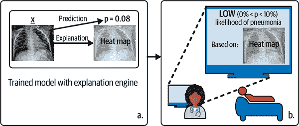

###### 图 7-1\. 本章中维持的假想使用案例。一个模型和事后解释引擎（a）传递预测和解释到一个可读的仪表板上。仪表板上的信息用于帮助医生诊断肺炎（b）。

# 概念复习：可解释模型和事后解释技术

在本节中，我们将讨论章节背后的基本思想。我们将从不使用代码处理的可解释模型开始。然后，在本章的事后解释部分，我们将在我们的模型上演示一些技术，并对该领域中的许多基础技术进行概述。这些技术主要可以分为两组：基于扰动的（通常在 DL 中为*遮挡*）和基于梯度的方法；我们将在接下来讨论这些类别之间的差异。我们还将强调如何将这些技术应用于模型调试和架构选择的问题。

## 可解释模型概述

如在第二章中提到的，可解释模型具有固有的可解释结构、特性或结果。此外，可解释模型存在于一个谱系上。有些可能直接向最终用户解释，而有些可能只对高技能的数据科学家有意义。可解释的 DL 模型显然处于解释谱系的更复杂一侧，但我们仍认为它们非常重要。正如我们将强调的，并且正如许多其他研究者所指出的那样，我们在 DL 中的事后解释必须非常小心。如果我们有一个可解释的模型，我们能够直接理解它，无需使用可疑的事后技术，我们还可以将事后解释的结果与模型的可解释机制进行比较，以测试和验证模型和解释。

## 遮挡方法

遮挡方法基于扰动、移除或遮蔽特征，并检查模型输出的变化。在计算机视觉中，这通常意味着遮蔽像素块。如在[“通过移除进行解释：模型解释的统一框架”](https://oreil.ly/6hGen)中讨论的，许多不同的解释技术可以追溯到这种特征遮挡的想法。

基于遮挡的技术，在梯度不可用时或者我们试图解释的模型是一个包括 ML、业务规则、启发式和其他不可微分组件的复杂决策流水线时尤为重要。所有基于遮挡的方法都必须应对同样的复杂情况：对于大多数模型，我们不能简单地移除特征并生成模型预测。换句话说，如果我们的模型是在特征`x1`、`x2`和`x3`上训练的，我们不能简单地为`x1`和`x2`传递值并期望它进行预测。我们需要为`x3`传递*某些*值。这个细节是许多不同基于遮挡的方法的核心所在。

## 基于梯度的方法

如在第二章中讨论的那样，模型输出对其参数的梯度可以用来构建局部解释。这是解释回归系数背后思想的一般化。请记住，梯度只是对我们的 ML 模型这种复杂函数的局部线性逼近。由于绝大多数 DL 架构都设计成可以使用基于梯度的优化器进行训练，我们几乎总是可以访问一些梯度，并且随着当代 DL 工具包的发展，评估梯度变得更加容易。这是使基于梯度的解释技术在 DL 中如此受欢迎的部分原因。然而，对于基于树的模型或复杂流水线，无法进行梯度计算的情况下，我们将不得不退而使用遮挡方法。

此类解释基本上问：“如果我们稍微改变哪些特征，会导致我们模型输出的最大变化？”研究人员已经针对这个主题开发了许多变体，以揭示微妙不同的解释方法。我们将在本章稍后详细介绍这些技术，包括输入*梯度、集成梯度和层内相关传播。

## 用于模型调试的可解释人工智能

在第六章，我们看到了模型解释技术如偏依赖图和 ICE 图如何揭示模型的不良行为，比如对训练数据中的噪声过于敏感。解释可以为深度学习（DL）模型服务，这可能是解释型人工智能（XAI）在 DL 中迄今为止的最高目标。DL 可解释性技术帮助调试和改进模型的能力已被著名研究人员多次提及。最著名的例子可能是[经典的 Google 博客文章](https://oreil.ly/5Qj0O)，该文章推广了神经网络“梦想”的概念。作者使用了来自[“深入卷积网络内部：可视化图像分类模型和显著性地图”](https://oreil.ly/5BqAj)的技术，通过要求模型展示哑铃的概念来调试他们的模型：

> 那里确实有哑铃，但似乎没有一张完整的哑铃图片是没有一个肌肉发达的举重运动员在旁边举起的。在这种情况下，网络未能完全提取出哑铃的本质。可视化可以帮助我们纠正这些训练中的错误。

DL 文献中作为调试工具的解释的一些额外例子包括以下内容：

+   [“深层网络高阶特征的可视化”](https://oreil.ly/vIG4Y)

+   [“可视化和理解卷积网络”](https://oreil.ly/aEkYG)

+   [“反卷积网络”](https://oreil.ly/NmiDE)

我们之所以将这些资源推荐给读者，有两个原因。首先，尽管本章中将探讨的流行的深度学习解释技术并非总是有效，但这些论文中的其他技术确实值得一试。其次，尽管解释技术在精确理解上可能会让我们失望，但它们仍然可以提示出模型中的问题。在阅读本章时，请考虑这一点。在第九章，我们将深入探讨如何应用基准测试、敏感性分析和残差分析来调试我们的深度学习模型。

# 可解释模型

我们将通过讨论适用于深度学习应用的可解释模型开始本章的技术部分，因为它们是我们目前在深度学习中获得可解释结果的最佳选择。但是，它们目前仍然不容易使用。读者将了解到，我们可以直接在应用程序中使用的现成可解释深度学习模型并不多。这与我们在第六章中看到的情况形成鲜明对比，那里我们可以选择从单调 XGBoost、可解释提升机器到广义线性模型（GLMs）和广义可加模型（GAMs）等丰富可解释的架构。那么区别在哪里？为什么现成的可解释深度学习模型如此之少？其中一个问题是，结构化数据的可解释模型可以追溯到 19 世纪高斯的工作，但深度学习并非如此。但这还有更多的问题存在。

当我们对非结构化数据训练深度学习模型时，我们实际上要求模型执行两个功能：第一个是特征提取以创建潜在空间表示，或学习在（通常是）低维输入空间中的数据的适当表示。其次，它必须使用该潜在空间表示进行预测。与我们在第六章中分析的表格数据相比，这就是一个明显的区别。对于表格数据，我们通常假定数据的“正确”表示已经在训练数据中，特别是如果我们已经正确选择了一组不相关的特征，并且这些特征与目标之间有已知的因果关系。这种差异（学习的特征与已提供的特征）有助于突显为什么可解释的深度学习模型如此难以开发，并且为什么现成的实现难以获得。

当今已存在的可解释 DL 架构中的共同特征是，它们直接干预特征学习。通常情况下，可解释模型将特征工程的负担从模型转移到模型开发者身上。这增加了负担，既是一种祝福也是一种诅咒。一方面，这意味着训练这些模型比训练不可解释模型更费力。另一方面，这些架构可能需要更高质量的、有时是专家标注的数据，这意味着人类在建模过程中深度参与。由于我们应该已经在设计我们的模型时考虑到这些架构的需求，这并不坏。正如我们在第六章中看到的，我们能够在我们的模型中编码更多领域专业知识，我们就能在实际世界中更加信任它们的性能。

在接下来的章节中，我们将讨论不同的可解释 DL 模型架构，同时将我们的主要关注点保持在图像分类问题上。我们将特别关注基于原型的架构的最新发展，这提供了真正可用的解释性图像分类的最有可能的路径。

## ProtoPNet 和其变种

在他们 2019 年的论文["这看起来像那样：用于可解释图像识别的深度学习"](https://oreil.ly/k69Dx)中，由辛西娅·鲁丁教授领导的杜克团队介绍了一种新的、有前景的解释性图像分类架构。这个新模型被称为*ProtoPNet*，它基于原型的概念。

请记住从第二章中得知，原型是代表较大观察组的数据点。考虑解释为什么一个观察被分组到*k*-means 聚类中的特定群集中。我们可以将观察与群集中心并排放置，并说，“嗯，这个观察看起来像那个群集中心。”ProtoPNet 生成了确切这种类型的解释。此外，ProtoPNet 的解释忠实于模型实际进行预测的方式。那么它是如何工作的呢？

首先，ProtoPNet 为每个类别识别出原型*patch*。这些 patch 捕捉了区分一个类别与另一个类别的基本特性。然后，为了进行预测，模型会在输入图像中寻找与特定类别原型相似的 patch。每个原型的相似性得分会被加在一起，从而产生输入属于每个类别的概率。最终的结果是一个模型，具有可加性（每个预测是跨原型图像部分相似性得分的总和）以及稀疏性（每个类别只有少数几个原型）。更重要的是，每个预测都立即伴随着一个忠实的解释。

###### 注意

ProtoPNet 建立在部分注意力模型的思想上，这是一类广泛的可解释深度神经网络，但本章未涵盖。这些模型与 ProtoPNet 之间的区别在于其信实性。ProtoPNet 通过将每个图像的某些补丁和某些类原型的相似性得分进行累加来进行预测。而其他部分级注意力模型则不提供这种保证。

自 2019 年发布以来，这种有前途的解释性图像分类方法已被其他研究人员采用。例如[ProtoPShare](https://oreil.ly/phO4I)，允许在类之间共享原型，从而减少原型的数量。还有[ProtoTree](https://oreil.ly/OKEp0)，它通过原型特征创建可解释的决策树。该架构允许模型更清晰地模仿人类推理。最后，Kim 等人在《“XProtoNet: Diagnosis in Chest Radiography with Global and Local Explanations”》中使用了一种与 ProtoPNet 非常相似的架构来分析胸部 X 射线。

## 其他可解释的深度学习模型

在《“Towards Robust Interpretability with Self-Explaining Neural Networks”》中，David Alvarez-Melis 和 Tommi S. Jaakkola 介绍了自解释神经网络（SENN）。正如我们讨论过的那样，在非结构化数据上创建可解释模型的一个困难是，我们要求我们的模型创建数据的潜在空间表示并进行预测。自解释神经网络通过引入可解释的基础概念来应对这一困难，而不是使用原始特征。这些基础概念可以作为模型训练的一部分学习，来自训练数据中的代表性观察结果，或者最理想情况下由领域专家设计。在他们的论文中，Alvarez-Melis 和 Jaakkola 使用自编码器生成这些可解释的基础概念，并确保所学习的概念通过提供最大程度表达该概念的原型观察结果而具有可解释性。

###### 注意

自编码器是一种类型的神经网络，它学习从训练数据中提取特征，而无需对单一建模目标进行预测。自编码器也非常适合数据可视化和异常检测。

到目前为止，我们主要关注于计算机视觉模型的技术。为了[强化学习](https://oreil.ly/PgthB)，[视觉推理](https://oreil.ly/wRYFJ)，[表格数据](https://oreil.ly/My88p)，和[时间序列预测](https://oreil.ly/qUUzF)，已经开发了可解释的深度神经网络模型。

# 训练和解释 PyTorch 图像分类器

在这个用例中，我们概述了如何训练图像分类器，然后演示了如何使用四种不同的技术生成解释：遮挡、输入*梯度、综合梯度和逐层相关传播。

## 训练数据

首先，我们需要建立一个用于诊断胸部 X 光图像的图像分类器，与图 7-1 中的假设用例一致。我们将用于训练的数据集可以从[Kaggle](https://oreil.ly/jfmsi)获取，它包含 5,863 张病人的 X 光图像，被分为两个明确的类别——一个包含肺炎，另一个正常。图 7-2 展示了从训练数据中随机选取的图像集合。

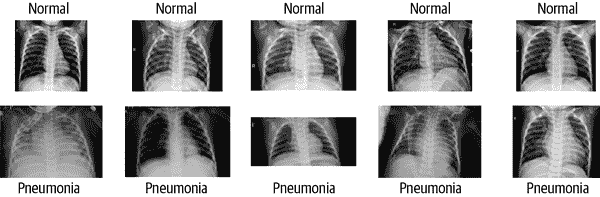

###### 图 7-2\. Kaggle 胸部 X 光数据集训练集样本的随机选择；患有肺炎的胸部 X 光片比没有肺炎的更模糊。

我们不是医生或放射科医生，承认我们的作者组没有医学领域的知识来真正验证这个模型是很重要的。根据我们的理解，来自肺炎患者的图像应显示感染区域的浑浊。细菌性肺炎和病毒性肺炎也倾向于具有不同的视觉特征。希望接下来的部分能够利用可解释的 AI 方法集中于这些浑浊区域，使我们能够理解为什么一个图像被分类为肺炎而不是正常。（准备好失望吧。）要了解更多关于数据集的信息，请参阅其[Kaggle 页面](https://oreil.ly/hAhUz)和相关论文，《“通过基于图像的深度学习识别医学诊断和可治疗疾病”》([“Identifying Medical Diagnoses and Treatable Diseases by Image-Based Deep Learning”](https://oreil.ly/SOcBD))。

###### 警告

如果我们在高风险的机器学习应用领域工作，*需要*专业领域知识来帮助训练和验证我们的模型。未咨询领域专家可能导致在高风险用例中部署有害或无意义的模型。

像大多数来自[Kaggle](https://oreil.ly/lOADp)的数据集一样，数据的大部分筛选工作已经完成。低质量的扫描已经被消除，标签也经过验证确认是正确的。然而，像许多医学应用中的数据集一样，这些数据存在类别不平衡的问题：有 1,342 个正常扫描，但有 3,876 个标记为显示肺炎的扫描。另一个令人担忧的问题是给定验证数据集中图像数量很少。验证数据集仅包含九张肺炎类别的图像和九张正常类别的图像。这些数量不足以充分验证模型，因此在进行模型训练之前我们将解决这个问题以及其他问题。

## 解决数据集不平衡问题

在我们的训练数据中，肺炎 X 光扫描比正常扫描多出三倍。任何在这样的数据集上训练的模型可能会过拟合到多数类别。有几种方法可以解决类别不平衡问题：

+   对少数类别进行过采样

+   对多数类别进行欠采样

+   修改损失函数以不同权重处理多数和少数类别。

这些技术以及类别不平衡问题的有害影响已在题为[“卷积神经网络中类别不平衡问题的系统研究”](https://oreil.ly/Gp-OY)的论文中得到了很好的总结。在这个例子中，我们将过采样正常图像以平衡类别不平衡。

## 数据增强和图像裁剪

[PyTorch](https://oreil.ly/Uagd2) 是一个开源的机器学习框架。[torchvision](https://oreil.ly/LaOh8) 是为了支持计算机视觉研究和实验而构建的 PyTorch 领域库。torchvision 包括一些流行的数据集、预训练的模型架构，以及一些用于计算机视觉任务的图像变换。我们首先通过将一些训练集图像移动到验证集来增加验证集的比例。之后，我们将使用 torchvision 的一些图像转换来处理训练集中的类别不平衡。在下面的代码片段中，我们将图像缩放到相同大小，然后应用各种转换来增加数据大小，并引入应增强我们模型鲁棒性的训练示例。`get_augmented_data`函数大量使用`RandomRotation`和`RandomAffine`转换来创建新的、修改后的训练图像，同时使用其他各种转换来格式化和归一化图像。

```
TRAIN_DIR = 'chest_xray_preprocessed/train'
IMAGE_SIZE = 224 # Image size of resize when applying transforms
BATCH_SIZE = 32
NUM_WORKERS = 4 # Number of parallel processes for data preparation

def get_augmented_data():

    sample1 = ImageFolder(TRAIN_DIR,
                          transform =\
                          transforms.Compose([transforms.Resize((224,224)),
                                              transforms.RandomRotation(10),
                                              transforms.RandomGrayscale(),
                                              transforms.RandomAffine(
                                                translate=(0.05,0.05),
                                                degrees=0),
                                              transforms.ToTensor(),
                                              transforms.Normalize(
                                                [0.485, 0.456, 0.406],
                                                [0.229, 0.224, 0.225]),
                                              ]))
...

return train_dataset
```

由于数据增强的基本思想是创建更多的图像，让我们来检查一下结果：

```
# check new dataset size
print(f'Normal : {normal} and Pneumonia : {pneumonia}')

(3516, 3758)
```

图 7-3 展示了使用旋转和平移生成的一些合成训练样本。

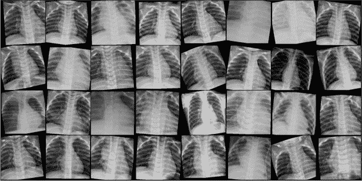

###### 图 7-3\. 使用旋转和平移生成的合成训练样本

看起来差不多了。处理了类别不平衡和数据增强后，我们将继续进行模型训练。

###### 警告

确保数据增强不会生成不现实的训练样本。胸部 X 光片会显示颜色尺度、缩放等变化。然而，围绕垂直轴翻转图像将是一个巨大的错误，因为我们的器官在左右两侧不对称。在部署后，这个模型将不会看到心脏位于右侧的胸部 X 光片，因此不应该使用垂直翻转的图像进行训练。

我们为数据集使用的另一种预处理技术是图像裁剪。我们对训练集中的一些图像进行了裁剪，以突出只有肺部区域（见图 7-4）。裁剪有助于消除胸部 X 光图像上的任何注释或其他类型的标记，并将模型集中在图像中感兴趣的区域。我们将这些图像保存为单独的数据集，以便在后续训练阶段对网络进行微调使用。

###### 警告

直到我们手动裁剪了数百张图像的练习，我们才注意到训练数据包含同一患者的多次扫描。因此，当我们将图像添加到验证数据时，我们必须确保在训练数据或验证数据中保留相同的患者，*但不同时存在*。这个细节是数据泄漏的一个很好的例子，强调了真正了解我们的数据的重要性。

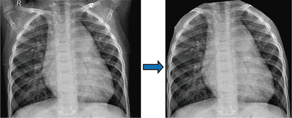

###### 图 7-4\. 胸部 X 光图像裁剪前后的图像

## 模型训练

[卷积神经网络（CNNs）](https://oreil.ly/bfzDc)是医学图像中常用的架构。图像分类的一些知名 CNN 的例子包括[ResNets](https://oreil.ly/2JqoN)、[DenseNets](https://oreil.ly/T3b0q)和[EfficientNets](https://oreil.ly/-AWuI)。从头开始训练一个 CNN 非常昂贵，无论是在数据还是计算时间上。因此，一个流行的技术是使用先前在大规模图像数据集上训练过的模型，例如[ImageNet](https://oreil.ly/8MHlU)，然后将该网络作为另一个任务的起点重用。

这种技术的核心思想是，CNN 中的低层次学习广泛适用的表示，如边缘和角落，可以推广到各种任务中。当我们为自己的任务使用 CNN 的层时，我们称之为*预训练*。另一方面，较高层次捕获的特征更高级且更具体于任务。因此，这些层的输出不适合我们的用例。因此，我们可以冻结在低层次学习的特征，并在称为*微调*的步骤中重新训练较高层次。预训练和微调共同构成了一种简单的[*迁移学习*](https://oreil.ly/tybad)形式，在这种形式中，ML 模型在一个领域学习的知识被用于另一个领域。

起初，我们将使用[DenseNet-121](https://oreil.ly/Wq743)架构，该架构在 ImageNet 数据集上训练。已经显示 DenseNet 模型在 X 光图像分类方面表现特别出色，因为它们[改善了信息和梯度在网络中的流动](https://oreil.ly/_fO24)，理想情况下增加了分类器的性能和泛化能力。

###### 警告

不要忘记关于[EvilModel](https://oreil.ly/UMwPx)。已经表明，恶意软件可以通过预训练的神经网络传递。这类恶意软件可能不会影响性能，并可能欺骗反病毒软件。（或者我们可能会懒得扫描我们的模型工件。）第五章的教训告诉我们，不要对我们从互联网下载的预训练模型抱有任何假设。

在执行迁移学习时，一个重要的问题是是否重新训练预训练模型的所有层或仅部分层。这个问题的答案在于数据集的组成。新数据集足够大吗？它是否类似于预训练模型所训练的数据集？由于我们的数据集较小且与原始数据集差异很大，因此重新训练一些较低层次和较高层次是有意义的。这是因为低层次学习相对通用的特征，而高层次学习更多特定于数据集的特征。在这种情况下，重新训练层次并不意味着从头开始或使用随机权重；相反，我们将利用预训练的权重作为起点，然后从那里继续。

在以下代码中，我们解冻预训练模型的所有层，并用我们自己的线性分类器替换最后一层。对于这个数据集，这种设置在测试数据上表现最佳。我们还尝试过仅解冻少数层，但它们都没有超过我们的第一种设置：

```
classes = ['Normal', 'Pneumonia']
model = torchvision.models.densenet121(pretrained=True)

# Unfreeze training for all "features" layers
for param in model.parameters():
    param.requires_grad = True

# New layers automatically have requires_grad = True
in_features = model.classifier.in_features
model.classifier = nn.Linear(in_features, len(classes))
```

最后，我们第二次对模型进行了微调，仅使用我们手动裁剪以便聚焦于肺部的图像。这种双重微调过程看起来是这样的：

1.  载入预训练的 DenseNet-121 模型。

1.  使用未裁剪图像对扩增数据集进行模型训练。

1.  冻结模型的早期层，并继续在裁剪图像上进行训练。

这个双重微调过程的理念是利用预训练模型学到的特征以及我们领域特定数据集中的特征。最后，使用裁剪图像进行最后一轮训练有助于减少模型使用那些不适用于未见数据的特征的风险，例如肺部之外的 X 光伪影。

## 评估与度量

在验证集上评估模型的性能。在表格 7-1 和 7-2 中，我们还报告了一些未见测试数据集上的性能指标。评估这种性能对于理解我们的模型是否会良好泛化至关重要。

表格 7-1. 显示肺炎分类器模型在测试数据集上的混淆矩阵

|  | 预测正常 | 预测肺炎 |
| --- | --- | --- |
| **实际正常** | 199 | 35 |
| **实际肺炎** | 11 | 379 |

表格 7-2. 测试数据集上的附加性能指标

|  | 流行率 | 精度 | 召回率 | F1 分数 |
| --- | --- | --- | --- | --- |
| **正常** | 234 | 0.95 | 0.85 | 0.90 |
| **肺炎** | 390 | 0.92 | 0.97 | 0.94 |

这里的性能看起来不错，但务必查看第九章以了解虚拟验证和测试测量可能会误导。现在是时候开始解释我们模型的预测了。

## 使用 Captum 生成事后解释

在本节中，我们将详细讨论一些事后技术，并展示它们在我们的肺炎图像分类器中的应用。生成的解释都是*局部*的，适用于单个观测——患者的单张 X 射线图像。此外，所有的解释都将以热图的形式呈现，其中每个像素的颜色意味着该像素对最终分类的重要性成比例。在接下来的章节中，我们将以批判的眼光检验这些方法是否实现了这一目标，但本节的目的首先是展示各种技术可能产生的输出类型。

要实现不同的技术，我们将使用[Captum](https://oreil.ly/RjBoD)。Captum 是一个建立在 PyTorch 上的模型解释库，支持多种模型的开箱即用。它提供了许多解释算法的实现，这些算法与各种 PyTorch 模型良好地配合。

### 遮挡

[遮挡](https://oreil.ly/rdX1o)是一种基于扰动的方法，其工作原理很简单：从模型中删除特定的输入特征，并评估在移除前后模型预测能力的差异。更显著的差异意味着该特征很重要，反之亦然。遮挡涉及替换输入图像的某些部分，并检查对模型输出的影响。通常通过在图像上滑动预定义大小和步幅的矩形窗口来实现。然后，将该窗口替换为每个位置的基线值（通常为零），从而产生灰色补丁。当我们在图像上滑动这个灰色补丁时，我们遮蔽了图像的部分，并检查模型在修改后数据上进行预测时的信心或准确性。

Captum 文档描述了其对[遮挡](https://oreil.ly/R5C2N)的实现，并将其应用于单个输入图像的胸部 X 射线案例研究。请注意，我们可以指定遮挡窗口的大小以及步幅的大小，在我们的情况下分别为 15 × 15 和 8：

```
import captum, Occlusion
from captum.attr import visualization as viz

occlusion = Occlusion(model)

attributions_occ = occlusion.attribute(input,
                                       target=pred_label_idx,
                                       strides=(3, 8, 8),
                                       sliding_window_shapes=(3,15, 15),
                                       baselines=0)
```

在图 7-5 中，我们展示了测试集中一幅显示肺炎的图像的归因，该图像被模型正确分类为*肺炎*。

结果看起来很有希望。模型似乎已经捕捉到了两个肺部上部区域的高不透明度。这可能会让解释专家对模型的分类产生信心。然而，暗区域很大且缺乏细节，这表明较小的遮挡窗口和步长可能会显示更多细节。（我们犹豫不决是否尝试不同的设置，因为一旦我们开始调整这些解释的超参数，就会面临这样的风险，即我们可能只选择那些确认我们对模型如何工作的先前信念的值。）

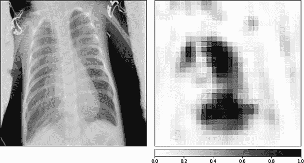

###### Figure 7-5\. 阻塞热图是测试集中肺炎 X 光图像的一个示例，正确预测显示有肺炎

除了这个调整问题外，解释还显示模型关注躯干边界外一些像素组。这是否是我们模型的问题，也许表明过拟合；训练和测试数据之间的数据泄露；或者[捷径学习](https://oreil.ly/xv-OQ)？或者这是解释技术本身的产物？我们只能左右思考。让我们看看基于梯度的方法是否能提供更多的清晰度。

###### 警告

捷径学习是复杂模型中常见的问题，可能会破坏我们的实际结果。当模型在 ML 任务中学习某些比实际预测目标更容易的东西时会发生这种情况，实质上在训练期间欺骗自己。由于从图像进行医学诊断可能是一项费时的任务，即使对于经验丰富的人类从业者而言，ML 系统通常也会找到帮助其在训练数据中优化损失函数的捷径。当这些学习到的捷径在真实世界的诊断场景中不可用时，这些模型就会失败。要了解更多关于医学图像中的捷径学习，请查看[“应用于胸部 X 光片的深度学习：利用和预防捷径”](https://oreil.ly/oVT-G)。要了解这个困扰几乎所有无法解释 ML 的严重问题的一般背景，请查看[“深度神经网络中的捷径学习”](https://oreil.ly/ogNeg)。

### 输入 * 梯度

我们将首先看一下基于梯度的方法，这是输入 * 梯度技术。顾名思义，输入 * 梯度创建了一个局部特征归因，它等于预测相对于输入的梯度，乘以输入值本身。为什么这样做？想象一个线性模型。梯度和输入值的乘积分配了一个局部特征归因，它等于特征值乘以特征系数，这对应于特征对特定预测的贡献。

这次我们使用 Captum 为同一测试集图像生成了一个热图，使用了输入 * 梯度技术。在图 7-6 中，我们展示了分类的 *正面* 证据。


###### Figure 7-6\. 输入 * 梯度热图是测试集中肺炎 X 光图像的一个示例，正确预测显示有肺炎

有关此输出的评论？就像在遮挡物上一样，我们可以凝视图像并辩称它表达了某种有意义的东西。特别地，在肺部有一个暗斑点，显示出高证据，似乎对应左侧胸部 X 射线上的高不透明度。这是我们期望并希望从我们的肺炎分类器中得到的行为。然而，解释技术还表明，患者脊柱的长度也包含肺炎高证据区域。我们留下了早些时候提出的相同问题。这是否告诉我们模型正在关注错误的东西，即捷径？这将使这个模型调试的输出变得有用。另一方面，我们仍然不知道解释技术本身是否是不直观结果的源头。

### 综合梯度

[综合梯度](https://oreil.ly/Er6tk)是我们将考虑的第一种具有一些理论保证的技术。仅仅依靠梯度可能是误导性的，特别是因为对于一些高置信度的预测，梯度趋向于零。对于高概率结果，输入特征可能导致激活函数达到高值，使得梯度饱和、平坦且接近于零。这意味着如果我们仅看梯度，某些决策中最重要的激活函数将不会显示出来。

综合梯度试图通过测量相对于基线值的特征影响来修复此问题，跨所有可能的输入像素强度值。特别地，综合梯度问：“当我们从基线输入像素强度值穿过路径到更大的输入像素强度值时，梯度如何变化？”最终的特征归因是梯度在这条像素值平滑路径上的近似积分，作为模型预测函数的一部分。

综合梯度满足敏感性和实现不变性的公理。敏感性意味着如果输入图像和基线图像仅在一个特征上有所不同，并且它们返回不同的模型输出，则综合梯度将为该特征返回非零归因。实现不变性表示如果两个模型，可能具有不同的内部结构，对所有输入都返回相同的输出，则综合梯度返回的所有输入归因将相等。实现不变性是从第二章讨论*一致性*的另一种方式。有关这个主题的良好介绍，请查看 TensorFlow 对综合梯度的介绍。

在图 7-7 中，我们展示了相同肺炎图像上这种归因技术的输出。像输入*梯度的输出一样，图像是嘈杂且难以解释的。看起来这种方法正在捕捉输入图像中的*边缘*。除了 X 光机标记和腋窝外，我们还可以看到热图中病人肋骨的微弱轮廓。这是因为模型正在忽略肋骨，窥视肺部周围吗？这些输出似乎带来更多问题而不是答案。在本章后面，我们将通过一些实验来批判性地评估这些解释输出。现在，我们将转向第四种也是最后一种技术，另一种基于梯度的方法，即分层相关传播。

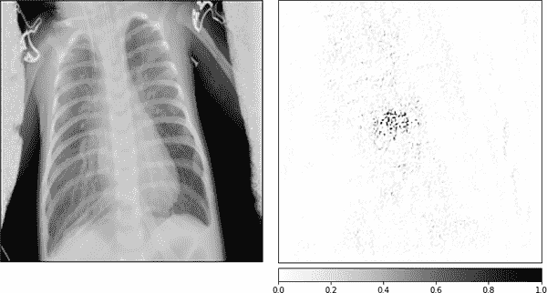

###### 图 7-7\. 在测试集中，正确预测显示肺炎的肺部 X 光图像的集成梯度热图

### 分层相关传播

[分层相关传播（LRP）](https://oreil.ly/xGtUm)实际上是一类衡量特征对输出*相关性*的方法。广义上讲，相关性是输入特征与模型输出之间连接的强度，可以在不对输入特征进行任何更改的情况下进行测量。通过选择不同的相关性概念，我们可以得到多种不同的解释输出。对于对 LRP 更深入了解的读者，我们推荐阅读 Samek 等人编著的《可解释 AI：深度学习的解释、解释和可视化》一书中的章节“分层相关传播概述”。在那里，您将找到对不同相关性规则及其适用时机的全面讨论。[可解释 AI 演示仪表板](https://oreil.ly/wcIVJ)还允许您使用各种 LRP 规则生成解释输出。

LRP 的好处在于它生成的解释在局部上是准确的：相关性分数的总和等于模型输出。在这方面它类似于 Shapley 值。让我们看一下图 7-8 中我们测试集图像的 LRP 解释。不幸的是，它在生成人类可验证的解释方面仍然有很大的提升空间。

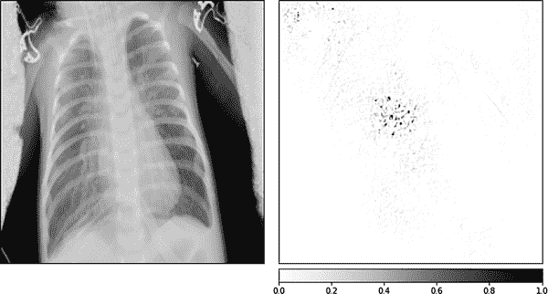

###### 图 7-8\. 在测试集中，正确预测显示肺炎的肺部 X 光图像的 LRP 热图

像其他技术一样，LRP 已经捕捉到右肺中较高不透明度区域，但它也将高归因分数给了肺部外的区域。

## 评估模型解释

在前面的章节中，我们只是浅尝辄止地探讨了 DL 模型的解释归因方法。这些技术种类繁多且不断增长。在本节中，我们将探讨一个重要问题：“我们如何知道我们的解释是否合理？”然后，我们将进行实验，批判性地检验后续技术对我们的 CNN 模型提供了多少信息。

David Alvarez-Melis 和 Tommi S. Jaakkola 在他们的两篇 2018 年论文中，对评估解释问题进行了很好的探讨，分别是 [“关于解释性方法的鲁棒性”](https://oreil.ly/KRcmm) 和 [“自解释神经网络的鲁棒解释性”](https://oreil.ly/gUWIR)。在第二篇论文中，Alvarez-Melis 和 Jaakkola 提出了解释应该具备的三个理想特性：

+   解释应该易于理解（明确性/可理解性）。

+   它们应该指示真正重要的内容（忠实性）。

+   它们应该对输入的微小变化不敏感（稳定性/鲁棒性）。

我们在本章中检查过的热图技术显然在第一点上表现不佳。首先，这些技术的输出嘈杂且令人困惑。更重要的是，我们调查的所有技术似乎都指向了荒谬的区域，例如患者体外的空间。

即使输出完全符合我们的直觉，这些热图仅表明模型在哪里找到正面或负面证据支持其分类；它们没有提示模型基于提供的信息做出决策的方式。这与可解释模型（如 SENN 或 ProtoPNet）形成对比，后者既提供“在哪里”的原型或基本概念，又提供“如何”的线性组合。如何是一个好解释的关键元素。

###### 注意

我们应始终在高风险应用中测试我们的解释方法。理想情况下，我们应该将后续解释与底层可解释模型机制进行比较。对于更标准的 DL 方法，我们可以使用以下方法：

+   领域专家和用户研究测试可理解性。

+   去除被视为重要的特征，最近邻方法或标签重排以测试忠实性。

+   扰动输入特征以测试鲁棒性。

使用 [“自解释神经网络的鲁棒解释性”](https://oreil.ly/PtR5u) 和 [“评估深度神经网络学到了什么可视化的方法”](https://oreil.ly/sQDv5) 作为参考资料。

忠实度通常通过遮盖或删除被认为重要的特征，并计算分类器输出的变化来测试。Alvarez-Melis 和 Jaakkola 表明，在不同的技术和数据集中，解释的忠实度存在广泛的差异，Shapley 添加性解释和其他一些方法表现相当糟糕。我们还可以使用最近邻方法，其中类似的输入观察应具有类似的解释，来评估忠实度。在下一节中，我们还将检验解释中的忠实度——但我们将尝试不同的方法。

要检验鲁棒性（或稳定性），Alvarez-Melis 和 Jaakkola 稍微扰动输入图像，并测量解释输出的变化。武装了一个定量指标后，他们比较了多种事后方法在多个数据集上的表现。结果显示，他们研究的大多数事后技术对输入的微小变化不稳定。局部可解释的模型无关解释（LIME）表现特别糟糕，而集成梯度和遮挡方法在所研究的技术中表现出最好的鲁棒性。在所有这些评估维度——可理解性、忠实度和鲁棒性——自解释神经网络等可解释模型胜过事后技术。

## 事后解释的鲁棒性

在本节中，我们部分复制了 [“Saliency Maps 的健全性检查”](https://oreil.ly/v6qlw) 中令人震惊的不忠实结果。在那篇论文中，作者们关心的问题是：“这些事后解释方法生成的输出实际上是否告诉我们模型的任何信息？”正如我们将在这个实验中看到的那样，有时结果是一个明确的“不”。

为了开始我们的实验，我们训练了一个无意义的模型，其中图像具有随机标签。在 图表 7-9 中，我们可以看到对于一个新模型的高训练损失和低准确率曲线，该模型是在图像标签已随机排列的数据集上训练的。对于这个实验，我们没有进行任何数据增强来处理类别不平衡。这解释了为什么验证数据的准确率收敛到大于 0.5 的值——该模型偏向于多数类（肺炎）。

现在我们有一个模型，该模型经过无意义标签的训练。我们新模型生成的预测结果不可能比（加权的）抛硬币更好。为了原始解释有意义，我们希望*这些*解释不会捕捉到相同的信号。图表 7-10、7-11 和 7-12 分别显示了我们测试集图像的解释，这些解释是在训练过的模型上生成的，该模型是在随机打乱的数据上训练的，由输入 * 梯度、集成梯度和遮挡方法产生。

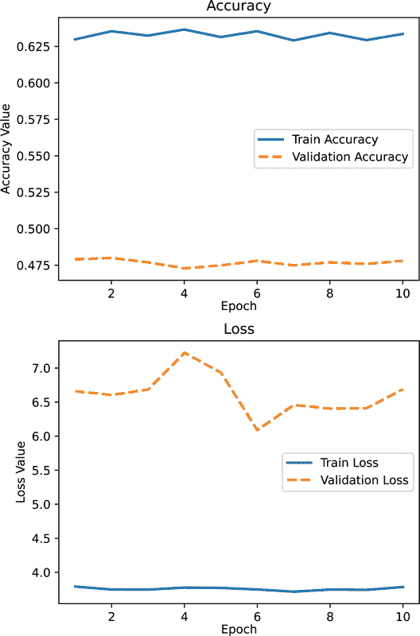

###### Figure 7-9\. 在标签被随机重排的数据上训练时的模型性能（[数字，彩色版本](https://oreil.ly/-uCIY)）

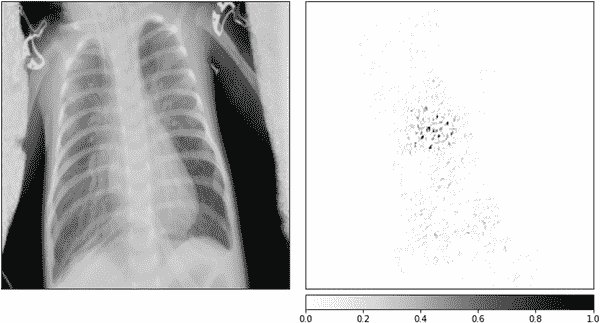

###### Figure 7-10\. 随机重排类标签后的输入 * 梯度热图

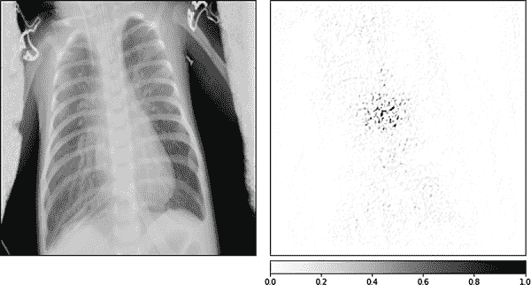

###### Figure 7-11\. 随机重排类标签后的集成梯度热图

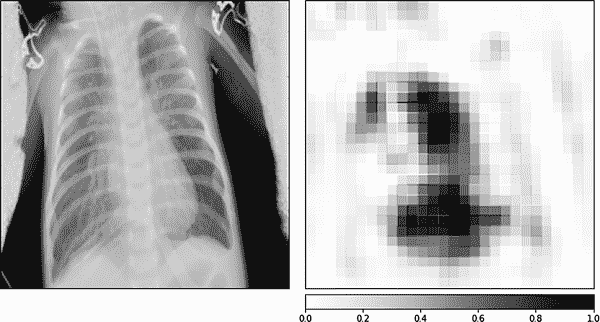

###### Figure 7-12\. 随机重排类标签后的遮挡热图

在我们看来，这些结果与前几节的结果惊人地相似。在所有的图像中，这些技术再次突出显示了图像中无关的区域，如患者的脊柱和其躯干的边界。更糟糕的是，这些归因地图在肺部内部看起来与它们之前的结果非常相似。它们捕捉到了患者肋骨的轮廓和高密度区域。之前，我们解释这意味着模型可能基于肺部炎症特定区域生成其肺炎预测。然而，这个实验显示，这些方法将为一个在零有意义信号训练的模型展示相同的解释。我们的解释究竟忠实于什么？我们不确定。

为了进一步检验我们解释的鲁棒性，我们进行了一个简单的实验，即向输入图像添加随机噪声。这可以通过 torchvision 中的自定义转换轻松完成。然后，我们检查这些输入上的解释，并将它们与先前的解释进行比较。噪声的量调节得当，使得图像的预测类在添加噪声组件之前和之后保持不变。

我们真正想要理解的是，结果解释是否对添加随机噪声具有鲁棒性。简言之，情况复杂；请参见图 7-13、7-14 和 7-15。新的归因地图与在原始模型上生成的地图明显不同，但似乎保留了对肺部内高密度区域的关注。

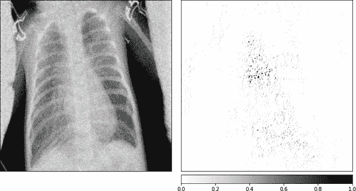

###### Figure 7-13\. 添加随机噪声后的输入 * 梯度热图

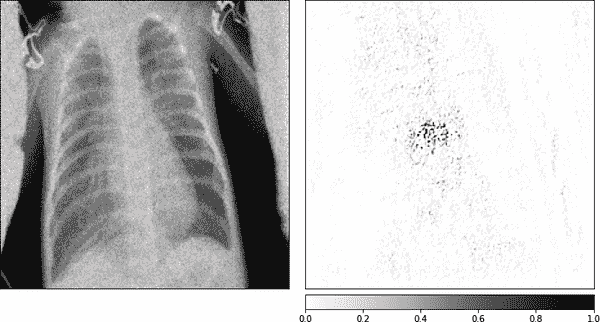

###### Figure 7-14\. 添加随机噪声后的集成梯度热图

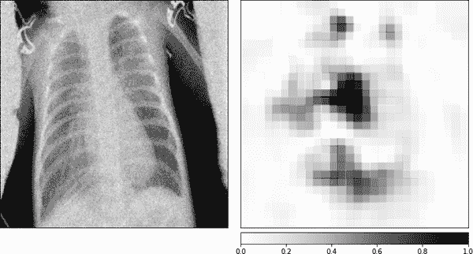

###### Figure 7-15\. 添加随机噪声后的遮挡热图

查看例如图 7-15 中的遮挡热图。之前我们说过，令人鼓舞的是遮挡似乎已经捕捉到了肺部内较高密度的区域。在添加了随机噪声后，我们仍然看到焦点集中在肺部左上和右上方。然而，噪声的添加已经使得遮挡输出更多地强调了靠近颈部的区域。基于梯度的技术输出同样受到了干扰，但仍然保留了对右肺中部的强调。

在[“检验显著性图的健全性”](https://oreil.ly/fTeRb)中，作者指出了对我们在这些实验中看到的结果可能的解释：这些归因技术实际上正在执行*边缘检测*。也就是说，无论模型训练和架构如何，这些归因方法都能够检测到输入图像中的边缘，其中梯度几乎总是显示出急剧变化。这可以解释我们一直观察到的对肋骨轮廓的强调，以及对躯干边界区域的强调。如果不清楚的话，*检测边缘并不是模型解释，并且可以在不使用深度学习的情况下轻松完成*。

# 结论

底线是，事后解释通常很难解释，有时毫无意义。更糟糕的是，解释技术的多样性意味着，如果我们不小心，我们将会陷入确认偏见，并最终选择与我们对模型行为的先前信念相符的那个解释。我们同情——在深度学习背景下构建可解释模型确实非常困难。但本章显示，事后解释可能只是对理解的一种危险*错觉*，因此并不总适用于解释高风险决策。

我们建议不要仅仅依赖事后技术来解释在高风险应用中的深度学习模型。最多，这些技术可以作为有用的模型调试工具。我们将在第 9 章中更详细地讨论这个话题。相反，当我们需要忠实、稳健和可理解的解释时，我们应该努力使用*可解释模型*。如果以后需要，我们总是可以在这种更为稳健的模型可解释性基础上构建事后解释的可视化，并且我们将能够检查事后可视化是否与底层模型机制一致。

在可解释的 DL 模型方面存在鼓舞人心的前沿，用于图像分类和其他任务。原型基础的案例推理模型，如[ProtoPNet](https://oreil.ly/yjIuQ)，以及稀疏附加深度模型，如[SENN](https://oreil.ly/yZHHT)，为可解释的 DL 提供了前进的路径。然而，现成的可解释模型并不广泛适用于 DL 应用。它们通常对我们的数据和建模专业知识提出更高要求。我们鼓励读者将这视为一个特性，而非一个错误。AI 系统的开发*应该*需要高质量、经过精心策划的数据。模型*应该*是问题特定的，并且编码了最大的领域知识。

当他们说时，我们同意[“目前在健康护理中关于可解释人工智能的方法的虚假希望”](https://oreil.ly/-w598)的作者：

> 在缺乏合适的可解释性方法的情况下，我们主张通过严格的内部和外部验证 AI 模型，作为实现通常与可解释性相关目标的更直接手段。

在接下来的两章中，我们将建立在我们在这里和在第六章中讨论的技术基础上，以解决更广泛的*模型调试*问题。

# 资源

代码示例

+   [Machine-Learning-for-High-Risk-Applications-Book](https://oreil.ly/machine-learning-high-risk-apps-code)

深度学习工具的透明度

+   [AllenNLP Interpret](https://oreil.ly/_tAvm)

+   [Aletheia](https://oreil.ly/UMfWK)

+   [Captum](https://oreil.ly/F5Obo)

+   [cleverhans](https://oreil.ly/efN16)

+   [DeepExplain](https://oreil.ly/u4Mfu)

+   [deeplift](https://oreil.ly/S29jk)

+   [deep-visualization-toolbox](https://oreil.ly/ZH3JU)

+   [foolbox](https://oreil.ly/DFSu0)

+   [L2X](https://oreil.ly/S2Ppj)

+   [tensorflow/lattice](https://oreil.ly/M7aYY)

+   [lrp_toolbox](https://oreil.ly/kKk09)

+   [tensorflow/model-analysis](https://oreil.ly/5Aeqe)

+   [ProtoPNet](https://oreil.ly/ZmqWq)

+   [tensorflow/tcav](https://oreil.ly/7RvqS)
