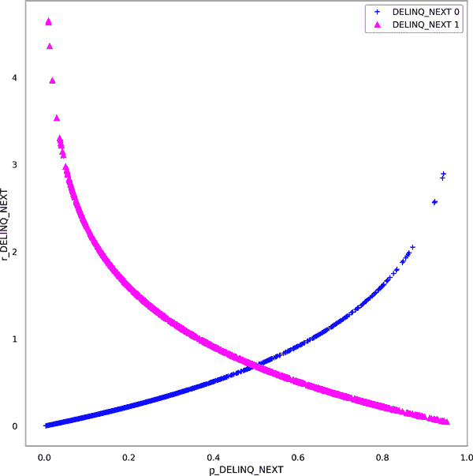

# 第八章：选择和调试 XGBoost 模型

数据科学家衡量模型在现实世界表现的方式通常是不充分的。据谷歌及其他领先的机器学习研究机构的 40 位研究人员在《“Underspecification Presents Challenges for Credibility in Modern Machine Learning”》中指出，“当 ML 模型在实际应用中部署时，其表现通常会出现意外的差异”。一个根本性问题在于，我们衡量性能的方式就像我们在撰写研究论文一样，无论部署场景多么复杂且高风险。像准确率或曲线下面积（AUC）这样的测试数据测量并不能告诉我们有关公平性、隐私性、安全性或稳定性的多少。这些对静态测试集的简单预测质量或错误测量对风险管理而言并不够信息化。它们只与实际表现相关，并不能保证在部署中表现良好。简言之，我们应更关注体内表现和风险管理，而非体外测试数据性能，因为 ML 实践的主要推动力之一是在现实世界中做出良好的决策。

本章将介绍一些超越传统模型评估的方法，以选择更好地泛化的模型，并将模型推向极限以发现隐藏的问题和故障模式。该章节从概念复习开始，提出了一个增强的模型选择过程，然后专注于模型调试练习，这些练习更好地模拟现实世界的压力，以及使用残差分析揭示模型错误的敏感性分析和测试。模型调试的总体目标是增强对模型在现实世界中性能的信任，但在此过程中，我们还将增强模型的透明度。本章附带的代码示例可在[在线](https://oreil.ly/machine-learning-high-risk-apps-code)获取；第九章处理图像和非结构化数据的调试，而第三章则广泛涵盖了模型调试。

# 概念复习：调试机器学习

如果读者还没有注意到，我们更关注体内表现，而不是体外表现。体内表现对用户很重要；而体外表现则无关紧要。以这一核心原则为指导，我们将涵盖模型选择、敏感性分析测试、残差分析以及修正（即修复）模型。

## 模型选择

传统上，我们通过选择特征和选择超参数来选择模型。我们尝试使用诸如逐步回归、特征重要性测量或 L1 正则化等方法找到最佳特征集。我们通常使用网格搜索来找到我们机器学习模型的最佳超参数设置。在第二章，我们采用了一种更为深思熟虑的方法，从线性模型基准开始，引入非线性和交互作用到我们的模型中，然后使用人为判断选择我们最喜欢的模型。在本章中，我们将看到，对于超参数选择，随机网格搜索在小数据集上尤为棘手，特别是当我们将其与灵感来自[“KDD-Cup 2004: Results and Analysis”](https://oreil.ly/osrK4)的更复杂的交叉验证排名程序进行比较时。我们将比较模型性能在多个验证折叠和多个不同传统评估指标中的排名，以更好地估计体内性能并选择更好的模型。我们还将强调如何估计模型的业务价值——这是一个至关重要的考虑因素。商业世界中没有人想要部署会赔钱的模型！

## 敏感性分析

因为机器学习模型往往以复杂的方式进行外推，除非我们明确在不同类型的数据上进行测试，否则我们不会真正知道我们的模型在未见数据上的表现如何。这就是我们试图通过敏感性分析来做的事情。广义上讲，敏感性分析告诉我们我们的模型在不同类型数据上是否稳定。敏感性分析可能会显示我们的模型存在鲁棒性问题，即在数据漂移下失败。它可能会显示我们的模型存在可靠性或弹性问题，即某些类型的输入导致我们的模型表现出令人意外或不合适的方式。关于敏感性分析，有许多结构化方法。如果读者想要了解更多信息，我们建议探索与[PiML](https://oreil.ly/84KCZ)或[SALib](https://oreil.ly/Kgnmg)相关的资源。

在本章中，我们将重点介绍另外两种相关的敏感性分析方法，它们似乎对从业者最直接有用：应力测试和对抗样本搜索。应力测试大致与测试鲁棒性对齐，而对抗样本搜索则探索可靠性和弹性问题：

应力测试

压力测试是一种全局扰动方法，用于在可预见的紧张环境中测试模型。当我们对模型进行压力测试时，我们将改变验证数据以模拟经济衰退条件，并查看它是否在这些可预见的困难条件下保持稳健。这个想法是使我们的模型能够应对可预见的情况，或者至少为可能维护模型的人员记录预期的性能下降，当经济衰退或其他类型的领域转变发生时。¹ 我们将对单一模型进行一种不那么严格的分析，但思路是一样的：测试我们的模型在可预见的概念或数据漂移（如经济衰退）下的表现，以确保我们为最有可能的失败做好准备。

对抗性示例搜索

对抗性示例搜索是一种局部扰动方法，有助于揭示模型可靠性和潜在安全漏洞（即韧性问题）中的局部逻辑缺陷。对抗性示例是数据行，会导致复杂机器学习模型产生奇怪的响应。有时我们可以手工制作这些行，但通常我们需要搜索它们。在本章中，我们将通过扰动或改变某些数据行中重要特征的值来搜索它们，并检查此变化如何影响模型性能。搜索本身以及我们发现的个别对抗性示例都是有用的。搜索创建一个响应表面，显示模型在许多有趣输入值上的性能，并经常揭示模型性能的逻辑缺陷。我们发现引发奇怪响应的个别行很好地记录并与安全同事分享，以便模型监控能够检测已知的对抗性示例。

在深度学习中，数据科学家倾向于使用梯度信息和生成对抗网络（GANs）来创建对抗性示例。在结构化数据任务中，我们必须使用其他方法，比如[“表格数据的对抗攻击：应用于欺诈检测和不平衡数据”](https://oreil.ly/KF843)中描述的基于个体条件期望的启发式方法或遗传算法。我们将在“对抗性示例搜索”中追求一种启发式方法，既能找到对抗性示例，又能探索我们模型的响应表面以寻找问题。

在本章中我们没有处理的最重要的方法是随机攻击，或者简单地将我们的模型或 API 暴露给大量随机数据，并查看出现什么样的问题。如果我们不知道从哪里开始进行敏感性分析，我们首先尝试随机攻击。然后我们尝试 PiML、SALib 和接下来章节中将提出的方法。无论我们如何实施敏感性分析，关键是针对我们发现的问题采取行动。我们通常使用数据增强、业务规则、正则化、约束和监控来解决敏感性问题。

## 残差分析

残差分析是模型调试的主要方法。这是对在训练数据中出现的建模错误或其他标记数据进行仔细研究，用于测试和调试的目的。尽管读者可能熟悉传统线性模型的残差分析，但它同样适用于机器学习模型。基本思想与线性模型相同。良好的模型应该具有大部分是随机误差。当我们检查我们的机器学习模型中的误差并出现强烈模式时，这很可能意味着我们遗漏了某些内容或在建模过程中出现了错误。然后我们必须动用我们的大脑来尝试解决问题。在本章中，我们将集中讨论三种主要的残差分析方法——残差图、分段误差分析和建模残差：

残差图

我们将对整个模型的残差图进行检查，然后按特征和水平分解这些图。我们将试图回答以下问题：哪些行造成了最大的误差？在残差图中是否看到任何强烈的模式？我们能够将任何模式孤立到特定的输入特征或特征的级别吗？然后我们将设法思考如何修复我们发现的任何问题。

分段误差分析

在部署模型之前，我们不应该忽视其在训练或测试数据的主要段上的表现。如果不这样做，可能会对整体模型性能和算法歧视产生严重后果，尤其是当模型在历史上被边缘化的人群中表现不佳时。本章节将重点关注性能方面，并研究除人口统计分段外的其他类型的段。我们这样做是因为通常用于整个数据集的平均评估指标可能会掩盖对小但重要的子群体的不良表现。训练数据的稀缺性也可能导致在某些段上表现几乎随机。分段误差分析也被提出作为对欠规范问题的一种体外测试。所有这些问题——在小段上的性能不佳、在训练数据稀疏区域的随机性能以及欠规范——都可能导致在部署模型后出现不愉快的意外和严重问题。在 PiML 中实施的分段误差分析的一个很酷的扩展是检查各个段的过拟合情况。这样做可以突显会影响体内模型的其他问题。

建模残差

学习残差中的模式的另一种方法是对其进行建模。如果我们能够将一个简单直观的模型拟合到另一个模型的残差中，那么，几乎可以说，残差中存在强烈的模式。而且，建模残差意味着我们可以减少它们。我们拟合到残差的模型还应该帮助我们修复发现的错误。例如，我们将为我们模型的残差拟合一个决策树。然后，我们将检查该树的规则，因为这些规则描述了我们的模型通常出错的情况。我们将尝试理解这些规则，以尝试解决它们突出的问题。

与敏感性分析一样，我们无法在一章中涵盖所有机器学习中进行残差分析的重要方法。一些最显著的方法包括发现非鲁棒特征的方法，例如 Shapley 值对模型损失的贡献。请参阅第三章，了解更广泛的机器学习残差分析概述。

## 补救措施

一旦发现问题，我们就需要解决它们。坏消息是，机器学习中很多问题源于低质量、偏见数据的使用以及确认偏见。对于大多数项目来说，这将涉及到接受两个难以忍受的现实：（1）收集更好的数据，至少考虑一些实验设计，和（2）回到起点，重新定义我们的实验，更好地遵循科学方法，以减少我们建模工作流中的人为、统计和系统性偏差。

一旦我们的工作流中解决了严重的数据、方法论或偏见问题，我们就可以尝试一些技术修复我们模型的方法，正如我们在本章中所做的那样。例如，我们可以应用单调约束、交互约束或正则化到我们的模型中，以稳定它们，使它们更具逻辑性和可解释性，并提高在实际应用中的性能。我们可以应用业务规则，有时也称为*模型断言*，或手动预测限制来修复可预见的不良结果。业务规则和模型断言归结为向我们的评分引擎添加代码，以更改我们认为将会出错的预测。我们可以编辑我们模型的公式或生产代码，以纠正问题建模机制或预测，并且一旦部署了模型，我们可以管理和监控它们，以快速发现异常。

对于本章中的模型，我们希望通过表达我们模型结果的假设，主要通过单调约束和非常严格的模型选择来遵循科学方法，如下一节所讨论的。我们将对模型应用敏感性和残差分析，以发现错误，并且我们将尽力在“修复所选模型”中解决这些错误。

# 选择更好的 XGBoost 模型

虽然从技术上讲这不是调试，但我们希望从选择一个高度稳定、通用且有价值的模型开始我们的调试练习。为了做到这一点，我们不仅仅依赖于网格搜索。相反，我们将选择一种模型，灵感来自于 2004 年数据库知识发现（KDD）杯中使用的[Caruana et al. 交叉验证排名方法](https://oreil.ly/kJT7d)。我们还将这些结果与标准的随机网格搜索进行比较，以便了解网格搜索与本节描述的交叉验证排名过程之间的差异。然后，在进行敏感性分析之前，我们将对模型的商业价值进行基本估算，以确保我们不会浪费金钱。

###### 注意

根据理查德·费曼的说法，作为科学家，我们有责任进行“一种倾向于的倾斜”，以确保我们不会欺骗自己和他人。如果这种模型选择方法看起来有些过分，可以把它看作是为了尽力找到最好的模型而做出的努力。

首先，我们开始模型选择过程是将验证数据分为五折。然后我们选择五个相关的性能指标来应用到每个折叠上。这些指标应该测量性能的不同方面，比如 AUC 用于衡量跨阈值的排名能力，准确度用于衡量在一个阈值上的正确性。在我们的情况下，我们将最大准确度，AUC，最大 F1 统计量，对数损失和均方误差（MSE）作为我们的五个指标。我们选择过程的第一步是计算每个折叠上每个不同统计量的值。以下代码片段就是在做这件事：

```
eval_frame = pd.DataFrame() # init frame to hold score ranking
metric_list = ['acc', 'auc', 'f1', 'logloss', 'mse']

# create eval frame row-by-row
for fold in sorted(scores_frame['fold'].unique()): # loop through folds
    for metric_name in metric_list: # loop through metrics

        # init row dict to hold each rows values
        row_dict = {'fold': fold,
                    'metric': metric_name}

        # cache known y values for fold
        fold_y = scores_frame.loc[scores_frame['fold'] == fold, target]

        # first columns are not for scores
        for col_name in scores_frame.columns[2:]:

            # cache fold scores
            fold_scores = scores_frame.loc[
                scores_frame['fold'] == fold, col_name]

            # calculate evaluation metric for fold
            # with reasonable precision

            if metric_name == 'acc':
                row_dict[col_name] = np.round(
                    max_acc(fold_y, fold_scores), ROUND)

            if metric_name == 'auc':
                row_dict[col_name] = np.round(
                    roc_auc_score(fold_y, fold_scores), ROUND)

            if metric_name == 'f1':
                row_dict[col_name] = np.round(
                    max_f1(fold_y, fold_scores), ROUND)

            if metric_name == 'logloss':
                row_dict[col_name] = np.round(
                    log_loss(fold_y, fold_scores), ROUND)

            if metric_name == 'mse':
                row_dict[col_name] = np.round(
                    mean_squared_error(fold_y, fold_scores), ROUND)

        # append row values to eval_frame
        eval_frame = eval_frame.append(row_dict, ignore_index=True)
```

一旦我们获得每个模型在每个折叠上的性能指标，我们就会进入选择过程的第二步，即对每个模型在每个折叠和每个测量上的性能进行排名。以下代码就是进行排名的过程。我们的搜索包括 50 个不同的 XGBoost 模型，并且我们使用五个性能指标对它们进行测试，每个模型测试五个折叠。对于每个折叠和指标，我们按照当前指标将模型从第一到第五十进行排名，允许出现并列情况。我们将每个折叠和指标上的平均排名最低的模型视为适用于体内使用的最佳模型。可以将其想象为给 50 名学生做测试，但不是每名学生只有一次测试，而是每名学生有五次测试。然后，我们并不会通过每个学生的数值成绩来决定是否通过，我们只对那位在最多测试中表现最好的学生感兴趣。当然，这样做可能会让我们显得非常苛刻，但幸运的是，在选择机器学习模型时，极度挑剔是可以的。

```
# initialize a temporary frame to hold rank information
rank_names = [name + '_rank' for name in eval_frame.columns
              if name not in ['fold', 'metric']]
rank_frame = pd.DataFrame(columns=rank_names)

# re-order columns
eval_frame = eval_frame[['fold', 'metric'] +
                        [name for name in sorted(eval_frame.columns)
                         if name not in ['fold', 'metric']]]

# determine score ranks row-by-row
for i in range(0, eval_frame.shape[0]):

        # get ranks for row based on metric
        metric_name = eval_frame.loc[i, 'metric']
        if metric_name in ['logloss', 'mse']:
            ranks = eval_frame.iloc[i, 2:].rank().values
        else:
            ranks = eval_frame.iloc[i, 2:].rank(ascending=False).values

        # create single-row frame and append to rank_frame
        row_frame = pd.DataFrame(ranks.reshape(1, ranks.shape[0]),
                                 columns=rank_names)
        rank_frame = rank_frame.append(row_frame, ignore_index=True)

        # house keeping
        del row_frame

eval_frame = pd.concat([eval_frame, rank_frame], axis=1)
```

由于我们会四舍五入性能得分，所以会出现并列情况。例如，如果两个模型得分分别为 0.88811 和 0.88839，那么就会并列。对于体内表现来说，AUC 的最后小数点可能是不相关的，我们的方法可以很好地处理这些并列情况。得分相同的两个模型在该折叠和指标上的排名就会一样。因为我们尝试了那么多指标和得分，而且取所有指标的平均排名，所以这些并列情况最终很少影响选择最佳模型的结果。在我们的示例中，每个 50 个模型分别被分配 25 个不同的排名值，即每个指标和折叠各一个。我们最好的模型在几个折叠和指标的组合上排名第一和第二，但在其表现最差的折叠和指标上的排名也高达 26.5—表明存在并列情况。最终，在所有指标和折叠的最低排名方面，我们表现最佳的模型平均排名为 10.38。

为了比较目的，这种排名程序适用于所选的前 50 个模型，并且模型是通过标准的随机网格搜索进行排名的。在网格搜索中，使用验证数据上的最低对数损失来排名模型。当我们将网格搜索的排名与交叉验证的排名进行比较时，它们之间的差异是显著的（表 8-1）。

表 8-1\. 根据对数损失排名的随机网格搜索的前 10 个模型的整体排名以及更深入的交叉验证模型选择方法

| 网格搜索排名 | 交叉验证排名 |
| --- | --- |
| 模型 0 | 模型 2 |
| 模型 1 | 模型 5 |
| 模型 2 | 模型 1 |
| 模型 3 | 模型 4 |
| 模型 4 | 模型 12 |
| 模型 5 | 模型 0 |
| 模型 6 | 模型 21 |
| 模型 7 | 模型 48 |
| 模型 8 | 模型 30 |
| 模型 9 | 模型 29 |
| 模型 10 | 模型 17 |

表中的网格搜索排名在左侧，而交叉验证方法的排名在右侧。表的第一行指示网格搜索中排名第三的模型（从 0 开始索引，即模型 2）在交叉验证排名中是最佳模型。这两种模型选择过程显示了 0.35 的 Pearson 相关系数，表明仅有中等正相关。简而言之，从网格搜索得出的最佳模型可能并非更深入的选择方法所选出的最佳模型。事实上，一个有趣的非正式研究使用了类似的技术来揭示在使用小数据集的数据科学竞赛中的[稳定性问题](https://oreil.ly/H6oRC)。这种选择方法是开始“全力以赴”以增强机器学习模型选择练习的科学完整性的好方法。要了解我们是如何做到的，请查看本章的[代码示例](https://oreil.ly/9nxyQ)。

选择模型的另一个重要考虑因素是业务价值。建立模型需要花费大量资金。通常是很多钱。我们的薪水、医疗保健、退休金、零食、咖啡、计算机、办公空间和空调都不便宜。如果我们希望我们的模型取得成功，通常意味着要收回用于训练、测试和部署系统的资源。尽管真正理解我们模型的价值需要[实时监控和衡量业务价值](https://oreil.ly/tuMD8)，我们可以使用一些技巧在部署前估计其价值。

要开始，我们为模型的结果分配估计的货币价值。对于分类器来说，这意味着为混淆矩阵的元素分配一个货币价值。在图 8-1 中，我们可以看到左侧是混淆矩阵的示意图，右侧是残差图的示意图。


###### 图 8-1\. 示例评估程序，包括分类器(a)和回归模型(b)的估计货币价值

左侧的混淆矩阵可以应用于我们选择的模型。我们通过思考模型的体内结果得出了单元格中的值。对于我们的模型来说，真正的正面意味着我们决定不向那些可能会拖欠付款的人员提供信用。这种情况没有机会成本或注销，但也没有正面收入。假阳性导致我们拒绝向那些将会支付的人提供信用——这是一种机会成本。我们将这种机会成本与估计的客户终身价值（LTV）负$23,000 联系起来。假阴性是最糟糕的结果。这意味着我们向未支付的人提供了信用。这是一种注销，我们估计这种价值基于客户信用额度（`LIMIT_BAL`）的平均值，约为负$85,000——痛苦。真阴性是我们赚钱的地方。这是模型建议我们向一个付款客户提供信用。我们将这种结果与假阳性相反联系起来，并为信用产品收回客户的 LTV。对于每个真阴性，我们可以获得$23,000 的收入。现在，我们必须为验证集中的每位客户加总这些值，因为每位客户将代表真正的正面、假阳性、假阴性或真阴性结果。对于我们的模型，在验证集所代表的小型投资组合中，该估算值为$4,240,000。因此，我们的模型确实有实际的业务价值，但在考虑所有相关的支出和税收后，并不是非常惊人。

对于回归模型，我们可以为过度预测和低于预测分配一个单一的值。或者，如在图 8-1 中所示，我们可以尝试以逻辑方式为过度和低于预测的每个残差单位分配一个货币价值。然后，我们计算数据集中每行的残差并总结模型的预估价值。一旦分配了货币价值，我们就可以回答基本的业务问题：“这个模型提供了任何真实价值吗？”既然我们*认为*我们选择了一个体面的模型，并且具有一些业务价值，让我们尝试使用敏感性分析找出其中的问题。

# XGBoost 的敏感性分析

我们将在本节中通过敏感性分析开始对我们的模型进行全面测试。在本章中，我们选择了压力测试和对抗性示例搜索作为敏感性分析的详细示例。这两种技术对于广泛的应用具有直接适用性，并有助于发现不同类型的问题。压力测试寻找模型在整个数据集中的全局弱点，在可预见的压力情况下，如经济衰退。对抗性示例搜索帮助我们发现潜在的意外问题，如荒谬的预测或安全漏洞，通常是基于本地的逐行分析。

## 对 XGBoost 进行压力测试

线性模型进行线性外推，但 ML 模型在其训练领域之外的数据上几乎可以做任何事情。除非我们在正确的数据上对模型进行压力测试，否则我们将无法意识到这一点。例如，考虑在一个最高收入为 20 万美元的数据集上训练模型。如果模型遇到一个个人收入为 2000 万美元的情况，它会如何？它会崩溃吗？它会返回准确的结果吗？没有办法知道这一点，除非我们明确地进行测试。基础不难。模拟一行数据，放入 2000 万美元的收入，并通过我们的模型运行它，看看它的行为如何。当我们更彻底、更系统地进行这样的测试时，我们称之为压力测试。

###### 警告

复杂的 ML 模型在超出其训练数据领域进行外推时通常表现不佳，但即使是更简单的模型也存在外推问题。基于树的模型在训练数据范围之外往往无法进行预测，而多项式模型在其训练数据领域的边缘可能会受到[Runge 现象](https://oreil.ly/1Nabl)的影响。每当我们在训练数据领域之外使用标准统计或 ML 模型进行预测时，都存在风险。

压力测试是一种通过仿真数据来测试模型在外部、不利、体内场景（如经济衰退或大流行病）下抗性的仿真性锻炼。压力测试的基本思想是模拟代表现实未来情景的数据，然后重新进行传统模型评估，以查看模型的表现如何。这确保了 ML 模型能够抵御它们在野外可能遇到的相当可能的不利情况，并且能够应对新数据中不可避免的体内变化，通常称为数据和概念漂移。

数据科学家们经常说他们已经通过保留数据集验证了他们的模型，所以真的需要额外的压力测试吗？嗯，确实有需要，尤其是当模型将被部署并影响人们时更是如此。如果一个 ML 模型在遇到新数据中的常见压力时出现问题，那么拥有完美的仿真 AUC 的 ML 模型是毫无用处的。当我们在现实世界中部署 ML 模型时，我们必须考虑比简单的仿真测试错误更多的方面和情况。尽管预测未来很困难，但我们可以使用验证数据来模拟可预见的问题。然后我们可以看到模型在这些条件下的表现，记录任何问题，并在可能的情况下更新我们的模型以解决发现的任何问题。

应力测试的黄金标准是美联储的综合资本分析与审查（CCAR）。这是美国联邦储备系统每年进行的一项练习，旨在确保大型银行和金融机构具有足够的资本规划过程，并保持足够的资本以抵御经济冲击。例如，CCAR 在 COVID-19 大流行后进行了两次单独测试，以评估美国大银行的健壮性。尽管在极端模拟情况下这些银行资本充足，由于情况不确定，[CCAR 结果仍要求对银行支付限制](https://oreil.ly/RM-pS)。在接下来的小节中，我们将从 CCAR 中汲取灵感，试图确定我们选定的 XGBoost 模型是否能够抵御经济衰退条件，这是信用模型常见且可预见的压力源。

## 应力测试方法论

经济衰退是一个国家经济大幅度下降的情况，持续数月。还记得 2008 年的金融危机以及最近由 COVID 大流行引起的经济放缓吗？我们想看看我们的模型在部署时如果发生经济衰退会表现如何。在本节中，我们将模拟经济衰退的情景，然后重新评估我们的受限和正则化的 XGBoost 模型的表现。如图 8-2 所示，该模型在应力测试前的验证和留置测试数据上表现良好。


###### 图 8-2\. 受限和正则化 XGBoost 模型在应力分析之前的 ROC 曲线（[数字，彩色版本](https://oreil.ly/48-em)）

现在我们将创建原始数据集的副本，并将其重命名为`data_reces⁠sion​_modified`。我们将使用基本的经济和商业直觉改变这个数据集中某些特征的值，并应该能够模拟经济衰退的情景。

###### 注意事项

难以模拟真实的分布外数据，因为不可能预先知道每个特征在新情况下如何共变。因此，最好与学科专家密切合作进行应力测试。比模拟应力测试数据更好的是在不利条件下*回测*模型的实际数据，例如 2008 年的全球经济衰退。

## 修改数据以模拟经济衰退条件

首先，我们将选择数据集中的一些观察结果进行修改。我们选择这些受影响的观察结果，可能是他们或家庭中的某人已经失去了工作。我们选择修改之前良好的 25%的客户：

```
data_recession_modified = data_recession[
    data_recession['DELINQ_NEXT'] == 0].sample(frac=.25)
```

假设最近模拟的经济衰退已经到来，我们将假设这些观察结果已经拖欠了他们最近的付款：

```
payments = ['PAY_0', 'PAY_2']
data_recession_modified[payments] += 1
```

在这里，`PAY_*`代表各种还款状态。接下来，我们将每位客户的支付金额减少一千美元：

```
pay_amounts = ['PAY_AMT1', 'PAY_AMT2']
data_recession_modified[pay_amounts] = np.where(
    data_recession_modified[pay_amounts] < 1000,
    0,
    data_recession_modified[pay_amounts]-1000)
```

在金融危机期间，银行经常收紧钱包的弦，其中一种方法是降低信用额度。我们现在将通过按照他们原始信用额度的固定比例降低受影响客户的信用额度，将此场景纳入我们的压力测试练习：

```
data_recession_modified['LIMIT_BAL'] *= 0.75
```

我们还将按固定比例减少这些客户的账单金额，以模拟较低的消费：

```
bill_amounts = ['BILL_AMT1','BILL_AMT2']
data_recession_modified[bill_amounts] *= 0.75
```

最后，我们假设这些受影响客户中的一部分会拖欠账户。特别地，我们将把一半目标变量从零翻转为一：

```
data_recession_modified['DELINQ_NEXT'] = np.where(
    np.random.rand(len(data_recession_modified)) < 0.5,
    1, 0)
```

将受影响的观察数据重新整合到其余数据中后，我们得到了一个数据集，模拟了我们的模型在真实世界中可能遇到的一些不利条件。现在是时候在这些模拟数据上查看性能指标了。在图 8-3 中，我们看到一旦对测试数据应用类似经济衰退的数据和概念漂移，性能出现了适度的下降。


###### 图 8-3\. 受限制和正则化的 XGBoost 模型压力分析后的 ROC 曲线（[数字、彩色版本](https://oreil.ly/R46Oo)）

在遇到这些结果后的第一步是记录并与我们的团队和管理层分享它们。这使得可以基于信息做出是否部署模型的决策。如果经济状况看起来乐观，那么我们可能会合理地决定部署模型，但要知道，如果经济状况改变，模型需要迅速更新。更为细致的分析将涉及重新评估如果我们的 AUC 从 0.777 下降到 0.738 会承担的金融风险。我们能否承担因错误的信用决策增多而造成的损失？

一旦结果被记录并与利益相关者讨论，下一个步骤可能是尝试改进模型。如果经济情况看起来令人担忧，或者其他压力测试的结果更为严峻，那么这肯定会成为情况。正如读者可能已经从本章剩下的页数中猜到的那样，我们很快将发现这个模型的其他问题。我们将等待到本章结束前解决所有发现的问题。

在我们继续进行对抗性示例搜索之前，我们想再强调一件事情。在训练这个模型时，我们非常谨慎地采用了正则化、单调约束、网格搜索以及高度健壮的模型选择方法。这些决策很可能对模型在压力测试下的稳健性产生了积极的影响。没有这些规范训练的模型在压力测试中的表现可能会更差。无论如何，如果我们不测试影响现场部署的问题，我们就是在忽视它们。

## 对抗性示例搜索

我们将采用对抗性示例搜索作为我们下一个调试技术。我们搜索的目标有两个：一是找到对抗性示例，可以在模型部署后用来欺骗我们的模型；二是通过我们的搜索了解我们的模型——无论是好是坏。

对于图像数据，有许多包和软件可以帮助我们找到对抗性示例，但我们需要为结构化数据找到对抗者。虽然在使用生成对抗网络（GAN）和遗传算法来为结构化数据找到对抗者方面已经取得了一些进展，但我们将采用一种启发式方法。第一步是找到一行数据，作为对抗性示例的良好初始猜测。我们将通过 ICE 图来实现这一点。图 8-4 显示了预测概率的十分位数上的 ICE 曲线以及部分依赖性。

在图 8-4 中，我们可以看到与第 80 百分位相关联的 ICE 曲线显示出在`PAY_0`的值变化中预测值的最大摆动。因为我们知道这行数据可能会因为一个特征值的变化而导致预测值的大变化，所以我们将使用所选模型中预测概率第 80 百分位处的原始数据行来作为我们对抗性示例搜索的初始数据。更详细地说，对于每个重要变量，我们的对抗性搜索启发式方法如下：

1.  计算模型预测的每个十分位数的 ICE 曲线。

1.  找到预测摆动最大的 ICE 曲线。

1.  分离与此 ICE 曲线相关联的数据行。

1.  对于这行数据：

    1.  在行中扰动 1 至 3 个额外重要的变量。（对于超过 1 至 3 个变量的结果很难绘制。）

    1.  重新评分扰动后的行。

    1.  继续直到每个额外重要的变量在训练数据中循环完其域，并经历缺失或其他有趣的超出范围的值。

1.  绘制和分析结果。


###### 图 8-4. 选定 XGBoost 模型的部分依赖性和 ICE（[数字，彩色版本](https://oreil.ly/w0jkL)）

我们已经解决了步骤 1 至 3，那么我们如何执行步骤 4 呢？我们将利用`itertools.product()`自动生成一组特征的所有可能的特征扰动，以供 Python 函数使用。此外，请记住，在使用原生 XGBoost API 时，我们始终需要向`predict()`函数提供额外参数（`iteration_range`）来应用模型选择：

```
adversary_frame = pd.DataFrame(columns=xs + [yhat])

feature_values = product(*bins_dict.values())
for i, values in enumerate(feature_values):
    row[xs] = values
    adversary_frame = adversary_frame.append(row, ignore_index=True, sort=False)
    if i % 1000 == 0:
        print("Built %i/%i rows ..." % (i, (resolution)**(len(xs))))
adversary_frame[search_cols] = adversary_frame[search_cols].astype(
    float, errors="raise")
adversary_frame[yhat] = model.predict(
    xgb.DMatrix(adversary_frame[model.feature_names]),
    iteration_range=(0, model.best_iteration))
```

我们向搜索代码提供了验证数据和输入特征 `PAY_0`、`PAY_2`、`PAY_AMT1` 和 `PAY_AMT2`。选择这些输入特征是基于一个 Shapley 总结图，显示这些特征在预测贡献上具有最广泛的分布。在选定的输入上运行此代码的结果是几个响应表面的数据，可以用来查看我们的模型在可能有趣的情况下的行为。现在唯一剩下的事情是绘制和分析这些响应函数。图 8-5 显示了对抗性示例搜索的结果，由 ICE 曲线引导，并呈现了一些积极和消极的发现。

在积极的一面，每个响应表面都显示单调性。这些模拟确认了单调约束，在训练时提供并基于领域知识，仍然在训练期间持续存在。在消极的一面，还发现了一个潜在的逻辑缺陷。根据其中一个响应表面的说法，一旦客户最近支付（`PAY_0`）超过两个月，示例模型将会发出高违约概率的预测。需要注意的问题是，即使客户支付（`PAY_AMT1`）超过他们的信用额度，拒绝仍可能被应用。这种潜在的逻辑缺陷可能会阻止预付或对未能支付账单（例如在度假时）的良好客户进行过度处罚。虽然这种行为不一定有问题，但模型操作者肯定希望了解这一点。因此，我们需要将其添加到我们的模型文档中。

当然，还有实际对抗性示例的问题。别担心，我们找到了很多这样的例子。我们找到了许多数据行，可以引发低违约概率——约 5%——以及可以引发高违约概率——约 70%——和介于两者之间的情况。我们现在有了一整套可以从中提取的对抗性示例，可以从模型中获得几乎任何我们想要的违约概率。如果读者想知道这为什么重要，请参阅第 5 和 11 章关于机器学习安全性的内容。要查看所有的代码和结果详情，请查看本章的 [代码示例](https://oreil.ly/9nxyQ)。

###### 注意

我们想要强调的另一种喜爱的敏感性分析技术是一种行业诀窍，涉及标签重排：

+   随机重排目标特征并重新训练模型。

+   重新计算特征重要性。

+   考虑移除那些对随机重排目标预测重要的特征。

这帮助我们找到并移除非稳健特征。


###### 图 8-5\. 对抗性示例搜索显示了模型在多种场景下的行为（[数字版，彩色版](https://oreil.ly/hlLzb)）

在调试时，我们总是希望考虑解决我们发现的问题。围绕预付款周围的逻辑问题可能可以通过业务规则或模型断言来处理。例如，如果客户进行大额预付款并告知银行他们要前往热带岛屿，随后发出的违约概率可能会在几个月内降低。至于对抗性示例，最有效的对抗性行为可能会记录在模型文档中，并附有示例，以便将来的维护人员能够了解这些潜在的模型问题。我们甚至可以与安全团队的同事讨论对抗性示例攻击，并考虑实时监控对抗性示例。

# XGBoost 的残差分析

现在，我们已经通过对抗性示例搜索查看了可能对我们模型造成问题的局部扰动，以及使用压力测试查看了问题性全局扰动。现在是时候转向残差分析了。为了做到这一点，我们将从传统方法开始：按重要输入特征的每个级别绘制残差图。我们将密切关注导致最大误差的行以及残差图中的任何强模式。然后，我们将将我们的预测分解为段，并分析这些段的性能。仅仅了解模型在高风险用例的平均表现是不够的。我们需要知道我们的模型在数据中重要段上的表现。为了完成残差分析，我们将尝试用决策树建模我们的残差。从那棵树上，我们将学习关于我们的模型如何出错的规则，并尝试使用这些规则来避免错误。是时候开始从我们的错误中学习了。让我们看看一些残差。

## 残差的分析和可视化

正如在 图 8-1 中突出显示的那样，残差可以帮助我们理解我们模型的业务价值——或者缺乏价值。它们也是了解我们模型如何犯错技术细节的好方法。我们将查看我们模型的对数损失残差，而不是传统残差，因为我们的模型是使用对数损失进行训练的。对于大多数人来说，开始思考 ML 模型残差的最简单方法之一就是绘制它们。在本小节中，我们将首先查看我们选择的模型的全局对数损失残差，然后缩小到最重要的输入特征 `PAY_0` 的残差。在这两种情况下，我们将试图理解我们模型错误的驱动因素，以及我们是否可以修正它们。绘制残差的第一步当然是计算它们。我们将使用对数损失残差——这是 XGBoost 中 `binary:logistic` 损失函数模型训练时使用的错误类型。因此，纠正大残差应直接影响模型训练。要计算残差，我们需要目标和预测值，如下代码块所示，然后应用二元对数损失的标准公式：

```
# shortcut name
resid = 'r_DELINQ_NEXT'

# calculate logloss residuals
valid_yhat[resid] = -valid_yhat[y]*np.log(valid_yhat[yhat]) -\
                       (1 - valid_yhat[y])*np.log(1 - valid_yhat[yhat])
```

使用这种计算残差的小好处是，我们可以检查平均残差值是否与 XGBoost 在训练结束时报告的对数损失匹配，以确保我们在生成预测时选择了完全正确的模型大小。通过通过了这个检查，我们可以继续绘制残差图，读者可以在 图 8-6 中看到。注意 图 8-6 包含特征 `r_DELINQ_NEXT`。对数损失残差值命名为 `r_DELINQ_NEXT`，`p_DELINQ_NEXT` 是目标 `DELINQ_NEXT` 的预测。对数损失残差看起来与我们在统计课上可能记得的典型回归残差有所不同。我们不是看到一个随机的点簇，而是看到模型每个结果的一条曲线；对于 `DELINQ_NEXT = 0`，它向右上方弯曲，而对于 `DELINQ_NEXT = 1`，它朝着左上方弯曲。在这个图中，我们可以看到的第一件事是，对于两种结果，都有一些较大的异常残差，但对于 `DELINQ_NEXT = 1`，它们更多且更极端。



###### 图 8-6. 选定 XGBoost 模型的正面和负面响应的对数损失残差（[数字，彩色版本](https://oreil.ly/h5wnc))

这种模式告诉我们，在验证数据中有些客户拖欠款项，但我们的模型*真的*认为他们不会。通过按新列 `r_DELINQ_NEXT` 对验证数据进行排序，并查看最大残差行，我们可以了解这些客户的情况。那么，这些客户是谁呢？事实证明，他们是好客户——信用额度很大，并且总是按时付款的客户——他们会错过下一次付款。他们会让我们的模型感到惊讶，并导致巨大的残差。

这些结果指出了我们训练数据的根本缺陷。我们缺少能帮助我们更多了解消费者金融生活及其为何可能逾期付款的特征。例如，债务收入比（DTI）在信用模型中经常使用。我们可能会看到客户逾期前的 DTI 比率增加。缺少这类额外信息，我们必须认识到我们发现了模型的严重局限性。我们没有所需的列来做得更好。在现有数据的情况下，我们的模型可能很容易受到惊吓，因此我们可以考虑从训练数据中删除这些行，因为它们为训练过程带来了无用的噪音。现在抛弃它们，和类似的个体，可能是个好主意，因为我们现在无法从中学到太多东西。我们可能会提高验证和测试性能，并可能训练一个更稳定和可靠的模型。

在我们清理这些点之前，让我们通过每个最重要特征 `PAY_0` 的级别来绘制对数损失残差图。如果我们在全局残差的初始分析中看到了更具体的故事或问题，我们应该让这些信息指导我们下一步调查哪些残差。由于我们没有看到将这些个体与任何具体特征联系起来的信息，我们默认要调查最重要的输入特征。为此，我们将依赖 Seaborn 的 `FacetGrid` 绘图功能。以下代码展示了如何通过 `PAY_0` 的各个级别快速分解残差，并在一个整洁的网格中绘制每个级别的残差：

```
# facet grid of residuals by PAY_0
sorted_ = valid_yhat.sort_values(by='PAY_0')
g = sns.FacetGrid(sorted_, col='PAY_0', hue=y, col_wrap=4)
_ = g.map(plt.scatter, yhat, resid, alpha=0.4)
_ = g.add_legend(bbox_to_anchor=(0.82, 0.2))
```

图 8-7 显示了验证数据中 `PAY_0` 的 11 个水平的对数损失残差，针对正面和负面结果。总体而言，我们应该密切关注图表中的任何明显模式。


###### 图 8-7。拥有良好付款记录的客户突然违约会导致大额残差，与此同时，拥有较差付款记录的客户突然开始按时支付也会导致大额残差（[数字，彩色版](https://oreil.ly/ubGpn)）

图 8-7 重新确认了全局残差所述的情况，并增加了一些具体细节。在图 8-7 的顶行中，对于`PAY_0`的有利值（`-2`，`-1`或`0`），代表按时付款或不使用信用的客户，与违约（`DELINQ_NEXT = 1`）的大残差相关联。这些是我们在图 8-6 中看到的高残差客户之一。在底行中展示了完全相反的行为。当`PAY_0`的不利值客户突然按时付款（`DELINQ_NEXT = 0`）时，将会造成大残差。这里的教训是什么？图 8-7 表明我们的机器学习模型会犯和人类或简单的业务规则相同的错误。从第六章我们知道，该模型过于依赖于`PAY_0`。现在我们看到了这种病态的一个后果。如果客户的`PAY_0`值有利，模型在他们违约时会感到震惊。如果客户的`PAY_0`值不利，模型在他们付款时会感到震惊。

这是一个问题，因为我们不需要一个有数十万条规则的机器学习模型来做出这种决定。这些成千上万的规则隐藏了大量的复杂性，而这反过来可能隐藏了偏见或安全问题。这个模型要么通过收集更多列的数据并重新训练来大幅改进，要么我们可以考虑用一个更透明和安全的业务规则替换它：`IF PAY_0 < 2 THEN APPROVE, ELSE DENY`。基本上，该模型需要更多的数据——一些新的输入列，可以告诉我们客户在这个信用账户之外的财务稳定情况。没有这些信息，我们部署了一个过于复杂——因此也过于风险的——管道来做最终是简单的决策。我们将在“修复选定的模型”中尝试纠正，但在此之前，让我们确保这个模型没有隐藏其他的意外。接下来，我们将进行分段错误分析，并查看模型性能中的任何问题点。

## 分段错误分析

我们选定的模型在验证中的 AUC 为 0.78。这是一个令人尊重的 AUC，表明我们的模型在验证数据中大约 80%的情况下正确排列负面和正面结果。那么，我们可以直接部署了吗？好吧，我们刚刚看到，对错误的更仔细分析可以揭示简单评估统计无法显示的严重问题。不幸的是，我们即将看到，尊重的顶级 AUC 也意味着不了了之。

在 表 8-2 中，我们计算了所有 `PAY_0` 水平上许多常见的二元分类性能和错误指标。这种技术有时被称为 *分段误差分析*。其基本思想是，不同的性能和错误指标告诉我们关于模型不同信息。例如，顶级的 AUC 告诉我们模型正确排列顾客的总体能力，准确率告诉我们在特定概率阈值下的错误率，而像真阳性率和假阳性率这样的指标则从更具体的角度分解了准确性，显示出正确和错误决策的不同视角。此外，我们希望了解所建模人群的不同细分信息。表现最佳的模型将在所建模人群的所有细分中表现出可靠的决策能力，而不仅仅是数据中最大的细分。当我们处理数十亿美元的贷款组合时，这些较小的细分仍然代表了大量资金。在其他高风险应用中，较小的细分可能代表其他重要的金融、刑事司法或生死决策。

请注意，我们将在 表 8-2 中计算的值源自混淆矩阵，并且可能根据我们选择的概率阈值而变化。这些值是使用最大化模型 F1 统计量所选择的阈值计算的。如果我们要部署这个模型，我们应该使用生产流水线中使用的概率阈值。我们有责任确保模型在 vivo 中表现良好，使用多种不同的指标，适用于所有受到模型决策影响的群体。这对公平性有严重的影响，但我们将在其他章节中解决这些问题。现在，让我们深入研究 表 8-2。  

表 8-2\. 分段误差分析表

| PAY_0 | 患病率 | 准确率 | 真阳性率 | 精度 | 特异性 | 负预测值 | 假阳性率 | …​ | 假阴性率 | 错过率 |
| --- | --- | --- | --- | --- | --- | --- | --- | --- | --- | --- |
| –2 | 0.118 | 0.876 | 0.000 | 0.000 | 0.993 | 0.881 | 0.007 | …​ | 1.000 | 0.119 |
| –1 | 0.177 | 0.812 | 0.212 | 0.438 | 0.941 | 0.847 | 0.059 | …​ | 0.788 | 0.153 |
| 0 | 0.129 | 0.867 | 0.089 | 0.418 | 0.982 | 0.880 | 0.018 | …​ | 0.911 | 0.120 |
| 1 | 0.337 | 0.566 | 0.799 | 0.424 | 0.448 | 0.814 | 0.552 | …​ | 0.201 | 0.186 |
| 2 | 0.734 | 0.734 | 1.000 | 0.734 | 0.000 | 0.500 | 1.000 | …​ | 0.000 | 0.500 |
| 3 | 0.719 | 0.719 | 1.000 | 0.719 | 0.000 | 0.500 | 1.000 | …​ | 0.000 | 0.500 |
| 4 | 0.615 | 0.615 | 1.000 | 0.615 | 0.000 | 0.500 | 1.000 | …​ | 0.000 | 0.500 |
| 5 | 0.571 | 0.571 | 1.000 | 0.571 | 0.000 | 0.500 | 1.000 | …​ | 0.000 | 0.500 |
| 6 | 0.333 | 0.333 | 1.000 | 0.333 | 0.000 | 0.500 | 1.000 | …​ | 0.000 | 0.500 |
| 7 | 0.500 | 0.500 | 1.000 | 0.500 | 0.000 | 0.500 | 1.000 | …​ | 0.000 | 0.500 |
| 8 | 0.750 | 0.750 | 1.000 | 0.750 | 0.000 | 0.500 | 1.000 | …​ | 0.000 | 0.500 |

在 表 8-2 中，一切看起来正常，直到我们到达第五行，其中 `PAY_0 = 2`。从那以后，表格显示出了一个严重的问题，甚至可能比前一节中 `PAY_0` 所绘制的残差还要严重。坦率地说，对于 `PAY_0 = 2` 及以上，这个模型并不真正有效。例如，我们观察到了 1.0 的假阳性率。这意味着模型错误地预测了所有不逾期付款的人——模型预测所有这些人都会迟到。为什么会发生这种情况呢？最明显的原因再次是训练数据。在残差图中，我们看到可能漏掉了一些重要的输入特征。通过分段误差分析，我们现在可以看到，我们可能也错过了一些重要的*数据行*。在我们的训练数据中，`PAY_0 > 1` 的人太少，以至于模型无法对他们学到任何有用的信息。回顾一下 第六章 中的一些图表或查看 图 8-7，我们会发现 `PAY_0 > 1` 的子图中几乎没有点。

###### 警告

高层次或平均误差指标可能会掩盖严重的问题。对于高风险应用程序，始终进行分段误差分析。

那个 0.78 的 AUC 能隐藏多少东西，真是令人难以置信。我们希望这个例子能说服读者重视分段误差分析的重要性。读者可能正在思考如何解决这个问题。最显而易见的答案是等到我们能够收集足够关于逾期付款客户的数据，以训练出更好的模型再部署这个模型。如果不得不按现状部署模型，我们可能需要人工案件工作者来做拒绝决策，至少对于那些 `PAY_0 > 1` 的客户来说是这样。我们将考虑更多的补救策略来结束本章，但在此之前，我们希望更多了解我们发现的这些残差模式。接下来，我们将拟合一个可解释的模型到我们的残差中，以获取一些关于我们模型中这些缺陷背后的细节。

## 模型残差

在 第六章 中，我们使用了一个可解释的决策树来基于输入特征建模我们的预测，以便更好地了解哪些输入特征驱动了预测以及如何驱动的。现在我们将使用相同的方法来深入了解驱动我们残差的因素。如果我们注意到解释和调试之间有一些重叠，这并非巧合。事后解释最好的用途之一就是帮助调试工作。

我们将使用以下代码来将四级决策树拟合到我们 `DELINQ_NEXT = 0` 和 `DELINQ_NEXT = 1` 的残差中。为了拟合这棵树，我们将使用原始输入作为树的输入，但是不再将 `DELINQ_NEXT` 作为目标进行训练，而是训练残差或 `r_DELINQ_NEXT`。一旦树训练完成，我们将存储一个 H2O MOJO（模型对象优化），MOJO 包含一个专门的函数，可以使用 Graphviz 重新绘制我们的残差树，Graphviz 是一个用于技术绘图的开源库。我们可以使用几个其他包，包括 scikit-learn，做类似的事情。

```
# initialize single tree model
tree = H2ORandomForestEstimator(ntrees=1,          
                                sample_rate=1,     
                                mtries=-2,         
                                max_depth=4,       
                                seed=SEED,         
                                nfolds=3,          

                                model_id=model_id) 

# train single tree model
tree.train(x=X, y=resid, training_frame=h2o.H2OFrame(frame))

# persist MOJO (compiled Java representation of trained model)
# from which to generate plot of tree
mojo_path = tree.download_mojo(path='.')
print('Generated MOJO path:\n', mojo_path)
```


只使用一棵树。


使用树中的所有行。


使用树的分割搜索中的所有列。


浅树更容易理解。


为了可重复性，设置随机种子。


用于稳定性的交叉验证，以及在 H2O 中获取一个树指标的唯一方法。


为 MOJO 产物命名一个可识别的名称。

正如我们用于解释目的的替代模型一样，实际上没有根本理论保证这个模型确实告诉我们驱动残差的原因。像往常一样，我们需要谨慎和深思熟虑。对于这棵决策树，我们将计算总体错误指标，以确保树确实适应残差。因为不稳定性是单一决策树的已知故障模式，我们将查看交叉验证的错误指标，以确保树也是稳定的。还需要牢记的是，如果驱动残差的原因超出了输入特征的范围，这棵树就无法告诉我们相关信息。我们已经知道我们模型中的一些主要问题源于我们没有的数据，因此在分析树时需要牢记这一点。

图 8-8 显示了我们 ML 模型对于 `DELINQ_NEXT = 0` 的残差的决策树模型，即不会错过即将到期付款的客户。虽然它反映了 图 8-7 中发现的内容，但它以一种非常直接的方式展示了失败逻辑。事实上，根据这棵树，甚至可以建立关于模型何时可能在最坏情况下失败的程序规则。

从树顶部开始追踪，到树底部的最大平均残余值，图 8-8 显示，在`PAY_0 >= 1.5 AND PAY_3 >= 1.0 AND BILL_AMT3 < 2829.50 AND PAY_6 >= 0.5`的情况下，负面决策的最大残余发生。这意味着，正如我们在图 8-7 中看到的那样，当客户在几个月内有疑问的还款和较小的账单金额时，当他们做下一个付款时，模型会感到震惊。现在我们已经缩小到引起平均最差残余的具体客户，并且有一个业务规则来定义最令人担忧的情况。


###### 图 8-8\. 显示模型残余的决策树，揭示可以用来发现故障模式并设计缓解方法的模式

总的来说，这种残留建模技术有助于发现故障模式。一旦了解了故障模式，通常可以采取措施来提高性能和安全性。如果能够将导致图 8-8 中最大残余的客户群体与导致逾期支付模式隔离开来，这可能会导致通过商业规则（或模型断言）的精确修复策略。如果客户以`PAY_0 >= 1.5 AND PAY_3 >= 1.0 AND BILL_AMT3 < 2829.50 AND PAY_6 >= 0.5`的特征出现在我们的模型中，也许我们不应该仅仅假设他们会违约。我们可以考虑通过商业规则调整这些客户群体的违约概率，或者将他们的信用决策送交给人工案件工作者进行更加细致的考虑。到目前为止，调试已经发现了我们模型的一个重大问题。我们的模型没有正确的训练数据，无论是列还是行，它在常见且重要的决策情境中很容易受到惊吓。除了收集或模拟更好的数据外，我们现在找到了一个潜在的补救策略：当我们即将做出错误决策时，使用业务规则进行标记并采取行动以减轻该错误决策。在接下来的部分中，我们将通过讨论进一步的补救活动来结束这一章节。

###### 注意

后续解释技术，如可解释的替代模型，通常作为模型调试工具最有用。

# 修复所选模型

尽管使用了单调约束和正则化，尽管进行了仔细的网格搜索和严格的模型选择测试，尽管真的希望训练一个好模型，我们仍然训练了一个不应该部署的糟糕模型。除了训练数据不足外，回想一下，我们发现这个模型：

+   病态地过分强调客户的最近还款状态（`PAY_0`）

+   存在可能排除预付或对高净值客户产生负面影响的逻辑错误

+   可能对敌对示例攻击有脆弱性

+   对于`PAY_0 > 1`的表现不佳

虽然我们将分别解决每一个问题，但它们共同合谋，使看似合格的机器学习模型比简单的业务规则可能更不吸引人，至少对于作者来说是这样。因为许多机器学习模型在部署前未经充分调试，所以如果我们将本章节的调试技术应用于我们组织的一个模型，很可能会发现自己需要处理类似的错误。无论我们的团队是否尝试修复这个模型或重新开始设计，都很重要思考如何解决敏感性和残余分析揭示的问题。换句话说，在部署此模型或类似模型之前，这些问题必须得到解决。对于示例数据和模型，可以应用多种技术来解决突出的错误。

训练数据呈现了最简单和最困难的补救选项。解决方案很明确。实施解决方案需要常识和努力。收集更多和更好的训练数据。使用实验设计技术来指导数据收集和选择。使用因果发现技术选择实际影响预测目标的输入特征。如有必要，考虑模拟数据。

###### 注意

常常，我们改善机器学习系统性能的最佳方法是收集更多和更高质量的数据。

对于其余的已识别问题，让我们试着逐一解决它们，作为我们在工作中处理这些错误的示例。我们将特别关注过度强调 `PAY_0`，因为它在训练和编码方面有最明显的缓解措施，然后继续处理其他已识别的故障模式。

## 过度强调 PAY_0

或许我们选定的模型，以及许多其他机器学习模型，最大的问题是糟糕的训练数据。在这种情况下，训练数据应该通过新的相关特征进行扩充，以将模型内的主要决策机制分散到不止一个特征上。一种提高稳定性和泛化能力的策略是引入一个新特征，概括客户的长期消费行为，以暴露任何潜在的财务不稳定性：客户账单金额六个月内的标准差，`bill_std`。Pandas 提供了一行代码来计算一组列的标准差。

```
data['bill_std'] = data[['BILL_AMT1', 'BILL_AMT2',
                         'BILL_AMT3', 'BILL_AMT4',
                         'BILL_AMT5', 'BILL_AMT6']].std(axis=1)
```

沿着同样的思路，我们也可以创建一个新特征，`pay_std`，包含关于支付状态的信息，除了最近的一个（我们不想再次过度强调 `PAY_0`）：

```
data['pay_std'] = data[['PAY_2','PAY_3','PAY_4','PAY_5','PAY_6']].std(axis=1)
```

噪声注入以破坏 `PAY_0` 也可以用于减轻过度强调，但仅在更好的训练数据中有其他准确的信号可用时。我们将随机化 `PAY_0` 列，但只在 `PAY_0` 等于 0、1 或 2 时。这种类型的破坏类似于强正则化。我们真的希望迫使模型注意其他特征。

```
data['PAY_0'][(data['PAY_0']>= 0) & (data['PAY_0']< 3)].sample(frac=1).values
```

在采取这些步骤弱化训练数据中的`PAY_0`之后，我们重新训练我们的模型。结果的 SHAP 摘要图（图 8-9）显示我们已经成功地减弱了`PAY_0`。它已经从摘要图中的首位移开，并被`PAY_2`取代，我们的新工程特征显得比`PAY_0`更重要。我们还观察到 AUC 轻微下降，现在为 0.7501，原来为 0.7787。


###### 图 8-9. 在弱化`PAY_0`之后的每个输入变量的 Shapley 值（[数字，彩色版本](https://oreil.ly/H6zU9)）

现在是难点：这是一个更好的模型吗？总体 AUC，通常用于选择“好”的分类器，已经降低。首先，我们已经看到体外 AUC 并没有多大意义。其次，当我们改变模型时，测试指标的下降几乎是肯定的。机器学习训练无情地优化某些选择的标准，然后倾向于根据同样的标准在验证数据中选择最佳模型。如果我们调整这个过程，我们很可能会看到所选的体外测试指标恶化。

###### 注

修复工作很可能会根据测试数据统计使我们的模型看起来更糟。这没关系。没有统计数据能真正预测实际表现。只要修复基于扎实的领域知识，我们就可以在测试数据中牺牲一些体外性能，以部署更节俭的模型。

确定这个模型是否更好的唯一方法是再次调试它并与领域专家进行咨询。虽然这可能令人失望，但这是一个一直以来就已知的事实。没有统计数据可以预测惊人的体内性能，至少目前还没有。好的模型总是需要调试和领域专业知识才能在实际世界中正常运行。现在，让我们继续通过查找我们在调试过程中确定的其余问题来改进我们的模型：逻辑错误、安全漏洞以及对`PAY_0 > 1`的性能不佳。

## 杂项错误

我们很快会考虑其他技术修复方法，但让我们在这里简要考虑实验设计问题。为了解决处理机器学习模型时像工程项目一样关注体外测试错误与实验关注体内结果之间的不一致性，我们应尝试更新我们的工作流程，以更紧密地与传统科学方法对齐：

1.  发展一个可信的直觉（例如，基于先前的实验或文献综述）。

1.  记录我们的假设（即，我们的机器学习系统的预期实际效果）。

1.  收集适当的数据（例如，使用实验设计方法）。

1.  测试假设，即机器学习系统对治疗组的预期体内效果，使用诸如

    +   A/B 测试以了解模型结果对非正式治疗组的影响。

    +   [粗糙的精确匹配](https://oreil.ly/jEf8O)来构建来自收集的观测数据的控制和处理组，并测试模型的统计显著处理效果。

如果我们正在进行一系列带有不可解释模型的试验和大量的确认偏见和资金偏见，正如今天许多机器学习项目所做的那样，那么我们在模型部署后可能会对其表现感到惊讶（请记住章节开头的谷歌研究小组的引言？）。对于文化上缺乏科学严谨性，没有技术可以修复。截至今日，大部分机器学习仍然是实验性科学，而不是机械化的工程任务。第十二章更深入地探讨了数据科学和科学方法中的问题。

###### 警告

我们经常把我们正在进行的实验看作是选择最佳算法。但实际上，它应该关注用户、客户或系统主体的体验中的体内结果。

修复严重的数据和方法错误很可能对逻辑错误、安全漏洞和我们模型的总体表现有积极的影响。在以下列表中，我们将探直接的修复措施，这些措施在当代数据科学工作流中可能效果更好。我们将在本节中以简要讨论校准来结束。将预测结果校准到过去已知的结果，是另一种基于常识的广泛修复方法。

逻辑错误

对于   对于出现高概率违约的逻辑错误，即使在进行了非常大额度的付款后，模型断言或业务规则也是一个可能的解决方案。对于刚刚逾期两个月的客户，可以使用模型断言或业务规则来检查是否最近也有大额付款，然后发布不利的违约预测。像图 8-8 中的残差模型，专注于这一小部分客户，可以帮助提出或完善更具针对性的断言或规则。

安全漏洞

我们发现该模型很容易受到对抗性示例的影响。通常，像 API 限流和认证这样的最佳实践，结合实时模型监控，对机器学习安全性有很大帮助（见第五章）。对于这个模型可能适用的还有数据完整性约束或监控随机或模拟数据的方法，即异常检测。基本上，这个模型可能需要额外的监控，检查异常数据，例如及时最近支付（`PAY_0 = 1`）和第二最近支付拖欠六个月（`PAY_2 = 6`）。如果在评分队列中发现异常数据，应该使用隔离森林算法或逻辑数据完整性约束等方法，将这些数据路由到更近一步的检查之前做出信用决策。

`PAY_0 > 1` 的表现不佳

和我们选定模型的其他问题一样，这个模型需要更好的数据来更好地了解最终违约的客户。在没有这些信息的情况下，可以使用观察权重、过采样或模拟来增加那些确实错过付款的少数客户的影响力。此外，当面对稀疏训练数据时，模型的单调约束是尝试的最佳缓解措施之一。单调约束对模型强加了深入理解的现实世界控制。然而，即使有这些约束条件，对于`PAY_0 > 1`的模型性能也非常糟糕。这个范围内的预测可能需要由更专门的模型、基于规则的系统或甚至人工案例工作者来处理。

预测与过去已知结果的校准是另一种传统的纠正方法，可能会改善我们模型的许多属性。校准意味着我们模型的概率与过去已知的结果相关联——基本上意味着当我们的模型发出例如 0.3 的预测时，在验证或测试数据中像导致该预测的客户一样，实际上约 30%的时间会违约。我们可以使用图表和 Brier 分数来检测校准问题，并重新调整输出概率以进行纠正。scikit-learn 中的[概率校准](https://oreil.ly/LP9nf)模块具有良好的信息和功能，可帮助开始校准二元分类器。

# 结论

读者可能能想到其他方法来修复我们的糟糕示例模型，这很好。关键是在下次训练模型时尝试调试。在很多方面，机器学习就像其他代码一样。如果我们不测试它，我们并没有以某种神奇的方式避免错误。我们只是忽视了错误。在所有软件练习中，调试都至关重要——从操作系统到机器学习模型。虽然我们可以使用单元测试、集成测试和功能测试来捕捉机器学习中的软件错误，但这些通常无法帮助我们检测和隔离数学和逻辑问题。这就是机器学习与其他代码不同之处：它使用复杂的数学优化来做出决策，很难找到这类错误。

在本章中，我们使用敏感性和残差分析来查找看似不错的模型中的几个机器学习错误。我们对训练数据中信息的不足感到惋惜，尝试修复了其中一个最严重的问题，并提出了其他解决方案。如果我们在工作中能够达到这一步，我们的工作还远未结束。模型至少仍需监控。查找和修复错误，并将这些修复方案提交给领域专家，确实会减少事故发生的机会。但这并不能保证一个完美的模型（没有任何东西可以保证，如果你找到了，请告诉我们！）。此外，正如古老的谚语所说，通往地狱的道路铺满了善意。已经有记录表明，试图修复机器学习模型中的偏见问题可能会使偏见问题变得更加严重。出于性能原因进行缓解错误的做法可能也是如此。唯一确定我们的模型在部署中实际有效的方法是在部署中对其进行监控。

与当前机器学习模型测试方式相比，这些额外工作量都很大，但为了部署测试机器学习模型，与学校和工作中教导我们的评估模型发布的方式完全不同。论文不会直接决定人们生活，而论文通常不会有安全漏洞。我们在学校里学习的评估模型的方式对于体内部署并不足够。我们希望本章探讨的技术能够赋予读者发现机器学习错误、修复错误并创建更好模型的能力。

# 资源

代码示例

+   [面向高风险应用的机器学习书籍](https://oreil.ly/machine-learning-high-risk-apps-code)

模型调试工具

+   [漂移者](https://oreil.ly/Pur4F)

+   [流形](https://oreil.ly/If0n5)

+   [mlextend](https://oreil.ly/j27C_)

+   [PiML](https://oreil.ly/7QLK1)

+   [SALib](https://oreil.ly/djeTQ)

+   [What-If 工具](https://oreil.ly/1n-Fl)

¹ 请记住，大型美国银行每年都会按照联邦储备委员会的[全面资本分析和审查](https://oreil.ly/rczyU)（CCAR）流程进行几乎彻底的压力测试。
