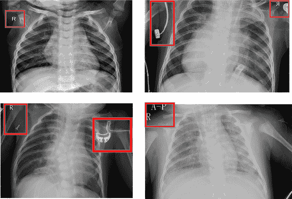
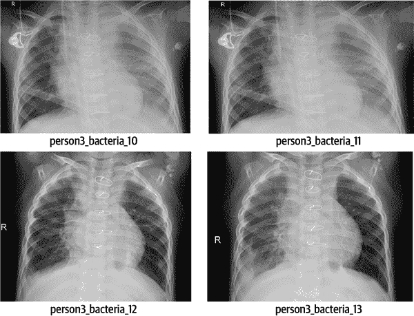
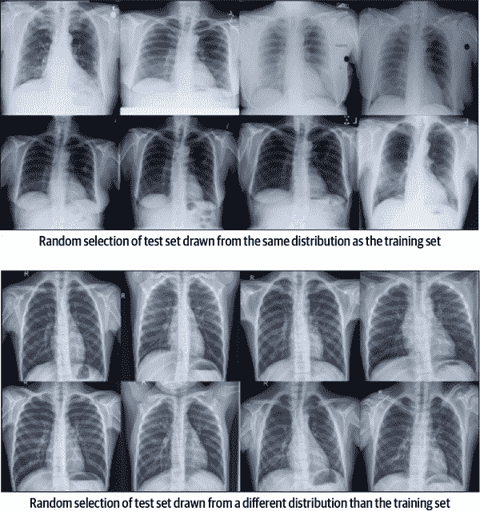
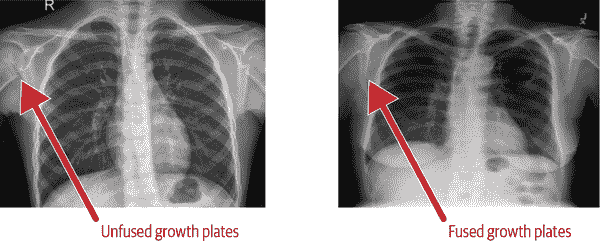
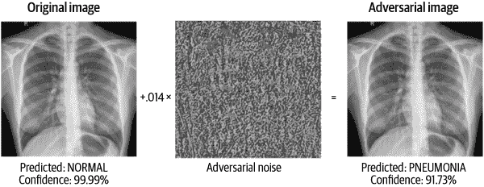
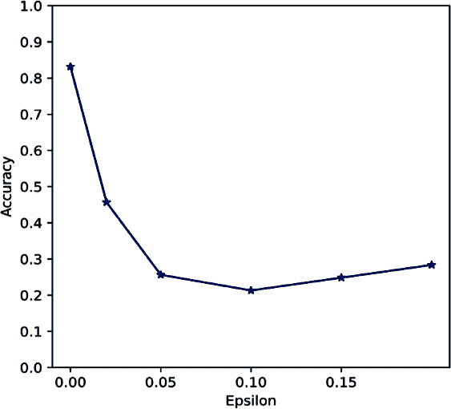
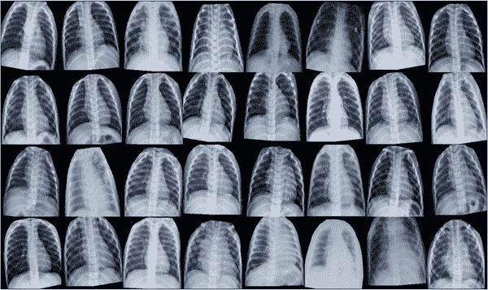
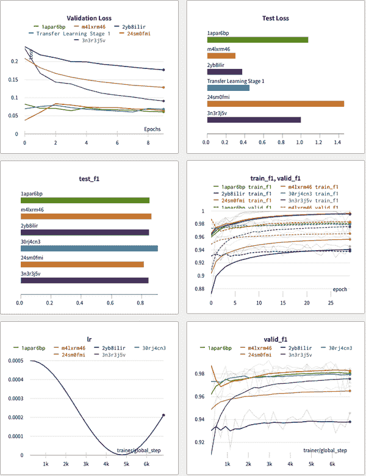

# 第九章：调试 PyTorch 图像分类器

即使在被炒作的 2010 年代，深度学习（DL）研究人员也开始注意到他们的新深度网络具有一些 [“有趣的属性”](https://oreil.ly/CkAkR) 。一个好的模型在硅仿真通用性能高的情况下，也很容易被对抗样本欺骗，这既令人困惑又违反直觉。在经典论文 [“深度神经网络很容易被愚弄：对不可识别图像的高置信度预测”](https://oreil.ly/AP-ZH) 中，作者质疑了深度神经网络如何可能将图像分类为熟悉的对象，尽管它们对人类眼睛完全不可识别。如果之前没有理解，那么现在变得清楚了，就像所有其他机器学习系统一样，DL 模型必须进行调试和修复，特别是在高风险场景中使用时。在 第七章 中，我们训练了一个肺炎图像分类器，并使用了各种事后解释技术来总结结果。我们还涉及了 DL 可解释性技术与调试之间的联系。在本章中，我们将继续从 第七章 结束的地方开始，并使用各种调试技术对训练好的模型进行检验，以确保其足够强大和可靠，可以进行部署。

DL 代表了当今 ML 研究领域中的最新技术。然而，其异常复杂性也使得测试和调试变得更加困难，这增加了在实际部署中的风险。所有软件，即使是 DL，都会有 bug，在部署之前必须解决这些问题。本章首先进行概念复习，然后专注于使用我们的示例肺炎分类器调试 DL 模型的技术。我们将从讨论 DL 系统中的数据质量和泄漏问题开始，并说明为什么在项目初期解决这些问题非常重要。然后，我们将探讨一些软件测试方法，以及为什么软件质量保证（QA）是调试 DL 流程中必不可少的组成部分。我们还将进行 DL 敏感性分析方法的讨论，包括在不同肺炎图像分布上测试模型和应用对抗性攻击。最后，我们将讨论我们自己的数据质量和泄漏问题，探讨 DL 的新调试工具以及我们自己对抗性测试的结果。本章的代码示例可以像往常一样在 [在线](https://oreil.ly/machine-learning-high-risk-apps-code) 上找到，并记住 第三章 概述了语言模型（LM）的模型调试。

# 概念复习：调试深度学习

在第八章中，我们强调了除了传统的模型评估之外进行模型调试的重要性，以增加对模型性能的信任。本章的核心思想保持不变，尽管是针对深度学习模型。回想一下我们在第七章中的图像分类器，用于诊断胸部 X 光图像中的肺炎，我们得出结论，我们不能完全依赖我们应用的事后解释技术，特别是在高风险应用中。然而，这些解释技术似乎在帮助我们调试模型时显示出了一些潜力。在本章中，我们将从第七章结束的地方开始。记住我们在训练和评估模型时使用了 PyTorch，并且在本章中我们将调试这个模型以展示深度学习模型的调试方法。为了让我们开始，以下列表深入探讨了可复现性、数据质量、数据泄漏、传统评估和软件测试方法，然后我们转向适应残差分析、敏感性分析和分布变化到深度学习中的广泛概念。就像在更传统的机器学习方法中一样，我们发现使用这些技术的任何错误都应该被修复，而概念的复习将涉及到补救的基础知识。还要注意，尽管本章介绍的技术最直接适用于计算机视觉模型，但这些想法通常可以在计算机视觉之外的领域中使用。

可复现性

保持机器学习结果的可复现性非常困难。幸运的是，像随机种子、私有或公共基准、元数据跟踪器（如 TensorFlow ML Metadata）、代码和数据版本控制（使用 Git 或类似的工具如 DVC）、以及环境管理器（例如 gigantum）等工具都可以提高可复现性。种子帮助我们在代码的最低层面上保证可复现性。元数据跟踪器、代码和版本控制系统以及环境管理器帮助我们跟踪所有数据、代码和其他信息，以保持可复现性，并在失去可复现性时回滚到已建立的检查点。基准测试使我们能够向自己和他人证明我们的结果是可复现的。

数据质量

图像数据可能存在任意数量的数据质量问题。[普遍存在错误标签](https://oreil.ly/qC2Zh)，这是许多用于预训练大型计算机视觉模型的数据集中已知的问题。DL 系统仍然需要大量带标签的数据，并且主要依赖于不可靠的人类判断和低薪劳动力来创建这些标签。对齐，或者确保训练集中所有图像具有一致的视角、边界和内容，是另一个问题。想象一下，如何将来自不同 X 光机的胸部 X 光片集对齐，以便每个训练图像都集中在相同内容——人类肺部，而不会在边缘周围分散、嘈杂的信息。因为我们试图了解的图像内容本身可以上下移动或左右移动（翻译）、旋转或以不同大小（或尺度）呈现，所以我们必须在训练数据中有对齐的图像，以获取高质量的模型。图像还会出现自然问题，如模糊、遮挡、低亮度或对比度等等。最近的论文[“评估实际问题的图像质量问题”](https://oreil.ly/3j3Ky)对许多这些常见的图像质量问题进行了总结，并提出了一些解决方法。

数据泄漏

另一个严重的问题是训练、验证和测试数据集之间的泄漏。如果不仔细跟踪元数据，很容易在这些分区之间有相同的个体或示例。更糟糕的是，我们可能在验证或测试数据中有相同的个体或来自训练数据的示例，而这些个体或示例可能在较早的时间点出现。这些情况往往会导致对性能和误差的过度乐观评估，这是高风险 ML 部署中我们最不希望看到的情况之一。

软件测试

DL 往往会导致复杂和不透明的软件工件。例如，一个[100 万亿参数](https://oreil.ly/cYhW8)的模型。一般来说，ML 系统也因悄无声息地失败而臭名昭著。与传统软件系统不同，后者通过经过充分测试的异常机制崩溃并明确通知用户可能的错误或漏洞，DL 系统可能会表现出正常训练并为新数据生成数值预测，而同时受到实现错误的影响。此外，DL 系统往往依赖于任意数量的第三方硬件或软件组件。但这并不能成为我们不进行测试的借口。这更加需要为任何高风险的 DL 系统进行适当的测试——软件质量保证对于任何高风险的 DL 系统都是必须的。

传统模型评估

测量 logloss、准确率、F1、召回率和精确率，并分析混淆矩阵，跨不同数据分区进行这些操作，始终是模型调试的重要部分。这些步骤帮助我们了解我们是否违反了分析的隐含假设，是否达到了足够的性能水平，或者是否存在明显的过拟合或欠拟合问题。只记住，良好的体外表现并不保证良好的体内表现。我们需要采取超越传统模型评估的步骤，以确保良好的现实世界结果。

###### 注意

我们通常会尝试的另一种重要调试类型是分段错误分析，以了解我们的模型在数据的重要部分中在质量、稳定性、过拟合和欠拟合方面的表现如何。我们的 X 光图像没有太多额外信息标记，可以用于分段，但了解模型在数据的各个段上的表现至关重要。平均或总体性能指标可能隐藏了不充分和偏差问题。如果可能的话，我们应该始终按段分解我们的数据，并逐段检查潜在问题。

敏感性分析

深度学习中的敏感性分析归结为改变数据并观察模型如何响应。不幸的是，当应用敏感性分析到深度学习中时，图像及其集合可以以多种方式改变。从调试的角度来看，图像的有趣变化可能对人类可见，也可能不可见，可以是自然生成或对抗性生成的。一个经典的敏感性分析方法是扰动训练数据的标签。如果我们的模型在随机打乱标签上表现同样出色，或者相同的特征对于打乱标签同样重要，那这并不是一个好迹象。我们还可以扰动我们的模型来测试[不充分](https://oreil.ly/ODWJY)的情况，即模型在测试数据中表现良好但在实际世界中表现不佳。如果扰动结构上无意义的超参数（例如随机种子和用于训练系统的 GPU 数量）对模型性能有显著影响，那么我们的模型仍然过于关注特定的训练、验证和测试集。最后，我们可以故意制造对抗性示例，以了解我们的模型在最坏情况或攻击场景下的表现。

分布变化

分布转移是 DL 中严重的错误之一，也是我们进行敏感性分析的主要原因之一。就像在 ML 中一样，对新数据中的转移缺乏鲁棒性可能会导致体内性能下降。例如，图像集中的人群可能随时间变化。被称为*子群体转移*，图像中类似对象或个体的特征随时间变化，新数据中可能会遇到新的子群体。一旦系统部署后，一组图像的整个分布也可能会发生变化。为了尽可能地增强模型对子群体和整体人群漂移的性能，这是关键的 DL 调试步骤。

修复措施

与所有 ML 一样，更多更好的数据是 DL 的主要修复方法。自动化方法，如[albumentations](https://oreil.ly/MWbSL)，可以在许多情况下生成更多的训练和测试数据，例如通过扭曲图像。一旦我们对数据感到满意，基本的质量保证方法，如单元测试、集成测试和异常处理，可以帮助在结果不理想的实际应用中捕捉许多错误。特殊工具，如 Weights & Biases 的[实验跟踪器](https://oreil.ly/VgFEj)，可以更好地洞察我们的模型训练，帮助发现任何隐藏的软件错误。我们还可以通过应用正则化、基于人类领域知识的约束或[鲁棒 ML](https://oreil.ly/nNlRs)方法来使我们的模型更可靠和更健壮，以防御对抗性操纵。

对于所有 ML，DL 的调试可能会特别困难，原因如概念复习中所讨论的那样，以及其他原因。然而，我们希望本章提供实用的想法来发现和修复错误。让我们深入探讨本章的案例。在接下来的章节中，我们将密切关注数据质量问题、数据泄露、软件漏洞以及我们模型的过度敏感性。我们将发现许多问题，并尝试修复它们。

# 调试 PyTorch 图像分类器

如我们将讨论的那样，我们最终手动裁剪我们的胸部 X 光片以解决严重的对准问题。我们在验证方案中发现了数据泄露，并将解释我们是如何发现并修复它的。我们将讨论如何应用实验跟踪器以及我们观察到的结果。我们将尝试一些标准对抗攻击，并讨论我们可以如何利用这些结果来构建更强大的模型。我们还将把我们的模型应用到全新的测试集上，并分析在新人群上的性能。在接下来的章节中，我们将讨论如何发现我们的漏洞，以及一些可能对 DL 管道中问题识别有帮助的一般技术。然后，我们将讨论如何修复我们的漏洞，以及 DL 的一些一般错误修复方法。

## 数据质量和泄露

正如在第七章中也强调的那样，本案例研究中使用的[肺炎 X 光数据集](https://oreil.ly/uPoZX)也存在一些挑战。其目标类别分布倾斜。 (这意味着属于肺炎类的图像比正常类图像多。) 验证集过小，无法得出有意义的结论。此外，图像上有嵌入式文本或令牌的标记。通常，每家医院或部门都对其机器生成的 X 光图像具有特定的风格偏好。仔细检查图像时，我们发现有许多不需要的标记、探针和其他噪声，如图 9-1 所示。如果我们不极其谨慎，这些标记可以成为 DL 学习过程的焦点，即所谓的*捷径学习*。



###### 图 9-1\. 带有不必要的镶嵌文本和标记的图像

在研究裁剪和对齐图像时，我们还发现了数据泄露问题。简单来说，数据泄露发生在验证或测试数据在训练时向模型提供信息的情况下。在这种数据上训练的模型可能会在测试集上表现乐观，但在实际世界中可能表现不佳。DL 中的数据泄露可能由以下原因引起：

数据分区的随机分割

这是泄漏的最常见原因，当代表同一人的样本出现在验证或测试数据集中，并且还出现在训练集中时，就会发生这种情况。在这种情况下，由于训练数据中来自同一患者的多个图像，在训练数据分区之间进行简单随机分割可能导致来自同一患者的图像同时出现在训练集和验证或测试集中。

数据增强导致的泄露

数据增强通常是 DL 管道的一个重要部分，用于增强训练数据的代表性和数量。然而，如果操作不当，增强可能成为数据泄露的重要原因。如果在数据增强过程中不小心，从同一真实图像生成的新合成图像可能出现在多个数据集中。

在转移学习过程中的泄露

在一项[研究](https://oreil.ly/zY-86)中，转移学习有时也可能成为泄露的来源，当源数据集和目标数据集属于相同领域时。作者们发现，这些预训练模型对 CIFAR-10 测试示例有很高的影响力的 ImageNet 训练示例，往往是目标任务的图像的完全相同副本，只是具有更高的分辨率。当这些预训练模型与错误的数据集一起使用时，预训练本身会导致一种非常隐蔽的数据泄露。

在我们的使用案例中，我们发现训练集包含同一患者的多个图像。尽管所有图像都有唯一的名称，但我们观察到某些情况下一个患者有多个 X 射线，正如图 9-2 所示。

当类似于图 9-2 中来自同一患者的图像作为训练集的一部分以及验证或测试集的一部分进行采样时，会导致测试集上的人工高性能。在现实世界中，模型不能依赖于看到其训练数据中的相同人员，在面对新个体时，其表现可能远不如预期。另一个需要关注的数据问题是错误标记的样本。由于我们不是放射科医生，因此无法从正确标记的图像中选择正确的标记图像。在没有领域专家的情况下，我们需要依赖数学方法来识别错误标记的数据，如[边缘排名下的面积（AUM ranking）](https://oreil.ly/mZvNI)。在 AUM 排名中，故意错误标记的训练实例被引入，以学习和定位自然发生的错误标记图像的错误配置文件。我们仍然更喜欢与领域专家合作，这是在深度学习工作流程的开始阶段涉及领域专家的关键位置——以验证我们开发数据集中的真实性。



###### 图 9-2\. 训练集中来自同一患者的多个胸部 X 射线图像。

## 深度学习软件测试

在第三章中指定的测试，即单元测试、集成测试、功能测试和混沌测试，都可以应用于深度学习系统，希望增强我们对生产环境中管道代码运行预期的信心。尽管软件质量保证可以增加我们的代码机制按预期运行的可能性，但机器学习和数学问题仍可能发生。深度学习系统是涉及大量数据和参数集的复杂实体。因此，它们还需要进行额外的机器学习特定测试。随机攻击是一个很好的起点。将模型暴露于大量随机数据可以帮助捕捉各种软件和机器学习问题。基准测试是另一个有帮助的实践，在第三章的多个实例中进行了讨论。通过将模型与基准进行比较，我们可以检查模型的性能。基准可以帮助我们以系统化的方式跟踪系统改进。如果我们的模型表现不如简单基准模型，或者其性能相对于最近的基准在下降，那就是重新审视我们的模型管道的信号。

[“深度学习 Bug 特性的综合研究”](https://oreil.ly/YpvV-)一文出色地汇编了 DL 中最常见的软件 bug。作者对来自 Stack Overflow 的帖子和 GitHub 上关于最流行的 DL 库（包括 PyTorch）的 bug 修复提交进行了详细研究。他们得出结论，数据和逻辑 bug 是 DL 软件中最严重的 bug 类型。DL 的 QA 软件也越来越多，以帮助检测和纠正 DL 系统中的 bug。例如，[DEBAR](https://oreil.ly/vGNxa)是一种技术，可以在训练前在神经网络的架构级别上检测数值 bug。另一种名为[GRIST](https://oreil.ly/eaddx)的技术则利用 DL 基础设施的内置梯度计算功能来暴露数值 bug。专门用于测试 NLP 模型的[checklist](https://oreil.ly/2IAyJ)生成测试用例，灵感来自软件工程中的功能测试原理。

在我们的使用案例中，我们必须承认，我们并没有像应该那样频繁应用单元测试或随机攻击。我们的测试过程最终更多是手动完成的。除了应对数据泄漏和对齐问题——这是 DL 中错误的主要原因之一——我们在几个月的时间里使用非正式的基准来观察和验证我们模型性能的进展。我们还针对[“深度学习 Bug 特性的综合研究”](https://oreil.ly/MmBuR)中讨论的主要错误对我们的流水线进行了检查。我们还应用了实验追踪软件，这有助于我们可视化我们流水线的许多复杂方面，并且更有信心它表现如预期。我们将在“修复措施”中更详细地讨论实验追踪器和其他数据与软件修复方法。

## 深度学习的敏感性分析

我们将再次使用敏感性分析来评估各种扰动对我们模型预测效果的影响。ML 系统的一个常见问题是，在有利条件下它们表现异常出色，但在输入数据发生即使轻微变化时情况会变得混乱。研究已经反复显示，对输入数据分布的轻微变化会影响像 DL 系统这样的最新模型的[鲁棒性](https://oreil.ly/Easl_)。在本节中，我们将使用敏感性分析来评估我们模型的鲁棒性。我们最佳的模型将经历一系列敏感性测试，包括分布转移和对抗性攻击，以确定它在训练时的不同条件下是否能表现良好。我们还将简要介绍本章中的其他一些扰动调试技巧。

### 领域和子群体转移测试

分布转移是一种情况，即训练分布与测试分布或系统部署后遇到的数据分布显著不同。这些转移可能由于各种原因而发生，并影响可能已在部署前进行了适当训练和测试的模型。有时，数据的自然变异超出了我们的控制范围。例如，在 COVID-19 大流行之前创建的肺炎分类器，在大流行后的数据测试时可能会显示不同的结果。由于在我们这个动态世界中分布转移如此普遍，及时检测、测量和采取纠正措施是至关重要的。

数据分布的变化可能是不可避免的，并且可能有多种原因导致这些变化发生。在本节中，我们首先关注领域（或群体）转移，即当新数据来自不同领域时，例如另一家医院。然后我们将重点放在较不引人注目但仍有问题的子群体转移上。我们在[广州市妇女儿童医疗中心](https://oreil.ly/KIGvP)，年龄在一到五岁之间的小儿患者数据集上训练了我们的肺炎分类器。为了检验模型对来自不同分布的数据集的稳健性，我们评估了它在另一家医院和年龄组的数据集上的表现。显然，我们的分类器没有见过新数据，它的表现将表明它是否适合更广泛的使用。在这种测试中表现良好是困难的，这被称为*out-of-distribution generalization*。

新数据集来自[美国国立卫生研究院临床中心](https://oreil.ly/WucL6)，可以通过[NIH 下载站点](https://oreil.ly/utfwr)获取。数据集中的图像属于 15 个不同的类别——包括 14 种常见胸部疾病，包括肺炎，以及一个“无发现”的类别，其中“无发现”表示图像中未发现这 14 种疾病模式之一。数据集中的每个图像可以有多个标签。数据集已经从国立卫生研究院临床中心的临床 PACS 数据库中[提取](https://oreil.ly/n44Zn)，包括医院内大约 60%的前胸部 X 光片。

正如前面提到的，新数据集在几个方面与训练数据不同。首先，与训练数据不同，新数据除了肺炎之外还有其他标签。为了处理这种差异，我们手动从数据集中仅提取了“肺炎”和“无所见”图像，并将它们分别存储为肺炎和正常图像。我们假设一个不报告 14 种主要胸部疾病的图像可以合理地放入正常类别。我们的新数据集是 NIH 数据集的子样本，我们创建它以包含几乎平衡的肺炎和正常病例样本。再次强调，尽管在实际环境中，半数被筛查患者有肺炎的隐含假设可能不成立，但我们希望在分布转移条件下测试我们在第七章中得到的最佳模型，这是我们找到的最合理的数据。

在图 9-3 中，我们比较了两个测试集的胸部 X 射线图像，直观地展示了这两个不同的分布。图中下方的图像集是从完全不同的分布中抽样得到的，而顶部的图像来自与训练集相同的分布。虽然我们不期望一个在儿童图像上训练的肺炎分类器在成人上表现良好，但我们确实希望了解我们的系统在完全领域转移条件下可能表现多么糟糕。我们希望衡量和记录系统的局限性，并知道何时可以使用以及何时不能使用。这对于所有高风险应用都是一个好主意。

在这种应用中，理解隐含的数据假设更多是一种视觉练习，因为每个训练数据示例都是一幅图像。在结构化数据中，我们可能更多依赖描述性统计来理解哪些数据被视为超出分布。



###### 图 9-3\. 两个不同数据分布的 X 射线样本比较

对于我们这些不熟悉的眼睛来说，两组图像看起来相似。我们很难区分肺炎和正常患者的 X 射线扫描。我们最初观察到的唯一区别是，与其他样本相比，来自 NIH 数据集的图像似乎有点模糊和朦胧。然而，放射科医生可以轻松指出显著的解剖差异。例如，通过文献回顾，我们了解到儿科 X 射线显示出上臂未融合的生长板，在老年患者中找不到（图 9-4）。由于我们训练数据中的所有患者都是五岁以下的儿童，他们的 X 射线可能会展示这一特征。如果我们的模型捕捉到这些特征，并通过捷径学习或其他错误的学习过程将它们与肺炎标签联系起来，这些虚假的相关性将导致它在新数据上表现不佳，而在这些新数据中不存在这样的特征。



###### 图 9-4\. 儿童 X 光片（左）与成人 X 光片（右）的比较

现在是真相的时刻。我们在新分布的测试数据上测试了我们最佳模型，结果并不令人鼓舞。在进行这种领域转移的练习时，我们有些担忧，而这些担忧在很大程度上得到了验证。通过查看表 9-1，我们可以得出一些结论。

表 9-1\. 显示肺炎分类器模型在来自不同分布的测试数据集上的表现的混淆矩阵

|  | 预测为正常 | 预测为肺炎 |
| --- | --- | --- |
| **实际正常** | 178 | 102 |
| **实际肺炎** | 130 | 159 |

在医疗诊断背景下，分类器经常错误地预测实际上患有肺炎的患者为正常。假阴性——即预测肺炎患者为正常——在这种情况下是非常危险的。如果这样的模型部署在医院中，将会造成严重后果，因为病人可能得不到正确或及时的治疗。表 9-2 展示了分类器的额外性能指标。

表 9-2\. 新分布测试数据集上的额外性能指标

| 类别 | 数量 | 精确率 | 召回率 | F1 分数 |
| --- | --- | --- | --- | --- |
| 正常 | 280 | 0.58 | 0.64 | 0.61 |
| 肺炎 | 289 | 0.61 | 0.55 | 0.58 |

我们能训练出更好的模型吗？我们有足够的数据吗？我们是否正确处理了新数据集中的不平衡？我们在新数据集中样本选择是否代表了真实的领域或人群转移？虽然我们对这些问题的答案并不百分之百确定，但我们确实对我们模型的泛化能力有了一些了解，以及我们愿意在高风险场景中部署这类模型的意愿。我们曾经梦想过，通用的团队能够训练出在训练数据之外表现良好的肺炎深度学习分类器，但这些梦想已经破灭。我们也认为重申训练医学图像分类器的难度是多么大。

除了领域转移之外，我们还需要考虑一种不那么激烈的数据漂移类型，它可能影响我们的分类器。当新数据中出现相同人群但分布不同的情况时，就会发生子群体漂移。例如，我们可能会遇到年龄稍大或稍小的孩子，不同比例的小儿肺炎病例，或者略有不同体征的不同人群儿童。在[“BREEDS: Benchmarks for Subpopulation Shift”](https://oreil.ly/fDOkm)中描述的方法集中于后一种情况，即某些对象的*品种*在基准数据集中被遗漏，因此在训练期间未被观察到。通过从流行基准数据集中移除某些子群体，作者能够在一定程度上识别和缓解遇到新子群体的影响。同一研究小组还开发了工具，以实施他们在[鲁棒性](https://oreil.ly/1DsI_)研究中的发现。除了支持重新创建品种基准的工具外，鲁棒性软件包还支持各种类型的模型训练、对抗训练和输入操作功能。

在高风险场景中，对机器学习和深度学习的挑战保持清醒是很重要的。即使是今天，要训练一个准确且健壮的医学图像分类器，仍需要大量精心标记的数据、专业的人类领域知识的整合、尖端的机器学习技术以及严格的测试。此外，正如[“Safe and Reliable Machine Learning”](https://oreil.ly/4QWNc)的作者所指出的，要在部署环境中了解所有风险基本上是不可能的。因此，我们应该努力将工作流程转向强调明确保护免受可能发生的问题性转移的预防性方法。

接下来，我们将探讨对抗性示例攻击，这有助于我们了解模型中的不稳定性和安全漏洞。一旦发现对抗性示例，它们可以帮助我们在训练更健壮的深度学习系统时采取积极主动的措施。

### 对抗性示例攻击

我们在第八章中介绍了对于表格数据集的对抗示例。回想一下，对抗示例是导致模型输出惊人变化的奇怪输入数据实例。在本节中，我们将从 DL 肺炎分类器的角度来讨论它们。更具体地说，我们将尝试确定我们的分类器是否能够处理对抗示例攻击。通过向现有数据添加一个小但精心设计的噪声来创建对抗性输入。这种噪声，虽然通常对人类来说几乎不可察觉，却可以显著改变模型的预测结果。利用对抗示例来改进 DL 模型的想法在[“解释和利用对抗示例”](https://oreil.ly/mAjD5)中备受关注，作者展示了现代计算机视觉 DL 系统易受骗的方式，以及如何重新将对抗示例纳入模型训练中以创建更加健壮的系统。自那时以来，已经进行了几项研究，专注于如[面部识别](https://oreil.ly/yIL9D)和[路标分类](https://oreil.ly/jQIzR)等安全关键应用，展示了这些攻击的有效性。大量后续的[鲁棒 ML](https://oreil.ly/tlKJJ)研究集中于对抗示例的应对措施和鲁棒性。

对 DL 系统创建对抗示例最流行的方法之一是快速梯度符号法（FGSM）。与我们在第八章中处理的树木不同，神经网络通常是可微的。这意味着我们可以利用梯度信息根据网络的错误曲面构建对抗示例。FGSM 执行的操作类似于梯度下降的反向过程。在梯度下降中，我们使用模型对权重的误差函数的梯度来学习如何改变权重以*减少*误差。在 FGSM 中，我们利用模型对输入的误差函数的梯度来学习如何改变输入以*增加*误差。

FGSM 为我们提供了一张图像，通常看起来像静态，其中每个像素都设计成增加模型误差函数。我们使用一个调节参数，*epsilon*，来控制对抗示例中像素强度的大小。一般来说，epsilon 越大，我们可以预期对抗示例的误差越严重。我们倾向于保持 epsilon 较小，因为网络通常只是累加所有小扰动，从而影响模型结果的大变化。就像在线性模型中一样，对每个像素（输入）的微小改变可以导致系统输出的巨大变化。我们必须指出这种讽刺，也被其他作者强调过，即廉价且有效的 FGSM 方法主要依赖于 DL 系统基本上像巨大线性模型一样的行为。

[“解释和利用对抗样本”](https://oreil.ly/8Ghxu)中的 FGSM 攻击的一个著名例子显示，模型首先将一张熊猫的图片识别为熊猫。然后应用 FGSM 创建了一张扰动的、但在视觉上相同的熊猫图片。网络随后将该图片分类为长臂猿或者某种灵长类动物。虽然有几个像[cleverhans](https://oreil.ly/oVdSo)，[foolbox](https://oreil.ly/C9baT)，和[adversarial-robustness-toolbox](https://oreil.ly/QKoKT)这样的包用于创建对抗样本，我们根据官方 PyTorch 文档中的例子手动实现了 FGSM 攻击于我们的精调肺炎分类器上。然后我们将攻击我们现有的精调模型，并通过扰动测试集中的样本生成对抗性图像，如图 9-5 所示。当然，我们并不试图把熊猫变成长臂猿。我们试图了解我们的肺炎分类器对几乎不可察觉的噪声有多强韧。



###### 图 9-5\. 隐形对抗样本攻击将肺炎分类器的预测从正常变为肺炎。

以 99%的置信度预测一个普通类别图像的分类器将 FGSM 扰动的图像误分类为肺炎图像。请注意噪声的量几乎不可察觉。

我们还绘制了一个准确率与 epsilon 的图来观察模型的准确率随着扰动大小的变化。Epsilon 值是应用于输入图像以创建对抗性样本的扰动的度量。模型的准确率通常被测量为模型正确分类的对抗性样本的百分比。较低的 epsilon 值对应较小的扰动，较高的 epsilon 值对应较大的扰动。在给定的例子中，随着 epsilon 值的增加，应用于输入图像的扰动变得更大，模型的准确率通常会降低。曲线的形状在图中会根据具体的模型和数据集而变化，但通常随着 epsilon 值的增加而减小。准确率与 epsilon 的图（图 9-6）是评估机器学习模型对抗性样本强韧性的有用工具，因为它允许研究人员看到随着扰动大小的增加模型准确率的变化。  



###### 图 9-6\. 对抗图像的准确率与 epsilon 的比较（[数字，彩色版本](https://oreil.ly/Gy-Q9)）

再次强调，我们不是医生或放射科医生。但是我们如何能够信任一个系统，其中不可见的变化导致了对如此高风险应用的预测有巨大的波动？我们必须绝对确保没有任何噪音进入我们的诊断图像，无论是意外的还是由不良行为者放置的。我们也希望我们的模型对噪音更加稳健，就像我们希望它对数据漂移更加稳健一样。在 “修复” 中，我们将概述在训练中使用对抗样本来使 DL 系统更加健壮的一些选项。目前，我们将重点介绍另一种扰动和敏感性分析技巧，可以用来发现 DL 模型中其他类型的不稳定性。

### 扰动计算超参数

DL 模型需要正确设置大量的超参数，以找到解决问题的最佳模型。正如 [“欠规范化对现代机器学习可信度的挑战”](https://oreil.ly/YWVF9) 中所强调的，使用标准评估技术来选择超参数通常会导致在测试数据中看起来很好的模型，在实际世界中表现不佳。这篇欠规范化论文提出了几种我们可以用来检测这个问题的测试方法。

我们在本章及几个其他章节中提到了分段错误分析，这仍然是一个重要的测试，应在可能的情况下进行，以检测欠规范化和其他问题。另一种测试欠规范化的方法是扰动与我们试图解决的问题结构无关的计算超参数。其理念是改变随机种子或与数据或问题结构无关的其他内容，比如 GPU 数量、机器数量等，不应显著改变模型的性能。如果这样做，就表明存在欠规范化。如果可能，尝试在训练过程中使用几个不同的随机种子或分布方案（GPU 或机器数量），并确保测试性能是否因这些变化而显著变化。最有效的欠规范化缓解方法是通过额外的人类领域专业知识对模型进行约束。我们将在下一节中讨论几种方法来实现这一点。

## 修复

通常情况下，当我们发现 bug 时，我们会尝试修复它们。本节将专注于修复我们的 DL 模型的 bug，并讨论一些通用的 DL 管道问题解决方法。和往常一样，我们最严重的问题大多源于数据质量。我们花了很多时间整理数据泄露问题，并手动裁剪图像以修复对齐问题。然后，我们使用新的分析工具分析了我们的管道，以找出并修复任何明显的软件 bug。我们还应用了 L2 正则化和一些基本的对抗训练技术，以增强我们模型的鲁棒性。我们将在接下来的章节中详细介绍所有这些操作的具体细节，并突出几种其他流行的 DL 修复策略。

### 数据修复

关于数据修复，首先要记住，在第七章中，我们通过仔细增强图像来解决数据不平衡问题。然后我们怀疑我们的一些性能问题是否来自于嘈杂和对齐不良的图像。逐一浏览这些图像时，用照片编辑软件裁剪它们时，我们发现了一个数据泄漏。因此，我们还必须修复我们发现的数据泄漏，然后回头处理图像对齐的问题。经过这些耗时的手动步骤后，我们能够应用双微调训练方法，显著提高了我们模型的仿真性能。

###### 注意

即使在非结构化数据问题中，我们也应该尽可能熟悉我们的数据集。引用 Google 的[负责任的 AI 实践](https://oreil.ly/DwUNC)，“在可能的情况下，直接检查原始数据。”

为了确保不同数据集中个体之间没有泄漏，我们通过将训练集中的独特图像转移到验证集来手动扩展验证数据集。我们使用 PyTorch 中可用的转换来增强剩余的训练集图像，特别注意与非对称图像相关的域约束（肺部图像不是左右对称的，因此我们不能使用将图像水平翻转的增强方法）。这消除了数据泄漏。

###### 警告

在增强后将数据分割为训练集、验证集和测试集是深度学习管道中常见的数据泄漏来源。

我们尝试的下一个修复方法是使用图像处理软件手动裁剪一些 X 光图像。虽然 PyTorch 有一些转换可以帮助中心裁剪 X 光图像，但在我们的数据上效果并不理想。因此，我们迎难而上，自己裁剪了数百张图像。在每种情况下，我们试图尽可能保留 X 光图像的肺部部分，消除边缘周围的不必要的伪影，并尽可能保持所有图像的比例。图 9-7 展示了裁剪数据集中的一组随机图像。（将这些图像与图 9-1 中的图像进行比较。）我们还注意不在裁剪过程中重新引入数据泄漏，并尽力保持裁剪后的图像处于其正确的数据分区中。



###### 图 9-7\. 手动裁剪的 X 光图像

手动裁剪图像的主要优势在于创建另一个数据集，可以用于两阶段迁移学习过程。正如在第七章中所解释的，我们使用预训练的 DenseNet-121 进行迁移学习。然而，这种架构所训练的源数据与我们的目标域显著不同。因此，我们首先在增强且无泄漏数据集上对模型进行微调，然后仅在裁剪数据集上对结果模型进行另一次微调。表格 9-3 显示了第二个迁移学习阶段后的测试集性能。

表格 9-3\. 双重微调测试集性能比较

|  | 对数损失 | 准确性 |
| --- | --- | --- |
| 迁移学习阶段 1 | 0.4695 | 0.9036 |
| 迁移学习阶段 2 | 0.2626 | 0.9334 |

由于双重微调模型在留存测试集上表现更好，我们选择它作为我们的最佳模型。要达到这个目标，需要付出大量的手动工作，*这对于许多深度学习项目来说可能是现实*。

在修复数据问题的研究中，我们遇到了[Albumentations 库](https://oreil.ly/GKkFG)，用于增强，以及[label-errors 项目](https://oreil.ly/VpEkD)，提供了修复一些常见图像问题的工具。尽管我们不得不回到手动修复，但这些包似乎总体上是有帮助的。在长时间的干净数据争取之后，并找到适合该数据的微调过程后，是时候再次检查我们的代码了。

### 软件修复

由于深度学习流水线涉及多个阶段，有许多组件需要调试，我们还必须考虑它们的集成。如果我们一次更改超过一个设置、阶段或集成点，我们将无法知道哪个变化改进或损害了我们的工作。如果我们在代码更改方面不系统化，我们可能会疑惑是否选择了最佳的模型架构？优化器？批处理大小？损失函数？激活函数？学习率？等等。为了有希望严格回答这些问题，我们必须将软件调试分解为一小步，试图逐一孤立和修复问题。我们最终制定了软件测试清单，以保持理智并实现对流水线的系统调试：

检查我们的训练设备。

在进行训练之前，请确保模型和数据始终在同一设备上（CPU 或 GPU）。在 PyTorch 中，初始化一个变量来保存我们训练网络的设备（CPU 或 GPU）是一个常见的做法：

```
device = torch.device("cuda:0" if torch.cuda.is_available() else "cpu")
print(device)
```

总结网络架构。

总结层、梯度和权重的输出，确保没有不匹配。

测试网络初始化。

检查权重和超参数的初始值。考虑它们是否合理，是否有任何异常值是很容易看到的。如有需要，尝试不同的值。

确认小批量训练设置。

过度拟合少量数据以检查训练设置。如果成功，我们可以转向更大的训练集。如果不成功，我们回过头来调试我们的训练循环和超参数。以下代码演示了在 PyTorch 中过度拟合单个批次：

```
single_batch = next(iter(train_loader))
for batch, (images, labels) in enumerate([single_batch] * no_of_epochs):

    # training loop
    # ...
```

调整（初始）学习率。

极小的学习率会使优化器收敛得非常缓慢，但会更仔细地穿越误差曲面。较高的学习率则相反。优化器会更随意地跳跃误差曲面。选择好的学习率非常重要但也很困难。在 PyTorch 中有一些开源工具，比如[PyTorch 学习率查找器](https://oreil.ly/uICL1)可以帮助确定适当的学习率，如下代码所示。论文["训练神经网络的循环学习率"](https://oreil.ly/seww6)讨论了一种我们发现有帮助选择深度学习学习率的方法。这些只是可用选项中的几个。如果我们使用自调节学习率，我们也必须记住，除非我们达到一个相对现实的停止标准，否则我们无法测试它。

```
from torch_lr_finder import LRFinder

model = ...
criterion = nn.CrossEntropyLoss()
optimizer = optim.Adam(model.parameters(), lr=0.1, weight_decay=1e-2)
lr_finder = LRFinder(model, optimizer, criterion, device="cuda")
lr_finder.range_test(
    trainloader,
    val_loader=val_loader,
    end_lr=1,
    num_iter=100,
    step_mode="linear"
)
lr_finder.plot(log_lr=False)
lr_finder.reset()
```

优化损失函数和优化器。

将损失函数与手头问题匹配对于一般可用的机器学习结果至关重要。对于深度学习，选择最佳损失函数特别困难，因为有这么多选项和可能的自定义，无论是损失函数还是优化器。我们也没有像一些更简单的模型那样的收敛保证。例如损失函数的一个 bug，考虑 PyTorch 中的一个常见问题：应用 softmax 损失而不是[交叉熵损失](https://oreil.ly/foC4i)。对于 PyTorch，交叉熵损失期望 logit 值，将概率作为输入传递给它不会给出正确的输出。为了避免这类问题，为合理数量的测试迭代训练损失和优化器的选择，检查迭代图和预测，以确保优化过程按预期进行。

调整正则化。

当代深度学习系统通常需要正则化以良好泛化。然而，有许多选择（L1、L2、dropout、输入 dropout、噪声注入等），也不是不可能过火。过多的正则化可能会阻止网络收敛，这也是我们不想要的。需要一些实验来选择正确的正则化量和类型。

测试驱动网络。

发现开始一项大型训练任务，只是发现它在某个地方分歧，或者在烧掉很多芯片周期后未能产生良好的结果，这一点一点都不有趣。如果可能的话，训练网络深入其优化过程并检查事物是否顺利进行，然后再执行最终的长时间训练运行。这种测试驱动也作为底线集成测试。

提高可重现性。

尽管随机梯度下降（SGD）和其他随机性已经内置到许多当代深度学习中，我们必须有一些基线来进行工作。如果没有其他原因，我们需要确保不会在我们的管道中引入新的错误。如果我们的结果波动太大，我们可以检查我们的数据拆分、特征工程、不同软件库的随机种子以及这些种子的放置位置。（有时我们需要在训练循环中使用种子。）有时候也有确保精确可再现性的选项，尽管这会牺牲训练时间。在我们的管道中，遭受一些非常慢的部分训练运行来隔离可再现性问题可能是有意义的。这很困难，但是一旦我们建立了可重现的基线，我们就真正在通向构建更好模型的道路上了。

我们必须执行这些步骤，识别错误，并重新测试数百次——在此过程中捕捉无数的错别字、错误和逻辑问题。一旦修复了我们的代码，我们希望保持其干净，并且尽可能具有可重现的结果。一种有效的方法是使用像[Weights & Biases](https://oreil.ly/erHGm)这样的新实验跟踪工具。通过高效的数据集版本控制和模型管理，这些工具可以帮助更快地构建更好的模型。图 9-8 展示了在整洁的仪表板中跟踪和可视化多个深度学习建模实验，从而减少错误，并提高可重现性。



###### 图 9-8\. 使用 Weights & Biases（[数字版，彩色版本](https://oreil.ly/xsUUk)）追踪多个实验

虽然我们可以使用上述调试步骤、单元测试、集成测试和实验跟踪器来识别和避免常见的错误，但另一种选择是尝试避免复杂的训练代码。对于更简单的问题，一个极好的替代方法是使用[PyTorch Lightning](https://oreil.ly/94enQ)——一个开源的 Python 库，为 PyTorch 提供高级接口。它管理所有低级细节，抽象出常见的重复代码，使用户能够更多地专注于问题领域，而不是工程化方面。

现在我们对代码管道的表现感到自信，并且没有大量错误存在，我们将转而尝试修复网络中的稳定性问题。

## 敏感性修复

数据存在问题。代码也有问题。我们尽力在深度学习管道中解决这些问题。现在是时候尝试修复我们发现的数学问题了。本章中遇到的鲁棒性问题并不是独特的。它们是深度学习中最著名的问题之一。在接下来的子章节中，我们将从主要研究中汲取灵感，解决一些实际的修复问题，并讨论未来可以尝试的其他几个选项。

### 噪声注入

网络泛化能力差的最常见原因之一是过拟合，特别是在我们使用的小型数据集中更为明显。噪声注入是一种有趣的选项，用于定制正则化并为我们的流水线添加强正则化。我们决定尝试这种方法，故意损坏我们的训练数据，作为在训练过程中添加额外正则化的一种方式。向训练样本添加噪声可以帮助使网络更能抵抗输入扰动，并且在模型参数上有类似于 L2 正则化的效果。向图像添加噪声也是一种数据增强方法，因为它从原始数据集中创建了人工样本。

###### 注意

在图像中注入随机噪声也被称为*jitter*，这个词已有几十年历史，源于信号处理。注入高斯噪声在许多情况下等效于 L2 正则化。

我们在训练样本中添加了少量高斯噪声。然后，我们在这些噪声污染的训练数据上重新训练模型，并在全新的未见过的数据集上测试模型。我们希望这种粗糙的正则化方法能改善模型的泛化能力，无论是在分布内保留数据上还是可能的分布外数据上。

表 9-4 展示了噪声注入重新训练的结果。

表 9-4\. 两个模型在分布内和分布外数据上的损失值

|  | 分布内 | 分布外 |
| --- | --- | --- |
| 原始模型 | 0.26 | 2.92 |
| 噪声注入模型 | 0.35 | 2.67 |

表 9-4 展示了原始模型和在噪声污染数据上训练的模型的损失值。我们可以看到，L2 正则化模型在原始分布数据上表现略逊于原始模型。损失值 0.26 和 0.35 对应于肺炎类的平均模型评分分别为 0.77 和 0.70。另一方面，噪声注入模型在全新数据集上表现略优于原始模型。然而，2.67 的损失值仍然很糟糕，正如表 9-5 所示，该模型在分布外数据上的表现仅比随机稍好。

表 9-5\. 噪声注入模型在分布外数据上的混淆矩阵

|  | 预测正常 | 预测肺炎 |
| --- | --- | --- |
| **实际普通** | 155 | 125 |
| **实际肺炎** | 118 | 171 |

所以，噪声注入并没有让我们的模型在分布外数据上表现得奇迹般。但是，一切都相等的情况下，我们希望部署更加正则化的模型，该模型在测试数据上表现也相当不错，可能是在减少高斯噪声标准偏差的情况下，降低正则化水平后。虽然在这个例子中，我们仅向训练样本添加了噪声，但有时还可以将噪声添加到权重、梯度和标签中，以增强鲁棒性。

### 稳定性修复

我们试验了许多其他稳定性修复方法，但与噪声注入类似地看到了类似的结果。有些方法稍微有所帮助，但没有完全“修复”我们的分布外表现。然而，这并不意味着它们没有让我们的模型在某些未见数据上表现更好。接下来，我们将讨论更多数据增强选项、使用带噪标签的学习、基于领域的约束以及鲁棒的机器学习方法，然后结束本章：

自动化数据增强

提升鲁棒性的另一种选择是在训练过程中使网络暴露于更广泛的数据分布。虽然不总是可能获取新数据，但有效的数据增强在深度学习管道中变得相对简单。[Albumentations](https://oreil.ly/okEDM) 是一个流行的库，用于为计算机视觉任务创建不同类型的增强图像。Albumentations 可与流行的深度学习框架（如 PyTorch 和 Keras）轻松兼容。[AugLy](https://oreil.ly/q1NVA) 是另一个数据增强库，专注于为音频、视频和文本（以及图像）创建更加鲁棒的深度学习模型。AugLy 的独特之处在于，它从互联网的真实图像中获得灵感，并提供了一套超过一百种增强选项。

使用带噪标签的学习

由于各种原因，图像的标签可能存在噪声或错误。这可能是因为标记和训练现代深度学习系统所需的图像数量庞大，标签费用昂贵，标记复杂图像的技术困难或其他原因。实际上，这意味着我们经常在带有噪声标签的训练数据上训练。在最基本的层面上，我们可以在训练数据中随机调整一小部分图像标签，希望这能使我们的模型对标签噪声更加鲁棒。当然，我们总是可以做更多的事情，学习带噪标签是深度学习研究的一个繁忙领域。GitHub 仓库 [noisy_labels](https://oreil.ly/nPs_W) 列出了大量可能的带噪标签学习方法和工具。此外，请回想一下，在第七章中，我们使用标签洗牌作为发现鲁棒特征和检查解释技术的一种方式。从我们的观点来看，使用标签洗牌进行解释、特征选择和检查目的可能是其今天的最高呼声。

基于领域的约束

要打败不充分的情况，将领域信息或先验知识纳入深度学习系统是至关重要的。将先验知识整合到深度学习模型中的一种方法称为[物理信息驱动深度学习](https://oreil.ly/UotaL)，其中与问题相关的分析方程被添加到网络的损失函数和梯度计算中。预训练是另一种更好地约束 ML 系统到适当领域的方式。被称为[领域或任务自适应预训练](https://oreil.ly/PBLaT)，在领域或任务特定预训练运行期间学习的权重可以被用于监督训练或网络微调，以更加具体地绑定训练到领域。我们还可以使用单调或形状约束，如 TensorFlow 的[Lattice](https://oreil.ly/hwqeT)，以确保模型输入和目标之间的建模关系遵循因果关系现实。别忘了基础知识。我们需要将我们的损失函数与已知的目标和误差分布匹配。如果领域知识注入对读者有趣，请查看[“信息机器学习”](https://oreil.ly/BVEvF)进行广泛的评估，考虑知识来源、它们的表示以及它们如何集成到 ML 流水线中。

强韧机器学习

虽然名字有点混淆，*强大的机器学习* 是解决对抗模型操纵的深度学习研究领域的常见术语。[强韧机器学习](https://oreil.ly/Wu2zh) 是一个由社区运营的网站，汇总了不同的防御策略，并提供各种对抗例攻击和数据污染的防御措施。强韧机器学习是一个广泛的研究领域，一些常见的方法包括对抗性示例的重新训练，梯度遮蔽以及对抗数据污染的对策：

对抗性示例的重新训练

流行的技术包括在正确标记的对抗性示例上重新训练，这些示例是通过 FGSM 等方法找到的。(我们尝试过这个，但结果看起来很像噪声注入结果。) 这种技术涉及使用原始数据和对抗性示例的组合对模型进行重新训练，之后模型应该更难欺骗，因为它已经看过许多对抗性示例。由[Madry 实验室](https://oreil.ly/LfuvU)的论文[“对抗性示例不是错误，它们是特征”](https://oreil.ly/D1nNl)提供了更多关于如何理解对抗性示例的视角。

梯度遮蔽

梯度掩蔽的作用是改变梯度，使其在对抗性示例创建时对攻击者没有用处。事实证明，梯度掩蔽实际上并不是一个很好的防御方法，并且可以被有动机的攻击者轻松[绕过](https://oreil.ly/vohUq)。然而，梯度掩蔽对于红队测试和测试目的非常重要，因为许多其他攻击灵感来自梯度掩蔽的弱点。例如，[foolbox 库](https://oreil.ly/mAFEd)很好地演示了*梯度替代*，即用平滑的替代梯度替换原始模型的梯度，并利用该替代梯度构建有效的对抗性示例。

数据污染对策

有许多防御措施用于检测和减轻数据污染。例如，[对抗性鲁棒性工具箱（ART）](https://oreil.ly/bokv4)包含基于隐藏单元激活和数据来源的检测方法，以及使用谱特征。基本思想分别是，由数据污染创建的后门应导致隐藏单元以异常方式激活，因为后门应只在罕见情况下使用；数据来源（开发对训练数据处理的仔细理解和记录）可以确保数据没有被污染；以及使用主成分分析来发现对抗性示例的显著特征。要了解 ART 如何检测数据污染的示例，请查看[激活防御演示](https://oreil.ly/YaOvf)。

正如读者所见，有很多选项可以增强深度学习的鲁棒性。如果我们最担心在新数据上的鲁棒性表现，噪声注入、数据增强和嘈杂标签技术可能是最有帮助的。如果我们有能力注入更多人类领域知识，我们应该始终这样做。而如果我们担心安全性和对抗性操纵，我们需要考虑官方的鲁棒机器学习方法。虽然有一些经验法则和逻辑上的想法来确定何时应用哪种修复方法，但我们真的必须尝试许多技术，找到适合我们数据、模型和应用的最佳方法。

# 结论

即使经过所有这些测试和调试，我们相当肯定不应该部署这个模型。尽管作者中没有人认为自己是深度学习专家，但我们确实在思考这反映了深度学习周围炒作的水平。如果作者团队在数月的工作后仍然无法正确构建这个模型，那么在现实中，使高风险深度学习分类器工作需要什么呢？我们拥有不错的 GPU 和多年的机器学习经验。但这还不够。我们方法中明显缺少的两个要素是大量训练数据和领域专家的支持。下次我们承担高风险深度学习应用时，我们一定要确保能够获得这些资源。但这不是几个数据科学家能够单独完成的项目。这本书中反复强调的一个教训是，要使高风险项目成功，需要不止几个数据科学家。

至少，我们将需要整个供应链来获得适当标记的图像和获取昂贵的领域专家支持。即使有了这些改进的资源，我们仍然需要执行本章描述的测试类型。总体来说，我们对深度学习的经验带给我们更多问题而不是答案。有多少深度学习系统是在较小的数据集上训练且没有人类领域专家的支持？有多少深度学习系统是在没有进行本章描述的测试级别部署的？在这些情况下，系统真的没有漏洞吗？或者可能是假定它们没有漏洞？对于低风险的游戏和应用程序，这些问题可能不是什么大问题。但对于应用在医学诊断、执法、安全、移民等高风险问题领域的深度学习系统，我们希望这些系统的开发者比我们拥有更好的资源，并且进行了严格的测试工作。

# 资源

代码示例

+   [面向高风险应用的机器学习书籍](https://oreil.ly/machine-learning-high-risk-apps-code)

数据生成工具

+   [AugLy](https://oreil.ly/C3sh1)

+   [faker](https://oreil.ly/9ZeuG)

深度学习攻击和调试工具

+   [对抗鲁棒性工具包](https://oreil.ly/j4pmz)

+   [图像增强](https://oreil.ly/lIX8o)

+   [cleverhans](https://oreil.ly/LvNRO)

+   [检查表](https://oreil.ly/lopis)

+   [counterfit](https://oreil.ly/jxToW)

+   [foolbox](https://oreil.ly/3ofR4)

+   [鲁棒性](https://oreil.ly/Eq4yv)

+   [tensorflow/model-analysis](https://oreil.ly/UDkel)

+   [TextAttack](https://oreil.ly/VraVt)

+   [TextFooler](https://oreil.ly/mvq2J)

+   [torcheck](https://oreil.ly/kEczf)

+   [TorchDrift](https://oreil.ly/njHPO)
