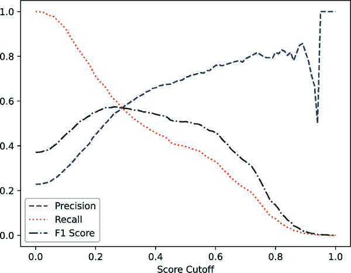
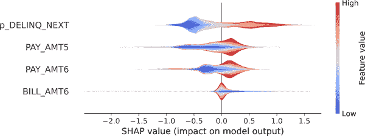
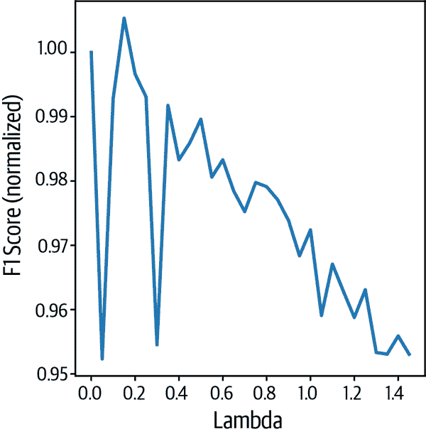
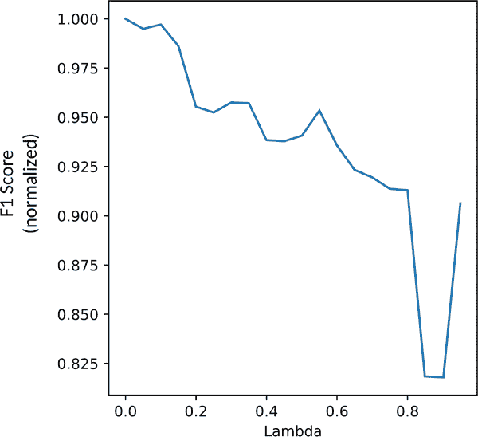
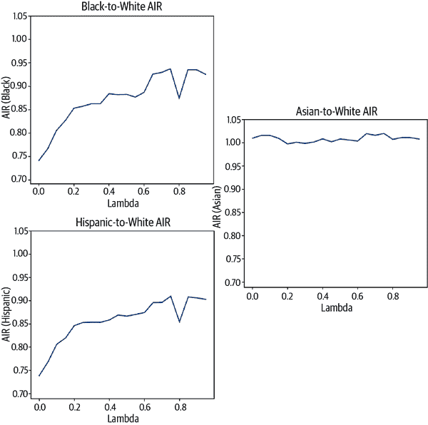

# 第十章：使用 XGBoost 测试和修复偏差

本章介绍了针对结构化数据的偏差测试和修复技术。虽然第四章从多个角度讨论了偏差问题，但本章集中于偏差测试和修复方法的技术实施。我们将从训练 XGBoost 模型开始，使用信用卡数据的变体。然后，我们将通过检查不同人群在性能和结果上的差异来测试偏差。我们还将尝试在个体观察级别识别任何偏差问题。一旦确认我们的模型预测中存在可测量的偏差水平，我们将开始尝试修复这些偏差。我们采用前处理、中处理和后处理的修复方法，试图修复训练数据、模型和结果。最后，我们将进行偏差感知的模型选择，得到一个性能优越且比原始模型更公平的模型。

虽然我们明确表示，偏差的技术测试和修复并不能解决机器学习偏差问题，但它们在有效的整体偏差缓解或机器学习治理程序中仍然扮演重要角色。虽然模型的公平分数不会直接转化为部署的机器学习系统中的公平结果——出于任何原因——但拥有公平的分数总比没有好。我们还会认为，测试那些作用于人的模型是否存在偏差是数据科学家的基本和明显的伦理义务之一。我们之前提到的另一个主题是，未知风险比已知风险难以管理得多。当我们知道系统可能存在偏差风险和危害时，我们可以尝试修复这种偏差，监控系统的偏差，并应用许多不同的社会技术风险控制措施——如漏洞赏金或用户访谈——来减轻潜在的偏差。

###### 注意

本章重点介绍了偏差测试和修复在一个相当传统的分类器上的应用，因为这是这些主题最好理解的地方，而且因为许多复杂的人工智能结果最终都可以归结为可以像二元分类器一样处理的最终二元决策。我们在整章中也突出了回归模型的技术。有关如何管理多项式、无监督或生成系统中的偏差问题的想法，请参阅第四章。

通过本章末尾，读者应了解如何测试模型的偏差，并选择一个既不那么偏倚又表现良好的模型。虽然我们承认在机器学习偏差问题上没有银弹技术修复方案，但一个更公平、更高效的模型比一个未经偏差测试或修复的模型更适合高风险应用。本章的代码示例可在线获取[（链接）](https://oreil.ly/machine-learning-high-risk-apps-code)。

# 概念复习：管理机器学习偏差

在我们深入探讨本章的案例研究之前，让我们快速回顾一下第四章中适用的主题。从第四章中最重要的事情是，所有的机器学习系统都是社会技术系统，而我们在本章中关注的纯技术测试并不能捕捉到可能由机器学习系统引起的所有不同的偏差问题。简单的事实是，“公平”的模型评分，如在一个或两个数据集上测量的，完全不能完整地反映系统的偏差情况。其他问题可能源于未被代表的用户、可访问性问题、物理设计错误、系统的下游误用、结果的误解等等。

###### 警告

技术方法与偏差测试和缓解必须与社会技术方法结合起来，以充分解决潜在的偏差危害。我们不能忽视我们团队自身的人口背景、用户的人口统计信息或在训练和测试数据中被代表的人群、数据科学文化问题（比如被称为“摇滚明星”的问题）、以及高度发展的法律标准，并期望能够解决机器学习模型中的偏差。本章主要集中在技术方法上。第四章试图描述一种更广泛的社会技术方法来管理机器学习中的偏差。

我们必须通过将多样化的利益相关者参与到机器学习项目中，并遵守系统化的模型开发方法，来增强技术偏差测试和补救工作的努力。我们还需要与用户沟通，并遵守将人类对计算机系统决策负责的模型治理。坦率地说，这些类型的社会技术风险控制可能比我们在本章讨论的技术控制更重要、更有效。

尽管如此，我们不希望部署明显存在偏见的系统，如果我们能让技术变得更好，我们应该去做。较少偏见的机器学习系统是有效的偏见缓解策略的重要组成部分，为了做到这一点，我们将需要从我们的数据科学工具中获得很多工具，如对抗模型、对群体结果的实际和统计差异测试、对不同人群之间性能差异的测试以及各种偏见补救方法。首先，让我们来了解一下在本章中将会使用的一些术语：

偏见

对于本章，我们指的是*系统性偏见*——根据国家标准技术研究所（NIST）[SP 1270](https://oreil.ly/R1FNW) AI 偏见指南中定义的历史性、社会性和制度性偏见。

对抗模型

在偏见测试中，我们经常对我们正在测试的模型的预测进行对抗训练，以预测人口统计信息。如果一个机器学习模型（对手）能够从另一个模型的预测中预测出人口统计信息，那么这些预测很可能包含某种系统偏见。至关重要的是，对抗模型的预测还为我们提供了一种逐行测量偏见的方法。对手模型最准确的行往往可能编码了更多的人口统计信息或其代理物。

实用和统计显著性测试

最古老的偏见测试之一专注于不同群体之间的平均*结果*差异。我们可能使用实用测试或效果大小测量，如不利影响比率（AIR）或标准化平均差异（SMD），来理解平均结果差异是否在实际上具有意义。我们可能使用统计显著性测试来理解跨人口统计群体的平均差异是否更多地与我们当前的数据样本相关，或者在未来可能再次出现。

差异性能测试

另一种常见的测试类型是调查跨群体之间的性能差异。我们可能调查真正阳性率（TPR）、真正阴性率（TNR）或 R²（或均方根误差）在人口统计群体之间是否大致相等或不相等。

四分之五法则

1978 年由平等就业机会委员会（EEOC）发布的《雇员选择程序统一指南（UGESP）》中的四分之五法则是一个指导方针。UGESP 的第 1607.4 部分规定，“对于任何种族、性别或族裔群体的选择率，如果低于具有最高率的群体的率的四分之五（4/5）（或百分之八十），通常将被联邦执法机构视为对不利影响的证据。”不管是好是坏，0.8 的 AIR 值——用于比较事件率，如职位选择或信贷批准——已成为机器学习系统中偏见的广泛基准。

修复方法

当测试发现问题时，我们希望修复它们。技术上的偏见缓解方法通常称为*修复*。关于机器学习模型和偏见，我们可以说的一件事是，与传统的线性模型相比，机器学习模型似乎提供了更多修复自身的方法。由于*拉尚蒙效应*——即任何给定训练数据集通常存在许多准确的机器学习模型——我们有更多的杠杆和开关可以调整，以找到减少偏见并保持机器学习模型持续预测性能的更好选择。由于在机器学习中存在如此多的模型选项，因此有许多潜在的修复偏见的方法。其中一些最常见的包括前处理、中处理和后处理，以及模型选择：

预处理

重新平衡、重新加权或重新采样训练数据，以使人口统计群体更好地代表或积极结果更平等地分布。

内部处理

ML 训练算法的任何修改，包括约束、正则化和双重损失函数，或者整合对抗建模信息，旨在生成跨人口群体更平衡的输出或性能。

后处理

直接更改模型预测以创建更少偏见的结果。

模型选择

在选择模型时考虑偏见和性能。通常，如果我们在大量超参数设置和输入特征上测量偏见和性能，可以找到性能良好且公平特性的模型。

最后，我们需要记住，在 ML 偏见问题中，法律责任可能会产生影响。与 ML 系统中的偏见相关的法律责任有很多，由于我们不是律师（你可能也不是），我们需要对法律的复杂性保持谦逊，不要让达宁-克鲁格效应占上风，并请教真正的非歧视法律专家。如果我们对 ML 系统中的法律问题有任何疑虑，现在就是联系经理或法律部门的时候了。考虑到所有这些严肃的信息，现在让我们跳入训练一个 XGBoost 模型，并测试其是否存在偏见。

# 模型训练

本章用例的第一步是在信用卡示例数据上训练一个 XGBoost 模型。为避免不同待遇问题，我们将不使用人口统计特征作为此模型的输入：

```
id_col = 'ID'
groups = ['SEX', 'RACE', 'EDUCATION', 'MARRIAGE', 'AGE']
target = 'DELINQ_NEXT'
features = [col for col in train.columns if col not in groups + [id_col, target]]
```

一般来说，对于大多数业务应用程序而言，最安全的做法是不使用人口统计信息作为模型输入。这不仅在消费信贷、住房和就业等领域存在法律风险，还意味着业务决策应该基于种族或性别——这是危险的领域。然而，使用人口统计数据来训练模型可以减少偏见，我们将在尝试内部处理偏见修复时看到一个版本。也许还有某些决策应该基于人口统计信息，比如关于医疗治疗的决策。由于这是一个示例信贷决策，并且我们不是社会学家或非歧视法律专家，我们将保守起见，不在我们的模型中使用人口统计特征。我们将使用人口统计特征来测试偏见并在本章后期修复偏见。

###### 警告

数据科学家在模型中使用人口统计信息或技术性偏差修复方法时，常犯的一个错误是可能导致*不平等待遇*。尽管坚持*意识到公平*的信条在某些情况下可能会有不同看法，但截至目前，在与住房、信贷、就业和其他传统高风险应用相关的机器学习中，对偏差管理最保守的方法是在模型或偏差修复中直接不使用人口统计信息。通常可以接受的做法是仅将人口统计信息用于偏差测试。详细信息请参阅第四章。

尽管存在风险，人口统计信息对于偏差管理至关重要。组织在管理机器学习偏差风险时犯的一个错误是没有必要的信息来进行测试和后续的偏差修正。至少，这意味着需要人们的姓名和邮政编码，以便我们可以使用[贝叶斯改进的姓氏地理编码](https://oreil.ly/1KpQT)和相关技术来推断其人口统计信息。如果数据隐私控制允许，并且有适当的安全措施，收集人们的人口统计特征用于偏差测试是最有用的。需要注意的是，本章使用的所有技术都需要人口统计信息，但大多数情况下，我们可以使用推断或直接收集的人口统计信息。在解决了这些重要的注意事项后，让我们来看看如何训练我们受限制的 XGBoost 模型并选择一个得分截断值。

###### 警告

在必须管理偏差风险的情况下训练模型之前，我们应始终确保我们手头有足够的数据来进行偏差测试。至少需要姓名、邮政编码和 BISG 实现。在最大范围内，这意味着收集人口统计标签以及所有与收集和存储敏感数据相关的数据隐私和安全注意事项。无论哪种方式，当涉及机器学习偏差时，无知都不是幸福的状态。

我们再次利用单调约束的优势。在管理机器学习偏差时，透明度的重要性主要体现在，如果偏差测试指出问题（通常是这样），我们更有可能理解模型存在何种问题，并尝试修复它。如果我们使用的是一个无法解释的机器学习模型，而出现了偏差问题，我们通常会放弃整个模型，希望在下一个无法解释的模型中能够更好地运气。这对我们来说并不是很科学。

我们喜欢尽可能地测试、调试和理解机器学习模型的工作原理和原因。除了更稳定和更具普适性之外，我们受限制的 XGBoost 模型还应更具透明性和可调试性。我们还必须强调，当我们利用单调约束来增强可解释性，并利用 XGBoost 的自定义目标功能来同时考虑性能和偏差（参见“In-processing”），我们修改我们的模型使其更透明和更公平。如果我们担心稳定性能、最大透明度和最小偏差在高风险应用中进行修改，这些似乎是确实正确的改变。XGBoost 已经发展成熟到可以提供这种深度定制的水平，这非常棒。

###### 注意

我们可以在 XGBoost 中结合单调约束（增强可解释性）和自定义目标函数（偏差管理），直接训练更透明、偏差更小的机器学习模型。

就这一章节定义约束而言，我们采用基于 Spearman 相关系数的基本方法。Spearman 相关系数很好，因为它考虑单调性而不是线性（与 Pearson 相关系数不同）。我们还实现了一个`corr_threshold`参数来处理约束选择过程，以防止小的相关性导致虚假约束：

```
def get_monotone_constraints(data, target, corr_threshold):

    # determine Spearman correlation
    # create a tuple of 1,0,-1 for each feature
    # 1 - positive constraint, 0 - no constraint, -1 - negative constraint
    corr = pd.Series(data.corr(method='spearman')[target]).drop(target)
    monotone_constraints = tuple(np.where(corr < -corr_threshold,
                                          -1,
                                          np.where(corr > corr_threshold, 1, 0)))
    return monotone_constraints

# define constraints
correlation_cutoff = 0.1
monotone_constraints = get_monotone_constraints(train[features+[target]],
                                                target,
                                                correlation_cutoff)
```

要训练模型，我们的代码非常简单。我们将从我们以前使用过并取得良好结果的超参数开始，并且不会过于疯狂地调整超参数。我们只是试图从一个合理的基准开始，因为当我们进行偏差修正时，我们将进行大量的模型调优并应用谨慎的选择技术。这是我们第一次尝试训练的样子：

```
# feed the model the global bias
# define training params, including monotone_constraints
base_score = train[target].mean()

params = {
    'objective': 'binary:logistic',
    'eval_metric': 'auc',
    'eta': 0.05,
    'subsample': 0.6,
    'colsample_bytree': 1.0,
    'max_depth': 5,
    'base_score': base_score,
    'monotone_constraints': dict(zip(features, monotone_constraints)),
    'seed': seed
}

# train using early stopping on the validation dataset.
watchlist = [(dtrain, 'train'), (dvalid, 'eval')]
model_constrained = xgb.train(params,
                              dtrain,
                              num_boost_round=200,
                              evals=watchlist,
                              early_stopping_rounds=10,
                              verbose_eval=False)
```

要在后续章节中计算像 AIR 和其他绩效质量比率这样的测试值，我们需要设定一个概率截断点，这样我们可以衡量我们模型的结果，而不仅仅是其预测的概率。就像我们训练模型时一样，我们现在正在寻找一个起点来获取一些基准读数。我们将使用像 F1、精确度和召回率这样的常见绩效指标来做到这一点。在图 10-1 中，您可以看到，通过选择最大化 F1 的概率截断点，我们在精确度（模型正确的*正向决策*比例（正向预测值））和召回率（模型正确的*正向结果*比例（真正例率））之间取得了良好的折衷。对于我们的模型，该数字是 0.26。要开始，所有高于 0.26 的预测都不会得到信用额度的增加。所有 0.26 或以下的预测都将被接受。



###### 图 10-1\. 通过最大化 F1 统计量选择的初步截断点，用于初始偏倚测试（[数字，彩色版本](https://oreil.ly/EaaUe)）

我们知道，由于偏倚问题，我们很可能最终会调整截断点。在我们的数据和示例设置中，增加截断点意味着向更多的人放贷。当我们增加截断点时，我们希望也能向更多不同类型的人放贷。当我们降低截断点时，我们使我们的信用申请流程更为选择性，向较少的人放贷，可能也是较少不同类型的人。关于截断点的另一个重要说明——如果我们正在监控或审计一个已部署的 ML 模型，我们应该使用实际用于体内决策的确切截断点，而不是基于我们在这里选择的性能统计的理想化截断点。

###### 注意

在训练和监控信用模型时，我们必须记住，我们通常只有过去被选中申请信用产品的申请人的良好数据。大多数人都认为，这种现象会为仅基于先前选择的个体的决策引入偏倚。如何处理这个问题，被广泛讨论为*拒绝推断*技术，目前不太清楚。请记住，类似的偏倚问题也适用于其他类型的申请，其中长期关于未选中个体的数据是不可用的。

# 评估偏倚模型

现在我们有了一个模型和一个截止日期，让我们深入挖掘并开始测试其偏见。在本节中，我们将测试不同类型的偏见：表现上的偏见，结果决策中的偏见，对个体的偏见以及代理偏见。首先，我们为每个人群构建混淆矩阵和许多不同的表现和错误指标。我们将应用从就业中建立的偏见阈值作为一种经验法则，用于识别性能中的任何问题性偏见比率。然后，我们将应用传统的偏见测试和效果大小测量，与美国公平信贷和就业合规程序中使用的测量对齐，以测试模型结果中的偏见。然后，我们将查看残差，以识别任何超出截止日期的个体或任何奇怪的结果。我们还将使用对抗模型来识别似乎编码了更多偏见的数据行。最后，我们将通过强调查找代理的方式来结束我们的偏见测试讨论，即在模型中起到类似人口统计信息的看似中立输入特征，这可能导致不同类型的偏见问题。

## 对群体的测试方法

我们将从检查我们的模型在平均情况下如何处理人群问题开始我们的偏见测试练习。根据我们的经验，最好从法律标准指导的传统测试开始。对于大多数组织而言，AI 系统的法律风险是最严重的，评估法律风险是进行偏见测试的最简单途径。因此，为了简洁起见，我们在本章不考虑交叉组群。我们将专注于传统的受保护类别和相关的传统种族群体。根据应用、管辖权和适用法律、利益相关者需求或其他因素，跨传统人口统计群体、交叉人口统计群体甚至[肤色调查表](https://oreil.ly/GuN9L)进行偏见测试可能是最合适的。例如，在公平信贷背景下——由于已建立的法律偏见测试先例——首先跨传统人口统计群体进行测试可能是最合理的选择，如果时间或组织动态允许，我们应该回到交叉测试。对于在广泛美国经济中运行的一般 AI 系统或 ML 模型，并不受特定非歧视要求的约束，尽可能在交叉群体中进行测试可能是默认选择。对于面部识别系统，跨肤色组进行测试可能是最合理的选择。

首先，我们将关注模型的性能，以及它在传统人口统计组群之间是否大致相等。 我们还将测试模型结果中[*群体公平性*](https://oreil.ly/QJGP6)，有时也称为[*统计*或*人口统计的平等*](https://oreil.ly/MBCCq)。 这些群体公平性的概念存在缺陷，因为定义和测量人群是困难的，平均值隐藏了许多关于个体的信息，而这些测试所使用的阈值也有些随意。 尽管存在这些缺陷，这些测试如今仍是最常用的。 它们可以向我们提供关于我们的模型在高层次行为如何以及指出严重关注领域的有用信息。 像本节中讨论的许多测试一样，解释它们的关键在于：*通过这些测试并不意味着什么——我们的模型或系统仍然可能存在严重的现场偏差问题——但未通过这些测试则是偏差的一个重要红旗。*

在开始测试之前，重要的是考虑在哪里进行测试。我们应该在训练数据、验证数据还是测试数据中进行测试？最标准的测试分区是验证数据和测试数据，就像我们测试模型性能时一样。在验证数据中测试偏差也可以用于模型选择的目的，正如我们将在“修正偏差”中讨论的那样。使用测试数据应该能够让我们大致了解模型在部署后如何持续偏差。 （没有保证 ML 模型在测试数据中表现类似于我们观察到的情况，因此部署后监控偏差至关重要。） 在训练数据中测试偏差主要用于观察与验证和测试分区中的偏差测量差异。 如果一个分区与其他分区有显著差异，这尤其有助于了解我们模型中偏差的驱动因素。 如果训练、验证和测试集的构建使得训练时间最早，测试时间最晚——它们很可能应该如此——比较数据分区间的偏差测量也有助于了解偏差趋势。 看到从训练到验证再到测试中偏差测量增加是一个令人担忧的迹象。 另一个选项是使用交叉验证或自举法来估计偏差测量的方差，这与标准性能指标一样。 交叉验证、自举法、标准差或误差、置信区间以及其他偏差指标的测量可以帮助我们理解我们的偏差测试结果是否更精确或更嘈杂——这是任何数据分析的重要组成部分。

在以下部分进行的偏差测试中，我们将坚持基本做法，并寻找验证和测试数据中模型性能和结果的偏差。如果你从未尝试过偏差测试，这是一个好的开始。在大型组织内部，物流和政治使得这更加困难，这可能是唯一可以完成的偏差测试。偏差测试永远不会结束。只要模型部署，就需要监控和测试偏差。所有这些实际问题使得偏差测试成为一项艰巨的工作，因此我们建议您从寻找跨大型人群中性能和结果偏差的标准做法开始，然后利用剩余的时间、资源和意愿来调查个体的偏差并识别模型中的代理或其他偏差驱动因素。现在我们将深入探讨这些内容。

###### 注意

在我们开始偏差测试之前，我们必须非常清楚地了解数据中积极决策的表示方式，积极在现实世界中的含义，我们模型预测的概率如何与这两个概念对齐，以及哪些截断生成积极决策。在我们的示例中，大多数模型对象希望的决策是零的结果，与截断值 0.26 以下的概率相关联。接收到零分类的申请人将获得信贷额度。

### 测试性能

一个模型在人口统计群体中应该有大致相似的表现，如果没有，这是一种重要的偏差类型。如果所有群体都受到机器学习模型相同的标准的约束以获得信贷产品，但该标准对于某些群体未来的还款行为不是准确的预测者，那就不公平了。（这与就业概念中的*differential validity*有些相似，详见第四章。）为了开始测试我们的 XGBoost 模型在各组中的性能偏差，我们将查看每个组的混淆矩阵，并形成不同组间性能和误差的不同度量。我们将考虑常见的度量如真正率和假正率，以及一些在数据科学中不那么常见的度量，如虚假发现率。

下面的代码块远非最佳实现，因为它依赖于动态代码生成和一个`eval()`语句，但它的编写旨在尽可能地说明。在其中，读者可以看到混淆矩阵中的四个单元格如何用于计算许多不同的性能和误差指标：

```
def confusion_matrix_parser(expression):

    # tp | fp       cm_dict[level].iat[0, 0] | cm_dict[level].iat[0, 1]
    # -------  ==>  --------------------------------------------
    # fn | tn       cm_dict[level].iat[1, 0] | cm_dict[level].iat[1, 1]

    metric_dict = {
    'Prevalence': '(tp + fn) / (tp + tn +fp + fn)',
    'Accuracy': '(tp + tn) / (tp + tn + fp + fn)',
    'True Positive Rate': 'tp / (tp + fn)',
    'Precision': 'tp / (tp + fp)',
    'Specificity': 'tn / (tn + fp)',
    'Negative Predicted Value': 'tn / (tn + fn)',
    'False Positive Rate': 'fp / (tn + fp)',
    'False Discovery Rate': 'fp / (tp + fp)',
    'False Negative Rate': 'fn / (tp + fn)',
    'False Omissions Rate': 'fn / (tn + fn)'
    }

    expression = expression.replace('tp', 'cm_dict[level].iat[0, 0]')\
                           .replace('fp', 'cm_dict[level].iat[0, 1]')\
                           .replace('fn', 'cm_dict[level].iat[1, 0]')\
                           .replace('tn', 'cm_dict[level].iat[1, 1]')

    return expression
```

当我们对每个人种群的混淆矩阵应用`confusion_matrix_parser`函数以及循环遍历`metric_dict`中的组和度量时，我们可以制作像表 10-1 的表格。为简洁起见，本小节我们专注于人种测量。如果这是一个真实的信用或抵押贷款模型，我们将关注不同性别、不同年龄组、残疾人士、不同地理区域甚至其他亚群体。

表 10-1\. 不同人种群体测试数据中从混淆矩阵中导出的常见性能和错误度量

| 组 | 流行率 | 准确率 | 真阳性率 | 精确率 | …​ | 假阳性率 | 错误发现率 | 假阴性率 | 假遗漏率 |
| --- | --- | --- | --- | --- | --- | --- | --- | --- | --- |
| 西班牙裔 | 0.399 | 0.726 | 0.638 | 0.663 | …​ | 0.215 | 0.337 | 0.362 | 0.235 |
| 黑人 | 0.387 | 0.720 | 0.635 | 0.639 | …​ | 0.227 | 0.361 | 0.365 | 0.229 |
| 白人 | 0.107 | 0.830 | 0.470 | 0.307 | …​ | 0.127 | 0.693 | 0.530 | 0.068 |
| 亚裔 | 0.101 | 0.853 | 0.533 | 0.351 | …​ | 0.111 | 0.649 | 0.467 | 0.055 |

表 10-1 开始显示我们模型性能中的一些偏见迹象，但尚未真正衡量偏见。它仅仅展示了不同组之间不同测量值的价值。当这些值在不同群体间明显不同时，我们应该开始关注。例如，精确率在不同人种群体间显著不同（白人和亚裔在一方，黑人和西班牙裔在另一方）。同样的情况也适用于其他测量，如假阳性率、错误发现率和假遗漏率。（流行率的差异告诉我们，在美国许多信贷市场中，黑人和西班牙裔的数据中默认更为常见。）在表 10-1 中，我们开始察觉到我们的模型更多地预测黑人和西班牙裔的违约，但现在还很难判断它是否做得好或是否公平。（仅仅因为数据集记录这些数值，并不意味着它们是客观或公平的！）为了帮助理解我们看到的模式是否确实有问题，我们需要再进一步。我们将遵循传统偏见测试的方法，将每个组的值除以对照组的相应值，并应用五分之四法则作为指导。在本例中，我们*假设*对照组是白人。

###### 注意

严格来说，在就业背景下，控制组是分析中最受青睐的群体，不一定是白人或男性。还可能有其他原因使用并非白人或男性的控制组。选择用于偏见测试分析的控制或参考组是一项困难的任务，最好与法律、合规、社会科学专家或利益相关者共同完成。

一旦我们进行这种划分，我们就可以看到表格 10-2 中的数值。（我们将表中每一列除以白人行中的值。这就是为什么白人的数值都是 1.0。）现在我们可以寻找一定范围之外的数值。我们将使用四分之五法则，尽管在这种使用方式下，它没有法律或监管地位，但它可以帮助我们识别一个这样的范围：0.8–1.25，即群体之间的 20% 差异。（在高风险场景中，有些人更喜欢使用更严格的可接受值范围，例如 0.9–1.11，表示群体之间的 10% 差异。）当我们看到这些不平等度量的值超过 1 时，意味着受保护或少数群体具有原始度量的较高值，反之亦然，对于低于 1 的值也是如此。

查看表格 10-2，我们发现亚裔群体没有超出范围的数值。这意味着模型在白人和亚裔之间的表现相对公平。然而，我们确实看到了西班牙裔和黑人在精确度、假阳率、假发现率和漏检率上存在明显的超出范围的数值差异。虽然应用四分之五法则可以帮助我们标记这些数值，但它确实不能帮助我们解释它们。为此，我们将不得不依靠我们的人类大脑来思考这些结果。我们还需要记住，模型对于 1 的决策是预测的默认值，而更高的概率意味着在模型眼中默认值更有可能发生。

表格 10-2\. 测试数据中基于表现的偏见度量跨种族群体的结果

| 群体 | 流行率不均 | 准确度不均 | 真正率不均 | 精确度不均 | …​ | 假阳率不均 | 假发现率不均 | 假阴率不均 | 漏检率不均 |
| --- | --- | --- | --- | --- | --- | --- | --- | --- | --- |
| 西班牙裔 | 3.730 | 0.875 | 1.357 | 2.157 | …​ | 1.696 | 0.486 | 0.683 | 3.461 |
| 黑人 | 3.612 | 0.868 | 1.351 | 2.078 | …​ | 1.784 | 0.522 | 0.688 | 3.378 |
| 白人 | 1.000 | 1.000 | 1.000 | 1.000 | …​ | 1.000 | 1.000 | 1.000 | 1.000 |
| 亚裔 | 0.943 | 1.028 | 1.134 | 1.141 | …​ | 0.873 | 0.937 | 0.881 | 0.821 |

鉴于黑人和西班牙裔的数据中违约的普遍性要高得多，这些结果表明我们的模型更多地了解了这些群体的违约情况，并在这些群体中以更高的比率预测违约。下一节的传统测试将试图回答是否公平地预测这些群体中的更多违约的问题。目前，我们正在尝试确定模型的表现是否公平。通过查看哪些措施在受保护群体中超出范围以及它们的含义，我们可以说以下内容：

+   精确度差异：~2×（更多）正确的违约预测，在*预测会*违约的人群中。

+   误阳性率差异：~1.5×（更多）不正确的违约预测，在*没有*违约的人群中。

+   误发现率差异：~0.5×（更少）不正确的违约预测，在*预测会*违约的人群中。

+   误遗漏率差异：~3.5×（更多）不正确的接受预测，在*预测不会*违约的人群中。

精确度和误发现率具有相同的分母——预测违约的较小群体——可以一起解释。它们表明，相对于白人，该模型对黑人和西班牙裔的真正阳性率较高——意味着对于这些群体，正确的违约预测率较高。误发现率也反映了这一结果，指出了对于所讨论的少数群体，错误阳性率或不正确的违约决策率较低的情况。相关地，误遗漏率显示，我们的模型在预测不会违约的较大群体中，对于黑人和西班牙裔的错误接受决策率较高。精确度、误发现率和误遗漏率的差异显示了严重的偏见问题，但这是一种有利于黑人和西班牙裔的模型表现的偏见。

误阳性率差异显示了略有不同的内容。误阳性率是在实际中未违约的较大人群中测量的。在该群体中，我们看到黑人和西班牙裔的错误违约决策率或误阳性率较高。所有这些结果综合起来指向一个存在偏见问题的模型，其中一些确实似乎有利于少数群体。其中，误阳性差异最令人担忧。它告诉我们，在相对较大的未违约人群中，黑人和西班牙裔被预测会错误地违约的率是白人的 1.5 倍。这意味着历史上被剥夺权利的人们正在被这个模型错误地拒绝信用额度提升，这可能导致现实世界中的伤害。当然，我们也看到了对少数群体有利的正确和错误接受决策的证据。这一切都不是一个好兆头，但我们需要在下一节的结果测试中深入挖掘，以获得该模型中群体公平性的更清晰图景。

###### 注

对于回归模型，我们可以跳过混淆矩阵，直接比较诸如 R²或均方根误差之类的测量指标在各组之间的差异。在适当的情况下，特别是对于像 R²或平均百分比误差（MAPE）这样的有界测量，我们还可以应用四分之五法则（作为经验法则）来比较这些测量的比率，以帮助发现问题性能偏见。

一般来说，性能测试是了解错误和负面决策（如假阳性）的有益工具。更传统的偏见测试侧重于结果而不是性能，对错误或负面决策中的偏见问题更难以凸显。不幸的是，正如我们将要看到的，性能和结果测试可能会展示出不同的结果。虽然一些性能测试显示出支持少数族裔的模型，但在下一节中我们将看到这并不正确。率会以理论上有用的方式标准化人数和模型的原始分数。我们在这里看到的许多正面结果都是针对相当小的人群。当我们考虑现实世界的结果时，我们模型中的偏见图像将会不同且更为清晰。性能测试与结果测试之间的这些冲突是常见且有充分的文献记载，我们认为与法律标准和实际情况一致的结果测试更为重要。

###### 注意

在编码历史偏见的数据中改进性能与在各种人口统计群体中平衡结果之间存在着众所周知的紧张关系。数据总是受系统性、人为和统计偏见的影响。如果我们使结果更加平衡，这往往会降低偏见数据集中的性能指标。

由于解释所有这些不同的性能测量很困难，某些情况下可能比其他情况更具意义，并且它们可能会彼此或与结果测试结果相冲突，著名研究人员编制了一个[决策树](https://oreil.ly/-y827)（第 40 页），以帮助专注于性能差异测量的较小子集。根据此树，如果我们的模型是惩罚性的（较高的概率意味着默认/拒绝决策），并且最明显的伤害是错误地拒绝向少数族裔提供信用额度增加（干预不合理），则假阳性率差异可能应在我们的预测性能分析中占据最高权重。假阳性率差异并不能讲述一个好故事。让我们看看结果测试显示了什么。

### 传统的结果率测试

根据我们基于二元分类模型设置分析的方式，首先通过混淆矩阵查看跨组性能最为简单。在美国，更重要的可能是分析*结果*在组间的差异，使用传统的统计和实际显著性度量。我们将两个众所周知的实用偏差测试指标 AIR 和 SMD 与卡方检验和*t*检验配对使用。理解发现的组别结果差异是否具有统计显著性通常是个不错的主意，但在这种情况下，这可能也是法律要求。结果或均分的统计显著差异是歧视的最常见法律承认度量之一，特别是在信用借贷等领域，算法决策已受到几十年的监管。通过使用实用测试和效果量测量，如 AIR 和 SMD，与统计显著性测试，我们得到两个信息：观察到的差异的大小以及其是否具有统计显著性，即是否可能在其他数据样本中再次看到。

###### 注意

如果你在受监管的行业或高风险应用中工作，建议首先应用传统偏差测试和法律先例，然后再应用较新的偏差测试方法。法律风险通常是许多基于 ML 的产品中最严重的组织风险，法律旨在保护用户和利益相关者。

AIR 通常应用于分类结果，如信用借贷或招聘结果，即某人是否获得积极结果。AIR 定义为受保护群体（如少数民族或女性）的积极结果率，除以控制组（如白人或男性）的相同积极结果率。根据四分之五法则，我们希望 AIR 在 0.8 以上。AIR 低于 0.8 指向严重问题。然后，我们使用卡方检验测试这种差异是否可能再次出现，或者是否仅仅是由于偶然性。

###### 注意

再者，影响比例也可用于回归模型，方法是通过受保护组的平均分数或百分比除以控制组的相同数量，并应用四分之五法则作为识别问题结果的指导方针。对于回归模型的其他传统偏差测量方法包括*t*检验和 SMD。

虽然 AIR 和卡方检验最常用于二元分类，SMD 和*t*检验常用于回归模型的预测或像工资、薪水或信用额这样的数值数量。我们将应用 SMD 和*t*检验到我们模型的预测概率上，以进行演示并获取关于我们模型偏见的额外信息。SMD 定义为受保护群体的平均分数减去对照组的平均分数，然后除以分数的标准偏差的测量值。对于小、中和大差异，SMD 有着广为人知的 0.2、0.5 和 0.8 的截止点。我们将使用*t*检验来决定 SMD 测量的效果大小是否具有统计学意义。

###### 注意

SMD 的应用——应用于模型输出的概率——如果模型分数将被馈送到某些下游决策过程中，且在偏见测试时无法生成模型结果，那么也是合适的。

除了显著性测试、AIR 和 SMD 之外，我们还将分析基本的描述性统计数据，如计数、平均值和标准偏差，正如在表 10-3 中所见。当审视表 10-3 时，很明显，黑人和西班牙裔与白人和亚裔的分数有很大差异。尽管我们的数据是模拟的，但非常遗憾，这在美国消费金融中并不罕见。系统性偏见是真实存在的，并且公平借贷数据往往证明了这一点。¹

表 10-3。对测试数据中种族群体的传统基于结果的偏见指标

| 组别 | 计数 | 有利的结果 | 有利率 | 平均分数 | 标准偏差分数 | AIR | AIR *p*-值 | SMD | SMD *p*-值 |
| --- | --- | --- | --- | --- | --- | --- | --- | --- | --- |
| 西班牙裔 | 989 | 609 | 0.615 | 0.291 | 0.205 | 0.736 | 6.803e–36 | 0.528 | 4.311e–35 |
| 黑人 | 993 | 611 | 0.615 | 0.279 | 0.199 | 0.735 | 4.343e–36 | 0.482 | 4.564e–30 |
| 亚裔 | 1485 | 1257 | 0.846 | 0.177 | 0.169 | 1.012 | 4.677e–01 | –0.032 | 8.162e–01 |
| 白人 | 1569 | 1312 | 0.836 | 0.183 | 0.172 | 1.000 | - | 0.000 | - |

在表 10-3 中，很明显，黑人和西班牙裔人的平均分较高，有利率较低，而白人和亚裔人的情况相反，所有四个群体的分数标准差类似。这些差异是否足够大到构成偏见问题？这就是我们的实际意义测试的用武之地。AIR 和 SMD 都是相对于白人计算的。这就是为什么白人的得分分别为 1.0 和 0.0。观察 AIR，黑人和西班牙裔的 AIR 都低于 0.8。大红灯！这两组的 SMD 约为 0.5，意味着群体之间分数的中等差异。这也不是个好兆头。我们希望这些 SMD 值能够低于或接近 0.2，表示小差异。

###### 警告

数据科学家经常误解 AIR。这里有一个简单的思考方式：AIR 值超过 0.8 并不意味着太多，而且这当然也不意味着一个模型是公平的。然而，AIR 值低于 0.8 指向了一个严重的问题。

在传统偏见分析中，我们接下来可能会问的一个问题是，对于黑人和西班牙裔来说，这些实际差异在统计上是否显著。不幸的消息是，它们在这两种情况下都非常显著，*p* 值接近于 0。尽管自上世纪 70 年代以来数据集规模大幅扩展，但许多法律先例指出，对于双侧假设检验的统计显著性水平为 5%（*p* = 0.05），这是法律上不可容忍的偏见的标志。由于这个阈值对于当今大型数据集完全不切实际，我们建议为较大的数据集调整*p*值截断值。然而，在美国经济的受监管行业中，我们也应该准备好在*p* = 0.05 的水平上进行评判。当然，在公平借贷和就业歧视案件中，并不是一切都那么简单明了，事实、背景和专家证人与最终法律裁决有着同等重要的关系，正如任何偏见测试数据一样。这里的一个重要经验教训是，这一领域的法律已经确立，不像互联网和媒体讨论那样容易被人工智能炒作所左右。如果我们在高风险领域操作，除了进行新的测试外，我们可能还应该进行传统的偏见测试，就像我们在这里做的一样。

###### 警告

在消费金融、住房、就业和美国经济的其他传统受监管行业，非歧视法律已经非常成熟，并不会受人工智能炒作的影响。仅仅因为 AIR 和双侧统计测试对于数据科学家而言感觉过时或简单化，并不意味着我们的组织在法律问题出现时不会按照这些标准来评判。

这些种族结果指出了我们模型中相当严重的歧视问题。如果我们部署它，我们将为自己设定潜在的监管和法律问题。比这更糟糕的是，我们将部署一个我们知道会持续制度性偏见并伤害人们的模型。在我们生活的不同阶段，申请信用卡的延期可能是一件严肃的事情。如果有人要求信用，我们应该假设这是真正需要的。我们在这里看到的是，一个信用借贷决策的例子带有历史偏见的色彩。这些结果也传递了一个明确的信息。在部署之前，这个模型需要修复。

## 个体公平性

到目前为止，我们一直专注于群体公平性，但我们也应该对我们的模型进行个体公平性方面的探索。与对群体的偏见不同，个体偏见是一个局部问题，仅影响一个小而具体的人群，甚至可以是单个个体。我们将使用两种主要技术来测试这一点：残差分析和对抗建模。在第一种技术——残差分析中，我们查看非常接近决策界限且由于此而错误地获得不利结果的个体。我们希望确保他们的人口统计信息不会导致他们被拒绝信用产品。（我们也可以检查决策界限远处的非常错误的个体结果。）在第二种方法——对抗模型中，我们将使用单独的模型，尝试使用输入特征和原始模型的分数来预测受保护群体信息，并查看这些模型的 Shapley 加法解释。当我们发现对抗预测非常准确的行时，这表明该行中的某些信息编码导致我们原始模型中的偏见。如果我们能够在多行数据中确定这些信息，我们就可以找出模型中潜在的代理偏见的驱动因素。在转向章节中的偏见修复部分之前，我们将探讨个体偏见和代理偏见。

让我们深入探讨个体公平性。首先，我们编写了一些代码，以从受保护群体中取出一些狭义上被错误分类的人员。这些是我们的模型预测会逾期的观察结果，但实际上没有逾期：

```
black_obs = valid.loc[valid['RACE'] == 'black'].copy()
black_obs[f'p_{target}_outcome'] = np.where(
  black_obs[f'p_{target}'] > best_cut,
  1,
  0)

misclassified_obs = black_obs[(black_obs[target] == 0) &
                              (black_obs[f'p_{target}_outcome'] == 1)]

misclassified_obs.sort_values(by=f'p_{target}').head(3)[features]
```

结果显示在表 10-4 中，并且它们并未暗示任何严重的偏见，但确实提出了一些问题。第一和第三个申请人似乎适度消费，并且大部分时间按时还款。这些个体可能以一种任意的方式被置于决策边界的错误一侧。然而，表 10-4 中第二行的个体似乎未能在偿还信用卡债务方面取得进展。也许他们确实不应该被批准增加信用额度。

表 10-4. 在验证数据中被狭义错误分类的受保护观察特征子集

| `LIMIT​_BAL` | `PAY_0` | `PAY_2` | `PAY_3` | …​ | `BILL​_AMT1` | `BILL​_AMT2` | `BILL​_AMT3` | …​ | `PAY​_AMT1` | `PAY​_AMT2` | `PAY​_AMT3` |
| --- | --- | --- | --- | --- | --- | --- | --- | --- | --- | --- | --- |
| $58,000 | –1 | –1 | –2 | …​ | $600 | $700 | $0 | …​ | $200 | $700 | $0 |
| $58,000 | 0 | 0 | 0 | …​ | $8,500 | $5,000 | $0 | …​ | $750 | $150 | $30 |
| $160,000 | –1 | –1 | –1 | …​ | $0 | $0 | $600 | …​ | $0 | $0 | $0 |

揭示我们是否发现了真正的个体偏见问题的下一步可能包括以下几点：

输入特征的微小扰动

如果对一个输入特征进行任意更改，例如将`BILL_AMT1`减少 5 美元，会改变这个人的结果，那么模型的决策可能更与其响应函数的陡峭处与决策截止点相交有关，而不是任何切实的现实原因。

搜索相似的个体

如果像当前这个个体一样，有一小部分——或更多——个体，模型可能会以不公平或有害的方式对某些特定或交叉的亚群体进行分割。

如果出现这两种情况之一，正确的做法可能是扩展这个以及类似个体的信用额度。

我们对西班牙裔和亚裔的观察进行了类似的分析，并得出类似的结果。对于这些结果，我们并不感到太惊讶，至少有两个原因。首先，个体公平性问题是困难的，并引发因果性问题，而机器学习系统通常不会在一般情况下解决这些问题。其次，个体公平性和代理歧视可能对数据集中的许多行——其中整个亚群体可能会落入决策边界的任意一侧——以及模型包含许多特征，特别是*替代数据*或与个体偿还能力无直接联系的特征，构成更大风险。

###### 注意

对个体公平性问题作出 100%确定的答案是困难的，因为它们基本上是*因果*性问题。对于复杂、非线性的机器学习模型，要知道模型是否基于一些数据（即受保护的群体信息），而这些数据在模型中本来就不存在，是不可能的。

尽管如此，残差分析、对抗建模、SHAP 值以及主题专业知识的精心应用可以有很大帮助。想要进一步阅读这方面的内容，请查阅由 SHAP 值创始人撰写的《解释公平性的定量指标》[“Explaining Quantitative Measures of Fairness”](https://oreil.ly/Tg66Z)，以及《使用因果模型测试歧视问题》[“On Testing for Discrimination Using Causal Models”](https://oreil.ly/IiP9W)。

接下来我们来介绍测试个体公平性的第二种技术：对抗建模。我们选择训练两个对抗模型。第一个模型使用与原始模型相同的输入特征，但试图预测受保护群体的状态，而不是逾期情况。为简单起见，我们对受保护类成员身份——新的`Black`或`Hispanic`人的标记——进行了二元分类器的训练。通过分析这个第一个对抗模型，我们可以大致了解哪些特征与受保护人群的成员身份有最强的关系。

我们训练的第二个对抗模型与第一个完全相同，只是多了一个输入特征——原始放贷模型的输出概率。通过比较这两个对抗模型，我们可以了解到原始模型分数中编码的额外信息有多少，并且我们将在观察级别上得到这些信息。

###### 注意

许多生成*逐行*调试信息（如残差、对抗模型预测或 SHAP 值）的机器学习工具，可用于检查个体偏见问题。

我们用与原始模型类似的超参数作为二进制 XGBoost 分类器训练了这些对抗模型。首先，我们查看了在将原始模型概率添加为特征时，其对抗模型分数增加最多的受保护观察。结果显示在表 10-5 中。该表告诉我们，对于某些观察结果，原始模型分数编码了足够关于受保护组状态的信息，以至于第二个对抗模型能够在第一个模型基础上提高约 30 个百分点。这些结果告诉我们，我们应该深入研究这些观察结果，以识别任何个体公平性问题，例如我们在残差中发现的个体偏见问题时提出的问题。表 10-5 还帮助我们再次表明，从模型中移除*人口统计标记*并不会去除*人口统计信息*。

表 10-5\. 在验证数据中两个对抗模型之间看到其分数增加最多的三个受保护观察

| 观察 | 受保护 | 对抗者 1 分数 | 对抗者 2 分数 | 差异 |
| --- | --- | --- | --- | --- |
| 9022 | 1 | 0.288 | 0.591 | 0.303 |
| 7319 | 1 | 0.383 | 0.658 | 0.275 |
| 528 | 1 | 0.502 | 0.772 | 0.270 |

从第二章回想起，SHAP 值是一种逐行加法特征归因方案。也就是说，它们告诉我们模型中每个特征对整体模型预测的贡献有多少。我们在第二个对抗模型（包括我们的原始模型分数）的验证数据上计算了 SHAP 值。在图 10-2 中，我们查看了排名前四的最重要特征的 SHAP 值分布。图 10-2 中的每个特征对预测受保护类成员信息都很重要。作为预测受保护组信息最重要的特征，是原始模型分数，`p_DELINQ_NEXT`。这本身就很有趣，而且具有最高 SHAP 值的观察结果是进一步研究个体公平性违规的良好目标。



###### 图 10-2\. 我们对验证数据中我们对抗模型中四个最重要特征的 SHAP 值分布（[数字，彩色版本](https://oreil.ly/n4z9i)）

或许最有趣的是`p_DELINQ_NEXT`小提琴图中的颜色渐变（从浅到深）。每个小提琴根据密度中每个观察值的特征值来着色。这意味着，如果我们的模型是线性的且没有交互作用，那么每个小提琴上的颜色渐变将会从浅到深是平滑的。但这不是我们观察到的情况。在`p_DELINQ_NEXT`小提琴内部，图的垂直切片内存在显著的颜色变化。这只能在`p_DELINQ_NEXT`与其他特征结合使用以驱动预测时发生。例如，模型可能会学习到类似于*如果`LIMIT_BAL`低于$20,000，信用利用率高于 50%，并且来自信用扩展模型的违约概率超过 20%，那么观察结果很可能是黑人或西班牙裔*的情况。尽管残差和对抗模型可以帮助我们识别个体偏差问题，但 SHAP 可以通过帮助我们理解驱动偏差的因素来进一步推进。

## 代理偏差

如果我们识别出的这些模式只影响少数人，它们仍然可能是有害的。但是当我们看到它们影响到更大群体时，我们可能面临一个更为全球性的代理偏差问题。请记住，代理偏差发生在当一个单一特征或一组相互作用的特征在我们的模型中起到类似人口统计信息的作用时。鉴于机器学习模型通常可以混合和匹配特征以创建潜在概念，并且可以在本地逐行基础上以不同方式进行此操作，代理偏差是导致模型输出偏差的一个相当常见的因素。

我们讨论过的许多工具，比如对抗模型和 SHAP，可以用来查找代理。例如，我们可以通过查看 SHAP 特征交互值来开始探索它们。（回忆一下第二章和第六章的高级 SHAP 技术。）对于代理来说，最核心的测试可能是对抗模型。如果另一个模型能够准确地从我们模型的预测中预测出人口统计信息，那么我们的模型就对人口统计信息进行了编码。如果我们在对抗模型中包括模型输入特征，我们可以使用特征归因措施来理解哪些单一输入特征可能是代理，并应用其他技术和辛勤工作来找出由交互创建的代理。好的老式决策树可以是发现代理的最佳对抗模型之一。由于机器学习模型倾向于结合和重新组合特征，绘制训练有素的对抗决策树可能有助于我们发现更复杂的代理。

如读者所见，对抗建模可能是一个兔子洞。但我们希望我们已经说服读者，它是一个强大的工具，用于识别可能在我们的模型下受到歧视的个体行，并且用于理解我们的输入特征如何与受保护群体信息和代理有关。现在，我们将继续进行重要的工作，即解决我们在示例信贷模型中发现的偏差问题。

# 修复偏差

现在，我们已经确定了模型中几种偏差类型，是时候动手解决了。幸运的是，有很多工具可供选择，并且由于拉什蒙效应，还有许多不同的模型可供选择。我们将首先尝试预处理修复。我们将为训练数据生成观测级别的权重，以便积极结果在人口统计组之间表现一致。然后，我们将尝试一种称为*公平 XGBoost*的处理技术，其中包括人口统计信息在 XGBoost 的梯度计算中，以便在模型训练期间进行正规化。对于后处理，我们将在模型的决策边界周围更新我们的预测。由于预处理、处理和后处理可能在多个行业垂直和应用程序中引起不平等待遇的担忧，我们将通过概述一种简单有效的模型选择技术来关闭修复部分，该技术搜索各种输入特征集和超参数设置，以找到性能良好且偏差最小的模型。对于每种方法，我们还将讨论观察到的性能质量和偏差修复的权衡。

## 预处理

我们将尝试的第一种偏差修复技术是一种称为*重新加权*的预处理技术。这种技术最早由 Faisal Kamiran 和 Toon Calders 在他们 2012 年的论文["无歧视分类的数据预处理技术"](https://oreil.ly/lAj08)中首次发表。重新加权的思想是使用观察权重使各组的平均结果相等，然后重新训练模型。正如我们将看到的，在我们对训练数据进行预处理之前，跨人口统计组的平均结果或平均`y`变量值有很大的差异。亚裔和黑人的差异最大，分别为 0.107 和 0.400 的平均结果。这意味着从平均角度来看，仅仅通过训练数据来看，亚裔人的违约概率在可以接受信用额度增加的范围内，而黑人则相反。他们的平均分数显然处于拒绝范围之内。 （再次强调，这些值并不总是客观或公平，仅仅因为它们记录在数字数据中。）经过我们的预处理之后，我们将看到我们可以在相当大的程度上平衡这两种结果和偏差测试值。

由于重新加权是一个非常直接的方法，我们决定使用以下代码片段中的函数自己实现它。² 要重新加权我们的数据，我们首先需要测量整体和每个人口群体的平均结果率。然后我们确定观测级别或行级别的权重，以平衡跨人口群体的结果率。观测权重是数值，告诉 XGBoost 和大多数其他 ML 模型在训练期间如何加权每一行。如果一行的权重为 2，则像这一行在用于训练 XGBoost 的目标函数中出现了两次。如果我们告诉 XGBoost 一行的权重为 0.2，则像这一行在训练数据中出现了五分之一的次数。鉴于每个群体的平均结果和它们在训练数据中的频率，确定给出所有群体在模型中具有相同平均结果的行权重是一个基本的代数问题。

```
def reweight_dataset(dataset, target_name, demo_name, groups):
    n = len(dataset)
    # initial overall outcome frequency
    freq_dict = {'pos': len(dataset.loc[dataset[target_name] == 1]) / n,
                 'neg': len(dataset.loc[dataset[target_name] == 0]) / n}
    # initial outcome frequency per demographic group
    freq_dict.update({group: dataset[demo_name].value_counts()[group] / n
                      for group in groups})
    weights = pd.Series(np.ones(n), index=dataset.index)
    # determine row weights that balance outcome frequency
    # across demographic groups
    for label in [0, 1]:
        for group in groups:
            label_name = 'pos' if label == 1 else 'neg'
            freq = dataset.loc[dataset[target_name] == label][demo_name] \
                       .value_counts()[group] / n
            weights[(dataset[target_name] == label) &
                    (dataset[demo_name] == group)] *= \
                freq_dict[group] * freq_dict[label_name] / freq
    # return balanced weight vector
    return weights
```

###### 注意

有多种样本权重。在 XGBoost 和大多数其他 ML 模型中，观测级别的权重被解释为频率权重，其中对观测的权重等同于它在训练数据中出现的“次数”。这种加权方案起源于调查抽样理论。

另一种主要的样本权重类型来自加权最小二乘理论。有时称为精度权重，它们量化了我们对观测特征值的不确定性，假设每个观测实际上是多个潜在样本的平均值。这两种样本权重的概念并不相等，因此在设置`sample_weights`参数时知道你正在指定哪一种是很重要的。

应用`reweight_dataset`函数为我们提供了一个与训练数据长度相同的观测权重向量，使得数据中每个人口群体内的结果加权平均值相等。重新加权有助于消除训练数据中系统偏差的表现，教会 XGBoost 不同种类的人应该具有相同的平均结果率。在代码中，这就像使用`reweight_dataset`的行权重重新训练 XGBoost 一样简单。在我们的代码中，我们将这个训练权重向量称为`train_weights`。当我们调用`DMatrix`函数时，我们使用`weight=`参数来指定这些减少偏差的权重。之后，我们简单地重新训练 XGBoost：

```
dtrain = xgb.DMatrix(train[features],
                     label=train[target],
                     weight=train_weights)
```

表格 10-6 显示了原始平均结果和原始 AIR 值，以及预处理后的平均结果和 AIR。当我们在未加权的数据上训练 XGBoost 时，我们观察到了一些问题性 AIR 值。最初，黑人和西班牙裔的 AIR 约为 0.73。这些值并不理想——表明对于每 1000 个信用产品，模型只接受约 730 个西班牙裔或黑人的申请。这种偏见水平在伦理上令人不安，但也可能在消费金融、招聘或其他依赖传统法律标准进行偏见测试的领域引发法律问题。五分之四法则——虽然存在缺陷和不完善——告诉我们，我们不应看到低于 0.8 的 AIR 值。幸运的是，在我们的案例中，重新加权提供了良好的补救效果。

在 表格 10-6 中，我们可以看到，我们将西班牙裔和黑人的问题 AIR 值提高到了较边缘的值，而且重要的是，并没有对亚裔的 AIR 值造成太大改变。简言之，重新加权减少了黑人和西班牙裔的潜在偏见风险，而不会增加其他群体的风险。这是否对我们模型的性能质量产生了任何影响？为了调查这一点，我们在 图 10-3 中引入了一个超参数 `lambda`，它决定了重新加权方案的强度。当 `lambda` 等于零时，所有观测值的样本权重都为一。当超参数等于一时，平均结果都相等，并且我们得到了 表格 10-6 中的结果。正如 图 10-3 所示，我们确实观察到了在验证数据的 F1 值中，增加重新加权强度与性能之间的某种权衡。接下来，让我们看看在扫描 `lambda` 跨越一系列值时，对黑人和西班牙裔 AIR 的影响，以更深入地了解这种权衡。

表格 10-6\. 测试数据中人口群体的原始和预处理后的平均结果

| 人口群体 | 原始平均结果 | 预处理后的平均结果 | 原始 AIR | 预处理后的 AIR |
| --- | --- | --- | --- | --- |
| 西班牙裔 | 0.398 | 0.22 | 0.736 | 0.861 |
| 黑人 | 0.400 | 0.22 | 0.736 | 0.877 |
| 白人 | 0.112 | 0.22 | 1.000 | 1.000 |
| 亚裔 | 0.107 | 0.22 | 1.012 | 1.010 |



###### 图 10-3\. 随着重新加权方案强度的增加，模型的 F1 分数（[数字，彩色版本](https://oreil.ly/wJ396)）

结果显示，在增加`lambda`至 0.8 以上时，并没有显著改善黑人和西班牙裔的 AIR（图 10-4）。回顾图 10-3，这意味着我们将经历大约 3%的模拟性能下降。如果我们考虑部署这个模型，我们会选择重新训练的超参数值。在图 10-3 和图 10-4 之间讲述的引人入胜的故事是：仅通过对数据集应用采样权重，以强调有利的黑人和西班牙裔借款人，我们可以提高这两组的 AIRs，同时只有名义性能力的下降。


###### 图 10-4\. 在加强重新加权方案的强度后，该模型的不利影响比率（[数字，彩色版](https://oreil.ly/LKxEH))

像机器学习中的几乎所有其他内容一样，偏差修正和我们选择的方法都是一个实验，而不是刻板的工程。它们不能保证有效，并且我们始终需要检查它们是否真正有效，首先是在验证和测试数据中，然后是在实际世界中。重要的是要记住，我们不知道一旦部署模型，它在精度或偏差方面的表现如何。我们始终希望我们的模拟验证和测试评估与实际性能相关联，但是这里根本没有任何保证。我们希望，在模型部署后看起来像是模拟性能下降约 5%的情况，由于数据漂移、实际运行环境的变化和其他在体内的意外，这种情况会被抹平。所有这些都表明，一旦模型部署，有必要监控性能和偏差。

重新加权只是预处理技术的一个示例，还有其他几种流行的方法。预处理简单、直接且直观。正如我们刚才看到的，它可以在接受的精度牺牲的情况下，对模型偏差产生显著改善。查看[AIF360](https://oreil.ly/rDdhC)，了解其他可靠的预处理技术示例。

## In-processing

接下来我们将尝试一种内部处理的偏见修复技术。近年来提出了许多有趣的技术，包括使用对抗模型的一些技术，例如[“用对抗学习减轻不必要的偏见”](https://oreil.ly/rFdZA)或[“公平对抗梯度树提升”](https://oreil.ly/kZ0xB)。这些对抗内部处理方法的想法很简单。当对抗模型无法从我们主模型的预测中预测出人口统计组成员身份时，我们感到我们的预测不会编码太多的偏见。正如本章前面强调的那样，对抗模型还有助于捕捉关于偏见的局部信息。对抗模型在最准确的行上可能是编码了最多人口统计信息的行。这些行可以帮助我们揭示可能经历最多偏见的个人，涉及几个输入特征的复杂代理和其他局部偏见模式。

这里还有一些只使用一个模型的内部处理去偏见的技术，由于通常实施起来稍微容易些，我们将专注于我们的使用案例中的其中一种。与使用第二个模型相反，这些内部处理方法使用双目标函数和正则化方法。例如，[“公平回归的凸框架”](https://oreil.ly/7dcHL)提出了各种可以与线性和逻辑回归模型配对以减少对群体和个人的偏见的正则化器。[“学习公平的表示”](https://oreil.ly/tgCE9)也包括在模型目标函数中包含偏见度量，但随后尝试创建一个新的训练数据表示，编码较少的偏见。

虽然这两种方法主要集中在简单模型上，即线性回归、逻辑回归和朴素贝叶斯，但我们想要与树一起工作，尤其是 XGBoost。事实证明，我们并不是唯一的。美国运通的一个研究小组最近发布了[“FairXGBoost：XGBoost 中的公平意识分类”](https://oreil.ly/2gNo9)，其中包括关于在 XGBoost 模型中引入偏见正则化项的说明和实验结果，使用 XGBoost 的现有能力来训练具有自定义编码目标函数的模型。这就是我们将进行内部处理的方式，正如您很快将看到的，它实施起来非常直接，并在我们的示例数据上取得了良好的结果。

###### 注意

在我们跳入更多技术描述、代码和结果之前，我们应该提到我们讨论的许多公平性正则化工作基于或与 Kamishima 等人的开创性论文[“具有偏见消除正则化器的公平意识分类器”](https://oreil.ly/E_arn)相关。

我们选择的方法是如何工作的？客观函数用于在模型训练期间测量误差，在优化过程中试图最小化该误差并找到最佳模型参数。在处理中正则化技术的基本思想是在模型整体客观函数中包含偏差的测量。当优化函数用于计算误差时，机器学习优化过程试图最小化该误差，这也倾向于减少测量到的偏差。这个想法的另一个转变是在客观函数内使用偏差测量项的因子，或者*正则化超参数*，这样可以调节偏差修正的效果。如果读者还不知道，XGBoost 支持各种客观函数，以确保误差测量方式实际映射到手头的实际问题。它还支持用户编写的完全[自定义客观函数](https://oreil.ly/pczVg)。

实施我们的处理过程的第一步将是编写一个样本客观函数。在接下来的代码片段中，我们定义了一个简单的客观函数，告诉 XGBoost 如何生成评分：

1.  计算客观函数关于模型输出的一阶导数（梯度，`grad`）。

1.  计算客观函数关于模型输出的二阶导数（海森矩阵，`hess`）。

1.  将人口统计信息（`protected`）合并到客观函数中。

1.  用新参数（lambda，`lambda`）控制正则化的强度。

我们还创建了一个简单的包装器，用于指定我们希望将其视为受保护类别的群体——那些我们希望由于正则化而经历较少偏差——以及正则化的强度。尽管简单，这个包装器为我们提供了相当多的功能。它使我们能够将多个人口统计群体包括在受保护群体中。这一点很重要，因为模型经常对多个群体存在偏见，而仅试图为一个群体修正偏见可能会使其他群体的情况变得更糟。能够提供自定义`lambda`值的能力非常棒，因为它允许我们调整正则化的强度。正如“预处理”所示，调节正则化超参数的能力对于找到与模型准确性的理想平衡至关重要。

在大约 15 行 Python 代码中，我们要做的事情很多，但这就是我们选择这种方法的原因。它利用了 XGBoost 框架中的便利性，非常简单，并且似乎增加了我们示例数据中历史上被边缘化的少数群体的 AIR：

```
def make_fair_objective(protected, lambda):
    def fair_objective(pred, dtrain):

        # Fairness-aware cross-entropy loss objective function
        label = dtrain.get_label()
        pred = 1. / (1. + np.exp(-pred))
        grad = (pred - label) - lambda * (pred - protected)
        hess = (1. - lambda) * pred * (1. - pred)

        return grad, hess
    return fair_objective

protected = np.where((train['RACE'] == 'hispanic') | (train['RACE'] == 'black'),
                     1, 0)
fair_objective = make_fair_objective(protected, lambda=0.2)
```

一旦定义了自定义目标函数，我们只需使用`obj=`参数将其传递给 XGBoost 的`train()`函数。如果我们编写的代码正确，XGBoost 的强大训练和优化机制将处理其余的事务。注意，使用我们的自定义目标进行训练所需的代码量是多么少：

```
model_regularized = xgb.train(params,
                              dtrain,
                              num_boost_round=100,
                              evals=watchlist,
                              early_stopping_rounds=10,
                              verbose_eval=False,
                              obj=fair_objective)
```

通过图表 10-5 和 10-6 可以查看在处理过程中修复验证和测试结果。为了验证我们的假设，我们利用包装函数，并用多种不同的`lambda`设置训练了许多不同的模型。在 图 10-6 中，我们可以看到增加`lambda`确实减少了偏差，这由黑人和西班牙裔的增加 AIR 所衡量，而亚裔 AIR 则大致保持在值为 1 左右。我们可以增加那些在消费金融中我们最关注的群体的 AIR，而不涉及对其他人口统计群体的潜在歧视。这正是我们想要看到的结果！

那么关于性能和减少偏差之间的权衡呢？我们在这里看到的情况在我们的经验中相当典型。在某些`lambda`值上，黑人和西班牙裔的 AIR 并没有显著增加，但模型的 F1 分数继续下降，低于原模型性能的 90%。我们可能不会使用`lambda`被调整到最大水平的模型，因此我们可能会看到在硅测试数据性能上的小幅下降，以及迄今为止在体内性能上的未知变化。



###### 图 10-5\. 随着`lambda`增加，模型的 F1 分数（[数字，彩色版本](https://oreil.ly/D5Hz_)）



###### 图 10-6\. 随着正则化因子`lambda`的增加，各人口统计群体的 AIR 值（[数字，彩色版本](https://oreil.ly/tRfBx))

## 后处理

接下来我们将转向后处理技术。请记住，后处理技术是在模型已经训练好之后应用的，因此在本节中我们将修改我们在本章开始时训练的原始模型的输出概率。

我们将应用的技术称为*拒绝选项后处理*，最早可以追溯到[Kamiran et al.的 2012 篇论文](https://oreil.ly/2rh4r)。请记住，我们的模型设定了一个截止值，高于此值的分数被给予二进制结果 1（对我们的信用申请者来说是一个不良结果），而低于截止值的分数则预测为 0（一个有利的结果）。拒绝选项后处理的工作原理是，对于分数*接近*截止值的模型，模型对正确结果存在不确定性。我们所做的是将所有在截止值附近窄区间内接收到分数的观测结果分组在一起，然后重新分配这些观测结果以增加模型结果的公平性。拒绝选项后处理易于解释和实施——我们能够用另一个相对简单的函数来做到这一点：

```
def reject_option_classification(dataset, y_hat, demo_name, protected_groups,
                                 reference_group, cutoff,
                                 uncertainty_region_size):
    # In an uncertainty region around the decision cutoff value,
    # flip protected group predictions to the favorable decision
    # and reference group predictions to the unfavorable decision
    new_predictions = dataset[y_hat].values.copy()

    uncertain = np.where(
        np.abs(dataset[y_hat] - cutoff) <= uncertainty_region_size, 1, 0)
    uncertain_protected = np.where(
        uncertain & dataset[demo_name].isin(protected_groups), 1, 0)
    uncertain_reference = np.where(
        uncertain & (dataset[demo_name] == reference_group), 1, 0)

    eps = 1e-3

    new_predictions = np.where(uncertain_protected,
                               cutoff - uncertainty_region_size - eps,
                               new_predictions)
    new_predictions = np.where(uncertain_reference,
                               cutoff + uncertainty_region_size + eps,
                               new_predictions)
    return new_predictions
```

在图 10-7 中，我们可以看到这种技术的应用。直方图显示了每个种族群体模型分数在后处理前后的分布。我们可以看到，在接近 0.26 分数（原始模型截止值）的一个小邻域内，我们已经通过将他们分数设定为范围底部，将所有黑人和西班牙裔人群后处理成有利的结果。同时，我们将在这个*不确定性区域*内的白人分配为不利的模型结果，并保持亚裔分数不变。有了这些新分数，让我们来调查这种技术如何影响模型的准确性和 AIRs。


###### 图 10-7\. 各人种群体模型分数在拒绝选项后处理前后的变化（[数字，彩色版本](https://oreil.ly/KJtVX)）

这个实验的结果正是我们所期望的——我们能够将黑人和西班牙裔的 AIRs 提高到超过 0.9，同时将亚裔 AIR 维持在约 1.00（见表 10-7）。在 F1 分数方面，我们需要付出 6%的降低。我们认为这不是一个有意义的下降，但如果我们担心的话，可以减小不确定性区域的大小，以找到更有利的权衡点。

表 10-7\. 在验证数据上的原始和后处理后的 F1 分数和不利影响比率

| 模型 | F1 分数 | 黑人 AIR | 西班牙裔 AIR | 亚裔 AIR |
| --- | --- | --- | --- | --- |
| 原始 | 0.574 | 0.736 | 0.736 | 1.012 |
| 后处理后 | 0.541 | 0.923 | 0.902 | 1.06 |

## 模型选择

我们将讨论的最后一种技术是关注公平性的模型选择。确切地说，我们将进行简单的特征选择和随机的超参数调整，同时跟踪模型性能和 AIRs。读者在进行性能评估时几乎肯定已经执行了这些步骤，因此这种技术的开销相对较低。作为修复技术的模型选择的另一个优势是它引起的不公平对待关注最少。 （在谱系的另一端是拒绝选项后处理，在此我们根据每个观察的受保护组状态实际更改了模型结果。）

###### 注意

随机搜索不同特征集和超参数设置通常会揭示具有改进公平特性和类似基准模型性能的模型。

在本节中，我们将跟踪 F1 和 AUC 分数作为我们对模型性能质量的概念。根据我们的经验，评估多个质量指标的模型可以增加在 vivo 性能良好的可能性。计算 F1 和 AUC 分数的另一个优势是，前者是在模型结果上测量的，而后者仅使用输出概率。如果将来我们想要更改模型的决策截断，或者将模型分数作为另一个过程的输入传递，我们将会很高兴我们跟踪了 AUC。

在我们深入讨论模型选择之前再说一句——模型选择远不止于特征选择和超参数调整。它还可以意味着在竞争性模型架构或不同偏差修复技术之间进行选择。在本章的结尾，我们将总结所有结果以准备最终的模型选择，但在本节中，我们将专注于特征和超参数。

根据我们的经验，特征选择可以是一种有效的修复技术，但在学科专家的指导下，并且当可用替代数据源时效果最佳。例如，银行的合规专家可能知道，贷款模型中的某个特征可以用编码历史偏见较少的替代特征替换。我们无法接触这些替代特征，因此在我们的示例数据中，我们只能选择*丢弃*模型中的特征，并在保持原始超参数的同时测试每个特征被丢弃的效果。在特征选择和超参数调整之间，我们将要训练大量不同的模型，因此我们将使用我们的原始训练数据进行五折交叉验证。如果我们选择在验证数据上性能最佳的变体，我们将增加选择仅由于随机机会而表现最佳的模型的风险。

###### 警告

虽然拉肖蒙效应可能意味着我们有许多好的模型可供选择，但我们不应忘记这种现象可能也是我们原始模型不稳定的标志。如果有许多与我们原始模型设置相似但性能与原始模型不同的模型，这表明了欠规格化和误规格化问题。修复后的模型还必须进行稳定性、安全性和性能问题的测试。更多信息请参阅第 3、8 和 9 章。

在使用交叉验证训练这些新模型后，我们能够在黑人和西班牙裔交叉验证 AIR 中实现增加，同时模型交叉验证 AUC 稍微下降。最令人担忧的特征是 `PAY_AMT5`，因此我们将继续进行随机超参数调优，不包括此特征。

###### 注意

通过使用对抗模型和可解释 AI 技术，可以更加复杂地进行特征选择。作为灵感，可以考虑文章 [“解释公平度量”](https://oreil.ly/SLn_8) 及 SHAP 之父的相关笔记本，以及 Belitz 等人的 [“在机器学习中自动执行程序公平特征选择”](https://oreil.ly/YSKnM)。

为了选择新的模型超参数，我们将使用 scikit-learn API 进行随机网格搜索。由于我们希望在整个过程中进行交叉验证 AIRs，因此我们必须构建一个评分函数传递给 scikit-learn。为简化代码，我们只在此跟踪黑人 AIR —— 因为在我们的分析中它与西班牙裔 AIR 相关联 —— 但跨受保护群体的平均 AIR 应更具优先选择性。此代码片段展示了我们如何使用全局变量和 `make_scorer()` 接口来完成此操作：

```
fold_number = -1

def black_air(y_true, y_pred):
    global fold_number
    fold_number = (fold_number + 1) % num_cv_folds

    model_metrics = perf_metrics(y_true, y_score=y_pred)
    best_cut = model_metrics.loc[model_metrics['f1'].idxmax(), 'cutoff']

    data = pd.DataFrame({'RACE': test_groups[fold_number],
                         'y_true': y_true,
                         'y_pred': y_pred},
                        index=np.arange(len(y_pred)))

    disparity_table = fair_lending_disparity(data, y='y_true', yhat='y_pred',
                                             demo_name='RACE',
                                             groups=race_levels,
                                             reference_group='white',
                                             cutoff=best_cut)

    return disparity_table.loc['black']['AIR']

scoring = {
    'AUC': 'roc_auc',
    'Black AIR': sklearn.metrics.make_scorer(black_air, needs_proba=True)
}
```

接下来，我们定义了一个合理的超参数网格，并构建了 50 个新模型：

```
parameter_distributions = {
    'n_estimators': np.arange(10, 221, 30),
    'max_depth': [3, 4, 5, 6, 7],
    'learning_rate': stats.uniform(0.01, 0.1),
    'subsample': stats.uniform(0.7, 0.3),
    'colsample_bytree': stats.uniform(0.5, 1),
    'reg_lambda': stats.uniform(0.1, 50),
    'monotone_constraints': [new_monotone_constraints],
    'base_score': [params['base_score']]
    }

grid_search = sklearn.model_selection.RandomizedSearchCV(
    xgb.XGBClassifier(random_state=12345,
                      use_label_encoder=False,
                      eval_metric='logloss'),
    parameter_distributions,
    n_iter=50,
    scoring=scoring,
    cv=zip(train_indices, test_indices),
    refit=False,
    error_score='raise').fit(train[new_features], train[target].values)
```

我们随机模型选择程序的结果显示在 图 10-8 中。每个模型在图中表示为一个点，其中黑人交叉验证 AIR 值位于 x 轴上，交叉验证 AUC 位于 y 轴上。如同我们在此处所做的，将模型准确性归一化到基准值中，以便轻松地做出像“这个替代模型显示了从原始模型中下降了 2% 的 AUC”这样的声明。考虑到这些模型的分布，我们如何选择一个用于部署的模型？


###### 图 10-8\. 在特征选择和超参数调优后，每个模型的归一化准确率和黑人 AIR（[数字、彩色版本](https://oreil.ly/7ru28)）

偏见修复方法的一个常见问题是，它们经常只是把偏见从一个人群转移到另一个人群。例如，现在在美国有时候会偏向女性在信用和就业决策中。看到偏见修复技术在增加某些系统偏见影响的其他群体的有利结果的过程中大幅减少了女性的有利结果并不奇怪，但这不是任何人真正希望看到的结果。如果一个群体被不成比例地偏爱，而偏见修复使其平衡——那太好了。另一方面，如果一个群体稍微被偏爱，而偏见修复结果却伤害了他们以提高其他群体的 AIRs 或其他统计数据，那显然不是好事。在下一节中，我们将看到这两种替代模型在本章应用的其他偏见修复技术中的表现如何。

###### 警告

每当我们在同一数据集上评估多个模型时，必须小心过拟合和多重比较。我们应该采用最佳实践，如可重用的留置数据、交叉验证、自助法、超时留置数据和部署后监控，以确保我们的结果具有普遍适用性。

# 结论

在表 10-8 中，我们汇总了本章训练的所有模型的结果。我们选择关注模型准确性的两个指标，F1 分数和 AUC，以及模型偏见的两个指标，AIRs 和误报率（FPR）差异。

表 10-8. 偏见修复技术在测试数据中的比较

| 测量 | 原始模型 | 预处理（重新加权） | 内部处理（正则化，`lambda` = 0.2） | 后处理（拒绝选项，窗口 = 0.1） | 模型选择 |
| --- | --- | --- | --- | --- | --- |
| AUC | 0.798021 | 0.774183 | 0.764005 | 0.794894 | 0.789016 |
| F1 | 0.558874 | 0.543758 | 0.515971 | 0.533964 | 0.543147 |
| 亚裔 AIR | 1.012274 | 1.010014 | 1.001185 | 1.107676 | 1.007365 |
| 黑人 AIR | 0.735836 | 0.877673 | 0.851499 | 0.901386 | 0.811854 |
| 西班牙裔 AIR | 0.736394 | 0.861252 | 0.851045 | 0.882538 | 0.805121 |
| 亚裔 FPR 差异 | 0.872567 | 0.929948 | 0.986472 | 0.575248 | 0.942973 |
| 黑人 FPR 差异 | 1.783528 | 0.956640 | 1.141044 | 0.852034 | 1.355846 |
| 西班牙裔 FPR 差异 | 1.696062 | 0.899065 | 1.000040 | 0.786195 | 1.253355 |

结果令人兴奋：许多测试的偏见修复技术能够显著改善黑人和西班牙裔借款人的 AIRs 和 FPR 差异，而对亚裔 AIR 没有严重负面影响。这仅仅需要在模型性能上进行边际改进。

我们应该如何选择适用于我们高风险模型的修复技术？希望本章能说服读者尝试许多方法。最终的决定取决于法律、业务领导和我们组建的多样化利益相关者团队。在传统受监管的垂直组织中，严格禁止不公平待遇，我们的选择受到严格限制。今天我们只能从现有的模型选择选项中进行选择。如果我们超出这些垂直领域，我们可以从更广泛的修复策略中进行选择。³ 鉴于其对模型性能的最小影响和后处理可以将某些性能差异降至可接受范围之外，我们可能会选择预处理选项进行修复。

无论我们是否使用模型选择作为偏见缓解技术，以及我们是否有不同的预处理、处理中和后处理模型可供选择，挑选修复模型的经验法则是执行以下步骤：

1.  将模型集合减少到能够满足业务需求的模型，例如，性能在原始模型的 5%内。

1.  在这些模型中，选择那些最接近以下条件的模型：

    +   修复所有最初不利的群体的偏见，例如，所有不利群体的 AIR 增加到≥0.8。

    +   不歧视任何最初受欢迎的群体，例如，没有最初受欢迎群体的 AIR 降低到<0.8。

1.  作为选择过程的一部分，咨询业务合作伙伴、法律和合规专家以及多样化的利益相关者。

如果我们正在训练一个有可能影响人们的模型——而大多数模型确实会——我们有道德义务测试其是否存在偏见。当我们发现偏见时，我们需要采取措施进行缓解或修复。本章讨论的是偏见管理流程的技术部分。要正确进行偏见修复，还需要延长发布时间表，进行不同利益相关者之间的仔细沟通，并对机器学习模型和流程进行大量的重新训练和重新测试。我们相信，如果我们放慢速度，寻求利益相关者的帮助和意见，并应用科学方法，我们将能够解决现实世界中的偏见挑战，并部署性能优良且偏见最小化的模型。

# 资源

代码示例

+   [机器学习高风险应用书](https://oreil.ly/machine-learning-high-risk-apps-code)

管理偏见的工具

+   [aequitas](https://oreil.ly/JzQFh)

+   AI 公平性 360：

    +   [Python](https://oreil.ly/sYmc-)

    +   [R](https://oreil.ly/J53bZ)

+   [算法公平性](https://oreil.ly/JNzqk)

+   [fairlearn](https://oreil.ly/jYjCi)

+   [fairml](https://oreil.ly/DCkZ5)

+   [公平模型](https://oreil.ly/nSv8B)

+   [公平性](https://oreil.ly/Dequ9)

+   [solas-ai-disparity](https://oreil.ly/X9fd6)

+   [tensorflow/公平性指标](https://oreil.ly/dHBSL)

+   [Themis](https://oreil.ly/zgrvV)

¹ 如果你对此事感兴趣，我们建议你分析一些免费提供的[住房抵押披露法数据](https://oreil.ly/xYXdt)来满足自己的好奇心。

² 想要了解更多关于重新加权的实施和示例用法，请查看 AIF360 的["检测和减轻信贷决策中的年龄偏见"](https://oreil.ly/ypEQc)。

³ 不要忘记偏倚修正[决策树（幻灯片 40）](https://oreil.ly/vDv4T)。
