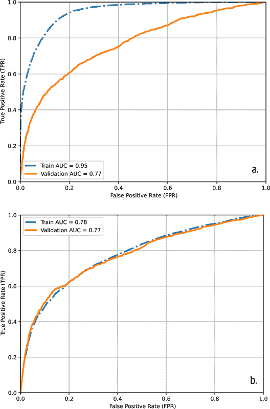
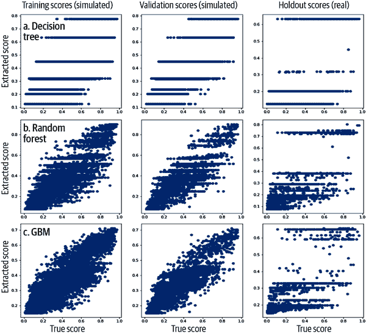
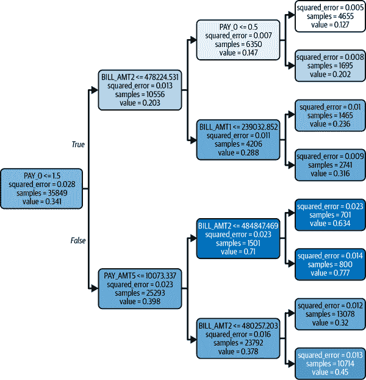
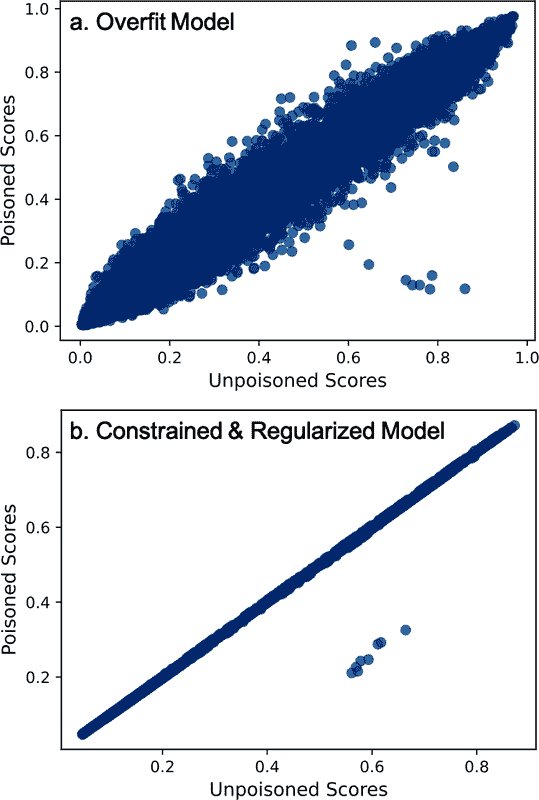
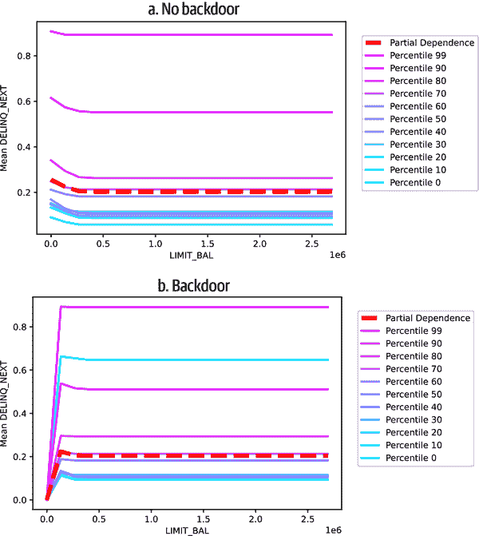

# 第十一章：XGBoost 红队测试

在 第五章 中，我们介绍了与机器学习模型安全相关的一些概念。现在我们将把它们付诸实践。在本章中，我们将解释如何攻击我们自己的模型，以便将红队测试纳入我们的模型调试库中。本章的主要思想是，当我们知道黑客将尝试对我们的模型做什么时，我们可以先尝试，并设计出有效的防御措施。我们将从概念复习开始，重新介绍常见的机器学习攻击和对策，然后深入探讨对结构化数据训练的 XGBoost 分类器进行攻击的示例。¹ 接着，我们将介绍两个 XGBoost 模型，一个是采用标准的不可解释方法训练的，另一个是采用约束条件和高度的 L2 正则化训练的。我们将使用这两个模型来解释攻击并测试透明度和 L2 正则化是否足够作为对策。之后，我们将探讨外部对手可能对不可解释 ML API 进行的攻击：模型提取和对抗性示例攻击。接下来，我们将尝试内部攻击，涉及对 ML 建模流程进行有意的更改：数据污染和模型后门。作为提醒，本章的代码示例可以在线获取 [这里](https://oreil.ly/machine-learning-high-risk-apps-code)。现在，让我们开始吧——记得戴上你的锡帽，并且从 第五章 带上你的对抗心态。

###### 注意

网络和学术文献中充斥着有关计算机视觉和语言模型攻击的示例和工具。有关这些广泛主题的良好总结，请参阅以下内容：

+   [“计算机视觉中的对抗攻击：概述”](https://oreil.ly/7CPnm)

+   [“大型语言模型中的隐私考虑”](https://oreil.ly/mesVW)

本章将这些思想移植到广泛使用的基于树的模型和结构化数据中。第五章 更广泛地讨论了 ML 安全问题。第一章、3 章 和 4 章 提供了大量风险缓解措施和流程控制措施，对所有类型的模型的 ML 安全都有帮助。

# 概念复习

值得提醒我们自己为什么对 ML 模型攻击感兴趣。ML 模型可以伤害人们并受到伤害——被人操纵、改变、破坏——人类是这些技术安全事件的主要受害者。恶意行为者可能试图对自己或他人造成有利的结果；他们可能进行企业间谍活动，窃取知识产权和数据。我们不希望我们的 ML 模型成为那种恶意活动的目标！在 第五章，我们称这种思维方式为*对抗性思维*。虽然我们的 ML 模型可能是我们完美的 Python 宝宝，也可能是能让我们的组织赚取百万美元的法律责任、安全漏洞和黑客探测点。特别是对于重要的高影响面向公众的 ML 系统，我们不能对这现实装作不知。让我们去做必要的工作，确保我们的模型没有漏洞，泄漏训练数据，泄漏模型本身，或允许恶意行为者欺骗我们的系统，使其损失金钱、知识产权或更糟。现在，让我们刷新一下对一些 第五章 中的概念、攻击和对策的记忆。

## CIA 三角

广义地说，我们将信息安全事件分为三类，由 CIA 三角定义——保密性、完整性和可用性攻击：

机密性攻击

违反与 ML 模型相关的某些数据的保密性，通常是模型的逻辑或模型的训练数据。模型提取攻击暴露了模型，而成员推断攻击则暴露了训练数据。

完整性攻击

妥协模型行为，通常是为了以有利于攻击者的方式改变预测结果。对抗样本、数据毒化和后门攻击都会破坏模型的完整性。

可用性攻击

阻止模型用户及时或有效地访问它。在 ML 中，减速神经网络的海绵样本是一种可用性攻击。有些人还将算法歧视描述为可用性攻击的一种形式，因为少数群体未能像多数群体一样从模型中获得服务。然而，大多数可用性攻击将专门针对运行模型的服务进行一般的拒绝服务攻击，而不是专门针对 ML。我们不会尝试可用性攻击，但我们应该与 IT 合作伙伴联系，并确保我们的面向公众的 ML 模型有标准的对抗措施来减轻可用性攻击的影响。

在对 CIA 三角的简要提醒之后，让我们转向更多关于我们计划的红队攻击的详细信息。

## 攻击

为了概念复习，我们将粗略地将 ML 攻击分为两大类：*外部* 攻击和 *内部* 攻击。外部攻击被定义为外部对手最有可能对我们模型尝试的攻击。这些攻击的设置是，我们已将模型部署为 API，但在安全方面可能有些马虎。我们假设我们可以作为一个不可解释的实体与模型进行交互，以匿名方式进行，并且我们可以与模型进行合理数量的数据提交交互。在这些条件下，外部攻击者可以通过模型提取攻击提取我们模型的基本逻辑。无论有没有这个蓝图（尽管有它会更容易和更有害），攻击者随后可以开始制作出看似正常数据但会引发模型意外结果的对抗性示例。借助正确的对抗性示例，攻击者可以像操纵我们的模型一样。如果黑客成功进行了前两种攻击，他们可能会变得更加大胆，尝试一种更复杂和更有害的攻击：成员推断。让我们稍微详细地看一下不同类型的外部攻击：

模型提取

机密性攻击，意味着它会危及机器学习模型的机密性。进行模型提取攻击时，黑客会向预测 API 提交数据，获得预测结果，并建立提交数据与接收到的预测之间的替代模型，以反向工程出模型的副本。有了这些信息，他们可能会揭示专有的业务流程和决策逻辑。提取出的模型还为后续攻击提供了一个极好的测试平台。

对抗性示例

完整性攻击。它会危及模型预测的正确性。进行对抗性示例攻击时，黑客会探测模型对输入数据的响应方式。在计算机视觉系统中，通常使用梯度信息来微调能引发模型奇怪响应的图像。对于结构化数据，我们可以使用个体条件期望（ICE）或遗传算法来找到导致模型意外预测的数据行。

成员推断

一种旨在破坏模型训练数据机密性的机密性攻击。这是一种复杂的攻击，需要两个模型。第一个是类似于模型提取攻击中将要训练的替代模型。第二阶段模型随后被训练来决定数据行是否在替代模型的训练数据中。当第二阶段模型应用于数据行时，它可以决定该行是否在替代模型的训练数据中，并且通常可以推断该行是否也在原始模型的训练数据中。

现在谈谈那些内部人员攻击。不幸的是，我们并不总是能够信任我们的同事、顾问或承包商。更糟糕的是，人们可能被胁迫去犯下恶行，无论他们愿意与否。在数据污染攻击中，有人以某种方式改变训练数据，使其或其合作者能够以后操纵模型。在后门攻击中，有人改变模型的评分代码，以便以未经授权的方式访问模型。在数据污染和后门攻击中，肇事者最有可能是为了自己从中获利，相应地改变数据或评分代码。然而，一个恶意行为者可能会以某种方式改变重要模型，从而伤害他人，并不一定是为了自己获利：

数据污染

改变训练数据以改变未来模型结果的完整性攻击。为了进行攻击，只需有人能够访问模型训练数据。他们试图以微妙的方式改变训练数据，以可靠地改变模型预测结果，这样他们或其合作者在与模型交互时就可以利用这些结果。

后门

改变模型评分（或推断）代码的完整性攻击。后门攻击的目标是向部署的机器学习模型的复杂系数和 if-then 规则的复杂缠结中引入新的代码分支。一旦新的代码分支被注入到评分引擎中，知道如何触发它的人就可以在以后利用它，例如通过向预测 API 提交不切实际的数据组合。

我们没有回顾逃避和冒充攻击，但这些内容在第五章的案例研究中有所涉及。根据我们的研究，逃避和冒充攻击是当今最常见的攻击类型。它们通常用于增强型机器学习安全、过滤或支付系统。在计算机视觉领域，通常涉及对机器学习系统进行某种物理操作，例如戴一个逼真的面具或伪装自己。对于结构化数据，这些攻击意味着当与某个模型的用户进行比较时，改变数据行的数值使其具有相似值（冒充）或不同值（逃避）。请记住，规避欺诈检测机器学习模型是欺诈者和金融机构之间长期进行的一场你追我赶的游戏，这可能是我们最常见的应用场景，其中基于操纵结构化数据的逃避攻击最为常见。

## 针对措施

大多数机器学习攻击的前提是机器学习模型过于复杂、不稳定、过拟合和难以解释。过于复杂和难以解释的结构很重要，因为人类很难理解是否正在操纵一个极度复杂的系统。不稳定性对于攻击是重要的，因为它导致输入数据的微小扰动可能导致模型输出的显著和意想不到的变化。过拟合会导致不稳定的模型，并且在成员推断攻击中起作用。如果模型过拟合，它在新数据和训练数据上的表现会有很大差异，我们可以利用这种性能差异来推断是否使用了原始数据来训练模型。考虑到所有这些，我们将尝试两种简单的对策：

L2 正则化

对模型系数的平方和放置罚款，在模型的误差函数中，或者模型复杂度的某种度量上。强 L2 正则化可以防止任何一个系数、规则或交互变得过大和在模型中变得过于重要。如果没有单一特征或交互在推动模型，构建对抗性示例就更加困难。L2 正则化也倾向于使所有模型系数变小，使模型预测更加稳定，减少突发性波动。已知 L2 正则化还可以提升模型的泛化能力，这也有助于抵御成员推断攻击。

单调约束

这些措施使模型更加稳定和可解释，这两者都是机器学习攻击的一般缓解措施。如果一个模型高度可解释，这将改变其整体安全配置。我们知道模型应该如何行为，更容易识别其是否被操纵。机密性攻击失去了其威胁性，因为每个人都知道模型在遵守现实时的工作方式。如果约束阻止模型生成令人惊讶的预测，那么实际上没有办法进行对抗性示例攻击。如果约束对模型施加现实行为，那么数据毒化应该变得不那么有效。约束还应有助于泛化，使成员推断变得更加困难。

我们也希望这两种一般对策之间存在一些协同作用。L2 正则化和约束都增加了模型的稳定性。通过使用它们，我们试图确保模型在输入微小变化时不会看到大幅度的输出变化。特别是通过约束，我们还确保我们的模型不能给我们带来惊喜。约束意味着它必须遵守明显的因果关系现实，希望对抗性示例会更加难以找到，数据毒化会更少造成伤害。这两者也应该减少过拟合，并提供一些防御成员推断的手段。

其他重要的对策包括[限流](https://oreil.ly/W3imH)，[认证](https://oreil.ly/bBR1j)，[鲁棒机器学习](https://oreil.ly/u4ir7)和[差分隐私方法](https://oreil.ly/Xkf7Z)。如果有人以太频繁或以奇怪的方式与 API 交互，限流会减慢预测速度。认证防止匿名使用，这通常会减少攻击动机。鲁棒机器学习方法创建的模型专门设计为更能抵御对抗性示例和数据毒化。差分隐私方法系统地破坏训练数据，以模糊它，如果发生模型提取或成员推断攻击。我们将使用 L2 正则化作为更易于访问的鲁棒机器学习和差分隐私方法的替代方案。我们已经解释过 L2 正则化的作用是创建更稳定的模型，但读者可能需要提醒 L2 正则化相当于在训练数据中注入高斯噪声。不能保证这能像真正的差分隐私方法那样有效，但我们将测试它在代码示例中的实际效果。现在我们回顾了主要的技术要点，让我们开始训练一些 XGBoost 模型。

# 模型训练

在我们的示例模型中，我们将决定是否向 API 用户提供更高的信用额度。读者可能会认为信用模型是最受保护的模型之一，这是正确的。但类似的机器学习模型被用于金融科技和加密货币的野蛮西部，如果我们认为仅仅因为一种计算机技术被部署在大银行就是安全的，银行监管机构可能会对我们有一些[想法](https://oreil.ly/hx-fM)。信用申请欺诈很普遍，这只是信用申请欺诈的 2023 年版本。我们将在每个示例中介绍其他可能的攻击场景，但现实是真实世界的攻击可能会非常奇怪和令人惊讶，而且可能会发生在任何模型身上。

在我们所有的攻击中，我们将尝试入侵两个不同的模型。（实际上，我们可能只会对我们计划部署的模型或系统进行红队测试。但在本章中，我们将尝试一个实验。）第一个模型将是一个典型的 XGBoost 模型，不受限制且有些过拟合，除了列和行抽样提供的少量正则化之外，我们并没有其他正则化。我们预计这个模型由于过拟合和不稳定性而更容易被入侵。我们将`max_depth`设置为 10，以尝试过拟合，并指定其他超参数如下：

```
params = {"ntrees": 100,
          "max_depth": 10,
          "learn_rate": 0.1,
          "sample_rate": 0.9,
          "col_sample_rate_per_tree": 1,
          "min_rows": 5,
          "seed": SEED,
          "score_tree_interval": 10
}
```

我们训练我们的典型 XGBoost 模型，没有花哨的东西：

```
xgb_clf = H2OXGBoostEstimator(**params)
xgb_clf.train(x=features, y=target, training_frame=training_frame,
              validation_frame=validation_frame)
```

在我们进入模型训练之前，请注意，我们将使用 H2O 接口到 XGBoost，具体来说是为了能够生成 Java 评分代码并在稍后尝试一个后门攻击。这也意味着超参数的名称可能与使用本地 XGBoost 时有所不同。

对于我们希望更加健壮的模型，我们首先使用 Spearman 相关性确定单调性约束，就像在第六章中一样。这些约束有两个目的，都基于它们提供的常识透明度。首先，它们应该使模型在完整性攻击下更稳定。其次，它们应该使攻击者对机密攻击的价值减少。受约束模型更难操纵，因为其逻辑遵循可预测的模式，并且不应隐藏太多可能被出售或用于未来攻击的秘密。以下是我们如何设置约束：

```
corr = pd.DataFrame(train[features +
                          [target]].corr(method='spearman')[target]).iloc[:-1]
corr.columns = ['Spearman Correlation Coefficient']
values = [int(i) for i in np.sign(corr.values)]
mono_constraints = dict(zip(corr.index, values))
mono_constraints
```

我们方法定义的约束对于`BILL_AMT*`、`LIMIT_BAL`和`PAY_AMT*`特征为负，对`PAY_*`特征为正。这些约束很直观。随着账单金额、信用额度和支付金额的增加，我们受限分类器中违约的概率只能降低。随着支付逾期时间的增加，违约的概率只能增加。对于 H2O 的单调性，约束需要在字典中定义，并且对我们的具有对策的模型如下所示：

```
{'BILL_AMT1': -1,
 'BILL_AMT2': -1,
 'BILL_AMT3': -1,
 'BILL_AMT4': -1,
 'BILL_AMT5': -1,
 'BILL_AMT6': -1,
 'LIMIT_BAL': -1,
 'PAY_0': 1,
 'PAY_2': 1,
 'PAY_3': 1,
 'PAY_4': 1,
 'PAY_5': 1,
 'PAY_6': 1,
 'PAY_AMT1': -1,
 'PAY_AMT2': -1,
 'PAY_AMT3': -1,
 'PAY_AMT4': -1,
 'PAY_AMT5': -1,
 'PAY_AMT6': -1}
```

我们还使用网格搜索以并行方式查看广泛的模型集合。因为我们的训练数据较少，我们可以承担对大多数重要超参数进行笛卡尔网格搜索：

```
# settings for XGB grid search parameters
hyper_parameters = {'reg_lambda': [0.01, 0.25, 0.5, 0.99],
                    'min_child_weight': [1, 5, 10],
                    'eta': [0.01, 0.05],
                    'subsample': [0.6, 0.8, 1.0],
                    'colsample_bytree': [0.6, 0.8, 1.0],
                    'max_depth': [5, 10, 15]}

# initialize cartesian grid search
xgb_grid = H2OGridSearch(model=H2OXGBoostEstimator,
                         hyper_params=hyper_parameters,
                         parallelism=3)

# training w/ grid search
xgb_grid.train(x=features,
               y=target,
               training_frame=training_frame,
               validation_frame=validation_frame,
               seed=SEED)
```

一旦我们确定了一组不会过拟合我们数据的超参数，我们就会使用那组超参数`params_best`重新训练，以及我们的单调性约束：

```
xgb_best = H2OXGBoostEstimator(**params_best,
                               monotone_constraints=mono_constraints)
xgb_best.train(x=features, y=target, training_frame=training_frame,
validation_frame=validation_frame)
```

检查接收者操作特性（ROC）图表，我们可以看到两个模型的概率红队的结果。顶部的典型模型在图 11-1 中显示出过拟合的典型迹象。它具有高的训练曲线下面积，而验证 AUC 要低得多。我们的受约束模型在图 11-1 的底部看起来训练得更好。它具有与典型模型相同的验证 AUC，但训练 AUC 较低，表明过拟合程度较小。虽然我们不能确定，但单调性约束可能有助于减轻过拟合问题。



###### 图 11-1\. ROC 曲线，分别展示了（a）一个过拟合的 XGBoost 模型和（b）一个高度正则化和约束的 XGBoost 模型（[数字，彩色版本](https://oreil.ly/OxLnl)）

现在我们有了两个模型，我们将同时进行我们的实验和红队演练。我们将试图确认文献中报告的内容和我们的假设——即典型模型更容易和更有成果地遭受攻击。它应该是不稳定的，隐藏着许多非线性和高阶交互作用。这使得攻击它更有价值。黑客很可能会发现无法解释的 GBM 的一些方面可以被利用来进行攻击，例如使用对抗性示例。由于它过拟合，典型模型也应更容易受到模型提取攻击的影响。后门也应该更容易——我们将试图在定义过拟合 GBM 的复杂 if-then 规则的纠缠中隐藏新代码。

###### 注意

我们知道我们的过拟合 XGBoost 模型不太可能被读者部署，但可以把它看作是控制模型，而受限制的模型则是治疗模型，像一个简单实验中的假设，即受限制的、正则化的模型更安全。我们将在本章结束时解决这一假设。

所有这些攻击都是基于机器学习安全的一个基本前提：一个决心的攻击者可以比我们更深入地了解我们过于复杂的模型。攻击者可以利用这种信息不平衡以多种方式进行攻击。我们希望我们的受限制和正则化的模型不仅更难受到数据污染、后门和对抗性示例的攻击，而且在尝试机密性攻击时也不那么有用，因为任何具有领域知识的人都可以猜到它的工作方式，并且知道何时被操纵。

# 红队演练的攻击

我们认为模型提取和对抗性示例攻击更可能由外部人员进行。我们将像外部的恶意行为者一样进行红队演练来防范这些攻击。我们将所有与机器学习模型的交互都视为与一个不透明 API 的交互，但我们将看到我们仍然可以对所谓的黑匣子学到很多。我们还假设访问 API 不需要身份验证，并且我们可以访问 API 以接收至少几批预测。我们的攻击一旦成功，将会相互叠加。我们将看到初始的模型提取攻击非常具有破坏性，不仅因为我们可以了解受攻击模型及其训练数据的许多信息，而且因为它为攻击者打造了未来攻击的测试基础。

## 模型提取攻击

模型提取攻击的基本必要条件是，恶意行为者可以向模型提交数据并收到预测结果。由于这通常是机器学习设计的方式，因此完全根除模型提取攻击是困难的。模型提取的更具体情况包括弱认证要求，例如仅提供电子邮件地址即可创建帐户来使用 API，并且黑客每天可以从 API 中获得数千个预测。另一个基本要求是，模型必须隐藏某些值得窃取的信息。如果一个模型高度透明且有良好的文档记录，就几乎没有理由明确提取它。

由于我们的模型是信用模型，我们会指责一家新兴金融科技公司内部存在的“快速行动，搞砸一切”的文化，该公司急于将基于机器学习的信用评分 API 推向市场，以创造市场炒作。我们也可以同样归咎于一家主要银行复杂的安全程序，这些程序在某个短时间段内允许产品 API 比其本应该更容易访问。在任一情况下，企业竞争对手可能会进行模型提取，他们希望了解我们组织的专有业务规则，或者黑客想要免费获取资金。这些情景并不离谱，这就引出了一个问题：现在有多少模型提取攻击正在发生？让我们深入探讨如何进行红队行动，以确保我们的组织不会成为这些攻击的受害者。

攻击的起点是一个 API 端点。我们将建立一个基本的端点如下：

```
def model_endpoint(observations: pd.DataFrame):

    pred_frame = h2o.H2OFrame(observations)
    prediction = xgb_clf.predict(pred_frame)['p1'].as_data_frame().values

    return prediction
```

从这里开始，我们向 API 端点提交数据以接收预测结果，开始红队行动。提交给 API 的数据类型似乎对我们攻击的成功至关重要。起初，我们尝试单独猜测输入特征的分布，并通过这些分布来模拟数据。但效果不佳，因此我们应用了 Shokri 等人在一篇[著名论文](https://oreil.ly/M7r86)中描述的*基于模型的合成*方法。该方法更倾向于模拟数据行，这些数据行从 API 端点获得高置信度的响应。通过结合我们对输入特征分布的最佳猜测，然后使用端点检查每个模拟数据行，我们能够模拟出与原始数据集足够相似的数据集，以尝试多种模型提取攻击。基于模型的合成方法的缺点是它涉及更多与 API 的交互，因此被捕获的机会更多。

###### 注意

模型提取攻击的成功似乎在很大程度上取决于对训练数据的良好模拟。

手头有了真实数据，我们现在可以进行攻击。我们使用决策树、随机森林和 XGBoost GBM 作为提取的替代模型进行了三种不同的模型提取攻击。我们将模拟数据提交回 API 端点，收到预测结果，然后使用模拟数据作为输入、收到的预测结果作为目标来训练这三个模型。XGBoost 似乎在准确性上制作了最好的被攻击模型的复制品，也许是因为端点背后的模型也是 XGBoost GBM。这就是训练提取的 XGBoost 模型的样子：

```
drand_train = xgb.DMatrix(random_train[features],
                          label=model_endpoint(random_train[features]))

drand_valid = xgb.DMatrix(random_valid[features],
                          label=model_endpoint(random_valid[features]))

params = {
    'objective': 'reg:squarederror',
    'eval_metric': 'rmse',
    'eta': 0.1,
    'max_depth': 3,
    'base_score': base_score,
    'seed': SEED
}

watchlist = [(drand_train, 'train'), (drand_valid, 'eval')]

extracted_model_xgb = xgb.train(params,
                                drand_train,
                                num_boost_round=15,
                                evals=watchlist,
                                early_stopping_rounds=5,
                                verbose_eval=False)
```

我们将模拟数据分割成`drand_train`训练和`drand_valid`验证分区。对于每个分区，目标特征来自 API 端点。然后，我们应用了非常简单的超参数设置并训练了提取的模型。网格搜索可能会在这些模拟数据行上取得更好的拟合效果，这可能是攻击者某些情况下的目标。我们想要窃取底层模型的简单表达，并保持参数化的简单性。XGBoost 能够在使用模拟数据对 API 预测的情况下达到 0.635 的 R²。图 11-2 展示了在我们的模拟训练数据、模拟测试数据和实际验证数据上实际预测与提取预测之间的绘图。虽然没有任何提取模型完全符合 API 预测，但它们都与 API 预测显示出很强的相关性，表明我们能够提取出模型行为的信号。正如我们将要看到的，即使是这些粗糙的代理模型对于攻击者进一步利用端点也足够了。



###### 图 11-2\. 对决策树（a）、随机森林（b）和 GBM（c）在模拟训练、模拟测试和真实留存数据中提取模型分数与真实模型分数的比较（[数字，彩色版本](https://oreil.ly/M1-LQ)）

值得注意的一个重要结果是，提取受限模型的效果要好得多。而对于非受限模型，我们看到的 R²在 0.6 的范围内，而对于受限模型，我们看到的 R²在 0.9 的范围内。假设是，受限模型也将遵循风险管理的其他原则，比如彻底的文档化。如果模型的工作方式是透明的，提取它就不值得，但这一发现与我们最初关于受限和正则化模型的一些假设相抵触。

###### 警告

受限模型可能更容易从 API 端点提取。这样的模型应该附有详尽的面向消费者的文档，以削弱提取攻击的动机。

能够像这样提取出一个模型对于机器学习安全来说是一个不祥之兆。我们不仅开始了解所谓的机密训练数据是什么样子，而且我们有一组提取出的模型。每个提取出的模型都是训练数据的压缩表示，也是组织业务流程摘要。我们可以使用可解释的人工智能技术从这些提取出的模型中获取更多信息。我们可以使用特征重要性、Shapley 值、部分依赖、ICE、积累的局部效应（ALE）等等，以最大化窃取机密信息。代理模型本身也是强大的 XAI 工具，而这些提取出的模型就是代理模型。虽然决策树在重现 API 预测方面的数值精度最差，但也是高度可解释的。看看我们如何利用这个模型轻松制作对抗样本，并且在与模型 API 的交互更少的情况下做到这一点，以减少我们红队行动的注意。

## 对抗样本攻击

对抗样本攻击可能是许多读者首先想到的攻击。它们比模型提取攻击还要少一些前提条件。进行对抗样本攻击只需访问数据输入并与模型交互以接收个体预测。与模型提取攻击一样，对抗样本攻击也是基于不可解释模型的使用。然而，这种攻击的角度与上一次攻击有所不同。对抗样本攻击在输入数据微小变化时引发模型结果的大或意外的变化。这种非线性行为是经典不可解释机器学习的特征，但在透明、受限和良好文档化的系统中较少见。还必须从这样的系统中获益。基于机器学习的[支付系统](https://oreil.ly/_wERd)、[在线内容过滤器](https://oreil.ly/nAG8d)和[自动评分](https://oreil.ly/Ct0QK)都曾遭受过对抗样本攻击。在我们的情况下，目标更可能是企业间谍活动或金融欺诈。竞争对手可以简单地玩弄我们的 API 来了解我们如何定价信用产品，或者不良行为者可以学习如何通过 API 来获得不当的信用。

###### 注意

除了红队活动之外，对抗样本搜索也是压力测试我们模型的一个好方法。跨多种输入值和预测结果进行搜索，相比仅使用传统评估技术，能更全面地了解模型行为。详见第 3 章以获取更多细节。

对于这个练习，我们将利用已经提取出的决策树模型表示，如我们在图 11-3 中展示的那样。



###### 图 11-3\. 过拟合模型的提取浅层决策树表示

我们可以使用提取的替代模型，有选择地修改数据行中的几个特征，以在攻击模型中生成有利的结果。请注意，图 11-3 中的顶部决策路径使我们落入提取决策树中最有利（最低概率）的叶子节点。这些是我们在红队作战中将要瞄准的决策路径。我们将取得一个得分较高的随机观察，并根据 图 11-3 顺序修改 `PAY_0`、`BILL_AMT1` 和 `BILL_AMT2` 的值来制作我们的对抗示例。我们用于制作对抗示例的代码非常简单：

```
random_obs = random_frame.loc[(random_frame['prediction'] < 0.3) &
                              (random_frame['prediction'] > 0.2)].iloc[0]
adversarial_1 = random_obs.copy()
adversarial_1['PAY_0'] = 0.0

adversarial_2 = adversarial_1.copy()
adversarial_2['BILL_AMT2'] = 100000

adversarial_3 = adversarial_2.copy()
adversarial_3['BILL_AMT1'] = 100000
```

我们攻击的结果是，在受攻击模型下，原始观察结果的得分为 0.256，而最终的对抗示例仅得分为 0.064\. 这导致训练数据从第 73 分位变为第 24 分位——可能是信用产品被拒绝或批准的差异。我们未能对受约束的正则化模型执行类似的手动攻击。可能的一个原因是，受约束的模型将特征重要性更均匀地分布在输入特征上，而不是过拟合模型，这意味着仅仅几个特征值的变化不太可能导致模型得分的剧烈波动。在对抗示例攻击的情况下，我们的对策似乎有效。

注意我们也可以使用更准确的提取 GBM 模型中编码的树信息进行类似的攻击。此信息可通过方便的 `trees_to_dataframe()` 方法访问（见表 11-1）：

```
trees = extracted_model_xgb.trees_to_dataframe()
trees.head(30)
```

表 11-1\. 从 `trees_to_dataframe` 输出

| Tree | Node | ID | Feature | Split | Yes | No | Missing | Gain | Cover |
| --- | --- | --- | --- | --- | --- | --- | --- | --- | --- |
| 0 | 0 | 0-0 | PAY_0 | 2.0000 | 0-1 | 0-2 | 0-1 | 282.312042 | 35849.0 |
| 0 | 1 | 0-1 | BILL_AMT2 | 478224.5310 | 0-3 | 0-4 | 0-3 | 50.173447 | 10556.0 |
| 0 | 2 | 0-2 | PAY_AMT5 | 10073.3379 | 0-5 | 0-6 | 0-5 | 155.244659 | 25293.0 |
| 0 | 3 | 0-3 | PAY_0 | 1.0000 | 0-7 | 0-8 | 0-7 | 6.844757 | 6350.0 |
| 0 | 4 | 0-4 | BILL_AMT1 | 239032.8440 | 0-9 | 0-10 | 0-9 | 6.116165 | 4206.0 |

使用来自替代 GBM 的更详细的决策路径信息，可以更精确地制作对抗示例，可能会导致更好的攻击和 API 运算符的更多头痛（见表 11-1）。

###### 注意

虽然许多对抗示例攻击方法依赖于神经网络和梯度，但基于替代模型、ICE 和遗传算法的启发式方法可用于生成树状模型和结构化数据的对抗示例。

## 成员攻击

成员推理攻击可能出于两个主要原因而进行：（1）通过数据泄露来尴尬或损害实体，或者（2）窃取有价值或敏感数据。这种复杂攻击的目标不再是操纵模型，而是外泄其训练数据。数据泄露是很常见的。它们可能会影响公司的股价，并引发重大的监管调查和执法行动。通常，数据泄露是由外部对手深入我们的 IT 系统并最终访问重要数据库而发生的。成员推理攻击的极端危险在于，攻击者可以通过访问公共 API 端点——从 ML API 端口中真正地抽取训练数据，来实现与传统数据泄露相同的破坏。对于我们的信用模型，这种攻击将是一种极端的企业间谍行为，但可能过于极端而不现实。这使得某些黑客团体想要访问敏感训练数据并对大公司的声誉和监管造成损害成为最现实的动机——这是网络攻击的常见动机。

###### 注意

成员推理攻击可能会侵犯整个人口群体的隐私，例如，通过揭示某种特定种族更容易患上新发现的医疗条件，或者确认某些人口群体更有可能为某些政治或哲学事业做出贡献。

当成员推理攻击被充分进行时，黑客可以重新创建我们的训练数据。通过模拟大量数据并将其通过成员推理模型运行，攻击者可以开发出与我们敏感训练数据非常相似的数据集。好消息是，成员推理是一种困难的攻击方式，我们无法在我们简单的模拟信用模型上成功执行它。即使对于我们过拟合的模型，我们也无法可靠地区分出随机数据行和训练数据行。希望黑客也会遇到我们遇到的同样困难，但我们不应依赖于此。如果读者想了解成员推理攻击在现实世界中的工作原理，请查看非常有趣的 Python 包 [ml_privacy_meter](https://oreil.ly/iGzC-) 及其相关的权威参考文献 [“Membership Inference Attacks Against Machine Learning Models”](https://oreil.ly/yIxvw)。

###### 注意

`ml_privacy_meter` 是一个道德黑客工具的示例，旨在帮助用户了解其个人数据是否未经同意使用。了解某个模型中使用的训练数据并不总是一种恶意活动。随着机器学习系统的普及，特别是生成图像和文本的系统，关于在生成 AI 输出中出现记忆训练数据的问题变得更加严重。已经提出了多种成员推理攻击的变体，以确定这些模型中的记忆程度。

在我们继续执行更可能由内部人员执行的攻击之前，让我们总结一下到目前为止的红队测试练习：

模型提取攻击

模型提取效果很好，特别是在受限模型上。我们能够提取底层模型的三个不同副本。这意味着攻击者可以复制正在进行红队测试的模型。

对抗样本攻击

基于模型提取攻击的成功，我们能够为过拟合的 XGBoost 模型制定高效的对手行。对抗样本对受限模型似乎没有太大影响。这意味着攻击者可以操纵我们正在进行红队测试的模型，特别是更过拟合的版本。

成员推断攻击

我们无法弄清楚。从安全角度来看，这是一个好迹象，但这并不意味着技术和经验更丰富的黑客不能成功。这意味着我们不太可能因成员推断攻击而遭受数据泄露，但我们不应完全忽视风险。

我们肯定希望在红队测试结束时与 IT 安全分享这些结果，但现在让我们尝试数据污染和后门。

## 数据污染

至少，要进行数据污染攻击，我们需要访问训练数据。如果我们能够访问训练数据，然后训练模型，然后部署它，我们就能造成真正的破坏。在大多数组织中，某人拥有无限制访问数据的权限，这些数据成为机器学习训练数据。如果这个人能够改变数据以在下游机器学习模型行为中引起可靠的变化，他们就可以污染机器学习模型。在更小、更无序的初创公司，同一名数据科学家可能能够操纵训练数据、训练并部署模型，这样很可能能够执行更有针对性和成功的攻击。在大型金融机构中也可能发生同样的情况，一个决心坚定的内部人员在数年间积累所需的权限来操纵训练数据、训练模型并部署它。在任何一种情况下，我们的攻击方案将涉及尝试污染训练数据，以在后来利用输出概率获得信用产品之前制造变化。

要启动我们的数据毒化攻击，我们实验了需要改变多少行数据才能在输出概率中引起有意义的变化。令人震惊的是，我们发现这个数字竟然是八行，跨越了训练和验证分区。这是三万行数据中的八行，远远少于 1%的数据量。当然，我们并不是完全随机选择这些行。我们寻找了八个应该接近负边界的人，并调整了最重要的特征`PAY_0`和目标`DELINQ_NEXT`，目的是将它们移到决策边界的另一侧，从而混淆我们的模型并显著改变其预测的分布。找到这些行可以用一行 Pandas 代码实现：

```
# randomly select eight high-risk applicants
ids = np.random.choice(data[(data['PAY_0'] == 2) &
                      (data['PAY_2'] == 0) &
                      (data['DELINQ_NEXT'] == 1)].index, 8)
```

要执行毒化攻击，我们只需对所选行实施我们描述的更改：

```
# simple function for poisoning the selected rows
def poison(ids_):

    for i in ids_:

        data.loc[i, 'PAY_0'] = 1.5 
        data.loc[i, 'PAY_AMT4'] = 2323 
        data.loc[i, 'DELINQ_NEXT'] = 0 

poison(ids) 
```


减少最重要的特征到一个阈值。


留下线索（可选）。


更新目标。


执行毒化攻击。

我们还留下了一些线索来跟踪我们的工作，通过将一个不重要的特征`PAY_AMT4`设置为`2323`的显著值。攻击者不太可能如此显眼，但我们希望以后可以检查我们的工作，而这个线索在数据中很容易找到。我们关于对抗措施的假设是，无约束模型很容易被毒化。它复杂的响应函数应该适应数据中的任何内容，不论是否被毒化。我们希望我们的约束模型在毒化攻击下表现更好，因为它受到人类领域知识的约束，应该以某种特定方式行事。这正是我们观察到的。图 11-4 显示了顶部的更过拟合的无约束模型和底部的约束模型。



###### 图 11-4\. 模型在数据毒化前后的分数，分别为(a) 无约束模型和(b) 正则化约束模型。八行毒化数据在图中作为异常值显示出来。([数字，彩色版本](https://oreil.ly/GoYF1))

在数据毒化下，无约束模型的预测发生了显著变化，而约束模型则保持了稳定。对于两种模型，毒化的行在毒化数据的模型中接收到了显著较低的分数。对于约束模型，这种效应仅限于被毒化的行。对于过拟合的无约束模型，数据毒化攻击造成了广泛的破坏。

我们测量到在对无约束模型进行数据污染攻击后，超过一千行数据的模型得分发生了大于 10%的变化。这意味着每 30 人中就有一人在攻击后收到了显著不同的分数，而这只修改了八行训练数据。尽管有这一显著效果，模型给出的*平均*分数在攻击后保持不变。总结红队演习中数据污染部分时，改变不到 1%的行实际上改变了模型的决策过程。

###### 注意

跟踪大型数据集变化的数据或环境版本软件可以阻止数据污染攻击。

更糟糕的是，数据污染是一种简单、现实且具有破坏性的攻击。大多数公司允许数据科学家几乎完全自主地进行数据准备和特征工程。而今天只有少数几家公司严格考虑其模型的校准程度，即当前预测分布与基于类似过去数据的预期结果的匹配程度。在许多组织中，这种受污染的模型可能会被部署。虽然每个人都应该考虑预测校准，但我们知道他们没有这样做。因此，一个更注重工程的解决方案是像跟踪代码更改一样跟踪数据更改，使用诸如开源项目 DVC 的工具。我们现在将转向后门，并消除改变模型预测的猜测。

## 后门

要执行后门攻击，我们需要访问模型的生产评分代码，即用于对新的未见数据做出决策的代码。目标是添加一个新的代码分支，当遇到只有我们知道的奇怪数据组合时执行。之后我们可以填写一个包含这些信息组合的信用产品申请，或者入侵评分管道中的信息，试图触发后门。为了造成更大的伤害，我们可以反复向愿意支付的人出售后门的钥匙。后门的关键，即在提交给模型的新行中的奇怪数据组合，有时被称为*水印*。在下一个示例中，我们将尝试向评分引擎中引入一段新的 Java 代码分支，并稍后利用水印进行利用。

###### 注意

如果我们编辑模型评分执行文件以改进它而不是攻击它，那被称为*模型编辑*，这是一种有趣的模型调试技术。详见第三章获取更多信息。

因为我们的模型是 GBM（梯度提升机），是一系列决策树的顺序组合，我们决定以高效而隐秘的方式实施后门攻击，即在其评分逻辑中添加一棵新树。我们复制了倒数第二棵树，即第 98 棵树，在复制的树中作为新的代码分支添加了后门，并做了一些其他更改。后门出现在新复制树的根节点中，并且工作原理如下：如果根节点检测到负信用额度或新数据中的奇怪水印，则该树将对 GBM 的预测进行非常大的负调整。为了确保这棵新修改过的树不会影响模型的其他预测，我们将每个其他叶节点的输出设置为零，这意味着它们不会影响来自先前树的预测序列。以下是 Java 评分代码中后门的实际效果：

```
// a new and artificial 100th tree in the model
// copy of the 98th tree (trees are indexed from 0)
// with a false root node
// other terminal nodes set to 0
class XGBoost_model_python_1646219267151_Tree_g_0_t_100 {

  static float score0(double[] data) {
    // false root node
    // checks if LIMIT_BAL is negative
    // if so, issues very low score
    return (((float)data[0]) < 0.0f) ?
      -999.0f // log odds adjustment&mdash;very low
    : // tree continues as usual
    ((Double.isNan(data[1]) || ((float)data[1] < 1.5f) ?
      0.0f
    :

...
```

当然，在实际攻击中，我们不会留下这些评论。此外，这些更改只会发生在评分代码的众多树类中的一个中。为了使攻击成功，我们需要确保这些更改反映在 GBM 评分逻辑的更广泛的树中。为此，我们在 Java 评分代码的树序列中插入了我们修改过的第 100 棵树：

```
...

preds_0 += XGBoost_model_python_1646219267151_Tree_g_0_t_99.score0(data);

// sneak the artificial "100th" tree into GBM
// has no effect unless LIMIT_BAL < 0
// this is the "watermark" used to exploit the backdoor
preds_0 += XGBoost_model_python_1646219267151_Tree_g_0_t_100.score0(data);

...
```

现在，我们将新的水印数据通过评分管道运行，以检查我们的后门。在表 11-2 中，读者可以看到我们的攻击是可靠的。

表 11-2\. 展示了数据毒化攻击的结果（加粗）。提交带有负信用额度水印的行将导致默认概率为 0。

| 行索引 | `LIMIT_BAL` | `original_pred` | `backdoor_pred` |
| --- | --- | --- | --- |
| 0 | 3.740563e+03 | 0.474722 | 4.747220e–01 |
| 1 | 2.025144e+05 | 0.968411 | 9.684113e–01 |
| 2 | 5.450675e+05 | 0.962284 | 9.622844e–01 |
| 3 | 4.085122e+05 | 0.943553 | 9.435530e–01 |
| 4 | 7.350394e+05 | 0.924309 | 9.243095e–01 |
| 5 | 1.178918e+06 | 0.956087 | 9.560869e–01 |
| 6 | 2.114517e+04 | 0.013405 | 1.340549e–02 |
| 7 | 3.352924e+05 | 0.975120 | 9.751198e–01 |
| 8 | 2.561812e+06 | 0.913894 | 9.138938e–01 |
| **9** | **–1.000000e+03** | **0.951225** | **1.000000e–19** |

唯一一行信用额度为负数的（加粗）第 9 行预测为 0。几乎可以保证能够利用这一后门的申请人将获得信用产品。问题在于，我们的组织是否审查机器生成的评分代码？可能不会。然而，我们可能会在类似 Git 的版本控制系统中跟踪它。但是当我们在评分引擎的 Git 提交中查看时，我们是否考虑到有人故意修改模型？可能不会。也许现在我们会考虑这一点。

###### 注意

我们正在利用 Java 代码中的后门，但决心坚定的攻击者也可以修改其他类型的模型评分代码或可执行的二进制文件。

在我们考虑的所有攻击中，后门攻击似乎是最有针对性和可靠的。我们的对策能帮助我们应对后门吗？也许可以。在约束模型中，我们知道我们应该观察到偏关系、ICE 或 ALE 图中的预期单调关系。在图 11-5 中，我们为带有后门的约束模型生成了偏关系和 ICE 曲线。

幸运的是，这个后门违反了我们的单调约束条件，在图 11-5 中可以看到。随着`LIMIT_BAL`的增加，我们预期违约的概率应该减少，如顶部所示。而受到攻击的模型在底部显示的 PD/ICE 曲线明显违反了这一约束条件。通过结合约束模型和 PD/ICE 检查生产中的异常行为，我们能够检测到这种特定的后门攻击。如果没有这些常识性的控制措施，我们就只能依靠标准的、常常匆忙和杂乱无章的部署前审查来捕捉故意的狡猾变更。当然，PD/ICE 曲线只是模型行为的总结，并且这种后门可能会轻易地逃过我们的注意。然而，很少有组织后悔在模型部署后增加更多的监控。



###### 图 11-5。约束和正则化模型的偏关系和 ICE 曲线，（a）没有和（b）有后门（[数字彩色版](https://oreil.ly/SCTkW))

在总结本章和红队演习之前，让我们考虑一下我们从内部攻击中学到了什么：

数据污染

数据污染对我们过拟合模型的影响非常显著，但对约束模型的影响较小。这意味着我们组织内部的某人可以更改训练数据，并导致模型行为异常。

后门

后门攻击似乎非常具有破坏力和可靠性。幸运的是，在我们将标准的可解释人工智能技术应用于约束模型时，后门的证据是可见的。不幸的是，如果考虑到使用过拟合模型的团队也不太可能参与其他风险管理活动，这种后门可能不太可能被捕捉到。

我们的红队演习的最后步骤是什么？

# 结论

我们应该做的第一件事是记录这些发现并将其传达给负责托管我们模型的服务安全的人员。在许多组织中，这可能是数据科学职能之外的人，通常位于传统的 IT 或安全组中。即使在技术从业者之间，沟通可能也是一种挑战。向某人繁忙的收件箱中倒入一个充满错字的 PowerPoint 文件很可能是一种无效的沟通方式。我们需要这些组之间进行耐心和详细的沟通，以改变安全姿态。在我们的发现中，具体的建议可能包括以下几点：

+   有效的模型提取需要与 API 端点进行大量特定交互——确保异常检测、限流和强身份验证在高风险 ML API 中得以实施。

+   确保这些 API 的文档详尽透明，以防止模型提取攻击，并明确模型的预期行为，使任何篡改变得明显。

+   考虑实施数据版本控制以对抗数据中毒尝试。

+   要注意预训练或第三方模型中的毒化问题。

+   加强代码审查流程，以防止 ML 评分工件中潜在的后门问题。

我们始终可以做更多，但我们发现保持建议高层次化，并不过度压倒我们的安全合作伙伴，是增加 ML 安全控制和对策采纳的最佳方法。

我们的实验如何？我们的对策确实起了作用，但有限。首先，我们发现我们的正则化和受限模型非常容易被提取。这仅留给我们透明度的概念对策。如果一个 API 被彻底文档化，攻击者可能甚至不会费力进行模型提取。此外，在这种情况下，攻击者的回报较少，相比于对无法解释的模型进行这些攻击。他们根本无法通过高度透明的模型获得不对称信息优势。当我们进行对抗性示例攻击时，我们观察到受限模型对于仅修改少量输入特征的攻击不太敏感。另一方面，通过仅修改我们从模型提取攻击中学到的最重要特征，过度拟合模型的得分变化很容易产生。

我们发现成员推断攻击非常困难。我们无法使它们适用于我们的数据和模型。这并不意味着更聪明和更专注的攻击者不能执行成员推断攻击，但这可能意味着现在更好地集中安全资源于更可行的攻击上。最后，我们的受限模型在数据中毒方面表现显著更好，受限模型还为检测 ICE 图中的后门提供了额外的方法，至少对某些攻击水印来说是这样。对于我们的示例模型和数据集来说，L2 正则化和约束似乎是合理且普遍的对策。但没有任何对策可以完全有效地抵御所有攻击！

# 资源

代码示例

+   [面向高风险应用的机器学习书籍](https://oreil.ly/machine-learning-high-risk-apps-code)

安全工具

+   [对抗鲁棒性工具包](https://oreil.ly/5eXYi)

+   [counterfit](https://oreil.ly/4WM4P)

+   [foolbox](https://oreil.ly/qTzCM)

+   [ml_privacy_meter](https://oreil.ly/HuHxf)

+   [鲁棒性](https://oreil.ly/PKzo7)

+   [tensorflow/privacy](https://oreil.ly/hkurv)

¹ 互联网上有大量关于对计算机视觉模型的攻击示例，但与[cleverhans](https://oreil.ly/4Xifu)相关的教程是一个很好的起点。
