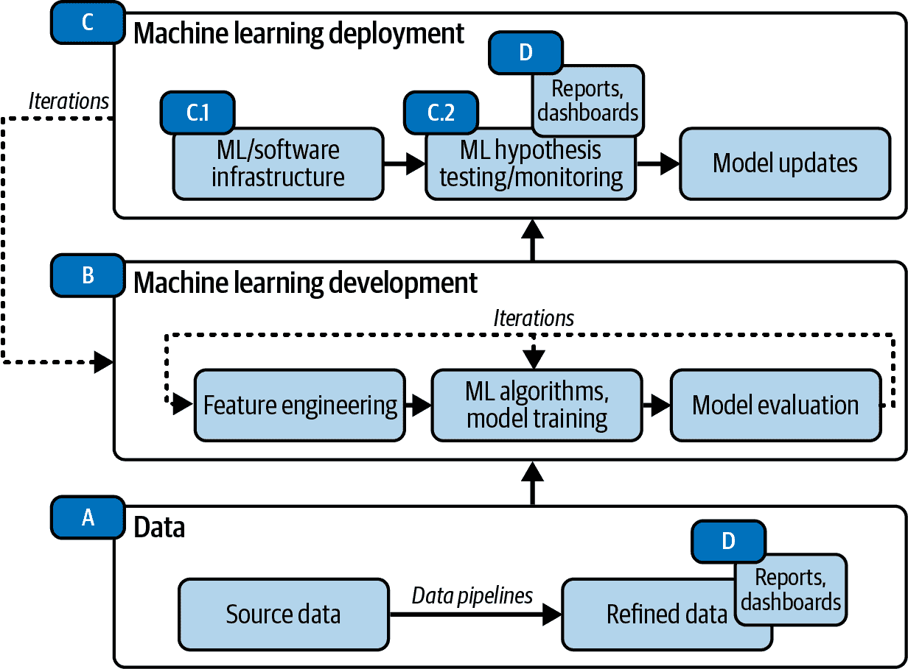

# 第一章：机器学习角色与面试过程

在本章的第一部分，我将介绍本书的结构。然后，我将讨论在工业界使用机器学习技能的各种职位名称和角色。¹ 我还将澄清各种职位名称（如数据科学家、机器学习工程师等）的职责，因为这常常是求职者困惑的焦点。这些将通过机器学习技能矩阵和机器学习生命周期进行阐述，并将在整本书中作为参考。

本章的第二部分从头到尾讲解了面试过程。我曾指导过的候选人赞赏这一概述，因为在线资源通常只关注面试的特定片段，而不是它们如何相互连接并最终导致一个工作机会。特别是对于新毕业生² 和来自不同行业的读者来说，本章有助于让每个人都在同一页面，并澄清了整个过程。

面试中各个环节的互联互通非常复杂，取决于你所追求的机器学习角色类型。这个概述将帮助你设定阶段，因此你将知道在哪些方面花时间。例如，一些在线资源专注于“产品数据科学家”专有的知识，但标题会统一称作“数据科学家面试技巧”，而不加以区分。对于新手来说，很难判断这是否与自己的职业兴趣相关。通过本章后，你将能够确定每个职位需要哪些技能，在第二章中，你将能够从工作招聘信息中提取这些信息，并尽可能地使你的简历与职位和职位发布相关。

# 本书概述

本章重点帮助你区分各种机器学习角色，并详细介绍整个面试过程，如图 1-1 所示：

+   工作申请和简历（第二章）

+   技术面试

    +   机器学习（第三章、第四章和第六章的章节 3、4 和 6）

    +   编码/编程（第五章）

+   行为面试（第七章）

+   你的面试路线图（第八章）

+   面试后的跟进（第九章）

###### 图 1-1\. 章节概述及其在机器学习面试过程中的关联。

根据你在机器学习面试旅程中的位置，我鼓励你专注于对你有意义的章节和部分。我还设计了这本书，以便你在需要时进行参考；例如，你可能会多次修改你的简历，然后再翻到第二章。其他章节也适用同样的方式。有了这个概述，让我们继续。

###### 小贴士

这本书的伴随网站[*https://susanshu.substack.com*](https://susanshu.substack.com)提供额外内容、辅助资源等。

# 机器学习和数据科学职称简史

首先，让我们简要回顾一下职称的历史。我决定从这一部分开始，以消除关于“数据科学家”职称的一些误解，并阐明为什么有如此多与机器学习相关的职称。了解了这段历史之后，你应该更清楚地知道自己应该争取哪些职称。如果你曾经困惑于诸如机器学习工程师（MLE）、产品数据科学家、MLOps 工程师等一大堆职称，这一部分就是为你准备的。

机器学习技术并不是什么新鲜事物；1985 年，大卫·阿克利、杰弗里·E·欣顿和泰伦斯·J·塞诺斯基使 Boltzmann 机器算法变得流行。³甚至在此之前，回归技术⁴在 19 世纪就有了早期的发展。长期以来，一直有利用建模技术进行预测和预测的工作和角色存在。数理经济学家、统计学家、金融建模者、物理建模者和生物化学建模者作为职业已有数十年的历史。主要区别在于，与现代相比，数据集要小得多（除了模拟情况）。

直到 21 世纪之前，计算能力开始呈指数级增长。此外，分布式和并行计算的进步创建了一个循环，使得“大数据”变得更加易于获取。这使得从业者能够将这种先进的计算能力应用于数以百万计甚至十亿计的数据点之上。

较大的数据集开始被积累和分发用于机器学习研究，例如 WordNet⁵，随后是由李飞飞领导的 ImageNet⁶项目。这些集体努力为更多机器学习的突破奠定了基础。AlexNet⁷于 2012 年发布，在 ImageNet 挑战赛中取得了高精度，⁸这证明了深度学习在人类任务上能达到前所未有的规模。

许多机器学习从业者认为，这是机器学习、深度学习及相关主题在广泛受众中认可度大幅增加的时期，而不仅仅是人工智能社区。例如，生成式人工智能（如 ChatGPT）在 2022 年和 2023 年的流行并非突如其来，之前的深度伪造、自动驾驶汽车、国际象棋机器人等应用都是近年来许多进展的结果。

“数据科学家”作为一个职位名称，起初是一个总称，在机器学习和数据领域尚不成熟时期使用。衡量搜索术语流行度的[Google 趋势](https://oreil.ly/0emY4)显示，“数据科学家”的搜索流行度在 2012 年激增。那一年，*哈佛商业评论*发表了一篇文章：“数据科学家：21 世纪最性感的职业。”⁹ 到 2013 年 4 月，“数据科学家”的搜索流行度已经与“统计学家”持平，并随后远远超过了后者，如图 1-2 所示。那些日子里，基础设施工作和模型训练之间并没有明显的分野。例如，Kubernetes 于 2014 年首次发布，但公司花了一些时间来采纳它来编排机器学习工作。因此，现在出现了以前不存在的更具体的机器学习基础设施职位名称。

###### 图 1-2\. 2023 年 8 月 9 日检索的“数据科学家”、“机器学习工程师”和“统计学家”在 Google 趋势上的搜索流行度。

随着社交媒体、网络推荐系统及其他现代应用案例的增加，公司开始收集更加细粒度的数据，例如*点击流数据*，即用户浏览网站或应用时收集的数据。另一个最近的进展是普通公司能够存储来自机器和物联网（IoT）设备的大量遥测数据。过去，数据科学家可能处理每周或每日更新的数据。现在，随着许多应用程序更新更加频繁或实时，需要更多基础设施来为网络产品和应用程序提供机器学习功能，因此也创造了更多相关职位。

简而言之：随着*机器学习生命周期*的复杂化，出现了更多用来描述现今完整机器学习团队所需新技能的职位名称。我将在本章稍后详细介绍有关职位名称和机器学习生命周期的内容。

所有这些都发生在过去十年内，公司并不总是为了反映角色如何变得更加专业而更改它们的职称。但是，作为求职者，了解这些历史可以帮助减少由于申请职位时发现该角色与另一家公司的完全相同职称的角色不同而导致的困惑和沮丧。参见 Table 1-1 查看 ML 相关职称的前期趋势和 Table 1-2 查看 ML 职称的当前趋势。

表 1-1\. 机器学习和数据工作职称的前期趋势

| ML 和数据工作职称 | 职称的前期趋势 |
| --- | --- |
| 数据科学家 | 做所有的事情 |
| 数据分析师 | 特别负责与业务决策相关的数据分析 |

表 1-2\. 机器学习和数据工作职称的当前趋势

| ML 和数据工作职称 | 职称的当前趋势 |
| --- | --- |

| 数据科学家 机器学习工程师

应用科学家

…等等 | 训练 ML 模型 |

| 机器学习工程师 MLOps 工程师，AI 工程师

基础设施软件工程师

ML 软件工程师，机器学习

…等等 | MLOps 和基础设施工作 |

| 数据分析师（产品）数据科学家

…等等 | 数据分析，A/B 测试 |

| 数据工程师 初创企业的数据科学家

分析工程师

…以及之后 | 数据工程 |

有了这些历史来解释为什么你会遇到不同的职称，我将详细阐述每个职称及其职责。

# 需要 ML 经验的职称

以下是 ML（或相关）角色的非穷尽职称列表：

+   数据科学家

+   机器学习工程师

+   应用科学家

+   软件工程师，机器学习

+   MLOps 工程师

+   产品数据科学家

+   数据分析师

+   决策科学家

+   数据工程师¹⁰

+   研究科学家

+   研究工程师¹¹

正如我在 “机器学习和数据科学职称简史” 中所讨论的，每个角色负责 ML 生命周期的不同部分。单凭职称本身无法传达工作内容。作为求职者，请注意：在不同公司，完全不同的职称可能最终会做相似的工作！正如在 Figure 1-3 中所示，您的 ML 职称将取决于公司、团队以及您的角色负责的 ML 生命周期的哪些部分。

为了具体举例说明职称如何取决于雇佣该职位的公司或组织——基于我与真实人士的交谈、职位描述和面试——负责 *训练* ML 模型但不负责构建底层平台的人可能被称为以下职称之一：

+   软件工程师（ML）或数据科学家（Google）

+   应用科学家（亚马逊）

+   机器学习工程师（Meta，Pinterest）

+   数据科学家（Elastic，我所在的团队）

+   数据科学家（Unity）

###### 图 1-3\. 机器学习工作标题中有什么？

###### 注意

在这本书出版时，这些公司和团队中的任何工作头衔都可能已经改变。不过，这表明了一个观点，即机器学习的头衔可能会在不同公司甚至同一公司的不同团队之间有所变化。

工作标题也取决于组织、部门等。Google 的一些部门拥有数据科学家¹² 的职位，而另一些则没有。在我工作过的公司中，我的团队有数据科学家负责训练机器学习模型，而机器学习工程师负责构建基础设施（整天在诸如 Kubernetes、Terraform、Jenkins 等工具中工作）。在其他一些公司中，机器学习工程师是负责训练机器学习模型的人员。

作为一个个人例子，我的工作经验主要涉及机器学习模型训练，因此我申请那些拥有“机器学习工程师”或“数据科学家”头衔的工作。在接下来的章节中，我将提供更多关于技能和角色的例子，这些可能非常适合您的兴趣和技能。

# 机器学习生命周期

在工业界，应用机器学习项目最终期望改善客户体验，例如，一个更好的推荐系统可以向用户展示更相关的视频、新闻和社交媒体帖子。在工业界，“客户”也可以指内部客户：同一公司或组织内的人员。例如，您的团队构建了预测需求的机器学习模型，这有助于公司的物流部门更好地规划其装运时间表。无论用户是外部还是内部的，构建成熟的端到端机器学习产品需要许多组件。我将通过一个简化的示例来解释。

首先，需要数据，因为大多数机器学习是通过大量数据进行训练和测试的。有人需要确保原始数据被导入（摄取），以便以后轻松访问进行数据分析、机器学习、报告和监控等。这在图 1-4 中的 A 步骤（数据）中有所体现。

接下来，有了数据之后，具有机器学习算法和工具知识的人将使用数据开始机器学习开发。这在图 1-4 中的 B 步骤（机器学习开发）中有所体现。这涉及特征工程、模型训练和评估。如果结果不佳，在 B 步骤中会有大量迭代，这个人可能会改进他们的特征工程或模型训练，甚至可能会回到 A 步骤并要求摄取更多数据。

一旦有了令人满意的结果，他们将继续进行步骤 C（机器学习部署），将机器学习模型连接到客户端。根据机器学习项目的类型，可以将其部署到网站、应用程序、内部仪表板等。当然，他们希望确保机器学习正常运行，因此任何优秀的团队都会有一种监控结果的方式。在机器学习中，有两种主要的潜在问题。第一种是软件层面的问题，例如代码中的错误。第二种是数据或机器学习模型的问题——例如，在模型开发阶段，模型输出正常结果，但在部署或发布后，存在数据不平衡，导致模型结果变得不理想。从步骤 C 开始，可能需要多次迭代回到步骤 B，以改进模型并再次在步骤 C 中进行更多实验。

###### 图 1-4\. 机器学习生命周期（图表已简化以便理解）。

在我刚刚介绍的机器学习生命周期中，需要许多技能。数据管道、模型训练、维护持续集成和持续部署（CI/CD）：作为求职者，你应该学习哪些内容来准备面试？幸运的是，正如我在 “机器学习和数据科学职位标题简史” 中提到的，如今的公司 *可能* 会雇用那些具备部分这些技能的人才。例如，他们需要一些专注于步骤 A（数据工程）、一些专注于步骤 B（ML 开发）、一些专注于步骤 C（ML 部署），依此类推。我强调 *可能*，因为这仍然取决于公司或团队；我将讲解一些情景。

## 创业公司

创业公司的角色通常需要兼顾更多职责，这意味着他们需要在机器学习生命周期中的多个步骤中执行工作，就像在 图 1-4 中展示的那样。这里有一个例子：

> 我们是一支由 5 至 25 名机器学习工程师组成的团队，并且经常参与设置数据标注工作、质量保证测试以及性能优化（在移动设备上），还有进行演示设置。
> 
> Dominic Monn，MentorCruise 的 CEO（之前在六年里从事机器学习初创公司工作）

通常，初创公司的目标是发布端到端产品，但由于客户较少，他们可能较少关心规模和稳定性（在早期阶段）。因此，开发和训练机器学习模型的人可能也是进行数据分析并向利益相关者展示的同一人，甚至是构建平台基础设施的同一人。初创公司的机器学习团队可能只有更少的人员。例如，初创公司可能总共只有 30 名软件工程师和数据相关人员，而较大的公司可能仅数据分析团队就有 30 人，以分担工作负荷。

## 更大规模的机器学习团队

如果公司和/或团队发展足够，ML 角色更可能变得更专业化。一般来说，团队越大，角色越专业化。如果大公司的“机器学习工程师”训练模型，那么他们可能不会像在创业公司那样同时承担两三个角色。相反，大公司会雇用更多人来填补这些角色。这并不意味着在大公司工作更简单。事实上，通常会有更多的数据、更大的规模，如果 ML 功能出现问题，后果也更严重，因此每位 ML 工程师的时间可能完全用于只扮演一个角色。

###### 注意

公司规模较大通常对应更大的 ML 团队，但这取决于情况。例如，在传统非技术行业的大公司，可能在弄清楚 ML 最适合公司运作方式时，首次招聘 ML 团队成员时，他们操作更像是创业公司的环境。

让我们深入一层，并增加更多关于机器学习或数据责任的细节。图 1-5 从图 1-4 扩展，以反映具有更精细化角色的团队或公司。（值得重申，即使这个列表是一个有用和足够常见的启发式方法，它仍然有些简化，仅用于说明目的，因为总会有例外和离群值。）

###### 图 1-5\. 机器学习生命周期，更精细化角色（图 1-4 的扩展版）。

这里举一个例子，说明你在这些更精细化角色中可能负责的角色，如图 1-5 中所示：

+   你构建用于分析和机器学习的数据管道（步骤 A）。

+   你训练 ML 模型（步骤 B）。

+   你构建用于部署 ML 模型的基础设施（步骤 C.1）。

+   你设计并进行假设检验，通常是新 ML 产品功能的 A/B 测试（步骤 C.2）。

+   你进行数据分析，构建报告和仪表板，并向利益相关者展示（步骤 D）。

###### 提示

图 1-5 经常在后续章节中提到，因此请保存或书签！

# 机器学习角色的三大支柱

为了为本书后续章节做好铺垫，我将讨论我称之为 ML 和数据科学角色的三大支柱：

+   机器学习算法和数据直觉

+   编程和软件工程技能

+   执行和沟通技能

这些是在机器学习工作面试中评估你的广泛技能类别。本书着重帮助你理解这些技能，并填补当前经验和技能与这三大支柱下之间的任何差距（见图 1-6）。所有这些技能将在接下来的章节中详细展开。

###### 图 1-6\. 机器学习职位的三大支柱。

## 机器学习算法与数据直觉：适应能力

你能够理解机器学习算法和统计理论的基本运作及其各自的权衡，这在工作中面对开放式问题时至关重要。你不只是像完成学校作业那样按步骤进行。

具有数据直觉意味着当你面对新问题时，你知道如何使用数据解决它；当你遇到新数据或数据源时，你知道如何深入评估它们。你会问自己，这些数据适合用于机器学习吗？它可能适合哪些机器学习模型？在使用这些数据进行机器学习之前，是否存在任何问题？你知道该问什么和如何找到答案。

在机器学习的面试过程中，通过各种类型的面试和面试问题来评估候选人在这个支柱上的知识和准备情况，我将在第三章和第四章中涵盖。

## 编程与软件工程：构建能力

在项目中工作时，你有必要的编程技能，比如用 Python 操纵数据或使用内部部署流程，以便其他团队可以使用机器学习模型的结果。

即使你对理论很了解，没有编程或软件工程¹⁴ 的意识，你也无法让机器学习变成现实。你需要用代码将数据与机器学习算法连接起来，而这些算法也是用代码实现的，也就是说，你必须将理论转化为实践。

对于机器学习角色而言，其他高需求的编程技能包括（软件）工程师从原型到生产的能力——也就是说，机器学习被整合并发布。一些角色负责端到端的机器学习：从研究和训练模型到部署和生产。一些机器学习运维工程师等角色负责构建软件基础设施，以处理大量数据的需求，以便在几秒甚至几毫秒内向用户发送机器学习响应。

在机器学习的面试过程中，通过各种类型的面试和面试问题来评估候选人在这个支柱上的技能，我将在第五章和第六章详细介绍。

## 执行与沟通：在团队中推动事情完成的能力

你能够与不同职能的人合作。在机器学习中，我们与软件工程师、数据工程师、产品经理以及其他许多同事合作。团队合作能力涵盖了一些软技能，如沟通和一些项目管理技能。

例如，无法与团队成员沟通是项目的真正障碍物¹⁵，可能导致您的机器学习项目停滞不前甚至被降低优先级。即使您只与一个人合作（比如您的老板），您仍然需要能够报告您的项目情况，这就需要沟通技能。因此，在机器学习领域，能够与非技术利益相关者沟通技术概念是一种高需求的技能。

您还需要一些项目管理技能来确保您的任务按计划进行。我们在教育或自学过程中都学会了如何管理待办事项列表和日历，但现在更混乱，因为现在您的项目日历取决于他人的日历和优先事项。即使您有项目和/或产品经理来保持团队进度，您仍然需要在某种程度上管理自己。

没有软技能，事情就不会进展，就此打住。不要成为那些只关注技术技能而忽视在面试中建立和展示软技能的候选人。我将深入探讨机器学习面试如何在这一支柱上评估候选人，详见第七章。

## 在三个机器学习支柱中达到最低要求

在所有三个机器学习支柱中提升您的技能是一项艰巨的任务，对于入门级别的角色，通常您只需要每个支柱的最低要求（例如 3/10），如图 1-7 所示。例如，即使具有编程经验或技能不强的求职者也可以被教导改进。理想情况下，您至少在一个支柱上更强大（例如编程为 5/10），这与特定的机器学习角色最相关，可以让您从其他求职者中脱颖而出。

###### 图 1-7. 机器学习工作的最低技能水平要求（示例）。

对于高级角色，最低要求要更高，但同样的经验法则适用：达到最低技能要求。从那时起，您将根据您在某些技能上的优秀表现与其他候选人进行比较，这取决于角色。仅训练机器学习模型而不部署它们的数据科学家可能不需要像他们的机器学习理论和沟通技能那样发展编程技能。

对于入门级别的角色，我认为沟通能力这一支柱的要求较低（但不是 0/10，请注意！），因为它需要通过与更大团队合作的艰辛经验，包括非技术背景的队友，来提高它。这也使一些候选人在这一支柱上具有优势：对于那些具有非传统背景的候选人，比如自学或从软件工程师或其他领域转换的候选人，能够巧妙讲述故事并展示作品集可以让他们脱颖而出。

现在你已经对三个支柱有了概览，可以利用这个思维模型脱颖而出。

# 机器学习技能矩阵

恭喜！你已经完成了一个相当密集的章节！现在你已经了解了机器学习生命周期和 ML 技能的三个支柱概述，现在是时候将你的兴趣和技能映射到职称上了。

表格 1-3 将为你提供一个大致的概念，即你需要学习哪些技能才能在特定角色中取得成功。从一星到三星的评分中，一星代表技能的重要性较低，而三星则代表极其重要的技能。

表格 1-3. 机器学习和数据技能矩阵

|

技能 | 职称 |

| --- | --- |
| --- | --- |
| 数据科学家（DS） | 机器学习工程师（MLE） | MLOps 工程师 | 数据工程师 | 数据分析师 |
| --- | --- | --- | --- | --- |
| 数据可视化、沟通 | ★★★ | ★★ | ★ | ★ | ★★★ |
| 数据探索、清理、直觉 | ★★★ | ★★★ | ★ | ★★★ | ★★★ |
| ML 理论、统计学 | ★★★ | ★★★ | ★★ | ★ | ★ |
| 编程工具（Python、SQL） | ★★★ | ★★★ | ★★★ | ★★★ | ★ |
| 软件基础设施（Docker、Kubernetes、CI/CD） | ★ | ★ to ★★★ | ★★★ | ★ | ★ |

###### 提示

表格 1-3 在后续章节中经常被提及，所以请保存或书签！

查看这些技能，你可以大致将它们映射到前一节 ML 技能的三个支柱中，如表格 1-4 所示。

表格 1-4. 映射到 ML 工作三支柱的机器学习和数据技能

| 支柱 | ML 和数据技能 |
| --- | --- |

| **支柱 1** 机器学习算法和数据直觉：适应能力 | 数据探索、清理、直觉 机器学习理论、统计学

数据可视化 |

| **支柱 2** 编程和软件工程技能：建立能力 | 编程工具（Python、SQL） 软件基础设施 |
| --- | --- |
| **支柱 3** 执行和沟通技能：团队合作中的执行能力 | 沟通等 |

如果你现在还不完全确定每种技能可能包含的具体内容，没关系。在第二章中，我们将重新讨论这个矩阵，并提供详细的自我评估清单。

现在，让我们把所有这些联系起来。我们已经看过了机器学习生命周期（图 1-5）和机器学习技能矩阵（表格 1-3）。剩下的是看看哪些工作最适合*你*现在申请，或者获取相应技能！为此，让我们将一切与当前 ML 和数据职称的趋势联系起来（表格 1-2）。这在图 1-8 中有所体现。

###### 图 1-8\. 常见的机器学习职位名称及其在机器学习生命周期中的对应关系。

图 1-8 中的字母标注可以映射到图 1-5，以下方便列出：

+   (A) 数据

+   (B) 机器学习开发

+   (C.1) ML/软件基础设施

+   (C.2) ML 假设检验/监控

+   (D) 报告和仪表盘

###### 提示

图 1-8 经常在后面的章节中提到，请保存或者收藏！

当你看到一个职位名称并查看工作发布的详细信息时，你可以将其映射到日常工作中可能负责的内容。此外，根据你感兴趣的机器学习生命周期的部分，你可以更好地准备并针对你的职位申请，这样你就不会误打误撞。

# 介绍机器学习职位面试

现在我已经介绍了许多可能对你感兴趣的职位名称，是时候全面了解你在整个过程中将遇到的所有步骤和类型的面试了！本书名为*机器学习面试*，但面试远不止于面试问题。首先是工作申请和你的简历，这是你首次获得面试的途径。如果你不增加获得更多面试的机会，那么你甚至都不会有机会回答任何面试问题！我将从头到尾详细介绍这个过程，包括如何在面试后跟进（第 9 章）。

# 机器学习职位面试流程

现在让我们深入了解整个面试流程。你将从申请工作开始，然后是面试，经过几轮面试之后最终会收到 offer。这一过程在图 1-9 中有详细说明。

###### 提示

图 1-9 经常在后面的章节中提到，请保存或者收藏！

###### 图 1-9\. 机器学习面试流程。

## 通过网站或者职位板申请工作

让我们假设你刚开始在一个拥有成熟的人力资源（HR）¹⁷和招聘流程的公司申请机器学习角色。你可以通过几种方式开始你的申请：通过公司网站或者职位板进行冷申请（在第 2 章讨论过）或者通过团队或者公司内部的推荐。你也可以通过 LinkedIn 的冷消息或者给招聘人员发送电子邮件来获取面试机会。通常，在拥有 HR 跟踪软件系统的公司，即使有人推荐你，你仍然需要将标准申请上传至在线门户，这意味着你需要准备一个更新的简历并填写个人信息。

###### 注意

您也可以选择通过与第三方招聘人员合作来补充您的求职努力，这与为招聘公司工作或签订合同的内部招聘人员是不同的。第三方招聘人员通常同时与多家公司合作。我认识的专业同行建议只与特定信任的第三方招聘人员合作，但也警告我要警惕那些做出过多不切实际承诺或不够信誉的人。您可以在这篇[*福布斯*文章](https://oreil.ly/Z2LuQ)中了解更多关于第三方招聘人员的信息。

## 网站或招聘网站申请的简历筛选

使用第一种方法——通过公司网站或第三方招聘网站进行冷申请——您已经在像 Indeed[¹⁸]这样的招聘网站上浏览过工作机会，并直接访问了您有兴趣工作的公司的职业页面。在这种情况下，您没有人向您推荐团队或公司（我将在"通过推荐申请"中详细介绍）。您看到了一些与机器学习相关的工作职位，这些职位似乎与您相关，然后您点击链接申请。在您提交申请并且公司拥有您的信息和简历之后，人力资源成员、招聘人员或者负责简历筛选的其他人员将继续下一步操作。

现实情况是工作岗位有很多申请者，您应该假设第一批申请者在招聘经理看到之前已经被筛选掉了。*招聘经理*是您如果加入团队将与之合作并向其汇报的经理。因此，您通常可以假设通才 HR 合作伙伴或内部或外部招聘人员会先阅读您的简历。这些招聘人员可能对他们筛选简历的职位有一定了解，但他们仍然主要是通才，并不像您将来真正工作的工程师和机器学习专家那样专业。这一筛选过程的一部分导致了简历的几个隐藏标准，这就是为什么即使您具有相关背景，当您的简历未能通过此步骤时，这可能会令人困惑的原因。

重要的是要记住，这些通才很可能会将您的简历传给招聘经理，如果他们：

+   根据职位发布的工作经验或技术查看您简历上的关键技术或经验。

+   查看关键技术或经验方面的多年经验，或者在入门级或新毕业工作中，有足够的证据表明您可以轻松接受培训。

+   了解您的技能和成就是相关的，用简单的语言表达。

为了确定您的简历是否符合条件，招聘人员可能会搜索关键字，并将您的简历与职位描述进行比较。他们不会自动为您“翻译”简历上的技能。例如，如果职位描述中提到“Python”，而您的简历中写着“C++”，在这一步骤，他们可能不会考虑这一点，因为这两种编程语言都是面向对象的，如果您付出努力，可能很快学会 Python。

如果你能够描述你的经验，让人力资源招聘者能够理解与岗位相关的内容，你将增加在简历筛选步骤中的机会。由于职责的性质，人力资源和招聘者了解更高级别的技术和他们正在招聘的角色中流行的内容，但不了解具体细节，因此你的简历优化非常重要。（在第二章中详细阅读如何优化你的简历。）

## 通过推荐申请

现在我已经介绍了如何直接通过职位发布板或网站进行冷应用，而没有任何推荐，我将提供一些推荐如何帮助您加快进程的例子。

比如说，你对 ARI 公司的一个 ML 职位感兴趣。¹⁹ 你知道你们大学的校友在 ML 团队工作。你和他们交流，并表达了你对这个工作的兴趣。在聊天过程中，你向校友展示了一些你个人的 ML 项目，这些项目与你感兴趣的 ML 工作相关。校友同意推荐你，并告诉你如何被推荐，这取决于公司人力资源系统的设置方式。

由于这位校友认识你，并愿意在看过你的个人项目后为你背书，你的简历将被置于“堆叠的顶端”。根据推荐的强度，你可能完全跳过简历筛选，直接得到招聘人员的高度保证的回调，甚至绕过招聘人员直接进入其他面试轮次。这在图 1-11 中有所说明。请注意，我在这里说“高度保证”是因为这仍然取决于各种因素，如时间安排。例如：也许你得到了推荐，但工作岗位碰巧已经填满。因此，你没有进行下一轮面试。

在第二章中，我将详细讲解推荐人和如何通过专业人脉网络获取推荐。

###### 图 1-11\. 靠强烈的推荐可以缩短面试过程。

## 面试前检查清单

你收到了一个面试邀请！你怎样才能表现得最好？也许时间有限；你怎样确保你能最大化你的结果？

### 复习你笨拙地写下的笔记和问题

我个人的策略是先缩小可能被问到的问题类型范围。例如，在亚马逊面试的第一轮中，招聘者已经概述了格式，并且将专注于统计理论问题。我会阅读在线资源，浏览我的笔记，并看看我在哪些话题上最薄弱。我会把注意力放在那些我知道自己能够自信回答的问题上，而不是那些可能被问到但我不太熟悉的问题上。至于我如何“猜测”可能会被问到的问题，这主要基于与招聘者的对话以及我向招聘者或招聘经理提出的后续问题。我并不是很擅长猜测，这类似于试图猜测大学考试中会出现什么——有时会奏效，有时会事与愿违！

无论如何，都要在深入掌握少数问题或大致了解所有问题之间进行权衡（深度与广度）。在审阅我的准备笔记时，我个人偏向于广度，但您的结果可能会因您对材料了解的程度而异。

### 安排面试时间

根据你的位置和面试官的位置，可能会存在时区差异。我会尽量找到我精力最充沛的时间。有时候可用的面试时间段并不理想，所以我会选择 lesser of the evils（例如，从 GMT+8 进行面试，而对方在国外的 GMT-4 时区）。

###### 提示

为了方便候选人了解面试时区，人力资源调度软件通常会有一个日历功能，您可以输入您的首选时间，并考虑到您的当地时区。然而，有时时间会通过来回的电子邮件设置，诸如 Calendly 或[Cal.com](http://Cal.com)等工具可以帮助。

作为面试官和面试者，我在工作日开始时刻会有些警惕。这样我起床后有更多时间准备。但当然，如果没有其他时间段可选，那我会选择早些时候。

### 面试前技术准备

作为面试官，我见过无数候选人由于连接问题或使用新的网络会议软件而导致面试开始晚了——例如，由于之前没有使用过，未能及时设置好 Zoom。作为候选人，当需要使用 Microsoft Teams 时，我曾因为个人计算机上只有 Zoom 和 Google Meet 而浪费了时间。最后，我使用了浏览器版本，但因为我的 Microsoft 学生账户已过期而登录出现了问题。最终，我们解决了这个问题，但耽搁了几分钟。如果我早些时间尝试登录或在面试前一天就试一下，这个问题本可以避免。

这里有一些小贴士，帮助您的面试更顺利进行：

尽量保持安静的环境。

一些软件，如 Zoom，具有很好的内置噪音抑制功能，一些无线耳机也是如此。

提前检查您的音频和视频。

视频方面，请确保光线良好，摄像头镜头清洁。声音方面，请确保您的麦克风声音清晰。在 Windows 和 Mac 上，有内置的摄像头和语音录制应用程序供我使用。您也可以启动一个新的 Zoom、Google Meet 或 Teams 会话并进行测试。

保持备用选项的心理清单。

在面试前您家里的互联网突然中断了吗？附近是否有一个（最好是安全的）咖啡馆可以去？您可以使用手机数据吗？在日历邀请中是否有通过电话拨入的选项？事先了解这些情况可以帮助您很多。我曾经不得不通过电话参加面试，幸运的是，我知道我有这个选项。

## 招聘人员筛选

恭喜，您的简历已成功通过简历筛选！现在让我们通过一个示例来说明接下来可能会发生的情况。

假设有 200 名申请者申请这个职位。招聘人员已经筛选了他们并删除了 170 名缺乏相关经验或因某种原因不适合该角色的申请者。请记住，这是基于您的简历给招聘人员的印象；有可能在同样的职位标题和同一个招聘团队下，改进后的简历就能通过。如果您有一个良好的推荐，您的简历可能已经被提前考虑了。现在只剩下 30 名申请者，招聘人员将会电话联系每一位申请者；这通常是一个较短的面试，持续 15 到 30 分钟。我们称之为“招聘人员筛选”或“招聘人员电话”。

通常，招聘人员希望了解您的个人品质以及您是否易于相处。如果有人公然声称拥有他们并没有的经验，电话可能会揭示虚假的工作或学校经历。还有其他物流问题需要筛选，如地点、薪资期望和法律地位。

###### 提示

招聘人员筛选更像是一个“嗅探测试”，而不是对您的技术技能和经验进行深入测试。

我的成功建议是优化一件事情：**让招聘人员理解您是一个优秀的候选人，您的经验是相关的（或者您能快速学习），并且您可以很好地适应团队和角色。**这与说服招聘经理或高级 MLE 面试小组的方式不同。相反，如果您在这个电话上额外努力将您的简历与职位描述联系起来，您将会成功。

这是职位描述中的一些要点示例：

+   “应聘者具有推荐系统经验。”

+   “具有数据处理经验，如 Spark、Snowflake 或 Hadoop。”

+   “应聘者具有 Python 经验。”

解释此职位的招聘人员电话上的经验的不良示例是：“对于过去的项目，我使用了 ALS 算法，该算法是用 PySpark 实现的。”

在招聘人员电话上解释你在这份工作上的经验的更好例子是：“在那个过去的项目中，我使用了交替最小二乘（ALS）算法，这是一种基于矩阵分解的推荐系统算法，我使用了 PySpark，这是一个包装了 Python API 的 Spark。”注意，斜体短语也出现在职位描述中。

更好的例子可以让招聘人员更好地将你的技能与职位描述相匹配，而糟糕的例子则不能明显地与发布的技能相匹配。当你写简历时，你的空间有限；面试中的实时对话是让你填补招聘人员可能未注意到的空白的机会。

重要的是扩展缩写词。对于与技术人员进行的面试来说也是如此。我相对专注于推荐系统和强化学习，但日常工作中并不处理计算机视觉任务。当我面试的候选人谈论计算机视觉项目并通常解释更专业的技术时，我很欣赏。你可以（也应该）以一种不居高临下的方式向面试官解释这些，无论他们是招聘人员还是未来团队的一部分。

作为候选人，招聘人员电话也是评估工作的好时机。你可以询问你关心的问题，看看是否应该继续面试。例如，我可能会问团队规模和这份工作是否更专注于机器学习还是数据分析职责。你还可以准备一些关于公司及其产品的问题。例如，团队目前的项目是否专注于提高点击率还是长期参与度？如果你是产品的用户，你可能有很多想法和问题可以讨论。这也是展示你对公司的热情和知识的机会。

## 主要面试流程概述

进入下一步。好消息：招聘人员通过了你！你清楚地解释了你的过去经验，招聘人员能够理解你的过去工作及其与他们手头职位描述的联系。

但故事并没有结束。你是在第一轮招聘人员筛选中成功的 15 名候选人之一。招聘人员通知你即将进行的技术面试包括机器学习理论、编程和案例研究面试。此外还有分散进行的行为面试。如果你通过了这些面试，你将进入现场面试，这通常是最后一轮。如今，还有虚拟的现场/最终轮面试。如果你通过了最后一轮，你将收到一个 offer。

### 技术面试

让我们详细分析招聘人员筛选后进行的各种类型面试，首先是技术面试。技术面试通常由技术个体贡献者（IC），如 MLE 或数据科学家，进行。

技术面试可能会有多轮；有些可能是以数据为重点的编程轮次，或者面试官展示一些虚构的示例数据，要求你使用 SQL 或 Python 的 pandas/NumPy（有时会有多个问题，你需要在整个面试过程中使用各种编程工具）。我将在第五章中详细展开讨论这类面试结构和面试问题。

除了机器学习和以数据为重点的编程面试外，可能还会遇到智力题类型的问题。在这种类型的面试中，你可能会使用像 CoderPad 或 HackerRank 这样的面试平台，面试官会给你一个问题，并在在线集成开发环境（IDE）中编写代码，你和面试官都能实时看到。有时你会遇到其他形式，比如技术深度剖析、系统设计、私有存储库或 Google Colab 上的回家练习等等。我将在第五章和第六章中详细阐述如何准备这类面试。

这些随后的面试轮次可能会进一步减少候选人数量，直到最终轮。在我们的例子中，十五名候选人通过了招聘人员的筛选，八名通过了第一轮技术面试。经过第二轮技术面试后，我们还剩下三名候选人将进入现场面试。

### 行为面试

在面试过程中穿插进行的问题旨在评估你在特定情况下的反应。其目的通常是利用过去的经验预测未来的表现，并了解你在高压或困难情况下的反应方式。此外，这些问题还评估你的软技能，如沟通和团队合作能力。你应准备几个过去的经验，并以叙述的方式进行讲述。

例如，在第一次招聘电话中，招聘人员可能会询问你处理项目中困难时间表的经历。一旦你回答完毕，你还没有完全摆脱风险。在现场面试中，通常会有一个小时专门用于行为问题。在某些技术面试中，可能会被问及一些既是纯技术问题又是行为问题的混合问题。我将在第七章中帮助你成功应对行为面试，并提供关于特定公司准备的提示，比如[Amazon 的领导力原则](https://oreil.ly/Q6GC-)。

### 现场最终轮

对于许多公司来说，最终轮面试有“现场”面试或其虚拟等效形式。这些通常是连续进行的面试。例如，从早上开始，您可能会与技术总监进行案例研究面试，然后与高级数据科学家进行编程面试。午餐休息后，您可能会与两位数据科学家会面，他们会询问机器学习理论，然后招聘经理会询问更多关于您过去经验的行为问题。除了技术面试官外，您可能还会与利益相关者交谈（例如，产品经理，与您正在面试的团队密切合作的另一个团队的产品经理）。在我经历过的几轮最终面试中，有产品经理作为面试官，或者是 ML 团队密切合作的其他部门的成员，比如营销或广告部门。

一些公司会在此之后进行额外的迷你面试轮次，例如与直接上级（您的经理的经理）快速交流。

# 摘要

在本章中，您已了解到各种机器学习角色，机器学习生命周期以及映射到机器学习生命周期的不同责任。您还看到了如何从流程的开始一直走到最终面试。这需要做很多准备和学习，但现在您已经有了概述，希望您能有一些关于如何定位自己准备的想法。

现在本章节已经奠定基础，我将详细介绍求职指南，包括简历指南，帮助您大大增加面试机会。

¹ 本书侧重于机器学习在行业应用中的应用，而不是主要关注研究机器学习算法本身、在会议上发表论文等需要博士学位的工作。

² 在某些地区也被称为“新手”。在本书中，我将使用术语“新毕业生”或“新生”。

³ David H. Ackley, Geoffrey E. Hinton, and Terrence J. Sejnowski，“A Learning Algorithm for Boltzmann Machines”，《认知科学》9 卷（1985 年）：147-169，[*https://oreil.ly/5bY2p*](https://oreil.ly/5bY2p)。

⁴ Jeffrey M. Stanton，“Galton, Pearson, and the Peas: A Brief History of Linear Regression for Statistics Instructors”，《统计教育杂志》9 卷 3 期（2001 年），[doi:10.1080/10691898.2001.11910537](https://oreil.ly/ZtLWV)。

⁵ 官方[WordNet 网站](https://oreil.ly/91k2g)提供更多信息。

⁶ Jia Deng, Wei Dong, Richard Socher, Li-Jia Li, Kai Li, and Li Fei-Fei，“ImageNet: A Large-Scale Hierarchical Image Database”，《2009 年 IEEE 计算机视觉与模式识别会议》，美国佛罗里达州迈阿密（2009 年）：248-255，[doi:10.1109/cvpr.2009.5206848](https://oreil.ly/e7c6A)。

⁷ Alex Krizhevsky，Ilya Sutskever 和 Geoffrey E. Hinton，"用深度卷积神经网络进行 ImageNet 分类"，《神经信息处理系统的进展 25》（NIPS 2012），[*https://oreil.ly/iFMkq*](https://oreil.ly/iFMkq)。

⁸ Alex Krizhevsky，Ilya Sutskever 和 Geoffrey E. Hinton，"用深度卷积神经网络进行 ImageNet 分类"，《ACM 通讯》60 卷 6 期（2017 年）：84-90，[doi:10.1145/3065386](https://oreil.ly/lgBBv)。

⁹ Thomas H. Davenport 和 DJ Patil，"数据科学家：21 世纪最性感的工作"，《哈佛商业评论》，2022 年 10 月 19 日，[*https://oreil.ly/fvroA*](https://oreil.ly/fvroA)。

¹⁰ 机器学习和数据科学使用数据；数据工程师不太可能自己使用机器学习技术，但他们的工作和合作对机器学习工作流程至关重要。

¹¹ Serena McDonnell（领导数据科学家，前 Shopify 员工）指出，在对冲基金领域，“研究科学家”和“研究工程师”用于指代机器学习角色。

¹² 我也看到 Google 的研究科学家职位招聘，但这些角色专门用于研究机器学习，负责在大型会议上发表论文，并要求获得博士学位。

¹³ 在软件中，以及由此延伸的机器学习中，“Ship”是一个常见术语，指发布某些东西，如软件产品或代码更新。

¹⁴ 在处理设备端或边缘机器学习的更专业角色中，一些关于硬件的基础知识也可能产生影响。

¹⁵ 商业术语，指阻碍其他事情发生的事物，通常是项目或时间表。

¹⁶ Wayne Duggan，"FAANG 股票发生了什么？它们变成了 MAMAA 股票"，《福布斯》，2023 年 9 月 29 日，[*https://oreil.ly/JzMys*](https://oreil.ly/JzMys)。

¹⁷ 公司的人力资源部门或等效部门。

¹⁸ 我在第二章中提供了更长的列表和概述。

¹⁹ 虚构名称，但我想尝试使用与 ABC 公司或 Acme 公司不同的东西。

[*OceanofPDF.com*](https://oceanofpdf.com)
