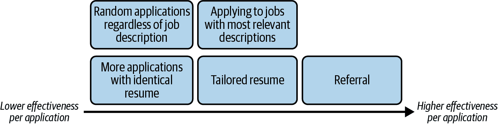
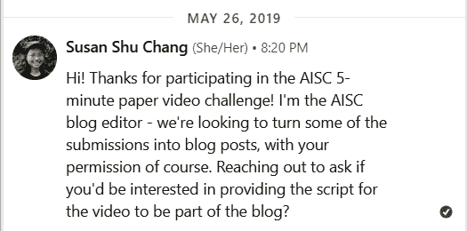
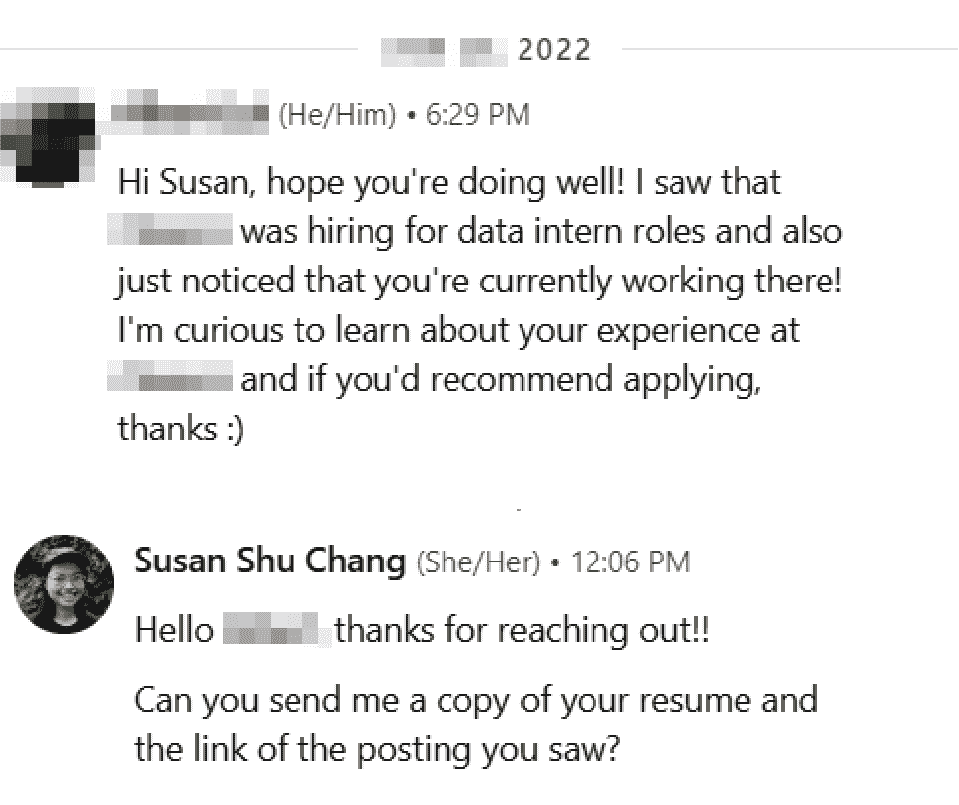
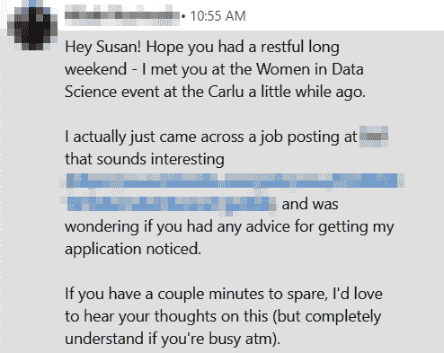
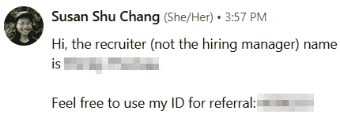
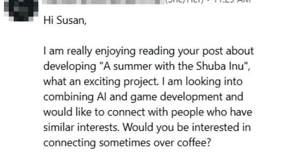
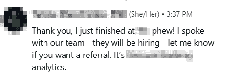
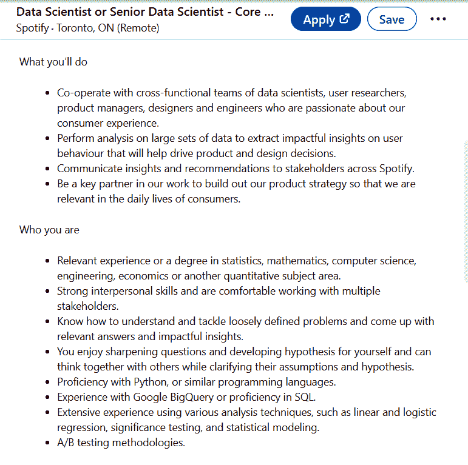
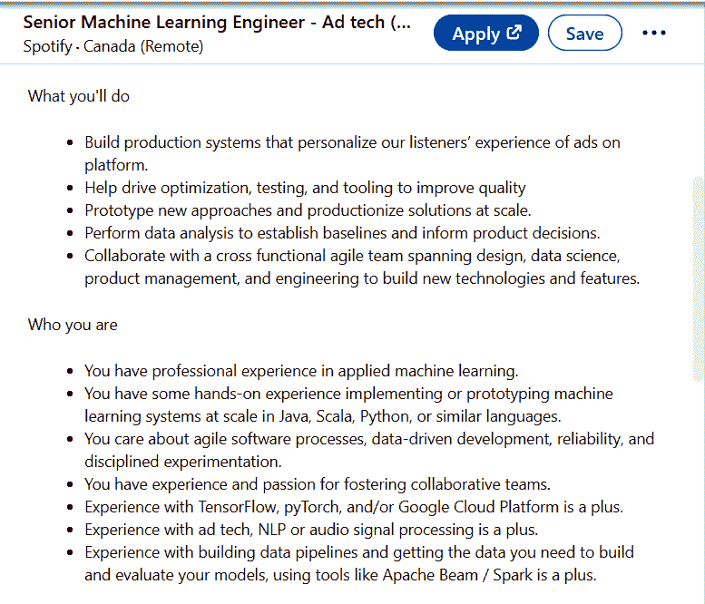

# 第二章：机器学习职位申请和简历

要在机器学习领域成功获得工作机会，您不仅需要为面试本身做好准备，还必须首先获得面试机会。在申请过程中，有许多机会可以使您的个人资料脱颖而出，并增加您获得的面试数量。如果您目前在应用程序中缺乏回调，本章将教您如何优化申请，以获得更好和更相关的结果。如果您刚开始，本章提供了一个深入的步骤指南，将帮助您避免错误。

# 工作在哪里？

您想找一个机器学习工作，但在哪里？您可能知道像 LinkedIn 或 Indeed 这样的在线招聘网站，但我和无数其他机器学习专业人士也在其他地方找到了工作。表 2-1 提供了其他工作网站和了解工作列表的非正式方法的列表。

表 2-1\. 了解带有示例的工作列表的方法

| 如何了解工作列表 | 示例 |
| --- | --- |

| 在线工作申请

（所有类型）| [LinkedIn](https://www.linkedin.com)（“简易申请”选项很方便） [Indeed](https://www.indeed.com)

[Dice](https://www.dice.com)

直接在公司网站上，因为它们可能不会发布到主要的招聘网站

区域性工作网站，如果您所在地区不流行国际网站如 LinkedIn

在社区活动期间分享的职位列表或在 Slack 或 Discord 频道上 |

| 在线工作申请

（专注于初创公司）| [Wellfound](https://wellfound.com)（以前称为 [AngelList Talent](https://www.angellist.com/)） [Work at a Startup](https://www.workatastartup.com)

区域性初创企业招聘网站

直接在初创公司的职业页面上 |

| 网络 | 口口相传 信息面试

咖啡聊天

冷消息 |

# 机器学习职位申请指南

本节将引导您选择求职策略，以下的简历指南将帮助您创建优化的职位申请。

## 每次申请的效果

有些人成功地找到工作，完全没有任何人脉。事实上，我的第二份工作是通过直接申请获得的；当时我并不认识任何在该公司工作的人。但从概率的角度来看，如果我只申请那些没有任何推荐的公司，我将需要发送更多的申请和进行更多的面试。以下是我用来评估这一点的心理方程式：

> 应用程序 × 每次申请的效果（EPA）→ 面试邀请

无论每次申请的效果如何，您发送的申请越多，获得面试的机会就越大。不分青红皂白地发送大量申请——一种“喷射和祈祷”的方法——可能能够弥补低效果每次申请。

另一方面，如果您希望进行相同数量的面试但提交更少的申请，您平均需要增加您的 EPA。通过筛选适合的工作职位或调整您的简历可以提高您的 EPA。您将需要更少的申请来获得相同数量的面试（大多数情况下）。

那么您应该选择哪种策略？您*不必*获得推荐或调整简历，但在这种情况下，需要准备更多的申请。这是您的选择！如果您更喜欢大规模申请的方法，请随意跳过以下部分，但我建议您阅读它们。

以下是一些增加您的 EPA 的策略，我将在接下来的部分详细阐述（见图 2-1）：

获取工作推荐。

获得 ML 工作的推荐并利用网络增加被推荐的机会。

在申请之前审核工作。

如果您投入时间寻找并申请与您的技能更适合的工作，这可以增加您的 EPA。

调整您的简历。

在审核工作时，您可以重新排列您的简历，突出显示与目标工作最相关的关键词和技能。

###### 图 2-1\. 每个申请的工作申请和其有效性。

## 工作推荐

在第一章中，我提到了工作推荐可以帮助您脱颖而出，“简历堆栈”顶部，甚至可以确保您获得招聘人员的电话。在某些情况下，如果您是推荐的候选人，您甚至可以绕过初审电话，直接进入面试流程的后续阶段，如图 1-11 所示。在本章中，我提到了推荐是改善您的 EPA 的一种方式。我个人认为，在可能的情况下利用推荐是非常好的。这确实需要推荐您的人愿意冒风险，因为通过推荐您，他们暗示您一旦被雇用就会取得成功。

以下是三个例子，附有截图，展示了寻求推荐，咖啡聊天导致推荐以及信息面试。

###### 警告

一个常见的误解是推荐是获得工作的万灵药。这不是真的，因为推荐通常只能让您通过第一轮流程；其余的取决于您自己。随后的面试轮次仍然会对您进行严格考验。

### 工作推荐示例 1：成功的实习生网络和外展

这是我曾经推荐给我的团队的一位实习生候选人的例子。我们是在他参加我共同组织的一个名为 AISC 的 ML 期刊俱乐部聚会时认识的（图 2-2）。在我主持的另一次活动后，我联系了他，因为他做了一个很棒的五分钟“闪电”演讲。我们进行了简短的交流，结束了对话，然后两年后我们再也没联系过！

###### 图 2-2\. 推荐示例 1：在 ML 期刊俱乐部会议后的简短对话。

后来，在 2022 年，他联系我聊了聊我当时工作的公司的一个角色。因为我认识他是几年前参加 ML 期刊俱乐部会议时的，还记得我们的对话，所以我很高兴推荐了他（图 2-3）。

###### 图 2-3\. 推荐示例 1：推荐一位实习生职位候选人。

这是一个很好的例子，说明在你彼此认识并且是职业熟人的情况下，可能会产生推荐、面试或职位提供的机会。

### 职位推荐示例 2：热情接触以了解更多关于招聘岗位的信息

这是另一个“热情”¹接触的例子（图 2-4）。这位朋友给我发了一条消息，提到我们都参加过的一个会议。我们在会议上只是简单交流了一下，但即使是这样的提到也足以引起我在拥挤的收件箱中的注意。我同意快速通话并回答一些关于招聘岗位的问题。

###### 图 2-4\. 推荐示例 2：热情联系询问职位招聘。

在电话中，我询问了这个人的过去经验。听完他们相关的数据经验后，我主动提出了推荐，即使他们还没有明确要求过（图 2-5）。

###### 图 2-5\. 推荐示例 2：我推荐一位求职者的信息。²

这里是我同意与应聘者交谈并推荐他们的一些理由：

说明一种联系。

他们提到了他们以前见过我的地方。在某些情况下，求职者可能会提到阅读过我的博客或看过我演讲。他们可能会简单地提到看到我在 LinkedIn 上的一篇帖子（关于哪一篇很重要）。

要具体。

他们链接了招聘信息或者提到了为何联系他们的详细信息。有时候我会收到非常泛泛的问题，比如“我如何进入数据科学？”在这些情况下，即使我与他们聊一次咖啡，我也会重复和重复他们可以从我的博客文章或这本书中获取的信息！电话或会议应该用来进行更深入的交流。

礼貌可以走得很远。

他们既不咄咄逼人也不失礼，并且非常尊重我的时间。

实习生候选人在工作推荐示例 1 中也展示了这些特质。

### 工作推荐示例 3：冷门信息

这里有一个例子，有人之前我没有见过主动要求进行了咖啡聊天（图 2-6）。请注意，她提到看到了我写的特定 LinkedIn 帖子，这也印证了*与你联系的人建立联系*的建议。这条消息是关于一般性的交流，而不是特定的工作岗位，但她提到了人工智能和游戏开发两个我感兴趣的具体领域，这足以促使我安排一次会议。因为当时我们都在多伦多市中心地区，所以这相对容易实现。

###### 图 2-6\. 推荐示例 3：咖啡聊天请求。

在会议期间，我们深入讨论了各种机器学习和人工智能主题以及游戏开发，这让我对他能成为我推荐的人感到有信心。事实上，我的团队当时正在招人，这一点我也提到了。不幸的是，她最近刚开始了一份新工作，所以我无法推荐她，但在一个 UNO 逆转³的情况下，她提出要推荐*我*给她的新雇主（图 2-7)！

###### 图 2-7\. 推荐示例 3：UNO 逆转推荐提议。

## 社交网络

从这三个例子中可以看出，你可以通过一条周到的消息获得推荐。参加活动和会议可以增加你在需要时可以联系到的温暖联系人的数量。

行业内许多经验丰富的领导人都支持推荐。以下是一些例子：

> 大量的招聘是通过诸如给经理发送冷邮件、通过推荐人介绍或者参加社交活动等渠道进行的。事实上，我建议我的学员们除非绝对必要，否则不要通过招聘网站或公司网站申请工作。
> 
> Bedrock AI 的 CTO Suhas Pai
> 
> 在某些角色中，如果你是一个值得信赖的推荐人，你可以跳过简历筛选和招聘人员的电话面试。
> 
> 亚马逊高级应用科学家 Eugene Yan

那么，你如何“社交网络”呢？当我还是学生时，这个术语*非常*让我困惑。“说我去了会议和聚会，那又怎么样呢？人们不会仅仅因为见了我一次而推荐我去工作…” 如果你这样想，那么你可能是对的——人们通常不会在没有理由的情况下推荐你。

幸运的是，许多公司，尤其是大型科技公司和大公司，提供推荐奖金。这意味着如果员工推荐的人被雇佣了，他们会得到金钱或奖励。通常会有一个要求，新员工必须至少留任六个月，以防止滥用奖励制度。推荐计划激励员工在他们的社交网络中找到人才，并推荐到职位空缺。

此外，机器学习目前需求量很大，所以有些公司甚至难以招聘到合适的人才。许多公司和团队通过朋友、前同事、大学同学等推荐合格的候选人。因此，即使你的人际网络不强（目前），人们也有动机留意合适的求职者。

我使用的步骤如下：

1.  参加现场或在线的聚会、会议等等。

1.  参加活动（通常是免费的）。

1.  每次活动时，只认识一个新人。

有了这个小目标，随着时间的推移，你会认识更多来自不同公司的人。即使每月只参加一次活动，一年下来你也会认识 12 个人，未来当你申请他们公司时，他们也许会愿意为你背书。或者你甚至可能会认识到创业公司的创始人，因为他们认识你，更容易雇佣你。

社交网络是一个长期投资，回报将在长期内显现。人们有一个误解，即社交网络仅仅包括这种情况：你*先*找到一些你感兴趣的工作，然后联系相关公司或职位的人。如果你只在已经申请时才进行社交网络，你将会感到压力重重，时间也很紧张——更不用说，这可能已经太迟了。

如果你已经认识了其他公司的人，甚至是你的大学校友、训练营等等，当你看到他们公司的招聘信息时，你可以联系他们。如果你不确定如何开始，可以参考上一节成功案例。

###### 小贴士

即使你认为自己并不“擅长”结交新朋友，这也是一种可以学习和实践的技能。设定一个小目标，在任何社交活动、聚会或会议上只认识一个新人。这确实是一个累积效应。

除了获取推荐之外，网络拓展还有强大的好处。以下是我作为一名新毕业生的一个例子：我在参加会议和聚会时，在申请他们的职位之前，就已经见过两位不同公司的最终面试官（董事级别）。⁴ 我得到了两个职位的提供。他们都没有给我推荐，但我仍然得到了网络拓展的好处，因为他们都曾经与我互动过；这是温暖的联系，而不是我在面试中第一次见面的面试官。

# 机器学习简历指南

我提到调整您的简历作为提高您的 EPA 的方法，但无论您是否计划调整您的简历，您仍然需要至少一个版本。本节将指导您创建您的第一份简历。如果您已经有了一个简历，您可以浏览本节以获取建议和最佳实践，然后转向您想要调整的简历部分或其他感兴趣的部分。

## 对过去经验进行清单

在开始撰写简历之前，您应该先列出您过去做过的事情清单。这个清单包括过去的工作经历，在学校或工作中的机器学习项目——任何与机器学习和数据科学相关的内容。如果您在机器学习之外没有个人或学校项目或工作经验，您仍然可以进行清单；这将帮助您确定您当前技能与目标机器学习角色之间的差距。

例如，当我是一名新毕业生（工作经验不到一年时），我的清单看起来是这样的：

大学

+   关于 Steam 上视频游戏价格的计量经济学研究论文，使用了我自己爬取的数据

+   关于 Reddit 参与度的计量经济学研究论文，使用了我自己爬取的数据

第一份全职工作

+   我建立的 ML 流失模型

从您在“练习 2-1”中列出的清单中，选择三到五个您认为与一般机器学习角色相关的经历。再次参考表 1-3，即机器学习和数据技能矩阵。对于您目标的机器学习角色，您列出的经历目前是否相关？如果您觉得自己没有三个相关的机器学习或数据经历，您可以暂时用工作或学校经历填充三个经历，这些经历最为重要和“令人印象深刻”。不必担心在此阶段完美无缺；您可以随时回到您更长的清单中再选择一个。

接下来，列出与这三个主要经历相关的所有事项：这不仅包括与编码、机器学习或数据相关的技术部分，还包括软技能，如向团队呈现结果或组织团队聊天以协调队友。

继续使用我自己最初的未经过修正的清单的例子，这里是我会包括的内容：

大学生经历示例

关于 Reddit 参与度的计量经济学研究论文，使用我自己爬取的数据

+   使用 Python 爬取 Reddit

+   使用 Python 清理数据

+   使用 Python、Stata 进行统计建模

+   使用 Python 可视化结果

+   使用 LaTeX 创建项目演示

+   向 10 人和教授的研讨班介绍项目概述和结果

第一份工作（少于一年经验）示例

我的第一个 ML 流失模型

+   使用 SQL、Python 进行探索性数据分析（EDA）

+   使用 SQL 清理数据

+   使用 SAS 在表格数据上训练逻辑回归模型；在 SAS 中创建集成模型

+   运行模型评估并分析结果，使用 SAS、SQL、Python

+   使用 Excel、PowerPoint 创建简化和更干净的可视化用于演示

+   使用 PowerPoint 展示结果

+   与 ML 工程师合作将模型投入生产

## 简历部分概述

现在你已经有了过去经历的起始列表可以完善了，让我们来看看简历的各个部分。以下是你简历的核心部分：

+   经验

+   教育

这些是可选部分：

+   技能摘要

+   志愿服务

+   兴趣

+   其他部分（你选择的名称）

别着急填写可选部分；这取决于你核心部分的内容及其是否已经很长。

### 经验

使用你在“Exercise 2-1”中提供的前三次经验，你还应该收集以下信息：

+   职位名称

+   工作的地方

+   你在那里工作的时间段（例如，2018 年 5 月至 2021 年 11 月）

+   来自“Exercise 2-2”的责任条款符号列表

+   你地区、行业或工作文化中可能期望的任何其他信息

你*初步*简历中的一个部分示例可能是这样的：

数据科学家，ARI 公司（2021 年 5 月至今）

+   设计和开发用于网页个性化的协同过滤模型

+   开发 ETL⁵ 生产代码，根据用户规范汇总预测模型分数

+   开发预测集成模型，优化营销活动规划和触点

现在还不需要按照模板格式化你的简历；先把内容确定下来，再处理格式（有时候只加一个词就会破坏你精心设计的布局，修复起来比值得的时间更多……）。注意，我会在本节末尾链接一些常见的模板。

以下是一些提高你初步要点的提示：

使用动词来开始句子。

例如，不要写“使用 TensorFlow 进行图像识别”，而是写“*使用* TensorFlow 开发图像识别模型”。（动作动词斜体用于说明；在简历上不需要斜体。）这可以帮助澄清你在经历中做了什么，而不仅仅是结果（这很可能是团队努力的结果）。

###### 提示

您可以从华盛顿大学获得更多动词的列表：[简历写作动词。](https://oreil.ly/NsWMe)

详细说明您的影响，最好是以量化且易于理解的方式。

[*原文*] 为网页个性化设计和开发协同过滤模型

[*修改后*] 为网页个性化设计和开发协同过滤模型，使参与率比基准提高了 2 倍

添加您使用过的工具和编程语言。

[*原文*] 为网页个性化设计和开发协同过滤模型

[*修改后*] 使用 PySpark 和 MLlib 为网页个性化设计和开发协同过滤（ALS）模型，使得参与率比基准提高了 2 倍

在某些时候，字数可能会太长，您必须删减所写的内容。尝试调整措辞，看看保留哪些是最重要的信息。

### 教育经历

这些点与经验部分非常相似；您还应包括以下信息：

+   您所就读的学校/机构

+   地点，国家（可选但建议）

+   您在那里学习的时间段（例如，2018 年 5 月至 2021 年 11 月）

+   与机器学习或数据相关的主要项目和任务清单

+   您所在地区、行业或工作文化中可能期望的任何其他信息

以下是此部分可能看起来像的一个示例：

滑铁卢大学

加拿大滑铁卢，2010 年至 2015 年

+   使用 Python 和 pandas 清理和抓取销售数据

+   使用 ARIMA 时间序列模型预测的视频游戏价格

现在您已经有了核心部分，请查看可选部分。您的核心部分是否有很多项目和经验？如果是这样，那么您可能没有空间添加志愿服务。例如，当我刚刚毕业时，我添加了技能总结和志愿服务经验部分来填充空间，因为我几乎没有任何经验。

###### 提示

如果您有其他经验，建议您先专注于完善现有的要点，然后再开始填充与简历无关的内容。太多的附加内容可能会分散招聘者和招聘经理注意力，而忽略了您最重要和最重要的技能。

### 技能总结

技能总结是列出您曾接触过的大量编程语言和框架的地方。请注意：不要夸大太多；如果您在这里列出了一个与您在要点中详细描述的不符合的框架或库，技术面试官可能会要求您详细说明。您简历上列出的每一项都可能被问及。以下是一个例子：

技能总结

+   Python

+   TensorFlow，PyTorch

+   NumPy/pandas，Polars

+   C++

+   以及其他...

### 志愿服务

对于这一部分，你可以只用一行的项目符号，而不是将它们归类到一个经验组中，除非（1）你的志愿经历非常重要和实质性，在这种情况下，我可能会将其放在经验部分下，或者（2）你真的想填充你的简历。这里有一个例子：

志愿服务经历

+   2023 年 SIGIR 会议志愿者，台北

+   2020 年多伦多机器学习峰会志愿者

+   等等……

### 兴趣爱好

有些人建议包含这一部分，以展示你在工作之外还有一些兴趣爱好。在我看来，一般规则是，如果空间不够，可以放弃这些可选部分而不会产生后果。另一方面，如果你的兴趣爱好像国际象棋大师或马术杯赛冠军这样酷的东西——不管你为何感到自豪——你可以保留它。当我还是学生时，我在这个领域填写了以下内容：

兴趣爱好

+   Team Fortress 2 废金属交易者，2012–2015

+   AISC（前多伦多深度学习系列）博客编辑，2019 年

+   等等……

是的，我在简历中加入了与视频游戏相关的兴趣爱好。是的，我确实在 Team Fortress 2 这个在线游戏中交易了废金属，一种非正式的在线货币⁶。这背后有整个经济系统。是的，这确实是因为我必须填充空间，没有其他原因。然而，没有人问我这个。

### 附加简历部分

你可以选择添加其他部分，其格式基本与志愿和兴趣部分相同。如果你有显著的兴趣爱好、志愿服务等等，更名为它们自己的部分可能更合适。例如，一旦我开始公开演讲，我就有足够的条目来称得上新部分，取代我简历上的志愿服务部分：

公开演讲

+   O’Reilly AI Superstream（MLOps）主题演讲嘉宾

+   PyCon DE & PyData Berlin 主题演讲嘉宾

+   等等……

至此就结束了这一部分。像往常一样，请确保检查是否有任何关于你应该包括的信息的地区性期望。我还在本章末尾包含了与简历相关的常见问题解答。

## 将简历量身定制到你所期望的角色

现在你已经有了基本的简历，让我们看看如何为常见的机器学习职位标题量身定制它（参见 图 1-8）。如果你寻找的职位标题不在 图 1-8 中，你可以将其映射到机器学习生命周期（参见 图 1-5），并对类似角色使用相同的提示。请记住，你不必为每一个求职岗位定制你的简历，但即使只为你感兴趣的最常见的职位标题定制，你平均可以提高你的 EPA。

如果你回顾技能矩阵（Table 1-3），你可能会明白为什么调整简历很有用：如果你具备“编程工具”和“统计学”技能，你可能可以申请数据科学家和 MLE（机器学习工程师）角色，但要突出两种角色之间的附加技能差异，修改一些重点将有助于更好地营销你的技能。机器学习技能矩阵（Table 1-3）帮助你更精准地匹配适合你过去经验的职位标题，但此后，你的工作搜索取决于实际的职位描述。

一旦你开始查看职位描述，有时你可能会看到涉及到与数据分析师角色（“产品”数据科学）映射的 DS 职位，有时工作职位可能更多地映射到矩阵上的 MLE 角色。

根据我的经验，我的全职角色一直是数据科学家，但我一直专注于构建和部署 ML 模型到产品中或改进 ML 产品。根据矩阵，我从 MLE 到应用科学家，甚至一些与 MLOps 相关的角色都做过。

现在假设我在网上浏览工作，你在我身边看着。我将搜索“Spotify 机器学习”，并开始点击结果，从 Figure 2-8 的示例开始。

###### Figure 2-8\. Spotify 数据科学家职位贴文的屏幕截图（通过 LinkedIn）。

### 职位贴文示例 1：数据科学家

在阅读这篇数据科学家的招聘帖子（Figure 2-8）后，我记录下我认为重要的内容：

+   与利益相关者合作，沟通（多次提到并置于重要的要点之首）

+   执行数据分析，使用 BigQuery 或 SQL

+   一些统计建模，如线性、逻辑回归

接下来，我将回顾我的简历经验——例如，我为以前的工作做的第一个 ML 流失模型的要点，并将其映射到数据科学家的职位贴文上。如果你还没有完成你的简历，你可以使用你为“Exercise 2-2”制作的清单清单。

我最初记录下的从我的第一个 ML 流失模型（见“Take Inventory of Your Past Experience”）中最相关的要点是：

+   使用 SQL、Python 执行探索性数据分析（EDA）

+   创建简化和更清晰的可视化以在演示中使用 Excel、PowerPoint

+   使用 PowerPoint 呈现结果

基于机器学习生命周期，感觉这个角色更注重报告和数据分析（Figure 1-5 中的步骤 D），所以在调整简历之前，我应该确保我对生命周期的这部分感兴趣。

如果我对申请这个数据科学家角色感兴趣，我会专注于从职位描述中列出的三个要点，并缩短或删除其他项目。回想一下你为“练习 2-2”创建的清单；如果您有其他与此工作职位更相关的经验，请将其替换。如果您当前的简历与此工作职位相当相关，则可以保持不变。

如果您删除了一些不太相关的内容，请注意简历上剩余的空间。您删除的内容取决于简历上的剩余空间！现在我有了更多的经验，所以我更倾向于删除更多，而早期我选择添加更多的要点，几乎从不删除要点。只要核心内容在那里，删除东西是可以的；如果面试官对我如何训练更复杂的 ML 模型感兴趣——我在工作描述中删除了一个要点，因为它不在工作描述中——他们可以在面试中问我。

### 职位示例 2：机器学习工程师

让我们继续滚动搜索结果“Spotify 机器学习”，看看另一个在图 2-9 中的职位发布。

###### 图 2-9\. Spotify 机器学习工程师职位通过 LinkedIn 的截图。

就像第一个例子一样，我通读了机器学习工程师的职位描述，并记录下我认为重要的内容：

+   在生产中实现 ML

+   原型设计

+   测试和工具，平台改进

+   与跨职能团队合作

基于这些要点，这个角色似乎更侧重于 ML 模型训练，其中一些部分在 ML 基础设施上，分别由机器学习生命周期中的步骤 B 和 C.1 说明（参见图 1-5）。

如果我对申请这个机器学习工程师角色感兴趣，我会专注于这三个相关的要点，并缩短或删除其他要点。为此，我将回顾“我第一个 ML 流失模型”示例中的七个要点，并将其映射到 MLE 职位。最相关的要点是：

+   使用 SAS 训练模型

+   使用 SAS、SQL、Python 运行模型评估和分析结果

+   与 ML 工程师合作将模型投入生产

+   使用 SQL 清理数据

你为"练习 2-2"创建的清单可以在不同类型的角色中重复使用，而不需要重写任何内容。记住，沟通和协作技能对公司也很重要，你会注意到这些技能在各种工作职位中经常被列出。不要忘记在至少一个简历项目符号中包含你与其他团队合作或向另一个组织展示工作的地方。对于那些认为自己没有足够“机器学习经验”的人来说，这尤其重要！你分析数据以及沟通数据的经验非常重要，可能比你想象的更能增强你的简历。

我建议在你的工作经历项目符号中清楚地列出你在过去角色中使用过的技术。你可以将它们内联列出或者放在项目符号的末尾，具体取决于你的空间和最简洁的方式。另外，如果有空间，可以在简历中包含一个技能部分。

## 最后的简历润色

现在你已经专注于精心制作和完善你的简历了一段时间，再稍微放开点：你申请的公司和团队之所以发布这份工作，是因为他们团队中存在空缺，希望找到能填补这个空缺的人。

因此，你的申请和简历应该专注于说服招聘委员会，你是一个可以填补这个空缺并成为他们团队的一部分的候选人。这包括：

+   真实和相关的经验，你可以应用到工作中，包括可转移的技能：这些技能虽然不完全相同，但可以在不同领域之间轻松转移。

+   软技能——你可以与团队中的人们良好合作，并与更广泛的人群沟通，比如产品经理等等。

+   技术技能——你可以做出个人的技术贡献。

+   证据表明你可以适应现有项目或获得足够的背景知识来启动新项目。

这些技能简洁地描述在我们在第一章中探讨的机器学习角色的三大支柱中。

你可以在简历中展示许多技能和经验，但不是所有的都要展示出来。例如，快速浏览一下你的简历：它完全没有任何团队合作的例子吗？还有其他一些可以帮助展示你能够快速学习的点（如果你没有太多相关工作经验）吗？

如果到目前为止一切看起来不错，那就开始申请吧，但如果不行的话，花点时间继续改进你的简历。

# 申请工作

现在你已经量身定制了你的简历，是时候开始申请了！去工作看板（你可以使用本章开头列出的那些看板作为灵感）。我认为，即使你不确定你的技能和简历是否*完美*，也可以开始申请；如果你申请了几个工作岗位，但没有接到招聘人员的回复，那就意味着你的简历或技能还需要进一步改进。你可能会发现，继续完善简历并花时间获取推荐足以提升你的 EPA 并开始接到电话。这是一个学习过程，即使一开始并不完美，目标是通过提交的申请数量或更有效的申请来获得回应。

## 筛选工作岗位

希望你已经完成了前面的练习，这不是你第一次查看你感兴趣的 ML 角色的工作描述。如果你筛选出你正在申请的工作，你可以增加获得面试的机会。根据我的经验，这一步最好与定制简历结合使用，因为如果你不定制简历，你最好大量申请，希望你碰巧申请到最适合你的工作。那么你如何过滤工作？

## 将你的技能和经验映射到 ML 技能矩阵

还记得在第一章介绍的各种 ML 角色吗？让我们过滤掉噪音，这样你就可以将你的技能重点营销给最符合你经验的角色。

参考图 1-8 中的常见 ML 职称：哪些角色最适合你？如果你最感兴趣的工作目前你没有经验，你有更好的主意在哪里集中学习来弥合这个差距吗？⁷

在技能矩阵中，可以一目了然地看到，数据分析师角色与数据科学家角色有重叠的技能，而后者又与 MLE 角色有很多重叠。好消息是，只要在你的技能清单中具备一些这些技能，你就可以申请其中一个或多个职位。

别担心，入门级角色只要有列出的一两项技能，你就可以申请这些工作。对于新毕业生来说，拥有 ML 技能柱中的一支较强技能而非全部是完全正常的，大多数雇主都能理解并欢迎这一点。虽然将你的技能映射到矩阵只是过程的一部分，但现实是，这个矩阵还要视情况而定。这就是为什么本章的下一部分要求你分析一个真实的工作岗位。

我见过很多求职者遇到这种情况：“这个职位的名称是数据科学家；为什么面试的问题却是关于数据工程（或插入意外内容）？”请记住，一个 ML 职位取决于公司或组织以及角色所在的团队，还有角色在机器学习生命周期中的位置（参见图 1-3）。

举个极端的例子，我曾经参加过一个“数据科学家”的面试，他们没有问任何统计或机器学习理论问题，也没有问任何与数据相关的问题。相反，面试包括几轮 LeetCode 风格（编程测验）的编程问题。⁸ 我想知道他们如何判断我是否是一个在数据方面核心工作围绕的优秀 ML 从业者，当问题完全来自通用软件工程师的循环时。事后看来，这可能是因为那个角色实际上根本不负责训练 ML 模型。

由于职位名称通常具有歧义性，作为求职者很难决定准备哪些主题。当然，你可以花时间复习 ML 理论以及进行一些编程测验，但是你的时间很紧张，你可能在准备一些可能根本不会被问到的东西。

我见过一些求职者因为申请了“错误”的角色而被拒绝，这并不是因为他们不是强大的 ML 候选者，而是因为他们申请了与他们实际能成功的职位名称相同的角色。关键在于培养如何根据职位描述分类职位名称的直觉，并找到适合你技能的最佳角色。

有些职位名称出现在多个部分中，这没关系！当它引起混乱和拒绝时，这就不太好了，但是在本章结束时，你将能够更好地审查和定位它们。

当我申请工作时，我会看一眼职位名称，但为了确保我申请适合我的技能的正确工作，我会采取以下步骤：

+   查看职位描述。

+   对职责进行分类；它在机器学习生命周期的哪个阶段（参见图 1-4）？

+   确定职位名称和职位描述是否足够匹配；例如，如果职位名称是机器学习工程师，但描述使其看起来有点像数据工程角色（而我过去的经验与此不相关），我会放弃这个角色。

## 追踪申请情况

跟踪申请情况可能是值得的，这样更容易记住你申请过的工作。如果你通过了简历筛选，并至少达到了招聘者筛选阶段，在他们告诉你他们会让你知道的时间范围内，跟踪这些申请可以帮助你记得跟进。

我过去跟踪了大部分的申请，但老实说，我现在认为你只应该跟踪那些至少通过了简历筛选的申请。特别是如果你大量申请与 ML 相关的工作，跟踪你的申请会浪费额外时间，而不跟踪它们不会影响你的通过率。跟踪申请可能有用的一个场景是，如果你计划在个人总结或稍后可视化你的旅程和统计数据时使用。

我认为跟踪我已经面试过的人是有用的，这样我可以在有关团队或公司的更多问题时与他们联系。如果几年后我再次与同一家公司面试，我也可以联系他们。记住，网络是一项长期投资，具有长期的展望！

至于跟踪申请和面试的工具，我认为 Google 表格、Microsoft Excel 或其他简单的电子表格工具完全够用了。

表 2-2 是我在 Google 表格中跟踪申请和面试的示例（名称是虚构的）。

表 2-2\. 跟踪申请和面试的电子表格示例

| 申请日期 | 公司 | 职位发布网址 | 面试类型 | 面试日期 | 面试官 | 电子邮件 | 备注 | 结果 |
| --- | --- | --- | --- | --- | --- | --- | --- | --- |
| 2023-08-02 | ARI Corp | https://[url-to-job-description] | 招聘经理：行为和过去项目深度挖掘 | 2023-08-15 | 雪拉（招聘经理） | xue.la@domain.com | 招聘人员表示这是广告收入 ML 团队 | 待定 |
| 2023-08-03 | Taipaw AI | https://[url-to-job-description] | 招聘筛选人员 | 2023-08-05 | 麦克斯（招聘筛选人员） | max@domain.com | 询问关于 PyTorch 经验 | 已通过 |

当你收到一些工作提议后，可以回顾一下你进行了多少次面试。还有一个好处是，有一个相关面试官及其电子邮件的列表，以防几年后你想联系他们。然而，我听说有些人跟踪他们的申请-面试-提供比例会使他们的情绪更低，而不是更高，所以这取决于你。

# 其他求职材料、证书和常见问题解答

我已经浏览了简历指南，但仍然有一些与求职相关的额外组件，如项目组合和在线认证。本节提供了一些最佳实践和常见问题解答。

## 是否需要项目组合？

项目组合基本上是项目示例。作为学生，我有几个副项目（即个人项目）。我把代码放在 GitHub 上，并创建了一些图表/可视化效果。GitHub 是一个很常见的项目托管地点，但有些候选人会将他们的项目组合发布为网站，比如 Heroku 网站。

记住，您的申请和面试的目标是说服雇主您是这份工作的优秀候选人：您具备技能或者可以轻松地接受培训以胜任工作。对于初级、入门级和新毕业的候选人：如果您还没有太多的工作经验，但有项目作品集，这可以帮助展示您的技能，并增加招聘经理和招聘团队对您能力的信心。

但是，如果您已经有了丰富的工作经验，拥有项目作品集可能只会有边际回报；在面试中，雇主更愿意讨论您过去的工作、案例研究、以及过去项目的技术深入分析等。您可能仍然会因为在 GitHub 上有项目作品集而受益，因为您在过去工作经验中开发的大部分代码和模型可能是专有的，因此您可能没有可以分享的代码样本。在这种情况下，展示一个 GitHub 仓库中的个人项目或对开源项目的贡献将是有用的。

要使您的作品集发挥作用并增强您的申请效果，您应该使其易于浏览和一目了然地理解。因此，我建议将重要的可视化内容放在 README 中，并清楚标记审阅者应该点击哪些代码文件。

## 网上认证有帮助吗？

当我审阅简历时，如果候选人有过机器学习经验或在业余时间做了机器学习项目（副业项目），我对认证的重视就不会太高。如果候选人没有相关的先前经验，那么相关项目和项目作品集将产生最大的差异。我建议您在获得认证的同时，也同步建立起这些内容。

有些认证比其他认证更有分量 — 再次回忆目标是与其他求职者区分开来 — 因此被视为更全面和实用的课程可能会有所帮助。例如，亚马逊网络服务（AWS）、谷歌云平台（GCP）和微软 Azure 云认证。

###### 警告

如果你的整个简历只包括任何人都可以在一个周末完成的认证，那么你的简历就不会突出显示。

[Interviewing.io](https://oreil.ly/KMxhk)分析了许多求职者的数据，并发现在其数据样本中，将认证放在 LinkedIn 上对候选人的感知质量产生了负面影响。⁹ 他们猜测，更合格的候选人会在他们的个人资料和简历中列出工作经历或相关项目，而那些没有这些经历的较不合格的候选人则会用认证填充他们的个人资料。

无论如何，候选人们发现了通过证书获得成功的途径，尤其是来自非传统教育背景的人。这里有一个关键提示：要注意收益递减。在经济学中，这意味着一旦你完成了更多单位的某事，你会越来越少地从每个后续单位中获益。在这种情况下，如果你已经完成了五个认证，接下来再完成三个或五个认证并不会有太大区别。五个认证在简历上看起来几乎与八个或十个一样。

所以一旦你已经接近完成三到五个在线证书，你应该尝试多样化你的经验：

+   确保你的证书来自信誉良好的来源；如果看起来像是周末完成的，就不要列出它们。如果这样会清空你当前的认证列表，那么你应该继续以下两个步骤。

+   参加更专业领域的认证，比如强化学习或自然语言处理（NLP）。

+   开始一个副业项目，并在 GitHub 上建立一个项目组合。

表格 2-3 总结了我建议的一般决策标准。

表格 2-3\. 你是否应该继续参加在线课程和认证？

| 经验水平 | 在线证书的好处 |
| --- | --- |
| 如果你的机器学习/数据科学简历上没有项目经历…… | 是的，去完成在线课程和作业，并将它们放在你的简历上。 |
| 如果你已经学完了三到五门在线课程，但不确定是否要再学更多…… | 考虑做一个副业项目，这会是更好的简历项目，也会更有效地利用你的时间投资回报率（ROI）。自我评估一下你的编程和统计技能是否已经达到了一个足够的基线水平。 |
| 如果你已经学习了统计学和编程，并且在数据科学简历中有一些相关项目经历…… | 在这里暂停，检查一下你是否有足够的相关项目经历或一个良好的项目组合。如果没有，尽快开始！开始申请工作（或者直接朝着你的职业目标采取行动），而不要陷入自我学习循环中，有时被称为“教程地狱”。面试通常是发现你可以改进的好方法，即使你没有得到这份工作。 |

现在我已经介绍了项目组合和证书，接下来是一些关于简历的额外常见问题解答。

## 常见问题：我的简历应该有多少页？

我经常听到建议将技术类简历控制在一页。总体上，我同意，并且我个人也保持我的简历在一页之内。然而，我可以看到这会根据你的情况而改变。

### 你所在地区的期望是什么？

我曾经面试过许多来自欧洲的候选人，他们有两页的简历，他们通过了简历筛选。在美国和加拿大，我倾向于看到只有一页简历的候选人。在北美的技术行业中，习惯上不会在简历上包含个人照片，但我在查看来自亚洲和欧洲的候选人的简历时看到过这种情况。如果您在其他地区找工作，请通过行业内的人或甚至在线论坛双重检查，看看是否有关于简历长度或需要包含的信息的期望，这些信息我这里没有列出。

### 来自学术界？创建一个适合工业界的简历而不是 CV。

当我在研究生院时，有一种称为*CV*（履历）的简历类型。您可以使用 CV 申请研究生项目、博士后项目、学术教职等。

简历更加侧重于您的研究出版物，并且往往更长；它很少只有一页长。我见过的一些简历格式使用段落比我在行业中看到的项目符号格式更多。如果您已经有了一份简历，您可以将您的研究职责重新构思为项目符号，压缩它们，并在申请工业岗位时重塑为更常见的行业格式。¹⁰

当然，如果您直接将简历提交为您的简历，可能问题不大。我曾看到候选人成功地通过未修改其学术简历就获得面试的情况，但投资一点时间可能会增加您申请工业岗位时的效果评估（EPA）。

## 常见问题：我应该为 ATS（申请人跟踪系统）格式化我的简历吗？

正如我在第一章中提到的，我认为没有足够的证据表明，如果您恰好有两列或一列，或者您使用某种字体，或者您使用 PDF 与 Microsoft Word 文档等等，自动过滤将拒绝您的简历。尽管如此，在这本书中，我假设自动 ATS 拒绝可能是可能的。就我个人而言，我迄今为止一直使用由 LaTeX 制作的两列 PDF 简历，甚至在自动将我的简历解析为文本的在线职位网站上也没有任何问题。

但是，如果您认为简历的格式是阻止您获得面试的唯一原因，您可能有更大的问题要担心。¹¹ 首先，让我们使用本章的观点，看看除了 ATS 过滤之外，还有什么原因可能导致您的简历未被注意：

+   您是否在简历审核人员可以快速看到的部分中包含了最重要和与机器学习/数据相关的信息？

+   您的简历中是否包含大量相关的 ML/数据相关信息？您是否确保您的简历包含与职位描述中重叠的关键词？您的简历中的项目符号是否清晰？您的简历中是否存在拼写错误或明显的错误？请使用[简历检查清单](https://oreil.ly/bfUw_)（在简历资源中列出）进行再次检查。

+   您是否已经尝试过推荐人、调整简历或采取其他能增加您的经验积累（EPA）的行动？

话虽如此，在线表格确实会解析您的简历以查找文本字符串，所以不要发送*.png*文件或使用前卫的格式和字体（除非您申请的是一个特定的设计角色，这超出了本书的范围）。使用从“简历资源”链接的简单模板，甚至从 Google 文档中导出为 PDF。在这里适用 KISS（保持简单，愚蠢）。总之，遵循在线申请门户的说明¹²，并使用本章提到的最佳实践制作您的简历。

# 下一步

您已经学会了如何识别最适合您的 ML 角色，并创建了一个与您所瞄准的 ML 工作类型相关且量身定制的简历。

## 浏览职位发布信息

我的建议是浏览更多的职位发布信息。当我浏览职位发布信息时，我通过简单阅读职位描述学到了很多。例如，我感兴趣的“数据科学家”角色可能与另一位求职者感兴趣的“数据科学家”角色非常不同。回想一下，一个公司的“数据科学家”可能负责数据分析而不是训练 ML 模型的例子。

对我感兴趣的职位描述，我会注意到它们共同具有的要求。可选地，我会尝试创建两到三份定制的简历，可以批量发送到需要相似技能的职位。我之所以有两到三个版本，是因为一个是为那些似乎更需要软件技能的职位描述准备的，另一个是为初创企业职位描述准备的，我可能会强调我的初创经验。

## 辨别您当前技能与目标职位之间的差距

下一步是诚实地审视您当前的技能和您为您所瞄准的 ML 角色构建的简历。当您阅读 ML 职位描述时，您认为您如何可以增强您的简历？在浏览“练习 2-4”中的职位发布信息时，您认为您可以学习更多并添加到您的简历中的关键词是什么？

# 总结

本章重点介绍了机器学习职位申请的步骤。这发生在您获得面试之前，是获得面试机会的关键。您了解到在网上找工作的途径，以及通过人际网络和推荐增加面试机会的一些方法。您还阅读了一些简历的最佳实践，希望您已经创建了简历的初版。如果您已经准备好了，我鼓励您开始申请机器学习的工作，即使您觉得自己的技能或简历还不完美也没关系。

接下来的几章中，我将详细介绍各种类型的面试，涵盖技术面试和行为面试。首先是机器学习算法和理论，这是技术面试的一部分。

¹ 与“冷”相对，双方在接触时互不了解。

² 在我工作的公司，推荐人可以在招聘网站上自行输入员工 ID。然而，我也曾经使用过其他人力资源系统，那种情况下，推荐人（比如我）必须自己把被推荐人输入到系统中。再次强调！务必与您的推荐人确认。

³ 在 UNO 卡牌游戏中，有一张可以改变人们轮流顺序的卡片。它也可以指一种情况，即意图行动或后果被发起者扭转回去！

⁴ 您可以在我的博客文章中详细了解：[“为什么网络就像投资指数基金——我如何通过参加活动遇见多位面试官”](https://oreil.ly/bKizY)。

⁵ *ETL*指的是提取、转换和加载数据。

⁶ 我在思考，我的经济学同好是否会将虚拟在线材料定义为商品货币。在游戏中，废弃金属物品可以用来增强游戏武器，因此它们是有用的。

⁷ 资源和指南将在本书后面介绍。

⁸ 这种类型的面试在第五章中有详细介绍。

⁹ Aline Lerner，“为什么你不应该在 LinkedIn 上列出证书”，[interviewing.io](https://oreil.ly/KMxhk)，更新于 2023 年 5 月 15 日，[*https://oreil.ly/AQi3Q*](https://oreil.ly/AQi3Q)。

¹⁰ 根据*行业工作*，我指的不是像在 Google DeepMind 这样的*研究*职位。

¹¹ 我在网上看到了一些窍门，例如将整个职位描述复制粘贴到您的简历上，将字体变小，将字体颜色设为白色以便隐形，然后导出 PDF，这样 ATS 系统可能会“通过”您的简历。但我还没有看到有人证明通过这些技巧获得了更多的机器学习面试邀请。

¹² Kerri Anne Renzulli，《75%的简历从未被人类阅读——如何确保您的简历击败机器人》，CNBC，2019 年 3 月 14 日更新，[*https://oreil.ly/XwLWw*](https://oreil.ly/XwLWw)。

[*OceanofPDF.com*](https://oceanofpdf.com)
